# （2／2）KV Cache

- 講者：李宏毅
- 影片：[YouTube](https://www.youtube.com/watch?v=fDQaadKysSA)
- 長度：38:33
- 字幕：原始繁體中文字幕

本講說明 KV Cache 如何以記憶體換取語言模型解碼速度，並比較 MQA、GQA、MLA、局部注意力、Cache pruning 與跨請求 prompt caching。時間資料保存在 `source/transcript.txt` 與 `slides/index.csv`。

## 一、KV Cache 基礎

### Slide 1 — KV Cache：用空間換時間 ([Video](https://www.youtube.com/watch?v=fDQaadKysSA&t=0s))

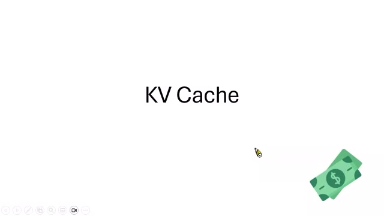

KV Cache 保存已計算的 key 與 value，以 GPU 記憶體換取解碼速度；Cache 與 cash 同音，也確實會直接影響服務成本。

### Slide 2 — 語言模型生成：Prefill 與 Decode ([Video](https://www.youtube.com/watch?v=fDQaadKysSA&t=28s))

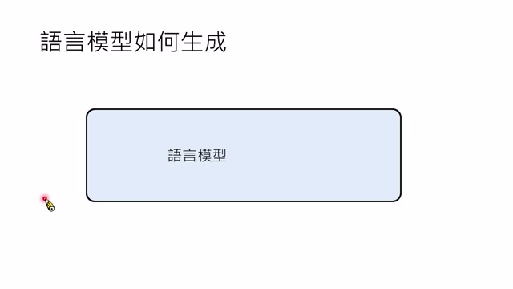

生成分為 Prefill 與 Decode。Prefill 一次處理完整提示；Decode 每次只產生一個 token，並把新 token 接回輸入繼續生成。

### Slide 3 — KV Cache 如何避免重算 ([Video](https://www.youtube.com/watch?v=fDQaadKysSA&t=76s))

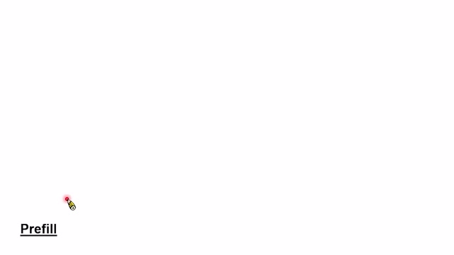

因 causal attention 下舊 token 的 K/V 不會改變，Decode 時只需計算新 token 的 Q/K/V，並讓新 query 查詢已快取的歷史 K/V，避免每步重算整段前綴。

## 二、容量成本

### Slide 4 — KV Cache 會撐爆 HBM ([Video](https://www.youtube.com/watch?v=fDQaadKysSA&t=254s))

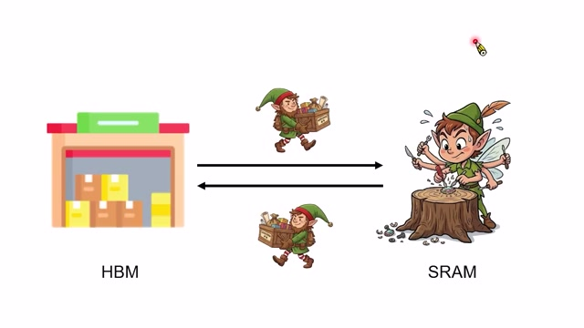

上一講擔心 SRAM 工作台太小；KV Cache 則可能把容量很大的 HBM 倉庫也撐爆。它加速計算的代價是長期保存中間狀態。

### Slide 5 — 序列長度造成線性增長 ([Video](https://www.youtube.com/watch?v=fDQaadKysSA&t=270s))

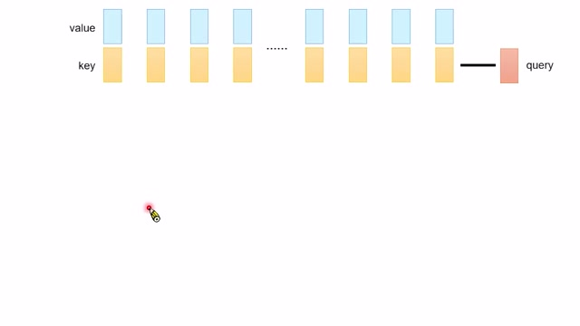

每個輸入或輸出 token 都新增一組 K/V，所以 Cache 容量隨上下文長度線性增加；長對話與多使用者併發會迅速累積。

### Slide 6 — Multi-Head Attention 放大 Cache ([Video](https://www.youtube.com/watch?v=fDQaadKysSA&t=292s))

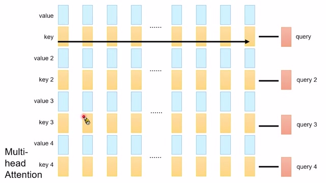

Multi-Head Attention 的每層、每個 KV head 都要保存 K/V。容量大致正比於層數、KV heads、head dimension、序列長度、batch size 與資料精度。

### Slide 7 — Gemma 2 的 KV Cache 容量估算 ([Video](https://www.youtube.com/watch?v=fDQaadKysSA&t=318s))

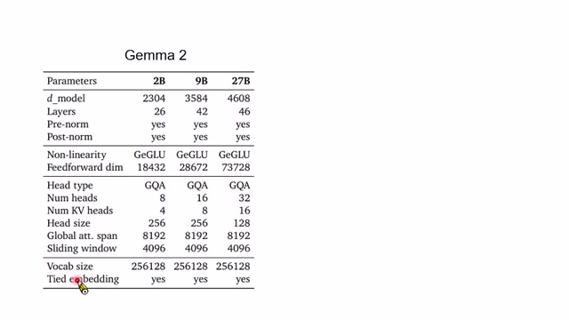

以 Gemma 2 27B 為例，可由層數、KV heads、head size 和精度估算每 token Cache；再乘長度與同時服務人數。投影片也引出它採用的 GQA。

## 三、減少 KV Heads

### Slide 8 — Multi-Query Attention ([Video](https://www.youtube.com/watch?v=fDQaadKysSA&t=458s))

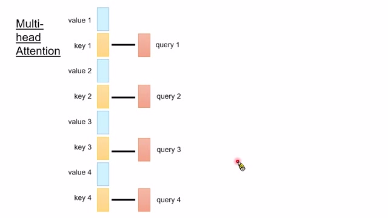

MQA 保留多個 query heads，卻讓所有 query 共用一組 K/V。因只有 K/V 需要快取，容量大幅下降；代價是注意力表達能力可能受影響，且通常需用此架構訓練模型。

### Slide 9 — Grouped-Query Attention ([Video](https://www.youtube.com/watch?v=fDQaadKysSA&t=514s))

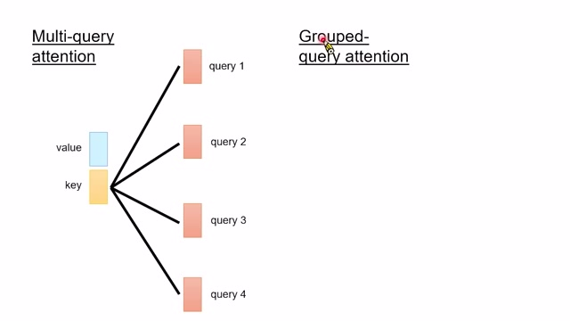

GQA 是 MHA 與 MQA 的折衷：多個 query heads 分組共用較少的 KV heads。它保留部分多頭差異，同時減少 Cache 和記憶體頻寬。

### Slide 10 — Multi-Head Latent Attention ([Video](https://www.youtube.com/watch?v=fDQaadKysSA&t=596s))

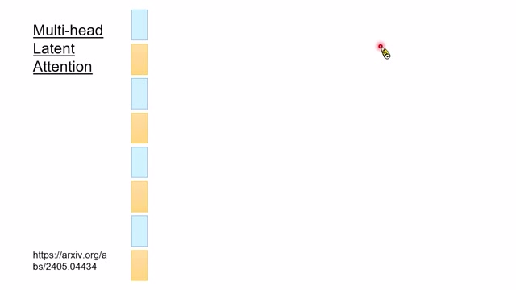

MLA 不直接快取多組 K/V，而把它們壓縮到低維 latent 向量 $c$。模型以 bottleneck transformation 生成 K/V，Cache 只保存壓縮表示。

### Slide 11 — MLA 不需顯式解壓縮 ([Video](https://www.youtube.com/watch?v=fDQaadKysSA&t=680s))

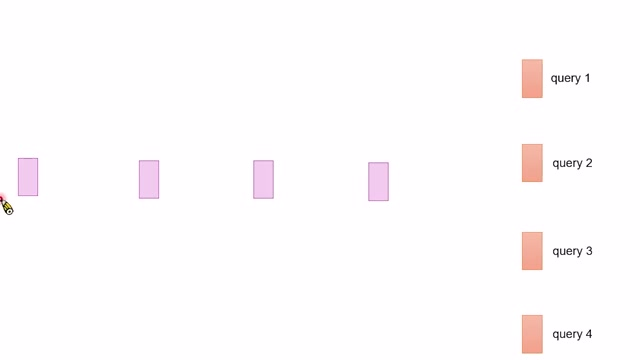

若每次 Attention 都把 latent 完整解壓回多組 K/V，節省的記憶體可能換來過高運算成本。MLA 的關鍵是可以透過代數重排直接使用 latent。

### Slide 12 — 吸收矩陣：在 latent 空間算 Attention ([Video](https://www.youtube.com/watch?v=fDQaadKysSA&t=720s))

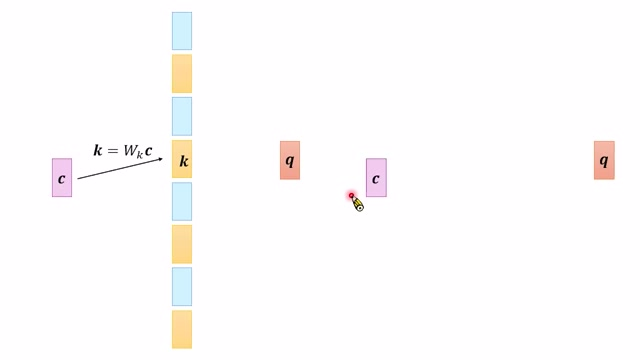

因 $k=W_Kc$，$q^Tk=q^TW_Kc=(W_K^Tq)^Tc$，可把解壓矩陣吸收到 query 端；value/output 路徑也可類似重排。因此无需物化完整 K/V。

## 四、限制注意力範圍

### Slide 13 — Sliding Window Attention ([Video](https://www.youtube.com/watch?v=fDQaadKysSA&t=1010s))

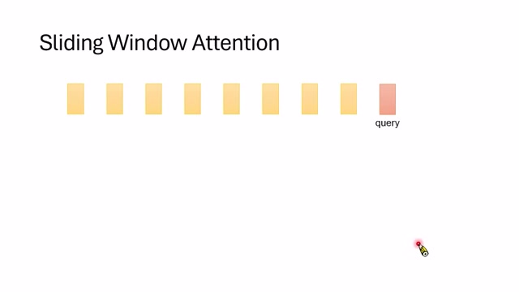

Sliding Window Attention 只保留最近固定窗口的 K/V，使 Cache 容量有上限；但它改變原始全域 Attention，長距離資訊可能被遺忘。

### Slide 14 — StreamingLLM 與 Attention Sink ([Video](https://www.youtube.com/watch?v=fDQaadKysSA&t=1144s))

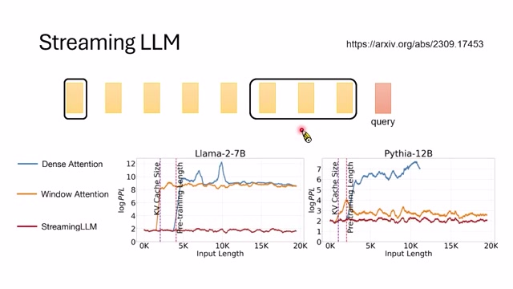

StreamingLLM 發現除最近窗口外，保留序列最前面的少數 attention-sink tokens 可显著穩定長序列表現，甚至不需額外訓練。它仍是近似並犧牲部分歷史。

## 五、KV Cache Pruning

### Slide 15 — Pruning KV Cache ([Video](https://www.youtube.com/watch?v=fDQaadKysSA&t=1384s))

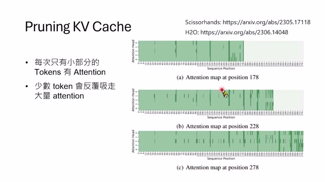

Scissorhands 與 H2O 指出，多數歷史 token 很少再被注意，可依重要性移除 K/V。Pruning 把有限 Cache 留給高影響 token，而非固定保存全部。

### Slide 16 — 剪除 80% KV 的效果與限制 ([Video](https://www.youtube.com/watch?v=fDQaadKysSA&t=1528s))

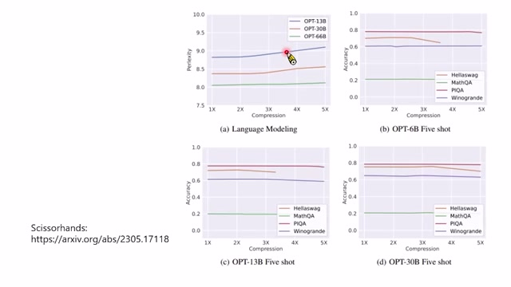

部分任務只保留約 20% K/V，表現仍接近完整 Cache；但效果依任務與資料而異，資訊一旦錯刪便無法恢復，因此不是無條件安全。

## 六、跨請求 Prompt Cache

### Slide 17 — 跨對話的 Prefix Cache ([Video](https://www.youtube.com/watch?v=fDQaadKysSA&t=1590s))

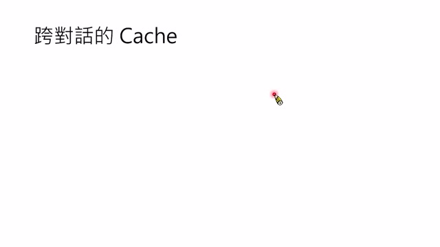

KV Cache 也能跨請求重用：若不同請求具有完全相同前綴，該 prefix 的 K/V 可直接復用。匹配必須從第一個 token 開始連續成立。

### Slide 18 — Cached Input 的價格折扣 ([Video](https://www.youtube.com/watch?v=fDQaadKysSA&t=1704s))

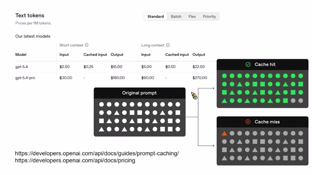

模型服務商對 cached input 給大幅折扣，因已快取前綴省掉 Prefill 計算。折扣反映供應商實際降低的 GPU 工作量，而不是單純促銷。

### Slide 19 — AI Agent 的 System Prompt 適合快取 ([Video](https://www.youtube.com/watch?v=fDQaadKysSA&t=1824s))

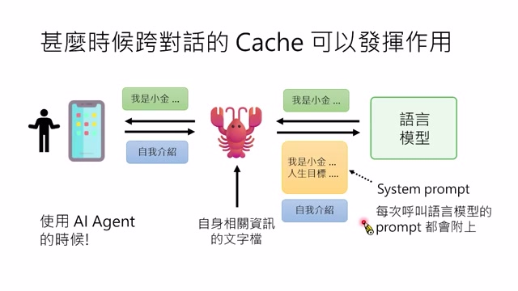

AI Agent 每次請求前常附上很長且固定的 system prompt，包括身份、目標、工具與規則，因此特別容易形成跨請求 cache hit。

### Slide 20 — System Prompt 的穩定內容應前置 ([Video](https://www.youtube.com/watch?v=fDQaadKysSA&t=1868s))

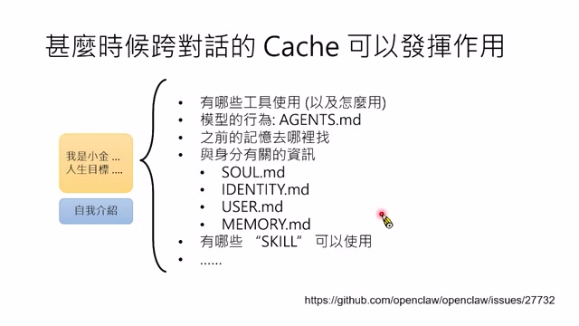

為最大化共同前綴，固定的工具說明與規則應放前面；日期、記憶、使用者狀態等常變內容放後面。一處前綴改動會使其後 Cache 全部失效。

### Slide 21 — 改寫 Prompt 以提高 Cache Hit ([Video](https://www.youtube.com/watch?v=fDQaadKysSA&t=1944s))

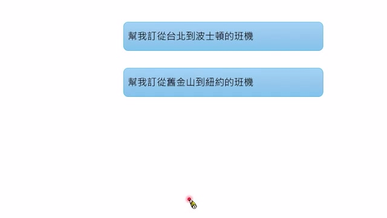

「幫我訂從台北到波士頓」和「從舊金山到紐約」很早便分歧，只有短前綴命中；語意相似不等於 token prefix 相同。

### Slide 22 — 把變數移到共同前綴之後 ([Video](https://www.youtube.com/watch?v=fDQaadKysSA&t=1976s))

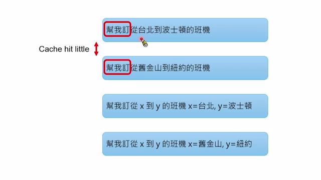

可把固定模板「從 X 到 Y」放前面，再把 X/Y 的實際值放末尾，使大量指令 token 完全一致。若模板很長，節省會顯著累積。

### Slide 23 — Prompt Cache 可節省多少成本？ ([Video](https://www.youtube.com/watch?v=fDQaadKysSA&t=2016s))

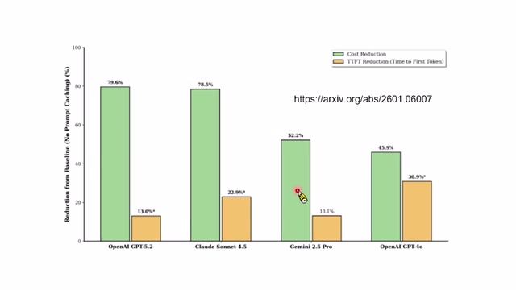

實測研究在多種 Agent 與模型上比較 prompt-caching 策略；Gemini 2.5 Pro 和 GPT-4o 等案例可降低約 50% 或更多成本，但收益取決於定價與重用率。

## 七、總結

### Slide 24 — 本講方法總結 ([Video](https://www.youtube.com/watch?v=fDQaadKysSA&t=2056s))

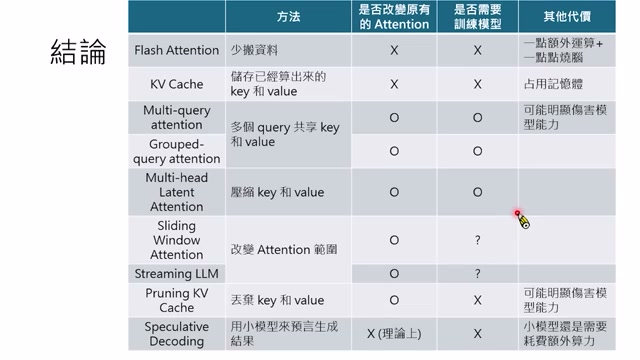

FlashAttention 減少資料搬運；KV Cache 避免重算但耗 HBM；MQA/GQA/MLA 減少每 token 的 K/V；Sliding/Streaming/Pruning 限制保存歷史；Prompt Cache 則跨請求重用共同前綴。每種方法的精確性、是否需訓練及資源代價不同。

## 核心結論

- KV Cache 不改變 Attention 結果，但以 HBM 容量換取 Decode 速度。
- MQA、GQA 與 MLA 減少每 token 的快取量，通常需要相應模型架構或訓練。
- Sliding Window、StreamingLLM 與 pruning 限制歷史 K/V，可能改變結果或遺失資訊。
- 跨請求 prompt caching 要求完全相同的 token 前綴；固定內容前置能同時降低延遲與成本。

