# 核心课视频-001.美元环流 — Detail Slide Notes

> **讲师**：宋鸿兵（鸿学院）  
> **时长**：80分48秒  
> **分辨率**：1280×720  
> **类型**：PPT 讲座（20 张幻灯片）

---

## Part 1：美元环流框架

### Slide 1 — 标题页：鸿学院核心课程 第一讲、美元环流

本讲是鸿学院核心课程的第一讲，主题为“美元环流”——理解全球经济问题的总框架。

<strong>All subtitles</strong>

> 为什么要挑这个话题虽然我在以前很多场合上谈过美元环流的问题但是我需要反复强调一下因为这个理念或者这个框架是理解我们现在全球经济出现诸多问题的
> 一个钥匙也就是为什么各国货币会相对于美元贬值美元出现了大货升值为什么各国家的经济出现了不景气为什么大中商品石油这些价格在暴跌还有各国家金融市
> 场高度不稳定那么包括中国的进入所谓L型的这种经济状态其实都与美元环流这件事情有关所以建立这样一种大的逻辑框架不仅是我们对于当今所面临的诸多的
> 经济问题有了一个总的逻辑上的这样一种框架式的截图同时还对很多具体的方面也有帮助比如怎么看待金融市场朝股票或者朝气货或者做其他任何投资的人怎么
> 来预判未来一段时间大的趋势所以它是我们当今世界现在所出现很多问题的一个政结性的这样一个环境所以我想还是从美元环流这个角度来切入那么我们都知道
> 这个全世界实际上存在这一种所谓温言环流的海洋这个环流我记得以前在前几年有一部美国大片叫厚天

---

### Slide 2 — 温盐环流与美元环流

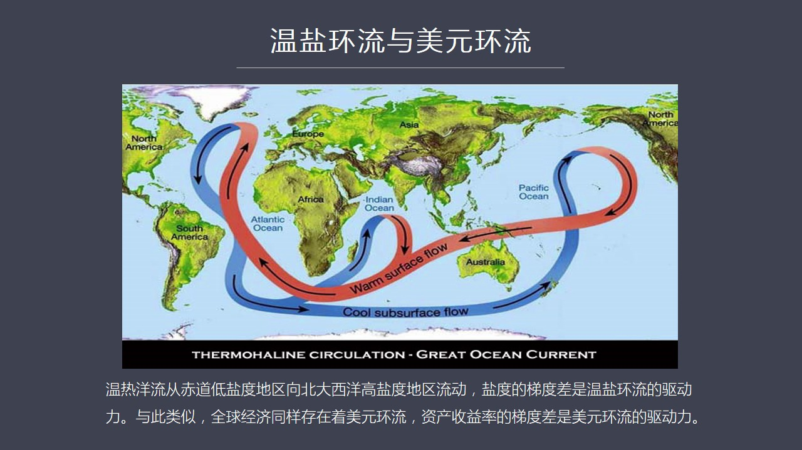

用温盐环流类比美元环流：盐度梯度差驱动海洋环流，投资收益率梯度差驱动美元环流。

<strong>All subtitles</strong>

> 一个人翻译成明天之后这股片子讲的就是一个有关气候变化的这么一种科幻那么在这股片子两所展现的就是在全世界的迟到附近那个地区的海洋的水温比较高包
> 括它的海水的农度岩的农度是比较低的那么在一些高尾度地区像大西洋的北部那个地区的海水是比较冷的比较显的正是由于有这种显度的这种落差这种梯度差所
> 以趋势整个洋流海洋的这个洋流出现了一种从迟到地区向高尾度地区进行循环流动了这么一个过程那么这种片子讲的是什么呢它在讲未来由于全球气候暖这个变
> 暖使得我们的南北极比如说北极吧有大量的冰块这些冰块融化之后大量半水湧入高尾度地区之后使那些比较显的海水变淡在这个过程之中就会是迟到和高尾度地
> 区的沿度这个落差越来越小直到有一天突然两边的沿度一样这样的话就会是整个海洋环流砸然而止如果出现这个现象的话那么整个全球的气候变化就会发生逆断
> 我们现在看到是全球越来越热但是直到某一天出现这个温暖环流停止的时候那么气候将突然变了甚至可能在一秒钟之内气温下降十几度最后全球会进入冰核期当
> 然这是一个科幻篇但是它背后是有充足的科学证据和理由的它的科学的逻辑是成立的其实我要说的是不仅全世界存在的这种海洋环流同样也存在的一种货币环流
> 我们可以称之为是美元环流为什么全球的货币会以美元环流存在全球的经济循环体系之中这主要是由于战后全球的货币制度形成了美元多大了这样的一种局面如
> 果说温暖环流的主要推动力量是严度的踢渡差那么美元环流的主要推动力量就是投资收益率质差到底是相似的那么再讲到这一点时候其实我们就已经设计到的两
> 个重要的支持模块那么第一个支持模块就是战后什么时候形成的美元独大的

---

### Slide 3 — 知识模块：布雷顿森林体系与世界储备货币历史

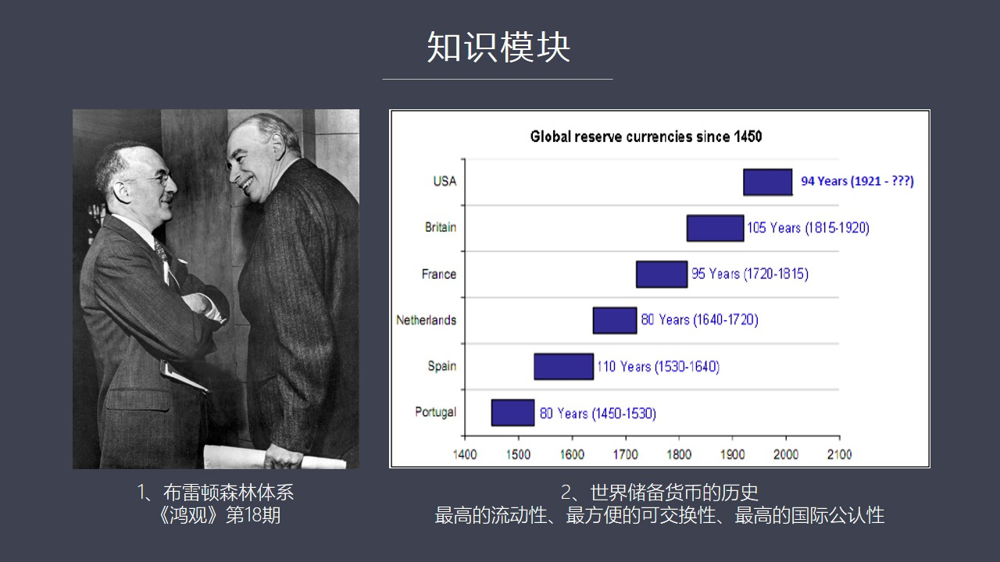

知识模块：布雷顿森林体系（美元独大的形成）+ 世界储备货币500年变迁史（葡萄牙→西班牙→荷兰→法国→英国→美国）。储备货币三条件：最高流动性、最方便可交换性、最高国际公认性。

<strong>All subtitles</strong>

> 这样的一个局面其实是在战争期间二战期间1944年所出现的布雷顿森林体系确立了美元一家独大的一个局面就是全球货币与美元挂钩美元与背后的黄金挂钩
> 这样的话形成一个全世界的以美元为中心的这样一种货币机制这个支持模块我在宏观的第18期中间曾经讨论过就是给大家分享过它形成的历史所以这个支持模
> 块我们可以直接练街道这个宏观的第18期如果大家感兴趣的话17期18期其实都是在讲美元在20世纪它的成长的力程包括美元国际化包括布雷顿森林体系
> 建立英国和美国之间的货币争扮那么这个支持模块可以帮助大家有效的理解美元还留它的形成的原因第2个支持模块就涉及到世界储备货币的历史就是什么叫世
> 界储备货币这个就是我们大家经常在谈论类似键念的时候其实对世界储备货币并没有深刻的这种认识那么其实关于这个概念我在货币任能四第一张中间叛塔过就
> 是世界储备货币它形成了一些必要的条件什么样的货币能够成为世界上的储备货币归纳起来有三点就是这种货币必须要具有高度的流动性最高级的流动性那什么
> 是流动性呢就是当你把这个你手上这个资产在市场中出售的时候所有人都会增这墙不会有人据收这种能力越强你的流动性越好那么在立场当然黄金就是具有最高
> 的流动性的这种资产那么除此之外呢它还有一种最方便的可交换性就是你以它去交换任何资产都是非常成本非常低的第三个要素就是它具有着最高的国际公认性
> 就是在立场大家形成了一种惯例认同它作为这个储备贺作为储备货币的这种核心的资产那么当同时具备这三个条件手在立场形成了一个标准的一种模式当然就是
> 黄金作为储备货币资产背后的核心的这种抵押品所以呢这个就是模块就涉及到其实从应该说从十五世纪以来到现在近五百年的各国的世界货币的这种世界储备货
> 币的变化情况你比如说我们会看到葡萄牙它的货币是最早成为储备货币的它从一四五零年到一五三零年维持了八十年然后是西班牙然后是荷兰然后是法国然后是
> 英国到1921年之后英邦的地位逐渐被美元所取代在货币产生四中我对这段都有这种描述所以这个也是一个单独的知识模块在有了这些知识模块这种基础之上
> 呢我们理解美元环流就有了一个比较好的基础那么这一轮最吸引轮美元这个环流就种热环流是什么时候启动的呢当然就是在2008年金融危机爆发之后由于美国面对着严重的金融机构的破产的风险

---

## Part 2：美元热环流的启动与膨胀

### Slide 4 — QE：美元热环流的启动

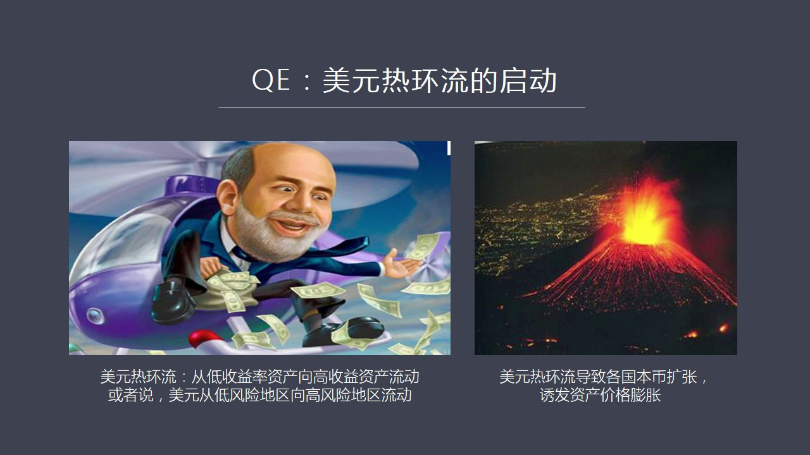

2008年金融危机后QE启动美元热环流：美元从低收益率资产向高收益资产流动，从低风险地区向高风险地区流动，导致各国本币扩张、资产价格膨胀。

<strong>All subtitles</strong>

> 包括一些大银行那么为了拯救这些整个的全世界的银行体系吧那么美联储开始用这个量化宽松政策来推动来拯救这些银行系统推动他们重新引力这个过程呢当然
> 就启动了一轮美元的热环流就是美元从美国开始向其他的国家发成了一处的这种效应那么这种热环流呢说到底它是从一种低收益率的资产向高收率率资产进行流
> 动也可以说它是从第一风险地区向高风险地区进行流动这个都是2009年之后所出现的一个问题因为美国进行量化宽松之后把利率逐渐压到了零这样的话美元
> 这些这些资金被放出来之后在美国的本土就会面临一个生于率很差的这样的一个警惕那么怎么办呢这些资金就要到海外去寻找说于率更高的但是风险也同样更高
> 的资产进行投资这就使得美元开始从美国大举流向了全世界那么在这个过程之中美元勇向全世界之后必然会导致各国本币的扩张从而又发各个国家出现资产价格
> 膨胀就是我们看到的房地产土地包括金融市场的很多资产都会大幅上涨这背后的原因是什么呢其实原因就是这对需要我们对货币机制有所认识这个原因就是当印
> 美元比如说在美国收益率是1%而在中国收益率是8%那么这些钱就会勇向中国关键是怎么勇这个时候我们会发现中国的一些企业他觉得在中国贷款的融资成本
> 太高那么如果在国际上呢如果发行美元债券或者向美国的银行机构去进行贷款那么他的利率是非常低的比如说只有1%这样的话大量的中国的企业就会通过这个
> 美元债债或者美元的贷款美元债券和美元贷款形式大举的融资那么这些钱被他们借来之后当然它是以美元的形式存在不能够直接在中国境内进行消费或者投资怎
> 么办呢那么中国有这个外汇结算制度那么这些美元被这些企业卖给了中国的银行而这些银行拿到了美元最后又卖给了银行最后形成了中国的外汇储备相对硬的呢
> 银行有了这些外汇储备之后就开始增发人民币就是收一块钱美元我发六块三的人民币这样的话把人民币交给这些企业这些企业就可以已经投资了所以在这个过程
> 中一定会出现中国的外汇储备大幅上升同时本币也进行大规模的扩张注意啊这个过程就是当美元流入任何一个国家的时候这个国家不管它的银行才与什么样的结
> 算制度只要你不想让本币对于美元大幅升值你就必然会大幅就是大规模的这些购买美元压低压低这个本币的价值所以在这个过程中一定会导致各国本币的超方那
> 么就像在中国还有其他新身上国家出现的那样一本币超发的结果是什么呢超过了你经济增长的速度货币多了那就一定会是过多的货币去追踪有效的有效的资产就
> 会是资产价格上涨所以在这个过程之中各个国家在09年之后都出现了一个资产价格膨胀的过程好在这中间其实又涉及的两个重要的支持模块第一就是我们谈论到练化宽松的时候

---

### Slide 5 — 知识模块：量化宽松与部分准备金制度

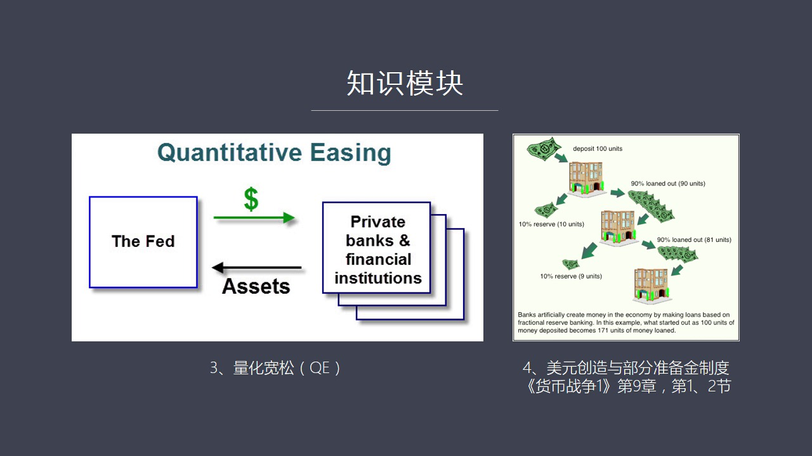

知识模块：QE机制（央行印钞购买国债和两房债→金融机构被迫全球寻找高收益资产）+ 部分准备金制度（100单位存款→171单位贷款）。

<strong>All subtitles</strong>

> 就是QE什么叫QE这个是一个重要的一个支持模块如果你不理解QE实现的过程你就不能够明白为什么美元会被创造出来而且永相全世界简单的说QE它的过
> 程就是中央银行印超票在金融市场上去大局收购两种最重要的资产金融资产一种是美国国债一种是两方的债券当他把美元印出来去交换比如说在一些金融机构手
> 上了这些国债和两方债的时候那么这个美元就出去了同时呢他买进的这些金融资产就形成了每连处的资产资产表中间的资产膨胀也就是他印的货币去购买这些资
> 产进行了一种交换资产进来了前出去了所以他整个资产资产表让他资产资产表会膨胀同时大量的美元现金会注入到这些金融机构体内这些金融机构拿到现金之后
> 最大的困境是以前我持有的美国国债或者两方债券高低还有一些利息收入而我现在呢把这些金融资产变成了现金变成现金对于金融机构来说这是一个很大的麻烦
> 因为对他们说持有金融资产是有利息收入的这是有现金流的所以对他们说这是资产但是现金他就没有没有收入怎么办呢因为这些金融机构也是借别人的钱然后来
> 转自己的钱所以他玩的是资金的游戏所以当他不能够持有这个带利息收入了资产的时候他就无法去给投资人回报率所以这就逼的这些金融机构必须要在海外去寻
> 找更高收益率的这样的一些资产然后中间套取这这个融资成本和回报率之间的这种立差他们就是这么来赚钱的当然这个只是模块我们还要做进一步的充实当然这
> 个过程可以放到以后除了这个之外还有一个只是模块这就涉及到美元道理是怎么出来的美元道理是怎么被创造出来的这就涉及到一个非常重要的问题就叫部分准
> 备金制度也就是现代银行体系不是我们所想象的那样仅仅发放贷款它一个很重要的功能就是进行货币扩张这个可能如果没有专门学过金融学员可能很多人不理解
> 银行不就是收取大家处去然后金融放贷了吗这只是它一个功能其中最重要的一个功能是发行的银行货币我们知道在市场上流通的都是这个国家的这种法币但其实
> 在市场中更大的部分或者说绝大部分货币是银行货币就是银行所创造出来的像银行的支票 银行的处序等等以这种形式存在的这个是我们所说到的大家所经常谈
> 论的M2这一块其实是银行创造出来的当然要深刻理解这个问题可能要对部分准备金制度有一个充分的了解这就是这个其实模块应该说是非常重要的一块因为不
> 能彻底理解部分准备金制度其实也就不能理解现在金融体系包括银行体系到底是怎么运作的关于这个问题呢在货币家中一一中间的第九章第一节和第二节我曾经
> 传说过部分准备金制度运行的基本规律希望大家有机会去翻一下这两节当然了我说到这是模块所需要反复强调一下这些这是模块本身需要进行很好的风装就让它
> 在逻辑上孤立起来不能说像我们看到的危机百科或百兜百科两中间有很多对外的这种连接这是不可以的因为这叫没风装好风装好的这是模块一个它就是一个单独
> 的逻辑整体不需要跟外界发生联系它跟外界发生联系就是调用模块之间的调用可以有这种关系所以这是模块的风装其实是很有学问的那么在明白了这个环流美元
> 环流产生的原因包括它一些机制之后那么我们看到了各国资产价格由于本币的扩张在不断的上涨那么除其实除了资产价格上涨它还带来了一个另外一个作用就是
> 使得各国家的复债也同步上涨这就涉及了另外一个概念了资产价格上涨

---

### Slide 6 — 美元热环流推高了全球负债率

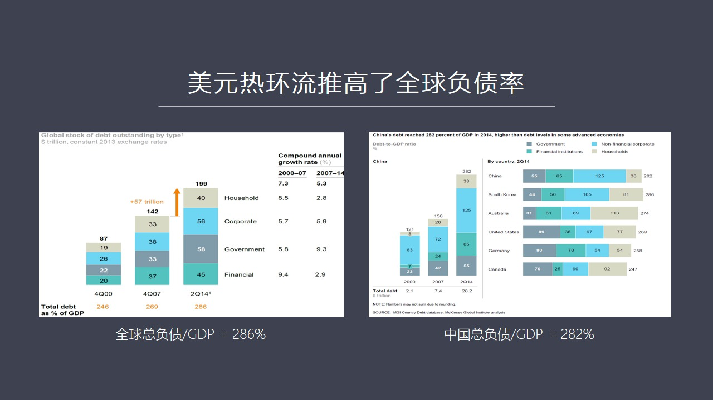

全球总负债/GDP=286%，中国=282%。美元债务+本币债务双重堆积推高全球负债率，形成“新常态”。

<strong>All subtitles</strong>

> 为什么会带来复债的上涨呢因为在货币扩张情况之下是我形成的所谓资产的膨胀它就必然会办随着复债率的上涨原因很简单假如我们以防地产为例吧如果您以前
> 在北京或上海买房2009年那个时候的房价是一平米两万那么你买一平米一百平米相当于要花二百万但是由于房地产价格的上涨你的房价从两万变成了比如说
> 变成了四万那么你一百平米的房价就会从两百万上涨到四百万三倍但是在同样一段时间之内你的收入却不可能三倍那怎么办那就意味着你一定要借更多的按钮底
> 贷款才能够买了起房子比如说你以前借个一百五十万就够了现在你可能得借三百万而这种三百万的三倍的上涨是超过了你收入上涨的速度的所以这就形成了你个
> 人附带的附带力的大附上涨其实这个道理对于全国也一样因为全这个一个国家它是由无数的这种具体的人所组成如果每一个人都促在这样的一个情况企业个人都
> 促在这种情况那就会出现全国总的附带力大附上涨的这样的一种局面实际现在我们如果来看全球的这种附带力就是总附带国家带务企业带务加上私人带务除以G
> DP这个比值非常关键那么现在情绪的总附带是多少呢平均总附带大概是286而中国的总附带除以GDP的比值是多少呢是282换句话说中国和全世界的这
> 种附带的比例差不多这些附带的比例其实比金融危机之前都大附上升所以这个使得各个国家都促在一种高度附带的情况在这种债务压力之下每个国家的经济都不
> 得不恢复沉重的债务所以它的发展速度会相对变缓这就是大家所说的新常态的这样的一种基本的表现方式那么由于这种美元附带因为各个国家很多企业都会在国
> 际上上大规模借带美元所以这就会形成美元附带的队籍当这种美元附带在各个国家内部就形成了本国内部的本币的这种附带所以两种附带是同时存在的一起推高
> 附带率那么这就出现了一个问题当美元附带也在逐渐放大在这个逐渐膨胀这个阶段中会出现什么问题呢当美国的利率很低两岸宽松持续不断的运行也就是美联储
> 不断在印刷新超票新的美元不断的注入国际市场的时候一切都没有问题因为你可以很方便的借到美元就是借新债还救债这个债务滚动可以持续不断的维持但是这
> 里造成了一个非常严重的一个危险的局面假如美国停止任何宽松没有新增美元有入国际市场那么你上哪儿这找这么多美元这就会存在一个问题当强势当这个美元
> 债务膨胀到一定程度的时候这种美元债务会形成它就好比是个倒金责型

---

### Slide 7 — 强势美元的根源

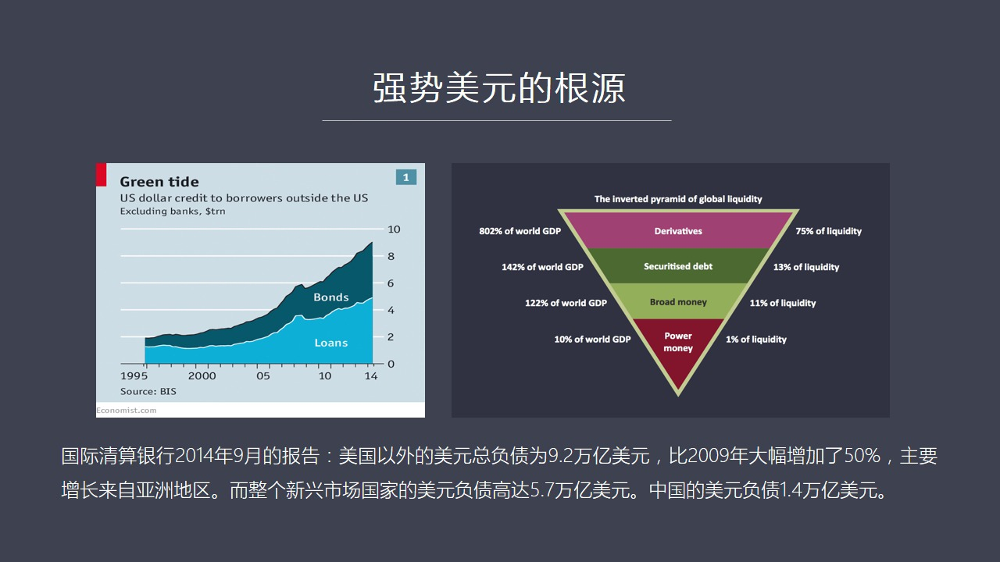

BIS报告：美国以外美元总负债9.2万亿（比2009年增50%），新兴市场5.7万亿，中国1.4万亿。全球流动性倒金字塔：衍生品占GDP 802%。停止QE则债务滚动断裂。

<strong>All subtitles</strong>

> 高度的附带压迫有限的流动性就是有限的现金那么最后会形成什么局面会形成当没有找不到新增美元的时候大家就只有变卖资产去套取现金本地然后再用本地去
> 换这个美元在这个过程中就会自动的形成美元稀缺我们可以称之为债务金字塔倒金塔了一种内暴所形成的美元的稀缺这种稀缺会自动推高美元的币值这个是我们
> 在探堂为什么美元升值的时候我看了很多学者的这种看法其实很少有人点出来正是由于美元负债太多所以当一旦不能够获得新增美元来尝环旧债的时候强势美元
> 是必然发生的这跟美国经济好语坏没有任何关系美国经济增长板杖它会强势美国经济负增长板杖摔退它也会强势这是由于全球的后面击制所形成它是一种逻辑的
> 必然性所以在如果从数据的角度来看的话我们可以发现到2014年的9月我们看到国际清算银行出了一个报告在这个报告中它讲到了就是美国以外的美元总负
> 债当时已经高达9.2万亿了比2009年的时候大夫增加了50%那么这种新增的负债主要原因哪呢源于亚洲地区源于新兴上国家整个新上国家的美元负债达
> 到了5.7万亿美元在这5.7万亿美元的负债中间有一大部分是美元贷款还有一部分是美元的债券一同构成了这5.7万亿的庞大的美元负债其中中国的企业
> 它的总得借代美元的负债额高达1.4万亿美元我们中国曾经有句老话叫做君子不利微强之下其实你借这么多美元而且各个国家对于借代美元并没有做有效的对
> 冲中国印度还有很多国家借代美元基本上没有做汇率变化了这种风险对冲那么这就出现了一个问题了一旦美元的环流方向发生逆转热环流如果变成冷环流那么立
> 刻就会造成重大的美元常付性这方面的危机这就是我们看到的当美联储在2014年7月这个时候开始准备停止两号宽松的时候这个时刻其实就已经注定了未来一段时间之内全球必然会出现重大的危机这就是环美元环流变冷

---

## Part 3：美元环流逆转（2014年7月）

### Slide 8 — 2014年7月，美元环流变冷

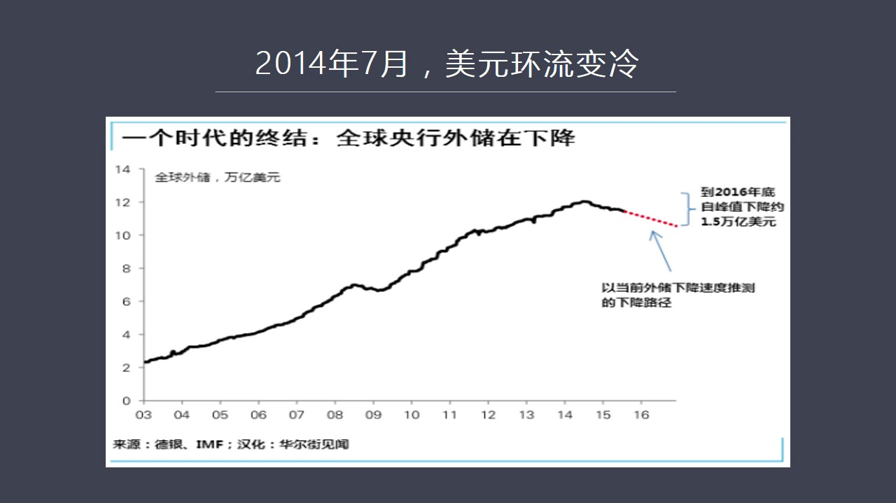

全球央行外储从2014年峰值12.5万亿开始下降，到2016年底降1.5万亿。外汇储备是发行本币基础，减少则国内货币紧缩。

<strong>All subtitles</strong>

> 这意味着什么意味着全球的美元性将会逐渐的冷却和收缩而全球已经被高度美元负债所套牢的那些人必须要在市场中找到美元现金否则就无法償还这个负债那么
> 在冷却的情况之下美联储在收缩的情况之下你是不可能找到足够的美元现金足够的便宜的所以这个过程就会变成一个恶性循环大家争相抛售自己的资产然后去几
> 对各国的央行的美元储备償还美元的负债那么这就会导致本地变值央行储备减少或者央行储备被几对同时各国的这种金融市场开始动荡这几个恶性循环会逐渐的
> 互相咬合在一起在这个过程中会共同推动美元不断的升值这就是我们看到2014年7月以来这个是一个重要的一个拐点因为在这个月美元环流开始变冷了那么
> 如果我们从全球央行的外汇储备的总额来看的话正是在这个月我们看到了央行总储备开始从峰值下滑这种情况以前只充限在2008年金融危机的时候

---

### Slide 9 — 2014年7月，全球经济出现拐点

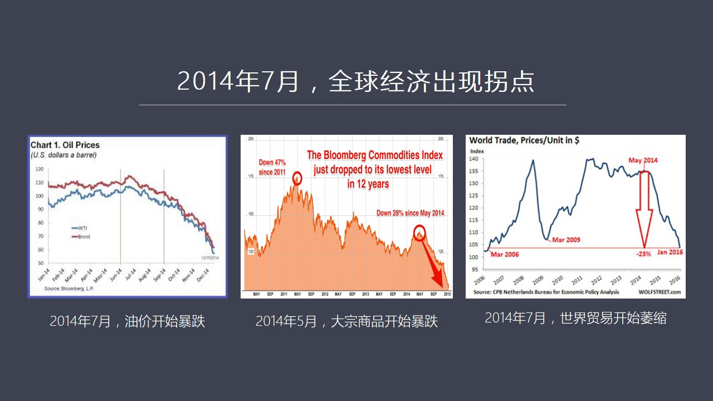

三大拐点同时出现：2014年7月油价暴跌、5月大宗商品暴跌（-47%）、7月世界贸易萎缩（-23%）。全球性问题，非孤立现象。

<strong>All subtitles</strong>

> 而在2014年7月出现了这代表什么这代表一个时代终结了货币宽松美元宽松的时代结束了那么所有承担巨额美元负债的国家和企业都面临着最后的这种流动
> 性的挑战所以如果我们来看最近几年的全球经济大事你会发现2014年7月是明显的一个拐点当央行总储备开始收缩的时候这就意味着各个国家的本币都会面
> 临强大的收缩的压力因为各个国家包括中国在内基本上外汇储备是它发行本币的一个重要基础这个现象在中国有请的明显所以当你外汇储备开始减少的时候必然
> 产生严重的国内的货币的紧缩那么在这样情况之下各个国家经济都会出现问题你比如说如果我们来看几个主要的指标会发现一个非常明显的类似基础就是时间的
> 高度的聚焦在2014年7月比如说如果我们看邮价正是在2014年7月邮价开始大幅暴跌也是在2014年的7月前后准确说是5月大东商品除了石油之外
> 的很多其他大东商品开始出现了一个暴跌的拐点那么在2014年的7月也在同样一个月全球的贸易开始伪缩就是全球贸易的这种总量还有包括它的价值都开始
> 出现大幅下跌这就不是一个孤立的现象了因为我们在以前在探讨经济问题的时候很多人都是从某一个具体的行业和某一个具体的东西某个具体的方面去分析为什
> 么我们现在生意宝座了钱很难赚其实我们会发现这不是某一个国家出现了孤立的现象而是全球由于货币机制美元华流的逆转出现了一个整体整体性的问题中国也
> 不例外也就是在2014年7月之后中国也出现了很多明显的问题所以各行各业的人都会普遍的明显的感觉到2014年年中之后各种生意越来越难做赚钱不容
> 易了大家这种感受在全世界范围之内都是相同的那么也正式在2014年7月我们看到美元开始走墙这就是我说的当全球货币总储备开始收缩的时候

---

### Slide 10 — 2014年7月，美元开始走强

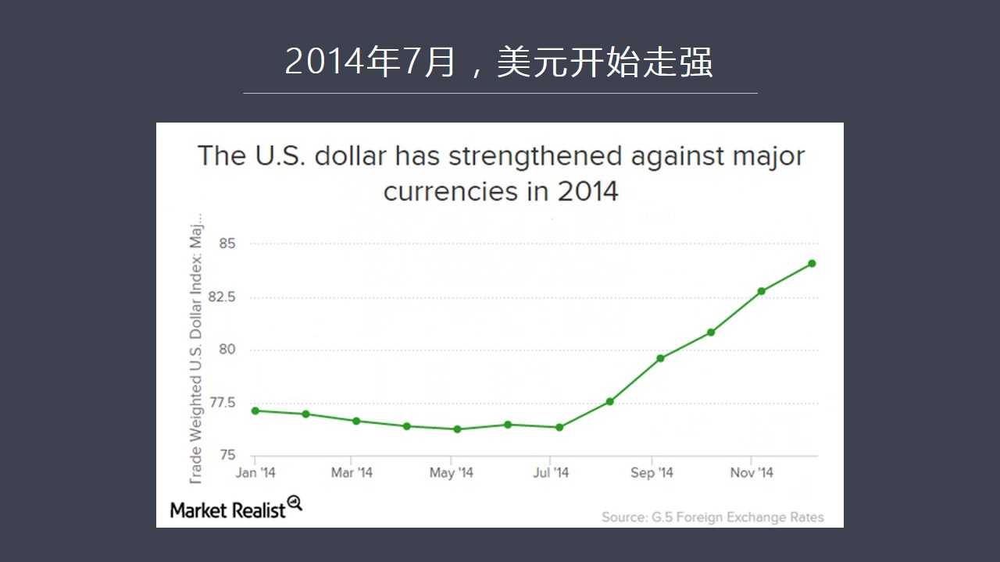

美元指数从2014年7月的76.2攀升至82.5+。全球抛售本币换美元还债→美元需求暴增→美元走强。

<strong>All subtitles</strong>

> 当大家面临这个美联储这个美元流动性减少或者停止像国际上上供应新增的同等数量的美元的时候那么9.2万亿巨额的美元债务就开始发威了就开始施加越来
> 越大的压力在这种压力之下承受美元负债这些国家将会出现严重的困难所以在那个时候大家都得去长美元否则还不了债现金流就会中断这就是导致了从2014
> 年7月美元开始大幅走墙了更美元一就在于此所以当我们认识到整个环流体系的时候你会对美元的汇率包括各个国家相对于美元的汇率有个总体的认识我们看到
> 各个国家的货币相对美元在贬值什么原因其实根本原因是美元环流开始逆转现在当美元环流出现冷却这种逆转之后我们来看对中国的经济会造成什么样的影响当然首先会影响我们的金融市场

---

## Part 4：对中国经济的冲击

### Slide 11 — 美元环流冷却后的中国经济

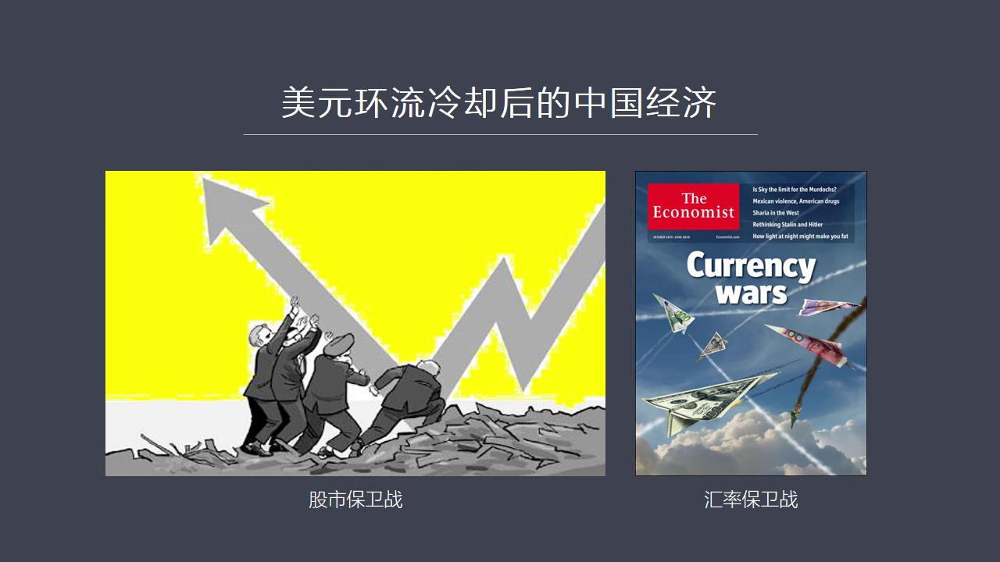

美元环流冷却后中国面临股市保卫战（2015年A股暴跌）和汇率保卫战（人民币贬值压力）。

<strong>All subtitles</strong>

> 你比如说我在宏观节目中曾经反复谈闹过就是在美元环流冷却之后中国一定会出现股市上的问题就是我称为股市保卫战如果处理不好就是特别是去年8月11号
> 央行调整汇率之后让人民币大幅相对于美元贬值又发了人民币的汇率大跌关键的问题是非常糟糕的是全世界的市场形成了一种共识就把中国的经济跟人民币贬值
> 困绑在一起就是说你的货币贬值说明你经济本身要出大问题所以这两者被困绑在一起之后就会导致看空中国这种声音越来越强所以呢就是在股市彻底好转之前如
> 果去动汇率这个时间窗口是有问题的这样一来会导致我们陷入两线作战既要进行股市保卫战同时还要进行汇率保卫战这恰恰是我们后来出现的现象一直到现在汇
> 率在1月份再动一次之后又大幅下跌那么目前到4月以后我们看到汇率似乎稳定下来了外汇土壁在4月份开始缓慢的回升但是不要被这个现象所迷惑这是美元环
> 流大的趋势中间的一个短暂的停留或说我们可以成为是一个不稳定的过度状态当然关于对未来的这样一种这种美元利率它的走向和美国这个环流美元环流最终的
> 发展的趋势我觉得这个内容可以说是一个相对独立的而且体系非常庞大的一个话题我们可以放到另外一奖来专门来论数在这里我们仅仅是考虑美元环流一个大的
> 趋势如果我们看中国的股市其实你会很明显地发现中国的股市就是在2014年7月开始启动的改革牛当然了这种改革牛是在全球美元一转

---

### Slide 12 — 2014年7月启动的改革牛孤掌难鸣

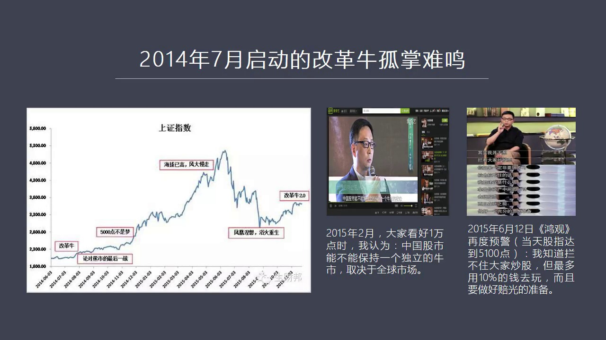

改革牛从2300→5100→暴跌。两次预警（2015.2和6.12）。核心逻辑：美元环流逆转下股市不可能独善其身。

<strong>All subtitles</strong>

> 这个环流逆转很冷却的情况下发生的所以我在很早以前对改革牛能持续多长时间就有一种很大的疑问所以在2015年2月我记得当年是水皮他们搞了一个活动
> 然后当时请了有9个经济学家一块来叛逃牛是中国改革牛未来会怎么样当时另外8位基本上从不同的角度在传数这边未来这个股市一定是笨10000点去的因
> 为中间有改革利好有其他的这种利好利好有一大堆所以会很快的到10000点如果大家有兴趣可以看一下这一段路上当时我的看法是我觉得不能够孤立地看中
> 国的金融市场必须要从全球的角度来看问题这个可能是我跟他们明显了一个不同因为其他人基本上很少设计到国际经济市场的变化但是如果我们真正明白全球美
> 元还留这样一个基本原理的话你会发现中国的改革牛是孤长难民的因为全球的美元在收缩中国又有这么多美元复债在这种情况之下你党不住自己外流的也党不住
> 会律下跌的很难进行阻挡所以在这样的一个情况之下股市和会市都会出现明显问题的情况之下你想维持一个大牛市我认为是很难做到的特观上来说是不容易做到
> 的所以说我的观点是中国股市能不能保持一个独立的牛市要取结于全球市场那么在2015年6月12号红关有一期节目当天正好股票上达到了5100点我在
> 这个节目中其实再次发出了这种预警当然了我在节目中并不可能不太可能说了那么明确看出来股市其实要承受很大的压力我当时说是我说我知道蓝幅大家去超股
> 但是计多只用10%的资金去玩股票也就是玩玩以千万不要当真而且最好要做好全部赔光的准备当然了我相信很多看过红关节目人对这期节目都有比较深刻的印
> 象关键是为什么会形成在2015年2月和6月形成这种判断很多人都说这种牛市或者这种熊市其实很难在股票上很难进行准确判断但是虽然我们不能够判断每
> 个月或者每一天的股市波动情况但是基本趋势应该看得很明确就是在美元还流这个体系之下如果它出现逆转你的股市是不可能独善其身的因为在当今世界金融市
> 场广泛和密切联系之下资金可以在一秒钟出去几十个亿上百亿美元你是难不住的所以在这样的一个全球金融上高度何的情况之下不考虑国际市场只看中国的单独
> 的一个市场是不可能对股票市场的未来其实有一个准确预测的所以我们在谈到这个问题的时候包括我们未来ECD的课程的时候你会发现建立一个正确的框架是
> 多么的有价值不仅是对于我们经济研究本身有价值而且对你市场这个操作对大师的一种预判也会有一种方向性的指导关键是这个框架建立的合理还是不合理我们
> 会看到每天电视节目中有很多股屏家有很多金融家再也说现在要从四地点要从五千点等等等等其实在我看来在他们脑子里是缺乏一个真正的框架的这就是我们红
> 关就是包括红学院这种课程所要给大家介绍或者要培养大家要做了一个事情要做了一个重要的事情就是首先得建立正确的框架框架不正确你的很多结论都会出问
> 题包括方向性的这种错误那一半可是要致命的那么在会议方面出现的问题当然就是外汇储备的严重下降那么有关外汇储备的一些这个数据我看到最新的数据大概四月份我们还有接近三点二万亿美元那么这三点二万亿美元中间

---

### Slide 13 — 外汇储备底线

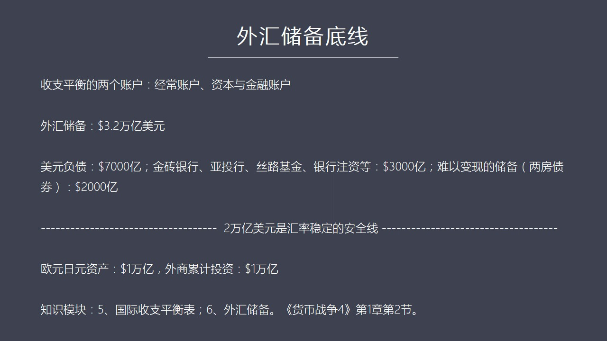

外汇储备3.2万亿：美元负债7000亿+金砖等3000亿+两房债2000亿。安全线2万亿。欧元日元1万亿+FDI 1万亿。

<strong>All subtitles</strong>

> 其实首先得跑出这个我们欠别人的钱一笔说中国的企业在二零一四年九月披露报告中间大概欠1.4万亿美元但是在那之后二零四年七月一直到二零一五年为什
> 么会有这么多外汇储备减少为什么会有这么大规模的资本外流很大的部分是由于这些企业荒了开始加紧长荒美元为什么他们会荒呢因为他们的汇率上没有做任何
> 风险对冲也就是说当你一百分之一的成本接待美元的时候没有考虑如果你美元生质人民并不免值你还款的时候有个汇率的风险会导致你整个财务成本的大幅上涨
> 虽然你借美元是百分之一但是假如人民并对美元别百分之十那你的总的财务成本是多少那就会大大加这个加大而且百分之十不一定能挡得住也许更多那怎么办所
> 以这些企业在面临这样的一种巨大的心理压力之下开始提前大规模的长荒美元这使得我们的美元负债这个出现了大幅减少也就是资本外流了但这个资本外流的距
> 向很大一部分是长荒美元负债所以我现在的预估是我们的美元负债还剩七千亿或者在这上下一个范围针内浮动所以你这三两二万一中间要简调七千亿因为这是欠
> 别人钱而且随着如果人民币继续变职的话这个长荒速度会加快所以这个钱你说不准什么时候就被抽走了除此之外我们还要进行一路一带的建设要包括对金专银行
> 、亚投行、四路基金还有一些大型的银行进行注资这都需要花钱那么这笔钱注入的资金可能至于现在不完结统计将会达到三千亿美元左右这只是可能只是一个启
> 动资金为了还需要增加除了这些之外我们还有很多难以变现的资产你比如说两旁债虽然我们在2008年的时候我曾经建议要减少对两旁债的持有因为这两旁债
> 很快就会出问题但是现在我们仍然持有当年好像持有了4800亿现在至少还应该有2000亿左右这个要注意一下两方并没有委约它的债券并没有委约可是它
> 在市场上却没有流动性也就是你在市场中想把它卖掉变成美元现金是很难做到了因为没有买家当然它并没有委约到时候还是连本还是按期长发利息这没有问题但
> 是你却在积蓄用钱的时候你却拿不到现金因为这个市场上可能只有美国财政部愿意收有两旁债它要不收你就掏不了现所以这2000亿基本上是没有流动性的如
> 果我们把这个靠阻较之后我们会发现我们的外汇准备3.2万亿中间其实能够动用的现金部分并不多除了这个之外这就是我说的可能2万亿美元是我们的汇率稳
> 定的一个安全线跌破2万亿美元可能就会有问题了这种问题就会设计到要动用其他的资产了当然了其他资产还有什么呢我们还持有大量的欧元和日元资产两者相
> 加据估算就是这种估算方式简单的说是按照日月和欧元在全世界它的储备货币中所占的比重来计算当然中国可能比这个比重高也可能比这个比重低因为我们没有
> 公布它的日月欧元资产的具体的构成成分所以按照这种估算吧应该还有价值1万亿美元的其他的货币如果跌破2万亿的话我们可能会不得不动用这些资产也就是
> 在市场中我们会拋售欧元和日月来换去美元这样来环节未来的这种家里当然了对外贸易我们还需要很多现金还需要几个三个月左右的进口的资金好伴呢中国对外
> 贸易现在还出在顺差状态每年还能够赚五六千亿美元所以相对而言我们的安全线还是比较稳固的除此之外还有1万亿美元这个钱可以动用因为它是外商对中国的
> 长期投资就是过去30年以来改革开放以来外积进入中国进行投资的累计就是FDI进行长期投资的这种累计大概还有一万亿美元左右这些钱基本上跟汇率波动
> 就没有什么太大关系了因为这些钱进入中国是为了进行长期的投资特别是进行10年20年这种中长期的投资所以在他们看来你这个汇率波动不可能由于人民币
> 典职了我就撤资因为对他来说成本太高了他已经在中国市场上已经苦情精英了这么多年就是因为汇率变动让我就放弃这个阵地全部抽走这是可能性太小因为他要
> 重新建立在中国的人员工厂包括销售体系这个成本实在太高换句话说人民币典职对他们这些企业来说未必时间坏事因为他们生产这些产品很大一份需要卖的国际
> 上上那么人民币典职反而增加了他们的这种竞争力所以这些钱这一万亿基本上是压强点了他们卿意不会动所以算除了这里账之后我们会看到我们的外汇土壁现在
> 存在的问题但是不是说没有解决办法就是安全稳定现实两万亿跌破两万亿可能会影响其他货币的稳定性比如日元和欧元但除此之外我们还有一些企业点是可以强
> 强一阵所以还是有一定的支撑的这种力度在这一块其实要设计到两个新的值这么快一个就是国际收支平衡表这个是一个重要的支持模块什么叫国际收支平衡表呢
> 就是我们知道这个外汇我们看到这个报纸上经常说资本外流多少多少亿而且资本外流的规模很大超过了外有所谓下降的这个规模当然这个就涉及了一个概念性问
> 题了这是国际收支平衡的问题因为一个国家就像一个家庭一样它都有各种不同的账户比如说经常账户就是做生意做贸易这些钱是进这个账户进出都记得这当然还
> 有一个账户叫资本和金融账户资本和金融账户就是专门记录跟投资融资相关的这些钱比如说股票外资进来朝我们的股票等等进来购买金融资产包括这种投资都会
> 进这个账户那么如果说我们考虑到某一个月出现了资本外流这意味着什么呢因为我们的经常项目就是我们的对外贸易是顺差每个月假如正五百亿美元假如我们看
> 到一个新闻说这个月我们资本外流达到了一千亿美元这意味着我们把当月正来的五百亿美元顺差全部培调了投资之外还得去挖我们以前存存下来的老教就是这个
> 外资土贝再调出一些钱才能这个才能够抵挡资本外流这种压力所以真正的资本外流这个数是比较大的就是愿意于我们的这个中间还把我们的这个每个月的当月的
> 贸易顺差给培调了然后再加上外资会的减少这构成了整个资本外流的规模这个就是国际手机平衡这个只是某块种所设计到的问题那么还有一个只是某块在这里设
> 计到了就是什么叫外汇储备因为我们谈外汇储备的时候经常会出现很多误解比如说有人说把外汇储备的钱拿来搞教育或者在国内已经投资等等这其实都是对外汇
> 储备这个概念理解上偏差所造成的一种误解外汇储备是不能够这么用的那么什么叫外汇储备外汇储备是怎么形成的呢这个在货别能四中间第一级 第一张和第一
> 张的第二级专门谈到了外汇储备的起源以前也就是在1922年之前全世界是不存在所谓外汇储备这个概念的这个概念是1922年这个热闹药会议上诞生的至
> 于具体的原因大家可以去参照这个只是某块那么关于怎么使用外汇储备这就是这个只是某块种未来要重点介绍的那么除了这个之外我们来看现在在这个过去一段
> 时间里央行不断地在降低准备金在降低利息这又是怎么回事呢为什么这是一种必然呢

---

### Slide 14 — 央行为什么必然会降准降息？

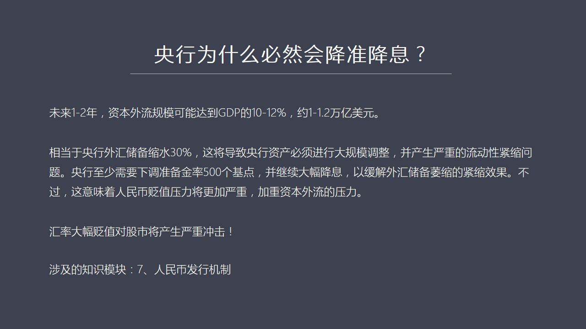

资本外流可达1-1.2万亿（GDP 10-12%）→外储缩水30%→1美元=6.3人民币乘数收缩→需降准500bp→但加重贬值压力。

<strong>All subtitles</strong>

> 这就涉及到另外一个只是某块了就是我们人民币的发行机制人民币是怎么创造的是怎么发行的是怎么进行信用放大的这个只是某块未来我们也会以文字的形式推
> 送给大家在这里我们简单地说吧由于现在美元还留这种逆转未来会出现一个基本状况时在一到两年之内我们的资本外流的总规模有可能达到一万一到一万二千亿
> 美元这个规模那么也就是达到中国GDP的10%到12%了这也相当于什么呢相当于我们的外汇储备会大幅搜水30%那么这种外汇储备搜水将会使中国所对
> 应的货币这个流动性发生大规模的紧缩这就涉到这个迟失某块人的内容我们的货币创造是以美元为这个抵押品一美元创造6.3如果你这一美元没了我创造的6
> .3也会出问题也就是当你消掉一美元的时候同时你也会消掉6.3所以美元下下30%因为这基础货币将会收缩同等的规模基础货币收缩将使银行整多的现在
> 体系所建立的基础也就是这个准备金如果它被收缩了那么银行的资产也被迫就是银行的这个流动性也将被迫收缩这样的话就会出现所谓前荒的问题社会中本来有
> 很多钱我们说应得这么多钱怎么会突然发生前荒呢会的当你真正理解银行体系货币创造了原理和流程你就会知道所谓的硬钱是怎么回事为什么基础货币收缩外后
> 主席收缩会导致整个银行体系出现流动性的突然紧缩所以为了对冲这种紧缩中央银行必须要下调降准备金因为我们的准备金现在比较高我们还有很大的空间向下
> 调调降准备金的这个过程其实就是环节银行体系由于外出会减少所面临的紧缩的压力那么这种下调的规模至少要达到500个基点才够所以我们现在看到的银行
> 每次调降几十个基点几十个基点那还差的远真正要对冲美元的收缩还需要好几倍以上的力度但同时还需要大幅降息我在以前节目中曾经说过中国以现在的目前的
> 负债状况利息成本这个利息的规模应该下降到2.5亿下才有可持续性否则的话债务对机会越来越大这就会导致我们的降息和降准将会在未来一到两年之内会不
> 断地出现就是利息会越来越低准备金率也会越来越低但是在这个过程之中你这样心在降准就会使得金融少对你的汇率产生很大的怀疑就是这会又发汇率贬值的压
> 力变得更加严重那么反过来这又会加速资本外流那么当资本外流汇率贬值这两个东西同时出现的时候这个东西对于股票市场未来的冲击就会非常严重所以我为什
> 么说这个2016年要看两个重要指标外看油价内看汇率就是因为汇率这个问题现在成了影响中国整个国内经济运转中间再变成了一个核心的指标汇率稳所有各
> 行各界都能稳定汇率要不稳投资信心就会崩溃投资信心崩溃之后你会发现对各行各界的投资都会严重的萎缩所以它不仅仅是像很能所说的而我贬值百分之十而我
> 们的出口会增加不是那么简单你要真的是贬值百分之十甚至更多的话那么你市场信心就没了市场信心没了大家都不敢再投钱因为不知道未来会怎么样这种投资的
> 萎缩各行各界这种投资萎缩将会使你出口所获得的那个那一点点所谓因投小力变得无足心重所以这个汇率问题可以说是未来一段时间一到两年之内影响中国经济
> 安全和金融安全的至关重要的识标那么有了这些基本的知识之后我们有了一个基本的框架也看到了美元环流逆转所造成的全局性的影响那么现在可以来探讨一下
> 在这种情况之下中国经济未来的整体态势三五年之内甚至更长一段时间将会出现一种什么样的情况呢这就是我上星期给大家出了一个讨论的题目

---

## Part 5：L型经济的国际与国内因素

### Slide 15 — 为什么中国经济将呈现L型态势

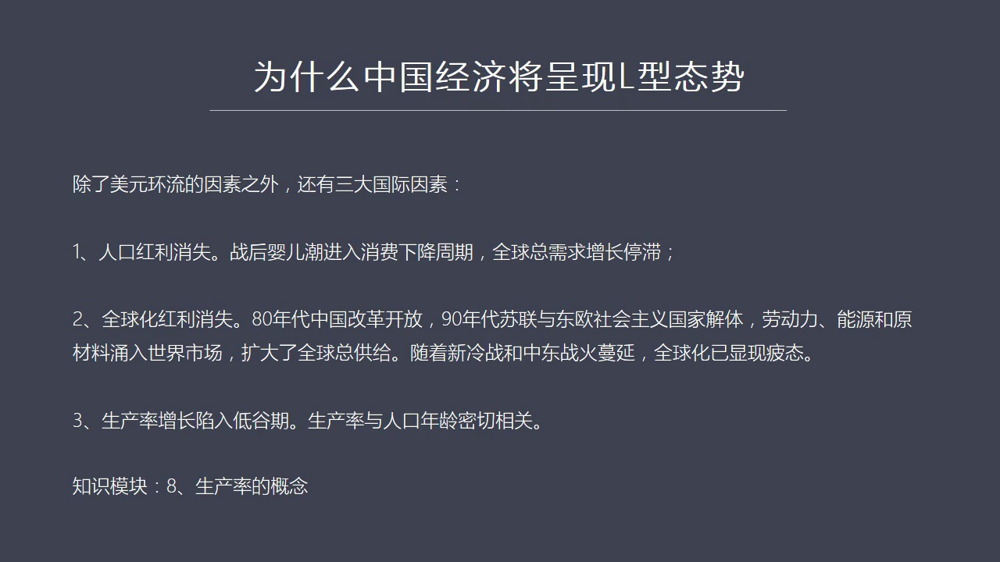

L型经济国际三因素：人口红利消失、全球化红利消失、生产率增长低谷。

<strong>All subtitles</strong>

> 就是怎么来看待经济权威人士对于未来经济的一种解读我们不知道权威人士是谁但是我们知道他的解读在一个点上我是非常赞同的就是中国经济不会出现优形反
> 弹更不会出现微型反弹最大的可能是出现L型反弹这个不叫反弹了应该出现叫L型的这样的一种态势就是中低经济增长原因刚才我说的说了半天最重要的一点是
> 美元环流的这种影响全世界都出在货币紧缩的状态之下在美元这个环流逆转之后那么除了这个原因之外其实还有三个主要的国际因素也非常的关键也会影响未来
> 中国经济的走势第一个因素就是全球人口红利发大国家的这种人口红利正在快速的消失我们都知道二战结束以后因为二战减入了太多的国家欧洲、
> 亚洲包括这个美国全部都参战所以全世界是疯火消烟在这样情况之下生育当然被大大的延迟了所以战后出现了各个国家都出现了一个大规模的因尔潮比如说在欧
> 洲和美国出现了就是从1946年到1964年这个长达进进20年的这个人口出称高峰期1000多万人比如说美国这个有一千多万人三战这些人不打仗了回
> 家干吗结婚生孩子呀欧洲也是几千万人不打仗了回家结婚生孩子所以在那个階段中出生了大批的人口这些人口那么他们现在已经到了消费的尾缩期了进入了消费
> 下降的周期所以在这样情况之下全球的总需求增长是处在平智的状态就是为什么金融危机之后准确说2008年就是周期的拐点消费周期开始下降的拐点从20
> 08年到现在不管是欧洲美国还是日本还是其他的这种国家经济的复苏的步伐都非常的慢如果我们看报道地还指数关于全球贸易的这种各种参数你会发现这一轮
> 复苏是相对于其他的这个经济危机之后的复苏是非常的慢的其中一个根本性的原因就是由于人口狐狸没有了全球开始进入老灵化所以总需求停智了总需求不增长
> 了甚至下降在这种情况之下你怎么可能还有经济增长呢怎么可能还能有这个对外贸易的扩张呢这都会出现问题所以这个是中国未来经济要面对一个整体的国际的
> 人口这样一个不断恶化的这样的一种趋势所以你在这样的情况之下很难这个所谓逆流而动你很难走的很快这是第一个原因第二个原因是全球化的狐狸消失了我们
> 知道全球化在这个过去三年中间使得各国经济发展包括全球市场不断的膨胀你比如说80年代中国改革开放了所以我们最先加入了这个我们这个首先加入了国际
> 大循环劳动力这个成本很低所以外来投资我们的国内的开放包括改革包括200年之后加入世贸使得中国跟国际上全面结轨之后中国的生产的这种成本这种优势
> 得到了极大的发挥包括各国的投资所以给全球化带来一个重大的推动力量除了中国之外90年代我们看到90年代初苏联和东欧以前的社会主义国家分分解体在
> 这样的情况之下就是中国的因素加上全苏联和东欧的这种因素两者交在一起使得这个全球的劳动力能源和原材料大规模的新增的这种增量用入了世界市场所以扩
> 大了全球这个总的共挤的规模这个是我们在过去很多年过去30年看到全球增长了一个非常重要的一个推动力量就是全球化由于中国的加入由于全苏联和东欧集
> 团的加入使整个市场的规模进步扩大总的共求跟这个规模弄大所以这个使得各国军政党都进入了快车道但现在的问题是这个红力基本上已经消失了现在所面临的
> 问题是新冷战俄罗斯跟美国在对差欧洲和美国联合起来围角俄罗斯那么东欧的很多国家像烏克兰现在已经卷入了一个强大的两大阵营之间例子很不好过还有一些
> 其他的国家现在也都出现了问题上中东现在可以说是战火在不断的蔓延而且未来有进一步升级的趋势所以我们过去看到了很多全球化的红力现在出现了密转所以
> 在这样情况之下第二个有力因素又没了那么第三个就是生产率的增长全球化原之内都陷入了低谷这个关于生产率这又是一个重要的知识模块其实这是经济增长中
> 最关键的一个概念那么这个概念我们以后将以模块的形式来专门来论述总而言之这个生产率增长它是与人口的年龄是有密切关系的就是一个人什么时候最具有创
> 造性当然是二十三十多岁的时候是最有创造性的年龄再大脑子里有太多框框了包括体力经历不行了包括家庭事业总统因素的干扰使得它的创造能力创新能力用于
> 常试新东西的能力都会伟缩停止我们看历上很多著名的科学家的科学发明都是在二十多岁完成的像牛顿、
> 安斯坦都是这个情况其实我们看这个如果做一个统计的话你们会发现人口的年龄跟生产率之间存在着非常高度的相关性所以考虑着三大因素就是除了美元还留这
> 个因素之外还有三大不利的国际因素这三大不利的国际因素将会影响严重影响中国的经济发展因为我们对外的一层度是比较高的所以如果国际上整体情况都不好
> 我们的情况能好的哪去那么具体来说关于人口红利的伟缩我们如果从数据上和图表上来看你会发现比如说一美国威力吧

---

### Slide 16 — 发达国家的婴儿潮退潮

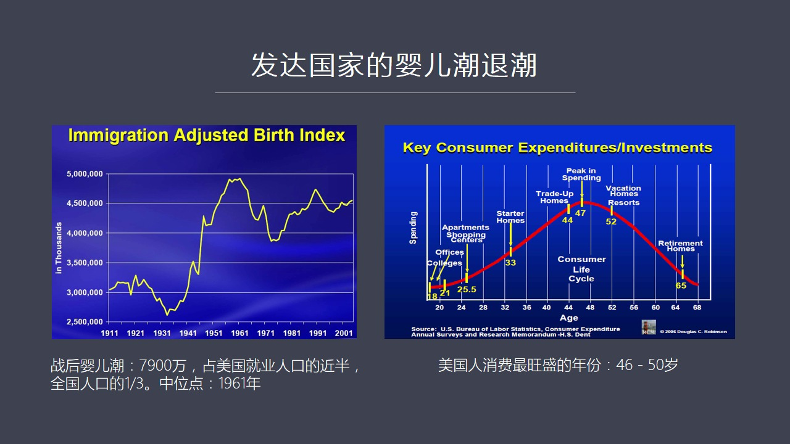

美国婴儿潮7900万人（1946-64），中位1961年。47岁消费拐点→1961+47=2008→金融危机。下一批缓解要等2020后。

<strong>All subtitles</strong>

> 我们看到这个PT争左边这张图是代表美国的出生率人口出生的一个这样一个图形在这个图形之中我们会看到当然这个图形中是包括了一名人口在内的调整个一
> 名人口的我们会发现在美国的二战结束之后1945年以后一直到1964年之间美国出现了个巨大的一个人口高峰期就是战后云人潮那么它的时间中一点就是
> 这个整个这个人口出生高潮的一个时间的中一点在中间点的哪让是1961年那么在这个阶段中一共出生了多少人口呢7900万也就是战美国这个人口的接近
> 一半战全国人口的31所以呢这一批人口構成了美国巨大的一个社会群体那么这个群体的人到了19比如说他的中位出生点是1961年也就是说我们可以如果
> 把7900万人当成一个人看的话那么1961年是一个70点那么当当他到了80年代出的时候也就20出头了大学毕业了整个对待人开始进入劳动力市场开
> 始进入就业市场开始不断的去工作操作财富然后结婚生孩子养养糊口这一系列的这个人口高峰期所带来的就是消费的大规模的增长为什么中国在80年代改革开
> 放一改革开放就碰上瞬风瞬水的一个国际上的大了行情因为全世界的人口都在那个80年代初开始爆发它的消费能力开始爆发所以我们改革开放马上就出现了一
> 个风潮与顺风瞬水的局面这跟背后的国际上的人口的周期有密切的关系我们不能够仅仅说是我们的政策正确这是原因之一但是还有更大的客观原因这个客观原因
> 就是全球发大国家的消费力最强的这些国家它的人口的这个年轻的这些人口进入劳动力市场之后创造了新增的大规模的这种消费能力这使得中国的出口导向当年
> 出口导向能够顺利进行这是一个非常重要的客观原因但是人口消费它是存在一个明显的时间周期的如果我们来看PBC右边这张图你会发现一个人这是以某一个
> 人就是以这些所有人口中间的一个人代表全体人口那么以这个时间周期来看比如从20岁到80到780岁吧恒作标是它的年龄纵作标是它每年花多少钱你会发
> 现一个人在20出头的时候有很强的消费欲望但是却没有多少钱因为刚工作经验不足 挣钱少随着经验的积累 资历的增长它的收入也会不断增长消费开始逐渐
> 的提高到什么时候它消费达到人生中最高的那个顶峰就是47岁这个47岁当一个人它的资历 它的能力 它的职位收入达到了顶峰的时候它的消费欲望 也正
> 好能够匹配它的收入 这个时候花钱是最猛的虽然这是一个我们从图像来看这是一个点心的中心体现在这个学院中我们会看到其实它反映的不仅是美国的这样一
> 个人口消费的一个情况也是具有普遍意义的对其他国家人也同样是用那么47岁以后我们会发现一个人消费 每年的消费达消费的经验是逐渐下降的原因很简单
>  就是我们人体老化之后你的各种欲望都会自动了下降包括你对未来收入的预期也不像年轻人感觉那么好就是以后一定会工资越长越高到47岁之后你开始考了
> 羊老的问题了它是考虑到自己未来上市劳动能力就收入下降了问题了再加上自己的欲望的下降这都会造出消费的下降这种消费下降也是逐年避检一直到60多岁
> 从期回到了22岁那个消费的水平所以我们如果观察一下周围的老年人父母等等你会发现他们的人的每天遇到其实并不高 并不是每天都要下管的山山海味往往
> 就是常味不好我就吃点西饭 吃点泡菜就很好了感觉反而容易消化也失去了对社会品的那种高度高度的那种追求也不太追适忙了不用三年换个跑车五年换动新房
> 房居也买越大其实不是这样的到老年之后大家会由于体力精力包括身体情况的越来越弱它的消费能力 支付能力包括消费欲望都会下降所以这条曲线起先出了一
> 个重要的规律就是47岁是一个社会做一个群体一个年龄段的人吧在47岁他达到一个顶点那么这个顶点我们如果参照左边这张图来看的话1961年出生的婴
> 儿潮什么时候达到47岁呢正好是2008年这可不是一个偶然为什么2008年会爆发金融危机就是因为到2008年时候7900万人让这些领口一半的人
> 在2008年那一年整体上进入了消费的下滑周期超过了47岁了他是逐渐走下坡路了所以我们来看在研究经济问题的时候要掩观六路而听八方不要只丁着这数
> 字看你还得了解背后一种更大的趋势这种趋势的东西其实有更决定性的主导的作用而以前你是连这个趋势都不知道这也是我们宏观宏军院包括我们现在这种课程
> 要告诉大家发现一些新的以前从来没有发现的一些重要的参数和指标而他又得经济有着严重的影响而以前你居然不知道所以呢我们来看一下为什么2008年之
> 后经济复苏不正这就是一个重要原因那么根据美国这个人口周期你会计算出来就是我在货币2货币2中间进行这个指出的美国这一轮消费周期的下滑一直要等下
> 一批就是1991年那个人口高峰期来到了时候他才能够还解这个时间将会到2020年以后所以在这段时间之内发达国家整体上欧洲这个日本加上美国整体上
> 都是出在消费总的需求下降的阶段在这种情况之下中国怎么可能实现微型反弹或者有型反弹这是做不到的因为全球的消费能力都不足当然这个欧洲的情况比美国
> 要严重因为欧洲人口出生率低于美国日本就更差日本已经出在深度老铃化阶段所以日本的经济不管你用各种经济政策货币政策都不见效重要的原因就是你无法逆
> 转人口的年龄周期你不能逼着一个八岁的老年人成天去下管的去买新车你即便是把力力降到了复数他也不干因为他的身体吃不消所以在这种情况之下一个国家要
> 适用这种货币刺激和财政刺激因为无效因为对老铃化的人口来说你刺激他的消费欲望这几乎是没有任何办法能做到的事情这是自然规律所以我们一定要改变那种
> 认为政策可以解决衣性问题只要我们有主观能动性我们就能够通过政策逆洲期运行其实很多周期一直不可逆地向人口周期所以这也是我为什么比较同意在RO型
> 的经济发展它之下再用中国再用货币宽宗财政刺激想要获得一个更高的增长率这在全球普遍的人口老铃化情况之下这是很难实现的而且会给得更大的负责用除了
> 这个之外除了国际因素之外中国出现RO型经济发展还有三个最主要的国内因素首先第一个中国也存在人口红利消失的问题中国现在人口周期已经快速进入老铃化了

---

### Slide 17 — 中国经济L型态势的国内因素

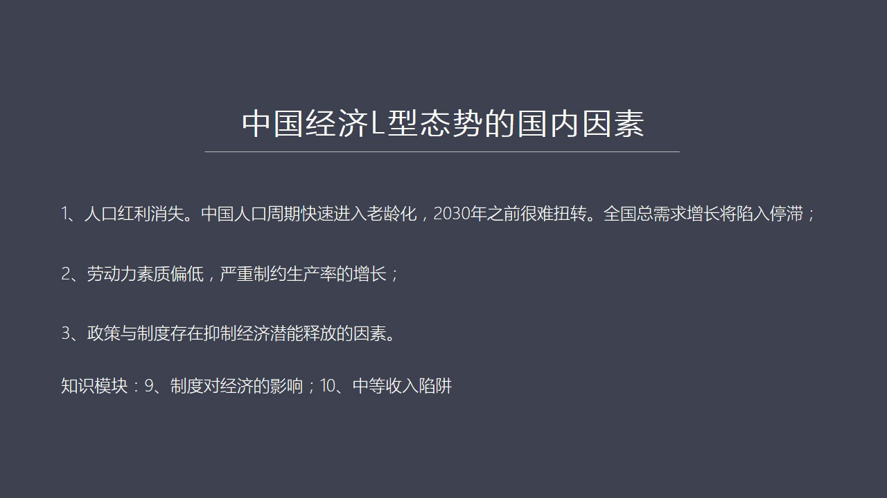

国内三因素：人口老龄化（2030前难扭转）、劳动力素质偏低、制度抑制经济潜能释放。

<strong>All subtitles</strong>

> 那么这种老铃化到2030年之前都很难扭转这是由于我们就把生意政策人为造成的一个现状所以中国的国内总需求再未来很长一段时间之内增长也是法力的或
> 者说是它的发展是停智的这跟全球的情况是保持同步的第二个我认为也是一个很大的问题就是我们的劳动力的普遍素质太低大量农民工进程之后其实并没有真正
> 的完成市民化这个过程也就是他们带着农村的这种意识进入城市而并没有相应的提高劳动的技能包括劳动力的素质所以我们会看到很多由于素质上的影响所导致
> 的质量问题和经济升级转型上所面临的困境这都是素质太低或者偏低造成的而这种低素质又严重制约了生产类的增长为什么我们说升级换带汤农换鳥这种口号提
> 了很多年但是很难真正做到就是出现一大批高经兼的这种产业为什么很难做到一个很重要的原因就是我们的普遍的劳动力素质太低所以改变劳动力素质这是一个
> 未来最大的一个挑战这个挑战它的难度甚至超过了人口老临化如果人口老临化你有较高的劳动力素质可以在很大程度上避免中等收入陷阱问题但是像我们现在既
> 是劳动力画人口又是劳动力偏低的人口这两者加在一起就是问题更加复杂化了当然了第三个因素就是我们的政策和制度普遍存在的意志经济潜能释放的这种东西
> 这个主要所起来我们在国内市场中其实并没有真正实现统一的伤还存在很多信息的孤导包括市场的额列、
> 区域化的额列地方保护主义还存在着国企转型论体就是一个企业它的中心目标应该是盈利这应该是它最主要的目标而不应该让它承担社会责任社会承担社会责任
> 应该是政府的工作不能让一个企业同时做了两件事情这就跟一个人一心不能二用到底是一样的你在一个时间之内永远只能有一个优先不能说两个东西同等重要当
> 你听到认同说两东西同等重要的时候它就意味着两件事情同等的不重要所以在这个企业改革包括国企的能量释放还有很多工作需要做当然这个是我们可以这是一
> 个更大的话题我们将会有一个专题的形式再做这个深度解读在这个方面呢其实又设计了两个重量只是某块一个是制度对于经济活动的影响这就是西方制度学派的
> 这个星期当然了我们这个事情某块不可能涵盖整个制度学派的所有理论但是将会提出中间最重要的就是它的歷史背景还有它的核心观点对经济的这种影响就是客
> 观的探讨制度对经济到底会产生什么样的影响在什么条件下有什么样的局限性第二个制度学派就是中等收入限径这个概念现在被提的很多但是什么叫中等收入限
> 径怎么来定义中等收入限径中国会被出现中等收入限径等等这些问题这也将够成一个制度学派那么如果我们具体来看

---

### Slide 18 — 中国主力消费人群已到47岁拐点

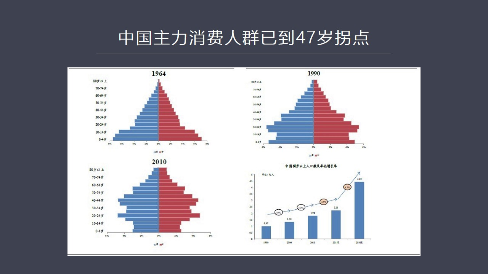

中国人口金字塔：1964金字塔形→2010反转（底窄中宽）。60岁以上人口2030年达4.6亿。

<strong>All subtitles</strong>

> 来看这个中国人口的一个分布图从60年代一直到现在就是到最近2010年人口普查我们会发现中国的主力消费人群已经逐渐的老灵化了在60年代我们的是
> 一个金萨形这是一个非常良好的年轻人口的这么一种形状到90年代这个形状还基本上可以但是到了2010年到了5年多几前我们的形状出现了一个反转成了
> 一个更越来越多的就是你的金叉的底部越来越窄也就是上面这个上面中间这一块越来越大而底下越来越窄这意味着整个经济的负担会日件沉重以我们刚才所说的
> 47岁作为一生中消费的顶点你如果看20年这种图你会发现44就是40到40岁这批人在现在已经进入了消费的顶风期这批人是哪些人呢其实就是我们这个
> 年轻人就是60年代70年代60年代末年代初集中出生了一大批人口这批人口和我们下一个世代也就是10年之后这批人共同构成了中国现在最重要的消费群
> 而且这个消费群体在人口中的比例非常的大但不幸的是这批人已经达到了47岁或即将达到47岁这意味着在未来的十几年中间我们的人口的总的消费的能力在
> 47岁之后将会消费将会下降这也是一个不可逆转的人口的规律这对于未来整个市场的扩大都会造成很严重的制约和影响所以现在为什么要紧急调整这个一台化
> 的政策可以生两台甚至完全放开这都是必须的现在起步已经太晚了因为按照目前的人口这个周期我们若看下也我们会发现到2030年中国这个人口的年龄的形状

---

### Slide 19 — 2030年以后，中国与目前日本相似

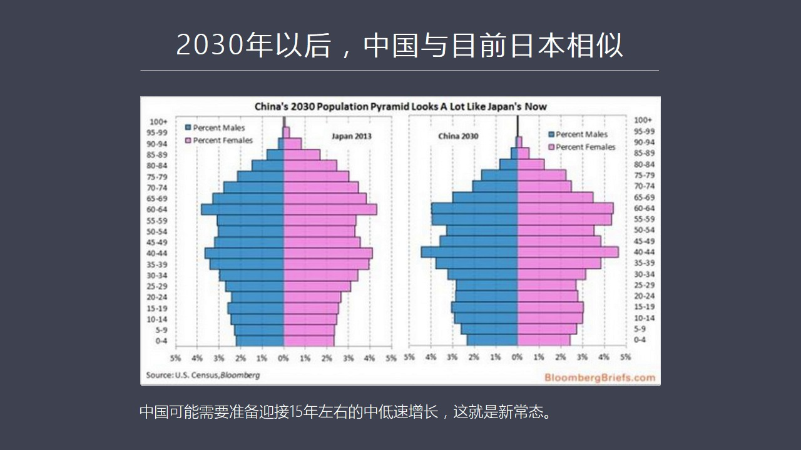

中国2030年人口结构≈日本2013年。结论：15年中低速增长新常态。

<strong>All subtitles</strong>

> 将非常像2013年的日本我们知道日本进入这个形状之后经济上基本上就很难通过政策来扭转了无论责心什么样的政策日本的经济就是起不来利率已经到复数
> 已经开始搞复利率了然后国债已经膨胀到GDP是百分二百五了全部的总复债和GDP是已经通到了512了在这么高的复债这么大的财政刺激和这个应该说是
> 非常的极端的货币刺激手段之下日本的经济仍然起不来不是说日本劳动力素质不行也不是说日本企业没有精正力他们还是在很多领域上占据国际优势的但是日本
> 国内的人口的老灵化决定了日本经济起不来这是我们在2030年之后将会看到中国可能会出现类似于日本的这种情况在这种情况之下各种政策恐怕也会普遍地
> 达不到我们预期的效果所以如果从长期来看中国这个可能要准备迎接15年左右的中低速增长这就是我们所说的新常态也就是L型这个判断基本上是符合实际情
> 况这个不是一个乐观的判断但是它比较客观和符合实际情况那么大家很可能会问既然情况是这样既然国际情况、
> 国内情况存在的一系列的这种困难那么未来中国会怎么办经济该如何托为呢我想这就是我们下一讲要讲的重点希望在下一讲中我们来全面解读一下共几次改革包
> 括中国走出去战略等等各方面如何能形成一种合力包括人民币国际化等等这些问题才能够使中国在一个不利的国际环境和一个人口的一个老铃画的状态之下怎么
> 样才能实现一个最佳效果这个可能是我们下一期要讲的一个重点问题那么在最后我们以后在每一讲中间都会推荐一些月毒的一些书籍当然这个书籍有些是英文有
> 些是中文如果英文比较好的同学他们可以看完之后可以给大家做一个分享那么这次我们所谈到的一些主要话题我可以给大家推荐货币战争当然这是我自己的书中
> 间很多知识模块跟这一期的书是有关的另外还有一本书我觉得写得不错就是布雷顿森林货币战这个就是大家可以结合的布雷顿森林体系知识模块来进行月毒还有
> 一个就是美国的一个经济家Harry Dent他讲的其实就是一个人口周期对经济活动的影响包括这个包括在一定年龄断之后的消费的下降对整个宏观经济
> 会構成什么样的冲击这个书写的也比较应该说比较有前占性我最后希望我们这些宏约的同学们未来不仅是有强大的逻辑分析的能力同时也要学会购建体系的能力
> 也就是换一个角度看问题换一个角度看问题会形成不同的事业在这个基础之上形成一个新的构架这个新的这个框架然后来成批量的这些问题这是我对大家的一种
> 希望也是我们上这堂课或者上这个现场课程最大的一个希望就是希望大家都能够尽快的成长起来尽快的获得这样的一种知识体系好 今天我们的课程先说到这里
> 希望大家回去认真思考然后完成作业并且参加周末的讨论好 谢谢大家

---

## Part 6：总结与推荐阅读

### Slide 20 — 课程总结与推荐书籍

推荐：《货币战争》、《布雷顿森林货币战》、Harry Dent人口周期著作。期望：构建体系能力，换角度看问题。

<strong>All subtitles</strong>

---
