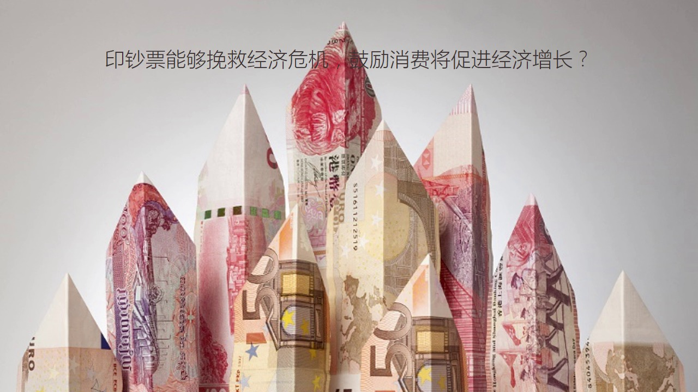
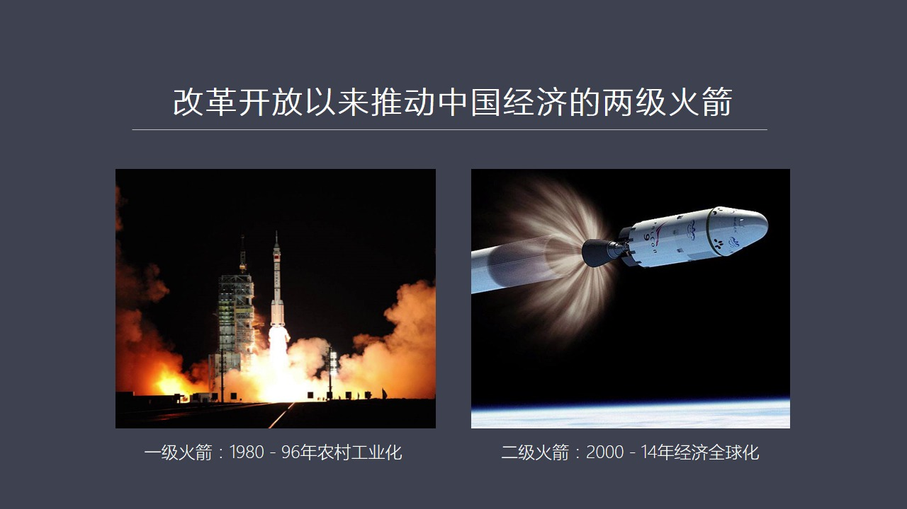
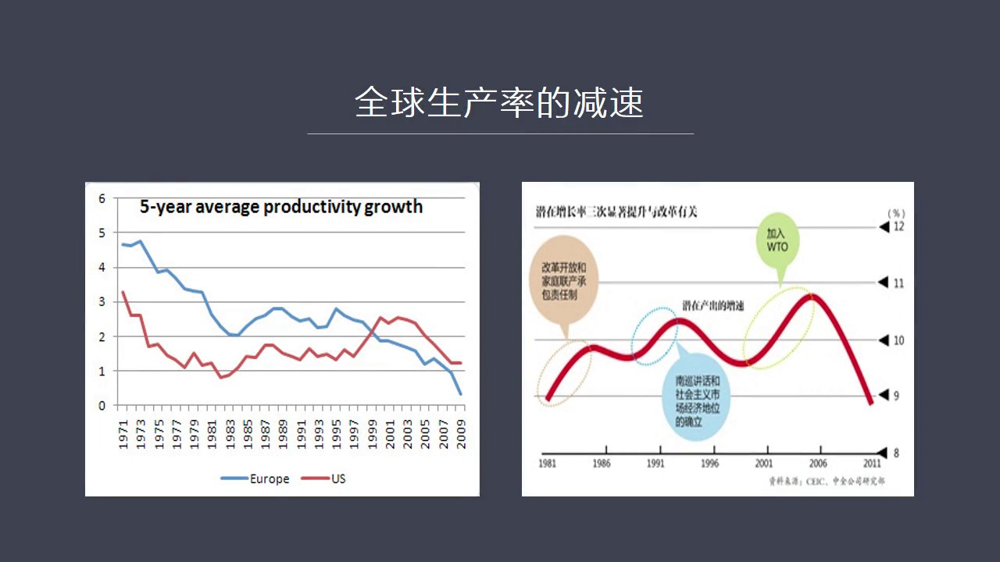
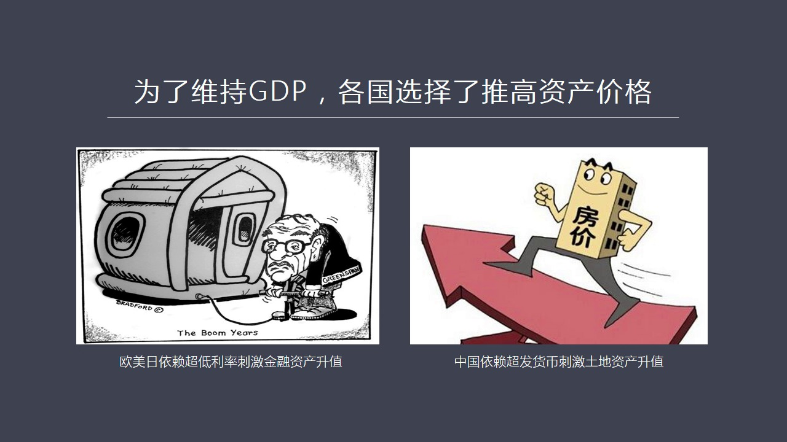
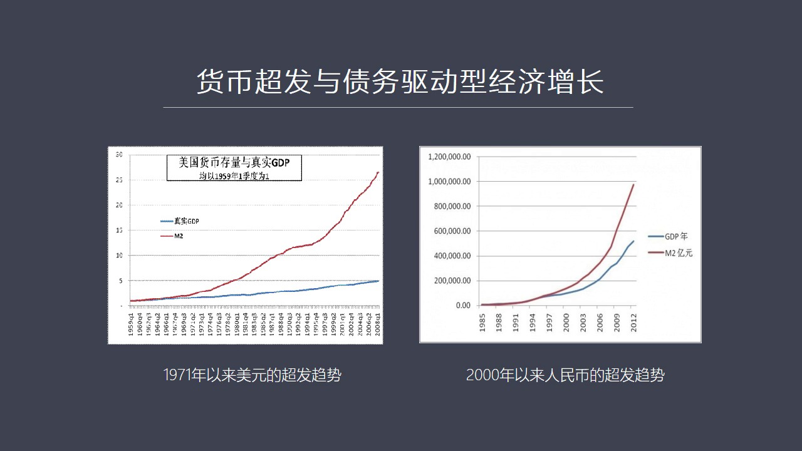
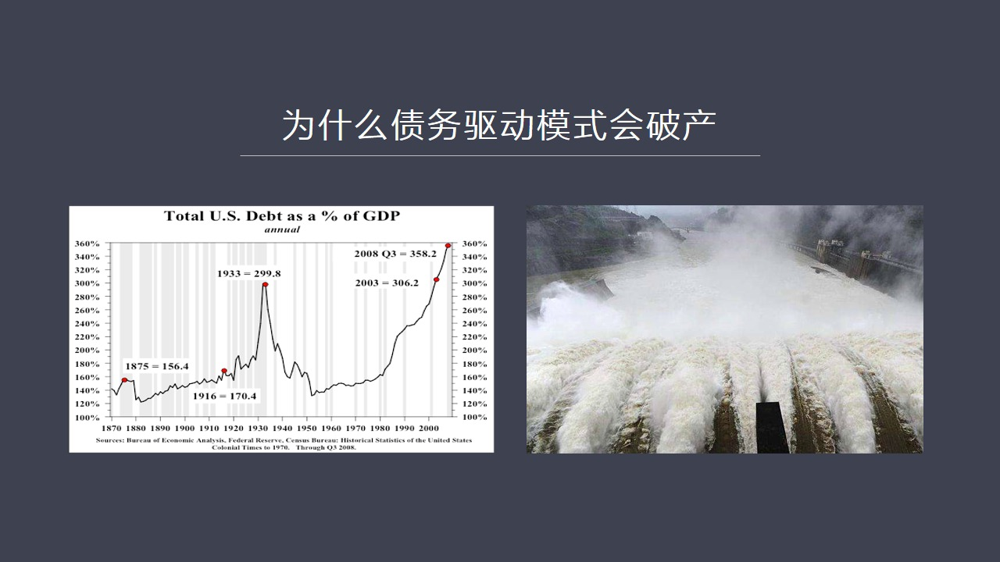
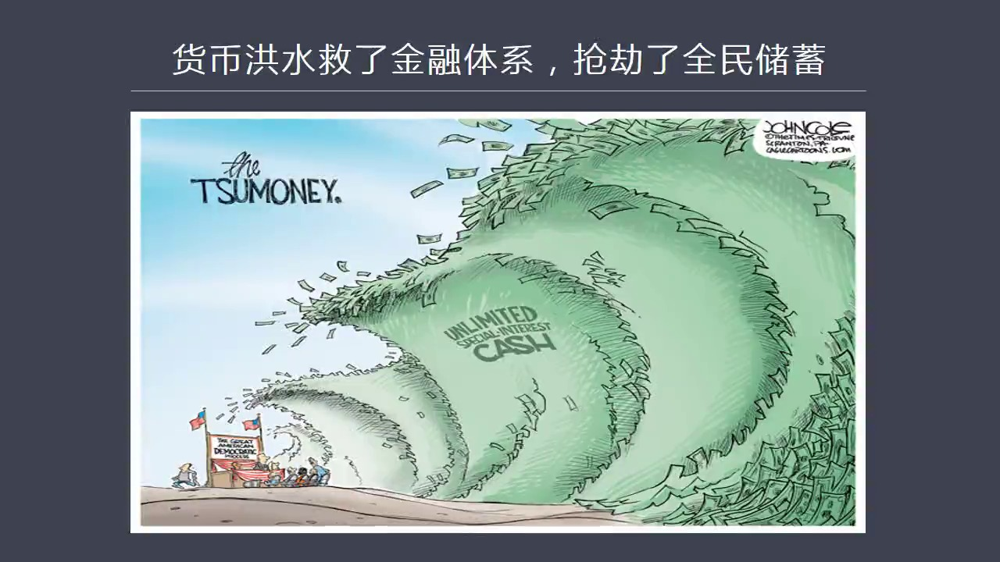
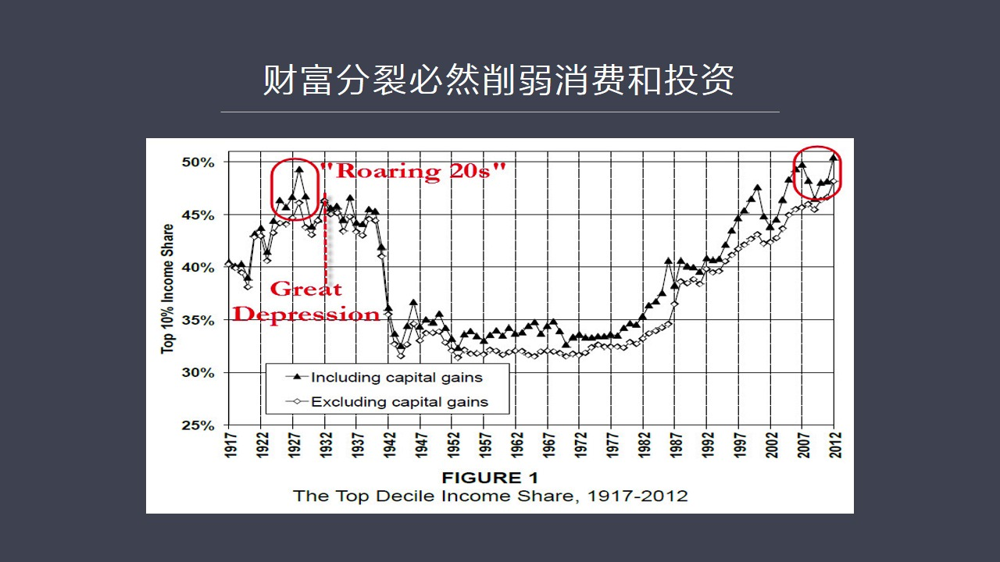
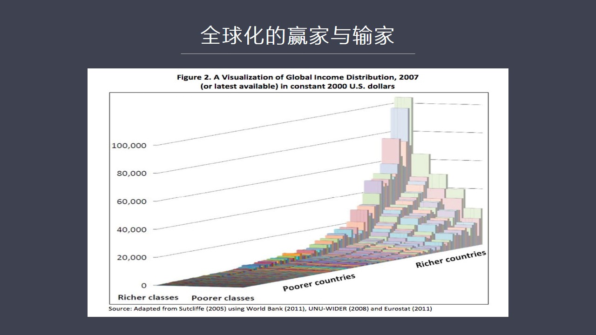
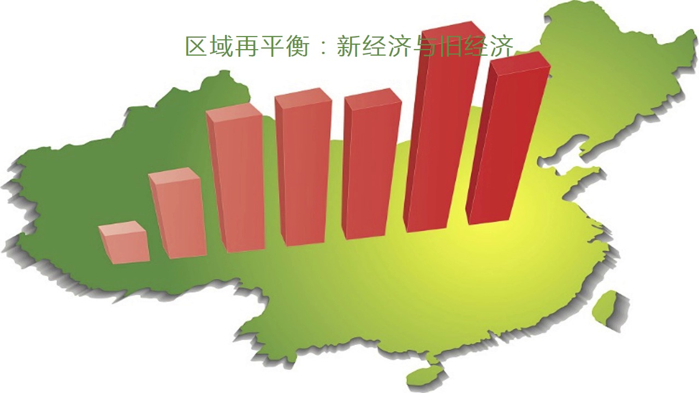

# 核心课视频-002.破解中国经济瓶颈之谜 — Slide Notes

> **来源**：鸿学院核心课程  
> **幻灯片**：28 张

---

### Slide 1

这堂课的中心是破解中国经济平静之迷我记得在上堂课的时候我曾经专门提到过我们这堂课最主要的目的是培养大家的体积思维能力那么第二堂课我们继续沿着体积思维方向进一步推进去找到究竟是什么困扰着当今中国经济发展最大的平静究竟是什么在上堂课结束的时候我曾经说到现在中国经济面临很多困境这种困境主要原因两个方面国际...

<strong>Cleaned narration</strong>

> 这堂课的中心是破解中国经济平静之迷我记得在上堂课的时候我曾经专门提到过我们这堂课最主要的目的是培养大家的体积思维能力那么第二堂课我们继续沿着
> 体积思维方向进一步推进去找到究竟是什么困扰着当今中国经济发展最大的平静究竟是什么在上堂课结束的时候我曾经说到现在中国经济面临很多困境这种困境主要原因两个方面国际困境和国内困境

---

### Slide 2

国际困境中间短期来看最主要的原因是美元环流的逆转这使得全世界各个国家特别是欣赏国家遭遇到了当前我们所面临的各种各样的困难但是还有一个困境就是从国际角度来看有一个长期的困境这种困境就是我们最近看到英国脱工头的通过当然不见得这件事情最终它能够做成但是这体现出了一种日益激化的一种政治上的斗争从英国内过来讲...

<strong>Cleaned narration</strong>

> 国际困境中间短期来看最主要的原因是美元环流的逆转这使得全世界各个国家特别是欣赏国家遭遇到了当前我们所面临的各种各样的困难但是还有一个困境就是
> 从国际角度来看有一个长期的困境这种困境就是我们最近看到英国脱工头的通过当然不见得这件事情最终它能够做成但是这体现出了一种日益激化的一种政治上
> 的斗争从英国内过来讲也就是英国的统治基因阶层和99%的平民大众在全球化过程之中对于这种利益分配现在产生了尖锐的对立而这种现象不仅在英国存在同
> 样在世界其他的国家也普遍存在比如说在美国这是一种像2011年战灵花尔街运动还有现在特朗普在大选中所获得的各种各样的草根阶层的支持这都反映一种
> 共同的趋势就是在过去的30年中的全球化进展使得财富分配出现了严重的贫富分化在这样的条件之下也就是1%的人获得了财富越来越多而99%的人财富的
> 比例在下降这是一种全球性的趋势而英国这次攻头把这个矛盾直接和鲜明的体现出来这个可能会是长远来看的全球化的进程出现越来越大的逆转的可能性我在很
> 多场合下都强调过当今的全球化它有可能遭遇到倒春寒或者面临一种逆转的可能主要原因就是这种全球化的利益分配严重的不合理目前现在是1%的富人战友5
> 0%以上的全球财富换句话说1%人所拥有的全球财富超过了另外99%的财富的总合这意味着按照这样的恶化趋势发展下去也就是几年之后这个比例还会进一
> 步上升这种惯性比如说2014年他们1%人所战友财富是战比是40%两年之后现在到了50%这种惯性的恶化发展下去的话我们很可能看到两年或者五年以
> 后这些人的战比是不是会进一步上升到60%甚至达到70%如果到了这样的一个情况我相信总有一天会出现更强有力的这种平民反对精英的这样一种冲击也就
> 是强烈的要求改变现行体制无论口号什么出发点是什么都是要颠覆现有的全球化的进程这就会带来一个中长期的不利影响就是全球化逆转全球化一旦出现逆转的
> 话再就意味着战后所形成的全球统一市场有可能再度出现被割略而我们中国在过去30年应该是这一轮全球化中间的主要受益者之一而我们的经济规模现在是以
> 全球市场作为配置这就是使得我们的生产量资源的需求量变得空前的庞大而这种配置使我们在全球化过程中继获的利益又出在了一种非常不稳定的状态之下我们
> 严重依赖全球市场如果全球市场一旦出现割略这就意味着贸易的区域化包括货币区域化将会变成一种明显的趋势在这种情况之下市场将会被分割贸易战货币战将
> 会刺激比赋这对中国的出口乃至中国整体的经济布局都会产生重大的冲击这是国际方面一个中长期的一个理由那么在国内方面我们也面临着各种各样的问题比如
> 说上期我提到的人口老零化这就是中国国内的长期的一个理由我们到2030年时候所出的人口的结构将跟现在的日本非常的类似也就是经济有可能陷入长期的
> 维密不正这是人口周期所决定的除了这个之外我还提到了生产率的停治是全世界一种普遍现象那么在中国也出现了生产率的增速不断的下滑这样的趋势那么今天
> 我想重点谈一下生产率的问题在我看来生产率这是整个经济繁荣的一个根本性的推动的力量

---

### Slide 3

我们称之为经济繁荣的引擎为什么把生产率提到这么高的这样的高度来看如果我们来看人类的文明史包括最近一段时间的进300年以来的工业化你会发现真正的动力所有的经济繁荣的动力都源于不同类型的这种创新不同领域的这种创新提高了生产率而生产率的提高创造了更多的财富改变了社会改变了经济 改变了政治结构一切都圍着生产...

<strong>Cleaned narration</strong>

> 我们称之为经济繁荣的引擎为什么把生产率提到这么高的这样的高度来看如果我们来看人类的文明史包括最近一段时间的进300年以来的工业化你会发现真正
> 的动力所有的经济繁荣的动力都源于不同类型的这种创新不同领域的这种创新提高了生产率而生产率的提高创造了更多的财富改变了社会改变了经济 改变了政
> 治结构一切都圍着生产率而展开如果我们从计划论的角度来类比一下其实这个规律也是非常明确的生物从简单生物向复杂生物进化过程之中最突出这个特点就是
> 出现了器官的分工越来越专业化的这种器官负责了生命活动的各个主要的组成部分那么它最后的结果是导致了生命体不获 外界能源能量包括以食物形式体现出
> 来这种能量的能力得到了大幅提升就是最有效的获取外部的这种资源并转化成内部的这种营养这样使得个体能够不断的成长发展种群不断的壮大完成了这种进化
> 的过程那么经济体其实也一样在经济体中间这种效率主要以生产率的形式来体现应该说生产率是整个经济发展的中心问题也是核心问题一切的社会的变化 经济
> 结构包括政治制度的眼镜都是跟生产率密切匹配的就是生产率提高到一定程度之后会触发整个经济结构发生变化同样也会引发政治体系随这而变都是为了最好的
> 满足生产率提高的这样的一种要求所以生产率是经济繁荣的最主要的推动力量说到生产率我想从一个简单的例子就是从一个列人打列的这样的一个例子入手来深入分析经济学中间的一些最基本的概念

---

### Slide 4

比如说在古代的时候有两个这种列人一个列人主要是用缩标打列那么他在打列过程之中因为使用这种缩枪这种标枪进行瘦列他最大的问题是什么呢就是你必须得跟着这个动物奔跑这样的话你体力消耗就很大而且投射的整角度就是射中这个列物的整角度也不高然后还会暴露自己的目标是属于一种能量消耗极大但是收获有限的一种不列方式我们...

<strong>Cleaned narration</strong>

> 比如说在古代的时候有两个这种列人一个列人主要是用缩标打列那么他在打列过程之中因为使用这种缩枪这种标枪进行瘦列他最大的问题是什么呢就是你必须得
> 跟着这个动物奔跑这样的话你体力消耗就很大而且投射的整角度就是射中这个列物的整角度也不高然后还会暴露自己的目标是属于一种能量消耗极大但是收获有
> 限的一种不列方式我们可以称之为生产率比较低下那么有一天这个列人发现另外有一个列人是在用弓箭瘦列弓箭瘦列最大的好处是什么隐蔽性强准确度高而且射
> 成远节声体力不用跟着奔跑是一种服鸡战术所以呢使用弓箭瘦列这个列人他补货列物的成功的概率会远远高于使用瘦枪的这个列人所以这个列人就决心我也得发
> 展弓箭制造我也得有自己的弓箭我自己做那么怎么才能实现这一点呢因为制造弓箭是需要周期的比如说需要五天时间这就意味着在那个时代它没有多余的这种实
> 物的儲存那么你要想制造弓箭就必须得提前加班加点拼命了去补列获得更多的列物保证这五天制造弓箭过程中你不至于挨恶这这种事先儲存列物这种行为我们可
> 以称之为它是要完成一个处序的过程那么这个处序的东西是什么当然就是列物作为实物的这种列物这个是这个列人的处序它必须首先获得这种处序才能够进行弓箭制造

---

### Slide 5

那么当它获得了这种处序之后它开始了五天的弓箭制造过程这个弓箭制造有可能成功也有可能失败所以它是一个高度风险的行为这种行为我们称之为投资这种投资就是把有限的处序保贵的实物和保贵的时间用于制造弓箭而这个是要冒一定风险的如果你失败了等于前弓进气你所有的保护处序被浪费掉了当然如果你成功了就会获得生产力的大幅...

<strong>Cleaned narration</strong>

> 那么当它获得了这种处序之后它开始了五天的弓箭制造过程这个弓箭制造有可能成功也有可能失败所以它是一个高度风险的行为这种行为我们称之为投资这种投
> 资就是把有限的处序保贵的实物和保贵的时间用于制造弓箭而这个是要冒一定风险的如果你失败了等于前弓进气你所有的保护处序被浪费掉了当然如果你成功了
> 就会获得生产力的大幅提升你就会捕货更多的列物我们看到假如这个列人的弓箭制造最后成功的实现它开始使用弓箭打裂这样就会使它所捕货的列物大幅提高假
> 如这个列人以前用标枪打裂每天能够捕货三支野兔那么这三支野兔仅仅能够满足它的温宝刚刚吃饱饭而已而使用了弓箭之后它却能够捕货十支野兔也就是效率大
> 幅提升这样的话它就有了七支多余的列物那么它有了这些七支多余列物之后它干嘛呢当然了这个列人首先想改善自己的生活比如说它需要一件衣服这个时候它就
> 会来到市场说我现在有七支野兔想交换一件衣服你们有没有人愿意给我提供这个时候市场中的财逢就说我愿意这个叫接单生产实际上是由列人用列物来进行下单
> 然后财逢接到这个订单之后去从事衣服的生产最后呢列人用它多余的列物交换了它所需要的一件衣服这个过程叫消费注意啊消费的本质不是我们理解那种花钱消
> 费的本质在于交换在于你用自己更高的生产率所获得的多余的东西来跟别人进行交换这个叫消费所以我们来看我们刚才所设计到了几个概念生产率就是获得列物
> 它的一种效率什么是投资投资就是把保贵的这种食物这种列物这种储蓄用于弓箭之造什么是储蓄储蓄就是事先储备的用于弓箭之造这段时间的这种食物消费呢消
> 费就是用多余的这种捕货量取交换自己所需要的产品所以在这个过程中我们非常明显的可以看到一个经济学背后的最深刻的逻辑就是储蓄是一切的根本而且这是
> 一种真实储蓄跟我们平常所理解的银行储蓄不是一个概念因为银行储蓄中加了货币这层面杀之后是所有问题变得复杂化起来如果我们玻璃的这种货币的面杀看到
> 问题的本质储蓄就是人类可以维持生存所必须的那些物质的财富那么有了储蓄之后人们才能够有条件进行投资或者消费所以储蓄是投资和消费的来源没有储蓄就
> 不会有投资也就不会有消费所以我们在探讨经济学很多基本概念的时候要抓住问题的本质要抓住逻辑的其实点就是储蓄真实储蓄是一切问题发生的一个根源如果
> 没有了这样的基本的认识我们回过头来再看社会中很多关于经济现象的描述都会存在这一种就是逻辑上的一种荒谬也比如说我们经常会从媒体中看到或者听到别人说

---

### Slide 6

有很多这种错误的观点就是不符合这种最基本逻辑的观点也比如说战争推动了经济发展最明显例子比如说有些文章中提到

<strong>Cleaned narration</strong>

> 有很多这种错误的观点就是不符合这种最基本逻辑的观点也比如说战争推动了经济发展最明显例子比如说有些文章中提到

---

### Slide 7

美国参加二战刺激了GDP的增长加速了经济的发展也就是这是一种战争能够导致经济增长的一种非常重要的一种说法其实如果我们有了刚才这样的一种认识之后我们会发现这种逻辑从根本上来说就是错的以前我们不知道怎么去反驳而我们现在有了这样的一种思维的一种能力就可以对这种现象进行深入的分析并加以批谱比如说在二战状态之...

<strong>Cleaned narration</strong>

> 美国参加二战刺激了GDP的增长加速了经济的发展也就是这是一种战争能够导致经济增长的一种非常重要的一种说法其实如果我们有了刚才这样的一种认识之
> 后我们会发现这种逻辑从根本上来说就是错的以前我们不知道怎么去反驳而我们现在有了这样的一种思维的一种能力就可以对这种现象进行深入的分析并加以批
> 谱比如说在二战状态之下整个社会的经济运转以军火制造为中心那么你大量的刚才大量的钢铁就会被投入到枪炮制造包括军舰、
> 飞机、蛋药这都会使用大量的金属这意味着什么意味着这些军舰也好飞机也好坦克也好会在战争中会会被以相当高的速度被摧毁掉这是一种巨大的物质资源的浪
> 费那么这就意味着本来这些金属可以被用在民用工业上可以用来改善大家的生活可以生产汽车可以生产冰箱可以生产很多其他的这种民用的消费品但是现在由于
> 战争这些金属被转用这个转用于军事战争中被迅速摧毁掉这就意味着一定会出现民用工业的停制和受到了压制现实情况也正是如此在美国二战期间全国的经济是
> 受到管制的由于钢铁被消耗掉了被军火所消耗掉那么你民用工业想要发展就得不到必要的资源这个时候政府要规定哪些产业是可以发展发展能够发展到什么程度
> 比如说大家想更换其说不行因为现在我们没有这么多原材料所以你的民用的这种消费的能力是要受到压制的你想更换冰箱你想买新的冰箱这也不行因为没有钢铁
> 所以我们会看到在二战期间美国GDP的统计数据是很高的因为那是以军火为拉动的但是它的消耗速度在战争中被摧毁了所以GDP的数字再高达到了两位数但
> 是同时出现的是民用消费工业的这个压制和低迷也就是大家消费能力受到很大的压制这是在美国条件算是比较不错因为它没有直接参与战争就要在英国、
> 法国、德国这些交战国那就会出现物资的管制配几制比如说你的食物甚至到了食物都要配几的程度不要说你的消费了消费你就别想了就尽可能的减少压缩消费所
> 以在那种战争的状态之下我们不要以为经济是高度繁荣的经济是不繁荣是受到压制、受到管制的尤其是消费品这个行业受到了极大的压缩这就是战争本身是不能
> 够刺激经济增长的因为它要消耗而这种消耗源于哪呢?源于全社会的真实储蓄既然你这些真储蓄被大量的消耗掉你就没有资源在进行投资也没有资源在进行消费
> 所以经济必然是萎縮和低迷的尽管激对的数字从战争统计角度这个出发点来看它是高的但是它必然反映到民间消费率于这种消挑那么除了除此之外还有一类观点
> 比如说自然灾害能够刺激经济增长比如说文川地震文川地震一夜之间

---

### Slide 8

把一个现成全部摧毁掉这意味着什么?意味着一个现成所积累的百年的物质财富毁于一旦这意味着真实储蓄遭到了极大的毁灭在这种情况之下灾后重建就是一个问题但是我记得当地政府有一个官员曾经说过他说文川地震对我们文川来说不完全事件坏事虽然是个灾难很悲惨但是我们有此获得了经济高速增长的机会我们整个现成就全部重建了然...

<strong>Cleaned narration</strong>

> 把一个现成全部摧毁掉这意味着什么?意味着一个现成所积累的百年的物质财富毁于一旦这意味着真实储蓄遭到了极大的毁灭在这种情况之下灾后重建就是一个
> 问题但是我记得当地政府有一个官员曾经说过他说文川地震对我们文川来说不完全事件坏事虽然是个灾难很悲惨但是我们有此获得了经济高速增长的机会我们整
> 个现成就全部重建了然后我们GDP达到了10几所以说好像这种自然灾害变成了一种有利的经济增长变成了一种有利的因素在我看来它这个观点之所以主错也
> 是在这个经济的基本逻辑上你的真是储蓄被摧毁了百年的储蓄没了怎么办那个时候如果没有外界的帮助紧平当地政府再没有任何真是储蓄情况之下你无法进行重
> 制的心见也无法进行灾后的这种经济挣心那他怎么办他其实是靠全国30个省市对口支援某一个省支持某一个县某一个城市支持某一个区域定点的支援也就是全
> 国30个省不同的地区把本地的真是储蓄转移到了文川文川的经济才能够得以重新发展这意味着什么意味着其他的地区必然会损失真是储蓄而压制投资和而压制
> 这种投资和消费的这种能力换句话说是以牺牲别人经济发展作为代价来换到了文川经济的增长如果这个规模在大一些假如半个中国都处在地震灾难之中那么这个
> 经济还能发展吗显然我们就会明显地感觉到经济发展不动了因为大量的真储蓄被摧毁了所以自然灾害论也是非常荒谬的同样的很多的这种说法你比如说城市建设
> 我把这个公路挖个这个修好之后过两年把它再重新挖开再铺条线再埋上再过两年再挖开再填上这个过程从GDP统计数据来看它是折算成GDP的所以体现在经
> 济增长上我们会看到GDP增速在不断的增加但是实际上实际上你是在不断地消耗自己的储蓄再做无用工也就是你把真储蓄消耗的挖路填平再挖路这个过程之中
> 就意味着你在社会中的其他的投资和消费的机会受到了压制那些机会就没了所以对整个竞来说显然是不利的但是我们很多认为这样增加了GDP这样使经济更加
> 繁荣这都是罗际上的这种荒谬除此之外我们还可以看到很多例子比如说两号空中政策印刷票的行为这个金融危机之后各国家都在印刷票现在欧洲还在搞复地率

---

### Slide 9

那么这意味着什么这种观点背后的基本逻辑是他们认为真是储蓄是能够通过印刷票印出来的如果我们真正了解什么是真是储蓄真是储蓄是猎人所捕货的猎物是真真实实的能够被消费的物质的这种财富你就会知道通过印刷票想刺激经济增长这完全是无机之谈因为印刷票不可能带来真是储蓄的增加不可能带来真是物质财富的增加

<strong>Cleaned narration</strong>

> 那么这意味着什么这种观点背后的基本逻辑是他们认为真是储蓄是能够通过印刷票印出来的如果我们真正了解什么是真是储蓄真是储蓄是猎人所捕货的猎物是真
> 真实实的能够被消费的物质的这种财富你就会知道通过印刷票想刺激经济增长这完全是无机之谈因为印刷票不可能带来真是储蓄的增加不可能带来真是物质财富的增加

---

### Slide 10

所以我们当了解到了这些基本的最重要的这些经济的基本原则和这种概念之后我们会发现很多我们对经济中间的错误的认识为什么我们无法去拨持你明显的感觉到这种理论是有问题的但是无法去拨持它主要原因就在于我们不掌握思想的工具以前没有掌握这种逻辑上的强有力的这种工具所以我们很难进行反拨特别是面对像修工路 拆工路这样...

<strong>Cleaned narration</strong>

> 所以我们当了解到了这些基本的最重要的这些经济的基本原则和这种概念之后我们会发现很多我们对经济中间的错误的认识为什么我们无法去拨持你明显的感觉
> 到这种理论是有问题的但是无法去拨持它主要原因就在于我们不掌握思想的工具以前没有掌握这种逻辑上的强有力的这种工具所以我们很难进行反拨特别是面对
> 像修工路 拆工路这样的案例的时候你知道它不对你也知道它很荒谬但是却无从下手 无从去反拨现在可以了你把处去投资和消费三者关系搞清楚之后这个问题
> 就变得前显一懂了那么还有一个问题也是大家很关注的一个问题就是房地产不断在掌架这究竟是怎么回事从刚才我们所说的这些原理能不能得到解释

---

### Slide 11

在我看来这个问题是明白基本逻辑之后这个问题并不难你比如说房子其实我们知道所有的建筑结构这些房子一旦修成之后它的每一块专头 石头 玻璃 建材都会老化也就是房子天然是贬值的它本身是不可能生质的因为东西要折救 东西会老化那么为什么房子在掌架呢掌架了不是地面上是个建筑结构而是土地的价值在上涨也就是土地价值上...

<strong>Cleaned narration</strong>

> 在我看来这个问题是明白基本逻辑之后这个问题并不难你比如说房子其实我们知道所有的建筑结构这些房子一旦修成之后它的每一块专头 石头 玻璃 建材都
> 会老化也就是房子天然是贬值的它本身是不可能生质的因为东西要折救 东西会老化那么为什么房子在掌架呢掌架了不是地面上是个建筑结构而是土地的价值在
> 上涨也就是土地价值上涨使得你买房子的时候觉得这个房价越来越高本质是土地土地价值在不断的标升那土地价值为什么会标升这又涉及到经济学中间的很多争
> 论大家对土地价值上涨有很多不同的看法在这里我们仍然以列人打列这个例子作为一个出发点来解释这个现象如果我们回一个头去看列人打列这个例子当列人开
> 始弓箭制造之后获得了弓箭那么在这之前假如列人居住在一个列人的小山村这个小山村中间美加美互由于生产效率不高用以前的标枪工具打来列我都勉强糊口在
> 这种情况之下大家连肚子都出发这个小村中周围的土地值钱吗我们可以认为是不值钱的因为他肚子都出发谁还有经历去开发其他的土地去见更多的房子这是做不
> 到的也就是说在生产率这个出现突破之前这个小列人的村中周围的土地是不值钱的是没有价值的那么什么时候开始有价值的当列人发明了弓箭创造出了弓箭而且
> 是使得他的补列效率大幅提升之后这个时候出现了一个新的现象就是列人有更多的剩余的这种列物去进行交换他在市场中去给裁缝下定单用他的多余的列物裁缝
> 接单生产之后这就导致了市场出现了繁荣因为出现了两种商品在这个过程中这个裁缝又用他所获得了这种资源他所获得的列护这种真实处序再进行交换交换其他
> 的他所需要的产品比如说一个铁降生产的一个斧头或者一个农民生产的糧食等等这样就会加速整个市场的连锁反应在这个过程中你会发现市场中所能够供应的这
> 种东西越来越多这就带来了市场的繁荣这个本质就是这个市场的繁荣力量这个崛起了这就出现了财富的银鱼说到财富很多认为财富是一个很虚切概念其实在我看
> 来财富不是银行上那个数字财富是什么财富就是能够被大家所消费的那些所体验所消费的那些物质产品和服务这些构成了财富的总和所以当市场中越来越繁荣供
> 应了各种商品商品越来越多的这样的情况之下这会出现财富的银鱼这种银鱼就会以一种异出的效应向四周进行扩散在这样的情况之下财富的这种异出如果留下了
> 比如说异数品我们现在看到为什么很多异数品生殖张大牵的话繁高的话都卖好几千万好几个异主要是因为我们这个市场高度的繁荣有大量的财富异出所以异数品
> 作为一种财富的容器成结了这种财富的异出土地同样是这个道理当财富异出留下土地的时候土地也会生殖我们会看到列人这个小山村以前周围土地是不值钱的但
> 是当大量财富异出之后周围的土地慢慢有价值了其实在这个逻辑垫条之中我们会清晰地发现土地生殖它是这个弓箭制造之后的一个结果也就是它是经济繁荣的结
> 果而经济繁荣的原因是什么经济繁荣的原因是生产率的提升是某个领域率先的生产率提升在我们所讲这个例子中是弓箭制造所以在整个逻辑垫条之中某个领域生
> 产率的提升是问题的源头而财富异出所导致的土地生殖是这个逻辑的结果这就是生产率的提升最终导致了土地的生殖在现身中我们也可以找到很多类似的例子你
> 比如说为什么北上广深这些大城市的土地异谋土地价值好几千万好几个亿而在四川清海西藏新疆在那些地区异谋土地之前可以说是不那么之前比如说有一次我去
> 清海旅游的时候我跟当地牧民聊我说你们这异谋这个牧场异谋地大概要多少钱它说我们租这个牧场以前是三块钱现在长大的七块钱所以变得很贵注意当然它不是
> ...

---

### Slide 12

在80年代初主要动力是来源于哪不是来源于城市而是来源于农村主要原因就是当时中国进行了连产成包的责任质就是包产到户这样的话调动了农民积极性因为以前大家吃大锅饭干多干少一个样所以大家没有劳动热情投入了劳动力不够农业产量上不去这是一个重要原因改革开放之后大家为自己生产多劳多得所以拼命地干这么一投入的话就会...

<strong>Cleaned narration</strong>

> 在80年代初主要动力是来源于哪不是来源于城市而是来源于农村主要原因就是当时中国进行了连产成包的责任质就是包产到户这样的话调动了农民积极性因为
> 以前大家吃大锅饭干多干少一个样所以大家没有劳动热情投入了劳动力不够农业产量上不去这是一个重要原因改革开放之后大家为自己生产多劳多得所以拼命地
> 干这么一投入的话就会使得我们会看到使得中国农业的生产率获得了被增大幅提升所以我们的糧食产量我们农产品的丰富程度肉蛋奶包括蔬菜一下跟80年以前
> 出现了截然不同的这样的一种景象也就是中国社会在那个时间段出现了一次农业领域所领头的生产率的被增也就是农业的这种生产率大幅提升创造出了大量的农
> 产品的这种储蓄的盛鱼而这种储蓄的盛鱼投向市场要求城市进行交换因为我有更多的农产品了我要找城市的这些这些人给我生产更多了电明箱更多了自营车更多
> 的采电来进行交换所以在这个过程之中城市受到了激发受到了激活也就是城市获得了订单获得了农村盛鱼的这种储蓄的订单之后开始进行生产在那个阶段中中国
> 的经济是一片繁荣的也就是生产率的突破率现在农村大家可能会觉得很奇怪因为我们脑子面所想下的生产率提升肯定是高兴技术肯定是那些发达的地区和发达的
> 产业所创造出来的其实在历史中出现的情况并不是这样你比如说我最近带了很多人在美国就是带了我们红关的观众在美国走了一圈重点考察美国殖民时代乃至工
> 业时代崛起那段时间19世纪这一百年美国是怎么从一个落后国家变成一个强大的工业国主要的原因就是工业化启动之初美国的购买力是源于农村的因为95%
> 是农民而95%的这些农民拥有土地的规模要源源比欧洲的这些农民要大了多所以土地的价格非常的低连而他们所创造出了农业的产品的剩余量极其巨大正是由
> 于美国农产品就是他的农民在工业革命之前就是在美国独立战争之后到他们发动工业革命就是1830年争这个1830年作为一个界限在这几十年中间美国农
> 民是推动工业化的最主要的力量由于他们大量的农业这个储蓄的剩余要求在城市比如说在波斯顿在新南东北区要进行交换所以那个地方的访职业能够发展起来来
> 跟中西部的农民进行交换这就是为什么美国的制造业从一开始他的利润率就很高他利润率高而且比除了关税保护之外一个重要原因就是他内部有一股强大的购买
> 力存在的这个购买力是一储蓄农民的储蓄形式体现出来所以美国的制造业能够保持始终保持高约欧洲制造业的平均利润率主要原因就是美国的农民比欧洲农民负
> 得多这是导致了美国采取了完全不同的发展模式跟欧洲是竟然不同的他是地大人小所以他追求生产率追求这种效率的提升导致了美国工业化的加速所以我们脑子
> 里不要有个天然的印象就是好像经济增长的发动机主要推动力量一定是来源一种更先进的这样的一种技术或者我们认为更实际毛的一种技术不是这样在世界经济
> 发展始终你会发现真正主要推动经济发展的这种核心的力量始终是存在于多数人的购买力而多数人在各个不同的历史时期比如说在18世纪的美国19世纪出的
> 美国就是农民在中国巴士人家出也是农民只有农业生产率的大幅提升才会带来处去增量的大幅提升才会刺激整个经济国民经济的发展这就是说到一个最基本的原
> 理了就是什么是一个国家经济增长的火车头或者叫真正发展的引擎最重要的一个引擎它一定要满足三个条件第一它必须要有足够多的人口要站到全国人口的多数
> 第二它必须要有一个强大的贝增效应就是它的增长是迅速猛烈的第三是它要延伸到很多行业拉这个拉动产业链条长而80年代出中国改革开放之处农民所爆发了
> ...

---

### Slide 13

购买历史不足的这就是为什么对外贸易在金融危机之后一直到现在始终是难以复苏我们的处行业在过去的几年之中都不太景气重要的原因就是全球化过程所导致的财富分配严重的不军所以我们可以说2014年之后中国的第二集火箭现在也逐渐吸火了关键是我们现在没有第三集火箭没有被点着所以这就会导致我们出现L型的这样的一个形状...

<strong>Cleaned narration</strong>

> 购买历史不足的这就是为什么对外贸易在金融危机之后一直到现在始终是难以复苏我们的处行业在过去的几年之中都不太景气重要的原因就是全球化过程所导致
> 的财富分配严重的不军所以我们可以说2014年之后中国的第二集火箭现在也逐渐吸火了关键是我们现在没有第三集火箭没有被点着所以这就会导致我们出现
> L型的这样的一个形状经济发展越来越法律GDP这个很难以稳定在一个很高的水平之上重要的原因就在于此可以说任何一个国家的经济减速包括经济的这种制
> 装停制包括物价的上涨它根本上规根确底它的原因在于生产率没有获得突破就是生产率的增长速度开始下滑这是所有问题的本质那么在这样的情况之下

---

### Slide 14

其实我们会看到全世界由于全球化了过程这个越来越紧密形成了一个规律的一个类似性就是在类似的时间大家出现类似的问题那么全世界范围来看生产率普遍减速这不是中国一个国家特有的这种现象而社会国家都一样一比说如果我们看这个PBGT上的这种全球生产率减速的图乌你会发现欧洲美国从70年代以来生产率总体趋势是下滑的从...

<strong>Cleaned narration</strong>

> 其实我们会看到全世界由于全球化了过程这个越来越紧密形成了一个规律的一个类似性就是在类似的时间大家出现类似的问题那么全世界范围来看生产率普遍减
> 速这不是中国一个国家特有的这种现象而社会国家都一样一比说如果我们看这个PBGT上的这种全球生产率减速的图乌你会发现欧洲美国从70年代以来生产
> 率总体趋势是下滑的从3%到5%降到了现在0%到1%就生产率增速越来越慢而在中国我们也会看到从8年代一直到2011几年这个规律也非常明显第一段
> 时间我们生产率高速增长的是86年以前这是农村的这个连产城堡责任质所带来的农业生产率的暴涨第二阶段是8年代中期到90年代中这段时间是相认企业包
> 括城市的一些经济改革所拉动的拉动起来的我们可以把这两段并成一段就是我所说的第一级火箭在那之后90年代中期之后中国出现了生产率的大幅下滑就是我
> 们第一级火箭吸火了所以生产率开始下滑下滑之后全国经济都不景气出现各种各样的经济问题而从2010年以后中国经济再次进入高速发展期最主要的特点就
> 是我们的生产率出现了一个大幅的提升我们的生产率大概从9%一直升到11%出现了一个大幅的一个拉伤的过程这个过程一直持续到2007年前后出现了全
> 球金融危机之后中国经济其实包括欧洲、美国的生产率它是同步在下滑都下滑了这个规律是相当明显的那么在这个生产率下滑过程之中其实这个经济就应该陷入
> 不太紧气的状态但是各个国家为了维持GDP的增长率比如说美国维持3%中国维持8%怎么办但是都想要有一个比较好的证据这就会出现倒过唯一的经济思路
> 既然生产率最主要的核心这个最重要的发动机现在逐渐的火力越来越弱我就得通过其他的方式来推高这个GDP让它保持在一定的程度上那怎么来推高呢当然这就要通过反经浏纪的一些行为和政策

---

### Slide 15

比如说在美国、欧洲、这些国家、发达国家主要通过推高资产价格主要是资产价格中间的金融资产价格把它推高当时有一种理论这个叫资产财富效应资产生知之后大家会消费消费增加经济会好转当然这个理论现在看起来是不可能是正确的那么在中国采取的是高估房地产因为我们把中国最大的资产实际上是土地资产我们通过高估房地产价格高...

<strong>Cleaned narration</strong>

> 比如说在美国、欧洲、这些国家、发达国家主要通过推高资产价格主要是资产价格中间的金融资产价格把它推高当时有一种理论这个叫资产财富效应资产生知之
> 后大家会消费消费增加经济会好转当然这个理论现在看起来是不可能是正确的那么在中国采取的是高估房地产因为我们把中国最大的资产实际上是土地资产我们
> 通过高估房地产价格高估土地价格来实现维持GDP的增长因为高估土地价格房地产、公司、
> 赚钱然后老百姓高价买房用这个办法来拉动钢金水泥和建材等等一系列产业链条来获得GDP的增长在我看来不管是通过推高金融资产价格还是推高土地价格这
> 两种方式都是反经浏纪的因为资产价格最终它应该是经济繁荣的结果而经济繁荣的原因是生产率的提升所以生产率的提升应该在最前而资产价格上涨应该在最后
> 如果你跌倒这个逻辑关系人为去拔高金融资产价格和土地价格那么使这种价格高于生产率的这种增长这就会出现严重的问题使欧洲美国主要通过调降利息就是通
> 过一种低利息的政策来提高金融资产价格股市为什么能上涨金融资产为什么会上涨当然就是利率越来越低了那现在当然更走到了一个极端了搞成副利率了那中国
> 实际上通过土地供应的控制来人为的提高土地价格并不是中国没有地而是有意识的对土地供应量的控制把土地价格人为这个逼高了这个非常像香港所採取的那种
> 土地政策换句话说这两种行为最后都是的经济逻辑被颠覆了那么它的结果是什么结果我们如果再看PPG上这张图你会发现这就出现了经济增长模式的重大的改
> 变以前的经济传统的经济增长模式是以生产率来驱动生产率的提升来驱动经济增长而现在我们越来越得靠资产价格的上涨操资产价格的膨胀来推高经济增长而资
> 产价格背后是什么其实就是债务不管你是土地价格还是金融市场价格最终是通过借贷的方式来提前出来的所以这种经济增长模式我们可以称之为是债务驱动型经济增长这跟传统的经济增长模式已经完全不是一回事了

---

### Slide 16

如果我们来看PPT这张图你会看到美国这个美元发展这个发现的趋势和人民币发行趋势都说明一个问题美国是从70年代开始MR就是它的货币供应总量的增长速度远远超过GDP的增长速度中国大概这个过程是从20000年前后开始也是我们的货币膨胀的速度货币超发的速度远远超过GDP的增长速度这都提前出了一个问题就是在高...

<strong>Cleaned narration</strong>

> 如果我们来看PPT这张图你会看到美国这个美元发展这个发现的趋势和人民币发行趋势都说明一个问题美国是从70年代开始MR就是它的货币供应总量的增
> 长速度远远超过GDP的增长速度中国大概这个过程是从20000年前后开始也是我们的货币膨胀的速度货币超发的速度远远超过GDP的增长速度这都提前
> 出了一个问题就是在高速增长的货币背后一定是大量的债务因为货币怎么创造出来必须要通过债务创造出来那么在这个过程中这个国家一定会积累越来越高的复
> 债的比例也就是债务驱动型经济增长模式的最后的结果就是债务比例的膨胀比如说我们看下章PPT用美国的总债务和GDP之间的比值来看这个问题可以看得非常的明确

---

### Slide 17

这个趋势我们可以得出一个结论就是这种债务驱动型经济增长模式最终必然会破产如果我们看这张图这张图左边是列出了从1870年一直到2008年轻微积这段时间美国全国总债务国债地方政府包括私人债务 包括企业债全部加在一起这些总债务和GDP的比值是最有指标性的最有代表性的一个经济数据从这张图上我们可以看到美国的...

<strong>Cleaned narration</strong>

> 这个趋势我们可以得出一个结论就是这种债务驱动型经济增长模式最终必然会破产如果我们看这张图这张图左边是列出了从1870年一直到2008年轻微积
> 这段时间美国全国总债务国债地方政府包括私人债务 包括企业债全部加在一起这些总债务和GDP的比值是最有指标性的最有代表性的一个经济数据从这张图
> 上我们可以看到美国的经济复债率在30年代在1933年达到的一个历史性的高峰期这个高峰期的多少是接近300%29.8%在那个点上出现什么问题呢
> 出现的问题就是全美国的金融体系大破产就是银行导致8000套家大销条就是那个时代为什么会出现这个现象当一个国家复债越来越重的时候那么实际上每个
> 企业就是实业的整体作为一个整体的话它现金流的压力会越来越大环门复习那么当它大到一定程度的时候这个体系就支撑不住这么高的环门复习它就会出现伟约
> 而大量的伟约就会是银行出现破产银行被迫紧缩流动性这样的话社会就会出现大量缺钱的现象钱荒这就会导致更多的企业破产更多人失业然后就会导致社会购买
> 力更加不足这就会出现一个恶性循环越是破产就越是银行紧缩银行越是紧缩就越导致企业破产然后失业人口增加最后经济就会出现一个断崖式的下跌所以我们看
> 到美国这个经济从1933年一直摔到了2019一直摔到了二战到二战爆发的时候美国的经济财逐渐地稳定住震脚出现了一个10年的大销条这就是我们所说
> 的30年代的大危机在危机之后美国的复债率下降到了一个比较正常的程度正常的程度应该是多少这个国家是可以复债的这个整体的复债是可以有的只要你把复
> 债用到有效的生产和投资过程之中而不是纯粹的消费复债那这个国家的这个复债是健康的比如说像美国它在正常的健康的复债率大概就是12%到15%之间就
> 是个健康的复债率所以我们看到战后从50年代一直到80年代之间美国也有30年战后的黄金经济复促期在这个决断中美国的复债率都是偏低的都是在一个正
> 常范围之内但是从1980年开始就是新自由主义开始学几之后整个国家复债率大幅上升一直到2008年第三级赌金融危机爆发那个级赌全美国的复债率和G
> DP比较达到了388%再次出现了经济崩溃如果我们看这张图最明显的特点就是格林斯班层举举名言说2008年金融海小时80年以来最严重的一次危机为
> 什么从这张图上我们可以看了很明确1月80年间甚至更长一段时间美国两次严重复债都是出现了300%的高复债一次是19这个三几年一次是2008年这
> 两次经济危机的爆发从本身来看都一样就是债务无法支撑最后破产如果我们用右边这张图是一个水霸的这个图作为一个形象的对比我喜欢用一种形象直观的东西
> 来表达抽象的逻辑这个水库的例子就是说当复债比当我们把复债比做这个水库的水位的时候这个问题就变得容易理解了复债率越来越高意味着水位越来高水位越
> 来越高意味着整个大巴的压强越来越大特别是在大巴中间的某些脆弱了环节每块专头所每块专实所成售的这个水位的压力越来越大如果说这个水位持续不断地上
> 涨总有一天大巴的某一块石头会被压破接下来就是整个大大巴的倒塌其实从这个角度来看金融危机的爆发并不无是不可预测的很简单水位如果永远上涨水罢了摊
> 塌是必然的所以对于一个国家来说当复债率无限的上涨这个国家的经济崩溃也是必然的这个道理是很简单的那么在美国这个金融体中间最薄弱的环节当然就是那
> 些刺激贷款人三无人员没有固定收入没有固定了这个信用没有固定了这种资产这些人员在成售越来越大的复债压力之下他们是最容易破裂和最容易出现伪约的就
> ...

---

### Slide 18

转移到了极少数人手中这就是我们看到为什么平风化这是货币手段是一个重要的原因当这些处徐被集中的极少数人手中而大多人丧失处徐的时候就意味着大多数人丧失的投资和消费的能力这会意味着什么意味着整个经济消条不仅气大家没有能力去消费也没有办法进行这种投资性的活动所以经济它就必然发展不起来那么在这个过程中最后会出...

<strong>Cleaned narration</strong>

> 转移到了极少数人手中这就是我们看到为什么平风化这是货币手段是一个重要的原因当这些处徐被集中的极少数人手中而大多人丧失处徐的时候就意味着大多数
> 人丧失的投资和消费的能力这会意味着什么意味着整个经济消条不仅气大家没有能力去消费也没有办法进行这种投资性的活动所以经济它就必然发展不起来那么
> 在这个过程中最后会出现一个比较严重的问题就是财富分配的比例越来越时常这个我用另外一张图来解读一下就是美国以美国为代表来解读一下这个全世界屏幕
> 分化的一个具体的比例这个比例这张图是从1917年到2012年也是近百年吧美国10%的这种高收入阶层

---

### Slide 19

就是富人吧他们的收入在国民总收入中间所占的比重从这张图上你会看到美国有两次高收人群所占的比重过高的现象一次是1927年一次是2008年金融危机这两次后果都一样我们看到29年美国的股票市场开始暴跌从29年股市暴跌到33年到33年银行的大破产意识到三年的打消条这是第一次财富严重比例市场所出现的后果什么叫...

<strong>Cleaned narration</strong>

> 就是富人吧他们的收入在国民总收入中间所占的比重从这张图上你会看到美国有两次高收人群所占的比重过高的现象一次是1927年一次是2008年金融危
> 机这两次后果都一样我们看到29年美国的股票市场开始暴跌从29年股市暴跌到33年到33年银行的大破产意识到三年的打消条这是第一次财富严重比例市
> 场所出现的后果什么叫这种比例市场呢就是高收入了10%的人在国民收入中所占的比重如果达到或接近50%这个国家的经济体系就一定无法承受这就必然会
> 出现崩溃到底是吗到底就是其他90%人收入太少他没有办法去消费你这些工业品像20年代美国大规模的工业生产扩张然后各种流水线然后各种生产的能力生
> 产率是出现了这个大幅提升的但是由于财富比例分配着10条使得多数人越来越没有能力去消费这些庞大的工业的生产能力最后出现了企业的产品贷出去然后企
> 业就开始裁冤倒闭然后银行就被偷垮然后就出现了一个小条大小条时代我们看到美国的屏幕分化在大小条时代得到了有效的逆转就是10%的富人所占有的国民
> 收入从这个比例从50%降到30%多注意随后我们看到美国从1942年一直到1982年40年期间它的财富比例就是国民收入比例分配都是10%人所拥
> 有的国民收入在30%到35%之间这是一个战后的反中期或者叫战后的黄金期在这段时间国家国力非常强大这个社会各界层普遍比较和谐然后经济仍然是保持
> 着世界的一个老大这样的一个地位这个被称之为黄金时期那么在还是在80年代之后新自由主义学期之后然后财富比例分配比例再度10条就是收入比例再度1
> 0条2008年再次出现了10%人达到50%的国民财富收入比例接着就出现了金融危机那么这个比例说明一个问题这个问题是什么呢就是我们怎么来衡量1
> 0%的这种比较有创造力的人应该在财富蛋糕中切多大一块我觉得美国的历史包括各国家的经济发展时都提出了一个类似的数量型的规律10%的富人如果战国
> 民收入比例达到50%这是一个危机线达到一旦达到这个线国民经济必然会崩溃同时还是会出现重大的政治危机但是如果太小10%因为毕竟是有创造力有能力
> 聪明能干的这帮人他们多劳多德在国民收入中所战的比例有一定的比例这是合理和正常的合理比例是多少数据的欧美数据的集类说明一个数量型的关系10%的
> 富人拥有国民收入35%左右这个比例是合适的技能满足多劳多多对能干人这种刺激和鼓励同时又能避免财富分配的市场

---

### Slide 20

导致多数人喪失购买力能够维持长期稳定的经济增长而且社会各界曾相对来说比较和谐这是一个黄金分割的比例所以我觉得中国在未来发展过程中特别是考虑到收入分配比例的时候应该可以借鉴西方很多国家的这种一个黄金分割的比例多劳多德应该但是多得到多少百分之多少是合理的百分之三十五十合理的百分之五十是不合理的这样就可以...

<strong>Cleaned narration</strong>

> 导致多数人喪失购买力能够维持长期稳定的经济增长而且社会各界曾相对来说比较和谐这是一个黄金分割的比例所以我觉得中国在未来发展过程中特别是考虑到
> 收入分配比例的时候应该可以借鉴西方很多国家的这种一个黄金分割的比例多劳多德应该但是多得到多少百分之多少是合理的百分之三十五十合理的百分之五十
> 是不合理的这样就可以得到一个明确有数量的支撑着这样一个概念然后我们来看夏业就是全球化的营家和书家就是在过去全球化由于新自由主义崛起是平穷国家
> 和富裕国家中间的平穷阶层和富裕阶层出现了财富蛋糕切的严重不均匀的情况在富裕国家里面富裕阶层获得了最大的全球化的好处而在平穷国家里面平穷阶层得
> 到利益最少而在发达国家中间那些中产阶级他们也是属于失败者这就是导致了我们看到的英国公投特朗普现象战灵华尔街这些问题的根源都是这张土全球化的财
> 富蛋糕切的比例不对所以这个是我们看到的未来全球化出现逆转的一种可能性原因就在这跟原因就在这那么中国在面对这样的情况之下应该如何来选择托为回到问题的出发点其实在我看起来我们已经通过刚才这个讲述

---

### Slide 21

已经明确到生产率是一切问题的核心那么如何来提高这个生产率这是解决突破中国经济困境的一个重要的一个方面或者说是一个中心的一个领域在我看来归纳起来就是一个战略目标四个在平衡的方向我们所有一切的东西其实都是围绕一个战略目标来服务的我非常不喜欢说我们有两目标有三目标有两目目标就等于没有目标只能有一个最重要的...

<strong>Cleaned narration</strong>

> 已经明确到生产率是一切问题的核心那么如何来提高这个生产率这是解决突破中国经济困境的一个重要的一个方面或者说是一个中心的一个领域在我看来归纳起
> 来就是一个战略目标四个在平衡的方向我们所有一切的东西其实都是围绕一个战略目标来服务的我非常不喜欢说我们有两目标有三目标有两目目标就等于没有目
> 标只能有一个最重要的永远只有一个其他的东西都是四样的就是抓住问题的主要矛盾牢牢抓住主要矛盾这是解决问题的一个根本的一种方式这种战略目标是什么
> 我的归纳是这个未来中心的战略目标是从我们以前从一个世界最大的工厂要转型到以后成为世界最大的市场

---

### Slide 22

这是所有未来一切改革的中心的方向和战略目标因为只有全世界最大的市场本身才能证明你改革开放成功才能证明老百姓能够享受的改革红利也才能获得越来越大的全球的这种权力美国就是如此它在19世纪前半夜就是1850年之前主要它还是个出口国主要还是一个把东西卖到西欧的这样的国家但它以后越来越多了为自己生产到19世纪...

<strong>Cleaned narration</strong>

> 这是所有未来一切改革的中心的方向和战略目标因为只有全世界最大的市场本身才能证明你改革开放成功才能证明老百姓能够享受的改革红利也才能获得越来越
> 大的全球的这种权力美国就是如此它在19世纪前半夜就是1850年之前主要它还是个出口国主要还是一个把东西卖到西欧的这样的国家但它以后越来越多了
> 为自己生产到19世纪末程了全界最大的市场当然现在它一直保持一百年一直保持全球最大规模的市场这样的一个地位所有的权力都是来源于你的市场你有市场
> 别人就得求着你要到你是来卖东西你就可以这种游戏规则你如果是出口像别人卖你就喪失了这种意见的能力你就没有这种跨越前这是一个根本性的一个原因所以
> 中国未来主要的改革方向或者改革着最终的目标就是一件事从未别人生产转化为为自己生产从世界最大的工厂变成世界最大市场这就是总体的改革最终的一个目
> 标有了这个目标这个目标明确之后我们在想所有的配套的东西就简单了因为方向明确了而我们现在很大的问题是我们不知道该怎么改我们不知道方向是什么我们
> 不知道最终目标是什么所以我在这里明确提出来我认为最终的改革目标或者我们要走出困境它这个最终的目标是什么就是从最大的工厂变成世界最大的市场这是
> 一切问题的核心所有的其他的领域其他的方面的配套都是围绕这个来这个中心来服务的这样就会使我们目标明确心明眼亮战略高看的远当然关于这个问题我们可
> 能会用后续的一系列課程来陆续解读这个战略目标为什么这么设立包括斯拉平衡斯拉在平衡如何进行当然我觉得第一个在平衡就是取缓球范围之内的在平衡从中国角度来说

---

### Slide 23

就是要贯撤一路一带一周要加上非洲这个是一个总体的战略我们现在在谈改革开放手已经不能够在局限在90年代巴尔亚那种思路我们只是就国内谈国内谈的只是国内的改革现在我们已经不同了现在中国的经济已经是全球化了然后资源配置也是全球化的我们的市场在全球我们的资源来源在全球这说你只谈国内的改革已经远远不能满足现在形...

<strong>Cleaned narration</strong>

> 就是要贯撤一路一带一周要加上非洲这个是一个总体的战略我们现在在谈改革开放手已经不能够在局限在90年代巴尔亚那种思路我们只是就国内谈国内谈的只
> 是国内的改革现在我们已经不同了现在中国的经济已经是全球化了然后资源配置也是全球化的我们的市场在全球我们的资源来源在全球这说你只谈国内的改革已
> 经远远不能满足现在形势的发展的需求了所以中国的改革内部改革必须要跟外部改革配套的进行这是一个问题的一个应对的两面是一个整体我们现在要从过去的
> 这种思维方式走出来我们认为只要改革我们内部只要做好自己事一切就OK了不行现在你仅仅做好自己事情解决不了问题必须要全球布局全球作为一盘旗来通缓
> 考虑这就是全球在平衡我们要做的就是要实际上归根到底就是要实现欧亚大陆的经济的深度整合在这个过程中中国要逐渐发挥越来越强的领导性的作用这就是全
> 球在平衡的一个主要方向这个方向一旦全球化过去的全球化传动全球化出现逆转那么中国这一套自己推的这套全球在平衡一路一旦一周仍然能够给中国获得足够
> 的世界的资源原材料能源和足够的世界市场来保持中国的运行和发展这就是为什么我们需要通盘考虑而不只是考虑国内的改革问题关于这个问题我会在以后的一
> 系列课程中陆续展开今天我们只是把这个问题点到那么第二个重要在平衡是城乡在平衡我认为关键的重点

---

### Slide 24

是要发展生态农业和城市化这两者之间要取得一个平衡关系生态农业我在红关节目中曾经有一期专门讲到过生态农业讲的是可持续性我们现在进行所有市场的经济的运作市场经济是什么是追求效率但是追求效率本身它就是有问题的比如说我们考虑到比如说一捕鱼为例最早捕鱼你是用缩标当然效率是比较低的后来你发展出了鱼网后来现在越来...

<strong>Cleaned narration</strong>

> 是要发展生态农业和城市化这两者之间要取得一个平衡关系生态农业我在红关节目中曾经有一期专门讲到过生态农业讲的是可持续性我们现在进行所有市场的经
> 济的运作市场经济是什么是追求效率但是追求效率本身它就是有问题的比如说我们考虑到比如说一捕鱼为例最早捕鱼你是用缩标当然效率是比较低的后来你发展
> 出了鱼网后来现在越来越进化比如说有人用爆炸也用炸药也可以活着很多鱼那么你也可以用毒药甚至用其他的各种各样的手段捕鱼的效率是越来越高但是你别忘
> 了合则鱼是不可行的任何不管你是糊还是河还是海任何水域它的鱼类资源包括它在生产的速度在繁殖的速度都是有限的当你捕货的效率高于它在繁殖的效率那最
> 后的结果就是以后就没鱼可打了鱼以后鱼都被人捞光了现在很多鱼类资产已经面临到这个境地这就说明什么呢不是我们所说的市场经济效率越高越好不是追求一
> 个罪而是追求一个平均就是你不要超过鱼类在生产的速度超过它我们就自觉粉末了这个生产就无法再继续进行了这叫不可持续性生态农业所强调了就是要维持农
> 业生产的可持续性不要早上使用农业最后早上的一条不可持续性也就是土地资源和任何资源一样就像是随里面的鱼类一样当你从中获取的东西远远超过你补充给
> 他的东西总有一天你会出问题所以我们不能够去盲目的片面去想追求效率最大追求市场一定要想到它的平静和和它的边界在哪里市场经济的边界在农业上提现在
> 使用农业模式本身效率很高但是最终它是走不下去的而生态农业一定成长牺牲了效率但是换得了可持续性所以两者时间你必须要进行全衡我比较反对我们很多人
> 一说的美国模式就认为美国模式所有东西都对其实美国农业模式并没有经过足够长的时间考验这是最大的问题农农业已经运行了5000年它的长受本身就是最
> 明显的立正就是它合理性的立正而一百多年的石油农业甚至更短的石油农业模式究竟能走多远全世界是没有线力的所以我们不能以为这就必然是要证据的道路所
> 以在这个问题上要寻求一种平衡农村一切的问题其实都是一个可持续发展的问题那么要实现生态农业必然会税到投入更多的劳动力而产出如果是以现在的良家来
> 说那这条路是走通的所以必须要让良是价格上涨当然了生态农业所生产的这种绿色食品本身就是有较高的市场价值政府需要做的就是严格监督市场不能够容忍假
> 冒伟业的东西进入生态农业这个产品销售链条这样就能保证生态农业的产品的足够的利润率当然中国有的是有能力购买又很看重健康的这种人群是可以负担这个
> 产业的当然这个问题我们要在后期节目中要做一些更詳細的一些分析和论证所以中国现在这个农业和承证化它之间这种关系是一个非常关键的一种一种协挑性的
> 关系换句话说中国的这个承证化我认为不应该明确规定出某一个比率或者在2024年或者2025年要达到百分之七十或者百分之六十这种规定本身就是不合
> 理的而且是没有必要的它应该是经济增长的自然结果而不应该是个人为规定的一个目标关于这个问题我们会在相应课程中在取深入分析第三个平衡最重要的平衡
> 要解决区域在平衡那么区域在平衡主要是指着中国经济发展的各个领域

---

### Slide 25

就是各个不同地区的这种经济发展的差别如何来进行平衡在这里我会重点切入的是从新经济模式和传统经济模式之间找到一个平衡这个就是我在后续的节目中比如说有一期会讲到东北经济震息的问题就会提到东北经济转型可以学习得过了罗尔区也可以学习美国的脾罩都是钢铁之都都是煤炭之都人家是怎么转型的你会发现新经济模式新经济取...

<strong>Cleaned narration</strong>

> 就是各个不同地区的这种经济发展的差别如何来进行平衡在这里我会重点切入的是从新经济模式和传统经济模式之间找到一个平衡这个就是我在后续的节目中比
> 如说有一期会讲到东北经济震息的问题就会提到东北经济转型可以学习得过了罗尔区也可以学习美国的脾罩都是钢铁之都都是煤炭之都人家是怎么转型的你会发
> 现新经济模式新经济取代旧经济模式这是必油之路这是一个发展的根本方向这个问题我们在相应的课程中在详细的论述那么第四个在平衡就是分配的在平衡就是公平和效率

---

### Slide 26

在分配中间要强调公平和效率主要原理我在刚才讲到美国的财富分配35%的黄金定律的时候已经提到过了中国的财富分配应该有一个非常明确的一个数量的概念大概什么样的比例是一个合理的数量而不要仅仅停留在一个定性的讨论上关于这个问题我们以后也会专门探讨然后这期课程我想推荐基本书设计到的一些内容

<strong>Cleaned narration</strong>

> 在分配中间要强调公平和效率主要原理我在刚才讲到美国的财富分配35%的黄金定律的时候已经提到过了中国的财富分配应该有一个非常明确的一个数量的概
> 念大概什么样的比例是一个合理的数量而不要仅仅停留在一个定性的讨论上关于这个问题我们以后也会专门探讨然后这期课程我想推荐基本书设计到的一些内容

---

### Slide 27

除了货币产生系列红关中间讲到了美国和欧洲的一些一些跟这个相关的一些例子还有郭夫论探讨的是一些经典的理论就是我刚才所说的巴克萌萌快中间了很多问题还有一本英文书如果中国有的话我不知道应该是有没有翻译如果没有的话大家如果能读英语的话可以看看这本书这本书是我读到的最解明额药最简单最前显论书经济学而且讲的最最...

<strong>Cleaned narration</strong>

> 除了货币产生系列红关中间讲到了美国和欧洲的一些一些跟这个相关的一些例子还有郭夫论探讨的是一些经典的理论就是我刚才所说的巴克萌萌快中间了很多问
> 题还有一本英文书如果中国有的话我不知道应该是有没有翻译如果没有的话大家如果能读英语的话可以看看这本书这本书是我读到的最解明额药最简单最前显论
> 书经济学而且讲的最最解略吧应该说是生动形象这本书应该是一个入门的很不错的书好今天关于中国经济平静的这个理解我们先讲到这里以后的节目中我们会陆
> 续推出一些具体的解读包括四大平衡应该如何平衡这类的这些课程今天我们先到这里谢谢各位

---

### Slide 28

<strong>Cleaned narration</strong>

---
