# 核心课视频-003.市场与政府的关系 — Detail Slide Notes

> **来源**：鸿学院核心课程  
> **幻灯片**：19 张

---

### Slide 1

第三講的主要內容是關於市場和政府之間的關係因為最近咱們中國經濟學界在探討這個話題到底市場多一些還是政府的干預多一些現在應該說是個熱門話題所以我想今天來找重分析一下究竟有沒有純粹絕對的自由市場經濟那麼政...

<strong>All subtitles</strong>

> 第三講的主要內容是關於市場和政府之間的關係因為最近咱們中國經濟學界在探討這個話題到底市場多一些還是政府的干預多一些現在應該說是個熱門話題所以
> 我想今天來找重分析一下究竟有沒有純粹絕對的自由市場經濟那麼政府在這個過程中到底發揮了一種什麼樣的作用所以這堂課應該是從歷史的角度去來產生這個
> 問題因為我相信純粹的理論探討應該說誰也說服不了誰因為各有各的道理說這也都是言之有理的那麼在我看來最重要的還是要從真實的歷史中去分析去發現去尋
> 找這種歷史的這種規律這個是我們今天要講的一個重點問題說到市場我記得我在第二講了結束的時候專門提到了四個重點的未來調整的方向四個在平衡這四個在
> 平衡的關鍵的目的是為了服務於一個戰略目標就是中國要從世界最大的工廠轉變為世界最大的市場我相信這是未來幾十年中國最重要的一個戰略方針所以這就要
> 求我們去深入解讀什麼是市場市場是怎麼產生的那麼我們現在看第一頁我在這裡想用魯冰訊漂流器這個故事來分析市場的本質我們可能都看過魯冰訊漂流器它的小說

---

### Slide 2

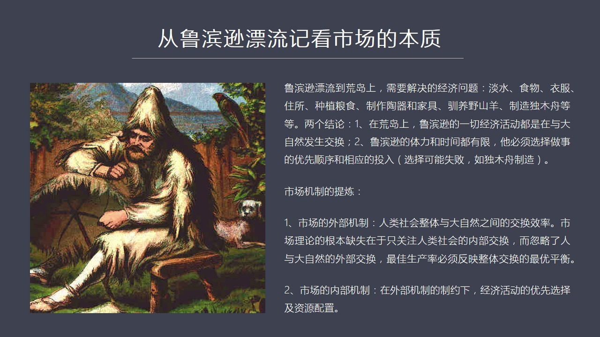

那麼在這個故事中我們看到魯冰訊由於這個船沉默了那麼它漂流到一個荒島上在它漂流到荒島上之後它所面臨的顯然是生存問題那麼它必須要花費時間和經歷來逐個解決這些生存問題那麼它解決了這些問題在這個過程中所付出了...

<strong>All subtitles</strong>

> 那麼在這個故事中我們看到魯冰訊由於這個船沉默了那麼它漂流到一個荒島上在它漂流到荒島上之後它所面臨的顯然是生存問題那麼它必須要花費時間和經歷來
> 逐個解決這些生存問題那麼它解決了這些問題在這個過程中所付出了一切勞動和努力在我看來都是經濟的本質的問題就是人們的行為為了生存 為了發展為了得
> 到更多的安逸和舒適也就是追求幸福這是所有人的一種本能那麼當魯冰訊到了荒島之上它所面臨的經濟問題如果按照重要性來分析的話應該由以下這幾個方面比
> 如說淡水因為沒水是不行的食物衣服 住房包括種植糧食還有製造 逃棄和家具當這些最基本的工作滿足之後它要想更進一步改善生活還要遜養山養 野山養同
> 時還要製造這個獨木舟因為異有機會它還想離開荒島所以從這個簡單的故事中我們可以發現一個最基本的市場的重新為什麼說一個人也是市場因為我們在傳統觀
> 念之中市場是由很多人之間情交易所形成的這樣的一個概念但是在我看來如果我們追本數源找到它這個市場的起點什麼是市場市場要完成交換那麼這種完成交換
> 就涉及到一個分工問題在疫群人中間我們很容易理解分工就是有某種技能的人從事某一項工作這樣大家把各自勞動成果進行交換也就是分工和交換這構成我們傳
> 統上對市場的一種基本理解但是我想在這裡提出的是這種分工不僅僅存在於人群之中也存在於一個人身上你比如說它可以在時間上進行分工早上9點到10點我
> 幹某一項工作10點到11點我幹另外一項工作這叫不叫分工這同樣是分工所以我們從魯冰訊這個孤立的單獨的例子可以挖掘出經濟中間關於市場的很多產數方
> 面存在一些問題或者邏輯上顯然有一些漏洞沒有進行有效的這種產數那麼從簡單這個例子中我們可以得到兩點結論第一在荒島上魯冰訊的一切經濟活動都是與大
> 自然之間進行交換你不管是補餘重量式還是給自己造一座房子這些都是需要從自然中去獲取這種資源那麼第二點魯冰訊由於它自己的這個時間和體力都有限它就
> 必須得按著最優先的某種順序來做事比如說第一件事它必須要解決銀水問題要找到水源第二件事情必須要解決食物問題也就必須要有充分的食物的來源否則它就
> 無法生存所以在這樣的情況之下它是按著一定的優先順序來安排自己投入多少時間和經歷來做這個事從這兩點中間我們大概就能夠初步得到市場機制的一種提烈
> 那麼第一就是市場機制存在著內部和外部也就是外部機制什麼時候外部機制這點是我們在傳統市場裡的中幾乎沒有涉及到了一個概念什麼是市場從根本來說人類
> 社會如果把它做一個整體首先是這個整體與外界大自然進行物質能量的一種交換這個構成了市場的外部機制所以這點是我們以前談到市場理論往往這個重視一些
> 內部分工然後交換供求關係等等但是我們似乎沒有一套成體系的理論來去分析人類作為整體跟外部自然界存在這種交換這其實就是一種市場的外部外部的一種表
> 現形式所以我們在談到生產率的時候這就提出了一個非常重要的一個區別跟傳統理論有一個區別我認為什麼是最佳生產率最佳的生產效率它不是一個單純的內部
> 的一種組織體系所形成的一種較高的經濟產出它必須要考慮到外部它是個自然大自然的環境能不能夠滿足你生產率的這種輸出的需求換句話說最佳的生產率並不
> 是一個最高值而是一個跟大自然能夠相互平衡的一個最優質這是我們體驗出的第一個重要的結論第二個結論就是市場存在的內部機制什麼叫內部機制它必須要在
> 外部的跟大自然交換能量和物質過程之中所受到這種制約的條件之下我怎麼選擇經濟活動的優先順序以及這種優先順序所需要的資源的配置這個就是我們經典的
> 市場理論所要涉及到了問題我們首先講市場的外部機制這就是第二頁我列出了這個四個文明的銷網

---

### Slide 3

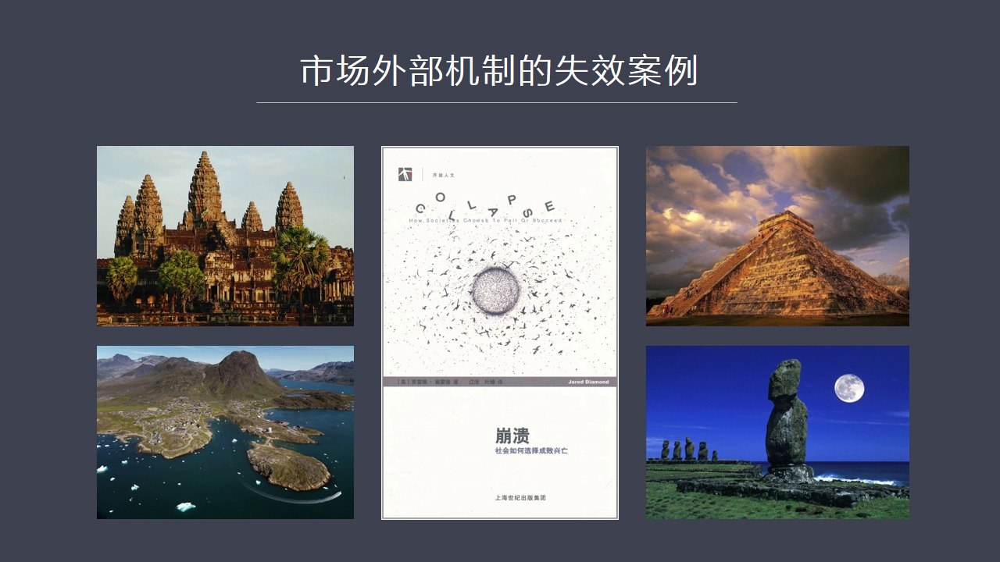

這個主要是來源於這本書崩潰它就是槍炮鋼鐵和細菌這本書的作者它寫的另外一本書我覺得寫了也很不錯在這本書中它系統介紹了一系列文明的新王再加上我自己到五哥所觀察到的高明帝國它的這個最終為什麼會銷網我記得我在...

<strong>All subtitles</strong>

> 這個主要是來源於這本書崩潰它就是槍炮鋼鐵和細菌這本書的作者它寫的另外一本書我覺得寫了也很不錯在這本書中它系統介紹了一系列文明的新王再加上我自
> 己到五哥所觀察到的高明帝國它的這個最終為什麼會銷網我記得我在節目中有好幾期是專門在探討這個問題的它的基本結論就是高明當年在五哥所建立的一個非
> 常龐大的中世紀的都市從廣義上來說人口高達100萬之眾你要查一下歐洲的經濟史你會發現這個書子相當的驚人當然它是一種不像歐洲也不像這個土耳其伊斯
> 坦波爾的那種高度密集的這種人口的城市形式它是一種鬆散的但是有效整個在一起的一種經濟組織它最後走向面往了根本原因是這套體系嚴重的依賴它的水路交
> 通灌蓋包括傳運等等它內部到處都有這種縱橫交錯的勾取還有大量的蓄水池那麼在當地的自然條件之下如果外界環境發生變化特別是由於長年的合床的下沉會導
> 致它的蓄水池這個供水的源頭出現問題會是整個這個都市區面臨一個藥帽是紅水泛濫藥帽是乾汗使得它內部維持它生態運轉的這一整套水利系統逐漸的失效這就
> 會造成由於缺少灌蓋由於缺少傳運那麼它整個興趣的集體就會逐漸的喪失活力再往後在由於外敵入侵導致地區的人口大量外移最後我們會看到吳哥一個龐大的都
> 市區完全淹沒在一片生產老靈裡面直到最直到二十世紀才被重新發現出來所以吳哥帝國這種新王非常明顯地體現出了這個外界大自然對經濟活動所產生的巨大的
> 制約第二個例子馬亞文明這也是崩潰中這個書中重點分析的一個案例馬亞文明其實也是由於它的內部的交通運輸必須要依靠水利而出現常年乾焊的情況之下不僅
> 逛街出現問題而且內部交通體系會癱瘓一個重要文在這裡面有一個非常重要的一個問題就是當年在墨西哥這個地方包括整個南北美洲它在1492年哥倫布發現
> 新納路之前這兩個大陸都嚴重缺乏或者說根本沒有大型的生存進行脫運你比如說它沒有馬也沒有牛也沒有這種落土雖然馬最早是從美洲進化出來的然後通過白陣
> 海峽當年的大陸橋來到了亞洲但是後來南北美洲由於這個氣候變暖海水水位上升與歐亞大陸脫離了聯繫之後這個南北美洲它的馬銷網了也就是滅絕了而且其他大
> 型動物業滅絕了當然原因有很多種說法有一種原因是兩萬多年以前這個獲得了很好的這種武器裝備的這些早期移民就是最早的印第安人祖先他們來到北美大陸南
> 北美大陸之後帶著先進的補列技術把大型的動物全部補列帶進所以南北美洲沒有大型的這種屠運那麼他們的主要運輸就只能靠水路它因為沒有馬沒有牛沒有落土
> 所以它就發展不出這種車輛雖然美洲人很早就發現了輪子就發明了輪子但是輪子一直不能用在這個運輸上主要是沒有生存沒有大型屠運這種動物所以由於當年出
> 現了嚴重的甘漢使得水路交通癱瘓了這些河流甘河了導致了一個巨大人口的馬亞文明由於交通運輸的癱瘓水力灌蓋了這種體系的破壞導致了它整個農業文明難以
> 為繼這個越密集人口越多組織越複雜的體系某種意義上對生態的要求就越明顯越嚴重的依賴外部環境所以它的根基就越脆弱在這種情況之下一旦出現天災它的抵
> 抗能力不行的話整個複雜的這種集體就會迅速的結體癱瘓所以馬亞文明這些人就流散到其他地方去了這一塊這個馬亞文明現在就只剩下這種移植來共後人去去這
> 種展養或者吸取這種經驗和教訓另外它還有一個例子講到了革靈蘭革靈蘭也是由於生態問題它其實在革靈部發現北美大陸之前就已經有北歐人就是說我們說的維
> 經人和他們相關的那個時代的很多北歐人就已經發現了革靈蘭如果我們從地圖上來看革靈蘭其實離加拿大已經非常的近了實際上他們已經到了加拿大但是由於革
> 靈蘭的自然的生態環境極其脆弱他們在那裡開發過度導致了革靈蘭這個體系殖民體系的崩潰也就是他們實際上到了13幾幾年仍然在革靈蘭那塊這個革靈蘭島進
> 行這個殖民但是由於開發過度破壞了職貝導致就在革靈部發現每週大陸之前不到100年的時間革靈蘭這個殖民體徹底崩潰了由於這個中短暫的崩潰使得那些已
> 經到了北美大陸的這些早期的移民者就喪失了後勤補給他就沒有進一步的這個人員的核武資的這種補給了所以在加拿大他們也沒有站住腳最後全部滅亡了這就是
> 在革靈部發現北美大陸之前出現了一個非常非常有經典意義的這麼一個案例當初此之外還有最著名的復活街島他的這種崩潰也說明了自然環境的脆弱對於這種經
> 濟活動所構成了強大的壓力如果我們來看下一頁下一頁就是第三頁在第三頁中間

---

### Slide 4

我提到了現代社會所面臨的一系列問題我們剛剛說到是古代社會那麼現在由於我們的科學技術越來越發達是不是就沒有環境的制約了呢其實有不管是北京的誤埋還是我們看到了全國各個地方的引用水的嚴重污染還是我在紅官節目...

<strong>All subtitles</strong>

> 我提到了現代社會所面臨的一系列問題我們剛剛說到是古代社會那麼現在由於我們的科學技術越來越發達是不是就沒有環境的制約了呢其實有不管是北京的誤埋
> 還是我們看到了全國各個地方的引用水的嚴重污染還是我在紅官節目中所談到的石油農業的罪弱也就是這套體系必須要嚴重依賴石油而一旦石油供應短缺比如說
> 峰值到來之後那麼我們的經濟體系已經變成那個高度發達也高度這個經濟化的這麼一套社會的機制這就很像當年的馬亞文明也很像當年的五個文明你的體系越龐
> 大你就越脆弱而導致這套體系出現問題的這些支柱一旦發生崩潰那麼整個大廈就會昏然倒塌所以這就是我提出為什麼我們需要高度關注這些生態的極限這就是我
> 提出了第一個重要的觀點政府是有這種職責的這種職責就是要防止市場突破生態極限如果純粹完全讓市場來決定來市場來發揮作用那麼就會出現我們剛才所談到
> 了四個文明銷網的案例在這四個案例中間市場是發揮的主導作用或者說絕對的主導作用但是結果過渡的砍盤過渡的破壞職位過渡的破壞生物的多樣性包括我們現
> 在看到的氣象這種混亂這些都會導致你這種有利潤者居動的市場行為的過渡表現會突破我們所生存的環境的一些生態極限如果那一天到來那麼我們現在所面臨的
> 所稀以為長的這些複雜的社會分工把這套燦爛的文明體系就會出現類似於馬亞文明類似於五個文明那樣的一種災難性的前景那麼怎麼才能有效阻止這一點阻止這
> 個趨勢呢這就必須要要求政府對經濟這種干預對市場行為的這種干預這就是由於我們傳統理論體系中間市場經濟理論體系中間沒有涉及到整個人類作為一個整體
> 和大自然之間能量物質型交流是什麼才是一個最優的平衡在這點上雖然有很多學者提出了像馬爾薩斯提出了這個人口理論等等但是還沒有一套像壓當私密搞了一
> 套嚴密的理論體系這就是我們現在所出現的這樣的一個問題我們基本上不去考慮自然界的極限生態的極限在哪裡我們只顧著賺錢只顧著發展經濟所以我們的水喝
> 起來是有味的我們的空氣呼吸起來是有毒的我們的食品是沒有安全保證的這個是不是我們經濟發展所需要或者所期待的結果呢當然不是那麼有個人有企業或者有
> 市場純粹有市場行為能夠阻止這個局勢嗎能夠有效調整這一點嗎顯然不行每個國家它在經濟發展過程中都面臨類似的問題以至於後來發達國家要專門建立像美國
> 的能源能源署環境保護署這些機構的建立這些政府機構的建立就是為了制定同一的標準來限制這種市場的行為防止他們突破生態極限所以我們可以看到這個很多
> 國家其實在這個方面它都是有政策限制的也就是這是政府天然的一種執著這是無可推薦的所以有了這樣的關鍵之後我們在探討這個政府和市場之間的關信時候你
> 就有了一種新的或者更大的一個場景去思考這個問題那麼除了這個之外我們剛才所說到是市場的外部機制那麼市場的內部機制呢市場內部機制主要在我看來就是
> 它是一種類似於網絡的這樣的一種用線的效應這個提法或者這種觀念呢我們是可以說是借勁了

---

### Slide 5

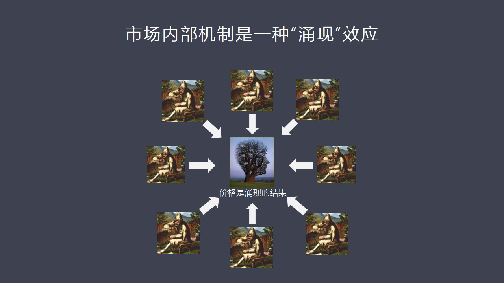

現在網絡計算機包括人工智能的很多觀念我們以前所設想到了這種市場是一個人們擁擠在某一個場所中間進行叫賣和叫賣這麼一個環境但是我覺得通過研究這個經濟史特別是吸收了其他學科一種新的理念之後我覺得不能夠在想傳...

<strong>All subtitles</strong>

> 現在網絡計算機包括人工智能的很多觀念我們以前所設想到了這種市場是一個人們擁擠在某一個場所中間進行叫賣和叫賣這麼一個環境但是我覺得通過研究這個
> 經濟史特別是吸收了其他學科一種新的理念之後我覺得不能夠在想傳統那種角度去思考市場的運作應該換一個新的思路特別是在結合了歷史分析之後我們會發現
> 市場其實是有很多遙遠的地區通過交通的貿易的幹線就是貿易大通道來實現的這種交換而且市場應該首先出現出現在一種遠距離的交換上也就是市場不是說我們
> 想像了那樣是從近距離一個村開始交換不會為什麼因為一個村或者一個縣或者在一個區域之中生活的人們他們的生活方式、
> 生產方式都高度的類似因為自然條件是雷同的所以大家想問題的思路做事的思路也是一致的所以在這樣的情況之下你很難坦誠差異性也就是大家生產東西都一樣
> 重量是都重量是那麼在這種情況之下它就不可能出現這種取長不短或者別人生產不了的東西我能實現我能生產這就很難形成這種交換什麼情況下才能實現交換就
> 是在遠離這個村遠離這個縣的另外一個地方比如說山的對面、大河的對面甚至更遙遠的地方沙漠的以外的遙遠的地區那些地區由於自然生態環境截然不同那麼他
> 們那邊所擁有的自然餅負也不一樣所以人們的思考方式、行為方式就截然不同比如說地中海它跟中國的地理環境就完全不是一個概念所以在那個地區人們就會去
> 眾不同的東西比如說遊甘了比如說葡萄、生產的葡萄酒那麼跟你重量的這些產區之間就會明顯產生一個互補的效應也就是會實現交換所以我通過研究經濟史特別
> 是早期人類發展歷史無論你是古埃及還是兩核流域還是印度和流域這種文明都發現有一個比較有意思的現象跟我們想像的葡萄之間或者在村落之間首先發生交易
> 這種行為不太一樣你會發現最早的交易行為往往是源於有人生產出跟你截然不同的東西而你特別需要它這種方式就是這種強烈的反差產品的截然不同刺激了交易
> 的出現刺激了這種包括後來貨幣的出現當然關於貨幣這個問題我會放到另外一講單獨去講貨幣的這套歷史那麼回到這種市場內部的機制為什麼我稱它是一種湧線
> 的效應湧線的結果什麼湧線的結果就是價格如果我們用剛才這個魯冰訊飄流器這個例子我們可以把幾十個幾百個幾千個幾萬個魯冰訊想像成一個社會的組織的整
> 體那麼這些魯冰訊們每一個人它所面臨的生活壓力是不同的有人可能更需要淡水有人可能更需要食品有人可能更需要肉有人可能更需要其他的這種生活的便利品
> 比如說桌子逃起那麼市場機制是把每一個人它所承受的生活的壓力所產生出來的這種對優先順序做事情的優先順序所產生了不同的這種感受綜合在一起就是這種
> 機制就相當一種超級的這種網絡可以把各種不同的優先順序的這種事情會及在一起然後進行分配也就是比如說一百個魯冰訊中五十個人最需要是淡水二十個人最
> 需要是糧食十個人最需要是逃起那麼它可能會有一套算法或者機制按照這種機制能夠自動了把社會中間的優先做適了優先順序排出來比如說需要淡水人最多那麼
> 這就會產生一個效應這個效應最終會反映在價格上因為魯冰訊它一個人做事也得花時間和精力那麼它所花的時間和精力雖然沒有用貨幣形式體現出來但是這些勞
> 動仍然是有價值的或者是要有代價的因為它由於去打水由於去重糧食而喪失了發展其他事情的可能性這就是要機會成本所以當你把常見上萬個魯冰訊的這種代價
> 或者叫機會成本綜合在一起的時候你會發現人數較多的那些有共同需求的人在社會中就佔到了壓倒性的優勢或者佔到了明顯的優勢它們強烈的渴望某一種產品或
> 者強烈的需要去做某一件事這個時候市場的機制就開始發揮作用了這種機制就是要像這些優先去配置資源因為需要這種東西的人多所以它產生的物以稀為貴的效
> 應就明顯那麼如果有人去做比如說一個木頭幫助它打水這個木頭就會很強手那麼給它提供木頭的人就會獲得很高的回報這就會產生一個價格這個價格雖然沒有以
> 貨幣形勢體驗傳但是它會以一同水和對方進行交易所換來的東西體驗傳所以說貨幣本身是一種是一種幻象最重要的一定是商品之間的比價這就是我說很多人不理
> 解為什麼黃金大家說黃金數量很少所以不能夠用來滿足現在經濟的快速發展的需求其實這個問題在人類率上早就被驗證過這根本不是問題因為黃金對於商品之間
> 黃金起到是一個計算器的作用就是各種不同的商品已經比價太複雜那麼如果大家都跟黃金算出一個比價來所有商品之間的交換將會變得極其簡單就是它的計算價
> 格將會變成非常的迅速和簡單正是由於這個正是由於這個快速和變結性使得貨幣使得黃金作為貨幣它跟它的絕對數量是沒有關係的也就是如果這個世界上只有一
> 克黃金它能不能承擔這種計算比價關係這種效果它是可以的理論上不存在問題只要把它無限向下進行切割0.0.0.1克1毫克1毫克等等所以很多人被這個
> 迷思所所產生了幻覺所影響所以他們認為黃金的數量很重要其實不是黃金最重要的作用或者所有貨幣最重要的作用是計算商品之間的比價關係搞明白這個之後我
> 們會看到關於這個話題我會在另外一個講貨幣的這個這個系列講得中在逐步的展開那麼這種市場機制其實就會以一種為多數人生產產品這個水統它會換得更多商
> 品的這樣的一種形式體現出來這就叫價格由於有這個價格的號召作用或者影響力會動員起成天上萬的人都會去生產目頭這就會導致資源的配置成了變化也就是對
> 於某種東西的優先選擇這種市場機制所做的優先的選擇會牽引或者會調動社會的資源向這個領域進行配置這就是我們所說的它是一種用線的效應用線的結果就是
> 價格關於市場機制內部的這種它到底是怎麼運作的恐怕我們真要借件人工智能的很多理論才能夠做深入的探討比如說我認為它就不是一個中央處理的一種體系而
> 是一種分散式的發散式的並行處理也就是呈現上萬個魯營訊生活在不同的區域他們通過貿易幹道進行連接那麼他們在這個過程之中行程價格的過程之中非常像我
> 們人腦中行程記憶產生靈感產生不斷的這種點與點之間的全中的變化跟這個什麼密切相關的或者說我們可以說高度了一筒所以要對這個問題進行有效的深入的研
> 究就必須借件現代其他學科的這種發展的數學模型或者計算手段來模擬在一種人工智能條件之下市場價格的形成的一種方式這是一個非常有趣的研究方向也是一
> 個非常有意思的話題在這兒沒有時間深入展開在這兒我只是聽醒大家我們在想傳統的這種理念的時候不要被傳統的觀念所束縛應該廣泛地去接見所有學科的知識
> 體系這就是我說反覆強調一點不要做所謂的專家只懂一個方面懂得很深很驚這沒有意義關鍵是要有一個非常寬廣的知識面同時還有歷史的重生感在這樣的體系之
> 下你將會迅速找到其他跟你探討經濟概念或者經濟理念非常類似的其他學科產成了模式你可以進行模式的選擇模式的對比你可以借用其他的概念所以我們說到市
> 場機制的時候其實是需要做更深入的理解那麼如果我們現在看下也第六頁第六頁講的是市場的秩序首先我們談它的國內的秩序

---

### Slide 6

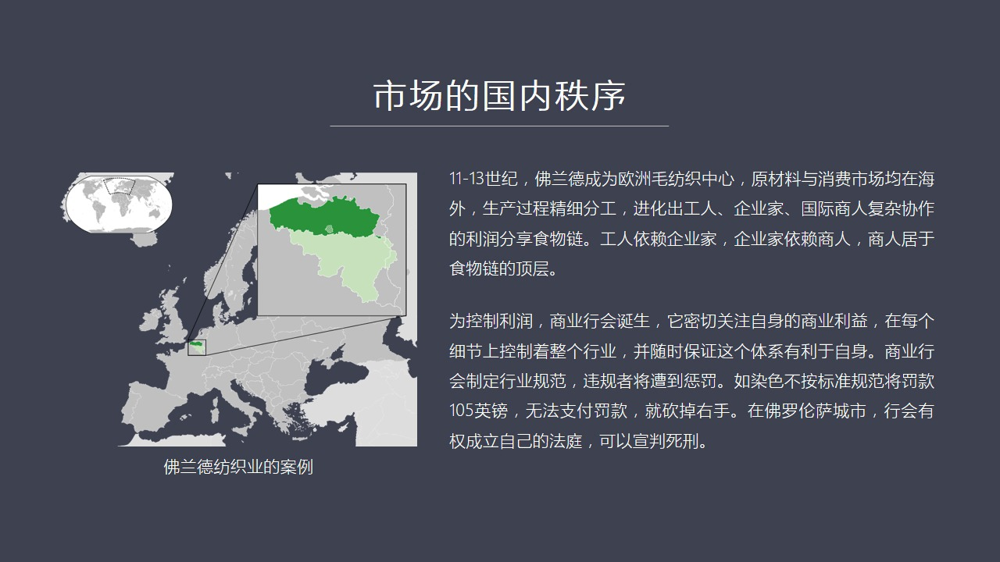

或者叫市場的內部秩序我一會會說到它的外部秩序或者說叫國際秩序內部秩序我們在講所有經濟理論的時候一定不要忘記不能夠純粹從理論上去探討因為人類社會不同於自然科學中間的這種這種比如說做一個實驗就可以輕易地解...

<strong>All subtitles</strong>

> 或者叫市場的內部秩序我一會會說到它的外部秩序或者說叫國際秩序內部秩序我們在講所有經濟理論的時候一定不要忘記不能夠純粹從理論上去探討因為人類社
> 會不同於自然科學中間的這種這種比如說做一個實驗就可以輕易地解決或者驗證一個概念或者可以重複或者可以進行非常精細的對比社會科學像經濟學是不可能
> 做到這一點的因為歷史不能重演發生過的事情你很難在相同的條件之下讓它重複出來不可能通過實驗的時候段來進行類似於自然科學量的研究只能通過對比只能
> 通過歷史的研究進行模式對比找到中間的共同之處所以我在講的過程之中不管是電視的這種視頻的這種紅官節目還是我們講課都會大量的去真實歷史中發生的案
> 例通過這些案例來提烈一些最基本的結論你比如說市場為什麼會自發的進化中秩序來我在這裡給大家講就是當年11世紀到十三世紀就是歐洲中世紀那個階段發
> 生在普蘭德的法治這個行業的一個具體案例我們在一般老一般人的腦子裡面一想到歐洲中世紀就是一片黑暗了好像我們的教科說上也這麼寫黑暗了一千年從公園
> 五百年到公園一五零零年好像那段時間大家就生活在禁止狀態之中沒有變化全部都是教會全部都是教堂然後所有的經濟都停止了其實這種概念本身它就是一種誤
> 導人類社會從來不會禁止不動它永遠在發生新的事物永遠在發生變化當年的普蘭德具體說來就是現在的比例時包括法國的北部和荷蘭的東部和南部這些地方構成
> 了普蘭德地區普蘭德地區包括他們的人在歷史上可以說是影響歐洲這個後來工業革命的最早的一批人在那個地區也最早的進化出了一種國際貿易在往前的時代羅
> 馬帝國的時代我覺得還不叫真正的國際貿易而這個階段普蘭德它所形成的是一種高度分工的這樣一種面向這個遠距離這種貿易的模式它的原材料就是羊毛它的仿
> 值也當時主要是用羊毛因為綿布綿花當時還不是仿值的主要材料12世紀才陸續進融歐洲當時還不流行主要的仿值原材料就是羊毛那麼它的輸出的產品不是為本
> 地服務而主要是更遠的地方比如義大利或者在蓄利亞就是現在我們所說的中東地區特別是賣給就是坦丁寶也就是以現在伊斯坦伯為中心的東部地區因為當年了東
> 部地區比西部地區發達所以我們說在地中海貿易中間它其實主要是為了向東方去出口它們這種工業化的產品為什麼是這種手工業為什麼它是明顯不同意以前的這
> 種生產模式就是抗兩頭都在外就是原材料比如說是從英國英國的羊毛是最優質的羊毛比如說肯特肯特勸的這種羊毛就是非常非常好的一種羊毛因為它的牧場它的
> 自然條件包括它的水包括它的物都對當地的羊毛產生了極好的這種作用所以那個地方應該是最好的最高質量的羊毛那麼他們在選取羊毛進行防止過程中首先在荷
> 蘭德那個時代11到13世紀發展出了非常精細化的分工比如說羊毛的洗這個防防沉沙最後防沉沙之後進行支編織還有印染特別是它的印染對技術的要求是非常
> 高的如果我們看中世紀當時那個商業行為統計出來的那些數字包括對於生產流程的一些具體的分析你會發現哇塞它這個這個工序之複雜遠遠超過我們的想像那麼
> 它這種印染完了之後還有比如說用起龍草就是一種植物這個羊毛的製品進行起龍就把它勾出用那個草給它勾出一些非常細的融毛然後還有剪剪掉這個融毛把它剪
> 齊所以剪刀一把非常質量好的大剪刀當年是一個是一個非常值錢的一個財務可以作為遺產遺留給後代的所以我們月了解當年的生產的一些細節月了解歷史中的細
> 節越能理解它的分工精密到什麼程度但是正式由於高度的這種分工它就必然會產生一種新的組織就是由於大家都分工我只做一件事情比如說我只做起龍我只做印
> 染我就沒有時間精力再去關注產品它的其他的流程和它最終怎麼賣賣給誰賣多少錢這事我就管不了了這就會出現這個三個層次這就非常近化了第一個層次是各個
> 產業鏈條上的分工的這些具體的工人第二個層次第二個層次是能夠把各個工種進行有效組合的企業家就是進行工廠的這些人第三個層次由於企業組把大量時間用
> 在了生產流程過程之中它就沒有精力也沒有時間也沒有能力去發現客戶在哪裡這個是這個事兒誰來做就是第三幫人國際商人當年比如說有熱納亞人有民意私人還
> 有本地的這個福蘭德人另外還有從北歐來的還有從英國來的還有我們看來自全世界各地的這些商人都會到福蘭德地區去採購所以商人就會成為整個收戀條中間居
> 於最高層的那個這批人主要原因就是他們知道信息他們知道誰在世界上的哪個位置需要什麼樣的羊毛製品羊毛所生產的這種醫療他們能夠承受多少價格怎麼負責
> 運輸由於商人掌握了這些核心的信息所以他能夠制定價格這就是他們形成了一個龐大的一個網絡熱納亞人在這方面還有佛羅倫薩人等等那麼這些人在這個過程中
> 他就會逐漸把自己組織起來形成行會行會這種組織在中國歷史上他始終沒有佔據像在歐洲中世紀所佔據的那麼顯和的地位行會他的這個誕生可以說是這種分工進
> 化出來的一種革命性的跳躍可以說是一種突變行會美食美客都在關注自身的商業利益在每個生產的細節上都在進行對整個行業的控制並且要隨時保證整個這個行
> 業永遠是對自己有利的所以行會會制定大量的行業規範這種規範吸到什麼程度現在比如說在運染移到工序上你用拿種草或者比如說我們看到了這個煙之紅這是一
> 種動物一個軟體動物的一種分明業體還有像這種一種藍色的染料欠草還有這種電藍就是我說的在南卡拉的來納還有美國很多地方種的都是印染的這種染料它都是
> 一種草還有其他的各種各樣的染料這種染料配的比例比如說我要身藍色這個藍應該怎麼來染這裡面學問太大紅應該怎麼紅比如說新紅這是英國最拿手的一種染料
> 就是他們能夠調出那個比例來行會要對這種染色的各種各種原材料進行精細的分工要進行行業的嚴格的規範你如果違反這個規範那將受到重罰比如說如果染色萬
> 標準當時我看到一個紀錄是這個一個人犯了規被這個染工犯了規被罰了105營結果他還他出不起這筆錢因為這是一個天文數字怎麼辦那就被行會下面領砍掉右
> 手這還算輕的在佛羅倫薩這個行會的權力更大他們可以建立自己的法庭可以直接判決這個人的死刑所以我們會看到一種高度進化權力極大的商業行會發展起來了
> 為什麼我們看到西方這種傳統跟我們中國的這種商業傳統是完全不同的我們立上沒有這麼強大的行會這個行會本身某種意義上類似於獨立的政府這個當地的勃決
> 當地的工決在這個領域之中會給他們相當大的特權甚至包括司法權懲罰權都會給他們在中國為什麼我們看到我們的產品質量或者企業之間相互產業商價但是在西
> 方很少出現這個現象因為他們還殘存著當年行會這種規矩當年行會就做了嚴格規定誰能夠進入這個行業你的價格是多少包括你生產這個布料或者你生產任何東西
> 具體的每一道生產流程都要行會來決定所以它是個組織能力相當強大了一個體系所以他們不會產生你塑火的為了評價格跳到大甩賣不會但中國我們為什麼看到中
> 國製造業所生產大量的這個廉價產品在全家賣了如此的低臉就是因為我們彼此時間相互商價因為你在傳統上在歷史上就沒有進化出一個超級強大的行會現在我們
> 在北歐還可以看到很多企業之間他們是很容易達成共識的因為他們有過有個行業組織就是相當於當年的行會你的企業每年要向企業要向政府交稅其實除了交稅之
> 外還要交易比錢給這個行會很多企業不願意就是不願意把錢交給政府因為交給這個行會是可以免稅的所以北歐的很多企業大量的向行會提供資金而行會組織了各
> 種各樣的生產管理各個方面的行業上的這種行業規劃實際上起到了相當於政府一半的作用這是我們看到西方社會他們所組織起來的這套生產體系和商業體系跟我
> 們是非常不同的如果你不研究它的歷史就完全不了解這個情況所以商業行會維持了芬蘭德地區的繁榮長達了150年

---

### Slide 7

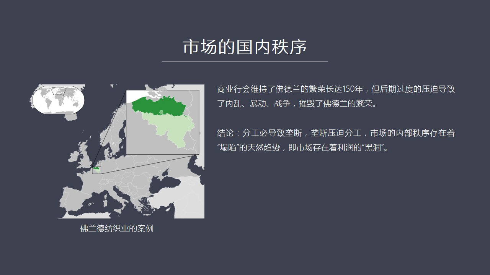

到了13幾幾年之後衰落了神願意就是因為就是因為行會全力太大所以它為自己謀力的這種衝動和這種能力也超級強大這就導致了他們對這些各個生產線生產流程中每個細節的這種工人進行了殘酷的盤波這種盤波的最後結果就爆...

<strong>All subtitles</strong>

> 到了13幾幾年之後衰落了神願意就是因為就是因為行會全力太大所以它為自己謀力的這種衝動和這種能力也超級強大這就導致了他們對這些各個生產線生產流
> 程中每個細節的這種工人進行了殘酷的盤波這種盤波的最後結果就爆發了一系列的企業比如說1328年一場重大的一場這個企業這個牽連了很多城市再包括後
> 來的一系列這個這個芬蘭德地區的大規模的這個內亂暴動都是跟這個事有關所以導致了內部的巨大混亂導致了法國開始這個侵入芬蘭德地區也包括英法之間的百
> 年戰爭其實在很大城市上就是為了爭奪芬蘭德地區的這個強大的貿易中心這個地位這樣就導致戰亂戰亂引來了這個更大的麻煩就是人口外流了有技術的工人到了
> 佛羅倫散到了義大利到了德國的這個南德地區有些人到了更遠的地方還有一批人到了英國所以就把這種一些核心技術帶到了四個不同的方向所以你會看到後來義
> 大利仿職業崛起了英國仿職業崛起了什麼原因就是由於這個行會它雖然有促進經濟繁榮的一面因為它要做嚴格的行業規範制止競爭保證每個人都可以獲得高額利
> 潤因為如果沒有高額利潤大家就不會進一步的有動力去改進生產流程提高質量所以它必須要有強大的利潤作為保證才能做到這個就是一個非常重要的原因除此之
> 外商業行會對於工人那種壓迫導致了內亂所以我們會看到從這個案例中我們可以體驗出一個重要的結論就是所有的市場只要你形成了這個擴大的趨勢就一定會產
> 生分工的經濟化而分工的經濟化就必然會產生壟斷就必然會進化出一種組織由這種組織來壟斷整個生產的流程而壟斷最後反過來就會盤剝生產者最後造成了壓迫
> 分工的進一步經濟化所以在市場自然進化的體制中如果沒有任何政府的干預情況之下也會進化出行會而行會類似於政府那麼在這種行會壓迫之下最後必然會面臨
> 一個它要追尋超過利潤殘酷壓迫最後就會使得整個這套體系現於攤它這樣的一種天然趨勢所以市場不是平的過去不是現在不是未來也永遠不會是市場是彎曲的市
> 場存在了大量的利潤的黑洞追助利潤的各個行業的各個群體會形成一種自組織現象它不會組織起來組織起來就會追求超過利潤把這行業組織在一起所以它不是一
> 個平整的一個大家自由交易完全平等自由進程不會它一定會進化出一些山亂起伏這樣的一些不平衡或者不平等的或者是一個地是起伏的這樣的一個經濟趨面我們
> 我自己把它稱之為一種圍繞利潤所產生的黑洞現象那麼這種現象會自動的導致或者它有一種天然的趨勢會是整個市場秩序逐漸趨於瓦解就像人的生命一樣有生機
> 包包的一面但是到了一定年齡之後它開始有勝轉摔所有有生命的東西都一樣市場也是同樣也有這個趨勢所以這就提出了下一個結論就是第六頁下頁就是政府的職責剛才講了是對外的職責

---

### Slide 8

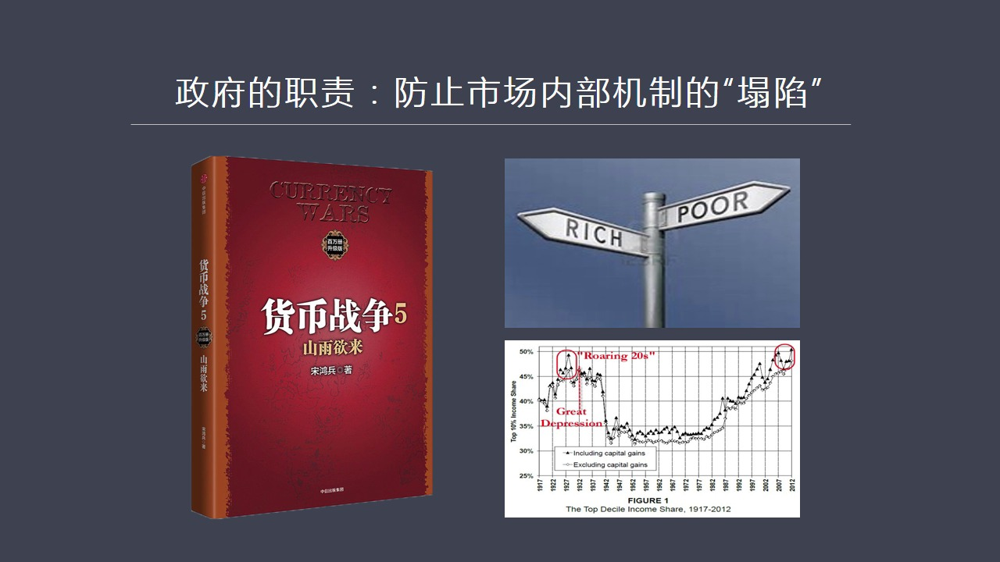

就是一定要防止生態極限被突破它對內的職責就是要防止市場內部的機制陷入塌陷怎麼來防止呢其實我在會比較整五中間取了這個三個例子一個是羅馬帝國北宋還有現在的美國這三個例子相隔一千年地跨不同的大州就是地域很廣...

<strong>All subtitles</strong>

> 就是一定要防止生態極限被突破它對內的職責就是要防止市場內部的機制陷入塌陷怎麼來防止呢其實我在會比較整五中間取了這個三個例子一個是羅馬帝國北宋
> 還有現在的美國這三個例子相隔一千年地跨不同的大州就是地域很廣但是卻反映出共同的規律就是一個繁榮的經濟體發展了一定程度就會出現貧富分化貧富分化
> 到了一定的極端的情況就會導致整個體系失靈比如說我舉到了當年在羅馬共和時期就是由於土地的監病所導致的改革失敗最後形成了大動亂大混戰或者嚴重內戰
> 學流程核戰的局面最後導致了凱撒的崛起羅馬從共和進入了地質主要原因是貧富分化嚴重到一定程度原先的民主制度就無法維持了他要進入帝國的模式而帝國又
> 是靠殘酷的去征服去略度別人的財富才能維持經濟體的運轉所以羅馬帝國停止征服之日就是他內部出問題之時這個我在我們節目中講到土耳其類經濟模式也是這
> 樣他不能停止擴張停止擴張內部就會塌線就會內爆那麼北宋我在書中講到王安士變法王安士變法要解決主要問題就是高度的土地壟斷大量的土地集中在少數66
> %的北宋的地主手上導致了大多數人他的收入在送人中那個年代出現了這個達到頂峰之後很快出現了想像到了宋神宗那個年代這個評分化比例已經非常懸殊了也
> 就是如果王安士不改革他的聚集的改革措施有很多但是核心一點就是制止土地監病但是最終由於強大的勢力集團這種反彈包括請出了皇太后最後迫使宋神宗放棄
> 了對王安士的支持就是可以說改革失敗了改革失敗的結果就是二十幾年之後北宋王國其實除了這個問題之後我們會想想一下為什麼難送他一定要發展海外貿易就
> 是因為難送照夠送高宗跑到江南他同樣解決不了土地嚴重的不均這個問題土地已經高度壟斷地主們全力太大政府制約不了他怎麼辦他又得依靠大地主才能夠有錢
> 才能夠有人才能有槍才能夠去跟經國進行戰爭或者才能保護自己政權不會垮臺所以他對大地主階層是不能夠反抗是不能夠反彈的所以他只能對他們嚴聽寄寵這就
> 導致了財政收入收不上來因為大地主們我在書中舉了很多例子通過各種各樣的方式逃稅不交稅所以國家財政只能靠這個只能靠農業北宋那個時候還能夠維持因為
> 他的農業還在不斷地發展這個新根的土地還在不斷地擴張但是等他停止擴張的時候這個荒地根的差不多的時候生產率下降了然後就會出問題那麼難送一開始就不
> 具備這個條件怎麼辦他只能令開財源令開財源的選擇就是進行海外貿易所以難送開始中國中國的船才開始大規模造船才開始進行海外貿易才撞了很多的錢在難送
> 時代中國的商稅商業稅第一次超過了農業稅農業稅加在一起財政總收入的十幾絕大部分是靠商業稅撞回來的所以難送那個時代可以說是超級的繁榮甚至比北宋還
> 要繁榮特別是在行州這些地方都是出現了當時事實上最大的最繁華的這個都市區但是為什麼後來他衰落了還是因為解決不了這個問題所以當海外貿易出現問題或
> 者其他的遠方的這種國家出現了體系的崩潰使得這個海外貿易出現中斷國家財政一旦出問題收不上稅了沒有錢了所有的一切就會迅速探貪那麼宋朝是講現在美國
> 也是這樣這就是我在上一講中講了這個徒刑10%的人拿走國民收入了50%這就是危機線1929年1929年我們看到了大蕭條之前到達了這個線2008
> 年金融危機之前又達到這個線所以這兩點突破50%這就是一個危機線那麼現在美國為什麼沒有為什麼我們看到特朗普這些這樣的人受到了大量的選民支持包括
> 英國投、公投都說明一個問題就是在這些國家面出現了越來越嚴重的評分化其實如果我們看歷史不管你是在哪個大州不管你是什麼時代出現的問題都一樣就是市
> 場內部機制談話了就是失序了失序的主要原因就是這些黑洞所獲取的利潤它這個能量就是所獲取這個利潤這個要求越來越大對別人的波多越來越大同時他們獲得
> 了這些利潤之後使它的政治權利越來越強大現在突出的體驗在中國的房地產這個行業為什麼政府改不動就是因為這幫人已經形成了以地產集團地方政府加上銀行
> 再加上金融體系構成了一個強大利益中心這個利益中心有點像當年完時所面臨的當時的大商人和大地圖這個階層他們一連手完時想憑自己一己之力顛覆整個這套
> 體系所形成的既得利益集團根本就不現實它做不到現在我們為什麼看到房價不斷上漲而政府拿不出有效手段不是說製製不了這件事情具體的手段有很多但是由於
> 強大利集團的制約使得任何想通過這套體系出台政策的這個做法都完全不現實所以我們觀察現在這個現象能不能最後有效的制止房價或者更準確說是制止土地價
> 格的這個瘋狂上漲是我們觀察這個社會現在還能不能有自我揪錯能力的一個重要指標這個是關於政府的職責它必須要承擔這樣的職責房子市場內部機制地踏線那
> 麼除了這個之外由於市場會進化出某種秩序來所以它就自然會產生一個管理市場的一種警察權這就是歷史上我們看到無論哪個國家無論什麼社會

---

### Slide 9

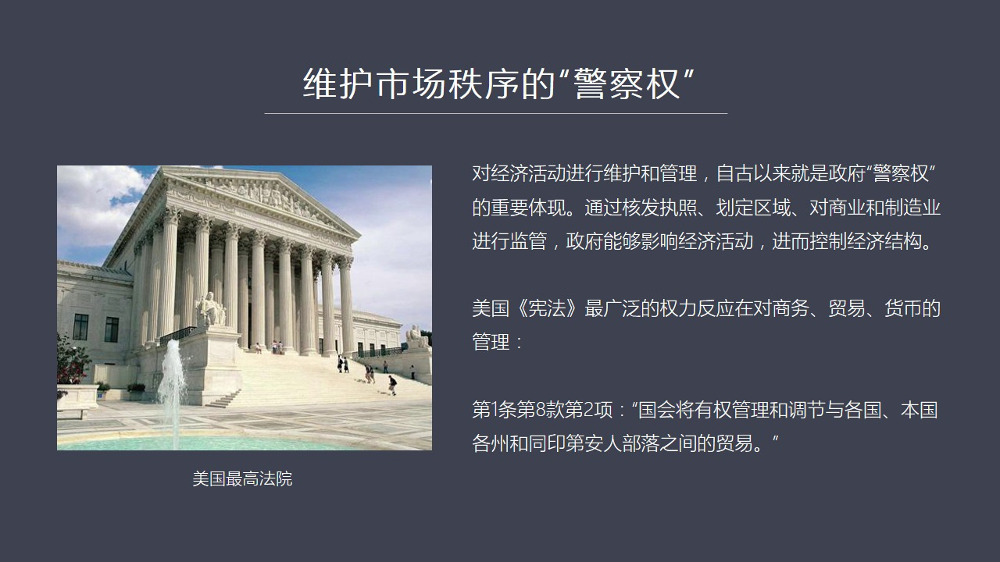

無論發展到什麼狀態也無論信仰什麼宗教都一樣跟文明無關跟這些東西都無關它就是市場在分化過這種必然會進化出來誰來管理整個市場秩序這就是警察權這種警察權可以說自古以來就是所有國家所有地區政府的一種天然權力你...

<strong>All subtitles</strong>

> 無論發展到什麼狀態也無論信仰什麼宗教都一樣跟文明無關跟這些東西都無關它就是市場在分化過這種必然會進化出來誰來管理整個市場秩序這就是警察權這種
> 警察權可以說自古以來就是所有國家所有地區政府的一種天然權力你比如說合法執照規定區域對商業和製造業進行監管政府能夠通過這樣的一種行為來漸漸影響
> 經濟活動近人控制經濟的結構所有國家歷上包括現在都在做同樣的事情比如說美國吧美國的憲法從根本以來說它不是一個純粹的單純的法律文字不是一個法律文
> 件更準確是說它是一個商業或者叫經濟的文現在這個核心中間就是憲法其實如果我們看穿它這個調文背後的東西你會發現它是在管理經濟也就是憲法中間明確要
> 管理什麼呢商務跨州的商務貿易包括貨幣貨幣就不用說了就是以前各州可以發行自己貨幣現在不行了只能有聯盟政法它的這個商務貿易比如說第一條美國憲法第
> 一條第八款第二項專門有一個可以說是一個非常明確的規定國會將有權管理和調節與各國本國各州包括同印第安人部落之間的貿易它只有一條但是它對它的解釋
> 卻產生了強大的這種制約力注意啊美國憲法之所以200多年不便不是它的每每自每句的調文這個有多麼的高明而是它的司法的體系律師和法官們特別是法官在
> 中間起到了解釋憲法的作用它這個解釋使得這個憲法文字發揮了巨大的彈性它在200多年之間增加了幾十個修正案但是它的憲法的構架始終不便就是解釋權始
> 終在發生變化你比如說根據這條款產生了一個重要的一個訴訟就是我們

---

### Slide 10

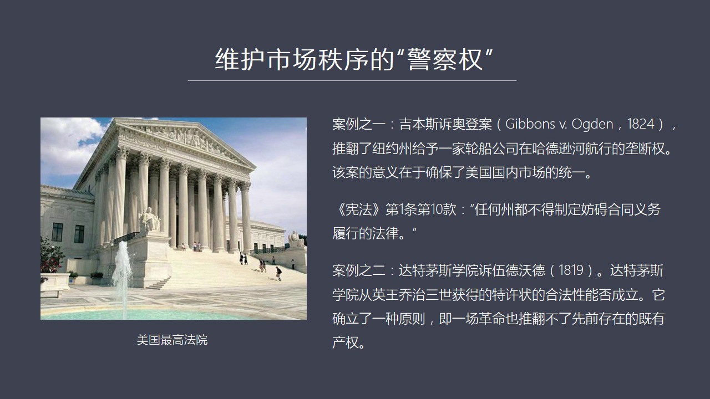

我舉一個案例吧就是基本思速這個澳登案這是在1824年出現了一個重大案件這個就是兩個州新澤西和紐約州共有這個好的訊合流這條河那麼當年紐約州就給一家這個輪傳公司給它在哈德遜河上壟斷的航運權這個事最後打官司...

<strong>All subtitles</strong>

> 我舉一個案例吧就是基本思速這個澳登案這是在1824年出現了一個重大案件這個就是兩個州新澤西和紐約州共有這個好的訊合流這條河那麼當年紐約州就給
> 一家這個輪傳公司給它在哈德遜河上壟斷的航運權這個事最後打官司打到最高法院最高法院最後駁回了這個壟斷權並且解釋了憲法這一條它是怎麼解釋的就是由
> 於這條河哈德遜河是跨兩州是兩州的邊界所以這個事該我國會館該美國政府聯邦政府館你州政府所有涉及到跨州了這種東西你都沒有發現權這個根據憲法這個根
> 據憲法是我來規定注意這個判案是一個立場非常重要的經濟上非常重要的一個拐點這個它起到這個作用就是它確保了美國國內理想的統一根據這個法後來還出現
> 了一系列法案原因這條法案因為美國它是判立法根據以前對某個事情的判斷其他的法官們可以原因這個案例進行推理所以它是個彈性很大的司法體系具有著強大
> 的進化的功能這比成文法我認為要更科學或者更有效比如說其他的法案就規定凡事各州是無權對於進出口貨物進行徵收關稅的都是源於這個這個法案的一種基本
> 的邏輯就是凡事跟外界跟本州之外的人和國家包括一年人了只要你跟外部進行貿易這種權力不在州的範圍之內而在政府而在聯邦政府是在國會實際上這種法案的
> 規定就使得美國當年是13個之命後來現在是50個州從這個判立就掩盛出一個結果來就是每個州都不允許設置關稅所以這就使得美國的共同市場形成了我在以
> 前節目中講到了印度到了現在仍然沒有實現一個統一只是全國市場主要原因就是每個邦都在對另外邦的商品進行徵稅在美國從憲法這條的解釋中間掩盛出一個巨
> 大的法律上的一個慣例就是不允許州做這個事好市場就統一了而且確保了這市場一直統一到現在這個就是我們從這個維護市場秩序維護一個大市場的統一性看美
> 國政府在執行的就是一種警察權我剝奪某些人的某種特權我剝奪某些州的某些特權為了確保這個市場的統一這就是警察權政府有沒有在干預基金當然在干預基金
> 而且在有效的維持市場秩序還有一個案例比如說憲法第一條地失款講到了任何州都不得制定妨礙合同義務旅行的法律這句話什麼意思呢就當年產生這個重要的判
> 案就是達特毛斯學院素5的獲得只是1819年的一個叛律在這個叛律之中當時最高法官魏爾遜他對這個叛律就做了一個非常著名的解釋這個叛律是什麼回事呢
> 達特毛斯學院當年是在美國獨立戰爭之前是在殖民時代從英國國王喬治三聖得到了特許狀我在以前講美國崛起的這個歷史這個系列節目中講到了喬治三聖當時給
> 什麼福金釀給很多州很多知名歷當時是叫知名歷搬發特許狀這是一種類似於壟斷的這樣的一種精英權它是一種法律合同好現在美國獨立之後當地政府心悍不死就
> 想廢除這個達特毛斯學院這種合法性就是廢除這個英國國王授予它這個章程說你別搞了這個公司解散吧那麼最高法院威爾遜的法官他是怎麼判的他說不行你這個
> 現在不是這種判例是無效的這偽憲為什麼說他偽憲呢因為憲法中規定了任何州都不得制裁制定妨礙合同義務旅行的法律也就是英國國王喬治三聖授權了一個特許
> 狀給了達特毛斯這個學院它就是一個合法的一個法人團體那麼雖然美國爆發的獨立戰爭雖然革命爆發了英國國王被趕走了但是這個法律本身包括它所產生的一切
> 的權益仍然有效注意它去了一個非常重要的一個原則就是一場革命也不能夠改變以前存在了既有產權注意這是美國後來經濟上能夠崛起了一個非常重要的一個原
> 因就是對於合同旅行的一種一種強大的或者有憲法保證了這樣的一種這樣的一種慣例形成了這麼一種尊重法制保護產權它實際上是做到了這一點這一點讓我想起
> 了中國當年在1949年建國我們做的第一件事情就是宣佈跟帝國主義所簽訂了一切不平等的條約全部作廢但是我們看到美國當時在處理英國國王和英國時代跟
> 美洲所簽訂了一切法律合同都要遵循憲法的這一條任何的州都無權去廢除以前已經成立的法律合同這是兩種不同的態度和兩種不同的這種感受作為國人大家當然
> 說重複這個做的絕對正確我相信如果咱們做公投在中國搞一次民意測驗會有99%的人認為我們是應該廢除因為它不平等不合理所以我們有權廢除它但是美國做
> 事或者西方做事我們一定要理解他們的思維方式他們不這麼看這個問題就是法律合同條約等等只要具有法律的這種合同效應它是天然受到憲法的保障了是天然受
> 到一種自然的權利的保障的如果一個人或者一個國家單方面去廢除以前這個條約他們會覺得這個人或者這個國家非常邪惡就是你的玩法跟我完全不同我就沒法跟
> 你合作我就沒法帶你玩但是它們如果作為美國如果以前簽訂了不平等條約它怎麼來廢除這個事呢它是通過可以說是一種合法的手續或者合法的程序來做這個事比
> 如說我可以對這個國家宣戰只要我有足夠強大的實力當年英國對美國有很多法案我以後的節目中會講到比如說行害法案至於美國不能做這個不能做這個好 美國
> 獨立之後把這些東西要通過戰爭的方式我打了八年的獨立戰爭七年多的獨立戰爭我打敗你了所以我宣布我們這個條約重新談或者這個條約包括話地地界的條約得
> 重新簽訂中國當時應該採取正確方式由於你重新統一起來你有一個比以前強大了多的談判的籌碼那麼這個時候應該採取的是我以戰爭作為手段或者以威脅進行戰
> 爭作為手段逼你去廢除或者我們重新簽訂其他的條約但是也不能單方面全部宣布完全廢除這個差別在哪差別就是你可以以合法的手段和程序來解決不平等條約的
> 問題但是由於我們當年我們或者說完全不理解西方這種思維方式所以你採取了一種多人單方面的手段這個其實對我們未來中國經濟發展或者這個國立強大走向世
> 界這是一個非常重要的理解西方對於合統神聖不可侵犯了這個思維方式我們需要有深刻的理解否則的話你就沒法跟人合作所以這個就是七月精神那麼下夜第八夜我們可以看到美國憲法就是政府

---

### Slide 11

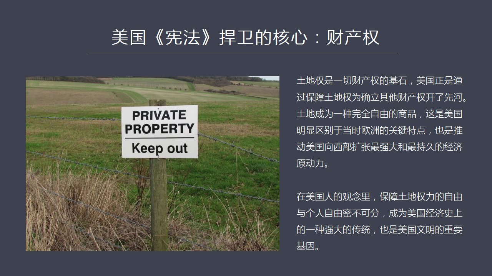

它對於經濟或者對於市場它的影響它的干預是通過什麼手段就是建立一個大體的框架這就是憲法的核心其實就三個字 財產權雖然我們通過每個憲法兩萬多字加上它的修正案你很難找到直接的這三個字它講了就是國會怎麼構成怎...

<strong>All subtitles</strong>

> 它對於經濟或者對於市場它的影響它的干預是通過什麼手段就是建立一個大體的框架這就是憲法的核心其實就三個字 財產權雖然我們通過每個憲法兩萬多字加
> 上它的修正案你很難找到直接的這三個字它講了就是國會怎麼構成怎麼選舉然後政府總統怎麼選怎麼招然後這個聯邦政府哪些權力州政府有哪些權力十八項權力
> 歸聯邦然後剩下了沒有嚴名的全部仍然保留在州等等等等但是它所做的這一切條文上的規定目的 核心目的是什麼就是為了保護財產權這個是美國憲法最最重要
> 的一個理念由於有了這個理念其實再過一百年兩百年 五百年無所謂它的這個文字條款早就其實早就已經改到畫面了通過大量的判例的這種判決已經從根本上使
> 美國憲法當時的原因跟現在所出現的新的形式已經完全沒有什麼關係了譬如說的憲法中我們剛剛所說的跟印第安人的交易憲法裡面有這一條但是印第安人在哪呢
> 現在早就沒有了或者早就被關到這個保留地裡面去了為什麼憲法當時保留了就是為什麼我們現在看到美國憲法中仍然保留這個文字但是它的精神意義早就不在這
> 了它強調的就是聯邦政府的權力可以管理國內所有的跨州的貿易包括跟國外的打交到了一任何貿易這是屬於聯邦的權力它為什麼要擁有這個權力就是要維護全國
> 的統一市場所以當我們理解的這些真正的精神的內涵你會看到維護統一市場維護市場秩序本身最根本的目的是什麼當然還是為了保障以獲得財產獲得財富之後所
> 有權不能受到侵犯這是它的一個核心所以美國政府對於市場經濟有沒有干預當然有干預它沒有干預不建立憲法這個框架大家怎麼做生意所以通過這個框架保護了
> 全國統一大市場通過這個框架使得政府能夠有效的直接的影響經濟比如它幾個判案就是直接去干預市場州政府判你判了判了東西我認為你是偉現把你撥倒這當然
> 對經濟行為產生的巨大的影響影響到後來生活和這個經濟發展中的一切方面這就是它的法律體系對於經濟體系它必須要起到框架支撐的作用沒有這個基礎就不可
> 能有經濟的發展這個是講的政府對國內秩序的管理它必須要承擔主要責任它不承擔就沒人能承擔了除非你搞中世紀的這種商業的行為必須得有人承擔維持市場秩
> 序內部秩序的這種重要的職責這是一個天然的職責所以很多人說政府不應該干預經濟不應該干預市場它應該好好讀讀歷史因為歷史從來就沒有出現過純粹自由不
> 受管制的不受任何影響想怎麼幹的市場從來就沒有過所以從理得上來看人們說越自由的市場越有好處但是你在歷史上能找到壓力嗎你能找到有一個時代有一個國
> 家或者有一個地區搞出這樣的體系嗎從來就沒有了所以這種理論還有什麼意義呢它能夠剝倒誰呢它說服不了任何問題因為你沒有具體發生過那麼下野就是第十頁我們會看到這個我剛才講到它是內部秩序

---

### Slide 12

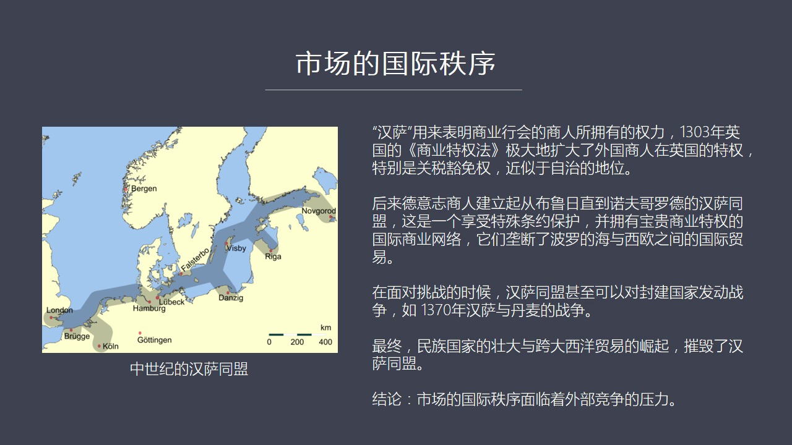

現在要談一下它外部秩序就是市場國際貿易它需要有一個國際秩序這就是我們看到了漢薩同盟在十三世紀到十七世紀之間它有一點時間非常強大特別是一三幾幾年的時候它的勢力達到了達到了一個相當高的這種程度漢薩同盟跟我...

<strong>All subtitles</strong>

> 現在要談一下它外部秩序就是市場國際貿易它需要有一個國際秩序這就是我們看到了漢薩同盟在十三世紀到十七世紀之間它有一點時間非常強大特別是一三幾幾
> 年的時候它的勢力達到了達到了一個相當高的這種程度漢薩同盟跟我剛才所做了福蘭德的這個商會商業行會又做了一次更大了跳躍就是進化了進化成了一個國際
> 間的一個商業協會的聯盟就是每一個城市自由城市中間有一幫商會人控制著當地的經濟而這幫人又組織在一起建立了一個從英國倫敦到布蘭德一直到波羅地海什
> 麼丹麥德國波蘭然後一直到李家一直到現在的俄羅斯麗玲格勒和諾芙格勒德當年叫聖別的寶聖別的寶還沒有當年在波羅地海岩和西歐之間形成了圖中有標示形成
> 了一個體系叫漢薩同盟這樣的一個經濟帶這個經濟帶就是由各個城市中或者獲得了一種強大權力的商人行會組成了一個跨國際的跨國際的一個龐大的商業體系他
> 們在各國家享有相當大的特權例如漢薩他們願意是什麼願意是指著商人們商業行會的商人擁有的某種權力比如在1303年的英國有一部法案叫商業特權法它對
> 於這種外國商人在英國的這種權力給予了明確的保障特別是關稅貨面權還有一種司法的獨立權還有建立貨占建立這個貿易等等這種特權都是在這個法案中疑慾確
> 定所以漢薩同盟在全聖時期有好幾百個城市都是他的同盟的成員那麼這些核心的這些漢薩同盟是哪些人呢就是德意之商人我們雖然後來看到德國統一之間很晚但
> 是德國起源他的思想文化他的經濟貿易起源很早源源比德國歷史要這個德國統一歷史要早了多所以我們會看到這個當年這種漢薩同盟他有具有著強大的實力甚至
> 可以直接跟國家封建國家之間爆發戰爭像我們看到1370年這個漢薩同盟跟丹麥之間的戰爭就說明了這一點當時丹麥和瑞典還在進行PK他們既是同盟有些時
> 候又爆發戰爭漢薩同盟當時是支持瑞典跟丹麥打後來瑞典又反過來反對漢薩同盟對漢薩同盟都是為了在爭奪波羅帝海貿易權所以我們不要小看瑞典丹麥這幾個小
> 的北歐國家當年他的歷史可是真正的強國特別是在16幾年瑞典非常強的可以說是在歐洲手區一直強大的國家比現在的瑞典要強大了多土地面積也大了多包括現
> 在俄羅斯很多地方都是瑞典的俄羅斯這個國家的起源有一種說法瑞典史上有一種說法是瑞典人所以早在諾福格羅德然後到了這個基府建立的基府基府羅斯至少是
> 他們參與的建設這個國家就建成這個國家所以俄羅斯的民族歷史他的起源文化文明的歷史可以追蹤到瑞典人身上所以瑞典當年可是一個很大的大帝國那麼我們在
> 這兒看到了漢薩同盟他就形成了一種新的國際秩序排除競爭壟斷了波羅地海和西歐之間的這種貿易那麼在這樣一個情況之下他為什麼後來衰落了衰落就是16世
> 紀特別是宗教改革之後民族國家崛起法國包括其他的這種像英國西班牙這些國家變成了一種民族國家他的實力越來越強的他們就不斷地挑戰漢薩同盟所形成的國
> 際秩序包括俄羅斯沙皇比德大帝崛起之後也從可以說從東邊打擊了他們所以在幾種力量的綜合作用之下而且包括波蘭這些民族國家越來越強那之後就不斷地殘時
> 和打擊漢薩同盟最後還有由於跨大現亡也地崛起但是當時大家已經開發著民地圈了導致了漢薩同盟最後被摧毀到了16幾年他就基本上沒有任何影響力了這說明
> 一個什麼問題他的結論就是市場的國際秩序面臨著外部競爭了強大的壓力我們剛剛講到市場的內部秩序是面臨著黑洞追求歷論這種歷論黑洞的這個巨大的壓力或
> 者是巨大的破壞比他的外部還面臨著其他競爭者的強大的壓力所以必須得有強有力的干預才能夠維持這道體系否則的話他要麼走向內抱要麼被外部力量所摧毀這
> 就是我們看到的夏業第十頁第十頁我們講到英國崛起對國際貿易的干預

---

### Slide 13

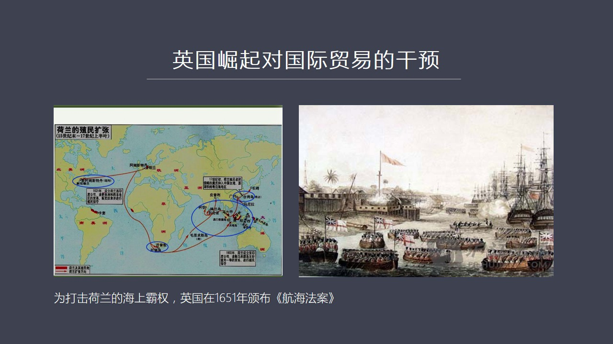

當年英國崛起的時候誰最強的當然是荷蘭最強的如果說十五世紀十六世紀如果說是這個葡萄牙河西班牙兩個帝國的世紀那十七世紀一定是荷蘭的世紀因為當時荷蘭的這個非常的這個生猛主要原因是他的造船業效率極高全在整個歐...

<strong>All subtitles</strong>

> 當年英國崛起的時候誰最強的當然是荷蘭最強的如果說十五世紀十六世紀如果說是這個葡萄牙河西班牙兩個帝國的世紀那十七世紀一定是荷蘭的世紀因為當時荷
> 蘭的這個非常的這個生猛主要原因是他的造船業效率極高全在整個歐洲他的造船應該是手區執了像阿姆斯的單一個城市就上百家造船場他的整個荷蘭能夠同時建
> 造幾百艘的大型艦艇所以他的海軍實力是法國家英國總和的一倍比新國家法國總共的艦艇海軍艦艇還多一倍他的商船的船隊那的規模巨大無比了15000艘他
> 為什麼這麼厲害就是因為他造船業厲害他由於造船業厲害搞出這麼多船來所以他就壟斷了全世界的跨洋貿易中間壟斷了很多運輸業務由於運輸業務又發展成了商
> 業網路因為他有船他可以幫你運所以他知道客戶是誰消費市場在哪誰需要所以建立起了一套自己的這套這種商業網路一套一套造船業和航運業最後成了全球貿易
> 的組織者以無論是這個歐洲北部的波羅地海貿易還是南部的地中海貿易也包括像西班牙波島牙他們在海外殖民地就是在亞洲在非洲在美洲的這些殖民地無論你在
> 哪搞最後你這個貿易組織者是誰是阿姆斯德丹也就是你不管在哪運貨大家的貨全部雲集到阿姆斯德丹去情交易主要原因是荷蘭人的船荷蘭人商人在組織這個事當
> 然其他人也有人像熱南亞當時也有一幫這個壟斷地中海貿易一些商業圈也有一些其他的國家得一致得一致的一些商人也在做這個事所以他是群英病症但是荷蘭絕
> 對是老大因為他造傳業無可比例在這樣情況之下我們會發現你西班牙不管從南美洲還是北美洲弄來的糧食也好精英才好也好雖然運到了西班牙的港口城市就是黃
> 金白銀運到了三個利亞但是這些黃金白銀卻又被轉移到阿姆斯德丹他只有在阿姆斯德丹才能進行全球採購在那才能買到東西因為全球的商品都是運到那進行擊散
> 在這種情況之下商業匯票這些清算都是在阿姆斯德丹來完成所以阿姆斯德丹就天然成了全世界的金鐘中心商業匯票清算貨幣的這個集中包括資本的匯籍都在都在
> 哪所以當時在十六十幾十七十幾的時候阿姆斯德丹那拼軍力率只有百分之三想歐洲很多國家都百分之十幾像法國那國王打仗沒錢了就到阿姆斯德丹來這個目擊資
> 金也大企業要發展怎麼那麼也到那去找錢所有的商人也好只要你需要錢都奔阿姆斯德丹去找1669年那就成立了全世界現代全世界的中央銀行的勞比組就是最
> 遠最遠那個比組阿姆斯德丹銀行1669年比英國的這個銀行銀行還要早八十五年這就說明了當時荷蘭的他的金融力量一托於他的商業全球的商業網絡再一托於
> 他的行運再一托他的造船形成了由海軍保護下的這一套體系建立了全球的貿易秩序那麼英國怎麼來做這個事呢怎麼來挑戰荷蘭呢當然就是我們這個看到了他在1
> 651年頒布的韓海法案韓海法案專門針對荷蘭人的韓海的優勢英國人當時已經佔領了北美十三個致命地他說我跟致命地時間的貿易只能用英國船船長的是英國
> 人四分之一他隨手的是英國人而且所有全世界的商品只要跟我們大英帝國版頭之內所有這些地方做生意你的船都必須對先把貨給我運到倫敦或者運到英國的港口
> 然後交完關稅才能去其他地方致命地的這個商品也一樣而且致命地的很多比如說這個原材料只能賣給英國像羊毛就不能賣給其他國家還有糧食這些我吃不了你現
> 在賣給其他國家所以他正是通過航海法案來排除荷蘭的這個航運的競爭因為只能用英國船荷蘭人的船進不來而且這就導致了英國和荷蘭之間的四次大海戰所以我
> 們看到任何國家的崛起不通過戰爭就像和平的完成這種國際貿易這種精英中心的轉移是不可想象的最後就是我們看到了英國這邊努力地去發展自己的海軍包括航
> 海它這麼做了很大的目的也是為了發展自己的水手來從事這個航海來遠洋貿易包括海軍英國當年海軍還非常落後從事航海的人不太多所以跟荷蘭打仗並不是總是
> 能打勝仗被荷蘭打敗了好幾次正是通過這個航海法案英國最後終於把荷蘭打趴下他就成了世界的貿易中心所以我們從這個例子可以看到下一頁貿易中心的轉移必然帶來金融中心的轉移也就是大國在某個方向崛起了

---

### Slide 14

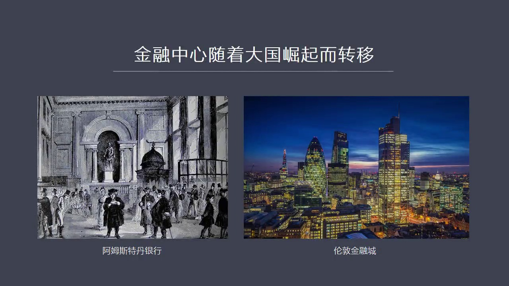

成了全球貿易的組織者金融中心必然移到這個國家什麼原因就是商品是跟著傳走的商品的清算就是這些匯票獲款這些清算就是商業匯票的清算自然會轉移到商品的集算地所以倫敦取代阿姆斯特丹成為匯票清算的中心這個時候我們...

<strong>All subtitles</strong>

> 成了全球貿易的組織者金融中心必然移到這個國家什麼原因就是商品是跟著傳走的商品的清算就是這些匯票獲款這些清算就是商業匯票的清算自然會轉移到商品
> 的集算地所以倫敦取代阿姆斯特丹成為匯票清算的中心這個時候我們看到英國開始成為全球商業貿易的組織者全球的金融中心他的航運業造成業都很強的這個時
> 候就完成了一個新的霸權取代老霸權的過程這就是我們看到所謂我們現在看到很多人在說自由貿易或者比較優勢這個比較優勢是一個觀念我覺得從經濟史或者從
> 大國崛起的歷史來看是根本站不住腳的因為當時的英國從無論是從造船業在起步的極端跟河南比無論你造船航運還是商貿網路還是金融網路都遠遠趕不上河南英
> 國不是為了它如果真搞自由貿易真搞比較優勢就老老實實幹你英國這個養羊就事了就完了像我們歐洲大陸提供羊毛其他事你別想如果是這樣的話英國就永遠是一
> 個非常編輯的一個島嶼永遠發展不起來如果是這樣它就不是英國人了就不是大英帝國這個派頭了它是從一開始就決心要起來要起來怎麼辦我只有挑戰你的霸權我
> 怎麼挑戰發展我的製造業這就是韓海法案中對殖民地的主動要求就是我要通過剪刀叉強行去轉殖民地的錢因為你給我生產糧食你給我生產生鐵製成品什麼也不成
> 搞不成搞鏈鋼爐不成生產鋼鐵的那種工具包括鐵電都得從英國進口你只向我提供原材料糧食生產原材料養羊毛製成品什麼都必須搞這個就是它一種極陽製工業化
> 的這樣的一種思路我們現在看到像其實日本民主為新之後也進行過非常激烈的強制工業化的過程因為你是後進者你要想趕上先進者你還想好吃好喝好玩的也不想
> 努力也不想吃苦也不想付出勞動也不想付出血汗甚至要留學你就想成為製造業的大國嗎就在那個時代是不可能的你就想工業上趕超發大國間嗎做不到任何國家要
> 想完成這個快速的激烈都必須要付出慘重的代價蘇聯高速激烈餓死了好幾千萬人或者好幾百萬人那麼中國當年的這個超級的這種激烈導致了三年自然在海所謂自
> 然在海就是工業過渡激烈導致了也餓死了很多人那麼其他國家也一樣沒有哪個國家能夠輕輕鬆鬆的在不發生戰爭不發生激烈就能夠很輕鬆的完成工業化誰也走到
> 誰也不是神仙所以如果我們從歷史角度來看每個國家在這段歷史中都有類似這樣的一個過程英國是通過戰爭不是通過打仗但是戰爭中要死人整個國民經濟要受到
> 壓抑那沒辦法也得打也得把河南幹掉要不然我就起不來所以英國人開始推行李家徒他們開始宣揚最有貿易先開始宣揚比較優勢那都是在19世紀以後了他已經打
> 敗了所有的什麼法國西班牙都被他幹爬下了河南也被他幹掉了他那個時候已經成為世界的絕對霸主了那麼成為霸主之後他就成了生產貿易金融的組織者這就好比全球財富的流向由我說了算

---

### Slide 15

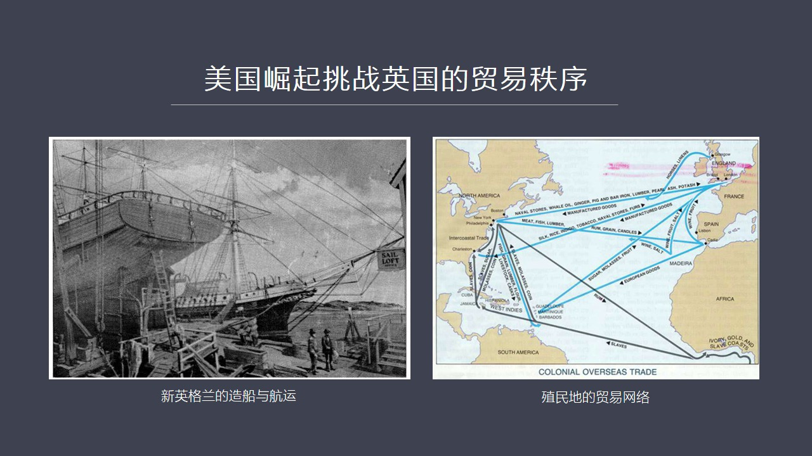

我來給全世界切蛋糕你們生產蛋糕我來切永遠給自己留最大的那一份這個時候主張自由貿易和這個分工的這種就是比較優勢這是霸權國家天然的使命是他理所應當的行為但是如果我們還是個邊緣國家或者所有邊緣國家如果去信奉...

<strong>All subtitles</strong>

> 我來給全世界切蛋糕你們生產蛋糕我來切永遠給自己留最大的那一份這個時候主張自由貿易和這個分工的這種就是比較優勢這是霸權國家天然的使命是他理所應
> 當的行為但是如果我們還是個邊緣國家或者所有邊緣國家如果去信奉這套理論的話這個就要被洗腦因為英國就不是這麼崛起的他走得正好相反的道路後來的美國
> 也不是這麼崛起的他要搞自這個比較優勢的話就會發展成加了比喊乾脹中資源或者附近駕縱炎草的這個地方就不可能進化出新英蘭這種模式來所以通過歷史的這
> 種對比我們會發現大國它不可能採取一種純粹的理論的說教而且這種理論還沒有歷史真實案例的支撐就改變它的思路這個走不到像我們現在看下一頁這個13頁
> 美國崛起挑戰英國的貿易秩序就是新蘭地區重點發展造成與航運最後擴展它全球的或者叫跨大西洋的這個貿易網路掌握信息掌握客戶信息組建貿易網路是要遠比
> 造船和航運更重要的工作就是你能不能組織其套這個渠道為網我們現在知道渠道為網的重要性當年就是要組織貿易網路只有組織了貿易網路之後你的其他的東西
> 才發展得起來我最近看這個看一些經濟史方面的書特別是波羅代爾的書它有一個觀點我覺得非常的有意思它是任何一個城市的發展城市經濟的發展必須要先建立
> 起一個跨城市的跨地區的城市的貿易網路來然後才能發展其他的工業來我覺得這話說得很有道理就是你是埋頭如果搞生產的話那就好比富蘭德那些人專門搞一個
> 工序生產這個工序中間的某一個具體的這個過程但是你不是組織者你不知道你客戶在哪你不知道人家願意出多少錢來買你這個東西你不知道市場在哪在這種情況
> 之下你就永遠是打工的命而相反如果一個城市先建立起一個全球的貿易網路最好是全球了然後這個城市就可以做到什麼你生產什麼我就可以給你賣什麼這就是渠
> 道微網這個城市經濟發展的這個有意思的現象我覺得它這個觀點提得非常深刻因為如果我們對比地中海岩的這些城市跟中國那些很多就是在古代那些很多大城市
> 除了宋朝之外宋朝商業是比較發達的漢堂實習談到城市你會發現中國城市人口是很多但是商業貿易沒有建立起真正強大的全球的網路來我們不是一個真正的貿易
> 立國的國家只有難送某一個時間段是勉強做的一點因為中國商人到了波斯中國商人到了非洲中國商人還到了很多其他的地方組建起了一個可以說是南太平洋地區
> 的一個貿易網路包括到了高民立國所以我們以後出去走的時候你要帶了這套體系去觀察去思考你會獲得更大的這種收益好我們現在看十四頁現在我覺得阿里巴巴馬雲他們要做的事情

---

### Slide 16

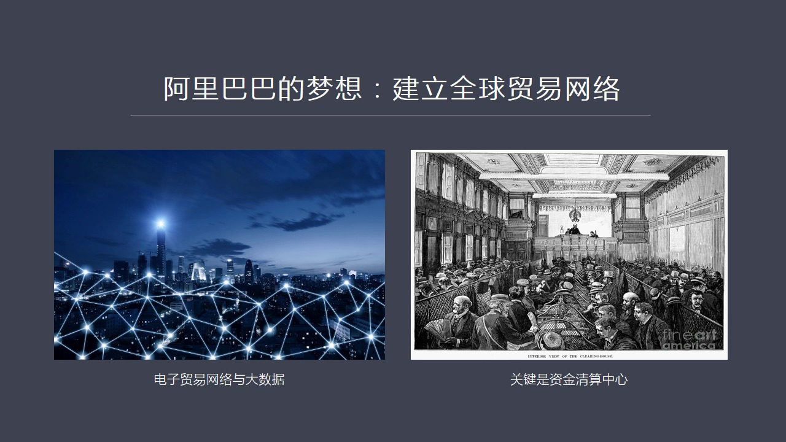

就有點像新蘭就有點像這個英國當年要做的事情就是要組建全球貿易網路要建立起來我們現在為什麼駐三角長三角這些沒有定價權因為你不掌握網路你的東西只有賣給這個網路才能賣得出去這就好比我們看到的京東網 當當網它...

<strong>All subtitles</strong>

> 就有點像新蘭就有點像這個英國當年要做的事情就是要組建全球貿易網路要建立起來我們現在為什麼駐三角長三角這些沒有定價權因為你不掌握網路你的東西只
> 有賣給這個網路才能賣得出去這就好比我們看到的京東網 當當網它很有定價權出版社的書到他那兒我就五折收你不賣給我那你賣不出去然後我們看到在網前的
> 這些蘇寧電器什麼黃紅玉稿的這些電器的網路其實也是一個道理你不管是長紅還是哪家生命彩電你有本是自己建職銷電那成本巨大要不然你就賣到他這個網路中
> 在他們的內容他幫你們所以誰掌握網路是一定掌握定價權所以關於定價權的問題其實沒什麼好爭的就是因為中國的產品中國的廠家不掌握全球貿易的網路你就沒
> 有定價權這事很簡單那怎麼還能建立全球貿易網路呢阿里巴巴想做一個新的嘗試這個嘗試馬雲提出來了我們要在全世界建電子化的貿易網路這比當年荷蘭和英國
> 包括新英蘭包括美國搞得更牛因為你建立網路是一個一個敲人門去給他做生意有長年的這種合作關於之後人家對你產生了信任然後你才記住了這個客戶是誰然後
> 他建立起了這種長遠的這種貿易關係電子商務他起到同樣作用是他的大數據我可以直接掌握交易的信息我可以知道我的客戶在哪誰是我的客戶他願意抽多少錢買
> 什麼商品這就是大數據這種大數據他的核心取代了當年我們所看到的18世紀19世紀所形成的人與人這個網路人與人之間的網路背後還是數據那麼現在阿里巴
> 巴想做一個全球的貿易網路的電子化的平台把這幫人意網打進繞開所有的中間商當然了這個問題關鍵還是要涉及到我覺得有幾點首先是涉及到資金清算因為我講
> 到金融中心的轉移或者你是不是真正把握了這個商業網路一定是取決於資金是不是在你的清算阿里巴巴當然他通過微信支付通過支付寶通過其他這個形式正在做
> 這個事但是他的就是如果你最後不掌握金融之高點這件事情你肯定失敗做不好做不了但是你想掌握自己的清算的中心這個地位就必須要深刻了解全界發展的經濟
> 發展是所必然面臨的這種這種障礙就是人家憑什麼要把錢放到你這很簡單你支付寶中國人要用美國人為什麼要用我都信任為什麼一定要用支付寶你可以游泳這樣
> 安全呢不要忘了每個國家他的政府都在管理市場的秩序都在建立嚴格的這個這個市場秩序體系你要想讓別人的商家把錢存在你阿里巴巴一家非銀行單位的這樣的
> 這個銀行照顧上憑什麼你符符合這個國家金融監管的條例就這些國家的政府在使用警察權嚴格在使用你的每一個步驟看你合不合法你要不合法立刻把你打出市場
> 你根本就沒這個機會所以我們看到在中國阿里巴巴可以通知因為中國的這個秩序政府在這個秩序建立上沒有花太大的努力所以我們建立這個電子商務這個法律的
> 成本是極低的但是在國外情況正好相反由於幾百年所發展起來這種行會勢力各行各業的勢力包括政府的嚴密法律體系都使得你在國外去附近在中國這種成功所面
> 臨的法律成本或者說是一種文化成本要比在中國要高的不知道多少倍而在這一點上我認為他們可能還完全沒有這個概念你以為跑到哈特克斯坦或者跑到哪個東歐
> 的國家建一個倉庫線和物流中心就完了沒有這麼簡單這就要求我們深刻去理解經濟發展式沒有這個功力的話這件事我認為他現在阿里巴巴他自己沒有強大的這個
> 人才儲備去處理這麼困難每個國家都不一樣的監管體系這太難了所以我說他這個夢想是很好的但是離現實還有巨大的差距而且比較比較遺憾我甚至不知道我甚至
> 不確定他們是不是意識到了這個差距到底是在哪或者差距到底有多大好那麼最後呢其實我們剛才通過這個歷史案例的很多分析不管是市場的內部機制還是市場的
> 外部機制政府都要扮演強有力的角色關鍵是怎麼去弄他背後的原理是什麼我在這提出了一個就是我現在課堂上也提出了

---

### Slide 17

就是草平原理什麼叫草平原理就是市場如果沒有秩序就像右邊這張圖第15頁的右邊這張圖就是一片荒草一片荒地你喜歡這樣的草平嗎當然沒人會喜歡為什麼因為野草生命力永遠比優秀草種的生命力更強大他獲取資源那種不則手...

<strong>All subtitles</strong>

> 就是草平原理什麼叫草平原理就是市場如果沒有秩序就像右邊這張圖第15頁的右邊這張圖就是一片荒草一片荒地你喜歡這樣的草平嗎當然沒人會喜歡為什麼因
> 為野草生命力永遠比優秀草種的生命力更強大他獲取資源那種不則手段那種無所不用其極的能力超過了優良草種所以你只要沒有任何管制就一定會出現野草草這
> 個野草從生這樣的局面那是不是你所要的市場因為他這種對資源的略多性的席取會是優良草種根本就沒有發展的餘地這就造成了一個逆淘汰就是越是沒有底線越
> 是無所不用其極的廠家個人在這個市場中獲利最大這就把優秀的草種把一些好的東西淘汰出局這就是略幣取出糧幣的原理跟這是一樣的如果是一個國家任由市場
> 這麼發展他非但不能促進國民經濟非但不能提高產品質量非但不能實現經濟的轉型或者升級反而最終會傷害每一個消費者大家突便宜啊突便就買雜草了但是雜草
> 就會變得越來越強大使得產品質量越來越低因為那些能夠進下新來研究好產品好質量人都已經破產了玩不下去了市場上全是一些假貿偽列那這個國家經濟不崩潰
> 了嗎所以市場和政府之間的關係政府就是要維護草屏的這樣一個角色這就是我們看到左邊這張圖這個華元這個草屏跟右邊那張圖雜草從生的這張圖我們其實不需
> 要太高的離譜水平也不需要經濟學的專業知識你只要一打點一看你就知道我需要的是這種僅然有序的能夠優良草種獲得足夠發展空間的這樣一種市場所以我們在
> 很多情況之下在探討市場經濟的時候連市場經濟需要秩序這一點概念和意識都沒有我們認為自由進程越自由越好通過這些案例分析大家能夠扭轉這樣的一種錯誤
> 的認識因為下一步最重要的一個戰略卷刑就是要從全球最大的工廠變成全球最大的市場而我們現在如果不理解市場意味著什麼不理解市場需要秩序需要內部秩序
> 也需要外部秩序而政府在中間扮演了關鍵性的角色那還怎麼搞市場所以我覺得看到很多經濟學家他們這個論戰我覺得沒有人從經濟時的角度去分析去探討絕對自
> 由的市場經濟有沒有存在過在歷史上如果他過去沒有存在現在又沒有一個國家是這樣那他未來還能存在嗎或者說能不能出現這樣打一個很大的問號你如果拿一個
> 根本不存在不現實的東西照辦照抄或者去拿他說事那你搞出來這個市場究竟是個啥樣的市場那就沒人知道了我覺得很可能就是荒草重生的市場好 今天關於這個
> 問題市場和政府今天的關係我就先講到這如果我們看第16頁我這個總結了一些知識模塊知識模塊這個問題好時比較巨大所以我現在還在把你們以前做的這個關
> 於我快速的東西還需要重新整理一下然後我們會陸續的推出這一期設計的知識模塊主要有8個就是經典的市場理論是講什麼的然後第二個是十三世紀福蘭德的訪
> 職業是怎麼發展的漢草同盟然後接下來是英國的行安法案美國的憲法然後是阿姆斯的難銀行就是現在中央銀行他是怎麼就是那個鼻子初期狀態他是怎麼運轉的就
> 是他這個清算體系包括貿易結算他這是怎麼做的還有就是美國的土地所有權這一點今天沒有講到我找時間再相信講因為這個事特別有價值而且特別有意思然後第
> 八點就是跨大西洋的三角貿易這個今天我也沒有來得及講那個航海那張圖這兩個七顆八我們先展示先放的展先不用做如果大家有人就是分派工作的話可以把錢6
> 個先搞出來然後我在陸續再把以前我們積累下來的一些東西我在做一些刪減然後通過平台發給大家然後最後呢第17頁我推薦了四本書後面任務中間講了三個歷
> 史階段的三個帝國最後面臨共同的衰往了命運究竟是什麼第二本書就是崩潰我在頭幾頁批評中講到了一些四大文明體系他為什麼會銷往崩潰就講到他脫破了生態
> 極限第三本書是美國經濟史這本書寫的比較有特色我看到好幾種美國經濟史這本書的特色就是他對法律的這個對於市場秩序的形成起到這個作用進行到深入的點
> 評其他美國經濟史都是在講經濟或者講歷史或者講這兩者的結合但他深入點評了美國的法律體系這個是一個他的一個特色然後第四本呢是建橋歐洲經濟史這個是
> 主要是講這一共是八卷我現在給他推薦的是第二卷講弗蘭德的法治業的崛起這段還有意思這個建橋這幫學者還真是很牛他們對中世紀這種研究你一看就知道他的
> 功力有多深就是研究每個城市每個海關每一筆進貨單據然後會總計算他當時貿易量有多大跟誰做船船的都位船的型號然後行行時間各國出產的產品各個城市出產
> 產品勞動分工他把這個這個毛訪之夜分工精細程度描述可以說讓人震撼你才知道原來他們這些的工底是如此的身後而我們僅僅說學點中學世界歷史學點什麼大學
> 世界歷史學歷史系的這些專業的人也搞不到這麼系的就會嚴究到這種程度所以我覺得從經濟角度來借建這些這種國家的經濟史絕對讓人演 joue大概而且你
> 在有這種世界之後你在去觀察思考任何人說的過於經濟的於人任何話你會比他們更有一種重生感你 can評價和點評他們的結論和他們退歷過程好

---

### Slide 18

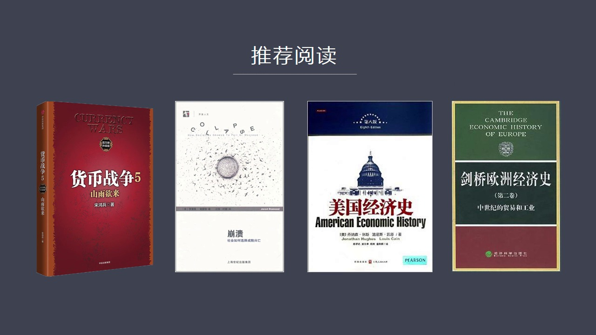

然后我会把PPG和录音放到网上然后通过平台发给大家好 谢谢各位

<strong>All subtitles</strong>

> 然后我会把PPG和录音放到网上然后通过平台发给大家好 谢谢各位

---

### Slide 19

<strong>All subtitles</strong>

---
