# 核心课视频-004.债券回购与影子货币 — Detail Slide Notes

> **来源**：鸿学院核心课程  
> **幻灯片**：18 张

---

### Slide 1

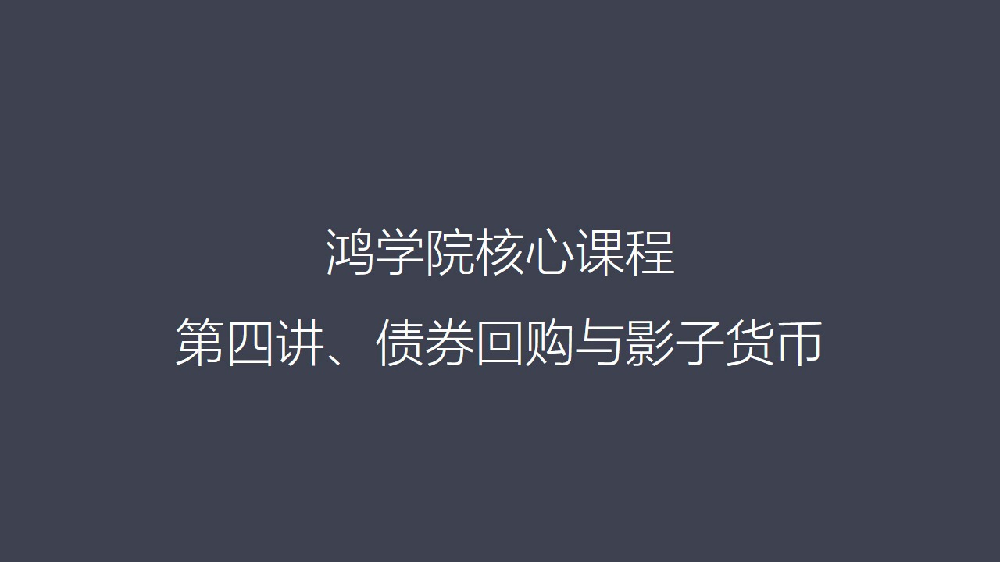

這課是一個突發事件就是我們看到12月中在中國的市場上不管是會市

<strong>All subtitles</strong>

> 這課是一個突發事件就是我們看到12月中在中國的市場上不管是會市

---

### Slide 2

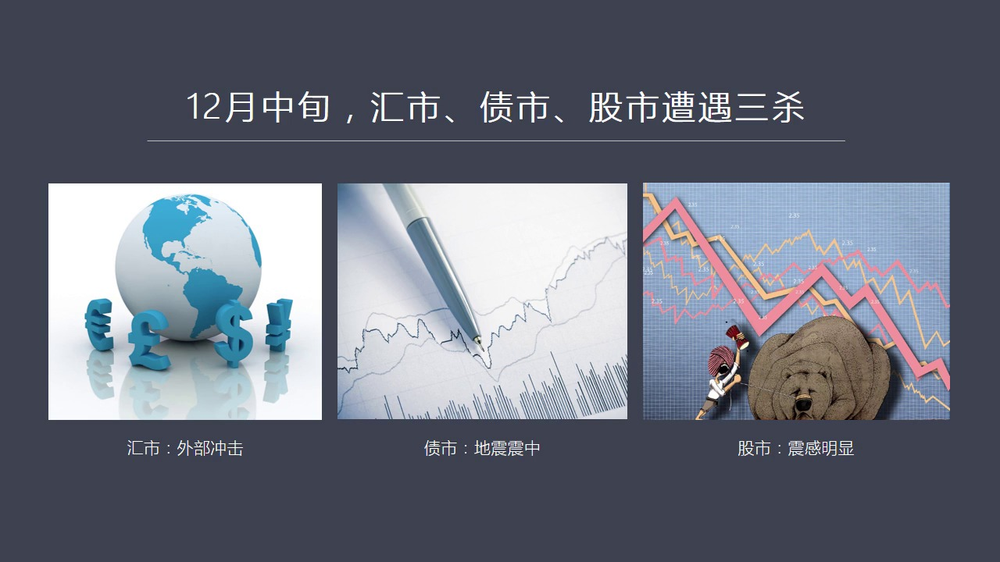

債市還是股市都發生了巨大的震撼所以我們臨時把這一講加進來以貼近現在正在發生的事情所以這兩個題目就叫市場三沙它的背景還是要從美元環流開始就是我們在李講龍講到的由於美元環流機制導致從2014年7月開始美元...

<strong>All subtitles</strong>

> 債市還是股市都發生了巨大的震撼所以我們臨時把這一講加進來以貼近現在正在發生的事情所以這兩個題目就叫市場三沙它的背景還是要從美元環流開始就是我
> 們在李講龍講到的由於美元環流機制導致從2014年7月開始美元的環流不斷地逆轉從熱環流變成冷環流這樣就形成了對全球海外體系美國之外的這些美元體
> 系巨大的一個西富作用使得海外美元開始陸續回流美國從2014年7月一直到現在這個過程不斷在自我強化不斷在發酵所以這就導致與美元債務相關的很多國
> 家紛紛出現問題尤其是新鷹市場國家普遍存在的問題是本幣對美元的大幅變質資本外流他們的金融市場震盪越來越大情況越來越不穩定那麼我們看到的最近一段
> 時間尤其是二這個2016年12月15號美聯儲的第二次加稀包括英國的來賓利率不斷地上漲這都在不斷地強化這個過程最終這些過程的合理導致我們看到的
> 12月中旬在中國的市場中出現了這個所謂市場三商我們的會市債市和股市同時受到了猛烈的衝擊在一個星期之內這三個市場出現了巨幅震盪那麼在我看來在這
> 三個市場中它的外部的衝擊力量就是會立市場由於它的巨大的衝擊力導致了真正問題的核心債券市場發生了巨大的震盪其實債券市場在我看來是這次我們看到的
> 市場震盪的真正的鎮源也就是地震的鎮中同時股市由於債市受到嚴重衝擊之後導致了流動性的急劇緊縮我們看到出現了前方我們看到了有人失聯我們看到了市場
> 上又出現了大量的技術性的違約就是戰士該交割交割不了的還有一些戴持銀行戴持這些債券銀行紛紛出問題還有好幾下券商也被捲入這個是導致股市出現震盪的
> 根源所以在三者之間的關係在我看來很明確債市是整個爆炸里的中心會是從外固點燃了刀我所而股市受到了債券市場的嚴重影響這大致就是三者之間的關係那麼
> 為什麼我們會有這樣的判斷和認識呢首先最重要的一點就是我們需要把金融市場的內部架構就是如果把金融市場形容成一個尺輪互相搖合不斷運轉的過程的話我
> 們首先需要了解在當金融市場上哪個市場是真正的核心市場哪些市場是外圍的市場我在貨幣戰爭五中曾經專門論述了這個問題在我看來市場中間最具流動性的或
> 者說是真正流動性源頭的那個市場它就是中心市場在全世界方面來看以美國為代表中國現在也在逐漸朝這個方向進化這個中心市場就是債券市場特別是債券市場
> 中的回購市場這構成了整個金融市場中最活躍交易量最大流動性最強可以說它是整個金融體系貨幣創造的根源它是原生動力所以我們一定要首先把這三個市場之
> 間的關係搞清楚那麼相對而言股市就比較邊緣化它是個外部市場雖然它的規模不小但是它並不是創造流動性或者並不是貨幣創造中心會律市場它反映的是一個一
> 個國家實體經濟跟另外一個國家之間的一種對比某種意義上來說它也不是一個創造貨幣或流動性的一個中心所以在我看來債券市場中的回購這個領域是整個金融
> 市場中重新的重新是流動性的發動機是貨幣創造的源權而債是相對應的股市和會市只是它的一個外源的市場這就是我們首先必須要明確這三個市場之間的關係這
> 就是我們PPT第一頁中所講到的這個核心內容我們現在來看第二頁現在我們來重點分析一下

---

### Slide 3

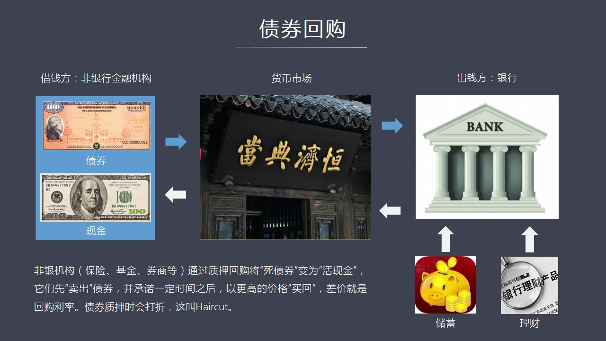

為什麼債券的回購它是一個這麼重要的一個市場為什麼說它是一個流動性的中心在這裡我們首先要借用一個比較簡單的位子來做一個比喻什麼叫回購我在這裡想用一個當戶的這樣一個概念來解讀回購市場是怎麼回事比如說大家都...

<strong>All subtitles</strong>

> 為什麼債券的回購它是一個這麼重要的一個市場為什麼說它是一個流動性的中心在這裡我們首先要借用一個比較簡單的位子來做一個比喻什麼叫回購我在這裡想
> 用一個當戶的這樣一個概念來解讀回購市場是怎麼回事比如說大家都理解當戶如果說你們家有一個比如說祖傳的寶貝現在你手中急缺現金那麼當然你可以把這個
> 寶貝比如說一個清花磁拿到當戶去做抵押然後當戶的老闆首先看這個清花磁是真的還是講的做一番評估建定然後說行我給你打個七折原價如果是100萬我按著
> 七算收你的貨那麼這個就叫打這個率那麼有了這個打這個率之後你還得告訴這個當戶這個老闆你什麼時候來熟回比如說你先說我現在手都不要緊三個月之後我來
> 熟回好這個三個月的時間相當於一個回購的期限就是你三月之後拿著這個熟回的價錢拿到熟回的金額再加上你欠電鋪的最段時間的利息來熟回你的清花磁這一點
> 非常像我們現在的債券市場中的這個製壓回購這樣一個概念在這家回購過程中這個需要錢的人融資方他手上拿了不是一個清花磁他手上拿的是一大寶債券這個債
> 券可能是國債也可能是一些企業債也可能是地方債那麼在中國債券呢可以分成兩類吧一類被稱之為是利率債利率債主要是指了想活債地方政府債這些沒有風險的
> 因為有政府信用在背後的這樣一些債他主要體現在我能夠收多少利率所以他們被稱之為利率債還有一種被叫做信用債信用債主要是指了這些比如企業公司發現的
> 債券由於這些企業公司他並沒有政府作為擔保所以跟他的經營業績很有關係他如果經營了好有大量現金流那麼他就他的長寬債有什麼有問題的但是如果他經營不
> 好他是有可能出現破產甚至這個倒閉這樣的問題的債券是會違約的所以他是純粹的信用不管是這兩種中間哪一種都可以在我們的市場中就是當鋪去做抵押這個當
> 鋪在現在的金融市場中被稱之為是比如說貨幣市場所以手持債券的這些金融機構一般指的是需要錢的當然當然主要是一些非銀行類的金融機構比如說券商還有一
> 些貨幣基金還有一些各種各樣的基金包括一些做投資的這種公司他們構成了非銀行類的金融機構往往是手中有債券但是非常缺陷金那麼他們就會到貨幣市場中來
> 那麼在這個市場中他們抵押用他們手上債券作為一種抵押去借錢借了錢之後他們承諾我在一天以後或者在兩天或者在多少天以後我會把這個債券熟回然後把現金
> 還給財界方中間再加上相應的利息這個過程跟我剛剛所說的古董抵押的過程是完全一樣的那麼在中間涉及到幾個概念這個你的債券由於作為抵押品抵押給對方這
> 種形式叫制押式帶這個制押式的這種回購與此相當於還有另外一種回購叫買斷式的回購這個買斷式的就是我不是制押我是直接把這個債券賣給你當然我可以過一
> 段時間再要求把它買回來其實也是回購了另外一種形式那麼除了這個概念之外你這個抵押品比如說你是100塊錢漂面這樣子的債券那麼你拿到抵押方那個地方
> 的時候抵押方就好像是當鋪的老闆他說你這100塊錢我不能按著原價收我得給你打個折比如說你是100塊錢在我看來它只有98塊錢的價值所以你要做一個
> 打折綠那麼這個打折綠在英文中比如說這個叫Haircut就是相當於減一點減一點你的羊毛除此之外當你回購的時候就是熟悔的時候你要向拆解方支付利息
> 這個利息就要回購利率其實這個簡單的概念聽起來並不這麼難以理解回購毛準以上來說還是比較簡單的那麼回購的錢是從哪來的呢所以我們如果看這個PPC的
> 右邊你會看到銀行顯然是出錢的一方面就是非銀機構最終通過市場把抵押品抵押給了誰呢往往是押給了銀行銀行呢它的錢又從哪來當然就從儲蓄者還有它銀行去
> 向客戶銷售各種理財從那裡獲得資金然後再把這些資金拆解給這些非金融非銀行業的這種金融機構通過這個債權回購這個市場來完成當然出錢方還可能有市場中
> 的其他參與人比如說信托保險公司等等 凡是有錢的在市場中能目擊到資金的往往是在這個PPC的右邊他們作為出錢方也包括個人如果大家打新股在股市上有
> 些閒錢那麼也是可以去做這個資金的拆解方的你可以把你的閒錢借給這個非銀行類的金融機構通過回購上是可以來完成的這個操作上來看也不是特別複雜如果我們看第四頁PPC我們會看到它的基本操作

---

### Slide 4

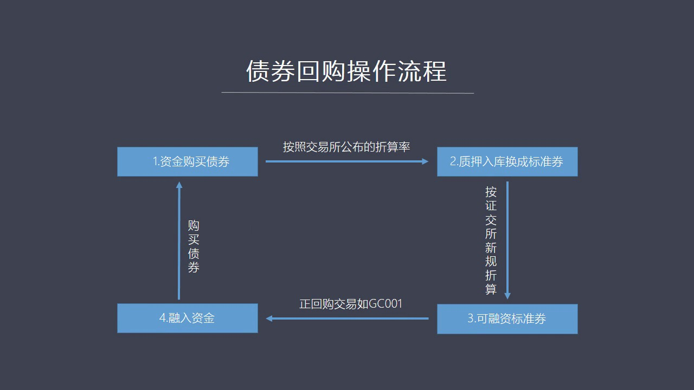

是這樣的一個操作流程就是首先看第一就是資金購買債券這就是那些非銀行類的新股機構比如說券商他們用他們的自由資金去買了大量的債券第二步是什麼呢他們需要按著一個打折率交易所規定的公布的打折率然後把這些債券作...

<strong>All subtitles</strong>

> 是這樣的一個操作流程就是首先看第一就是資金購買債券這就是那些非銀行類的新股機構比如說券商他們用他們的自由資金去買了大量的債券第二步是什麼呢他
> 們需要按著一個打折率交易所規定的公布的打折率然後把這些債券作為制壓但是到第二步制壓入庫要換成標準券這個為什麼要換成標準券呢因為你持有的各個公
> 司的這些債券並不代表同樣品質的這樣一種抵押品所以首先要把這種種類不同的抵押品轉化成某種一種變成一種抽象的標準化的抵押品這個在中國市場上被稱之
> 為標準券當然在國外、在美國國債就可以了或者兩方債也可以然後下一步就是這種標準券還要按著一定的規則進行打折打折之後就變成了可融資的標準券就是可
> 以用這樣的一種標準券進行融資的它就是經過打折之後然後再作為抵押押給這個拆解方比如說如果我們看這張圖上講的是機司01這指的是一年期這個我們講的
> 是一天的國債回購它的利息以這個標誌來顯示機司011那麼這樣的話這個拆解方就把錢借給了資金需求方就是券商這樣的話這個券商就拿到這筆資金這就是第
> 四步然後它拿到這個資金可以做它想做的任何事情所以從操作流程來看是一個比較簡單的流程就是債券在抵押過程中首先轉化成標準券標準竟然經過打折之後進
> 行融資最後把現金轉到這個資金方手轉到這個拆解資金的手中那麼在這個過程中如果我們看第五頁就是普通人也可以參加進來而且它的操作流程其實並不複雜

---

### Slide 5

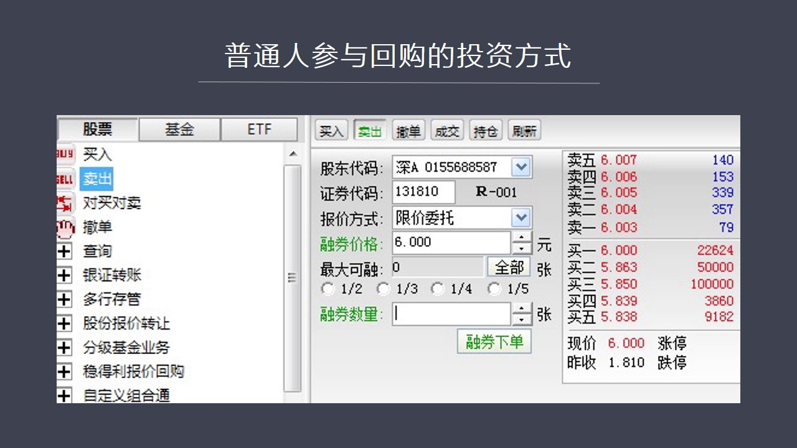

這個對於我們來說如果你有股票賬貨的人都可以進行操作你比如說我現在顯示了第五頁這個介面就是如果你有炒股票的軟件打開這個軟件那麼如果你手上有現金你想把它借出去借給金融機構操作的介面大概就是這樣一個介面注意...

<strong>All subtitles</strong>

> 這個對於我們來說如果你有股票賬貨的人都可以進行操作你比如說我現在顯示了第五頁這個介面就是如果你有炒股票的軟件打開這個軟件那麼如果你手上有現金
> 你想把它借出去借給金融機構操作的介面大概就是這樣一個介面注意你在股票底下一般來說你買股票是選擇買入但是在這個地方的時候你需要注意你選你需要選
> 擇賣出這個賣出就是拆解資金當然在股票代碼中間你會看到這個證券的代碼是比如說131810這個就是20112011是在深交所交易的一天期回購的這
> 樣的狗債這樣的債券然後在這個過程中報價方式比如說你叫現價委託容券價格注意這個地方就叫容券容券就是別人把債券折壓到你那兒你為這個債券的抵壓品進
> 行融資就是你的貨抵壓品是這個對方的債券你壓著它的債券之後把錢借給他然後一天之後他再把錢還給你大致是這樣的一個過程到容券的數量他就分按著多少多
> 少手來進行計算然後你一點容券下單過幾分鐘那麼你就可以在交易屏幕上看到成交了或者正在等待過了一會兒他就會變成成交的這種狀態那麼在這背後發生是什
> 麼情況呢其實背後發生的比如說你並不知道你的容券在哪裡並不知道這個債券在哪裡是因為這些抵壓的過程之中會有人專門負責他來控制這些容券的交易的情況
> 資金的情況還有債券折壓的情況這是由第三方來統一來掌管的你不需要了解背後的細節所以在這個過程中你只需要下單下單之後你就盡等一天之後對方把資金還
> 給你所以從操作流程來看的話極其簡單也非常的明確它的好處是什麼呢它的好處就有點像咱們這個銀行理財或者說你存一個定期的存款它不一樣的地方就是你定
> 期存款和銀行理財一旦買了一旦存進去你會有一段時間面比如說三個月或者六月你是不能動的而回購它最大的好處是高度的靈活它的利率比如說在前兩天我們看
> 到12月中鬧鬧這個前方的時候它可以達到8%甚至更高在2013年鬧前方說你甚至可以看到幾十的這樣一個非常驚人的利率就總而言它在正常市場情況之下
> 在目前也能夠在2%左右所以它跟很多銀行的這些產品差距不大當然它最關鍵的是靈活它每天都可以動用你的資金就是你借出去一天之後人家就還給你所以這個
> 錢相當於活錢它比我們在銀行中去存那個非定期的存款就是活起儲蓄利率要高很多所以很多人也有很多金融機構他們把手上的活錢往往投資於回購市場甚至我們
> 所看到的支付寶這個娛樂寶裡面還有各種各樣的寶寶們往往是把錢交往後的一些賢錢存到他們這個娛樂寶裡頭他們是把這些錢跟貨幣市場中的貨幣基金相對接然
> 後這些貨幣基金們在市場中再把這些錢通過支揚回購債權支揚回購的形式借給這些券商和其他的中間收你一定的手續費換句話說借助這樣的一種投資方式你可以
> 直接做貨幣基金那些經理們所做的主要的工作這是沒有問題的所以中間少了一步被人盤包的過程大家如果有興趣的話可以去試一試操作一下這有一個問題大家可
> 能會不理解為什麼這些金融機構被銀行類的比如說券商要願意去做這個回購融資它有什麼好處呢我們看到了夏業第六頁在第六頁中我放了一個券商他們的實際的操作的一個操作流程

---

### Slide 6

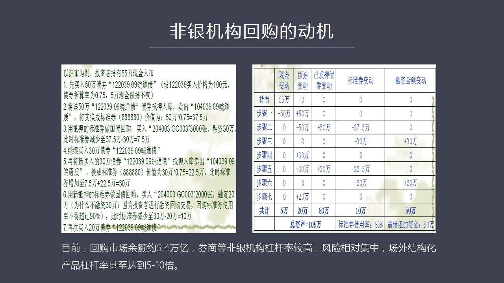

你從操作流程中仔細的看你會發現這中間很有意思你比如說如果說他們當年有55萬現金他們要進行投資這個流程展現的是你可以用中間的50萬去買入在市場中買入比如說買入50萬的某種公司的債券然後你緊接著可以再把你...

<strong>All subtitles</strong>

> 你從操作流程中仔細的看你會發現這中間很有意思你比如說如果說他們當年有55萬現金他們要進行投資這個流程展現的是你可以用中間的50萬去買入在市場
> 中買入比如說買入50萬的某種公司的債券然後你緊接著可以再把你買來的債券作為制壓在回購市場中再進行融資比如說你把它在轉化成標準券然後再抵押融資
> 之後你可以融到多少呢這50萬可以再借到30萬現金然後你再用這30萬再去買一個公司债買一個企業债然後買回來之後然後你再把它進行標準化處理變成標
> 準的券之後然後比如說還剩20萬你可以用這20萬再去買債券好經過這一輪一輪的抵押之後你會發現你手上當年最初時刻你用55萬現金但是在最後你總的資
> 產負責表上卻擁有105萬的總資產就是你通過循環抵押不斷去抵押最後你會發現你用55萬的現金控制105萬的資產其中就有這個100萬的債券它有一個
> 什麼好處呢它最大好處是你放到了你的資金利用你實際上把你自己整個的資金擴大了一倍你控制的資產比你當初入市了這個錢高得多這樣的話你手上的比如說1
> 00萬債券100萬債券就會給你帶來100萬債券相應的利息收入這比你當初使用50萬去持有債券的利息收入要多了那麼你的成本是什麼你的成本是在制壓
> 過程之中你要向別人借錢所以你要向他支付一個回購利率因為你向別人借錢對吧但是只要這個你買了債券的收益帶來的現金流多於你向回購製壓過程中向別人支
> 付的這個回購利率的這個現金流也就是兩者之間只要存在著利息的差距那麼你就可以進轉一筆錢而且你的資產規模越大這個槓槓放大了放大了倍數越高你獲取的
> 總的收入也就越高那麼你如果你用你的收入再去跟你以前當初的這個50萬這樣一個投資鏡投資額來比的話那麼你就比當初完全靜態的持有債券所獲得的這個收
> 益要高很多也正是由於這樣所以各大鑽商還有各種非銀行類的金融機構由於這種充動賺錢的充動它如果能用比較少的資金擴大好幾倍的這種資產規模那當然對它
> 來說是非常有利的所以這就使得大家由於這種普遍的充動去以小貨大去加大槓槓如果我們再去一個跟此這個與此類似的跟這個很像的一個例子可能更便於大家吃
> 官理解那就是買房的例子假如你手上有1000萬現金你首先在北京買一套房買一套房之後然後再用這個房本到銀行做支揚比如說你可以拿出700萬然後再用
> 這700萬再買一套房然後這個買第二套房之後我們再把房本壓給銀行可以再帶出一筆錢來然後再去買房然後拿到房產本之後再去支揚這樣一個反覆不斷的融回
> 你會發現最後你手上1000萬的現金最後變成了比如說價值3000萬的房產好幾動這個時候對於你來說你是有成本的因為你向銀行支揚來帶款你要向銀行付
> 出利息但是假如你的房子租出去了你獲得了租金超過你這個利息那你不就賺了嗎這是一方面還有如果整個北京房地產的價格在上漲你所擁有的好幾套房子同時在
> 價值上漲這就是資產價格同時還在網上漲的情況之下那你就賺雙份的錢既有這個現金流入就是利息收入租金的收入超過利息的中間的差個部分你資產量越大這個
> 數額越大同時還有整個房價上漲並帶來的總的價值的提高那當然你會願意去這麼去做這也是現在我們過去很多年看到的這種北京上海廣州深圳有無數人都在做這
> 樣的一個巡荒岡的作用它最大的問題是什麼最大的問題是你擁有資產量在上升同時你的負債也會上升你的負債比如說你以前一開始是一千萬進現金你不欠任何人
> 的錢現在擁有了三千萬的房產結果一看你欠了兩千萬的債欠了銀行兩千萬這個時候假如由於房地產條空或者由於任何的一個原因導致市場不好房價開始下跌這個
> 時候對於你來說心理壓力就很大主要原因是這個價格要跌到一定程度也就是你加了槓槓之後有可能這個損失的程度就會使你原來的本金一千萬被幹掉它就會產成
> 這樣一個負面的殺傷作用還有另外還有一個問題就是當你抵押給銀行的資產這個房子由於房價下跌跌到一定程度之後銀行不幹了比如說它以前給你打個七折或打
> 個八折但是現在房價價格已經下跌超過了這個數它就覺得你抵押品價值不夠所以它就會打電話通知你說你抵押品現在不值錢了你必須要給我補更多的現金否則我
> 就不帶還給你你立刻得給我還錢這個就叫追加抵押品追加現金這個保護抵押品的價值但是由於你用的是高倍更高這個這種策略你賬上其實已經沒有任何現金了那
> 你會做什麼選擇呢你就趕緊想辦法賣掉一套房拿到現金之後再還銀行的錢但是這個時候你會發現由於宏觀環境的變化是普遍存在的所以當你賣房的時候其他人也
> 在賣房這就會導致是整個房價由於大家都在賣所以他會下跌得更猛下跌得更猛之後就會導致銀行更平三斤打電話隨著更積這個時候整個市場就被洞接著誰也賣不到誰也賣不掉

---

### Slide 7

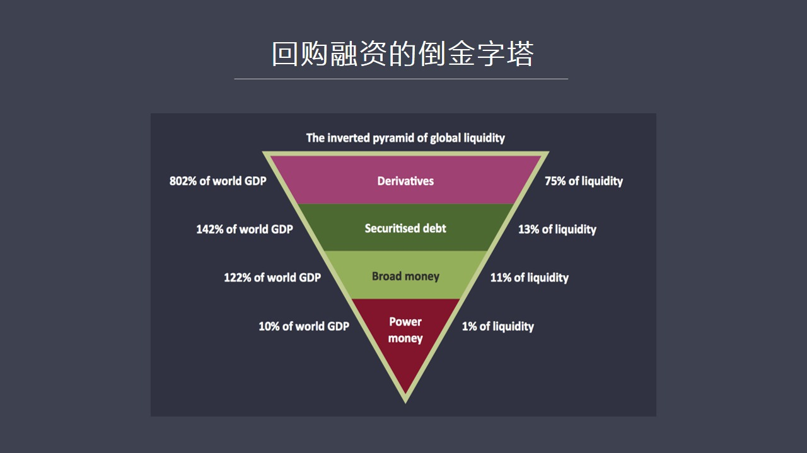

大家都搶不到現金這就叫流動訊估計在這個市場中沒有流動性了房地產不好賣了而你又急需現金這個現象就給我們看到12月中旬出現這個現象是完全一致了它的本質就是我們第七業第七業PVT第七業所展現的回購融資跟房地...

<strong>All subtitles</strong>

> 大家都搶不到現金這就叫流動訊估計在這個市場中沒有流動性了房地產不好賣了而你又急需現金這個現象就給我們看到12月中旬出現這個現象是完全一致了它
> 的本質就是我們第七業第七業PVT第七業所展現的回購融資跟房地產循環貸款到底是一樣的都是一個到今子擦心也就是你用進達底部的一千萬現金去貸款做制
> 壓循環之後你雖然擁有多處房產但是你的負債達到了你自有資金的兩倍比如說你用一千萬去接了兩千萬買了三千萬的房好在這種過程之中這就是一個到今子擦心
> 這個時候你是隨時要面對現金的壓力如果當價格就在資產價格下跌銀行找你吹錢你沒有辦法這下就必須要變賣資產去貨的現金如果大家同時出現這個情況就會出
> 現現金荒這就是前荒的本質原因其實跟我當初第一講講這個美元為什麼會走牆原來是一模一樣當我們家美元皇流說是新加坡家借了大量的美元債務而美元現金是
> 有限的所以當大家還沒上這個債務資產價格開始下跌還沒上美元債務的時候就會引發拋售資產拋售本幣資產去搶美元結果這麼一搶美元就會變得越來越強化它的
> 價值就會越來越這個美元指數就會越來越高這就是對美元的這個要比如說我們可以稱之為美元荒謬這種情況對於我們回購市場也一樣當債券的價值價格開始下跌
> 的時候那麼大家將背貨去拋售債券去獲取現金如果大家都在這個過程中同時發生的話現金就會發生短缺這就是錢荒那麼在我們的金融市場中回購市場中現在回購
> 市場的餘額大概是五點四萬億左右那麼很多這種非銀行類金融機構的旁邊做的還是比較高雖然整體來看如果從全國銀行金融市場的整體旁邊例來說並不高因為擁
> 有資金量最大的銀行他們並沒有這麼去操作並沒有加很多的槓桿主要原因是他們是盤子太大如果加太大槓桿敬貨出貨都非常的緩慢很不方便它是交易對手比他弱
> 很多所以他不能採取這個策略由於這個銀行相對來說他們是資金的初戒方而並不大規模參與高槓桿所以說從整體的銀行金這個市場來看的話槓桿比率並不高大概
> 在111到122之間但是在交易所上交所、升交所它的槓桿要明顯高於銀行金市場我們現在是有三個市場當然除了這個之外它主要的問題存在於一些比較缺錢
> 的又想把收益率做得特別高這些非銀行類金融機構特別是建商劍商你會發現它的槓桿率是偏高的很多劍商的槓桿率能夠高到5倍5倍左右除了這些之外還有場外
> 配資來進行回購業務操作的這個叫場外傑歐化的產品比如說它可以做到1比9這樣的槓桿比率就是優先列後這個資金可以做到一個非常大的槓桿然後它用市場中
> 的其他人的錢進行配資之後進入這個回購市場來炒這個回購所以我們看到的雖然整體的槓桿率並不高但是在局部方面在某些領域中間有些人的槓桿是非常高的當
> 然我們的政策和各種條例對直接的槓桿倍率是有限制的不能太高也正是由於這種限制導致的券商它跟一些銀行或者其他金融機構進行合作實際上是把自己所持有
> 的這種非常大的債券的部分轉移給了別人這就是我們所受的代持如果大家看最近新聞你會發現某些銀行手上代持了100億結果一家券商說我不要了然後中間就
> 鬧出了很多亂子這個現象說明了券商跟銀行之間是存在著這樣的一個轉移的關係就是我在我的資產負債表上由於受到了政府條例的管制我不能做這麼大的槓桿但
> 是我可以一種代持的方式轉移給別人的資產負債表上我這個資產負債表沒有問題了這個就是為什麼我們看到的當一家券商出問題的時候會牽著說好幾家其他的與
> 之相關的這種金融機構原因就在於代持所以我們明白這個道理之後你會發現這個市場中就像當年美國四代危機並不是所有人都違約但是只要市場中的一部分人比
> 如說那些刺激代款人信用比較差的槓桿對率比較高都沒有現金流的人一旦出問題同樣會脫誇整個市場所以這就是我們所說在局部市場中的高位槓桿類的使用一旦
> 他們出問題其實有可能也同樣會產生一個系統性的風險關於這個問題我其實在這個會比較能5中間對前華論體做過一些深入的分析這是如果我們看第八頁PPT

---

### Slide 8

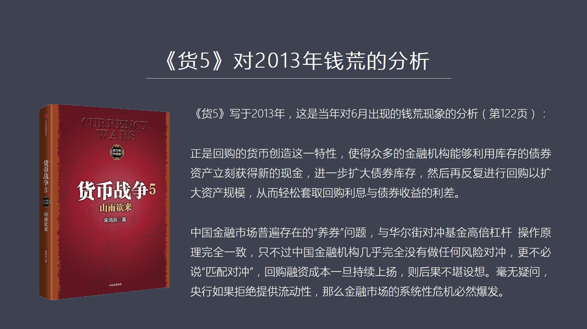

因為會比較能5寫於2013年出版是在2014年初當時在寫會比較能的時候寫貨物的時候其實2013年的6月就已經發生了一次非常嚴重的前華現象當時爆發前華的原理跟這次出現三殺這個現象從本來說是完全一致的我當...

<strong>All subtitles</strong>

> 因為會比較能5寫於2013年出版是在2014年初當時在寫會比較能的時候寫貨物的時候其實2013年的6月就已經發生了一次非常嚴重的前華現象當時
> 爆發前華的原理跟這次出現三殺這個現象從本來說是完全一致的我當時在第122頁曾經這樣來描述這樣一個現象就是正式回購的貨幣創造這一特性一個眾多的
> 金融機構能夠通過庫存的債券資產立刻獲得新的現金然後進一步擴大債券的庫存然後反覆進行回購擴大資產規模從而輕鬆的套取回購利息和債券收益之間的差異
> 這個立差中國金融市場上普遍存在了養券的問題與華爾街對中基金高貝尷尬操作的原理完全一致只不過中國金融機構幾乎完全沒有做任何風險對衝更不必說匹配
> 對衝回購融資成本一代上陽持續上陽則後果不堪設想毫無疑問央行如果拒絕提供流動性那麼金融市場的系統行為機必然爆發如果我們從這段話了描述這雖然是三
> 年前寫的來看這次出現的前荒我覺得基本是完全一樣跟上次就是央行必須要救助否則的話貿四級家券商或者貿四級家高貝尷尬公司出現的問題就會迅速也變成一
> 個越來越大波琴廟越來越大的問題甚至把很多其他的資質比較好的尷尬裡面有這麼高的銀行和金融機構脫下水就會演化成真正的比較大的金融的風波如果我們看
> 第9頁現在中國的回購市場是什麼樣的情況呢?可以說回購市場越來越活躍

---

### Slide 9

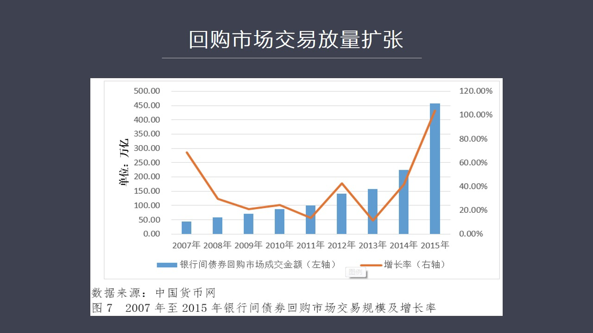

它的交易規模現在正在放量增長如果我們看現在中國發布的貨幣報告講著2015年的全年報告的話你會看到從13年開始回購市場的交易規模正在不斷的放量現在2015年已經達到了450萬億人民幣當然從今年前幾個月提...

<strong>All subtitles</strong>

> 它的交易規模現在正在放量增長如果我們看現在中國發布的貨幣報告講著2015年的全年報告的話你會看到從13年開始回購市場的交易規模正在不斷的放量
> 現在2015年已經達到了450萬億人民幣當然從今年前幾個月提供了看今天是鐵定突破500多萬億甚至能到600萬億也就是在我們這個市場中如果說整
> 個的債券的存量大概是58萬億左右如果你回購的交易量能夠達到它的10倍以上這說明這個市場的活躍度是空前的活躍因為它的交易量規模太大而且增長速度
> 太快想去年增長了幅度甚至達到100%這說明一個問題這個市場的高度活躍這代表著這個市場的重要性和它的流動性正在迅速的強化可以說現在回購市場已經
> 或者說正在迅速成為中國整個金融市場中流動性創造最有爆發力的這麼一個市場所以我們在研究整個金融市場的時候必須得敏銳觀察出哪個市場的流動性最強它
> 的活力最強而且不僅是活力強它還具有這個創造貨幣這樣的一種功能如果我們看第10頁來我們來回顧一下今年12月中出現這個問題的話我們會發現會率問題

---

### Slide 10

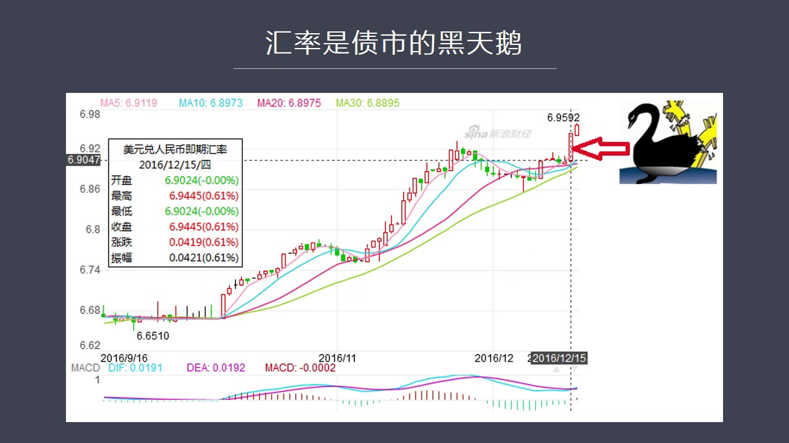

就是引爆債券市場回購市場出大問題的一個黑天熱我在這裡列出了比如說2016年12月15號我們聽到美聯儲加息之後美聯儲一加息這一天跟債券市場出現嚴重動盪這一天幾乎是重合當然在此之前的一兩天債券市場已經越來...

<strong>All subtitles</strong>

> 就是引爆債券市場回購市場出大問題的一個黑天熱我在這裡列出了比如說2016年12月15號我們聽到美聯儲加息之後美聯儲一加息這一天跟債券市場出現
> 嚴重動盪這一天幾乎是重合當然在此之前的一兩天債券市場已經越來越不穩定甚至我們可以說從2015年以來債券市場的動盪越來越大它的根源還是2014
> 年7月以後美元還流所導致的全世界貨幣體系的一種反向運轉或者叫一種寒流清晰所以它會對所有國家的金融商都會造成影響對中國金融市場所造成影響對中國
> 債券市場所造成的最大影響就是大家對於會率這個問題會產生越來越大的越來越深的這種擔憂因為人民幣對美元的比例在不斷的下跌今年以來去年以來從811
> 一直到今年年出的壟斷機制一直到現在人民幣對美元以下跌到6.9幾所以它的這種心理上衝擊力量實際上是越來越大特別是美聯儲一家稀我們看到現在人民幣
> 對美元已經跌到了6.95可以說跌破7已經是一個職日可戴的問題了同時外務所為了下降的速度已經跌到了3萬億的附近當然跌破3萬億也是一個職日可戴的
> 問題所以這就強化了市場的一種不安定的一種心理我記得我在今年年初的時候在做粉絲活動性在活動的時候我曾經說過要觀察現在的經濟外看油價內看會率其實
> 是決定一切的決定現在進入市場一切方向的一個根本性的指標當我們看到這個指標越來越不穩定的時候就意味著其他市場也會出現重大的動大不管也是股市還是
> 什麼其他的市場都會受到會率市場的直接影響那麼在這裡我們看到12月中出現了正式這種情況人民幣對美元的在這一天的大幅下錯以下跌到了6.95可以說
> 正經了市場中的所有人這個時候這種這種震撼也會引發債券市場中出現巨大的問題因為你想想看如果人民幣對美元進一步貶值的話那麼對很多投資人來說他投人
> 民幣資產他就很可能會不合算或者虧損比如說他如果在債券市場中玩你有一個回報率但這個回報率越來越多的被美元升值所殘使他這麼想我為什麼還玩這個呢我
> 為什麼不到國外去比如說換成美元或者換成港幣或者換成其他的貨幣內受我我還更穩妥一些因為從大事來看美元會升值所以這些人就會從市場中把資金逐漸地抽
> 走這也是我們最近看到的資金外流量特別是10月份達到一個天亮這種資金的倒抽或者這種資金的轉移被像美聯儲加息這樣消息一次計就會引發市場中連鎖反應
> 在一個高貴槓槓一個回購一個局部市場中間你如果出現了一個這麼大的一個不利利因素的刺激就會使得這種很多投資人要求輸回引發這些回購所抵押的資產特別
> 是債券資產的價格下跌大家就拋售債券不要了在這種情況之下這就跟我說的美元還流出現那個情況是一個道理就會變賣本幣資產然後去對換外出儲備然後會變成
> 外地然後會流出中國大陸好這個過程由於美聯儲加息突然在壹上那種被激活和強化那麼我們看到的情況就是債券的價格開始大幅下跌我們看到當天十年期國債期
> 貨五年期國債期貨全部跌停板這說明一個什麼問題說明大家產生了極度恐慌了心理由於他們倆跌停板這就導致了大量做回購抵押那些制壓品的價值當然會跟隨著
> 十年國債五年國債的價格大幅下跌這就必然會引發銀行隨債就說你現在的抵押品不夠了必須立刻給我補足現金否則的話你這個抵押品我要自行處置所以這些回購
> 的槓尾數比較高的這些非銀行類的金融機構收到了這樣的威脅之後恐慌怎麼辦他們手上沒有現金因為他們手上現金已經經過資產配置之後變成高度的負債缺現金
> 所以他們這個時候只能去賣資產賣他這些債券他的一賣市場會跌得更兇而且大家是集體行動這樣的話就會導致錢荒這個市場從找不到錢了這就我們看到十四號晚
> 上十五號晚上整個人民銀行這個交易系統已經關閉了市場已經關閉了但是還有很多人出現了技術性的違約關閉之後他還是找不到錢找不到錢的話他就沒有辦法在
> 第二天熟悔就把他的這個抵押品給熟悔了這樣就會導致技術性的違約這個現象在十四號十五號發生了好幾起就是找不到錢找不到錢你會看到中間很多報導談到很
> 多交易員的這種交易說找不到錢怎麼辦因為資金成本太高了一下長的百分之八這樣做我們會虧的老闆說不管虧不虧你們首先先把這個信用國保住我們即便這單做
> 虧了但是我們絕不能違約好這就導致大戰一起搶搶現金結果就會導致利率開始大幅跳升就是回購利率大幅跳升因為市場中極度缺錢當然在金融市場中在銀行間市
> 場中這種資金的短缺必然又會引發股票市場和其他市場的相關反應大戰一聽那邊這麼缺錢哇賽你想想另外一個市場他的資金從哪來也要從金融市場中來那麼如果
> 說當銀行間市場中當整個中國銀行系統普遍存在著貨幣場中普遍存在著這個錢荒那麼多的時候股票上能不受影響嗎當然必然會受到嚴重的衝擊一些大厚一些機構
> 一些這個需要這個融資去進行股票交易的所有的人都會同時感受到現金短缺所帶來的巨大壓力這個時候股票的下跌是必然的而他的原因不在股市場而在中國金融
> 體系中錢荒問題的出現如果這個市場中出現了錢荒不加以管理的話那麼這個現象會迅速地惡化會導致金融體系出現這個結構性的問題也就是銀行拒絕像這種非銀
> 行類的金融機構提供任何的資金這個現象已經存在和出現了所以央行必須要介入否則的話一個局部問題會迅速蔓延到整體一個看似是由於一些少數金融機構進行
> 高倍放大了這樣的一種操作會又花全局性的系統性的進入風險這個是我剛才在會戰爭舞中間所說的央行必然要介入如果它不介入風險將會變化成也變成這個巨大的進行風暴所以我們看到在十六號央行果斷出手了

---

### Slide 11

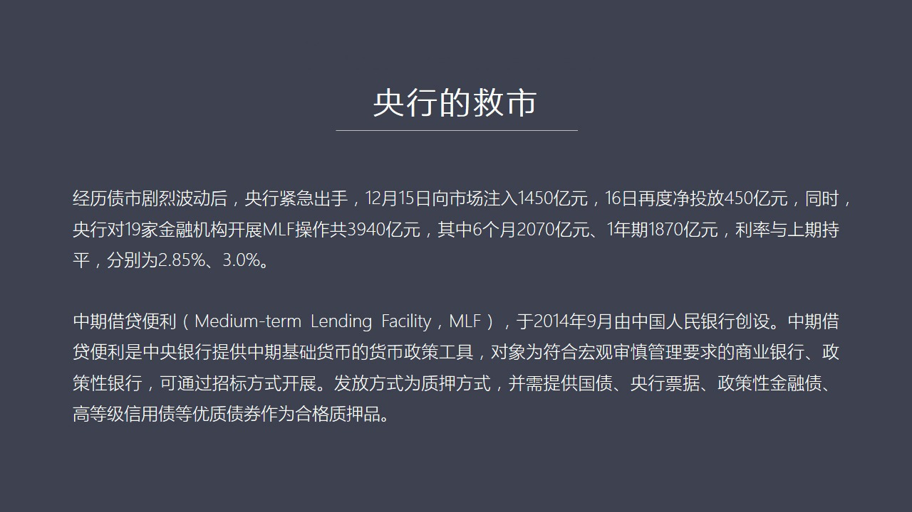

當天十五號向市場通過你回購注入了一千四百五十億的流動性第二天再次投放了四百五十億那麼整個星期一共大概進投放了兩千五百億同時呢央行還通過很多渠道向銀行打招呼讓他們必須向這種非銀行類金融機構進行拆解向銀行...

<strong>All subtitles</strong>

> 當天十五號向市場通過你回購注入了一千四百五十億的流動性第二天再次投放了四百五十億那麼整個星期一共大概進投放了兩千五百億同時呢央行還通過很多渠
> 道向銀行打招呼讓他們必須向這種非銀行類金融機構進行拆解向銀行直接打招呼從此之外銀行還對十九家金融機構展開了中期這個接待便利這樣的一種操作操作
> 規模一共達到了三千九百四十億其中我們來看它這個期限有半年的有一年的然後利息跟以前一樣不涨什麼叫中期一操作便利呢就是什麼叫中期這個接待便利呢這
> 個我們可以理解成是一個長效的回購協議因為回購一般期限比較短以一天兩天三天七天以內居多雖然它長得也有一百多天但是實際上最主要的是集中在超短期尤
> 其是這些勸商所進行高倍槓稿的這種操作大概都是主要是一天七的回購作為最核心的這種產品的樣子這就導致了這些非銀行的一金融機構面臨一個資金短缺的問
> 題他們缺錢特別是期限比較長的錢很短缺中期接待便利它最大的一個機制呢就是它能夠通過釋放長期的資金來緩解整個集中機構對錢的這種渴望所以它是長短都
> 在進行短期立刻的我可以給你通過一回購馬上向市長出入一天的兩天的三天的這種資金而對於中長期資金短缺的問題它是通過中期便利來解決作為中期便利呢它
> 是2014年由人民行所創設它的抵押品它也是需要這個制押融資的它的抵押品主要是國債央行票據還有各種金融債高等級信用的這種優質債券這些是作為合格
> 抵押品來進行制押原理跟回購一樣只不過期限更長如果央行不採取這些就是措施將會出現什麼我們來看第12頁PPT在歷史上曾經出現過就是央行拯救不及時
> 或者沒有反應過來整個市場將會出現一個嚴重的貨幣市場凍結的這樣的一種狀況而且如果再不救那麼整個經濟將會全面崩盤比如說我在這裡舉了一個例子就是2
> 018年9月18號美國當時15號的時候雷曼兄弟公司宣佈破產然後引發了整個貨幣體系的重大的混亂雷曼兄弟公司破產它的根源或者直接到貨所也是由於在
> 回購市場上它融不到錢了雷曼兄弟公司在破產的時候它的漲上資產總資產規模高達上萬億美元這樣的一個龐然大物卻會在市場中由於回購借不到錢三天之內列領
> 寶幣 可見 高貝槓槓之下一旦貨幣市場一旦回購市場被凍結住沒人借錢給它極度缺乏現金的再大的公司它資產規模越大死得越快但是當時由於這個雷曼公司破
> 產之後導致了整個回購市場陷入了完全的凍結狀態沒有人願意借錢沒人敢借錢了連雷曼都倒誰還敢借錢這個時候貨幣市場出現了凍結一旦凍結沒有流動性了就會
> 導致極度恐慌的發生很多人就從貨幣養成把資金抽取出來那麼在9月18號上午11點的時候美國金融體系就爆發了這個問題

---

### Slide 12

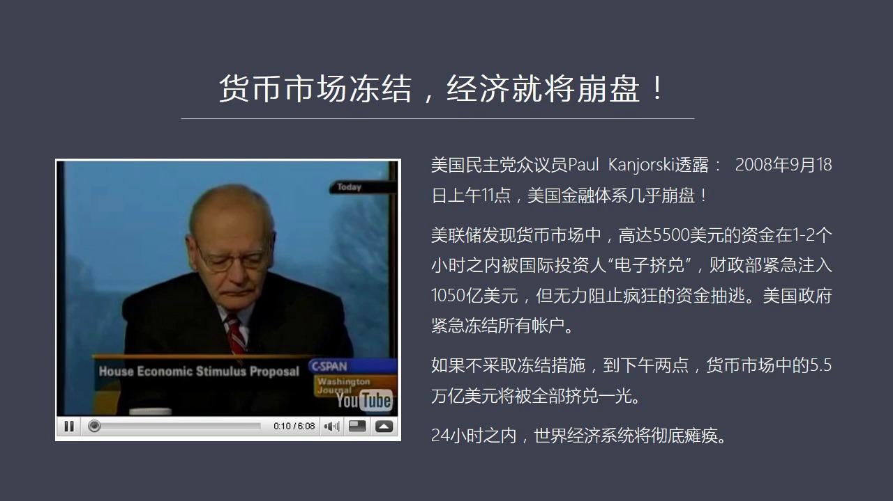

當時的貨幣基金跌破了禁止跌破了億美元的禁止在美國大家是把貨幣基金當成銀行儲蓄同等安全來看待所以大家一看哇塞這個貨幣基金居然跌破了一億就說明我存錢存在我以為是儲蓄債務上的錢有可能會虧損這就會又發全國性的...

<strong>All subtitles</strong>

> 當時的貨幣基金跌破了禁止跌破了億美元的禁止在美國大家是把貨幣基金當成銀行儲蓄同等安全來看待所以大家一看哇塞這個貨幣基金居然跌破了一億就說明我
> 存錢存在我以為是儲蓄債務上的錢有可能會虧損這就會又發全國性的大幾對大家都要求把錢給撤出來從貨幣上抽出來所以在當天的11點之後美聯儲觀察貨幣市
> 場中發現了一個突出起來的現象就是高達五千五百億的資金一兩個小時內全部跑光全部要撤走這個就是當今世界發生的電子幾對世界大家不是排到銀行去取錢而
> 在貨幣市場中不斷的逃走資金怎麼辦當時的美國財政部馬上立刻動員起來緊急住了一千零五十億美元就相當於市場流動性但是仍然打不住這種狂風暴雨是這種極
> 對所以當時立刻美聯儲下決心動潔貨幣市場中所有帳戶誰也不能跑如果不採取動潔這個措施的話應該說當時我看美國Sysband電視台他主要是轉播美國議
> 會的很多議員的一些對政策問題的草都和看法有一個議員就說如果當時不採取這樣的措施到下午兩點貨幣市場中的全部的資金5.5萬億美元將會全部被取光他
> 說如果這個形象發生的話24個小時之內全業的經濟全美國的經濟將會徹底談判為什麼他會有這樣一種看法他這個看法在我看來一點都不是為人送聽因為美國絕
> 大多數公司包括聯邦政府和各州的政府都把錢錢到貨幣市場上進行拆借就是進行回購融資借給需要錢的這些機構包括美國了很多企業發行的商業票據市場就是他
> 們要融資也是到貨幣市場進行融資他們不像我們要向銀行去帶管要走一個審批流程很慢他們直接是在貨幣市場上發行給出商業票據比如說我現在某一家公司今天
> 是星期我星期三要花工資了但我賬上所有錢錢其實全部都投到市場中去了我手上並沒有這麼多錢錢所以我要花工資或者要採購原材料或者要支付電費支付各種各
> 樣的交易費用或者是購買費用怎麼辦我都是提前就是在這個時間到來之前比如星期三要支付對比前我星期打電話給我華爾街的這個代理商我說我現在需要發行一
> 批900萬的商業票據那邊立刻就可以給我進行操作如果是11點了這個我給他的通知他笑了兩點就把這批票據給發售出去了900萬現金在當天或者第二天就
> 能到達我們的賬場第三天我就可以進行支付所以美國的各個大公司企業中小企業也包括政府機構賬上都是沒有多餘的錢錢大家全部都是要依賴貨幣市場回購市場
> 來給他提供這種短期流動性假如這個市場從前全部取光了變得乾河了那就意味著到星期三那一天整個經濟的支付體系就全部崩潰了我要發動作發不出來了因為我
> 融不到資我要支付了國際貿易的支付款我也沒辦法付了因為我還是融不到資那麼這將會立刻引發支付體系的全面的談判和瓦解那到第三天第四天你看著嗎大家上
> 街一刷信卡信卡被拒買了了東西你要去這個加油站加油一刷卡一刷銀行卡一刷這個這個信卡刷不出來因為所有市場全部洞協助了這就會導致因為大家手上都沒有
> 太多的現金在美國一般家庭中有個1萬塊新現金放暖或者隨身淡個幾十美元就差不多了因為全部都要依賴電子支付系統如果這套系統一旦洞結的話就會導致全國
> 的所有的交易完全停擺那大街大家如果如果加油加不上如果買超市去買牛奶買雞蛋買不了這就立刻會引發整個社會的動盪所以24小時之後它認為美國將會進入
> 軍事管制全世界的這個交易體系貿易體系也會立刻的談判因為發往美國的貨和全世界用美元支付的所有的美元支付體系都會受到貨幣上洞結的嚴重衝擊這套體系
> 就就不再運轉了那麼全世界的貿易就會趕人止裝了集裝箱的船也運不了了進了這個港的貨也卸不下來了因為大家不知道你能不能付錢這樣的話全球經濟也將很快
> 的面臨談判這件事情其實可以告訴我們當今世界上這個貨幣市場它的流動性之前它的重要性它的關鍵重要性它重要到什麼程度它要遠遠比股票市場要比其他市場
> 要重要得多得多因為股票上大跌不會影響全球的支付不會影響全球的貿易不會影響每個人的生計不會影響立刻影響大家這個刷標卡但是貨幣市場會所以我們在認
> 識金融市場的時候一定要首先抓住問題的要害什麼是整個金融市場的中心和要害在當今全球市場中最具活躍性的最具流動性的最具貨幣創造性的市場就是在於回
> 購市場貨幣市場中的回購這個問題所以我稱之為它是當今世界貨幣創造的源權當然要收到貨幣創造我們還得從原來的貨幣創造開始給大家做一個簡單的介紹這就
> 是13頁我們看到的現在可以說是金融從此金融業或者從此任何的銀行業

---

### Slide 13

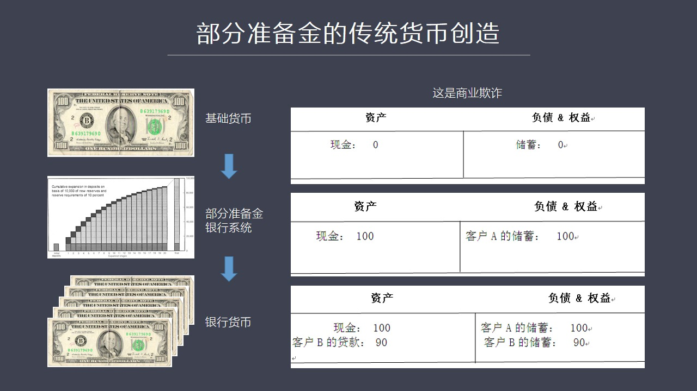

必須要具備的一個基本知識就是部分準備金它的傳統貨幣創造的原理如果你不了解這個原理基本上就沒有辦法去理解金融這件事所以我用一張PBT簡單的把這個原理介紹一下什麼是部分準備金創造貨幣的過程呢在我們一般老百...

<strong>All subtitles</strong>

> 必須要具備的一個基本知識就是部分準備金它的傳統貨幣創造的原理如果你不了解這個原理基本上就沒有辦法去理解金融這件事所以我用一張PBT簡單的把這
> 個原理介紹一下什麼是部分準備金創造貨幣的過程呢在我們一般老百姓的腦子裡這個貨幣就是有型的鈔票其實當然不是這個道理真正在貨幣供應中間真是鈔票站
> 的比重是非常低的絕大部分貨幣是銀行的貨幣是銀行創造出來的貨幣為了把這個問題說明白了我們用一張就是先看一個銀行資產貨幣表假設某某某開設了一家銀
> 行一開始我們在它出事開張了一天給它做一張快照拍著它的銀行資產貨幣表第一張標它當然有資產左邊是資產右邊是負債在資產下它的現金是零它沒有錢在負債
> 下負債也就是這個儲蓄部分也是零這是最原始的狀態它一比聲音還沒做了就是這個狀態第二個狀態就是當開張了過了一個小時來了第一比客戶客戶來存錢了客戶
> 存了一百元的超票現金那麼這個銀行是怎麼計章的呢它會在左邊現金內地條寫上一百元然後在負債下也就是在它儲蓄這個部分給客戶開了個儲蓄上戶對應了也是
> 一百元到目前為止一切看起來都很正常這樣就應該這麼做但是下一個過程可以說是從原到人的一個本質性的變化而在這一點上沒有我覺得沒有一本教科書把這個
> 問題直接說透了或者說沒有一個老師在上課說把這個問題產出產出清楚了在我們一般人眼裡來看比如說我們看第三張表第三張表就是客戶第二客戶來了客戶必我
> 現在要比如說我要貸款我要去買一個什麼東西我要去買其實買或者買一個電視或者買房子不管它買什麼它需要貸款那麼它需要貸多少呢比如說它需要貸90塊錢
> 在我們正常人的腦子裡面你如果是個快擊你會怎麼做仗呢你一定是把客戶A的存進了一百塊錢拿出90塊錢給客戶B那麼在自然負債表上客戶A的現金就只剩下
> 10塊錢了對吧但是你如果仔細看第三張自然負債表它不是這麼記得在第三張自然負債表中現金是沒有發生變化的自產現金還是一百客戶A的儲蓄賬戶也沒有動
> 還是一百它發生變動的是在自產向下的第二向就是它為客戶B創造了這個這個就是客戶B實際上是寫了一張借條寫了一張白條給銀行銀行把客戶B的白條放在它
> 的自產向下為什麼它是一種資產呢因為這個欠條借銀行錢叫完本復席特別要支付利息所以對銀行來說這個欠條是有現金收入的有現金收入的當然就是資產它就把
> 它放在自產向下與此同時在負債方給客戶B開了一個儲蓄的賬戶這個賬戶上寫了90塊錢你可以隨便用你可以取現金你也可以寫支票你也可以轉賬刷卡把它轉給
> 另外一家銀行都可以如果我們仔細來看來仔細做我們這件事你會發現這個寄掌方法很有問題它有問題的就是對於客戶A來說它如果去打開它的網站或打開它手機
> 查它的銀行賬戶它銀行賬戶上的100塊錢是沒有動的但是怎麼會客戶B平空又多了9090元的這個儲蓄賬戶呢如果我們把銀行資產理解成一種實實在的東西
> 比如說一個義工金的金條那麼你的負債銀行賬戶上這個負債向底下所生成的儲蓄賬戶就是它的收據也就是一個人客戶A把金條放到這然後義工金然後你給客戶A
> 開張義工金黃金的收據他拿到這個收據之後可以去做支付可以去做其他任何他想做的事那麼流通的是這個收據但是客戶B來了之後它給客戶B又創造了90塊錢
> 的收據比如說客戶B來他要求貸款0.90黃金對吧這個時候整個市場中流通的收據的總量就不再是義工金黃金了而變成1.90黃金了如果按照金錢的手算比
> 如說就流通了190元了但是他所對應的真是黃金並沒有增加還是義工金這意味著如果客戶A和客戶B一起來取黃金的話這個銀行立刻就會破產因為他根本就沒
> 有這麼多黃金在那兒其實按照一般的正常的商業機場原理來說你是不允許這麼機場的這麼機場等於是商業機場很多人可能就沒有看明白為什麼他這個機場原理會
> 這麼來做因為這麼做顯然是一種商業上的其他行為但是他卻是一種合法的行為只有銀行業是有這種特權的來這麼來機場其他任何行業這麼做一定會被送到法庭上
> 會被人告的你比如說假設一個房地產開發商他手上只剩下一套房子他能夠同時賣給10個客戶嗎當然不行哪怕他知道10個客戶中只有一個回來住他也絕對不能
> 這麼幹但是銀行做的就是房地產開發商只有一套房子但是把一套房子賣給了10個客戶收10個客戶的錢他做的就是這事所以如果我們不能理解這一點的話其實
> 就不能理解整個金融體系中最核心最本質的貨幣創造的根本原理那麼這種部分準備金制度就是當銀行在這個客戶幣存了錢之後給他生成了一個90塊錢的這個儲
> 蓄之後客戶幣不管他怎麼花最後這個錢會流到另外一家銀行他把90塊錢存進去之後另外一個銀行立刻要多了90塊錢資產然後又能創造其他的這種儲蓄就是客
> 戶C來了之後又會給客戶C帶來創造儲蓄了這樣一個賬戶客戶C又可以拿到剩下了比如說他想帶81塊錢他只能帶81塊錢根據部分準備金率的這種限制然後他
> 又可以去把錢存了第4家第5家銀行等等這個過程周轉下來之後整個銀行體系把1塊錢的基礎貨幣進行了10塊錢的放大如果我們把全國的銀行體系全部想成一
> 家銀行大家理解就簡單了就是一塊錢的基礎貨幣到了這家銀行手中可以變成10倍的銀行貨幣換句話說簡單的說就是一公斤黃金存到了銀行體系之後他可以開出
> 10公斤黃金所對應的收據當然這從理論上來說當然是必然是一行系統出在破產狀態之下毫無疑問只要大家去取這個黃金立刻大家會倒閉所以我們這是理解現在
> 金融業的最最核心的一個概念就是這張圖這張PBT如果你對這張PBT有任何的疑問或沒有徹底理解這就理解了解金融的本質還有一個很大的差距一定要花時
> 間花經歷把這種體想明白 吃透當然今天我們講的並不是這張圖因為這是應該是我們一個基礎今天我們講的是第14頁這個PBT也就是回購市場為什麼會這麼有活力為什麼流動性會這麼強

---

### Slide 14

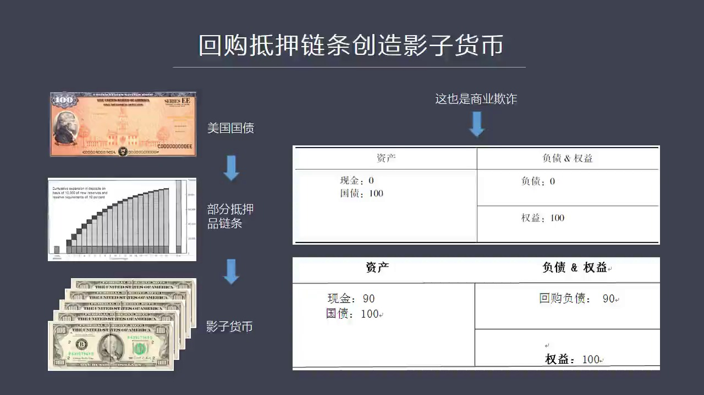

為什麼成了現代貨幣創造了一個中心就是因為回購底實際上創造了一個新的貨幣這叫影子貨幣影子貨幣的原理其實跟我們剛所說的部分準備金的原理幾乎是一樣的只不過它的底壓品不再是我們所說的準備金就是法定貨幣而變成了...

<strong>All subtitles</strong>

> 為什麼成了現代貨幣創造了一個中心就是因為回購底實際上創造了一個新的貨幣這叫影子貨幣影子貨幣的原理其實跟我們剛所說的部分準備金的原理幾乎是一樣
> 的只不過它的底壓品不再是我們所說的準備金就是法定貨幣而變成了債券不管是國債不管是美國國債還是中國國債還是拿公司企業債都可以作為底壓創造影子貨
> 幣的底壓品如果我們把貨幣理解成是底壓品的收據的話那麼在基本上底壓品是黃金在現代貨幣之下底壓品是債券在回購影子體系之下我們來看一下它這個貨幣到
> 底影子貨幣到底是怎麼創造出來的還看第一張資產貨幣表假如我們看這是一個貨幣基金它的資產貨幣表你會看到在它一開始它木屆的一百元人民幣然後敲出它五
> 開張它在初始時刻木屆資金完成之後還沒有開始做業務的時候它資產貨幣表是比如說資產向向現金它把一百塊現金先買了一百塊錢國債之後我們拍上快照你會看
> 到它資產貨幣表現金是零國債是一百因為它已經把錢去買了國債為什麼這麼著呢因為它做生意嗎做生意的話國債是有利息收入的所以對它來說至少是有一定回報
> 率的在它負債向下負債是零全億是一百這個資產貨幣表是沒有問題的平衡的關鍵問題還是出在第二章第二章貨幣表當它開始做融資回購底壓的時候你會看到這個
> 資產貨幣表發生了跟剛才部分準備金的資產貨幣表類似的現象也就是它把一百塊錢的國債拿到金融市場上去做製壓然後拿回了90塊錢現金你看它這個仗是怎麼
> 做的現金現在變成90而被底壓出去的國債還在那裡放著沒有動這個時候它產成了一個回購負債90跟它借來的現金相對應問題出在它這個國債怎麼會還在那呢
> 它不是拿出去底壓的嗎這仍然是我們所說的商業起漲就是如果你拿去做底壓這個東西已經放到別人那兒了那在你的資產貨幣表中就應該消失掉但是沒有因為快寄
> 座上的這個準則允許它這麼急漲這跟部分準備金這個原理是一樣的就是現在快寄準則允許它把製壓比如說一天之後你要把它回購過來所以你這個資產貨幣表中這
> 個東西就不用拿走了還放到這兒這個問題同樣是我認為它導致了跟部分準備金那個寄帳方法一模一樣的問題就是資產貨幣表突然變大了毫無理由的變大了現在你
> 看它的總的資產變成199而它出職上它只有199這90塊錢是從哪來的貼上掉下來的凡事允許這樣寄帳方式的公司都必然會在所有商業經營的部門中間獲得
> 一種特別的優勢因為其他行業是不允許這麼幹的你要這麼幹這叫商業寄帳但是它可以所以我們來看到在這樣的一個寄帳方法之下在回購融資情況之下這個回購負
> 債跟我剛才所說的銀行出去本上是一模一樣的東西就是它相當於回購的某種收據這種收據本身是具有流通性的就跟我剛才所說黃金收據一樣黃金收據你可以到大
> 姐小上去買你任何想買的東西大家都會接受因為大家認為這就是錢回購負債所產生的這一項其實也相當於一種收據這個叫影子貨幣的這種收據這種東西能不能流通能不能買東西是可以的

---

### Slide 15

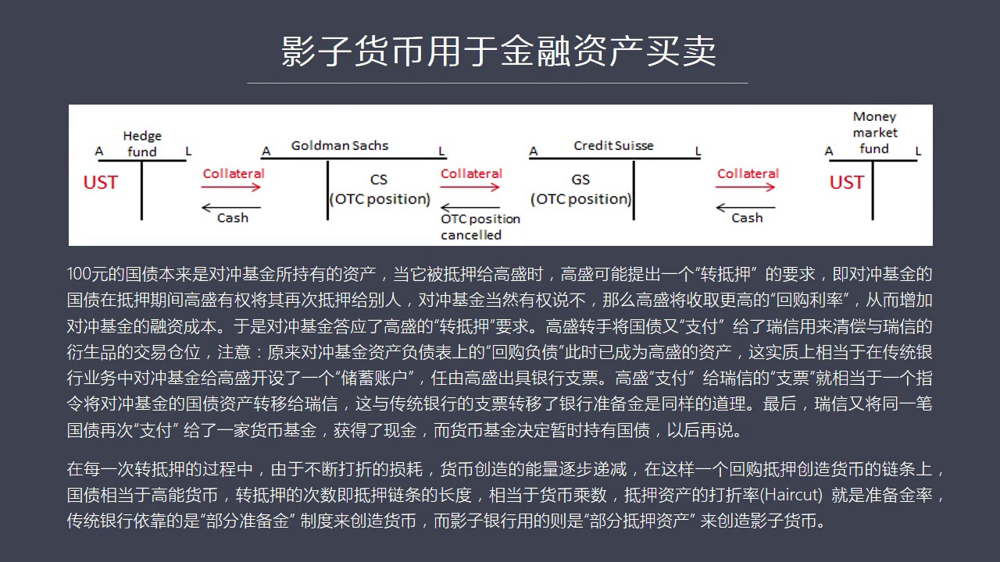

凡是具有這種特性的東西都可以稱之為是一種貨幣它可以用於支付當然了影子貨幣怎麼買東西肯定不能到大街上像大爺的媽一樣去買肉蛋奶買這個蔬菜這是不行的但是它可以用於去購買金融資產這就看第15頁這種金融資產的購...

<strong>All subtitles</strong>

> 凡是具有這種特性的東西都可以稱之為是一種貨幣它可以用於支付當然了影子貨幣怎麼買東西肯定不能到大街上像大爺的媽一樣去買肉蛋奶買這個蔬菜這是不行
> 的但是它可以用於去購買金融資產這就看第15頁這種金融資產的購買這個概念叫轉底壓說到轉底壓的話我們需要去理解一下我們談到普通銀行的時候它生成了
> 個儲蓄帳戶這個儲蓄帳戶其實就是黃金的收據當這個收據從他手上他去購買東西轉到另外一個手上的時候這就意味著銀行金教裡面那個利工金黃金的所有權從A
> 轉到B或者從客戶從一個客戶轉到另外一個客戶誰拿這個收據誰就擁有著金教裡面的黃金簡單地說所以用這樣的一個比喻來看我們影子貨幣機場方式其實也一樣
> 如果我們用國債作為制壓去融資的話你這個制壓的國債是放在比如說某一個你是抵押給某一家銀行好當你的這個回購負債進行流通的時候比如說你轉交給另外一
> 個人的時候那麼實際上另外一個人就擁有著你這個抵押品這個國債其實到底是一樣的這個東西能不能流通的轉底壓能不能存在呢在美國叫轉底壓我們來看一下它
> 是怎麼來流通的比如說一百美元的國債本來是作為對中基金所持有的資產但是當它被抵押給高盛的時候它是上高盛融資高盛提出一個轉底壓的要求就是你把這個
> 債券壓到我這兒我可以給你錢但是你抵押給我這個債券你要允許我再抵押給別人就是在抵押期間哪怕只有24個小時我也有全體抵押給別人但是對中基金的經理
> 可以說不我可以選擇不讓你進行轉底壓如果你不的話那麼高盛交會是收取高一些的回購力率就是你的對中基金的經理的融資成本會上升一點點但對它來說這個融
> 資成本上升就意味著它投資的回報會下降所以它轉印一下這個高盛應該是個很靠譜的人它雖然要轉底壓我的底壓品但是不至於會出大問題所以它就同意了高盛的
> 要求這個時候高盛就可以動用這個國債就是你抵押到我這兒了之後我又可以用它去做另外底壓比如說我可以把它支付給銳性來跟銳性之間清藏一個眼神產品的一
> 個交易倉位這個時候這種對中基金的這個國債資產實際上就已經轉移到了對中基金的手上就已經轉移到銳性的手上而銳性這個時候又可以把它作為另外一個支付
> 的手段支付給一家貨幣基金最後這家貨幣基金在一個很短時間裡面其實真正擁有了這個國債就是在底壓這個狀態之下擁有這個國債的所有權所以我們可以看到這
> 個國債從一開始在對中基金的賬上然後轉移到高盛的賬上然後就從高盛轉移到銳性就從銳性轉移到後面基金這一塊錢的債券被當成錢用了好幾次用了三次這代表
> 著它已經構成了金融中間最核心的一個支付手段這就叫影子貨幣所以我們來看它這個轉移這個過程你會發現這其實跟貨幣創造的原理一樣貨幣創造的原理是在這
> 個最主的金塊作為一種資產在換手過程之中不斷地從一家公司轉移到另外一家公司再轉移到下一家公司它的所有權再發生變化那麼如果我們來看好影子貨幣這個
> 過程一樣對重基金的美國國債實際上在整個鏈條中間不停地屬於不同的人所以這一套邏輯體系跟剛才我們所說不分人民金這個體系是一模一樣的當然由於轉移啊
> 它會發生這個不停地發生折扣比如說100塊錢的票面價值我只當98塊錢用到下一個當96再下一個比如說當成多少多少這種折損率就是我們所說的這個法定
> 準備金率就是相當於傳統貨幣創造的法定準備金率那麼除此之外呢它這個我們看到的部分底壓這個鏈條它底壓多少次比如說在這個我剛剛這張頭上它底壓了三次
> 所以這個底壓的次數轉底壓的次數就相當於貨幣成數相當於以前傳統這個貨幣創造中間的貨幣成數這樣的一個概念所以我們有了折損率折損率就是部分準備金率
> 法定準備金率我們看到的這個轉底壓的次數相當於貨幣成數那麼整個這套體系就是一個貨幣創造的體系當然我非常清楚的這個知道我剛剛所講的部分的沒金率和
> 影子貨幣的創造原理對於很多沒有接觸到這個領域的同學來說是一個極大的勁力的挑戰其實不誇張的說我本人把這個東西想清楚也用了很多年的時間甚至到現在
> 燒不留神腦子也會亂因為這個概念在我看來是所有概念中間最深刻也是最難以理解而且又是必須要理解的最根本的東西如果理解不了這兩個PPT那你理現在金
> 融就會就是抓不到問題的本質就會理這個市場的核心差距很遠所以無論如何希望大家花時間花精力去深刻理解這兩張圖它最本質的含義當然了這個不是一天也不
> 是兩天也不是幾天就能夠完成的一個工作其實今天我們所講的這一課是所有課程中最烤最烤腦子如果大家有什麼問題我們可以專門去找時間比如說我們在美洲的
> 論壇中專門去找時間反過來探討這個問題大家可以不斷地提問也可以在同學的大家的群理上也可以不斷地相互商量相互探討因為商量和探討是非常重要的對於理
> 解這個概念而言是必不可少的所以當我們理解了影子貨幣創造的原理之後你就會真正理解為什麼現在世界各個國家創造了這麼多貨幣比如說美國比如說中國都創
> 造了這麼多貨幣為什麼通過盆段起不來你要明白了這個原理之後影子貨幣創造原理之後你就會知道創造出來這些貨幣並沒有流入世界經濟而全部在影子印象體系
> 之內打賺就是在貨幣上為核心的這是金融市場中間打賺沒有流出金融體系但是它又實實在在創造出了貨幣怎麼來理解這件事就是以回購為代表的這樣的一種新的
> 貨幣創造機制我們看到剛才那個資產貨幣表對中基金資產貨幣表它在資產貨幣表中能夠擴大比如說從一百塊錢擴大到一百九十塊錢的資產同時它在被轉抵啊三次
> 那麼這就意味著整個貨幣的影子貨幣的支付能力是被擴大了很多而且這些影子貨幣能夠在金融市場中在不同的金融公司裡面進行支付跟現金一樣好事只不過它不
> 能在實際的商場中去買東西而已但是它可以買金融資產這就是影子貨幣最本質的作用它不是一般的流通於市場中的貨幣它是一種專門用於金融市場讓購買金融資
> 產的貨幣所以當這種貨幣的創造規模越來越大的時候整個金融市場的價格就會被炒高而實力經濟中它真實現金的數量並沒有發生變化這就是我們看到的量寬鬆以
> 來所有國家的貨幣都在膨脹但體現在物價上卻沒有明確的很鮮明、很明顯的通貨膨脹原因就在於主要創造是源於影子系統影子系統這個聽起來好像對老百姓或者
> 對大家沒有什麼傷害其實不然因為全世界的資產我們可以整體理解成社會資產是拖管的銀行銀行給我們的是這種資產的收據所以每個人它手上持有了貨幣它手上
> 持有了這種收據都對應著銀行所拖管的資產中的某一部分但是現在由於影子貨幣的大量販賣價格不斷的這些資產價格不斷的被炒高所以你會發現資產的金融資產
> 的所有權每時每刻都在發生變化而你最終站在這個體制外的人其實你的資產已經換手了你還不知道這其實在我看來就叫一種財富的偷竊因為金融資產不管是股權
> 還是債權還是任何東西它所對應的這些東西都是屬於全民的但是由於影子貨幣的創造確實擁有創造貨幣能力的人搶先或者站去了更大的優勢去獲得這些資產而剝
> 奪了你的資產所有權這些的發生是如此的隱密如此的不被人理解所以導致社會憑住通話之後人們還不理解這個現象是怎麼發生的這一切都要求我們徹底理解和消
> 化影子貨幣包括它在創造原理應該說我們現在學貨幣金融學的這些大學的教材不光是中國的也包括美國的在當今的回購創造貨幣這種體制下已經完全過世了可以
> 直接扔進大基督因為他們不能夠說明和代表當今世界的貨幣創造的基本原理我在這裡其實在寫貨幣戰爭舞的時候我基本上把市場中或者在整個能夠接觸到的所有
> 的論述影子貨幣的這些資料學者的觀點包括其中市場參與人的所有在論述影子貨幣的東西基本上全部仔細研究了一遍最大的生活最大的感覺是現在在教科書這個
> 領域或者在專注這個領域沒有一本書是在系統探討這個問題的所以我把這東西書裡之後總結出來的地章放在了貨幣戰爭舞中間應該說是我目前看到的對這個問題
> 總結最全的這樣的一種概括當然它還不是一種真正的理論因為很多理論框架還需要深入的研究比如說影子貨幣的流動速度怎麼測算影子貨幣所帶來的資產通脹怎
> 麼測算它中間所設立到大量理論性的問題還沒有辦法進行深入探討但是這個在我書中主要是把這個問題全部的概念定義和它的邊界做了一個區分所以大家如果真
> 想搞清楚這個概念的話需要看一下貨幣戰爭舞下一頁影子貨幣的規模究竟有多大我剛剛已經說到這種創造貨幣的

---

### Slide 16

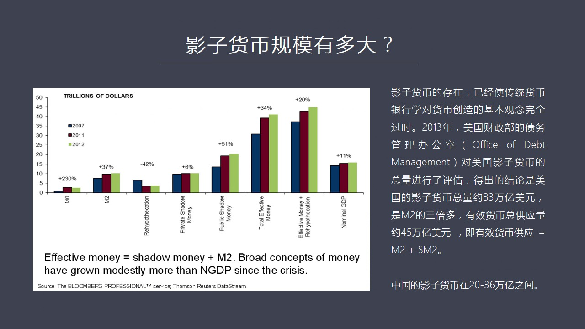

這樣的一種能力其實已經完全不同於過去我們所理解的貨幣金融學裡面的部分原金創造貨幣的這種理論了它的創造了規模我在書中介紹過美國影子系統這個影子銀行系統所創造了影子貨幣的總量大概現在是33萬億這應該是兩年...

<strong>All subtitles</strong>

> 這樣的一種能力其實已經完全不同於過去我們所理解的貨幣金融學裡面的部分原金創造貨幣的這種理論了它的創造了規模我在書中介紹過美國影子系統這個影子
> 銀行系統所創造了影子貨幣的總量大概現在是33萬億這應該是兩年多以前的數據這個數據是美國M2的三倍所以很多中國的媒體在介紹說中國的M2比美國增
> 長得快的多如何如何美國經濟比我們大結果中國的M2比美國要大寫這篇文章的人就顯然不理解什麼叫影子貨幣也不了解影子貨幣在金融上所發生的跟貨幣貨幣
> 貨幣之間的關係其實美國的M2本身並不高那是因為用傳統的銀行的貨幣金融學的這種觀點來看它的確不高但是你別忽略了美國的影子貨幣的這個供應總量是它
> M2的三倍所以如果我們把這個概念提煉成有效一個國家和一個社會有效的貨幣供應總量的話美國的貨幣總量應該是45萬年它這個計算公式應該是有效貨幣供
> 應等於M2加上SM2SM2就是蝎豆芒裡S就是這個蝎豆就是這個影子貨幣的手字母它是這樣像鄉家才等於我們傳統理解的貨幣供應總量那麼在中國其實也存
> 在這個問題也存在這個影子貨幣的問題因為我們存在著回購市場只要存在著回購市場就必然存在著影子貨幣而在中國我們這個回購中間從法律上來看是不允許進
> 行轉抵押的也就是貨幣成熟我們雖然創造影子貨幣但貨幣成熟是1是1倍沒有進行放大但在我看來在中國的這個回購市場中的買段式回購就幾乎相當於轉抵押道
> 理是一個道理就是買段式回購的寄賬方式是很有意思的買段式回購就是我相當於把這個我手中持有債券我不是指押我是直接賣給對方賣給對方按到道理來說寄賬
> 方式也會方上面100塊錢債券就不在我手上了就要轉移到對方自轉分在表上而且這個債券在收貨利息的時候假如他被對方所持有那麼收貨利息也屬於對方這叫
> 真實銷售但實際操作中大家往往不這麼幹因為我們的快跡原則重實質輕形式這個實質是什麼呢實質就是大家認為他在三天以後或者在兩天以後還會把這個資產買
> 回來所以快跡的實質說明他並沒有離開他資產出來表在這種情況之下仍然這個債券要保留在習慣上保留在這個要去支援融資這方的自然資料表上並沒有真實發生
> 轉移如果有現金收入如果有利息收入在這段期間裡面屬於誰呢他是把這個利息收入作為長團這個回購融資的守護利息或者叫這個前期利息就是雖然是對方受到了
> 錢因為支援給對方了那麼對方受到錢是作為你不是要輸回嗎我就先把這錢給扣掉所以從理論來說這個現金流仍然是屬於這個券商和非因機構的就是去拆解這個資
> 金這一方那麼他從本人來看這不就是轉抵押嗎因為在這種情況之下買斷式的這種回購情況之下對方從法理上來說是擁有你這個抵押品的合法的權力所以他是有權
> 力把這個抵押品抵押給第三方第四方是可以進行轉抵押的所以在這個角度來看從法律的角度來看這就已經允許了轉抵押的存在當然我們不知道在中國市場中有多
> 少人在做轉抵押或者轉抵押的規模有多大因為這種理論問題在我們的在我們的腦海中都還沒有形成一個非常明確的概念的時候是不會有人統計這種數據的但不管
> 怎麼樣從法律和快計角度來說買斷式回購就相當於轉抵押轉抵押它的次數就相當於貨幣成數所以如果一旦我們允許這件事的話我相信就會有人這麼幹只不過我們
> 現在查不到數據不知道有多少人這麼幹這麼幹的規模究竟有多大好明白了這些道理之後我覺得我們對於這一次所發生的這個三個市場中出現的暴跌和它背後真正
> 的原因就是回購市場這個原因已經有了一個腦海裡面有一個鮮明的印象當然要把這一期的那種全部吃透我覺得大家可能需要一個很長的時間你需要反覆了研究反
> 覆了想反覆了看那麼這一期某種意義上我在推薦書裡面推薦是貨幣戰爭物因為沒有其他的書

---

### Slide 17

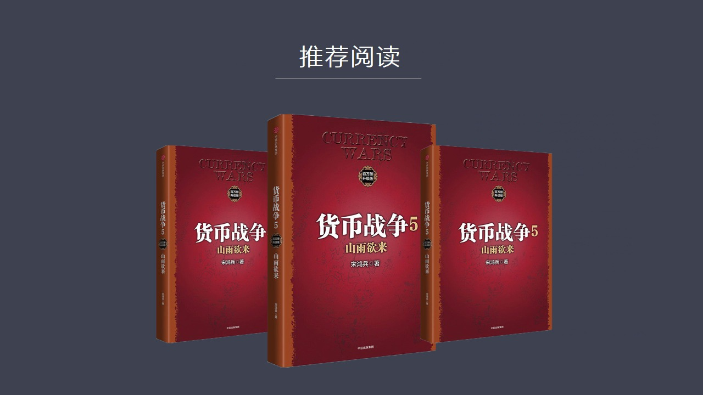

在系統性的論述影子貨幣的創造機制和它的原理好今天關於這個問題我們先聊到這裡如果大家有什麼問題需要相互探討我們可以在週末在威克堂上有機會再詳細論述這個問題

<strong>All subtitles</strong>

> 在系統性的論述影子貨幣的創造機制和它的原理好今天關於這個問題我們先聊到這裡如果大家有什麼問題需要相互探討我們可以在週末在威克堂上有機會再詳細論述這個問題

---

### Slide 18

好謝謝大家

<strong>All subtitles</strong>

> 好謝謝大家

---
