# 核心课视频-005.数字货币（上） — Clean Slide Notes

> **来源**：鸿学院核心课程  
> **幻灯片**：17 张

---

### Slide 1

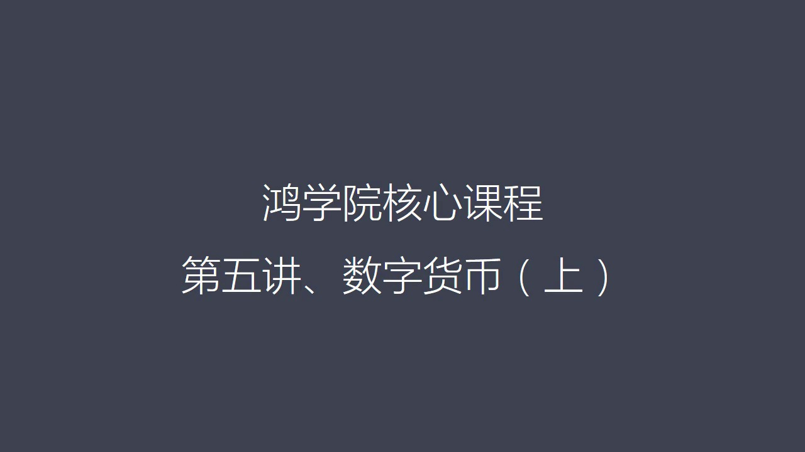

数字货币数字货币今天我们讲上半部分最近这段时间我一直在研究数字货币花的时间比我想象要多很多主要原因是以前我们对数字货币比说比特币有一些了解但是是一种原理上的了解而不是细节上了解如果你要真的了解这个货币本身的他的内在的很多问题他的局限性还会来发展的趋势就一定要深入到细节中间去这就是最近一个月我一直在看...

---

### Slide 2

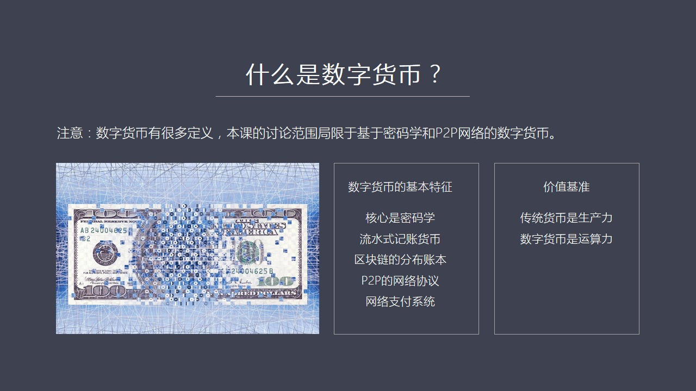

这个基于密码学和P2P网络的数字货币所以我们来看数字货币存在哪些基本特征我们现在看第一页我把这个数字货币的基本特征归纳起来我认为有几点第一点他最核心的是一定是基于密码学的第二呢就是他是一种流水式的机上货币第三他的存主方式是一种区块链式的分布式账本第四他是一种P2P的网络协议第五他是一种网络支付系统他...

---

### Slide 3

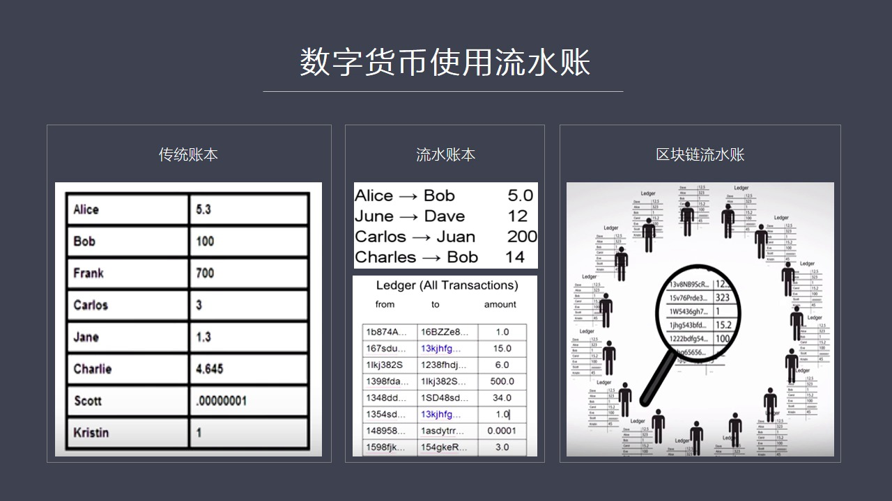

就是数字货币他使用的是一种流水帐本这一点跟传统的货币计算方式很不一样的比如我们去银行我们看现在的银行传统银行计算那当然都是有一个人名对背后对应多少金额他都是这种传统计算的方式这种计算方式就是以人名和他所对应多少鱼额来作为统计和记录了一种标准一切是以这个东西作为一个出发点和基准但是在数字货币中在趋快链...

---

### Slide 4

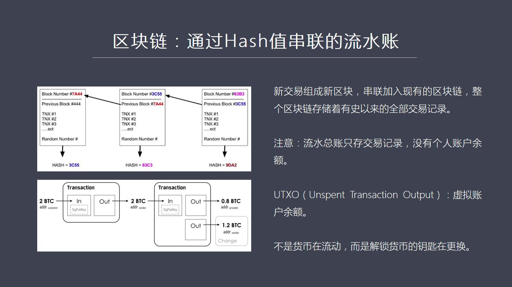

我们在每一页所讲到的内容尽可能的不涉及到任何其他知识背景不需要你知道更多的先学条件然后我们只是在讲的过程中涉及到什么东西然后在把涉及到东西在逐步地深入这样的话对于没有基础的同学大家可能会听起来就比较容易听懂否则的话一上来就讲很多很多概念大家可能就听晕了现在我们来看第四页这中间就涉及到一个新的概念区块...

---

### Slide 5

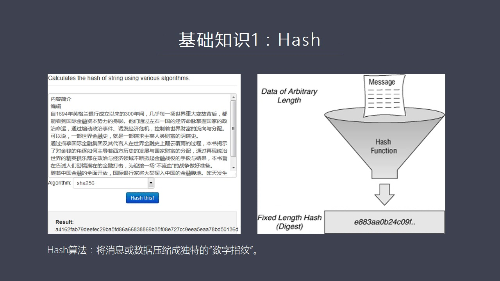

或者有人称之为哈西直无论叫什么那么这个哈西到底它是在做什么用你比如说我们如果有兴趣的话可以在网上你可以找一个这个哈西的计算器在这个决认器中比如说我把货币战争的前言内容介绍放进去然后底下这个算法哈西这个计算它是有不同算法比如说我选择了一个算法就是secure哈西这个算法的多少位256位我如果选这个算法...

---

### Slide 6

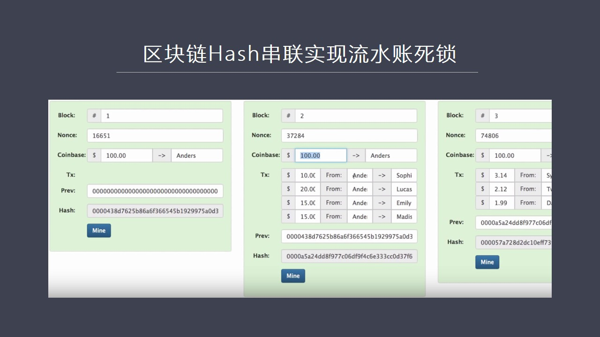

用哈西这个算法我可以把每一个区块通过ID的方式链接在一起链接在一起我们可以看到在这个事业图上我们可以看到这是一个区块区块上是区块号然后还有这个有一个叫随机数那是随机数另外我后来会讲到这个数是干什么用的另外还有各种各样的交易的一些信息然后它底下讲到的是两个哈西纸最下面这个哈西纸是对这个区块进行哈西纸得...

---

### Slide 7

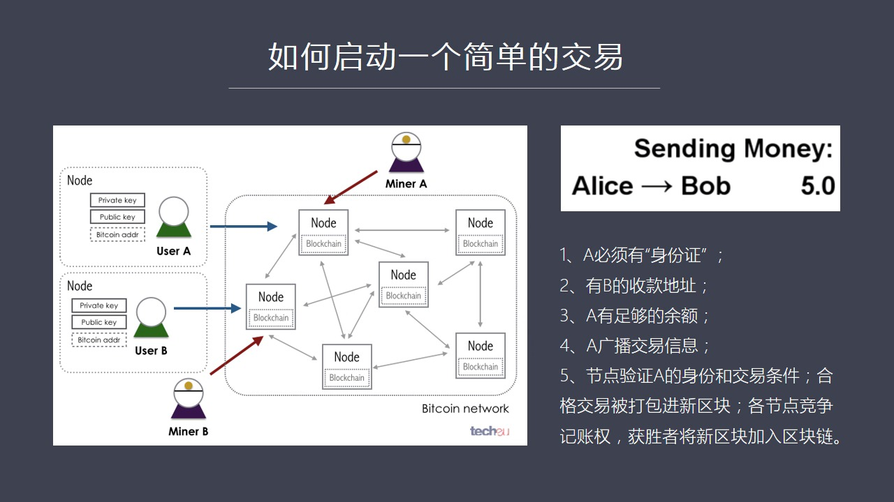

要转5块钱或者5个比特币好要完成这样一个最简单的交易需要做哪些工作呢需要做5个重要的工作第一A要生成这个交易要比如说要填个申请单我要转5块钱给对方就好像我们在银行窗口上填这个表一样首先A必须要有自己的身份证当然这是我指的是数字上的身份证证明A就是A而不是其他人第二它必须要有B的收款地址就是我要给它挥...

---

### Slide 8

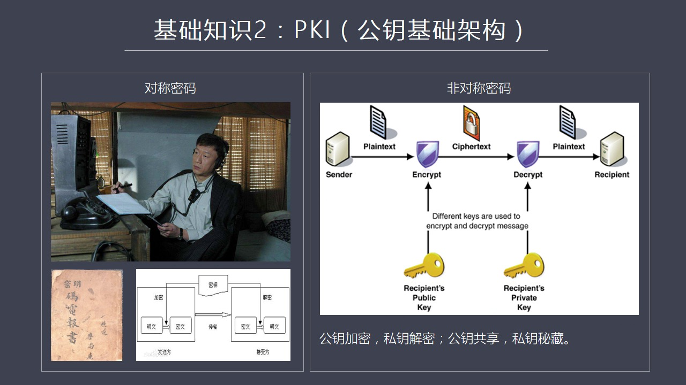

这必须要依赖一种特殊的认证当然它不会用身份证它们用的是工药词药这种体系就是PKi系统这个PKi就是工药的基础架构如果想简单地说清PKi或者工药词药我还是想用最简单的这种举例的方式来说明首先我们是密码中间加密中间存在着两种加密方式一种是对称加密一种是非对称加密什么叫对称加密比如说我举个简单例子我们可能...

---

### Slide 9

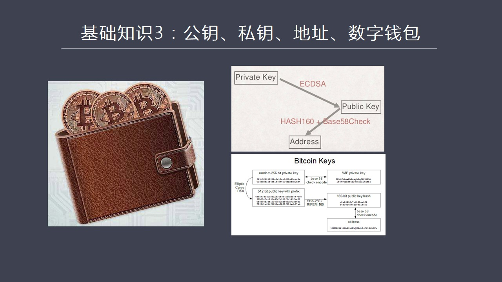

用私钥我可以证明我是谁用公钥可以加密那么下一个问题是就是如果你要转一笔钱我能证明我自己是谁的但是我怎么知道对方它这个会款的地址什么呢这就是我们要讲基础知识三基础知识三我们要意识到就是公钥和私钥是在哪里生成在哪里管理的呢一般来说这个叫数字钱包比特币的钱包比如你在网上下载一个比特币钱包的软件那么它就可以...

---

### Slide 10

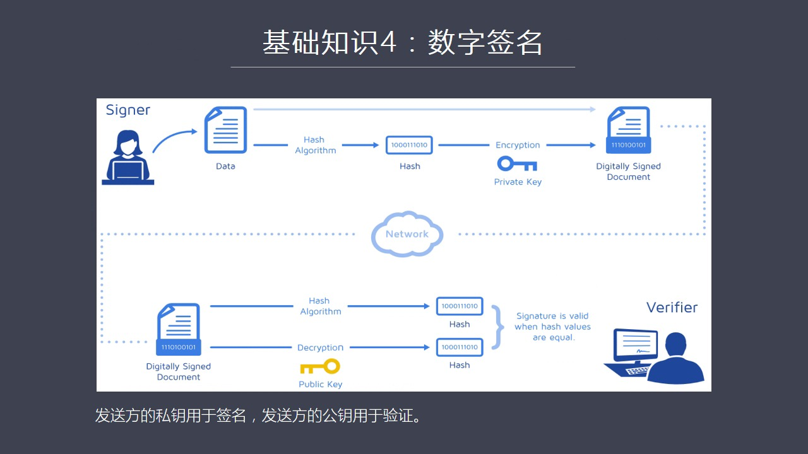

什么叫数字千名呢我这用一个简单的框土来说明数字千名的一种原理首先签字者在左上角它有一个纹件这个纹件上有写了一些内容然后呢它把这个纹件进行哈信计算就是算它的指纹数字指纹算成之后是一个大大缩简的自负券这个自负券可以非常独特的它就是一个指纹非常独特的代表这篇文章或者这本书或者这个图入馆里面所有信息的它具有...

---

### Slide 11

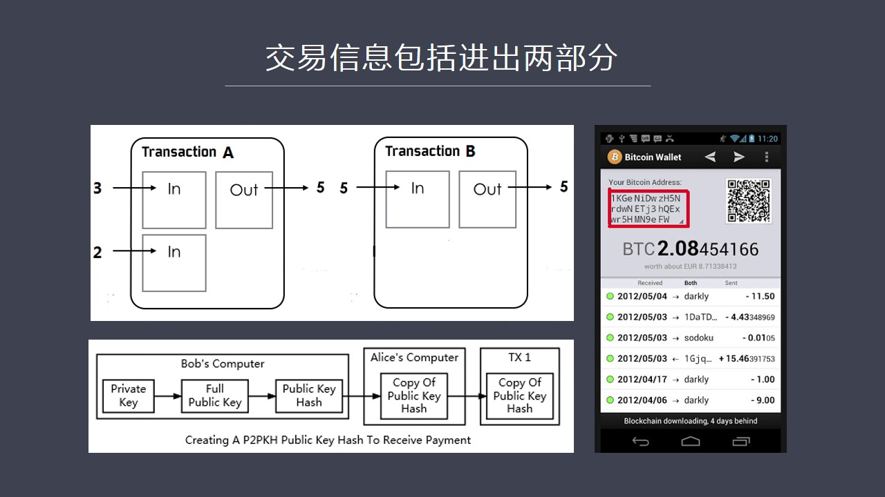

一个是进 一个是出因为它就是转账嘛 谁转进来然后我再把钱转给谁 对吧所以它是一系列的交易A交易 B交易 C交易每个交易如果从系列看全部都是进和出你会发现有些情况下它是有两个 两个人给它汇钱然后有些情况下是它要把钱汇好几个人这个无所谓反正我们只要知道我们可以把它总的进和总的出可以作为一个整体来看那么在...

---

### Slide 12

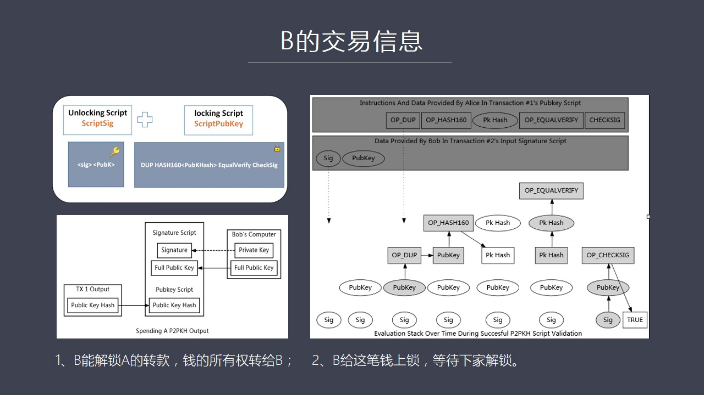

A也好B也好还是C也好在它们写成了这个交易的单剧上我们把它想像成是一个是一张纸的话它必须要包括两个部分一个部分就是解锁部分就是解锁解锁命令证明我是这个地址的合法的拥有者因为我有司要我能开这把锁第二部分就是加密的部分就是加锁部分加锁是出题给下一个收换人比如说C如果B再产生这个交易的时候它的目的是为了把...

---

### Slide 13

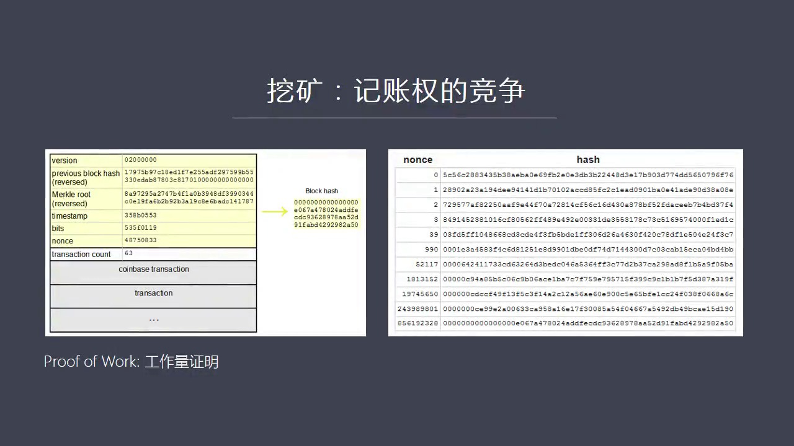

一个大致的一个概念图这个区块上面首先是有一个hider这个hider里面包括各种信息给它的版本号上一个区块就是在区块链里面最后一个最后一个区块的它的哈锡纸在这我可以得到因为我是个新区块我现在正在准备加入区块链所以我需要知道我应该往谁身上加所以我必须得到上一个区块链最后一个区块链它的地址这就是第二行看...

---

### Slide 14

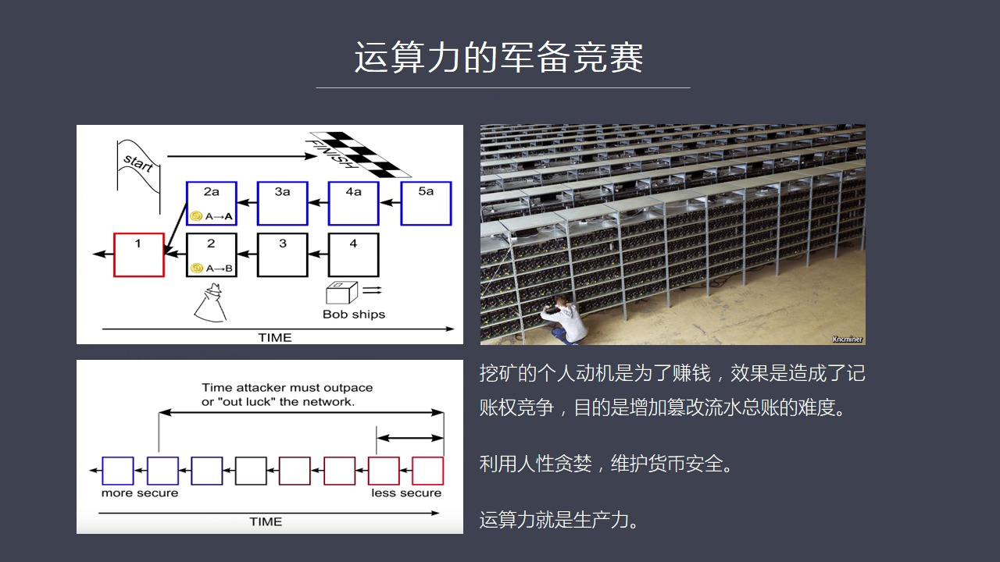

摩尔定龄所以大家需要不断的更新设备不断的做新的处理目的就是为了能够在最短时间面第1个算出这个Proof of the World这个难题它要要求是第1个算出来第1个算出来之后我就可以获得比特利我就可以获得这个奖利然后我就会获得这个把这个区块加入区块链这种记仗权所以你会看到这中间很有意思就是中本聪在设...

---

### Slide 15

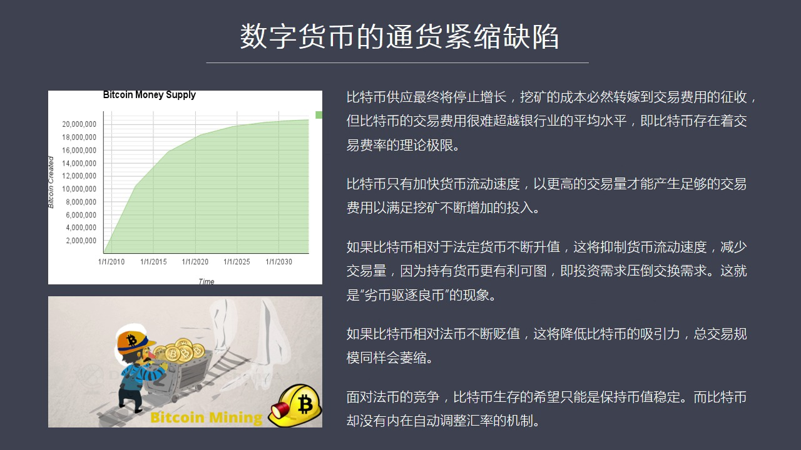

我们一开始说的我比特币的供应必须要来源于挖矿就是你一开始比特币刚生成的时候你看挖矿所得到的奖励是很高的所以很多矿工们赚了很多钱它是一个比较倒的一个货币增发量但是到了一定时间之后比如2020年之后这个波斗就越来越平缓但是到了2030年2040年之后几乎它就达到了货币供应的极限2100万个比如说那么关键...

---

### Slide 16

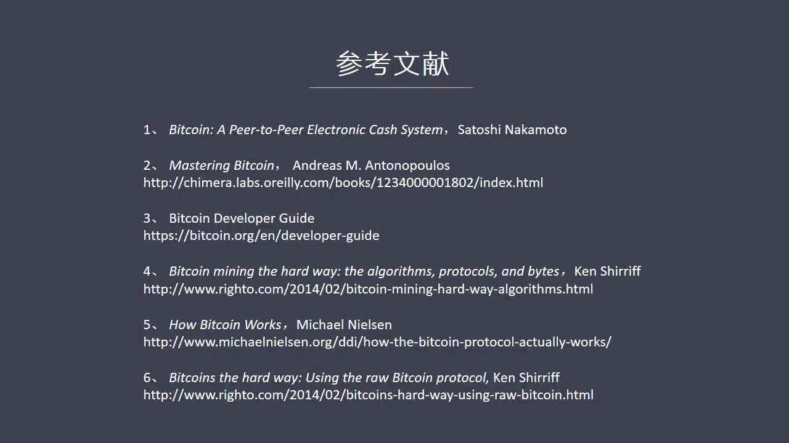

如果大家想深入了解的话我建议大家还是要读一读当然如果你满足我是个外行我只需要知道大致原理我想今天我们说的这些内容就已经足够了好 今天关于这个话题关于数字货币之话题上半部分我们先说在这里谢谢大家 希望大家准备一下然后有什么问题我们可能讨论也可以问另外下期我们将尽快推出

---

### Slide 17

好 再次感谢大家

---
