# 核心课视频-006.数字货币（下） — Detail Slide Notes

> **来源**：鸿学院核心课程  
> **幻灯片**：21 张

---

### Slide 1

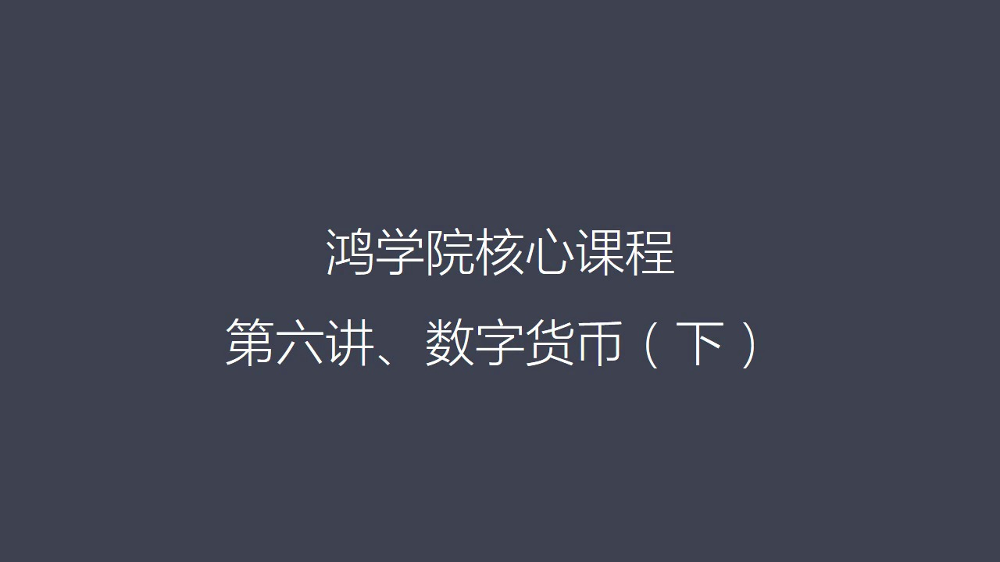

这一部分呢我们集中讲央行发行的数字货币在上一样中呢我们主要谈到了就是这种加密货币的一些基本原理我一开始反复强调我们对细节了解的越是透彻知道了越是相近那么我们对红关问题大问题就会把握了越准确你比如说我看...

<strong>All subtitles</strong>

> 这一部分呢我们集中讲央行发行的数字货币在上一样中呢我们主要谈到了就是这种加密货币的一些基本原理我一开始反复强调我们对细节了解的越是透彻知道了
> 越是相近那么我们对红关问题大问题就会把握了越准确你比如说我看到了很多关于央行发行数字货币的各种报道谈话 分析但是给我的感觉是我个人认为大部分
> 人是没有研究过技术细节的所以你看他们的评论和文章显而言就是没有抓住问题的要害就是在对这个问题的分析的时候给人的感觉就是人云云别人怎么说或者别
> 人怎么谈到的他就引述别人的观点但是非常缺少自己的独立判断和分析其实我们很多的学者看从他们的分析中也可以看出来不少人对技术特别是加密技术的很多
> 底层的问题可以说是不太了解的所以他们谈到数字货币的时候谈到央行各国央行的不同模式的时候其实也没有谈出了所以这个再次说明我们对细节的了解尤其对
> 技术细节的了解一定要透彻否则的话就根本没有办法取身课理解现在各国央行所做的这种常识究竟意味着什么对货币本身意味着什么对未来整个经济发展的格局
> 又意味着什么所以有了上节课的这个基础如果大家没有看懂或者大家觉得没有花时间仔细去思考的话我建议大家回过头去再看一下那应该是一个高度农缩的这样
> 一个一堂课我们这堂课的内容就是建立在上节课的这个阶势基础之上然后这个重点介绍各国央行面对比特币的崛起面对区克兰技术这种新的技术潮流各国央行应
> 该采取什么样的对策今天这堂课我们首先要介绍一下英格兰银行在这方面的思考和常识我们看这个第二页就是证文的第一页在我看来

---

### Slide 2

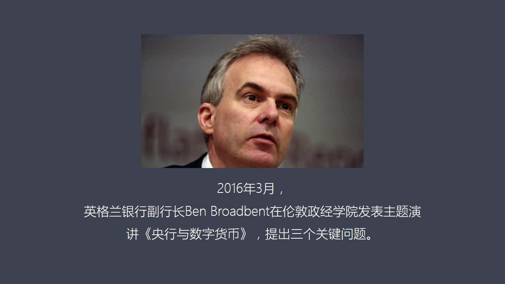

央行对于这个数字货币对于这个比特币的这种崛起非常明显的意识到了问题的这个证据在什么地方我归纳成一句话就是清算权之争在这里呢我给大家推荐一篇文章就是2016年3月英格兰银行的方航长这个本邏的本他在伦敦政...

<strong>All subtitles</strong>

> 央行对于这个数字货币对于这个比特币的这种崛起非常明显的意识到了问题的这个证据在什么地方我归纳成一句话就是清算权之争在这里呢我给大家推荐一篇文
> 章就是2016年3月英格兰银行的方航长这个本邏的本他在伦敦政经学院发表了一个主田讲就是央行与数字货币我当然我看过很多关于数字货币的这种发言讲
> 话分析文章我觉得到目前为止他的这篇讲话是最深刻的最全面的抓住了问题的本质就是说他是从一个哲学的高度从一个货币哲学这样的一个高度来认识数字货币
> 的其他的文章大多数都是留于一种比较付钱的或者比较技术型的论数而没有从一个相当的高度上来看待数字货币崛起的整个的他对经济对货币本身的冲击那么在
> 这里呢这个英格兰银行我觉得是到目前为止做的在认识这个问题的深度上做了最好的在这篇讲话中这个Browband它提出了三个关键型的问题所以我在以
> 前的渴堂中专门强调过提问的重要性就是你的问题其实代表了你对这个事务理解的深度它提出了三个都是哲学问题第一个问题它认为比特币最重要的创新不是发
> 明了一种新的货币或者新的机上单位而是创造出了一种去中庆化的清算体系我当时看了它这篇讲话看了它第一个问题的提出我就发现这个文章写的还有道道它的
> 水平是比较高的因为在货币战争从各国的央行发展过程银行业的发展过程中我自己的深刻体会就是中央银行的它的诞生的原始动力其实首先来源于资金清算你比
> 如说我们谈到的在货币战争舞中谈到的北宋北宋在程度地区搞了交子指币试验的时候就是程度的十几个大的交易商他们组织了一个联合的清算体系否则你怎么进
> 行资金清算呢你用交子来代替参户里面的这种铁壁因为铁壁背着太沉重那么你的交子在市场中流通过程中就必然会涉及到你家开的收据对方其他的家为什么会接
> 收所以双方或者十几个参与方必须要有一个中央清算机构最后每天计算进差然后决定谁家参户中间的铁钱从哪家运到哪家我们如果看西方也一样就是事实上第一
> 个中央银行最早的中央银行吧它的除行并不是银行而是1609年的阿姆斯的单银行荷兰商人也是出于清算的目的设立了中央银行也就是在那个地方所有全世界
> 各种各样的买卖和交易都可以在那进行资金清算当然也包括货币对换包括后来的中央银行其实做的都是最关键的一个工作或者一开始最重要的工作就是进行清算
> 什么叫银行准备金呢银行存在央行的中央银行的准备金就是为了做资金清算的工商银行在人民银行中有一个账户上面存了多少准备金另外一个银行也存了多少准
> 备金好那么当这两家银行工商银行建设银行发生跨行的资金转账的时候在哪里清算就在中央银行进行清算所以中央银行的一个最初的或者最原始的动力产生中央
> 银行的最原始的动力就是进行资金清算其他的权利其他的央行的功能是基于这个基础后来逐渐衍生出来的就是资金清算是他原始的最重要的力量其他的货币政策
> 比如利率政策汇率政策等等包括什么调整就业反经济周期等等等等这些东西在我看来都是也生出来的新的权利但他的根是在资金清算上所以当央行认识到比特币
> 所代表的区块链技术现在进化出了一种新的资金清算这种办法这种资金办法就是靠区块链自动的靠我们上级所讲到的区块链然后挖矿竞争技朗权这套体系是不需
> 要人参与的是不需要中介机构的也不需要第三方信任机构是完全靠计算机靠算法靠哈锡靠加密等等这套组成的一个区块链的自动的资金清算体系对中央银行的资金清算权发生了重大的冲击力

---

### Slide 3

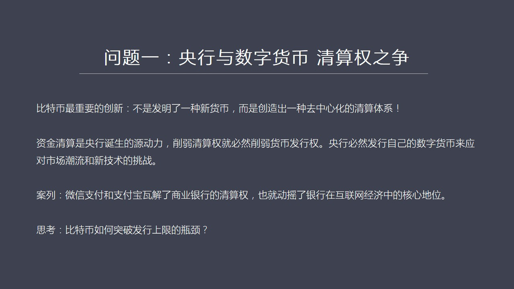

资金清算这个权力一旦算是中央银行的货币发行权就受到了极大的削弱我认为中央银行是要站在这个高度来认识资金清算的所以当我看到Browband发言第一个就提出了资金清算这个问题所以我觉得它这篇文章它的高度是...

<strong>All subtitles</strong>

> 资金清算这个权力一旦算是中央银行的货币发行权就受到了极大的削弱我认为中央银行是要站在这个高度来认识资金清算的所以当我看到Browband发言
> 第一个就提出了资金清算这个问题所以我觉得它这篇文章它的高度是具有哲学高度的比如说我举个例子资金清算对于金融体系的重要性其实我在货币战争三中间
> 讲了大量的这种案例中国正式喪失了资金清算权中央银行的这个权力实际上就喪失金融高边疆在我们现在社会中也一样比如说如果大家都用微信支付或者支付宝
> 进行资金清算也就是支付宝和微信支付他们掌握着成千上万人的或者极义人的小账户小账户之间彼此进行清算外面的商业银行是什么也看不见的最后这个微信支
> 付也好支付宝也好他们只是把最大的账户开在工商银行但是工商银行从外部是看不到里面的交易细节的这个时候谁掌握着清算权当然是微信和支付宝这样的话商
> 银行在外围根本不知道里面发生了什么具体的情况他怎么掌握资金的动向因为你不掌握资金动向你就无法去有效的介入所有涉及到资金的这种生意金融生意就做
> 不了了所以我们看到在互联网时在中由于微信支付和支付宝这样的一种第三方支付体系的崛起使得商银银行在整个互联网经济板块中间处于被边缘化的不利地位
> 比如说我举个例子大家在网上买东西有多少人会使用银行网上银行来付款呢人数是比较少的就是因为它不是那么方便而且也不是在所有的客户中都接受这种支付
> 方式的所以最主要的可能是支付宝然后是微信如果实在没有办法可能再接受其他的第三方支付或者银行的网上展占所以这个案例就已经说明了如果你喪失了资金
> 清算权你就会被活跃的经济部分所排除在外就会被边缘化那么为什么这个Broadban它并不认为比特币会威胁到中央银行的发币权就是清算权是一个权力
> 发币权就是数字货币的法定法定权为什么它不认为比特币会威胁这个法定货币的本身的权力呢在很大程度上我认为就是比特币自身设计的一个天然的缺陷就是中
> 本从他们在设计比特币的时候设计了上线我记得我在上堂课程中专门论出过这个上线会带来严重的问题特别是当比特币产生到达这个供应量到达极限之后204
> 0年以后比如说它一定会对这个交易进行越来越大的收费因为你要维护这样一个比特币的体系需要大量的挖框挖框就需要军备竞赛需要不断的投入硬件提高运算
> 速度大家就要竞争而这种竞争它的投入会越来越庞大好但是在这样情况之下你如果没有新的货币供应那就只能靠交易费就是靠过路费来弥补这个损失这样的话交
> 易的费用就会越来越高最终会导致什么呢就好像是一个货币黑洞就是挖框的人所拥有的货币量所占的这个比重会越来越大这样的话就会对整个经济体系内声的货
> 币体系产生极大的负面影响再加上它跟外部外汇市场和法币体系存在着互相交流如果你升纸太快了不行升纸太快了大家就把它作为投资的手段而不作为流通的手
> 段这样就会导致大家存有这个货币而不停交易那要挖框的人怎么获得收益呢如果是贬值贬值就会影响更多了客户加入这个体系所以也有问题它唯一的办法就是要
> 保持跟外部物价的基本平衡或者跟汇率体系的基本平衡有没有办法做到呢有而且改动量应该几小这就是一道思考题比特币如何突破这个发行上限的平静在我看来
> 你研究了这个比特币的技术细节你会发现它其实有一个简单的办法在每一个比特币的交易中间第一个就是在每一个这个Block上去块上第一个交易永远是C
> oinbase这个它的功能是在于给挖框的人提供比特币作为奖励其实这是一个产生货币供应的这样一个功能那么由于它是集中处理的就是在每个去块上虽然
> 都有这个Coinbase这个交易但是它的程序上是集中统一在一起的所以你只要把产生Coinbase的这个背后的发生比特币的创造后比特币的供应的
> 这一部分内容这部分程序进行修改你比如说如果你可以跟外界发生联系你可以把这个全世界的主要商品做成一个栏子有石油有小麦有大动商品等等你把这些东西
> 做成一个货币物价的一个纸术的栏子你让你的产生货币供应的这个功能里面的程序到外部去查询以这个为参照来调整货币供应量的这个细数也就是挖框得到奖励
> 这个细数或者你这个程序只像外部的外汇交易市场去锁定某一种货币或者一栏子货币的一个比较来调整这个库应背方面的奖励给曠工的这个细数就可以实现也就
> 是外面的物价长大动商米物价长或者全世界的主要货币这个栏子的价格你跟它锁定的话那么你给曠工的这个奖励的这个货币的供应量就会随之发生调整这样一来
> 它就不再是个有封闭上线的货币体系而变成了一个随着外界经济发展的总的趋势和规模那么比特别的供应量是可以自动调整的注意啊它在既上实现并不复杂可以
> 说是极其简单那么这么一调整在所有东西都不动的情况之下就可以把它调整成一个自视硬的在货币领域中自视硬的这样一个体系当然这是另外一个话题我们今天
> 重点讨论是央行面对比特币他们这种竞争所提出了三大问题我们刚才谈到了第一大问题就是比特币所创造出来的趋愉快恋轻算是一种全新的不依赖中央银行不依
> 赖任何第三方信任机构的全新的轻算体系而且是高度自动化的未来有可能是高度效率化和高度节省成本的这个对央行的挑战就太严重了我们现在看第二页第二页PPT这就是本Browband

---

### Slide 4

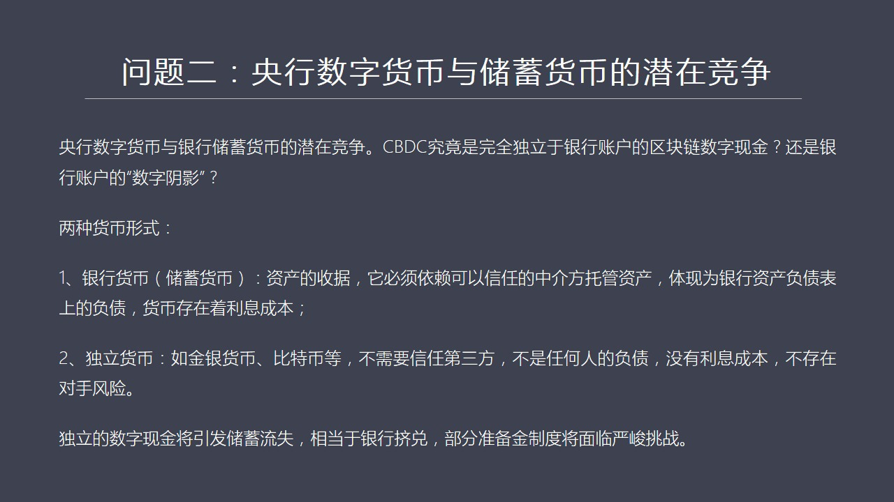

它提出的第二个重要的问题就是央行要搞数字货币那么它所可能出现的一个重大问题就是央行的数字货币会跟现在的储蓄货币发生竞争什么叫储蓄货币我记得我们讲部分准备已经制度的时候专门强调了现在的所谓的货币供应体系...

<strong>All subtitles</strong>

> 它提出的第二个重要的问题就是央行要搞数字货币那么它所可能出现的一个重大问题就是央行的数字货币会跟现在的储蓄货币发生竞争什么叫储蓄货币我记得我
> 们讲部分准备已经制度的时候专门强调了现在的所谓的货币供应体系中间除了我们看到的线超这是构成货币之外另外最主要的部分其实是银行货币当你把钱存在
> 银行账户中银行给你开个储蓄储蓄账户那个过程叫装造储蓄货币当然在西方你可以用支票的形式来转账那个也可以叫支票货币凡是银行所创造出来的这种账户就
> 是储蓄账户这种方式就是银行在创造的储蓄货币那么比特币或者不是比特币应该说是银行发生所发出的发行的法定数字货币跟银行储蓄货币之间会存在着竞争吗
> 会的这个就是 Broadband它提出了第二个重要的问题就是如果央行发行的数字货币是独立于银行体系的也就是利用区块链技术我的货币创造是在区块
> 链上进行那这个线有银行体系没有丝毫关系假如是这样的话那么这种数字货币将会影响储蓄货币的存在我们大家可以想想看如果越来越多的人将银行中的储蓄转
> 出来了取出来去购买或者去交换中央银行的数字货币的话那么这就会导致银行体系的储蓄的流失而整个银行体系呢这个就存在了一大问题了就是假如大家都去银
> 行取钱那么银行体系就会面临巨大的几对的风险所以我们在理解这个问题是要认识到现在货币存在着不同的形式银行货币也就储蓄货币从根本上来说它是一种资
> 产的收据它必须依赖可以信任的终结方来拖管资产比如说银行存上你的钱它给你开着超票或者银行的收据或者电子银行的数据这是资产的收据它在银行资产货币
> 表上它体现为银行的负债因为这是它对你的一种承诺那么这种货币就是银行货币天然存在着利息成本因为它背后的资产是有利息收入的所以对于全民来说持有这
> 种货币整个经济是要付出代价的这就是利息成本货币存在着成本第二种货币就是独币货币比如说以前的金币和银币比如说比特币这些货币是独立存在的不需要信
> 任第三方也不是任何人的负债也没有利息成本而且不存在对手风险就是它天然就是一个独立存在跟任何的交易对手没有关系所以这是两种不同的货币体制那么如
> 果说银行走的数字货币是独立货币这样的思路的话这就会又发银行体系上时处去那么相当于的银行发生几对我们都知道在部分者没经的体系之下银行如果面对大
> 家抽走现金将意味着它会处在一个非常危险的境地因为部分者没经账户天然就存在着被几对的风险我们换句说法吧其实整个的部分者没经账户体系之下的银行体
> 系都是主在破产状态之下在进行角性的运营就是理论上来说它们是永远破产的无论大印象还是小银行如果主顾来取钱它是闭到无疑的这是一个百分之百的事件它
> 之所以没有导致因为它很幸运大家并不是一起来取钱所以它们这种货币创造的思路天然就是不稳定的天然就是有缺陷的这就是说一道下野第四野我们BB讲到的瘦银行体系

---

### Slide 5

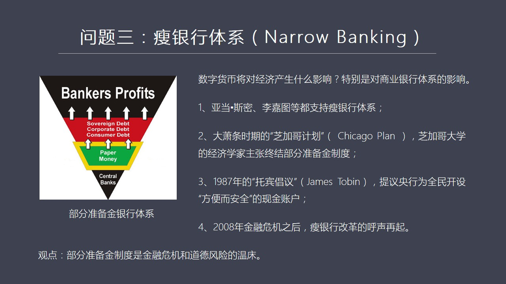

这个叫Narrow Banting但是这个词在中文中我没有查到很好的对于词因为中国基本上没有人提这个概念瘦银行体系所以我把这个Narrow Banting使得翻译成瘦银行体系瘦银行体系这个问题是银行体...

<strong>All subtitles</strong>

> 这个叫Narrow Banting但是这个词在中文中我没有查到很好的对于词因为中国基本上没有人提这个概念瘦银行体系所以我把这个Narrow 
> Banting使得翻译成瘦银行体系瘦银行体系这个问题是银行体的定乱银行体主着第三个问题就是数字货币未来将对经济产生什么样的影响特别是对商业银
> 行体系将会发生什么样的影响关于部分者明镇户我们可以用一个左边这张图我们看到是一个倒金擦型的这样一个部分者明镇的体系这样的一个试图最底下我们看
> 到是中央银行基础货币然后在网上是法币在网上是银行的各种各样的资产包括各种一样的赞权在网上是一个更大的一个金融市场在这样一个倒金擦体系中如果它
> 是呈现一个倒金擦的话它天然就不会稳定也就是为什么会发生周期性的经济危机在很大情况之下跟银行现代这个扩张周期性的扩张和周期性的收缩存在着必然联
> 系当你过渡放带手整个争计体系就会面对越来大问题当大家资金流断裂的时候就会发生流动性的向心内暴然后就会引发银行坏账然后就会引发银跟紧缩然后就迫
> 使大量企业破产裁员这就变成了个恶性循环所以越是到货币经济体系发达这个到越发达这个时代的话金融体系的稳定性对于整个经济的稳定性就会发生越来越大
> 的作用就是因为部分准备金账户天然的不稳定的特性所决定的我们现在很多人谈到部分准备金账户就把它作为一个继承事实它过去是这样现在意志这样未来也将
> 如此这种观点在我看来是非常非常缺乏进化的思路你没有从一个足够的时间纸都来看你也没有从一个足够的向未来这个时间方向去看的这样的一种纵身感你比如
> 说这个Browman在提到部分准备金账户的时候他其实就已经专门提到了当年就是经济学的这些鼻子我们亚当斯密比加图这些人都不是都是支持受影响体系
> 的所以受影响体系就是严格限定银行的这种业务你不能做现在很多做了这种长期贷款等等这些业务他们把银行定义成展银行其实在美国在1913年美联储成立
> 之前美国银行体系基本上就是展银行体系银行只能进行投资的一些非常它的资产费代表上只有一些非常短期的比如说90年以内的商业票剧还有超短期的这种国
> 债诸如此这样的资产很少有人做长期的贷款或者大量的贷款因为风险很大因为银行的本质是什么短借长贷借款就是它这个储蓄这个人随时可能抽走但它贷款是长
> 期的所以它资金的期限永远是不匹配的银行了所有技术就是要弥补这个不匹配但是这么一来就会造成风险所以当时要当司密和领家图这些人在对银行体系的认识
> 上就认为要想保证经济的稳定运作他们是坚持瘦银行体系或者是主张瘦银行体系的当然了在美国也是这样比如说大销调时代1929年发生大销调之后在30年
> 代说美国芝加哥大学大家都知道芝加哥学派这一帮人提出的叫芝加哥计划其他个pland这什么意思呢就是这帮经济学家认为应该终结部分准备进制度其实从
> 银行这个银行学的货币供应的角度来看大销调可以说跟这个银行体系的崩溃有着直接的关系甚至是最主要的关系我们都知道大销调本身来说是生产过剩危机我们
> 现在所说产能过剩购买力不足吗但是为什么会造成购买力如此的不足或者产能如此过剩呢因为在全世界资本主义这个历史上共过一球生产过剩并不是一个很孤立
> 的它是个长期存在的现象假如是在窄银行体系之下那么这种波动扩张收缩这种波动就不会持续这么长而20年代之所以出现这么严重的所谓产能过剩或者是生产
> 过剩导致30年代如此漫长持续了十几年的大销调这当然取决于银行的重大的改变或者叫银行的我们现在所说的过度过度的这个贷款过度放贷投机的这个过度等
> 等但这一切都是要依赖于银行扩大信贷的能力和尴尬率所以在部分准备经济上我之下这些人认识到它是导致美国大销调出现的一个最重要的原因或者说是导致大
> 销调持续了如此之长的一个最关键的原因就是没有这么这么严重的部分准备所导致的这么严重的杠杆率就不会发生这么深的销调所以这些人主张我们应该终结部
> 分准备经济度这种呼声其实在美国立上和在英国这个立场一直都存在你比如说到1987年有一个渐兴脱病提出了脱病畅议什么叫脱病畅议呢就是为了避免商业
> 银行因为现在的货币供应完全是央行跟商业银行这个发生关系商业银行进行就是央行把这个基础货币提供给商业银行商业银行在此基础之上扩大货币供应然后全
> 民整个经济才能得到货币脱病计划认为脱病它这个破烂认为为什么我们一定要依靠商业银行呢因为这大销调时代出现了9000多家银行导币那些银行导币之后
> 全国就没有资金供应了全国资金就断流了为什么政府不能绕开商业银行以及直接向全民直接向经济注射货币呢其实这就是当年希特勒纳粹崛起搞的金融创新我在
> 货币的战争二种专门分析过这个问题政府是完全有能力而且应该绕过整个银行体系能够向整个经济体直接注入货币的谁要这么做在大销调中谁这么做谁就会迅速
> 辐输德国当时用的就是绕过银行体系的办法所以他在三年之内经济摔退就终结了到1936年他的整个经济就恢复到这个危机之前的水平了远远超过其他的资本
> 主义国家什么原因就是因为他采用了希特的采用了金融创新的办法托兵畅议其实就是提倡央行可以绕开一整个银行体系为每个老百姓每一家企业开设专门的账户
> 这个账户就是为了方便和安全的比如说方便每个人转账为什么要通过上银行我为什么不能直接在央行开账户我直接在央行进行这个转账不可以吗当然可以然后这
> 些现金如果存在央行账户中是永远安全的上银行可能倒闭央行不会倒闭而且央行不进行尴尬性的放态所以他没有倒闭的可能性这样的话就完全绕开了商业银行体
> 系而经济照样发展就是商业银行体系你要破产了破产就破产了但是中央银行仍然可以把货币直接住到近期之内所以经济可以照常运行这个就是当年1987年脱
> 兵畅议应该银行方向长在这个地方提到脱兵畅议包括他对受银行体系的提倡其实反映了他的一个重要的世界观就是未来数字货币体系之下英国的商业银行体系的
> 未来的发展方向到底应该是什么样的方向这是一个重大的战略思考也是一个非常有哲学深度的思考那么其实在2008年之后受银行会受银行改革的这个互生越
> 来越高就是商业银行存在这巨大的道德风险存在着这个高贝杠杆的这样的一个问题它是金融危机的发源地和温床所以为什么以后的银行体系不能做撤击改变金融
> 体系不能做撤击改变我们绕开商银行体系发展出一种新的金融模式这个是一个重大的起发所以我们来看它这个讲话每一个问题都不是一个表面性的技术形容问题
> 每个问题都是哲学问题那么通过它这个讲话我们看下也第五叶我对银行未来的发展就是它搞数字货币整个这个思路我自己的理解是从我对它这些讲话的一些分析
> 和判断我用一张图画的表现出来就是银行的数字货币它未来发展趋势是受银行体系加上趋客链证本

---

### Slide 6

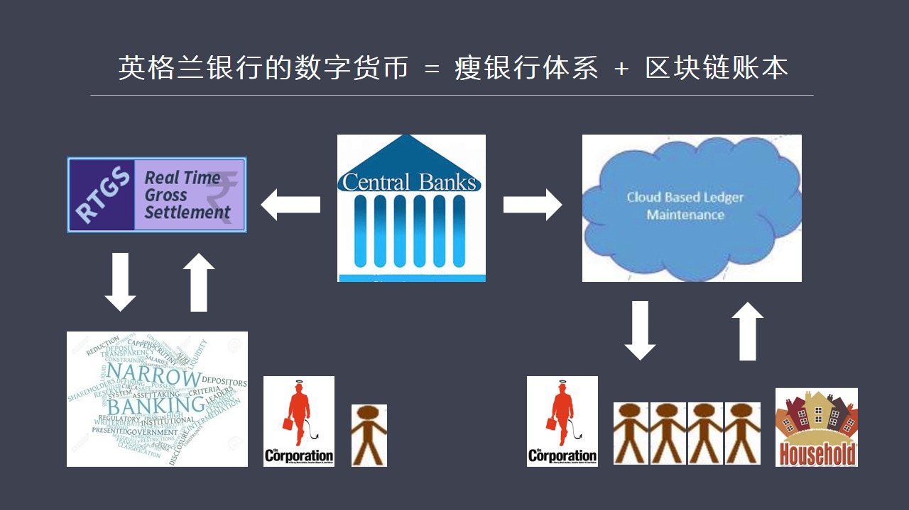

我们可以看到从这张图我这个用这张图来代表这个它应该银行未来的货币体系和金融体系看起来应该像什么样子中央银行是放在正中间但是中央银行和企业个人之间是只有两层了以前中间隔着商银行就中央银行跟商银行打交道商...

<strong>All subtitles</strong>

> 我们可以看到从这张图我这个用这张图来代表这个它应该银行未来的货币体系和金融体系看起来应该像什么样子中央银行是放在正中间但是中央银行和企业个人
> 之间是只有两层了以前中间隔着商银行就中央银行跟商银行打交道商银行跟老百姓和企业打交道现在受银行体系将会改变的一切央行直接跟全民跟个人和企业打
> 交道商银银行作为并列的一级整个体系变成了两层的体系而不再是三层那么比较重要的是图中间的右上角云存储的分布式赏本分布式赏本是什么就是在我看来应
> 该银行准备搞的就是区块链这个大账本用区块链来做所有资金转账的清算这是它的核心目的所以老百姓也好这个公司也好在央行所开设的直接的账户中间的转账
> 或者他们彼此之间的转账或者他们跟其他的银行体系发生的转账所以用区块链来进行既账来进行清算这个是问题的本质这也是整个它设计的精华之所在区块链是
> 用于清算的这个时候央行就摆脱了很多传统上了这种业务而把所有的清算的功能委托给了区块链当然区块链是在央行的控制之下而且区块链上的所有的货币的创
> 造就相当于比特别的挖矿所产生的新货币供应这是由央行直接控制的所以央行可以控制货币供应权同时间接的控制货币的新算权当然整个的鱼整个的分布账本都
> 是属于央行的所以它实际上是把砸活累活委托给了计算机委托给了分布账本所构成这套体系由算法加密和计算体系来自动完成央行的很多工作而它只拥有所有权
> 和控制权就够了这是一个极大的节省和提高效率的办法接省央行的他们的经历接省成本那么在左半部左半部是一个还是现在传统的铃行只不过铃行的业务会收窄
> 收窄之后它仍然会有很多老百姓很多企业把前存的铃行然后铃行跟中央铃行之间也是它还是利用现有的这种转称转称和清算体系来进行运作所以这个就是在我脑
> 子面想象出来的根据它的三个观点想象出来的未来他们要走的方向要走的发展道路是一个受铃行体系加上趋快链的清算体系所构成的数字货币的核心明白了这点之后我们来看第六页这就是在我看来它的这种构想可以说新铃铃行

---

### Slide 7

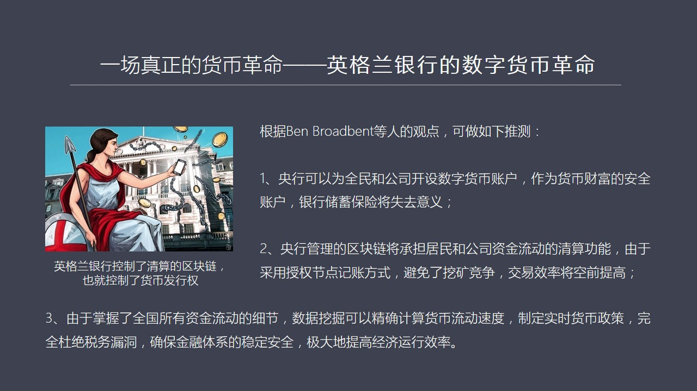

英铃铃铃行是要发动一场数字货币的革命什么意思呢数字货币的革命在我看来我们做一些推测第一央行可以为全民和公司开设数字货币账户作为财富货币财富的一个最安全的账户如果有了这样的账户铃行处去保险将失去意义我们...

<strong>All subtitles</strong>

> 英铃铃铃行是要发动一场数字货币的革命什么意思呢数字货币的革命在我看来我们做一些推测第一央行可以为全民和公司开设数字货币账户作为财富货币财富的
> 一个最安全的账户如果有了这样的账户铃行处去保险将失去意义我们现在看到比如说美国有FDS1中国现在正在搞铃行处去保险为什么铃行保处需要保险就是
> 担心铃行倒闭老百姓的处去的钱没了好如果全民可以在央行直接开设账户那还有不要存在铃行处去保险吗当然就没有必要了因为央行不进行杠杆放态它而是国家
> 所拥有的铃行它也不会倒闭所以在这种情况之下老百姓的处去当然就不需要保险只要你把钱存在央行上午上你可以基本肯定只要政府存在你的钱就存在所以这是
> 我们得到的第一个推论第二个推论央行管理的区块链将承担居民和公司公司自今全部流动的清算功能也就是繞开了铃行体系的那套清算而采用了区块链来进行清
> 算特别有意思的是由于采用了授权节点的这种方式它就避应远了这个挖矿就是矿工之间的彼此的竞争所以它的交易的效率将会有空前的提高我们现在说到比特币
> 区块链技术的时候有个最大的麻烦就是比特币这种数字货币在网上它不能相信任何人它的基本前提就是我谁也不相信所以你们只能通过运算量来证明你们做了这
> 么多工作你们的工作是有价值的所以大家不断要做每秒钟要做成千上万一次的这样的哈信算其实毫无意义它从经济角度来说是毫无意义它的意义只是存在于在一
> 个陌生谁也不相信的環境之中我只有算了最快我才能够获得寄赏权我才能获得比特币的奖励它用这种鼓励大家为了自己谋力而激烈竞争的方式间接着达到了维护
> 整个比特币这个清算体系的这样一种作用当然设计上非常巧妙可以说是相当的巧妙非常高明充分利用人性的弱点来利用弱点来为这个体系服务这个把经济学的意
> 义解释非常透彻但是它最大的一个问题就是这么多人竞争机上权它会把大量的计算资源浪费掉这是一方面当然我们不能说是純粹浪费因为这就是维护一个体系的
> 代价但是它至少有一个问题就是这个清算的速度是受到嚴格的制约的这个制约太大了比如说你每个区块生成现在平均需要十分钟这就导致你呈现上万人性交易的
> 话这个交易速度你跟不上处理速度跟不上现在比特币的一秒钟交易速度只能处理七笔但是一些大型的银行的微色卡他们就可以达到几千笔这中间差距太大就是你
> 想真正用于商业运作的话你这个交易量不够特别是你现在如果未来其实扩大人越来越多十亿人二十亿人三十亿人都在使用这套体系这套体系就不行了它就撑不住
> 了主要原因就是我不信任矿工谁也不信任矿工之间也彼此不信任在这种情况之下你的代价就是喪失效率好再新一个在英格兰银行的设计中间它由于采取了授权节
> 点授权节点比如说我指定某家商银行会风银行你是我最信任的这个苏格兰什么是吗皇家银行你是我信任或者谁是银行我最信任扎兰银行当着诸如此了我授权你作
> 为我的节点作为中央银行的矿工但是你不用挖矿了你因为我信任你所以你就免除了工作量计算这些验证只要你是我这个体系中间我授权的节点你就来负责给我机
> 上就完事了这样的话每个节点就避免了大量的这种劳动运算力的这种劳动直接记仗那速度效率将是空前的高所以呢由于我知道你是谁而且我相信你会为我服务所
> 以我不用你在做很多很多巨大的工作量来证明你如果你出了什么问题我可以把直接把你升制一法因为我知道你是谁所以在这样的体制下它的交易效率将会提高很
> 多第三由于这种整个英国它如果进入这样一套体系就是全面数字化数字货币化之后这可不得了这意味着中央银行将知道每一笔钱每一个运动过程中的所有细节所
> 以你如果对资金流动进行充分的数据挖掘你可以精确的计算货币流动的速度这意味着什么意味着你可以根据没小时甚至每分钟的经济变化了情况制定这种所谓实
> 实的货币政策没有任何之后现在各国家货币政策得看一个月或一个季度以后数字报表然后我再做调整调整之后再半斤之后再看效果这就不必了因为现在没比较一
> 全部实施记录我可以随时查询这个区块链获得这个星期之后立刻调整调整之后第二个小时反馈就已经回来了我就可以看到我这个货币政策对整个经济运转发生了
> 什么样的影响这个就叫实实控制了这就不得了了这个进化就是从远到人的进化了效率这个制高是以前所难想象的同时如果没比较一全部记录在案任何人都逃不了
> 睡了任何人也没有任何财务隐私了整个金融体系也变得更安全了到底很简单商业银行全部变成了受银行或者大部分变成了受银行受银行的体系是什么我尴尬率一
> 定会伪缩银行的业务要发生转型那整个部分准备金刚而体系如果被压缩的话金融稳定性当然就提高了整个体系会更安全然后最重要的是极大了提高了数字管理能
> 力而这一点将会使得整个英国的经济它的增长了效率运行效率将达到一个前所未有的程度所以这个应该银行所搞的这个数字货币是一种革命性的一种做法是一场
> 真正的货币革命它所拥有的权力非但没有缩小反而变大了也就是应该银行控制的清算的区块链是它控制的也就控制的清算权它又掌握着货币供应的一个数字货币
> 供应的权力所以它两个权力都没有丢而且非但没有丢由于整个运行效率的提高监控效率提高反而是应该银行的权力变得更大这是非常聪明的举动代表了应该银行
> 这帮人对货币的未来的发展和整个金融体系的进化已经有了自己非常明确的判断我在很多分析文章中间基本上没有看到很多人从这个角度去展示英国的数字货币
> 和中国的数字货币之间有什么样的差别差别很大可以说有质的差别我们再看下业第七页英国兰银行的数字货币的他们叫RSCOIN

---

### Slide 8

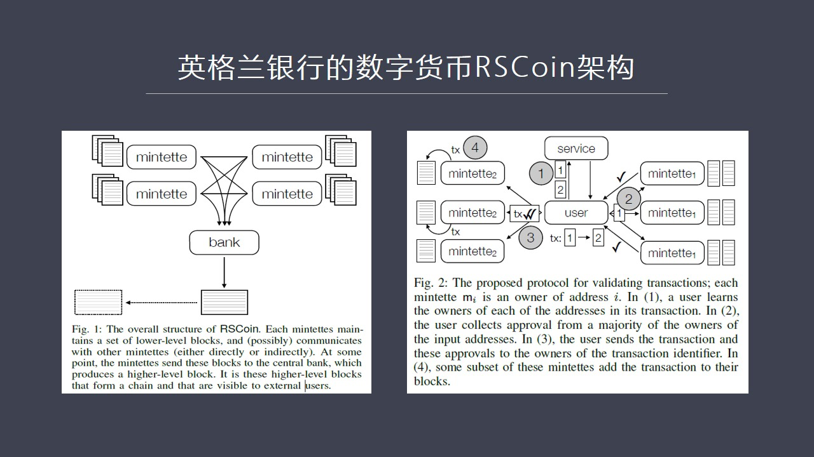

它的构架是什么样为什么我反复强调我们必须要去读它的技术文件白皮书这些技术文件你只有读懂这些技术文件的细节你才能理解这个像本Broadband这样的人提出了一种哲学的思考它思想可以飞到两万米的高空但是它...

<strong>All subtitles</strong>

> 它的构架是什么样为什么我反复强调我们必须要去读它的技术文件白皮书这些技术文件你只有读懂这些技术文件的细节你才能理解这个像本Broadband
> 这样的人提出了一种哲学的思考它思想可以飞到两万米的高空但是它的根是在地下一千米或者一万米的深度这就是全部是要靠技术细节来实现你推的再大的牛你
> 讲了再高的理想如果没有最后每一行的程序就什么也不是就是什么也做不到所以对于我们每个人来说需要特别重视细节尤其是我们谈到未来新经济货币经济数字
> 货币经济和未来的这种数字资产区块脸技术你要不懂技术细节不深入扎下去的话你就根本不会听懂别人在说什么或者听懂了之后你没有办法见别谁说的对谁说的
> 错那么我们看这张图的左边左边这张框图这讲的是RSCOIN的整体的框架我们可以看到它中间有中心的半个当然就是中央银行然后还有很多小的节点有四个
> 节点这个四个小的节点背后还有些小的类似藏本的东西这个框图意味着什么呢意味着整个新的系统是由中央银行作为中心的然后由若干节点作为辅助的而每个节
> 点管理单独的小藏本就是每个节点有自己的小藏本而中央银行的下面我们可以看到有一个大藏本它整个体说明每个授权节点管理一部分属于自己的或者分配给自
> 己的这样的一个藏本他们上面比如说某些地址某些付款的地址是属于这个节点那么你来处理它的极章节点彼此之间不断进行通讯也就是节点所控制的藏本比如说
> 我们说是一个低层藏本低层级的藏本然后节点之间不断进行通讯在不断通讯过程中不断确认中间的一些信息比如说对方有没有这么多钱除了此类的它要几个节点
> 彼此之间交换藏本信息来确认这个人有没有足够的现金之后就是双花了问题倒是笨点这个问题的避免是在底层就进行完成的然后当过了一段时间过了一段时期之
> 后这些节点们把自己所形成的低层次的交易进入然后地交给中央银行中央银行再把它拼成一个大的区块链然后进入永久的主臣状态所以这种模式是一种减少中央
> 银行工作量的模式然后由授权节点来完成主要的底层的工作包括大量的这种交易的核算核对等等工作是由底层的这些节点来完成所以它这个效率比较高的一种方
> 式右边这张图是一个更细节的图就是节点之间如何学做比如说它讲到有一个客户要转钱就像我们说A要转钱给B首先它是一个可以说叫双步执行就是to-fi
> t commit这什么概念呢就是像我们数据库你要进行数据库运算的时候它也是双步提交的第一步我提交了申请第二步验证 验证之后才执行如果第二步验
> 证失败这个交易rollback就是回归到原来的状态这个在我看来就比挖矿竞争的方式要更前进因为数据库的管理方式肯定比要比你这个区块链竞争然后通
> 过竞争的方式然后往上加数据这个方式效率要高得多这就是为什么我们要用数据库当然了区块链它是一个我们可以说是个简议化数据库它的算法它控制这个交易
> 的时间点不像数据库本身发展的几十年已经这么完善了那么在英格兰银行的这个rscore我们看到它是双步提交的两步提交第一步这个用户先去A先去验证
> B到底有没有这么多钱然后负责B的这个地址的这些这些子杖墓闻这些节点们就开始一阵忙户多数提交同意它有这么的钱然后这个A再把它送到这个下一个阶段
> 进行执行如果执行完成那么这个就生成了一个记录就放到了一个底层的这样的一个区块中间然后过一段时间这个底层区块然后再提交给中银银行变成大区块链中
> 间的一环所以这个是这个rscore应他们的基础白皮书中所谈到的如果大家有兴趣可以去看一下我在最后的参考文件中都给出了这些数据的一些链接还有这
> 些文件的处处那么如果我们看第八页下液第八页我们可以看到这个rscore英国的这个数字货币的它一些特点

---

### Slide 9

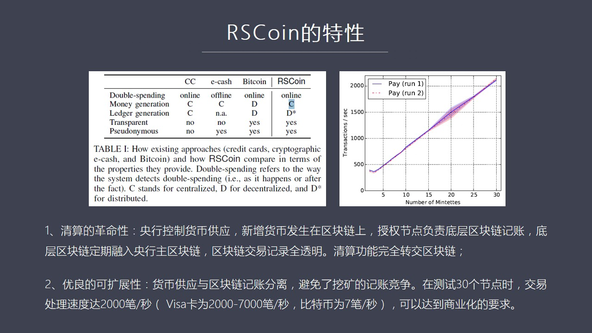

如果我们看上面的框土你会发现rscore和比特币中间的对比你会发现在所有方面基本都一样只有在货币供应方面比特币和这个rscore是不一样的rscore是靠中央银行进行货币供应而比特币当然它不是它有自己...

<strong>All subtitles</strong>

> 如果我们看上面的框土你会发现rscore和比特币中间的对比你会发现在所有方面基本都一样只有在货币供应方面比特币和这个rscore是不一样的r
> score是靠中央银行进行货币供应而比特币当然它不是它有自己的算法和上线那么右边这张图是讲的我刚才所说的由于不采用挖框这个方式来机长而是采用
> 这个信任的授权阶点它已经受到了信任所以它不用再挖框了那么这样的效率当然就会直线提升这个效率就是一个所谓的优良的可愧展性所以在我看来rscor
> e有两个重要的特性第一是它轻算的革命性中央银行控制货币供应新增的货币发生在趋快链上授权阶点负责底层趋快的链接的机长然后底层趋快链定期融入央行
> 的主趋快链然后整个趋快链上所有的交易记录完全透明跟现在比特币的这个交易的趋快链是一样的这样保证了货币供应的充分的透明性所有的人各种中介机构或
> 者各种商业机构都可以去查询都可以继续进行大数据分析这就是一种全透明的一种方式那么在这样的方式之下轻算的工资金轻算的功能将完全转交给区块链接进
> 行所以这是一种革命性的轻算第二点 第二个特性就是优良的扩展性首先货币供应和区块链接帐在常区上是分立的是完全分开的区块链的接帐方式是区块链货币
> 供应是另外的一个组装部分这跟比特币是完全不同的比特币在挖矿过程中那个Coinbase是欠在整个区块链的程序中间的所以它是一个整体而且货币供应
> 和继帐这是锁定的丝锁关系 拆不开这就导致了这两者之间就是如果你货币供应和区块链接帐之间由于挖矿产生之后那么就使得这个货币趁是不可能供应的体系
> 中间来这就导致了一系列的问题所以英国阳航RSCoin从根本上来说是货币供应和区块链进行了彻底的分离这就避免了挖矿的机脏竞争所以它的效率可扣展
> 性这样获得极大了提升那么在他们现在已经进行的测试很多时候中国是最早搞出测试货币这不对应该是英国阳航最早搞出来的可以跑起来的这个数字货币体系他
> 们做的测试是在三十个节点上就是三十个授权节点然后开始跑这个交易速度看这个交易速度会达到多少它的处理的速度交易处理速度可以达到每秒2000笔注
> 意每秒2000笔这就是基本上符合一个商业化运营的要求了比如说Vesaka在全世界的交易中就是全世界几十亿人用Vesaka它每秒的交易速度大概
> 是2000到7000笔所以如果你能达到2000笔那就意味着可以达到大型商业使用的软件使用的金融这种体系的一个下线了比特币呢那就很低了因为要等
> 待十分钟所以它的比特币的交易每秒只能处理7笔所以我们可以看到随着这个节点的增加交易辆还会提升因为它是个线性增长到目前为止它还没有指出线性增长
> 了这个上线也就是根据它这个白鸡书我可以看到它如果从三十比增加到三十个节点增加到三百个节点增加到三千甚至三万个节点这个处理速度还将大幅提升 线
> 性提升这样的话就导致可以达到五千、八千、一万、两万甚至更多只要你节点扩大我这个处理速度就会提高这样的话这就完全具备着商业大规模商业使用的可行
> 性你比如Visa它由于是数亿人或者更多的人在全球范园里的使用所以它的交易量显然更大而英国本国的人口如果全部使用RS货币的话那才几千万人如果你
> 这道体系能够跟Visa差不多你当然可以完全能够承担起英国全国人口的速度货币的交易量这是好问题的所以它有优务量的可过展性然后我们现在看第九页下页就是假如整个英国朝着这样的一个

---

### Slide 10

数字货币的方向就进化那么整个的商业体系形体都会发生根本性的变化在这样情况之下商业银行怎么办它们不是会破产吗它们不是会饿死吗它们不是会没有前段吗也不见得为什么说不见得呢这就是我们在这里我想举个例子就是在...

<strong>All subtitles</strong>

> 数字货币的方向就进化那么整个的商业体系形体都会发生根本性的变化在这样情况之下商业银行怎么办它们不是会破产吗它们不是会饿死吗它们不是会没有前段
> 吗也不见得为什么说不见得呢这就是我们在这里我想举个例子就是在受银行的这样的生态环境之下银行必须要进行转型由重资产型转向亲自产型这是什么意思呢
> 我想在这里就举万达广场就是万达它这个转型就是一个典型的从重资产选向亲自产的一个转型模式重资产这是什么就是很沉重的资产负代表资产负代表进了秘密
> 妈妈啥都有水电器然后人工费用然后各种楼盘的管理哇塞那肯定是无比辅的这种资产负代表就是太沉重了楼很多人很砸是很烦赚钱不应该这么辛苦我们看到重资
> 产情况之下你要承担很大的资金风险因为你是资金密集型然后利润越来越薄然后风险越来越高为什么万达要转型就是因为这个太烦了然后风险太大了而且越来越
> 大一旦楼价下跌怎么办这个贷款还不上怎么办等等这一切都是问题所以它要进行转型搞清子产什么叫清子产呢利润万达的品牌利润万达的这个团队然后我就设计
> 万达广场让投资人赖的投资我是提供设计我是进行施工管理我收取的是一个管理费用我收取的是一个这种费用那么我就把所有的风险全部让别人来承担而别人之
> 所以愿意这么做是因为我有这个品牌我有这样的经验我可以做这个事所以我是用品牌我是用管理能力施工组织管理能力还有物业精英管理能力我还有无怨限我把
> 这些优势组合在一起然后你来给我投钱这样的话所有的资金的负担就由别人来承担所有资金的风险由别人来承担它就转进转一个管理费用这不挺好吗这就叫清子
> 产负债表资产负债非常简单利润很可观 风险那就很小了所以这就是它转型的根本的思路商业银行未来也是朝这个方向来转到底是一样的那么怎么转我们看地实
> 业地实业就是智能合同会起到一个重大作用因为商业银行的主要的工作

---

### Slide 11

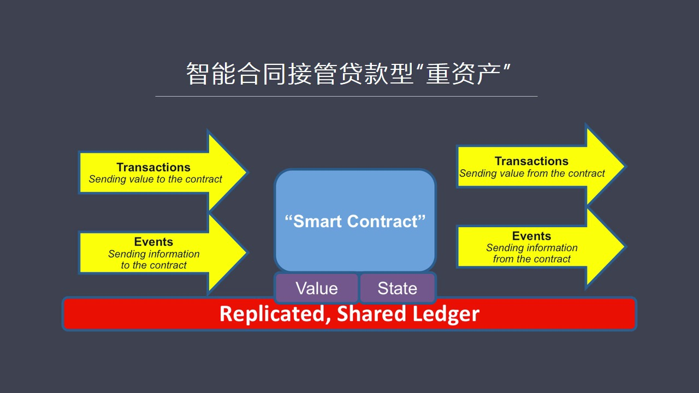

贷款那么这些贷款在商业银行中间就有点像万达所持有的那种大型物业一样这是一种典型的重资产就是万达现在的模式就是要持有土地就是开发土地然后持有物业然后靠卖房 卖楼等等来获得现金流那么在这个过程中它这个等待...

<strong>All subtitles</strong>

> 贷款那么这些贷款在商业银行中间就有点像万达所持有的那种大型物业一样这是一种典型的重资产就是万达现在的模式就是要持有土地就是开发土地然后持有物
> 业然后靠卖房 卖楼等等来获得现金流那么在这个过程中它这个等待时间就非常慢长对它来说这是一种重资产商业银行也一样商业银行所拥有的长期贷款比如说
> 按接贷款等等或者工业贷款或者一些其他的贷款这贷款的期限都非常长还有一些商品流通换件各种贷款等等这些贷款属于期限很长属于资产很重因为你一直得有
> 人去注意这个贷款跟这个贷款然后负责它的管理然后得有很多人为这个贷款在你资产贷款表上这个资产进行服务所以你要有很多人力服务于这个重资产那么未来
> 将会有一种叫智能合同的这样一种区克链技术或者叫数字货比现在已经有这套技术了来部分接管一行一些贷款比如说中小贷款还有可能就用智能合同来接管什么
> 叫智能合同呢就是交易要发生比交易A转钱给B或者A付钱给B再加上条件这作为输入我要付你比如说100万那么我要有三个条件五个条件只有当这条件满足
> 的时候这条件和交易的金额这就构成了一个智能合同那么只有当外固条件得到满足这就驻发了一个状态的变化

---

### Slide 12

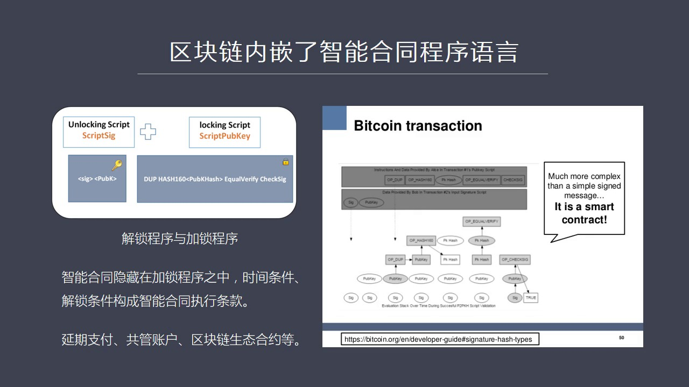

那么这个状态变化之后这个付款行为才能够完成那么这一套体系就是智能合同体系其实我们可以把整个贷款想像成一个智能管理的就是智能合同所能够管理的一种方式比如说你要贷款给萌萌萌那么你要从比如说这个在淘宝网上有...

<strong>All subtitles</strong>

> 那么这个状态变化之后这个付款行为才能够完成那么这一套体系就是智能合同体系其实我们可以把整个贷款想像成一个智能管理的就是智能合同所能够管理的一
> 种方式比如说你要贷款给萌萌萌那么你要从比如说这个在淘宝网上有一个商家它的信用也不错然后现在缺2万块钱贷款这个时候如果银行去做这个业务的话它可
> 能得有人去调查得有人去征信得有人去做风景评估等等最后决定贷款给它当然这个数我可以随便说个数也可能更大太小了银行不愿去做这个生意假如是有这样的
> 一个生意的话一个小贷款生意的话那么智能合同是完全可以满足这样的要求的也就是我要付款给你多少万那么付款人假如是从某个地址付给某个地址在这样一个
> 合同中间我可以相当于我们上线客中讲到一个加锁和解锁的概念就是我可以在我付款的这个地址上加一把锁这把锁上规定了弱感条件你只要满足这个条件你就可
> 以解锁拿到这笔钱那么加锁条件呢我可以说某某必须要取得笔钱的话你必须得有两个数字签名得有两个人因为另外一个人比如说是我银行另外一个人就是收款人
> 我们俩得共同管理这个账户那么你只有在多少多少天之内准时的完成什么什么条件然后这个钱才能够分析付给你诸如此类的这个如果是个贷款管理的话只能合同
> 是完全可以实现的所以我们可以想象在未来的央行的这套数字货币体中间或者一些其他的第三方区块链上会有大量的这样一种数字合同硬远而生而这种数字合同
> 呢实际上可以被商业银行用来管理或者生成自动生成某些贷款不需要人去干涉也不需要人去追踪这将会是商业银行的很多业务变得非常的简单这是一种模式下面
> 我们再看这个第十页这个十页我讲了一些就是上期其实我讲到的一些细节就是什么是加锁的解锁就是我们其实看到了每个交易都有两部分左边那张图就是解锁程
> 序和加锁程序这就需要我们深刻理解这个技术细节了其实你要真正把它看懂它一点也不复杂也就是在智能合同中所有条件是隐藏在加锁程序中的比如说我可以设
> 定时间条件我可以设定解锁条件我可以把这个几个东西组合在一起构成一个智能合同的执行条款比如说延期支付假如我在网上买东西这个我付款给商家但是我在
> 付款上在加锁中我让商家你必须得有你的私药才能证明你是谁才能解锁这个除了这个条件之外我还规定一个条件就是时间等待就是我要求七天之后付款我要求三
> 天以后付款不管什么样条件我可以把时间所加上就是你能够证明这笔钱属于你因为你的私药打开这个锁之后你还要等三十天以愿眠接受如果商家愿接受这个成就
> 成交了这是延期支付供管账户比如说我们经常看到有一些人投资我要投资某个项目好或者投资加入某个公司成为股东如果你想这个比如说购买成为某个公司的股
> 东你要投资那么一般来说投资会先打进一个供管账户这个供管账户等你所有条款所有的法律合同執行完了之后然后这个钱再转到公司账户上那么这个过程在互联
> 网上是可以用这个智能合同来完成的这个智能合同就是这种智能合同就是我要求解锁人就是我这个解锁程序中我会要求解锁的人必须要有两个三个 四个或者无
> 数多个每个人都必须要提供自己的数字千名都必须要有自己的私药才能解开这个账户这就要供管账户假如有一个人被信息他想把这个钱写款而逃他逃不了因为必
> 须还有第二个人同时数字千名才能提走这笔钱像这样的就是供管账户还有什么区块链的生态合约什么叫生态合约就是跟其他区块链发生关系所形成的更复杂的智
> 能合同比如说我刚才所说的某个商家向你贷款他愿意把自己的房产作为抵押当然我觉得这个方向表小他这个房产在哪儿呢他不是给我一张指质的房产证而是要一
> 托于中国所有的区块链的进化比如说现在中国已经推出了或者这个企业推出了这种全国的房地产数字区块链其实这个工作并不难完成同样的原理就用比特币的同
> 样的区块链的原理一模一样就是以后不需要到土地登记结构去登记你的房地产这个证书了这个东西完全是个数字化等于一进行数字簽名加密之后立刻就可以放到
> 网上的区块链上全国所有人在买卖房地产的时候不需要再到房管局去你直接到房地产登记的区块链上去进行交易就完了要么去更改要么去变化那么所有的原理跟
> 比特币一样加锁和结锁这个所有人你要是这个房产所有人你是在你这个区块链上你的数字化的房产正上是加了锁的如果你想把房产转移给别人你就放上这个加锁
> 程序只有当你满足加锁程序之后你才能拿走这个把这个房产正转移到你的名项也就是地址变化那么如果说你要以房产作为底在数字货币体重要进行这种智能合同
> 的话那么数字货币这个区块链会去查询房产的这个区块链然后去看它的数字货币的数字化这个房产正在不在哪是不是属于它如果属于它我就把这个合同加上一个
> 条件就是把这个房产的数字货同给我锁住如果对方三天之后没有还钱那么这个程序将自动执行去变更数字合同数字房产正的那个地址这就从底压方就转到了贷款
> 方其实就是一个简单的两个区块链之间的互相查询就能够做到这一点所以区块链技术在未来特别是在管理数字资产方面将会有巨大的发展空间可以说是未来大家
> 如果有创业的想法或者有了解未来经济方向发展动向的这种想法的话一定要重视区块链技术我们可能以后的课程中会专门讲这个话题在商业中它是有怎样的应用方式那么12月我们现在看下一页现在这个银行的亲自展模式

---

### Slide 13

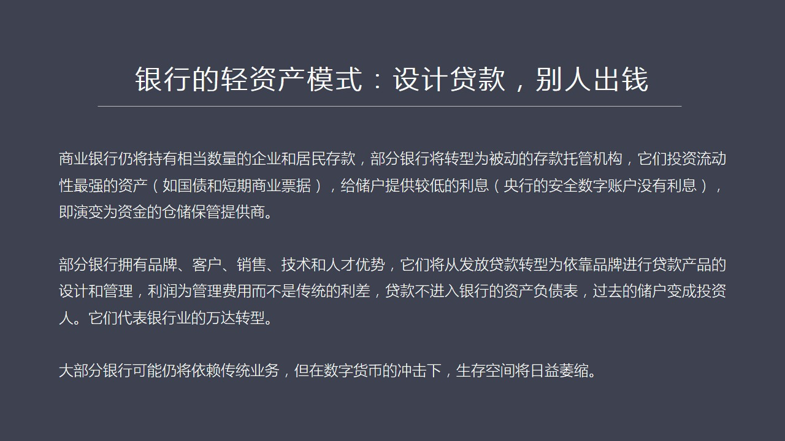

就是在受银行体系之下如果英国进行这种改革之后什么叫亲自展模式亲自展模式就是银行负责设计贷款就好像万达负责设计万达广场一样然后让别人来投资别人投资就是银行不承担这个风险我只收取管理费用能不能做到有可能因...

<strong>All subtitles</strong>

> 就是在受银行体系之下如果英国进行这种改革之后什么叫亲自展模式亲自展模式就是银行负责设计贷款就好像万达负责设计万达广场一样然后让别人来投资别人
> 投资就是银行不承担这个风险我只收取管理费用能不能做到有可能因为上一行有品牌流氏比如说工商银行它有客户的游戏有销售游戏有技术人才的游戏当然它就
> 知道哪里有一个什么大项目是个项目需要一百一资金然后我可以帮你设计这个贷款产品然后让大家来投资我不用把这个贷款了放到我自己自展负责表上这么沉重
> 而且我承担一些风险我干嘛不把它做成一个像万达那样的一个把它做成产品让别人来投让风险别人来背我就负责收管理费不就完事了吗我自展负责表上很简单我
> 不需要雇用好几十万人在这个银行中工作你会看到其实真正管钱的很多这个大型资金管理机构的管理上千亿美元资金它只有十几个人这就要亲自展公司好家伙你
> 也要管理这么多资金你得雇用好几万人那你这个所有的利润都被人工成本给吃光了所以亲自展公司一定是走这样一种设收管收取管理费设计产品这条路所以很多
> 银行是有可能走上这条路的当然在受银行体系上还有些银行就逐渐的变成了一个纯粹的资金管理就是如果老百姓把钱全部存在央行的受责货中虽然很好还安全但
> 是没有利息这个时候有一些银行专门提供我就是资金管理把钱存在我这我保证我保证我投的都是一些安全的产品比如说国代和短期商业票剧我给你一点利息但是
> 你放到我这儿几乎是同样安全因为我的经营模式就是不冒任何风险不做贷款业务那么还有一些大盆银行可能它就没有转型过来还是像传统银行那样去做放贷但是
> 你肯定争不过因为你的储蓄会转移同时这个由于这个数字货币的冲击和竞争你的这个很多东西会转移另外Smart和统就是所谓智能和统在线上在互联网进一
> 种在不断的正多年的资产因为它这个更简单所以它能够账出来的利润会更多你无法跟着竞争在这样两面阶级之下它的生存空间将会越来越伟缩好我们再看第十三页下页现在我们讲中国的数字货币顶层设计

---

### Slide 14

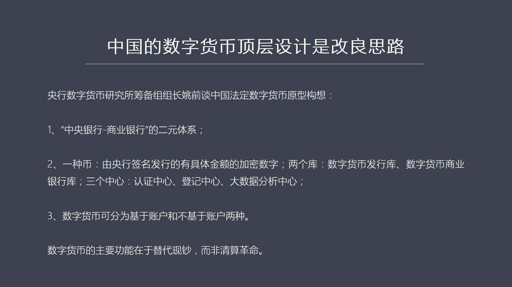

在我看来用一句话概括是一种改良的思路我看了很多央行这方面数字货币的这种谈话采访也好他们发表文章也好基本上可以得到从他们的原话中你可以得到三个结论就是他们用的是中国的数字货币的原型购价是中央银行加商银行...

<strong>All subtitles</strong>

> 在我看来用一句话概括是一种改良的思路我看了很多央行这方面数字货币的这种谈话采访也好他们发表文章也好基本上可以得到从他们的原话中你可以得到三个
> 结论就是他们用的是中国的数字货币的原型购价是中央银行加商银行的二元体系刚才我说了这跟英国的数字货币是完全不一样的中国搞的中央银行加商银行这是
> 胖银行的体系是维持现有商银银行体系由中央银行体系的这样的一种制度也就是它央这个央妈它是商银银行的亲妈而中央银行其实现在不太愿意带着互联网这帮
> 草莽银行玩所以在他们心目中什么互联网第三方之父这都是草扣正规军迪系还是商银银行所以他们搞出来的货币思路一定是要照顾商银行体系的但是这样的思路
> 在我看来跟英国刚才革命进行思路是有本质差别的或者可以说是根本上不同的二元思路在我看来这个是一个最有可能也就是他们公就是央行现在公开发布了一个
> 方案这是最有可能成型的一个方案第二个特点就是一种壁两个库三个中心一种壁就是中央银行千发的数字货币进行数字千名然后两个库就是数字货币的发行库然
> 后商银银行的数字银行库三个中心正正的登记和大数据从这个体系中间我们可以感觉到这个这套体系是一个不同银行不同于英国银行搞的这个数字货币的一种思
> 路第三点就是数字货币是分成鸡鱼账户和不鸡鱼账户这句话怎么来理解鸡鱼账户就是鸡鱼银行账户的一种方式不鸡鱼账户区块链那叫不鸡鱼账户的好这是两种根
> 本不同的思路英国央行所搞的RSCOIN在我看来是不鸡鱼账户的它是靠区算区块链进行清算的不是依赖现有商银行体系的但中国由于你搞是二元的体系所以
> 你的数字货币就一定要跟银行账户够否则这个钱很难出去很难管理所以这就是两者之间一个非常重要的差别那么一种币两个口户三个东西在我看来这是一个非常
> 非常模拟现在货币指币印刷出库进库然后流通最后回龙是完全在模拟指币运作周期的这么一种数字货币这样的设计在我看来这跟未来真正的数字货币进往方向是
> 完全不一样的这可以说是一种改良我们可以说是一种改良但是这不是朝数字经济过渡的这样一种道路所以在我看来他们的主要思路并不是要进行一种数字革命而
> 是为了替代现朝就是中国的数字货币主要目的是为了取代逐步取代流通中了所有的人币现朝这个可能是他真正想要做到了目的而银行商业银行体系还是一个肥胖
> 的银行体系这点不会变那么在整个网络交易进行过程之中它一定是采取要联合商业银行来做来做这样新的商业圈这样的一个思路所以它是一种改良而不是一个革
> 命其中最主要是体现在这个清算上清算仍然是要依赖银行账和的清算那么我们看一下也第十四也如果从银行现在已经公布的这些框架图来看

---

### Slide 15

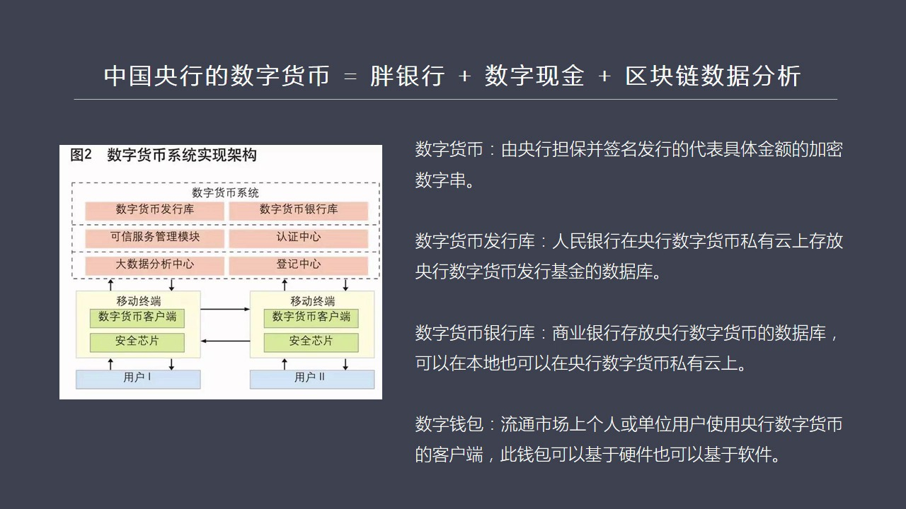

我可以总结出来几点就是中国银行的数字货币等于胖银行加上数字现金就是替代现超再加上区块链的数据分析这话怎么来理解在中国清算数字货币的清算仍然是靠银行进行清算的那么在银国从它设计思路来看而是抗银的设计思路...

<strong>All subtitles</strong>

> 我可以总结出来几点就是中国银行的数字货币等于胖银行加上数字现金就是替代现超再加上区块链的数据分析这话怎么来理解在中国清算数字货币的清算仍然是
> 靠银行进行清算的那么在银国从它设计思路来看而是抗银的设计思路肯定是靠区块链那么中国也会有区块链就是我们看到的登记中心它会进行数字分析等等它所
> 做的就是认证数字认证中心登记中心和大数据分析中心这个大数据分析中心主要是繁洗钱支付行为分析监控等等那么这个大数据分析中心它的意托是吗我相信可
> 能就是区块链也就是中国的数字货币会记录中间每一个交易的细节然后把他们记录在区块链上所以这个区块链的主要功能不是进行清算的

---

### Slide 16

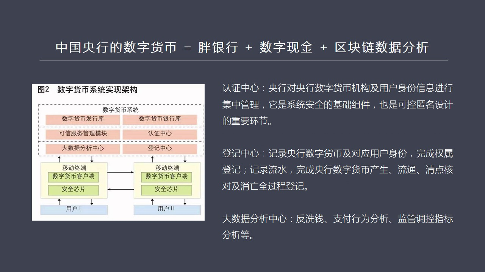

是用来记录的记录为了做什么为了进行大数据分析它是个分析用的区块链而不是一个清算用的区块链这中间有本质差别搞清楚这些原理之后我们再看第十五页十五页就是扬航现在公开透露出了一些信息因为他们不像英国RSCO...

<strong>All subtitles</strong>

> 是用来记录的记录为了做什么为了进行大数据分析它是个分析用的区块链而不是一个清算用的区块链这中间有本质差别搞清楚这些原理之后我们再看第十五页十
> 五页就是扬航现在公开透露出了一些信息因为他们不像英国RSCO他有白皮书也有继续上了很多文档所以你可以直接读中国虽然在搞说错语不知道他们到底是
> 怎么想的因为没有出任何的这方面的或者我没有找到任何这方面的白皮书或者公开的资料公开的这种技术标准和解决方案没有所以只能从资源片以后你去推测他
> 们到底的想什么比如说摇钱我们刚所说的这个现在籌备数字货币这个组长他在4月24号去年2016年他们在做分析的时候他是在那个发言中讲到的

---

### Slide 17

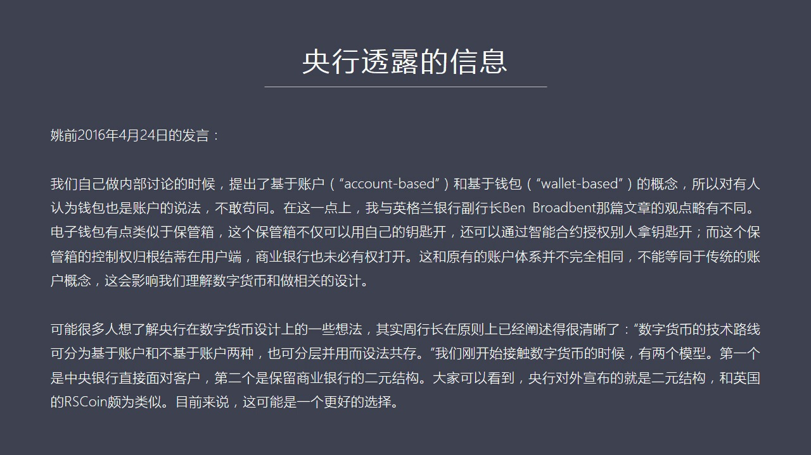

当时他们出现的内部讨论提出了基于账户和基于钱包两个概念所以当时有人认为数字钱包也是一种账户他是不敢狗同这种说法的在这点上原来副行长这个本Broadband那片文章是关键是不同的那片文章就是我刚才说的那...

<strong>All subtitles</strong>

> 当时他们出现的内部讨论提出了基于账户和基于钱包两个概念所以当时有人认为数字钱包也是一种账户他是不敢狗同这种说法的在这点上原来副行长这个本Br
> oadband那片文章是关键是不同的那片文章就是我刚才说的那片文章提出三个重要问题的那个文章从他的这段话中我们可以推测出来就是他们不太愿意使
> 用Broadband的那个所谓的基于数字钱包这样的一个概念数字钱包是什么概念数字钱包在后面这段话讲了数字钱包就像一个保管箱这个保管箱不仅可以
> 用自己钥匙开还可以通过智能合约的方式授权别人那钥匙来开就像我刚才所说的那个例子那些例子一样但是这个保管箱的控制权归根解体是在用户端上一银行未
> 必有全打开当然它打不开这肯原来的账户体系并不相同它指着原来的账户体系就是现在的银行账户体系不能等同于传统银行账户不能等同于传统的账户概念这会
> 影响我们理解数字货币和相关的设计从这段话中我们可以看到它是不认同这个银行本 Broadband在这点上的重要看法这有本质的差别刚才我已经说到
> 本 Broadband提出的是趋快链轻算而这个钥匙它所代表的是一个银行账户轻算这是有天上之别这两个关键是水火水火平洋的有根本性的区别所以中国
> 从他们这个说法来看我可以看出他们非常不喜欢基于钱包这个概念而喜欢或者倾向于基于账户这个是从它这段表达上一个得到了一个明确的一种感受当然我这个
> 所做的一切都是推测如果哪一天他们出了技术文件出了白批书我们看到技术文档马上就知道他是怎么做的了我们现在做了一切仅仅是推测不能作为结论因为我们
> 掌握的信息非常有限他在第二段中讲到了周小川长就央行行长周小川他对数字货币的理解到了也一样数字货币的技术路线可以分为基于账户和布级与账户两种其
> 实在我看来翻译一下就是基于传统的银行账户还是基于区块链这句话是这个意思然后他说也可以分层并用和设法共存我认为设法共存在他们的脑子面就是区块链
> 可以用如果我们作为继账而不是用于清算来进行大数据分析的话那么他有价值清算是他做孩儿得有我们上银行中央银行的体系联合来做这是传统我们不能繞开这
> 套系统令搞一套这个是我的一个重要的一种感觉那么我们刚开始就是他在后面讲到就是要先讲到刚开始接触数字货币的时候有两个模型一个中央银行直接面对客
> 户什么叫中央银行直接面对客户那当然就是我所说的中央银行给所有老百姓直接开数字货币这个账户这就是托币计划托币建议和这个银行未来可能会走这一条路
> 第二个是保留商业银行的二元结构大家可以看到商业银行对外宣布是二元结构所以可以看到他们并没有准备去搞这个中央银行直接面对普通老百姓所以从这里可
> 以判断除他们跟银行走跟这个英国银行走的是完全不同的道路两者不能混没一坛第16业第16业我们就说到分析了这些之后中国的数字货币到底长得啥样这个
> 数字货币到底什么样我看了很多文章就没有一片文章把这个东西给我讲清楚到底什么是样的数字货币数字货币是个什么样的东西它如果是一个是一个央行加密的
> 一个纹本那么这个纹本看起来应该是个什么格式我在这里就做一个推测就是根据央行他们自己设计的这样一个表头一个表的一个头我们可以大致做出一些分析

---

### Slide 18

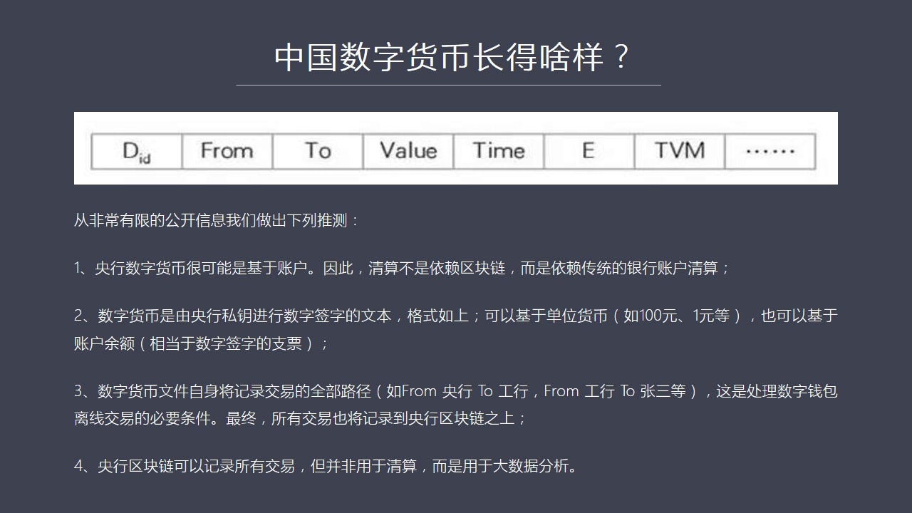

这些表头什么的就是央行的数字货币第一是很可能基于账户就是基于银行挺细而不是基于区块链不是基于应来银行准备走了一条路所以清算不是依赖区块链而是依赖传统的银行清算银行账户清算这是第1个结论第2个结论就是数...

<strong>All subtitles</strong>

> 这些表头什么的就是央行的数字货币第一是很可能基于账户就是基于银行挺细而不是基于区块链不是基于应来银行准备走了一条路所以清算不是依赖区块链而是
> 依赖传统的银行清算银行账户清算这是第1个结论第2个结论就是数字货币肯定是由央行用它自己的思要进行数字签名的一种纹本文件数字签名我觉得上当各种
> 我专门讲过央行有思要和公要公要是要让大家验证的思要是它进行加密的就是进行数字签名的这个思要签的就是我上面所列出了这个表头上整个这个表头上所代
> 表这个信息那么它的格式就像上面的如果我们来看底下的ID就是Digital Currency的ID就是没比前会有一个单独的Unique的就是独
> 特的这么一个ID这个ID怎么得到呢我认为肯定是用哈锡算法对这个文件进行哈锡算法得穿这个哈锡纸就是这个ID纸第2from to这什么第2和第3
> 什么概念就是从谁转给谁第3当是金额第4是时间第5和第6拆不出来因为没有公布任何技术细节所以你无法去进行猜测但是就它们这个对话中你可以得到一个
> 概念就是什么呢它这个格式中间有一个是标志向这个标志向来确定整个这个货币是一种什么样的货币是基于货币单元的比如说圆脚分是基于这样的一个模式还是
> 基于一种账户一个它这是可以通过这个表头上的某一项进行调整的什么叫数字签名的比如说什么叫基于这个货币单位货币的这样一个文本文件呢比如说我们现在
> 流通的人民币如果它是为了取代现金的话有百元有五十元十元什么然后有这个就是这个圆脚分等等那么每一张流通路的货币一百元我可以把它做成一张数字货币
> 这张数字货币的ID有了然后从谁到谁呢这个地方就是我一会要讲到的就是从中央银行比如说给工商银行再从工商银行给某个人再从每个人再转到另外一个人这
> 是要做记录的这是录竞记录Value这是价值十一百元这当然看好了一些发生时间没比转账发生的时间TimeStamp时间戳然后这一套东西再用央行撕
> 药一千名这就保证了这一张数字文件如果我们接到之后然后用央行公布的公要进行一解读就确认这确实是央行发出来的一百元超票是数字的收到这个文件了然后
> 这个文件可能下载在工商银行可能到了工商银行然后到工商银行去管机上去前手这个数字文件就转到了我的钱包里数字钱包里那么工商银行有可能会在这个Fr
> om,From和To中间再做第二笔记录第二笔记录就是从工商银行转给了客户张三时间是几月几号几点几分然后张三的这个数字钱包中就拥有了这样一个由
> 央行数字千名的一百元的数字货币当他碰到了李四两人用二维马金转账的时候这叫离线交易就是他并不一定要处在跟央行连通状的之下他可以离线那么这个交易
> 就是把这个数字文件转给了李四李四然后用央行的工要一验证原来确实是央行这个发行了一百元人民币好 我收到了那么在张三转账这个这边和李四这边恐怕都
> 要在From和To这个地方这个进行记录就是From张三To李四这个要做一笔交易记录那么李四最后再通过交税通过其他方式又把这一百元还给了财政部
> 财政部最后又把这一百元还给了银行资金回笼了最后央行一看原来这张货币一百元超票从刘初央行库一直到这个商业银行的货币库再到了某一个私人手上再转到
> 了李四再经过什么一系列通道最后回到我手上这个交易记录中FromTo中记录的整个这个货币的生命中其所全部发生的交易信息发生了期间几分从谁到谁从
> 谁到谁好 进行信息最终也会存储到央行那个大的区块链上这个就作为央行反弹取于反省钱局或者经济调查局他们要进行各种各样数据分析好 你们去区块链上
> 调查吧这就是数据分析但是这所有的资金评算呢当然是在商银行库和中央银行库之间进行商银行也是你现在我有个数字货币库然后每个人当然央行这个商银行会
> 有每个人的存款账户那么你账上有多少指币的金额有多少数字货币的金额我可以做记录所以你的调整是可以通过这个方式来数字货币加就是数字货币转账那就调
> 整数字货币账或者数字等等那么还有一种方式呢就是基于账户鱼额基于账户鱼额在我理解就好比是一个数字签名的支票就是电子画的支票然后用你的撕药进行签
> 名那么当你要把钱从张三转到李斯那时候你给他的也是一个文件这个文件是用你的撕药签了名的给了李斯那么这个签转相当于也是个数字文件也是转移那么这个
> 数字货币相当于对应着调动指挥我在工商银行存在那个账户进行转账的指令这就跟美国和欧洲很多国家用的支票私人支票是一个道理你写张三写给李斯收金额一
> 百元然后李斯收到这个支票到银行一上账银行把这个支票一存其实就完成了一个指令在张三账户上解诺尔钱解颖一百元在李斯账户上加一百元这实际上是一个数
> 字化的转账指令只不过在这里又把它电子化了张三在工商银行有一万块钱账这个一万块钱的余俄他开一张支票给李斯用他的数字一千名李斯就获得了转账一百元
> 一百元的这样一种能力然后他再通过跟工商银行一连网然后这个钱就转过去了这是一种加密的数字签名的支票而已然后第三这个刚刚我已经说到数字货币文件自
> 身将记录全部的交易路径第四银行去货链可以记录所有交易但并非用于清算而是用于大数据分析好如果我们对比中国银行和英国银行的数字货币的本质我们会看
> 到中间存在的重大差异在我看来最根本的差异就是数字货币的清算方式是不同的

---

### Slide 19

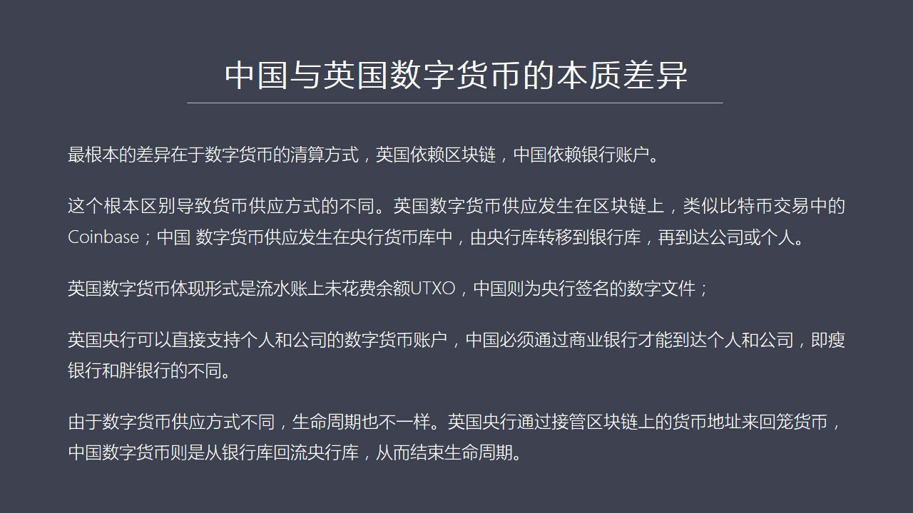

英国依赖的是去货链中国依赖的是银行账户清算这两者是有本账区别是完全不同的两回事正是由于根本区别导致货币供应的方式是不同的英国的数字货币供应是发生在去货链上类似比特币交易中的库银贝斯它在每个交易模块上第...

<strong>All subtitles</strong>

> 英国依赖的是去货链中国依赖的是银行账户清算这两者是有本账区别是完全不同的两回事正是由于根本区别导致货币供应的方式是不同的英国的数字货币供应是
> 发生在去货链上类似比特币交易中的库银贝斯它在每个交易模块上第一个比特币上就是库银贝斯然后挖矿产生的金额首先给交易那么英国数字货币供应就是一个
> 类似的交易块在每个块上发生或者在每个交易中发生它是英国的货币供应是发生在去货链之上的中国的货币供应是发生在央行的货币库中比如说我现在生成一百
> 亿的数字货币好我自己在数字库中就生成了然后商银行需要我就把这笔钱转一个商银行然后它是通过商银行再到达工人工私和个人所以这个是货币供应方式的不
> 同还有一个第三点不同就是英国的数字货币体现的是流水账上卫花费余额的UTXO就是AnspendingAnspendingTransaction
>  Output就是卫花的余额上这个课我们讲到它是要把所有区别链进行一个分析把每个地址没有花的余额全部离家在一起那个数额也就是体现在你数字前包
> 上那个数额就是这个东西英国数字货币体现的形式就是区别链上的某一个卫花账户的余额这个某个地址上的卫花账户余额中国呢它体现的是央行千名数字千名的
> 文件数字文件这个文件可能是百元超票可能是一元超票后来一份钱超票无所谓它是一个文件那么第四个不同是英国央行可以直接支持个人和公司的数字货币账户
> 未来央行可能几千万人每个人在央行都有一个自己的账户所有人在转账实际上是在央行之间情转账或者在央行提供了一个最安全的货币的保护的地方中国现在货
> 币供应仍然要通过上银行才能到达公司和个人这两者之间差别就是受银行和胖银行的不同在英国未来可能是受银行大清起到胖银行越来越少在中国呢主要还是大
> 胖子举多受银行可能骗上最后一点不同就是由于数字货币供应方式不同生命周期也不一样英国央行如果要想回收货币它直接在区块链中通过比如说交税张三把税
> 交给英国政府英国政府最后跟央行之间那么央行相当于把张三账户上那个数字货币的地址用自己的地址来加以替代就是我把这个地址接管了这个货币相当于回龙
> 了而中国呢数字货币必须要从张三这个数字货币要留给李四李四在留进财政部财政部在留进央行库这才完成了货币回龙所以呢这个是这个两种数字货币的本质差
> 异为什么选中国英国其实加拿大还有很多国家都在试因为我觉得这两种方式是非常具有代表性的中国是代表了一种改良思路完全严用现有的银行商业银行体系和
> 中央银行体系走得是一种传统之路英国做得是一种比较革命性的突变性的这种道路两者最终结果就是我相信如果中国这个数字货币推进下去的话非常有可能逐步
> 取来现金当然这已经是个巨大进步了您取代现金之后你的精确的管理能力这个支付的因为银行账户这是可以查询的如果私人的资金的流动也可以查询的话免税大
> 家都别想了同时交易中的每一笔交易也能实现有记录这样的话货币政策可以相当准确这可以达到跟英国类似的这样的一种程度但是呢这个英国还是不同的英国这
> 条路走下去它是创造了一个全新的不同的一个商业生态这个生态是区块链的而不是银行账户的这个是两者一个本质性的区别关于这两者这本质区别会对未来数字
> 经济的发展整个未来经济这个发展这个框架会造成什么样的影响我想向下一堂课吧我们专门在讲区块链技术它的巨大的商业的前级和这套体系对于整个的实力经
> 济会发生什么样的中机和重大的影响力最后一言呢我是列出了一些参考文件

---

### Slide 20

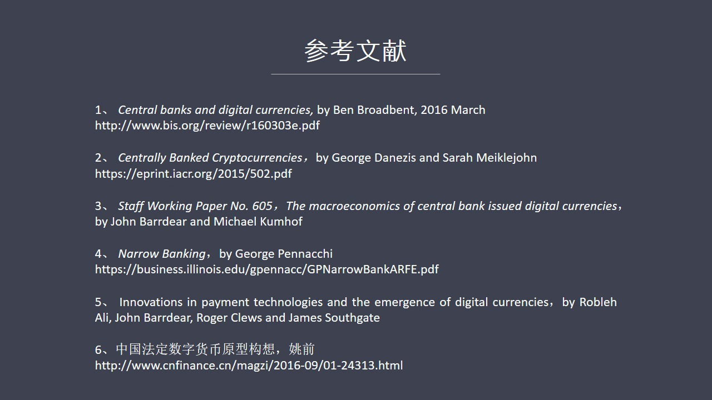

当然这只是列出了少数参考文件包括中国的这个这个我没有列出太多因为很多都是媒体的一些文章没有什么太大意义这一点这个数字货币的原型购响是它自己写的东西所以我觉得相对可信性比较高当然今天我们讲的这个课呢主要...

<strong>All subtitles</strong>

> 当然这只是列出了少数参考文件包括中国的这个这个我没有列出太多因为很多都是媒体的一些文章没有什么太大意义这一点这个数字货币的原型购响是它自己写
> 的东西所以我觉得相对可信性比较高当然今天我们讲的这个课呢主要是基于最近的一个月对数字货币的一些研究和我个人一些体会当然时间是比较短的这个跟专
> 门研究数字货币研究两年或三年的这是无法相对并论第二就是资料掌握资料公开资料太少尤其是关于中国数字货币设计是公开资料太少因为我一直带到美国也没
> 有时间去深入去了解这些技术文档或者也没找到托着人家没公共不管什么原因吧所以这堂课的内容有可能会随着比如说我接受更多信息或者找到更多的材料或者
> 一些新的想法会做相应的调整和更改好今天的课程我们先讲到这里谢谢各位收听我们下团课再见

---

### Slide 21

<strong>All subtitles</strong>

---
