# 核心课视频-007.市场的进化（一） — Clean Slide Notes

> **来源**：鸿学院核心课程  
> **幻灯片**：33 张

---

### Slide 1

市場的進化為什麼要強調這個話題呢因為市場問題是一個可以說是整個經濟學的一個最核心的部分也是我們所提到的未來國家發展總的戰略變化的一個根本的一個出發的方向就是中國未來要從世界最大的工廠轉變成世界最大的市場所以關於市場是什麼市場是怎麼運作的這些重大理論問題呢我們需要深入的探討你比如說關於市場理論我覺得存...

---

### Slide 2

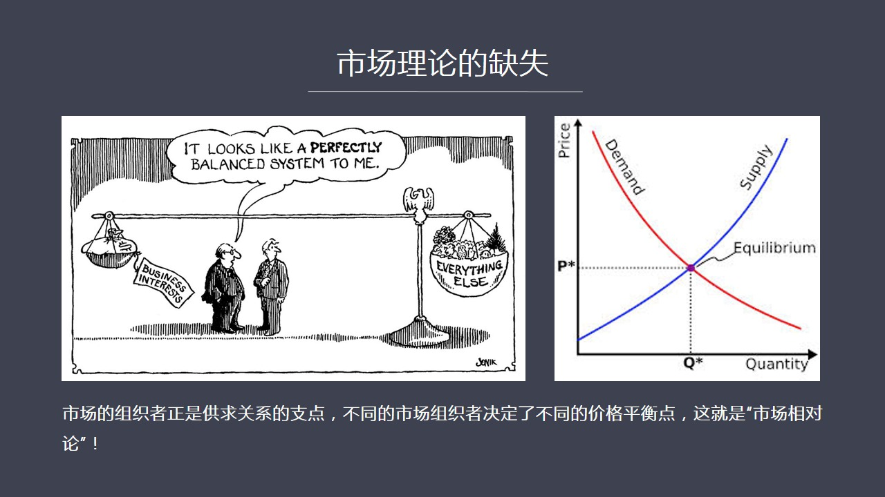

我們都知道市場理論的核心就是亞當斯密那支無形的手看不見的手那麼在價格供求關係決定的價格而在價格的指導之下所帶來的整個資源的配置它的最優化這個是可以說是經濟理論最核心的組成部分但是從這個漫畫中我們可以看到這個組成部分這個市場理論的基礎它是有缺陷的你比如說這幅漫畫上畫的是一個可以說是一個槓桿吧槓桿的左邊...

---

### Slide 3

像京東那麼這些市場平台商業的平台提供了消費者和生產者之間的交易的平台那麼這種平台的作用它就是一種市場組織者的作用那麼它的重大意義在於任何交易 任何市場的交易必須要在一個有型的空間組織架構之內才能夠發生而我們傳統的理論認為或者忽略的這點他們假設市場的交易供求關係是在虛空中發生的不需要有一個框架 不需要...

---

### Slide 4

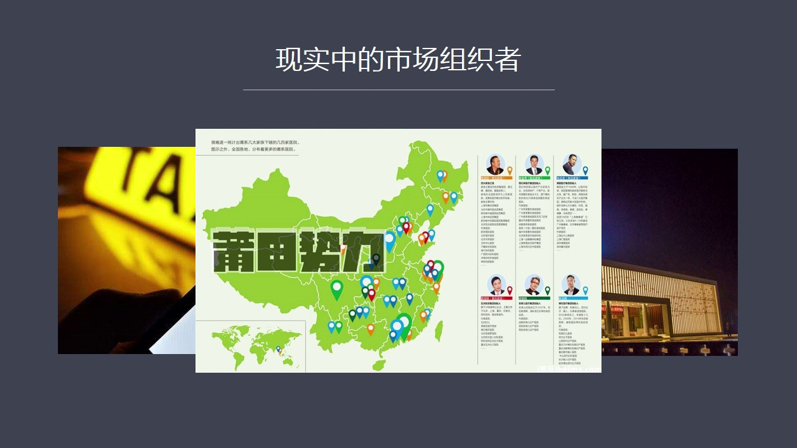

那麼這種明音醫院他在比例上佔到一定的比例之後他就對這套體系擬有一種壟斷權而這種壟斷權將影響價格 也將影響共求關係BZ打車是另外一個例子那麼現在的方式就是你要打車必須要到這個平台上才能夠有效打到車

---

### Slide 5

所以這個平台所提供的任何一種刺激鼓勵手段比如說給出車車刺激一種反點或者給他的現金那種回報都會影響到市場的共求關係也都會影響到價格你比如說還有很多其他領域像習近平中心就是東美人幾乎壟斷了中國的習近平中心其實你如果看現身或中的所有的經濟領域你會發現任何一個經濟領域都存在著一種共同的趨勢

---

### Slide 6

就是有一些人在這個市場中利用市場先機形成了某種程度的壟斷而這些人可以統成為市場的組織者那麼這些人他們的行為他們的傾向性和他們的一種指導性的這樣一種措施都會影響到整個市場的共求關係而這種市場的組織者是我們傳統這個共求關係決定價格價格是一支看不見的手最後會影響全社會的資源配置是這個整個理論體系研究過程中...

---

### Slide 7

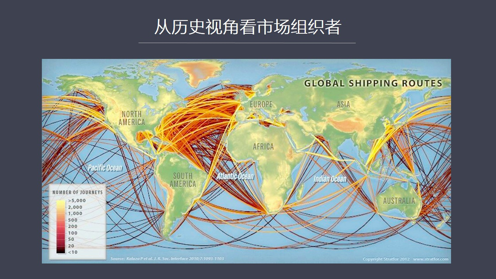

一種商業關係所形成的一個秘入之往的這樣一種市場結構那麼這種市場結構如果讓我們從現在猛然扎進去的話你會不知所錯你會搞不清楚這套體系是如何形成的也搞不清楚起根本的規律所以呢從歷史研究的方法就是追本溯源回到出發點在出發點的時候一切問題都是非常的簡單和直觀你可以很容易的看到在形成市場過程之中是哪些力量發揮的...

---

### Slide 8

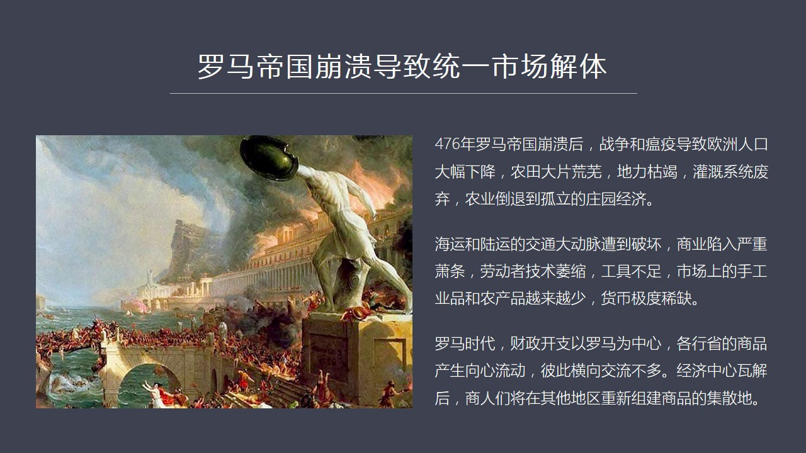

以前有個共通的市場現在由於蠻族入侵帝國崩潰了這個統一上出現了瓦解所以從那個時眼臉開始一直到現在我們來研究它的進化的陸境可以發現中間很多規律你比如說到羅馬帝國我們都知道公元476年蠻族入侵最後羅馬帝國崩潰當時的羅馬帝國出現了什麼情況呢就是戰爭還有瘟疫還有這個入侵所導致的整個歐洲出現了人口的大幅下滑當時...

---

### Slide 9

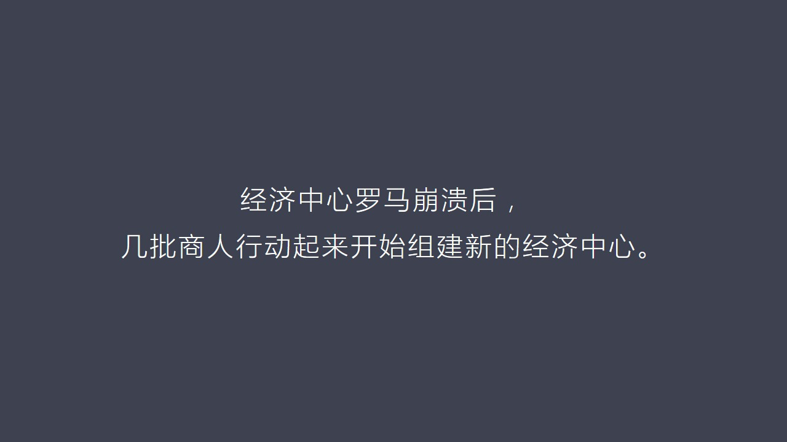

經過了兩三百年緩慢的復蘇新的商業中心才開始重新的出現那麼在新的商業中心出現的過程之中商人群體起到了非常重要的作用就是他們是市場的組織者沒有他們存在這個市場就不可能存在就是你想做商品交換都找不到地方也不知道跟誰去換所以研究羅馬帝國崩潰之後新的經濟中心的形成過程之中最需要注意的就是哪些人開始行動起來開始...

---

### Slide 10

在靈敬歐洲海岸的這一部分在英國丹麥和挪威之間所加了這個地區稱之為北海這個地區是整個歐洲經濟復新的一個發源點那麼是誰在啟動這個經濟中心呢就是福利斯蘭人福利斯蘭人他們住在哪裡呢就在大概公元七世紀的時候他們這些人主要住在蘭陰河入海的河口地區而這個河口地區最重要的一個地理特徵就是繳澤和沙漠非常的多那個地區不...

---

### Slide 11

當然說到福利斯蘭人我們要強調一下他們也是日爾曼不足之一日爾曼有很多不足他們是居住在這一地帶就是蘭陰河口這個地帶當然如果繼續往北你會看到在丹麥以南現在德國的西北角這個地區存在著什麼昂克魯薩克遜人

---

### Slide 12

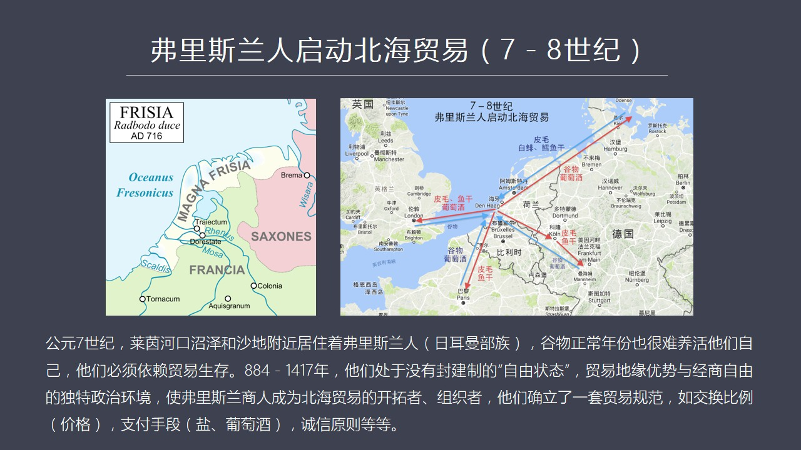

薩克遜人就是我們看到的其實在德國叫薩克遜人他們這幫人後來移民到了英國變成了昂克魯薩遜的這個祖先日爾曼人還有一些其他的分支像蘭陰河中上游的就是中游下游和中游這個地區的兩岸地區叫法蘭克人法蘭克人後來長區植入進入了法國最後建立了法蘭克的一國那麼在蘭陰河的上游中游地區還有阿拉曼尼人然後還有波根地人在另外的地...

---

### Slide 13

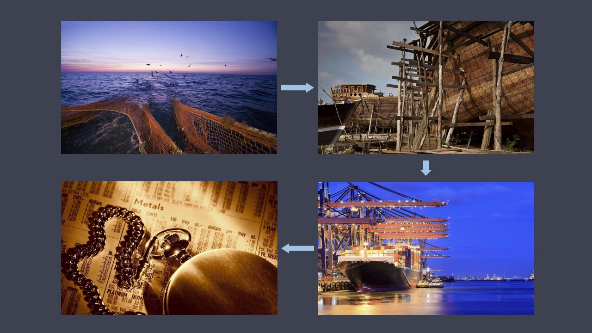

那麼你要補魚就會需要造船然後補魚越的新生帶動了造船而造船之後不僅補魚你還可以航運還可以把東西運到遠方去賣那麼這種航運最後就會演化成了商業遠洋的商業而這種商業最後又會進化成一種金融很多我們看到商業起家的這些帝國都是遵循著類似的路徑就是從補魚也刺激的造船也從造船也帶來了航運業的新生從航運業發展出了貿易網...

---

### Slide 14

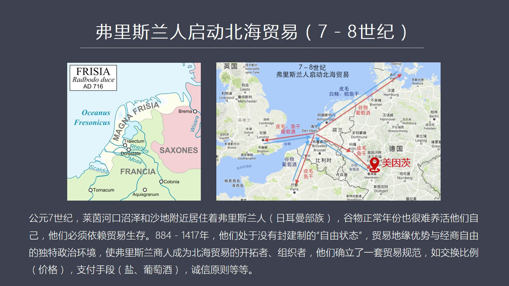

法蘭克國王東征西法建立了戰功所以那個地區也就現在荷蘭這個地區他得到那種非常非常罕見和稀有的一種特權他們這個特權指著他們那沒有封建零主是一個純粹自由狀態從公園884年一直到1417年有500多年時間福利斯蘭是沒有封建制的這在整個歐洲地區都是一個相當罕見的特例而如果我們看它的地理位置就是看我們這個右邊這...

---

### Slide 15

他們用自己的特產去交換鼓勿和葡萄酒蘭嶺蘭的葡萄酒然後再把這些換來的特產運向波羅地海地區因為波羅地海地區也存在類似問題斯坑寧納尉亞那個地區太冷所以它的糧食也不行那麼他們去糧食而且他們喜歡喝酒所以葡萄酒和鼓勿成了他們波羅地海最需要的東西而他們那些地方盛產什麼呢盛產皮毛因為天氣冷動物的皮毛它的質量非常的高...

---

### Slide 16

所以呢他們用這些東西來作為交換由福利斯蘭人把這些東西運回來他們用運回來的東西呢比如說再到英國去換東西皮毛魚肝還有這種葡萄酒在英國也可以換來鼓勿同樣他們在法國地區深入到了巴黎附近的盛丹尼斯及市這是法國最早的一個及市在那個地區可以換得法國的鼓勿和葡萄酒交換還是用他們的

---

### Slide 17

獲得了其他地區的一些特產像皮毛和魚肝來進行交換所以福利斯蘭人在公元七十幾個八十幾率先的把北海地區的貿易組織起來了他們成了組織者當然成為組織者就要確立一系列的貿易規範就是建立貿易規範你比如說交換了比例因為當時大家都沒有現金簡單說就沒有經營幣短缺貨幣金屬怎麼辦這就需要確立一個對換的關係比如說我用多少骨子...

---

### Slide 18

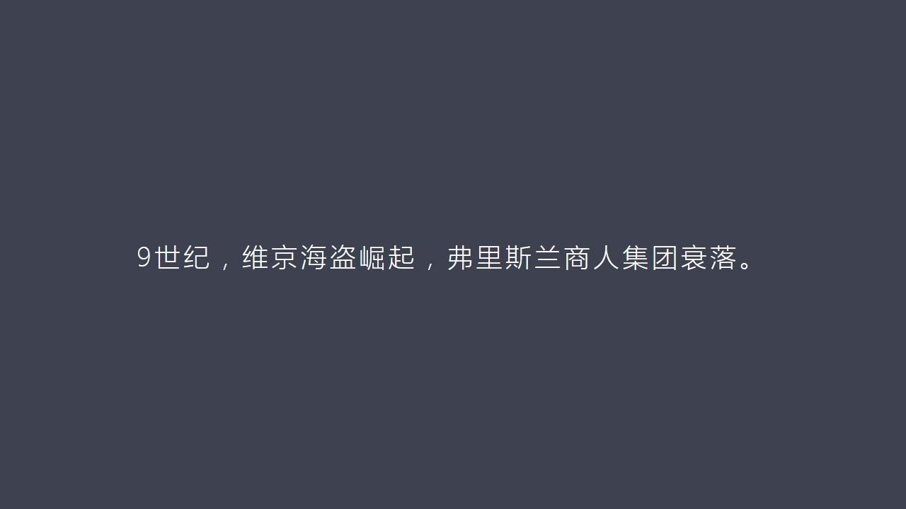

圍巾海盜我們腦子面移說的圍巾海盜自然會想到他們就打打打搶搶東西的其實不完全如此圍巾海盜除了搶東西之外除了有海盜之外還有大量的人是商人而我們在技術歷史的時候恐怕著重技出了那些破壞力特別強的對社會影響特別深遠的特別這個巨烈的這樣的行為這當然是海盜但是對社會長期影響和緩慢影響但是很深層次的影響了這些圍巾的...

---

### Slide 19

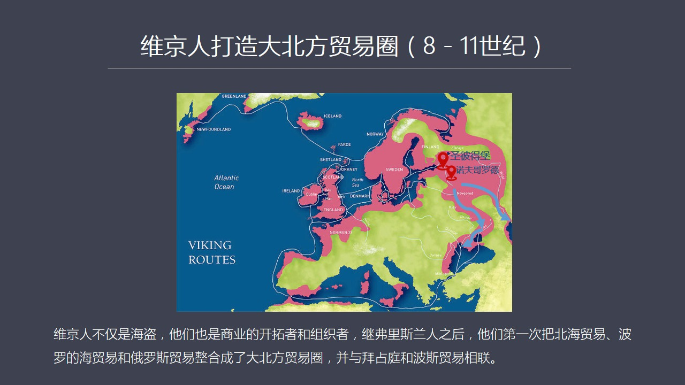

北海貿易的組織者作用而他們這種行為顯然起發了圍巾人圍巾人只是哪些人呢就是挪威丹麥瑞典也就是現在波羅地還北部的斯康尼納威亞地區的人那麼他們的可以說分成兩個部分有一部分是像西發展有一部分是像東發展像西發展的比如說納威人納威人到達了冰島然後越過冰島到達了格林蘭通過格林蘭最後到達了北美到達了加拿大地區所以立...

---

### Slide 20

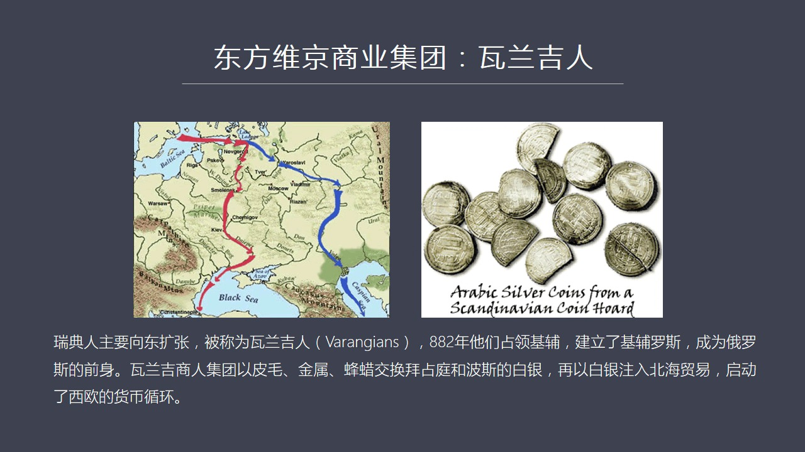

他們有什麼特點呢他們主要是向東發展向東發展如果我們看左邊這張圖這些PPT左邊這張圖紅線是代表著地捏薄荷流域我們可以看到有一支沿著地捏薄荷流域下來之後在公園882年他們佔領了幾乎建立了幾乎螺絲幾乎螺絲我們可以說是現代俄羅斯的出行也就是圍巾人或者說是瓦蘭級人瑞典人某種意義上來說是俄羅斯黃黃家的最開始的組...

---

### Slide 21

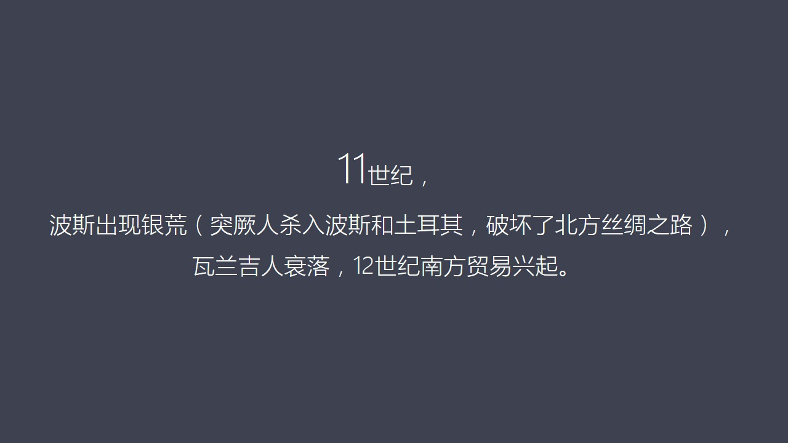

在經濟史中間並沒有直接地提到它的原因但是如果我們研究中東的歷史特別研究突決的歷史突爾奇的歷史你會發現正式在11世紀的時候突爾奇人從中亞地區已經深入到了波斯深入到了梨河流與伊拉克也前進到了突爾奇半島特別是在公園1070年前後在突爾奇就已經發就已經跟這個拜登廳爆發了大規模的衝突而且戰人勝之由於突決人的大...

---

### Slide 22

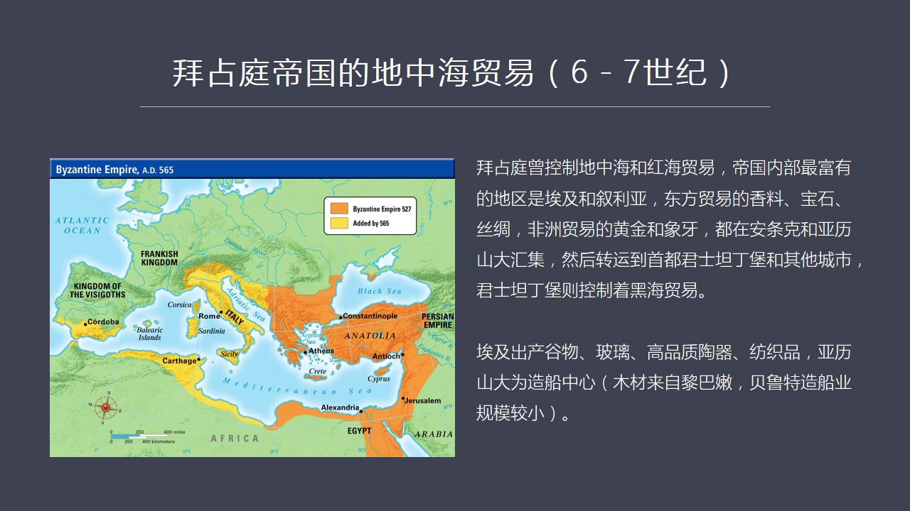

他的維持情況要比北方好一些因為這些蠻族他主要是入侵的西歐但他們對拜登庭帝國基本上沒有太多的騷擾所以拜登庭帝國這個地區他的經濟貿易仍然是比較發達的這就是在公園6到70級的時候拜登庭帝國曾經有過多晚站的中心也就是查詩丁尼大帝部分的恢復了這個羅馬帝國原有了江土當然沒有全部但是也恢復了多少我們看這張圖上你已...

---

### Slide 23

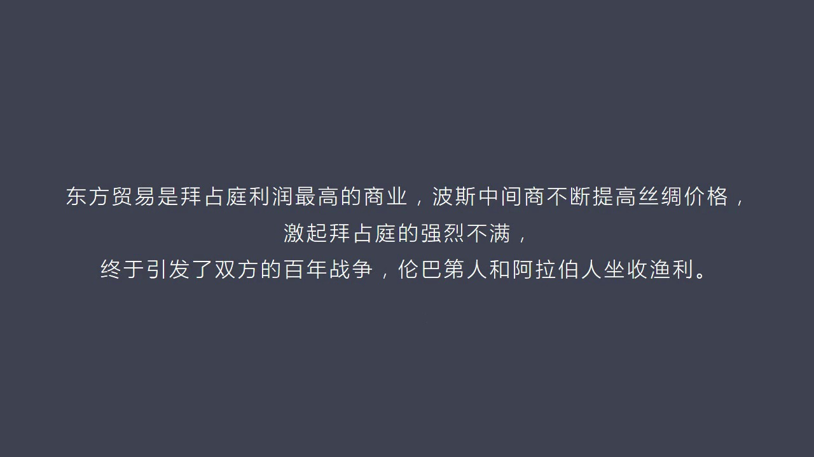

這個殘撕是怎麼盜達軍產領寶的盜達歐洲的就是查世經理那個時代這個敗戰艇帝國派波斯人作為中介到中國去把這個殘撕技術給搞到少了結果導致這個軍產領寶地區和波斯帝國都能夠養殘都能夠進行這個撕稠的製造但是他們這個撕稠製造跟中國人來說還是有差距波斯養了殘吐司太粗所以只能編地毯它不能生產衣服軍事產領寶可以生產一些高...

---

### Slide 24

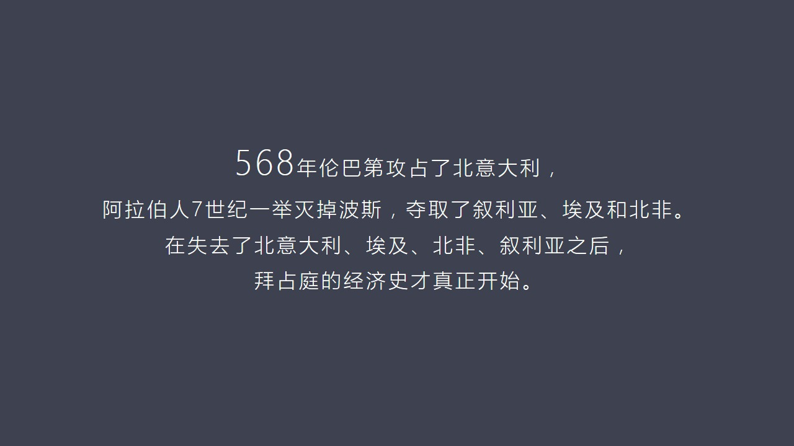

波斯帝國和拜登廷帝國主要原因就是雙方已經打了一百年打了金皮力盡國庫已經打空了這個時候阿拉伯人強大公式才能夠一舉奏效倫巴帝人在公園五百六十八年打進了一大力佔領一大力北方就是現在倫巴帝所謂倫巴帝這個地區在波河平原上亞平均上賣和二倍三賣之間那麼這一塊地方就被倫巴帝人所佔領所以拜登廷帝國喪失了埃及蓄利亞包括...

---

### Slide 25

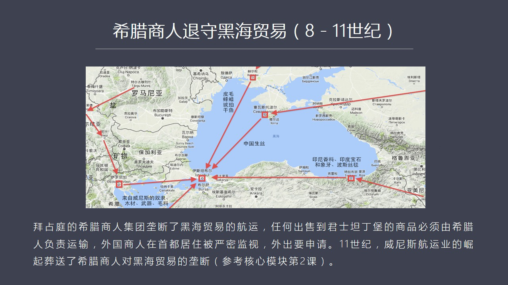

主要就是由於它喪失了其他地區之後只能壟斷黑海地區的貿易黑海地區的貿易就跟我們剛所說的瓦蘭疾人所開通的那個貿易正好相接接就接在黑海同時也是東方貿易過來的一個重要的輸扭那麼它的航運完全被希臘商人所控制希臘商人在8到11世紀由於控制了航運之後賺了很多錢這導致了軍產頂堡移度的中心就是拜登廷在這個時代還變得比...

---

### Slide 26

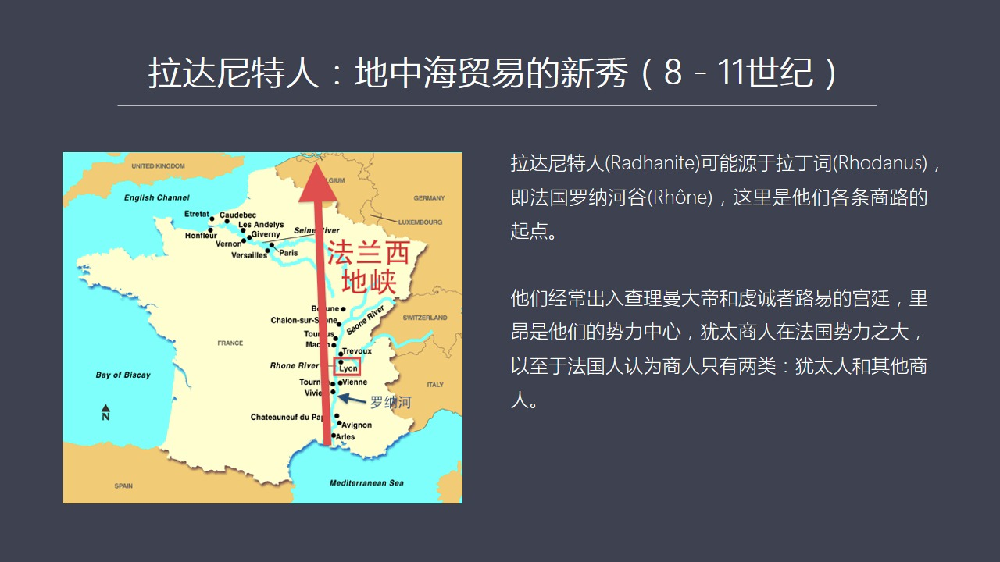

要早於維尼斯商人就在地中海地區是他們率先整合在一起的這個貿易這班人叫什麼呢叫拉達尼特人拉達尼特人是在公園8到11世紀地中海的貿易上的霸主拉達尼特人他們是猶太人而且是最早形成強大的這種地中海貿易網絡的猶太人甚至支配了全世界的貿易網絡那麼他們的起源是在哪裡呢是在法國的南部特別是以里洋為中心以羅納和走廊作...

---

### Slide 27

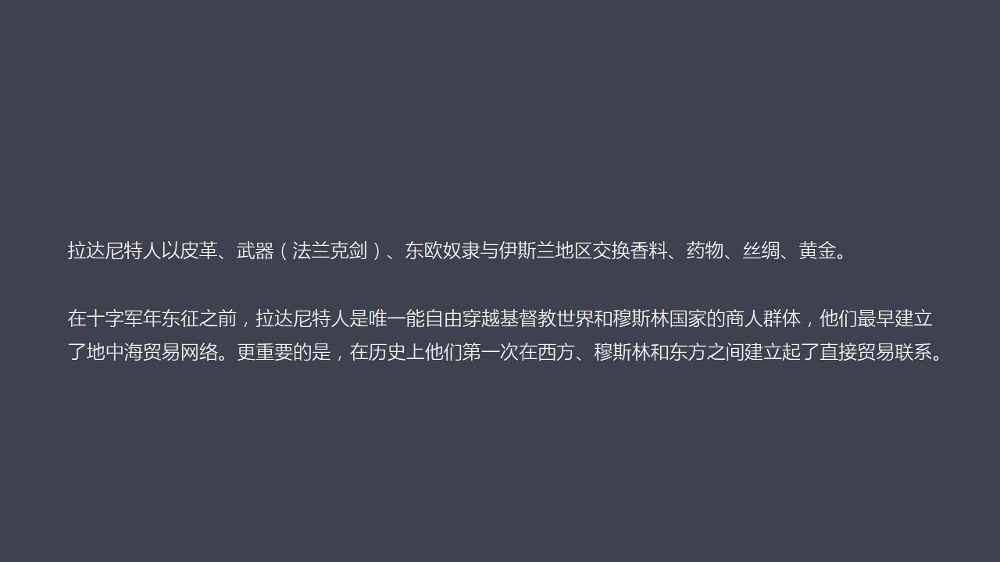

還有東歐的奴隸就是猶太人當年是非洲奴隸和東歐奴隸主要的組織者這個奴隸貿易的組織者他們用這些產品來交換伊斯蘭地區就到中東地區去交換香料還有藥物、思愁和黃金那麼在十字軍東正之前是一世級之前我們可以看到拉達尼特人是唯一能夠在穆斯林國家和在基督教國家可以自由穿越的商人群體也正是由於這個獨特性是他們建立起了航...

---

### Slide 28

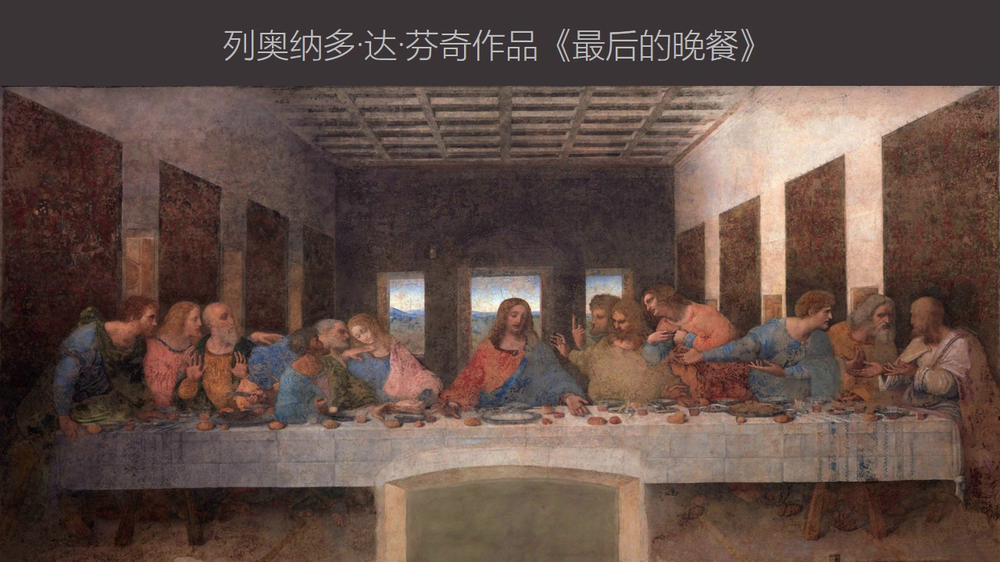

我認為這個反猶事件特別是屠殺猶探人事件出現在時尊東征的前後而不是更早期的宗教更狂熱的這個也就是羅馬帝國剛剛滅亡之後的那段事件中世紀前期為什麼沒有出現大國摩屠殺猶探人類這個原因就是因為貿易利潤使得拉達尼特人後來成了基督教世界的一個火把子這個時候來這個反猶主義興起的一個經濟上的根源那麼拉達尼特人他們最早...

---

### Slide 29

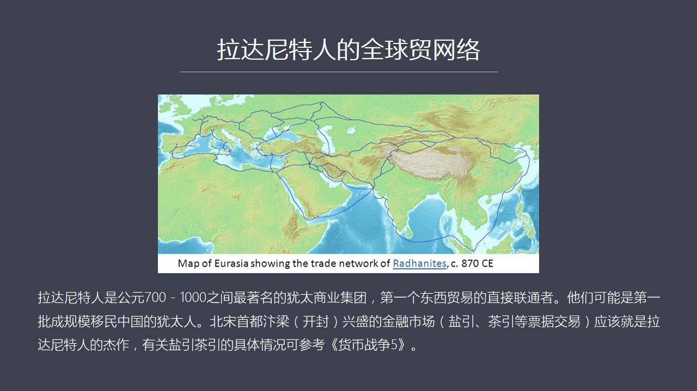

這個地圖是講了歐亞大陸上所展現出來的拉達尼特人的貿易全球網絡我們可以看到這個貿易網絡基本上涵蓋了現在我們新斯抽之路要走的主要的幹線他都有了也就是人家在公園870年就已經有這個網絡了那麼在我看來如果我們研究在中國的猶探人的歷史你會發現雖然更早從漢朝開始就有一些猶探人移民到的中國但是真正成批的成規模一居...

---

### Slide 30

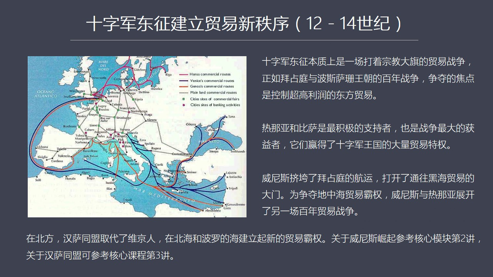

在我看了施軍東征很多人說是一場宗教戰爭在我看來它是打著宗教大旗進行立場貿易戰爭它從本身來看跟當年敗戰庭和波斯的百年戰爭沒有任何差別就是為了奪取貿易的控制權特別是主導東方貿易所獲得了巨額利潤這是讓基督教商人最季度和最嚴重的事情現在這個生意被控制在阿拉伯人手中以前是被控制在波斯人手中所以敗戰庭要跟他打現...

---

### Slide 31

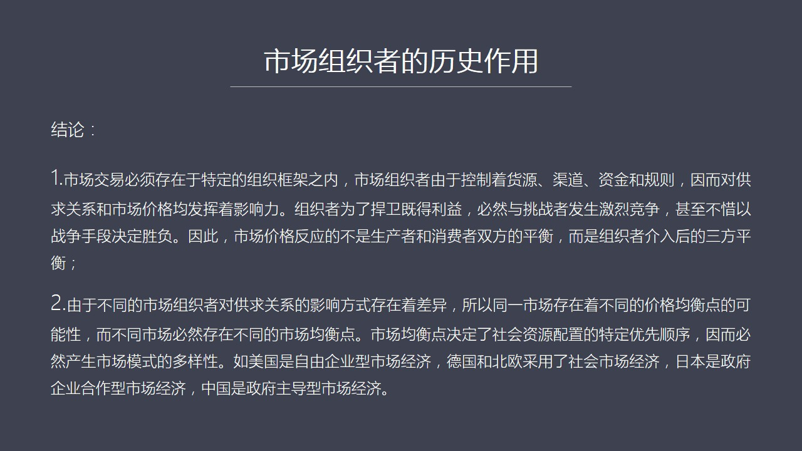

他不能在真空中發生我們現在傳統的市場理論沒有考慮到他在哪裡發生誰在組織這件事是沒有進行這方面的就在考慮到供給關係考慮到這個市場價格的過程之中沒有研究市場的支點問題那麼正式由於市場存在的組織者而組織者他控制著貨源不管是福利斯蘭人還是後面的熱納亞人為你私人他控制著貨源控制著商品的渠道控制著資金他們自己建...

---

### Slide 32

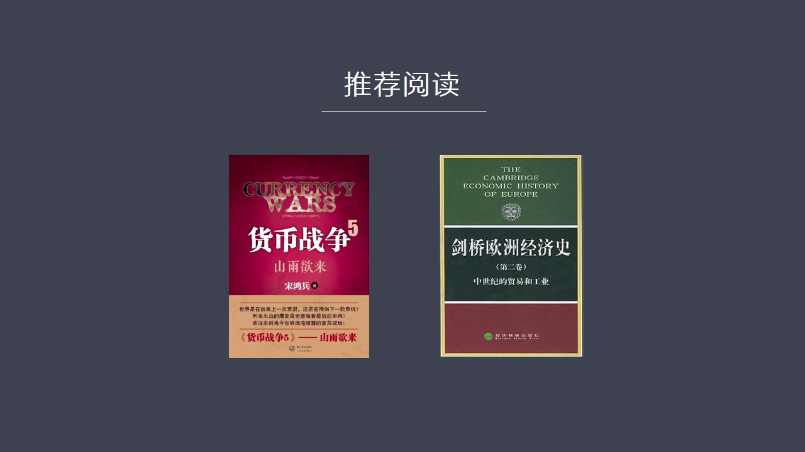

也就是講這個北松的經濟史中涉及到猶太人他們怎麼做的應該說涉及到金融市場的交易部分還有一本就是建橋歐洲經濟史它涉及到中世紀以來所發生的所有的細節包括哪種商品誰在組織它是怎麼組織原則組織方式這本書面都能找到今天我們的課程先到這裡謝謝大家

---

### Slide 33

---
