# 核心课视频-008.市场的进化（二） — Slide Notes

> **来源**：鸿学院核心课程  
> **幻灯片**：34 张

---

### Slide 1

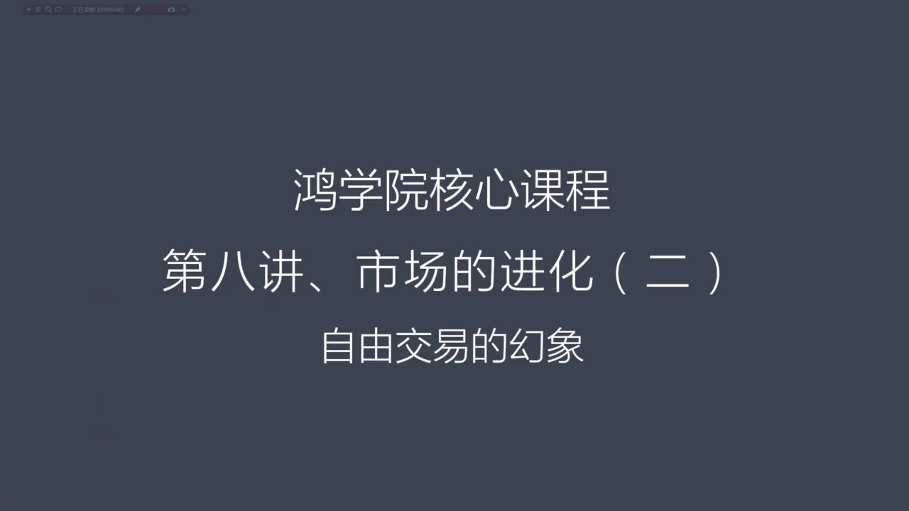

在前一奖中间我们谈到了这个市场理论它的核心就是共求平衡也就是所谓看不见的手那么在这个理论框架之中实际上它忽略了一个重要的因素就是如果我们把共求关系想象成一个杠杆的原理的话那么这个指点是被传统的理论所忽略的我称之为是市场的组织者其实前一段时间咱们国家曾经有两位经济学家一个是张文营另外一个是咱们的这个世...

<strong>Cleaned narration</strong>

> 在前一奖中间我们谈到了这个市场理论它的核心就是共求平衡也就是所谓看不见的手那么在这个理论框架之中实际上它忽略了一个重要的因素就是如果我们把共
> 求关系想象成一个杠杆的原理的话那么这个指点是被传统的理论所忽略的我称之为是市场的组织者其实前一段时间咱们国家曾经有两位经济学家一个是张文营另
> 外一个是咱们的这个世界银行的前这个经济学家林毅夫和张文营他们在讨论市场政府关系的时候我觉得他们并没有抓住市场理论这个框架中的这个缺陷就是在传
> 统理论框架中忽视了支点的位置忽视了这个支点的重要性也就是大家都没有去探讨市场组织者这个角色的存在所以你可以双方在激烈争论但是没有谈到问题的本
> 质没有抓住理论框架逻辑上的漏洞如果我们能够有效的提出在市场中间存在着一个组织者这样的一个第三方的角色也就是市场的所有交易不是由共求双方单独决
> 定而是要考虑到支点的作用就是市场组织者这其实是一个三方交易如果你把这个观点把这个忽视了组织者的概念提出来那这个问题就没有什么好讨论的剩下具体
> 需要探讨的是到底这个支点是应该向美国量由自由企业来单独承担还是像日本那样由企业政府这种财伐和政府之间的恐怕的共同承担还是像德国那样不仅是政府
> 不仅是生产者还有消费者还有整个社会共同组织这个支点还是像中国这样以政府为主导形成这个支点这就是一个具体问题所以正是由于大家没有意识到这个市场
> 理论存在这个逻辑上框架的疏忽所以这个问题争吵起来它就特别难分难解那么今天其实我想探讨的是这个西方市场理论由于你忽略了这个市场组织者这个角色这
> 就导致你在其他很多图域上和前立假社上会出现毛病你比如说今天我们要探讨就是市场理论它的另外一个重要基石自由交易这个概念同样是有问题的因为市场理论我们可以从这个PPT中第二个PPT中你可以看到

---

### Slide 2

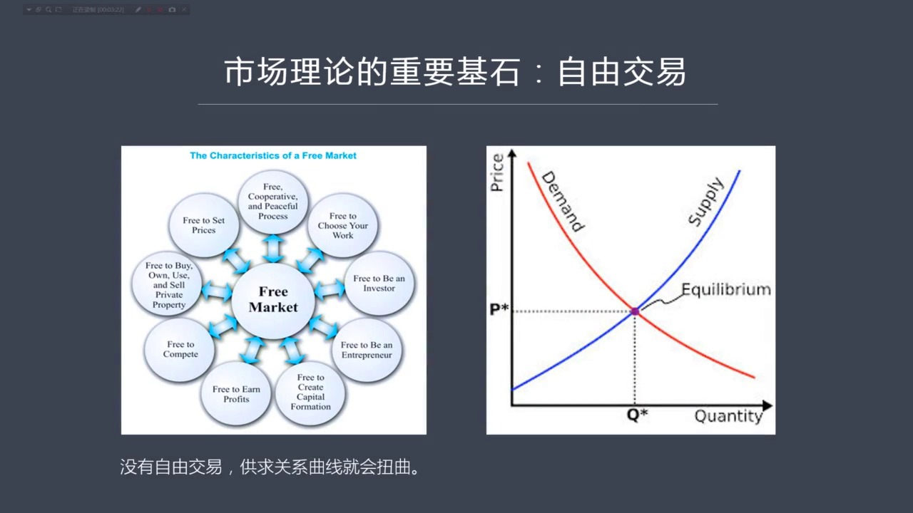

市场理论的核心一定要建立的自由交易这个概念之上也就是市场必须要是自由市场大家要自由创业自由寻找工作自由的去去尋求理论自由的去确定价格所以所有的方面都必须要自由不能被迫因为你被迫右边这个供求曲线就会弯曲它就会被扭曲那么这个市场平点就不对了所以整个市场理论的中心它要建立在一个自由交易这个基石之上这样才能...

<strong>Cleaned narration</strong>

> 市场理论的核心一定要建立的自由交易这个概念之上也就是市场必须要是自由市场大家要自由创业自由寻找工作自由的去去尋求理论自由的去确定价格所以所有
> 的方面都必须要自由不能被迫因为你被迫右边这个供求曲线就会弯曲它就会被扭曲那么这个市场平点就不对了所以整个市场理论的中心它要建立在一个自由交易
> 这个基石之上这样才能够形成一个供求关系曲线才能够确定市场的这个平点有了平点之后我们才能够得出一般均层理论的很多推论但问题是自由交易这个概念在
> 市场到底成立还是不成立这就是我们还是要回到历史就是在我看来一切经济理论都必须要源于对真实经济现象的体验和抽象你不能拍脑门靠自己的想象

---

### Slide 3

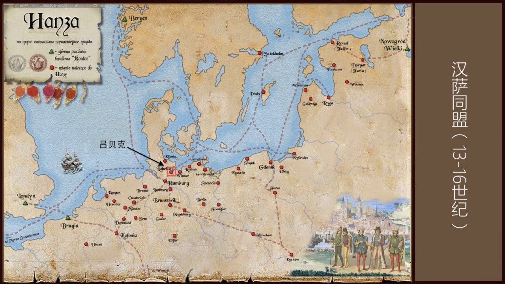

你必须要有原型你说这种自由交易出现在什么时代出现在哪个国家出现在什么样的社会条件之下你得给我举出例子来如果你举不出这个例子来那你得出这个理论的模型就显然也会有问题就像我们前一讲所探讨的那样你会忽略很多重要的关键的信息特别是组织者的信息而如果没有这个概念的话那么你所提出的这个理论框架它从原理上从罗机上...

<strong>Cleaned narration</strong>

> 你必须要有原型你说这种自由交易出现在什么时代出现在哪个国家出现在什么样的社会条件之下你得给我举出例子来如果你举不出这个例子来那你得出这个理论
> 的模型就显然也会有问题就像我们前一讲所探讨的那样你会忽略很多重要的关键的信息特别是组织者的信息而如果没有这个概念的话那么你所提出的这个理论框
> 架它从原理上从罗机上就不对或者至少说有重大缺陷所以详细研究西方市场理论的一个前提要把它搞明白最重要的一点就是你一定要去研究西方历史市场这个进
> 化过程之中所存在的所有的具体的细节你把细节研究的越明白你越能知道它的理论上在哪些地方可能会出现这种缺陷或者框架逻辑不完整的地方才能被你发现所
> 以我们今天就是探讨市场理论的第二个重要前提就是自由交易那么在历史上罗马帝国崩溃以后在真实的西方的交易系上中这个现象是不是存在我们上眼中讲到了
> 从福利斯兰人一直讲到了汉萨同盟的崛起那么汉萨同盟我们没有仔细去展开因为这一块的内容量比较大我想放在今天这个环节中具体去讲也就是我们看到罗马帝
> 国崩溃以后每个世纪的西方市场它逐步进化的状态和过程我们在所有过程中都发现了市场组织者的存在但是在我们的市场理论中却没有提出这个概念我觉得这是
> 一个重大的缺失那么今天我们看到汉萨同盟从汉萨同盟这四百年的历史就是从十三十几到十六十几那么在这四百年之中汉萨的形成发展崛起形成霸权最后它的衰
> 落从这整个了一个生命中心中间我们来观察他们是怎么影响市场中的自由交易行为的那么如果我们看这一页的汉萨地图你会发现在这张地图上实际上存在这两片
> 海域一片海域是左边的北海地区北海地区可以看到它是包围的英国还有欧洲的北海的岸边然后中间有个突出的部分这是日德的半岛就是我们现在看到的丹麦然后
> 在最北边那个是挪威那么在丹麦这个突出物形成了一个海峡这个海峡的里面就是波罗地海所以它是个梁海贸易体系北海 左边的北海和右边的波罗地海那么在这
> 个贸易它的整个的区域中间我们看到汉萨同盟它的主要分布是沿着梁海的岸边你比如说最左边这是伦敦然后最右边也就是最东边是诺福哥罗德这是宰哥罗斯境内
> 那么在这么漫长的汗线上沿着很多的自由贸易城市尤其是德意志的城市都是汉萨同盟的成员所以汉萨同盟具有着非常典型的德意志的色彩为什么我们要研究德国
> 市因为研究德国市才能理解德意志的自由城市所谓帝国自由城市是个什么概念在13到16世纪它是一种怎样的法律形态它跟封建领土之间跟神圣罗马帝国皇帝
> 之间它究竟是个什么关系可以说汉萨城市机场都是自由城市帝国自由城市他们不受任何封建领主的支配它在法律上是个实体直接效忠于神圣罗马帝国的皇帝德意
> 志的皇帝那么皇帝对他并没有太多的干扰因为所谓自由城市特许状是花钱买来的买了这个特许状之后皇帝就允许自由城市的议会包括它自由城市的市政府的体系
> 自由运作不管你是公共立法还是指法还是商业运作行政管理甚至包括军队全部由你自己说到算是一个完全独立的政治实体它只是名义上效忠于神圣罗马帝国皇帝
> 而你这个是我们理解帝国自由城市的一个理解它在汉萨中地位的一个知识的前提那么在汉萨体系中间我们会看到它的中心我用一个红色的方框明确地标准出来了
> 这个地方叫铝贝克铝贝克可以说是整个汉萨同盟的灵魂也是它同盟的首都铝贝克这个城市现在虽然很小但是它在当年可是欧洲非常强大的一个城市它的地位它的
> 财富可以说不可同仁语跟现在那么它的权力是源于什么地方还包括它为什么对汉萨同盟发挥了这么重大的作用可以说汉萨同盟离开了铝贝克它就应该说汉萨同盟
> ...

---

### Slide 4

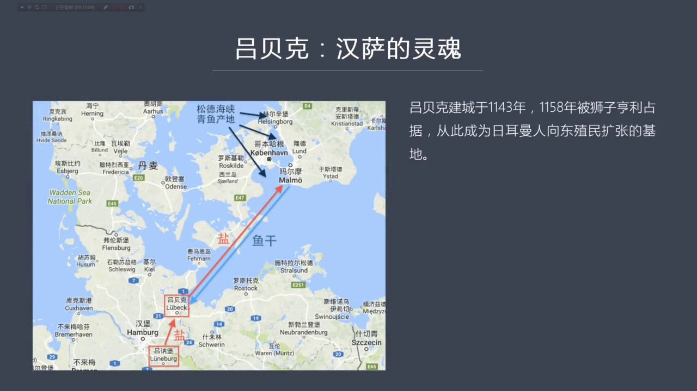

你会发现铝贝克这个位置首先它是波罗地海的港口同时它这个位置是在河边特拉夫河在旁边它的南边一点就是汉堡在它西南方向距离不远几十公里一百人应该是接近一百公里汉堡它旁边有一条大河叫一北河这条河流非常的重要应该说一北河以东的地区我们从头上看它右侧的地区从这个日德版半岛的南部吃到苏义阁这个地方开始一直到东边的...

<strong>Cleaned narration</strong>

> 你会发现铝贝克这个位置首先它是波罗地海的港口同时它这个位置是在河边特拉夫河在旁边它的南边一点就是汉堡在它西南方向距离不远几十公里一百人应该是
> 接近一百公里汉堡它旁边有一条大河叫一北河这条河流非常的重要应该说一北河以东的地区我们从头上看它右侧的地区从这个日德版半岛的南部吃到苏义阁这个
> 地方开始一直到东边的这个包括葡萝市直到立陶宛那个方向甚至更远到爱上尼亚整个这一片波罗地海南岸的海平地区基本上都是日慢人当时在十二十几开始向东
> 大扩张打败了斯拉夫人或征服了斯拉夫人之后所获得了一片新土地所以德国在立上沿着一北河它是让有一个文化上的差别一北河以西的地区是西部德国那是传统
> 一上德国发源最早的地区而一北河以东那是十二十几以后通过征服斯拉夫人所获得新的殖民地所以东边的土地一北河以东的土地它是文化特性历史传承经济结构
> 都跟西部德国有很大的差别那么当年的旅备课它建立于一一四三年也就是从这十二十二十几中期从旅备课建成了这个时代开始得一巨人也就是日慢人开始了向东
> 部的大扩张殖民扩张那么它在一一五八年被这个世子横利所战世子横利当年是一个非常在德意志地区神圣罗马帝国境内是个非常厉害的角色一个是它还有另外一个是红湖子

---

### Slide 5

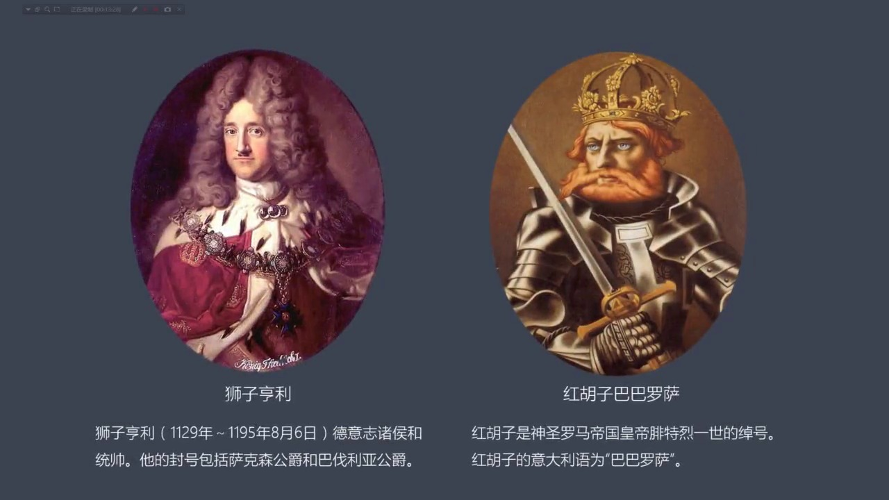

巴巴罗沙那是皇帝这个横利跟它是亲戚关系是它的表兄弟那么这两人之间这个横利对于巴巴罗沙就是有点较近的意思这个巴巴罗沙当然在德意志地上是个非常非常重要和有传奇色彩的一个皇帝应该说世子横利所战领的地区就是在萨克圣地区萨克圣地区萨克圣地区在哪里其实就在丹麦以南的这一块地方在这个地带是传统的这个萨克圣人的地区...

<strong>Cleaned narration</strong>

> 巴巴罗沙那是皇帝这个横利跟它是亲戚关系是它的表兄弟那么这两人之间这个横利对于巴巴罗沙就是有点较近的意思这个巴巴罗沙当然在德意志地上是个非常非
> 常重要和有传奇色彩的一个皇帝应该说世子横利所战领的地区就是在萨克圣地区萨克圣地区萨克圣地区在哪里其实就在丹麦以南的这一块地方在这个地带是传统
> 的这个萨克圣人的地区所以这个横利当时是萨克圣的公决一一五八年战领了旅备客之后这个地方旅备客就成了德意志成了热漫人像东直明扩张的一个重要的基地很多的这种殖民的一些计划很多它一些扩张的领军人物

---

### Slide 6

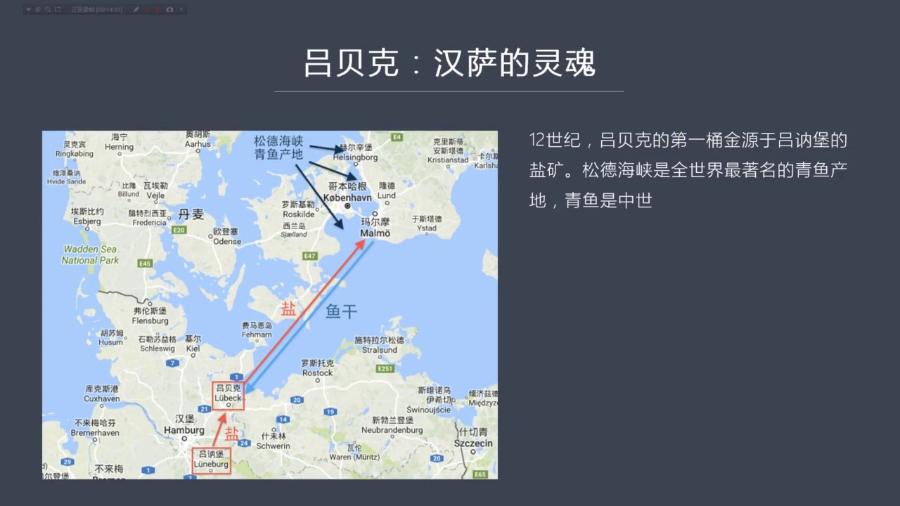

都是出自于旅备客所以这个城市在殖民史上在德国殖民史上是非常关键的一个角色那么旅备客这从殖民地一个基地怎么会变成一个后来副假天下的一个商贸中心旅备客它的第一统金就来源于这个实言就是导卖言的生意控制实言的交易为什么这么说如果我们看这个张地图的话你会看到在旅备客的南边汉宝的旁边有一个城市叫铃尔宝铃尔宝它是...

<strong>Cleaned narration</strong>

> 都是出自于旅备客所以这个城市在殖民史上在德国殖民史上是非常关键的一个角色那么旅备客这从殖民地一个基地怎么会变成一个后来副假天下的一个商贸中心
> 旅备客它的第一统金就来源于这个实言就是导卖言的生意控制实言的交易为什么这么说如果我们看这个张地图的话你会看到在旅备客的南边汉宝的旁边有一个城
> 市叫铃尔宝铃尔宝它是整个北德意志地区最大的天然的盐库所在地所以这个地方有大量的盐这个盐从路路上可以运到旅备客再从旅备客金海路运到我们看到波罗
> 地海的向丹麦还有瑞典这些地方我在地图上用红线只是出它的方向它是运到了丹麦和瑞典地区为什么要把盐运过去呢我们在上眼中专门说到过波罗地海的一个最
> 重要的它的一个经济的活动就是补余业那么在整个波罗地海乃至全世界松德海峡这个地区都是非常非常有名的轻余的主产地轻余我们也可以在欧洲可以称之为非
> 余非余和轻余是一个概念那么松德海峡我们如果从图上来看就是在丹麦它的西兰岛和瑞典之间所夹的非常窄的海峡它最短的距离最窄的地方只有四公里它的水比
> 较深大概有十斤米深十二米深到十八米深所以这个是一个非常优良的海上通道也是全世界最繁忙的海上通道之一而在海峡两侧岸边所夹的海峡中间却是轻余最好
> 的一个捕捞的基地这个轻余说到轻余它跟其他的余种不一样应该说是整个中世纪欧洲平民普通老百姓还有那些打仗的军队

---

### Slide 7

还有这些水手它们最主要的肉食的补给就是靠轻余所以轻余的补捞和轻余的这种销售它的市场在整个欧洲非常的巨大这也是波罗特海贸易中间最主要的一个大头那么你要想把波罗特海的轻余运到全欧洲火鱼肯定不行它会变为发臭的所以必须要把它腌制你要想腌制轻余大规模的腌制就必须要大量的盐这盐从哪来

<strong>Cleaned narration</strong>

> 还有这些水手它们最主要的肉食的补给就是靠轻余所以轻余的补捞和轻余的这种销售它的市场在整个欧洲非常的巨大这也是波罗特海贸易中间最主要的一个大头
> 那么你要想把波罗特海的轻余运到全欧洲火鱼肯定不行它会变为发臭的所以必须要把它腌制你要想腌制轻余大规模的腌制就必须要大量的盐这盐从哪来

---

### Slide 8

我们都知道这些地方虽然都靠海都有盐但是这么大量的去盐制这个鲜鱼必须得大规模的运盐这盐从哪来呢主要的盐就是旅乐宝的盐经过鲜鱼背客运到了这个鱼场当年这个鱼场的规模有多大如果我们看中世纪的很多描述我在这个本集课的最后可以给大家推荐一些书这中间书中描写的地方很生动

<strong>Cleaned narration</strong>

> 我们都知道这些地方虽然都靠海都有盐但是这么大量的去盐制这个鲜鱼必须得大规模的运盐这盐从哪来呢主要的盐就是旅乐宝的盐经过鲜鱼背客运到了这个鱼场
> 当年这个鱼场的规模有多大如果我们看中世纪的很多描述我在这个本集课的最后可以给大家推荐一些书这中间书中描写的地方很生动

---

### Slide 9

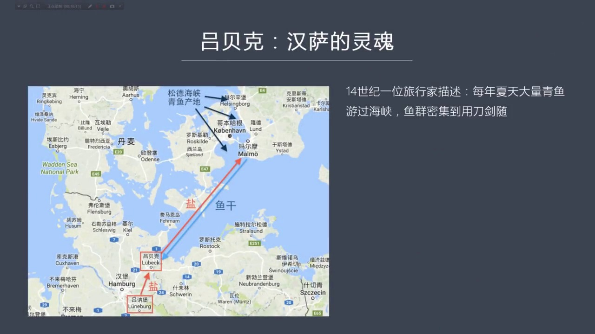

比如说14世纪的时候有一位欧洲的旅行家它经过这个海峡的时候发现它说每年夏天大量的轻余要油过这个松子海峡然后这个鱼群飞一城的密集密集到什么程度呢就是你随便拔出你的刀进来一砍就能砍着好几条轻鱼当时它说在这个海峡这么窄的海峡中间有4万艘平底船和5000艘大的鱼船再进行补鱼它统计就像大概有30多万人在下既忙...

<strong>Cleaned narration</strong>

> 比如说14世纪的时候有一位欧洲的旅行家它经过这个海峡的时候发现它说每年夏天大量的轻余要油过这个松子海峡然后这个鱼群飞一城的密集密集到什么程度
> 呢就是你随便拔出你的刀进来一砍就能砍着好几条轻鱼当时它说在这个海峡这么窄的海峡中间有4万艘平底船和5000艘大的鱼船再进行补鱼它统计就像大概
> 有30多万人在下既忙着在这个海峡之内补鱼当然你有30万人在补鱼的话那两岸有无数的城镇要给他们提供葡萄酒皮酒 面包 蔬菜还有各种各样的生活用品
> 所以这个地带是高度繁华的它的经济是高度繁荣的城镇也非常具有活力这个就是整个波洛地海最赚钱的影响力最大的一笔买卖所以轻鱼这个鱼场对波洛地海对于
> 特别是对于松德海峡来说它的商业价值太高了那么正式由于鱼卫克处在这个运言的交通的书扭这个位置上

---

### Slide 10

你只能运到鱼卫克只能通过它的尴口向外运鱼向外去运言然后把鱼钢换回来所以它就具有这一种贸易的贸易通道的弄断权那么它把鱼钢再卖给其他的地方

<strong>Cleaned narration</strong>

> 你只能运到鱼卫克只能通过它的尴口向外运鱼向外去运言然后把鱼钢换回来所以它就具有这一种贸易的贸易通道的弄断权那么它把鱼钢再卖给其他的地方

---

### Slide 11

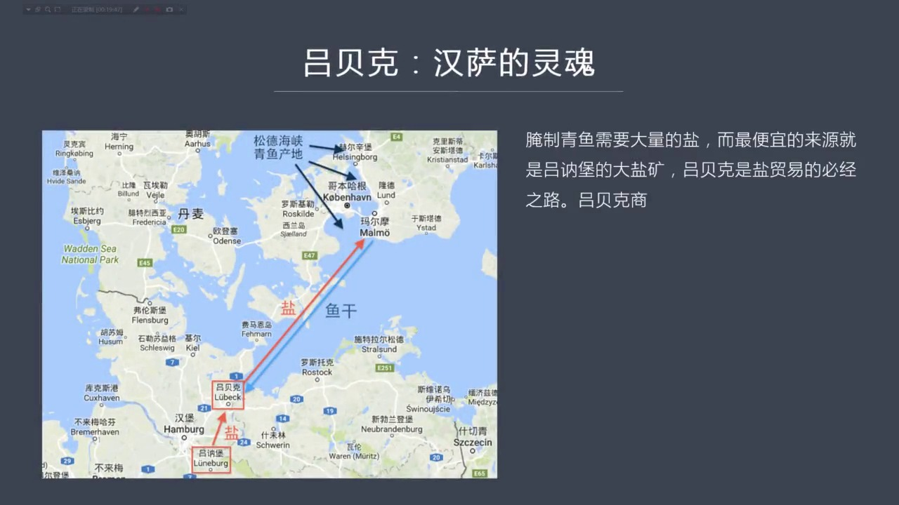

然后来获取中间的差价获取贸易利润当然这样子一来的话在整个中世纪这个由于轻鱼的市场销售非常地好所以鱼卫克就转了很多很多钱这个时候也就是我们所说的鱼卫克正到的第一组金有了第一组金之后鱼卫克就开始动脑筋因为它的做生意光运言我还能不能打扎其他的货呢这个时候我们看到整个欧洲经济也开始繁荣所以它除了运言之外这个...

<strong>Cleaned narration</strong>

> 然后来获取中间的差价获取贸易利润当然这样子一来的话在整个中世纪这个由于轻鱼的市场销售非常地好所以鱼卫克就转了很多很多钱这个时候也就是我们所说
> 的鱼卫克正到的第一组金有了第一组金之后鱼卫克就开始动脑筋因为它的做生意光运言我还能不能打扎其他的货呢这个时候我们看到整个欧洲经济也开始繁荣所
> 以它除了运言之外这个在波罗地海地区还需要还需要各种各样其他东西比如说仿制品比如说还有其他的特产都需要所以鱼卫克就开始倒腾波罗地海和北海之间的
> 贸易它从这个从应该从延交一中间获得了超过的利润之后最后拥有了垄断权之后开始琢磨怎么在其他的贸易所有的领域在两海之间所有的贸易领域中间它都想获
> 得垄断地位这个事怎么做呢所以我们可以从这个过程中看到鱼卫克一步一步从贸易的这个利润高额利润最后发展到垄断利润最后发展到整个垄断波罗地海贸易的一个全过程如果我们看下野也就是鱼卫克把这个事儿分成了几步走

---

### Slide 12

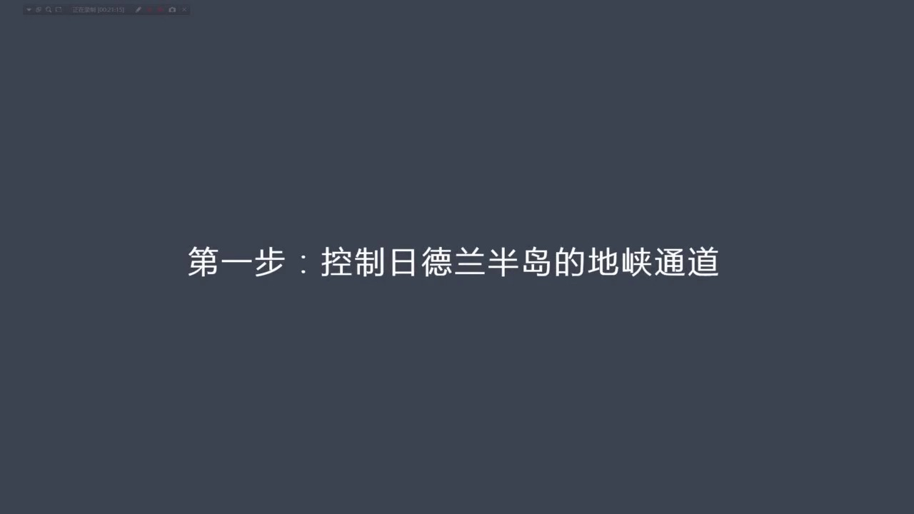

也就是说我们或者说它发展阶段吧第一步或者说叫第一阶段就是你要想垄断波罗地海的全部贸易以秀首先必须要控制贸易通道那么这个控制贸易通道如果我们来看这个匹匹中间的贸易通道的关系图我们可以看中间这个地图从这个地图上我们可以看到从北海到波罗地海之间

<strong>Cleaned narration</strong>

> 也就是说我们或者说它发展阶段吧第一步或者说叫第一阶段就是你要想垄断波罗地海的全部贸易以秀首先必须要控制贸易通道那么这个控制贸易通道如果我们来
> 看这个匹匹中间的贸易通道的关系图我们可以看中间这个地图从这个地图上我们可以看到从北海到波罗地海之间

---

### Slide 13

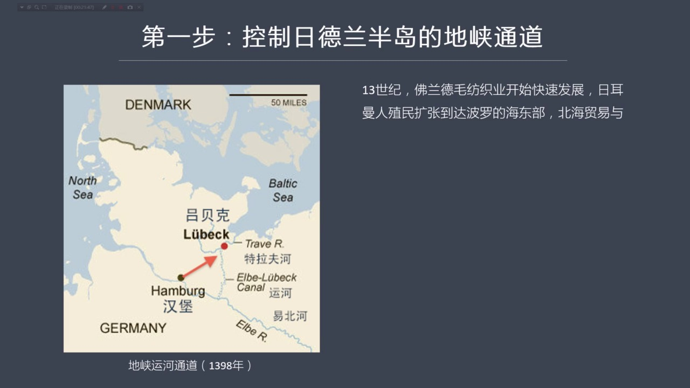

有两条路你第一可以绕到丹麦的最北边那要绕寒远的路然后那边下来之后通过松德海峡进入波罗地海路很远而且海上风险大因为当时的航运技术还不过关而且时间绕路时间会非常长中间还要严路还要停靠还要补中各种的补挤所以它的时间长成为很高还有一条路我们看到从北海到汉堡这个核口就是一北核的核口一北核可以让船直接开到汉堡所...

<strong>Cleaned narration</strong>

> 有两条路你第一可以绕到丹麦的最北边那要绕寒远的路然后那边下来之后通过松德海峡进入波罗地海路很远而且海上风险大因为当时的航运技术还不过关而且时
> 间绕路时间会非常长中间还要严路还要停靠还要补中各种的补挤所以它的时间长成为很高还有一条路我们看到从北海到汉堡这个核口就是一北核的核口一北核可
> 以让船直接开到汉堡所以汉堡是个大的港口那么在汉堡卸货之后如果走路路运输可以把这些货在一百公里左右的距离之内运到旅备客再从旅备客再装船可以运到
> 波罗地海的所有其他的地区所以从汉堡到旅备客形成了一条天然的地霞通道就是日德乱半岛的地霞这个地霞就是开始运输距离大大缩短当然了我们现在所说的缩
> 短一百公里的路这个路什么样的路呢就是我们从照片上看到的这就是旅备客到汉堡之间的当年的商道就是运言通道就是这么宽地一条路路上突有一些石子随时不
> 地可以防止下雨天这个路边的很宜宁然后马车就在这样的路上行使那么从汉堡到旅备客在当年也得花两三个星期的时间才能到所以当时交通情况并不是特别的好
> 当然这个路路不断的整修不断的翻新不断的这个优化之后它的运输的时间大大缩短了同时呢旅备客为了运理内宝的言还修了一条运河这个运河在土中也有标志也
> 就是从旅备客出发这个北标这条河角特拉夫河南标这条河角一百河在两河中间他们开造了一条运言的运河这个重点再往来一点就是运内宝所以有的时候货也可以从运河上走

---

### Slide 14

在一三九八年运河全部完工之后强化了旅备客的地位就是你既可以从路路走也可以从运河走这个运河长度大概也是一百多公里

<strong>Cleaned narration</strong>

> 在一三九八年运河全部完工之后强化了旅备客的地位就是你既可以从路路走也可以从运河走这个运河长度大概也是一百多公里

---

### Slide 15

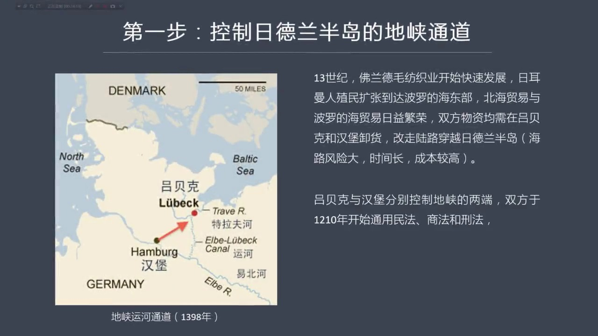

一百公里左右所以这两条路都是旅备客的地位得到了强化那么在十三世纪的时候我密切谈到我冤枉的毛访之工业开始快速发展非常地希望那么同时热漫人正在向波罗地海东岸大局扩张最远最远处已经打到爱沙尼亚了而且他的贸易前风已经到到了俄罗斯这个诺夫格罗德也就是在盛北的宝南边一点那么这一片新的殖民地需要大量的商品特别是来...

<strong>Cleaned narration</strong>

> 一百公里左右所以这两条路都是旅备客的地位得到了强化那么在十三世纪的时候我密切谈到我冤枉的毛访之工业开始快速发展非常地希望那么同时热漫人正在向
> 波罗地海东岸大局扩张最远最远处已经打到爱沙尼亚了而且他的贸易前风已经到到了俄罗斯这个诺夫格罗德也就是在盛北的宝南边一点那么这一片新的殖民地需
> 要大量的商品特别是来自于西欧北海北海的很多优质的商品特别是毛访之品而波罗地海研案这个国家又有大量出产的一些本土的东西比如说披毛波罗地海这个研
> 案的披毛是因为它天气别冷所以披毛的品質很高除此之外还有鱼 鱼缸 还有这个湖泊 还有木材等等它有很多波罗地海的土特产品所以北海和波罗地海之间需
> 要大规模的这种贸易的交流那么走哪呢当然就是走鱼缸 哈宝之间的地侠通道只要你这个船 不管这个连海哪边发展得快或者两边一起共同繁荣只要你这个船要
> 想从北海跨越到波罗地海的话那就一定会涉及到要走这个地侠在汉堡泄霍或者在鱼缸泄霍 然后走路路通道到达另一个地方再装船那么你这样一来的话就是鱼缸
> 和汉堡它就天然出在地侠的入口的两端只要这两个地方守住了这个地侠那么所有商品的流动 所有财富的流动都要经过鱼缸和汉堡的手所以验过拔毛嘛在所有的
> 运输过程之中它就可以获得或者要分享你的贸易利润同时呢由于它控制这条路非常的重要同时还掌握着研这个所有人波罗地海所有人都需要了一个重要的物资所
> 以它就有强大的意价能力和对贸易的一种控制力这就导致了这两个城市之间它的共同力越走越近所以他们在一二一零年开始就商量我们是不是统一起来建立一个
> 共同的一个同盟你比如说它从一二一零年开始两个城市就开始他们民法 商法和刑法就开始互相采取鞋童就是在我这里犯罪的人到你那儿一样会被抓起来你的城
> 市老百姓到我这里来不管是商量还是普通人那么你的所有的行动自由所有法律的保护跟在汉堡是一样的同时呢这个双方的商人完全拥有对方城市所提供的所有的
> 便利就是所谓贸易特冲这样一来呢两个城市越走越近到了一二四一年有旅杯客主动提出这个跟汉堡组成一个真正的同盟就是双方为了保护两个城市之间的这些商
> 人抵抗从特拉夫河到亿北河之间的所有启养结者或者其他的脸夺者正是建立同盟关系那么它说这个抢结者我们可以理解它这个脸夺者指着谁呢就是当年的封建领
> 主因为在周围有很多工决拨绝在这周围比如说梅克倫宝的工决还有苏洛石一格的这种拨绝都在这附近这些拨绝工决们他们成天就看了这些商业城市赚了这么多钱
> 非常地眼红经常过来打结有的时候是他们自己去亲自出马有的时候是只是一些土匪强到来洗劫这些商路上的那些运货的车所以这个地方非常的不安全也正是由于
> 相互保护所以这两个城市要通过建立同盟的方式共同组织压运来全月保这个地下通道的安全也正是因为它提供了这种附加服所以北海和波罗地海之间的贸易应该
> 说掌握在这个铝碑克汉堡的手中他们对整个梁海之间的贸易有相当大的影响力和反应权这只是完成了第一步那么第二步除了控制地下通道控制贸易通道之外第二步也很重要

---

### Slide 16

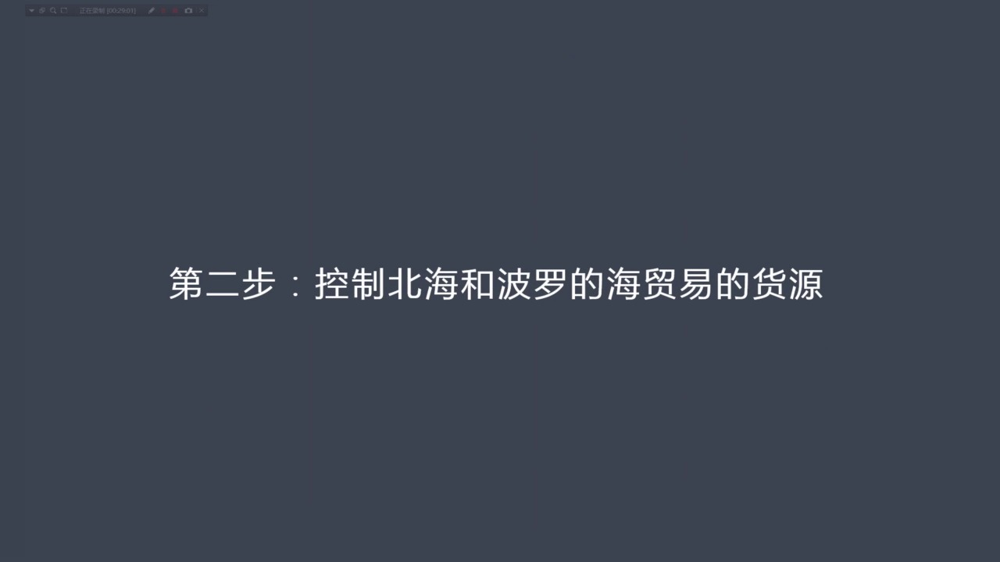

就是铝碑克和汉堡商量我们要不仅要控制通道我们还得控制货员这个货员在哪呢既有北海的货员还有波罗地海的货员都要控制所以这个铝碑克汉堡后来包括其他的一些城市想不来没不如日轮蹬等等有很多在这些城市得一致商人们就组建了一个越来越大的贸易体系就是汉堡同盟那么他们主要活动中心有四个就是所谓汉堡的四大商战第一个比如...

<strong>Cleaned narration</strong>

> 就是铝碑克和汉堡商量我们要不仅要控制通道我们还得控制货员这个货员在哪呢既有北海的货员还有波罗地海的货员都要控制所以这个铝碑克汉堡后来包括其他
> 的一些城市想不来没不如日轮蹬等等有很多在这些城市得一致商人们就组建了一个越来越大的贸易体系就是汉堡同盟那么他们主要活动中心有四个就是所谓汉堡
> 的四大商战第一个比如说我们从轮蹬看这是1267年建立的轮蹬商战轮蹬商战应该说在汉堡同盟里面算是最有名利的就是所谓的轮蹬刚月他而是有个大铁门儿铁

---

### Slide 17

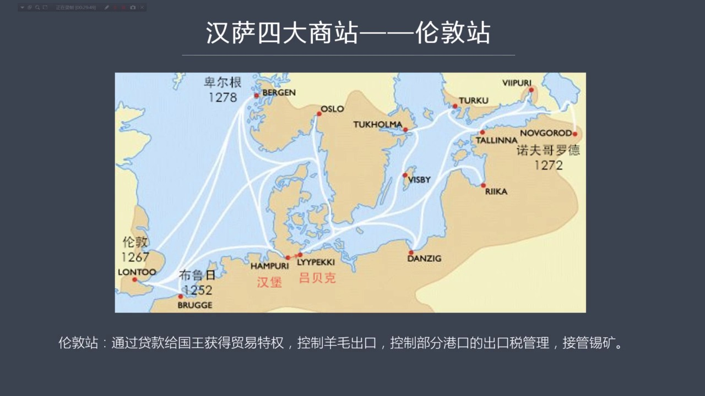

实际上是沐统儿包着从铁皮里面是个身材大院身材大院外面有武装的他们自己的武装的人看守因为汉堡同盟在轮蹬是非常招人讨厌的为什么呢因为他们通过给国王英国国王打仗需要大量贷款汉堡商人通过给他们贷款获得了很多贸易特据这样就把英国商人就变圆化了所以后来汉堡商人就获得了特别是洋谋的中国公主权身材包括港口的收税管理...

<strong>Cleaned narration</strong>

> 实际上是沐统儿包着从铁皮里面是个身材大院身材大院外面有武装的他们自己的武装的人看守因为汉堡同盟在轮蹬是非常招人讨厌的为什么呢因为他们通过给国
> 王英国国王打仗需要大量贷款汉堡商人通过给他们贷款获得了很多贸易特据这样就把英国商人就变圆化了所以后来汉堡商人就获得了特别是洋谋的中国公主权身
> 材包括港口的收税管理包括康伙巨大的西矿的采矿权都被汉堡商人所掌握这样就是的英国商人既讀又仇恨住在伦敦那就不一定很安全有时候你说不定在路上走来
> 一个黑专也有可能所以汉堡商人他要武装保护自己这个伦敦的这个伦敦刚院那么同时他们在英国的伦敦还具有着司法货面权所以我们后来所知道的这个所谓制外
> 法权包括领事馆包括很多这样的概念殖民地我们看到这个租借所有这套伦敦体系都是源于汉堡的时间所以我们现在所说的各大领事馆是国外的领土他的司法这个
> 外交人员享受画面权等等这都是源于汉堡那么除此之外还有一个战就是布鲁日战布鲁日战是一二五二年从实验上来说布鲁日战成立得更早那么布鲁日当年是

---

### Slide 18

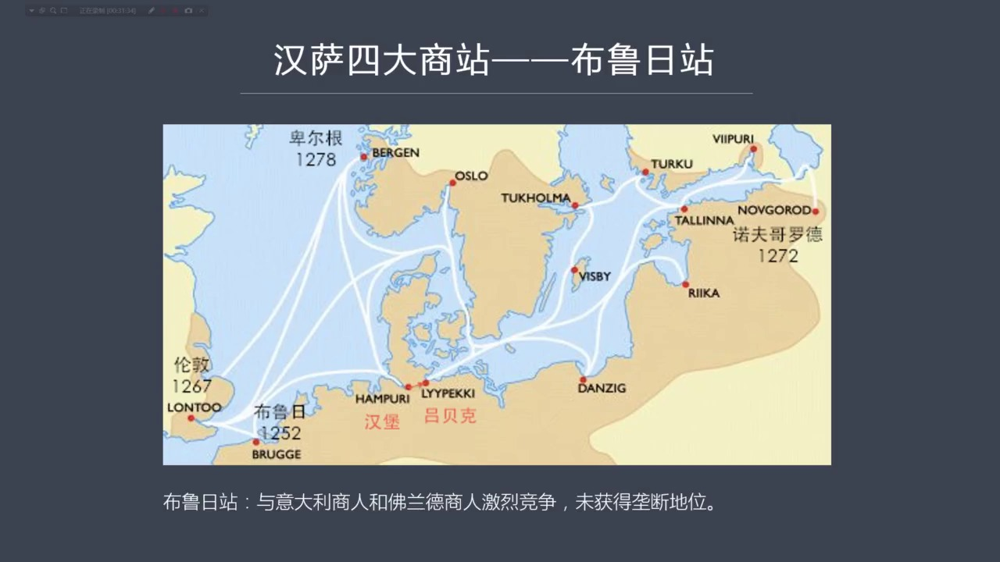

应该说是佛兰德地区最主要的一个港口它是面向英国也好面向北海面向地中海它是一个最主要的一个一个港口城市也是商贸中心所以这个地方应该说是西欧经济最有活力的地方它这位都是佛兰德的访知的中心它的生产制造非常的发达这个地方吸引了大量的客商有英国商人意大利商人佛兰德本地的商人还有来自于整个欧洲其他地区的商人那么...

<strong>Cleaned narration</strong>

> 应该说是佛兰德地区最主要的一个港口它是面向英国也好面向北海面向地中海它是一个最主要的一个一个港口城市也是商贸中心所以这个地方应该说是西欧经济
> 最有活力的地方它这位都是佛兰德的访知的中心它的生产制造非常的发达这个地方吸引了大量的客商有英国商人意大利商人佛兰德本地的商人还有来自于整个欧
> 洲其他地区的商人那么这个汉萨的商人在布鲁日虽然有他们的商战但是呢他们不得不与各国的商人进行激烈竞争所以他们在布鲁日战并没有获得绝对的路段权在
> 伦敦他们获得了大量的路段权特别是羊毛还有稀矿出口的路段权是涨不在汉萨人手中的那么除了这两个之外还有一个就是北尔根就是挪威的最主要的海长北尔根呢可以说他在整个商战里面他的挪威人

---

### Slide 19

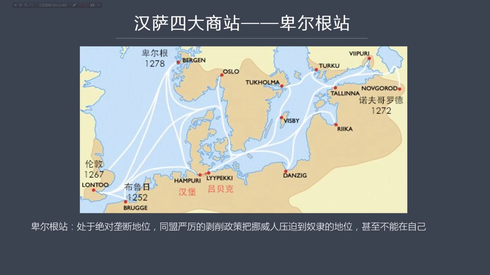

应该说是被汉萨人压榨的很厉害因为我们注意到热漫人这种他的经商的方式跟我们以后会讲到意大利的那边经济更繁荣更发达文明更传承更悠久的地方经商方式不太一样应该说热漫还具有着非常原始的那种满足的精神或者说是武力啊暴力啊还有这种强迫性很强他的压榨性很强所以在挪威人在北尔根的挪威人他的地位就非常的悲催也就是汉萨...

<strong>Cleaned narration</strong>

> 应该说是被汉萨人压榨的很厉害因为我们注意到热漫人这种他的经商的方式跟我们以后会讲到意大利的那边经济更繁荣更发达文明更传承更悠久的地方经商方式
> 不太一样应该说热漫还具有着非常原始的那种满足的精神或者说是武力啊暴力啊还有这种强迫性很强他的压榨性很强所以在挪威人在北尔根的挪威人他的地位就
> 非常的悲催也就是汉萨同盟一旦进去之后迫使挪威国王牵熟了很多在我们看来叫喪权辱国的这种贸易条款做出了巨大的贸易特权的让步大家可能会觉得奇怪为什
> 么挪威国王会牵熟这么多喪权辱国的条件呢就是因为当时三国的内斗挪威丹麦和瑞典之间存在着王朝之间的争斗你缺钱呢你缺资源的而且你本国当年这三国在唯
> 一海盗时候很牛很厉害但是他们现在已经没有当年进去精神了所以他缺少一个本地强大的商人阶级所以在这些地方他的商业势力是比较弱的而汉萨相对来说要强
> 大的多他们承认着挪威国王经济贫困的时候需要钱的时候那么我可以给你带款我可以给你什么什么好处那么你要出让一些经济和贸易上的特权这个时候挪威国王
> 做了大量让步你会发现汉萨商人进去之后很快挪威人就变成奴隶了就是他们被压榨到了奴隶的地位为什么呢你比如说本来挪威自己的鱼场现在汉萨人说我已经获
> 得了捕鱼犬这个捕鱼犬是壟断的所以这篇挪威的海域只有我能捕鱼你们挪威本地人要想捕鱼的话你得向我来提出申请然后我顾你你才能去捕鱼捕了鱼之后你不能
> 卖给其他人你只能卖给我而我出的价格非常非常低这就是残酷的压榨而且你捕了鱼之后我还要求你必须过做成鱼肝你还要烟制你还得做包装你还得做移系列这种
> 苦活类活脏火而且我出价非常低你只能卖给我你不能卖给其他人不卖不卖就烂掉所以这些挪威商人被压榨惨了当然他们对于这个得益之类商人可以说是又恨又怕
> 因为他们的国王太软弱挪威人当时也打不过这个汉萨人所以只能忍气吞声但是他们对于汉萨人的不满可以从当年的大量技术中你可以发现你比如说汉萨商人他要
> 自己有个GG区在这个GG区里头然后他们这外头有个吊桥挪威人当地人都称那个吊桥叫蝉子桥就是说只有蝉子才过那个桥不是老虎蝉子的蝉子是这种所谓蒼英
> 蝉子那个蝉子或者叫蒼英桥也可以那么瑞这个在这个挪威的话你会看到这个当年挪威的国王他自己就抱怨说这些日耳漫人承作的巨轮而来劣走了我们的黄油和干
> 雨使用我国贫困他们又运来了裂酒是这个挪威人民精神这个斗落因此我好不感谢他们这道话清起来非常像清朝末年的这个盗光或者邪风这些人发出了感慨就是跟
> 大英帝国交往背受这个欺负大概就是这样的一种心态牵手了一系列不平冷调约也是背破的那么除了这个背儿跟之外第四个主要的伤战就是诺夫哥罗德这个诺夫哥
> 罗德这个伤战其实很早就有围惊人在围惊扩张时代就已经打到了那边就已经建立了这个像瑞典人当年很早

---

### Slide 20

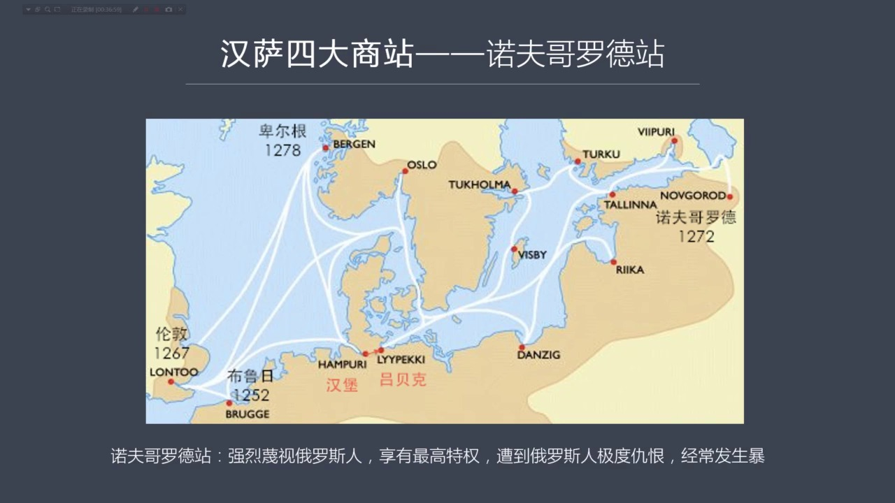

就建立了这样的一个伤战那么后来呢他由德一致人接手把他们接管过来之后你会发现德一致人在那个地方做生意跟瑞典人在那做生意是很不一样的因为德一致人 日耳漫人非常非常瞧不起或者叫灭视诺的私人你比如说他们有很多他们的商业规定非常的不合理可以说极端的歧视当地人你比如说规定汉萨商人不能够随便跟俄罗斯商人做生意必须...

<strong>Cleaned narration</strong>

> 就建立了这样的一个伤战那么后来呢他由德一致人接手把他们接管过来之后你会发现德一致人在那个地方做生意跟瑞典人在那做生意是很不一样的因为德一致人
>  日耳漫人非常非常瞧不起或者叫灭视诺的私人你比如说他们有很多他们的商业规定非常的不合理可以说极端的歧视当地人你比如说规定汉萨商人不能够随便跟
> 俄罗斯商人做生意必须对有两个汉萨人同时在场才能够跟他们去做交易因为俄罗斯人他们认为不尝识不老实 非常粗乳然后他们的商战对于俄罗斯人的这种待遇
> 也非常的不好后来俄罗斯人就经常地发动这种可以说发动暴乱反抗日耳漫人这些商人的这种压迫给他条件 商业条件也非常的糟其实后来陆佛格罗德他是127
> 2年建立的后来在14几年就是被一次暴乱被俄罗斯人所攻克那么也就是这四大商战你会看到德一致商人在经商过程中都是采取了用一种非常强烈的一种手段来
> 进行这种压制和鲁断贸易这种思路非常的强这跟我们以前讲到的就是在上一讲讲到的各个时期的商人明显得不同德一致商人的打法很都一样可以说专制性非常强
>  控制力和压大程度远远超过以前的时代那么对于他们这个德一致商来说他还得防止其他商人来竞争

---

### Slide 21

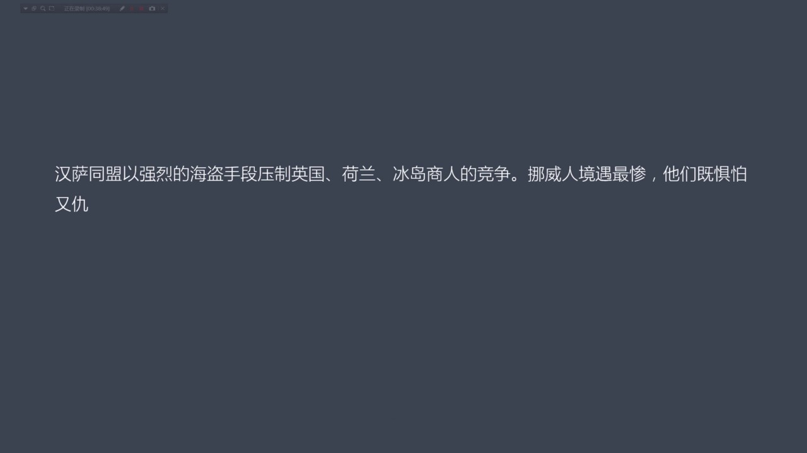

比如说英国商人和战商人冰岛商人他们要是竞争怎么办汉萨他们的手段就是用海盗的方式来报复就是你要跟我竞争好我呢就知识也海盗或者我自己人去乔邦公乔邦打扮上海盗去强你的船然后不断吸击你的船队让你无力可途然后同时我还发别很财所以他们用了很多这种手段类似于强到手段来压制各个国家的竞争对手这也是其他的商人不太一样...

<strong>Cleaned narration</strong>

> 比如说英国商人和战商人冰岛商人他们要是竞争怎么办汉萨他们的手段就是用海盗的方式来报复就是你要跟我竞争好我呢就知识也海盗或者我自己人去乔邦公乔
> 邦打扮上海盗去强你的船然后不断吸击你的船队让你无力可途然后同时我还发别很财所以他们用了很多这种手段类似于强到手段来压制各个国家的竞争对手这也
> 是其他的商人不太一样的比如说我们上一讲讲到的猶太商人它是动脑筋 但不会用蛮力福利斯兰商人那是贸易的组织者但它不是壟断者不是排他性的壟断者但是
> 汉萨商人的打法是很不一样它是要极端强烈的排他它有这个特性所以在控制了北海和布罗地海这个贸易的货源之后他们就进化到了第三步第三步就是要直接控制
> 良海的中间的很多贸易书牛比如说在北海北海有传统医生来说有很多围惊时代人家就打下了天下你比如说他们汉萨就拉龙不来美加入这个同盟为什么不来美呢不
> 来美就在汉萩乙再往南一点就在威胁河的河口不来美就是他在历史上他们的当年就

---

### Slide 22

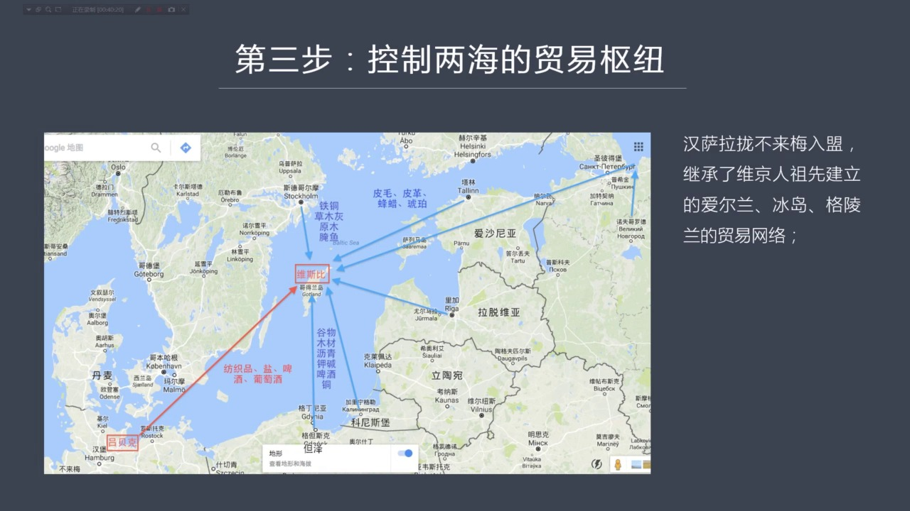

他们的老总先在围惊时代就建立了艾尔兰冰导格林兰更远的北大西洋的贸易这个网络是掌握在他们手上的所以拉龙不来美加入汉萨同盟就等于是上汉萨繼承了内大片更远地区的贸易所以他就获得了更大的贸易空间除此之外汉萨还占据了英国东北部就是有个单卖区当年单卖人围惊海道的时候打进英国他没有在英国的东北部这个地区有一大片都...

<strong>Cleaned narration</strong>

> 他们的老总先在围惊时代就建立了艾尔兰冰导格林兰更远的北大西洋的贸易这个网络是掌握在他们手上的所以拉龙不来美加入汉萨同盟就等于是上汉萨繼承了内
> 大片更远地区的贸易所以他就获得了更大的贸易空间除此之外汉萨还占据了英国东北部就是有个单卖区当年单卖人围惊海道的时候打进英国他没有在英国的东北
> 部这个地区有一大片都是单卖人的聚集区那么这个地区正好卡在苏格兰到英兰之间的海上交通线上所以他们也占据了这个地区所以就控制了苏格兰和英兰之间的
> 贸易空道那么最主要的一个控制的苏纽是在发生在哪儿在波罗地海中心波罗地海中心有个导语叫哥德兰导哥德兰导的首府是威斯比威斯比这个地方在围惊时代它
> 就是一个重要的贸易苏纽其实围惊人向东扩展这一只主要是来自于瑞典主要是瑞典人他们很多人都是以威斯比作为出发地然后一直道目诺福格勒德甚至在网南沿
> 着地区伯河到了几府这个地方都是瑞典人打下的天下就是他们建立前的贸易网络那么也就是瑞典人他们的就是伤人威斯比的伤人控制着波罗地海东部广大地区的
> 这种贸易网络汉萨伤人就非常乔就看中了这威斯比这个贸易苏纽就想把它据为极有他们提出的办法就是比如说一二八零年李卑克就跟威斯比还有李嘉李嘉是现在
> 拉托一样我们可以看到拉托一样海外的底部这个城市叫李嘉这也非常重要的波罗地海的贸易据点那么汉萨伤人就邀请这两城市说我们一块来打海道因为当时海道
> 很长绝那么这两城市愿意去跟他们斜座去打海道但是汉萨这个汉萨李卑克这就说我们要不要进一步合作你该最终加入我们的汉萨同盟的了加入有个条件就是把你
> 们所有贸易的这些区域这些关系全部介绍过来就说你们现在是垄断嘛我们进去要向你交钱那你加入汉萨之后我们就可以免费进去了使用你们这个贸易垄断权我们
> 就用用你的贸易网络了这个就听起来就好比是京东和苏宁京东就说苏宁你把你的贸易网络就免费给我吧然后我呢也没有什么回报给你你就加盟我就行了那当然苏
> 宁会不干所以很本能的很自然的就是維斯比和李家都坚决反对就说你凭什么我要把贸易网络我弄到的贸易网络要让给你呢当然不会这就使得李卑克汉萨同盟去决
> 心用我们不必征服維斯比就到了1293年李卑克就派出艰队突然吸击維斯比功课了整个哥特兰岛可以说是用无力的办法强行吞并了瑞典人当年在的维京时代打
> 下的波罗地海东部的贸易网络那么又过了三又过了这个六年到1299年又征服了李家控制了李家地区的商业后来包括塔林等等这些地方全部被汉萨商人所控制
> 一直到纳福格罗德也就是以维斯比维中心的波罗地海贸易的书牛被劳劳的掌握在汉萨商人手上如果我们看维斯比的位置你会看到不管是瑞典过来的铁框童 链的
> 铁核童还是它的草木灰为什么要草木灰因为草木灰是一两中间必须要有的一个重要的原料还有瑞典的木材还有瑞典自己的鱼类这个烟鱼那么从波罗地海东部什么
> 塔林 纳福格罗德还有他们身向广大的俄罗斯内地的很多贸易的一些毛细血管所获得的比如说皮毛 皮革还有疯纳 虎破这都是俄罗斯的特产也都通过维斯比来
> 向李博客转运另外李家还有特别是这个南部的波兰地区的弹责还有柯尼斯宝这两个地方就是代表着波兰地区它的一些特产波兰地区当时已经大规模的开始重粮式
> 了因为要供福兰德那边因为福兰德那边粮式不够所以这边要提供粮式也就是在这个时期两个市场出现了分化这边的波兰走向了一个可以说是重支原料的一个方式
> 大规模的农业但是超级单一当然 瑞典波兰投了谷谷之外还结果木材 栗青 甲箭甲箭也是用于印染的用于防止防止工业的另外还有啤酒 还有童童是来自于匈
> ...

---

### Slide 23

你比如说对龙断卖和锐点你要压得这么厉害的话那么反弹就会很厉害如果有竞争对手一来人家肯定愿意跟竞争对手做而不愿意跟你奉因为你压迫人压迫得太厉害了所以它一定要封锁波罗地海的入口把竞争对手打在外头怎么封锁呢就是这个主要要依靠一个制海权就是汉萨意识到了要保持高强度的垃圾就必须要有强大的海上霸权才能够有效地维...

<strong>Cleaned narration</strong>

> 你比如说对龙断卖和锐点你要压得这么厉害的话那么反弹就会很厉害如果有竞争对手一来人家肯定愿意跟竞争对手做而不愿意跟你奉因为你压迫人压迫得太厉害
> 了所以它一定要封锁波罗地海的入口把竞争对手打在外头怎么封锁呢就是这个主要要依靠一个制海权就是汉萨意识到了要保持高强度的垃圾就必须要有强大的海
> 上霸权才能够有效地维持这种垃圾那么对于旅备课这个盟主而言它的地位的根基主要是源于日子兰半岛地侠路地和运河两个通道

---

### Slide 24

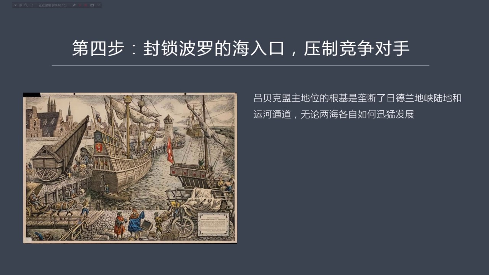

都被它控制着所以粮海经济盲益不管怎么发展旅备课都是中间至关重要的一个节点你们怎么发展我的赚钱因为我是你们中间的并不可吵中间人同时呢这有一个问题就是松德海峡有可能可以绕开旅备课所控制的地侠也就是人家如果从海上过来特别是像英国人、荷兰人、富兰德人、法国人还有俄罗斯人、菩萝士人这些人其实都想绕开这个旅备课...

<strong>Cleaned narration</strong>

> 都被它控制着所以粮海经济盲益不管怎么发展旅备课都是中间至关重要的一个节点你们怎么发展我的赚钱因为我是你们中间的并不可吵中间人同时呢这有一个问
> 题就是松德海峡有可能可以绕开旅备课所控制的地侠也就是人家如果从海上过来特别是像英国人、荷兰人、
> 富兰德人、法国人还有俄罗斯人、菩萝士人这些人其实都想绕开这个旅备课我们想通过海峡直接走通过松德海峡直接跟北海发生关系让粮海直接可以多海来经济
> 盲益而且这个时候造传技术越来越先进也提供了一定的这种物质条件那么汉萨的对策特别是旅备课对这种行为是绝不饶素的那就是通过血腥海盗打击血腥的报复
> 就是你的传过来我就把你集成强引东西、杀你的人当年这个历史报道中有很多这种事件比如说抓了传员之后一般的海盗还要锁取属金之类的还可以放人他们就整
> 个就撕票就是撕票就是产生一种恐怖这种撕票就把人给绑起来丢到运河里面或者丢到海里面就是绑上石头让他沉下去这种消息传来之后就是各个商人非常惊恐大
> 家就不太赶走松德海峡了所以通过这个办法他有效地堵住了海峡这条通道同时由于汉萨的权势越来越大因为他控制了货员、
> 控制了贸易通道控制了贸易书扭所以他产生了一种协谱性周围的自由城市们你们如果不加入汉萨同盟我就跟你对着来或者我就把你堵在外团你的货不允许从我这
> 过你的货不允许进这两海的交易市场那你怎么办所以很多城市它不管是协谱还是自愿因为你自愿将来同盟之后它也给你好处就是你用我的这个贸易市场你只要符
> 合我这贸易条件你进来之后你就会分得贸易利润所以它在两种一种是压力一种是又货力的这种两股力量来做种之下你会看到大量的从北海从威胁河一直到蛋泽之
> 间的这些得意之城市基本上全部加入了汉萨同盟它这个规模非常地变得非常地庞大比如说到了1360年汉萨同盟已经拥有了52个加盟的城市这个规模就越来
> 越大了这些加盟城市形成了这种同盟体制之后它总的力量就远远大于52个城市简单的数学之和它就变成了一股钱大的政治势力那么这种政治势力在关键时刻甚
> 至可以发动战争如果我们看下野这种汉萨同盟它的这种严酷的压榨它这种商业上的壟断虽然它也提供了贸易秩序它必然会遭到很多人的反对比如说单卖就率先起
> 来挑战在单卖历史上有一个非常有名的国王就娃尔德马四世这个单卖人应该都知道就相关于中国的汉务地它的地位这是从1340年到1375年在位

---

### Slide 25

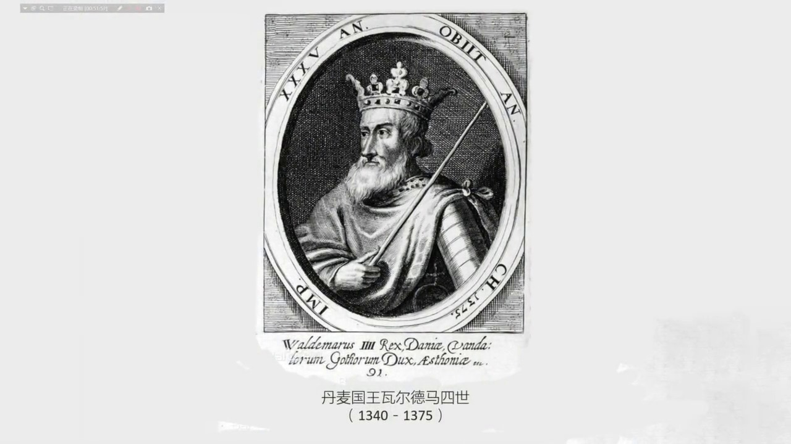

这个娃尔德马四世它是个比较具有传辑性的一个人物当年单卖在这个时候已经非常非常的摔落它的整个国家可以说全部抵押出去了在他爷爷那辈在他父亲那辈整个国家的政治极其腐败经济已经破产这个国家的税手全部被抵押给了汉萨商人同时也被抵押给了境内的很多这种封建的领种还有很多外来的得知人也在那儿盘剥了很多财富所以到了这...

<strong>Cleaned narration</strong>

> 这个娃尔德马四世它是个比较具有传辑性的一个人物当年单卖在这个时候已经非常非常的摔落它的整个国家可以说全部抵押出去了在他爷爷那辈在他父亲那辈整
> 个国家的政治极其腐败经济已经破产这个国家的税手全部被抵押给了汉萨商人同时也被抵押给了境内的很多这种封建的领种还有很多外来的得知人也在那儿盘剥
> 了很多财富所以到了这个娃尔德马它快要机位之前它其实是一直他的父亲死掉之后他一直在流放在外主要是在神露娃娃帝国的公厅长大那么他后来机位的时候接
> 到了是一个国破这个国破山河也不在的这么一个局面就是国家破产然后他自己的领地也非常的小所以他是从一个破败的基主之上开始重新崛起一步一个角印的你
> 会看到他在几十年之内从一三四零年到一三六零年到二十年之内通过一点一点一点的这种通过这种积累首先通过婚姻获得他老婆的一笔价转然后尝换了一笔债务
> 获得了一小块领地然后逐步扩大然后到了西兰岛也就是个马根的所在的岛然后一个城堡一个城堡的去熟悔到最后花光了所有钱他就用武力去征服所以通过二十年
> 经经业业不断的扩张把丹麦重新统一了起来然后把得一致人就是这种外国人赶出了丹麦的境外但是同时他这么强势也会引发这个封建贵族就是那天领主们的强烈
> 不满所以这些人经常闹事造反企业所以他又不停地镇一样也正是因为他执行贴约政策所以他需要大量的财这个税收所以他对农民的压榨也比较厉害这个人在厉害
> 他就评价就比较有意思有些认为他是民族大英雄像汉武力量但汉武力也是为了凶怒打仗为了跟凶怒打仗也好进了国家的财政使老百姓的负担非常沉重这个娃尔的
> 马四世基本上也是如此那么他是对外政策很有意思他对外政策他很早就意识到了汉萨同盟对于丹麦这种压迫所以他必须要他要想崛起丹麦要想重新成为一个欧洲
> 的大国他必须要打垮汉萨同盟所以他在1361年的时候发动的提起这个很快攻占了威斯比就是哥德兰岛刚才我说的那个贸易波多地海的贸易输扭

---

### Slide 26

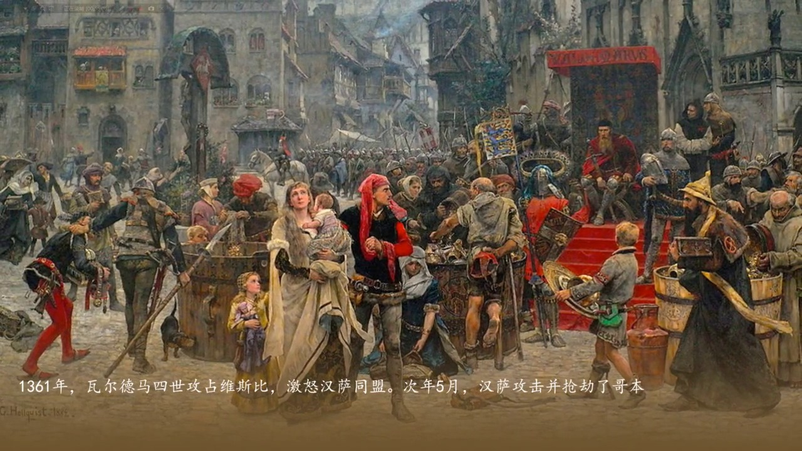

然后攻占这个哥德兰岛之后我们看这批批中间又表这张图这就是一个邮化这个邮化展现的就是娃尔丹马四世攻占了这个威斯比之后他叫人弄了三个大统大批有统这个话中有三个大批有统他就告诉当地人很多都是汉萨的商人就说谢你们三天之内用基金财宝把这三个大批有统给我招满了否则的话我就挨家会去抢东西了结果让他非常吃惊的是没有...

<strong>Cleaned narration</strong>

> 然后攻占这个哥德兰岛之后我们看这批批中间又表这张图这就是一个邮化这个邮化展现的就是娃尔丹马四世攻占了这个威斯比之后他叫人弄了三个大统大批有统
> 这个话中有三个大批有统他就告诉当地人很多都是汉萨的商人就说谢你们三天之内用基金财宝把这三个大批有统给我招满了否则的话我就挨家会去抢东西了结果
> 让他非常吃惊的是没有用三天当天在日落之前这三个统就都被招满了说明什么说明汉萨商人极其有钱这个娃尔德马非常的震惊说这个地方真是风水宝地但是他攻
> 占了威斯比这个消息转出来之后立刻激怒了汉萨同盟因为这是我的风水宝地你居然用武力跟我抢那怎么办所以汉萨同盟决定立刻这个组织同盟的这个成员发兵去
> 细节这个哥们哈根细节这个大卖的首都然后双方开始这个教练娃尔德马这个人也是一个军事家同时也是个外交家很有策略他通过通婚把女儿嫁给了挪威瑞脸然后
> 是挪威瑞脸就跟他保持一致而且这两国家也挺恨汉萨同盟的这样的话就挖解了这个汉萨同盟对于这两个国家的分化所以他就形成了一个三国的统一战线来跟这个
> 汉萨同盟教练这个局面就变得越来越难以收拾所以到了1367年汉萨同盟决定如果我们不采取多人的军事措施的话那么单卖就做大了怎么办呢他们就超召开了
> 这个著名的科龙会议决定联合出兵彻底打败单卖和挪威瑞典距离跟他们稍微远点单卖和挪威这两个必须要打败这个所谓联合出兵什么概念就是所有汉萨的好几十
> 个城市每个城市如果离得远点你也得出钱离得近的就得出兵出入陆军出海军咱们组成一只联军共同去打结果这个号召令出来之后号召到了就开始出兵在1368
> 年汉萨同盟的军队就攻战了单卖全境洗结了这个哥们哈根也打败了挪威抢了这个贝尔根这两个城市都被洗结了这个时候玩的马斯是打不过被迫流亡国外这个时候
> 全欧洲都震惊了包括神神罗马帝国的皇帝也大吃已经没有想到这个自由城市组成了汉萨同盟现在居然如此强大打败了两个王国还把一个王国的国王打了到处乱跑
> 所以这个时候可以说汉萨同盟达到了他的威士的顶点他成了一个巨大的军事和政治的一个联合体汉萨同盟的性质也发生了变化他一开始做的是垄断贸易但现在已
> 经变成了一个垄断的贸易加上一个军事上强大的一个组织也就是他的垄断贸易必须要建立在强大的制海权和军事力量之上这就跟以前我们所看到的所有的这个有
> 组织市场组织者这商人们都不一样他创造了一个新的模式那么到了1370年单卖实在打不过了最后被迫签署了这个斯加拉尔松习定在这个习近中间规定单卖必
> 须要赔偿这个斯康尼亚就是瑞典南部这个地区15年收入的三仗这15年的内你这个所有瑞典南部的地区这是最富有的地区你的三仗收入都得交给我捍上同盟作
> 为卑管同时呢汉萨的战领战领的这些军队呢要控制整个这个斯康尼亚的就是在松德海峡北岸的一处二的军事据点这个要我战领松德海峡必须对汉萨的商人自由开
> 放那么而且汉萨同盟还获得这个另外一个非常非常让单卖人感到非常屈辱的这么一个条件就是如果你这个国王选丁的接班人汉萨同盟是有权否决的所以汉萨这么
> 一来他就可以说在整个欧洲被所有的列强挂目相看没想到汉萨同盟现在已经成了一个这个欧洲列强之一了那么我们再看下一汉萨同盟之所以发展到现在这个程度
> 发展到一个强权的程度主要一托的是汉萨同盟的制度它这个制度规徙到一点

---

### Slide 27

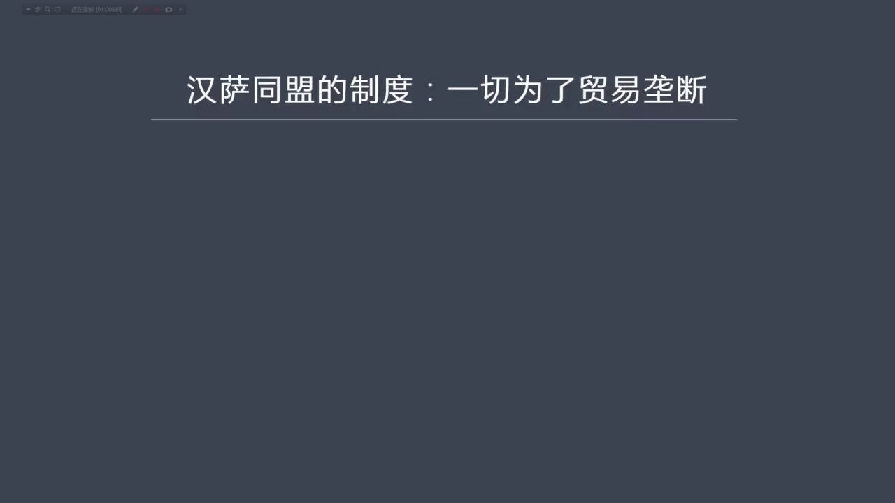

就是一切为了贸易垄断那么汉萨呢它是一个得一制的城市联盟但它有个非常不同的特点它是跨国的跨了七国所以说它非常像神圣劳马帝国的商业版神劳马帝国也是有一大串独立的政治实体所组成的有封建的猪猪猪然后有独立的帝国自由城市有大量的其他的这种享受特权的这样的宗教的集中教 天主教的这些教会所以它是一个独立体的一个集...

<strong>Cleaned narration</strong>

> 就是一切为了贸易垄断那么汉萨呢它是一个得一制的城市联盟但它有个非常不同的特点它是跨国的跨了七国所以说它非常像神圣劳马帝国的商业版神劳马帝国也
> 是有一大串独立的政治实体所组成的有封建的猪猪猪然后有独立的帝国自由城市有大量的其他的这种享受特权的这样的宗教的集中教 天主教的这些教会所以它
> 是一个独立体的一个集合汉萨同盟也是类似于神劳马帝国这种组成的机制那么这个同盟有一个下属一个议会来统峡那么这个议会基本上每三斤开一次都在旅备课
> 召开它是蒙督这个会议召开期间被称之为汉萨节但在实际运作中这个议会开会的频率并不是太高主要原因是所有重要的议题都由旅备课来拍板决定所以旅备课实
> 际上是执行的立法权那么整个这套这个议会制度的核心就是为了保证汉萨同盟的陆地和海上它的交通秩序必须要决定安全同时城市人内部的贸易秩序也必须要非
> 常地稳定它的主要目的是为了支持已经在各大城市中掌握着政府权力的那个商人满头他们的统治所以汉萨它是一个由议会统峡的它的主要目的是为了汉卫贸易垄
> 断的这么一套机制那么汉萨同盟它的法律非常严格它的严格程度就是如果你不听同盟的招呼违反同盟的法律就被踢出这个同盟一旦你被踢出同盟那就慘了那你在
> 汉萨所有城市里面那些商人将会被各大城市所抓捕而且你在各大城市的这种在其他汉萨城市所有货物要被墨收所以这个城发是非常严厉的那么同盟之间大家如果
> 城市里城市间发生纠纷按着汉萨法律规定是要由附近的临级的这个城市的重裁临几个城市住它不了你也不能去向封建临主去申请重裁注意这是汉萨坚持了一个重
> 要原则为什么不让封建临主去重裁呢因为封建临主在它的临主范围之内在它临土范围之内它有自己的法庭临主法庭如果你汉萨自由城市跑到那儿去打官司那就意
> 味着你这不是在所有权上归属吗我一个封建临主吗你不是招来这个封建这些猪红们的干预吗这是绝对不能容忍的所以不管你官司怎么打打营打营都绝对不能到封
> 建临主那儿去要说法只能把这个上诉申请到履备客的最高最高这个议会有他们来重裁但是由于履备客或者由于汉萨这套法律体制它是继续商业的所以它的公正性
> 效率都很强九尔九尔之呢以履备客为代表它的习惯法就变成了布罗地海东岸的所有城市所供用的这种习惯法那么后来到这个发展到后期很多得一致的这些猪红们
> 如果他们之间产生什么矛盾也愿意把他们的重裁提交给汉萨法庭来进行审判和重裁所以你会看到汉萨的法律体系其实很有意思现在我们全世界的这种零海这种公
> 共零海这种法律其实都是源于汉萨的法发点体系因为在布罗地海怎么行在北海上怎么维护交通秩序怎么防止海盗怎么实现贸易上的这种共通互联这都是汉萨当年
> 制定的法律所以严格规定的这就进化出了后来的零海后来的海上交通秩序海上供法这套体系都是源于汉萨的法律那么汉萨法庭还有一个重要的特点就是他有很强
> 的排达性你比如说同盟你如果是这个不来没你说我成是同盟同盟的这些成员就是你的商人这个成员是不能跟同盟以外的人结婚的如果你跟盟外人结婚那这个东西
> 就违法了这个同盟的法律然后你也不能跟同盟之外的城市的人商人建立商业伙伴关系还有在同盟之内的内部交易机制上禁止两个非同盟的商人直接接触你比如说
> 在旅费课他这交易市场中如果你是另外一个城市比如说意大利的维尼斯他不是你这同盟之内的维尼斯商人如果造同盟的市场上经验交易他是不能直接跟不能直接
> 就是比如说两个意大利商人他们不能做贸易或者意大利商人跟另外一个非同盟的商人你比如说来自于墨斯科的某个商人这两个外来的商人不能直接做贸易必须要
> ...

---

### Slide 28

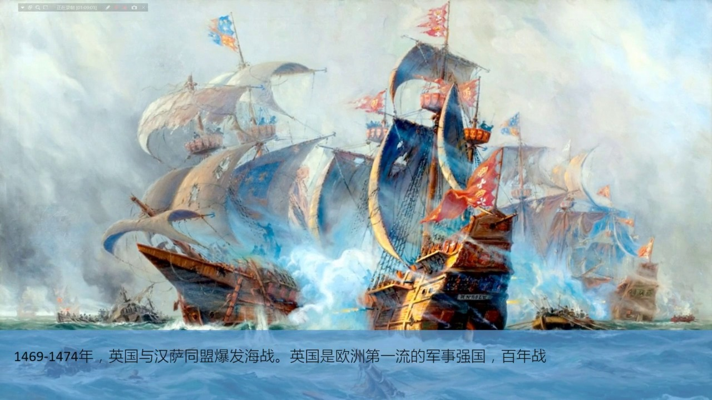

他的作战是非常厉害的但是他挑战汉萨同盟却失败了什么原因呢为什么英国要挑战汉萨同盟呢就是因为英国在百年战争这个期间他为了制裁法国所以限制英国的羊毛原材料像富兰德出口当时富兰德属于法国所以这场贸易战就导致英国羊毛出口他限制怎么办呢那只有英国本国的商人来发展访职业这就使得英国的访职业在百年战争之中获得了巨...

<strong>Cleaned narration</strong>

> 他的作战是非常厉害的但是他挑战汉萨同盟却失败了什么原因呢为什么英国要挑战汉萨同盟呢就是因为英国在百年战争这个期间他为了制裁法国所以限制英国的
> 羊毛原材料像富兰德出口当时富兰德属于法国所以这场贸易战就导致英国羊毛出口他限制怎么办呢那只有英国本国的商人来发展访职业这就使得英国的访职业在
> 百年战争之中获得了巨大的增长他这个转型是由于战争所导致的转型这个美国后来崛起

---

### Slide 29

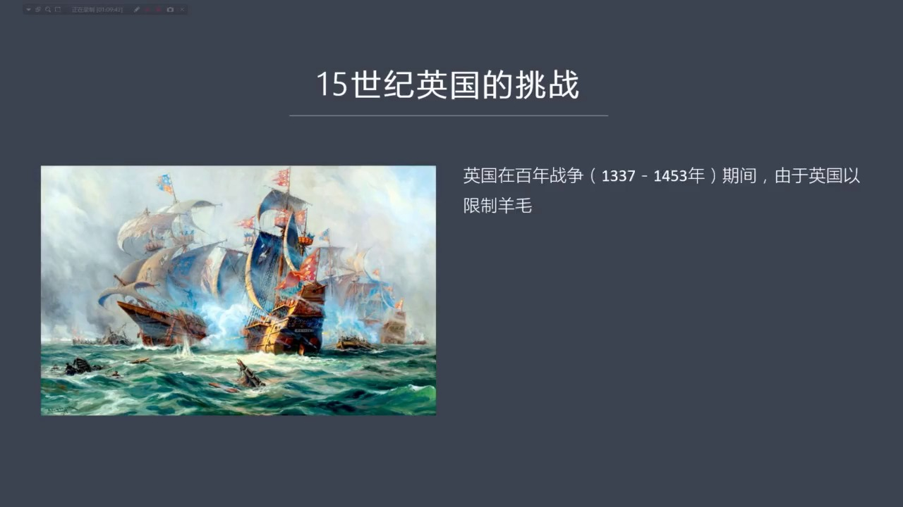

由于1812年英美战争导致美国制造业开始起开始起动是完全一样的原理那么以前你卖羊毛你不用走出英国本土或者你最多走到布鲁日走到这个富兰德这个地区羊毛就卖出去了因为羊毛品质都一样不需要走得太远谁都知道英国羊毛好来了就买没什么可调可检的也没有什么谈判技巧但是你如果转向生产布料这就不一样了因为在你之前有富兰...

<strong>Cleaned narration</strong>

> 由于1812年英美战争导致美国制造业开始起开始起动是完全一样的原理那么以前你卖羊毛你不用走出英国本土或者你最多走到布鲁日走到这个富兰德这个地
> 区羊毛就卖出去了因为羊毛品质都一样不需要走得太远谁都知道英国羊毛好来了就买没什么可调可检的也没有什么谈判技巧但是你如果转向生产布料这就不一样
> 了因为在你之前有富兰德部有意大利部罗伦萨这些布料都很好你要去跟人家竞争你的商人就必须要走出去走到各个地方去走到他们竞争对手比较弱的地方去比如
> 说向波罗地海这些地方传统的这种竞争就没有这么激烈英国商人叫到那去卖部卖他们的新的工业产品好这架子英国传就开始大量了出现在波罗地海进去英国商人
> 就开始说英国人自古以来就有进入汉萨和布务市领土自由定居和经商的权力就是我们要进入波罗地海要在那儿我们有天生的权力在那儿走生意而且英国选择到在
> 弹子建立贸易桥头宝所以英国传对和商人的大量出现尤其在弹子的定居使得汉萨同盟特别是驴贝克就非常的紧张因为你这不是挑战我这笼端贸易吗我在波罗地海
> 之内不允许有其他商人出现你怎么就跑进来了呢特别是你是通过松德海峡进来的你这不是威信我驴贝克的战略地位吗因为我的生存就主要靠控制这个日德兰这个
> 陆地的地下才有我的范尺你要开这个坏头从松德海峡进来人家跟着走那我这个地下的笼端就没了吗我也没有这个笼端我还怎么耗利这个汉萨呢所以这个驴贝克就
> 特别的生气驴贝克汉宝就这个跟德国就恰起来了双方就开始互相的派海道汉萨也派 英国这边反报复也派海道打击汉萨的船那么英国国王汉力六十在1447年
> 就宣布废除汉萨在英国的所有特权这下就把这个矛盾激化了双方的这个斗争越来越激烈后来你会发现英国的海道他们这个抢劫行为估计也都是从汉萨的学来的因
> 为在海上打击汉萨是打击商船而且这个很多打击的方式这个是非常的凶惨血腥它不是说所要俗击那么简单而是为了震射对手那么这种海盗这种较量就称之为商业
> 海战专门打击对方的商船最后升级到了1469年到1474年5年的商业海战但是最后打的结果是英国的这个它的出口受到了严重的打击布料出口在布罗地海
> 上在其他地方都遭到了非常严重的打击这个汉萨的船队后来经常是航行在印记的海峡之中如如无人之境英国在这场战争中没有取得任何的成效所以到1474年
> 时候双方只有签订合约就是烏特勒之这个条约烏特勒之条约规定英国背破要恢复全部废除的汉萨特权同时英国商船英国的这个商人商船要退出布罗地海英国遭此
> 重创之后由两代人没有办法向海外去发展贸易就是因为挑战汉萨的失败那么如果我们看下野英国这么强大的国家挑战汉萨的失败了那下一个挑战者是会谁呢就是16世纪荷兰荷兰这回是真正的打破了汉萨

---

### Slide 30

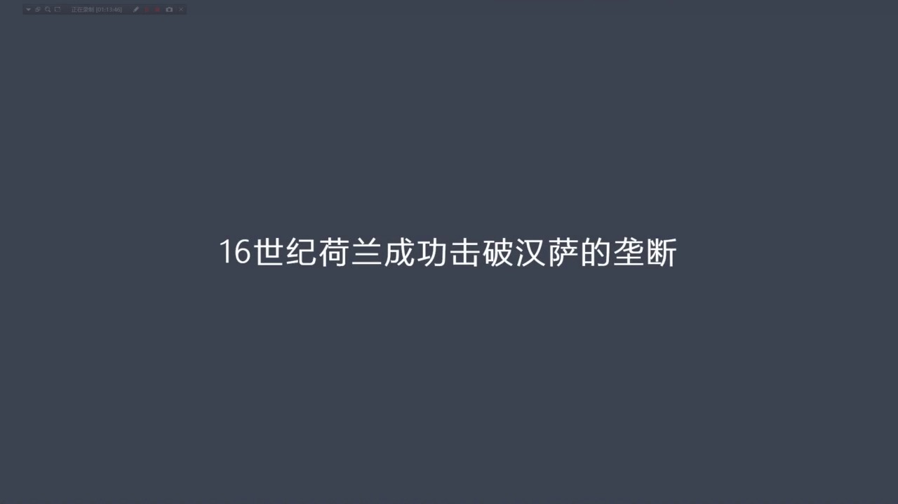

对布罗地海贸易的壟断原因呢我总结起来原因有五大原因第一大原因最重要的原因就是荷兰的造船业的技术超越了汉萨汉萨的船是比较笨比较大但荷兰那是反船它的大翻船它设计得很轻巧载中量很大因为它经过改进之后它的载中量大大扩大而且没有那么笨重它的船型很合理流线型所以它速度很快所以它都未大然后速度还快

<strong>Cleaned narration</strong>

> 对布罗地海贸易的壟断原因呢我总结起来原因有五大原因第一大原因最重要的原因就是荷兰的造船业的技术超越了汉萨汉萨的船是比较笨比较大但荷兰那是反船
> 它的大翻船它设计得很轻巧载中量很大因为它经过改进之后它的载中量大大扩大而且没有那么笨重它的船型很合理流线型所以它速度很快所以它都未大然后速度还快

---

### Slide 31

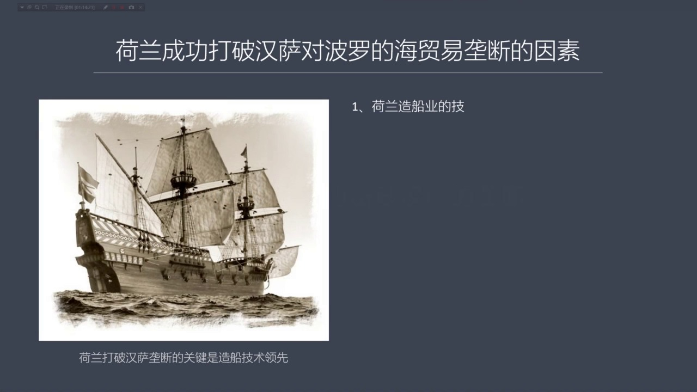

然后船员的人数由于配置的更合理人员更少因此荷兰商船它的综合的运营城门就比汉萨要低很多为什么荷兰被后来称之为欧洲的马车夫海上马车夫就是因为它造船的技术还有它造船的数量非常地跑大生产效率积高所以导致荷兰的运输还运非常的强大那么第二个原因就是由于它的船性能价格比很好所以它非常适合于运大踪生亭我刚才所说的波...

<strong>Cleaned narration</strong>

> 然后船员的人数由于配置的更合理人员更少因此荷兰商船它的综合的运营城门就比汉萨要低很多为什么荷兰被后来称之为欧洲的马车夫海上马车夫就是因为它造
> 船的技术还有它造船的数量非常地跑大生产效率积高所以导致荷兰的运输还运非常的强大那么第二个原因就是由于它的船性能价格比很好所以它非常适合于运大
> 踪生亭我刚才所说的波兰它主要这个时候已经发展农业开始出称出口古物出口大量木材而这些东西如果在按照船筒的那种运输方法特别的费劲因为弗兰德这个地
> 区和整个其他老洲地区两十区说越来越大木材区说也越来越大你如果全部要走到李卑克泄霍然后再走路运运的汉堡再运到书兰德这玩意儿量太大它运输成本就太
> 高而且这个区上越来越大依靠路路运输它的成本越来越不划算所以呢你就必然会面临的这个要是用转运的问题同时还有个因素就是李卑克他刚才我刚才所说他还
> 有一个重要的特点就是他这个驴纳宝的岩是通过驴卑克运到这个运到波罗地海的那么这个时候法国其实法国也有一个非常大的一个海盐生产基地也就是比斯开湾
> 有个非常大的海盐的生产的一个地区那么从法国比斯开湾如果强到法国先去装海盐然后再拉到波罗地海走送到海峡过来那么它的成本其实比驴卑克运到路运过来
> 的盐还要更便宜这就导致是汉萨内部就出现了很多争议了就觉得荷兰它是个海上马桑夫它们对我们有好处我们不应该跟它做对你比如说像这个这个布洛士像波兰
> 但这些这些地区的商人就强内要求使用荷兰传当然李卑克是坚持反对所以他就出现了内户还有这个这个整个汉萨体系的吸引像柯隆地区莱因河流域的这些城市还
> 有佛兰德的很多城市它都跟河南的关系更密切你让它跟你驴卑克为了汉萨内的路上交通线我们要跟着你去跟河南打仗这些城市就不愿意所以它就很难组建起一个
> 对付河南的强浪同盟第三个原因河南的地理位置非常的优良因为现在地中海贸易北海贸易和波罗地海贸易都发生起来尤其是地中海贸易更发达所以河南那个地方
> 正好是地中海贸易到北海波罗地海的中间的中间点所以它成了三大海贸易的书牛然后这个时候河南船就可以到处好大规模三角贸易使得河南船的利用率非常高它
> 综合的航运城门变得相当的有竞争力第四个原因就是河南商人绕开汉萨的市场比如说它到波罗地海做生意到了这个蛋泽它不在蛋泽市场上买东西它要绕过蛋泽进
> 入波罗市的内地还有波罗那是这个内地去专门找这种原种单坦为什么单坦就是因为你中间商在中间吃了一笔就是你在蛋泽市场中间那些中间商汉萨商人们已经把
> 利润加进去了所以我要绕开你直接去找生产厂家去谈找到货源直接谈这样的话就会成本更低而我传运成本也比你低那我竞争力又是不是更强吗还有一个特殊点就
> 是河南人已经通过这个跟一大令人做生已经学会的更高名更复杂的金融技巧它已经懂得了用商业汇票而汉萨商人还用金币和营币再说做生意这个商业技术也不一
> 样河南人要先进的多同时呢他们还使用了大量的提前贷款就是我先给你钱预定多少顿目彩预定多少顿两事我先给你钱提前预知这样使得价格压来更低所以它通过
> 这么几种方式的结合使得河南商人在波多地海这种竞争力非常强大技术由于航运也是由于它的这个绕开中间商量这种打法还有它的金融的服务所以使得汉萨商人
> 汉萨商人抵達河南商人就非常的吃力打不过河南商人第五个原因就是市场的干预就是政府干预市场主要原因就是由于富兰德地区还有越来越多的德意志地区都开
> 始吃波多地海的粮食开始吃波兰的粮食这个时候如果说这个粮食运输出了问题因为大家都在河南传如果说你汉萨跟河南打起来了结果导致了德意志城市富兰德地
> ...

---

### Slide 32

主要有几个原因我把按着重要的设计列了四大原因第一就是1492年地大发现这是根本性趋势性的转变可以说是汉萨衰落的最重要的一个因素它改变了整个潮流和趋势也就是它根本的颠覆了世界贸易的格局大鲜贸易发展了所以波罗地海的贸易再怎么样你的规模太小了你已经被未来的全球贸易所边缘化了这个时候汉萨是不是波罗地海的霸主...

<strong>Cleaned narration</strong>

> 主要有几个原因我把按着重要的设计列了四大原因第一就是1492年地大发现这是根本性趋势性的转变可以说是汉萨衰落的最重要的一个因素它改变了整个潮
> 流和趋势也就是它根本的颠覆了世界贸易的格局大鲜贸易发展了所以波罗地海的贸易再怎么样你的规模太小了你已经被未来的全球贸易所边缘化了这个时候汉萨
> 是不是波罗地海的霸主已经不重要了因为这块市场的规模相对于全球市场来说已经不重要了所以你汉萨保重荣难地位你也不可能在全球新的贸易体中称王承霸因
> 为你弟弟未知你没有办法进行大鲜贸易所以你的衰落在全球贸易市场中这个奋额的衰落是必然趋势第二个就是造船和航海技术不断进步它最终总会使经过松德海
> 霞走它的成本更低这是个必然的趋势所以履备课是党不住这种技术和造船航海技术的这种进步的也就是履备课的衰落它对路上通道日德兰地霞控制衰落它是必种
> 必然的而履备课量衰落了整个汉萨同盟也就瓦解了第三个原因就是中央集权的民族国家开始越来越强大而你汉萨这种城市同盟它不是个中央集权而且你没有太大
> 的经济副地你也没有农村地区跟城市相配合你只是单独的城市同盟那你这个模式要跟大国要跟这个中央集权的国家对抗长期来看的话肯定是要落下方的当时在汉
> 萨的同盟的周围东边是沙额崛起了西边是河南英国在波布金壁中间呢瑞典也起来了17世纪是瑞典的非常地超级强大应该说从16世纪瓦萨古萨夫瓦萨国王起来
> 之后瑞典的国力就征征日上再加上单卖国家力量也在恢复所以在这么多强国的压力之下汉萨的衰落也是难以避免的第四个原因就是汉萨内部的原因汉萨是以立委
> 扭袋组成一种结盟因此当大家出现内因为利益冲突出现内内斗的时候团结是很难实现的也就是利益很难协调当你的对手很弱小的时候或者很孤立的时候没问题但
> 是如果是强力挑战像河南亮的一个强大的敌人和包括后来的英国再往后的英国你要是跟他长期对抗那内部生内是必然的所以这四个原因导致汉萨同盟的衰落他只
> 是一个时间早晚的问题到了16世纪中期英国的一个外交评论家就说汉萨他的大盘压迟已经脱落了剩下的压迟也松动了也就是到了15几几年时候汉萨的全剩时
> 期早已经过去最后走向衰落之时间问题了所以我们看到科区技术的不断进步商业环境的根本性的变化政治潮流的新衰还有这种盛衰心替这一切大的背景的转化都
> 将动摇汉萨原有的垄断的模式垄断的基础都被这些潮流变化所动摇在这些大的趋势转变前汉萨很难涉嫌预知知道了之后其实你没有办法改变这就是整个的历史潮
> 流发生变化之后这个且流改变之后你作为前流中间的一个阻挡者你是很难逆转历史的好我们再看最后一就是从汉萨同盟的新衰史上我们可以得到两点结论低点市
> 长经济理论的基石是自由贸易但我们考察了自罗马帝国崩溃以来的各个阶段西方市场的进化你会发现市场的组织者始终非常明显的影响的教育的自由市场里人说
> 教育要自由因为自由教育这是一切价格曲线一切供求理论一切看不见手的基本的前提但是你汉萨是怎么干的吗汉萨之前的立次的我们看上将所讲的立次的这种市
> 场组织者他都有对市场教育的明显影响力你比如说汉萨对布罗地海这种绝对这种断对比如说对罗伟人这种压榨他就已经严重的影响了罗伟人自由教育的可能性所
> 以生产者消费者都受到了汉萨对于市场壟断的影响他们不能够自由教育那怎么办你所提出的所有的理论他的前提和基础在现实时候中是找不到的所以经济理论必
> 须也只能源于对金真实的经济现象的体列和抽象他不能评论想象如果立场从来没有存在过这种绝对的自由教育那么真实的教育其实是由市场组织者所塑造的这种
> ...

---

### Slide 33

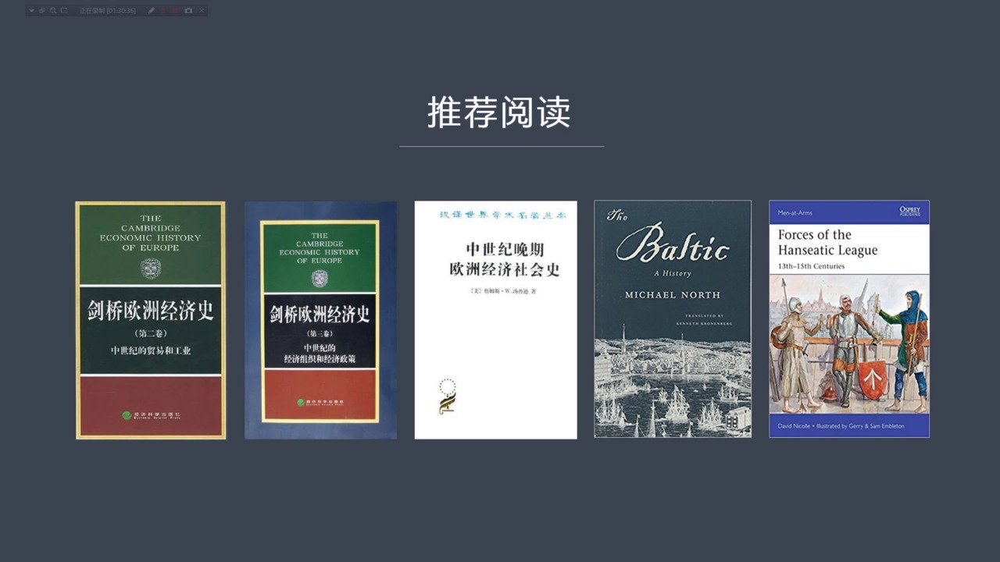

今天我们的课程就上到这里谢谢大家参加

<strong>Cleaned narration</strong>

> 今天我们的课程就上到这里谢谢大家参加

---

### Slide 34

<strong>Cleaned narration</strong>

---
