# 核心课视频-009.市场的进化（三） — Slide Notes

> **来源**：鸿学院核心课程  
> **幻灯片**：21 张

---

### Slide 1

市场的进化第三部分关于市场的深度前几讲我们一直围绕着市场的核心规律就是供求关系从不同的角度去理解那么今天我们将重点研究市场的深度对于这种供求关系的影响那么究竟什么是市场深度呢我在这里用一个烧水壶的这样一个例子来给大家做一个试异大家如果看第一页PBT我们会发现如果你这个烧水

<strong>Cleaned narration</strong>

> 市场的进化第三部分关于市场的深度前几讲我们一直围绕着市场的核心规律就是供求关系从不同的角度去理解那么今天我们将重点研究市场的深度对于这种供求
> 关系的影响那么究竟什么是市场深度呢我在这里用一个烧水壶的这样一个例子来给大家做一个试异大家如果看第一页PBT我们会发现如果你这个烧水

---

### Slide 2

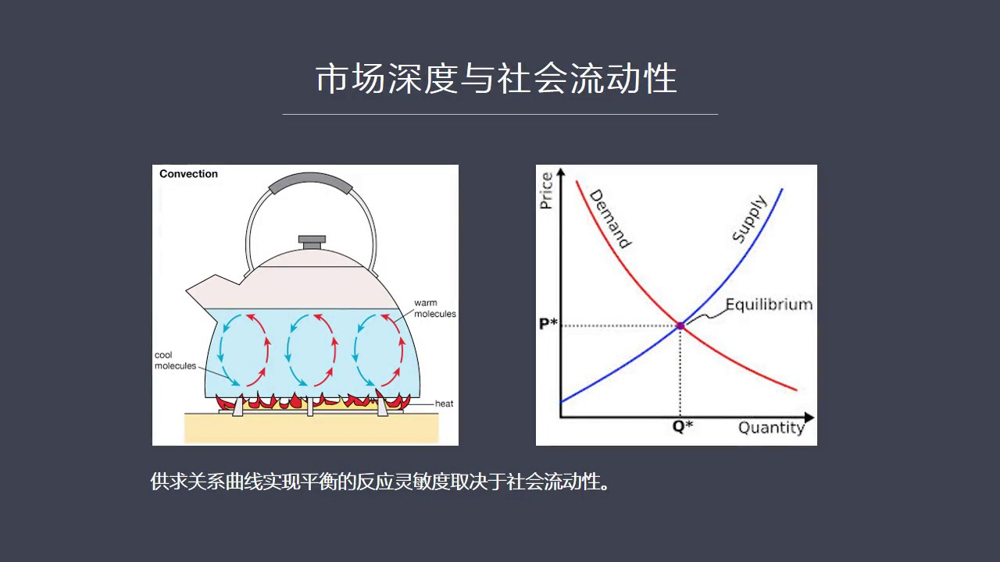

它如果是不同的液体存在着不同的阻力系数不同的废点那么烧水过程中当这个液体在废疼的时候你会看到它对于这种理由温度的反应程度是不一样的这个如果我们来解释供求关系你看右边这张图供应和需求我们在传统理论中假设当你供应方发生变化那么需求方将会自动地跟进但是跟进的临敏程度或者说反应速度这个问题却没有进入讨论的事...

<strong>Cleaned narration</strong>

> 它如果是不同的液体存在着不同的阻力系数不同的废点那么烧水过程中当这个液体在废疼的时候你会看到它对于这种理由温度的反应程度是不一样的这个如果我
> 们来解释供求关系你看右边这张图供应和需求我们在传统理论中假设当你供应方发生变化那么需求方将会自动地跟进但是跟进的临敏程度或者说反应速度这个问
> 题却没有进入讨论的事业这就是我认为传统市场经济理论中间另外一个缺陷这个缺陷就是从逻辑上来讲你没有一个指标或者没有一种逻辑来解释供求关系之间会
> 不会存在着反应的质后所以呢我们今天这个话题将会重点来微笑这个供求关系之间的它的反应临敏这个程度来解释什么叫市场的流动性和市场的深度在我看来供
> 求关系如果想非常敏锐的非常临敏的发生这种变化和跟进反应那么就必须要求这个市场的深度比较深要求这个社会的流动性比较强才能有效时间这一点那么关于
> 市场深度我在这里举两个例子一个是潜水湖 一个是深水湖如果我们大家看下野那么潜水湖的概念我用动理萨湖

---

### Slide 3

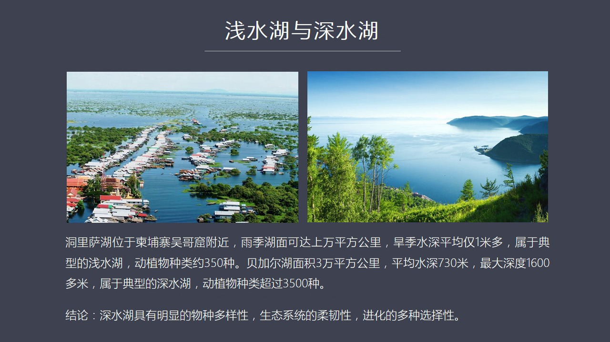

作为一个例子关于动理萨湖动理萨湖它是在无割窟的附近有一年我去无割窟去访问的时候正好也顺路去看了动理萨湖动理萨湖给我的印象的印象就是它非常的宽扩动理萨湖如果是雨季的时候它们面积会达到上万平方公里可以说是一片汪洋大海但是它的汉季不下雨的时候它的水的深度却很浅平均深度才1米所以动理萨湖是一种非常典型的潜水...

<strong>Cleaned narration</strong>

> 作为一个例子关于动理萨湖动理萨湖它是在无割窟的附近有一年我去无割窟去访问的时候正好也顺路去看了动理萨湖动理萨湖给我的印象的印象就是它非常的宽
> 扩动理萨湖如果是雨季的时候它们面积会达到上万平方公里可以说是一片汪洋大海但是它的汉季不下雨的时候它的水的深度却很浅平均深度才1米所以动理萨湖
> 是一种非常典型的潜水湖我们都知道潜水中要养大雨是很困难的或者要承载一个比较复杂的生态系统它是有难度的就是因为它太浅垂直的深度不够这就极大的制
> 约了它的物种的多样性所以如果我们看动理萨湖的动植物的种类你会发现整个动理萨湖它的动植物大约有350种这个是潜水湖的一个比较明显的特点深水湖呢
> 如果我们用贝加尔湖来作为一个例子进行对比的话你会发现贝加尔湖它的湖面面积本身也很大3万平方公里但是最大的特点是它湖水的深度非常深它的平均深度
> 达到了730米最大的地方的深度最深的深处能够达到1600米可以说贝加尔湖是一种非常典型的深水湖它整个的湖水的水量去水量超过了波罗地海一片海域
> 的总的水量也超过了美国五大湖水量的总盒所以这是一种非常典型的深水湖正属于它的深度非常深平均730米它的生态环境中它可以进化出非常多样的物种因
> 为它垂直深度够所以在贝加尔湖它的动植物种类超过了3500种也就是比吴哥哭的动力撒湖要高出一个数量席所以我们可以从这两个例子得出一个感觉来就是
> 深水湖具有明显的物种多样性正是因为它存在的多样性所以它是整个生态系统它的柔韧性更强碰到各种自然灾害它的抵抗能力更强同时由于它物种的多样性导致
> 它未来发展进化过程中它会有不同的选择它的选择性也比动力撒湖要强我在这里用这两个深水湖和潜水湖的例子是想说明市场也是一样那么在市场中存在着深水
> 市场也存在着潜水市场两类市场所以我们在思考市场问题说不能仅仅看我这个市场规模有多大我有多少人在这个市场中或者我能够有多大的规模的效应我们需要
> 化一个思路去想它的深度怎么样那么这个市场深度就是一个新问题这个新问题可以提出一种新的思考来解读共旧关系这两条曲线之间的反应变化的灵敏度那么为
> 了说明这个问题我还是想回到这个历史的方法论上来但是你要想解释什么叫深度市场你得有案例这个案例也就是在历史中这样的市场是怎么发展计划出来的它跟
> 潜水市场又有什么不同那么我记得上一讲中我们讲到了汉萨同盟那个模式汉萨同盟的模式它所形成的经济市场的这种类型在我看来就是属于潜水湖的类型市场深
> 度比较浅而今天我们要讲的是意大利北部中部的它这种市场从进化角度来看我们会发现意大利市场的深度是明显高于汉萨的北部的这种市场的深度的所以我们看
> 下液我用一个贸易环流的概念来做一个大体的整体的一个解读那么大概在公园一千年左右也就是中世纪的中期

---

### Slide 4

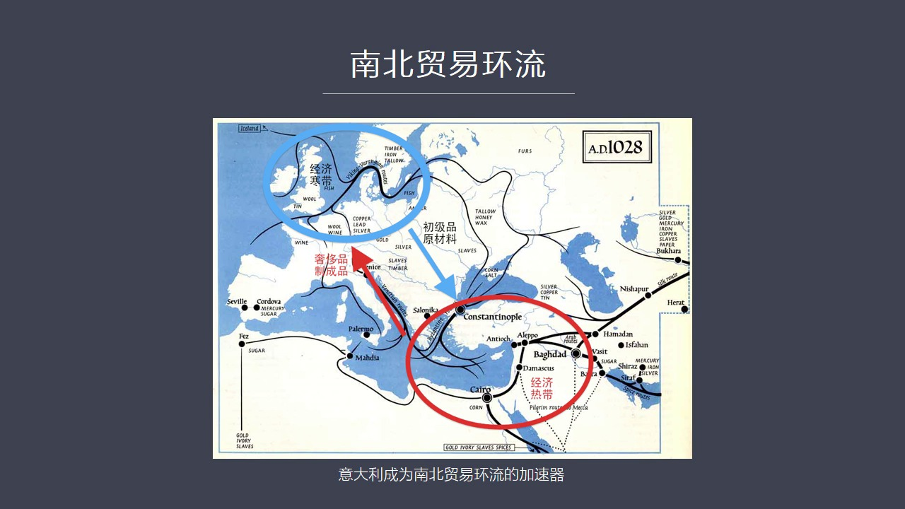

如果我们打开一张南北贸易的一个地形图你会发现在这个地图上它有一个经济的热点地区我称之为是经济热带地区主要是在地中海东岸包括安纳托利亚半岛就是军事产丁宝这一块就是当年东洛马帝国的它的所在地这一片区域在历上它一直应该说在罗马帝国时代东部就比西部发达那么如果我们再看这张图的上半部分就是在英国法国得格一致的...

<strong>Cleaned narration</strong>

> 如果我们打开一张南北贸易的一个地形图你会发现在这个地图上它有一个经济的热点地区我称之为是经济热带地区主要是在地中海东岸包括安纳托利亚半岛就是
> 军事产丁宝这一块就是当年东洛马帝国的它的所在地这一片区域在历上它一直应该说在罗马帝国时代东部就比西部发达那么如果我们再看这张图的上半部分就是
> 在英国法国得格一致的北部包括斯坦尼纳尾亚半岛这个区域这一块市场我称之为当年是一个经济的含带地区也就是在中世纪早期一直到公元一千年前后在五头半
> 年中间南方的经济明显要超越北方经济什么原因呢就是因为当年在地中海东岸的这个穆斯林国家它的文明程度更发达生产知道能力更强还有军事产丁宝这带的就
> 是帝国东部的这个地区的经济的它的文明程度更高经济发展要比西部要好多西部由于陆续遭到了满足入侵帝国崩溃之后罗马帝国崩溃之后民族签席然后满足入侵
> 从公元五百年一直闹到公元一千年然后这个最后一波维金人才见见的退去所以在这头半年中间整个北方是混乱的消条的那么在南北贸易之间存在了一个基本的环
> 流的态势也就是南方主要提供搜尺品和制程品北方主要提供原材料和初级品这是一个双方大致的一个形态经济形态那么如果我们从这张图上来看的话南北交流最
> 方便的地点就是在意大利特别是意大利的北部威尼斯和热闹亚如果我们把意大利想象成一个高跟鞋的话在高跟鞋的左右两侧的根部在右边是威尼斯左边是热闹亚
> 为什么这个地方他得天都厚呢就是因为南部经济比较发达的地区把商品可以运到大腿的根部然后从那里再进行路路贸易运到韩代地区那么这种交换模式基本反映
> 了中世纪投百年的一个大体的趋势那么在这个过程中你会发现在这个交流过程中意大利的位置及其关键所以意大利它有一种得天读厚的贸易地缘的战略优势那么
> 在这个华丽过程中最终意大利它得以发展成一个贸易环流的加速器就是这种贸易在意大利的地方获得了一种加速的动能是整个这个循环更为顺场南美环流它提供
> 了一个认识当年欧洲经济发展和市场形成了一个大的框架就是南部是提供了向东方的设置品司仇相料还有这个当年东部的一些工业制程品它的水平工业都远远高
> 于北方而北方主要提供原材料提供归金属还有这种基础的工业品所以双方之间这种冷热循环热点是在南部那么为什么意大利它能够起到这种经济加速器贸易循环
> 加速器这样的作用这就是我们下野PBT要讲了重点内容意大利它除了地理位置得天读厚之外但是这是前提条件没有这一点

---

### Slide 5

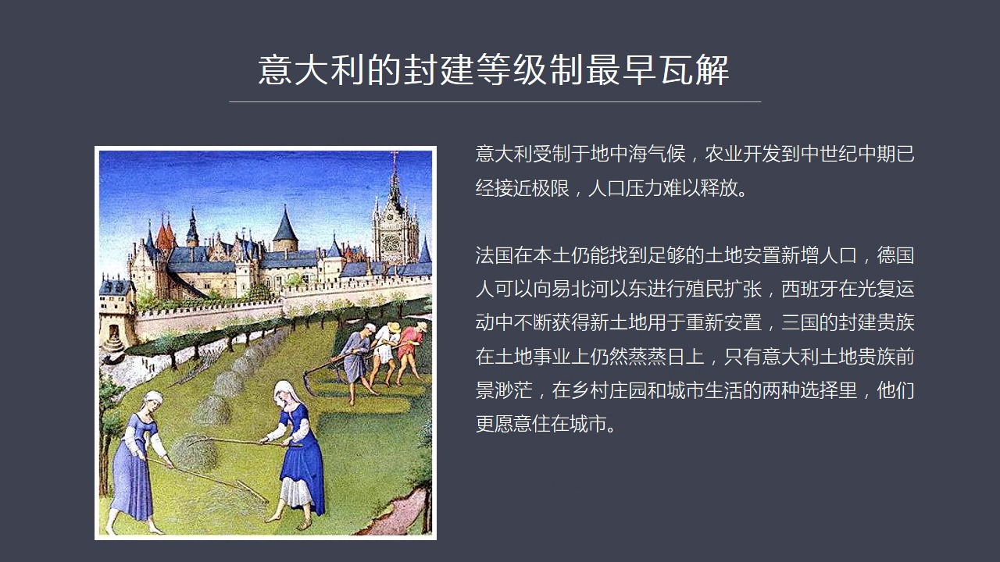

剩下的东西都谈不上除了这个特点之外它还有一个比较有力的一个正常的因素就是意大利的封建等级制最早瓦解为什么这么提呢如果我们研究意大利的它的农业的话你会发现意大利的农业它的土壤的情况不如北方得意志地区或者法兰西的北部地区意大利的土地还有法国南部的土地它是属于那种土壤的费度不够而且受到地中海气候的制约土地...

<strong>Cleaned narration</strong>

> 剩下的东西都谈不上除了这个特点之外它还有一个比较有力的一个正常的因素就是意大利的封建等级制最早瓦解为什么这么提呢如果我们研究意大利的它的农业
> 的话你会发现意大利的农业它的土壤的情况不如北方得意志地区或者法兰西的北部地区意大利的土地还有法国南部的土地它是属于那种土壤的费度不够而且受到
> 地中海气候的制约土地不能升更土地升更水分就会蒸发这种装甲就没法成火所以那个地区如果没有大量的灌盖系统的话法兰农业是会受到很大制约的所以我们看
> 到在意大利的土地它都是方形的也就是用浅更的方式而在得意志地区它都是长条形的土地因为它用深更的方式四到八头牛来了这个耕田所以它必须要用重离就会
> 一次性往前走就要走得比较远再掉头才核算也正式由于得意志地区它的土壤条件比较好肥厉比较充分而且它鱼水情况也比意大利地中海气候要强很多它是海洋性
> 气候所以还有海洋和大陆性气候所以它的这种农业方式和它的土壤的肥厉就是导致了在得意志地区和法国的北部地区它的农业一旦进入深更再加上轮座再加上新
> 的农业技术比如说新的种子的引进它的农业发展潜率就明显要比意大利要强所以呢相对于北方人员意大利的农业很早就已经到达了它发展的期限就是在中世纪的
> 中期公元一千年前后能开发的地方都已经开发了这个时候意大利的人口增加它面临的人口压力它就很难释放那么其他国家在这个问题上要比意大利要好很多比如
> 说法国法国当年在中世纪中期的时候它国内还有大量的领土还是森林区还可以进一步殖民还可以进一步开发所以新增加的人口是可以在国内进行土地的扩张然后
> 进行从县制没有问题德国呢这个时候已经开始了向亿北河以东就是斯拉夫人所战聚的广大领土发起了这个殖民扩张从公元十二十纪一到十五十纪这三百年中间得
> 一致人就是热漫人不断的越过亿北河以东然后占领了波洛丁海南的很多斯拉夫人的土地包括我们看到波兰北部的土地包括利涛碗甚至一直最远到艾沙尼亚南部那
> 个地方叫利欧尼亚一直到这些地区所以它有很大的一片新的领土殖民 殖民征服的领土那么对于德国人来说对于热漫人来说它的新增人口很容易的就可以被安置
> 在新征服的地区它也没有农业上的问题另外就是西班牙西班牙当年正好开始光复运动从公元1075年以后开始发动反攻依照公元101492年它有接近四百
> 年的在征服的运动在征服运动就是不断把摩尔人新养伊斯兰的这些人穆斯林感触了意大利难慢部分那么在征服过程中它可以获得大量新的土地用于重新安置国内
> 人口所以在这三个国家法国、德国、西班牙他们的农业应该说是处在一种比较有利的条件也就是土地和封建贵族在农业这个领域中仍然大有可谓他们的事业还在
> 征征日上但是在意大利它已经发展到极限了所以摆在意大利贵族面前的选择就是要么你待在平几的没有任何扩张潜力的潜景越来越暗淡的这样土地上或者你搬到
> 城市里面去住在城市里面寻找新的机会很显然意大利的土地贵族选择了进程那么正式由于这些农业贵族它的应该说经济基础被瓦解了因为意大利的农业摔落了双
> 原经济也解体了那么这些贵族就失去了经济基础最终也会导致他们丧失政治权利那么他们又住在城市里虽然他们的城市里可以兴修很多这种雕宝式的建筑裁胸期
> 大貌似裁胸期大其实他们的经济势力已经慢慢地被工商业阶层特别是新兴的商业阶层所取代所以双方贵族的后代最后就开始跟富有的商人家庭进行通婚这个是在
> 欧洲非常罕见的在1000年前后在其他国家等级制度非常深眼这种情况是非常少的特别是在德意志地区那么在意大利这个情况就不一样了那么由于通婚所以使
> ...

---

### Slide 6

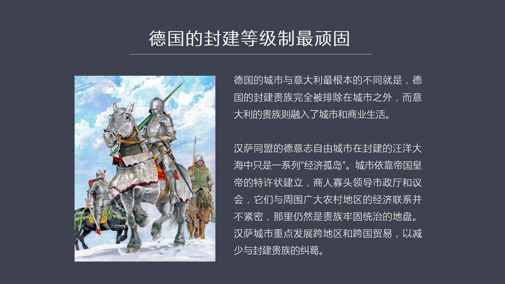

城市它有一个根本不同就是上级进步中我们讲到了汉萨唐日宠城市同盟德国的城市自由市它是属于皇帝的也是皇帝授予自由城市的特取状成立和进行管理的但是它跟意大利的城市最大的不同就是德国的城市中间贵族是完全被排除在外的而意大利贵族和商人是融合在一起的都住在城市这有什么不一样呢这个中间差别可就大了因为汉萨同盟的这...

<strong>Cleaned narration</strong>

> 城市它有一个根本不同就是上级进步中我们讲到了汉萨唐日宠城市同盟德国的城市自由市它是属于皇帝的也是皇帝授予自由城市的特取状成立和进行管理的但是
> 它跟意大利的城市最大的不同就是德国的城市中间贵族是完全被排除在外的而意大利贵族和商人是融合在一起的都住在城市这有什么不一样呢这个中间差别可就
> 大了因为汉萨同盟的这种城市它是一个在整个德国它是一个封建的一种汪洋大海中间的一个孤岛一系列的孤岛而且由于周围的所有的封建贵族很迪士这些城市他
> 们还有钱所以这些封建贵族对城市是现实基督汉所以城市和乡村之间它这种交流、经济联系就比较少那么这些汉萨城市它主要是发展跨国贸易跨区域的贸易而他
> 们跟本地之间的这种贸易互动相来说比一大利比较薄弱很多这个封建贵族他们当年在德国的贵族在征服斯拉夫人的三百年大扩张中间他们获得了大量新的领土而
> 且在内地方征服了斯拉夫人之后斯拉夫人又给他们做农业劳动力相当于农奴因此他们这种农业在封建贵族眼中它是一个征征日上的有发展前途的这样一个行业这
> 些贵族愿意留在土地上愿意留在这种自己的装员里头来管理一个一大片的这种产业所以他们手中握有巨大的经济资源农业的力量还在不断增加而且同时它政治和
> 军事实力也在不断扩张像当年那条顿歧视团和后来的葡萝士都是军事立国军事贵族主义这种立国的方针这个时候你看到汉萨跟封建贵族之间的矛盾它就充满了激
> 烈的斗争这种激烈斗争就是表现在这些封建歧视们还有封建领主们经常去袭击商人的运货的这种商队然后这些领主封建领主们在各种桥梁道路上设置了大量观卡
> 比如说蓝音盒上就有上百个这样的收费的观卡每条主要的欧洲的合流上都有封建贵族涉观、涉强收取这种通兴费也正是因为这个原因汉萨这些城市们才联合在一
> 起要求学检这些不合理的这种收费的关卡而且组织军队要跟这种封建贵族的军队打结的或者以强盗面目出现的这种其实是歧视跟他们作战双方的矛盾有点像是同
> 水火这种矛盾所以他跟毅大利那种贵族跟商人融合了趋势洁人相反汉萨城市里面虽然也是贵族当权虽然也是这个商人当权但他们跟周边的贵族关系非常不好这就
> 使得德国出现了完全不同意义大利的这种状态就是德国的封建制在商人和贵族之间的斗争矛盾不断计划和升级过程中它这个等级制是不断被加固就是这些贵族越
> 来越仇恨这些商人也越来越乔不上这些贵族所以双方的矛盾是计划的这使得德国的等级制度其实被加深了 加固了而意大利已经开始松动和软化因此我们看德国
> 历史的时候研究汉萨城如果我们看德国必须要把它放到德国整体的历史发展的这个框架之下你会看到德国其实很有意思它从地上其实分成南方德国和北方德国就
> 是南德一直北德一直它是一多脑盒有轮保这一线作为画分同时还分成东部德国 西部德国就是一北河作为分界线一北河以东这是新政府的地区斯拉夫人的这种土
> 地一北河以西这是德国传统的日漫人起家的地方所以它的文化是很不一样的西部文化它更靠近西欧就是法国比例十内代荷兰他们都是一种文化起源但是它在亿北
> 和东部就是调顿其实团和土鲁市所经营的这一代他们基本上都是完全不同的文化风格是一种征服 野蛮征服是一种军事上来的一种统治可以说东西德国的这种思
> 想观念差异非常大的从城市角度来说它也分成三个城市代或者叫三种类型的城市比如说在德国的北方沿着波罗地海和北海沿岸的这是汉萨城市特别是在波罗地海
> 南的这些城市它有个特种名称叫温迪汉萨城市那么沿着蓝银河流域就是什么科龙、波恩包括法兰克福这条线这条城市是蓝银河流域的城市群它更像欧洲西欧的那
> ...

---

### Slide 7

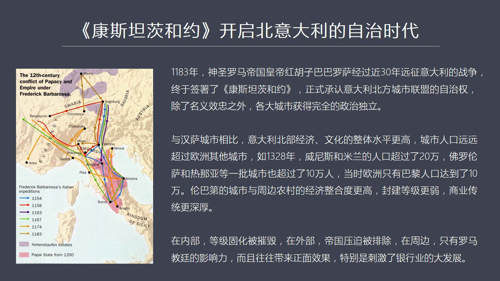

就是轮马地地区获得了完全的自治如果我们研究德国历史你会发现当年的神聖罗马帝国得一致这种帝国反复的从他建国以来从公元962年奥特伊士一直到红胡子巴巴罗沙包括后面还有很多德国皇帝他们往往会征服意大利会反复到意大利去远征主要原因就是意大利的经济贸易当年发生了最早所以他的财园比较冒盛他的税收财政各方面给神聖...

<strong>Cleaned narration</strong>

> 就是轮马地地区获得了完全的自治如果我们研究德国历史你会发现当年的神聖罗马帝国得一致这种帝国反复的从他建国以来从公元962年奥特伊士一直到红胡
> 子巴巴罗沙包括后面还有很多德国皇帝他们往往会征服意大利会反复到意大利去远征主要原因就是意大利的经济贸易当年发生了最早所以他的财园比较冒盛他的
> 税收财政各方面给神聖罗马帝国可以提供非常好的这种财政税收所以北一大利从理论上来说是属于神聖罗马帝国的一个组成部分但是由于经济贸易发展之后北一
> 大利就是轮巴帝这个地带他的反抗意是越来越强烈因为他财大气粗他的人口密集所以他觉得有势力对抗神聖罗马帝国皇帝双方战争打了很多年在183年终于打
> 出了结果就是当年的神聖罗马帝国皇帝红胡子八八老傻打了继位之后接近打了三十年的战争发动了六次远征意大利这样的一种战争最后仍然被打败了被迫签署了
> Constance协议这种合约正式承认了意大利北方城市他的自治权当时叫轮巴帝联盟这些城市被完全负语了他的司法权行政权管理权他对德国皇帝对神聖
> 罗马帝国的皇帝只有名义上的效忠他在管理上是完全自治了所以这就开启了一个新的时代北一大利这个地方出现了大量的城市共和国而这些城市共和国基本上是
> 完全的内政外交一切的行为都是他们自己说的算如果我们把意大利北方的轮巴帝这一代的城市跟汉萨北标的那些城市相比的话你会发现意大利的城市他的无论经
> 济上还是文化上他的水平都明显高于北方城市而且人口也比欧洲的所有城市大城市都要多你比较到了1328年的时候文英斯和米兰这都是20万人的大城市了
> 佛罗伦萨 热闹亚还有一大批意大利的这种中心城市也超过了10万人除了北一大利当时的这个欧洲大陆只有8例达到了10万人也就是达到了意大利的2流城
> 市的水平2线城市的水平所以我们可以从中可以感受到意大利当年这种经济的活力还有他这种人口的这种人口数量的庞大所以他为什么能够抵御深圳罗马帝国的
> 反复入侵他人多他又有钱深圳罗马帝国皇帝王王只能带几千号人来那在这么大的一个城市群里面是很难最终取得胜利的那么伦马帝的城市意大利的北方城市跟汉
> 萨城市相比他最大的特点就是他的城乡结合非常的血和程度非常高也就是乡村贵族搬到城市了那么城市与乡村之间的经济贸易商业的联系是非常顺畅的所以在意
> 大利北部城乡经济是一体化的然后封建的等级制已经被严重削弱了而由于罗马帝国的传承他的文明程度他的商业传统更加深厚这都是比北方那些后来征服的一些
> 满意城市斯拉夫人地区和一北河以东东地区的这些城市羊他的文明的底云要深厚的多也就是意大利北方的城市从内部上来看等级制度被摧毁了那么从外部来看沈
> 胜罗马帝国的压迫也被排除在外了然后在他周围只有罗马教皇对他有影响力但是教皇对意大利的影响多半是有利的影响一笔说教皇最后把银行交给谁让谁来打理
> 他银行业务那个地区他的银行业就会大发展因为教皇统治是整个欧洲基督教世界在每个城市相存都有教会那么所有人都要交11岁都得最后运到罗马教庭谁来负
> 责转账呢当然就是银行业这就是为什么意大利在教皇这个问题上所以康斯坦资合约的签订他意味着意大利北方在欧洲第一次进入了商人阶级执政的新时代这在以前是没有的在非常繁荣的希拉时代

---

### Slide 8

罗马时代都没有出现商人有这么高的地位确定了他的统治地位这在以前从来没有过而且他们的基本国策都是以贸易主导政治就是贸易高于政治在国内和国际的这种关系中体现出来都是贸易优先这是跟以前所有事都不一样的那么这样一来我们看到这种阶级的松动带来的是什么样的后果呢这种等级一旦放松了它就会产生一连串的经济后果我们来...

<strong>Cleaned narration</strong>

> 罗马时代都没有出现商人有这么高的地位确定了他的统治地位这在以前从来没有过而且他们的基本国策都是以贸易主导政治就是贸易高于政治在国内和国际的这
> 种关系中体现出来都是贸易优先这是跟以前所有事都不一样的那么这样一来我们看到这种阶级的松动带来的是什么样的后果呢这种等级一旦放松了它就会产生一连串的经济后果我们来看下一

---

### Slide 9

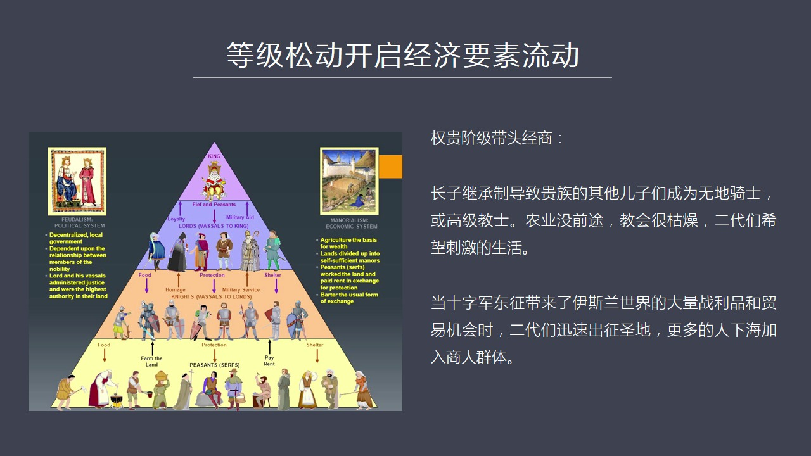

第一个这个产生的效果就是等级松动它会开启经济要素的流动经济要素比如说我们首先看人吧那么商业需要领导者商业的领导阶层是谁很关键它有没有政治权力有没有这种威望社会威望决定了它领导的商业活动能不能成功那么在意大利呢它最大的特点是贵族阶层它是带头经商跟德国跟其他国家都不一样其他国家的贵族是排斥商人的但是在意...

<strong>Cleaned narration</strong>

> 第一个这个产生的效果就是等级松动它会开启经济要素的流动经济要素比如说我们首先看人吧那么商业需要领导者商业的领导阶层是谁很关键它有没有政治权力
> 有没有这种威望社会威望决定了它领导的商业活动能不能成功那么在意大利呢它最大的特点是贵族阶层它是带头经商跟德国跟其他国家都不一样其他国家的贵族
> 是排斥商人的但是在意大利呢双方融合的而且特别是贵族阶层的后代他们的后裔由于长子集成权这个问题导致一个贵族如果生意多一孩子只有老大能够集成全部
> 加产而贵族又不想让自己的地产无限分割那怎么办呢只有把其他的小儿子们有的送去当骑士有的送去当教士当骑士呢它没有土地当教士呢生活也很枯燥所以这些
> 贵族的二代们呢他们就不太安心成天琢磨着要寻找刺激的生活这个时候十字军东争开始了就是公元1095年开始然后一直打了两三百年那么在这个过程中十字
> 军东争带来了新的这种刺激对整个地中海的生活可以说颠覆性地产生了这种巨大的影响很多贵族的子弟这些骑士们去参加了这个十字军然后到地中海东岸一下打
> 开了花花世界发现当年的穆斯林经济这么发达这么有钱可以说当年的穆斯林的世界要比欧洲要发达至少两三百年要比他们要更加进步两三百年那么他们在地中海
> 东岸所进行的战争一方面战争一方面贸易然后获得了大量的战略品也获得了大量贸易机会这个是意大利人大开眼界你比说在公园一零一年热闹亚当年帮助十字军
> 提供传知 提供水手然后维功和节礼了凯萨利亚凯萨利亚港我曾经去过他是在伊斯利亚特拉维福一北即使公里的地方很近现在是一个比较小的一个城市但是当年
> 的他的胜况贸易称广还可以看到一些遗迹当年十军这帮人在热闹亚的海军和水手的帮助之下拿下了凯萨利亚那么热闹亚的这种水手们获得了大量战略品这种战略
> 品包括每人分了48个金币8000个水手还分得了每人分得了两棒胡椒不要小看这个胡椒当年是价值连成的这些东西拿回了意大利引发了热闹亚全城人的这种
> 羡慕计都恨一下就全城狂热就发现了哇打仗能转这么多钱东方贸易如此的这个有前途所以整个城市就废腾起来了每个人都想去做这个韩海贸易所以贵族的领导权
> 很重要他们带了头他们跟商人机机连手开始了那种啟动了意大利的商业远征这个是跟德国和所有地方都不一样的那么这是顶级的在金字塔的中下级中级就是商人
> 了不用说它的下级是普通农民普通农民当时就是在没有机械这个时代人力就是最大的这种经济资源了人力如果不流动各行各也都发展不起来因为你所有东西都需
> 要人力去做所以劳动力能不能自由流动这个是一个关键性论题那么在意大利这个问题是出现的事是什么情况呢就是因为意大利北方有各种贸易机会而农业缺发又
> 活力因为土壤问题、气候的问题导致农业没有发展前途这个时候大量的封建贵族就已经出现了进城潮大一个般的城里去住了那么在乡下了这些装员他以前必须要
> 人坚都在哪所以要求农民你必须要每年需要花多少时间到我这土地上帮我更重或者帮我修路驾桥或者帮我去挖水利这叫牢艺还有食物的地族都得向我交但是他人
> 走了再说这东西和再找这些人来跟你付牢艺他就很麻烦所以意大利的北方出现了把这种食物地族和牢艺地族转变成货币地族那这就是每年交多少钱然后你去更重
> 土地就完事了这个时候那也就是意大利出现了在欧洲最早出现的废除了封建时代的人生衣服以前就是封建领主如果住在装员里头他的司法权他的行政权管理权对
> 农民的这种压榨是直接的他只要人在这你就今天得给他打工干活但他现在人走了一切都变成伟托了这一伟托大家交钱就行了所以这种人生衣服关系一下就就衣服
> ...

---

### Slide 10

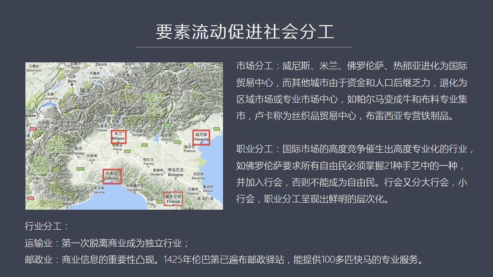

首先市场出现了分工城市类型分工了那么在北一大利出现了像魏尼斯、热闹亚、米兰、弗洛伦萨这四个逐渐发展成了国际的伤贸中心而其他的城市由于资金被这些大城市拿走了被新走了人口主要一向这些几个大城市所以由于资金和人口后继发力这些其他的城市在中世纪中期跟大家企图并进的像什么Parma这种城市、布罗尼亚这些城市慢...

<strong>Cleaned narration</strong>

> 首先市场出现了分工城市类型分工了那么在北一大利出现了像魏尼斯、热闹亚、米兰、弗洛伦萨这四个逐渐发展成了国际的伤贸中心而其他的城市由于资金被这
> 些大城市拿走了被新走了人口主要一向这些几个大城市所以由于资金和人口后继发力这些其他的城市在中世纪中期跟大家企图并进的像什么Parma这种城市
> 、布罗尼亚这些城市慢慢就落伍了它逐渐退化成了一个区域经济中心或者是专业市场中心你比如说Parma后来就变成当地的牛的交易中心和布料专营市场L
> uca这个地方它后来就专门成了丝丑贸易的一个中心布雷西亚它是专门交易铁气的这个时候我们会看到国际城市和地区城市国际上和地区上也出现了一个分工
> 和层次所以我们今天看很多城市说我们要发展成几乎每个省会都会提我们要发展成国际金中中心这是根本不可能的事因为经历资源有限当你集中在某几个大城市
> 的时候中国最多容纳两个城市城在国际金中中心这样的角色第三个都很难或者足够的人才或者足够的资金如果说有个上海在有个香港基本上其他城市都没戏想发
> 展成国际金中心这事根本来门都没有所以从我们经济进化史来看一个地区它一定要会出现要素流动之后一定会出现分工这种市场也会分工城市也会分工比如说在
> 这四大城市中间它也不是做一个它也是有清晓性的比如说文尼斯和热闹样它就主要做海运做贸易米兰呢它就是个商业中介它自己也有一些工业它的商业中介的作
> 用主要是越过米兰有大量的通道可以通道二杯自然以外比如说通过巴塞尔然后金这个蓝银河流域可以直接到Flander地区这是它最主要的一条商贸当通道
> 入口这个商业通道的入口就把在米兰的大门上所以它只要商业贸易发达它就收过路前它就能发除此之外它的访质工业也还可以那么佛罗伦萨呢它主要后来就进化
> 成了金融中心是整个欧洲第一个出现的一个大规模的金融中心它得天堵后的条件就是教会用佛罗伦萨作为它的指定银行当然佛罗伦萨自己还有一些其他的产业上
> 的基础特别是它的仿质工业上毛仿质工业上它也很有特色那么这几个城市一分工你会发现就形成了整个意大利的区域经济的一种合理合理化要素分配就更加合理
> 了第二个分工就是在每一个城市在每一个经济区里面它会出现职业分工职业分工就分成了很多很多行业就是因为在国家要高度竞争在全球市场上要在当年的全球
> 市场上要出现基础竞争那么就必然会催化催生出这种高精度的非常精致的专业化分工比如说佛罗伦萨它就有21个主要的行业就称之为21门首议当然这种首议
> 啊不能侠义理解程就是工业伙那种首议包括律师就是这也是一种首议包括官僚包括快几者都算首议它可以说有7种大首议和14种小首议7种大首议其实就是你
> 有资产的人有社会地位的人和这种商业资本家国际银行家那这些人做着7种大的首议银行业也算大首议之一小首议呢小首议呢它就是这种比如说这个古今行业这
> 个金属制造还有印染这些首工业者所从事的行业叫小首议行业而行会根据它的发展也出现了大行会和小行会这个时候我们看到整个佛罗伦萨包括意大利北部城市
> 都一样出现了垂直的职业分工根据专业等级根据它的社会地位根据它的经济上的这种稀缺性形成了一个垂直性的非常严格的社会分工比如说在佛罗伦萨当时当年
> 的法律就说如果你要想成为佛罗伦萨的自由民你必须得掌握21种手艺中间的一种而且掌握之后必须要通过行会的认证加入这个行会否则你就不能成为自由民所
> 以通过这个办法实际上是强化了行会的管理权同时行会又使得这个行会内部的每一个人的专业技能它的商产的进度包括它是生产的成本销售成本要受到高度的这
> ...

---

### Slide 11

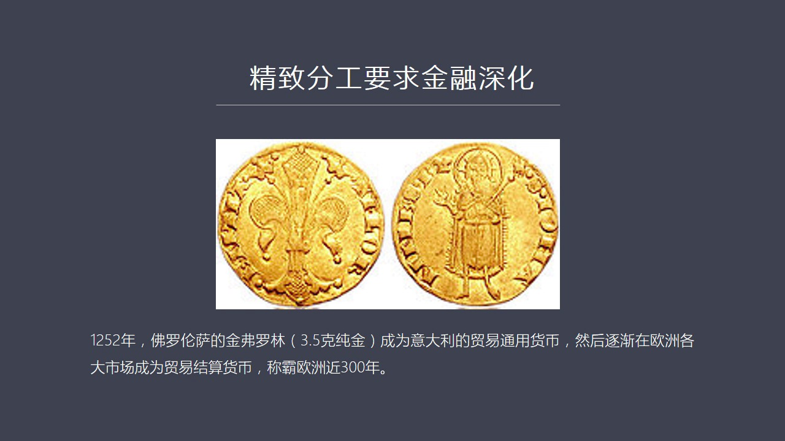

拿什么交换当然是拿钱交换所以经济分工一定会刺激金融业这是必然的所以我们看到一二五二年的时候佛罗伦萨它所发行了这个金佛罗林也就是三点五克的这种纯金它成了整个意大利的贸易通用货币它最后也成为整个欧洲各大市场的贸易节算货币如果说曾经出现的第一种世界货币的话那意大利这个佛罗伦萨的金佛罗林应该算其中之一它在整...

<strong>Cleaned narration</strong>

> 拿什么交换当然是拿钱交换所以经济分工一定会刺激金融业这是必然的所以我们看到一二五二年的时候佛罗伦萨它所发行了这个金佛罗林也就是三点五克的这种
> 纯金它成了整个意大利的贸易通用货币它最后也成为整个欧洲各大市场的贸易节算货币如果说曾经出现的第一种世界货币的话那意大利这个佛罗伦萨的金佛罗林
> 应该算其中之一它在整个欧洲市场上撑罢了将近三百年那么佛罗伦萨它后来发展成了中世纪金融中心的一个重要原因有几个第一就是它有网络罗伦萨这个网络又是怎么来理解呢就是

---

### Slide 12

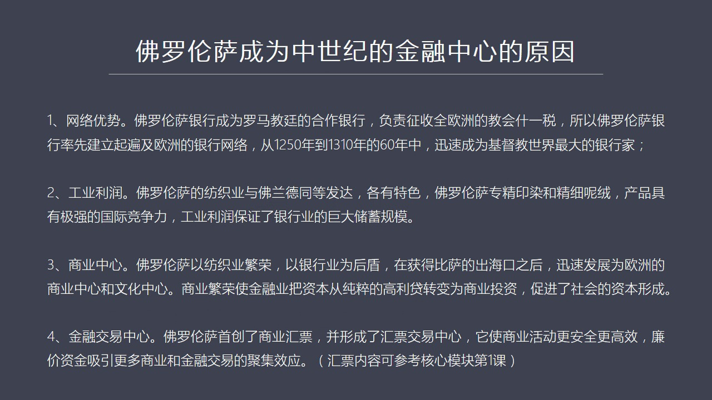

教皇跟佛罗伦萨银行合作你比如说最著名的美帝西家族它建立了庞大的金融帝国就是因为他们家出过两个教皇还出过法国皇后等等所以教皇跟他们家族的关系当然在美帝西家族之前这个佛罗伦萨还有一大批甚至规模比辅美帝西家族还要大的这种银行后来有一种原因倒闭了美帝西家族是后来居上关于这个家族以后我们会通过模块再专闭去介绍...

<strong>Cleaned narration</strong>

> 教皇跟佛罗伦萨银行合作你比如说最著名的美帝西家族它建立了庞大的金融帝国就是因为他们家出过两个教皇还出过法国皇后等等所以教皇跟他们家族的关系当
> 然在美帝西家族之前这个佛罗伦萨还有一大批甚至规模比辅美帝西家族还要大的这种银行后来有一种原因倒闭了美帝西家族是后来居上关于这个家族以后我们会
> 通过模块再专闭去介绍正是由于佛罗伦萨银行成绩了教会的这个业务负责征收全欧洲的教会十一岁而教会变博欧洲所有的成乡这就使得一大力商人必须要跑到各
> 个地方去祖建这个金融网络要不然你怎么会钱呢当时已经发明了会票这是声电歧视团他们发明的但是他的这个应用转账系统还有他的这个商业成对会票这都是在
> 一大力搞出来的那么佛罗伦萨这种商人他们最早在全欧洲建立起了庞大的金融分支网络在这点上有点像胜电歧视团但是他比他更专业他做的是纯金融业既可以做
> 原成会对也可以做这个放态也可以做其他的金融的交易包括这个公債交易包括会票交易他都能做然后这个时候你会发现佛罗伦萨的银行迅猛的扩张从一二五零年
> 的一三一零年他只用了六十年时间佛罗伦萨的银行提出迅速占领了欧洲基督教世界的所有的成乡成了最大的银行家基督教世界最大的银行家他利用了就是一个网
> 络的优势第二优势就是他工业利润就是佛罗伦萨有强大的工业基础他还不同于一个普通的或者纯粹的金融中心他的访职业应该说在当年跟佛兰德地区同等发达两
> 面是旗头病进的佛兰德那边他有他的特色佛罗伦萨这边他的特色是专搞印染还有精细泥溶这是他的强项这个强项甚至佛兰德也比不上这就导致了佛罗伦萨他的访
> 职品在国际上竞争中很有竞争力应该说在中东也好在欧洲北部也好在各地区他都成了一种非常强手的产品换句话说他这个强大的佛罗伦萨强大的工业利润带来了
> 远远不断的银行出去因为大家有了钱怎么办呢当然村银行银行再把这些钱倒出偷向商业这是一个正训款所以工业利润这个是他维持银行业持续不断投资的一个重
> 要的基础第三商业中心佛罗伦萨这个城市他他是以访职业来作为他的繁荣的基础然后以银行业作为后盾这两者加上一起他的优势就非常强大了当年他并不靠海但
> 是他可以获得比萨的拐口比萨是靠海的有海港那么通过征服通过战争通过贸易最后把比萨的拐口给拿下这个时候他就如虎天意了迅速发展成一个欧洲地区的金融
> 中心商业中心文化中心文艺复兴的很多那些伟大的话家们都到佛罗伦萨来来讨生活主要原因就是佛罗萨当时非常的有钱银行家族资助了很多的艺术家搞创作然后
> 搞教会的壁画等等所以他又成了文化中心商业繁荣带来大量的这种投资机会这就使得传统金融业大家就做放高利贷这么简单的一件事主要投给土地地主借给这个
> 农民农民还不上把人家投这个收走这个是主要是做高利贷也有现在由于商业贸易出现了大量新的机会所以这些银行金融业就可以把资金从高利贷这种单出的业务
> 上转移到了服务型的新的这样的领域就是从事贸易从事工业这就加速了社会资本的行程从消费型的资本或者从从高利贷的这种螃胞型资本变成了一种生产型的资
> 本贸易型的资本这就这就叫资本行程那么第四他还形成了金融交易中型佛罗伦萨就是我们以前在我们的玩具那就快承受了很多比如说当图窗生产生产生产生产生
> 产生产生产生产生产生产生产工债发行之后也需要交易在哪交易呢福洛伦萨就是意大利的一个重要交易中心之一所以他有商业成立回票的交易又有这个工债的交
> 易后来还有股份的交易就是股市各种金融票局都在那交易他就成了一个金融活动的中心商业更安全 更有效而且因为他是这个大量资金交易中心所以他资金成本
> ...

---

### Slide 13

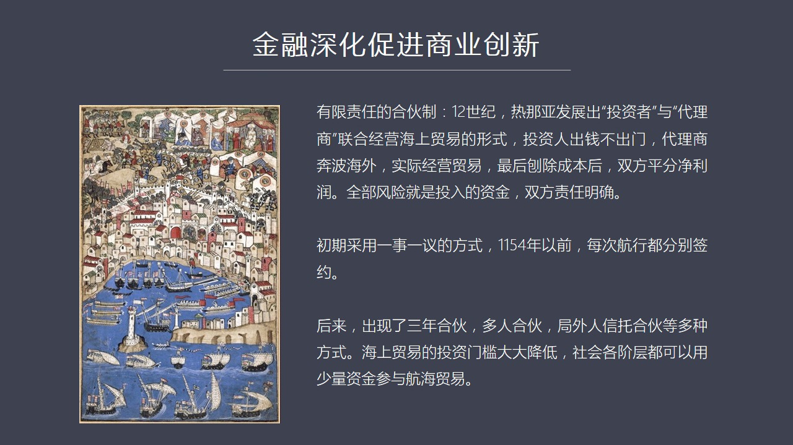

如果说大家投资稿汉萨贸易有一套风险太大所以大家都很担心除非你这个副假天下很有钱否则做汉萨贸易赚钱受到是容易陪下也不得了一个传承了那所有的资本以前赚了一种全部打水标所以他是高风险的行业非常需要分散风险那么又没有一种当年北方这些贸易城市又没有进化出一种所谓的合伙制谁先搞出来呢还是意大利上人比如说在热闹亚...

<strong>Cleaned narration</strong>

> 如果说大家投资稿汉萨贸易有一套风险太大所以大家都很担心除非你这个副假天下很有钱否则做汉萨贸易赚钱受到是容易陪下也不得了一个传承了那所有的资本
> 以前赚了一种全部打水标所以他是高风险的行业非常需要分散风险那么又没有一种当年北方这些贸易城市又没有进化出一种所谓的合伙制谁先搞出来呢还是意大
> 利上人比如说在热闹亚吧他首先进化出了有限责任的合伙制但是合伙制这个最开始的源头是源于伊斯兰伊斯兰的一些商人用到了合伙制北热闹亚人借过来之后在
> 十二十几时候你会发现大家出现了一个分工投资者管出钱具体负责基因打脸的叫代理商他就形成了一种联合进行海上贸易的形势投资人出钱但不出门我只有钱但
> 是我不懂许利亚的什么产品也不懂许利亚的这些贸易的利润代理商是常年奔走于许利亚和热闹亚之间的这种非常老链的商人他们对商业非常敏感但是他自己没有
> 多少钱所以双方义合作就是投资人出钱然后这个代理商抛土然后做了一笔生意之后转来的利润跑出所有的商业成本之外剩下敬利润一人一半这就是早期的这种合
> 伙制这种合伙制的特点是他的风险有限反正我们就做一传贸易对吧赔了就全在里到了同时他还有一个除了有限责任之外他还有一个除了有限风险之外他有一个责
> 任的化定问题出自人说我只出钱对不起我不懂经营经营全是你的事经营人说我只懂经营但我没钱或者我资本有限所以我们俩的责任是化得非常明确的这就是早期
> 的有限责任的这种合伙制那么一开始一般是一是一意比如说我们搞一条船做一手买卖船回来之后后卖光我们就解散了但后来大家觉得合作还不错挺愉快的而且有
> 产生的信任感说我们接着把这个生意做得更长远一些吧所以在一一五四年以后以前都是每三行银都单独签每次签一次后来就出现了三年合伙生意后来又出现了多
> 人合伙因为三年合伙是两个人之间多人合伙是大家一看有两个人他们合作非常好就有第三方第四方第五方第六方要求加盟我们跟你一块儿做我们也投钱进来这就
> 变成多人合伙再往后就出现了局外人想要投资进来这就变成信托了就是本来很多人合伙大家也都是商业伙伴大家彼此认识局外人就是某个合伙人七古八大一剩下
> 来所有的合伙人都不认识这个人但是他有钱他也想进来怎么办呢这就通过一种类似于信托的方式叫信托合伙制来加入这样一来就是整个海上贸易的风险的成本就
> 是投资的门口下降了因为懂不懂海海贸易懂不懂中东这些文化和商品的人都可以穿回一脚这样扭钱那么社会各界层了这个往上一中投的资本就会大大的活跃起来
> 很多人就愿意贸贸风险这样的话就使得这套有限责任制的合伙是就充分调动了市场中这种富裕的资金但是在往前发展就出现了热闹要人搞出一个更高级的叫有限
> 责任的股份制就是现在我们所说的股份赢股份的这种公司这也是热闹要人的发现

---

### Slide 14

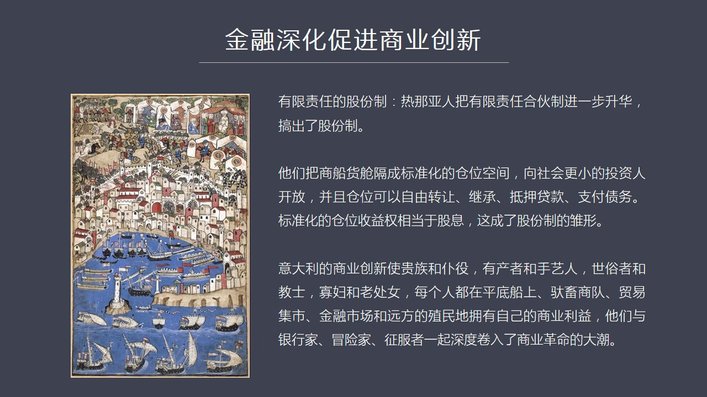

他们的发明手创为什么呢因为有限责任合伙制他还是有个局限就是你这个合伙人毕竟还是有限而且有些人中途想退出很不方便怎么办呢热闹要人搞出了一个新的模式比如说我们要做一次贸易有一艘船船里面有货舱我把货舱划分成一个更小的独立的仓位每个仓位可以单独出售而且每个仓位划分了足够的小比如说原先的一个比较的仓位我会一分...

<strong>Cleaned narration</strong>

> 他们的发明手创为什么呢因为有限责任合伙制他还是有个局限就是你这个合伙人毕竟还是有限而且有些人中途想退出很不方便怎么办呢热闹要人搞出了一个新的
> 模式比如说我们要做一次贸易有一艘船船里面有货舱我把货舱划分成一个更小的独立的仓位每个仓位可以单独出售而且每个仓位划分了足够的小比如说原先的一
> 个比较的仓位我会一分为二在一分为四在一分为八无限的切割下去然后我这个仓位变得越来越小这个小到什么程度呢你就可以放一框东西也行这也是个仓位这种
> 小仓位这就是一种典型的标准化的思路这种小仓位就像股份一样像社会更小的投资人开放不管你是什么寡妇也好或者你是没有固定收入收入这些人也好面包师傅
> 也好大家一看这个投资并不多比如说只要一个金服罗临甚至这个更少大家就可以参加进来满意股或者买多少更小的一个比例大家使得更多的资金能够拥入航海贸
> 易而且这种仓位后来变成了一个可挂盘交易的可以自由转让的这样一种财产这样一种资产而且受到法律认定这种仓位是可以自由转让的也可以继承还可以迭戴款
> 还可以用于支付货物的这种债务作为支付别人的这样的一个支付的货款也是可以的那么这种标准化的仓位收益在市场中他的概念等同于股票的股息股份的股息这
> 个就是所谓股份制的他的最早的出行热闹亚人搞出来的那么正是由于这样一系列的金融创新还有这种经营方式的商业创新你会发现一大例他把所有人的热情都调
> 动起来对商业的热情比如说在一大例不管是贵族还是他的奴谱不管你是有产有产階级还是手艺人也不管你是世俗者还是教会的教室还有寡婚什么老出女这都是一
> 大例的各个阶层的人士每一个人都捲入了商业他们都在远航了平底船上然后在这种池城在山间的这种脱队中间还有各个交易中间的商品贸这个贸易极释还有在金
> 融市场上所成交的那些金融票剧还有包括远方殖民地这些人都有自己的商业利益所以一大例整个社会几乎每一个人他们都与银行家贸险家和这种歧视的征服者一
> 起深入地卷入了这种商业革命的大潮我们可以看到一大例这种商业的总动员它是相当彻底的比汉萨同盟完全不可同仁语了那么这样一来我们再看到他建立下夜我
> 们讲到他建立了一个一这样的模式这样先进和发达的模式建立起了一个变级三个大州的商业执民地而且组建成了一个庞大的网络

---

### Slide 15

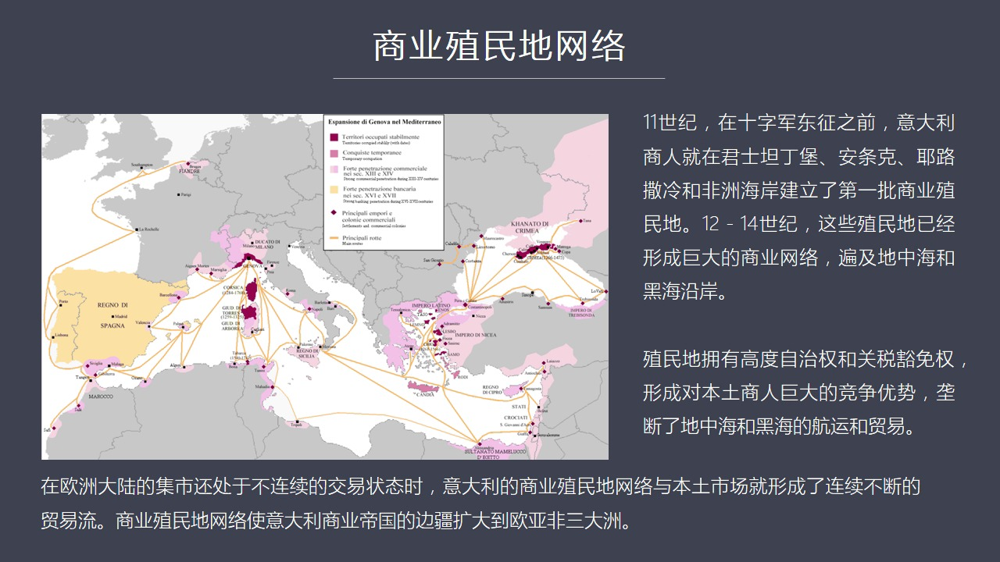

贸易网络这张图我是用的热纳亚人的一个贸易分布图从这张图上我们可以看到黄色的地区是热纳亚人金融和商业渗透的地区那么粉色的地区是渗透程度比较深的地区红色地区干脆出它的商业执民地它直接控制的地区那么我们可以看到这张图上热纳商人已经变步三个大州亚非亚非欧三个大州都有它的商业执民地那么当年十三级的世纪的世人就...

<strong>Cleaned narration</strong>

> 贸易网络这张图我是用的热纳亚人的一个贸易分布图从这张图上我们可以看到黄色的地区是热纳亚人金融和商业渗透的地区那么粉色的地区是渗透程度比较深的
> 地区红色地区干脆出它的商业执民地它直接控制的地区那么我们可以看到这张图上热纳商人已经变步三个大州亚非亚非欧三个大州都有它的商业执民地那么当年十三级的世纪的世人就写到热纳亚人是这么多他们散步在世界各地

---

### Slide 16

只要他们在哪里定居就在哪里建立起另外一个热纳亚就是有一帮殖民者到了一个港口去跟当地的城主签订了协议之后成立了殖民地商业殖民地之后它的所有的建筑它的装饰它内部的通行的法律

<strong>Cleaned narration</strong>

> 只要他们在哪里定居就在哪里建立起另外一个热纳亚就是有一帮殖民者到了一个港口去跟当地的城主签订了协议之后成立了殖民地商业殖民地之后它的所有的建筑它的装饰它内部的通行的法律

---

### Slide 17

制度一切都是照板热纳亚的所以它是完全的靠皮和腹致在十一世纪也就在十四军东争之前一大令人就已经开始商业扩张了当时它在军审宁宝安条客然后叶陆杀冷还有非洲的沿海的一系列的城市都建立起了第一批殖民地然后再往后呢随后12到14世纪这些殖民地在欧亚非三个大陆之间就形成了一个巨大的眠密的商业网络那么这些殖民地它最...

<strong>Cleaned narration</strong>

> 制度一切都是照板热纳亚的所以它是完全的靠皮和腹致在十一世纪也就在十四军东争之前一大令人就已经开始商业扩张了当时它在军审宁宝安条客然后叶陆杀冷
> 还有非洲的沿海的一系列的城市都建立起了第一批殖民地然后再往后呢随后12到14世纪这些殖民地在欧亚非三个大陆之间就形成了一个巨大的眠密的商业网
> 络那么这些殖民地它最大特点呢就是它跟当地政府谈好条件具有着高度的自治权就是之外法权同时还有关税的货面权这样一来就对本土商人商人就形成了巨大竞
> 争优势本土商人需要百分之百交税而热纳亚商人一大例商人他们可以不用交或者这个指交很少一部分那在竞争中本地商人跟一大例商人相比他就吃亏吃得太大争
> 不过那么逐渐的一大例商人就垄断了黑海地中海之间的贸易不管你是航运还是货运还是这个课运都被一大例商人所垄断所以这个时候一大例商人在整个的南方形
> 成了一首折天这样的一个状态那么当年一大例建立起一个三个大州的贸易网络的时候殖民地网络的时候其实北方的很多城市还很落后是在法国我们知道有个乡民
> 纳吉市其他国家也有一些吉市区域性的吉市但这些吉市都是每年只开一段时间比如说几月九月有的是八月开有的是几月开只开一个月他就是贸易或者说是市场交
> 易是断的是监断的但是一大例商人之名网跟一大例本土之间的市场是连续不断的贸易流它是从不监断的永远交易的市场这一点就比欧洲所有的这些北方的这个国
> 家叫新进太多了那么我们再回顾了整个这个一大例它的城市和它的这种经济贸易发展过程之中我们如果做一个结论这个结论就是比较一大例和汉萨

---

### Slide 18

我们可以得到一个非常明显的一个结论这个结论就是什么首先我们来探讨一下什么是市场深度在我看来市场深度这个概念它就是一种商业的精神和商业的制度行为在一个社会中它的渗透度渗透的越彻底这个市场的深度越深那么它表现在经济要素在自由流动过程中所受的阻力技术最小如果我们能够测到这个阻力技术的话你会发现如果这个阻力...

<strong>Cleaned narration</strong>

> 我们可以得到一个非常明显的一个结论这个结论就是什么首先我们来探讨一下什么是市场深度在我看来市场深度这个概念它就是一种商业的精神和商业的制度行
> 为在一个社会中它的渗透度渗透的越彻底这个市场的深度越深那么它表现在经济要素在自由流动过程中所受的阻力技术最小如果我们能够测到这个阻力技术的话
> 你会发现如果这个阻力技术越小越小的话我们看到供求关系去线中这个只要有一条曲线改变另外一条会马上跟进反应里面度非常的快这个就叫市场深度深那么如
> 果对比意大利北部和汉萨同盟我们可以明显发现意大利更有市场深度也就是西大利的这个整个的市场深度它的发源点是等级制度开始松动等级制度松动之后它就
> 启动了经济要素开始流动你要在严格封建等级制度之下人也不能流动土地也不能交易然后各种什么矿然后合流这都被封建贵族把着那就没法发展经济要素了经济
> 要素就没有法流动了这叫徹底固化再加上人生衣服那这个地方别发展贸易了别发展经济了所以等级松动再先经济要素然后再等级松动之后开始自由流动然后你这
> 个流动的要素流动的这个规模越大越需要社会重新分工来符合这个要素流动的要求所以要素流动必然会促进社会分工那么一分工就会导致分工的越精细要求交易
> 的规模就是交换了规模要效率要更高这就必然刺激金融业这个金融业它一生化就会导致比如说支付手段商业会票还有这种远程会对还有各种各样的新的制度创新
> 它就会导致各样的各种各样的商业模式都出现多种多样的这种变化那么这些东西会共同刺激整个社会的更多民众从上到下的所有民众参与到商业活动中参与的更
> 徹底最终参加人越多使得封建等级制度越不容易维持它就会越来越更加松动那么就加强了最后就总的效果就是加强了整个社会的流动性这就是个正寻环商业汪越
> 越发达最终的效果是等级制度被削弱的程度越深到最后完全被充滑这就是一个自我加速它就是这样了一个寻环的过程但是如果我们看汉萨汉萨的情况就跟意大利
> 出现了不同的这样的一种状况如果我们对比的话你会发现汉萨同盟跟周围的封建的贵族是尖锐对立的双方是井水不上河水的或者叫尽为分明他们实际上是经济上
> 的孤岛跟周围的地区的经济贸易联系比较少然后经济要素没有办法在尝试和相存之间自由流动贵族们住在相分商人们住在尝试双方老死不相往来如果要往来的话
> 往往是一战争形式打结或者攻击然后这个报复以这样的形式发生交流这就导致了双方的敌对双方的这种仇视这样的话封建领土阶层它并没有喪失它的经济实力因
> 为它的农业还在扩张它的力量还在提高同时它还有政治实力和军事实力这个时候它对城市中商人搞的这套很赚钱的东西跟我们又不一样怎么办那就是对你非常的
> 对立这个情绪对立政策上对你敌事这就导致了整个社会流动性不是被瓦解不是出现松动而是进一步的固化就是这个社会等级制度它不是说松动了而是更加固化了
> 社会流动性实际上变得更差这就是汉萨跟意大利最本质的区别这是一个结论第二结论就是整个意大利市场它的市场更具深度所以它的商业技术商业技巧的水平要比汉萨高很多意大利商人它有先进的公司制度

---

### Slide 19

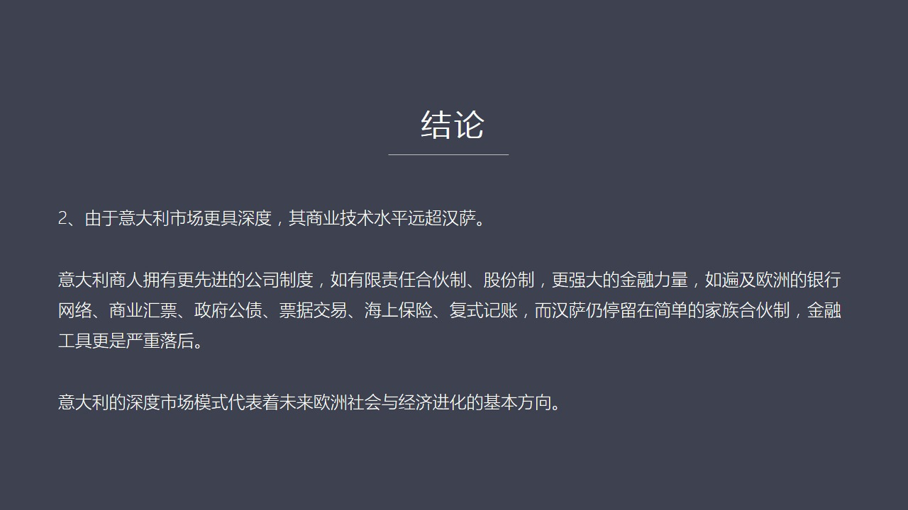

有限责任合伙制股份制还有它有更强大的金融力量你比如说它有强大的银行体系它有商业汇票它有政府公債票局交易还上保险还有一个非常重要的富士机长这也是意大利益商人的发明这么多商业技巧再加上它的市场的深度我们会看到它跟汉萨比起来汉萨就显得太原始了因为汉萨它的精英模式还是简单的这种家族合伙制它的金融工具也非常的...

<strong>Cleaned narration</strong>

> 有限责任合伙制股份制还有它有更强大的金融力量你比如说它有强大的银行体系它有商业汇票它有政府公債票局交易还上保险还有一个非常重要的富士机长这也
> 是意大利益商人的发明这么多商业技巧再加上它的市场的深度我们会看到它跟汉萨比起来汉萨就显得太原始了因为汉萨它的精英模式还是简单的这种家族合伙制
> 它的金融工具也非常的落后手段也很有限你比如说为什么在波兰你会发现汉萨商人争不过学习了意大利商业本领的这个和烂人一个很重要原因就是你如果汉萨商
> 人只用精英币做交易而和烂商人已经开始使用汇票了而且可以提前预付而且有其他的这种商业配套包括传军的保险来做各种样的配套服务的话那么你汉萨商人跟
> 这么先进的这样的一种商业模式比起来自然就落后了最后你很难跟南方的这种贸易相PK这就是我们得到的一个基本判断就是意大利的这种深度市场模式代表这
> 欧洲未来社会和经济进化的基本方向好 今天我们关于市场深度和这种供求关系之间的这种联系这个问题就先说到这儿最后给大家推荐一下那些独物除了建乔经济史之外还有佛罗伦萨史

---

### Slide 20

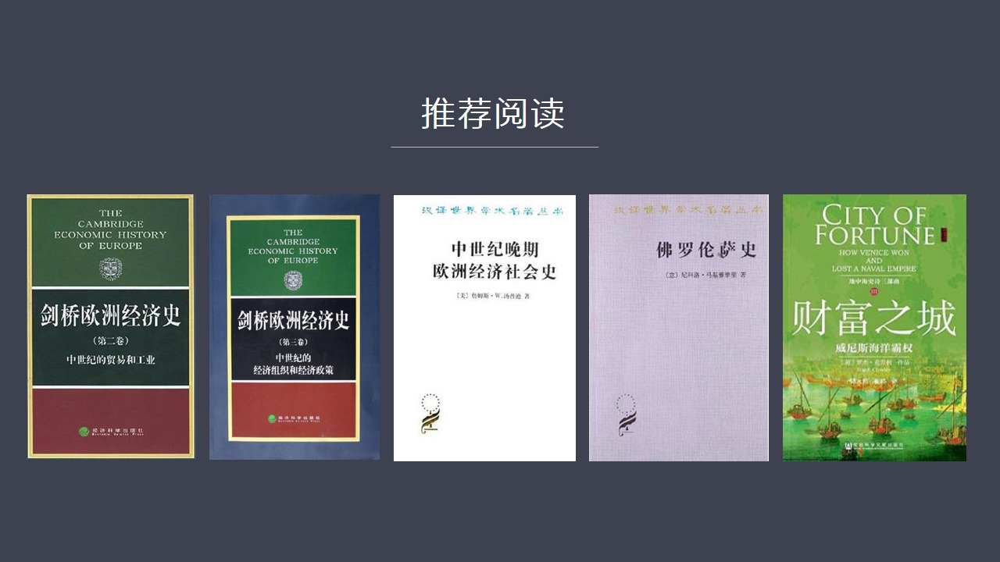

还有财富执程这两本书佛罗伦萨史专门谈到了佛罗伦萨的访职工业和他的工会他的很有意思的东西财富执程主要是讲这个威尼斯和热纳亚双方争霸他们之间所爆发的就是内部和外部所出现的种种有意思的现象好 今天我们关于市场流动性和社会流动性和市场深度的话体现说到这里

<strong>Cleaned narration</strong>

> 还有财富执程这两本书佛罗伦萨史专门谈到了佛罗伦萨的访职工业和他的工会他的很有意思的东西财富执程主要是讲这个威尼斯和热纳亚双方争霸他们之间所爆
> 发的就是内部和外部所出现的种种有意思的现象好 今天我们关于市场流动性和社会流动性和市场深度的话体现说到这里

---

### Slide 21

<strong>Cleaned narration</strong>

---
