# 核心课视频-010.市场的进化（四） — Slide Notes

> **来源**：鸿学院核心课程  
> **幻灯片**：18 张

---

### Slide 1

市场进化的第四部分这讲我们要重点分析一下比较优势理论比较优势理论在中国一直有比较大的争议主要分成两派一派认为比较优势理论它是合理的主张中国在目前全球这种分工体系之中应该主动去适应另外一派认为比较优势理论它这种理论最终发展的方向将会把中国限制在这种产业的低端所以呢这两种不同的观点在中国的学书界还是有很...

<strong>Cleaned narration</strong>

> 市场进化的第四部分这讲我们要重点分析一下比较优势理论比较优势理论在中国一直有比较大的争议主要分成两派一派认为比较优势理论它是合理的主张中国在
> 目前全球这种分工体系之中应该主动去适应另外一派认为比较优势理论它这种理论最终发展的方向将会把中国限制在这种产业的低端所以呢这两种不同的观点在
> 中国的学书界还是有很大争议的有建于这个理论以及关于它的这些争议在很大程度上影响了国家的政策所以我觉得我们在这个分析市场进化的这一期内讲的中有
> 必要把很多重点的理论问题从跟上把它分析清楚这就是我们今天这讲的主要目的就是比较优势理论它所建立的逻辑的体系它合理还是不合理那么在历史发展过程
> 之中市场的进化的真实的案例又是怎么样那么从这些案例中间我们又能得到什么样的起发我们先看第一页PPT关于市场的这个比较优势理论

---

### Slide 2

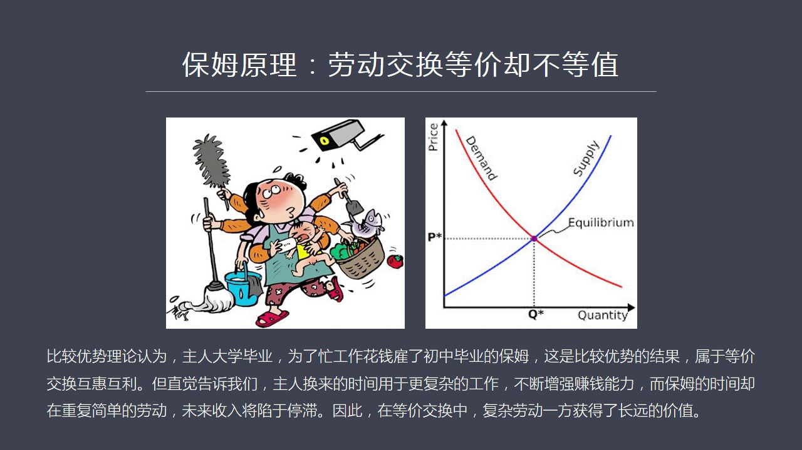

我觉得这也是市场理论中间那个非常重要的组成部分那么在第一页PP中我想从保姆原理来理解这个比较优势理论它的基本原理和概念你比说这个保姆原理我认为它是在提到劳动交换的时候它其实它的核心理理念是一种等价交换那么如果我们看供求关系图你会发现在市场中有很多人需要找保姆还有一个保姆市场那么当保姆的供应方和需求方...

<strong>Cleaned narration</strong>

> 我觉得这也是市场理论中间那个非常重要的组成部分那么在第一页PP中我想从保姆原理来理解这个比较优势理论它的基本原理和概念你比说这个保姆原理我认
> 为它是在提到劳动交换的时候它其实它的核心理理念是一种等价交换那么如果我们看供求关系图你会发现在市场中有很多人需要找保姆还有一个保姆市场那么当
> 保姆的供应方和需求方需要找保姆人之间达到平衡的时候我们认为这个保姆的价格是一个合理的市场价格就是等价交换但是在我看来这种等价交换它强调了等价
> 但是真的相等吗从价制角度来说它真的相等吗比如说用保姆这个例子我们可以来解读一下这个问题比较优势理论他们认为比如说找保姆的主人大学毕业工作很繁
> 忙所以他现在愿意花钱去顾一个保姆来照顾他的日常生活而保姆还可能是个初中列生也没有什么其他勞动技能所以他只是在打扫卫生负责做饭这些方面他有一定
> 的特长所以这种理论就认为只要双方愿意在市场中形成了这样一个价格在此基础之上这种劳动的交换它就是一种等价交换但是我们其实很多人我们从日常的直觉
> 就能发现这里面其实有问题为什么有问题呢我们可以想象这个主人他所从事的工作是一种高端的比较复杂的不管是技术工作还是商业工作还是其他的任何方面的
> 工作也就是主人用保姆的时间比如说八个小时的保姆时间来换取他把这么多同等的时间用于一种更复杂的勞动所以这种交换是一种复杂勞动和简单勞动之间的互
> 换保姆做的工作是一种日常性的重复的工作它没有什么太大的创新性而主人做的工作它有很大的这种技巧技能上的极累性所以时间如果我们从长远来看这种交换
> 的最终的后果只会是主人它的赚钱能力越来越强而保姆呢有因这种技能没有得到提高都是一些日常的所随的重复性的工作那么你的挣钱能力就会相对的停止那么
> 也就是从这个等价交换中我们会发现它中间存在的一个问题就是复杂勞动和简单勞动之间的这种交换虽然从供求关系来说它是等价的但从时间效应来说从未来发
> 展的机会选择来说它确实不等值了那么比较优势理论只强调了在现实情况之下供求关系平衡所实现的那个等价性而完全忽略了或者不愿意去谈回避了它长远的这
> 种极累的不等值的效应所以我们可以从这个例子中会发现这个比较优势理论如果用在个人身上那么它将会产生一种社会的财富的分配的不均等的现象如果用在国
> 家身上就长远而言它会使一个这个处于优势的国家它会越来越强大而处于一种第一端的领事的国家会越来越弱小它会增加一种马太效应这一点就是我们必须要深
> 刻理解特别是要从历史案例中去找到相应的这种历史案例来说明这一点这就是我觉得所有的经济学理论你不能够抽象的提一个概念或者抽象了建立一套理论模型
> 所有的概念所有的框架必须来源于真实的历史情况如果没有真实的历史情况相对应你就不能够发现这套理论体系在实践中应用情况怎么样因为经济学理论不同于
> 物理学不同于化学这些实验科学可以在实验室里面找到问题的答案对还是错最后可以检验出来而经济学理论呢它没有办法通过实验来检验你只能通过漫长的历史
> 发展的进程来解读某一种模式合理还是不合理然后体验出这个模式来看现在的情况它的发展趋势怎么样然后来预判未来它的未来走势会怎么样所以在探讨经济学
> 理论的时候我觉得有两种基本的思路一种是纯粹的抽象的理论模型就是越来越偏向于数学化我不管这个国家或者这个经济体的它过去的历史文化宗教包括民族、
> 信仰等等这些东西我不在乎我只把它抽象成一个数学模型然后用数学公式然后来分析给出答案来判断这个国家经济的走势另外一个学派就是从经济史的角度去分
> ...

---

### Slide 3

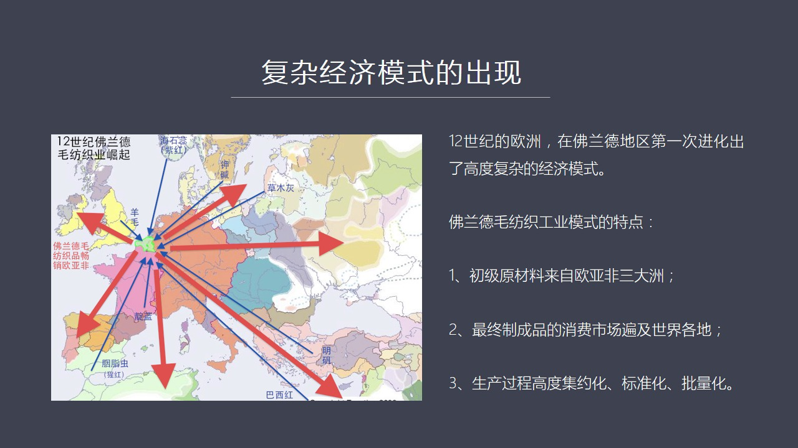

在这一页下液我们会看到12世纪弗兰德的毛访工业崛起我们将以这个案例来分析一个国家或者一个地区它这种复杂的经济模式是怎么崛起的因为我们刚开举的保护类子特别强调了主人所从事的工作是一种复杂性的劳动保护的工作是一种简单重复性的劳重两者进行互换就长远而言肯定是不对等的也就是从事复杂劳动的这个这一方获得了长远...

<strong>Cleaned narration</strong>

> 在这一页下液我们会看到12世纪弗兰德的毛访工业崛起我们将以这个案例来分析一个国家或者一个地区它这种复杂的经济模式是怎么崛起的因为我们刚开举的
> 保护类子特别强调了主人所从事的工作是一种复杂性的劳动保护的工作是一种简单重复性的劳重两者进行互换就长远而言肯定是不对等的也就是从事复杂劳动的
> 这个这一方获得了长远的优势在国家经济发展模式中这个道理是同样的这就是我们要强调为什么分析一个历史真实案例像弗兰德它就是在西方历上也可以说在全
> 世界历上第一次进化出了现代工业的基因我们需要仔细分析它它是如何进化出来的那么它再跟它进化出来这套复杂体之后再跟其他人做交易做贸易的过程中它是
> 如何获得了更大的优势而对方又是如何被逐渐的学弱的这是马太效应必然存在所以12世纪我们来看弗兰德崛起的历史你会发现这个地区形成了非常独特的一种
> 经济模式在途中我用蓝色的这种箭头标志出了它这种毛访工业所需要的重要原材料的来源你会发现它这个最大的特点就是初级原材料来自欧亚飞三个大路你比如
> 说羊毛毛访工业的最基本的原材料是源于英国英国的凌晨俊的这种羊毛当时欧洲最优积的羊毛所以首先是英国向弗兰德地区供应羊毛当然后来西班牙的羊毛也不
> 错美丽奴的羊毛也不错但是后来才向弗兰德地区供应的所以我在这个途中为了减化我只体验出了每一种或者主要的原材料的重点的来源所以羊毛我们这个蓝线头
> 是源于英国除了这个之外第二个比如说燃料在羊毛生产毛访职工业中间非常重要的是燃料染色器从哪来其中有一种如果我们暗示是真的方向来走的话就是来自于
> 挪威的海石锐海石锐这种第一类的这种职务提供了这种子红的染料那么如果再往顺时真方向转我们会看到在波罗地海地区比如说在锐点大量出产假检这种假检也
> 是毛访职工业中非常重要的这个煤染剂就是你要染色那么煤染剂是中间毕不可毕不可少的一种原材料然后我们在往顺时真方向转你会发现草木灰草木灰大家觉得
> 很奇怪为什么英国人自己或者这个冯兰德人自己不能够去烧点树弄草木灰呢如果按照冯兰德当时的这个防止工业发展的规模那么也就是把当地所有树全部烧光这
> 个草木灰也是不够的这个草木灰也是印染过程中一个非常重要的染色剂毕不可少而且虚实上非常大在当地大家都把它叫做一种叫这个非常神秘的一种这种木灰这
> 种草木灰主要有蓝云波罗地海也就是波罗氏雷带有大片的森林他们森林资源要原比冯兰德地需要丰富的多所以草木灰是源于那个地带波罗地海地区另外在往后我
> 们会看到民凡民凡也是重要的这种没染剂这种民凡当时在中世纪的时候主要出产于土耳其半岛就是安娜土利亚内那个地带除了这个之外还有黑海地区也有一部分
> 埃及也出产一部分但是最主要的贡用地是在土耳其除了这个之外还有这个巴西红巴西红主要是源于这个热带地区比如说很多从东南亚地区转移过来巴西红它是一
> 种是一种木材然后这个木材它进行了这个切割之后体链出来这种染料也是一种红色的染料它在这个毛访之工业中也是非常重要的一个一个染色染色的原材料另外
> 还有就是在法国南部这个电栏这个所谓电庆草这种草可以体链出一种蓝色这种蓝色是印染工业中所有蓝色的一个基准也是需求上最大的一个领域它主要来源于法
> 国的南部除了这个之外还有一种重要的染色材料叫烟之红烟之红它的主要来源是来自于烟之红这是一种地中海的一种一种以项目为时的这么一种虫子那么它死后
> 干了之后所体链出来的这个染料可以用在红色染料中间因为它的颜色特别的鲜艳特别是用于新红这种颜色的配置烟之红可以说是品质最高的也正是因为这个原因
> ...

---

### Slide 4

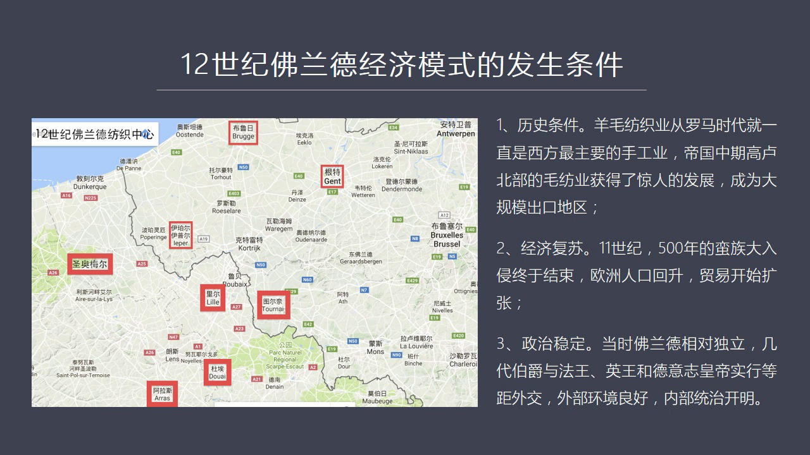

其实如果我们从经济室来看我看到很多欧洲经济室方面的这种中世纪早期可以说从罗马帝国崩溃以来有大量的类似材料可以验证也就是Flander的访值工业它的发源应该是这个罗马帝国崩溃后应该是最早的它是第1个起来的也就是在公元10几几年1024年前后就已经有大量的文字记载了那么这个地区它为什么后来能够崛起我觉得...

<strong>Cleaned narration</strong>

> 其实如果我们从经济室来看我看到很多欧洲经济室方面的这种中世纪早期可以说从罗马帝国崩溃以来有大量的类似材料可以验证也就是Flander的访值工
> 业它的发源应该是这个罗马帝国崩溃后应该是最早的它是第1个起来的也就是在公元10几几年1024年前后就已经有大量的文字记载了那么这个地区它为什
> 么后来能够崛起我觉得有三个重要的原因第1个原因就是它的历史条件好历史条件呢如果我们看这张地图你会发现这是12世纪Flander地区主要访值工
> 业的城市中心那么从这张图上我们可以看到我用红色比较粗的线框材的这些地方是主要中心用细红线所圈起的地方是比较次要的辅助中心这是在12世纪的时候
> 当然再过一个世纪它的中心发生了变化那么在12世纪的时候我们来看其实法国我们在图中所看到的五个主要的中心有四个都在法国其中最主要的包括阿拉斯、
> 杜挨、李尔和盛奥美尔这四个都在法国这是法国北部的Flander地区然后现在国境线偏比利时那边还有陀尔奈这五个构成了当年Flander最大的防
> 止业中心那么现在在比利时境内的像布鲁日、伊普尔和根特这三个当时相对叫小后来我们会发现伊普尔的防止工业变得非常地强大它的伊普尔的部不管是中东还
> 是布鲁地海还是在世界各个市场伊普尔部曾经有一度是最显赫的这种防止品也就是我们所说的Flander地区包括了法国西北角这个地带和比利时它的偏难
> 的这些地方那么当时这个地方在历史上来看就是第一条件历史条件它不是说突如其来的崛起的实际上在罗马时代这个地区就已经是非常文明了如果从访事业整体
> 来说全世界各个地方都在搞访智都是手工业的重要的一个组成部分无论东方还是西方那么在罗马时代特别是在罗马帝国开始以后到罗马帝国中期你会发现罗马的
> 经济发展很有意思一开始是伊大利经济最发达但后来伊大利的这种工业开始就是手工业开始扩张其中最主要的一个新型的中心就在高炉的北部就是我们看到这种
> 图的主这些地区这些城市的地区在罗马帝国的中业这个地方就已经非常的发达了它的手工业已经成了整个罗马帝国中跟伊大利旗头并进的量大出口中心重要在这
> 里我要强调一下一般的访事业是为了满足本地需求或者各家各厚的需求但是以出口为导向这个地区表明了它的生产力它的防治工业的这种组织能力和生产能力都
> 非常强大已经不再是为了满足于本地市场而是面向出口市场所以这个是它的历史条件就是福兰德地区在罗马时代就已经成了防治业的先区那么第二个条件就是1
> 2世纪是经济副蘇顿一个主要的起点为什么在这个时候出现了大的经济副蘇呢因为从罗马帝国后期我们会发现日晚满足不断的冲击罗马帝国的边境最后导致了帝
> 国整个经济体的解体就是经济中心一下就碎片化了每个地区出现了去中心而以前的罗马帝国为中心的那种财政中心金融中心还有它的整个的帝国的经济体的核心
> 崩溃了这就导致了远程贸易突然没有重心而出现了倒退和瓦解这就陷入整个经济的销调贸易的销调再加上满足入侵所导致的交通混乱农田的水利这个维护不行再
> 加上瘟疫战争的人口死亡所以这都导致了罗马帝国公元476年崩溃以后长期的经济的销调和商业的倒退可以说这种震荡后来连续不断的由于满足冲击一直持续
> 不断比如说后来的博根帝还有轮巴帝还有维金人不断的去冲击当时的西欧这个经济体所以它的整个的经济一直不稳定社会一直不安定一直到11世纪前后最后一
> 波维金人他们也销听下来了也就是只有从这个时代开始500年的满足大入侵才终于落下了围墓这个时候人口由于不打仗由于没有这种海盗骚扰了人口自然就会
> ...

---

### Slide 5

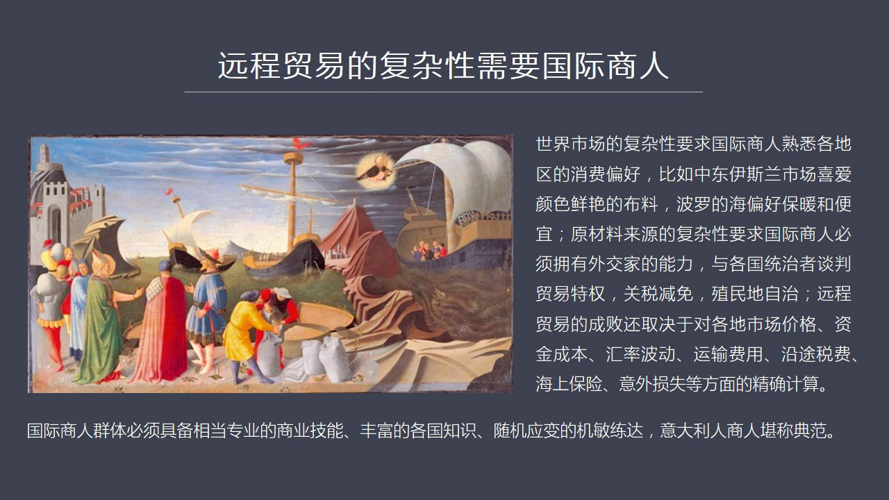

由于它跟以前的忠实机的手工业内套体系已经完全不同了它的原材料是来源于三个大周所以这个组织货源这需要一种远程贸易的组织需要获得原材料的能力同时它的销售市场也在三个大周所以你怎么去打开当地的市场这也需要强大的国际贸易的组织能力这个时候我们会发现以前的那种商业模式完全是玩不转了如果你只是一个独立的手工业者...

<strong>Cleaned narration</strong>

> 由于它跟以前的忠实机的手工业内套体系已经完全不同了它的原材料是来源于三个大周所以这个组织货源这需要一种远程贸易的组织需要获得原材料的能力同时
> 它的销售市场也在三个大周所以你怎么去打开当地的市场这也需要强大的国际贸易的组织能力这个时候我们会发现以前的那种商业模式完全是玩不转了如果你只
> 是一个独立的手工业者你怎么能够到中东地区去开平市场呢你怎么能够获得土耳其的民凡呢你怎么能获得挪威的这个海石锐呢你怎么会你怎么能够获得其他地区
> 的巴西牧呢那简直不可想象因为你没有这个能力你又怎么能够把步卖到埃及呢显然以前的忠实机一个独立的手工业者在早期你可以为本地生产为本人生产周边市
> 场生产这都没有问题但是一旦变成了国际化的新的这种模式那就必须要进化出一种新的群体这个群体就是要了解海外市场要了解货源和原材料的它的这个源头而
> 且能够又需要把它组织起来这就需要一种高度化的一种国际商业技巧所以呢我们会看到在这个过程中它显然一件的需要进化出一种新的一个群体也就是从职业分
> 工来看必须要有国际商人来组织国际贸易那么我们来看当时的世界市场它已经非常复杂了它这种复杂性体验在哪呢就是各个地区的消费者对这种布料有着完全不
> 同的需求你比如说中东伊斯兰市场这些人他就比较喜欢颜色非常鲜艳的布料我们这个可以看到特别是新红他们对新红的这种布料有着极其强烈和明显的这种爱好
> 所以你会看到它为什么新红的布料一直是最贵的就是因为中东那帮人有钱当年它的经济贸易它的经济的这个实力或者它文明程度要比西欧这边起码要领先两三百
> 年所以那个地区是有钱的地方那边的人就喜欢这个颜色而这个颜色最主要来源就是要靠颜之红颜之从这个体链出来的这种染料再加上其他的配色所以你必须要了
> 解那个市场它有什么独特的需求那么波罗地海地区由于天气比较寒冷它不太需要颜色很鲜艳它就需要保暖颜色普通一点问题不大但是一定要暖和价格一定要低每
> 个市场都有每个市场独特的这种需求只有国际上人在这一地方有大量分支机构或者经常到这一地方去做买卖的人才能搞得清楚人家需要什么那么原材料呢我刚刚
> 已经说来自于三个大州每个大州都有自己不同的特点你比如说在中东地区你就需要跟穆斯林达较到需要跟苏丹们去达较到那个地区比如说埃及那你需要跟埃及去
> 谈不同的条件蓄料又是蓄料的条件你要跟萨拉丁去怎么谈条件然后要跟这个北游的这些国家波罗地海的国家又怎么谈条件你要跟汉萨上人又怎么谈条件汉萨你承
> 证所以你要你要这个要求国际上人同时还是个外交家因为你要谈贸易条件这就涉及到特权贸易特权人家给你多少比如说关税给你全面还是给你免百分之七十或者
> 百分之九十这是需要谈的还有你的商人在那建立贸易之名地条件比如说制外法权给不给比如说你的居住是对方提供需票监视你自己需票自卫还有很多诸如此类的
> 出现了纠分应该怎么来处理海上运输出现了海难等等这些问题的处理全部都需要跟各国统治者去谈谈条件所以需要它有一种类似于外交家的这种能力才能搞定这
> 些事另外还有一个方面就是专业性就是远程贸易的成败由于你是把很远了一个地方好几千公里以外的东西要运到这个地方藍德地区来销售所以你必须要对价格高
> 度的敏感你得知道你中间能赚多少钱那个价格你的进价是多少在藍德地区你能卖价是多少中间有多大利润但是这个利润又在随时变化发生变化然后你需要容多少
> 资金比如说你当然不会全部用自己资金来做买你会找人去借比如说找意大利的这些银行机构去借你还是使用会票做这种支付和交易而会票还要考虑到这个会率的
> ...

---

### Slide 6

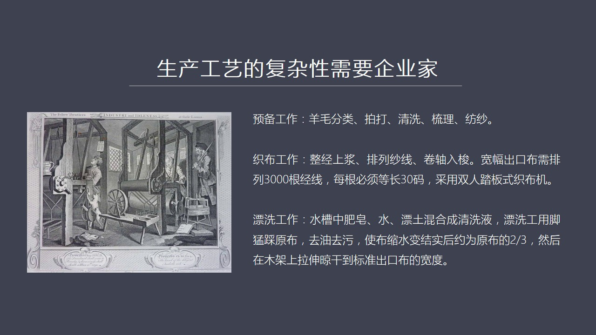

要复杂得多就是生产工艺的复杂性要求出现企业家这个阶层以前中世纪的师傅一个人从拍打羊毛准备工作一直到这个房知然后票洗然后染色然后最后自己去销售他一个人就能搞定或者一个小做方就能搞定现在这个生产工艺高度分工了变得非常的复杂你必须说如果我们来看他生产工艺的话这是12世纪《Flander》已经出现了一个非常...

<strong>Cleaned narration</strong>

> 要复杂得多就是生产工艺的复杂性要求出现企业家这个阶层以前中世纪的师傅一个人从拍打羊毛准备工作一直到这个房知然后票洗然后染色然后最后自己去销售
> 他一个人就能搞定或者一个小做方就能搞定现在这个生产工艺高度分工了变得非常的复杂你必须说如果我们来看他生产工艺的话这是12世纪《Flander
> 》已经出现了一个非常禁止于现代工业的这么一套分工体系比如说预备工序至少就包括五个预备工作就包括五个工序羊毛分类因为你的羊毛是来自于海外有的是
> 来自于英国有来自于西班牙还有一些是本土的羊毛也有一些从其他国家来的所以你的羊毛首先要分类从一个传过来了一打包这个一拆包哪种羊毛应该放到哪里应
> 该怎么来给他定价这都需要这就要准备工作有些羊毛呢在路上比如说这个受潮了有些是弄脏了有些有油所以你要拍打和清洗清洗要把它全部拍打赶紧拍打松然后
> 松软之后清洗清洗之后把油这个屋子去掉然后是书里书里这就是涉及到一个它实际上已经涉及到一部分的技术工作了比如说它有各种不同的工具来进行书里有长
> 工具有短工具然后是访杀访杀一般是交给访杀工在自己家里面去完成然后把杀访回来之后就是从毛变成了这个杀线回来之后这是已经经历了五道工具了然后进入
> 支布这个工作流程支布又至少分成几个工具比如说首先是整经上江就是把经线成功要整好因为经线和伟线之法是不一样的经线必须要上江它要更接视一些它必须
> 要数这个数着排列然后要把它排出多少因为你高度节化生产你是出口部所以你的宽度每个城市的宽度都是标准的固定的比如宽度宽幅部宽幅都是三千根左右经线
> 每个经线怎么排每个经线的长度必须要是三十码不能多也不能少所以你要把每个经线整理出来要上江之后然后才把它放在架子上排列排列好然后再用捲招把它捲
> 起来变成支缩然后才开始再双人脚踏板这种支布机上才开始进行支布所以这中间又涉及到很多程序然后把布支传之后下一道工具就是染色染色工作极其的复杂而且它的技术含量非常高

---

### Slide 7

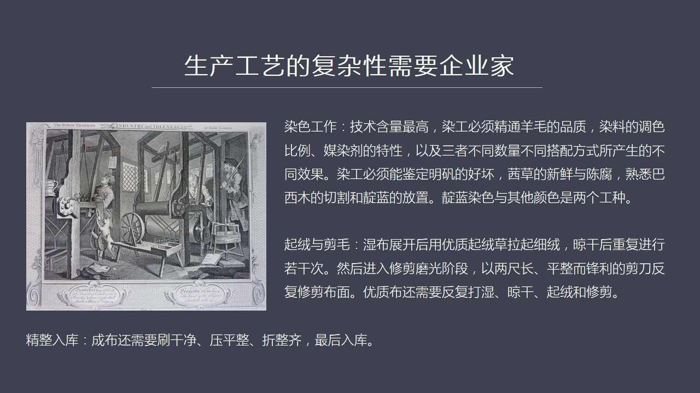

在这个我们看到中世纪这个染色工作中你会发现染工的技能要求是所有工程中间技术含量最高的就是因为染工它必须要晶通很多方面支持比如说这个羊毛的品质它是美丽奴羊还是林赛羊还是什么哪种羊羊毛的它的含指量是不一样的它的这种它的粗细程度还有它的长短都是不太一样的由于它的含指量由于它的这个含有量这东西的有略微的差距...

<strong>Cleaned narration</strong>

> 在这个我们看到中世纪这个染色工作中你会发现染工的技能要求是所有工程中间技术含量最高的就是因为染工它必须要晶通很多方面支持比如说这个羊毛的品质
> 它是美丽奴羊还是林赛羊还是什么哪种羊羊毛的它的含指量是不一样的它的这种它的粗细程度还有它的长短都是不太一样的由于它的含指量由于它的这个含有量
> 这东西的有略微的差距所以你用的染色你的染料比如说你是要配新红那就要用这种这种颜值重再加上一定的其他的染料比如说加一点点黄色再加一点点死色你要
> 把它配成一个特殊的比例这个比例是一个高度积密的这么一种这种配比方法而且中间学问很大然后你还要在这种情况之下还睡到没染纪的问题你是用哪个地方的
> 这个名范效果最好还是用草木灰而且你还考虑到把这三种东西综合在一起用在这个羊毛之上它的染色效果怎么样你要染不好它的颜色会不好看你用了染料太多还
> 是染料用少了那么都会影响它最后成品的它的色泽它的手感色泽都会受到影响所以这几种东西的这个排列组合然后各种不同的这个效果这是需要大量事件摸索才
> 能逐渐掌握的所以它这个染工的要求很高除了这个之外你还需要这个染工还需要什么呢判定名范的好坏比如说土耳其的名范质量最高你如果是从埃及过来的质量
> 要差一点点所以你的名范的质量它会直接影响最后的染色的效果你要能够判定还有你比如说各种这种像献草的新鲜和臣服献草还有其他的这种草每个草提供不同
> 的颜色比如说它可以提供一种红色那么这种红色跟它这个草的新鲜程度新鲜草还是比较臣服的草新鲜到什么程度是隔了几天甚至隔了几个小时你这个染工都得非
> 常清楚否则的话你用它的染料你就不能够准确知道几者配比在一起用在这种羊毛身上它的效果好还是不好你比如说还需要像巴西木巴西木是提供红色的那么巴西
> 木是怎么切割然后这个电栏这种染料怎么来投放怎么来配那么像这个蓝色这是一个基本的基色所以它是个单独的公众所有其他颜色是另外一个染色的公众光是这
> 一个染色就会分成非常不同的非常不同的这种加工的办法所以它的公众都不一样然后是启蓉和剪毛为什么毛泥我摸着毛泥的感觉非常手感非常好就是因为它有启
> 蓉这个工序启蓉就是你这个布染完之后色彩非常的亮了然后要把它打施在水缸里打施之后然后用布架用架子把它张开张开之后然后你又要用启蓉槽在这个融布上
> 钩一边钩一边之后你会把这个它里头的线尾给钩出来就启了一层细细的融毛融毛之后还要亮干亮干再用这种剪这个减融毛的剪刀这是一种非常特质的剪刀大概是
> 八英寸这么长八英尺大概是八英寸相当于两尺这么长非常扁平非常平整和风力这把大剪刀咳咳咳这么一剪然后剪完剪的手法非常的重要因为你剪不好了话有那地
> 方剪的长有那地方剪的短整个融毛摸起来手感就不一样了就会有问题而且你有可能伤到整个毛料的线尾所以这个剪毛的工作也非常的有技术含量所以这个在中世
> 纪你会看到这些工匠们它的遗产中间很多遗产中间最有最抓人眼球的就是这个剪减融毛的剪刀一把好剪刀可以当遗产传给自己的后人所以剪完之后剪完之后要是
> 有这样毛还要再打试打试之后再起融起融之后再剪最好的这种质量的毛这种毛料要来回进行七八次最后剪传融毛然后量干之后然后还要清洗然后还要压平劣整齐
> 最后进入残酷所以你会看到Flander的整个工序极其的复杂然后你会看到它的最后的效果它的这种泥融布料它的色彩

---

### Slide 8

非常地鲜亮致地极其细腻因为它都是用了最上等的羊毛手感摸在Flander的这个泥融上头这个手感跟摸着丝头的感觉差不多同等的这种顺滑所以它成为全世界各个国家都非常想要了非常强手的这种产品强手货那么在当时的世界市场上它跟中国的丝头是同等的属于设置品质量非常的高价格也卖得很贵你想想看一个企业家要想处理这么多...

<strong>Cleaned narration</strong>

> 非常地鲜亮致地极其细腻因为它都是用了最上等的羊毛手感摸在Flander的这个泥融上头这个手感跟摸着丝头的感觉差不多同等的这种顺滑所以它成为全
> 世界各个国家都非常想要了非常强手的这种产品强手货那么在当时的世界市场上它跟中国的丝头是同等的属于设置品质量非常的高价格也卖得很贵你想想看一个
> 企业家要想处理这么多的工序而且每到工序有这么多的讲究光靠以前终是几初期那个师父平经验这么去做已经远远不够了所以我们来看下野这就要求企业家必须要有精确管理的能力它必须要朝这个方向进化

---

### Slide 9

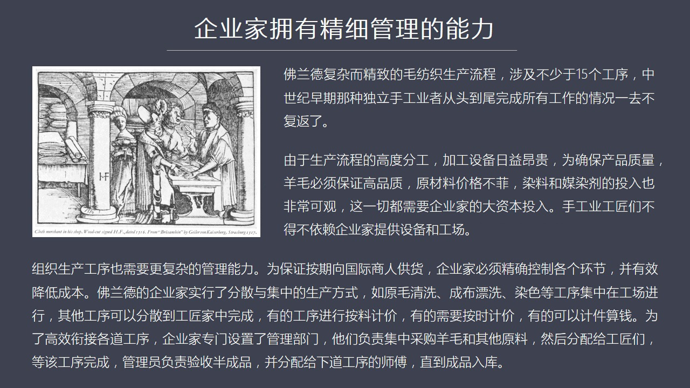

这就是为什么会出现企业家这个阶层由于这个弗兰德这个非常精致非常复杂的羊猫生产流程它涉及到至少15个程序至少15个工序所以早期的那种工匠师父的那套生产模式已经过时了完全不能使用了那么另外一个原因就是由于你要生产比如说这个这么复杂的工序的话进行了高度精细的分工每一个分工的领域中间都会出现专业的机械比如说...

<strong>Cleaned narration</strong>

> 这就是为什么会出现企业家这个阶层由于这个弗兰德这个非常精致非常复杂的羊猫生产流程它涉及到至少15个程序至少15个工序所以早期的那种工匠师父的
> 那套生产模式已经过时了完全不能使用了那么另外一个原因就是由于你要生产比如说这个这么复杂的工序的话进行了高度精细的分工每一个分工的领域中间都会
> 出现专业的机械比如说票戏票戏以前大家就是有个大牧草然后大家在牧草里面使因彩把这种票土还有水还有飞到夜这个混和这个票夜然后在不上使因彩用这个方
> 法来取悟但是由于后来你专业化之后要提高生产效率怎么办开始出现水利的票戏机就是与其用人的两个角距彩不如利用水的冲涉的力量使两个大锤上下翻飞来砸
> 这个步这个就使得机械力量第一次取代人力比如说这种票戏机它设备就很昂贵不是一般的工匠所负担得起的还有你要进口英国的样貌这个英国的样貌价格是正常
> 样貌好几倍或者美丽如这个西班牙的样貌它的价格也很贵所以你投入原材料的这个原貌的采购的这个钱资金量就很贵同时你从这么远的地方去弄来这些人没染纪
> 它的价格也很贵这是导致你要进入这个批量化生产面向出口市场你的先期投入就比较大所以只有企业家有资本的人才能进入这个行业过去传统的工匠们就不行了
> 那么他们只能依赖企业家所提供了这种工业设备还有它这个场地才能够进行生产另外你要组织十几道工序那么复杂的那么专业化的工序的话你的管理能力要提高
> 这个跟中世纪初期又不一样了这需要企业管理了也就是你已经向别人比如说这个意大利商人来定了货复了定金然后你就必须要在准确的时间之内必须要把货提供
> 因为人家还有传期还有到海外市场移系列的这种它的计算它的计算都要根据它的资金成本运输成本还有这个海外这个不同的计结的价格成本它已经进行了核算所
> 以那是一个精密的链条到你这就不能掉链子其家必须要精确控制各个环节的生产成本还有它的这个执行的周期那么这个冯兰德的企业当时采取了这个就是一个集
> 中生产和分散生产有些工序我可以把它分散到各个家庭有些工序有些集中你比如说原谋清洗我有这个票息场我有票息机你们可以到这儿来洗这样化速度快而且这
> 个成本低还有染色工作这也得集中进行因为染色是最具有核心机密的我绝不能让其他人知道我染色了一些密方还有我染色了一些这种手续所以我不愿意把它放到
> 空间只能在工厂里面进行然后有些东西像访杀像支布这个东西是可以放到每家每户这就中间就需要一个管理部门去协调比如说集中采购原材料这个采购完了之后
> 分派给所有的工匠然后你们回家生产或者在那儿旧地生产然后这个流程完了之后我再到家里去收你的货收完了货之后我检验质量然后把这些货转给下一道工序半
> 成品转到下一道工序持续生产下到完了之后我再去验货然后再把货收回来再转到下一道工序的工匠手中所以组织者他相当于一个信息的沟通控制成本控制质量的
> 一个中心他对整个的这个企业运转的效率执行力成本的管理都有极大的影响一直到最后把这个产品生产完然后放进参丰然后交货给一大利商人这件事才算完那么
> 在以前中世纪早期很多初期的这种企业家他能够同时圣产同时圣认生产工作还有市场销售工作但是现在随着原材料越来越远

---

### Slide 10

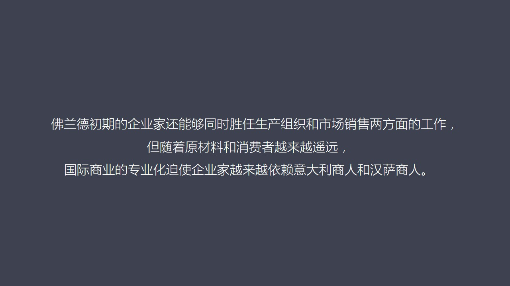

你的市场都在海外就没有办法再取同时进行生产同时进行销售做不到也不是神险所以国际商业的这种专业性迫使企业家越来越依赖向汉萨商人和一大利商人来进行国际经营所以我们会发现一个经厦就是国际商人们出在经厦的顶端他的专业性最强企业家们需要对工艺负责保证产品质量控制他的价格他从属于商人这个级别因为没有商人的东西所...

<strong>Cleaned narration</strong>

> 你的市场都在海外就没有办法再取同时进行生产同时进行销售做不到也不是神险所以国际商业的这种专业性迫使企业家越来越依赖向汉萨商人和一大利商人来进
> 行国际经营所以我们会发现一个经厦就是国际商人们出在经厦的顶端他的专业性最强企业家们需要对工艺负责保证产品质量控制他的价格他从属于商人这个级别
> 因为没有商人的东西所有生产的一切都没有意义你也组织不了生产所以商人在顶端然后是借家再往下就是工匠也正是由于这种经营模式海外市场海外原材料高度
> 级约化批量化和标准化的生产这种经营方式高度复杂这就是会导致导致什么呢就是越复杂的这种东西越需要秩序需要管理所以复杂性对应的秩序性这样一套复杂
> 的经营模式就必须要必须要需要一种新的组织机构这就是行会就是很多事情这个复杂化之后他已经不是涉及到一个企业

---

### Slide 11

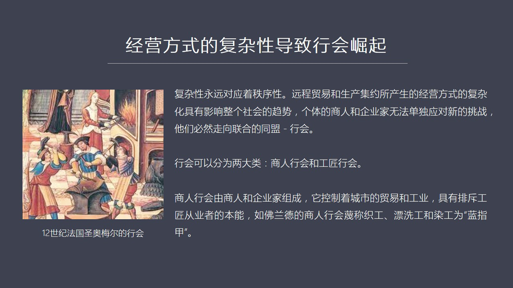

两个企业或者一个商人两个商人了而且所有企业所有商人都面临类似的问题那怎么办他只有走向联合搞一个商人的同盟这就是商业行会但是行会一般可以分成两大类一部分是商人行会还有一类就是工匠组织的这种中下级这种商会这种行会我们在这里首先看这个商人行会商人行会他主要的组成者就是商人国际商人和企业家也就是你不能够靠出...

<strong>Cleaned narration</strong>

> 两个企业或者一个商人两个商人了而且所有企业所有商人都面临类似的问题那怎么办他只有走向联合搞一个商人的同盟这就是商业行会但是行会一般可以分成两
> 大类一部分是商人行会还有一类就是工匠组织的这种中下级这种商会这种行会我们在这里首先看这个商人行会商人行会他主要的组成者就是商人国际商人和企业
> 家也就是你不能够靠出卖体力去干活这些人这些人他们是瞧不起的那么就是要有资本的人要有商业或者资本或者这个生产资本的人他们组成了这个体系这个商人
> 行会控制着整个城市的贸易和工业然后他们从一开始就有一种瞧不起工匠这样的一个天然的特点就是我们是统治阶层我们要控制所有标准而你们这些这些人都是
> 从事一些体力工作的你比如说这个商人行会也就是说这些染工之工他们的指甲不是经常碰颜色就会变得比较黑吗所以称他们唯一这种蓝指甲蓝指甲这个是一种显
> 然是带有便宜的这种称呼那么商人行会组织起来要做哪些事呢第一就是要控制壟断原材料的精英权和这个厂品部的销售权以前中世纪是初期的时候任何人手工业
> 的工匠我当然都可以在马特上我去买羊毛然后我自己支撑步之后我再卖给这个这个当地市场的商人这是完全可以的现在不行了出现了行会之后普通的一个独立的
> 工匠师父想做这种访智这种工匠他想去在岸边去买羊毛没人卖给他因为行会说这个事普通的工匠绝对不能做只能有我们行会的成员才有羊毛的处理权我们才能精
> 英羊毛我们才能分配羊毛然后卖出来步就是支出来步普通工匠你以前是可以随便卖现在不能到其上去卖你必须要卖给指定了商人从过这样的一个办法其实就壟断
> 住了羊毛的原材料还有他的销售把这两端保护住之后普通的工匠就完全喪失了以前的手工业师父就完全喪失了单独生存的条件和可能你只能衣服与某个企业家衣
> 服与某个商人否则你无法存活所以通过这种壟断集中了销售权和进化权之后就对整个行业处于一种绝对壟断了这种状态除了这个之外行会还要这个规范所有生产
> 的流程的细节技术标准比如说部的宽度长度重量精确标准都是行会发布的比如说出口部多少跟经线大概多长的宽度这是有明确规定的一点点都不能错然后支部之
> 部的方法包括材料选择比如说他们当时禁止比如说我看行会有个条例是禁止在同一块布料上用不同的羊毛比如说我用一部分英国的零塞羊我在用一种本地羊的羊
> 毛然后放一块布这是绝对不允许的如果发现这个您以后就别做这个生意了然后起龙只能用起龙草当时有人提出能不能用金属的这种瓜钩类似于起龙草这种钩的效
> 果好上任行会说绝对不行为什么呢因为他们认为这种金属的钩有可能会破坏这个毛坊只是这个毛料中间非常精细的那些线约结构你把它钩烂了怎么办只能起龙草
> 起龙草比较软又很有任性所以它能抓起来把毛给抓起来但又不至于把它抓断了所以你看它们对质量的这种追求到了这样的一个境界就是用使用什么材料都有明确
> 的规定比如说使用什么力量这个规定就更严格了新红就只能用这个颜值虫和配料的一些基本的方法你绝不能用其他的这个料来配比如说你要用巴西红来染这个星
> 红那是绝对为法的这个你要的破坏了这个东西这是会出现大麻烦的由于商业行会商人行会对生产管理的所有细节生产流程都精确到这种程度这就极大的环节企业
> 家的这种管理的成本降低了它的成本因为行会做了这个标准规范之后大家所有人工匠都比较符合这个标准那企业家对于质量控制这一部分它就卸掉了一个很大的
> 负担当然我们所说上有政策下有对策那么在弗兰德互处院这个问题呢不可能为什么呢商人协会它不仅推说这些非常严格的这个制度而且有极其严格甚至残酷的执
> ...

---

### Slide 12

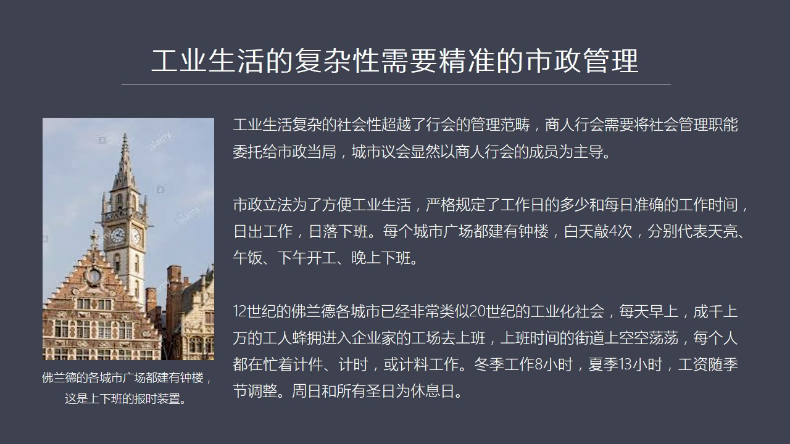

它变成了整个社会所以市政的管理必须要跟上那么市政它当然分成市政的有一个议会这个议会主要的成员都是商人行会的成员还有伯爵的一些代表来共同主长的议会当然主要是商业行会认说了算然后呢这些市政议会还有他指导的市政局市政局就有弱干的这个行政管理部门市政的这个议会叫负责立法市政当局负责执行市政立法呢当时你看出现...

<strong>Cleaned narration</strong>

> 它变成了整个社会所以市政的管理必须要跟上那么市政它当然分成市政的有一个议会这个议会主要的成员都是商人行会的成员还有伯爵的一些代表来共同主长的
> 议会当然主要是商业行会认说了算然后呢这些市政议会还有他指导的市政局市政局就有弱干的这个行政管理部门市政的这个议会叫负责立法市政当局负责执行市
> 政立法呢当时你看出现了非常精密的这种工业组织的复达性之后需要非常精确的管理也就是市政立法为了方便工业生活所以它是严格规定每天的工作时间准确规
> 定这个工作时间日出工作日落下班这就是为什么我们到Flander地区你会看到每个城市的广场都必然会有一座中楼那个中楼是干啥的主要是为了上下班上
> 下班的左右也就是它的中每天要敲四次中天亮的时候敲一次然后中午吃午饭工修的时候大概有一个到一个半小时敲一次下午上班的时候再敲一次晚上下班再敲一
> 次所以中世纪这是一几几年的事只相当于中国难送它发展出了这套东西就已经向现代生活了所以12世纪的Flander地区它整个地区的所有城市基本上都
> 非常类似于20世纪工业化的这种社会每天早上一敲中呈现上万的工人就泡泡到那种不同的工厂或者这种工作厂所去上班然后这个时候你看到一旦到了上班时间
> 大家上空工当当没人了每个人都在忙着他自己的工作有些是既建既建工资有些是既实工资有的是既料工资就说给你多少材料你给我反尝一个什么样或者你给我染
> 成一个什么样这是按照既料所以每个人都在按照时间的高度准确化了这个时间进行精确的这种工作和生活你比如说冬季工作8个小时下几工作13个小时这个公
> 司随着季节它也在发生调整周末要休息还有盛日就是进入教练盛日都是它的休息日这时候我们会看到你会看到这是一个高度组织化高度精确化按照时间按照这个
> 掐表这种时间来进行的工业组织体系我觉得这个全世界没有一个城市或者没有一个地区在12世纪的时候搞出了一个整个一个城市以这样一种节奏感很强去管理
> 现代生活管理它的工业生活管理它的工业流程管理它的立法管理它所有人的生活方式这么复杂和这么精确的管理方式没有这是弗兰德最先搞出来的那么弗兰德他
> 这个城市群体现出了一种可以说近代工业的一种管理的一种非常鲜明的色彩封面等级已经不重要了现在被工业等级所取代注意工业也是存在等级的但是它的等级不像贵族那样

---

### Slide 13

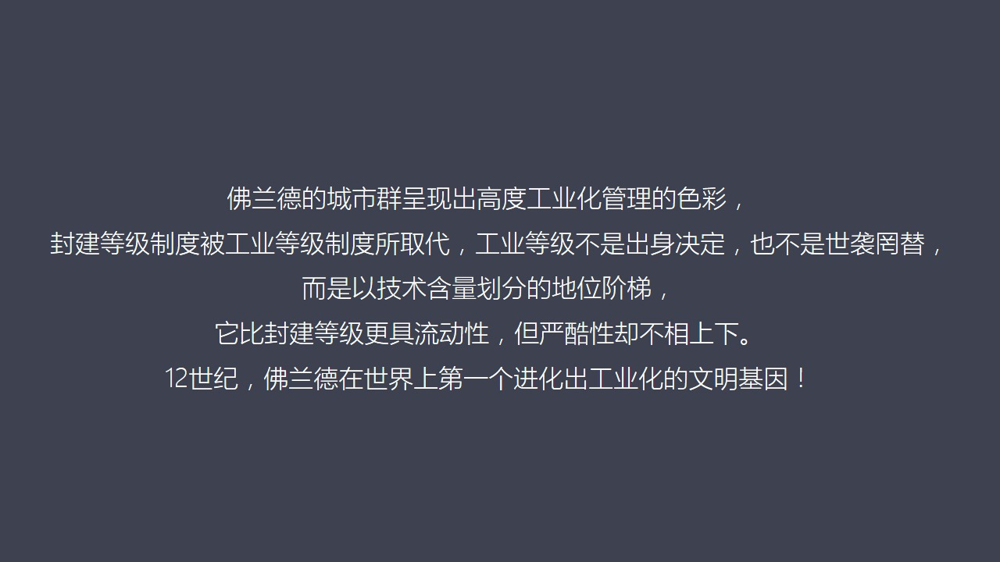

像出身你出身不是贵族你不是贵族它不是它也不是实习制它是以技术含量来化成你如果是染工你的级别最高你如果是这个票息工你的地位要差点你如果是检阳毛的还可以你如果是普通的访访线工那就差了所以它是以技术的级别来化分工业体系中间的工价的等级所以它比封建那种我只看你的出身如果你爹妈不行拼爹不行那就永远完蛋了它比封...

<strong>Cleaned narration</strong>

> 像出身你出身不是贵族你不是贵族它不是它也不是实习制它是以技术含量来化成你如果是染工你的级别最高你如果是这个票息工你的地位要差点你如果是检阳毛
> 的还可以你如果是普通的访访线工那就差了所以它是以技术的级别来化分工业体系中间的工价的等级所以它比封建那种我只看你的出身如果你爹妈不行拼爹不行
> 那就永远完蛋了它比封建这种体系要有流动性一些但是它的严酷性可以说跟封建制不像上下因为在那样的情况之下你作为一个工价就只能衣服于企业家企业家衣
> 服于国际商人这个机子塔行的利润分配机制你在底层就基本上没有很难有这个翻身的机会所以呢它这个压制性也是很强的这次导致了以后我出现了一系列的问题
> 但是呢我们可以从藍德这个例子上你可以看出它已经在12世纪就是中国的北宋北宋末年或者南宋的初年就已经进化出了全世界的一种工业化的文明基因注意啊
> 你如果拿藍德这种在11几几年这个情况不管是跟德国汉萨城市还是波罗地海城市还是这个其他地方的这个城市相对比的话你会发现藍德完全是运者在不同的这
> 个行行的轨道之上它太先进了它这个组织观力这个程度太复杂了所以这是欧洲手区域制的第一个进化出来的工业文明基因那么如果我们看一下也正式由于你进化出了这么一套非常符的生产效率非常高然后出口的能力非常强

---

### Slide 14

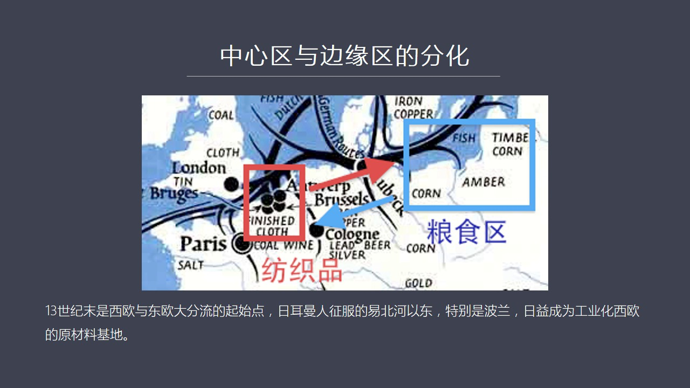

然后获取资金获取原材料的能力非常强的一种模式你在整个地区可以说它就代表着一种先进的生产力了那么其他地区就逐渐了跟你配套比如说我们看这张图你会发现波罗地海地区特别是像包括波兰这个地方它就跟这个浮兰德进行配套了访制品由浮兰德提供那么波兰地区主要就变成了生产原材料的供应力就是出口糧食换回毛料的支撑品然后或...

<strong>Cleaned narration</strong>

> 然后获取资金获取原材料的能力非常强的一种模式你在整个地区可以说它就代表着一种先进的生产力了那么其他地区就逐渐了跟你配套比如说我们看这张图你会
> 发现波罗地海地区特别是像包括波兰这个地方它就跟这个浮兰德进行配套了访制品由浮兰德提供那么波兰地区主要就变成了生产原材料的供应力就是出口糧食换
> 回毛料的支撑品然后或者它继续转运不管怎么样浮兰德成了最复杂工作的来源那就是浮兰德地区是一种浮兰的劳动产品去交换糧食地区的一种简单劳动产品这就
> 像保母和主人这些保母经济所体验出的那样保母从事那些点单的重复的劳动而主人呢进行了技术工作商业管理工作或者行政工作它的工作更复杂所以两者在交换
> 过程之中你会发现优势越来越像浮兰劳动这个方向集中所以我们来看这个西欧和东欧出现那个现象你会发现十三十级墨是西欧和东欧的一个大分流的起点就是本
> 来两个地区的在十三十级墨它的发展程度这个差距已经越来越小了你比如说在东欧的布希米亚就是现在极客西里西亚还有这个波兰当时都出现了劳动这个劳异地
> 族和食物地族被货币地族所取代的现象这跟西欧出现情况类似在浮兰劳地区大概早一百多年那么在波兰晚大概一百多年但是差距在迅速缩小这个西欧地区它当时
> 有一个自治式的有一些章程就是任何农业地区的农民只要你到我这城市面待一年居住满一年你就被自动变成市民受到城市贵族的保护就受到这些拨绝的保护好这就相当于得到城市户口

---

### Slide 15

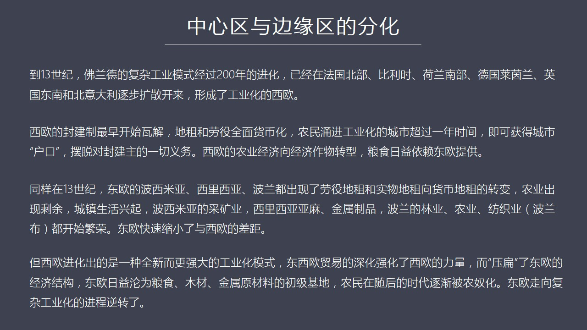

摆脱了封建制度一切的人生的这种依赖当然在浮兰劳地区出现的现象是封建土地主们这些封建贵族们很多已经进入城市已经投入的工商业他们已经变成了商人的一部分所以在西欧最早出现的就是封建制的瓦解这个现象跟意大利情况是类似的都是工业高度发达商业高度发达使得封建制最早瓦解农民任身衣服被解除了然后地族从劳义地族食物地...

<strong>Cleaned narration</strong>

> 摆脱了封建制度一切的人生的这种依赖当然在浮兰劳地区出现的现象是封建土地主们这些封建贵族们很多已经进入城市已经投入的工商业他们已经变成了商人的
> 一部分所以在西欧最早出现的就是封建制的瓦解这个现象跟意大利情况是类似的都是工业高度发达商业高度发达使得封建制最早瓦解农民任身衣服被解除了然后
> 地族从劳义地族食物地族变成货币地族你就解放了交点钱就没事了以前你必须这个这个封建劳义族特别特别讨厌就是你每年这个地族告诉你你今天得到我们家干
> 干几个小时的活比如为猪或者你去种装甲因为你在我的眼皮子里面我可以实施监督你这个日子很暴过你每年就像被榜死一样这是你的义务修瞧修路等等现在地主
> 进程了地主进程它就收比钱就行了你这时间完全归自己自由支配所以很多人就进程找工作打工那么在十三十几东方出现了类似的现象那么也是农业出现了剩余然
> 后这个农民也扣得了更大的自由货币地族交货币了然后城镇越来越繁荣像波西米亚波西米亚最大的特点它有大量的库特别是营库营库是最终明的它是产营区相当
> 于美国当年崛起的时候像是内华达的这样的角色然后还有它的习惯都很发达除了这个之外西里西亚西里西亚现在拨蓝以前这个是不入世的一块西里西亚的养麻访
> 着也很发达然后它的金属质品还可以波蓝波蓝主要是农业还有林业它的木材比较多农业装件规模重的很大还有访质业当时有一个有一个特殊的名称叫波蓝布波蓝
> 布主要是一些粗这个比较粗的步粗的一种谋调访了一些主要给一些工匠们或者叫牢工阶层穿的步它的价格很低但是它在中下阶层中销量比较好因为这个弗兰德布
> 太贵它都是一些设置品而波蓝布它是面向中下阶层的所以它有内块市场所以这些地方访质工业都在决起而且农民们的开始转向城市农民的这个束缚也减少了可以
> 说在十三世纪的时候你会发现东欧和西欧之间的差距正在迅速兼少但是由于西欧这个地区进化出来是一种完全不同的工业体系它跟当年就是在中世纪初期的时候
> 像波蓝他们现在十三世纪的时候仍然是一个手工工匠从头干到尾还是一种比较简单那种模式而对方是个集团化的高度工业化组织流程非常严密又有工会又有法律
> 制度所保证的一套精密的一套体系而你这边还是松散的一个工价从头到尾做完然后你还想销售还想生产你当然拼不过对方所以在这样的一种贸易情况之下你会发
> 现整个东欧的工业它的这种城市化工业化的进程从十三世纪末之后出现了逆转你没有进化的可能了然后你跟它做贸易的时候你看西欧整个它越来越不重装甲以前
> 英国法国德国这很多就是大量的糧食产地现在他们主要从事工业去了或者从事一些经济走务糧食出口任务全部交给波兰波兰就逐渐退化成了保姆只做简单的农业
> 工作没有什么太大的复杂性重装甲嘛然后管理经济程度也不高然后你的这种整个这套社会组织体系跟西欧商笔一下这个落差就拉开了所以你会看到这种贸易的结
> 果使得东欧的糧食产区它的这种整个的社会的模式经济发展模式越来越单调最后只剩下大规模的种质种质糧食这就变成了我们讲到了美国模式中间的南方模式种
> 质原内的模式了规模很大但是压迫非常厉害因为它们都是以商品糧出口为导向所以这装原主对农民采取了更严格的监管因为很多农民都是斯拉夫人而地主们这些
> 都是后来的融客贵族就是得一致人是热慢人所以他们把波兰的农民就是斯拉夫的农民踩到脚下用了一种非常越来越严科的监管制度越来越像农奴的这种监管制度
> 来迫使这些连架劳动力来工作主要目的是为了获得一种劳动力型的低成本然后一种商品糧的高价格然后在欧洲市场上赚一笔钱但是整个东欧的社会越来越被压扁
> ...

---

### Slide 16

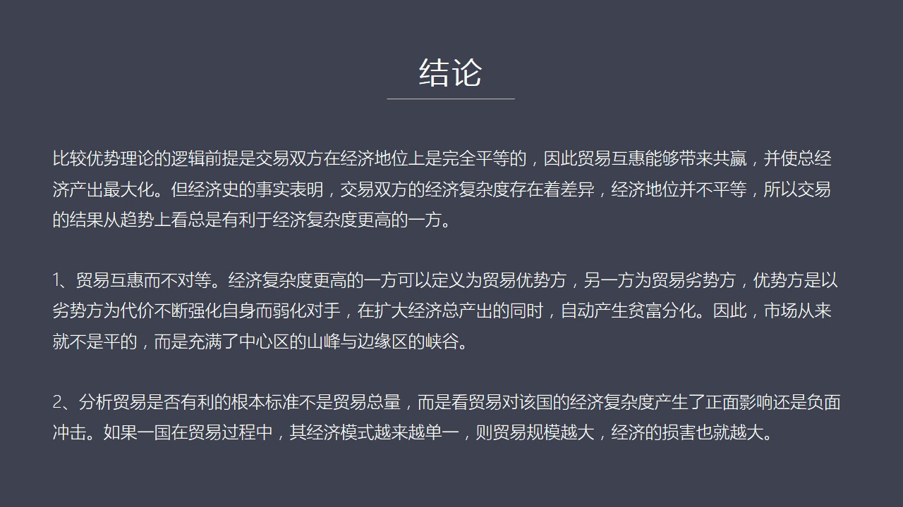

这个前提就是中这个交易双方在经济上是地位是完全平等的只有在地位上是平等的所以进行贸易是能够互惠而且带来供应并且是总的交易双方总的经济产猪得以最大化这是比较优势理论的逻辑前提但是我们从经济史从这个法兰德这个经济史这个发展你可以看到交易双方菩兰德地区公高度工业化跟多地区它从一开始经济复兰程度就不一样菩兰...

<strong>Cleaned narration</strong>

> 这个前提就是中这个交易双方在经济上是地位是完全平等的只有在地位上是平等的所以进行贸易是能够互惠而且带来供应并且是总的交易双方总的经济产猪得以
> 最大化这是比较优势理论的逻辑前提但是我们从经济史从这个法兰德这个经济史这个发展你可以看到交易双方菩兰德地区公高度工业化跟多地区它从一开始经济
> 复兰程度就不一样菩兰德地区在11世纪这个1几年12世纪的时候进化出来那种高度组织化高度集约化市场这种海外市场和原材料市场和销售市场都在海外这
> 种情况是独一无二的它一开始复兰程度就已经超越了东欧而且随着时间的推移它越来越复兰越来越强大在这个时候跟东欧发生了这种贸易关系使得东欧不得不被
> 迫生产糧食而这种被迫一旦开始就会成一个所谓的加速进化这个过程会迅速地使东欧退化使它的经济模式马上越变越简单在随后的几百年中间东欧就被压到了农
> 业国的地位失去了进化成复兰经济体和工业化的这种基本条件这一落后就是从13世纪之上现在它就落后了七八百年所以我们会从这个例子中你可以看到这个比
> 较优势理论的逻辑前提双方一开就必须要建立在经济队等这个前提是不存在的在所有的经济室的案例中我们都发现交易双方贸易双方从一开始经济复杂程度就是
> 有差异的在这种情况之下经济地位不平的所以交易的结果从总体趋势来看一定是有利于复杂程度高的那一方而且越往后发展落差越大对方好比是一种高等动物它
> 是把你的肉吃了之后把你的蛋白质化解成列解成它的暗击酸它吸收之后变得更强的而你的经济体在不断地瓦解不断被它执解这就是为什么殖民地在跟这个宗主国
> 发展过程中殖民地为什么总是落后大部分这个情况是这样殖民地落后的原因就是你的蛋白质变成了它的暗击酸而它有了你来你来就算发展得更强的具有着更强的
> 补师能力所以很多人说我们中国当年上海很发达广州很发达就是在30年代然后说整个中国经济当时应该越来越好这就完全不了解世界史完全没有研究经济的基
> 本的它的逻辑架构才会有这样的结论其实在那个时代这些中心城市之所以发达它是起到了一个殖民代理人的作用所以它所赚的钱是以牺牲内地更多的经济发展的
> 有机制作为代价的就是这些地方越发达内地越虚弱而你整个中国解体的速度会越来越快这就是波兰和富兰德之间的贸易给我们最大的一种启发所以在这里我们今
> 天可以得出两个明确的结论第一贸易互惠而不对等我们一般都强调贸易互惠但是对等吗当然不对等谁的复杂度高谁占优势所以复杂度更高的我们可以定义为贸易
> 的优势方另外一方就是脸试方优势方在做贸易过程中是以牺牲脸试方为代价而不断强化自己弱化对手的而虽然总的经济产生在增加但是它会自动发生产生这个屏
> 幕分化就是自动的分裂成中心区域和边缘区所以我们在说所谓市场的屏幕市场的机会是军等的其实在整个市场中它从来就不是屏的而是存在着中心区的山谷山峰
> 和边缘区的侠谷始终是不屏的这就邀请我们在理论上要跳出那种局限性要看到比较优势论它的逻辑是存在问题的但是这套理论从来不解或者从来就回避去解释它
> 会天然造成优势强化劣势越来越弱这个现象也就是比较优势理论在实践中区应用如果用到国家就是国与国之间那么就一定会出现强国越来强如果越来越弱这个现
> 象如果用的普通人之间就会使得保姆的赚钱能力长期停止不前而主人的赚钱能越来越强大所以这套理论的实质是一定会进化出市场的不平的这是天然的逻辑上的
> 必然第二个也论我们在谈到贸易你看我们现在发表的各种报表都在强调我们的贸易总量多少亿美元去年多少今年增长多少我们增加了百分之三点二或者增加了五
> ...

---

### Slide 17

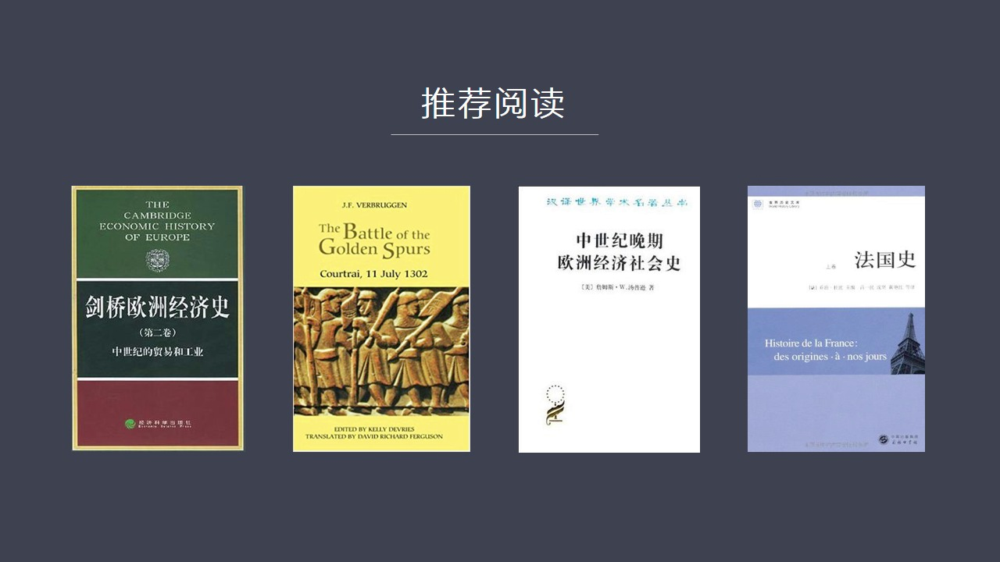

欧洲经济史还有中世纪晚期欧洲经济史社会史这两本书之外还有关于富兰德在后来在一二八零年前后爆发的企业我们会看到他这道体系为什么到最后他会玩不转就是因为平文化大了一定程度他就会从内部发生内报另外还有法国史法国史主要讲的富兰德跟富兰德伯爵跟这个法兰西国王之间最后的对抗的政治原因和经济原因当然还有他为什么最...

<strong>Cleaned narration</strong>

> 欧洲经济史还有中世纪晚期欧洲经济史社会史这两本书之外还有关于富兰德在后来在一二八零年前后爆发的企业我们会看到他这道体系为什么到最后他会玩不转
> 就是因为平文化大了一定程度他就会从内部发生内报另外还有法国史法国史主要讲的富兰德跟富兰德伯爵跟这个法兰西国王之间最后的对抗的政治原因和经济原
> 因当然还有他为什么最后富兰德地区他会摔落很大程序上是他在政治上出现了一个我承认为是双层加新饼这样的一个政治结构关于这个问题以后我们再讲到这个
> 富兰德摔落的时候和英国崛起的这一刻里面会相信给大家介绍好 今天的课程就到这里

---

### Slide 18

<strong>Cleaned narration</strong>

---
