# 核心课视频-011.东西方汇票的起源 — Detail Slide Notes

> **来源**：鸿学院核心课程  
> **幻灯片**：25 张

---

### Slide 1

因為匯票是整個金融制度它的一個最重要、最核心也是第一個發明出來的現代金融工具我們現在全世界所通用的西方的金融制度其實它的根就在匯票不僅是它時間上出現最早而且從信用革命這個角度去理解的話匯票制度也是整個...

<strong>All subtitles</strong>

> 因為匯票是整個金融制度它的一個最重要、最核心也是第一個發明出來的現代金融工具我們現在全世界所通用的西方的金融制度其實它的根就在匯票不僅是它時
> 間上出現最早而且從信用革命這個角度去理解的話匯票制度也是整個西方金融體系的一個機實所以我想今天我們就從匯票制度講起作為我們摩快化課程的第一講
> 不過我們在這個講座中間不僅要談到西方匯票也要談到中國的匯票的起源我們把兩種制度進行比較來探討金融工具和金融制度背後它可能存在了一種文化土壤的
> 差異這樣才能使我們更深刻的理解現在金融制度的它的出現、它的進化以及現在各國在使用這些金融工具上發展金融市場的過程中可能會碰到的各種文化上的潛
> 在的障礙和差異以便與我們更好的取吸收和借件這種西方金融制度的它的一些優勢說起這個西方匯票的起源這首先要談到十字軍東征這個問題我們都知道十字軍
> 東征是從1095年五二半二世教皇開始發動這個整個基督教世界的這些封建靈主們

---

### Slide 2

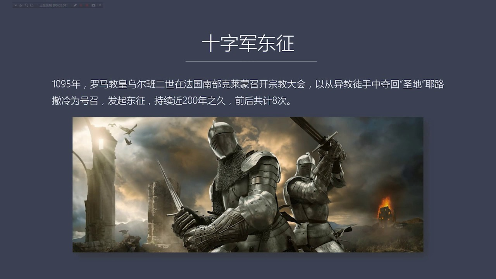

國王們去向地中和東岸的這些伊斯蘭國家發動金融雖然從表面上來看這是一場宗教的戰爭不過從實際上來看我認為是一種宗教大旗下所掩蓋的一種

<strong>All subtitles</strong>

> 國王們去向地中和東岸的這些伊斯蘭國家發動金融雖然從表面上來看這是一場宗教的戰爭不過從實際上來看我認為是一種宗教大旗下所掩蓋的一種

---

### Slide 3

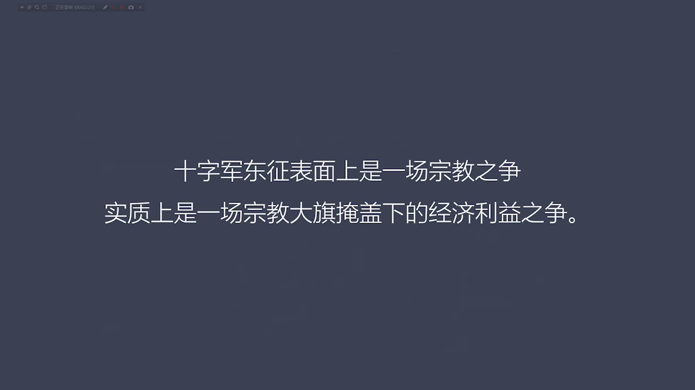

經濟力之爭或者說是擴大商業貿易網絡這樣的一個重要的起初事實上所有的戰爭所有的衝突我認為歸根到底抓住一點就是經濟利益如果沒有經濟利益的監督矛盾這種衝突和戰爭就不可能持久因為打仗要花錢要耗費巨大的人力物力...

<strong>All subtitles</strong>

> 經濟力之爭或者說是擴大商業貿易網絡這樣的一個重要的起初事實上所有的戰爭所有的衝突我認為歸根到底抓住一點就是經濟利益如果沒有經濟利益的監督矛盾
> 這種衝突和戰爭就不可能持久因為打仗要花錢要耗費巨大的人力物力還要帶來很大的社會的這種犧牲所以如果沒有強大了這種經濟上的動音那麼很難想像人民會
> 持之以恆的幾十年上百年的去從事一件事業所以我們的主要的思維方式主要的邏輯主線就是沿著經濟沿著財富的分配這個角度去理解世界的歷史也包括金融制度
> 誕生的歷史背景從十字軍東爭開始持續幾百年的大規模的戰爭它實際上永久的改變了歐洲的發展態勢是屬於長期和結構性影響歐洲來自世界歷史的重大事件那麼
> 也正是由於十字軍東爭打開了新的一個貿易的區域把整個地中海貿易連成了一片所以它給西方帶來一種前所未有的新的事業新的發展機會也使西方的社會結構出
> 現了新的變化當年在第一次十字軍東爭過程中首先碰到一個最大的問題這個問題就是怎麼轉運軍響我們都知道當年的西方主要採用金融貨幣那麼這些貨幣作為軍
> 響在從西歐調往前線地中海東岸這些戰爭過程之中安全的轉送這些軍響這些作戰經費就是一個巨大的挑戰如果我們來看這個第一次十字軍東爭的路線你會發現它
> 主要是經過土耳其然後到達這個地中海東岸如果從路路走的話這就面臨一個很大的問題

---

### Slide 4

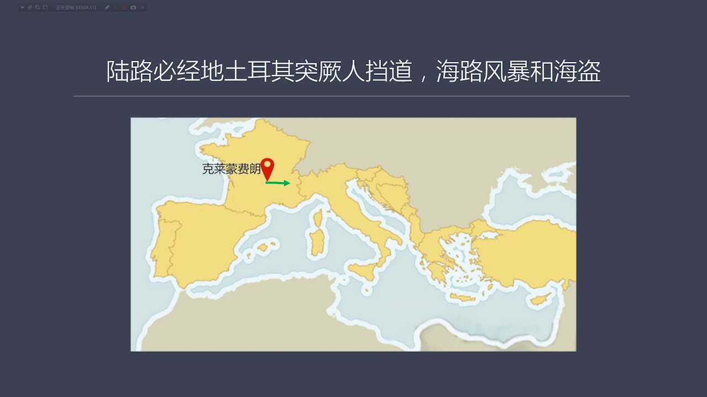

因為那個時代賽爾駐突決人已經佔領了現在這個土耳其的中部和東部除了軍事坦定寶附近的一些地區仍然在拜登庭帝國的控制之下大部分土耳其的半島已經處在穆斯林的控制之下了所以你要從路路轉運就會碰到很大的安全問題就...

<strong>All subtitles</strong>

> 因為那個時代賽爾駐突決人已經佔領了現在這個土耳其的中部和東部除了軍事坦定寶附近的一些地區仍然在拜登庭帝國的控制之下大部分土耳其的半島已經處在
> 穆斯林的控制之下了所以你要從路路轉運就會碰到很大的安全問題就是突決人會不斷地去侵擾結積這些十字軍東爭的軍響小谷十字軍是無法對抗大席的突決的軍
> 隊的所以從路路轉運是有一個很大安全問題的那麼走海路呢海路也存在很大的問題就是地中海這個氣候它在下跡就是4月到10月之間地中還是比較平靜的它主
> 要受到撒哈拉沙漠這種氣候的影響但是到了秋季以後就是熱空氣向南退那麼這種嘲詩大洩洋氣候就會湧進地中海去這就會帶來大量的降雨所以地中海地區的氣候
> 是每到秋冬世界一直到第二年的3月這個地方就會形成大量的降雨所以地中海氣候是我們必須要考慮這個因素在秋冬兩季地中海跟我們想像的那種陽光明媚波蘭
> 不經的狀態是完全不同的那個時候是狂風暴雨陰雨連綿地中海的風浪非常大所以轉運資金會碰到一個海上的一種風險風暴息機經常會有冬季風暴使整個傳運陷於
> 貪換所以地中海國家有個慣例每年到了10月份以後所有的港口全部封港各國交戰雙方向托爾奇跟奧斯曼帝國跟西歐國家的作戰在秋冬兩季是停止的要修戰幾個
> 月就是由於氣候的原因所以走海路碰到最大的風險就是冬季風暴還有海盜的階級因為地中海地區有很多海盜特別是北非伯伯人經常就是藍潔這個基督教這些商船
> 隊所以如何高校和安全的轉運這個軍費這是一個最大的挑戰其實所有金融的創新從歷史上來看它都必須要有強大的市場需求這種需求一方面是市場的貿易能力量

---

### Slide 5

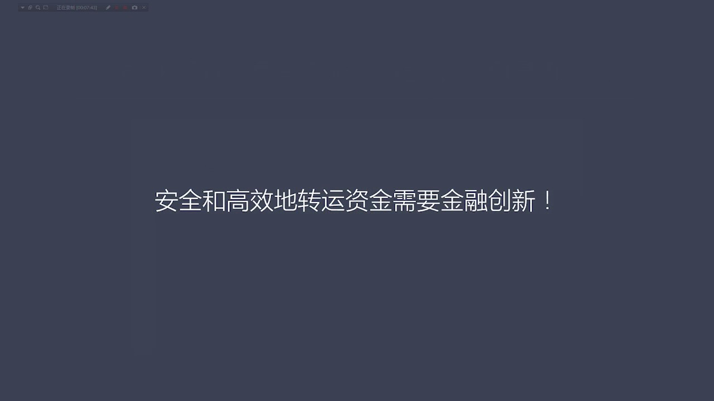

還有一方面是比如說作戰等等戰爭的推動力也很重要所以它這種需求必須要長期持久強大才能去促使一種新的金融工具的誕生那麼當時在十字軍東征資金轉移這個問題上教皇碰到了一個很大的難題那麼正式在這樣的情況之下有一...

<strong>All subtitles</strong>

> 還有一方面是比如說作戰等等戰爭的推動力也很重要所以它這種需求必須要長期持久強大才能去促使一種新的金融工具的誕生那麼當時在十字軍東征資金轉移這
> 個問題上教皇碰到了一個很大的難題那麼正式在這樣的情況之下有一股力量他們願意接這個差勢這股力量就是聖變歧視團關於聖變歧視團我想很多人都聽說過特
> 別是我們看過大分歧密這個電影的話你會發現中間講到的聖變歧視團如何如何當然那是故事歷史上在十字軍東征過程中成立了好幾個歧視團想聖變歧視團就是這
> 個名氣最大的其實除了它之外還有醫院歧視團包括後來的條頓歧視團等等那麼聖變歧視團呢它是成立於一一八年就是十字軍東征剛開始之後二十年的時間就建立
> 了聖變歧視團它的主要的作用是為了保護聖地就是第一次是軍東征佔領了一路沙朗成立了弱竿個基督教的小紅國在地中海東岸地區包括現在的蓄利亞巴勒斯安等
> 等那麼如何保護這些新成立的這種基督教的公國免受穆斯林的這個軍上的違困這就是一個很大的問題聖變歧視團呢主要就是為了這個目的而成立了一個我們可以
> 把它認為是一種修道院和封建歧視制度的一種混血兒既然它要主要的工作是要從事這種武裝力量對抗穆斯林的話那麼它就必須要有足夠的財源財政的資源這個時
> 候你會發現教皇就給他們一個巨大的一個特權這個特權就是確保他們所有獲得的財產是合法的然後免除他們一切的教俗的稅收你比如說教皇是不像那麼蒸稅的因為他們要保護基督教的這個勢力範圍

---

### Slide 6

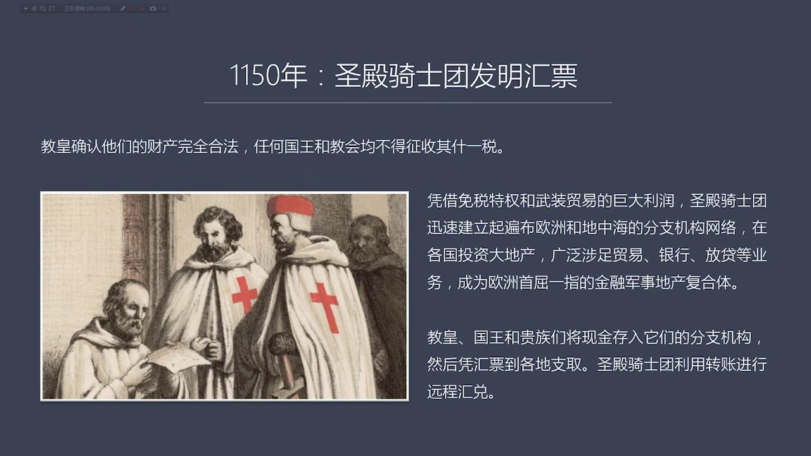

那麼各個國家是國王也沒有權力像他們蒸收十一稅所以它是一個免稅的一個最早的這種軍事商業貿易這樣的一個復合體後來還加上金融所以它是一個很早就應該說在歐洲立上最早的一個綜合的一個復合體正是由於它這個免稅的特...

<strong>All subtitles</strong>

> 那麼各個國家是國王也沒有權力像他們蒸收十一稅所以它是一個免稅的一個最早的這種軍事商業貿易這樣的一個復合體後來還加上金融所以它是一個很早就應該
> 說在歐洲立上最早的一個綜合的一個復合體正是由於它這個免稅的特權還包括它這個武裝壓運所帶來的種種優勢所以他們就在這個控制地中海貿易上獲得了比較
> 高的利潤這樣呢 聖誕歧視權就迅速發展和擴大起來然後它在它的全聖時期有多大數千名這種歧視再為它作戰當然我們現在說到歧視覺得數千人不算太多但是歐
> 洲當年的歧視它的裝備是很昂貴的它的這種虧甲 麻匹作戰的武器這不是一般的復甲子地或者王宮貴州的這些後代它是無法承擔這個費用的而且這種歧視它不是
> 一個人作戰它還有很多隨從不下的隨從你比如說它有馬下的這種設計的弓箭手

---

### Slide 7

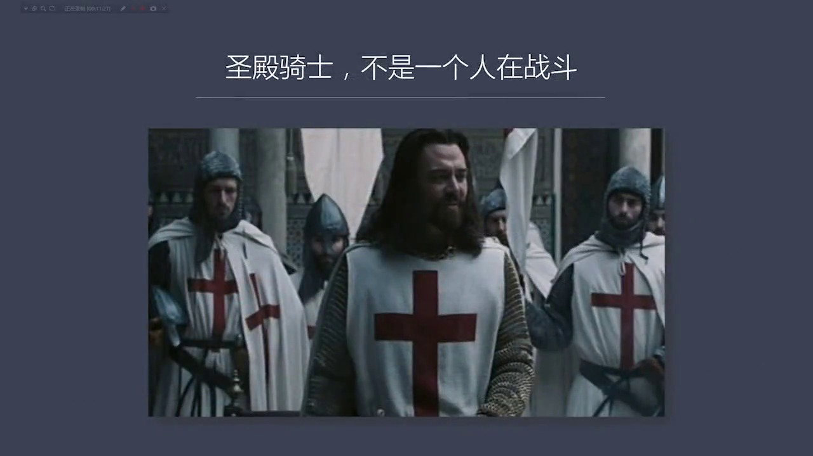

還有幫它作戰的這種步兵還有幫它刺後它的這樣的一種隨從所以它一定是帶了一幫在馬下作戰的這樣的一個群體所以數千人的歧視它可能會能夠調動就是整個它的軍事量能達到數萬人它這個軍事武裝力量是非常強大的如果我們跟...

<strong>All subtitles</strong>

> 還有幫它作戰的這種步兵還有幫它刺後它的這樣的一種隨從所以它一定是帶了一幫在馬下作戰的這樣的一個群體所以數千人的歧視它可能會能夠調動就是整個它
> 的軍事量能達到數萬人它這個軍事武裝力量是非常強大的如果我們跟這個12世紀歐洲其他的這種封建的這種國家相比它的軍事量都非常強大你比如說法蘭西國
> 王當年在它的領土上在它的領地之上它大概養了三四百個歧視所以生建歧視團這數千人數千歧視可以說它的武裝力量可以跟任何歐洲的這些國家相體病論也正是
> 由於它們這樣的一種強大的軍事力量和教皇給它們的特權財產的免稅所以它們迅速成立之後迅速建立起了一個遍佈歐洲各個國家的這樣的一種分析機構我們在探
> 納金融的時候你腦子面應該笨出了第一概念就是一定要有網絡沒有網絡它就不可能構成金融那麼生建歧視團它是一個獨特優勢就是它在比如說巴黎有巴黎分析機構巴黎的生建歧視團在倫敦有它的分析機構

---

### Slide 8

那麼在德國再德一致西班牙還有在地中海的沿岸還包括很多島嶼像賽佩洛斯等等這些都有盛電歧視團的分析機構這就是它能夠作為一種強大的一種網絡而存在而正是由於它的武裝力量強大它有龐大的一個網絡你會看到它的勢力在...

<strong>All subtitles</strong>

> 那麼在德國再德一致西班牙還有在地中海的沿岸還包括很多島嶼像賽佩洛斯等等這些都有盛電歧視團的分析機構這就是它能夠作為一種強大的一種網絡而存在而
> 正是由於它的武裝力量強大它有龐大的一個網絡你會看到它的勢力在歐洲當時是手區一致的甚至連各個國家的國王都覺得把金融財保存放在盛電歧視團的金庫裡
> 面才覺得安全也正是由於它有一個龐大的這種網絡這個每個網絡還在自己做生意比如說並夠土地放高麗袋放高麗袋當時教會是嚴敬的但是盛電歧視團鬼偶爾墨角
> 的做很多事教皇爭議室也閉著眼管不了它們所以它們就急劇是一個巨大的一個土地資產還有高麗袋的這樣的一種這種放袋這種金融活動所以在這個過程中你會看
> 到這個盛電歧視團的鬼偶爾墨越來越大你比如說它在法國一個地區相比地區就擁有15000多英母的土地在整個歐洲它們所控制的這種城堡多達9000多座
> 其實盛電歧視團之外的醫院集團更多比他們多一倍有17000多座城堡每座城堡就是一個堡壘就是一個小型的城市所以他們的這種力量是非常強大轉運軍想這
> 個事最好是由盛電歧視團來承擔所以當他們提出他們可以進行轉運的時候教皇非常痛快就答應了主要原因就是他們辯部歐洲的各個分析機構由於大量的生意往來
> 所以它可以進行內部的轉帳不用每次運軍想全部要用現金來武裝壓運它可以通過它的轉帳系統通過它的清算系統來進行紙面上的操作只有在出現嚴重的資金差異
> 情況之下才設計到一次性傳運過去就完事了就跟我們現在所說的集中清算是一個道理所以我們看到盛電歧視團在一一五零年所創造出來這種遠程匯兌它就是一種
> 最早的匯票體系那麼它的創新的基礎就是一定要有一個辯部歐洲各地的金融網路而且能夠集中進行清算它就能做這個事情所以我們看到最早的匯票並不是由於商
> 業貿易的發展而往往是由於這個其他事情它的創新是由於其他原因創新後來被轉移到商業貿易至上其實我們看到其實很多創新都遵循這個規律就是原來的發明後
> 來被用到其他方面最後非常成氣候像蒸機機它最早並不是用來跑火車的拉火車的主要是用來給煤礦抽水的還有我們說是君主力限制君主力限制它一開始也不是英
> 國人搞出來的而是教會體系力百年大論戰為了限制教皇的後來它在政治之上被引用創造出了一個流行與歐洲的政治制度所以我們會發現很多初始的創新跟它最後
> 所產生了巨大的巨大的影響力之間它是不一樣的這個匯票的創新首先並不是發展貿易而是聖殿歧視團為了轉運時尊東征的軍想而發明創造從實驗上這個我們可以
> 非常清楚地看到就是在150年前後當聖殿歧視團發明匯票的時候比如說商業貿易這個所形成這個需求還沒有達到創造匯票的程度主要原因就是當時還沒有一個
> 遍擊歐洲的國際商人的群體沒有一個遍擊歐洲的商人的一個貿易網絡這個貿易網絡什麼是出現的要比聖殿歧視團發明匯票要玩五十年左右義大利商人在實驗東征
> 過程中越來越富有所以他們的商人從一二零年開始開始逐漸地滲透到歐洲各大城市比如說在一二零年前後進入了鄉民那幾十在一二五零年之後大概到達了英國在
> 一三零年前後到達了芬蘭德地區所以義大利商人群體的進化他們所建立這個金路網絡貿易網絡出現的時間要晚於聖殿歧視團那麼從這個角度我們可以看到這個聖
> 殿歧視團應該說他們的匯票發明是屬於全歐洲最早的而這種匯票如果我們看下野匯票制度其實帶來了一種根本上的革命這種革命就是信用革命因為在歐洲以前在他的立場從來沒有出現過這樣一個概念

---

### Slide 9

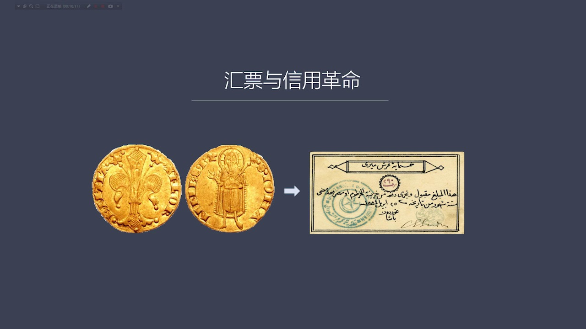

一般歐洲在立場都認為錢就是金銀幣你現在用意志的票據來取代了金銀幣這個在歐洲立場是一個開天屁地的事這意味著什麼意味著以前歐洲人只相信金銀幣而現在他們把這種信任轉移到了對這種金銀幣支付的一種承諾上這種承諾...

<strong>All subtitles</strong>

> 一般歐洲在立場都認為錢就是金銀幣你現在用意志的票據來取代了金銀幣這個在歐洲立場是一個開天屁地的事這意味著什麼意味著以前歐洲人只相信金銀幣而現
> 在他們把這種信任轉移到了對這種金銀幣支付的一種承諾上這種承諾並不是現成的給你金銀幣而是說以後或者到你需要的時候你可以獲得他所以這種承諾變成了
> 現金這是一個非常重大的信用上的突破也就是他在時間和空間在時間和空間兩個維度上他實際上延伸了拉伸了這個現金的功能比如說在時間上會票你可能坐船要
> 一個月所以這一個人手中拿著會票就等於是拿著現金所以在空間上是延伸了現金

---

### Slide 10

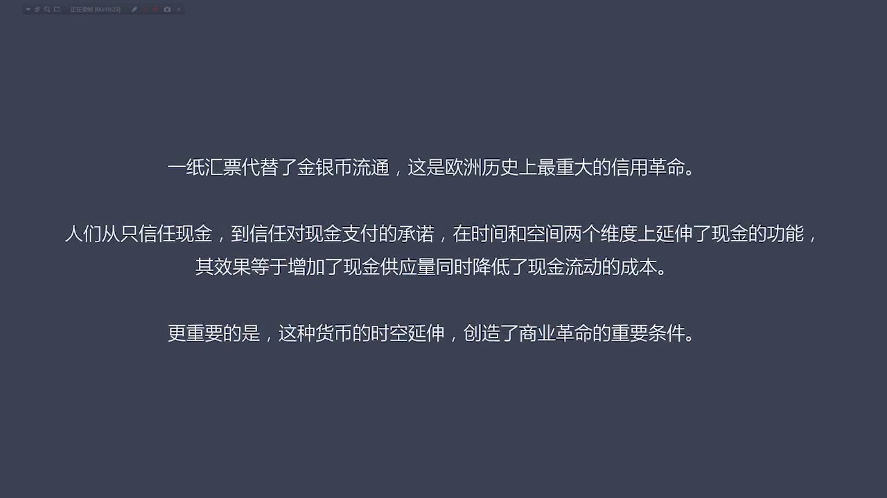

在時間上延伸現金在空間上也一樣因為你要跨海要遠度重陽跨越地中海那麼那麼這個在空間上也拉伸了現金的使用所以他某種意義上來說由於會票的發明等於增加了金銀幣的供應量同時由於他這種轉運成本很低是屬於紙張作業或...

<strong>All subtitles</strong>

> 在時間上延伸現金在空間上也一樣因為你要跨海要遠度重陽跨越地中海那麼那麼這個在空間上也拉伸了現金的使用所以他某種意義上來說由於會票的發明等於增
> 加了金銀幣的供應量同時由於他這種轉運成本很低是屬於紙張作業或者在帳戶上進行調整所以他的轉運成本大大低於壓運現金所以他使得資金的流動加速這幾個
> 方面的因素都導致了在中市盡量的一個社會中相當於貨幣供應量增加了當然更重要了一個問題是由於這種時空上的延伸金銀幣這種時空上延伸創造了商業革命的
> 重要條件就是拉伸之後使很多金融的創新可以在拉伸過程之中升漲出來而在純粹用金銀幣的情況之下你是無法進行這種金融狀心的如果我們再看下野下野就講的
> 這種匯票他的創新發生了千億發生了轉移雖然我們說這個匯票是勝店其實團的發明但是他確實在義大利商人的手中

---

### Slide 11

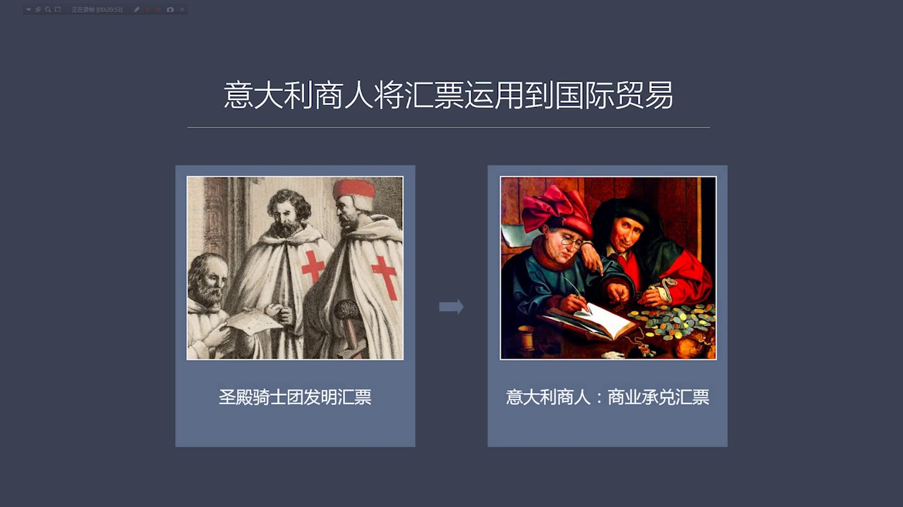

把匯票這個概念進行了放大轉移到時國際貿易這個領域中特別重要的是創造出了商業成對匯票這個概念和這樣的一種新的工具正是這個工具電定了我們現在所有新西方金融制度的一個最重要的一個基石可以說他是深刻和永久的改...

<strong>All subtitles</strong>

> 把匯票這個概念進行了放大轉移到時國際貿易這個領域中特別重要的是創造出了商業成對匯票這個概念和這樣的一種新的工具正是這個工具電定了我們現在所有
> 新西方金融制度的一個最重要的一個基石可以說他是深刻和永久的改變了歐洲的社會結構所以我們怎麼強調匯票這個事都不過分主要原因就是如果我們想想想假
> 如沒有商業成對匯票的創新那你怎麼進行國際貿易呢如果你沒有這個國際貿易這樣的一個有效的工具那也就無法形成跨地中海這樣的一個國際的大市場如果沒有
> 一個大市場來支撐那麼在弗蘭德在義大利很多地區的這種精細化的社會分工就無法深入展開如果沒有這種精細化的社會分工的話那麼整個資本主義制度後來所發
> 揮出來了種種的管理制度還有金融制度都無法建立所以後來的資本主義發展就談不上了因此商業匯票這種匯票的創新可以說是我們理解西方金融制度的一個最重要的基石他不僅是最早出現的而且也是一最重大的一個超越的股票

---

### Slide 12

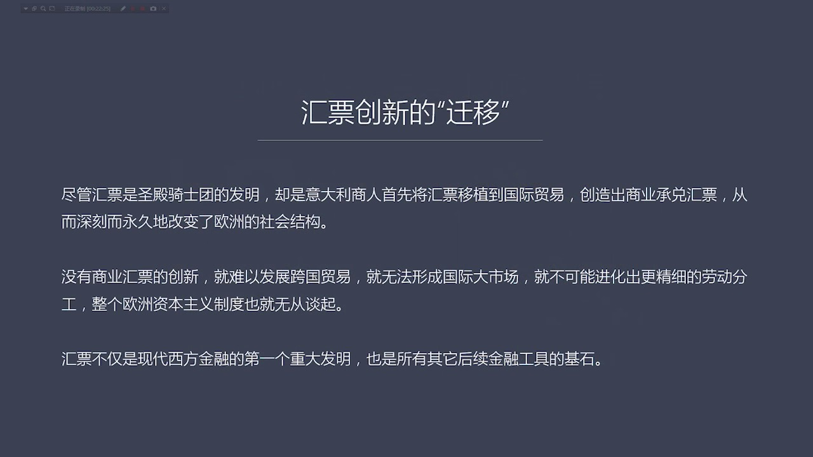

超越了保險超越了年金制度超越了這個主權信用等等所以我們需要深刻理解他不僅是匯票不僅是現在西方金融的第一個重大發明也是所有後續金融工具金融制度資本主義制度得以進化的一個重要的一個轉折點這就是我們為什麼首...

<strong>All subtitles</strong>

> 超越了保險超越了年金制度超越了這個主權信用等等所以我們需要深刻理解他不僅是匯票不僅是現在西方金融的第一個重大發明也是所有後續金融工具金融制度
> 資本主義制度得以進化的一個重要的一個轉折點這就是我們為什麼首先要講匯票那麼如果我們再看下頁下頁就是匯票一開始是用於掉坡資金的就是如何把龐大的
> 這種比較笨重的金融幣轉移到很遠的一個地方去它是屬於遠程匯對的這個升點其實團主要使用匯票就是用於轉運資金

---

### Slide 13

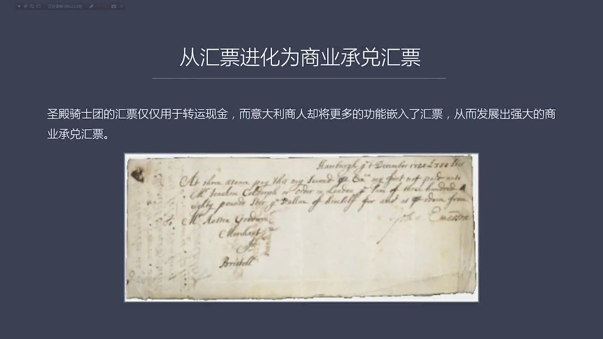

但是由於這種理念的出現義大利上人把這個概念借過來了他們把匯票發展成了一種用於國際貿易的就是我們現在所熟知的商業成對匯票從而使得整個的國際貿易獲得了一種強而有利的一種新的工具的支撐國際貿易才能蓬勃地發展...

<strong>All subtitles</strong>

> 但是由於這種理念的出現義大利上人把這個概念借過來了他們把匯票發展成了一種用於國際貿易的就是我們現在所熟知的商業成對匯票從而使得整個的國際貿易
> 獲得了一種強而有利的一種新的工具的支撐國際貿易才能蓬勃地發展起來這就是義大利商人們發現了商業匯票中它欠入了一些新的功能就在普通匯票這個這個升
> 點其實團發明的普通匯票中欠入了五個最主要的功能第一個功能遠程匯對遠程匯對跟升點其實團這個轉運資金的

---

### Slide 14

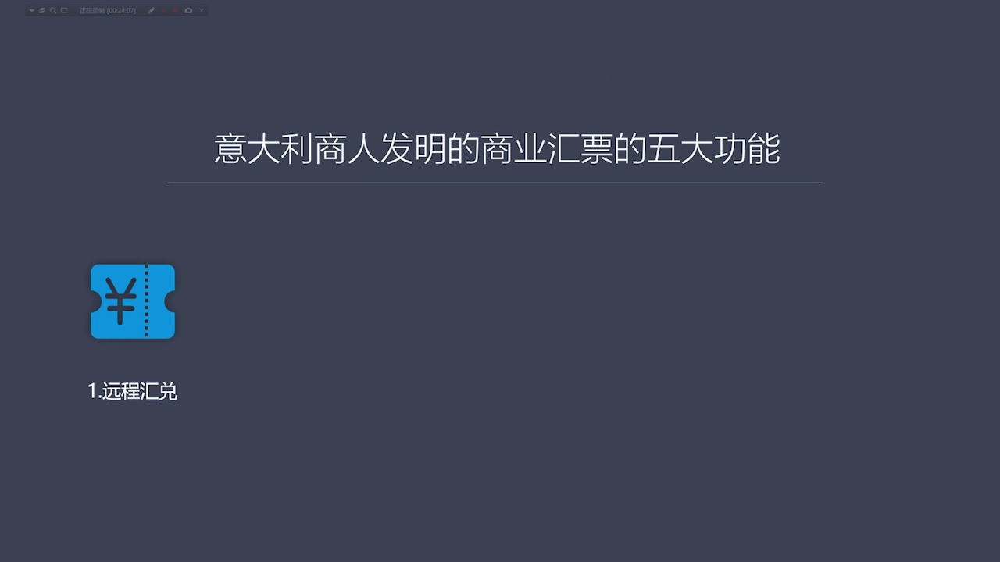

這個功能是一樣的但除此之外第二個功能就是匯票所沒有的它可以作為一種支付手段支付平正來使用你手上拿了匯票相當於哪有拿著這個現金可以具有支付的功能這就具有著相當強的貨幣的這樣的一種屬性它可以用於支付第三個...

<strong>All subtitles</strong>

> 這個功能是一樣的但除此之外第二個功能就是匯票所沒有的它可以作為一種支付手段支付平正來使用你手上拿了匯票相當於哪有拿著這個現金可以具有支付的功
> 能這就具有著相當強的貨幣的這樣的一種屬性它可以用於支付第三個功能就是信貸發放由於這個當時中世紀這個大家作為這個貸款比如說貿易貸款你什麼作為一
> 個抵押品商業匯票實際上就是一個發放貿易貸款的一個重要的抵押品我們一會兒會講到商業匯票它的背後的原因背後的抵押品究竟是什麼不過從目前我們談到這
> 一點來說商業匯票它延展出了一個重要的概念就是可以進行延期支付延期支付了背後的最核心的一個功能其實就是放貸我可以通過商業匯票的形式有錢人可以把
> 貿易貨款把貿易這種資金放貸給需要貿易的商人們從而這個過程進化出了銀行們很多功能所以放貸這個是一個這個超越的聖經歧視團的普通匯票的一個重大的創
> 新除此之外第四個欠入了新的功能是外匯交易因為商業成對匯票首先它是涉及到跨國貿易你比如說從西班牙巴塞羅納和這個弗蘭德地區要做貿易它就涉及到了兩
> 個國家所以匯票上會規定我從比如說我從弗蘭德借當地的貨幣以什麼樣的匯率來規定借款的條件那麼我還款時候是在巴塞羅納巴塞羅納又是西班牙的金幣那麼在
> 西班牙以什麼樣的匯率來還款所以這就必然會涉及到一個外匯的問題它不僅是遠程的匯錢過去也不僅是放貸也不僅是支付同時它還會涉及到外匯交易這就是一個
> 新的重要的功能因為這個功能對未來的國際貿易影響巨大是一個非常非常獨特的非常獨特的一個功能那麼第五點第五個功能它其實要規避教會的高利貸的限制因
> 為在中世紀教會對於高利貸是堅決反對的反對這個很多商人去從事這個高利貸活動所以很多放貸了這種工作特別是高利貸點檔行業都是由猶太人去做這也是為什
> 麼很多歐洲人反猶的另外一個重要原因除了宗教的原因之外另外就覺得這幫人是高利貸是盤剝者是屬於不受歡迎的人他們賺了很多錢但是卻是很多人輕量擋產想
> 問因斯商人這種小時候中間已經有大量這種描述了怎麼來規避高利貸的限制商業成對會票就是一個有效的辦法因為它涉及到跨國跨國就有一個匯率問題所以它的
> 高利貸是隱藏在匯率折算之中這是商業成對匯票的一個重大的發明所以從匯票到商業成對匯票這是一個重大的飛躍把僅僅是一個功能單純的轉帳這個問題發展成
> 了一個能加速國際貿易使著整個金融設計越來越精緻它朝這個方向去發展使著整個金融工具包括信用獲得了巨大的突破而正是這種突破導致了後來一系列基於商
> 業匯票基於信用這些理念之上既有又進化出了大量新的金融工具這些金融工具我們以後在模塊課程中會逐一介紹如果我們現在看到下一頁就是下一頁我們會講到
> 中世紀商業成對匯票的一個具體案例這個具體案例就發生在西班牙和復蘭德之間這個是一個真實的我們現在找到的當年真實的匯票一個完整的效益它的商業場景
> 什麼樣呢就是西班牙的某個進口商我以前講到過西班牙當時美麗的農這個羊毛非常質量非常好在歐洲很暢銷特別是在復蘭德地區大家需要英國的羊毛需要西班牙
> 人羊毛來進行毛訪之工業的加工最後生產出來的泥融在賣給西班牙或賣到中東地區賣到全世界所以復蘭德地區是非常需要西班牙羊毛的那麼這個商業場景就是一
> 個西班牙的一個商人比如說我們稱之為A商人進口商A當然在原始的這個評證中它這個名字很複雜非常邏鎖我們把它檢化檢化上一幣C地那麼西班牙這個這個商
> 人到了蘆蘭德這個A到了蘆蘭德他希望能夠從當地蘆蘭德的某一家銀行幣那裡獲得貸款獲得貸款買什麼呢買銀融買了銀融之後再把銀融運回到巴塞羅納進行銷售
> 所以呢他就涉及到一個貸款的問題但是他憑什麼貸款人家當地銀行憑什麼要貸款給他呢就是當地銀行幣為什麼要貸款給A呢那是因為A這個西班牙的商人在巴塞
> 羅納的某家銀行C在C銀行那個地方有他的存款上戶他是把金銀幣存到了C這個C是在巴塞羅納那麼他就說我是有錢的雖然我的錢在海外但是我確實有錢蘆蘭德
> 銀行呢這個時候這個蘆蘭德銀行幣之所以願意給他貸款是因為蘆蘭德這個銀行幣在巴塞羅納有一個指定收款人地也就是說我把款子貸給他那麼他的巴塞羅納還錢
> 售還給誰呢他不能直接還給蘆蘭德的銀行幣他還給這個蘆蘭德銀行在巴塞羅納指定收款人也是一家公司還給這個地這不就等於他收到錢了嗎所以你會看到一個具
> 體的真實的商業程度和票在當年是如何發生的他其實是個四方交易模式涉及到兩部會票一個是去程一個是回程關於這個問題國夫論中間這個亞當斯密也覺得這個
> 概念很很難解釋就是很難描述清楚所以他中間有一段專門講這個四方交易和這個會票兩重會票的這樣一個步驟大家有興趣可以去看一下不過我們在這裡我把這個
> 交易過程打大簡化之後爭取我們能夠很短能把這個他這個怎麼交易說清楚首先去程會票什麼叫去程會票呢比如說我們拿這個案例就是1399年12月12號這個西班牙商人向弗蘭德的銀行幣申請貸款申請貸款的抵押是什麼呢

---

### Slide 15

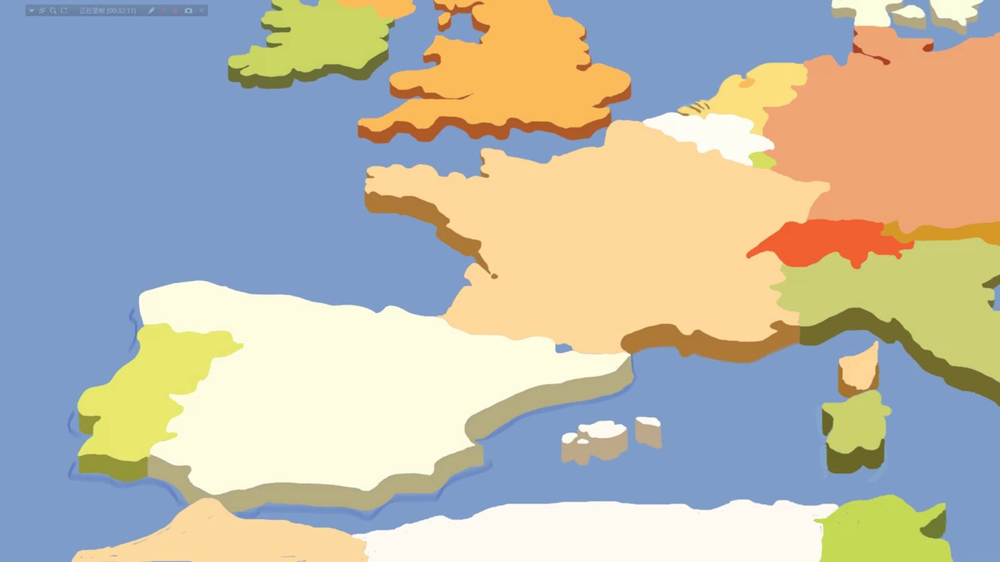

抵押就是這個商人在巴塞羅納開戶行所存的那個款則作為抵押那麼這種放待是怎麼來進行呢就是弗蘭德的銀行幣購買商人A在巴塞羅納銀行C那裡存款的一種鎖取權主要這叫 bill of exchange就是商業會票的...

<strong>All subtitles</strong>

> 抵押就是這個商人在巴塞羅納開戶行所存的那個款則作為抵押那麼這種放待是怎麼來進行呢就是弗蘭德的銀行幣購買商人A在巴塞羅納銀行C那裡存款的一種鎖
> 取權主要這叫 bill of exchange就是商業會票的意思也就是說我給你貸款買的是你的在西班牙銀行的一個鎖取權存款的鎖取權他為什麼叫 
> bill of exchange原來就在這兒那麼實際上我們可以列成我用你在西班牙銀行中的存款作為抵押放待給你一筆款子所以這個A商人就獲得了弗
> 蘭德的當地的金幣他就可以在弗蘭德進行採購銀融採購完了之後就把這個銀融通過船運運和了巴塞羅納那麼到了1400年1月11號大概1月之後弗蘭德的銀
> 行幣就是他購買了這個A的這個存款的評證就是這個商業匯票然後他就把這個匯票要寄到他在巴塞羅納的收款人地要寄過去他們有專門自己的有郵證系統那麼地
> 收到了這個這個匯票之後他就拿到商業匯票找到了這個巴塞羅納商人在在巴塞羅納的開房C然後他就把這個匯票交給C你看這個按照匯票上來說幾月幾號我就應
> 該到你這兒來提款當然這個C銀行一看A確實是我這兒的一個储戶而且他有這麼多錢拿這個票我也認好這個時候這個C就把所欠的就是把這個商業匯票中所規定
> 這個指定時間所應該付的錢就交給了地好這個過程就完成了一個放待一個月然後把這個匯票寄到了收款人那裡收款人評票到引到巴塞羅納的銀行取到了現金這個
> 過程交易就完成了比如說時間跨度是一個月那麼在匯票中規定了匯率匯率中隱藏了這個利息好現在的問題是這個藍德的銀行收款人獲得這筆資金他怎麼把他轉運
> 回負藍德呢因為負藍德的銀行是我把錢放出去我還在本地收那麼這個錢怎麼轉回去呢那麼他的指定收款人地就會想辦法再用同樣的一個思路開一個回程匯票把這
> 個錢轉回去這個回程匯票也就是這個收款人地他再次以放待人因為他相當於這個A銀行的代理人他也是相當於就是一家銀行他以放待者的角這個身份再去買另外
> 一張商業誠的回票就買另外一個商人的商業誠的回票而另外一個商業商人的正好他在這個藍德的銀行中有存款就是整個過程反過來而這個商人正好需要在巴斯羅
> 納貸款買羊毛然後運到這個弗蘭德去進行加工所以他在巴斯羅納有貸款的需求他就把他在弗蘭德地區銀行中的存款作為抵押開一張匯票交給了商人地商人地再把
> 這個匯票寄回到弗蘭德然後這個商人回程這個商人到了弗蘭德地區然後賣掉他的羊毛獲得了貨款然後可以把這個現金在還給銀行幣按著當時指定了會價然後你會
> 發現這就是一個去程和回程兩個兩個這個兩部的這種匯票非常有意思如果你仔細做夢的話這個過程是相當的精緻這種匯票制度設計的是相當的巧妙來回都不浪費
> 資金在去過程中是放待回來過程中也是放待而且又實現了遠程的匯對同時還規避了高利貸這個問題他的利息是藏在匯率之中所以在整個這個過程之中你寄達了放
> 待的目的又達到了轉錢的目的還達到了收利息還免出教會追查各種目的全達到了如果我們來計算一下他在整個兩部交易中間這是一個雙向貸款兩部商業匯票所發生的雙向貸款交易中間

---

### Slide 16

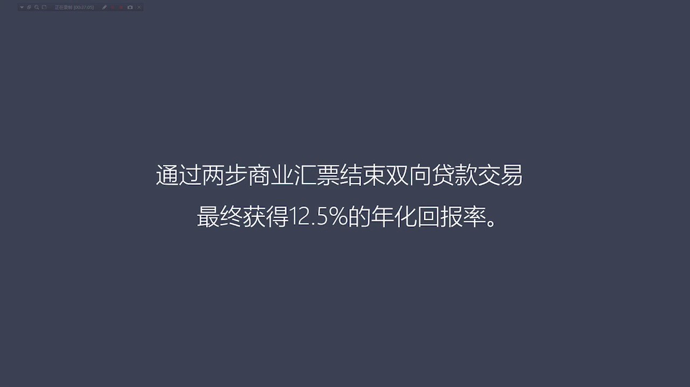

他最終獲利年化回報率大概是12.5%這可以算出來當然這個具體計算要涉及到匯率的比較關係涉及到當時匯票中所規定很多很多細節問題但是我們可以看到12.5%的投資回報率年化的這還是一個非常不錯的一個投資回報...

<strong>All subtitles</strong>

> 他最終獲利年化回報率大概是12.5%這可以算出來當然這個具體計算要涉及到匯率的比較關係涉及到當時匯票中所規定很多很多細節問題但是我們可以看到
> 12.5%的投資回報率年化的這還是一個非常不錯的一個投資回報率所以通過這樣一個具體的案例我們大概就能夠知道當年中是幾發生的這種金融的交易通過
> 匯票是怎麼來做的這必須要研究案例必須要回到歷史真實狀態之下你去看匯票的發明它是怎麼用的我們現在再看下一那麼為什麼是一大利人創造出了商業匯票而
> 不是剩電歧視團內幫人這主要是兩幫人的出發點不一樣剩電歧視團這幫人骨子裡他們是一幫歧視是封建歧視他們更喜歡土地更喜歡搞高利貸所有以土地為中心的
> 這種人腦子們想都是土地封建歧視就是要獲得地有了地才能變成零主才能才能進擊所以他們在武裝壓運過程中所獲得了很多利潤並沒有去投向商業而主要轉向了
> 土地收購高利貸高利貸的目的也是為了監命土地這是一個原因第二還有一個原因就是剩電歧視團它自己並不控制一種新興的產業所以它也沒有太多了貿易這種放
> 待的需求所以它並沒有把主要的金錢投到貿易上而主要投到土地上這是導致他們沒有進化除商業匯票的一個最本質的這些原因那麼義大利商人義大利我以前講過
> 他的地位置特天度後尤其是維尼斯熱娜亞這正好是從中東過來商品轉運到歐洲的一個中短站所以他的德天獨後的地理位置使得他最早建立了國際貿易網路像佛羅
> 倫薩佛羅倫薩就是最重要的銀行家的分析機構他們所辯部歐洲的這種雖然他們後發但他們後發的優勢使他們迅速地建立了更多的分析機構辯部歐洲所以在後來的
> 競爭中佛羅倫薩的銀行家的競爭優勢就超越了上面歧視團另外一個更重要的原因是當年義大利的毛反工業發展得非常的繁榮可以說當時歐洲有兩個工業中心一個
> 是在弗蘭德另外就是在義大利義大利跟弗蘭德最大的不同就是他的毛反工業最大的不同是義大利的染色特別是佛羅倫薩的染色工藝極其先進還有金加工就是他的
> 系榮製造製造能力非常強大他們經常到這個佛羅倫德地區或者到德意志地區收購這種粗氧榮就是粗泥榮他們用他們獨有的一個獨門染氣一種特殊的工藝可以把粗
> 氧榮可以加工成系氧榮非常品質非常高的系氧榮然後在染上非常美麗的顏色先亮的顏色然後在賣到中東而在伊斯蘭地區是非常喜歡義大利人這種染色技術所以我
> 們來看為什麼文藝復興運動它爆發在這個發生在義大利的佛羅倫薩有大量的藝術家都在那個地方成名一個很重要的原因就是油化要設計到原材料的問題原材料就
> 是染料是怎麼解決的就是佛羅倫薩的大批的這個工匠首先在伊斯蘭零零年發現了從植物中從礦物中可以提取這種非常鮮艷的顏色這種染料在此之前西方的染料標
> 要從東方進口從伊斯蘭零年之後他們發現了提取植物和礦物中間染料的這種工藝使得使得這種顏色這種顏色的原材料獲得了解決當然它變成個門類其權的巨大的
> 工業體系能夠創造出大量的染料大量的顏料這使得意大利的畫家在畫油畫過程中佛羅倫薩的畫家它是具有得天獨厚的優勢的因為你沒有顏料怎麼畫因為早期的這
> 個繪畫藝術所使用的這種彈圈用這種東西它是跟後包括這種染料顏色的選擇是有限的只有到了佛羅倫薩進化出了一種更先進的這樣的一種工業畫的大規模生產的
> 這種染料才解決了顏色的問題所以我們看到文藝復興的很多東西其實是跟佛羅倫薩跟它背後的這個法治工業的印染工業有密切的關係也正是由於它們這個染色技
> 術非常高明所以意大利的就是佛羅倫薩為代表的意大利的這種毛反工業高度繁榮它們的利潤極高那麼意大利的銀行家把大量的這個貿易利潤重新投入到手工手工
> 業中從銀銅熱毛防止和印染工業中就可以獲得更高的利潤這種這種利潤它是滾動的越投賺得越多然後賺得越多越願意投這個行業所以它們非常強調資金的周轉周
> 轉的速度和效率而不像順便其實還把把一筆錢帶到土地上就壓在哪兒不動然後做手高利如果對方委員還不上了還把人家土地收走它就不是這個玩法所以意大利上
> 任證實有有巨大商業貿易的需求而且控制著這個毛反工業的這個龍頭所以它們在後來就範造出了商業成對回票這個概念就被它們所搞穿了所以我們會看到最先搞
> 出發明的順便其實團在後來的商業貿易中這個概念被意大利商人所借用以用去創造了一個更先進的商業成對回票體系這才導致了整個地中海貿易的空錢繁榮才引
> 發了後來的商業革命我們現在翻到下一下一頁就是為什麼意大利它有這樣的一個特點就是我在這裡列舉了四個意大利共和國它的基本特點

---

### Slide 17

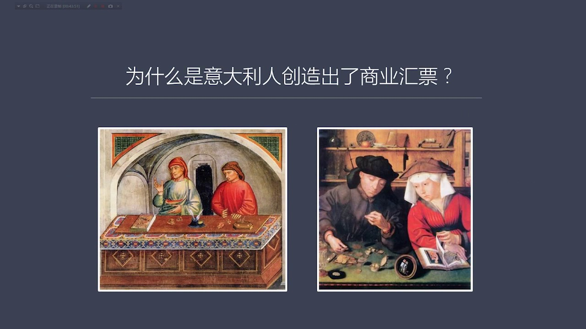

維尼斯熱納亞這是靠國際貿易崛起的十一世紀末就是從第一次時軍

<strong>All subtitles</strong>

> 維尼斯熱納亞這是靠國際貿易崛起的十一世紀末就是從第一次時軍

---

### Slide 18

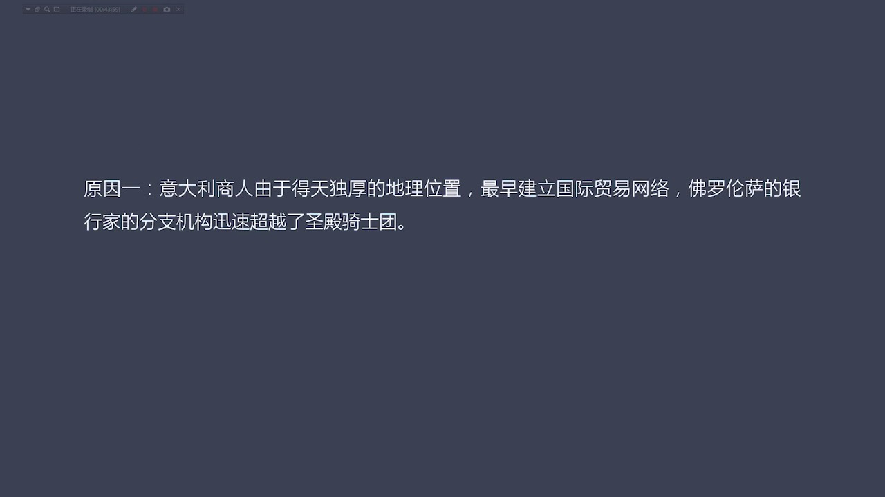

這個東爭以後很快它們這個貿易就做起來了它屬於典型的國際貿易立國的城市它們在維尼斯最明顯整個統治階層全是商人沒有一個封建領主這使得它的全部的法律完全是保護貿易的保護商人利益的而不是保護土地地主利益的這使...

<strong>All subtitles</strong>

> 這個東爭以後很快它們這個貿易就做起來了它屬於典型的國際貿易立國的城市它們在維尼斯最明顯整個統治階層全是商人沒有一個封建領主這使得它的全部的法
> 律完全是保護貿易的保護商人利益的而不是保護土地地主利益的這使得維尼斯跟所有其他的幾個共和國都不一樣因為維尼斯的地位這非常獨特它是在一個謝忽之
> 中的一個島跟大陸之間是隔絕開的那個地方沒有土地所以它們就不必考慮土地貴族地主的利益完全是保護商業所以維尼斯進化出了這種純商業純商人執政的模式
> 是在意大利共和國中也是非常獨特的那麼第2個這個第3個主要城市就是弗洛倫散弗洛倫散它崛起於十三世紀由於它在內陸它沒有海港所以它首先發展著是毛反
> 工業特別是印染高度發達了印染所帶來的毛反職工業細容的加工業然後它有了非常強大的生產能力和高質量的產品然後它在發展的商業最後是發展銀行業那麼你
> 會看到弗洛倫散的銀行業起步是最早的它從一二五零年發力注意它發力時間比這個盛電其實反發明會票時間大概晚一百年左右他們在一二五零年發力之後就開始
> 到處在歐洲建立分支機構那他到一三一零年用了六十年時間就基本上壟斷了整個歐洲基督教世界的信貸所有國家的資金全部要靠他們就是要受到他們的影響和壟
> 斷所以他們就具有著非常巨大的影響歐洲各國經濟貿易還有這個王朝政治的這種能力向英國國王跟他們之間的接待關係你會看到英國國王背炮要抵押很多這個貿
> 易特權向羊毛出口權就是一個典型那麼除了弗洛倫散那麼還有一個城市很重要就是密蘭密蘭是絕取一一八三年就是當年得一致這個帝國深圳羅馬帝國跟教皇跟這
> 個北一大利這些人作戰打到了一一八三年簽訂了康斯坦次合約之後打敗了管不了了所以深圳羅馬帝國名義上因為有這些北一大利這些城市共和國但是實際上他已
> 經失去了控制所以在這幾個在這個一大利北部之間共和國基本上全部出現了這種這個地方力量要高於帝國力量高於這個深圳羅馬帝國這種力量的趨勢所以他們在
> 各城市中都出現了貿易控制政治他們發展出來的法律體系司法體系都是為了主要保護貿易的當然維尼斯做的最徹底密蘭正式在這個過程中發展成了一個工商業的
> 重鎮因為密蘭是通向法國理陽的一個交通要道就是這個理陽它是個十字路口法蘭西地下是南美向從密蘭越過這個二倍升到法國的東西向了這個商業貿易大通道正
> 好是交會於理陽那麼理陽它之所以以後來變得非常強大就是它是個工商業的一個雙重的符合體同時還是個貿易中轉站所以它的經濟優勢也非常的明顯從四大共和
> 國的特點來看就是商業貿易是主導政治的這個是義大利的一個特點也是它為什麼貿易和金融非常發達的重要原因凡是王朝力量非常強大了經濟貿易就是在貿易方
> 面它就不是以商業作為執政的核心作為法律體系的核心而是以土地為核心的這就是我們中國跟義大利跟西方很多城市公安國最大的不同而且這個國際貿易的強大
> 需求不斷地去刺激會票的進化然後欠入會票中間的功能越來越多為了方便國際貿易這才使得會票變成了商業程度的會票商業程度的會票又極大的促進了這種整個
> 環境中海貿易的這種崛起這是它的一個實在大背景好搞明白了這個商業程度的會票的起源從會票到商業程度會票它這個起源和進化的過程我們反過來再看中國會
> 票因為中國會票起源其實比義大利他們要早三百年左右所以下野我們看中國會票的起源中國會票什麼時候出現的是公元這個80000年到820年就是唐縣中原核的初年出現了這個所謂的非錢制度

---

### Slide 19

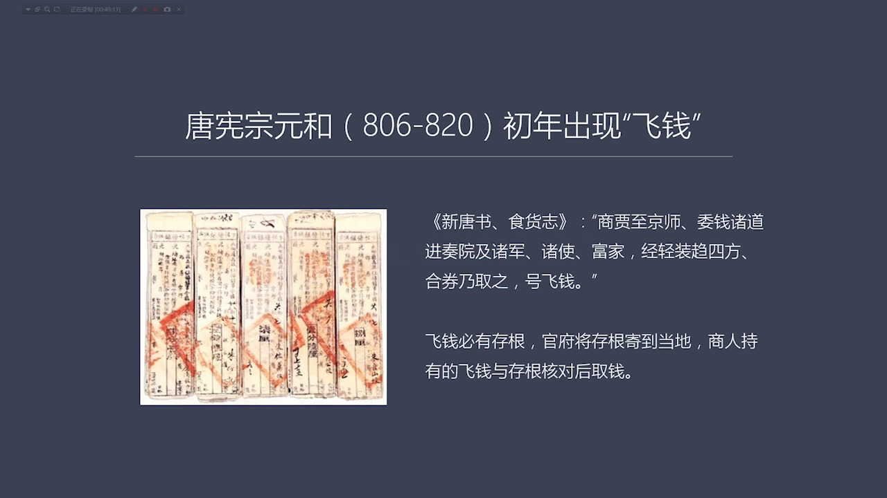

什麼叫非錢制度新唐書實貨智商有一個描述就是各地的商人到這個長安座生意做了生意之後賺了錢他們把這些錢委託給各個省住手督的辦事處我們現在可以可以理解成住金辦事處然後我把錢存在你們這兒然後手督辦事處了這些各...

<strong>All subtitles</strong>

> 什麼叫非錢制度新唐書實貨智商有一個描述就是各地的商人到這個長安座生意做了生意之後賺了錢他們把這些錢委託給各個省住手督的辦事處我們現在可以可以
> 理解成住金辦事處然後我把錢存在你們這兒然後手督辦事處了這些各省辦事處這些人就給他開一張收據當然辦事處要留一個底單把收據給這個商人商人就拿著收
> 據就回到了本省到了本省相對應的政府部門評票去核對那麼這個票根當然就會通過官方的這個郵政系統再把存根再寄到了某個省的牙們然後你如果這張票跟當時
> 的票能夠合得上這個叫合卻來取之如果合得上就把現金拿走所以這種非錢制度我們可以看到它它是有存根的那麼這種非錢制度應該說非常像省典歧視團那個資金
> 轉賬就是這個它這種會票遠程會對這樣的一個功能但是還有所不同因為省典歧視團它是一個中央侵算體系存在著那麼它在很多情況之下

---

### Slide 20

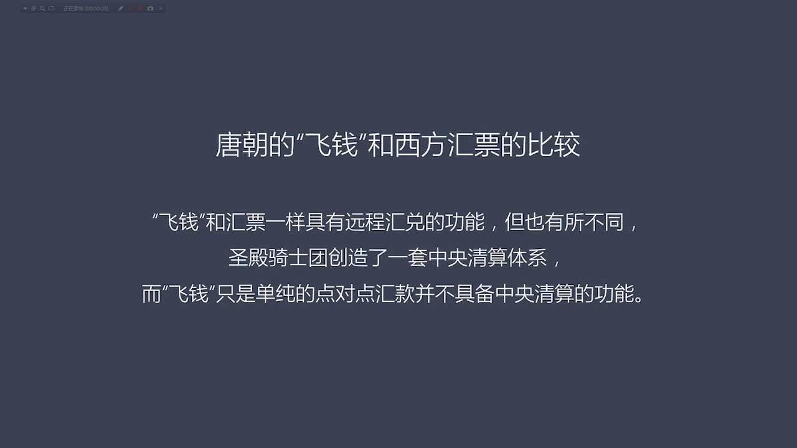

只是賬物之間的周轉而這個中國這個非錢制度不太一樣你比如說它是個收據制度你把現金把金這個比如說銅牆存在牙們中牙們給你開個收據然後牙們再把存根寄到本省你是拿收據去回到這個本省去取錢這中間並沒有一個集中清算...

<strong>All subtitles</strong>

> 只是賬物之間的周轉而這個中國這個非錢制度不太一樣你比如說它是個收據制度你把現金把金這個比如說銅牆存在牙們中牙們給你開個收據然後牙們再把存根寄
> 到本省你是拿收據去回到這個本省去取錢這中間並沒有一個集中清算的問題所以這兩種制度還是要重大差異的就是中國這個是極其單純的遠程會對而省典歧視團
> 中間有個清算和轉賬的功能這個是唐朝的非錢所不具備的那麼我們再看下眼為什麼會唐朝出現這樣的一個非錢制度這要回顧一下當時的歷史背景我們會注意到非
> 錢在中國的出現並不是出現在經濟貿易的頂盛世期你比如說珍觀珍觀之志開源盛世這都是唐朝初年和中期最頂盛的時候國際貿易最發達的時候非錢並沒有出現而
> 是出現在暗示之亂就是公元七五到七六三這個這八年之後又過了半個世紀到了唐憲宗那個時候才出現因為當時全國的出現如果我們看當時任何部長你會發現當時
> 全國的經濟應該說比唐朝出比唐朝最繁榮的時候要差很多因為當時全國人口是嚴重的所得從統計數據來看很像中國北方的各個道像河南道像河北河南這些地方人
> 口統計這個護術已經下降了90%人口銳減當然這中間有些原因是北方是軍發格局的翻證格局這些翻證格局中間的很多人口它是不像中央會報的當然也有另外一
> 大批人由於戰亂暗示之亂大量難簽到江南地區跑到江南地區去了所以江南的江湖來內帶的人口是增加的但是增加也沒有也沒有達到這個唐朝中期繁榮的時候河北
> 這幾個道的人口的數量所以總的人口必然是下降的那麼另外一個就是北方的這些就是北方的那些翻證其實已經事實上獨立了在角面暗示之亂過程之中你會看到當
> 時唐朝沒有力量去徹底消滅它們為了勸他們投降要給很多很多很好了就是很多優惠條件給他們很多錢把他們安頓下來安頓下來之後他們就變成了河北很多地方的
> 翻證河塑地區的翻證而且那些就變成翻證之後這些以前的叛降現在的翻證這些這些人要求他這關職可以繼承事實上唐朝如果反對政府是反對他們就會起兵猛反所
> 以當時翻證連年在反基本上每一個後續的皇帝中都會發生這個反判這種事件朝廷要調動重兵去鎮壓所以一樣養了八九十萬這個人馬駐紮在北方學點不了這一切都
> 會帶來很多問題同時還有這個土波當時在西北地區唐朝勢力衰退之後侵占大量西北地區的這種州縣在北方地區山東被隔斷了他跟中央之間無法進行溝通中間被翻
> 證所隔斷四川處於半都立狀態所以整個唐朝在經過暗示之亂之後全國的中央集權已經碎片化了北方全亂了南方相對好一些也正是由於這種政治碎片化導致了唐朝
> 在中後期的經濟和貿易他這個規模遠遠不如盛唐時期也就是非前的發明並不是在盛唐貿易需求所產生而是由於另外的原因另外這種原因就是我們看到唐朝反覆出
> 現的就在中後期反覆出現的一系列的這種前花同前短缺等等為什麼出現這個問題呢就是因為唐現宗繼位之後他是立經徒制所謂出現了

---

### Slide 21

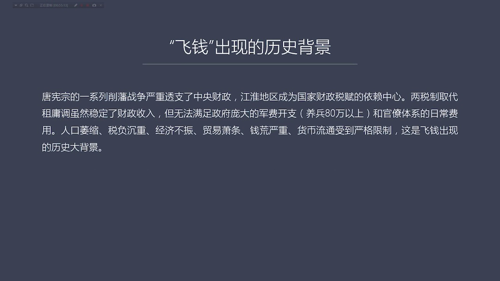

當時出現了原和中心舉行削翻戰爭在削翻戰爭中間連續打了接近二十年

<strong>All subtitles</strong>

> 當時出現了原和中心舉行削翻戰爭在削翻戰爭中間連續打了接近二十年

---

### Slide 22

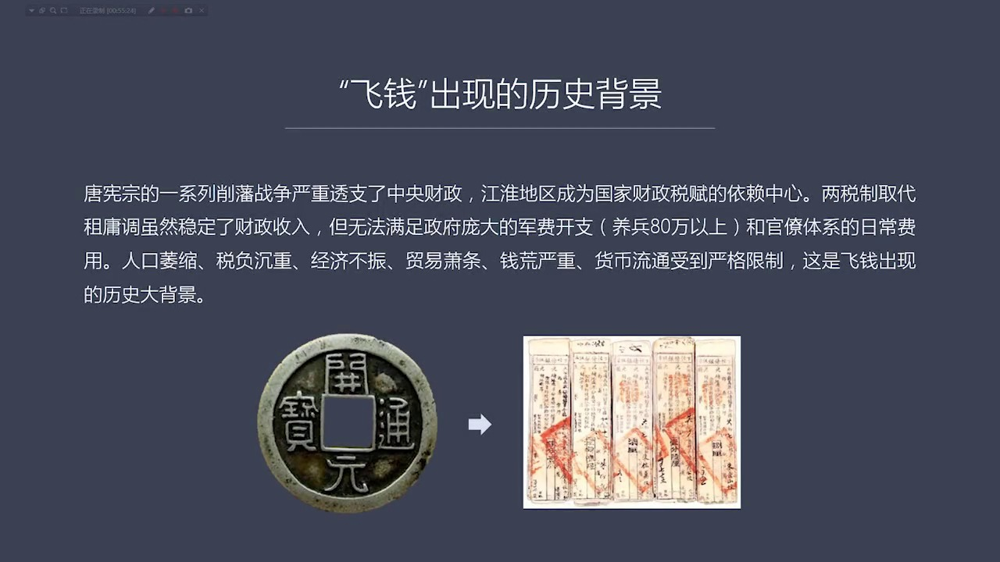

嚴重透支的中央財政中央財政本來就缺錢以前的中央條制都搞不下去了後來換成兩稅制兩稅制雖然穩定了中央財政的收入但是消耗太大養兵太多入不付出怎麼辦呢那就只能是搞各種各樣的這種變得花樣的去去找錢包括買官買官等...

<strong>All subtitles</strong>

> 嚴重透支的中央財政中央財政本來就缺錢以前的中央條制都搞不下去了後來換成兩稅制兩稅制雖然穩定了中央財政的收入但是消耗太大養兵太多入不付出怎麼辦
> 呢那就只能是搞各種各樣的這種變得花樣的去去找錢包括買官買官等等包括要求各個地方這些官員向中央進貢就給一些好處然後地方政府在壓迫當地農民所以整
> 個的經濟貿易相當削調的當時最大的開支就是軍費還有官僚體系的運作費用這兩大塊基本上佔了80%左右了這個財政開始而當時的財稅制度已經滿足不了這個
> 需求了所以非前出現歷史背景可以說唐朝是在中後期陷入了一個人口委縮稅付沉重經濟不正貿易消調而且錢荒非常嚴重為什麼會出現這個問題就是由於大量的這
> 種就是貿易這種投資下降然後很多人就把這個貨幣儲藏起來然後還有很多人把這個貨幣同錢駐成銅器可以賣更多的錢還有些錢到了越南呢到了留到了這個日本之
> 後就被當地的國家儲存下來不回流這都導致了唐朝銅礦開採量的不夠還有成本太高這也加劇了錢荒所以錢荒之後就導致各個省限制同錢流出包括長安也限制所以
> 手都和各地方它在貨幣流動上進行了租多的這種平靜涉及租多的這種平靜限制這種銅銷流出所以正是由於這些原因導致了怎麼辦呢通過非限制度來解決錢荒的問
> 題是中間那個重要原因那麼我們理解這個之後你會發現中國和西方這個出現會票制度它的歷史背景是差異很大的下野我們來對比一下非錢和會票之間的它的差別首先我們看到

---

### Slide 23

我剛剛提到了這個有一點說到了聖殿歧視團的會票和唐朝的非錢從功能上是一致的都是遠程會對把非常龐大的難以運輸的這些金屬貨幣非常方便的低程本人調到遠方去從這一點來說是一致的但是有一個不一致這個不一致在於聖殿...

<strong>All subtitles</strong>

> 我剛剛提到了這個有一點說到了聖殿歧視團的會票和唐朝的非錢從功能上是一致的都是遠程會對把非常龐大的難以運輸的這些金屬貨幣非常方便的低程本人調到
> 遠方去從這一點來說是一致的但是有一個不一致這個不一致在於聖殿歧視團有一個中央清算系統而中國的非錢制度是沒有的每個省就是一張開張收據然後從根據
> 過去然後你拿收據去錢中國兩對這上這套體系唐朝這套體系不具備中央清算功能這是一個非常非常重大的一個區別第二點就是唐朝的非錢主要是政府主導的有個
> 別大商人也搞但是他也沒有形成一個中央清算的網絡因為當時中國並沒有進化出來一個龐大的一個商人的群體而西方的會票它是純私營的聖殿歧視團不是國有的
> 另外義大利商人弗羅倫薩的銀行家也都是私營的所以他從主導性來說是不一樣的一個是政府主導唐朝一個是私人主導義大利商人還有聖殿歧視團這幫人那麼第三
> 個這種比較就是唐朝他的非錢出現於貿易衰退期主要是用於解決錢荒問題的而西方的會票但生於他的貿易高障期就是地中海貿易圈已經形成全球就是當時所謂全
> 球化一個更大的國際上已經出現所以會票制度是加速商業會票制度是加速這個統一市場的形成國際市場的形成反過來又會刺激歐洲出現更更細密更精緻的分工使
> 得他生產能力獲得更大的提升所以他是個正勳環那麼下一個不同點第四個不同點就是唐朝的非錢僅僅是用於遠程會對他的功能很單一西方的會票卻刺激了商業革
> 命最終進化成了商業成對會票這主要是由於貿易的強大的需求不斷地刺激他不斷要求他出推陳出心搞出了很多新的這種制度創新所以這四點我們可以看到雖然唐
> 朝搞得時間比較早但是這個會票制度雖然在這個非錢雖然比西方的會票早了三百年但是我們沒有最後進化成了商業成對會票大家可能會問唐朝後期由於戰亂但是
> 唐朝之後五代時過之後送朝崛起了送朝的國際貿易還有他這個區內貿易是很繁榮的為什麼中國就沒有搞出會票沒有搞出商業成對會票重要中國立上就沒有一直沒
> 有進化出商業成對會票這就是我們看的下一為什麼中國的非錢沒有進化成商業成對會票我在這裏從五個方面來進行比較就是義大利進化成商業成對會票是基於國
> 際貿易的強大需求不斷地需求他而他正是由這種需求他帶有五大特徵就是我們一開始講到了五大特徵第一他的功能是遠程會對那麼義大利的國際貿易是基於一個
> 龐大的商人群體就是遍佈世界各地的一個商人網絡而中國唐宋元民時期他就沒有進化出一個龐大的國際商人的群體來我們看到都是全界的商人到中國來採購中國
> 商人很少的全界去採購所以我們如果你沒有一個遍極世界的這個商人群體的話你怎麼發展遠程會對呢你的基礎條件就沒有就發展不起來只有到了清朝明朝末年和
> 清朝初年我們看到山心商人的崛起才建立了遠程會對網絡那已經是很靠後了別人已經落後了這是一個原因遠程會對基礎條件由於缺乏國際商人群體和一個龐大的
> 商人階級在中國商人受壓制了他就沒有進化出一個遍佈全國和全世界的商人網絡沒有這個遠程會是基礎的第二原因是宋朝1024年搞出了交子指幣制度中國率
> 先發明指幣使得遠程會對失去的存在的理由遠程會對不是用一張紙代替非常笨重的這種精英幣他的或者同幣鐵錢的這種運輸嗎指幣也一樣交子不就是一張紙嗎會
> 票也是一張紙我既然已經搞出指幣了我為什麼還要再用一張會票來隨身攜帶去基錢呢沒必要所以中國早熟的指幣制度實際上壓制了遠程會對會票這個制度的進化
> 這個進化到這就終止了沒有進一步從緣發展到人第二個特點就是義大利的這種遠程會票它是一種支付平正是可以用來當錢用的而中國由於指幣的早熟我們最早搞
> 出指幣所以我們已經用指幣代替了金屬貨幣來進行支付它已經滿足了所有的需求不再需要你商業會票來補充金屬貨幣的不足這在送貸送原名包括名朝的前期一萬
> 二年之前我們都是用指幣的用了五百年所以既然有了指幣作為支付當然我就不需要商業程度會票再來補充了這是第二原因第二原因這頭兩原因都導致中國商業會
> 票了沒有發展到那一步就腰折了第三個原因新來發放義大利人就是說我剛剛說到它是一彩購就是購買商業程度會票這個是這個商業會票背後其實是海外銀行的一
> 個鎖取權海外銀行儲蓄的這些金屬貝的鎖取權來進行貿易貸款那麼中國我們這個這個放貸這些人主要是進行土地這樣就是以地氣作為抵押然後我發放給你高利貸
> 有錢人就放高利貸抵押品人嗎抵押品是你的地氣這兩種不同的模式會產生完全不同效果貿易貸款它是取決於商業貿易的利潤就是商品的利潤它要求資金高速運轉
> 就是周轉越快我賺的錢越多沒比我賺個百分之三我賺十次就百分之三十所以我要求速度要求資金的這個周轉速度非常快而土地貸款看中的是利滾利就是我把錢借
> 給你你土地為治押好一年還不上好加百分之二十第二年利滾利第三年利滾利最後你就破產了破產我就把你土地收走了監病土地是最重目的所以這兩種方式就帶來
> 了對金融工具的不同的需求在中國它就不需要搞出商業程度會票這麼複雜的東西而在義大利它有強大的市場需求讓它資金滾動加速商業會票就是一個最好的例子
> 就像我們剛剛講的那個具體的案例一樣第四外匯交易主要這是商業程度會票一個重大的功能也正是由於有外匯交易這個強大的一個現實需求才使得這個商業程度
> 會票它必須要關注跨國之間不同國家的這種貨幣的匯率波動你比如說雖然大家都用的是從查理曼大利說規定的貨幣制度是一棒一棒等於比如說二二仙令這個每個
> 仙令再等於多少便室它就是一棒最後等於二百四這個便室雖然每個國家這是一個統一規定但是每個國家的侵略和這個便室之間的兌換比例和它韓金量是不一樣的
> 所以這種匯率波動是很大的而且有些國家還在不斷地調整自己的這個駐幣駐幣的制度像法官甚至每個這個工學伯爵自己都可以住錢像這樣問題就導致了它這個兌
> 換兌換的匯率是一個大問題而且還在不斷波動正是由於你要考慮一個比較複雜的市場環境特別是貨幣還在發生變化所以要求你這個票據要求你這個金融設計出來
> 這個票據要非常的精緻要對市場波動極其的敏感而且我們要強調一個國際法和商業慣例因為做生意萬一它委員怎麼辦怎麼處理這些東西都需要國際商人群體要達
> 成一種商業上的共識和商業慣例而這些人反過來又對國王對各個封建王國的這個國王有強大的制約力因為在歐洲底上它就沒有進化出一個大一統這樣的局面來從
> 來就沒出現過而且還有教皇教皇的這個權力跟國王權力又反复出現了鬥爭所以他是一個雙他是一個他是一個二元結構教皇和封建的這個王朝他的地位是很微妙的
> 有兩重權威所以他就是的國際商人這個群體擁有著很強的實力去去這個控制國王你會看到各個國王要打仗就必須要找商人群體去借錢所以這是中國和西方一個就
> 是西方跟中國一個很大的不同中國國內最大的問題是什麼呢我們的國內貿易是統一的一種貨幣制度我們不存在會率上的波動問題你就不需要考慮市場波動也不需
> 要去涉及非常複雜非常精致的這種商業成對會票的這樣的一種涉及不需要再加上你的商業民群體在國內市能公商他是排著最後他的勢力是很弱小的無法對抗強大
> 的國王強大的皇帝你根本沒有辦法對抗所以你就不能夠制定保護商業的法律體系你不可能去讓政府配合你因為你在社會中是沒有影響力的或者在政治上是沒有太
> 大影響力的也正是由於這些原因我們看到這個中國的會票制度進化到了一個會錢這樣一個層次他就發展不下去了但第五就是一個規避教會的高利貸限制中國倒不
> 存在什麼極度教教會的這樣一個約束而且中國的這個後續的很多政府像唐朝之後的宋朝宋朝就是一個自由放任的一個經濟政策今天接命土地隨意去所以宋朝出現
> 了這個是一個更更對高利貸對土地監命並沒有太多限制的一個王朝所以他在很多方面你會發現進化由於這種土壤的不同金融工具的進化會票的進化碰到了東西方
> 兩種不同的文化土壤他進化的路徑就不一樣中國存在的會票就是單純的會錢而西方的會票除了會錢之外又欠入了諸多的功能這個他進化成了一個越來越精緻越來
> 越複雜在一個一個比較完備的一個法律體制下他的進化就走上了完全不同的路徑好今天我們關於這個會票這個模塊先說到這裡下面給大家推薦這個模塊種所涉及到一些書歐洲經歷史建橋歐洲經歷史第二任和第三券都有涉及

---

### Slide 24

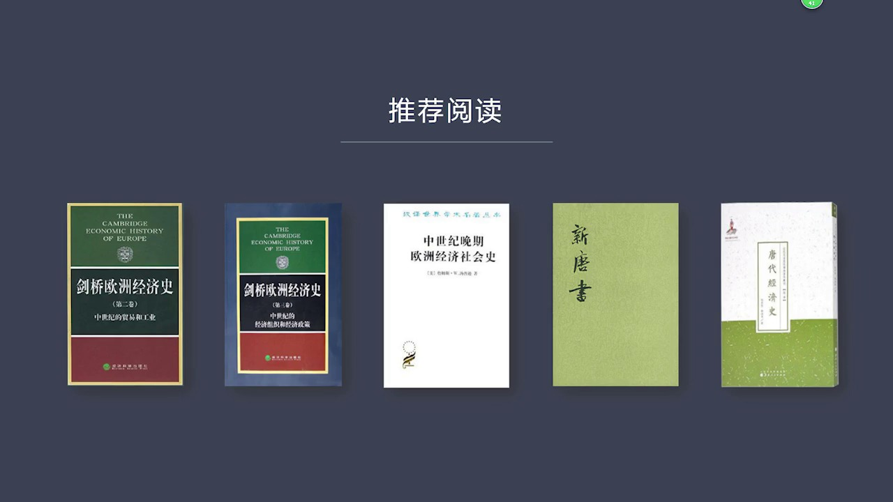

涉及到比如說毛反工業的發展涉及到了一些信貸的問題涉及到金融工具的這個發展變化的問題還有中世紀晚期歐洲經濟社會史這個涉及到了這個聖電歧視團和他們這個會票制度的發明還有涉及到了義大利商人他們這種富羅倫散印...

<strong>All subtitles</strong>

> 涉及到比如說毛反工業的發展涉及到了一些信貸的問題涉及到金融工具的這個發展變化的問題還有中世紀晚期歐洲經濟社會史這個涉及到了這個聖電歧視團和他
> 們這個會票制度的發明還有涉及到了義大利商人他們這種富羅倫散印象家這個貿易體系金融體系是怎麼建立的他們跟各國國防之間的關係新唐書這個從這本書面
> 就是我們找到它是或之中間關於非錢制度的一種描寫唐代經濟史它主要是講到了這個兩歲制的改革兩歲三分法還有它當時唐憲宗這個也就出現非錢制度它的當時
> 的財政情況錢花了問題等等這中間都有論述好今天關於這個問題會票問題我們作為第一個模塊的來給大家進行介紹好今天關於這些問題我們關於會票問題我們就先聊到這兒謝謝大家

---

### Slide 25

<strong>All subtitles</strong>

---
