# 核心课视频-012.主权信用的起源 — Slide Notes

> **来源**：鸿学院核心课程  
> **幻灯片**：32 张

---

### Slide 1

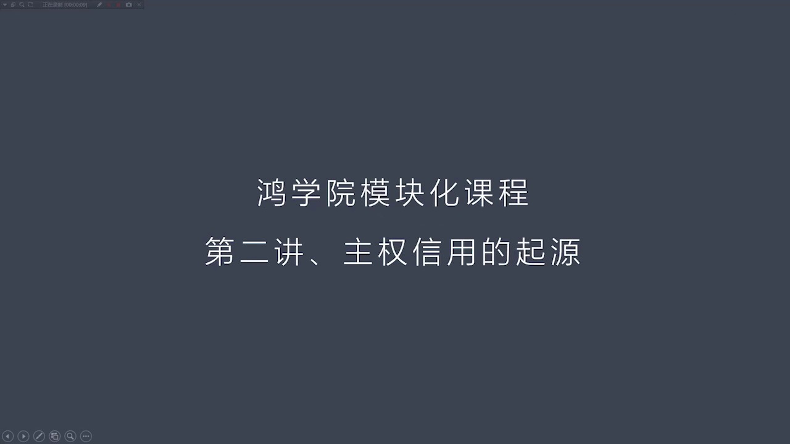

主权信用的起源说到主权信用我们必须要追踪到这些重要概念的来源因为我们当今的金融制度中所出现的各种名词和概念可以说基本上都是源于西方那么我们在探讨这些概念的时候就会大量设计到西方的历史这个是难以回避的一个问题因为在经济学研究过程中现在基本上可以说有两个流派一种叫数学模型派他们基本上是架空历史不考虑历史...

<strong>Cleaned narration</strong>

> 主权信用的起源说到主权信用我们必须要追踪到这些重要概念的来源因为我们当今的金融制度中所出现的各种名词和概念可以说基本上都是源于西方那么我们在
> 探讨这些概念的时候就会大量设计到西方的历史这个是难以回避的一个问题因为在经济学研究过程中现在基本上可以说有两个流派一种叫数学模型派他们基本上
> 是架空历史不考虑历史问题只考了一个抽象的概念围绕这个概念建立数学模型然后来进行测算预测但是在我看来金融是经济活动中一个重要的组成部分而经济活
> 动中所有的行为都是人的行为而人在做任何这种判断和行为的时候都跟它的传统和它的背景和整个历史是密切相关的所以在我看来要想把很多问题搞清楚必须要
> 追根数员你必须得知道这些概念它具体是从什么时代在哪个国家是因为什么事情而被创造出来的这才能够执起所以人所以说到主权信用就必须要回够西方的历史
> 那么在西方历史过程中主权信用这个概念到底是怎么计划出来的是从哪里计划出来的是因为什么原因计划出来的这些是我们必须要搞清楚的所以我们在模块画过
> 程中会分成热泪系统画的介绍当今社会中所有重要的金融理念它的源头正是出于这样的目的所以我们在主权信用的起源这个模块画过程中的一开始首先要介绍的
> 就是西方的一些历史背景我们现在翻到第二页要了解主权信用的来源在我看来首先必须要明白罗马帝国这个时代的时候崩溃以后那么在往中世纪计划过程之中欧
> 洲到底发生了什么因为我们现在的所有金融的理念都是源于这个时代就是中世纪它的初期作为过渡然后朝中期发展这个过程中基本上奠定了现在所有的制度的来
> 源说到罗马帝国大家应该很熟悉但是罗马帝国崩溃以后欧洲发生了什么我想未必很多人都很明确所以我在一开始会介绍一下从罗马帝国崩溃以后欧洲主要的这些
> 地区发生了些什么样的变化大家都知道476年西罗马帝国崩溃在西罗马帝国崩溃的前后前后一百年的时间里面欧洲出现了巨大的一些移民潮也就是热漫人当时
> 在罗马人看来是一种满足他们大规模的这个侵入到罗马帝国的境内有些是和平的移民有些是武装的征服那么在这些人中间包括哪些人呢包括东哥特人也就是后来
> 战灵的意大利西哥特人他们先是在法国南部谈据了一段时间后来主要转向西班牙还有王大人呢王大人是从这个法国横穿过去向南经过了西班牙之后越过了直播罗
> 特海峡到达了北非那么安格魯萨序人呢他们是渡海到了英国所以我们可以看到整个热漫满足的千席的一些总的规律就是热漫人是从欧洲的北部准确的说是从丹麦

---

### Slide 2

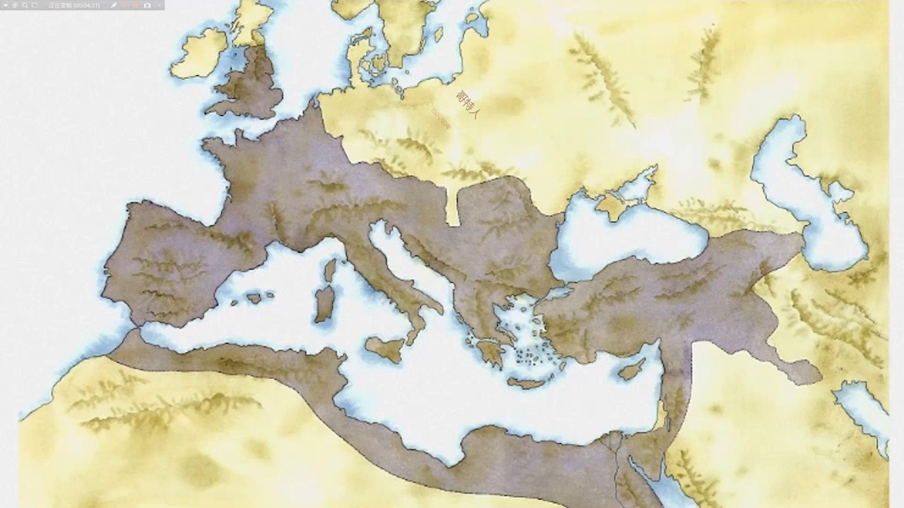

和德国的柏洛帝海沿岸地区还有大西洋地区不断的向南进行扩张和深入那么在这一圈不足中间有一个不足是比较特殊的这就是法兰克人法兰克人他们的这个发源主要是在兰英河的下游下游的两岸地区那么法兰克人签席的距离比其他的我们刚刚所说到的这些热漫的满足签席的距离相对而说比较短也就是说他们在他们原来的位置上向法国境内大...

<strong>Cleaned narration</strong>

> 和德国的柏洛帝海沿岸地区还有大西洋地区不断的向南进行扩张和深入那么在这一圈不足中间有一个不足是比较特殊的这就是法兰克人法兰克人他们的这个发源
> 主要是在兰英河的下游下游的两岸地区那么法兰克人签席的距离比其他的我们刚刚所说到的这些热漫的满足签席的距离相对而说比较短也就是说他们在他们原来
> 的位置上向法国境内大概签席了60到400公里那么也就说他们的生存环境自然环境并没有发生根本性的改变不像东科是哥特人他是在俄罗斯大草原西哥特人
> 也是在草原上那么他们的签席就带来了比较大的生活的方式包括组织形态的这种变化但是法兰克人的变化相对较小那么法兰克人他在热漫中间是一个部落或者叫
> 一群人一个部落集群那么他们这些人到达了法国之后在法国长久的定居现在我们所说法国西北部的很多人其实是法兰克人的后裔不过在这里我们需要明确点热漫
> 民族签移到了罗马帝国境内他们毕竟是少数民族某种意义上有点类似于中国的满足

---

### Slide 3

进入关内之后里面对是一个旁大的汉族的群体所以在这样一个民族融合过程之中基本上是这种少数的这个民族被更广大的人群所通话其实法兰克帝国就是一个比较明显的例子那么法兰克人作为统治了这样的一种民族虽然在领导的这个阶层中占据的表达了优势但是你必须要结合本地的这些不足跟本地的这些人民有效的融合否则你无法实施统治...

<strong>Cleaned narration</strong>

> 进入关内之后里面对是一个旁大的汉族的群体所以在这样一个民族融合过程之中基本上是这种少数的这个民族被更广大的人群所通话其实法兰克帝国就是一个比
> 较明显的例子那么法兰克人作为统治了这样的一种民族虽然在领导的这个阶层中占据的表达了优势但是你必须要结合本地的这些不足跟本地的这些人民有效的融
> 合否则你无法实施统治那么法兰克人最后统治的地区包括现在的法国德国北意大利还有奥帝利比利时荷兰罗森宝瑞士这些都是法兰克人就是都是日耳漫人作为主
> 流群体所拥有的地区注意再次强调一下他们在这个地区是属于小数民族而当地的大部分民族并不是日耳漫人你比如说法国法国例子就最明显法国的种族从种族这
> 个概来讲主要是开始特人后来由于罗马的征服凯萨时代对罗马征服所以他的民族中也会有一部分意大利人或者叫罗马人这两种种族的混合产生了一个后来这个概
> 念叫高路人就是罗马和法国的混合日耳漫人融合进来之后他们是个小数所以在语言文化传统各方面他都不得不面对一个多数群体的这样的一个法国的局面所以后
> 来他的进化方向是一种在西北部更像日耳漫人的传统的话但是在法国的中部和南部法国传统的文化的影响力仍然非常巨大所以南北法国之间是有明显的文化落差
> 的后来法兰克王国在查理曼大力时代也就是从公元700多年到814年这段时间相当于中国堂朝在这个阶段中法兰克帝国的江玉达到了一种最大化达到了一种
> 急胜状态在这个过程之中我们会发现法兰克人就是日耳漫这个民族他们有很多独特的民族文化传统你比说这些日耳漫人当年被罗马人称为满组他们在某种意义上
> 确实是政治的观念各种理念赶不上罗马帝国这么复杂他们把问题想象得比较简单所以法兰克王国他有个基本特点就是国王把自己国家的领土看成是私人的财产

---

### Slide 4

注意啊这点跟中国不一样中国很早就已经分化出了工和私这个概念

<strong>Cleaned narration</strong>

> 注意啊这点跟中国不一样中国很早就已经分化出了工和私这个概念

---

### Slide 5

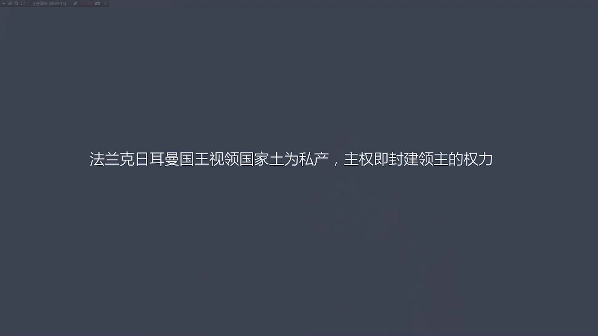

国王就是黄族他所拥有的东西跟国家的东西是有明显界限的但在法兰克帝国的统治阶段到查理办那个时代这个日耳漫人还没有一个明确的这种界限工和私事不分的所谓的主权什么叫主权主权就是封建零主对这对他所拥有这个地区的绝对的统治的权利不容置疑不容挑战这个叫主权那么国王死了之后可以把他的领土作为私人财产自由分配给后代...

<strong>Cleaned narration</strong>

> 国王就是黄族他所拥有的东西跟国家的东西是有明显界限的但在法兰克帝国的统治阶段到查理办那个时代这个日耳漫人还没有一个明确的这种界限工和私事不分
> 的所谓的主权什么叫主权主权就是封建零主对这对他所拥有这个地区的绝对的统治的权利不容置疑不容挑战这个叫主权那么国王死了之后可以把他的领土作为私
> 人财产自由分配给后代日耳漫人是有这个传统的所以到了公元843年查理办的三个孙子通过反尔登条约把法兰克帝国进行了划分有点像欧洲意义上的三家分禁最后形成了

---

### Slide 6

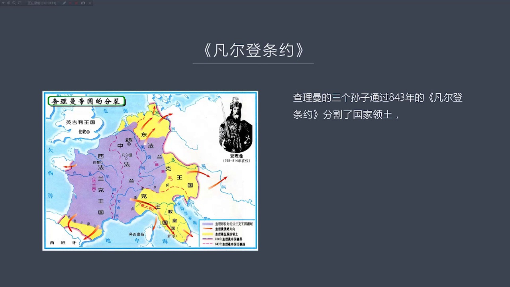

西法兰克中法兰克和东法兰克三个王国这个西法兰克就现在我们所说的法国他的主要的部分中法兰克就是我们现在可以看到他其实后来逐渐被西法兰克和东法兰克所残时他的主要的领土相当于现在的比例时河南、盧森宝然后法国和德国的一部分然后包括意大利的北部也就是从北海意识到地中海之间的一流土地这个是中法兰克东法兰克当然就...

<strong>Cleaned narration</strong>

> 西法兰克中法兰克和东法兰克三个王国这个西法兰克就现在我们所说的法国他的主要的部分中法兰克就是我们现在可以看到他其实后来逐渐被西法兰克和东法兰
> 克所残时他的主要的领土相当于现在的比例时河南、盧森宝然后法国和德国的一部分然后包括意大利的北部也就是从北海意识到地中海之间的一流土地这个是中
> 法兰克东法兰克当然就是现在的德国你德国为主体的东法兰克所以我们说到现在德国、法国、
> 意大利这三个欧洲最核心的国家其实脑子面要有印象这三个国家都是法兰克这个日耳曼不足所创建的一个国家体系后来这三个西法兰克中法兰克和东法兰克分别
> 成为现在法国、意大利和德国的初心其实我们可以说日耳曼人在英国安克魯萨遜这个部落也取得了统治地位包括后来从英国移民到了美国、
> 澳大利亚、新西兰、加拿大等等其实在现在当今世界的这种所谓西方发大国家主要是指了日耳曼文化占据统治地位的这些国家除了英国、
> 法国、德国、意大利包括海外殖民地、美国、核加拿大这些国家之外其实在欧洲、北部欧洲这就是波罗地海这一圈的像挪威、
> 丹麦包括瑞典这三个其实也是日耳曼的民族所以可以看到当今世界其实主流文化圈在欧洲的主流文化圈或者发达文化发达这个国家的文化圈归根道理是日耳曼文
> 化圈那么当时这个日耳曼人还比较的原始和落后就是在罗马帝国崩溃之后它并不是那么先进所以他们把以前日耳曼作为一种勇物民族很多文化传承带到了欧洲的
> 许多国家这些东西变成了这些欧洲文化的一种最核心的文明基因那么在当时它的一个观念比如说国家和国王

---

### Slide 7

这两者在他们看来就是国家和国王这个区分不是很明显另外国库和王库国库是作为一个国家总的收入和国王私人的收入这也是混为一坛的还有就是政府和公庭就是国王有自己的公庭其实当时这个公庭就执行这政府的执能提供公共福利等等它是靠公庭所以公庭和政府之间当年也没有太大区别另外就是公法和司法在罗马时代有非常明确的公法体...

<strong>Cleaned narration</strong>

> 这两者在他们看来就是国家和国王这个区分不是很明显另外国库和王库国库是作为一个国家总的收入和国王私人的收入这也是混为一坛的还有就是政府和公庭就
> 是国王有自己的公庭其实当时这个公庭就执行这政府的执能提供公共福利等等它是靠公庭所以公庭和政府之间当年也没有太大区别另外就是公法和司法在罗马时
> 代有非常明确的公法体系就是罗马法自上而下的一个金子傻型的法律架构是一个高度理性高度现实这样的一套司法体系但是在日曼满足占领了罗马帝国之后这套
> 体系基本上被废除掉了那么日曼人把自己传统的幽默民族了很多习性带进了欧洲西欧核心区也就是司法就是不落法律和各个民族的独特的这种法律在各地大型歧
> 视也就是这个国家从根本上喪失了中央集权的法律架构的这种基础除了这个还有主权就是封建领主的权利不可分架的概念当时是没有的大概认为一个国家的领土
> 跟私人财产一样可以随意地转让分割而后来我们近代所产生的主权不能转让主权不能分割这个理念是法国后来十三世纪才开始形成的所以我们可以通过这些基本
> 的判断你可以形成一个概念南克王国的时期这些所有欧洲的国家它的国家意识政府的意识供法和司法意识还相当的弹谱甚至基本没有既然你连主权这个意识都没
> 有的话那么也就不可能进化出一个主权信用的概念主权都不存在不可分割这个理念都没有那当然基于这个职上的一个信用谈不上所以国债制度当年是根本不可能
> 出现的那么当时的法兰克帝国的时候它的国库和国王的孙金库也是没有区分的比如说国库的财宝国库财宝就完全处藏在国王的卧室之中基于财宝全部堆在那可想
> 而知它这个国库的概念还相当的弹谱所以这点跟中国立上中国当时已经是谈吵了已经是非常繁荣和发达的随堂时期了所以双方的落差是比较大的就是中国的文明
> 已经相当的有酒而西方日晚满足所带来的他们的那些部落的文化还相当的原始所以这个是我们认识这个主权信用这个概念来历你必须首先有个有一个基本的历史
> 背景了解这个概念它产生的一个历史源头我们下面再看第二页就是中世纪早期欧洲国安门是如何借带的就是任何一个国家跟金融公司和家庭一样都是财宁游言这
> 一大堆所事而这东西都需要钱那么这些国王们把国家视为自己的私有财产那么国家的支出就是它个人的支出那么这个时候这个国家的负债也就是国王个人的负债
> 这个是欧洲中世纪早期准确说就是从这个罗马帝国崩溃一直到一二零一年之前这段时间基本上流行了就是这么一个概念而一二零一年到一三五零年欧洲出现了一
> 次真正的经济繁荣也就是罗马帝国崩溃以后经济上了大繁荣是出现在这150年之中的主权 包括主权信用这个概念都是在这个时代这150年之中得到生长和
> 发育的这样一个时机所以以前在一二零年之前欧洲人认为主权是个纯粹的属于国王的个人概念跟国家跟政府没有关系他们甚至没有国家和政府的概念而国家债务
> 完全就是国王的私人债务当时为什么没有进化出一种基于现在我们看到的一政府才正税收威抵押创造国债这样的体系呢很显然这是封建制所带来的必然后果由于
> 封建什么叫封建呢就是国王把自己的这个全国领土按照一种个人效忠关系分封给各大的贵族就是所谓的封建领主和培成之间的关系国王是领主这些公决们就是他
> 的培成那么公决们在以个人效忠的方式把他们所用的土地向下进一步分封分封给对他们保持有私人效忠关系的这些这些拨绝和难绝这些人这些人呢或者土地臭对
> 公决表示效忠而这些人再把这些土地再向下分封所以他是一个这种国家制度不是像中国那种或者叫文明传统比较深的这种大帝国这种模式而是采取一种个人效忠
> ...

---

### Slide 8

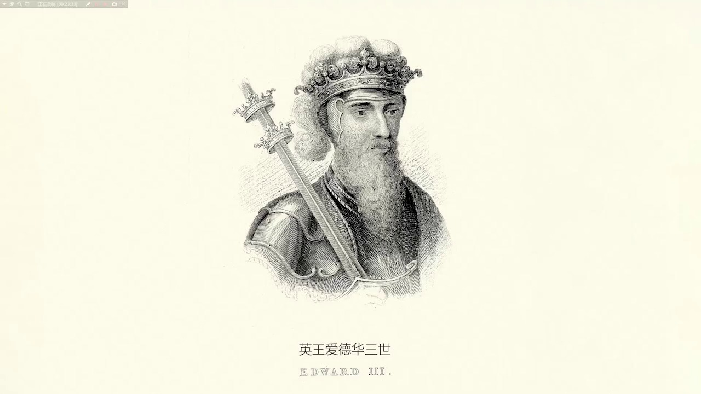

贵众物品是一个重要的点当的手段那么法国和尼德兰就是河南地区也有类似的情况主要也是像商人之前但是德一制你会发现德一制地区的情况有所不同因为德一制是商人的实力它比较弱就是德国的经济贸易发展

<strong>Cleaned narration</strong>

> 贵众物品是一个重要的点当的手段那么法国和尼德兰就是河南地区也有类似的情况主要也是像商人之前但是德一制你会发现德一制地区的情况有所不同因为德一制是商人的实力它比较弱就是德国的经济贸易发展

---

### Slide 9

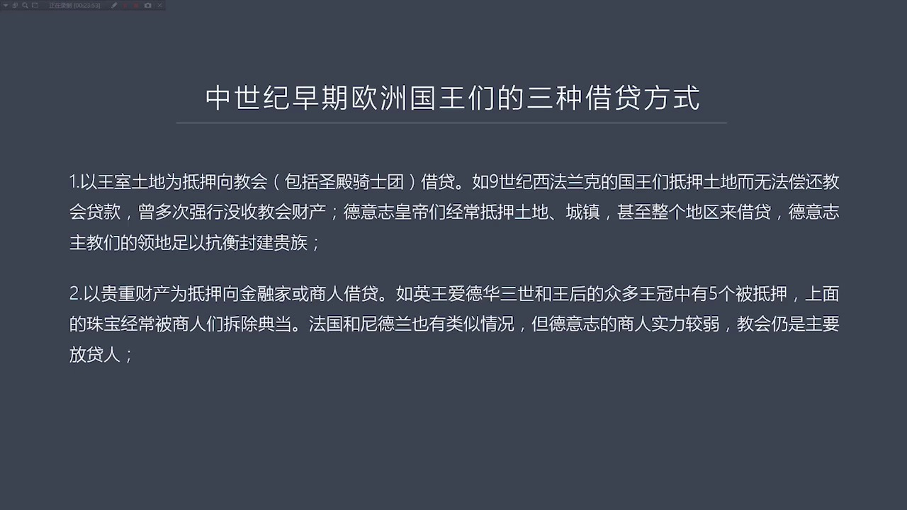

稍微落后一些所以在德国借带国王就是皇帝和他的这些贵族们主要还是像教会借带的所以教会在德国的地位非常重要这也是后来为什么德国会有宗教改革运动是一个重要的发源地以后我们说到这一段手再专门的强调那么除了这两种方式之外还有第三种就是国王以封建特权为抵押向诸侯和自治城市借带什么叫封建特权呢封建特权封建林主所拥...

<strong>Cleaned narration</strong>

> 稍微落后一些所以在德国借带国王就是皇帝和他的这些贵族们主要还是像教会借带的所以教会在德国的地位非常重要这也是后来为什么德国会有宗教改革运动是
> 一个重要的发源地以后我们说到这一段手再专门的强调那么除了这两种方式之外还有第三种就是国王以封建特权为抵押向诸侯和自治城市借带什么叫封建特权呢
> 封建特权封建林主所拥有的一种全力其实在这个意上也包括封建林主本人都是可以做抵押带款的你比如说爱德华三世英国国王他就在百年战争之中由于缺钱把自
> 己的英国的很多的歧视权贵就是这些贵族们甚至包括主教们全部抵押出去然后来获得带款那么被抵押这些人质经常会被欧洲的各个自由城市扣押长达几个月这是
> 比较搞笑的事情向德一制德一制的几个工举借了钱向自由城市借了钱但是于妻不还怎么办呢有三个工举曾经被一起扣押在雷根斯宝直到还轻才放人这都是日耳漫人了

---

### Slide 10

一些独特的传统你要研究它的这个在由目阶段或者在森林里面生活这个阶段你会发现日耳漫人的法律是很有意思的就是它这个法律是跟个人牢牢地绑定国王也不例外贵族也不例外就是当你签署一个借款协议的时候你的个人的人生是跟这个贷款是绑定的所以这个就是我们看到在欧洲中适去早期国王们其实就是一日漫人为主的这些欧洲贵族们他...

<strong>Cleaned narration</strong>

> 一些独特的传统你要研究它的这个在由目阶段或者在森林里面生活这个阶段你会发现日耳漫人的法律是很有意思的就是它这个法律是跟个人牢牢地绑定国王也不
> 例外贵族也不例外就是当你签署一个借款协议的时候你的个人的人生是跟这个贷款是绑定的所以这个就是我们看到在欧洲中适去早期国王们其实就是一日漫人为
> 主的这些欧洲贵族们他们在进行信贷的时候在进行借钱的时候他们这种非常有意思的借贷的情况我们再看下野那么靠这样的一种日耳漫的原始的暴露文化向发展出现代主权性的概念这个似乎差别太大

---

### Slide 11

那么这套制度显然不可能是从日耳漫地区所发明出来的谁来发明创造的主权性国债这套体系呢是意大利人那么怎么来理解意大利人为什么意大利人特别是微妮四人手创国债制度呢这个就必须要理解十三十几欧洲出现的一二零年到一三五零年出现这个经济复刑这150年怎么来理解为什么出现这样的一种经济繁荣那么在这里呢我们可以借用这...

<strong>Cleaned narration</strong>

> 那么这套制度显然不可能是从日耳漫地区所发明出来的谁来发明创造的主权性国债这套体系呢是意大利人那么怎么来理解意大利人为什么意大利人特别是微妮四
> 人手创国债制度呢这个就必须要理解十三十几欧洲出现的一二零年到一三五零年出现这个经济复刑这150年怎么来理解为什么出现这样的一种经济繁荣那么在
> 这里呢我们可以借用这个布罗戴尔的观点就是要理解欧洲的经济发展的模式首先要搞清楚四大地侠这就是这一页我画了一张图这四大地侠呢分别是法兰西地侠德
> 意志地侠波兰地侠和俄罗斯地侠也就是在图中我用粗红线最粗的红线

---

### Slide 12

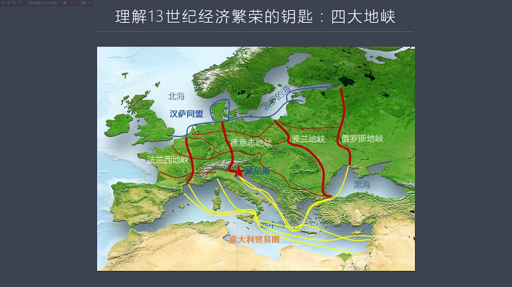

所画出的几个区域虽然是一条线但它指的是一个区域这个地侠基本上它的代表意就是从黑海地中海是在南边和北海与波罗地海这次在北边两海之间通过欧洲这个像个半岛的这样的形状跨越这个欧洲大陆上了四条地侠去跟北边的海像这个融合或者像做贸易那么它毕竟的这样的一些基本路线这个地侠这个概念其实某种意义上这个商业贸易大通道...

<strong>Cleaned narration</strong>

> 所画出的几个区域虽然是一条线但它指的是一个区域这个地侠基本上它的代表意就是从黑海地中海是在南边和北海与波罗地海这次在北边两海之间通过欧洲这个
> 像个半岛的这样的形状跨越这个欧洲大陆上了四条地侠去跟北边的海像这个融合或者像做贸易那么它毕竟的这样的一些基本路线这个地侠这个概念其实某种意义
> 上这个商业贸易大通道的一个抽象这样的一个提法因为在地侠的附近你会发现大量的城市贸易星期的这些城市基本上是按着地侠这个规律来进分布的包括它星期
> 的时间早晚也是跟地侠从南向北逐渐这个向北扩张的这样的一个时间是相互印称的所以你会发现沿地中海地区是欧洲这个中世纪起源最早的经济最发达的起步的
> 这些地区而潮北呢它是越来越往后所以我们看的这四大地侠可以说是我们理解西方三世纪经济繁荣的一个真正的钥匙在这个地下上我还有一些比较细的红线这些
> 细的红线其实代表着一些横向地侠之间横向的联系也是贸易通道的一次但是我在这里需要强调一下这都是一种高度简化的这样一种图你要想真正看当年的贸易的
> 这个通道我在右边给出了一张就是真实的得意志地侠上的贸易通道的分布图这只是得意志地侠你会看到中间

---

### Slide 13

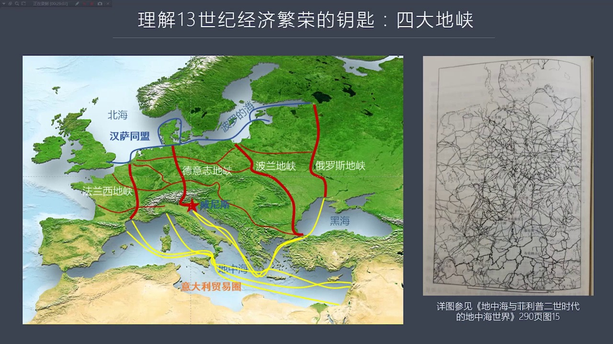

大量的这种通道这通道都是学者们通过对当时的考古包括哪些是负责运输的村庄这个村庄有多少人是投入运力投入运输这个事业那么他们在中间所设计到种种的信息根据这些信息所会治的一个相当复杂就像大老师经缘是这样的一个图这是真实的得意志地侠的贸易通道在这里我画的这个左边这张图是一个简易的概念是一图我们看到北边在北海...

<strong>Cleaned narration</strong>

> 大量的这种通道这通道都是学者们通过对当时的考古包括哪些是负责运输的村庄这个村庄有多少人是投入运力投入运输这个事业那么他们在中间所设计到种种的
> 信息根据这些信息所会治的一个相当复杂就像大老师经缘是这样的一个图这是真实的得意志地侠的贸易通道在这里我画的这个左边这张图是一个简易的概念是一
> 图我们看到北边在北海和伯罗地海我用栏线画出了一个沿海贸易的这个通道这是汉萨同盟而南边用黄线我标注的是艺大利所承担的东西贸易从这个离方特地区跟
> 欧洲之间做贸易这个艺大利人所控制的贸易圈从这张图上我们其实已经可以分享非常明显的看到几个规律这个规律最明显的就是你会发现艺大利的维尼斯在这张
> 图上应该是在他的艺大利如果是个高温鞋的话应该在他的大腿的根部也就是我们在这张图上看到是克罗地亚附近你看到红线和黄线相交的那个点那就是维尼斯这
> 个地方得天堵厚因为你从离方特过来的东方的货物运到那翻语二伯斯山进入进入德国和法国这些贸易的中心区他的距离是最短的御叔成本是最低的同时呢这个点
> 还可以浮涉到其他地区所以这个维尼斯是我们理解这个13世纪欧洲经济繁荣的一个非常重要的一个起点也正是在立场维尼斯是率先爆发出经济活力的所以国债
> 主权信用体系是从维尼斯发断的那么如果我们再看下眼这张图呢就比较详细的描述了维尼斯的国际贸易的这种我称之为是贸易地缘的独特的优势在这张图上我们可以看到有个红色的箭头

---

### Slide 14

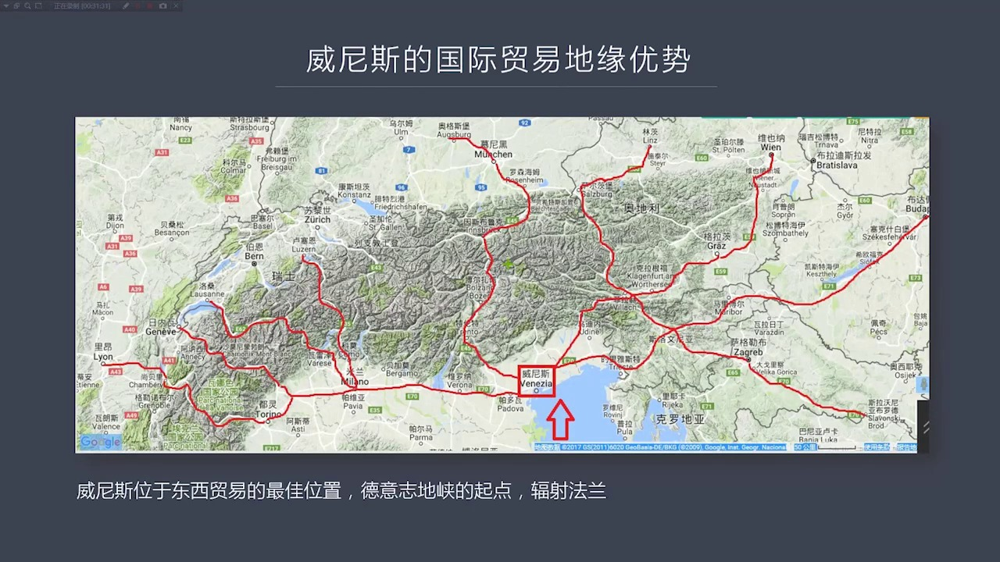

这个箭头代表从亚德比亚海就是离方特东方的商品包括中国和印度的商品经过中东地区转运的运输方向到了维尼斯线货到了维尼斯线货之后你会看到图上有很多红色的这种露进标志这标志就是翻语2B3的主要通道这个图上画的只是一些最重要的通道其实一共有21条如果全部画出来显得比较乱我把贸易上最重要的几条主要通道标志出来了...

<strong>Cleaned narration</strong>

> 这个箭头代表从亚德比亚海就是离方特东方的商品包括中国和印度的商品经过中东地区转运的运输方向到了维尼斯线货到了维尼斯线货之后你会看到图上有很多
> 红色的这种露进标志这标志就是翻语2B3的主要通道这个图上画的只是一些最重要的通道其实一共有21条如果全部画出来显得比较乱我把贸易上最重要的几
> 条主要通道标志出来了这个我们会发现它这个贸易分布贸易区线贸易大通道明显有几个特点维尼斯正好是在一个核心的一个交通疏扭这个位置上它可以通过向米
> 兰方向运转后然后翻语四个主要通道进入法兰西地下也可以进入瑞士会及到法兰西地下或者德意志地下那么它在它的正北方有一个非常主要的通道就是经过伊斯
> 布鲁克到达德意志地区的南部特别是牧尼黑核二格斯宝经过烏尔姆然后再往北特别是纽轮宝这是一个非常重要的一个德意志南北分界线纽轮宝往南我们可以称之
> 为是南德意志有人贸亡北是北德意志南北两个德国它的文化贸易各方面差距是非常明显的可以说是一个明显的德国分界线那么如果说从伊斯往东你会发现它可以
> 直通为演达也可以直接到布达沛斯然后到布达沛斯这条线上经过斯洛文尼亚的就是我在6月份去专门去这个地方考察过当时当地的地形和经济发展模式你会发现
> 路边亚纳这个地方斯洛文尼亚这个手督正好是两个分界线是两条商业贸易通道的一个交叉路口这个南北向翻语二倍斯战到达沛斯宝就是奥迪利南德意志地区然后
> 往南可以直通这个格勒布贝尔格来德然后经过所飞亚到新的产品宝然后它有通文尼斯又通布达沛斯接中欧地区所以这个交给点路边亚纳是个非常重要的历史的一
> 个贸易的一个中转站通过这张图我们大概可以看出文尼斯具有了独特的贸易优势首先来自东方的货要到文尼斯卸货然后文尼斯单当了一个重要的一个贸易中转站
> 的作用它是德意志地下的起点它的影响力贯穿整个的一只地下就是从文尼斯一直拉通到德国的汉堡或者到波兰的弹则这一块去中间的所有地区都受文尼斯的贸易
> 的影响是它最具影响力的地区除了这个之外它如果像西经过米兰然后翻越RB43有4条通道这4条通道就会进入法兰西地下和德意志地下所以它对法兰西地下
> 是具有强大的贸易伏射作用的为什么文尼斯和热闹亚要反复争奪了上百年就是因为热闹亚在这张地图的偏难的一部分正好是在高估尔协的这个另外一个大腿根处
> 它的位置跟文尼斯正好在两端它要控制米兰控制往法国这条法兰西地下走的这一条路就必然跟文尼斯发生尖锐的争奪所以这两个地区始终是有恩怨秦仇的那么它
> 如果像东呢我刚才已经说到布达沛斯这条线再往东它其实可以影响到中处的附地最远可以到达波兰的一下所以文尼斯的地理具有着非常明显的一种地缘优势这是
> 它大了环境我们如果再看下一如果具体到文尼斯这个城市它仍然具有着大量的地理结构上的优势比如说文尼斯最明显的特征

---

### Slide 15

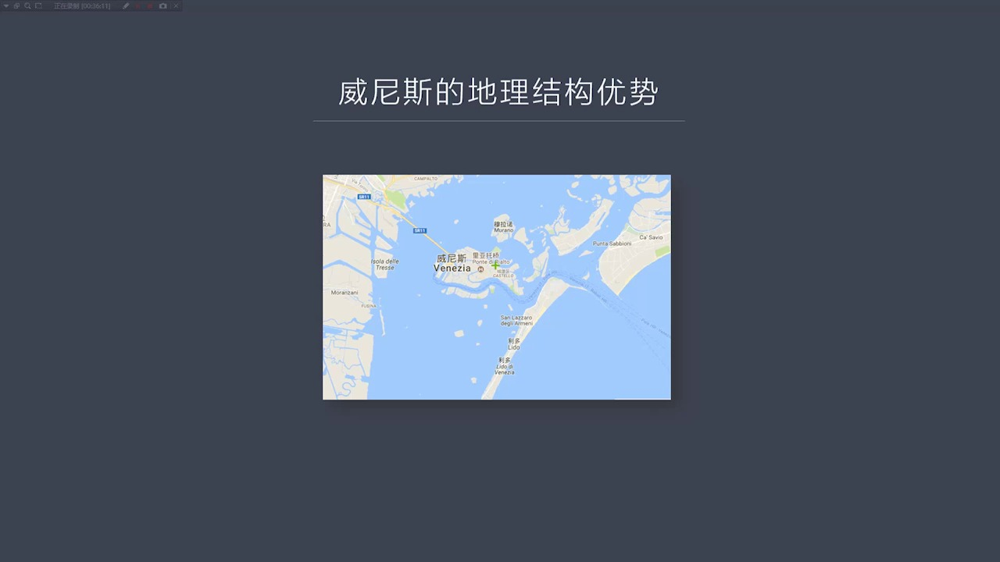

它是在一个泄湖中间的一个岛它与大陆之间与一大例半岛大陆之间有个巨大的泄湖隔开了这就好比一个防火墙了在古代时间在古代时期蛮足虽然大量入侵意大利北部但是他们一般来说缺少艰队海军力量非常差所以面了一个在海洋中间的在泄湖中间的文尼斯这个城市其实是非常艺手难攻的很难打下来那么同时由于有泄湖隔离泄湖隔离是在整个...

<strong>Cleaned narration</strong>

> 它是在一个泄湖中间的一个岛它与大陆之间与一大例半岛大陆之间有个巨大的泄湖隔开了这就好比一个防火墙了在古代时间在古代时期蛮足虽然大量入侵意大利
> 北部但是他们一般来说缺少艰队海军力量非常差所以面了一个在海洋中间的在泄湖中间的文尼斯这个城市其实是非常艺手难攻的很难打下来那么同时由于有泄湖
> 隔离泄湖隔离是在整个欧洲在亦大利北部这个百块中间它的地位非常独特欧洲大陆上很多全力斗争比如说皇帝派神神帮我们帝国的皇帝跟罗马叫皇之间的争夺他
> 们可以支撑室外那么对一致跟法兰西之间包括罗曼人亦大利南部罗曼人对北部这种争夺他们也可以支撑室外正常有一个很好的屏蔽作用它在政治上能够保持独立
> 这跟它独特的地理结构是有很大关系的然后还有一个特点就是文尼斯你如果看这张右边照片你会发现文尼斯它是个海上的城市整个这个城市它就没有土地没有农
> 田所以文尼斯由于缺发农田它就不可能发展出封建零主制类似于法国得国出现那种封建制在文尼斯就没有生存的基础所以在文尼斯形成了一种高度的政治独立同时在这种政治独立中间又明显是商人滑头统治的这样一种特色

---

### Slide 16

这都是由它的地理独特的结构所造成的所以它是整个欧洲甚至包括整个北一大利这些

<strong>Cleaned narration</strong>

> 这都是由它的地理独特的结构所造成的所以它是整个欧洲甚至包括整个北一大利这些

---

### Slide 17

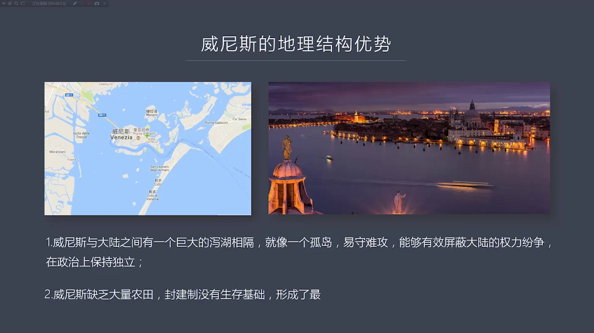

发达了城市国家中间最纯粹最早进化出商人滑头治国模式的只有文尼斯一家所以它的地理结构包括它的整个贸易地缘这两个因素决定了文尼斯这个地方是不同于所有地方的它的基因相当的独特如果我们再看下野这也讲到了文尼斯具体怎么崛起的我们刚才讲到了文尼斯和整个欧洲的大背景

<strong>Cleaned narration</strong>

> 发达了城市国家中间最纯粹最早进化出商人滑头治国模式的只有文尼斯一家所以它的地理结构包括它的整个贸易地缘这两个因素决定了文尼斯这个地方是不同于
> 所有地方的它的基因相当的独特如果我们再看下野这也讲到了文尼斯具体怎么崛起的我们刚才讲到了文尼斯和整个欧洲的大背景

---

### Slide 18

现在讲文尼斯决起了一些具体的细节文尼斯的决起我认为大概可以分成三个阶段这是综合了很多历史材料包括很多中世纪包括文尼斯的历史我提练出来三个阶段第一阶段就是它主要承担避难所谓的阶段就从罗马帝国崩溃一直到公园八百年在这个阶段中你会看到大量的满足反复的入期意大利被固但是所有满足都没有能够征服文尼斯这是一个很...

<strong>Cleaned narration</strong>

> 现在讲文尼斯决起了一些具体的细节文尼斯的决起我认为大概可以分成三个阶段这是综合了很多历史材料包括很多中世纪包括文尼斯的历史我提练出来三个阶段
> 第一阶段就是它主要承担避难所谓的阶段就从罗马帝国崩溃一直到公园八百年在这个阶段中你会看到大量的满足反复的入期意大利被固但是所有满足都没有能够
> 征服文尼斯这是一个很有意思的特点就是因为文尼斯有谢侯的乡格如果满足没有强大的海军就很难打了下来非常多的找责和在谢侯中间远离大陆这么一个孤岛既
> 没有必要同时你有很难进军这就是文尼斯成为一种避难天堂大量的意大利北意大利人都勇向文尼斯来躲避满足入侵同时在这中间还有大主教也跑到了文尼斯建立
> 他的教堂建立他的教座所以他仍然具有这宗教宁军力这是他一个非常不同的跟在避难场所非常不同的地方他既有政治重新同时还有宗教重新那么最后一波在北意
> 大利这个征服的人就是倫巴帝人倫巴帝人其实也是日晚中间的一个不足他比法兰克人比更早的一些人要晚一些到达北意大利那么倫巴帝人跟其他的日晚不足他不
> 太一样他有一些特点就是倫巴帝人的起源是在瑞典的南部他在日晚这个足夕这个体积中间他是比较靠北的瑞典以前我们讲过瑞典文明的基因中间他很强调一点就
> 是他的传文化和他的一种公平的这种文化就是今天的瑞典人跟德国人虽然都是日晚人但是他的文化特点差距非常明显所以我们很少听到瑞典自称是日晚人荷兰人
> 也不称自己是日晚人只有德国人称自己是日晚人主要就是他想形成更大了一个种子的号召力团结力把这些国家都拉进来但是这些其他的国家他们不太愿意搅祸这
> 个事所以过宁愿成为我是瑞典人或者唯金人都比说我叫日晚人感觉要好一些那么伦巴地人非常大的一个特点就是他们是在公元568年打入一大利北部然后统治
> 到了774年有200多年统治时间他们有个非常大的特点就是你会发现他在公元750年有一个法律在这个法律中明确地把土地贵族和商人并练为统治阶级就
> 是土地贵族你要参加旗币要去打仗你有这个义务商人同样有这个义务这是在整个中世纪欧洲史上我第一次看到伦巴地人把商人的地位放到这么高不管是在往前的
> 希拉罗马最繁荣的这个时代商人都是二人公民从来没有单单过统治阶级但是伦巴地人他跟所有日晚满足是不一样的比如法兰克人或者德国这边的还有北欧这边的
> 日晚人其实都不太都没有把商人看得太重要都把它放在封建封建领主階层的下面但是只有伦巴地人他们非常特殊所以这个温尼斯他背后的北大利这个大的地理环
> 境中间伦巴地人是明显不同于其他日晚的一个特殊的部落这个部落中把商人的地位谈到了一个相当高的位置而温尼斯是在这样一个大的文化环境中跟这些人相处
> 因为他要发生贸易关系所以伦巴地人对于温尼斯的影响文化上的影响也是存在的那么在这个伦巴地人统治北一道利质200多年时间里面温尼斯始终是属于败占
> 庭的一个鼠国这个是我们说的第一阶段就是避难所得阶段第二阶段贸易起家就主要者的公元800年到1000年这200年中间温尼斯人是怎么起家的原是资
> 本是什么主要有两点第一是他这个泄湖面有大量的他是显的有大量的颜所以这个争发获取颜这是一个重要的一个就是他的温尼斯的颜是他的第一统金出子之外

---

### Slide 19

温尼斯在海边嘛所以他的余业他是靠颜和余这两个事业身份合法的因为他没有土地没法重量是

<strong>Cleaned narration</strong>

> 温尼斯在海边嘛所以他的余业他是靠颜和余这两个事业身份合法的因为他没有土地没法重量是

---

### Slide 20

所以很早伦巴地人就很惊讶温尼斯人既不重装家又不收葡萄他怎么就有钱去购买古物和葡萄酒呢研究来研究去发现温尼斯人是做生意的原是资本就是颜和余所以他们依靠颜贸易发展航运发展余业和航运然后发展东西方之间的贸易把亚洲的东西卖到西方把西方东西卖到亚洲作为一个中转的贸易这样的一个主要的精英商主要精英像颜生丝 感染...

<strong>Cleaned narration</strong>

> 所以很早伦巴地人就很惊讶温尼斯人既不重装家又不收葡萄他怎么就有钱去购买古物和葡萄酒呢研究来研究去发现温尼斯人是做生意的原是资本就是颜和余所以
> 他们依靠颜贸易发展航运发展余业和航运然后发展东西方之间的贸易把亚洲的东西卖到西方把西方东西卖到亚洲作为一个中转的贸易这样的一个主要的精英商主要精英像颜生丝 感染游和香料

---

### Slide 21

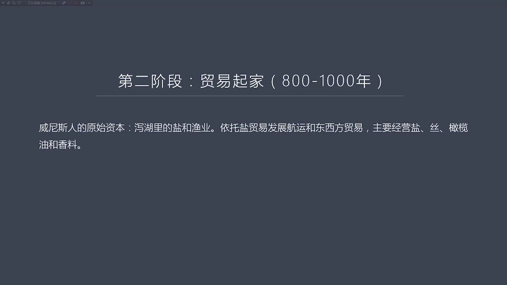

这是他四大主要的品种在这个过程中温尼斯人就大发横采因为当年的欧洲的很多地方伦巴地所控制着北一大利然后包括法兰克就是西法兰克中法兰克东法兰克这些国家都比较落后就是经济贸易上都比较落后只有温尼斯能够把这么好的东方的这些贵重的商品转运到西方所以他获得了巨大的财富也正这个原因这个原因使得法兰克帝国和当年的败...

<strong>Cleaned narration</strong>

> 这是他四大主要的品种在这个过程中温尼斯人就大发横采因为当年的欧洲的很多地方伦巴地所控制着北一大利然后包括法兰克就是西法兰克中法兰克东法兰克这
> 些国家都比较落后就是经济贸易上都比较落后只有温尼斯能够把这么好的东方的这些贵重的商品转运到西方所以他获得了巨大的财富也正这个原因这个原因使得
> 法兰克帝国和当年的败战停帝国都要争奪温尼斯这就导致了公园840年的法兰克温尼斯的条约这个条约就是法兰克帝国和败战停帝国两大帝国对于温尼斯这个
> 问题他们要达成一个协议那么法兰克和败战停这些是什么关系呢应该说这个罗马帝国崩溃以后那是西罗马东罗马始终没有中断的人家一直在就是产品宝带的好好
> 的所以东罗马帝国认为自己是罗马帝国天然的无可质疑的繼承人所以东罗马帝国认为我这个皇帝这个体系是这个从罗马这个血脉机成下来的我是正宗的那么法兰
> 克帝国这个查理卖教会给他加免教皇给他加免然后他也号称自己是法兰克帝国是这个是罗马帝国的机成人东罗马帝国败战停他是不承认的当然后来双方为什么相
> 互彼此承认呢就是因为这个公园八百四十年的法兰克温尼斯条约在这个条约中间双方各区所需败战停承认法兰克帝国的皇帝的这个皇帝的称号这是一个巨大的一
> 个这个我们说可以说是个巨大的对法兰克帝国这是一个巨大收获那么法兰克帝国就必须要拿出很耐个丑马来经交换也就是法兰克帝国承认温尼斯属于败战停那么
> 法兰克帝国为什么要这么做就是因为这个皇帝他太重要了虽然茶里面大力很能打但是名不正言不顺当年大家对于罗马帝国的这种崇拜这种心态一直持续的很长时
> 间虽然罗马灭亡了罗马帝国灭亡但是罗马的精神那种普世的那种世界性的政府这种态势哪怕是满足都非常渴望去继承所以法兰克法兰克人是非常非常向往得到皇
> 帝这个称号的后来这个称号皇帝这称号转转给了这个日曼这个支派就是得过这个支派你会发现神圣罗马帝国继承了后来继承了皇帝这个称号那么整个欧洲就出现
> 了两个皇帝一个是东罗马帝国的皇帝一个是神圣罗马帝国离制这个皇帝两套皇帝体系只有这两套体系的人才能号称自己是皇帝其他所有的人都是国王你法兰克法
> 兰克是国王英格兰也是国王苏兰克都是国王什么丹麦这些人在封建的意义上必须要臣服于神圣罗马帝国那个皇帝因为人家叫皇帝你只叫国王所以西方历史在欧洲
> 立中继承大位继承皇帝大位的就两套体系东罗马帝国的拜战亭还有西罗马这边的神圣罗马帝国就是德意志体系和拜战亭体系所以现在我们很多人说德国意志乐分
> 裂或者德国怎么怎么样其实德国在历上他意志是神圣罗马帝国这条之脉的他统治欧洲是先超过上千年可以说从查理曼这个帝国起起个头到澳洲大帝公元962年
> 一直到这个1866年被拿不能所灭掉他有上这个近千年的统治的卖落的延程所以德意志人始终认为自己对欧洲的命运复有特殊的责任他们历上就已经统治欧洲
> 一千年了所以他们认为整个欧洲在欧洲这个大陆上德意志人或者叫德意志这个体系中的热闷人是统治欧洲天然的种族他这个种族主义不是后来希特勒发明创造出
> 来了你一个人单独发明一个概念也想为整个民族甚至整个欧洲接受这是不可能的他是延续了德意志在神神罗马帝国延程下来的这种天赋的神神的使命感所以德国
> 人在我看来未来一定是虽然看他现在他状态好像不像一个一个霸主的地位但是别忘了他的历史传承他一直是霸主所以未来德国的崛起是值得高度关注的这就是为
> 什么我们这次去走德意志这条路线专门要去探索一下德国人他的历史文化他的贸易心起还有包括他的宗教意识等等对德意志人的心这个心态到底产生了多大的影
> ...

---

### Slide 22

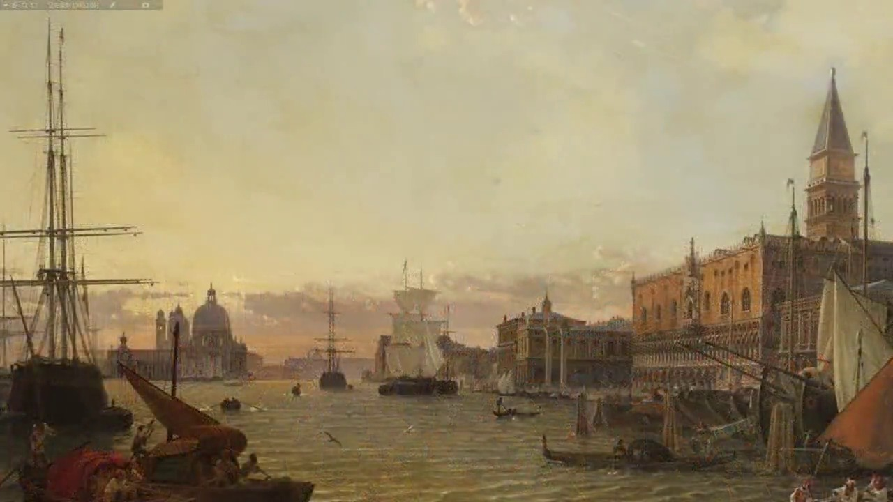

威尼斯的海洋运收能力海运也航运也已经超越了拜登亭所以东部地区就是在拜登亭地国的东地中海地区基本上它的航运优势被威尼斯所取代威尼斯人一旦获得了航运的定单控制航运商业就会被它主载这也就是威尼斯后来越来越强大的原因所以威尼斯后来把整个亚德利亚海当成自己的一个内湖就是出于这样的一个心态就是我要控制整个地中海...

<strong>Cleaned narration</strong>

> 威尼斯的海洋运收能力海运也航运也已经超越了拜登亭所以东部地区就是在拜登亭地国的东地中海地区基本上它的航运优势被威尼斯所取代威尼斯人一旦获得了
> 航运的定单控制航运商业就会被它主载这也就是威尼斯后来越来越强大的原因所以威尼斯后来把整个亚德利亚海当成自己的一个内湖就是出于这样的一个心态就
> 是我要控制整个地中海先从亚德利亚海开始然后竟然作为跳板去控制整个的地中海地区然后作为一个贸易霸主的形象出现那么到了公元1082年这就出现一个
> 非常重要的事件诺曼人当时对伊丽魯斯进行威胁和侵略诺曼人他们当时控制了这个戏戏里和伊丹利南部地区传过伊丹利南部地区这不就亚德利亚海了吗然后在网
> 络不就是现在的特朗利亚和二八亚内代吗是在以前叫伊丽魯斯地区那么在这个地区

---

### Slide 23

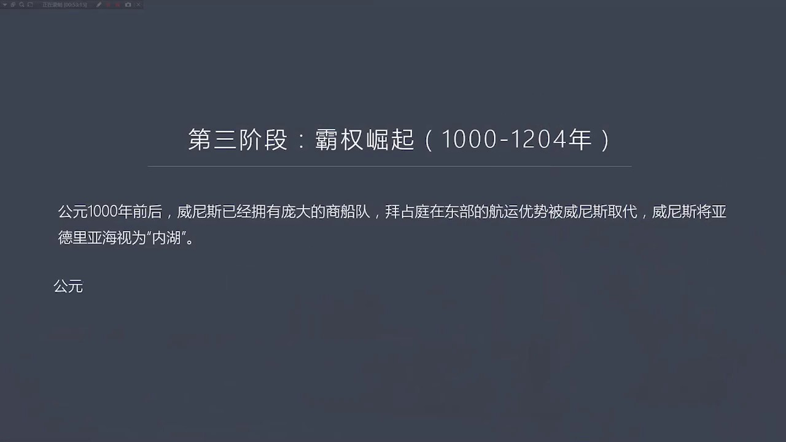

诺曼人它有一种强大的威射力但是如果这么一来的话那就会切断败占庭对整个亚德利亚海的控制也会破坏伊丽斯把这个亚德利亚海视为内湖的国家战略所以败占庭为了抵抗诺曼人对这个地区的威胁所以它就只能驱遵去求伊丽斯帮忙为什么因为那个时候败占庭的海军包括它的财政已经非常的差了而伊丽斯当时财大起初又有大量传队

<strong>Cleaned narration</strong>

> 诺曼人它有一种强大的威射力但是如果这么一来的话那就会切断败占庭对整个亚德利亚海的控制也会破坏伊丽斯把这个亚德利亚海视为内湖的国家战略所以败占
> 庭为了抵抗诺曼人对这个地区的威胁所以它就只能驱遵去求伊丽斯帮忙为什么因为那个时候败占庭的海军包括它的财政已经非常的差了而伊丽斯当时财大起初又有大量传队

---

### Slide 24

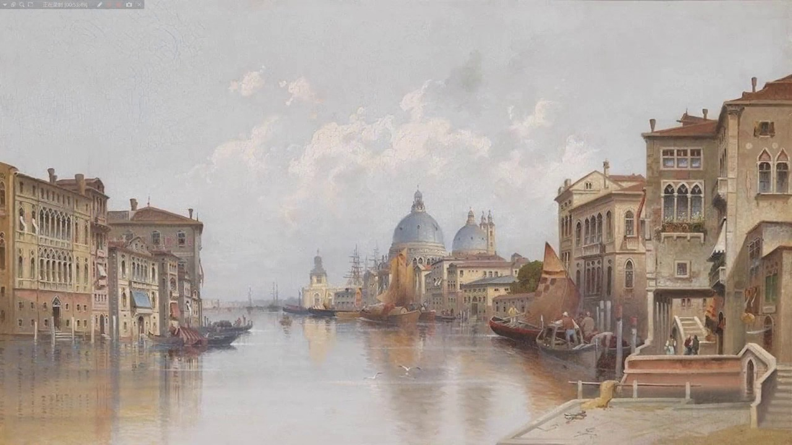

伊丽斯的传队在当时人数这个水手人数高到17000多人它的传大小的这种传队传队传三千多艘可以说是个庞然大物商船加上海军加上鱼船这是一个相当大的海军实力那么由于为伊丽斯给败占庭笑牢打外了诺曼人的威胁那么这就出现一个问题败占庭在这个过程中劝了为伊丽斯很多钱因为财政援助是要给钱的那怎么还呢这就出现了大麻烦败...

<strong>Cleaned narration</strong>

> 伊丽斯的传队在当时人数这个水手人数高到17000多人它的传大小的这种传队传队传三千多艘可以说是个庞然大物商船加上海军加上鱼船这是一个相当大的
> 海军实力那么由于为伊丽斯给败占庭笑牢打外了诺曼人的威胁那么这就出现一个问题败占庭在这个过程中劝了为伊丽斯很多钱因为财政援助是要给钱的那怎么还呢这就出现了大麻烦败占庭当时不想用陷阱的方式来支付

---

### Slide 25

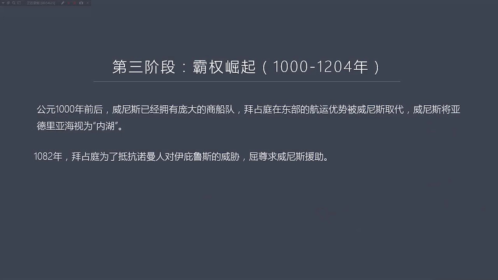

那么想用另外一个方式这个方式就是1092年对这种常还威胁再款发布了一个惊喜造书在记忆造书中免出了威胁斯在败占庭的所有通商的关税只有两三个海岗除外也就是它把全国的就是威胁斯人可以到败占庭随便做成的也完全不用交任何关税如果我们看威这个败占庭历史你会发现败占庭对贸易控制非常严任何外国的商人要想进入败占庭的...

<strong>Cleaned narration</strong>

> 那么想用另外一个方式这个方式就是1092年对这种常还威胁再款发布了一个惊喜造书在记忆造书中免出了威胁斯在败占庭的所有通商的关税只有两三个海岗
> 除外也就是它把全国的就是威胁斯人可以到败占庭随便做成的也完全不用交任何关税如果我们看威这个败占庭历史你会发现败占庭对贸易控制非常严任何外国的
> 商人要想进入败占庭的领土必须要受到严格的管制比如说你住哪家冰这个驴碗在这个商馆是不能随便出门的像俄罗斯商人甚至不能入城只能待在城外你要进城的
> 时候必须要有武装的人员护送然后才能做生意而在这个败占庭帝国里面能够自由行走的商人这就是一种非常大的特权从来不受给外人威尼斯由于这场这个海战的
> 胜利获得了这种特权同时免了关税这就是威尼斯人在败占庭帝国的内部获得了巨大的贸易优势即便是败占庭商人他们自己的商人也得交比如说10%的关税逃不
> 掉的但是威尼斯人不用交主要是为了还债吗但是这个特权一旦定下之后就会使威尼斯整个商人的体系在败占庭获得了巨大的扩张时间长了那么威尼斯人对败占庭
> 帝国的这种商人群体的杀伤力就太强了首先海外万一就不用想了海外万一都是威尼斯人一家天下了因为他掌握着传队你没有传或者你传不行所以你的海运基本上
> 被威尼斯计划了同时在败占庭帝国的内部经商的很多人都不过威尼斯人因为他成本并低所以威尼斯在这个败占庭内部建立起了一个非常庞大的这种商业网络体系
> 你会看到在军产宁宝虽然他有六十万人口有十万人十万人是一大例上人其中

---

### Slide 26

威尼斯人就有六万可见他们这个商业体系贸易体系已经非常的庞大这样一来的话就会使败占庭的商业贸易莫义获得遭到极大的这种威尼斯的极大的破坏因为你会看到以前都是败占庭商人控制黑海地区败占庭商人控制地中海东部但是现在也不行了现在威尼斯商人起来之后不仅海外贸易给你夺着差不多了就是你国内贸易也被威尼斯人所控制起来...

<strong>Cleaned narration</strong>

> 威尼斯人就有六万可见他们这个商业体系贸易体系已经非常的庞大这样一来的话就会使败占庭的商业贸易莫义获得遭到极大的这种威尼斯的极大的破坏因为你会
> 看到以前都是败占庭商人控制黑海地区败占庭商人控制地中海东部但是现在也不行了现在威尼斯商人起来之后不仅海外贸易给你夺着差不多了就是你国内贸易也
> 被威尼斯人所控制起来形成的一个最明显特点就是你本来国内应该有非常庞大的贸易网络结果这些网络越来越中间的连接越来越弱

---

### Slide 27

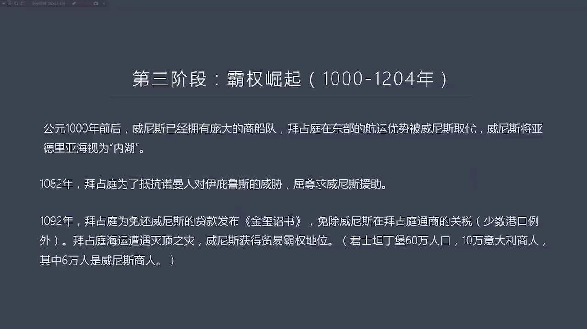

甚至就断掉了所有的这种货物都是跟威尼斯商人对接进入威尼斯的贸易网络而他们彼此之间败占庭内部城市之间的彼此的网来经济关系被削弱了就是你不再是个网络你只是变成威尼斯商人的节点这样的话再加上他们的免税的这样的一种特权使得败占庭帝国的商业贸易所获得的税收遭到了巨大的这个削弱当然败占庭的税弱还有其他的国内政治...

<strong>Cleaned narration</strong>

> 甚至就断掉了所有的这种货物都是跟威尼斯商人对接进入威尼斯的贸易网络而他们彼此之间败占庭内部城市之间的彼此的网来经济关系被削弱了就是你不再是个
> 网络你只是变成威尼斯商人的节点这样的话再加上他们的免税的这样的一种特权使得败占庭帝国的商业贸易所获得的税收遭到了巨大的这个削弱当然败占庭的税
> 弱还有其他的国内政治城市方面的原因这个问题我们可以放到另外的模块去说总而一句话总而言之一句话就是败占庭通过货德败质总而言之一句话就是威尼斯通
> 过货德败占庭的这种贸易特权基本上把威尼斯国内的商人几款差不多了壟断了国外的贸易这使得败占庭的海运财政和国内的经济秩序受到了极大的削弱好我们现
> 在可以看下眼也正是由于威尼斯对于这种败占庭帝国内这种贸易的削弱这就是使得败占庭它的经济面临因为威尼斯一个重大的威胁其实这种现象比较像中国的轻
> 目你会看到大量的西方的知名列强到中国去建立很多组界、海外知名地等等其实所有的海外知名地从威尼斯这个时代到这个中国清朝并没有发生根本性变化到底
> 都一样它控制着你的贸易网络你就完蛋了你的经济怎么也搞不起来了因为利润都被它控制了当年这个败占庭帝国碰到就是这个问题而败占庭帝国的海上时已经无
> 法跟威尼斯对抗了所以你会看到他们的皇帝们发现这个贸易特权对威尼斯损伤太大这比输掉钱比赔得钱要严重太多了所以他们经常要取消给威尼斯的贸易特权单
> 一取消威尼斯就发动战争一战争的形式来威胁败占庭它就细节你的城市细节你的海岸打的没有办法办人打不过就只有再次恢复它的免费待遇这不跟中国当年清朝
> 给英国他们的关系是一模一样吗所以败占庭发现打不过威尼斯怎么办呢他们就想了一个更糟糕的办法引狼入世不是以异之狼引异群狼进来他们认为可以一致一这
> 个庆末的很多思想也一样也就是把热闹要人引进来然后把异大利这个其他的城市这些韩海共和国给引进来好那你就不是这个形成了群雄并争的局面吗那不就可以制约牵制你文艺斯的这个霸权了吗其实是的

---

### Slide 28

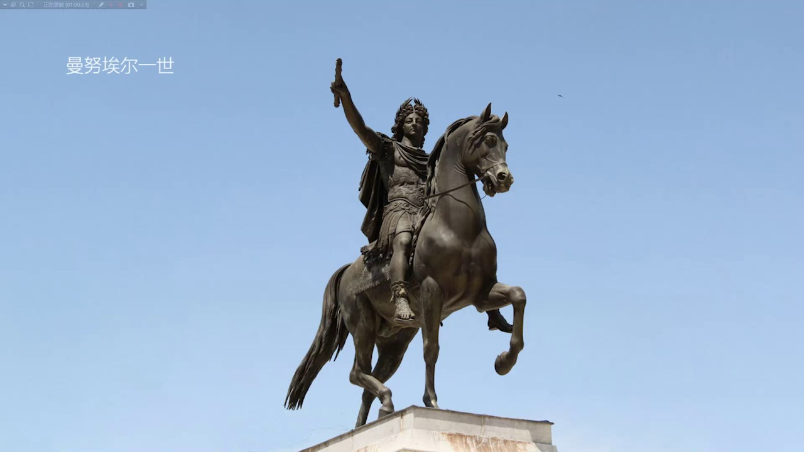

其反你引进来的外国事例越多你给它的条件和待遇跟文艺斯类似这就意味着你的国家财政会急去摔落文艺斯上让你收不到税其他的异大利上让你也收不到税那你的财政不就崩溃了吗所以最终的结果是整个拜登庭的经济贸易迅速的崩溃这个时候就在国家最威往的时候出现了一个非常重要的皇帝就是曼奴艾尔皇帝从1143年到1180年注意...

<strong>Cleaned narration</strong>

> 其反你引进来的外国事例越多你给它的条件和待遇跟文艺斯类似这就意味着你的国家财政会急去摔落文艺斯上让你收不到税其他的异大利上让你也收不到税那你
> 的财政不就崩溃了吗所以最终的结果是整个拜登庭的经济贸易迅速的崩溃这个时候就在国家最威往的时候出现了一个非常重要的皇帝就是曼奴艾尔皇帝从114
> 3年到1180年注意正是在他当政这段时间文艺斯搞出了这个主权信用了国战这是一个完全创新的一个概念就是在这个时期他上台之后发现了问题的根源所以
> 他多次取消了文艺斯人的这种特权就是收回但是呢收回之后文艺斯人就合动连横

---

### Slide 29

一会儿拉着深圳楼马帝国一会儿要拉上教会一会儿要团结诺曼人一块儿来整拜战庭帝国所以在这种斗争中拜战庭帝国不得不每次碰到这个情况都不得不做退让取消了特权之后那再给你吧你只要短期能够给我连横就行结果99支这个问题就逐渐了恶化结果导致拜战庭国内的不管是商人阶层还是普通老百姓阶层都对文艺斯人生物同学所以在11...

<strong>Cleaned narration</strong>

> 一会儿拉着深圳楼马帝国一会儿要拉上教会一会儿要团结诺曼人一块儿来整拜战庭帝国所以在这种斗争中拜战庭帝国不得不每次碰到这个情况都不得不做退让取
> 消了特权之后那再给你吧你只要短期能够给我连横就行结果99支这个问题就逐渐了恶化结果导致拜战庭国内的不管是商人阶层还是普通老百姓阶层都对文艺斯
> 人生物同学所以在1170年前后在这个拜军事场领寶拜战庭帝国之内的很多领土上都发生了大规模屠杀文艺斯商人的严重事件死了几万人所以文艺斯人就对拜
> 战庭的帝国可以说汉知书谷尤其对这个曼诺艾尔皇帝非常痛恨但是曼诺艾尔他还有很多其他的政绩比如说使劲冬争啊比如说工党区外利亚等等他还有巨大的其他
> 的军事和政治上这种成就不过曼诺艾尔这个人呢在我看来浩大喜宫并没有从根本上解决拜战庭帝国内部的经济上根源所以他在外面打得很厉害然后也获得很大声
> 誉但是解决不了拜战庭最后他走向摔网的根本性的命运就是制补服威尼斯人那么虽然你会看到在立上这个曼诺艾尔通过这个收服意大利南部最后攻战了安克娜如
> 果你看帝国的安克娜其实就已经离威尼斯就在威尼斯以南也在亚德利亚海的海边上他也是个港口他离威尼斯的距离也就两三百公里再往北打就到威尼斯了所以当时拜认庭的路军在可以说兵封指指威尼斯

---

### Slide 30

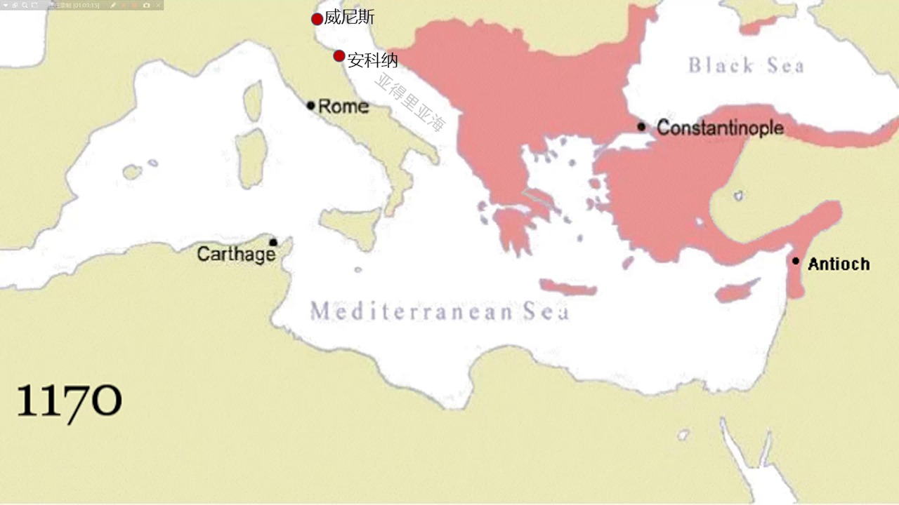

所以威尼斯就很紧张同时呢拜战庭当时还打败了匈亚利帝国打了一个非常漂亮的军事战艺所以控制了打尔马梯亚海岸的很多港口这次我们沿着打尔马梯亚海岸六个份一直向南走一直走到中间还要死不立特等等这些当年都被拜战庭所控制了所以这一点就跟威尼斯他所致定的国家战略他就要把亚德利亚海转面成自己的内户这跟整个国家战略有完...

<strong>Cleaned narration</strong>

> 所以威尼斯就很紧张同时呢拜战庭当时还打败了匈亚利帝国打了一个非常漂亮的军事战艺所以控制了打尔马梯亚海岸的很多港口这次我们沿着打尔马梯亚海岸六
> 个份一直向南走一直走到中间还要死不立特等等这些当年都被拜战庭所控制了所以这一点就跟威尼斯他所致定的国家战略他就要把亚德利亚海转面成自己的内户
> 这跟整个国家战略有完全冲突结果呢就是威尼斯觉得拜战庭是他的新福大患一定要把拜战庭在彻底消灭把他彻底打滑双方的矛盾的根源就在这这个拜战庭和威尼
> 斯之间的矛盾就导致了威尼斯没有办法他就只能是就是要发展海军进一步的强化战斗力这就导致的才正开始越来越大因为你要消灭拜战庭也不是简单的事这件事
> 情就跟后来一二零四年第四次是军东争这个威尼斯带了一帮人去把军事产品宝

---

### Slide 31

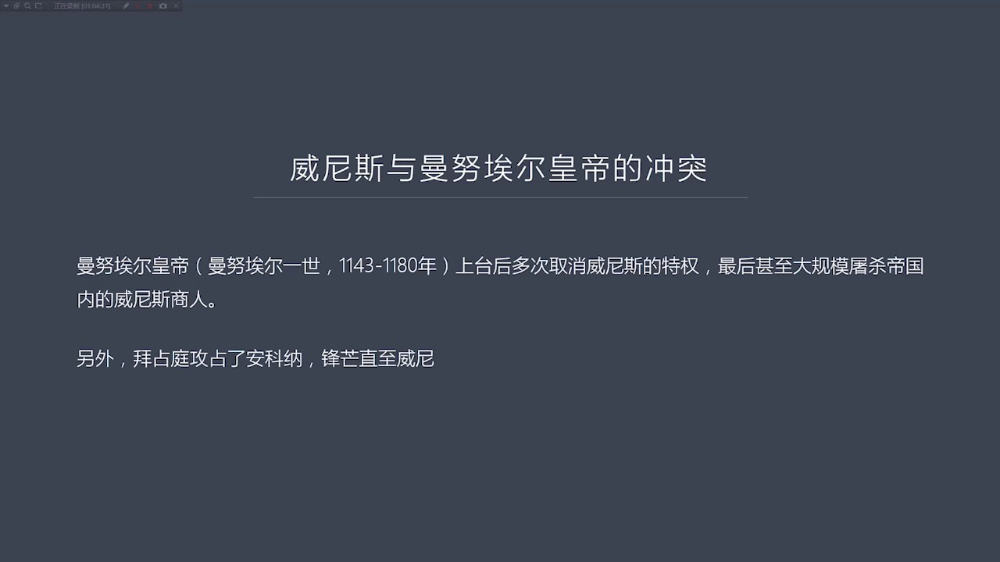

洗结了一番就跟这个事跟这个战略上的矛盾是直接相关的他不是突发起来这样的一种心血来操冲动而是认为拜战庭威胁了他们帝国的命迈威胁到威尼斯海上生存的命迈所以他必须要灭掉拜战庭但是你要灭掉这么大国你就得花钱花钱呢你这税税又不够这就会导致巨额的财政赎资也正是这种压力迫使威胁不得不发展出一种心的终资方式这种方式...

<strong>Cleaned narration</strong>

> 洗结了一番就跟这个事跟这个战略上的矛盾是直接相关的他不是突发起来这样的一种心血来操冲动而是认为拜战庭威胁了他们帝国的命迈威胁到威尼斯海上生存
> 的命迈所以他必须要灭掉拜战庭但是你要灭掉这么大国你就得花钱花钱呢你这税税又不够这就会导致巨额的财政赎资也正是这种压力迫使威胁不得不发展出一种
> 心的终资方式这种方式是什么呢就是我们现在所说的国家债务 国债主权 信用债好 我们再看下一威胁斯所守创这个国债制度是个什么类型的制度呢简单说起
> 来就是一五七年主要一五七年正是曼罗艾尔和这个威胁斯在意大利半岛上和在其他的地方打的可以说斗争非常激烈的这些年份这个威胁当时由于大局借债就大量
> 的借钱去发展海军去对抗败战艇所以他的财政压力太大了所以他们怎么办呢只能推行一种强制性借贷就不管你公民愿意不愿意我就强行强行向你借钱当然这种效
> 果我忘是不好的而威胁斯人呢他们转面了一个思路威胁斯人为什么不用土地去折压呢就像欧洲其他国王那样它没有土地所以它没法用土地去折压基金财宝国王了
>  王冠呢他们认为公势公司是私共和国的事情跟我就是这个总都国内这个共和国之内的事跟我这个这个国王他也没有国王跟我这些个人这个执政官之间没有必然
> 联系所以他们不会采取什么抵押皇冠或者抵押这个各种财产的方式既然你没有土地抵押没有土地底 又没有封建特权底同时又没有财宝那你用什么呢就必须要转
> 变思路不能靠底下的办法而是要发展出一种新的金融创新他们这个聚集做法就是由政府出面建立一家公寨银行这个公寨银行发行这个由国家单宝的而且未来是由
> 政府财政税收来单宝的然后可以自由流通的这样一种公寨这种公寨啊一开始就是它其实是一种股份就是一种股权的评证每个买公寨的投资人会成为这个银行的公
> 寨银行的股东然后财政部会记录他们的名字然后你希望政府借了多少钱在特定的就是政府呢怎么保证他还钱还本复习呢他是把特定的一些财政收入比如说税收假
> 如说是延的税收或者是某种这个生私的税收指定化给就是政府说这个钱之后自动的话给这个公寨银行用于常还公寨的本期这种制度就是一个非常有意思的金融创
> 新了就是你是用一个特定的收入支持一个特定用途的一种债券啊一种借贷这种就是方的的贷就是有基金来源作为保证的这样一种债那么一二零零零以后呢这些股
> 权评证啊就可以自由流通了可以买卖了而且呢可以用这些股票权证给大家贷款去借钱他的金融属性就非常强了然后再往后股权评证逐渐变成了一种固定收益的债
> 券发利息啊而不是在相当于拥有这个银行多少股份为什么我们看到热难压搞出股份质而为您司没有搞出股份质呢就是因为为您司当时迫切了任务是借钱用于公共
> 用途发展海军而不是做一个贸易去转移比前他不是以项目为主导而是以国家长远的一个海军扩展指名那个扩展他是一个政府行为是一个主权范围之内的一件事而
> 不是跟某一个具体的盈利的项目有关这使得他的这个国债这种特点最后占了上逢这个跟热难压的情况就完全不同了所以他的当年这种固定收益债券呢他的利利息
> 是在13%到25%之间波动如果你仗打了顺或者政治发展比较比较好政治局面比较好了这个利率就会低如果是打仗打了不顺政治局面比较混乱利息就比较高这
> 个是欧洲你查遍所有资料你会发现欧洲在此之前157年之前是不存在完全不存在类似的这种国债这个概念的没有拿国家不管是英法德还是任何的弗兰德德的这些地区还是任何北一大利的城市没有一个城市

---

### Slide 32

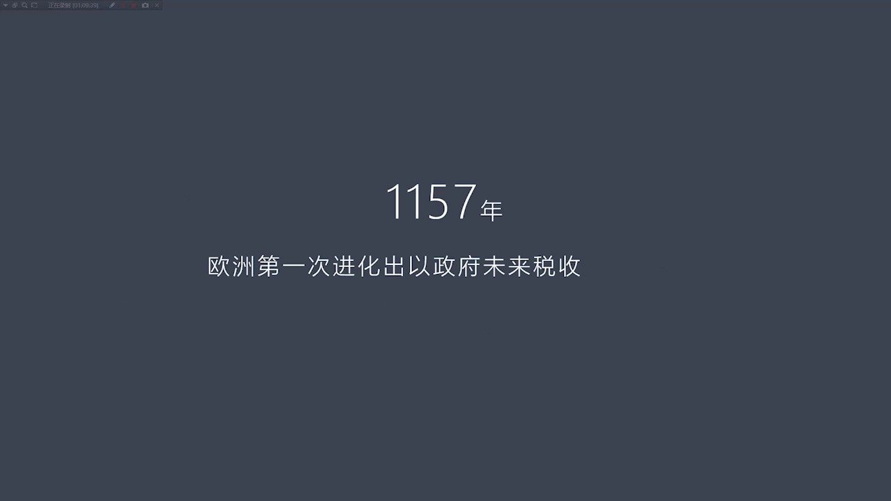

倒出了这么一种制度所以我个人认为157年就是主权信用战国债制度奠定了最关键的一言所以欧洲第一次在维尼斯通过维尼斯进化出了以未来政府税稍为抵押发行可思由流通的主权国债的这种新的制度这是前所为有的一件大事如果我们再看下一眼这就提出这个反思因为这个问题我自己也想了很久为什么中国没有发明国债制度为什么是维尼...

<strong>Cleaned narration</strong>

> 倒出了这么一种制度所以我个人认为157年就是主权信用战国债制度奠定了最关键的一言所以欧洲第一次在维尼斯通过维尼斯进化出了以未来政府税稍为抵押
> 发行可思由流通的主权国债的这种新的制度这是前所为有的一件大事如果我们再看下一眼这就提出这个反思因为这个问题我自己也想了很久为什么中国没有发明
> 国债制度为什么是维尼斯发明的而不是其他国家中国也没有发明原因是什么我自己把这个问题提练成了三个问题三个不同首先第一个不同是经济基础不同中国是
> 农业大国自古以来都是所以你的其他方面的政策包括贸易政策在内永远是从属于农业大局的农业是全国战略在封建社会在古代这个社会中国应该叫专制社会而不
> 能叫封建社会在专制社会这个时代中你不管贸易还是想任何政策手工业的政策必须要服从农业因为它是最大的格局所以既然服从农业那么在农业这个旅游中获得
> 最重要权力的当然是地主杰层所以他们就壟断了全国最主要政治权力政策是由他们定的不管你是客举考上举人的还是变成近世的还是变成撞远的还是选拔出来的
> 各籍政府官员背后代表谁利益当然代表地主杰层的利益你可以想象一下平寒的子弟虽然能够离跳楼门有个别1%的成功率但是99%的人一定是土地贵族出身它
> 这个家族有很多钱重地不用你去考虑了你就好好读书吧反正我们家有的是地有人跟我们众所以选拔出来的99%的封建的这种官员体系这些官员全部是出身于世
> 生出身于地主杰层哪怕你出身平寒的这些子弟当了官之后你同样会变成土地贵族所以中国在政治决策这个权力中间只存在核心的这个階层就是体重就是地主的这
> 个階层其他的階层实力太弱根本不足以跟他较量文仪司情况是不一样的文仪司是以海洋贸易为生贸易立国它是贸易立国的思路所以国家所有大政法征全部是以贸
> 易作为起点的因为没有贸易整个这个国家是无法生存那么在文仪司由于没有土地所以也不存在封建的土地贵族那么贸易立国的国家强调什么大家做生意强调是立
> 论立论驱动我这一传这一传生有赚多少钱所以我必须要高度尊重立论这个立论是驱动我整个国家发展政策制定了最核心的驱动力然后我还必须要尊重市场否则都
> 好赚多少钱然后还有客手契约这种契约不仅是国际贸易的契约同时也是国内政治运作的这种契约就是如果我们不万规矩办事我们就都赚多少钱都赚多少钱大家都
> 完蛋所以必须得有一个非常明确的商人之间的这样的一种合作关系这个关系就是以法律形式体验出来的契约精神而这些立论驱动市场岛下在加上这种法律所强化
> 的这种契约精神这三点就是国债这种制度金融的这种制度诞生的基础你要不存在这三点国债任何金融的基础都会都会变得很弱很难进化出手创的这种发明创造这
> 是第一个不同第二个不同是政治结构不同中国自够以来它就是个大一统的国家在中国的周边可以说绝大部分时间里面虽然有少数民族的这个永民族不断入侵但是
> 在绝大部分时间里面中国是一统的在一统的这种大帝国周围没有特别强大的文明特别强大的国家进行竞争当然武力强大的有但是它的文明比较落后没有一种像另
> 外一种模式的跟你相对应的高度文明高度发达的这种经济体跟你竞争所以没有这种压力同时也不存在一种超市俗权力的宗教力量来制约你西方的教会特别是教皇
> 罗马教皇你可以看整个中世计史其实就是教皇跟德治皇帝跟法兰西国王跟英国国王反复差可以说分成好几个阶段第一个阶段主要是德国皇帝跟教皇强第二个阶段
> 是法国国王跟教皇强你会发现教皇的力量是非常巨大的到底很简单你如果不听教皇的教皇可以对你决罚把你开出教极在中世计大家都认为你如果不是教会的人好
> ...

---
