# 核心课视频-013.比较优势的叛逆 — Slide Notes

> **来源**：鸿学院核心课程  
> **幻灯片**：19 张

---

### Slide 1

比較優勢的判斷這講我們重點說一下十四十幾英國毛訪之工業的崛起因為善團課我們提到了一個重要的觀點就是貿易互惠 但並不對等就是在一切商品貿易過程之中 只要是交易就必然存在著複雜勞動與簡單勞動之間的這種交換而這種交換從本身來說它是不對等的也就是複雜勞動的這一方永遠處於優勢地位那麼在自由市場的經濟競爭之中這...

<strong>Cleaned narration</strong>

> 比較優勢的判斷這講我們重點說一下十四十幾英國毛訪之工業的崛起因為善團課我們提到了一個重要的觀點就是貿易互惠 但並不對等就是在一切商品貿易過程
> 之中 只要是交易就必然存在著複雜勞動與簡單勞動之間的這種交換而這種交換從本身來說它是不對等的也就是複雜勞動的這一方永遠處於優勢地位那麼在自由
> 市場的經濟競爭之中這種交換的隨著交換的進行那麼我們會發現一個基本的規律就是強者越強 弱者越弱在國家之間的這種貿易也存在著類似的問題就是中心區
> 和邊緣區會越來越分化那麼有沒有這個相反的例子就是從一種比較簡單的這樣一種勞動經過轉型變成複雜勞動那麼這種成功案裡有沒有呢其實是有的 這就是英
> 國當年的毛仿職工業它在十四十幾崛起了我們都知道這個比較優勢理論實際上是英國人提出來的就是亞當斯密在國夫論中首先提出了一種叫絕對的優勢理論

---

### Slide 2

當然後來它這個理論存在了一定的邏輯上來缺陷就是所謂絕對優勢理論它比較的是一個絕對生產成本的問題因為亞當斯密如果我們看它的國夫論的話它有一個特別著名的例子就是別增生產 別增溝增這樣的一個分工那麼在分工之前一個工人一天只能生產幾十個二十個別增但是進行了工序分工之後卻能夠生產四五千個別增也就是成百倍的提高...

<strong>Cleaned narration</strong>

> 當然後來它這個理論存在了一定的邏輯上來缺陷就是所謂絕對優勢理論它比較的是一個絕對生產成本的問題因為亞當斯密如果我們看它的國夫論的話它有一個特
> 別著名的例子就是別增生產 別增溝增這樣的一個分工那麼在分工之前一個工人一天只能生產幾十個二十個別增但是進行了工序分工之後卻能夠生產四五千個別
> 增也就是成百倍的提高它的生產率所以亞當斯密把這套分工的學說把它擴大到了全世界就是國家以國家之間的這種分工那麼也必然會產生一個綜合效率的提升就
> 是分工之後效率提高經濟的總產出提高所以亞當斯密它就認為那麼如果國家之間分工之後也會產生類似於在一個社會之內產生分工這樣的一個生產率提高的效果
> 但是它這個理論推導中間有一個邏輯上的前提就是如果某個國家生產的絕對成本遠遠地於另外一個國家那麼它就應該從事它這項它的這項這個工作這個是絕對優
> 勢那麼這中間存在一個理論問題就是假如一個國家比如說英國它這個種質糧食成本如果比其他的國家更低羊毛也比其他國家更低生產別增也比其他國家更低絕對
> 成本那麼這樣一種國家它就沒有辦法跟別人進行貿易了所以它這個理論中間有一個巨大的困境就是當某個國家在各個行業中都處於絕對優勢地位的時候貿易就不
> 可能發生這個理論上的缺陷後來被李家徒提出了一個新的理論對它這個理論進行了修正李家徒的理論就是比較優勢

---

### Slide 3

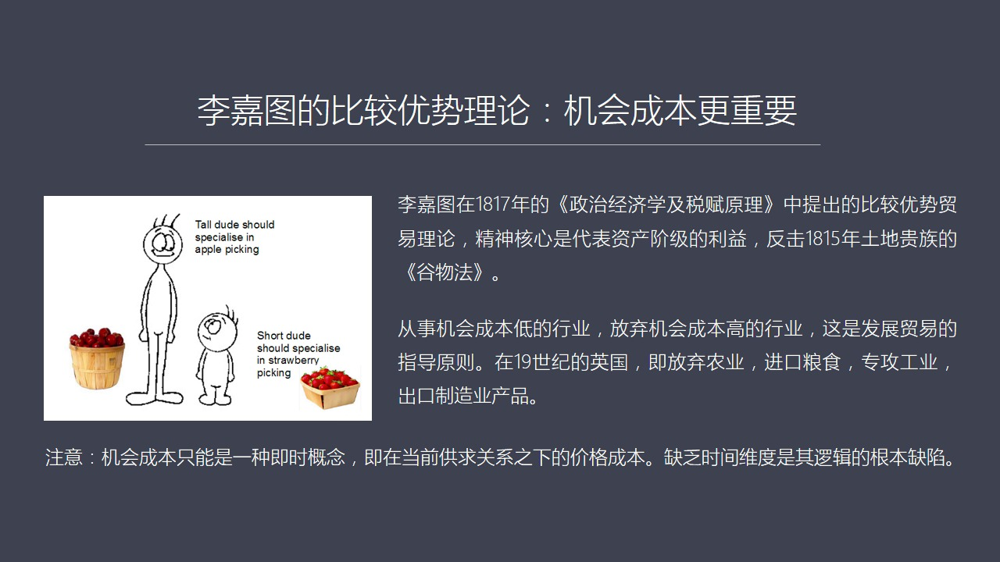

這種貿易學說當年李家徒提這個理論的時候它正好是它是在一把一七年發表的這個政治經濟學及稅付原理這本書它寫這個書的時候其實當時英國正在進行一場大論戰也就是英國的土地貴族們仍然在政治中享有較大的權力他們為了保護他們的古物種植他們想限制古物的進口比如波蘭商產糧室成本比他們低他們這個時候要保護自己土地上的這種...

<strong>Cleaned narration</strong>

> 這種貿易學說當年李家徒提這個理論的時候它正好是它是在一把一七年發表的這個政治經濟學及稅付原理這本書它寫這個書的時候其實當時英國正在進行一場大
> 論戰也就是英國的土地貴族們仍然在政治中享有較大的權力他們為了保護他們的古物種植他們想限制古物的進口比如波蘭商產糧室成本比他們低他們這個時候要
> 保護自己土地上的這種收益權所以強烈要求國家抬高關稅這樣一來他就會損傷工業資本家還有這些城市貴族的利益原因很簡單就是如果你進口糧食價格高了就會
> 導致生產成本增加還有工人的這種生活水平會下降那麼這就會傷害工業化的這幫人的利益所以工業化的這幫人就開始要找一種理論找一種學說來反對這種高關稅
> 的政策這個時候李家徒其實它是代表了新興的工業資本家的利益來創造了比較優勢理論它這個比較優勢講的是機會成本比絕對成本更重要這話怎麼來理解呢比如
> 說英國你是可以種糧食甚至你的糧食的價格絕對成本比波蘭還要低當然實際上它可能是比波蘭要高但是即便從理論上來說哪怕你種糧食比波蘭還要低那麼在這種
> 情況之下另外當然你還有強大的比如說仿值工業更強大你出口你的利潤更高那麼在這種情況之下李家徒的機會成本學說就比較這兩種一個是農業種糧食另外一個
> 是生產這個仿值品那麼生產仿值品帶來的利潤更高所以你種糧食就不合算應該把勞動力從農業中轉向製造業這就是你如果從事農業勞動的話這個機會成本太高你
> 不如去搞製造業賺錢賺得多所以在這種情況之下那麼英國就應該停著種糧食主要從比如說從波蘭進口而把勞動力和各種生產要素集中到製造業它更有優質的領域
> 所以它這套學說就解開了這個亞當斯密的困境也就是一個國家即便你在所有領域中都處於優勢但是你的不同的行業的機會成本是不一樣的你有一個最厲害的一個
> 行業那麼應該集中優勢發展最重要的行業而把其他行業牽涉掉或者削弱這樣的話一個國家雖然有綜合的各方面都有優勢但是仍然可以跟其他國家進行貿易因為優
> 選擇有放棄所以它在這裡提出了比較優勢理論之後應該說從181年以上現在這套學說主宰了全世界的理論界其實如果我們仔細來分析它這個比較優勢理論你會
> 發現比較優勢理論仍然存在理論上的邏輯上的困境它這個困境在哪呢就是我們在談到比較優勢的時候一定是談到當下的一個概念我們無法預知未來所以比較優勢
> 理論它的一個邏輯上的一個缺陷就是它是個當前的概念而不是一個跟時間有關的概念你比如說你如果比較優勢理論在19世紀提出來你認為訪置工業是你的一個
> 高利潤行業那麼這套學說如果說過個幾十年你會發現訪置也不行了那個時候可能剛鐵製造它更賺錢更多那再往後可能汽車再往後可能飛機所以當我們談到比較優
> 勢的時候只能是一個計師概念也就是在現場在當時的這個市場交易情況之下形成的一個價格形成你的利潤而這套這個這套理論的邏輯上的一個問題

---

### Slide 4

就是它不具有時間上的這種解讀的能力因為經濟發展過程中會隨時出現新的行業新的行業的利潤有可能高於現在的行業所以如果你完全按著一個當下的概念來解釋經濟現象的話就會存在問題特別是指導這個國策的時候就出現較大的偏差那麼這個由於缺發時間的這個圍度所以我們在思考比較優勢理論的時候它就缺少一個進化的一個概念那麼其...

<strong>Cleaned narration</strong>

> 就是它不具有時間上的這種解讀的能力因為經濟發展過程中會隨時出現新的行業新的行業的利潤有可能高於現在的行業所以如果你完全按著一個當下的概念來解
> 釋經濟現象的話就會存在問題特別是指導這個國策的時候就出現較大的偏差那麼這個由於缺發時間的這個圍度所以我們在思考比較優勢理論的時候它就缺少一個
> 進化的一個概念那麼其實你如果看英國的發展歷史你會發現這個英國人自己其實並不善著比較優勢理論來崛起的就是雖然它現在它在19世紀之後向全世界推銷
> 這套理論體系但是它們自己的實踐是一個反力我們可以稱之為英國的崛起是比較優勢理論的一個叛逆所以我們今天就來重點分析一下為什麼英國的比較優勢這套
> 學說是不是它們自己實踐的結果而是它們向全世界當它取得優勢之後向全世界其它國家推廣的這麼一套理論體系而英國自己並沒有遵從正好相反他們走的是相反
> 的道路如果我們來看這個PPT這個PPT我們重點講英國毛仿職工業它崛起的歷史背景就是英國當年是主要出產羊毛但後來變成了個仿職業的大國為什麼會這
> 樣其實我們的很多人在談到英國的崛起的過程中都知道它的仿職業很厲害工業革命爆發在英國但是工業革命爆發有個重要的前提就是英國的仿職工業已經非常強
> 大了應該說它是從這個百年戰爭就是14世紀到15世紀在百年戰爭這個階段中它的仿職工業就已經崛起了可以說英國的工業革命爆發的一個重要前提就是它的
> 仿職工業已經非常強大而且保持了三四百年的這種優勢只有在這樣前提之下工業革命才有可能在英國爆發這是我們很多人在談到英國崛起的受非常忽略的一個重
> 要的問題那麼當年英國的毛仿職工業是怎麼崛起的呢它主要的原因就是一個重大的外部事件百年戰爭1337年一直達到1453年那麼如果我們來看英法百年
> 戰爭的話為什麼會爆發這場戰爭它主要有三個根源第一是英法之間存在著領土的長期爭議

---

### Slide 5

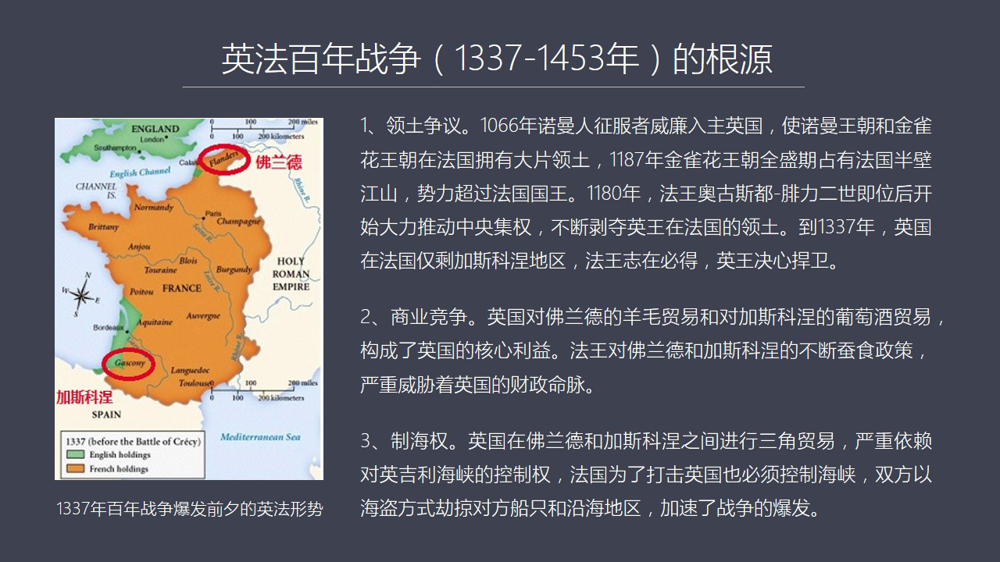

這個主要原因就是當年的諾曼仁當時這個維京海盜諾曼仁是其中之一到各國家去搶劫去打劫那麼有一支就到了法國佔領了法國的諾曼底地區那麼後來法王跟這群諾曼仁談條件談好條件之後就是我可以把這塊地給你們但是你要負責幫我守衛抵擋其他的這個滿足入侵就是維京人入侵所以諾曼底那個地方他就被這個維京人所佔據那麼到了公元10...

<strong>Cleaned narration</strong>

> 這個主要原因就是當年的諾曼仁當時這個維京海盜諾曼仁是其中之一到各國家去搶劫去打劫那麼有一支就到了法國佔領了法國的諾曼底地區那麼後來法王跟這群
> 諾曼仁談條件談好條件之後就是我可以把這塊地給你們但是你要負責幫我守衛抵擋其他的這個滿足入侵就是維京人入侵所以諾曼底那個地方他就被這個維京人所
> 佔據那麼到了公元1066年這個諾曼底的公決就是征服者威廉當時趁著英國有機可成率領諾曼底的這些人諾曼仁打進了英國最後佔領了英國那麼他就成了英國
> 的國王建立了諾曼王朝包括後來的金雀花王朝這個時候他在法國的領土諾曼底他仍然是諾曼底公決仍然具有著法國的領土所以他就變成了一個英國國王同時還擁
> 有法國領土就變成這樣一個情況那麼後來在金雀花王朝時代又通過通婚所以他獲得了大量的法國的領土在他全正時期比如說一一八七年英國的金雀花王朝他其實
> 在法國所擁有的領土比法國國王本身還要大佔據了法國的伴比江山可以說整個法國的西部靠海的地區都是屬於英國的那麼後來當時法國國王就不幹了從一一八零
> 年這個法國國王菲律賦二世奧斯都他上台之後就開始推行法國的中央集權可以說法國是歐洲西歐國家裡面比較早地開始了中央集權道路了這樣的一個國家所以他
> 通過通婚通過徵戰等等通過各種手段不斷的殘使英國在法國的領土那麼到了這個百年戰爭之前一三三七年前後那麼英國在法國的領土就只剩下很小的一塊了就是
> 加斯科尼爾地區我們在初中可以看到就是他的綠色的法國領土中間綠色這一塊那麼加斯科尼爾地區仍然屬於英國但是法國國王這個制在必得一定要把這個領土給
> 拿下那麼英法之間就圍繞這個問題會產生激烈的爭奪但除了領土問題其實還有一個法國國王繼承權的問題到底英國國王有沒有資格去獲得法國國王這樣的一個權
> 力當然這是一個次耀的問題因為英國的國王當然不可能當然法國的國王法國人是不會同意的所以他的要害是加斯科尼爾的領土除了這個問題之外第二個重要的起
> 源爆發百年戰爭的一個根源就是商業競爭英法存在著非常激烈的商業競爭如果我們說領土爭議這還是一個封建王朝時代的一個老話題那麼商業競爭這是一個中世
> 紀特別是在十四十幾之後整個修特別是以福蘭德地區的還有義大利地區的經濟高速發展之後貿易起來了大家有錢了這個時候商業競爭就成了國語國之間非常重要
> 的一個競爭的新的領域英法在商業上就存在了一個競爭關係這個競爭關係主要體現在兩頭一頭就是福蘭德福蘭德是法國的博軍領還有加斯科尼爾這兩個地區福蘭
> 德我們在上一講中專門講到過他是一個毛訪之工業的中心一個是在福蘭德另外是在義大利北部倫巴地這個地區那麼加斯科尼爾呢加斯科尼爾他的主要的出產我們
> 都知道布爾多的葡萄酒很好其實就是在加斯科尼爾地區那個地方是聖產葡萄的地區那麼英國在福蘭德地區他有重大的商業利和財政上的利益因為英國的王世他這
> 個財政的主要收入是靠出口羊毛那麼出口給誰呢當然是出口給福蘭德所以英國王世的這個財政要指望著這個福蘭德同時呢加斯科尼爾的大量葡萄酒出口到英國又
> 給英國王世提供了另外一個巨大的財源英國的這個國王可以對進口的葡萄酒蒸很高的稅那麼這個還可以把葡萄酒在本地消費或者轉轉口到其他國家另外英國呢在
> 把波羅地海的這些貿易的這種各種產品轉運到加斯科尼爾地區所以他是一個貿易的中轉的這麼一個國家他在貿易過程中兩邊都可以轉錢所以加斯科尼爾的葡萄酒
> 福蘭德的羊毛貿易對英國來說都涉及到他一個重要的財政的收入那麼如果法國法國國王對這兩個地區胡思丹丹那麼就一定會嚴重威脅到英國國王的財政收入所以
> ...

---

### Slide 6

可以說英國當年是在百年戰爭之前比如說百年戰爭之前到退一百年一二五零年到一三五零年這一百年中間英國是羊毛出口來驅動經濟發展的那麼英國的羊毛我們都知道英國的草原特別適合於羊毛生長綿羊的這種生長它的靈肯羊它是一種茶毛羊這種羊毛它的質量品質非常高也非常有這種油脂摸著非常的光滑所以它立來就是毛防止工業中間最重...

<strong>Cleaned narration</strong>

> 可以說英國當年是在百年戰爭之前比如說百年戰爭之前到退一百年一二五零年到一三五零年這一百年中間英國是羊毛出口來驅動經濟發展的那麼英國的羊毛我們
> 都知道英國的草原特別適合於羊毛生長綿羊的這種生長它的靈肯羊它是一種茶毛羊這種羊毛它的質量品質非常高也非常有這種油脂摸著非常的光滑所以它立來就
> 是毛防止工業中間最重要的原材料當然除了其實除了英國這個羊毛之外西班牙羊毛也不錯不過當年西班牙羊毛還沒有起來英國羊毛當時是整個歐洲最強守的這樣
> 一個商品原材料那麼也正是由於它的羊毛優異所以它的質量很好所以它在弗蘭德義大利地區都非常強守也正是因為羊羊出口羊毛非常賺錢英國的境內的它的這些
> 基本上是全國這些封建靈主這些教會的這些主教還有這個修道院大家都養羊因為養羊賺錢快所以呢當時大家搞這個我們後來知道有個羊吃人當年這個問題就已經
> 存在了因為當時為了四養這個綿羊很多公用土地已經被圈佔了只不過後來發展得更嚴重所以當時是犧牲了很多農業來發展羊毛的羊毛業所以這種這樣的一個發展
> 態勢使得英國成了當時歐洲最主要的羊毛出口的大國那麼英國自己的毛仿這工業呢當年也有其實每個國家都有自己的仿這工業因為本土人穿衣服都得

---

### Slide 7

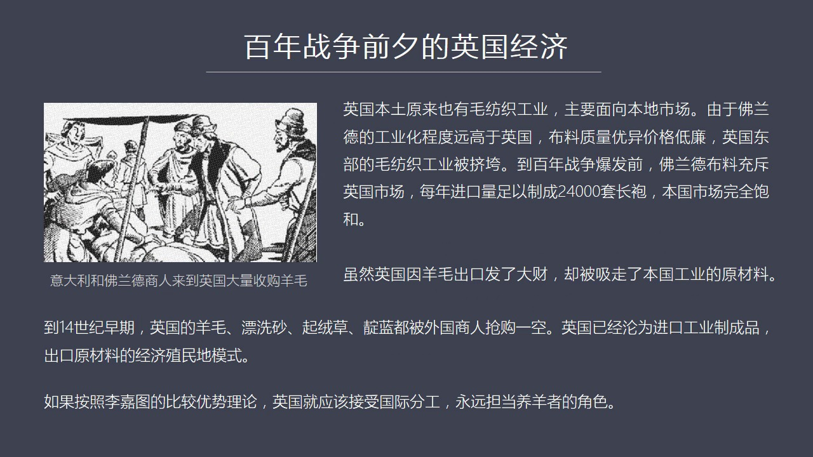

一般來說都是這個家庭內部防支或者是附近的這種防支廠來生產但是由於英國的這個羊毛非常的賺錢所以你會發現他們在考慮這個當年沒有產業政策但是在利潤的曲子之下大家就越來越願意去養羊而不願意搞防支因為搞防支你跟富蘭德比起來那還是有相當大的差距富蘭德的工業化程度要比英國要高很多我們上一講專門講過富蘭德的非常精力...

<strong>Cleaned narration</strong>

> 一般來說都是這個家庭內部防支或者是附近的這種防支廠來生產但是由於英國的這個羊毛非常的賺錢所以你會發現他們在考慮這個當年沒有產業政策但是在利潤
> 的曲子之下大家就越來越願意去養羊而不願意搞防支因為搞防支你跟富蘭德比起來那還是有相當大的差距富蘭德的工業化程度要比英國要高很多我們上一講專門
> 講過富蘭德的非常精力化的這種勞動分工所產生的巨大的這種生產效率的提升那是英國當年比不了的所以富蘭德的這種他的毛仿質製程品這些毛料這些泥籠他的
> 品質非常優異而且價格很低連所以呢英國的本土的毛仿質工業競爭不過富蘭德的部料所以英國當年的毛仿質工業他的重心是在東部沿海那麼這些毛仿質工廠基本
> 上都被激垮了整個毛仿質業談判了那麼到了百年戰爭爆發之前你會看到富蘭德的部料已經大量充斥在英國國內市場那麼每年進口的這個部料的規模非常大大到什
> 麼程度就是每年這個部料支程品可以生產如果做衣服可以生產兩萬四千套這種長跑而當年的英國人口才三百多萬所以呢這麼大的一個廠品步用到英國的市場那麼
> 就是英國本國市場就高度地保合這樣的話你本土的這些房子廠也沒有辦法生存也正是由於這個問題你會發現英國越來越專注於羊毛出口而逐漸放棄了房子業那麼
> 由於他出口羊毛賺了很多錢但是在這個過程之中就是你雖然出口羊毛賺了很多錢但是你喪失了本國的製造業就像我們上集課所講的你是一種簡單的勞動去交換富
> 蘭德的複雜勞動長此以往對英國本國的製造業是非常不利的可以說眼眼一吸了爭不過人家那麼在往後發展你就成了保母經濟了英國就成了富蘭德的保母富蘭德是
> 專門從事高端的複雜的勞動而英國只能從事養羊這樣的一個簡單勞動那麼那麼在這樣一個過程中你會發現富蘭德和義大利商人大量勇向英國用現金甚至預付預付
> 款的形式把未來很多年的羊毛全部都買下來了那麼同時還採購了英國這個大量的生產毛仿著工業的原材料你比如說啟容草啊票血沙啊還有這個染料都被外國商商
> 買光了這樣一來就導致英國的本國的房子業更沒有辦法發展了因為你的原材料羊毛都被人家買光了那你本國還怎麼還怎麼發展呢再加上市場高度飽和所以英國在
> 這個百年戰爭之前已經淪為了一種殖民地經濟它只能出口羊毛換回制成品不料那麼這種情況其實對英國非常的不利如果按著李家徒他的比較優勢理論的話那麼這
> 種情況也就是你要接受國際分工福蘭德那邊已經人家已經搞得不錯了那麼英國你最好就只是生產羊毛只是去養羊就完了但是如果這麼來發展的話英國未來是不可
> 能發動工業革命的也不可能成為海上霸主也更不可能成為日不落帝國往後的一切都談不上了你就變成一個純粹像西西蘭這樣的國家養羊 養牛那就變成一個非常
> 簡單和非常落後的國家了那麼英國當然不是那麼做的當然它這個一個重要的轉機就是百年戰爭的爆發如果我們看下一為什麼百年戰爭的爆發對英國的毛訪者工業

---

### Slide 8

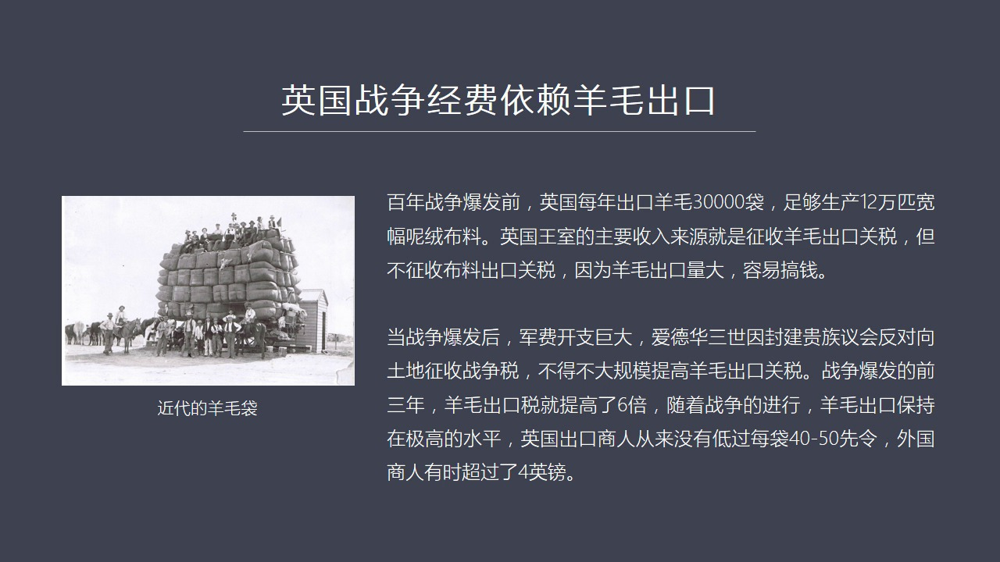

提到重大了促進作用呢這個是一個偶然的行為或者說不是出於英國的產業政策因為當時還沒有這種經濟理論也國王們也想不到這麼多他就是因為要打仗要跟法國打要跟法國打就涉及到一個巨額戰爭經費的問題那麼英國當年的情況是這個男爵們的這些封建領主們的勢力比較強大那麼對英國國王有比較大的這種制衡作用也就是你要爭稅要打仗嘛...

<strong>Cleaned narration</strong>

> 提到重大了促進作用呢這個是一個偶然的行為或者說不是出於英國的產業政策因為當時還沒有這種經濟理論也國王們也想不到這麼多他就是因為要打仗要跟法國
> 打要跟法國打就涉及到一個巨額戰爭經費的問題那麼英國當年的情況是這個男爵們的這些封建領主們的勢力比較強大那麼對英國國王有比較大的這種制衡作用也
> 就是你要爭稅要打仗嘛那就必須要這些男爵同意而他們不同意就不能發動戰爭或者沒有錢去發動戰爭而這些土地貴族們呢當時在英國那些很多這些男爵這些什麼
> 博決這些人呢他們對在法國的這個領土或者在法國那些這個經濟貿易的這些利益呢並不是太看重因為跟他們關係不大所以法英國的國王很難獲得這些土地貴族的
> 支持那怎麼辦呢他就必須要通過其他方式來找錢來獲得戰爭經費那麼對他來說對英國國王來說最好的辦法就是像羊毛爭稅因為整個歐洲都需要羊毛而英國呢可以
> 爭收羊毛出口稅這個是屬於王世了王世有了這個羊毛出口這筆錢就可以支持戰爭所以呢所以當年在百年戰爭爆發之前英國每年的羊毛出口量是很大的三萬代這一
> 代是多大呢我這左邊畫了一張圖就是一個羊毛一個一代羊毛大概就是一個方形的然後經過高度壓緊之後是一個非常大的一個體積當然這是這張照片上人是近代近
> 現代的羊毛帶但是基本上跟中世紀的時候差不了太多所以英國當年出口了三萬代羊毛足夠它生產十二萬批寬容了這種一種不料而英國國王的它的主要的軍費來源
> 就是靠羊毛出口而且當時還有一個特點它只爭收羊毛出口稅而對於英國不料出口呢

---

### Slide 9

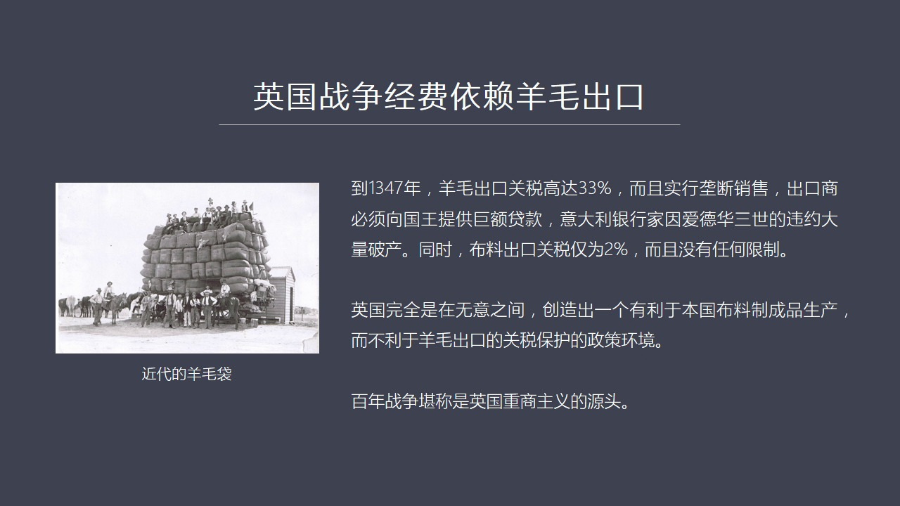

它不爭稅因為英國出口不料很少都被弗蘭德擠得差不多了對羊毛爭稅不對不料爭稅主要因為羊毛出口量大不料很小所以羊毛出口去爭稅的話容易搞到錢那麼也正是在百年戰爭爆發之後你會看到英國的羊毛稅出口的稅非速上漲戰爭是打了三年這個羊毛出口稅就爆長了六倍為什麼缺錢啊越打越缺錢所以隨著戰爭的進行持續了百年英國的羊毛出口...

<strong>Cleaned narration</strong>

> 它不爭稅因為英國出口不料很少都被弗蘭德擠得差不多了對羊毛爭稅不對不料爭稅主要因為羊毛出口量大不料很小所以羊毛出口去爭稅的話容易搞到錢那麼也正
> 是在百年戰爭爆發之後你會看到英國的羊毛稅出口的稅非速上漲戰爭是打了三年這個羊毛出口稅就爆長了六倍為什麼缺錢啊越打越缺錢所以隨著戰爭的進行持續
> 了百年英國的羊毛出口關稅就變成了一個永久性的非常高的一個關稅了也就是英國出口商人你要想通過賣羊毛或者外國商人要在英國買了羊毛之後要向國外出口
> 都要交很重的稅比如說到一三四七年的時候出口羊毛的關稅高達33%而且還不是什麼人都能出口只能指定的商人搞壟斷銷售為什麼搞壟斷銷售就是因為愛德華
> 三世他當時為了持續這個戰爭他還是需要除了關稅之外還需要大比的現金也就是把關稅可以做抵押獲得銀行賣款一大利的商人一大利的商人和銀行家那麼他實際
> 上是把羊毛出口比如說一年我可以證多少錢然後我把未來若干年的羊毛出口都抵押給你然後你不是可以給我一大比錢嗎這種其實就是後來在券的這種玩法我把未
> 來現金流然後用到現在然後成一多少倍獲得一次性獲得大量的這種收入所以英國的羊毛他這個關稅進行了抵押但是後來由於戰爭有些情況下打得不太順這個潮不
> 到錢所以愛德華三世後來出現了違約這一違約就出大問題了一三四七年其實就是一場金融危機年愛德華三世一違約導致了一大利這些很多商人這些銀行家由於貸
> 款給英國政府帶了太多一下你這邊違約我這邊現金流就斷了所以導致了一大利出現了銀行的大破產那麼這種政策從十四十幾中其實一直到一百年十五十幾中這一
> 百年都是一個高官稅的政策那麼國王並不是說有意是要搞一個經濟政策但是它這種由於太缺錢而想辦法這個通過羊毛搞錢這個事情卻產是那個奇特的效果這個效
> 果就是羊毛出口的關稅很高而布料出口的關稅很低這個巨大的減刀落差使得英國國內如果你生產這個用羊毛生產布料的話你這個成本可就比國外低多了就相當於
> 羊毛這個關稅就相當於一個關稅壁壘黨諸了弗蘭德的布料進來而使你的生產布料的成本要遠遠低於國際平均水平因為你的關稅定得很高所以這個是對英國的防治
> 工業產生這個巨大的推動作用就是外國競爭被削弱了那麼本國搞防治業這些人就能賺錢了所以我們會看到英國它實際上是在戰爭中間不精役搞了一套貿易保護體
> 系出來也就是英國重傷主義的源頭其實是百年戰爭我們如果看下野英國在獲得一個巨大的關稅保護這種之下

---

### Slide 10

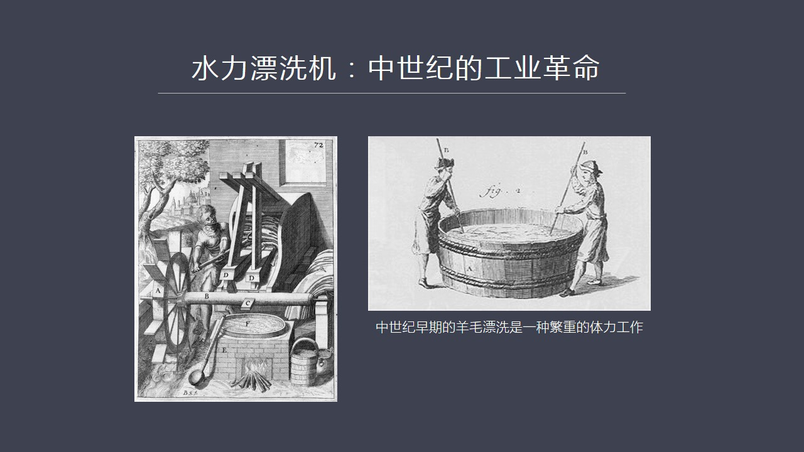

它的防治工業又是怎麼崛起的呢這中間提到中時期的一場工業革命水利票息機這個票息我在上集課中間專門講它是個很累的一個工種很累的一道工序如果我們看左邊這張圖中時期早期陽光票息它是要么用腳踩要么用這個肝子在這個筒裡頭去攪拌而且這個筒裡頭這些票息業有些還是用鳥用這種鳥它也可以去掉這些羊毛身上的那些油脂成分當然...

<strong>Cleaned narration</strong>

> 它的防治工業又是怎麼崛起的呢這中間提到中時期的一場工業革命水利票息機這個票息我在上集課中間專門講它是個很累的一個工種很累的一道工序如果我們看
> 左邊這張圖中時期早期陽光票息它是要么用腳踩要么用這個肝子在這個筒裡頭去攪拌而且這個筒裡頭這些票息業有些還是用鳥用這種鳥它也可以去掉這些羊毛身
> 上的那些油脂成分當然還有一些家其他的東西所以人在上都踩它這個味是很難受的而且工作量極大生產效率很低那麼這道工序它的時間長體力效大而且也非常繁
> 重那麼後來其實在中世紀的時候就已經出現了一種新的票息的這種機器叫水利票息機水利票息機並不是英國發明其實在Flander在義大利早就有了在11
> 世紀早期最早我看到有1017年前後就已經有票息機出來了水利票息機但是水利票息機在這些地區沒有得到推廣而在英國獲得了巨大的這樣的一個普及什麼原
> 因呢這中間有兩個原因第一個原因是Flander地區它水利資源偏少沒有高山沒有這種基流沒有這種速度很快的河流所以它天然去發條件義大利是有亞平均
> 山脈中間有很多河流是可以發展的但是義大利的它的城市中間這個商業行會太厲害商業行會呢就不願意採取這種新的方式因為商業行會它要限制競爭限制競爭呢
> 就不太願意採取任何新的這種工藝和方法因為你要採取其他人不採取的話那這個競爭局面就打破了它是對於外是要佔領市長對內它是要嚴格防止體系之內競爭的
> 因為有些地區它靠近有河流有些地區遠離河流那就大家就會產生矛盾所以商業行會是堅決反對新技術的特別是反對水利票息機因此在富蘭德也好在義大利也好水
> 利票息機都沒有得到太大的發展而英國卻得到了大規模的普及主要原因呢就是我們現在也看到了英國的水利資源極其豐富也正是由於英國的水利資源豐富

---

### Slide 11

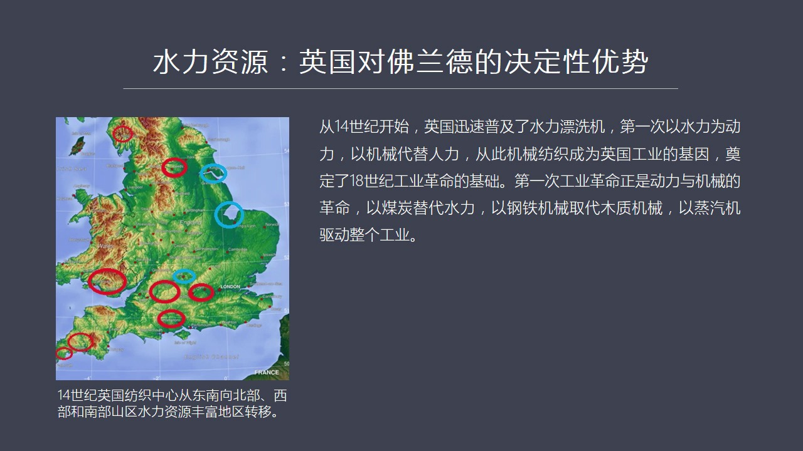

使得英國對於富蘭德的這個矛盟老訪著工業它具有了一種決定性的優勢因為這個英國一旦推廣了這個水利票息機你會發現其實英國已經進化出了一種工業文明這種工業文明是什麼呢它第一次以水利作為動力以機械代替了人力代替了人工這個時候這種機械加仿值就成了英國工業中間的一種基因這種基因呢其實就列令了18世紀我們看到了工業...

<strong>Cleaned narration</strong>

> 使得英國對於富蘭德的這個矛盟老訪著工業它具有了一種決定性的優勢因為這個英國一旦推廣了這個水利票息機你會發現其實英國已經進化出了一種工業文明這
> 種工業文明是什麼呢它第一次以水利作為動力以機械代替了人力代替了人工這個時候這種機械加仿值就成了英國工業中間的一種基因這種基因呢其實就列令了1
> 8世紀我們看到了工業革命的一種基礎工業革命嘛你就是燒煤嘛然後這個以煤炭代替水利以機械代替這種這個剛鐵機械代替木質機械然後發明蒸機機來驅動整個
> 工業體區運轉這個就是工業革命的實質為什麼工業革命爆發在英國直到今天我們還有很多學者在探納這個問題但是我看他們這個探納中間都缺乏這樣的一個觀點
> 或者都缺乏這樣的一個最基本的概念就是英國發明這個搞出工業革命注意它首先是用的仿值工業上而為什麼它能夠用在仿值工業上就是因為英國當年的仿值工業
> 已經領先歐洲好幾百年了它沒有這個基礎那你這個蒸機搞出來往哪用啊因為沒有仿值工業大功能應用改造不斷的優化它就沒有進化了潛體它就沒有利潤它撞不到
> 錢那這種新的玩意兒新的技術就沒人去推廣和使用因為蒸機機最早蒸機機在羅馬時代就已經有了甚至在古埃及時代就已經有類似蒸機機這樣的裝飾了就是當時用
> 這種蒸器的辦法來推這個什麼樣的大門這就已經有了但是為什麼沒有發展起來呢就是因為沒有商業價值那麼如果沒有仿值工業的巨大需求蒸機機在英國也很難普
> 及所以我們在談到英國工業革命的時候要對它的歷史全過程要非常的清楚要知道很多細節否則的話當大家收到英國工業革命的時候你就就想他們突然一拍腦門想
> 出這個好辦法發明了蒸機然後它就工業革命了沒有前因後果它沒有一個歷史傳承沒有歷史送身你根本就看不清楚它的淨化的路徑那麼也正是由於英國它當時具有
> 這個非常獨特跟菩蘭德和義大利比起來它有個非常獨特的優勢就是它的山墮它的山區多而且它的水利資源極其豐富你會看到英國的這個開始使用水利票息機之後
> 它的工業中心發生了巨大的轉移你比如說我在途中化的藍圈這部分是它傳統的防止工業中心主要是在東部靠海那麼你會發現它新的工業中心它有哪些特點呢它是鄉村化的工業也就是我們說的鄉村企業了

---

### Slide 12

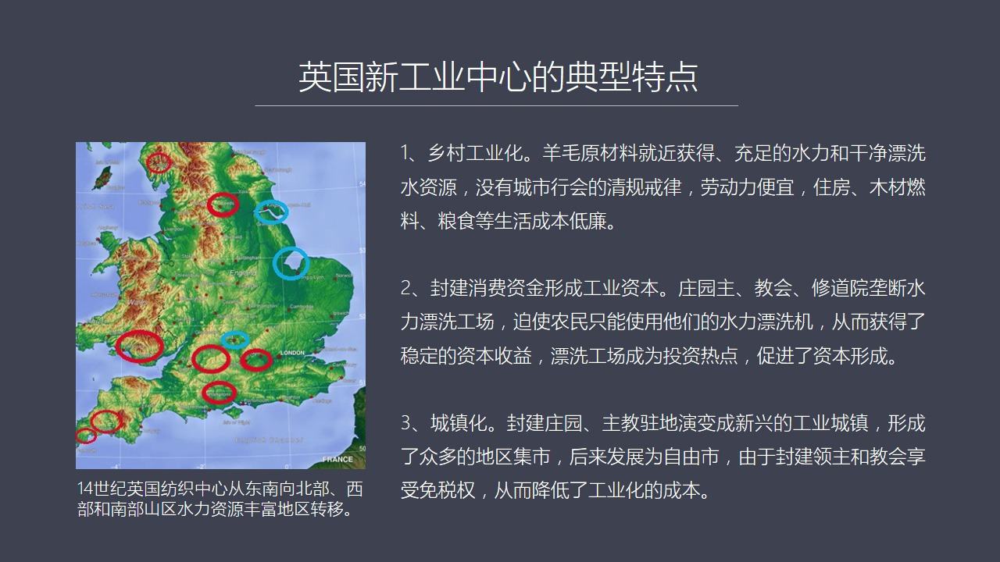

為什麼是鄉村化呢因為有水的地方河流流速比較快的地方都在山區你要到了平原、到了海邊那個河流速不太慢這個水利不足不足以推動這個票息機所以呢英國的這個它的新的防止中心基本上都在山區就是我在途中用紅圈圈出來的地區這地區成了英國新新的工業化的中心所以英國的毛防止工業的發展它既完成了既出革命同時也完成了產業布局...

<strong>Cleaned narration</strong>

> 為什麼是鄉村化呢因為有水的地方河流流速比較快的地方都在山區你要到了平原、到了海邊那個河流速不太慢這個水利不足不足以推動這個票息機所以呢英國的
> 這個它的新的防止中心基本上都在山區就是我在途中用紅圈圈出來的地區這地區成了英國新新的工業化的中心所以英國的毛防止工業的發展它既完成了既出革命
> 同時也完成了產業布局革命你會發現新的工業中心在西部、在北部、在南部、著壯成長那麼在農村或者在這個鄉鎮發展這種防止企業它有什麼好處呢就是因為那
> 些山區正好是養羊的這個供應地羊毛就在那個地方在那個地方減羊毛然後運輸距離很近同時那個地方又有充足的水利有水利它能票息要有清潔水源同時在鄉村裡
> 頭它沒有這個城市像義大利和特別是蘭德那種非常非常標汗的壟斷力非常強的商商行會什麼都不讓你幹有很多清歸業率在山區就沒有這個問題同時在山區你估用
> 的都是山民都是普通農民因為它的勞動力成本很低然後大家都居住在村裡自己的房子裡面所以它的住房也沒有租金然後你需要燃料木材變成都是而且糧食這些東
> 西都是舊地舊地獲得糧食所以它整個的生活成本還包括企業的運營成本都很低這是它的第一個重大特點就是鄉村工業或者叫鄉鎮企業是英國跟蘭德地區最大不同
> 蘭德一大利那都是城市工業第二個不同就是這個小封建社會的這些領主們以前在土地上收來的粥子或者弄來了錢就主要用來攀比用來消費但是水利票息機推廣之
> 後大家突然發現這網上可以正錢這是個投資熱點為什麼呢因為封建領主在自己莊園上搞水利票息機主教們在教會峽區搞票息機他們會強迫他們峽區之內的或莊園
> 之內的普通的農民把這種羊毛或者羊毛仿職品拿到他們上去票息就像當年他們搞水利的水墨水利的這個延古子的這個墨古子的這種這種墨盤這種水利的墨盤也要
> 求老百姓不管你是拿去賣還是你們自己家要吃饅肉都要求你把小賣拿到他這個水墨房去摸去摸面所以這種不合理的要求是他們獲得利潤的那種辦法那麼在水利票
> 息機發明之後他們也見了投資見了很多這種票息工廠由於你可以強迫所有人把它自己家裡面必須得把自己家的這個羊毛拿到這個靈主這個地方水墨房水墨房來這
> 個來票息水利票息這個工廠來票息那麼就使得它的投資是有利人保障的這就形成了消費資金向工業資本的轉化這個是英國的社會是這個封建的這些靈主們首次獲
> 得了工業資本的概念大家開始投資了開始投資工業了而不像以前歐洲大陸很多靈主就把錢給花掉浪費掉第三個特點就是承認化由於這些主教的這些瑕區還有封建
> 靈主的莊園它有相當大的自主權所以他們就圍繞水墨房圍繞這個票息工廠建起了一些這個即適發展出了一種即適周圍了一些農民或就把一些剩餘糧食把一些手工
> 業產品拿到這條爛賣所以這就產生了即適這種即適後來就逐漸發展成了一種城鎮這種城鎮最後就變成了英國後來的大量的自由自由勢所以由於在這些封建靈主們
> 主教們他們都是免稅的所以在這些自由勢裡頭他們沒有像國王那稅這個義務所以他的這個企業在那搞經營他的成本低因為他們免稅這樣就使得大量的工業牽向了
> 這些山區和這些自由的即適使整個工業化的成本大幅下降那麼我們再看下野這百年戰爭還有一個重大好處

---

### Slide 13

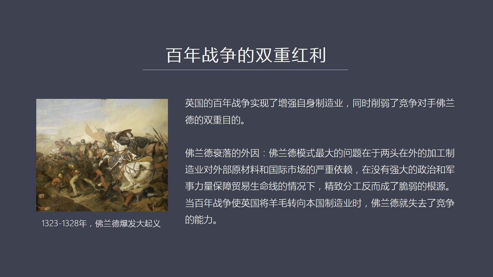

就除了使得英國具有著一種巨大的勢能就是由於關稅產成了一個巨大的生產模仿著工業的這麼一個利潤產成了一種勢能同時呢還有豐富的水利資源然後可以用水利票集機來進行這種生產除了這兩個原因之外還有就是百年戰爭產成了一個意想不到的紅利這個紅利就是增強了除了增強英國自身的製造業同時還削弱了弗蘭德的進對手的實力因為弗...

<strong>Cleaned narration</strong>

> 就除了使得英國具有著一種巨大的勢能就是由於關稅產成了一個巨大的生產模仿著工業的這麼一個利潤產成了一種勢能同時呢還有豐富的水利資源然後可以用水
> 利票集機來進行這種生產除了這兩個原因之外還有就是百年戰爭產成了一個意想不到的紅利這個紅利就是增強了除了增強英國自身的製造業同時還削弱了弗蘭德
> 的進對手的實力因為弗蘭德這個地區它是法國的這個博決領地弗蘭德的模式上從我們講過它是從全世界獲取原材料它最終的市場也在世界市場所以它是兩頭在在
> 外典型的加工加工這種工業模式但是弗蘭德沒有自己它不是一個獨立的政治實體你是別人的一個是法國的一個博決領所以你沒有自己的軍隊沒有自己的完備了一
> 整套體系所以你不能發展出強大的海上力量來保護自己的利益這種情況下如果外部你的原材料出問題或者你的市場出問題你這個體系都會出現嚴重的困境所以一
> 旦這個英法之間的百年戰爭爆發就會是英國的羊毛像弗蘭德供應就會減少到後來就完全斷絕了這就是弗蘭德出現了巨大的經濟困難特別是英國把羊毛用於自己的
> 防止那麼弗蘭德就沒有霍元了而這個時候西班牙的霍還過不來因為英國後來採取了海盡或者海盜組織的方式不止西班牙的羊毛進入弗蘭德所以他是通過多種手段
> 發展自己削弱對手這就形成了英國立來了一種國策他不是說在競爭中只是使自己更具有競爭力同時他要打擊對手還讓你發展不起來這是此銷彼長的過程那麼弗蘭
> 德他的外因就是他的生產模式兩頭在外而你自己沒有軍隊沒有海軍所以你很難保護你這個市場和原材料的供應他還有內因他的內因是什麼呢就是弗蘭德的分工非常的驚喜

---

### Slide 14

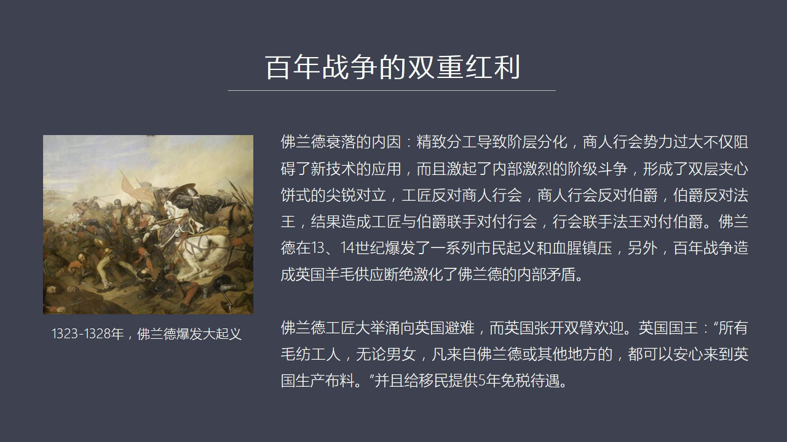

我們上次已經講到了他有十幾道工序然後商業航會全力巨大商業航會阻止新技術的應用同時還控制內部的工匠階層對他們控制很嚴不給他們各種各樣的政治待遇然後經濟上也不斷的壓榨所以這就激起了內部非常激烈的激烈鬥爭所以工匠階層就起來反對商人商人商人航會所以在弗蘭德的地區他呈現他的政治比較複雜我稱之為是一個雙層的這種...

<strong>Cleaned narration</strong>

> 我們上次已經講到了他有十幾道工序然後商業航會全力巨大商業航會阻止新技術的應用同時還控制內部的工匠階層對他們控制很嚴不給他們各種各樣的政治待遇
> 然後經濟上也不斷的壓榨所以這就激起了內部非常激烈的激烈鬥爭所以工匠階層就起來反對商人商人商人航會所以在弗蘭德的地區他呈現他的政治比較複雜我稱
> 之為是一個雙層的這種加薪餅這種雙層加薪餅怎麼理解呢最底層的工匠反對商人商人呢反對伯爵因為伯爵老壓迫他們就是封建的這套東西跟商業資本主義他是有
> 矛盾的那麼伯爵又反誰呢伯爵反對法國國王因為法國國王總是想把那個地方吞命具為機友這就威脅到了伯爵的他的利益所以這是個四層加薪餅最上層是法國國王
> 然後是弗蘭德的伯爵然後是商人的這個航會然後是工匠他形成了一個什麼呢就是工匠要為了反航會他們會聯合伯爵兩邊來加機航會從上和從下那麼伯爵為了這個
> 這個商人航會呢為了打擊伯爵或者壓制工匠階層他們又拉攏法王跟法王建立同盟所以這是第一層加薪餅第一層法國國王聯合第三層然後伯爵呢聯合工匠是形成了
> 一個雙層加薪餅這樣的一種很複雜的政治鬥爭所以在這樣的情況之下再加上戰爭特別是因國的羊毛斷爵使得內部佛蘭德內部的工匠喪失了生存的基礎所以13世
> 紀十四世紀佛蘭德就亂套了發生了一系列嚴重的這種農民企、市民企、工匠企當然法國國王也鎮壓、
> 伯爵也鎮壓所以對於這個佛蘭德的社會造成嚴重的衝擊整個社會亂了血清鎮壓那麼這個時候怎麼辦佛蘭德很多工匠沒有辦法就大舉地跑到了英國去避難那麼這就
> 叫技術擴散技術移民來了英國國王當然很高興就非常歡迎新移民而且給他們五年的免稅待遇這幾個原因都是使得佛蘭德他的實力越來越虛弱而英國獲得了技術獲
> 得了人才然後獲得了這樣一個競爭率巨大了競爭成本的優勢在這幾個方面加在一起的情況之下英國的毛仿職工業獲得了獲得非常快的這種增長那麼英國的毛仿職
> 工業還有一個特點他這個特點就是去中心化這是跟佛蘭德和義大利非常不一樣的地方佛蘭德和義大利

---

### Slide 15

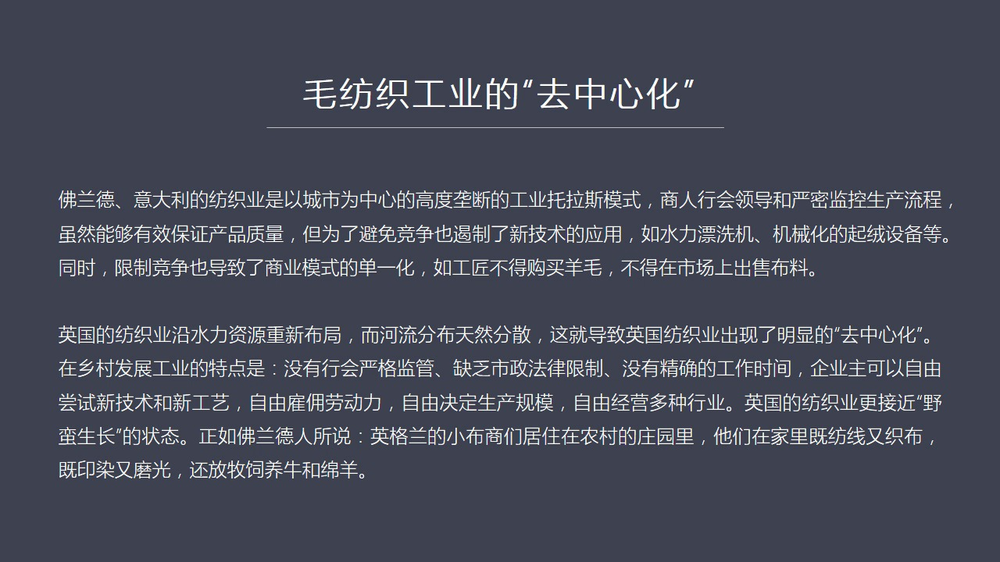

他們是城市工業這個行會相當於一個大型特拉斯工業特拉斯從生產的流程到技術標準他們什麼都管管了非常的細嚴格監視所有的人監視監督產品質量但是由於他是一個就是工業特拉斯這好比是他是個巨型的企業所以他要避免內部的競爭一致對外那麼為了避免內部競爭他就會保護很多你比如說水利票息機你要這個內部管理行會權力特別大的話...

<strong>Cleaned narration</strong>

> 他們是城市工業這個行會相當於一個大型特拉斯工業特拉斯從生產的流程到技術標準他們什麼都管管了非常的細嚴格監視所有的人監視監督產品質量但是由於他
> 是一個就是工業特拉斯這好比是他是個巨型的企業所以他要避免內部的競爭一致對外那麼為了避免內部競爭他就會保護很多你比如說水利票息機你要這個內部管
> 理行會權力特別大的話他就會拒絕使用水利票息機主要原因就是票息工那幫人不敢他們會監拒反對所以商商行會為了控制所有的人那麼如果你們有一幫人監拒反
> 對比如說啟融啟融機這個啟融草其實這個英國人已經發明了啟融機就用機械的辦法用鐵鉤針來代替這種啟融草但是在弗蘭德就不行拒絕使用這樣的話這種限制競
> 爭還有這個限制新技術限制競爭限制競爭怎麼來理解呢比如說你如果是工業你是染工就只能負責染的火你是一個什麼知工就只能負責知火你這個你不能直接面向
> 市場你不能把你的支出來步直接拿到市場上去買這是絕對絕對禁止了同時你不能去採購羊毛你沒有這個權利只能有行會有權採購原材料然後分配給工匠工匠生產
> 完了這個產品之後交給行會行會去找商人去幫你賣所以這就使得每個人都只能做自己這個事我們可以說是專業化分工但是會導致整個的它這套體系就是每一個工
> 種都變得越來越單一化所以呢它這個就使得整個這套體系變成了一個相當固化的一個工業的一個等級結構商人行會在進行頂部底下的工程永遠沒有翻生機會所以
> 這套體系它最大的問題是疆化模式單一然後這個不靈活非常疆化而英國的防止工業走上了完全不同的道路因為它是沿著河流沿著在山區重新資源進行這個資源分
> 配置它的工業中心逐漸地沿著去發展到鄉村去了而河流這種東西它天然就是分贊的在河流的上游下游全國這麼多條河所以它的工業中心就比較分贊這就是英國出
> 現了防止工業的一個去中心化了一個效應那麼在鄉村發展工業最大特點什麼呢沒有行會都是封建領主自己在生產或者是這種教會人在生產沒有一個強大的行會強
> 大行會只能生存於城市但是在分贊的農村它沒有生存的條件由於你沒有行會就沒有行會控制下了市政府市政府也會製定大量的法律法故意來故意犯你的生產在鄉
> 村也不可能那麼也沒有精確的工作時間上下班時間比如說上集中我們講到了它的比如說不露日它每個這種城市都有一個中一個中樓這個中樓主要目的就是為了敲
> 中把上下班其實在英國鄉村裡面它就沒有這些東西由於少了這麼多條條框框企業家它可以自由的嘗試什麼公義我都可以用因為沒人管我我也可以自由去故意用農
> 民來給我打工然後我也可以決定它自由決定它的工資然後我可以決定我生產多少生產什麼樣的規格然後我還可以做多種個多樣的行業就是它的企業是高度自由的
> 這點跟弗蘭格是不一樣的弗蘭格什麼東西都要管你生產的尺寸不能亂你生產的這個配料不能隨便弄然後你這個企業主如果你是職工的話你就不能再去做其他工種
> 的事如果你是商人你就不能去去從事具體的這種比如說反和染那就不能碰所以英國的這種房子也在農村發展它有點像野蠻生長而蘭德呢是重微重舉然後綁得非常
> 死所以蘭德就說英國的部商們他們在農村的莊園裡面住著他們家寄訪線又支部然後寄染光寄這個印染又拋光磨光然後童蟬藝養牛和羊還重裝養所以他們是一個多
> 元化的或者說是一種生產模式或者叫經濟模式比較複雜化的那種經營方式那麼如果我們對比英國方式和弗蘭德模式你會發現弗蘭德的這種精細分工好像是更加代表現代工業的特點

---

### Slide 16

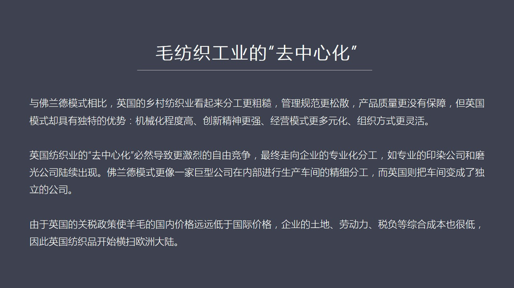

英國商分工業呢分工顯然趕不上弗蘭德粗糟管理呢規範也沒有這麼嚴產品質量應該不如弗蘭德的好這只是表面現象但實際上英國的模式它比弗蘭德模式具有著好幾個非常不同的巨大的優勢比如說它的積極化程度高因為它大量使用水力票息機這就是英國人訓練出了大量使用機械這樣的一種基本的工業化的一個思路為什麼工業革命爆發在英國就...

<strong>Cleaned narration</strong>

> 英國商分工業呢分工顯然趕不上弗蘭德粗糟管理呢規範也沒有這麼嚴產品質量應該不如弗蘭德的好這只是表面現象但實際上英國的模式它比弗蘭德模式具有著好
> 幾個非常不同的巨大的優勢比如說它的積極化程度高因為它大量使用水力票息機這就是英國人訓練出了大量使用機械這樣的一種基本的工業化的一個思路為什麼
> 工業革命爆發在英國就是它一開始就用機械而你那邊還在用手工機械化程度高這是一個非常大的優勢因為機械化程度高你效率就高你對這樣的一種現代工業的這
> 種效率和它的機械化就會有非常敏感的這種意識同時呢企業家創新精神更強因為沒人管他想幹嘛就幹嘛所以敢於創新敢於去嘗試新的工業和技術然後呢它的這些
> 精英模式也很多原話它什麼都可以幹即可一個企業家即可去從事具體的房支印染也可以去做商人到海外去賣它什麼都可以幹那麼所以它這種組織方式生產組織方
> 式就比那種精采型的等級的工業化的藍德模式要靈活而且它這種區域中心話還會導致什麼呢導致自由競爭因為藍德那個模式內部是限制競爭的而它是英國防止工
> 業內部是存在的機裂的競爭隨著這種競爭越來越激烈它就會出現一種企業分工就是企業走向專業化而藍德模式就好像一個大型的國營企業它是內部車間車間和車
> 間之間你們不要整不要競爭我們作為一個整體在市場上由我們這樣壟斷的市場就可以了所以它的內部藍德模式內部是一個生產流程的分工而在英國計劃出來是一
> 種企業比企業家為導向這樣的一個企業分工這兩者是有本質區別的也就是如果我們心想說就是藍德大型的這個國營企業而英國呢它實際上是把美島工序全部外包
> 或者把美島工序全部做成一個獨立的公司這樣的話它體系就變成模塊化生產了它這樣這種模塊化的方式組織方式就是它更加靈活所以呢我們會看到英國它後來出
> 現了大量的專業的比如說英覽公司摩光公司這就獨立出來了而藍德它們不是這麼幹的這幾個方面加在一起你會發現英國的關稅政策使英國的羊毛比國際上要低很
> 多這些鄉村鄉鎮企業它的土地勞動力稅付各方面成本都很低所以在英國生產製程品的布料它就具有這巨大的競爭優勢它也正式靠價格打垮的福蘭德和義大利的這
> 個市場去搶著它們的市場所以我們如果看下頁英國防職業最終開始成罷歐洲如果我們對比

---

### Slide 17

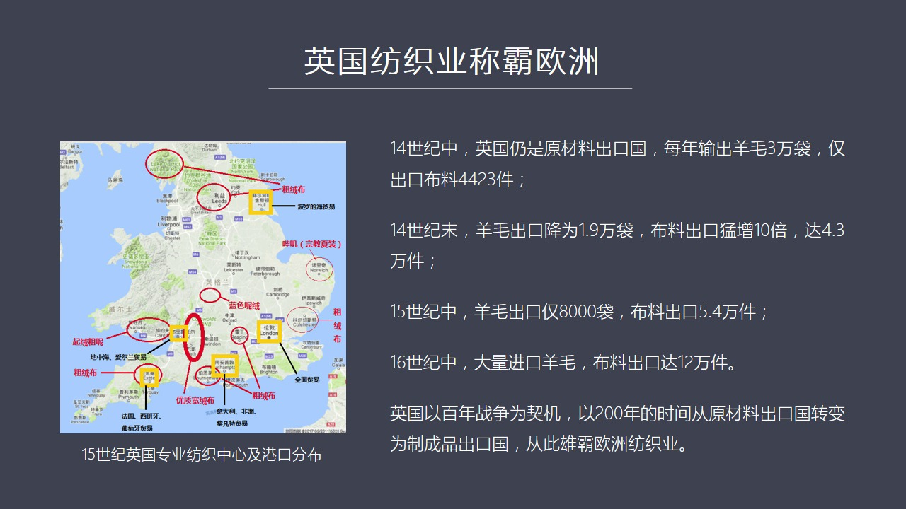

幾個數據你會看到左邊我們先看左邊那張圖左邊那張圖我專門把英國一些重要的區域化專業分工的這樣一些生產的它生產的一些產品大概列了一下比如說被迫它主要生產一種粗融步這個西部主要生產一種優質寬容步它在國際上面對消費者是不一樣的我們會看到它出現了很明顯的一種區域分工那麼在防職工業內部又存在了自由企業的競爭形成...

<strong>Cleaned narration</strong>

> 幾個數據你會看到左邊我們先看左邊那張圖左邊那張圖我專門把英國一些重要的區域化專業分工的這樣一些生產的它生產的一些產品大概列了一下比如說被迫它
> 主要生產一種粗融步這個西部主要生產一種優質寬容步它在國際上面對消費者是不一樣的我們會看到它出現了很明顯的一種區域分工那麼在防職工業內部又存在
> 了自由企業的競爭形成的企業分工所以它就形成了一種相當強的一種承認化了這樣一種運動很像中國的諸三角就是城市是一片片連在一起的不是某一個地方和另
> 外一個地方千個很遠它都是連成片的那麼這樣的話我們看到它的工業還有它的商業我用黃線畫出來黃框畫出來是它的幾個重要的港口例如說南部的倫敦當然是最
> 重要的一個港口所有貿易它都做然後還有其它的港口分別面向不同的地區面向不同的地區進行貿易有一定的專業分工所以英國的這套它是這套進化體系它也搞分
> 工但它的分工是分區域的在工業內部它是一企業競爭形成的專業化分工這個都跟那麼如果我們看最終效果你會發現在百年認真之前百年認真前後剛剛爆發的時候
> 英國當時還是個原材料出口過每年只是出口羊毛三萬代那麼出口不料是多少才四千多件四千多匹布那麼到十四十幾末就一三九幾年的時候一三九七年九八年的時
> 候它的羊毛出口就從三萬代掉到了一萬九千代什麼原因呢因為英國人開始自己房開始自己搞房子業了所以它出口的羊毛就減少了而布料你看它的布料猛增了十十
> 倍在十四十幾中它是四千多件到五十年之後它變成了四萬三千件那麼到十五十幾中就是百年認真快結束的時候英國的羊毛出口到了從一萬九千代在搖展下達八千
> 代它的布料出口達到了五萬四千件再往後又過了一百年到十六十幾中我們看到英國已經開始完全不出口羊毛還有大量全世界到處去找羊毛比如說西班牙的羊毛弄
> 進來它開始變成了一個巨大的房支工業中心它的布料出口達到了十二萬件這個時候它已經遠遠超過富蘭德和一大利地區了那些地區由於內亂由於內部的混亂而且
> 在島還有一個重要原因它們失去了英國的羊毛所以像富蘭德這個地方它再跟英國品就拼不過了那麼我們可以看到英國實際上是一百年戰爭作為一個契機用了兩百
> 年的時間從一個原材料生產國變成了一個工業的製程品的輸出國從此英國的工業開始在歐洲奠定了它的霸權的基礎那麼我們回顧這個歷史要得出什麼結論呢就是亞當斯密和李嘉賭所說的

---

### Slide 18

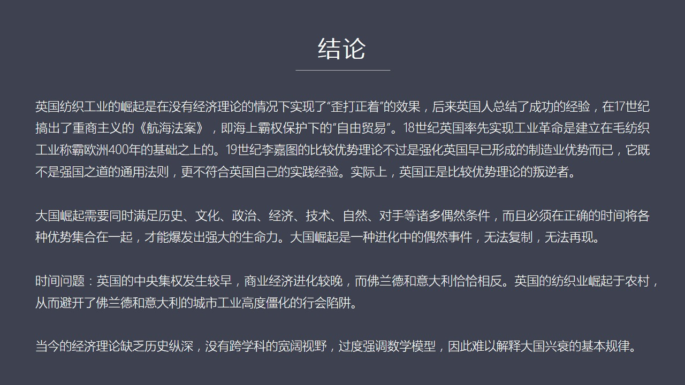

特別是李嘉賭的比較優勢理論我們看到英國並不是走著這條路他如果按照比較優勢理論來做的話他就一定是個羊羊毛的國家接著國際分工嘛那你還能怎麼辦呢就養羊吧因為這是你的比較優勢賺錢多其實你會發現英國的防止工業的崛起是當時沒有任何經濟學理論作為指導的在這種情況之下由於戰爭由於國王對羊毛出口徵稅所以它實現了一個歪...

<strong>Cleaned narration</strong>

> 特別是李嘉賭的比較優勢理論我們看到英國並不是走著這條路他如果按照比較優勢理論來做的話他就一定是個羊羊毛的國家接著國際分工嘛那你還能怎麼辦呢就
> 養羊吧因為這是你的比較優勢賺錢多其實你會發現英國的防止工業的崛起是當時沒有任何經濟學理論作為指導的在這種情況之下由於戰爭由於國王對羊毛出口徵
> 稅所以它實現了一個歪打正著的效果使得關稅很高在本國生高防職業比較划算這是一個政策之外就沒有政策但是由於國王有打仗這樣的一個需要軍費這樣的一個
> 客觀需求導致這樣的歪打正著的一種結果但是英國人一開始對這個事情沒有理解他不知道怎麼他工業就發生起來了後來怎麼明白了所以後來英國人就在十七世紀
> 推出航海法案我以前在紅官節目中專門講過航海法案和美國新蘭的崛起的時候專門講過他的航海法案要求是很嚴的所有船只能用英國船船員、
> 水手、船長必須船長必須要是英國人水手中間必須要百分多是英國人船必須要是英國或者執民地造的船外國船是一律不能進入執民地貿易體系的這是重傷主義的
> 航海法案英國是最早開始搞重傷主義的他們這個航海法案最核心的東西就是要建立海上霸權要在海上霸權之下保衛所謂的自由貿易他那時候已經獲得了巨大的競
> 爭優勢工業這種優勢已經具備了所以他向其他國家要強迫你打開市場我要給你進行這種就是槍口下的自由貿易你要不同意不同意我就用軍隊我就用海軍去摧毀你
> 的這個國家的這樣的一套防禦體系所以逼迫你接受我的戰優勢的這種複雜勞動去交換你簡單勞工你不得不跟我交換那麼英國的工業革命實際上是建立在他的毛坊
> 的工業已經在歐洲充罷了400年了沒有這個基礎怎麼可能爆發工業革命爆發工業革命也不會在英國所以這都是我們理解英國工業革命的一個重要潛體那麼19
> 世紀如果我們搞清楚的英國崛起過程我們再看19世紀立家圖所提出的比較優勢理論他這套理論實際上是在強化英國已經戰友巨大優勢的製造業了用這套理論來
> 把其他的國家進行洗腦讓你們打開打開國門不用我用艦隊去敲你要不打開我就用艦隊去敲你的門對吧 闖開你的大門比較優勢理論是洗腦你自己把你們打開最好
> 你要不打開我的艦隊就過去幫你打開他的主要目的最終的目的是什麼呢就是使英國的製造業優勢更加強化所以他們提出了英國這個理壓圖他們提出的比較優勢貿
> 易理論是不符合英國本國的事件的所以它不是一種強國之道不是強國之道的一種普遍法則更不符合英國自己的事件那麼從本身來看英國自己就是比較優勢理論的
> 判斷者它不是遵守這套理論崛起的而我們今天在談到比較優勢理論的時候你看到理論界仍然在爭這個問題大家都覺得你只要符合理壓圖這個比較優勢理論我們就
> 應該發展起來其實你會看到真正按著理壓圖這種搞法來發展的國家基本上沒有成功的先例因為你在競爭中你永遠是保母你永遠養養你怎麼可能發展你的往往這工
> 業呢久而久之你這國家就會越來越做的工作就會越來越簡單你就被壓扁了人家就會越來越複雜所以這就形成了中心區和邊緣區的巨大差異像東歐和西歐這種差距
> 一旦在十三世紀開始出現十四世紀開始出現定型它一落後就是五六百年你就沒有機會翻身了那麼我們在探討這個英國的模仿工業崛起主要目的是要明白大國崛起
> 的一些基本原理我們現在說的大國崛起往往是很多很多人提出就是我們只要符合自由市場經濟符合市場理論我們就自動會崛起有人說比如說產權理論我們只要有
> 個產權神聖的保護我們就能自動崛起其實我們通過英國的這個實際的案例你會發現大國崛起需要很多條件必須要同時滿足歷史的文化的政治的經濟的技術自然的
> ...

---

### Slide 19

<strong>Cleaned narration</strong>

---
