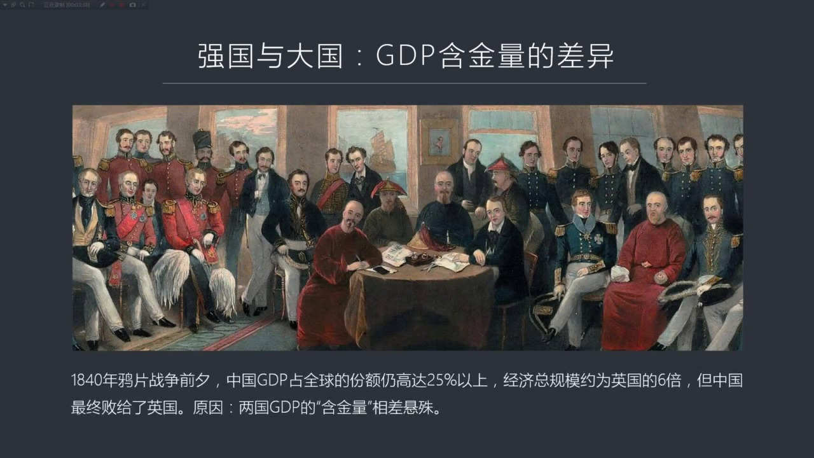
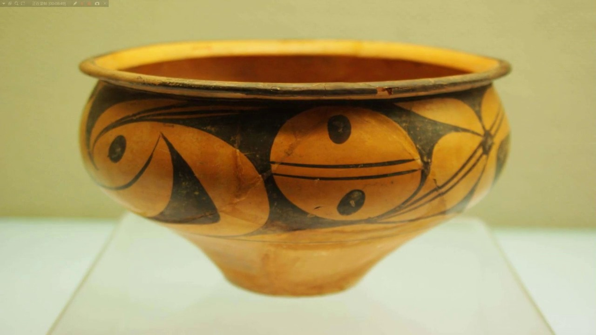
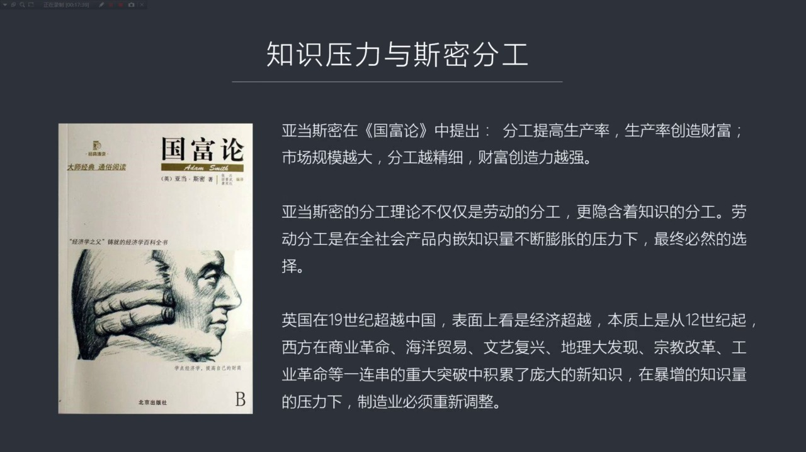
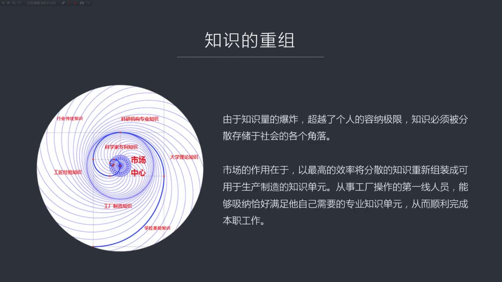
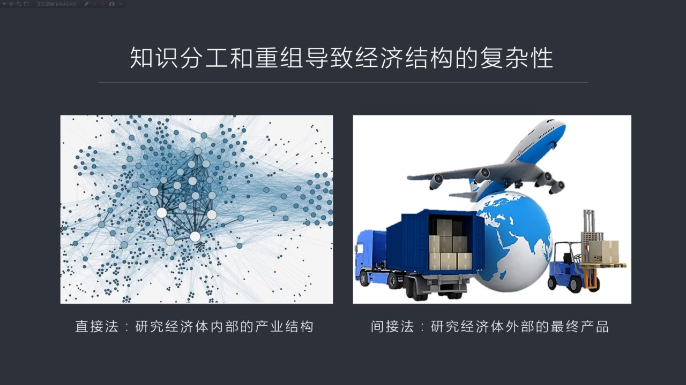
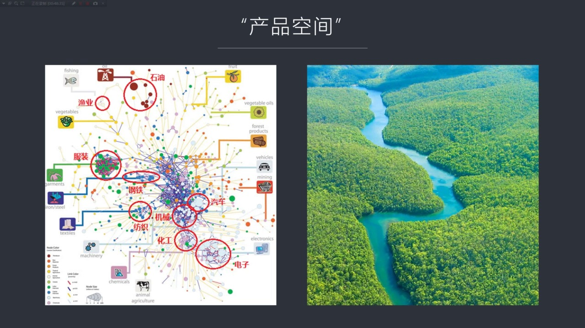
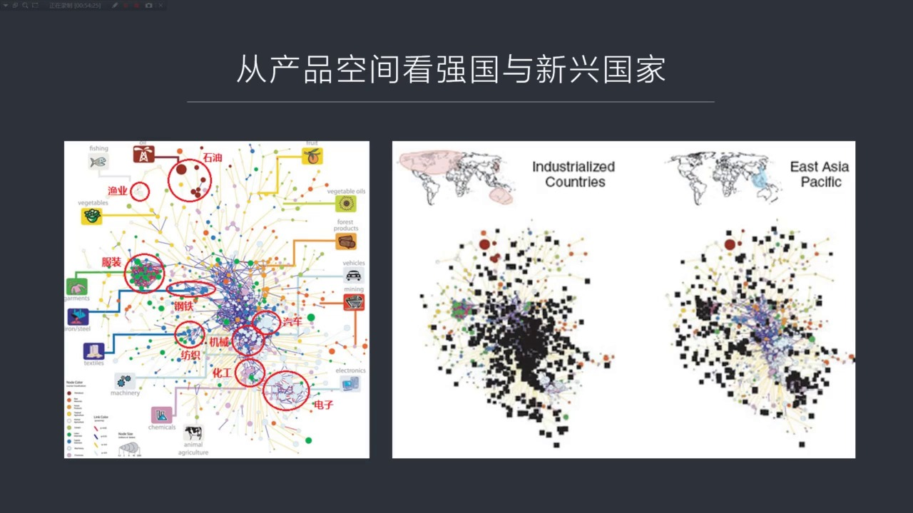
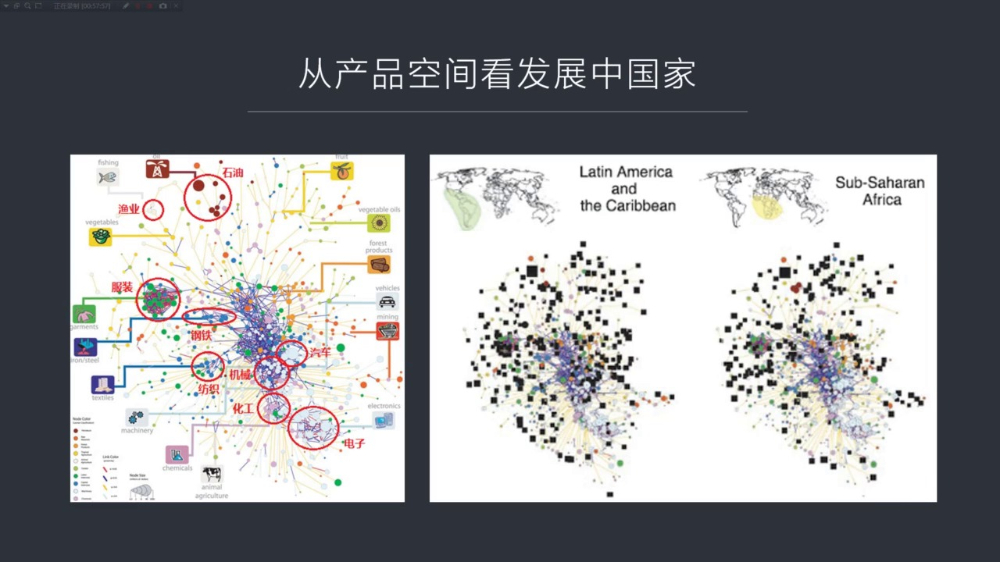
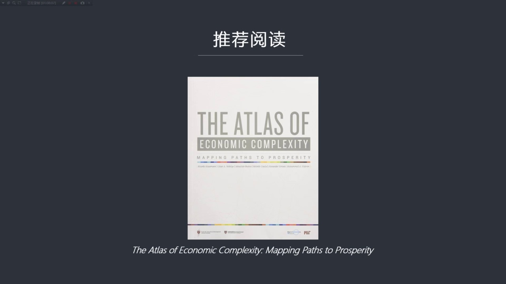

# 核心课视频-014.经济复杂性（一） — Clean Slide Notes

> **来源**：鸿学院核心课程  
> **幻灯片**：22 张

---

### Slide 1

经济复达性的第一部分我记得我们在去年的十二期课程中有一期专门谈到过市场的宽度和它的深度就是广度和深度 这两个概念我们一般认为市场就是规模越大越好其实你会发现市场的广度和它是深度并不是一个概念我当时用的是动理萨糊和背架糊这两种糊的类型做了一个类比动理萨糊就是在剑不摘了它的深度比较浅它在哭水机大概只有一...

---

### Slide 2

比如说当时的中国和英国经营对比的话你会发现中国在1800年前后吧中国按着GDP测算的话它的总的经济规模仍然达到了世界的30%左右接近1%即便是到了压骗战争前期投失年吧中国的经济总规模占全球的份额仍然高达25%比现在还要高也就是说我们的GDP比英国规模要大得多是大概是英国的6倍左右但是为什么我们在压骗...

---

### Slide 3

这个我想举一个简单的例子比如说从生产制造制造业这个角度来说最早的制造业当然跟人类文明应该是同时起步的我们早就会造各种各样的工具像新时即时在就是即时在说的都是工具的问题那么大概在八千年前我们开始制造逃棄当然这个逃棄制造呢我们现在博物馆中看了个逃棄我们觉得它就是一个东西就是一个物体其实我们忽略了这个物体...

---

### Slide 4

也就是内切有知识为什么这么说呢比如说你不管造什么逃棄你是白逃黑逃彩逃还是任何一种逃棄你必须得知道它要用粘土制造而你要的这种逃棄它需要什么样的粘土到哪里去找然后你在消质的过程中你是火候怎么把握其实这知识的含量真正动手做那只是一个具体的工作而言真正比较难的是获得全部的信息全部的知识只有在这种知识指导之下...

---

### Slide 5

因为你要生产一批 英荣看起来很简单但它中间内涵的知识量就太大了比如说原材料羊毛要到英国去买英国这个林肯军的林赛羊 羊毛最好那这些染料呢你比如说什么烟织红就是地中海中间那种虫子从中间提取的染料 那得到西班牙去买你比如说八西木 要到亚利山大港去买那也是提供红颜红色眼料的一种重要的重要的原材料然后什么海水...

---

### Slide 6

福兰德的泥融那又不知道高出多少万倍了大家觉得很奇怪制造手机好像四个人都会有点生产这个找个小工厂自己就能加工就是拼嘛拼在一起就行了那是因为你能拼如果把你打回到800年前做时光穿做机穿越回去让你从头生产手机你知道这个过程会有多复杂吗因为如果仅仅从原材料来讲那就是一些金属了还有一些塑料了还有一些其他的一些...

---

### Slide 7

如果我们看下野要当私密的国富论要当私密是最早提出分工这套学说的因为在它看来分工可以提高生产率而生产率的提高可以带来财富的创造

---

### Slide 8

那么市场规模越大分工就越惊喜那么财富创造力也就越强可以说这是它的国富论的核心观点但是在我看来要当私密的分工理论虽然谈的是劳动分工其实它还有一层隐含的意思虽然它没有名说但是我们可以非常鲜面的感觉到就是背后一定涉及到知识的分工因为什么呢因为知识量越来越大你不进行分工是没有办法进行更高效率生产的也就是说由...

---

### Slide 9

就是公元一千年以前西方的社会的这种知识主要存统于生产制造方面的知识大概可以分成两部分一部分是理论还一部分是实践的制造知识理论知识大部分层于教会因为当时在罗马迪国崩溃之后所有的文化设施基本上被摧毁带进但是教会被保存下来

---

### Slide 10

因为热闷满足也是信集督教的不管他信哪教派但是对教会他一般是不才去破坏这种措施的所以教会成了知识存统的东心这种理论知识包括什么呢包括天文学包括医医学包括很多这种自然科学的一些原始的理论像压力书德德还有布拉图他们那个时代的那种知识其实是存储在败占庭的教会里面西欧教会后来把它转就是翻译过来了当然这个翻译是...

---

### Slide 11

西方基本上没有形成大规模的生产的中心也就是没有企业存在每个人都是单独的工匠一个人为一个庄园这个提供铁降服务或提供墓降服务或者提供这个手工业包括生产布料生产这个衣服等等都是工匠脑海里面的知识也就是说一个工匠基本上能够存储它这个行业所需要的生产一个产品的这种全部知识量够了那么后来由于各种各样的我刚才提到...

---

### Slide 12

比如说巴黎大学它就比较早包括英国的这种什么这个牛巾等等这些大学慢慢兴起了这个薄熙米亚的这种大学它都是起的比较早的这些大学心底之后它的主要的执能就开始从教会手中把理论知识接管过来它就成了一种知识研究的一种中心重要的理论知识你比如说大学中所提唱的三议提唱的一些音乐数学这种计算方法包括各种各样的修辞然后语...

---

### Slide 13

这就创造了更多的知识所以分工完成了在社会中的分散处存的问题同时由于专业化的处存导致了一个新的进化就是大量新知识这个彭博力有限出来那么由于出现了分工如果我们看下液这个以前一个人脑子面的全部是在社会中出现了大规模的这个离散化的趋势处存在不同人的脑子里了那么你怎么把它重组起来呢因为你不重组就没有办法进行生...

---

### Slide 14

离散 就是分散过程中当然也很重要但是从组我认为更重要因为它会在从组过程中不同的排列组和有可能创造出新的知识单元这就是我要谈到的知识单元的概念就是哈佛大学的教授就是Houseman他提出了一个基本观点就是一个人所能接受的他脑子面所能接受的最大的知识单元就是他脑子接受着一个知识单元被称之一个Person...

---

### Slide 15

那么怎么来研究这种复杂性呢我们一直以前被这个问题所困扰这个困扰地方在于你如果深入去研究经济结构内部的生产链条之间的各种比例关系

---

### Slide 16

比如说你上游要用比如说你一个生产钢铁的公司你上游得采购抵抗时下游生产的钢铁要卖给谁谁等等你如果仔细去书里这么这个数千个这种非常细的行业的话这个过程就会变得比较复杂而且很难提出一个统一的模式来进行精确的尽量这就好比是这种方法我们可以称之为直接访就是你一下专到了一个迷昏正种年去在测算在评估在全衡它的这个...

---

### Slide 17

775个产品用于出口的再加上775个可能性就是775产品中两两进行对比看它的中间的相关性具体的原理我们会在下一堂课具讲因为这个原理比较复杂要把它说透说清楚不是这一堂课所能解决的不管怎么样我们不管它背后的它用了图论也好用的是这个临接举镇也好这是我们下下堂课重点关注的内容我们这堂课关注的就是它确切实实能...

---

### Slide 18

比如说我们看左边呢为了参照我把这两段图并在一起左边这张图仍然是整个它的一个产品空间的一个比较有代表性的一个分不通右边是两个例子一个是像发大国家北美欧洲澳大利亚等等右边是这个亚太地区亚太地区不包括中国主要是东南亚这片地区它在发大国家和这种东南亚地区这种国家的结构你看右边这样图你会非常清楚地看到发大国家...

---

### Slide 19

就是中美洲和南美洲是左边产品工业右边是沙拉隐南的非洲我们可以看到这两部分有什么区别呢就是你会发现南美的产业结构比沙拉隐南非洲的这种经济构要稍微复杂一点点主要原因呢 你会看到沙拉隐南这些整个产业结构是彻底分散的基本上没有聚合在一起的它的电子工业 它的右下角电子工业这个地方一片空白基本上没搞出来仿职工业...

---

### Slide 20

你上升这个信息其他东西就有一个总数那还跟我谈什么还怎么比较其实比不出来如果我们把中国的GDP总量跟德国跟日本经济央比我们是他们的好几倍好你认为你比德国和日本更先进吗当然是情况不是这样所以我们必须要找到新的方法论来探索经济复达性的来源本质课所讲的内容和我们以后几个所讲的内容就是一种新的尝试把它定量化但...

---

### Slide 21

就要经济复杂性的地图这本书2011年出版的后来2014年从英修订他们还有网站可以观察100多国家所有国家的经济复杂度还有各种各样的经济发展潜在的一些数据如果大家有兴趣 有时间可以到他们网站上或者读一下这本书好 今天关于知识复杂性的第一部分我们先讲到这下一部分我们会讲第二堂课我们会重点讲产品空间概念是...

---

### Slide 22

---
