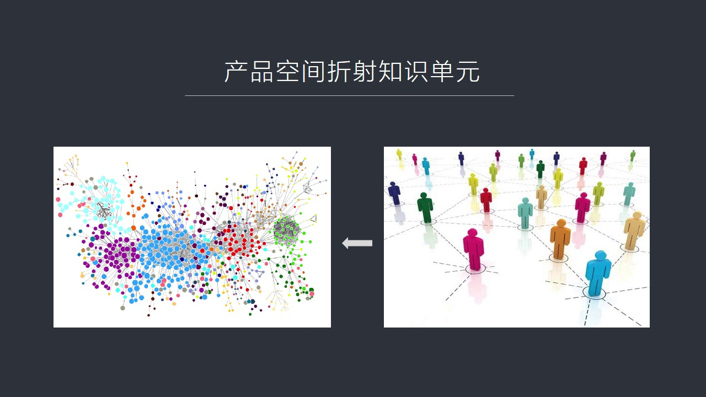
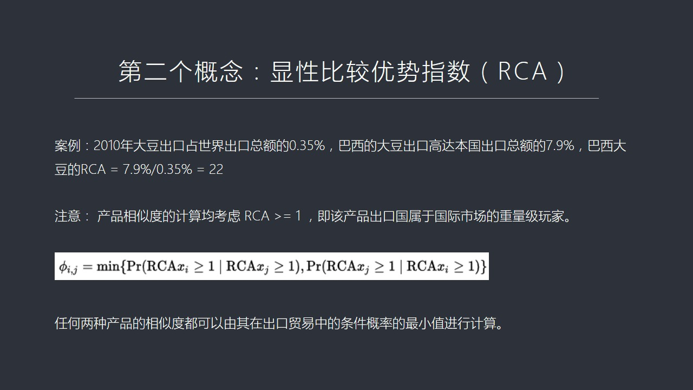
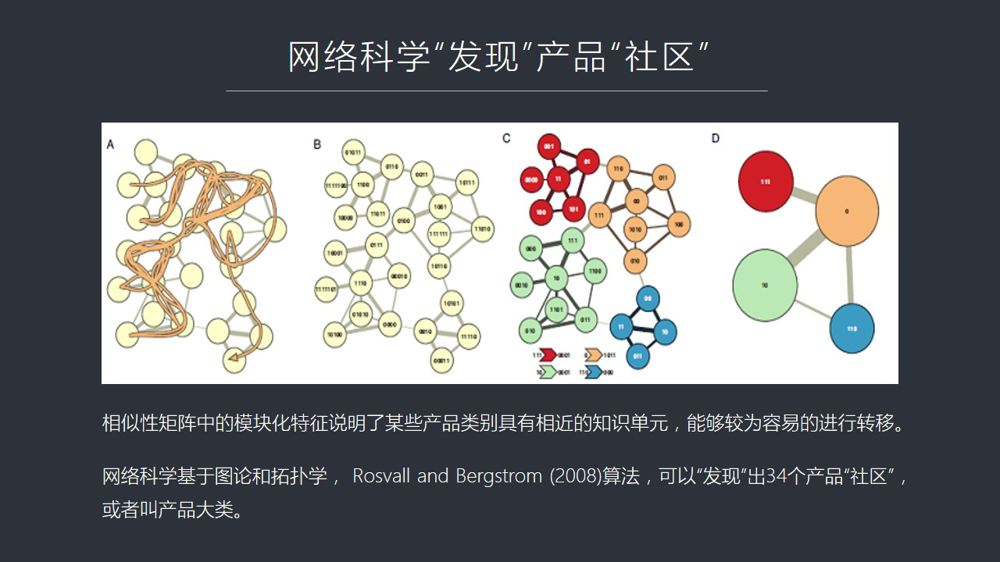
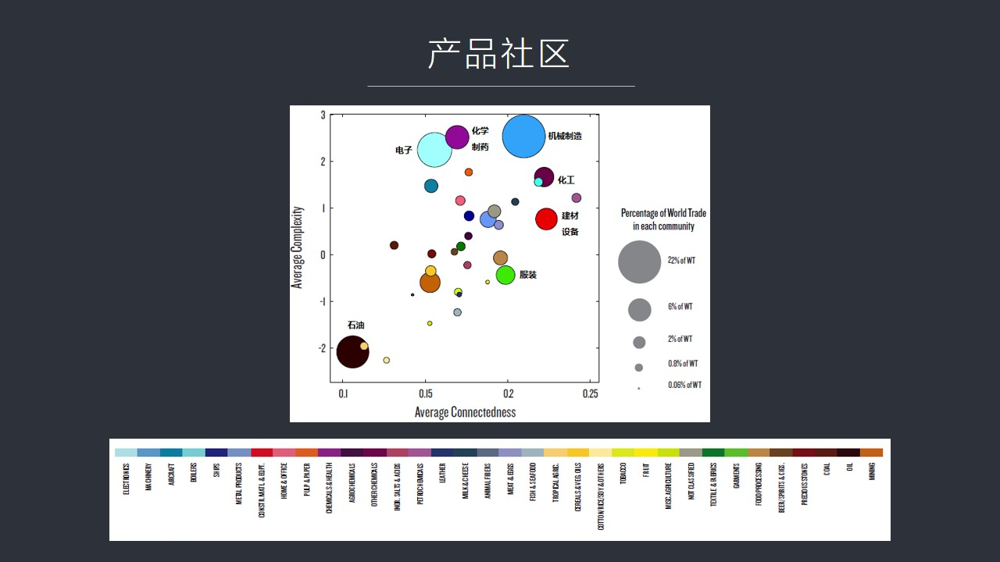
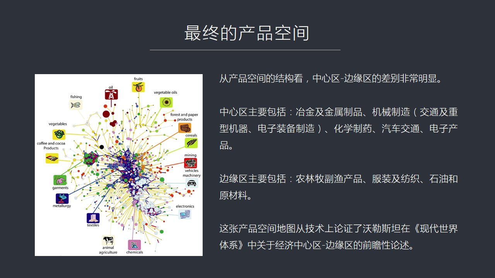
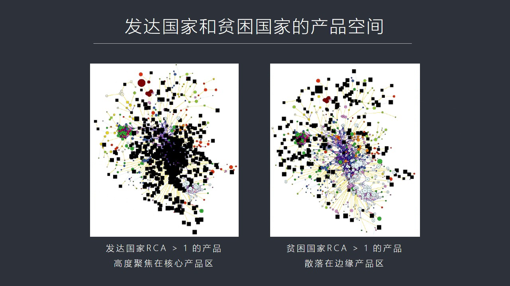
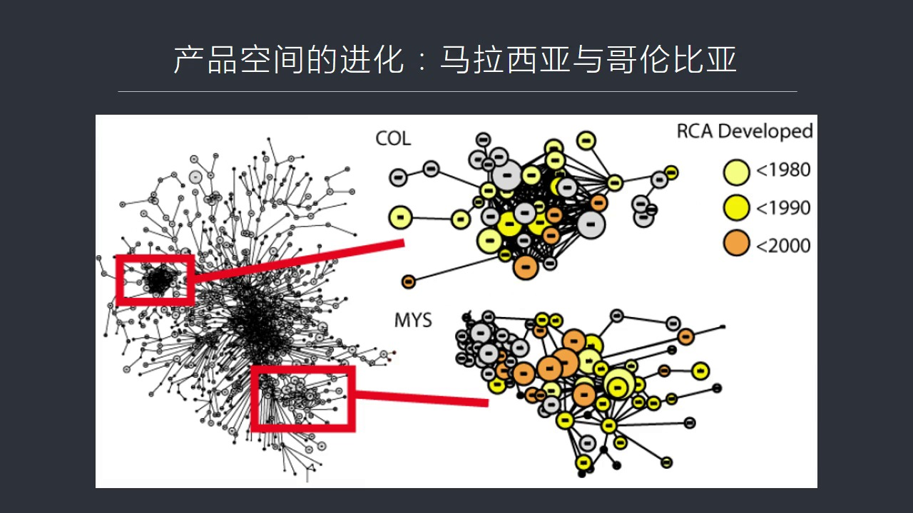
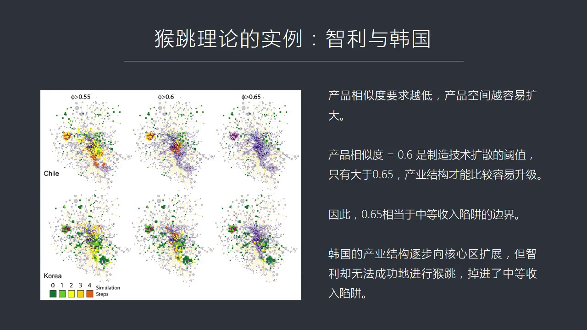

# 核心课视频-015.经济复杂性（二） — Detail Slide Notes

> **来源**：鸿学院核心课程  
> **幻灯片**：17 张

---

### Slide 1

也是我們主客的第15講產品空間如果我們看第一頁PPT在上週我們重點強調了知識在生產製造中的關鍵性的作用正是由於我們通過這個社會分布是存儲大量的這種知識並且在必要的時候能夠把他們重新組裝起來而且在重新組...

<strong>All subtitles</strong>

> 也是我們主客的第15講產品空間如果我們看第一頁PPT在上週我們重點強調了知識在生產製造中的關鍵性的作用正是由於我們通過這個社會分布是存儲大量
> 的這種知識並且在必要的時候能夠把他們重新組裝起來而且在重新組裝過程中有可能進化出新的知識單元所以我們才能夠生產製造比較複雜的這種產品那麼我們
> 如果看一些其他的國家的例子你會發現比如中東國家他在工業化時代之後一直沒有發展起來其中一個非常重要的原因就是這個中東這種國家他在社會層面上還沒
> 有能夠形成一種分布是儲藏這種大量現代工業知識和這種迅速膨脹的知識量的這套社會的教育機制還有他的存儲的機制然後也不能有效把這些分散的知識迅速的
> 高效的從足起來這是他們落後的一個根本原因而亞洲的國家 東亞的國家由於這個社會儒家文化思想的影響從來就是高度重視教育所以他在整個社會中教育的氛
> 圍非常的濃重不管是家長還是社會還是周圍的所有人都非常看重教育所以在這樣的社會中間由於他對教育這種高度的熱愛或者高度的重視所以是東亞的社會比較
> 容易形成對於知識的這種分散純粹的能力然後他們在從足的時候也能有效的形成新的知識單元所以東亞國家在工業化時代來臨之後一旦擺脫了這種農業社會的種
> 種調教困犯之後能夠發展得比較快所以我們要從知識單元要從知識單元與產品空間的這種對應關係上能夠看到其實生產背後最重要的東西是知識就是濃浩比如說
> 我們說現代的中國不能生產的很多這個東西中間比如說飛機發動機中間的重要的擔經業票或者半導體工業中間的這種高經歷度的這種芯片或者說是高經度的這種
> 速控機床等等我們不能生產和製造這些東西的主要原因是我們不掌握那些最關鍵的製造的信息或者那種製造的知識不管你是日本生產德國生產還是哪國家生產的
> 只要我知道了你是怎麼造的我有了這個知識我當然可以利用我的東西能夠把這個設備造出來或者把這個擔經業票也造出來所以這個東西表面上是看是硬件問題實
> 際上看吃軟件問題是因為你不掌握那個最絕翹的最重要的知識而你一旦掌握了這個知識掌握這個濃浩那麼你把它轉化成生產能力這是沒有問題這就是我們看到的
> 知識在現在製造業中間處於越來越重要的地位其實在歷史上知識的含量長期被我們忽視只不過現在由於動力我們不用人力了由於這個生產的很多手工的東西我們
> 用機械替代了生產過程我們用自動化來完成了這個時候知識的重要性就越來越突出而在真正的人類的發展過程中知識其實一直都是非常關鍵的組成部分那麼我們
> 在產品空間這個概念中間實際上是用它來折射就是你能生產多麼佛大的產品說明背後這個社會中所擁有的這種知識單元它的多樣性和它的獨特性所以這兩者之間
> 是可以用產品空間來折射背後的知識單元的體系這就有點像我們這個上期舉的那個例子

---

### Slide 2

樂高的這種金木模塊你手中掌握的這個模塊越多你就越能拼出越能組裝出來這個越複雜的這種產品到底是一樣的所以我們這堂課的重點就是講產品空間就是我們看這個屁屁就中左邊這張圖它到底是怎麼畫出來的上台我們只是舉了...

<strong>All subtitles</strong>

> 樂高的這種金木模塊你手中掌握的這個模塊越多你就越能拼出越能組裝出來這個越複雜的這種產品到底是一樣的所以我們這堂課的重點就是講產品空間就是我們
> 看這個屁屁就中左邊這張圖它到底是怎麼畫出來的上台我們只是舉了一個例子但是並沒有講它的原理所以今天我們重點講的是產品空間它的原理因為我覺得雖然
> 我們很多人可能對背後的原理打多少人不是很感興趣但是我覺得要把一個問題吃透要把這麼一個重要的思想把它真正理解了理解了越深入越好這就要求我們必須
> 要知道一些細節我們看下一頁在產品空間這個概念提出來之前傳統的經濟理論我覺得有相當大的決線性特別是在解釋經濟增長解釋國家游弱變強

---

### Slide 3

大國崛起和新衰在這個問題上經濟傳統的經濟理論我以前提到過它是從現性的角度從機械的角度從一種均衡的角度來看問題而這實際上根本不是真實經濟體發展的基本狀態經濟體從來就是非現性的從來就是遠離平狀態的從來就是...

<strong>All subtitles</strong>

> 大國崛起和新衰在這個問題上經濟傳統的經濟理論我以前提到過它是從現性的角度從機械的角度從一種均衡的角度來看問題而這實際上根本不是真實經濟體發展
> 的基本狀態經濟體從來就是非現性的從來就是遠離平狀態的從來就是充滿的各種變數的這樣的一個體系所以比如說我們如果用傳統的經濟理論來解釋為什麼會出
> 現生產的分工應該說在傳統理論中有三大流派用不同的方式來解釋為什麼會出現社會分工產業分工你比如說第一種理論叫經濟增長的這套理論體系他們是用什麼
> 呢增長理論是用一出效應來解釋產業分工的就是由於工業化工業化過程中會產生大量的一出效應這種一出呢是周邊的產業部門獲得了製造的能力而他們的發展又
> 是更周邊部門獲得這種能力然後逐級擴散那麼這種東西實際上在經濟學中有一個概念叫外部性當然外部性這個詞是它是比較難以理解或者說它定義的不是太精確
> 外部性就是只能你一個經濟主體所進行了經濟活動會對外部產生影響當然它有正外部性也有附外部性正的就是為周邊提供貢賢負呢呢就是為周邊帶來損失比如說
> 環境保護就是污染環境這是個最明顯的例子所以以前的經濟學家們在強調外部性的時候就其實一直沒有拿出一個有效的或者說可以定量分析的模型工具沒有而我
> 們在解釋一出的時候其實也沒有辦法解釋我們知道好像默默忽的感覺有一種一出但是怎麼來定量描述啊什麼叫一出啊它怎麼就從一個產業它的這個升級活動會帶
> 動另外一個產業呢它這個它這個帶動的具體的過程怎麼量化怎麼來理解所以呢傳統經濟增長理論是沒有足夠的這種模型也沒有足夠的這種數學工具來解讀為什麼
> 產業分工會越來越驚喜那麼第二個理論在解釋這個產業分工的時候就要生產要素理論它是從傳統的這種更傳統的思路比如說資本勞動力土地技術組織技術設施等
> 方面來解讀這種分工就是當一個因素就是生產力的一個因素發生變化那麼會對其他因其他的這個因素造成多大比例的影響其實在我看來這種思路都是嫁當斯密那
> 個時代的解釋方法就是18世紀19世紀大家由於對經濟學對概念剛剛建立起來所以使用了概念還比較粗糙想勞動力土地資本等等我覺得這都是第一代很原始的
> 一種一種概念當然它仍然很重要因為它是奠定了一種概念基礎但是你如果用定量化的標這樣這樣的標準來解讀的話這個東西就很難說了你比如說勞動力我記得我
> 以前這麼講過人力資本英國把勞動力視為一種成本而美國把勞動力解讀成一種人力資本人力資本的一個概念在經濟學體系中間它是用比如說受到教育正規教育的
> 時間你是十二年制的還是九年制的這個帶來的一個社會中人力資本的量是不一樣的但實際上你會發現用新的這種分析方法你會發現人力資本如果用正規教育時間
> 來定義的話是非常不靠譜的為什麼呢不是你受了十二年教育或者多少年教育你就一定會具有工業製造了這種特有的知識我們在這類所強調的知識單元並不是只普
> 通的教育而是專門指一個知識單元就是一個製造業在生產製造過程中能夠用得上的有效的可以操作的這樣的一種知識所以我們在以後的課程中你會看到如果你對
> 比國家發展的時候教育時間長的國家或者說是在教育上投資非常多的國家比如說乾納或者其他的某個國家你如果跟比如泰國這樣的國家進行對比的話你會發現泰
> 國的平均受教育程度或者教育時間是短於這些對教育很重視國家但是泰國卻發展出了比較複雜或者進化的速度很快而相反受教育程度高的國家或者相對時間教長
> 了國家比如說東歐了很多國家俄羅斯他反而發展較慢一個主要原因就是教育程度不等於知識單元這是兩個概念不太一樣雖然你受了12年教育你的受劣化基礎很
> 好這並不意味著你能夠迅速地掌握一個知識單元或者你能夠有機會去掌握這個知識單元這是兩碼事所以我們看到其實在傳統的生產藥素理論中有大量的如果你用
> 定量化的方向這種方法去研究你會發現大量的說法都有非常非常可質疑的地方這個我們會放到以後的課程中會逐個去分析所以我們在這裡強調就是生產藥素理論
> 它的最大的問題還是難以定量化比如說你資本增加量在多大程度上影響了技術和組織和這些東西你增加1%那邊增加1%多少很難進行統計和分析所以它也沒有
> 一個定量化分析的標準和一個結構缺少模型做不出來第三理論就是比較優勢的階梯論比較優勢是理家圖提出來的這個比較優勢中的階梯論是利用理家圖這樣的一
> 種思想體系然後它用技術發生變化作為一種外生變量然後來討論由於我們技術發展了所以發達國家把產業轉移到新市場國家新市場國家未來可能再把產業轉移到
> 非洲更落後的國家那麼這就逐級的這種技術擴散是逐級地進就像爬樓梯一樣的發達國家歐美先擴散到了就是歐美日先擴散到了亞洲斯亞龍亞洲斯亞龍在轉移到中
> 國大陸中國大陸在未來可能再轉轉給印度 印度再轉給非洲所以這像爬樓梯一樣的每個國家都有可能從落後逐步一步一步的走向先進就像爬樓梯越爬越高一樣但
> 這套理論背後它潛藏了一個重要的假設你能夠順利爬樓梯說明樓梯是連續的你才爬這上去嘛假如這個樓梯和下一段更高樓梯中間隔著一帽子遠你笨的笨不過過去
> 那還怎麼能發展呢你還能夠跳過去嗎所以它的一個重要的假設是產業結構它是連續性的這個階梯是連續性的任何一個國家都有機會從最落後發展到最先進實際情
> 況當然不是這樣你會發現為什麼有中等收入陷阱這個概念就是有些國家發展到一定程度之後再也賣不上去了他們在從這些樓梯往更高的樓梯上蹦了過程中中間距
> 離過大掉下去摔死了這個就是比較優勢的階梯論它存在了一個比較大的問題就是你的假設是不成立的產業結構的發生不是連續的這個樓梯不連續所以呢我們看到
> 傳統的三大經濟理論三大派的經濟流流派了在解讀為什麼產業分工為什麼會有這個經濟發展經濟增長然後這種增長是什麼因素帶動了什麼因素產生了影響在解釋
> 這些問題的時候都不太有效那麼怎麼才能夠有效的建立起這個產品或者叫產業結構的這種空間圖我們在這裡用產品空間來表達這個概念這需要有一些新的理念和
> 新的計算方法我們看下一頁我在這裡會談到第一個我們談到第一個重要的概念叫產品相思度這個概念非常關鍵什麼叫產品相思度它背後原理是什麼呢它原理很簡
> 單假如一家企業能夠生產趁山而它這家企業擁有相對應的生產趁山的這個人類資源也有技術儲備資本也有土地也有技術然後也有它生產組織管理的它自己的方式
> 還有自己的銷售渠道就是整個保證生產的這個組織體系是完善的應有知識應有技術儲備應有設備什麼都有所以它在這種情況之下能夠生產趁山假如有一天它進行
> 企業這個產業的轉變它想生產酷子有問題嗎基本上沒有問題因為它的人才的知識結構和它組織體系生產趁山跟生產酷子非常相近所以這樣的工廠很容易從生產趁
> 山轉向生產酷子就是趁山和酷子這兩種產品的相似的程度非常的高那麼再遠一點比如說生產床梁呢這個雖然床梁跟衣服酷子有點差異但是差異不是特別的大都是
> 對面料對布料金加工所以它生產設備知識儲備基本也夠用所以它如果生產床梁可能性也很大就是這種知識單元能夠在不同產品體系中間進行比較有效的轉移生產
> 趁山的知識單元比較容易轉移到酷子上生產酷子的這種企業的知識單元也不太難了因為它要生產床梁上所以呢這種相似度我們可以作為一個重要的概念來計算來
> 見解的替代我們所說的知識轉移這個問題來替代產品結構這樣的一個概念我們所說的兩種產品的相似度它在很大程度上標誌著一個產業能夠在哪些部門能夠進行
> 升級或者轉型而且在這個層面上它的連續度是比較高的那麼怎麼來計算這個產品的相似度呢當然這又是一個比較複雜的概念比如說兩個產品生產衣服生產酷子這
> 兩個知識單元相近到什麼程度怎麼來評估在這裡我們要用一種見解的計算方法直接評估很難定量或者很難把它用數據來表達出來如果我們換個思路來見解計算怎
> 麼來見解計算我們用一個國家能夠出口的產品比如說一個國家能出口趁山我們就假設

---

### Slide 4

它如果能夠出口趁山它就一定能夠基本上也能夠出口酷子所以我們在這裡借用這個概念可以得到一種刻著能性的判斷假如我們在一個國家出口產品系列中看到它生產的趁山那麼我們就大概能夠推算出它有多大的概率能夠也出口酷...

<strong>All subtitles</strong>

> 它如果能夠出口趁山它就一定能夠基本上也能夠出口酷子所以我們在這裡借用這個概念可以得到一種刻著能性的判斷假如我們在一個國家出口產品系列中看到它
> 生產的趁山那麼我們就大概能夠推算出它有多大的概率能夠也出口酷子所以這裡面要引用一個概念叫條件概率條件概率就是這個概率P是多大呢就是當你能夠有
> 條件這個在某一種條件上比如說你能生產趁山在這個公式中我們用B如果你能夠生產趁山的話那麼你能夠出口趁山那麼你出口酷子在酷子中比如說我們用這個公
> 式就是A就是你生產B的你出口B的前提之下同時也能出口A的概率是多大用這個概率來間接替代產品的相思度這是個比較間接的方式但是它比較巧妙我總是用
> 最終的結果來判斷它內部的這種相思性而這種相思性太復達難以用普通的數學公式來表達這個概念就有点像我們個人所說的產品空間去間接折射知識單元是一個
> 道理我總是從最終的結果來判斷在產品空間中我是用你能造什麼產品來折射代表你有多大知識量多少個相應的知識單元在這裡產品相思度我是以你出口產品那麼
> 你最後你也能出口產品B的概率來替代這兩者的這樣的一種這個相思性那麼為什麼要用出口呢為什麼我不用本國生產在本國銷售呢因為各國家統計標準不一樣在
> 國際報義理論中出口體系它統計是很標準的任何一個產品都有它的編號都有它的分類然後它出口的滿足國際上出口的這種標準它是一種高度標準化的這樣的一種
> 產品體系所以用它來做測算比較的準確不容易產生這種混銷這是一個原因還有一個原因就是我們如果把一個國家生產的產品作為一種輸出那麼另外國家比如說某
> 個國家生產原材料輸入給另外國家加工製成品然後再組裝然後再完善等等這是個整個全球它是一個鏈條所以你通過研究出口你計算就能夠把各個國家相關性做一
> 個比較有效的體驗這就是為什麼我們要選用出口產品那麼如果我們具體算一下假如咱們根據一個2008年葡萄酒和葡萄這兩個相關產品它們大概有多少相似度
> 我們可以從出口這個數據統計中找到和計算出來那麼如果我們看到有些國家能夠生產葡萄那麼我們可以判定這個國家能夠生產葡萄酒都用於出口它的概率也是很
> 大的大到什麼程度呢這要算比如說2008年全球有17個國家出口葡萄酒然後有24個國家出口葡萄其中有11個國家是記憶生產葡萄又生產葡萄酒兩個都出
> 口所以這11個國家由於兩者監被我們用這11個國家作為一個計算的標準就是葡萄和葡萄酒的相似性怎麼來算呢就是在這11個國家裡面在除以24就是11
> 除以24等於0.46這個0.46的意思就是某個國家出口葡萄酒的時候它另外出口出口葡萄的時候它另外出口葡萄酒的概率是這麼大所以這是一個間接替換
> 的一個計算方式有了產品相似度可以說這是整個產品空間最重要最核心的一個理論基礎那麼有了這樣一個概念之後我們再看第二頁下頁就是第二概念第二概念是
> 什麼呢就是顯性比較優勢指數而Ca這是國際貿易中間經常用的一個指數

---

### Slide 5

它也是基於這個理家圖的比較優勢學說就是某一個國家生產和出口的某一個產品在世界份額中世界貿易這種這個份額中它的地位怎麼樣這個它的公式呢就是我們看了這個公式下面這個公式它是什麼意思呢比如說從這個RCA的這...

<strong>All subtitles</strong>

> 它也是基於這個理家圖的比較優勢學說就是某一個國家生產和出口的某一個產品在世界份額中世界貿易這種這個份額中它的地位怎麼樣這個它的公式呢就是我們
> 看了這個公式下面這個公式它是什麼意思呢比如說從這個RCA的這個公式來看就是某一個國家出口某一種商品而這個商品它在本國的出口額的總額中間佔一個
> 什麼比例然後再把這個商品在全世界的出口貿易中間所佔的這個比例進行對比如果這個RCA大於一說明這個國家具有著非常明顯的顯性比較優勢小於一就說明
> 它沒有如果用一個具體的例子就是比如說我們看2010年大豆大豆出口大豆出口全世界這個大豆貿易總額

---

### Slide 6

就是大豆佔世界全部出口貿易的總額是多少是0.35大豆這個貿易比較小全世界的貿易計賣汽車又賣飛機的還有各種電子元氣件所以這個世界貿易的規模很大大豆在中間佔了比例很小只有0.35這是一個概念另外就是巴西這...

<strong>All subtitles</strong>

> 就是大豆佔世界全部出口貿易的總額是多少是0.35大豆這個貿易比較小全世界的貿易計賣汽車又賣飛機的還有各種電子元氣件所以這個世界貿易的規模很大
> 大豆在中間佔了比例很小只有0.35這是一個概念另外就是巴西這個國家它的大豆出口這巴西主要生產大豆它的大豆出口的額佔它本國全部的產品出口額的比
> 例是多少呢是7.9就巴西這個國家它在全部出口貿易中間有7.9%的屬於它的大豆好這個時候我們看到在世界貿易中間大豆的比例才0.35非常低而在巴
> 西這個國家大豆它的出口貿易中它的比重高達79%這就說明巴西這個國家在大豆這個行業中間具有著非常強大的比較優勢它佔得分個太高了遠遠高於大豆在世
> 界貿易中所佔了個比重我們可以定義巴西在大豆上具有著佔有著這種非長歸的份額在世界貿易中擁有一種強大的非長歸的這樣一個佔有份額所以這個RCA是怎
> 麼計算呢就是巴西大豆的出口的這個份額比如說7.9%除以在世界貿易總量中大豆所佔的比例比如說0.35RCA最終是多少呢22倍遠遠大於1遠遠大於
> 什麼概念呢遠遠大於1就說明巴西這個國家在出口大豆上具有著極其明顯和非常強大的比較優勢所以我們如果把這個概念跟剛才我們所說的產品相似度這個概念
> 結合在一起我們要專門強調一點在計算出口產品相似度的時候比如說普到9%有11個國家生這個能出口我們重點強調的都是這11個出口普到9%的國家它的
> RCA都是大於和等於1的換句話說這11個國家都是世界普到9%出口貿易中間的重量級了玩家如果有些國家也生產普到9%但不出口你像我去過了亞敏尼亞
> 亞敏尼亞它是最早的普到9%生產技術的發明者8千年前就沒有普到9%了但這個國家你在國際上看不到亞敏尼亞的普到9%第一是它的產量可能不足第二是它
> 可能不善於做廣告不善於做貿易所以它的普到9%基本上都內銷都在國內就消費了這樣的國家雖然它有普到9的品牌它也生產普到9%但它不出口所以在我們所
> 統計過程中這種國家它由於不是國際貿易的重量級玩家就不計算進來根據這兩概念相似度還有這個比較優勢指數RCA我們大概就能夠提出一個公式來計算這個
> 相似度這樣一個兩種產品的相似度它這個表示方法就是用希臘字母這是底下這個公式希臘字母這個Find來表明這個Find底下有個i和i這什麼意思呢就
> 是在生產如果你出口產品界那麼你同時也出口產品i它的概率是多少它這個表達公式中間我們看到了兩個它實際上是一個取概率取最小值的意思就是假設你生產
> i和界的這個RCA比重都大於1那麼你在出口界的同時也出口i的概率是多大PR代表概率然後你如果出口i同時你出口界它的概率又是多大就是它是一個它
> 是一個相反的過程就是你出口PR同時也出口PR它的概率算出來一個那麼你出口PR同時還出口PR這又是另外一個概率這兩個產品我先用i來算界再用界來
> 算i兩概率算出來之後我取最小值取最小值的代表這兩種產品的相似度這就是這個公式表達的意思那麼有了這個公式之後我們就可以開始構建整個產品的一個它
> 的一個巨大的舉證這是下頁我們看到的由於全世界出口產品很多如果我們對其中

---

### Slide 7

最主要的產品進行統計你會發現這種任何一組任何兩個產品之間都可以去算它的相似度這種產品比如說我們選775個全世界所有的出口產品中775種產品每一種產品比如說a產品和b產品這兩個我可以算出一個相似度來那麼...

<strong>All subtitles</strong>

> 最主要的產品進行統計你會發現這種任何一組任何兩個產品之間都可以去算它的相似度這種產品比如說我們選775個全世界所有的出口產品中775種產品每
> 一種產品比如說a產品和b產品這兩個我可以算出一個相似度來那麼a和c我又可以算個相似度a和d也可以算出個相似度但是b和c也能算c和d也能算所以
> 它會列出個巨鎮這個巨鎮就是哈佛大學和MIT的兩位教授他們做了一個利益年國際貿易的統計數據國際貿易所有的出口產品的類別出口產品的這個它的數額這
> 都有標準化的統計他們就列出個775這個巨鎮就是說你的行和列中間都是775個產品從a到1到775這邊呢這是行列也是從1到775然後在它箱就是1
> 和1所對應的小方塊中間1和2所對應小方塊中間我算產品1和產品2它的相似度1和31和41和52和12和42和53和1它就是按著這個巨鎮的方式來
> 計算最後算出的是一個巨大的規模龐大的一個產品相似度的一個大型巨鎮這個巨鎮呢你會發現它並不是像我們想像的就像這個比較優勢的階梯流震所想像的樣它
> 是一個連續的你從這個產業發展到另外一個產業是不尖斷的你會發現它是尖斷的是模塊化的中間有些產業比較容易轉移有些產業是很難轉移的就是當你生產趁山
> 的時候你基本上就是一個生產趁山為主的一個國家你如果算它生產出產這個出口飛機概率極小這中間是一個巨大斷層的相反像比如說這個東南亞國家馬來西亞它
> 出口電子產品但是它卻不能出口高金間的速控機床美國呢它可以出產這個可以出口飛機它也可以出口騎車它也可以出口糧食它可以出口很多很多東西所以你會發
> 現發達國家和不發達國家在這個產品巨鎮中間它戰友比重是不一樣的就是發達國家幾乎所有類別的產品它都能出口而不發達國家只能出口產品巨人中的一部分所
> 以它這個概率如果按照這個模塊畫我們來重新組織一下的話你會看到A和B這個B就代表了對這種對這種產品巨鎮進行調整之後你會發現它的相似度體現出這個
> 高度的模塊畫的這麼一種趨勢這種趨勢呢它表明大多數商品大多數產品出口產品它們之間的相似度是很低的就是知識單元很難從一個產業轉移到另外產業65%
> 的產品之間相似度不超過0.2%不超過0.2%0.2%是個很低的一個數你會發現也就是說65%的商品它這個知識單元主婉儀的概率是非常低的除非你是
> 在衣服和褲子這麼相近的領中比較容易轉移但是衣服和汽車之間這個相似度就太低了那麼我們有了這個巨鎮有了大量相似性的這樣的一種數據之後關鍵是怎麼才
> 能夠有效地把它展示出來有了數據在展線方面它還是有相當的這個技術難度的這是我們看到下野在一個巨鎮中間我們有大量相似性的數據775乘以775這麼大規模的數據

---

### Slide 8

怎麼才能夠從中發現它的內在性的規律呢這就要涉及到網絡科學了這個網絡科學不是我們指的計算機不是簡單的計算機網絡而主要的這個我們在這裡用到的是圖論特補學它的一些基本的理念這個是專門研究在一個圖中或者有很多...

<strong>All subtitles</strong>

> 怎麼才能夠從中發現它的內在性的規律呢這就要涉及到網絡科學了這個網絡科學不是我們指的計算機不是簡單的計算機網絡而主要的這個我們在這裡用到的是圖
> 論特補學它的一些基本的理念這個是專門研究在一個圖中或者有很多網絡節點它在中間的一些相應的規律比如說著名的克尼斯堡的七橋的這樣的問題還有四色用
> 四色會地圖這個問題這都屬於圖論和特補學研究範圍那麼我們要做的是在775乘以775這個相似性的大決戰這麼多數據中間要找到要發現要用這個網絡科學
> 的這種理論體系去發現中間最密密集的那一團我們可以稱之為是個產品的社區這個產品社區怎麼能夠從數據中發現出來呢因為我們知道有些有些類的產品它相似
> 度比較高比如說生產服裝的相似度就很高生產電子類產品的相似度也很高生產金屬類的機械類的還有其他農夫業的就是我們腦子那有一個概念這些東西相度是比
> 較高的但是我怎麼才能從數據中把它挖進出來呢這個就要用了很多算法在左頭中我列出了有一些有意思的算法就是用特補學圖論中間去快速尋找在一個數據群中
> 間去發現那些最密集的地方簡單說就是你比如說我們看左邊那樣圖它就是一個忙走程序假設有個機器人它就隨機的瞎走在一個網絡節點中隨便的瞎走你會發現它
> 走著走著走著變速多之後它會成年出一種規律你比如說在這個網絡中有些產品煙酒茶糖它會發現這煙酒茶糖這四個東西老是出現在一起出現在順序有時候是煙在
> 前有時候是酒在前有時候是煙在前但是這四個東西基本上是連續出現的所以它走的隨機這個走這個網絡次數多了之後走這幾點次數多之後它就知道原來這四個家
> 伙是一火的這時候它就給它一個名字比如說程序煙酒會假設這是個名字的話那麼它在下次的時候它就會把這個東西當成一個集團當成一個社區來考慮然後它接著
> 走然後再接著不斷地用這種方法去逐漸找到我們看到從ABCD你會發現一開始這個路徑非常的繁燧信息量太大到了B就簡單多了它就慢慢找到中間的一些社區
> 的規律了到了C它就已經把它打上不同的顏色用不同的名稱來稱呼它們到了地它就已經把社區給體驗出來了它就不用再走其它地方它就知道它們是一火了所以我
> 用紅色代表一個東西對黃色用藍色用淺藍分別代表一個很複雜的數據空間中間的某一個社區正是用網絡科學的這種理論體系和算法我們可以在這些數據之中發現
> 有34個產品的社區這個產品社區我們可以稱大類的或者一個產品大類是能夠被找到的有了這個產品大類的概念

---

### Slide 9

我們就可以得到下面這張圖就是第二頁它就是個產品社區的一個圖就可以畫出來34個產品大類這34個產品社區我們可以用不同的顏色把它標準出來在這張圖上你會看上面那張圖上它的分布是按著比如說它的連通性它是它的橫...

<strong>All subtitles</strong>

> 我們就可以得到下面這張圖就是第二頁它就是個產品社區的一個圖就可以畫出來34個產品大類這34個產品社區我們可以用不同的顏色把它標準出來在這張圖
> 上你會看上面那張圖上它的分布是按著比如說它的連通性它是它的橫作標重作標是它的代表它的輔達性輔達性我們下列課在專門去講然後它一塊的大小代表它在
> 世界貿易中的總的比例就是販額那麼從這張圖上我們可以看到比較有意思的一個規律比如說機械製造專門製造機器的這個行業它是靠上的比較靠又了而且規模很
> 大這說明機器這個行業機械製造或者叫機械工業在整個出個貿易中所佔的販額非常之大而且它的連通性很強輔達性也很強到底很簡單就是任何東西都跟機器有關
> 都是機器製造的所以它的出口的規模和其他產品的相關性是非常大的就是跟其他產品的這種連通性是非常大的這是機械製造那麼同樣規定的像電子還有化學製藥
> 還有化工這幾個都是比較重要的建材和建築業的這種設備服裝等等最有意思的是它左下角這個石油我們看到石油很孤立它的連通性比較差它的輔達度也很低那麼
> 這個石油但它的份額比較大所以它做一個大黑塊放在底下有了這種產品設計的概念之後對我們來說最重要的理念就是我可以給不同的產品這個在不同的產品貼上
> 一個顏色的標籤比如說你要是接製造我就可以把你繪成藍色的你要是石油就是黑色的你要是建材色位我就給你塗成紅色了這樣的話有利於我們在用圖形展現用這
> 種可實化比較強的方式數狀結構去展現產品空間的時候你用顏色就可以進行區分了這個是一個比較方便的一個產品分類和它的顏色標籤有了這些基本的東西之後我們再看下眼最後我們就可以做出產品空間的圖了

---

### Slide 10

這個產品空間的圖我們在上堂課中講過我們從這張圖上可以看到非常有意思的現象這個現象就是說中心區任何一個國家產業的中心區和邊緣區差異性是非常明顯的一個國家產業中心區全部集中在中心部分中心部分非常的密集邊緣...

<strong>All subtitles</strong>

> 這個產品空間的圖我們在上堂課中講過我們從這張圖上可以看到非常有意思的現象這個現象就是說中心區任何一個國家產業的中心區和邊緣區差異性是非常明顯
> 的一個國家產業中心區全部集中在中心部分中心部分非常的密集邊緣區它就在4週它聯通性比較差這種中心區主要包括什麼樣的產品比如說金屬類的機械類的就
> 是比如說機器這個機器又分成重型機器和電子裝備生產半導體這種機器還有速空機床等等這是機械製造這是一大塊化學製藥汽車還有交通類的這種產品包括電子
> 產品這就構成了一個國家產業中心區比較密集的這樣的一種圖星結構邊緣區邊緣區產品我們會看到主要是農民墓富裕的產品佛達度比較低的聯通性比較差的還有
> 服裝房支這都是屬於初級產品還有簡單產品還有石油和原材料所以從這個產品空間圖裡面我們已經可以非常明顯地看到了原來在一個國家內部產業結構是分成中
> 心區和邊緣區的從這一點我們可以聯想到中國的每個省哪些省算是中心區哪些省算是邊緣區很簡單能夠生產非常複雜的機械然後化學製藥這些金屬類的汽車它一
> 定是處在中心區的換句話說重化工比較密集的地區還有一些地方比如說中西部的比較偏遠的地方它只能生產一些服裝一些農民墓富裕這種簡單產品就屬於邊緣區
> 那麼這張圖如果放的全世界範圍來看我覺得它就比較直觀的驗證了這個俄羅斯坦在現代世界體系這本書面提出來的世界進行了分化就在15世紀十六世紀的時候
> 世界就已經出現了分化進化出了中心區像西歐和邊緣區像東歐這種中心區邊緣區它這種理論的預見性是非常強的其實一直到今天我們看到幾個世紀以後世界一直
> 是出在中心區和邊緣區這兩種態勢之下它有一種概念叫半邊緣區半邊緣區有可能未來上升到中心區也有可能墮落到成潤到邊緣區以前我們是有這種概念但是我們
> 沒有進行數量化的定量化的分析也沒有一種直觀的用這種這種網絡科學的手段把它展示出來誰跟誰的相似度是多大誰跟誰的聯通性有多強聯通性它是用中間兩個
> 接點之間的這個這個連線不同顏色的這種線來代表它的聯通度顏色越深說明聯通度越強它代表了某種進化的路徑所以這張圖可以說給了我們研究一個大國它的崛
> 起新衰非常重要的直觀的一個工具而且它的背後的邏輯性是相當強大的有了這張圖之後我們可以利用這張圖做一系列的這種分析比如說我們看下野下野中你會看
> 到左邊這張圖是發達國家的這種它出口產品中而Ca大於1的產品而Ca大於1就是它出口的份額特別大

---

### Slide 11

這種在世界貿易中它佔有超俄的比例那麼發達國家你會看到這些小的黑方塊就代表著發達國家在整個它的產業產品空間中它所居於的地位你會發現原來發達國家出口產品中間反而Ca大於1的重量級在這種產品中間它們的在空間...

<strong>All subtitles</strong>

> 這種在世界貿易中它佔有超俄的比例那麼發達國家你會看到這些小的黑方塊就代表著發達國家在整個它的產業產品空間中它所居於的地位你會發現原來發達國家
> 出口產品中間反而Ca大於1的重量級在這種產品中間它們的在空間結果上高度密集在中心區也就是發達國家主要出口這種中心區的產品像汽車這個機器像這個
> 化工像這種重要的這種設備之類的它們都集中在經濟產品空間的中心區也就是它們出口是高付加值的以前我們有這樣的概念但是你沒有親眼看到你腦子內沒有一
> 個直觀的圖像也沒有數據分析而現在我們第一次有了一個強大的一個數量分析的這樣的一種工具和圖形展示了這樣一種手段所以你會看到發達國家和步伐達國家
> 屏幕國家之間的這種差別是一幕了然的如果我們看右邊這張圖這是薩哈拉以南的這些國家的出口產品密集度你會看到這些國家主要的出口的這些產品主要分佈在
> 產業空間的邊緣區中心區幾乎沒有它們生產不了汽車生產不了飛機生產不了這種大型的機械和機器設備也不能生產化工產品甚至來電子產品也生產不了它們能生
> 產什麼呢奴隆木附於就在周邊的還有這個左邊一塊綠色比較集中的地方防止業就是服裝業服裝業是比較簡單的這種勞動不需要太多的支持單元所以它們能夠發展
> 一點點這個服裝業但是主要的核心的這種產品空間中間的高負價的產品啥也生產不了這就是發達國家和發展中國家屏幕國家從產品空間這個角度來看一幕了然發
> 達它為什麼發達發達在哪這個貧困為什麼它貧困它貧困在什麼地方這是一幕了然的有了這個概念之後我們再看下一頁我們可以具體來分析兩個案例產品空間是可
> 以進化的有些國家是可以從比較簡單的這種產品逐漸過渡到生產比較複雜的產品它是有可能實現進化的

---

### Slide 12

比如說這個途中我們舉了兩個例子一個是哥倫比亞一個是馬蘭西亞你會看到哥倫比亞上面那個馬蘭西亞在下面哥倫比亞它主要出口的產品就是在這個途中出於左邊的服裝業如果我們比較它的不同的時代比如說80年以前90年以...

<strong>All subtitles</strong>

> 比如說這個途中我們舉了兩個例子一個是哥倫比亞一個是馬蘭西亞你會看到哥倫比亞上面那個馬蘭西亞在下面哥倫比亞它主要出口的產品就是在這個途中出於左
> 邊的服裝業如果我們比較它的不同的時代比如說80年以前90年以前你如果用三個時間段當業所佔的出口的這種份額的話就發展起來這些產品的話你會發現它
> 的確是越來越密集越來越多它有一個連續進化一開始顏色比較淺的是1980年以前的顏色逐漸變深的是1980年以後發展起來的新的產品所以它構成了一個
> 哥倫比亞它的出口的優勢再向服裝業進行集中馬來西亞從產品空間途中解取這部分是它的電子工業從馬來西亞電子工業中你也可以發現這個同樣的規律80年代
> 之前電子工業很少但是已經有些分布了90年以前到90年它逐步發展起來的電子工業了然後到20年馬來西亞的電子產品的這個密度越來越大在產品空間中所
> 佔的它從空間途上去密集這說明它的產業集群再向電子工業集中所以哥倫比亞和馬來西亞它代表了兩種不同的進化方向哥倫比亞它的產業集群是向服裝業集中而
> 馬來西亞在過去了二三十年中間是在朝電子工業集中從過這張圖我們可以一幕了然來看到兩個國家它的產業結構進化的方向這個具有著重大的戰略意義因為我們
> 可以分析所有的國家找到它進化的一個總的一個發展的方向我們在下一個課將會對更多的國家進行分析有了這樣一個產品的這樣產業結構的一個巨大的基礎監視
> 的基礎我們在分析所有國家的時候你對這個國家的歷史對它的文化和它的產業結構之間的這種相關性就會產生一種一種不同尋常的一種解實力就是你已經知道它
> 產業結構是這麼在進化了你回過頭去再去看再去理解它在經濟上在政治上在文化上的各個領中間的種種變化就有了一個監視可靠的基礎這個基礎就是經濟作為基
> 礎產業結構作為基礎來解讀它為什麼會發生這種政治變化文化變化和社會制度的變化這個就有了一個非常可以說是勞不可破的一種事實基礎有了這個這樣的概念
> 之後我們再看下一頁這就提出了一個重要的理論這個理論我們可以稱為是猴跳理論用猴跳猴跳理論來解讀

---

### Slide 13

什麼叫中等收入陷阱什麼叫猴跳理論呢就是我們剛剛在產品空間中所看到的這些產業集群特別像一片一片的森林我們都知道猴子如果在森林裡面森林比較密的情況之下它是很容易從一顆樹上跳到另一顆樹上就是因為一顆樹代表一...

<strong>All subtitles</strong>

> 什麼叫中等收入陷阱什麼叫猴跳理論呢就是我們剛剛在產品空間中所看到的這些產業集群特別像一片一片的森林我們都知道猴子如果在森林裡面森林比較密的情
> 況之下它是很容易從一顆樹上跳到另一顆樹上就是因為一顆樹代表一個產品如果兩個樹靠的距離比較近我們叫兩個產品的相思度比較高這樣的話對於猴子來說它
> 是非常方便實現跨越的所以在產業集群高度密集的這種空間之中猴子它是比較容易的從一片林子中跳到另外一片林子中間去就是它在不斷尋找果子更多的地方這
> 叫產業升級就是我以前產業這個理論比較低另外一片林子的產業比較高所以我如果中間的行業密集度比較高產業集群這個密度比較大我就比較容易的跨越過去所
> 以呢它這個某種意義上就像猴子在樹林中這種穿梭它代表了意思就是知識單元能夠比較容易的在產品比較密集的地區或者產業集群比較密的地區進行轉移在這種
> 情況之下這種企業它比較容易利用現有的技術人類資源還有它管理機制銷售渠道轉向另外一個產業它這個猴跳的理論它有一個重要的前提就是產業密集都要高就
> 是這個林子越密猴子跳起來越簡單越容易所謂中等收入陷阱就是我們剛才看所看到的一些沙拉隱南這些國家的產品中間它這個產品也就代表一個樹樹與樹之間的
> 距離這個兼具太遠這就像我們右邊看了這張圖就好像在一片草原上它只有一顆樹另外一顆樹林它一帽子圓你這猴子在這個樹上你能一下笨到另外一顆樹上嗎當然
> 就不能所以中等收入陷阱它真正的意思或者它真正的要說明那個實質就是由於你的產品空間中每個產品之間兼具過大以至於你的置子單元無法進行有效的轉移形
> 象說就是在一片茅茅的草原之上樹林太稀疏在太稀疏的樹林中猴子是沒有辦法進跳躍的這就是中等收入陷阱有了這樣的概念之後你會理解到中等收入陷阱不像很
> 多人所說的那樣只要我改變這個產權政策只要我有一個更有效的機制然後我只要是給大家足夠的刺激它就一定能夠跨越中等收入陷阱不是這麼回事因為如果你樹
> 與樹之間具體過大你改變其他的一切東西我給你很好的一個法律制度我給你很好的一套知識產權的保護方法你就能夠實現跨越嗎跳不過去因為它受到物理向的格
> 局了所以這種中等收入陷阱它背後的這種產品空間所說明的這樣的物理向的格局或者故理向這種兼具它是具有一票否決的價值的就是如果你不實現樹與樹之間足
> 夠的進如果你做不到這點的話其他一切變化都擺扯這是一個必要條件沒有這個必要條件你做一切的改變都沒有用比如說你延長教育時間在教上投很多錢比如說你
> 改變社會制度比如說你搞全局或者你搞一個很好的一個產權制度它就能實現中等收入陷阱跨越嗎做不到它重大的理論意義就在於這兒它提供了一個邏輯的否定的
> 這樣的一個現具條件產品空間必須密才有可能在改變其他情況的時候能夠使它跨越做不到這點其他一切面談那麼我們來看好跳理論的一個下一頁我們來看好跳理論的一個實力好跳理論比如說我們舉智力和韓國

---

### Slide 14

智力和韓國就是兩種不同的進化路線智力就沒有跨越中等收入陷阱韓國跨越了現在已經是發達國家了或者非常接近這種發達國家了那為什麼智力不行呢為什麼智力它就沒有去韓國那樣進化進化成功呢從這張圖上走邊這樣圖上我們...

<strong>All subtitles</strong>

> 智力和韓國就是兩種不同的進化路線智力就沒有跨越中等收入陷阱韓國跨越了現在已經是發達國家了或者非常接近這種發達國家了那為什麼智力不行呢為什麼智
> 力它就沒有去韓國那樣進化進化成功呢從這張圖上走邊這樣圖上我們可以看到這個雙方它為什麼韓國能成功而智力不能成功從產品空間中我們就可以得到這個結
> 論這個產品空間它這個圖是什麼意思呢就是產品相似度的要求越低產品的這個空間的擴張它越容易擴大它越容易進行好跳也就是數據數的之間的距離我如果說假
> 設它5米這個距離好自己從半過去的話好這是一種情況就是5.5米我們看到最左邊這種情況假設數據數之間是5.5米我們認為好自己能半過去的話你會看到
> 原來智力和韓國在最左邊情況差不多經過足夠長的時間智力也能發展核心工業比如說飛機製造記者製造都可以假如數據數據是5.5米我們認為好自己就能半過
> 去的話這沒問題好但是情況不是這麼簡單因為好自己可能碰不了5.5米當然我這說了5.5米是跟它這個產品相似度0.5是相對應的並不代表好自己不能半
> 5.5米我們假設在這假設5.5米好自己能半過去用這個概念進行類比但實際上好自己不能半不了這麼遠它可能只能半一個一個更小的距離所以你會發現當這
> 個數據拉大的時候拉大到6米的時候這個智力和韓國差距就出來了智力在中間這張圖像它顯示出來了情況就是它在核心區有一點點出現了這個核心區發展的徵照
> 而韓國在核心區仍然能夠繼續發展也就是說我們把數據的距離拉到6米好如果我們拉到6米5你會發現智力基本上寫錯了智力基本上在核心區啥也發展不出來但
> 韓國仍然能夠在核心區發展出來就是因為韓國在一開始狀態之下核心區就佈了幾個點由於有幾個點的這種有幾顆樹所以這幾個樹在周圍能夠能夠產生新的這種樹
> 從和樹林它最後實現了跨越所以我們可以用這樣一個豪跳理論來解讀這件事就是對於一個國家來說產品進行進行這個某個產業到另外一個產業的轉移的過程中產
> 品的相似度它是有一個預值的0.6是它的一個預值標準相似度超過0.6產業才能夠比較容易進行轉移這是單元才能比較容易轉移到下一個領域中所以這個我
> 們會看到相似度它會起到一個格局的作用相似度越低的這種產品它其實越難以跨越所以從這個意義來講0.65這個樹相當於中等收入陷阱的邊界如果你的產業
> 密集中達不到就是產業相似達不到0.65你就很難進化這就說明了很多國家像薩哈拉隱南那些國家它出口產品的太稀疏中間具體產品相似度跟核心區的相似度
> 差距太遠相似度太低所以它沒有辦法從邊緣區向中心區進化無論你給它多少年的時間10年20年100年它是200年它都進化不出來這就說明它的中間那個
> 樹兼具太大樹林與樹林之間隔著好幾公里你讓好子怎麼跳這就是我們看到的用好跳理論來解釋不同的國家它進化有的進化能成功有的進化不能成功有些能夠成功
> 的升級到發達國家有些不行原因和在就是因為它的產品結構中間產業結構中間相似度太低它就沒有辦法實現跨越好今天我們看到了我們講的產品空間這個概念其
> 實給了我們很大那種啟發我們現在看這個結論這個結論什麼呢我覺得可以提出得出三個重要的結論

---

### Slide 15

第一個結論產品空間理論第一次以精確的數據和非常形象直觀的方式解讀了強國和弱國之間經濟結構的佛達性的差異性驗證了經濟中心區和邊緣區它一定存在的這是第一個結論第二結論就是這套理論深入和定量的分析一個國家進...

<strong>All subtitles</strong>

> 第一個結論產品空間理論第一次以精確的數據和非常形象直觀的方式解讀了強國和弱國之間經濟結構的佛達性的差異性驗證了經濟中心區和邊緣區它一定存在的
> 這是第一個結論第二結論就是這套理論深入和定量的分析一個國家進行產業升級的必要條件有效的解讀了中等收入線境經濟結構的這種根源就是一個國家想產業
> 升級你的產業的相關度產品最終產品的相關度必須要大於0.6最好只能達到0.65才能夠有效的升級如果做不到這點你做其他東西白做第三個結論就是這種
> 理論對於經濟增長的解讀它構成了一種一票否決的邏輯力量就是我們以前所說經濟增長的話只要我在這個教育上投入只要我在這個管理機上投入只要我在比如說
> 產權上變得更清晰經濟就必然的一定能夠得到產出的巨額增加這個產品工業理論從邏輯上可以一票否決所有的這種不同的解讀如果你不做到產品結構的空間是一
> 個朝核心區聚集的而且相關度比較高的話那麼你做其他的一切的東西沒有意義這叫一票否決的邏輯力量在任何理論中間一票否決的這種藥素都是最關鍵的因為沒
> 有它其他一切都談不上就像我們以前說中國英國為什麼會出現大分流中間說舉到那個例子如果你的煤炭生產基地遠離你的遠離你的經濟中心那你說一切的資本主
> 義發展人蒙陽也好什麼也好那都沒細因為運不過來或者運的成本台高你用不了這種煤炭的資源就發展不了工業因為沒有動力這就要一票否決其他所說的一切的什
> 麼關鍵上的改變一切改變都沒用因為你解決不了除非你有一種更先進的技術能夠把這個東西低成本的運過來否則在那個時代在那個時間點上你說的一切變化意義
> 不大所以這個對於我們未來研究大國新衰就有著重大的這種指導性的意義那麼最後我列出了幾個參考銀線這就是他們主要是它第一篇文章就是它的產品空間這個理論

---

### Slide 16

是在2007年在科學雜誌上發表出來的我非常奇怪是這麼重要的這麼又說服力的理論居然在經濟學界沒有引起轟動或者引起的震盪很小這讓我非常吃驚因為它比這個傳統經濟學所提出的理論的解釋力要強大了多而且它的背後的...

<strong>All subtitles</strong>

> 是在2007年在科學雜誌上發表出來的我非常奇怪是這麼重要的這麼又說服力的理論居然在經濟學界沒有引起轟動或者引起的震盪很小這讓我非常吃驚因為它
> 比這個傳統經濟學所提出的理論的解釋力要強大了多而且它的背後的邏輯和數學工具的應用包括對數據量的這種採集應該說遠遠超過了傳統經濟學中所做了各種
> 各樣的現性的機械式的這種努力更有說服力但是顯然它由於跳出了主流經濟學的這種理論框架不受代見是可以理解的那麼以下的幾篇這個文章也都是他們發表了
> 不同的在不同地方發表的這些文章你把這些東西看完之後大概就能體驗出一個它這個理論體系的中心點就是說我們用三級課會講到了這些體系就是知識體系產品
> 空間和經濟負達度所以下降我們會重演講經濟負達度它是怎麼測算的現在只是產品空間提供了一個基礎用這個基礎我們下一堂課會講到怎麼去算經濟負達度這種
> 經濟負達度在全世界的排名損排的中國大概排的什麼位置那麼中國未來的進化方向將是什麼方向這都是我們下堂課的內容好今天我們的課就先到這裡謝謝大家

---

### Slide 17

<strong>All subtitles</strong>

---
