# 核心课视频-016.经济的复杂性（三） — Clean Slide Notes

> **来源**：鸿学院核心课程  
> **幻灯片**：19 张

---

### Slide 1

這一部分我們重點將要講 經濟複雜性指數 意思也愛我們這個經濟複雜性 課程單元分成三節 第一節我們重點談到了 知識理論知識如何從一個整體被分散為很多 知識模塊然後存儲在整個社會之中 然後通過市場的力量 重新組合在一起所以它是個碎片化 在通過市場高校組合 重因組合過程之中還會有創新 還會有新知識的出現第...

---

### Slide 2

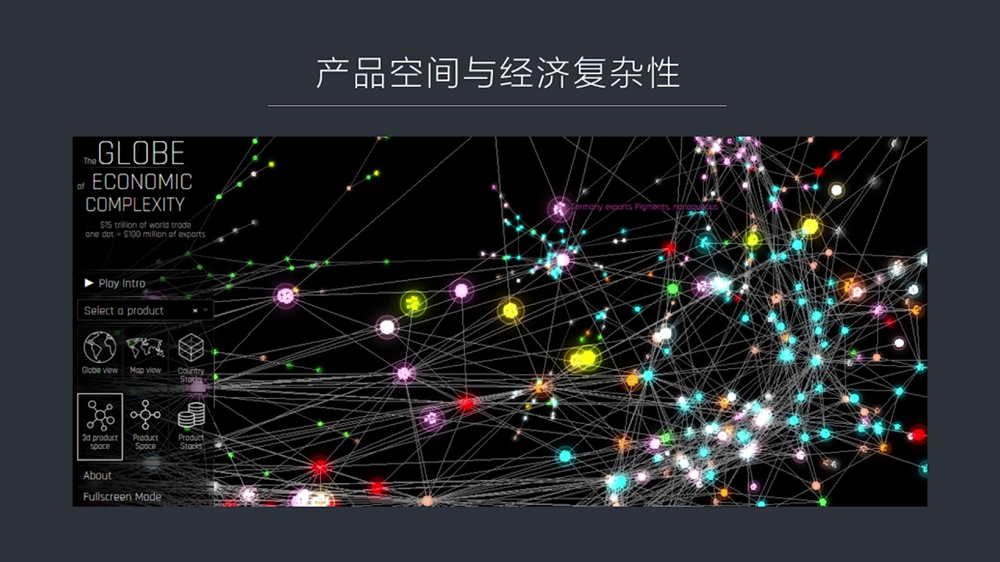

網絡學中間的這種討論 就是在節點中間把節點之間的關係 這些信息抽取出來之後通過舉證的方式把它記錄下來 然後再通過非常強大的圖形 這種展現手段展現出來之後 你會覺得一下子所有東西都看了一幕了然 比如說這張圖這是從MIT的網站中把全世界的這種出口產品的信息和國家組合在一起形成了一個巨大的舉證之後那麼它可...

---

### Slide 3

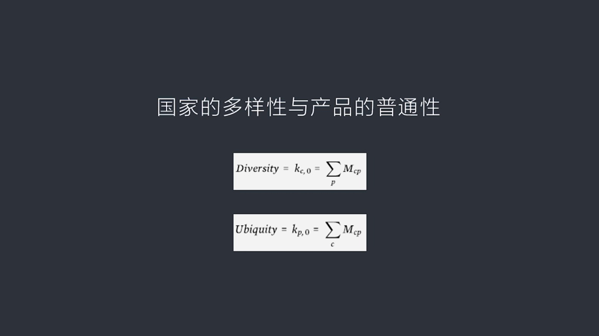

可以說是兩大基礎 什麼叫國家的多樣性呢你比如說中間這張圖中我們用一個形象的例子這個是一個比較簡單的例子 荷蘭阿根廷加納

---

### Slide 4

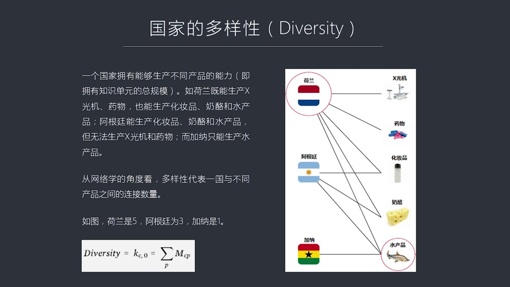

這是在圖的左邊右邊是這些國家能夠生產的產品比如說 X 光機 這種藥物化妝品 奶漏和水產品然後我們可以看到荷蘭從圖中我們可以明顯看到荷蘭這個國家它的多樣性最強因為它既可以生產 X 光機 又可以生產藥物還可以生產化妝品 還可以生產奶漏最後連水產品它也能夠提供所以這個國家 一個國家 五種產品它都能夠出口所...

---

### Slide 5

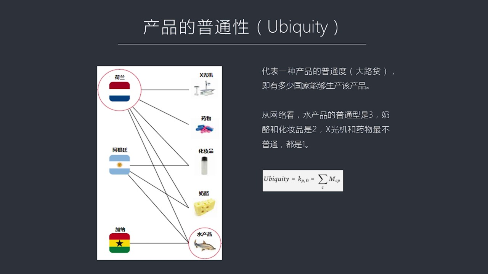

那麼如果我們來看這個x光機 顯然不是誰都能造的它只有荷蘭能造 所以它的普通性數量最小注意它跟多樣性相反 越普通的東西越容易造的數量越大越不容易造的 越是這種尖端產品它數量越小所以我們可以看到在無種產品中間x光機是這個普通性最低的 最不普通的所以它是1 只有荷蘭能造 藥物它也不普通 也只有荷蘭能造所以...

---

### Slide 6

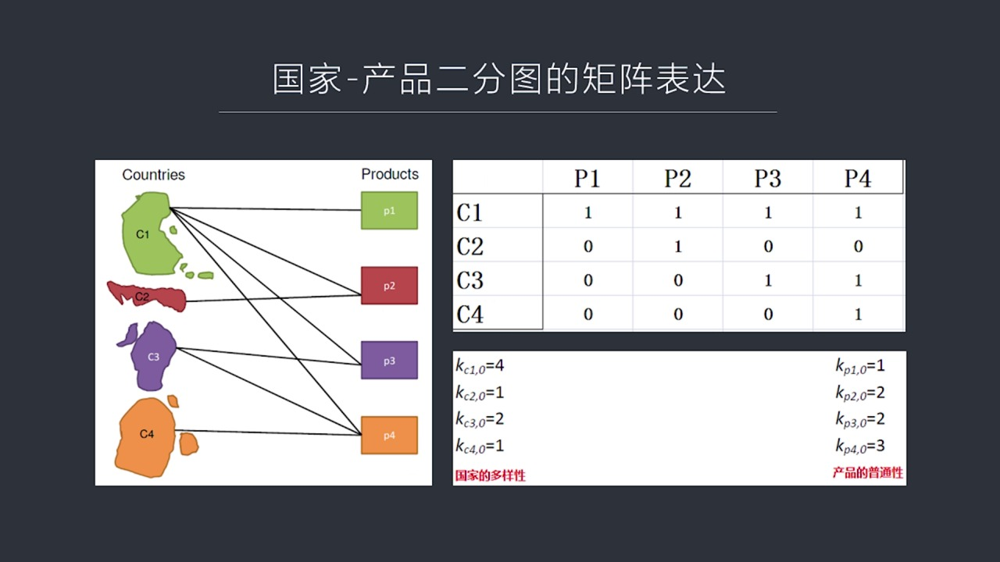

然後用一種抽象的方式 數學的方式把它表達出來這就是首先我們看這頁的左圖左圖上面是國家和產品這種圖形在圖論中間叫兩分圖或者叫兩部圖它的最大特點是什麼呢就是左邊這些國家之間相互之間是沒有連線的右邊的產品之間相互也是沒有連線的那麼所有連線都發生在國家和產品之間這種圖叫兩分圖它好像把這些節點分成了兩節然不同...

---

### Slide 7

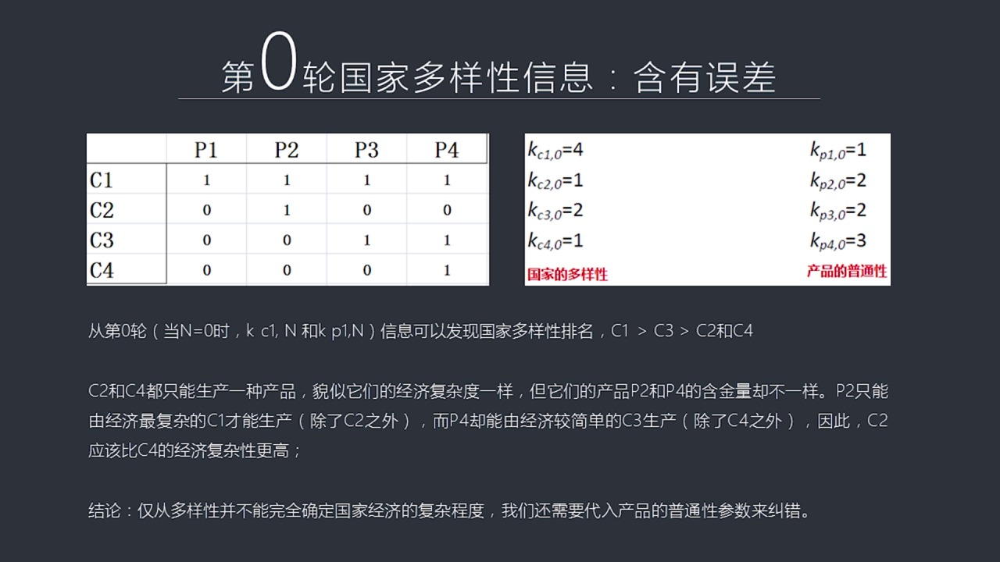

我們現在可以得到第0輪的國家多樣性的信息什麼叫第0輪呢因為我們有3個國家比如說我們有4個國家有4種產品那麼第0輪就是我第一次來看我們簡單把這問題說簡單一些就是我們第一次看這張圖你能得到什麼樣的信息從第一張圖上從第一次來看的情況來看的話我們已經得到了國家多樣性的這種信息那麼這個第一輪這個第0輪就是第一...

---

### Slide 8

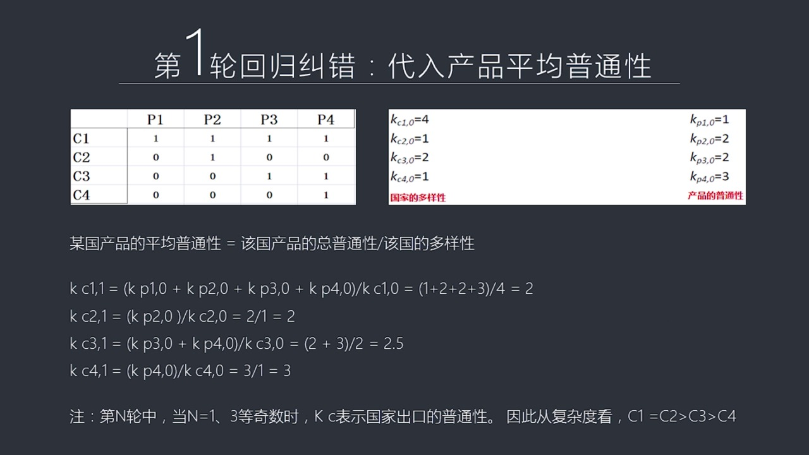

可以說它是一種低歸算法回歸算法它主要作用是來糾錯那麼我們需要把產品信息產品的這些指數帶進來帶進來我們要求一個新的指數這個指數就是我們要算這個產品它生產這個產品它的平均的普通性這些產品出個產品的平均普通性什麼叫平均普通性呢比如說我們把新加坡所生產的所有產品它總的普通性加在一起之後除以新加坡能夠出口多少...

---

### Slide 9

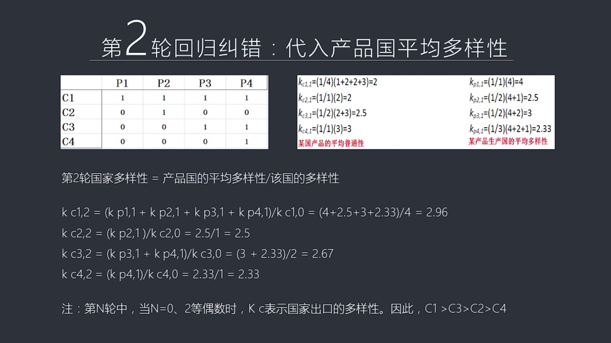

這就變成等於2了所以我們會看到第2倫國家多樣性這個公式發生了變化就是新加坡的平均多樣性剛剛我們就算出來除以新加坡的它能夠出口多少種產品所以不管是在第1倫第1倫第1倫還第2倫我們看到分母它永遠是這個最後這個尾數是0它都是以一開始這個技術作為分母的那麼通過我們把剛才這些42.53和2.3這4個數帶進來之...

---

### Slide 10

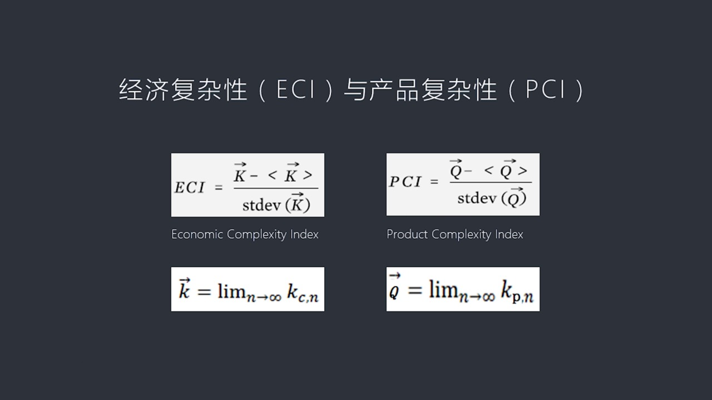

就是經濟複雜指數它的簡稱這個 PCI產品複雜指數它的簡稱它為什麼用這個公式表達中間我省略了推理的這個數學推到這個過程就是因為那個過程會讓你看雲我們已經通過一個具體的例子把這個過程給展現出來了所以它的表達是讓你會看到是一個這個使量的數組K然後這個在分子中間另外一個殺了平均值處以它的標準方差這個是個什麼...

---

### Slide 11

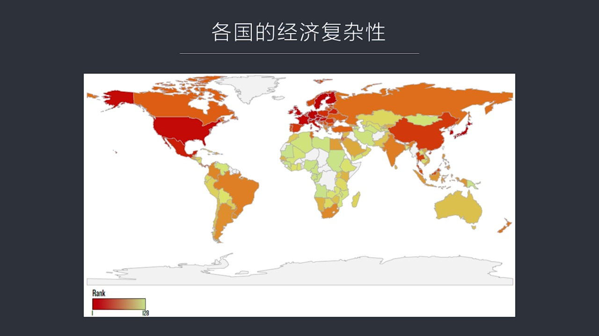

就可以直接直观进行比较那么这个颜色越深的代表经济它的经济越复杂那么从头中我们可以很明显看到美国还有西欧包括北欧就是波洛帝海三国他们的经济是全世界经济中最复杂的所以通过这个数的计算跟我们直观对这些国家的印象是完全一致的完全匹配的这表明的这个理论体系和实践是契合的那么如果我们看中国中国的颜色比美国和西欧...

---

### Slide 12

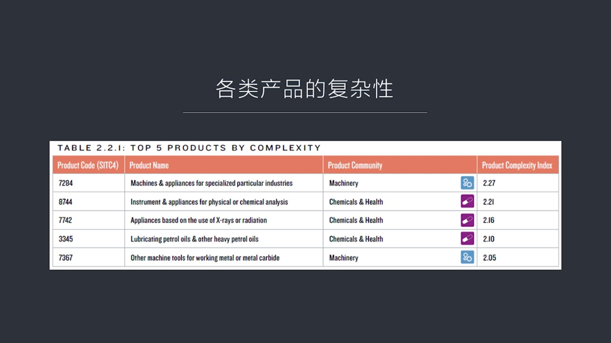

这个数量会更大如果在这些这么多产品中间我们如果台出前五名的话你会发现前五名主要是什么呢这张表就是左边最左边就是它的边号然后它的产品的名称然后大概属于哪一类最后是它的复杂度的指数我们会发现在当年世界中最复杂的需要最多知识单元的首先最重要的就是机器生产机器的在中国这个不是一个我们不是这么来分类的我们叫机...

---

### Slide 13

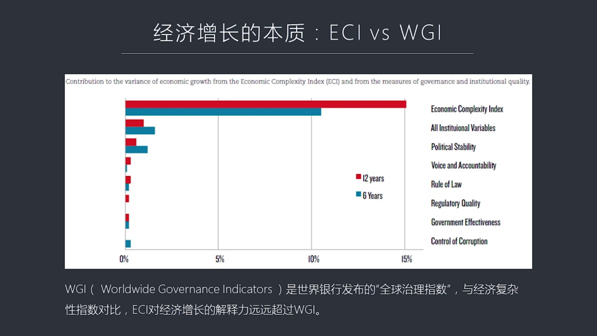

经济增长了本质究竟是什么事业银行他们有自己一个发布了每年发布九四年开始依照现在每年发布一个全球治理指数就是WGiWGi说着什么意思就是它分成六个不同的参数六个不同参数包括政治稳定性包括你是不是腐败问题是不是政治清明你的法治是不搞得好然后你的管制管制政府管理的质量怎么样还有政府是不是很有效等等这些听起...

---

### Slide 14

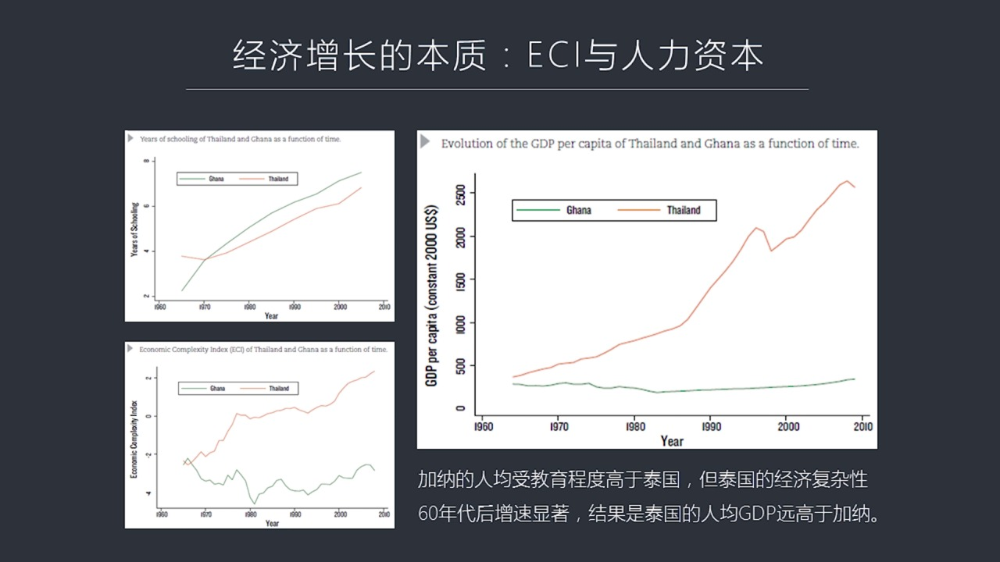

人力资本这个也是一个大家一拍哪边一觉得人力资本这个东西很重要但是中文到什么程度它跟依赛比它这个重要性到底谁强谁弱呢定量分析我们就能找到问题的要害了你比如说我们拿加纳和泰国这两国家进行对比就是我们左边这个上图左上图你会看到从60年的开始加纳和泰国都开始投资搞教育而且加纳的平均售教育程度要高于泰国从19...

---

### Slide 15

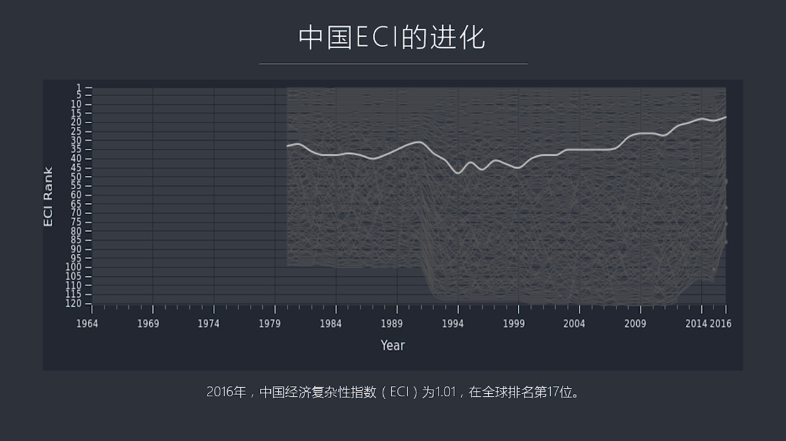

在过去三十年三十周年进化的路程从中国进化的路径你会看到中国现在总体水平是什么样呢中国的经济复杂度现在是1.01在全球80多个国家里面大概排第17位我们落后于发大国家但是正在逐渐逼近那么从时间上来看我们会发现这个图很有意思就是我们在79年的时候就是在改革开放之初的时候我们的经济复杂度甚至超过了1994...

---

### Slide 16

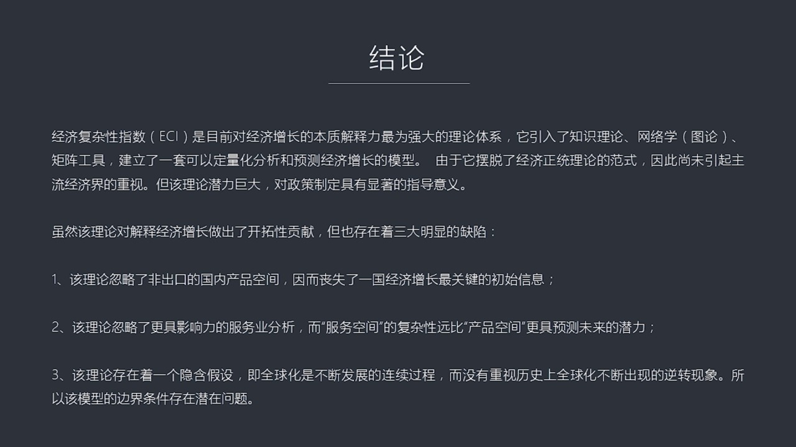

它引入了第一课我们讲的知识理论包括这堂课我们讲到了图论网络学中间的很多新的工具包括举证那么通过这些新的工具和新的表达方式它建立起来以一整套可以定量分析包括预测经济未来增长的趋势的这么一种模型但是这套理论体系它跟主流的很多理论体系是冲突的它也没有用到很多理论很简单只用到理家图要当私隐分工比较优势对于其...

---

### Slide 17

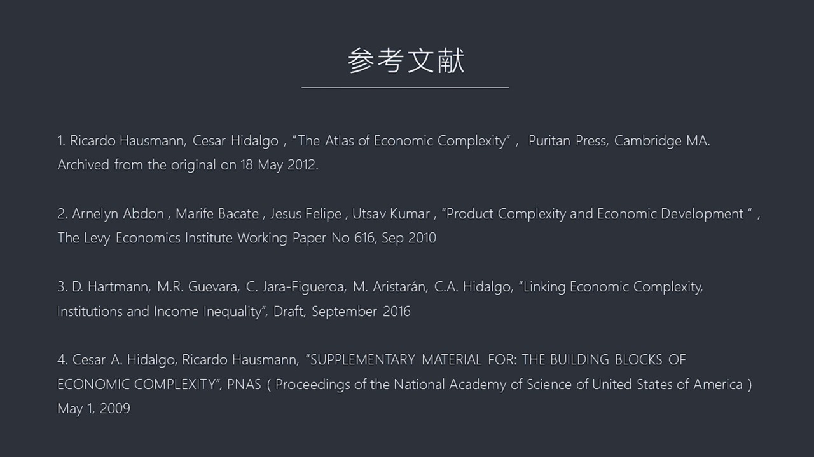

把经济复杂性这个问题给做了系统的产数而且我们知道它未来的潜力巨大但是也知道它现在潜除了问题同样巨大怎么办呢我们要想办法去进行调整进行改进这就是我们这个要提到的红约的第一号征招令第一号征招令要干嘛呢就是为了解决

---

### Slide 18

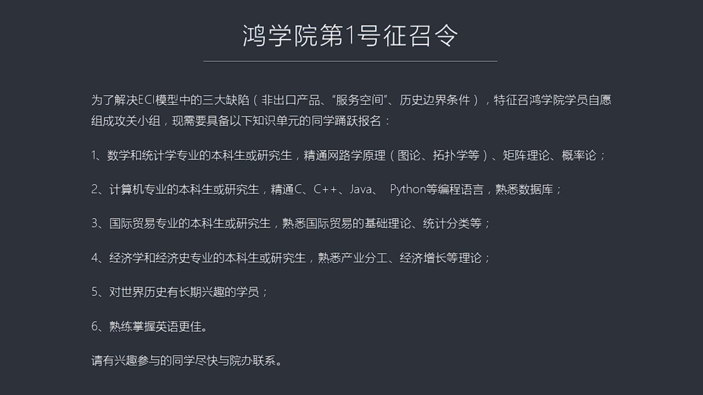

这一色模型中间的三纳缺陷第一是非出口产品这不够第二是缺少服务红烟没有研究服务业第三是历史编辨条件不清楚这三纳缺陷使得这套理论体系很难起飞虽然被搞出来了但是它为什么没有在国际上变得特别的有影响力就是你有巨大的缺陷这三个缺陷是不能容忍的必须要解决这三个缺陷才能够运动的起来才能起到真正的有效的指导作用所以...

---

### Slide 19

---
