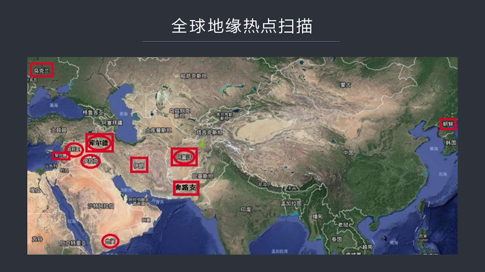
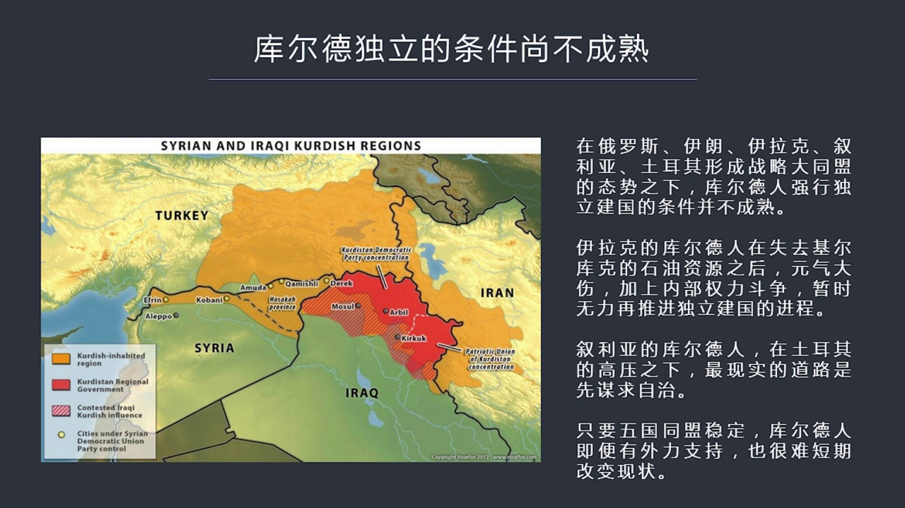
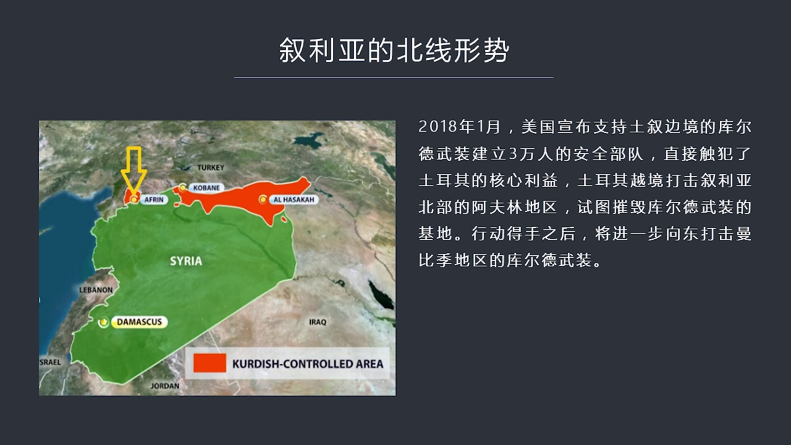
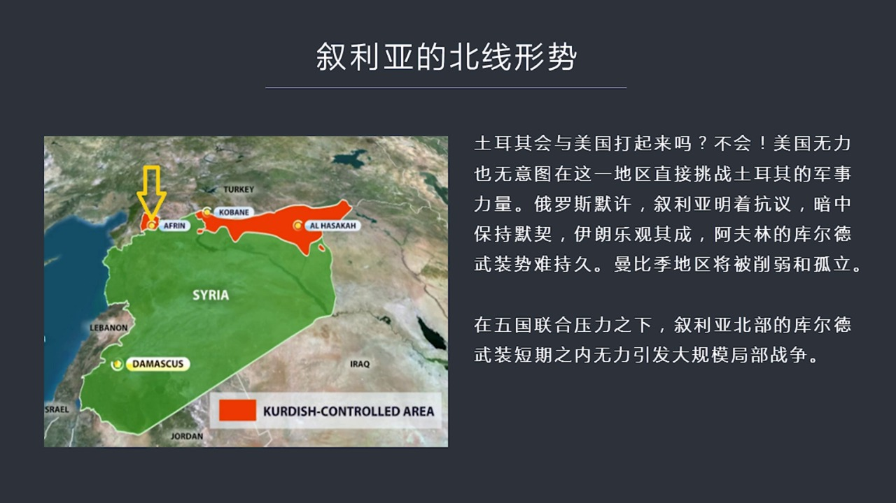
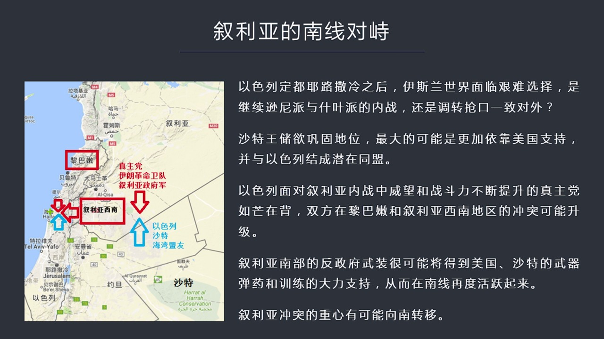
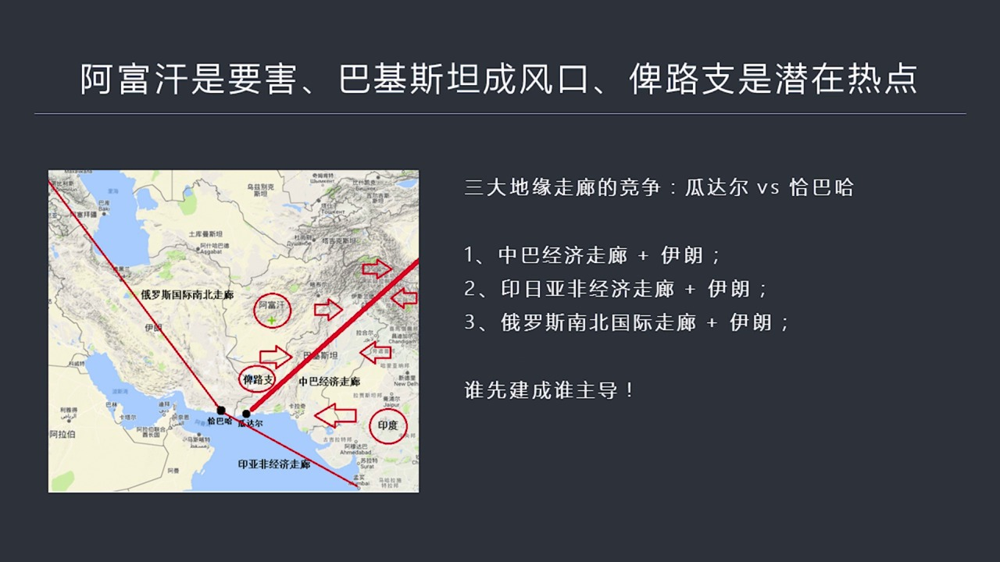

# 核心课视频-017.2018全球热点趋势扫描（地缘政治篇） — Detail Slide Notes

> **来源**：鸿学院核心课程  
> **幻灯片**：8 张

---

### Slide 1

2018年全球热点趋势扫描2018年地缘政治和经济热点问题我们在威克堂上已经做了两次介绍那么这次是配上PBT希望能够用图表还有地图把这两个问题说得更明白 更清楚一些首先我们来看地缘政治的热点如果我们做...

<strong>All subtitles</strong>

> 2018年全球热点趋势扫描2018年地缘政治和经济热点问题我们在威克堂上已经做了两次介绍那么这次是配上PBT希望能够用图表还有地图把这两个问
> 题说得更明白 更清楚一些首先我们来看地缘政治的热点如果我们做一个全球扫描的话我在第一张PBT中展示出了

---

### Slide 2

未来可能会爆发热点的一些地区用方框表示出来 这是代表未来可能的还有一些是用圆圈表示的那就是现在已经正在爆发冲突的地区从这张地图上来看的话我们可以发现正在爆发冲突的地区包括蓄莉亚 伊拉克还有阿富汗 野门...

<strong>All subtitles</strong>

> 未来可能会爆发热点的一些地区用方框表示出来 这是代表未来可能的还有一些是用圆圈表示的那就是现在已经正在爆发冲突的地区从这张地图上来看的话我们
> 可以发现正在爆发冲突的地区包括蓄莉亚 伊拉克还有阿富汗 野门那么未来我觉得可能在今后一两年之内有可能会升级的一些潜在热点地区包括朝鲜 吴克兰
>  库尔德地区还有丽巴嫩 比路芝另外还有阿富汗库尔德和阿富汗现在已经处于热点去了我是把它用方框加上圆圈表示这意味着未来这个地区不仅是持续热点而
> 且有可能升级当然了我们没有必要一个一个去分析这些热点地区比如说朝鲜吧 朝鲜地区虽然是持续热点但是我认为它不会爆发明显的冲突吴克兰也是类似的道
> 理 包括伊朗这些地区它是一种热点 潜在热点地区但是并不会直接爆发军事冲突 原因很简单如果我们看美国干预各国的情况的话你会发现它有一个总的规律
> 这就是如果能够有效地挑起这些地区发生内战那么这有可能是美国会插手的地区但是如果这些国家或者地区内部的政治体系中央集权比较稳固 而且民族认同感
> 很高那么在这种地区调动战争就不会有什么好的结果所以我们看了阿拉伯之春所掀起的这种阿拉伯地区的动荡而且根本原因在于阿拉伯的文化 政治制度并非是
> 中央集权而主要是建立在部落这个级别之上所以它是一种部落文化和部落的政治体制那么跟它不一样的地方就是像伊朗朝鲜这些地区内部都是长年长期来形成了
> 中央集权特别是像波斯帝国它有非常久远的这种中央集权的历史而且国家的内部的民族认同感很高就是你出钱出力也不可能在内部调动这种内战的爆发 托尔基
> 也是一个例子在面对这样的国家和地区的时候军事干预或直接发动推翻这个政府的这种战争是不会有好下场的所以这些地区有可能是热点但是很难爆发真正的大
> 规模努力冲突那么我们再看下野这样的话我们可以把范围集中在可能潜在出现战争的地区首先我们来分析库尔德库尔德这个地区我现在基本判断是它目前独立的条件上不成熟

---

### Slide 3

虽然这个地区很有可能会争积成大规模的冲突但目前在俄罗斯伊朗伊拉克虚利亚托尔基这五个国家形成战略大同盟的态势之下无论外力怎么去进行军事支持金融支持库尔德人想强行独立建国都很难做到因为几个大国都在旁边护士...

<strong>All subtitles</strong>

> 虽然这个地区很有可能会争积成大规模的冲突但目前在俄罗斯伊朗伊拉克虚利亚托尔基这五个国家形成战略大同盟的态势之下无论外力怎么去进行军事支持金融
> 支持库尔德人想强行独立建国都很难做到因为几个大国都在旁边护士丹丹再加上俄罗斯的这种强力支持所以他有能力扑面库尔德人现在历史搞出了这种独立的公
> 投也好实际的这种政府的建立也好都很难真正的造效那么如果我们来看伊拉克地区的库尔德人他们在失去接着库客的石油资源之后目前元气打伤再加上内部的权
> 力争得我展示看起来库尔德人在伊拉克地区已经没有办法在推进独立的独立建国这个进场了展示受阻区利亚地区呢区利亚地区的库尔德人在托尔基的高压之下估
> 计短期之内也很难有明显的这种独立的可能所以对他们来说最好的结果是先谋求在序量北部实现自立自制而不是直接走向建国那么从这些条件外部条件来分析我
> 们可以做出一个基本判断只要五国同盟内部基本稳定那么库尔德人想获得外力来推进独立这个进场将会受阻短期之内难以改变这个现实那么我们如果看具体分析
> 下序利亚我们把它分成北线和南线两条战线首先我们来说北线的形式这就是下野PVD我们看到最近新闻说到托尔基在1月中

---

### Slide 4

开始对序量北部阿富汗地区进行了大规模的军事行动很多人认为这是库尔德人独立引发的托尔基于美国之间的矛盾当然我们也看到了很多其他方面反应包括序利亚的这种抗议俄罗斯的这种默认等等这背后究竟发生了些什么我们需...

<strong>All subtitles</strong>

> 开始对序量北部阿富汗地区进行了大规模的军事行动很多人认为这是库尔德人独立引发的托尔基于美国之间的矛盾当然我们也看到了很多其他方面反应包括序利
> 亚的这种抗议俄罗斯的这种默认等等这背后究竟发生了些什么我们需要看一下这张地图在序量北部我们看到库尔德人就是他们局色的地区所拥有的实力范围在这
> 两个地区之间已经被托尔基因所隔断这就是2016年托尔基因发动了幼稳拉底和盾牌行动已经阻止了这两坨库尔德人进行绘合的这种可能性现在美国在1月份
> 突然宣布要支持库尔德的武装在托尔基边境地区建立所谓的三万人的安全部队正是由于美国的这种政治的声明导致了托尔基因人他们觉得自己的底线国家力的底
> 线遭到了这种侵犯所以立刻发动了这场战争就是入侵阿富汗地区去搅灭库尔德人的武装然后这个只是行动的第一部分第二部分呢我在这个图上用黄剑头表示它现
> 在正在采取的这次军事行动第二阶段军事行动我这没有图标准但是我认为第二阶段在围角了阿富汗地区之后托尔基基军队将会向东转进去搅灭这个东部的就是曼
> 比基地区的图标准武装那么现在很多媒体在报道说这样的话有可能引发托尔基和美国之间的战争在我看来这是不可能的因为在这个地区托尔基是个强大的军事国家在北约组织里面它军事力量排第二

---

### Slide 5

就是它的武装部队的人数排第二而它的内部出了库尔德人之外这些凸具人的内部团结性是比较高的而且有中央集权的Authmanteed过的长期的好几百年的历史所以托尔基想发动内战显然意见是不可能的美国也目前也没...

<strong>All subtitles</strong>

> 就是它的武装部队的人数排第二而它的内部出了库尔德人之外这些凸具人的内部团结性是比较高的而且有中央集权的Authmanteed过的长期的好几百
> 年的历史所以托尔基想发动内战显然意见是不可能的美国也目前也没有这种意图在托尔基直接去挑动内战因为很难造效所以现在的情况就是美国知道托尔基的军
> 事量非常强大所以没有意图也没有能力在这一地区去直接挑战托尔基的军事军事力量再加上托尔基现在的这种金工行动实际上得到了俄罗斯的墨区蓄利亚也有一
> 种墨气虽然蓄利亚政府跳得很厉害指责托尔基对蓄利亚主权的侵犯但是蓄利亚现在真正的目标是向西打基另外一部分所谓反政府武装尽快打通通向地中海上通道
> 它没有力量向北发动金工去搅滅固儿责任所以托尔基人的金工某种意义上是帮蓄利亚解除了一个潜在的威胁它应该是乐观其成的当然还有伊朗也是持这种态度因
> 为伊朗它也面临固儿责任独立的潜在的威胁所以托尔基人大大出手伊朗应该是暗字的高性也正是于这种几个大国的这种态度美国对固儿责任的力量在阿富汗地区
> 固儿责任的力量不可能给出实际性的帮助而固儿责任武装面对托尔基强大了正规军包括它能够调动的蓄利亚的支持托尔基的这种力量然后再加上周边几个大国这
> 种同盟的态势这使得在阿富汗地区固儿责任武装很难长久坚持所以他们最后会被打垮那么托尔基人对东部曼比基地区的进攻将会有力的这个削弱和孤立托尔德人
> 在这个地区的势力所以还是那句话在五国联合的压力之下这个托尔德人在蓄利亚北部想搞出一些名堂几乎是很难做到的也就是在这个地区想调动大规模的局部战
> 争目前条件还不成熟那么我们再看下野PBT如果我们来看蓄利亚南线的形势的话我觉得这个地区就比较危险为什么呢因为耶路撒冷已经被以色列确定为首都

---

### Slide 6

美国在强力支持千都行为包括千一大使馆这都激化了阿拉伯世界内部伊斯兰世界内部的这种力量对比那么形势有可能朝着去尼派和世界派联合联合起来然后一直对外这样的一种形势但是要实现这一点呢显而一件需要去尼派的领袖...

<strong>All subtitles</strong>

> 美国在强力支持千都行为包括千一大使馆这都激化了阿拉伯世界内部伊斯兰世界内部的这种力量对比那么形势有可能朝着去尼派和世界派联合联合起来然后一直
> 对外这样的一种形势但是要实现这一点呢显而一件需要去尼派的领袖沙特的这种努力的推进不过现在沙特的情况恐怕不会朝这个方向去发展因为沙特的现在这个
> 王储现在他的主要的想法是顺利的上台结果国家夺取大位所以他面临一个内部不稳的情况在这种情况之下特别是诸多了王子的这种心怀不满所以在这种情况之下
> 他很有可能是让外逼向安内的思路也就是更加依赖美国的支持并且与以色列结成现在的同盟只有这样的话他的地位才可能稳固否则的话恐怕他接掌这个国王这个
> 大位的这种形势会发生一些不利的变化所以在沙特这个态度上我们可以明显发现他跟以色列形成了某种意义上的这样的同盟那么以色列呢现在他所面临的问题是
> 在训练内战中间不断成长的这个珍珠党珍珠党他们的作战能力和在这个地区的离巴嫩地区还有训练西南部的这种威望获得了很大的提升所以在脚面伊斯兰国这个
> 战争基本结束之际这些珍珠党有可能会重新回到离巴嫩去鞏固他们在离巴嫩的势力这将会直接影响以色列的安全所以我觉得现在最有可能或者这个潜在一个很大
> 的热点地区就是离巴嫩还有在训练了西南部在这个地区会形成一条界限分明的这个对立双方一方是珍珠党以两个命为对训练政府军所形成的这样一种饭食业派的
> 阵营另外一派就是以色列和沙特包括海外国家所形成的阵营所以我在图中用红色表示这种这种同盟的力量用蓝色表示以色列沙特和海湾的同盟包括美国之池双方
> 在这个地区面临一个相互销量有可能会升级为局部战争这样一种可能性特别是在离巴嫩和训练了西南部所以呢这个地区是潜在危险性比较高的地区所以训练的冲
> 突虽然现在正在北方打但是我认为北方的库尔的人恐怕很难坚持当那个地区的战火逐渐西面的时候或者冲突逐渐结束的时候真正的重新将向南转移那么如果我们看下业下业是中亚地区我认为现在中亚地区

---

### Slide 7

出现了一种新的趋势和情况就是阿富汗现在成了中亚的核心的战略要害巴基斯坦成了地缘冲突的风口比路知将是潜在了热点地区如果我们从这张地状可以看到这个现在基本态势中八经济走狼还有俄罗斯南北的国际通道包括印度和...

<strong>All subtitles</strong>

> 出现了一种新的趋势和情况就是阿富汗现在成了中亚的核心的战略要害巴基斯坦成了地缘冲突的风口比路知将是潜在了热点地区如果我们从这张地状可以看到这
> 个现在基本态势中八经济走狼还有俄罗斯南北的国际通道包括印度和伊朗之间在加巴哈行程的这个印度亚洲和非洲的星期走狼日本继续参与这件事正在这个地区
> 形成了两个双子的双子城市的竞争对手加巴哈和瓜大尔那么中国当然是立推瓜大尔港和中八经济走狼但是出现了两个新的竞争对手一个是印度和日本为龙头的亚
> 非经济走狼还有俄罗斯主导的南北走狼俄罗斯和印度日本他们的选择了港口是在加巴哈那么到底这两个港口最后谁能胜出呢我觉得谁有更强大的经济实力谁就能
> 够先把这件事做成先把这件事做成那么先做成的人将会广告在这个地区的他的这个地缘经济和地缘战略的地位但是也正是由于这点我们会看到这个地区就变成了
> 一种潜在的风险地区因为中国这个中八季走狼它会面临两个方向的这种夹肌如果我们从地区上可以看到很明显一股力量将从阿富汗一股力量将从印度从两个东西
> 两个方向形成对中八季一走狼的一种战略微脚的态势这就是我们最近可以看到在2017年夏天美国国家安全顾问麦克马斯特生入到阿富汗然后在阿富汗地区美
> 国投放了一颗这个紧持原子弹爆炸力的炸弹之母这是一种潜在的微涉信号除此之外美国决定在阿富汗增兵正是班农因为反对这个事最后被驱砍出了白宫当然其实
> 特朗普和班农在这个问题上他们起初意见是一致的班农就想了一个好办法为了把麦克马斯特赶走所以就建议总统把麦克马斯特任命为阿富汗美军驻阿富汗的这个
> 司令官把他弄得前线去给他加一个星让他成为四星上降然后让他去打仗从而达到把麦克马斯特排除在全面中心之外这样的一个目的当然麦克马斯特显然是代表深
> 国和军工负责体的这种利益的所以他的根基非常的稳固最后走路的不是麦克马斯特而是班农那么到了2018年年初阿富汗这种恐怖襲击明显的家具包括伊斯兰
> 国这帮残郁的分子都在想阿富汗转进所以各个方向在阿富汗地区正在运辖越来越激烈的冲突那么我们会看到美军现在也宣布在阿富汗的这种大举增兵而且未来呢
> 他这个增兵的数量将不再公布现在我们从地状其实你一眼可以看出来阿富汗这个地区实在是他的位置实在太重要了他基本上就是个地缘战略一个中书一个位置他
> 赌住了中国向西去跟伊朗俄罗斯这个印度会合了怎么形成地缘战略合理的最重要的一个通道被赌住了同时印度和伊朗包括俄罗斯都被卡在阿富汗那个地方这个顶
> 子不把不把掉这五个地区大国就没有办法连手做事所以当年美国选择阿富汗发动战争虽然他跟恐怖主义这件事911这件事没有直接关系但是也要打下阿富汗而
> 且在伊拉克撤兵之后也要死守阿富汗打了16年仍然不肯走主要原因就在于这是一枚非常关键的战略妻子有了阿富汗这个妻子的话就可以威射就可以拉楼印度一
> 块来威射中华经济走狼而且赌住几个地区大国在中亚形成战略合理的可能性这就是这一盘旗的关键之处那么也正是因为这个原因我们看到美国在2018年年初
> 开始在外交上抨击这个巴基散要要求巴基散要增加对恐怖主义的镇压如果不答应就要减少军事援助当然巴基散马上就可以马上进行了反击说美国并不是巴基散的
> 盟友然后巴基散还宣布中巴之间的贸易要用人民币来结算所以我们来看到威射中巴经济走狼的这个地区形式现在变得越来越复杂那么由于中巴经济走狼毕竟巴基
> 散南部的比路之省而省力来就是一个非常复杂的地区有失业派 也有训泥派有塔利班 还有很多诸多当地的分离分子又是经济积极细落后的地区所以各种力量都
> 在比路之这个地区形成了一种冲突的一种交集点所以这个地区如果在外力的资助之下在外力的这种金钱武器的帮助之下不可能会形成热点地区某种意义上类似固
> 儿的人独立比路之人如果闹起独立来对于中巴经济走狼的威胁就太大了所以我们来看到这个中亚地区我认为是仅次于中东地区仅次于这个区利亚固儿得人这个地
> 区之外的另外一个潜在的热点这个就是我们在威克堂讲到的地缘政治的潜在的这种热点地区

---

### Slide 8

<strong>All subtitles</strong>

---
