# 核心课视频-018.2018全球热点趋势扫描（经济篇） — Slide Notes

> **来源**：鸿学院核心课程  
> **幻灯片**：19 张

---

### Slide 1

因为这两番课我们都已经在微课中都已经详细讲过所以我在这儿会讲得比较快全球经济是热点地区,热点掃描呢归纳起来我讲四个问题第一个就是汇率正在运辆辩聚第二是石油价格将会向上突破

<strong>Cleaned narration</strong>

> 因为这两番课我们都已经在微课中都已经详细讲过所以我在这儿会讲得比较快全球经济是热点地区,热点掃描呢归纳起来我讲四个问题第一个就是汇率正在运辆辩聚第二是石油价格将会向上突破

---

### Slide 2

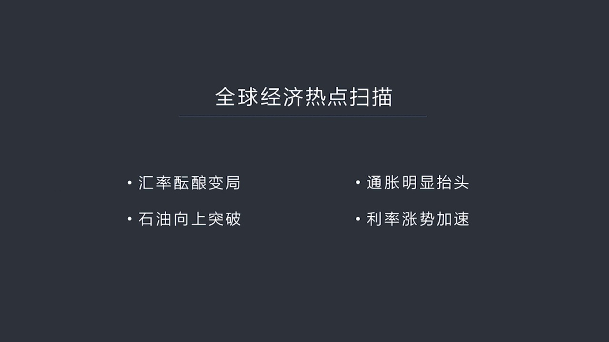

第三是通过膨胀有可能明显抬头第四是利率的掌势将会加速首先我们谈汇率说到汇率问题我们会看到现在全世界基本上都在看衰美元

<strong>Cleaned narration</strong>

> 第三是通过膨胀有可能明显抬头第四是利率的掌势将会加速首先我们谈汇率说到汇率问题我们会看到现在全世界基本上都在看衰美元

---

### Slide 3

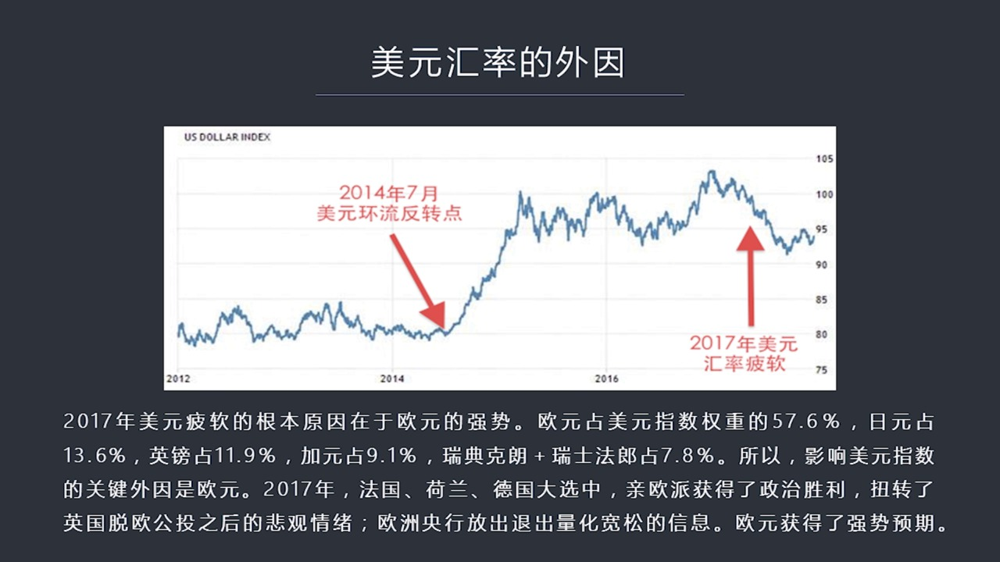

认为美元的下跌会越来越严重基本上美元启动了一个辨职的趋势一般来说我们在分析不管是政治还是经济形势的时候最大的困扰是在于媒体和大多数人的这种观点会干扰你的思路如果你一看报纸一打开媒体看到了普天概率都是说美元会未来会大跌那么你的对这个问题的分析和判断就会受到干扰在我看来无论别人怎么说无论有多少人说会发生...

<strong>Cleaned narration</strong>

> 认为美元的下跌会越来越严重基本上美元启动了一个辨职的趋势一般来说我们在分析不管是政治还是经济形势的时候最大的困扰是在于媒体和大多数人的这种观
> 点会干扰你的思路如果你一看报纸一打开媒体看到了普天概率都是说美元会未来会大跌那么你的对这个问题的分析和判断就会受到干扰在我看来无论别人怎么说
> 无论有多少人说会发生电视我们只需要按着理性和逻辑来进行深入的分析那么如果我们来看美元汇率的话我觉得美元汇率今年要想把这个问题说清楚就一定要把
> 美元指数它形成的内营和万营两个方面的因素搞明白在这个PPT中间我展示了美园在2014年7月美元还流反转之后一直到现在包括2017年美元的批转
> 还包括年初美元的暴跌从这种图上我们可以找出两个时间点一个是还流的反转点2014年7月另外就是2017年的美元汇率批转的它下降了通道那么为什么
> 美元汇率在2017年大幅批转我们都知道2016年年底说人民币汇率对美元差点破期所以大家认为人民币很可能会到2014年会变得7.0多甚至更多认
> 为美元汇率在2014年非常的强势结果情况并非这样我们在2017年的年初也做过这样的一个人民币将会对美元保持稳定的预测那么要搞清楚201000
> 美元会里批转的原因最重要的就是要搞明白美元指数它所形成的外营和内营两个条件首先外营导致201000美元批转的根本外营是由于欧原的强势为什么因
> 为在美元指数这个栏子中间欧原占比高达57.6%日元占13.6% 应棒占11.9%加元占9.1% 还有瑞典克朗和瑞士法朗加在一起大概占7.8%
> 所以呢影响美元指数的最关键的外部因素是欧原201000为什么欧原会表现非常强势呢主要就是在欧洲的一系列大选中间比如说荷兰 法国 德国就是北部
> 欧洲的大选七欧派获得了完全了政治上的胜利所以扭转了英国脱欧之后所带来的那种欧盟快要解散的那种悲观情绪所以使得这种政治的胜利变成了对欧盟未来经
> 历发展的一系列的冲净同时另外个原因就是欧洲央行在2017年释放不断的释放要退出这样的宽松 这样的信号所以是欧原在2017年表现出了一种相当强
> 势的证明这种态势所以欧原在2017年压倒了美元因为美元当时出现的是特朗普当政了第一年不光是谈核问题还有各种各样的内部的矛盾 纠结还有福林的问
> 题还有后来的那种政治斗争一系列冲突都在2017年集中爆发所以美国显得内部正局相当的混乱在这几个方面的因素这种影响之下欧原显得比美元更强势这就
> 使得美元的整个指数向下批转但是2018年情况还会同样这样吗这就需要我们来分析一下美元最大竞争特首欧原的情况了欧原应该说在2017年充满了希望
> 和胜利但是2018年我觉得欧原这个整个欧盟会从一种过度的希望由于实现不了转而变成了一种失望为什么这么说呢首先如果我们来看欧洲的两个马车

---

### Slide 4

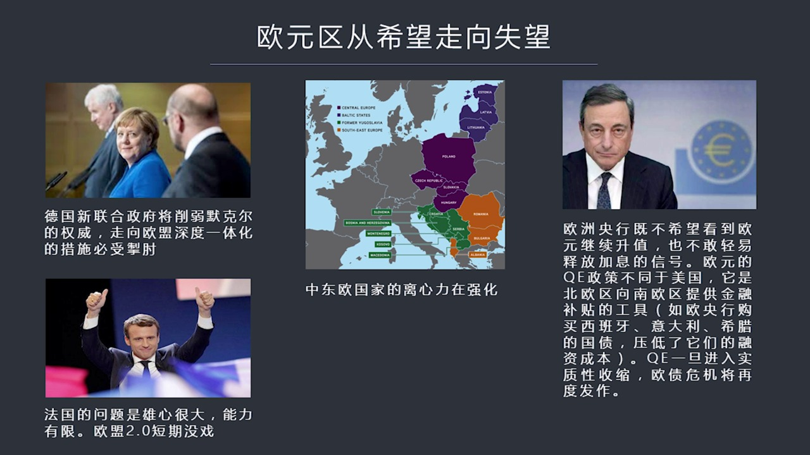

德国法国欧盟要想进一步强化一定需要德国的这种大力支持德国主要要出钱但现在德国的形势是默克尔现在没有办法单独组阁他无法建立单一的政府那么他必须要团结其他几个政党才能建立联合政府这说明一个问题默克尔在德国的权威受到了极大了虚弱那么不管你什么方式来进行联合政府的组件默克尔个人的影响力和在正上他所代表了这种...

<strong>Cleaned narration</strong>

> 德国法国欧盟要想进一步强化一定需要德国的这种大力支持德国主要要出钱但现在德国的形势是默克尔现在没有办法单独组阁他无法建立单一的政府那么他必须
> 要团结其他几个政党才能建立联合政府这说明一个问题默克尔在德国的权威受到了极大了虚弱那么不管你什么方式来进行联合政府的组件默克尔个人的影响力和
> 在正上他所代表了这种亲欧盟的这一派势力的决策能力都会受到制约制约还有撤走所以由于德国方面不可能再像去年那样对欧盟进行大力的或者有明显的这种影
> 响力的这种支持所以这就是得欧盟的最主要的台驻子陷入了贪换另外法国法国的问题是他可以说是制大财书很有领导欲望但是法国的经济实力确实不足以领导欧
> 洲所以他必须要依赖德国而德国的默克尔现在正处于权力被分权他的影响力下降决策能力受到虚弱出于这么一种态势所以德法之间法国就被迫要主要靠自己的能
> 力而不能过多了指望德国而法国自己的能力偏偏又有限那么从这个马克龙他的想法来看他要对内进行医学经济改革对外要整合欧盟升级到欧盟2.0对内的改革
> 短期来看比如说他的老公制度改革取得了一定的成效这是由于老百姓对他一种过渡的希望希望他能够领导法国领导欧盟走向一个繁荣走向一种经济繁荣和欧盟阵
> 新的道路但实际上这件事情很难做到因为法国内部的阵新必须要取决欧盟他整体的市场的深度和广度的扩大加深但是这偏偏是马克龙现在做不到的由于没有德国
> 的支持法国要想单独的完成这件事我觉得这是很难想象的你比如说2.0包括什么呢欧盟2.0包括欧洲的统一的财政部欧盟统一财政部但是没有德国支持这件
> 事情就不可能落实还有包括联合军队取代北约的欧盟军队这一点应该说其他各国家都要支持才做的成所以欧盟的内部整合统一财税统一财政统一税收包括统一军
> 队统一各种其他的领导权方面的问题都要求欧盟的所有国家交出更多的主权而在目前现在反欧盟反建制派势力越来越流行的情况之下这一点马克龙单靠异己之力
> 靠法国的力量是无法实现的也正是由于这个原因所以他内部和外部如果都无法真正落实改革、深度改革、
> 经济整合欧盟进一步统一如果做不到的话而市场的欧元的定价已经包含了预期他能够完成这些任务假如你完成不了那么你的欧元就会受到信心的错伤大家就会从
> 充满希望变成很举丧、很失望这是一个问题还有现在在欧盟内部的中东欧地区我们看到了波兰、
> 波罗地海三国还有极客这个苏洛伐克包括这个罗马尼亚、保家链还有潜南斯拉夫的克罗迪亚、
> 斯洛文尼亚等等这些国家现在非常的失落主要原因就是欧盟、布罗塞尔的那些人根本不在乎他们的利益他们相当于边缘区核心区的这些政治家不太关心边缘区国
> 家而且把他们的产业结构进行了这个经济下使他们的产业结构变得更丹宝这样的话是中部欧洲的国家、
> 东部欧洲的国家经济上陷入了更大的困境所以这些国家普遍有一种非常强烈的脱离欧盟的或者叫对抗欧盟的一种离心力你比如说在波兰、
> 在很多地区包括捷克你会听到已经形成了一种大讨论政治经营内部产生了分裂有一派是坚决要求强化跟欧洲的关系还有一派是希望能够达上中国一路一带一带一
> 路这样的一个快车能够往欧亚大陆的这个纵身去发展向东发展和向西发展现在正在争论那么在欧洲中东欧的其他国家也出现了越来越强烈的反全球化的倾向你比
> ...

---

### Slide 5

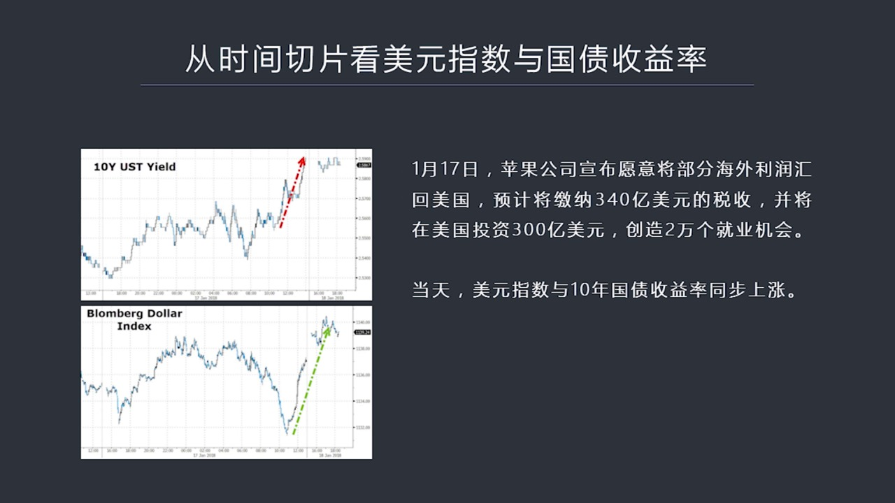

并且现在美国投资300亿就要创造2万个机会这就是特朗普他号称的这个税改政策导致苹果公司宣布资金回流当然除了这个因素可能还有其他的因素但是假设是这个因素起到了一定的效果当这个消息宣布之后我们看到美元指数和10年国载收益率是同步上涨的主要原因是什么主要原因就是大家认为这个市场判断首先是认为苹果公司他所持...

<strong>Cleaned narration</strong>

> 并且现在美国投资300亿就要创造2万个机会这就是特朗普他号称的这个税改政策导致苹果公司宣布资金回流当然除了这个因素可能还有其他的因素但是假设
> 是这个因素起到了一定的效果当这个消息宣布之后我们看到美元指数和10年国载收益率是同步上涨的主要原因是什么主要原因就是大家认为这个市场判断首先
> 是认为苹果公司他所持久的庞大的债券的这种投资组合他如果要脚税将背破要卖出一部分国债所以国债市场抛压会比较重这就会导致收益率上涨打收益率上涨就
> 会拉动美元指数上涨除此之外苹果公司要在美国投资建厂要创造几万个投资机会等等这种消息各种各样消息也会刺激这个美元汇率的上涨同时还有市场分析人士
> 认为代表的税收政策已经做效了会有越来越多的资金跟进无论是由于哪种原因都会带来收益率和美元指数的同步上涨所以我们会看到在这一天出现了一个很有意
> 思他这个两条曲线几乎是一模一样当然仅仅靠这一张图我们不能够完全说明美元指数和国债收益率之间的关系我们需要把整个的这种大背景把它的尺度放大到底
> 什么是决定美元汇率美元指数的内因呢如果我们来看一张更大的图也就是从两年这个曲线来看你会发现在这个图中蓝线代表的是美国时间国债收益率的曲线红线代表是这个贸易贸易指数

---

### Slide 6

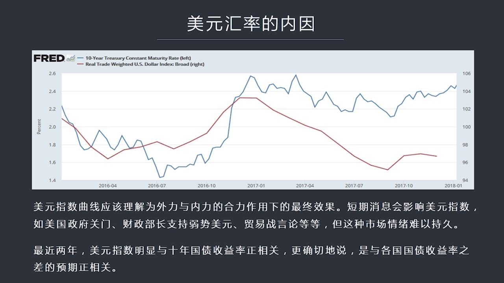

跟他的所有的贸易有贸易国家的贸易之间的比较关系算出了这个美元指数他类似美元指数但是比那个更全面一些从这两条曲线我们可以非常明显地看到基本上他的美元指数是跟着收益率在走的因为最核心的问题什么是汇率汇率就代表是资金流向的某一个时间切片在这个实验点上资金是怎么流动了从哪国家流向哪国家哪种货币流向哪种货币那...

<strong>Cleaned narration</strong>

> 跟他的所有的贸易有贸易国家的贸易之间的比较关系算出了这个美元指数他类似美元指数但是比那个更全面一些从这两条曲线我们可以非常明显地看到基本上他
> 的美元指数是跟着收益率在走的因为最核心的问题什么是汇率汇率就代表是资金流向的某一个时间切片在这个实验点上资金是怎么流动了从哪国家流向哪国家哪
> 种货币流向哪种货币那么我们对这样的一个交易流取一个实验切片看到了就是一个汇率的比较关系在这个时刻的比较关系所以这个所谓汇率美元指数他从根本上
> 来看就是各国和各种货币之间资金的流动的方向和趋势这个趋势有什么来决定呢当然从长远来看只能由各种货币所代表资产的收益率之差来决定这就是为什么我
> 们要分析清楚美元汇率的内因是什么内因就是简单的说或者说把它简化了说就是跟着美国十年国债收益率与其他国家十年国债收益率之间的差之间的这个竞差跟
> 着它在走所以我们看到美元指数这条曲线的时候脑子没有反应过来它是一条什么样的曲线呢它是内因加外因合力的曲线外因就是它主要的竞争对手最大使欧元占
> 50.6%其次是日元还有一些其他国家的货币这些构成它外部的竞争因素同时它的内部因素就是它收益率之差收益跟各国货币十年收益率之差这个构成了它的
> 内部因素两股力量合带起形成的美元指数中间再加上一些扰动因素比如说特朗普宣布我要搞弱势美元政策正会对市场构成打击或者说努卿财政部长说我们支持弱
> 势美元这会冲击市场或者说这个Ross他的财政部他的商务部长说我们要跟中国打贸易战或者说中国的2025年的科技发展计划严重危险了美国诸如此类的
> 言论都会对市场构成扰动但这不是结构性的力量真正结构性的力量就是外因加内因所以我们从这个图中可以看出最近两年美元指数是明显跟时间国载收益率是正
> 相关的那么有了这个基本判断之后我们就知道怎么来看外因我们已经说清楚了怎么看美元内因也就是看时间国载收益率变化的趋势了就把分析美元指数转化成分
> 析美国国载十年国载收益率的未来发展的趋势我们如果看下野在1月11号美国战券带王曾经的战券带王毕尔格罗斯我比较看重他的观点长期观察这个人你会发现他的很多观点是相当靠谱的或者说在这么多人中间是比较靠谱的

---

### Slide 7

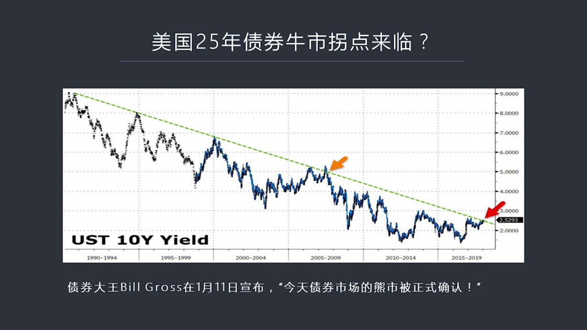

他的1月11号在他的推特上做了一个重大的声称今天美国战券市场的熊市已经被正式确认了当然美国战券市场的熊市他也意味着全届战券市场的熊市来到了这当然是从技术角度来分析所以他认为这个点已经来到了美元向上突破他认为只要突破2.6%熊市就确立了当然我们现在看到了现在已经2.6%了所以我们可以认为根据他这种技术...

<strong>Cleaned narration</strong>

> 他的1月11号在他的推特上做了一个重大的声称今天美国战券市场的熊市已经被正式确认了当然美国战券市场的熊市他也意味着全届战券市场的熊市来到了这
> 当然是从技术角度来分析所以他认为这个点已经来到了美元向上突破他认为只要突破2.6%熊市就确立了当然我们现在看到了现在已经2.6%了所以我们可
> 以认为根据他这种技术分析方法他认为熊市来到了熊市来到意味着什么呢意味着战券将会在市场中承受越来越大的拋售的压力而购买力不足供求关系失衡了供过
> 一球那么战券的价格将会下跌而收益率将会上涨如果我们搞明白收益率和价格之间这种反向关系的话我们就可以进一步分析一下供求关系会发生什么样的变化我
> 们看下一在美国战券市场的供求关系我们首先看供应方法从供应方向来看高政曾经做了一个报告他的报告就预测未来几年美国的财政赤字的规模

---

### Slide 8

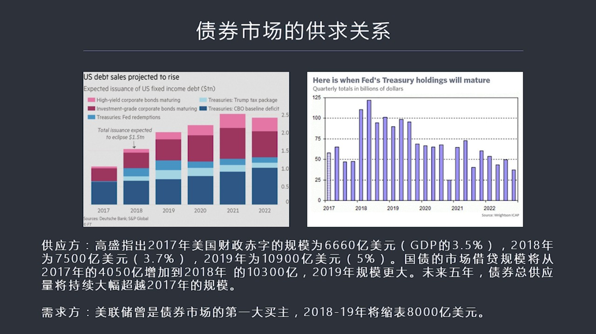

我们知道你赤字就要靠国债就是靠国债来融资政府才能够搞赤字那么赤字规模是多大呢2017年去年是6660亿美元相当于GDP的3.5%2018年今年赤字规模会扩大到7500亿美元变成了GDP的3.7%2019年将会一下达到10900美元也就是今年和明年这个达到财政赤字的规模将会越来越大而2019年财政赤字...

<strong>Cleaned narration</strong>

> 我们知道你赤字就要靠国债就是靠国债来融资政府才能够搞赤字那么赤字规模是多大呢2017年去年是6660亿美元相当于GDP的3.5%2018年今
> 年赤字规模会扩大到7500亿美元变成了GDP的3.7%2019年将会一下达到10900美元也就是今年和明年这个达到财政赤字的规模将会越来越大
> 而2019年财政赤字将会达到GDP的5%那么在国债市场中就是有允论国债它的融资是要通过发行市场交易的国债那么这种市场借带规模比较2017年市
> 场中新增的可交易国债是4500亿美元2018年将会一下翻翻到10300亿美元2019年规模会更大未来5年之内总的债权购义量将会大幅超越201
> 7年当我说这个总的供应量不仅包括国债也包括比如说这种垃圾债权还有可投资债权等等加在一起我们看左边那样图你会看到跟2019年相比到2019年时
> 候它整个发行规模就翻了一倍了就是整个融资的规模上万亿美元了然后到了2021年和2021年会达到2万多亿甚至到2万5千亿美元左右这都大大了超越
> 了2017年1.9万亿这个水平所以可以说未来5年债权市场的供应量一年比年大供应从供应角度来说供应量变大了那么从需求方来说就是我们看右边那样图
> 这张图是美联储未来未来5年的缩减资产负赏表扰这样的一个速度这样的一个速度的图表我们可以从这个图表中看出什么呢可以看到2018年和2019年这
> 两年是美国缩表了这个高峰值的两年这个时间窗口之内美国将有8千亿的国债将从自展负责表上被淘汰掉这意味着什么呢以前中央银行是债权市场的最大买主现
> 在最大买主没了而且还在不断的紧缩它的资产负赏表在第一大买主没了再搞紧缩负赏表了过程中又会带来流动性的相对紧缩在这么不利的情况之下供应却翻了一
> 番而且越来越多那么这个市场供应就关系当然会逆转也就是债权市场会出现越来越明显的供不应求就是供过于求这样的这样的一种局面这意味着债权的价格将会
> 大幅下跌就是所谓的熊市债权的熊市而它的收益率将会不断地提高这就是我们可以看到未来一段时间美国国债的基本 国债收益率的基本走势就是不断地上涨正
> 是因为这样我们才能够判断出来美元的内因它是在越来越强的因为美国国债收益率跟加国债收益率之间的差距落差越来越大这会对美元构成越来越强大的信力对
> 各国资本构成越来越强大的信力同时外部的竞争对手欧元今年情况将会比去年更糟各种情况政治经济诸多的因素所以大家对欧元将会从一种过渡希望转发成失望
> 正是于内万一两重因素所以它存在着强大的反向的这种力量所以我们很多人看做外汇人都看过美元说今年美元会暴跌有没有可能哪一天出现反转呢当美元利空的
> 信息出进了而欧元的不好的消息越来越多美国这边的债权收益率持续不断地上涨这样一拉一推两种力量内因在拉万因在推这两种力量作用之下会不会形成趋势的
> 反转呢从逻辑上来看从收律分析来看我认为会的这就是我们在排除舆论排除心理的这种媒体怎么说朋友怎么说投资人怎么说市场怎么说排除这些东西之外我们剩
> 下的只看逻辑和数据这样你才能够做出派子才也才敢于做出判断否则的话就是人云亦云了所以从这种分析来看美元这个它的这种趋势在未来的一段时间之内特别
> 是欧阳的负面消息和美元的好各种好消息包括债权收益率不断上涨在这个过程中会在某一个时间点出现反转这个时间点在什么地方可能是2018年下半年也可
> 能是2019年上半年主要看债权的收益率在什么点出现一个超越这个预执美国时间过程收益率跟其他国家收益率之间超过一个特定的预执就会引发资金的反转
> ...

---

### Slide 9

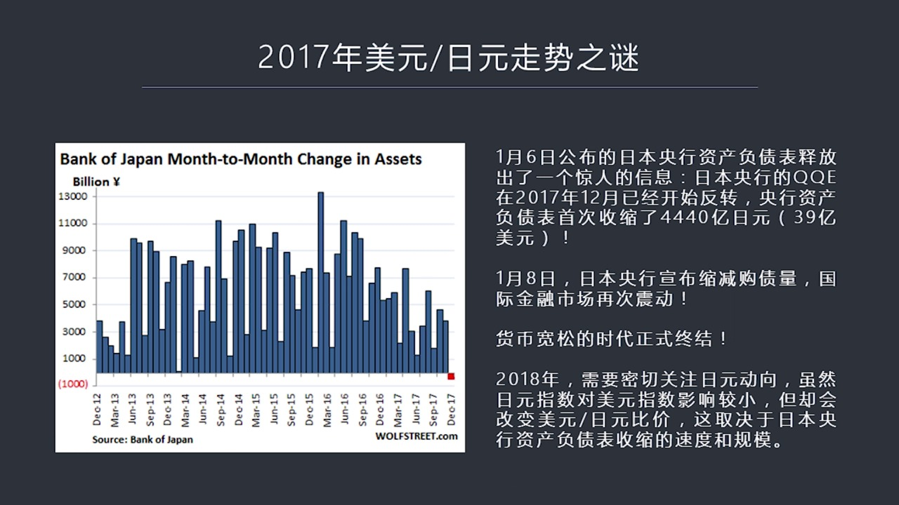

一方面是日本实际上在2017年如果我们看这个左边亮图你会发现在2017年它真正的够债规模也就是它所谓像市坊市像市场市坊的流动性市坊的货币比前几年比2013年以后任何一年都要少甚至在12月份出现了资产负赛表了收缩这是近几年以来非常罕见的也就是说日本已经悄悄地在进行紧缩了在进行缩表了而市场大部分人还没有...

<strong>Cleaned narration</strong>

> 一方面是日本实际上在2017年如果我们看这个左边亮图你会发现在2017年它真正的够债规模也就是它所谓像市坊市像市场市坊的流动性市坊的货币比前
> 几年比2013年以后任何一年都要少甚至在12月份出现了资产负赛表了收缩这是近几年以来非常罕见的也就是说日本已经悄悄地在进行紧缩了在进行缩表了
> 而市场大部分人还没有意识到虽然它资产负赛表收缩的规模不太大也就是4400亿日元左右但是它却象征着一个趋势的反转也就是货币宽宗时代在全世界各个
> 主要国家里面都已经现在面临结束了包括日本这样的超级宽宋的货币也开始缩表了或者日本没有用这个词而已那么在今年怎么来观察日元和美元这间的比较关系
> 呢因为日元它变得很强是由于它在美元指数中间占比比较小所以它对美元指数了直接影响力并没有那么大不想欧元那么大但是对于美元和日元之间的比较这个问
> 题它却又直接影响力所以我们如果要分析日元和美元在今年它这个比较关系到底谁强谁弱这个现在来看当然是日元强美元弱因为美元指数对基本上对所有国家都
> 在变制但是这个情况是不是会持续很久这个要取得于美国国债十年国债收益率上涨了速度搞明白这个问题才能判断有效判断日元和美元到底谁更强现在对十年国
> 债上涨的这个十年国债收益率上涨的速度还很难做一个精确的一个预测按照我看到了这种各种分析报告有人说会达到2.8%到年底也有人说会脱13%如果真
> 的是要脱破13%我觉得这就是一个非常强的一个对美元性的这么一种力量而且是个心理上的一种预值所以我们现在只能大致着评估3%的十年国债收益率是很
> 多东西反转的信号不管是汇率还是股市都会在这个点上出现明显的这个变化好这是第2个问题下一个问题我们是第3个问题是判断石油走市石油走市我们在20
> 14年的分析中主要使用的逻辑就是沙特他为了保障自己的财政不至于破产

---

### Slide 10

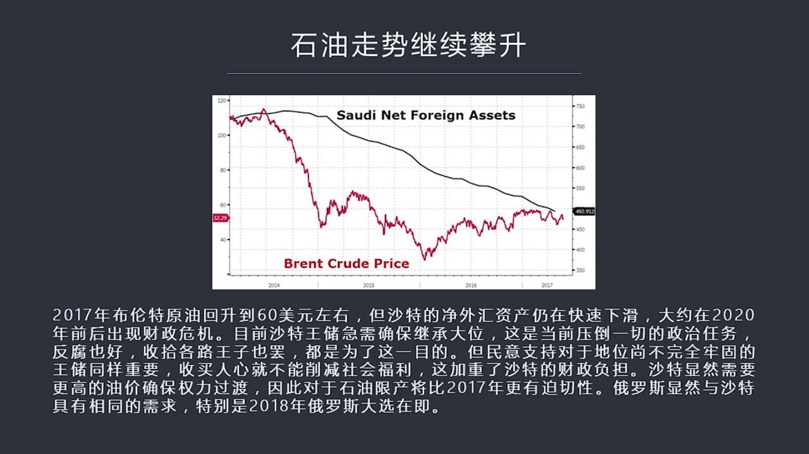

所以他不得不跟俄罗斯联手真正的真心实义的搞石油现产只要沙特真心实义搞现产石油的产量就会受到很明显的影响就会导致估计关系中出现一个紧平衡油价就会上涨那么现在今年我们继续用这个逻辑来分析石油价格进一步就下一步会怎么走当然在我看来如果我们看这个脱的曲线你就可以看得很明显了因为在2017年的石油的上涨过程中...

<strong>Cleaned narration</strong>

> 所以他不得不跟俄罗斯联手真正的真心实义的搞石油现产只要沙特真心实义搞现产石油的产量就会受到很明显的影响就会导致估计关系中出现一个紧平衡油价就
> 会上涨那么现在今年我们继续用这个逻辑来分析石油价格进一步就下一步会怎么走当然在我看来如果我们看这个脱的曲线你就可以看得很明显了因为在2017
> 年的石油的上涨过程中石油价格在50多美元到60美元之间在这样的一个情况之下我们看黑线这是沙特的外汇资产竞资产即便是油价在上涨涨到了60美元附
> 近沙特的财政也就是这个外汇竞资产仍然在不断下滑速度一点就没有减低说明一个问题沙特开销太大了财政资次太大了就是财政上包括打仗包括干预其他国家的
> 内政还有一点也是更主要一点它需要维持国内的政治稳定也就是维稳为什么要维稳就是因为沙特的王楚现在急于上位而它面对一堆王子的这种挑战所以维持政治
> 稳定变成了一个至关重要的话题如果说不满了王子再加上不满了群众联合在一起它的地位就积极可威了所以要想在这样的情况之下维持一个政治稳定的局面就必
> 须要对老百姓进行属买也就是要增加福利不能削剪要维持一个庞大了财政开始要给各种样的这种医疗教育卫生等等这些公共福利需要不断的注入新的资本才能够
> 维持住这样一个高事业率情况之下老百姓还不造反还不上街闹事的这么一种这样的一种局面我们可以说是沙特的政治维吻费用最近两年应该是非常之高因为最近
> 两年也正是它争夺大位的关键时期所以除于这种考虑沙特将会需要石油价格不仅不能下降而且还需要它进一步上涨否则按照目前这个下降速度哪怕石油稳定在6
> 0美元它仍然会在未来的几年之内大概是在2020年前后也会消耗掉它的全步的外费禁资产它还是会破产如果2020年这个机程大为这事还没有完成那么这
> 个问题就麻烦了那个时候将会面临一个恶心通脏面临一个财政收支严重失衡面临一个老百姓上街闹事再加上不满王子联手在一起的这样一个危险局面所以换位思
> 考一下假如你是现在沙特网储你最关心的是什么问题机程大为怎么才能机程大为经济上一定要给老百姓足够了好处让他不造反才能够稳定证据而要做到这一切就
> 必须要求更高持有价格60美元就不够必须要70甚至更高80才能够稳定沙特的局面怎么办还是需要跟俄罗斯加强联合进一步去现产当然俄罗斯本身也有这种
> 需求因为他2018年也要大选普京要想继续做江山或者他指定人要做江山那么俄罗斯内部就不能乱他主要靠持有所以这两国家有切实的迫切的政治议员搞联合
> 推高持有价格当然我们会看到美国的烟油好像在彭博发展包括美国的能源署都做出了预测美国的烟油在最近几年是有可能突破但是这种突破也就是达到了197
> 0年水平到了900多万桶1000万桶石油每天这样的生产量那又怎么样呢因为美国会消耗中间的绝大部分能够真正向全球进出口的石油数量是很小的也不像
> 沙特他1000多万桶石油绝大部分是出口的俄罗斯也是你美国大部分石油自产自消能卖到国一市场上这个石油数量是有限的所以美国的烟油即便是增长对全球
> 的整个的这种市场分配也不会购成明显影响还有一个最重要的因素是石油市场的大买家中国印度等等日本韩国这些大买家主要是依赖中东石油而中东石油都是含
> 流量比较高的这种重置油他们跟美国这个烟油它是不一样烟油比较清比较甜含流量很低所以清治原油生产出来要想出过重置原油或者高含流的这种原油的练油厂
> 它是没有办法直接生产的中国和包括很多石油生产国依赖中东石油的含流量比较高所以它的练油装置都是适合于这种石油的清治油到这儿练不了不经过大规模技
> ...

---

### Slide 11

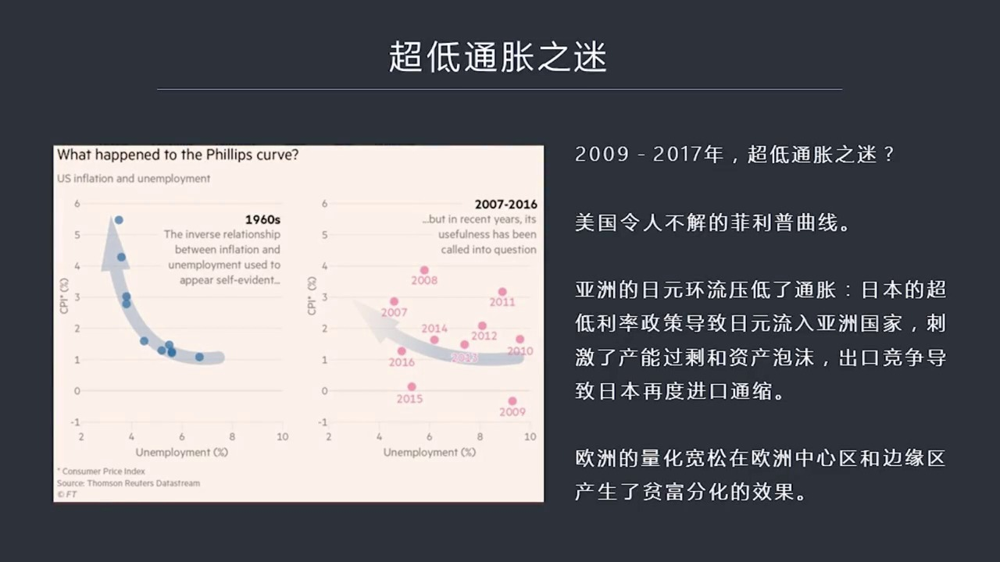

长达八九年时间里面全世界都陷入了超低的通脏很奇怪因为我们看左边这张图根据菲律福曲线你会看到以前美国经济复苏的时候我们看了横作标志代表事业率事业率不断往下走同时这个曲线会往上调起来往上走这个曲线就是CPI和膨脏但是这一次2007年到2016年这个回答你会看到虽然是业率在下降但是CPI上涨的幅度却比较低...

<strong>Cleaned narration</strong>

> 长达八九年时间里面全世界都陷入了超低的通脏很奇怪因为我们看左边这张图根据菲律福曲线你会看到以前美国经济复苏的时候我们看了横作标志代表事业率事
> 业率不断往下走同时这个曲线会往上调起来往上走这个曲线就是CPI和膨脏但是这一次2007年到2016年这个回答你会看到虽然是业率在下降但是CP
> I上涨的幅度却比较低也就是印了这么多草票怎么这个物价就没涨呢美国人很不理解这一点当然了在亚洲低冲脏主要原因是由于日本超低利率政策导致日本流入
> 了亚洲国家就由日元流入亚洲国家之后刺激了产能过剩资产泡沫由于这些亚洲国家之间彼此竞争然后去争取出口所以导致了价格上不来通过膨脏上不来所以日元
> 实际上是输出了这个通缩输出了一种通过紧缩这种效应那么它的日元的幅利率迫使日元流向海外而海外又变成通缩力量又被日本进过回来所以在日本形成了很多
> 的这种我们看到日本的长达很多年的通缩主要的力量其实是源于它超低利率政策你越玩低利率它这个通过膨脏越起来其他国家产能过剩物价也起来欧洲亮欢松在
> 欧洲造成了中心区和边人区之间的平分化越来越严重那么你在边人区的这种购买力它的生产效率就提不上来生产率无法进步市场越来越贬贫产业结构越来越单一
> 那么当然这个社会的消费能力各种能力都会受到极大的限制这就使得世界的主要经济板块都无法出现明显的通脏那么为什么我现在认为通脏将在2018年明显
> 的抬头呢就是托普正正正在续日代发这首先要讲一个理论我们看这些PPT所谓飞雪方程式MV等于PP

---

### Slide 12

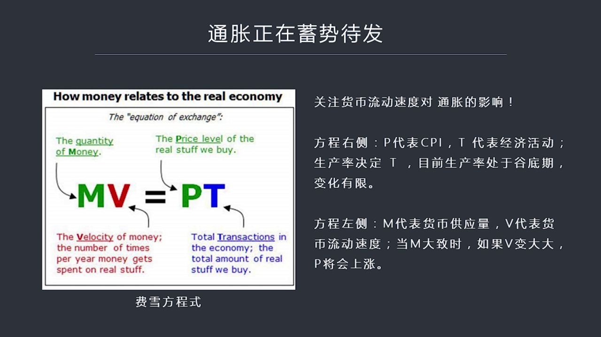

虽然比较粗套但是原理是对的M是什么呢货币购用量这是社会中存在了货币的这种数量为什么微使货币流动的速度就是一块钱在经济活动中在一定的时间周期里面比如说一年之内它换成了几次注意啊我们在刚才讲到超低力率超低这个通脏为什么会出现主要考虑大家说货币多了货币多了东西就会长是这样吗当然不是如果大家货币静态的增加而...

<strong>Cleaned narration</strong>

> 虽然比较粗套但是原理是对的M是什么呢货币购用量这是社会中存在了货币的这种数量为什么微使货币流动的速度就是一块钱在经济活动中在一定的时间周期里
> 面比如说一年之内它换成了几次注意啊我们在刚才讲到超低力率超低这个通脏为什么会出现主要考虑大家说货币多了货币多了东西就会长是这样吗当然不是如果
> 大家货币静态的增加而不流动的话它就等于没有起到效果所以这就好像我们理解战争中间比如说美军一百万人由于它24小时可以在全世界进行远程投放所以它
> 一个人就可以相当于好几个人在作战它一会儿在这儿打一会儿在那儿打由于士兵运动的速度加快使它战斗力得以提升而中国和其他的国家你会发现士兵运动速度
> 比较慢虽然你有三百万大军你跟它一百万大军的作战能力是相当的所以货币的静态货币就好比是这种军队的人数一样你只有成一速度你战斗力才有意义静态的货
> 币无论你怎么增加如果大家都不流动V是零的话那么整个这个货币产生效果就是零哪怕你M是无穷的你又贴量了货币供应成天硬货币但是货币拿到边手中大家寄
> 货完也不卖那么整个的货币效应就是零无论它静态货币的数量多大所以这个V很重要货币流动速度非常重要但是却很少找到专门论数货币流动速度的这种这种文
> 章也好注重也好大家基本上比较忽略V这个数字美国量传统搞了这么多年没有引发通脏的一个很重要的原因就是这个V太低货币流动速度越来越慢这个货币的合
> 流流到一个合完那一趟欲助了它流动速度减慢之后导致了它对市场对误价所所产生那种力量远远不如我们正常所想象了那样PT呢方程这个右边PTP是代表价
> 格T呢是所有经济活动的交易总量不管是物质生产还是服务有一次交易买卖一次它就会形成了一个价格把这儿交易总量和价格存在一起产生了总的效果就是货币
> 的战斗力我们可以这么来讲那么如果我们从这个方程式我们如果看左边看这个方程的右边你会发现这个P呢实际上PRIZ它代表了CPI代表了这个物价这个
> T呢它实际上代表经济活动不管你是服务不管是服务还是生产那么由于现在生产率在美国现在出于低谷在全界也出于低谷这个种低谷期我以前专门分析过这可能
> 跟人口周期有关所以生产率会长期处在一种比较低的让它之下也就是说生产和服务的效率没有办法很快的提高这就导致方程式右边这个T它这个数量变化有限我
> 们假设它趋劲于一种长量那么这个P由于方程式左边M成为如果变大的话P就会跟着上涨也就是会产生通过膨胀效应关键是以前在2018年以前M成为V这个
> 数字由于V太小虽然M很大所以它总数并不是这两个数字成结M成为V并不是特别明显这就导致了P不太高但是如果现在M货币供应量本身虽然在缩表但是实际
> 上它的货币总的供应量由于银行放带M2还是在不断上升的只不过上升速度要慢我们可以把V在短期之内变化也是做一个变化量较小的一个数字这个V就很重要
> 了如果货币流动速度增加P将会显周上升那么这个M成为这个V货币流动速度会不会上涨呢我们看下也比VT你会发现2016年6月货币流动速度明显的加快了这张图什么意思啊

---

### Slide 13

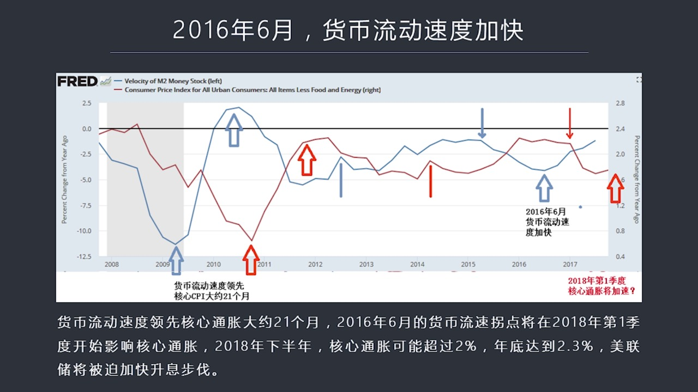

这张图是美联储的这个货币流动速度M2这个栏线所代表的货币流动速度和CPI核心CPI红线两者之间的关系图在这两者关系图上我把一些明显的一些模式用箭头标准出来了你会发现货币流动速度是引导性的因素或者叫发动机或者叫驱动力而CPI是跟着货币流动速度而变化的就是一个是原因一个是结果当货币流动速度加快的时候过一...

<strong>Cleaned narration</strong>

> 这张图是美联储的这个货币流动速度M2这个栏线所代表的货币流动速度和CPI核心CPI红线两者之间的关系图在这两者关系图上我把一些明显的一些模式
> 用箭头标准出来了你会发现货币流动速度是引导性的因素或者叫发动机或者叫驱动力而CPI是跟着货币流动速度而变化的就是一个是原因一个是结果当货币流
> 动速度加快的时候过一段时间之后CPI核心CPI将会明显的上升两者的间隔是21个月但这个在很多文线中都提到了也就是如果我们发现货币流动速度发生
> 变化我们大概可以推测21个月之后核心中章的利率也将跟着变化那我在图形中用一组一组的栏色和红色的箭头标准出来了它之间的两者之间的相关性从这个驱
> 线中你可以看到大致的两者之间都是货币流动速度领先于核心中章21个月那么我们现在看到的货币流动速度明显加快的时间点是2016年的6月货币流动速
> 度显著的提升了那么在此之后我们看到物价在很长一段时间没有什么反应它继续下降但是从2017年开始2017年6月份开始物价开始有了一些反应特别是
> 一些先导性的物价指数开始上涨那么根据我们现在这个时间推断的话2016年6月开始的货币流动速度的轨点加速的轨点将会在2018年第一季度发挥明显
> 的效果就会带来通过膨胀的上涨所以根据降了一个推断我们可以认为今年第一季度很多国家的核心通脏率比如说美国它核心通脏率是1.7很多认为这恐怕未来
> 很长一段时间都会保持如此但是我们从这个关系图上已经可以看出了今年第一季度一定会重现明显的变化那么根据这样的推算我们可以认为到2018年下半年
> 通过膨胀的指数核心通脏指数有可能超过2%到年底甚至有可能达到2.3%或者更高所以这个情况核心通脏了明显上升将打乱美联储按照它计划加息的步伐它
> 有可能背后或者提前加息或者加快加息的速度或者力度来作为应对如果我们看下液下液我们看到会不会流动速度还会引起一系列连锁反应

---

### Slide 14

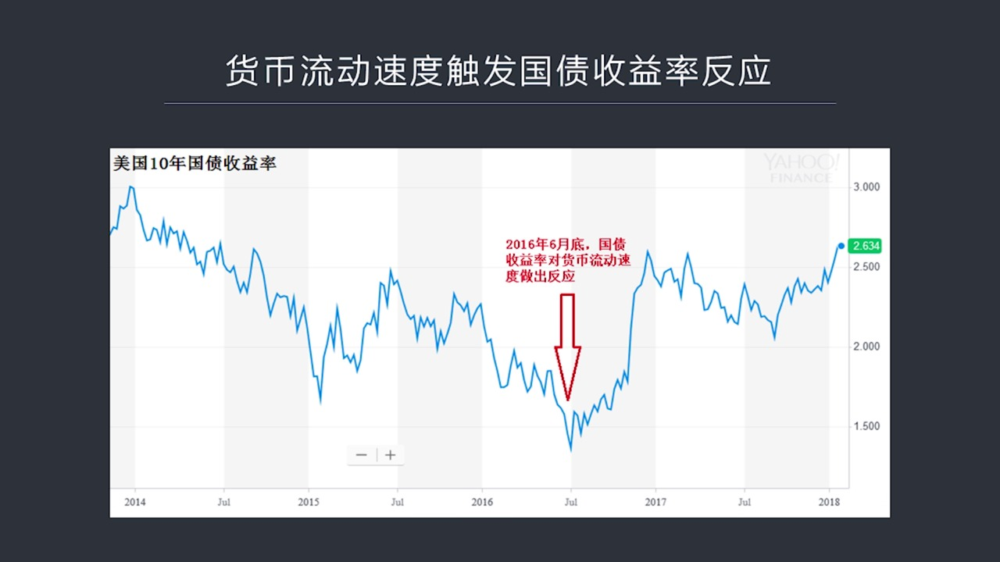

比如说获得比流动速度的加快将会引发国债收益率的发生反应为什么呢因为国债收益率某种意义上就是对未来进回报的这种进收益率的一种预测如果你会不会流动速度明显加快那么收益率将会相应发生变化这就是市场经济神奇之所在你在这边一动那么很多人就会根据他们的交易行为就会产生另外一种连带性的效果所以我们如果看十年国债收...

<strong>Cleaned narration</strong>

> 比如说获得比流动速度的加快将会引发国债收益率的发生反应为什么呢因为国债收益率某种意义上就是对未来进回报的这种进收益率的一种预测如果你会不会流
> 动速度明显加快那么收益率将会相应发生变化这就是市场经济神奇之所在你在这边一动那么很多人就会根据他们的交易行为就会产生另外一种连带性的效果所以
> 我们如果看十年国债收益率你会有明显发现它的反转点就是2016年6月底当后面流动速度发生拐点的时候国债收益率一也在同样一个时刻发生了大幅上涨的
> 反转应该说2016年6月是十年国债收益率历史上的最低点正是从这个最低点开始一直到现在国债收益率从1.4%左右我已经快放了一倍了现在6.6%多
> 除此之外我们还可以在很多方面看到类似的跡象比如说有些鲜脑性的指数大动商品的指数就在2017年

---

### Slide 15

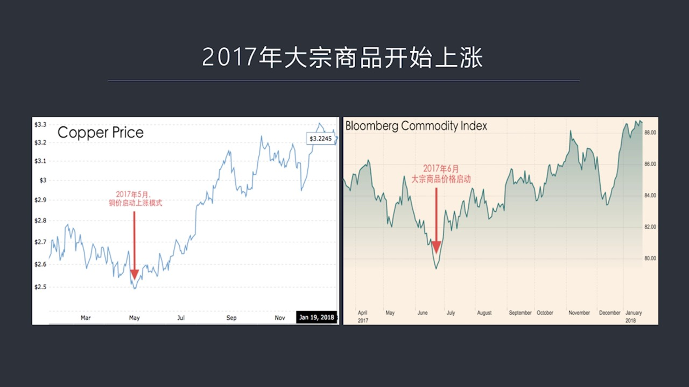

提早开始发生了反应比如说2017年的5月我们看到同全世界同价格开始明显的上涨开启了到目前为止新一轮的同价上涨了这样的一个趋势同样如果我们看它的大动商品指数也可以看出来是在2017年6月大动商品指数开始价格启动一直到现在越来越明显的一个启动的模式出现了如果我们看下液我们可以看到2017年石油煤炭也都是...

<strong>Cleaned narration</strong>

> 提早开始发生了反应比如说2017年的5月我们看到同全世界同价格开始明显的上涨开启了到目前为止新一轮的同价上涨了这样的一个趋势同样如果我们看它
> 的大动商品指数也可以看出来是在2017年6月大动商品指数开始价格启动一直到现在越来越明显的一个启动的模式出现了如果我们看下液我们可以看到2017年石油煤炭也都是在6月份开始上涨所以这就不是一个普遍的

---

### Slide 16

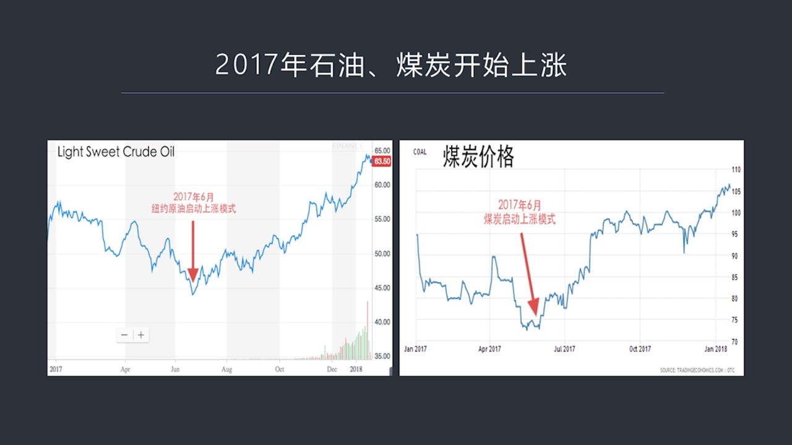

单一的一种一种价格是在上涨而是普遍性的价格上涨比如说石油如果石油价格反转上涨的话那么将会带动所有的物价都跟着上涨这叫基础资源价格上涨那么核心通脏率由于扣出了能源比如说石油被扣出掉了视频被扣出掉了它所写是核心CPR由于扣掉了能源扣掉了15所以它所写是出了上涨的反转将会比石油价格将会推迟推迟一些但它终归...

<strong>Cleaned narration</strong>

> 单一的一种一种价格是在上涨而是普遍性的价格上涨比如说石油如果石油价格反转上涨的话那么将会带动所有的物价都跟着上涨这叫基础资源价格上涨那么核心
> 通脏率由于扣出了能源比如说石油被扣出掉了视频被扣出掉了它所写是核心CPR由于扣掉了能源扣掉了15所以它所写是出了上涨的反转将会比石油价格将会
> 推迟推迟一些但它终归会显现出来正是由于通过膨胀的2018年的低纪度之后可能会明显加速这将会导致这种利率上涨的速度会加快也就是各国中央银行他们的货币政策

---

### Slide 17

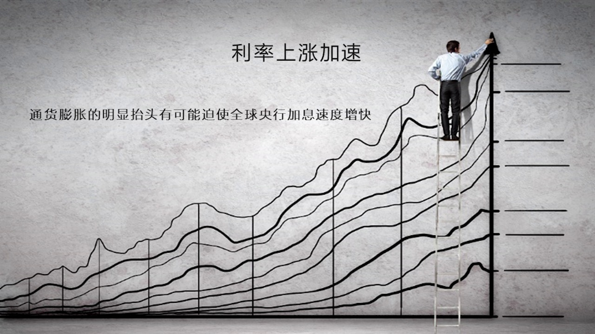

一个最重要的目标是丁通过膨胀假如通过膨胀上涨加速那么加稀的速度也会增加或者加稀的力度也会增加它的主央目标政策它的模型的主央目标就是为了锁定通脏所以通脏上涨将会导致中央银行的基础利率尽快的跟上通脏的步伐或者叫做出这种反应所以加稀的速度会加快力度会加强超乎市场的预期除了这个之外还有债券由于转入熊市收益率...

<strong>Cleaned narration</strong>

> 一个最重要的目标是丁通过膨胀假如通过膨胀上涨加速那么加稀的速度也会增加或者加稀的力度也会增加它的主央目标政策它的模型的主央目标就是为了锁定通
> 脏所以通脏上涨将会导致中央银行的基础利率尽快的跟上通脏的步伐或者叫做出这种反应所以加稀的速度会加快力度会加强超乎市场的预期除了这个之外还有债
> 券由于转入熊市收益率也会大幅上涨所以这两个因素不管是中央银行的因素还是市场的交易因素都会导致2018年整个市场的利率水平将会不断地抬升而且有
> 加速的趋势搞明白这四个问题之后我们再来看未来股市的前景将会面临三个问题第一是通脏抬头第二是利息的加速上涨

---

### Slide 18

利率的加速上涨还有债券的由于转熊为什么这三个因素对于股票具有这很大的上涨力呢通往膨脏不用说了通往膨脏直接影响且的利涨率利息上涨也不用说了利息上涨对股票永远是不利的债券转熊呢主要是由于美国股市上涨它的主要的援动力在于上市公司在债券市场上利用超级低的利息融资借债然后回够自己的股票把股票流通数减少美股收益...

<strong>Cleaned narration</strong>

> 利率的加速上涨还有债券的由于转熊为什么这三个因素对于股票具有这很大的上涨力呢通往膨脏不用说了通往膨脏直接影响且的利涨率利息上涨也不用说了利息
> 上涨对股票永远是不利的债券转熊呢主要是由于美国股市上涨它的主要的援动力在于上市公司在债券市场上利用超级低的利息融资借债然后回够自己的股票把股
> 票流通数减少美股收益率增加导致股价的上涨这是最重要的一个因素如果你债券市场变熊了债券不好卖了或者说你要卖的成本比较高说于地上涨了那么这种回够
> 推高股市这种模式就会被打破这几个方向这三个方向都对股市的前景会构成重大的影响这就带来一个问题了那么利用股市的暴跌利益金融危机利金融市场的这个
> 风暴究竟还有多远关于这个问题我想我们会在以后的课程中专门挑这个一个时间给大家系统介绍一下如果我们判断这种金融危机的话应该用哪些标准怎么来判断
> 它的这个什么时候形成开始起步什么时候到了一定的阶段可能会出现重大危机的反转等等那好今天我们关于2018年其实某种意义上也应该包括了2019年
> 因为这两年都是危机可能爆发的时间创口只过相对而言2018年的概率叫小2019年概率较大我们分析了地缘政治也分析了经济热点那么最后提醒大家注意
> 一下金融两年应该是危机最重要的一个70时刻尽管我们在外面看到了很多关于经济在不断加速所有国家经济都在下好这样的报道但是不要忘记我们的一个基本
> 判断是金融危机会早于经济摔退也就是在经济增长情况之下金融危机有可能提前来临而由于金融危机的来临导致经济陷入摔退而不是相反这是我们判断这个经济
> 走失了一个重要的一个前提就是不是经济摔退引发金融危机相反是金融危机又发经济摔退今天我们客先上到这里谢谢大家

---

### Slide 19

<strong>Cleaned narration</strong>

---
