# 核心课视频-019.市场恐慌指数（上） — Detail Slide Notes

> **来源**：鸿学院核心课程  
> **幻灯片**：13 张

---

### Slide 1

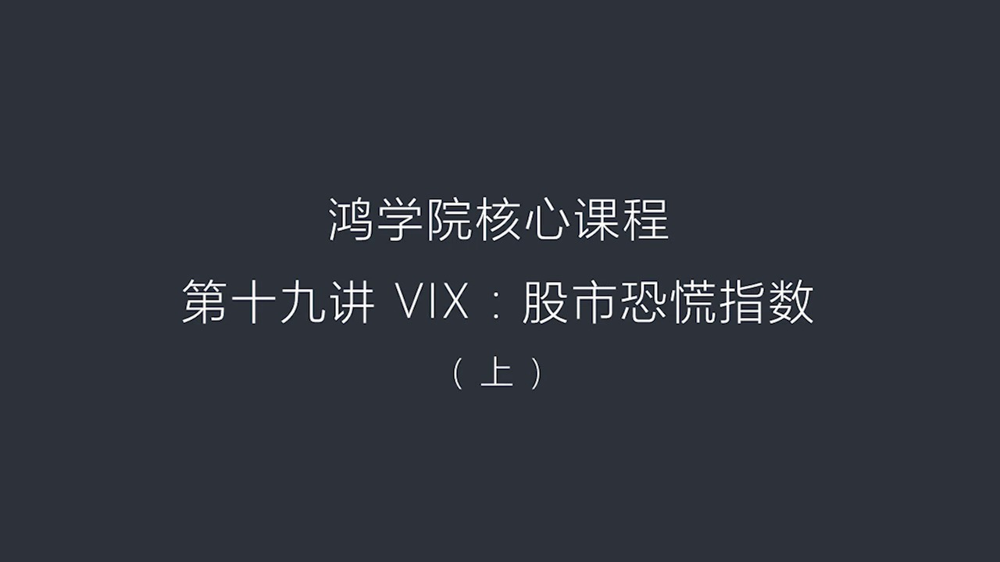

WIX 股市恐慌指數或者我們可以稱之為是波動力指數我們都知道2018年2月6號全球出現了一次重大的股災

<strong>All subtitles</strong>

> WIX 股市恐慌指數或者我們可以稱之為是波動力指數我們都知道2018年2月6號全球出現了一次重大的股災

---

### Slide 2

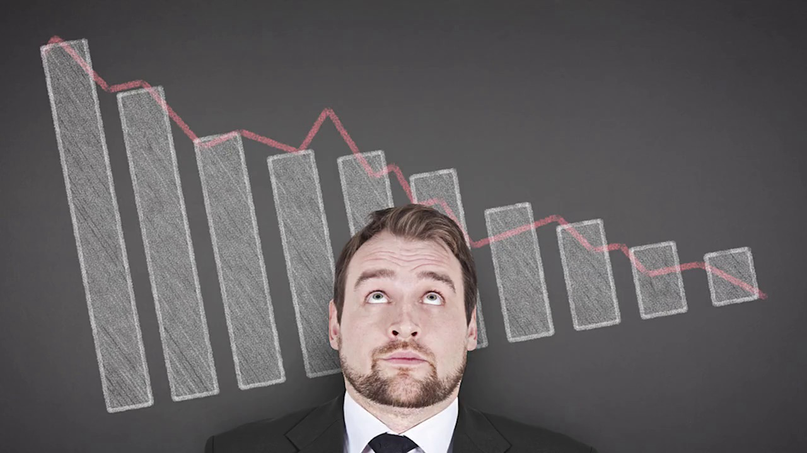

從美國開始,迅速波及到了歐洲和亞洲幾乎全世界所有主要的市場都在一個星期之內遭到了學習那麼關於這次重大的股災現在通過各種渠道來分析的話其根本的根源,或是說它的導火所就是源於股市的恐慌指數或者叫股市的這種...

<strong>All subtitles</strong>

> 從美國開始,迅速波及到了歐洲和亞洲幾乎全世界所有主要的市場都在一個星期之內遭到了學習那麼關於這次重大的股災現在通過各種渠道來分析的話其根本的
> 根源,或是說它的導火所就是源於股市的恐慌指數或者叫股市的這種波動力指數出現了一個大幅度的標聲由這種標聲激起了,或者引發了全球股市連鎖反應關於
> 這個問題,我想分兩劫課來產數我們第十九講,也就是這些課的上半部分重點講一下這個市場波動指數波動力指數,它到底是什麼樣的東西因為對於我們普通人
> 來說如果大家超股票,哪怕你參與股票的投資但是對於這種恐怖指數,關注肯定是比較少的因為在中國市場中,比如說上海的股市,深圳股市並沒有提供很多有
> 效的工具讓你參與這個市場,所以由於你沒有實踐過,沒有參與過對這個市場的變化的這種敏感度,還有它背後它所帶來的一系列嚴重的衝擊和影響就不可能有
> 一些直觀和深入的理解第二部分,我們重點去談這種市場波動性,這種恐慌指數在全球現在投資的這些領域中間那麼它出在一種什麼樣的地位就是上半部分,我
> 們重點講一個簡單的概念下半部分,我們著重去談市場波動力在全球的資產配置中,它的獨特地位和它深遠的影響我相信通過這兩講,大家會對Vex這個指數
> 會有一個比較深入的認識而且我相信可能未來如果爆發吸引輪的金融危機的話,這個Vex指數同樣會體驗出非常明顯的,就是這種標聲這樣的一種現象那麼由
> 此所引發的一系列聯合反應,我相信在下一次的危機中同樣會存在好,我們今天回個頭來先講上半部分首先,這個Vex指數,它到底是什麼概念Vex它是市場波動力指數,它的定義

---

### Slide 3

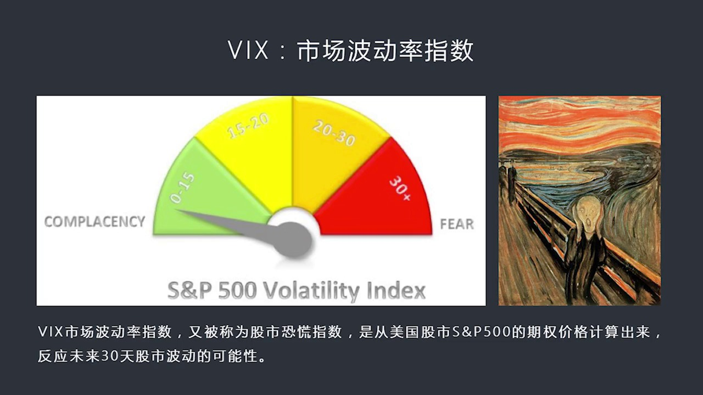

如果我們把這個,我們看PBT第一頁,我們把它做成一個醫療盤的話,你會發現當這個指數在20以下的時候,表明市場的心理比較平靜大家沒有什麼太多的恐慌,那麼對未來市場的預期是相對平靜的但如果這個指數超過20...

<strong>All subtitles</strong>

> 如果我們把這個,我們看PBT第一頁,我們把它做成一個醫療盤的話,你會發現當這個指數在20以下的時候,表明市場的心理比較平靜大家沒有什麼太多的
> 恐慌,那麼對未來市場的預期是相對平靜的但如果這個指數超過20%達到30%以上,達到30%以上的話,那麼就代表這個市場存在著越來越強烈的不安的
> 情緒那麼這種不安的情緒,它體現在股市波動上,它的幅度將會加去震盪所以從這個醫療盤讓我們可以看到0-15,它是一個偏低的15-20,是稍微可以
> 接受的這麼一個情況那麼20-30就變得不太穩定,30以上就說明市場陷入恐慌狀態了那麼首先,這個Vex市場波動力指數它是怎麼來,它是怎麼形成的
> ,或是怎麼來計算的在這裡我們首先強調一下,這個Vex指數是基於美國的股票市場,SMP500這個市場來進計算的當然,我們知道美國有很多這個股票
> 市場,比如納斯達克、道雄斯Vex它選擇的是美國最有代表性的最大的500家公司然後以他們這些上市公司的股價做成一個全重形成的這樣的一個SMP5
> 00的這種指數,這是這個市場那麼它在整個美國股市中具有著非常明顯的代表性它代表大盤股,或是我們稱之為藍抽股代表了美國經濟的基本面的這些重要的
> 公司都在這個市場中,那當然納斯達克它是偏技術的其實我們還可以看到一些其他的這種市場那麼Vex這個指數是基於SMP500這個市場這個是我們首先
> 要有一個概念當我們談到Vex的時候,講的是美國股市的SMP這套體系那麼它的價格是怎麼來計算的呢實際上是從SMP500這個股票指數的7權的價格
> 來計算從而得到了這個Vex指數那麼它主要反映是這個市場對於未來30天這個市場震盪幅度大概有多大這種概率有多大是對未來市場震盪了一種可能性的一
> 種可以說是預測吧當然關於預測這一點市場中很多人是並不認同雖然我們從理論來看似乎它是可以預測市場的但是很多人認為它並不能說明什麼問題或者說不具
> 備真正的預測力但這個問題我們會放的下半部分去重點來探討我們現在只需要了解Vex是美國股市的一個最重要的表示它未來市場震盪幅度的一種可能性這個
> 數月大說明市場恐慌情緒也大這個數月小說明大家投資人心態比較比較平靜比較正常那麼在最近實驗以來我們可以看到這個Vex指數基本上是一個走下坡路的
> 過程也就是一個越來越低的這樣一個過程那麼在2017年的時候它甚至跌破了10到了9甚至更低這說明市場投資人對未來股票市場有一種高度的信心認為股
> 票市場將會非常的穩定但是你會發現也就是在一片秦空萬里的情況之下到2月初突然來一次驚雷是全世界的股市出現了巨大的動盪如果我們來看從歷史角度

---

### Slide 4

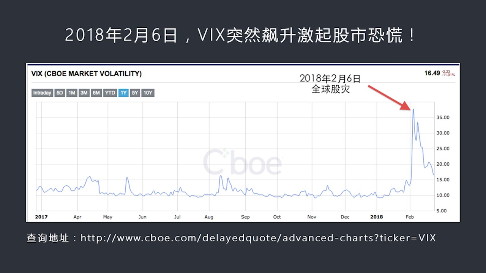

也就是我們看下野從歷史角度你來看2018年2月6號這一天Vex突然飆升的這個幅度你會發現跟201000以來的這全年這一年以來的這個指數變化可以明顯發現它這個規律太明顯了它就像一個地震的一個指示儀那麼在...

<strong>All subtitles</strong>

> 也就是我們看下野從歷史角度你來看2018年2月6號這一天Vex突然飆升的這個幅度你會發現跟201000以來的這全年這一年以來的這個指數變化可
> 以明顯發現它這個規律太明顯了它就像一個地震的一個指示儀那麼在2月5號6號這一天突然的飆升之前沒有半點爭招這也就是我剛剛所說的為什麼很多市場人
> 士並不認同Vex這個波動率可以預測市場在我看來它可能是更多的是反應出來一種後時進的效果我們回過頭來看發現了這個波動力突然飆升但是它並不真正代
> 表預測性所以我們可以從2月6號Vex的這張圖上可以非常明顯的看到那麼在2月6號之前這個市場指數大概在10到15之間波動但是到了2月6號這一天
> 也就是飆升了一倍還有多所以這次的突然的飆升是非常驚人的也正是這一次突然的這個波動率的飆升導致了大量的基金大量的金融產品特別是結構化了一些延伸
> 產品出現了嚴重的問題因為他們採措方向了大家都在這個毒未來波動率會越來越低怎麼會突出起來就飆升呢所以大部分人採措了方向中間出現了很多問題當這些
> 基金呢當這些公司出現了嚴重問題之後很多人一起幾乎是同一時刻背破賣出資產背破解除以前的對波動性了這樣一種合約這樣的行為集中體驗在一個時間之內又
> 發了市場大規模的拋售所以導致了股票市場的劇烈動盪出現了盜雄斯一天出現了上千點的這樣的一個跌幅這都是由於Wix指數突然飆升所造成的可以說這次骨
> 災的爆發的導霍索是Wix當然Wix突然飆升背後有更深的含義這個問題我們也放到下一堂課深入來解讀那麼如果我們從歷史的角度來看一下也就是我們翻到下一頁我們可以看到Wix這個指數跟股票市場之間的一種

---

### Slide 5

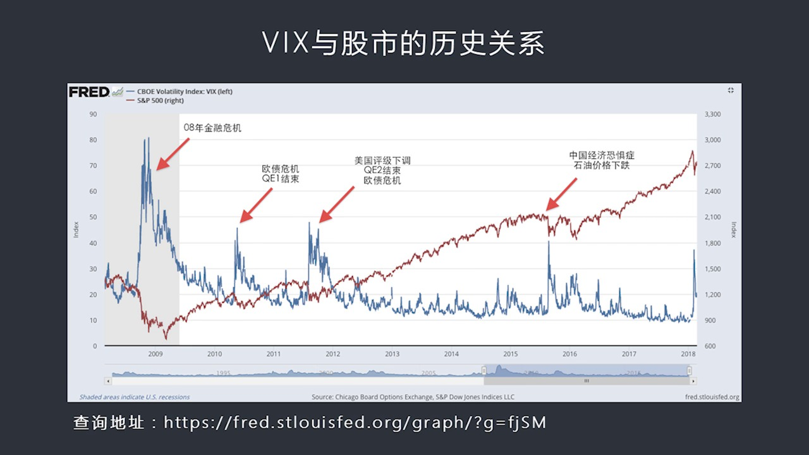

正好相反的關係附相關這種關係雖然不能說是百分之百的完全的相反但是在絕大多數情況之下是符合這個規律的就是股市這個走牛市的時候Wix指數是保持平靜或者這個指數是偏低的那麼當股市出現了大幅度的崩潰這個大幅度...

<strong>All subtitles</strong>

> 正好相反的關係附相關這種關係雖然不能說是百分之百的完全的相反但是在絕大多數情況之下是符合這個規律的就是股市這個走牛市的時候Wix指數是保持平
> 靜或者這個指數是偏低的那麼當股市出現了大幅度的崩潰這個大幅度的下跌那麼Wix指數將會同時飆升所以這兩者之間的相反的關係是我們要關注Wix指數
> 的一個重要原因也就是它代表了股票市場的健康情況如果我們從這個圖上來看你會發現2009年2008年金融危機的時候我們看到Wix指數也就是藍線所
> 代表了這個指數紅線我們看到底下是代表股票的走勢藍線和紅線之間顯然一件它是關係相反的那麼當時的這個Wix指數在2008年金融海秀的時候達到了8
> 0其實2月份2月6號我們那次才看到了還不到40而在2008年時候比這個還要高一倍所以那是一次超級恐慌80年一獄的重大的股票在那那麼如果我們看
> 第二個兼峰也就出現在2010年的這個下半年這一次主要是由於歐宅危機希臘問題爆發了同時由於兩岸松第一輪QE1宣布結束這兩因素加在一起導致了市場
> 恐慌情緒的極具攀升也超過了40那麼股票市場當然是大幅度下條股票回條的幅度也超過10%所以我們可以看到第二個這個波動率的高峰期發生在2010年
> 的這個下半年第三個波動率的高峰期也就是波動率高達接近50%我們可以看到這個股票市場同時也出現了大幅的回條這次又是由於什麼原因呢這是2011年
> 的8月由於美國的信用品質被調降這是一個原因另外還有一個原因就是兩岸松二結束第三個原因是歐宅危機持續不斷地再暴露出來所以三者加在一起三個因素結
> 合在一起導致了人們對股票市場的這種信心的崩垮這種信心的這種巨大的震盪所以我們看到再次出現了波動率大幅跳升的情況那麼我們再往後看也就是我們看到
> 2015年的8月2015年的8、9月出現什麼情況呢主要出現的是當年中國經濟出現了全世界對中國經濟要大幅的減緩或者所謂硬著路出現了一種恐懼出現
> 了一種恐懼症當然我們記得2015年5月的時候中國的6月開始中國的股票市場暴跌、匯率、
> 暴跌等等幾個因素又發了全世界對中國經濟的信心的一種恐懼症同時是由價格大幅下跌這兩因素結合在一起導致了我們看到波動率再次突破40%那麼再往後就
> 是2018年的2月那麼也就是從這個歷史的周期來看我們可以很明顯看到WIX指數跟股市表現的這個相關性是相反的有了這個明確的認識之後我們就應該產
> 生一種本能的一種意識如果要看股市現在是否表現良好那麼你從WIX指數上肯定能夠找到答案如果WIX指數非常高說明現在股市不太妙如果WIX指數不斷
> 在創新低未來股市的上漲的前景會比較好這是大多數人這麼認為當然大多數人認為有的時候也會出錯當然這個是我們下階課要重點談到了問題為什麼大多數人一
> 片看好情況之下股市會突然反轉我們如果翻到下野的話可以看到這個對WIX指數的一個基本認識究竟什麼是WIX指數什麼是市場暴動率什麼是恐慌指數它什麼意思

---

### Slide 6

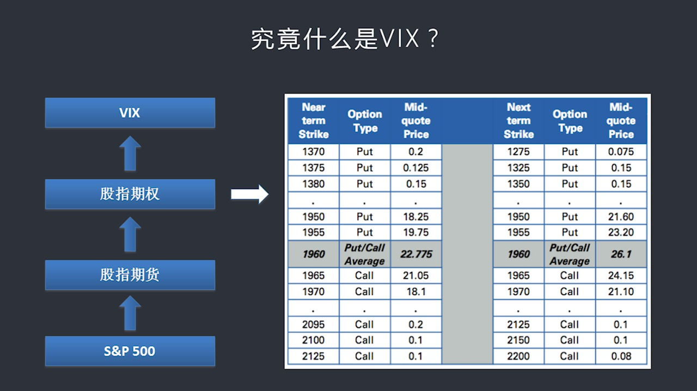

那麼要把這個問題搞清楚呢我覺得首先我們要有一個基本上的概念認識我們都知道這個SNP500這是一個股票底下有很多就是它的基礎資產是大量上市公司的股票就像我們上海上市公司一樣那麽SNP500它也有自己的指...

<strong>All subtitles</strong>

> 那麼要把這個問題搞清楚呢我覺得首先我們要有一個基本上的概念認識我們都知道這個SNP500這是一個股票底下有很多就是它的基礎資產是大量上市公司
> 的股票就像我們上海上市公司一樣那麽SNP500它也有自己的指數那麽在這個指數之上形成了第一層的眼神就出現了指數期貨股值期貨美國有中國也有那麽
> 在股值期貨之上進行了再次眼神就變成了股值期權這個期貨和期權有什麽差別呢可以說這個期貨它是一種合約比如說我認為上任指數在未來2月3月之內它可能
> 會漲到比如說未來1段時間之內可能現在比如說32我認為它會漲到4000所以我可以通過一個期貨合約的形式來實現我來認個一個它未來要漲到4000這
> 樣的一個合約那麽如果後來市場真的漲上去了那麽當然我就可以到這個合約結束的時候我就可以賺取中間的差價這是期貨的概念商品期貨和金融期貨股值期貨是
> 到底是一樣的我也可以賣空如果我認為現在比如說32月2我認為會跌到28月8月我也可以通過期貨合約的形式來實現而且我實用是保證金也就是加了槓桿所
> 以市場的起伏對我來說有一個放大的收益或者放大的損失這是股值期貨那麽什麽是股值期權呢這個期權跟期貨時間不太一樣這個期權是一種權力這種權力又說我
> 認為以後要漲到4000所以我在期權市場上買一個比如說看漲期權擁有一個看漲期權這個看漲期權並不是真正的合約看漲期權底下的底層資產是指了期貨合約
> 但是看漲期權本身是個權力我可以到時候使用這個權力我可以放棄這個權力如果我使用這個權力我出一點點錢出的出價不高我就可以鎖定一個到4200把它變
> 現的這樣一種這樣一種權力如果說我看走了眼市場走向相反我沒有看準那麼我會出現損失但是我損失最大的金額就是我預交的這個權力金也就是這個期權的這個
> Premium我把它損失掉了這權力金沒了所以我損失是有上限的而且這個數額並不大這跟期貨就完全不同了期貨你要做多少合約那最後你是要全職來賠或者
> 全額來賺期權不一樣期權是一種權力是一種擁有期貨合約的一種權力為這個權力你要支付一點點費用支付一點點權力金你最大的風險就是把權力金全部賠光但是
> 你不會輸得很慘當然這個如果市場上漲你的收益也不像期貨來得這麼這個賠的和賺的也不像期貨那麼大但是總而言之你的損失是有限的所以期權這個概念對於期
> 貨而言它比期貨的成本低而且更安全當然所謂的期權它的倍數低也是看你用不用尬尬你怎麼用尬尬總的來說我們可以認識到就是股票之上股票市場之上出現了股
> 票指數股指上延伸出了股指期貨股指期貨之上延伸出了股指期權那麼這個股指期權是什麼樣呢我們如果看右邊這張圖這就是一個SNP的一個實際的降了一個這
> 是他們白皮書上講這個Wix白皮書上舉這個例子從這個例子上我們可以看到在這張圖上在這張表中你會看到比如說大家對讀SNP的指數是1966你會看到
> 有些人是這個他認為這個可能會高一些有人出價可能會低一些然後他把高的值和低的值中間取一個中間值也就是最靠近的這個值我們可以看到這上面顯示是22
> .75有的人呢出價是19.75能出價是21.05等等那麼他在最接近的兩個叫買價和叫賣的時間形成這個StrikePrice就是這個成交的這個價
> 格然後我們可以看到在這張圖上呢左邊它顯示NearTerm右邊顯示NextTerm這什麼意思呢因為我剛剛提到了Wix是對未來30天SNP指數的
> 一個預測所以他在30天這個這個到7日的往前7天23天和往後7天37天他就是以30天為中間點往前7天往後7天分別出現了兩個不同的期限如果往前的
> 話我可以認為我們稱之為NearTerm往後的話我們可以稱之為NearTerm就是靠近我們的這個期限和下一個期限我要去這兩個不同的數列當然了這
> 個價格選擇還有其他的說法這個說法什麼呢比如說我要取的是如果說有人叫買價出的零只要有零的我全部不取我要取很多期權的和約的價格凡是帶零的我肯定不
> 要這是一個規矩當然除此之外還有一些其他的一些要求所以經過篩選之後我選出來這個價格顯示的這個圖表中當然我們可以看到它這個出現了兩種期權Poot
> 和Cold是什麼呢就是所謂的看長期權我們稱之為是Cold看爹期權我們稱為Sput當然我們不需要大家去在這一堂課裡面去深入理解它這個期權在概念
> 我們只是說你看了這張圖之後你產生了一個基本的概念什麼是什麼是谷指谷指期權的價格它是怎麼形成的它是圍繞什麼樣的一個比如說谷指了這樣一個點形成了
> 這樣一個交易價格看起來是什麼樣有些最出現的了解就可以了那麼除此之外我們如果有了這樣一個成交價我們就可以來看因為我們剛剛說了Wix其實就是從這
> 個期權的價格中間推倒出來的那麼我們看下頁我們來看Wix指數它到底是怎麼算的下頁我就是專門講了一下Wix它這個數值

---

### Slide 7

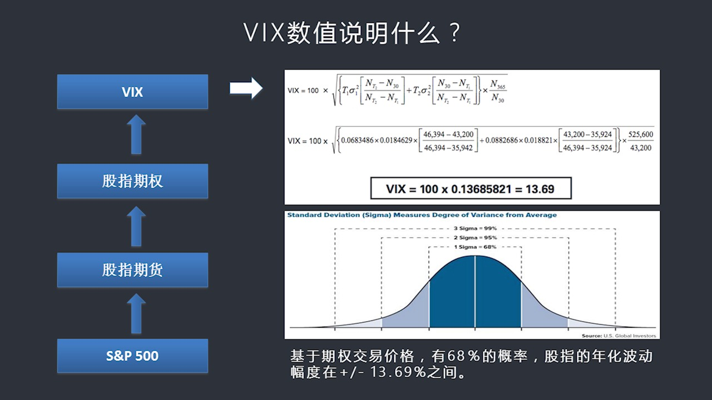

它說明了什麼或者它的計算方法是什麼首先來看計算方法計算方法我這裡並不想想下去談但是如果大家有興趣可以參照這個期交所這支價格的期權交易所他們因為是制定Wix的和交易它的一個平台和制定計算他們的這樣一個交...

<strong>All subtitles</strong>

> 它說明了什麼或者它的計算方法是什麼首先來看計算方法計算方法我這裡並不想想下去談但是如果大家有興趣可以參照這個期交所這支價格的期權交易所他們因
> 為是制定Wix的和交易它的一個平台和制定計算他們的這樣一個交易所所以由他們來公佈發佈然後定是更新每分鐘更新會或者每多少秒更新一次所以他們的網
> 站上有Wix這個計算的公式和它的白皮書從白皮書中你可以詳細看到它是怎麼選擇這些期權的價格根據什麼樣的條款來選擇那麼根據什麼樣的公式來計算我在
> 這裡只是概念性的列出了一個這個計算公式大家一看其實你如果理解它的意思你可以發現它的數學工具並不複雜基本上是四格運算也就是初中水平就完全能搞了
> 明白也能算得清楚並不是一個完全無法理解的好像一個很神秘概念其實很簡單並沒有那麼複雜那麼關鍵是它最後計算出來比如說按照它這個例子中計算出來的W
> ix是多少呢比如說是13.69我剛才說了情況之下低於10是屬於超級的大家市場超級心態超級的平靜超過20是屬於市場越來越恐慌那麼13.69還可
> 以相當於大家整個市場還還是屬於一個比較穩定狀態超過了10但是沒到20那麼這13.69究竟是什麼意思那麼這就是Wix數值它到底要說明什麼這個1
> 3.69它要說明的就是基於我們剛才從這個數學公式中推導來計算出來的7全的交易價格說明有68%的概率指的是在這個概率之下指的是未來有68%的概
> 率那麼未來30天之內整個谷指這個谷票指數比如說SNP500的這個指數它的年化波動幅度可能在政府的13.69之間來震盪當然大家看到這就覺得有點
> 意思了因為它好像是在預測未來30年未來一個月之內這個大盤會在一個什麼幅度之內震盪而且告訴你是13.69%13.69%的震盪幅度年化的而且可能
> 性是多大68%的可能性這玩意聽起來就很神奇了這不是說可以預測市場了嗎它這個原理和方法為什麼68%當然我們如果學學過政態分布學過統計的話你會知
> 道那正好是一個標準方差也就是我們下面這張圖所展現的這個政府直接一個標準方差的代表68%8%的可能性那麼這個東西到底有沒有道理因為我們知道它的
> 交易價格它這個Wix的這個數是從交易價格中得來的而交易價格是對於未來30天的7全的叫賣和叫賣價的加權平均值如果是這樣的話那麼也就是說它顯而易
> 見有一種隱含的市場的前瞻性在裡面所以這也就是為什麼大家說它是一個代表的市場未來走勢的或者代表市場一種波動性未來可能的波動性這麼一個指數具體去
> 分析它為什麼它不一定能代表未來或者說它就不能代表未來它只是一個後往後看的參數而不是往前看的參數到底很簡單如果大家都通過這個參數能夠預測未來那
> 不是人人都會虧損了嗎那怎麼會出現2月8號那樣的股市暴跌呢如果所有人都提前看到了這個事情它就會提前很久發生提前很久大家就開始解除這個合約就開始
> 逐漸退出了那就不會發生了那就軟軸路了泡沫還沒形成就刺破了那不就說明這個問題嗎提前30天大家應該有動作了沒有因為你不能夠預測未來就是說這種價格
> 的對未來30天的這個所謂的叫買家較賣家並不能夠真正代表未來當然這個原理是非常有意思的我們下堂課在分裔它的原理部分有了這個Wix這個數值的基本
> 的認識和它的代表它未來說明什麼我們就可以去深入去探討為什麼Wix又叫市場恐慌指數或者叫股市的恐慌指數這個東西形象說就好像天氣報

---

### Slide 8

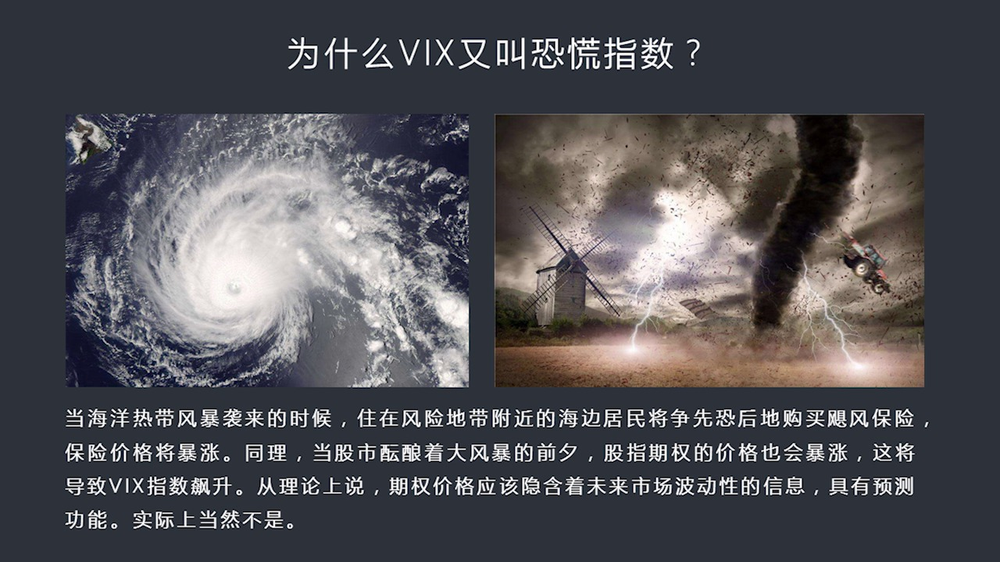

如果我們看到微星雲圖上一個熱帶的海洋風暴一個巨峰已經形成了那麼三天之後將會登陸佛羅里達比如說從這張雲圖上我們可以看到那麼所有住在海岸邊上這些居民立刻就慌了事了因為這個這麼大的巨峰衝過來那麼就意味著他們...

<strong>All subtitles</strong>

> 如果我們看到微星雲圖上一個熱帶的海洋風暴一個巨峰已經形成了那麼三天之後將會登陸佛羅里達比如說從這張雲圖上我們可以看到那麼所有住在海岸邊上這些
> 居民立刻就慌了事了因為這個這麼大的巨峰衝過來那麼就意味著他們的房子他們的財務會受到重大的損失所以這些居民就會增相恐後跑的保險公司那打電話或者
> 找人趕緊我要買巨峰保險我要買這個風暴保險當然由於大家都去買市場工作關係嗎那麼就意味著保險價格立刻就衝破了房頂就會飆升報長因為人人都看見了風暴
> 就要來了所以損失是必定的是一定會出現的保險公司當然我要不虧本我就只有提高價格再說搶的人多了所以我必須要提高價格必然也會導致價格上漲那麼這個道
> 理其實跟我們所說的Wix指數是一個道理也就是股票市場如果說很平靜的話比如說這個指數很低這意味著大部分人都認為股票市場在上漲或者股票市場正在上
> 漲既然在上漲又看不到潛在的風暴在哪裡我有什麼必要買保險呢我有什麼必要去這個對衝我的風險去保護自己的股票資產呢我一般是不會這麼做的那麼什麼時候
> 大家覺得哇我這個股票會損失慘重我依照保護我的資產那就當Wix指數大幅上升就好比是這個保險合同大幅上升一樣所以呢由於大家如果一起去保護自己的這
> 個股票資產那麼大家都會去搶Wix這個指數的所跟它相關的一系列這種合約這種合約我們可以稱之為是股市了一種保險我們可以稱之為是波動性的一種保險這
> 種波動性的保險是來保你的你所擁有的股票不是於大幅損失你買了大量這種保險因為這一旦股票上暴跌那麼Wix指數將會大漲因為兩者是相反的那麼也就是我
> 在股票上損失損失慘重但是我在Wix指數上我可以賺到一大筆錢兩者相互對衝之後相互抵消之後我損失不這麼嚴重這個就是Wix它在市場中的重大價值當然
> 這個時候它也反映了如果所有人都去搶Wix保險合約的話它一定會飆升這是為什麼我們看到股票上出現暴跌出現嚴重恐慌手Wix一定會飆升道理就是一個類
> 似於海洋保險巨峰保險這樣一個道理那麼如果我們看下一頁其實很多國家的市場都有包括執加哥這個旗艦教育所他們除了對股票上SMP做了這種指數因為原理
> 是一樣的同時他也給納斯達克也給到中斯也給什麼其他的市場甚至給固定收益類的市場給大東商品市場石油、
> 黃金、白銀等等他給很多市場都做了這種Wix指數類似Wix指數的這樣的一種波動性指數來表明每一個市場的他的緊張程度投尊的心理當然其他市場都沒有
> 這麼出名或者展示還沒有Wix這個市場那麼出名Wix現實現在是全天下人都知道但是那些波動性一般製造了很少使用人也不多那麼其實不光是美國在做這個
> 事兒他國家也在做你比如說中國上正指數其實也做了一個類似的Wix的指數就是中國波止波動力指數我們如果到網站上去查他叫iWix那麼他的股票代碼是00188如果你查股票的時候

---

### Slide 9

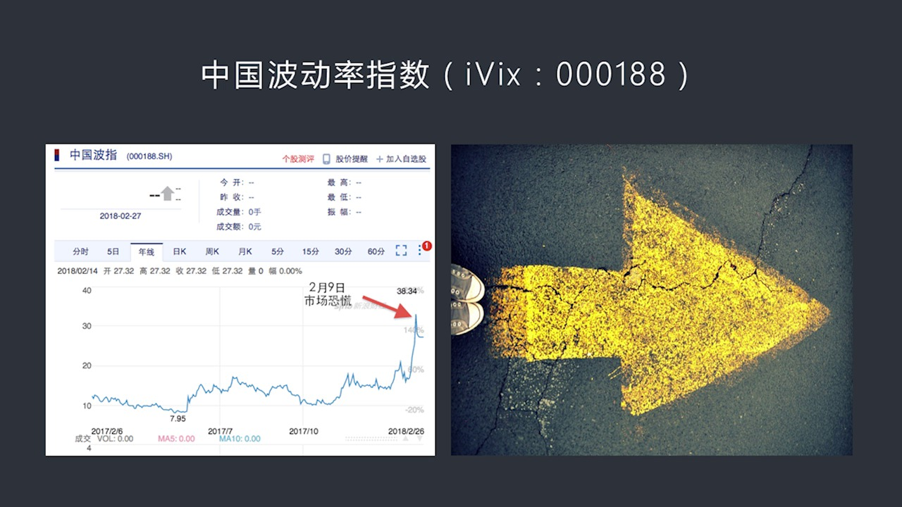

你打這個代碼你就可以看到這個大幅的指數波動率的這個指數或者叫中國的股市的恐慌指數他也有那麼如果我們來看這張圖的話你會看到中國的這個波動性指數也體現出了同樣的規律也就是在2月9號這一天市場波動率這個大幅...

<strong>All subtitles</strong>

> 你打這個代碼你就可以看到這個大幅的指數波動率的這個指數或者叫中國的股市的恐慌指數他也有那麼如果我們來看這張圖的話你會看到中國的這個波動性指數
> 也體現出了同樣的規律也就是在2月9號這一天市場波動率這個大幅提升從大概15以下跳到30%多你看中國市場是2月9號出問題美國市場是2月6號出問
> 題中間大概隔了3天也就是美國是週五好 中國這邊是週一或週二市場陷入恐慌說明中國市場是受到美國這個波動率的情緒的影響如果大家在中國市場中大家一
> 看美國市場出現了骨災而且暴跌得這麼厲害一看他一查他的波動率都非常添了那麼第二天第三天中國市場的很多做齊全的人中國這套波動率指數跟美國那個原理
> 是一樣就上正指數 直上有指數齊貨指數齊貨 直上有指數齊全有骨指齊全骨指齊全之上在出現在計算波動率所以中國那些做骨指齊全那些人也會向美國市場那
> 些同樣的方法操作所以他這麼一操作也會導致保險價格爆炸導致這個波動率指數爆炸所以很多認為中美市場沒有關係的資金不聯同如何如何但是你別忘了波動率
> 指數大家是你看我我看你的我一看你那邊爆炸了我這邊一下產生恐慌所以做齊全那些人就會立刻改變他們交易行為立刻就會大家都去比搶保險這保險價格立刻就
> 非常去了而所有一看波動率指數這麼高好家魂的是說明市場很糟了那我們趕緊賣吧這樣就會又發市場的大跌很多人是由於做指數這些人或者做齊全那些人受於他
> 有大量的池倉或者有其他的結構性產品他一看指數這麼標稱他被迫賣資產所以這幾個方面原因都會導致股票市場的爆跌所以不是資金的直接聯通又發了股票市場
> 的爆跌就是全世界各個股票市場的連續爆跌而是由於波動性指數是個跨國界的到的這麼一個指數在某個市場上連續出現了兩天的大幅度的這種爆跌將會又發所有
> 市場的控制所以有市場這種心理受到又發之後會改變他們在齊全在股市齊全方面的交易的價格會影響齊全定價這種齊全定價反過來就會影響股市反過來最後又影
> 響大盤所以它是這樣的一個傳列的過程當然了如果大家現在在去查上正的波動力指數00188你很可能看到它已經不交易了或者這個數據已經停止更新了一個
> 主要原因就是在出現了美國股市爆跌而且大家都知道是Wix又發的這個危機之後那麼中國這邊出於種種原因就停止公布這個數據了當然這個技術部門說在更新
> 這個技術模塊所以我們展示不發布一直聽到現在也不知道未來什麼時候發布這說明一個問題就是大家都明白這個恐慌指數你要發不出來就會給市場一個明顯的一
> 個指導就會告訴所有投資人現在市場心理怎麼樣那麼這個就好比是在戰場上這個主帥的大棋雖然大家在每一個獨自的一個站位上只跟兩三個人對打但是如果你遠
> 遠的可以看到你主帥的大棋是往前的走說明我們這支軍隊在往前進攻每個人都會抹著劍往前衝所以它整體就會發生一種發揮一種巨大的往前衝的力量但是如果說
> 每個作戰的人一回頭一看我們主帥的大棋在往後撤好家會說明雖然我看不到整個戰場的全局但是主帥大棋在往後撤這意味著大使不妙說明我們在全線虧退我也瞭
> 吧 我也逃吧所以它的作用在這為了避免中國股市這些投資人陷入盲目的恐慌所以我乾脆把這個東西關掉誰也看不見誰了你看不見主帥在哪也看不見這隻大棋了
> 大家就盲目幹吧所以在我看來這就是當市場出現不妙的證照說你直接把開關給關了直接把這個指標的開關給關上了這當然可以立刻的或者比較有效的改變市場的
> 這種心理不過從整個市場規律來看的話這就好比把高壓鍋的安全法給把它堵上了它最後的結果什麼呢你不知道真實的壓力有多大你不知道市場中真實的恐慌情緒
> 到底是什麼樣的沒有參照物你沒有一個溫度計也沒有一個壓力計我看不出來所以多晚站來看高壓鍋好像是沒事但是如果說你喪失的觀察的這種指標的話那有可能
> 當鍋炸開了你你也沒有意識到所以這就是我們要看這個波動力指數什麼時候恢復這代表了信心那種恢復不管怎麼說這個波動力指數對於全世界的各市場都很重要
> 不光是中國和美國有歐洲什麼其他國家都有如果我們再看下一頁這個WIX到底有什麼實際用處我們剛剛所說的所說的就是股票市場暴跌的時候WIX會上漲

---

### Slide 10

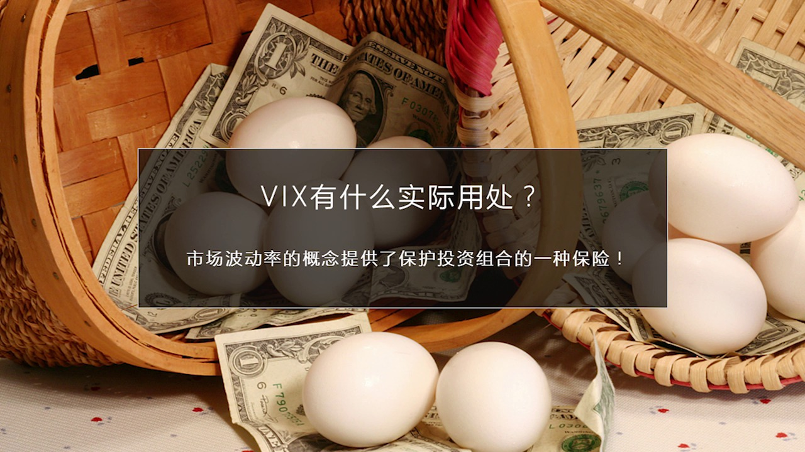

WIX上漲給我們一種概念這種概念就是似乎我們好像可以用這個辦法來保護我們的資產保護我們的投資組合你比如說如果張三李四王五都在上海股市中買了大量的股票或者在美國股上有大量的股票你這個股票最擔心什麼最擔心...

<strong>All subtitles</strong>

> WIX上漲給我們一種概念這種概念就是似乎我們好像可以用這個辦法來保護我們的資產保護我們的投資組合你比如說如果張三李四王五都在上海股市中買了大
> 量的股票或者在美國股上有大量的股票你這個股票最擔心什麼最擔心就是市場暴跌一暴跌你不就排了嗎有什麼辦法來對衝這種暴跌或者防止暴跌給我帶來這麼大
> 的損失有沒有一種保險WIX其實就是起到了一個保險合約的作用但是WIX它只是一個超像的概念WIX它是一個參數如果沒有其他的辦法把它具體化把它產
> 品化你看這個指數你也不能買你也不能賣所以你比如手要把它產品化之後而且可交易大家才能夠買和賣才能用它來保護我們的投資雞蛋藍子中間的每個雞蛋這就
> 是WIX它是一個抽象的概念只僅用這個抽象概念是不可能去保護你的資產的那怎麼辦呢這就是我們要看來下眼就是在WIX機上要衍生出更複雜的可以用來保護我們資產投資組合的

---

### Slide 11

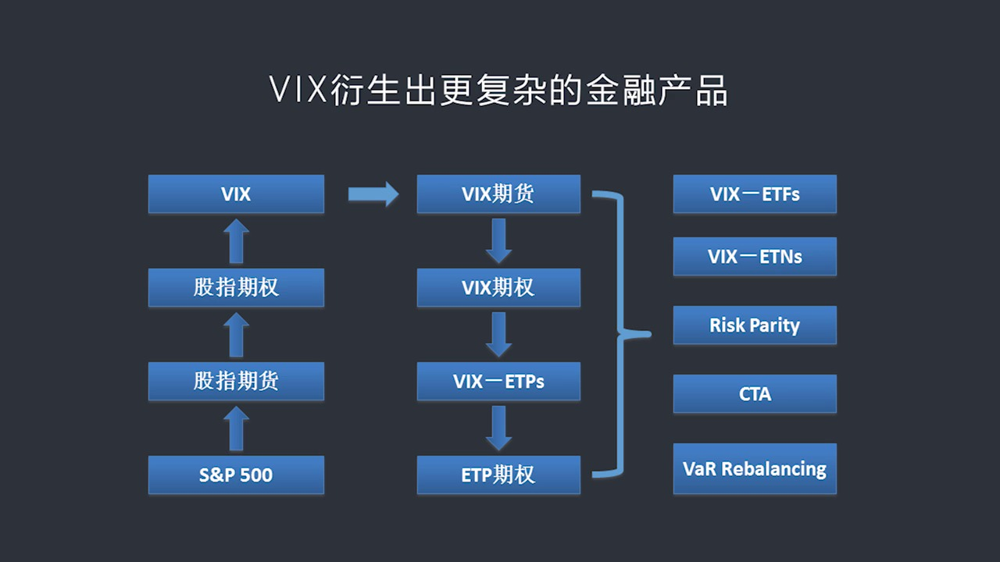

可以交易的這些金融產品才有用所以我們會看到這個眼睜產品鏈條變得更長了一開始我們有股票有SNP500有股值7貨股值7貨衍生了股值7權股值7權上又計算出了WIX然後從WIX又衍生出了兩個最重要產品一個是2...

<strong>All subtitles</strong>

> 可以交易的這些金融產品才有用所以我們會看到這個眼睜產品鏈條變得更長了一開始我們有股票有SNP500有股值7貨股值7貨衍生了股值7權股值7權上
> 又計算出了WIX然後從WIX又衍生出了兩個最重要產品一個是2004年推出的WIX7貨另外一個是2006年推出的WIX7權所以WIX7貨和7權
> 都是非常新的一個概念也就是在最近10年才開始流行而在中國恐怕還沒有人開始這麼操作因為這兩個東西還沒有發育出來所以中國做股票人還缺少這種意識但
> 是在全球投資領域中間做WIX相關做波動性我這TITLE TITLE的這幫人已經很多了在整個全球自然配置中他已經達到1.5萬億上萬億美元的規模
> 這個顯性和隱性的加在一起這就說明我們的投資的金融的理念實際上比國際上的這些比美國玩的一些最先進的東西還差了很久如果我們不能及時去瞭解它你就不
> 能理解全球金融上發生了些什麼問題作為洪學院這些學院我覺得最重要的就是你必須在理念上必須在概念上要跟全球的最領先東西提投並進你得知道全球發生了
> 最新的玩法是什麼最容易出問題的點在哪為什麼我們要這樣做其實從一個實際概念中來說我們可以做一個類比你比如說在中國改革開放之前台灣任何香港人他們
> 很早就理解了買房子的重要性因為買土地買房子一定能升值他們已經有這個概念但是大陸人當時還沒有所以當你改革開放的時候好多港商臺商進來之後到處圈地
> 買房最後他們在房地產中抱賺了一筆像李嘉誠就是最明顯的例子他的思想超前我們30年我們改革開放還沒有經歷東西他在60年代就已經經歷過了所以他明白
> 中國搞改革開放了中國大陸人還沒搞清楚什麼土地房地產還完全被這個概念他進來先收地然後最後在賣房子當然他可能臀地就已經抓到10位以上了這就是觀念
> 領先的重大意義我們現在也一樣中國上昣現在還沒有Wix相關的這種期權和期貨咱們現在可能還沒有發展到那一步但是如果你從紅圈的課程中你已經瞭解全世
> 界的這些資本的投資者們和這些機機們在怎麼操作什麼是流行的最流行的方法這些最流行方法背後又隱藏哪些風險也就是他們這波人現在吃大虧的地方在什麼地
> 方你就在觀念上領先了國內故事很多投資者一個好幾年的領先週期或者更長一段時間領先週期這種領先其實就是一種潛在的價值所以這就是為什麼我們一定要跟
> 蹤全世界最前演的東西原來就在這所以基於Wix這個計算指數又推出了這家這家歌的期權交易所以推出了期貨和期權這就是進一步的衍生因為有了期貨我才能
> 夠有一個具體可交易的金融產品或者叫基層的底層的這種資產然後我的期權在這個期貨之上再衍生然後我就可以配套兩個加代期我可以推出很多新的東西比如說
> 我就可以推出很多ETP的產品然後ETP又可以演成出期權的產品把這些東西綜合在一起我可以推出五花八門的新的產品這就是全世界現在玩的最多的最火的
> 在股票上在Equality這個市場中玩的最火的概念或者說這個最時矛的一些投資方法就是我們現在看到這個最右邊的一系列比如說跟Wix相關的跟它相
> 關的ETF所謂ETP大概可以分成兩種一類是ETF,一類是ETNETF就是我們知道交易所中可以交易的比如說黃金ETF,白銀ETF就是可交易的這
> 種類似於一種股權的基金它是可以交易的24小時交易期間交易的時刻中間它每時每刻都可以交易都可以熟悔它比共同基金方面多了我想賣就賣不像共同基金不
> 像一些其他的基金它有所訂期或者我每天只有一個價格收盤的時候才給你一個價格我當天也不能買,不能賣或者我幾天才能買一次ETF比共同基金要高度的零
> 火那麼什麼是ETN呢?ETN它是所謂Exchange Traded Note它是一種類似於債券的東西它跟ETF不太一樣它更像是一種債券這種債
> 券是有發行者它們一個人以這個公司的信譽作為單保來發行的所以它跟ETF在法律上不太一樣ETF即便發行ETF公司倒閉但ETF本身它是個獨立的法律
> 實體它的價值不受任何損失公司破產了,發現它的公司破產了它的價值仍然不會受到任何損失因為它是獨立的法律實體所有資產是放到它的名下的但是ETN就
> 不一樣它是一種純粹的信用債如果發行,發行商如果倒閉了它就沒價值了或者說你必須要破產清廠售你要排隊看你的優先級最後能拉回多少能迷不多少,損失迷
> 不多少但是ETN這麼一天這不是比ETF要差遠了嗎?其實也不一定因為ETN的成本更低它更靈活它涉及到很多市場新的一種組合就是用ETF你還沒有辦
> 法去碰這個市場你比如說我在宏觀中講到了像印度的市場印度上你進不去因為印度有資本管制你也不能隨便到印度開賬戶你也沒有印度身分贈,諸如此類的問題
> 但是你可以通過ETN來間接進入印度上因為VIX的一天做的是印度股市的波動率跟它相關的債券類的一天如果你投資這個一天的話也可以間接進入印度的股
> 市如果你不看好印度的股市你就買波動率會上漲你就看漲如果你覺得印度股市很好你就看跌所以不管怎麼樣它給你提供了一種其他沒有更好的辦法還沒有ETF
> 的時候或者說還沒有一個成本更低的辦法說間接通過做波動率進入這個市場的一個巧妙的工具當然這個一天就可以做得很濃化八門了我既可以做印度上我其實還
> 可以做伊朗市場還可以做土耳其甚至什麼非洲的某個市場當然不管是股市了可以做大動商品我還可以做任何的我感興趣的東西我都可以把它做成個指數然後跟這
> 個一天相關就可以在市場融賣投資人就會進來所以ETF一天是使得普通投資人在不用直接去做期貨和期權交易因為期貨期權都相對來說更複雜期貨風險更大期
> 權交易起來一般人搞不太明白比如說期權定價原理豬是此類的所以用ETF和一天這種相對來說比較被動的辦法可以給普通投資人提供一個進入做波動性的這樣
> 的一種新興的資產領域的一個同道和方法但除了這個之外還有像Risk parity所謂風險的評價的這樣的一種策略CTA也是一種策略包括風險的Re
> bellance等等這都是一些投資的策略不管這些名字叫什麼其實它背後都是在做的市場的波動率所以我們會看到除了這些之外還有大量的其他的可供選擇
> 的類似金融產品很多人以前不斷的提問以前有同學問過就是好像除了買股票就沒有什麼其他投資方式了那是因為你的知識和經驗不夠其實我們看到真正的股票市
> 場只是SNP500而它以衍生出了這麼一大套衍生產品這些衍生產品又推出了一整套跟這個衍生產品相關的新的這種可交易基金或者是投資策略如果你有豐富
> 的知識這些東西當然你都可以投選擇範圍是可以說是非常非常廣闊的但是這前提要求就是我們必須要真正搞明白這個市場它到底是怎麼運作的真正理解它的風險
> 前的風險在哪裡然後才能很好地去駕馭這個市場才能去投資並獲得收益好 今天關於這個Wix市場波動應指數或者叫恐慌指數的上半部分我們先講到這兒最後是給大家參考文獻

---

### Slide 12

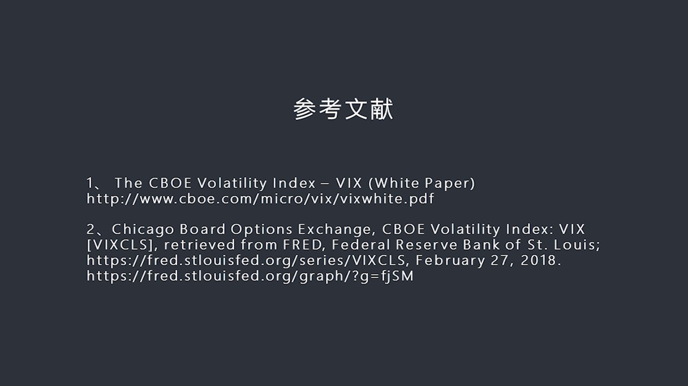

主要在這講中設計到這家哥七全交易所他們的白皮書怎麼計算就是它這個Wix的計算方法然後第二個是關於歷史相關性歷史股票市場和Wix間相關性這可以參照美聯儲的他的一些工具那麼在這裡我還給出了他的練習通過這些...

<strong>All subtitles</strong>

> 主要在這講中設計到這家哥七全交易所他們的白皮書怎麼計算就是它這個Wix的計算方法然後第二個是關於歷史相關性歷史股票市場和Wix間相關性這可以
> 參照美聯儲的他的一些工具那麼在這裡我還給出了他的練習通過這些練習大家可以到這個網站上去做更進一步的了解和研究好 今天這一刻我們先上了這兒謝謝大家參加

---

### Slide 13

<strong>All subtitles</strong>

---
