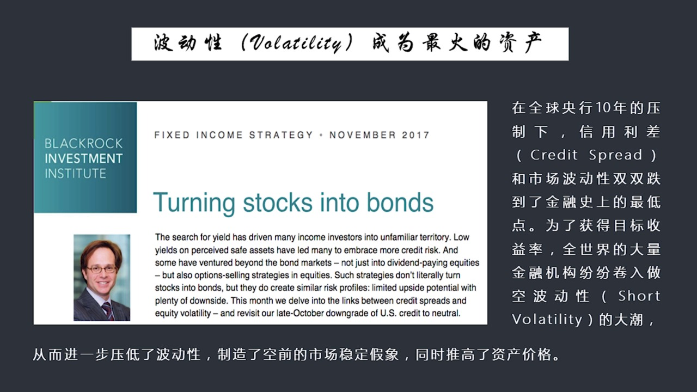
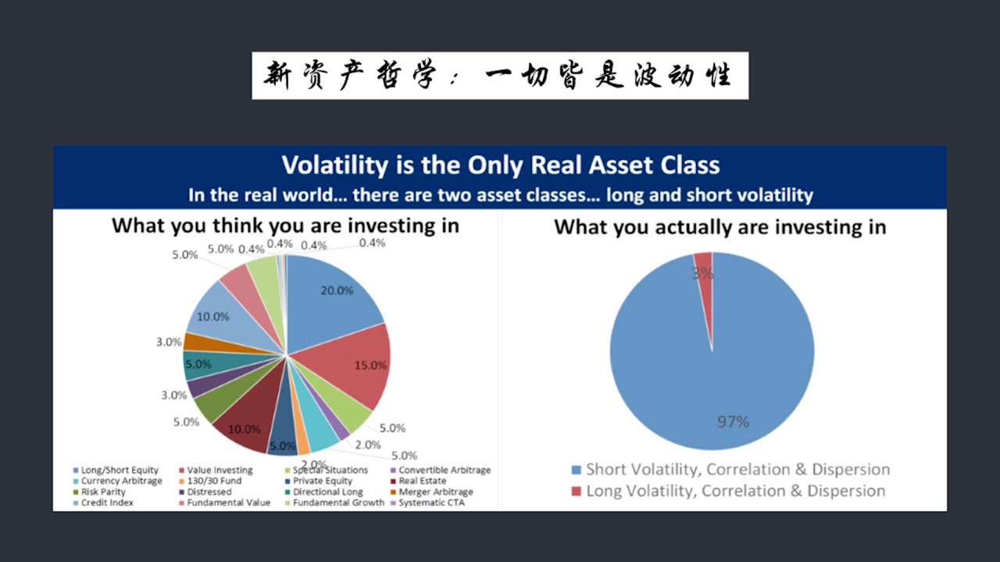
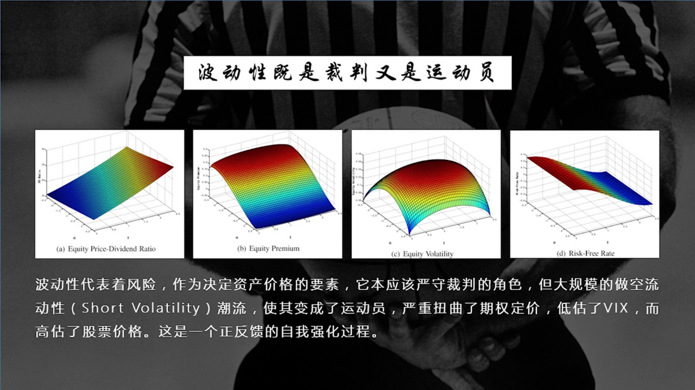
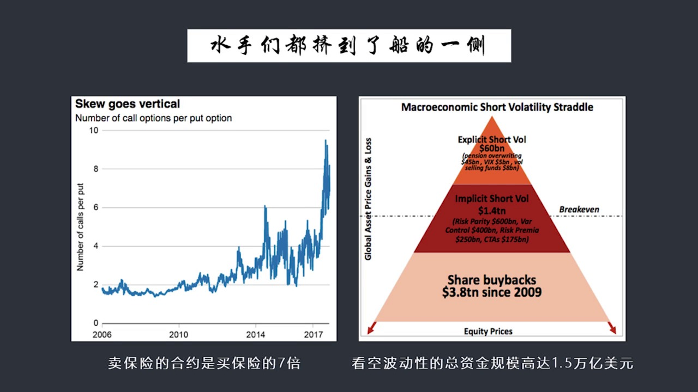
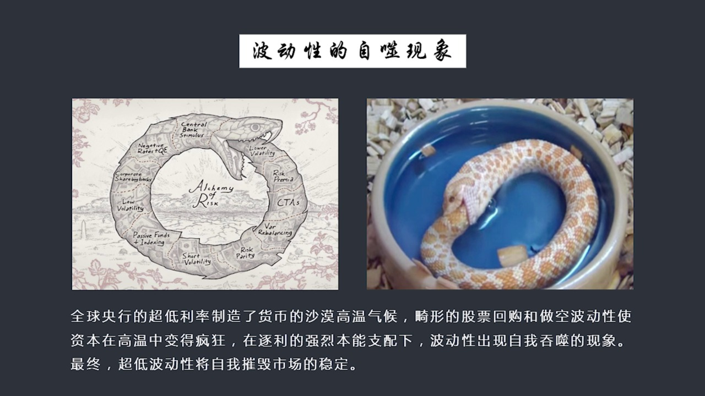
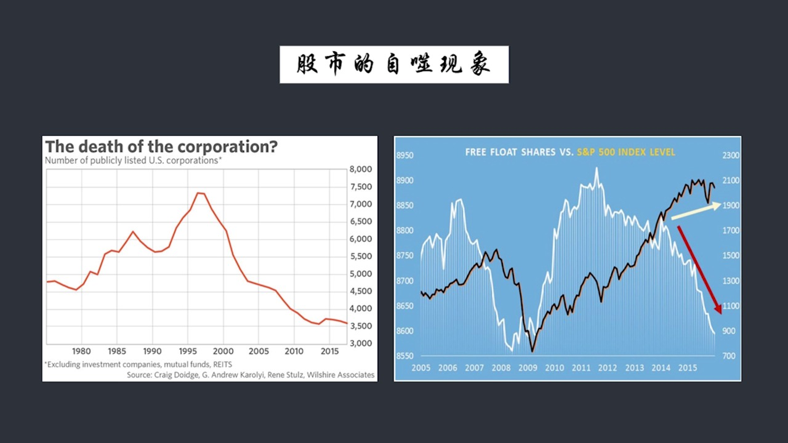
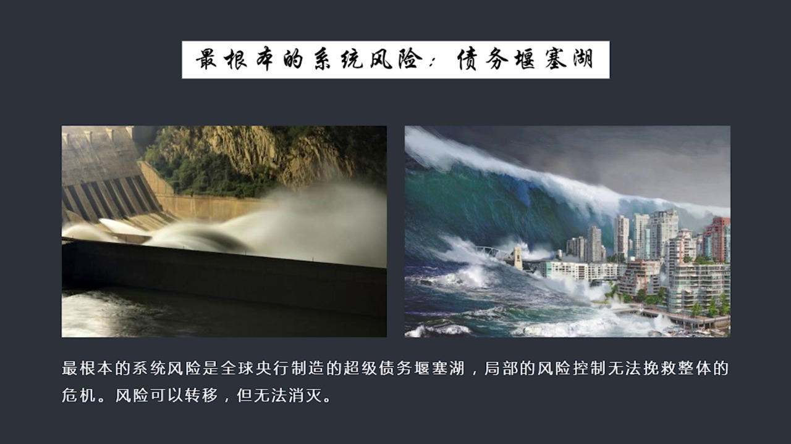
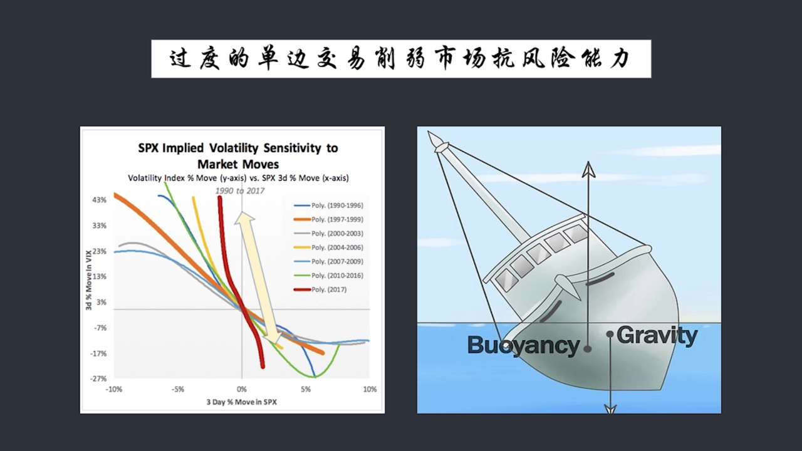
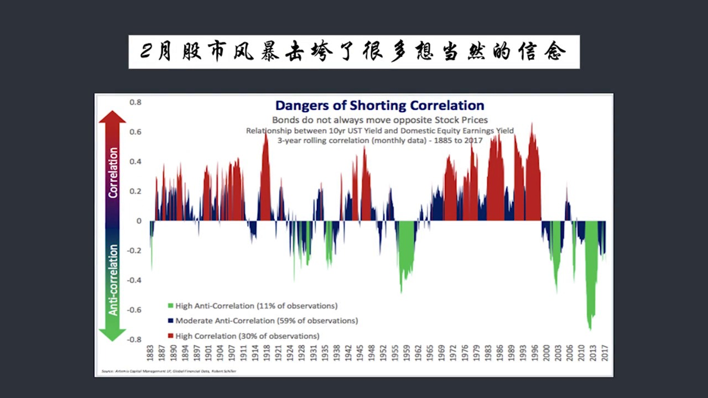
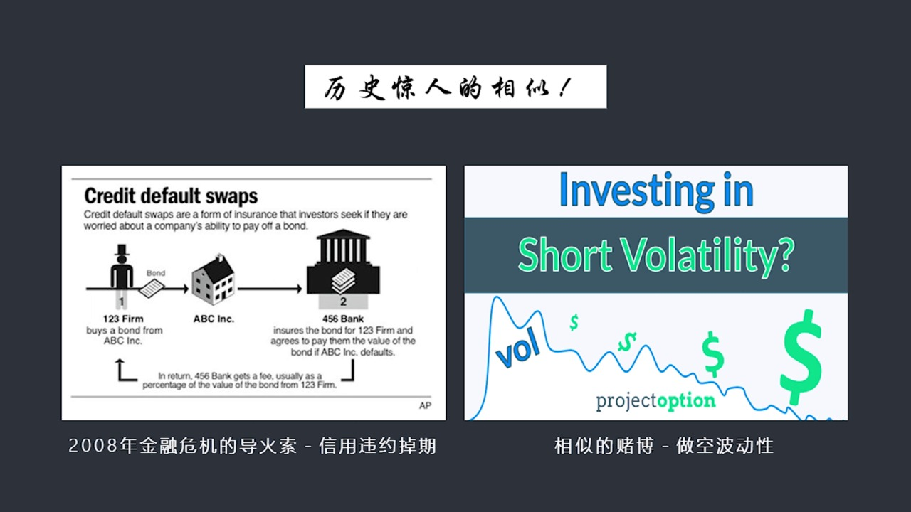

# 核心课视频-020.市场恐慌指数（下） — Detail Slide Notes

> **来源**：鸿学院核心课程  
> **幻灯片**：13 张

---

### Slide 1

市場恐慌指數的第二部分我們在上一節課中談到了Wix就是股票的波動率這個指數或者說就要市場恐慌指數我們主要是談到了它的一些基本概念但是沒有深入去談它背後的原理這堂課我們將接著上一節課的話題不過今天我們講...

<strong>All subtitles</strong>

> 市場恐慌指數的第二部分我們在上一節課中談到了Wix就是股票的波動率這個指數或者說就要市場恐慌指數我們主要是談到了它的一些基本概念但是沒有深入
> 去談它背後的原理這堂課我們將接著上一節課的話題不過今天我們講的會更深入一些首先 Wix它只是市場波動率中間力重而我們今天將會從一個更高的高度
> 更抽象的這麼一個概念來談這個波動率這個概念就是為了Tippity當今世界現在這個概念是一個可以說是投資界最熱門的一個概念怎麼圍繞波動率去做各
> 種各樣的金融產品去做各種各樣的金融創新或者我們也可以稱之為就是金融的鏈單數基本上是圍繞波動率這個概念來賺的所以呢我們今天將把波動率這個概念單
> 獨提煉出來然後用一個更廣泛的這個眼光來看待為什麼我們現在是市場正在變得越來越不穩定首先我們看第一頁 PPP的第一頁是什麼導致了我們看到了二月份突如其來的股市暴跌

---

### Slide 2

在我看來這只是一個前照只是拉開了序幕那麼是什麼導致了這種市場情緒的不穩定狀態呢在我看來主要是金融危機之後美聯儲推出的兩號看中政策和全球央行搞的就是貨幣寬鬆這種壓制手段就是壓低利率製造這種資產泡沫這種手...

<strong>All subtitles</strong>

> 在我看來這只是一個前照只是拉開了序幕那麼是什麼導致了這種市場情緒的不穩定狀態呢在我看來主要是金融危機之後美聯儲推出的兩號看中政策和全球央行搞
> 的就是貨幣寬鬆這種壓制手段就是壓低利率製造這種資產泡沫這種手段其實嚴重了你有去了市場因為你把利率壓得太低在金融市場中所有交易的資產內的產品它
> 的收益率都在不斷的越來越低因為十年國債這個收益率已經非常低了在很多國家甚至跌破了零在日本現在是零前一段時間還跌到富數如果它的收益率是這麼低那
> 麼其他的金融資產它的收益率也會被壓到非常低壓到地板架這就產生了一個巨大的問題我稱之為是超低利率政策所導致的全球資產收益率的大跡荒這話怎麼來理
> 解呢大家都覺得這些事業上現在不是越來越多的錢嗎有錢怎麼會鬧雞荒呢但是你要從投資者的角度特別是基金經理的角度去看問題你的理解就不一樣了你手上是
> 拿著大堡的現金但這個現金是別人借來的錢是從別人那兒借來的錢你的目的你工作的價值在於利用別人借來的錢在市場中獲得一個更高的收益率然後給別人回報
> 的同時自己也能賺到錢假如你都是從別人借的錢而且借錢是有成本的而在市場中找不到投資的東西那這些投資基金經理它會非常非常難受這就是現容了一種資產
> 的雞荒好資產很少收益率高的資產更是縫毛領角又安全又穩定還有收益率上哪去找現在找不到全世界都在鬧雞荒所以我們這談到的資產收益率的雞荒是由於超低
> 利率政策中央銀行的政策所形成的這麼一種大的氛圍那麼也正是由於在這種收益率大雞荒的時代我們會看到就是你通過傳統的方式比如說你買股票去獲得分紅結
> 果發現股票已經漲得很高了你獲得分紅這個比例和你投資的回報率相比已經變得越來越無力可途你買固定收益率的像債券類的產品也一樣十年國債收益率都基本
> 上是零點幾的收個投資回報率那其他東西也好不到哪去所以你不管是股票類還是債券類收益率都非常非常的微薄而整個市場由於前太多由於中央銀行的這種貨幣
> 干預使得市場它的波動性這個數值一直在下降總的方向是一直在下降當然中間有起伏所以這就使得大家突然想到一個概念我們能不能利用波動性就是因為我知道
> 它是單向走的有中央銀行存在它是市場最大的買家它可以印鈔票那麼這個市場就不可能出現這個巨大的震盪除非中央銀行撒手不管了那麼在過去十年之中由於中
> 央銀行的強力干預使得波動性市場波動性在不斷的下降如果這是個單向趨勢的話那麼很多投資經理就有一種新的想法就是我們能不能把這種波動性把它打包成一
> 個資產然後用這個東西來賺錢這是我們看到了大家如果翻到第二頁可以看到當今世界波動性我的Tillity已經成為投資界最火的一種資產

---

### Slide 3

這個從前波動性它不是一種作為嚴格的資產類存在它基本上像到一種保險比如說你擁有大量的股票你為了防止股票市場的暴跌使得你的這個財富價值受影響那麼你會買一些保險來對衝波動性急劇上升的風險這個是看多波動性的當...

<strong>All subtitles</strong>

> 這個從前波動性它不是一種作為嚴格的資產類存在它基本上像到一種保險比如說你擁有大量的股票你為了防止股票市場的暴跌使得你的這個財富價值受影響那麼
> 你會買一些保險來對衝波動性急劇上升的風險這個是看多波動性的當然還有一種是為了夠住一種投資策略它要把它的風險鎖定在一個位置上或者固定在一個大體
> 的範圍之內所以它中間既有做多又有做空對這種波動性但總的來說波動性是作為一種防守的策略作為一種保險作為一種對衝市場出現異常的這麼一種保險的手段
> 那麼在新的這個時代會比坑通時代有一中央銀行全球央行聯手把這個利率壓到地板一下很多地方甚至是零利率或者副利率所以在信用之間的這種立差變得非常的
> 小而且市場波動性也是單向向下的在這樣的情況之下這些投資基金經理們為了獲得比如說我每年要追求一個收益率的目標值比如說我一定要收18%但市場中又
> 找不到現成市場中又找不到這樣的產品怎麼辦呢大量金融機構就開始去構造一種新的這種資產類就是以波動性為一個方向因為它是單向下跌的由於中央銀行的壓
> 制所以大家一想既然是單向的我們能不能夠住一種新的資產類就是以波動性不斷下跌作為一個主要的一個資產的一種方向然後我們來做一種新的產品這就是我們
> 看到的波動性為目標值的大量金融產品紛紛出現比如說我們上昊課講到的大量的這個跟Wix Qualcomm的一TF就是市場中可交易的這種放的或者一
> 天就是市場中可交易的這種Note這種債券還有很多其他的類似的這種產品都是作為一種新的資產類所以波動性為了波動性為目標的這種金融產品現在在全世
> 界成為一個最火的最流行的這麼一個新的資產類由於大家都在做這個事而且大家都一致看空波動性不斷往下走所以它是個自我強化的這樣一個過程大家越看跌越
> 去賣空它它就跌得越厲害所以你會看到整個市場的波動率越來越小到2017年達到了幾十年以來的最低點所以呢這種現象又使市場認為整個金融市場非常的穩
> 定很安全大家沒有任何恐慌所以這就間接的推高了資產的價格因為資產定價中這個風險它的重要體現比如說波動性就是它重要的輸入因素之一如果波動性在不斷
> 的下跌那麼就會導致資產價格估值被不斷的往上推所以這就形成了一個自我強化的過程大家越是一直看看低這個波動性那麼波動性就會變得越來越低同時資產價
> 格會變得越來越高這個過程一直持續到今年的二月份那麼如果我們看下夜的話你會看到很多投資的人吧他們已經產生了一種新的對資產的一種概念在他們看來其實所有東西都是波動性

---

### Slide 4

各類資產不管你怎麼投股不管你是股票還是債券還是商品還是任何的眼神類產品在他們的眼中只有做多波動性還是做空波動性兩類那麼從這張圖上你可以看到絕大部分人比如說右圖中你可以看到絕大部分人97%的人實際上是看...

<strong>All subtitles</strong>

> 各類資產不管你怎麼投股不管你是股票還是債券還是商品還是任何的眼神類產品在他們的眼中只有做多波動性還是做空波動性兩類那麼從這張圖上你可以看到絕
> 大部分人比如說右圖中你可以看到絕大部分人97%的人實際上是看空波動性的就是跟中央銀行這個方向是一致的中央銀行要壓制波動性因為貨幣寬鬆會自動壓
> 制波動性大家都跟著中央銀行走只有3%的人是相反的方向他們認為波動性會上升所以這形成了一個非常高的一個壓倒性優勢那麼其他的資產的波動性我剛才說
> 了這是一個抽象的概念比如說大多商品石油、黃金、白銀或者是債券類的固定生意類的產品其實它都存在著波動性的概念以前這些都是一塊一塊的單獨的鼓勵的
> 作為保險存在的這些鼓勵的成分現在你可以把波動性這個概念從各種資產中抽象和體驗出來把它構成一整套投資組合的戰略策略所以這就使得資產的概念有了一
> 個哲學班的這種提高達到了一個新的高度在他們眼中在所謂的當今最潮的投資念中一切都是這種波動性這個觀念我覺得我們紅旋的同學們一定要理解要跟上他們
> 那種眼光至少你要理解他們在說什麼他們說ShortWaterabilityWaterability 你得明白他們在說什麼或者他們說怎麼樣Wat
> erability Target放的或者說一些很多很多這種話大家要明白他們說這個話的它的目的是什麼和他們的腦子面的這個核心的想法是什麼那麼我們看下一頁這個現在的問題是什麼呢現在的問題是波動性

---

### Slide 5

它繼承它既是裁判又是運動員它這個身份出現了問題什麼叫裁判員呢因為我們知道這個對資產定價的時候波動性當然還有利率之類的其他的因素都是決定資產價格的一個重要的輸入條件也就是波動性作為風險的一種考量決定了資...

<strong>All subtitles</strong>

> 它繼承它既是裁判又是運動員它這個身份出現了問題什麼叫裁判員呢因為我們知道這個對資產定價的時候波動性當然還有利率之類的其他的因素都是決定資產價
> 格的一個重要的輸入條件也就是波動性作為風險的一種考量決定了資產價格的高和低影響了資產價格的漲和跌好在這種情況之下我們希望波動性的概念作為一種
> 輸入條件它應該獨立它應該這個不要跟市場的相應是繳得一塊否則的話這就成了一種自我循環的一個過程所以我們希望影響資產價格的因素向波動性的東西是個
> 獨立的因素這就是希望它是裁判員因為全世界的全世界的很多資產它的定價都要靠波動性來定價所以呢如果這個定價標準這個基準獨立於市場這是最好的但是呢
> 它為什麼同時又成了運動員呢就是因為有大量的基金有很多都在以波動性為中心來構建他們新的資產它已經不再單純是個保險而是把保險打成了包做成一種新的
> 資產而且這些資產還能產成現金流在這種情況之下那麼它就成了這個市場中交易的一個最活躍最中心的角色我本來是希望你在市場交易之外作為一個客觀的評估
> 結果你被繳活到市場中間來被不斷的買和賣被不斷的交易產生價格的波動好這就好比你是個足球教練這時候你下場自己去踢球去了應該說是足球的裁判這時候你
> 跟運動員一塊去踢球去了這就出問題了你的角色就不清楚而且在這個過程中你會看到它作為一個定價標準在市場中被不斷的交易產生了一個總的趨勢波動性實在
> 不斷下降了反過來作為一種輸入得出的結論就是資產應該不斷的上升資產價格應該不斷上升這成了一個自我循環的強化過程這是一個典型的正反饋這就嚴重你有
> 去了市場的本意這種對風險的評判對價值的評估這就導致了這個一系列的問題現在的問題就是剛才我已經說大部分交易員全部是看空波動性的所以我們來看在真正的VIX的7全市場上買賣買賣了交易

---

### Slide 6

那就是絕大部分人7比1的比例是看空波動性的然後我們可以看到這條曲線左邊那個曲線你會看到在2006年一直包括到14年之間頭這個8年在市場中做空科做多的比例沒有這麼懸殊大家並不是一致看好或者沒有這麼強烈的...

<strong>All subtitles</strong>

> 那就是絕大部分人7比1的比例是看空波動性的然後我們可以看到這條曲線左邊那個曲線你會看到在2006年一直包括到14年之間頭這個8年在市場中做空
> 科做多的比例沒有這麼懸殊大家並不是一致看好或者沒有這麼強烈的一致看好波動性向下但是到2017年以後我們看到波動性看空波動性的這些總的交易的總
> 規模已經遠遠超過了它的交易對手也就是說絕大部分就是如果我們把它想像成一條船的話那現在大絕大部分水手全部擠到船的一邊7比1的比例做到船的一邊那
> 這個船會怎麼樣它顯然會清血稍不留神就會翻船2月份就是翻船的一個明顯的例子船針翻了好幾個幾個小時交易就算是98%的價值還有就直接清盤了也就是說
> 當大家全部擠到船的一邊的時候它的清復它的這個翻轉是你事先無法預料到你本來覺得市場波動性這麼低應該很穩定啊怎麼就突出起來突然就來立聲經了一呢原
> 因就在這裡也就是說為什麼我們上堂課提到一個問題為什麼說這個這個它的從公事生推倒你可以看出它似乎是隱含著對未來波動性的一種預期而實際上它又做不
> 到主要原因就是由於你這個所有水手做到船的一邊那麼它所形成的價格交易價格中間在很大程度上實際上是你有娶了整個定價的體系就是你把輸入比如說波動性
> 作為輸入然後自然價格作為輸出然後自然價格在上升過程中然後波動性又被壓低然後它作為輸入又導致自身價格上漲這個輸出它是一個不斷自我強化的過程因和
> 果輸入和輸出所以在這種情況之下你說你還有前瞻性嗎這就很難講了這就是為什麼市場人士覺得你這個前瞻性很難說你是不是有前瞻性因為你這個價格提出這個
> 齊全的買價和賣價你是參照過去而你過去又跟整個這個循環它是個死循環聯的一起的所以在這種情況之下它是個自我循環的封閉封閉的這麼一個體系這個前瞻性
> 因為循環邏輯了所以這是一個市場中有爭議的問題而且從實際情況來看你會發現一直到2月5號之前這個市場都還是基本比較平靜的但是它在短短幾天之內波動
> 性大幅提升Wix出現了飆升這個現象說明市場提前30天開始做這個齊全交易這些人是不可能想到今天的那麼這個整個清協的規模有多大如果我們說這個船已
> 經嚴重清協了那麼就判斷這個清協的角度到底大到什麼程度會不會最後整船都翻了我們可以看到2月6號翻的是幾首小船如果我們從大船的角度來看的話那麼整
> 個的看空流動性的資金總規模有多大呢首先這個企業大規模的回購股票這個行為屬於一種典型的看空流動性看空波動性因為什麼呢因為大家只有在波動性越來越
> 低的情況之下股票價格越來越高所以我不斷回購自己的股票我是核算的我這種行為本身又反過來又壓制了波動性又使我的股票價格更高所以他們的這種行為雖然
> 不是直接在做波動性為中心的某種金融的金融的這種產品但是他們這個行為本身等效率以波動性為中心的金融類的產品效果是一樣的那麼它的規模有多大從20
> 09年一直到現在高達3.8萬億也就是說如果美國沒有大規模的企業回購就不可能有股票市場的大幅上漲至少要比現在的價值就是我們看了不敢刀窮絲還是人
> SMP500至少會比現在下跌35%左右那麼回購股票的前從哪裡來呢主要是在債券上發債所以美國出現了一個很有意思現象很多公司在海外有大量現金比如
> 說蘋果但是他在美國上上大量發債穆吉現金來回購自己的股票蘋果海外錢給拿回來呢以前是由於有這個稅現在改革之後所以你會看到這些很多海外公司會把海外
> 利潤給送回美國同時減少在美國市場的發債的融資量那麼這會導致債券市場上的新的供應量會有所下降從這個角落來看我們可以認識到股票回購它的行為等效於
> 做空流動性做空波動性當然除了這個之外還有明確做空的還有隱含做空波動性的總的規模加在一起大概是15000億美元當然這個規模就相當大了讓我想起了
> 2007年次代危機爆發的時候四代的規模和水平那麼如果我們來看夏業就是關鍵是如果是這種死循環中央銀行亞低利率

---

### Slide 7

然後出現了這種各種回購然後再加上各大基金聯手做空波動性然後亞低波動性同時自然價格又抬高自然價格抬高又導致更低波動性反過來又導致自然價格抬高在這個死循環過程中說最後到底有沒有一條出路或者最終到底會導致什...

<strong>All subtitles</strong>

> 然後出現了這種各種回購然後再加上各大基金聯手做空波動性然後亞低波動性同時自然價格又抬高自然價格抬高又導致更低波動性反過來又導致自然價格抬高在
> 這個死循環過程中說最後到底有沒有一條出路或者最終到底會導致什麼樣的結果呢這就是我們如果看這頁PPT我想用一種埃及當年的一個圖騰這個圖騰最早發
> 現大概在一千公元前一千六百年從埃及的一個木藏中發現一個神秘的圖騰這個圖騰就是一隻蛇咬住了自己的尾巴這個代表生這個死亡中間又暈暈的生命生命最終
> 又是死亡它是這樣的一個哲學概念當然這個現象實際上在埃及或者在沙漠地區是能夠被發現的是真的有這樣的現象就是蛇在某種特定條件之下會咬住自己的尾巴
> 把自己的尾巴吞進去它把它當成食物了為什麼會出現這個現象就是在高溫的沙漠地帶由於蛇了這種神經體系它受到溫度影響是很大如果溫度太高的話到了一定程
> 度會使它神經錯亂就是它的整個判斷對食物的這種判斷什麼是它的烈物它搞不清楚了那麼由於它有新身代謝就是有吃東西的本能、
> 雞餓的本能所以它會在特定情況之下會把自己的尾巴當成是另外一條蛇會當成是它的烈物它會去咬自己的尾巴吞是自己的尾巴一直到自己死亡為止在這個圖騰的
> 右邊這是網上有人放了一張照片就是在現身中我們也發現蛇在某種特定情況下會自己吞時自己的尾巴一直到自己死亡為止所以這個概念非常像我們剛所說的不斷
> 壓低不動性的死循環是蛇頭咬住了自己的尾巴不斷往裡吞時最後是一種自視現象如果現象做一個比喻就是中央銀行的貨幣寬鬆政策相當於什麼呢相當於製造了貨
> 幣的一種沙漠的高溫氣候溫度非常高溫度高了怎麼樣會導致市場參與者全部昏了頭企業回過股票各類基金的做空波動性就是市場在這種極度的貨幣高溫之下所做
> 出一種混亂的反應或者說叫神經錯亂了但是他們又存在著類似於蛇這種新陳代謝的本能它機惡呀它有一種本能要追助收益率的這樣的一種強大的內在驅動力所以
> 它在這種本能驅動之下開始吞噬自己的尾巴當成食物開始以壓低把這個波動率波動性作為食物來吃進去來反過來抬高自己價格然後再把這個波動力壓了更多的食
> 物那不相當於自己吃自己嗎所以這就是我們看到的這種現象最後的結果必然是它自己死掉了所以我們在這個邏輯中可以運用古埃及的這個圖騰這個圖騰在很大程
> 序上可以幫助我們理解為什麼波動率不能夠一直不斷的下降到一定程度它就會出現一個自我吞噬的這樣的一種極端現象如果我們看下頁我們會看到在股票市場中
> 這個現象其實已經存在了而且存在了很多年了如果我們看左邊這樣圖吧

---

### Slide 8

你會看到美國的上市公司我覺得威克堂中提過這個概念在90年代中的時候它的上市公司的總的數量7000多家那麼到了現在二多年之後下降到了只有當年的一半下降到了一半還不到只剩3500家了現在上市公司縮減了一半...

<strong>All subtitles</strong>

> 你會看到美國的上市公司我覺得威克堂中提過這個概念在90年代中的時候它的上市公司的總的數量7000多家那麼到了現在二多年之後下降到了只有當年的
> 一半下降到了一半還不到只剩3500家了現在上市公司縮減了一半比二十年前甚至上市公司的數量還不足還不足以和1980年時代相比也就是說美國上市公
> 司越來越少了如果你看這個IPO你發現得更明顯跟90年代比起來現在IPO是當年的10%也就是IPO的數量下降90%為什麼它一定要拿海外的公司來
> 來到美國上市因為美國本土已經沒有幾家企業上市了已經是二十年前的只有二十年前的十分之一了那在這個市場還玩什麼除了這之外我們看右邊這張圖右邊這張
> 圖是講的現在由於企業大量的回購那麼流通股會下降下降了多少呢如果我們跟2021年這個高峰值相比的話現在流通股的全部的股數大幅下降也就是當只有當
> 年差不多有一半以上的下降同時在股票流通股票總數量下降情況之下股票的指數在上漲所以這是個明顯的人為的一個操作跡象你縮進了流通股的總股數導致沒股
> 所謂的收益率上漲收益率上漲就推高了股價而你其實沒有真正合理的去做真正的計算你應該把合併之前和之後的股票單一的一個從統計從統計上可以前後移植的
> 一個分析要不然的話你會得出錯結論的那麼所以我們可以看到股市已經在這樣的情況之下出現了自我的吞勢現象如果我們翻到下頁你會看到這個下頁呢就是說你會看到一個什麼問題呢就是金融市場這些基金經理們

---

### Slide 9

試圖用各種各樣很花力胡燒的金融手段我稱之為是一種金融鏈單數好像能夠把波動性這樣一種風險把它藏起來或者把它轉移走好像這個東西不存在好像市場的風險沒有我們通過金融了包裝這個李三層外層層的包裝一個很美觀的包...

<strong>All subtitles</strong>

> 試圖用各種各樣很花力胡燒的金融手段我稱之為是一種金融鏈單數好像能夠把波動性這樣一種風險把它藏起來或者把它轉移走好像這個東西不存在好像市場的風
> 險沒有我們通過金融了包裝這個李三層外層層的包裝一個很美觀的包裝似乎危險就不存在了在我看來這完全是一種自己其人的換句為什麼呢整個系統的風險沒有
> 下降整個性能風險在不斷上升那你每個局部藏來藏確定有什麼用呢整個風險是什麼如果我們看左邊的那張圖就是一個國家總債務或者一個經濟體的總債務處於它
> GDP的比值這是什麼這是整個國家的或者一個經濟體的負債率這個負債率如果越高的話相當於水庫的水位越高槓槓太高了嘛水位太高了這就會產生極大的壓力
> 這種水位的落差就是一種系統的風險是系統的全局風險所以當你一個住家住在水庫的下方你說過去十年水庫都沒有它方水都沒有留下來所以我住在這上很安全的
> 你不覺得這種想法很可笑嗎因為現在正在連降大雨水位還在不斷的上升其實我們已經知道上升到一定的高度之後整個大低將會絕低因為壓力太大壓強太大會崩潰
> 所以這天的來到是哪一天我說不清楚但這一天一定會來到如果這個負債率不斷上升水位不斷上升的話你住在水庫的底下雖然現在它還沒有出現風險但是你的風險
> 值應該是越來越大的但是從金融市場的表現來看波動的越來越低說明風險沒有或者風險很低很低也就是水庫水位越高然後你市場中交易出來覺得市場越安全這跟
> 整個體系的全局來看這不是很華積的一種對比嗎所以金融的這種所謂練單數試圖把風險藏起來或者轉移走局部可以轉移風險是無法消滅的整體風險就是各國各個
> 經濟體的負債率在不斷的攀升這形成了巨大的潛在的風險這個潛在的風險是使你所有局部的這個做了細節的操作根本就沒有用你想隱藏這種風險哪往哪藏啊所以
> 超低的波動性不過是市場穩定的一種假象我們在二月份已經看到了第一次它的反應也就是當這種壓力到了一定程度之後它會通過市場宣泄出來這僅僅是第一次還
> 會有第二次還會有第三次而第三次往往是真正的重大危機爆發的時間點當然據例現在可能還有一年多以上的時間但是這天的到來在我們可以現在可以看到如果負
> 債率繼續往上升的話這天到來是必然的無法左右無法避免也沒有辦法通過其他方式把它轉移或者消滅掉所以負債率是我們觀察經濟和金融全局風險的唯一最重要
> 的指標如果負債率進一步上升說明整個性種的風險越來越大假如中央隱藏在退出那麼意味著利率自然會上漲這會使這個風險加速爆發而這一點是無可無法消滅的
> 也無法避免的如果我們看下液這就是當這種水位越來越高的時候其實這個市場的某些行為

---

### Slide 10

是可以體驗出來的你比如說這個Valatility就是這個Vex這個指數雖然這個數據本身看起來是越來越低從這個數據你只看這個數據是越來越低但是你換個圍度來看你會發現這個數據這個Vex這個數據它變得越來越...

<strong>All subtitles</strong>

> 是可以體驗出來的你比如說這個Valatility就是這個Vex這個指數雖然這個數據本身看起來是越來越低從這個數據你只看這個數據是越來越低但是
> 你換個圍度來看你會發現這個數據這個Vex這個數據它變得越來越敏感什麼概念呢就是如果相對於整個市場的波動比如說股市上漲1%或者下跌1%就是它在
> 一定區間之內1波動這個Vex它就會有一個很明顯的反應而且越來越強烈的反應這就是Vex對市場的一種敏銳度就是波動性對於市場的敏銳度它正在變得越
> 來越敏感變得神經過敏也就是市場波動一點點哇塞這個波動力就會明顯的變動這就說明這個市場只有越來越朝著一個方向穩定下來或者朝一個方向慢慢的增長它
> 才能夠保持正常狀態如果稍微有一點點下跌它立刻就距列起伏而每次距列起伏如果超過一定的預值都會先翻整搜船因為有1.5萬億的各種資金配置在船的這一
> 次如果你清協幅度太大那全船人就完蛋了這一次2月份之所以沒有翻船一個最重要的外部因素就是企業回購的資金也就是在暴跌那一週投一週裡頭假如沒有上千
> 億美元的企業回購的資金進入市場那麼整個這個市場將無法收拾由於是這種大規模的這個所謂在船的一策座同時在加上高度的機器交易就是算法交易這兩者跌在
> 一起如果沒有企業回購資金的介入來支撐這個市場那麼我們已經從島198千那個負責了198千當天股市就跌了20%這次沒有達到那個程度主要是原因主要
> 是這個原因就是企業回購的資金在那一週高度的這個應該說是高度活躍大量擁入市場來接盤所以使得這個市場沒有出現連鎖的反應但是未來是不是這樣那就很難
> 講了因為你的利率在走高企業在發債獲得資金去回購自己的股票的動力會被削弱所以綜合考慮這些因素會說我們看到當這個市場這個VIX或者波動力對市場波
> 動越來越敏感的時候這絕不是一個好招頭這也是未來我們觀察股市動向了一個最重要的一個參數之一它變得越來越敏感說明一點點市場的反向波動都會又發VI
> X指數的爆炸而它的這個標聲又會導致很多水手坐在一船一邊水手紛紛落水這有可能先翻整個船如果我們看下一頁二月股市這種風暴動搖了市場的一種基本信念

---

### Slide 11

為什麼這麼說呢因為以前很多基金有一種很多基本信念就是利率會永遠很低波動率會永遠很低在這種情況之下是有很好辦法對重的比如說股票基金和債券基金股票和債券兩種資產如果我做投資組合那麼人們就有一種天然的想法或...

<strong>All subtitles</strong>

> 為什麼這麼說呢因為以前很多基金有一種很多基本信念就是利率會永遠很低波動率會永遠很低在這種情況之下是有很好辦法對重的比如說股票基金和債券基金股
> 票和債券兩種資產如果我做投資組合那麼人們就有一種天然的想法或者根據最近20年或者最近多少年的這種經驗你會覺得股票嘛如果股票下跌那資金就會從股
> 市中轉移到債市如果債券下跌就從債市轉移到股市所以這兩個市場向小小板如果我配置資產的話那麼如果我兩個市場個戰比如說四六開那麼有一市場出現波動出
> 現下跌那麼資金流到另外一市場另外一個市場抬起來了那麼總的來說還是投資還是這個有相當的安全性的這個叫不同資產之間進行配置來對重風險當然還可以在
> 其他的資產類別中也可以進行類似配置但問題是你會發現2月這次風暴打破了很多這種基本的觀念打破了市場這種信念就是讓這種神話讓一種神話破滅了比如說
> 大人認為波動性永遠很低如果有什麼風機炒動的話應該先看到波動性出現風機炒動然後我們在股市上做買和賣還來得及也就是把VIX當成一種一種指標在沒有
> 任何風波的情況之下沒有任何的這種異常天氣這樣的情況之下它怎麼就突然的一夜之間它就飆升了呢打破了很多人的觀念大家認為首先起碼得有一點有一點這個
> 前奏有一點這個一開始的序幕然後你再出現一個大部分的震盪我們還可以理解這就像我以前所說的金融危機的到來是沒有偵照的它可以在今天充滿著流動性但是
> 在24小時之後整個市場完全現有流動性哭結波動性這次2月的暴跌再次說明了這一點波動性在危機來到之前是沒有明顯偵照的它來到的時候會讓所有人戮戮不
> 及而大家全部擠著傳的一側這個波浪打過來如果起伏足夠了大的話那麼全傳就有可能翻掉所以這一次其實從根本上動搖了整個投資界的一種信心不要看現在股實
> 在反彈不要看大家好像日子就像以前亮過但是每個人腦子面都已經重下了這個恐懼的種子隨著時間的推移它會不斷地生長發芽大家一看水位會越來越高然後再想
> 到2月份這次驚險的遭遇而且很多激進出現了血崩價值血崩所以每個人腦子面其實已經重下了一種種子這種種子會慢慢地發芽那麼如果我們看這個下夜我成為是歷史驚人相似為什麼?現在作空波動性的這種做法

---

### Slide 12

其實就是在賣一種保險這跟2007年當年的次代危機和金融危機在我看見這兩者太像了當年是賣的信用也要7那是賣一個韋約的保險就是如果幾家就是如果兩家一塊做就是如果在金融市場上交易對手有一個交易對手說我現在擁...

<strong>All subtitles</strong>

> 其實就是在賣一種保險這跟2007年當年的次代危機和金融危機在我看見這兩者太像了當年是賣的信用也要7那是賣一個韋約的保險就是如果幾家就是如果兩
> 家一塊做就是如果在金融市場上交易對手有一個交易對手說我現在擁有大量的貸款或者大量的金融資產我覺得可能出現韋約會導致我的損失那我在市場中找個交
> 易對手你賣給我一個韋約保險吧如果不韋約呢我給你交給你交這個保險費如果韋約呢你來幫我賠這個賣韋約保險的人就非常像這次做空波動性的這些人它其實是
> 一個道理都是賣一種風險的保險而風險的總價值或者風險的總量我已經說過是水位決定是水位的高度決定了是總債有出GDP那個筆制決定的所以那個東西是你
> 沒有辦法通過私下禮或者通過局部的交易來解決的整個系統的風險是內容上決定的水位決定的你們底下這幫人再怎麼做保險當水沖下來的時候當水庫決定的時候
> 沒有任何人能信念大家都會造樣所以當年的信念為了要期表面上把每個銀行和每個基金的資產分析表都掩護得很好但是一連串的位於原來大量的位於出現了導致
> 你給你賣保險那個公司就沒了或者給你賣保險那個人都沒了那你怎麼辦所以採措方向的人會成批破產那麼你去採購你從他那買的保險也就立刻失效了那你的信用
> 的所有的風險全爆出出來這時候你立刻覺得現金不足了要拋售資產環境現金這個時候整個市場都這麼看就出現了流動性哭結最終就又發了整個2008年的金融
> 危機當然除了CDS還有CDO還有其他的一些釣漆的產品等等這一次我們看到這個波動性跟當年的信用為釣漆是完全一個概念你也是通過擁有資產人在市場中
> 去買買這個波動性的保險因為波動性就是一種風險有人給你賣保險你是一個買家好你的交易對手現在整90%以上都是屬於看空一個方向水手都做到那邊都是賣
> 保險的那麼現在買保險的人由於大家競爭很激烈保險價格就越來越低其實保險價格現在應該越來越高但是由於他們這種做聯合這個做空性壓制了保險的價格他們
> 彼此競爭很激烈所以你呢或者其他人就可以買大量的保險而且非常連假而你的交易對手們做著傳的另一側賣保險的人越幾人越多好這個時候系統幸運風險就出現
> 了就是整個這個交易中間的這個風險就出現了也就是如果方向一反轉波動力大幅上升像二分出現這一次他也必然會上升因為整個水庫的水位在上升那麼那條船上
> 了很多人就會翻下船就會落水被淹死那麼你這邊買了保險立刻就失效了因為對方人都沒了你買了保險有什麼用他不能跟你陪所以你這邊也會出問題這就導致兩邊
> 交易對手的兩邊都會出現由於這種波動性大幅跳升導致水手們紛紛落水導致賣保險人死了死掉原來騙最後使得買保險這幫人資產就沒有辦法覆蓋沒有辦法掩護不
> 管你是銀行你是保險公司還是你什麼還是什麼讓這個公司都會出問題其實現在很多保險公司楊老基金包括學校的基金都紛紛在參與這個交易而且他們都做到的水
> 手多的那一側所以這就非常像2008年AIG為什麼會破產最大保險公司為什麼會出現這個問題就是因為他賣了大量的纖維掉漆 賣了大量的違約保險如果我
> 們現在看到很多保險公司很多這個什麼基金什麼學校的醫院的這些基金全部站在賣波動性保險那一側的話那麼他們將重導AIG的負責那麼這就是為什麼我們說
> 你把歷史研究明白了其實現實也就看了更透徹了沒有什麼新鮮事金融市場風險什麼叫風險風險是一種整體的風險還是所有基金經歷所談論那種局部的風險然後涉
> 及這種金融產品似乎可以把整體風險全部全部掩蓋起來這種想法難道不是很荒謬嗎如果我們看到了歷史你不會覺得這種想法很幼稚嗎因為整體的風險是你無法控
> 制的那是整個的水位問題基金經歷們只能控制局部的一些個就是這個參與者參與者直接對小的風險而真的水要是衝下來水庫要是塌了方你這個小的風險小的技巧
> 完全無機於事大家都會被嚴重這就是為什麼要研究金融歷史對比我們現在所碰到的現實你才能夠更好了看清一個市場未來發展的動向在我看來如果負債率全球負
> 債率繼續往上攀升這個水庫的水位就在不斷的上升那麼它對於全球金融市場所形成的這種壓力或者我們可以成為一種潛在的巨大風險它就會越來越大而你的金融
> 機構我們玩出了各種金融創新各種金融鏈難數無論你怎麼操作都沒有辦法又笑了平壁或者又笑的防禦你自己因為那個水位的風險是超越你的控制範圍之外的好今
> 天我們這個課就講到這參考文現大家可以去看一下我列出了四個好今天我們先說到這謝謝大家

---

### Slide 13

<strong>All subtitles</strong>

---
