# 核心课视频-021讲.金融市场异常指标 — Clean Slide Notes

> **来源**：鸿学院核心课程  
> **幻灯片**：13 张

---

### Slide 1

金融市場的異常指標我們在上一頁課中講到了WIX就是股市的恐慌指數講到了波動性對於金融市場的影響可以說我們2018年2月份全球出現了一次重大股災其根本原因就是波動性突然反轉市場恐慌指數大幅上升導致了大量做空波動性的這些基金出現了慘重損失又發了市場的加劇的恐慌行為那麼除了這個恐慌指數或者說波動性之外觀察...

---

### Slide 2

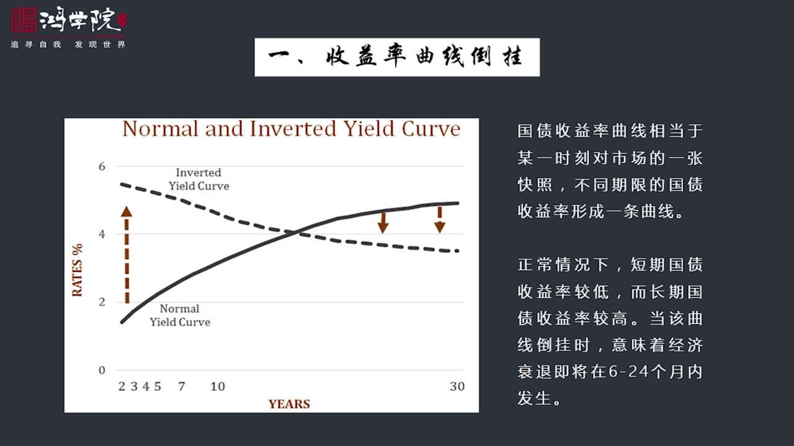

我們以國債市場作為一個例子如果在國債市場上如果我們在某一個時刻對整個市場拍一張快照 拍一張照片你會看到在國債市場上的不同期限的這些產品你比如說短了有三個月的國債有一年的 長一點了有兩年 三年 五年 七年 十年最長可以到三十年那麼在某一個特定時刻每一種不同期限的債券的收益率是不同的如果我們把這些不同的...

---

### Slide 3

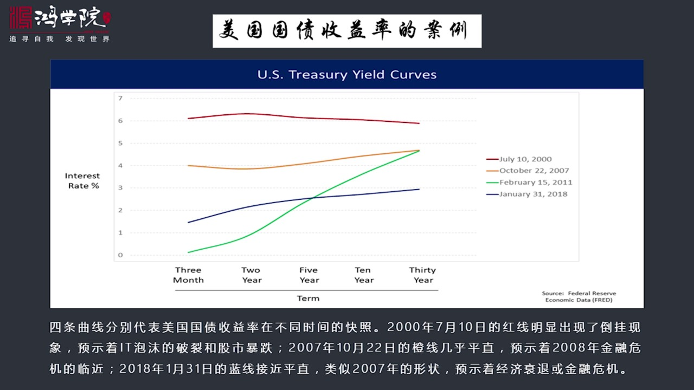

什麼樣的收益率叫正常的收益率區限什麼樣的收益率區限就表明情況非常的不妙那麼在這張圖上我們先看最上面的紅線這個紅線的拍照的時間它也是從三個月到三十年之間的各種期限的國債的收益率把它畫成一條區限那麼這個紅線的拍照時間是2007月10號就在這一個時刻怕我給市場所有的債券所有不同期限債券拍照快照畫出來收益率...

---

### Slide 4

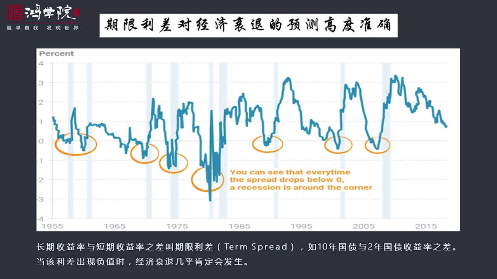

從美國二戰以來的歷次經濟衰退之前都會出現收益的到掛只有一次例外1966年經濟是嚴重的放緩了但還沒有到官方規定的衰退這樣一個程度如果我們從這條區限來看這張圖是代表什麼意思呢剛剛我們所說的收益率到掛是短短收益率高長短收益率低如果我們把這個短短和長短進行相解你會發現如果比如說這張圖這張圖如果我們用兩年和十...

---

### Slide 5

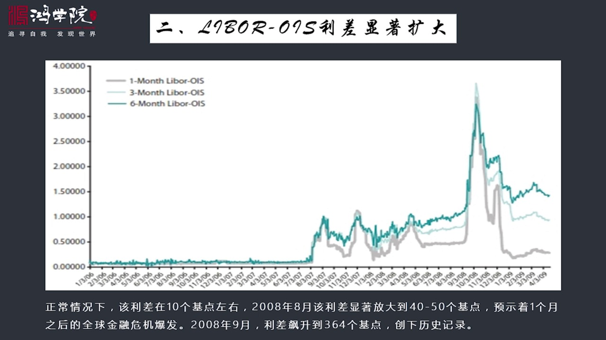

這也明顯的標誌著金融市場內部存在著巨大的壓力就是明顯表明銀行體系金融體系內部存在著非常嚴重的問題它也是個重大危機的一個標高當然我知道大家可能還搞不清楚Liber利率和 OIS立差到底是什麼概念我們一會兒再接著再去詳細分析他們的意思我們首先開始看這張圖這張圖兩者的立差在正常年份正常市場的表現的情況之下...

---

### Slide 6

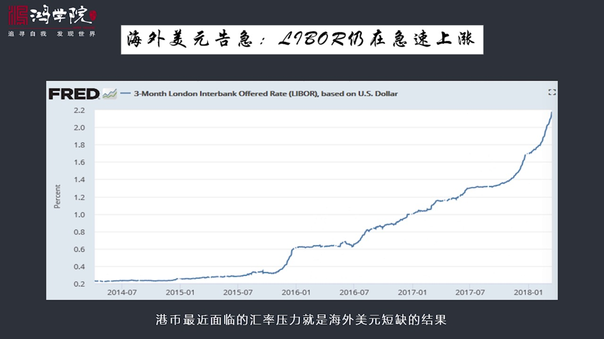

Liber利率就是倫敦的幾大銀行之間他隔夜拆借的時候他要報個架那麼他報了架不管是美元歐元還是什麼他這個以報價比如說我要做一個拆借的利率那麼你給我多你要拆借的一個貸款你給我要收我多少錢收我多少利息他是報價報出來的我們以前講到Liber利率的核心他是一個市場交易的完全在海外運轉他以倫敦為中心是海外美元的...

---

### Slide 7

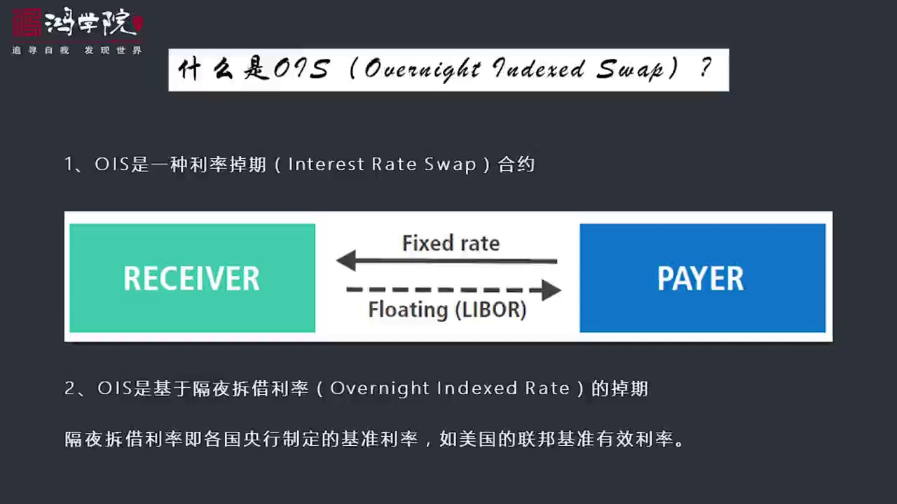

我把它分成幾點來講首先 OIS是一種利率調期產品是一種利率調期的合約關於什麼叫利率調期我在後面那種五中間曾經有一張應該是第三張做了非常嚮盡的解釋如果大家對利率調期的計算方法和什麼場合下人們怎麼用利率調期感興趣的話可以參考一下後面那種五這一張那麼我們在這裡不做很深入的介紹我們只是簡單說它是個什麼概念利...

---

### Slide 8

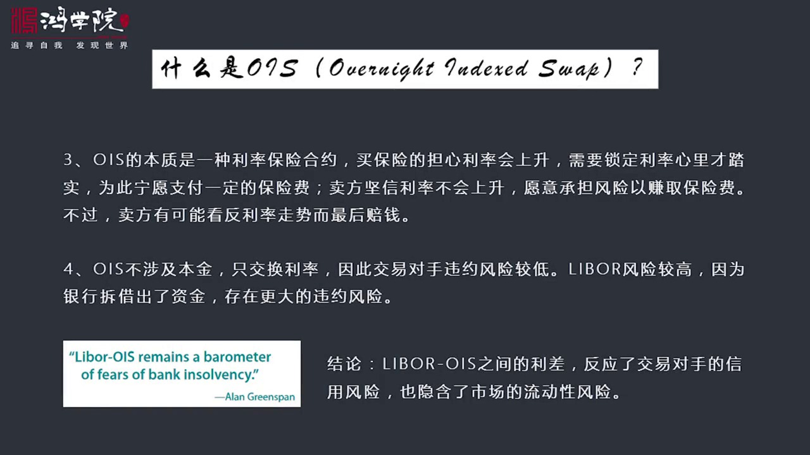

就是如果我從美聯儲去借款或者就是我如果在這個金融市場上去借款受到美聯儲聯邦利率的影響或者我在Liberary上借款我都會受到這種格業差距利率的這種影響而我又會想有一個穩定的所訂的利息比如說我要在Liberary率上我借三個月的美元但是Liberary率的雖然就是它每天都在變我不喜歡變我就想比如說現在...

---

### Slide 9

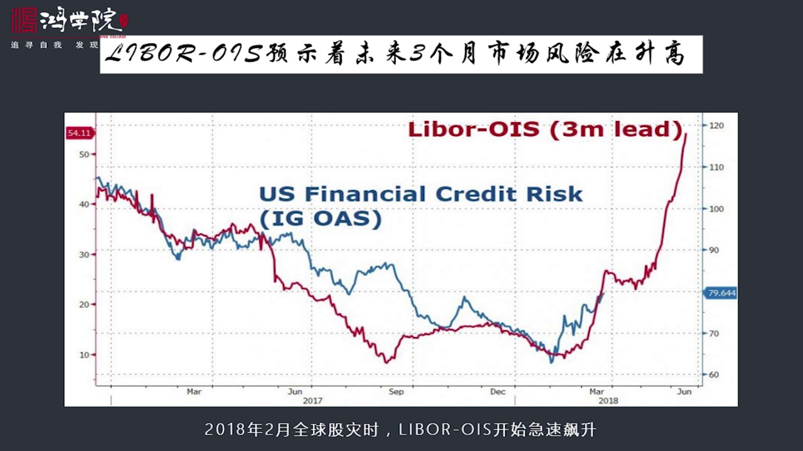

再急劇升高我剛剛已經說了在2008年經過危機這時候正常情況之下這個立差就是十個幾點Liber和YS的立差是十個幾點但是我們可以看看看一下2018年2月分開始2018年2月6號那次骨在之前這個立差都是大概是十個幾點左右但是在這個拐點之後骨勢暴跌出現之後我們看到這個立差正在迅猛的上漲現在已經超過了已經快...

---

### Slide 10

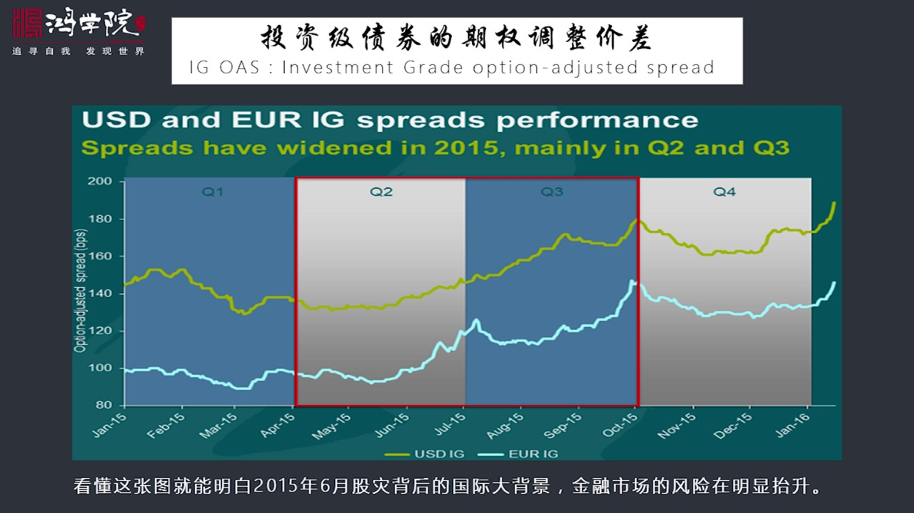

Investment grade就是代表投資級別的還有叫高收益或叫垃圾債這個High L的HY這種就是屬於垃圾債卷所以美國的這個債卷上分成若干種不同的投資產品一種是投資級的那就是好公司、Intel公司什麼亞馬遜或者谷歌等等他們發現了債卷都叫投資級的債卷但是每個業業研遊的公司它這公司很小每幾個人研遊了...

---

### Slide 11

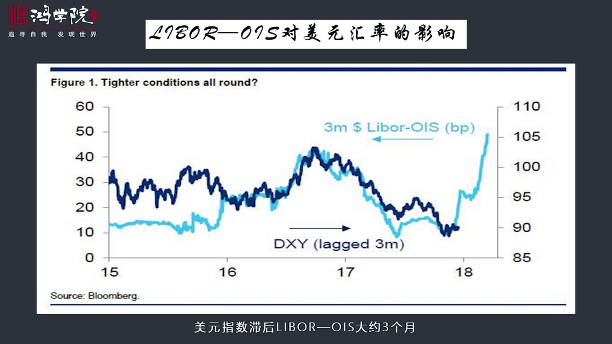

當然有因為它代表美元在國際上上的稀缺性特別是海外美元的稀缺性所以如果我們看這張圖你會看到從15年一直到現在這個美元的指數跟這個曲線之間跟這個立差之間它是相關的而且美元指數的上漲要之後於這個指數之後於這個立差大概三個月從這個立差我們剛剛已經看到了2018年這個立差已經上漲到這張圖可能稍微這是二月份的圖...

---

### Slide 12

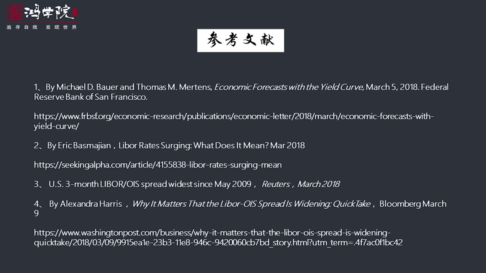

包括這個收益率期間到掛這方面的文章如果大家有興趣可以讀一讀好 今天課就到這謝謝大家

---

### Slide 13

---
