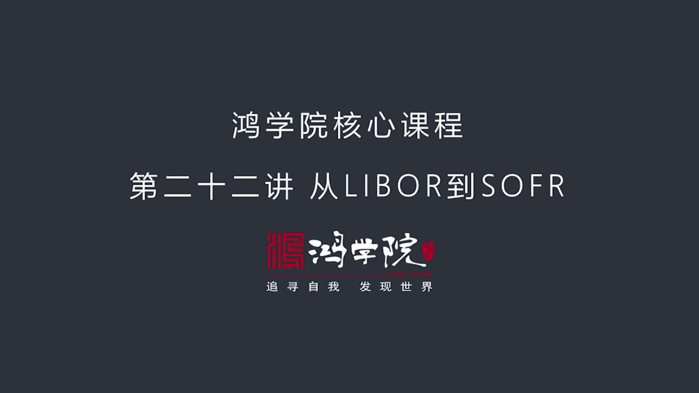
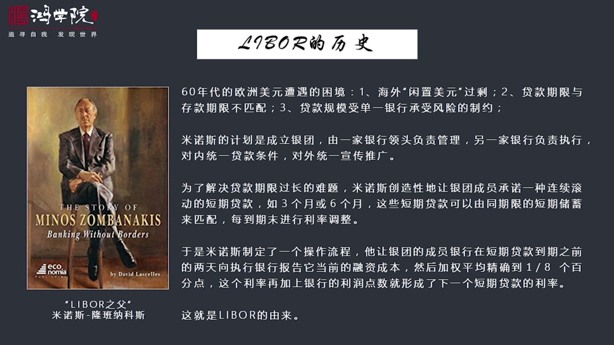
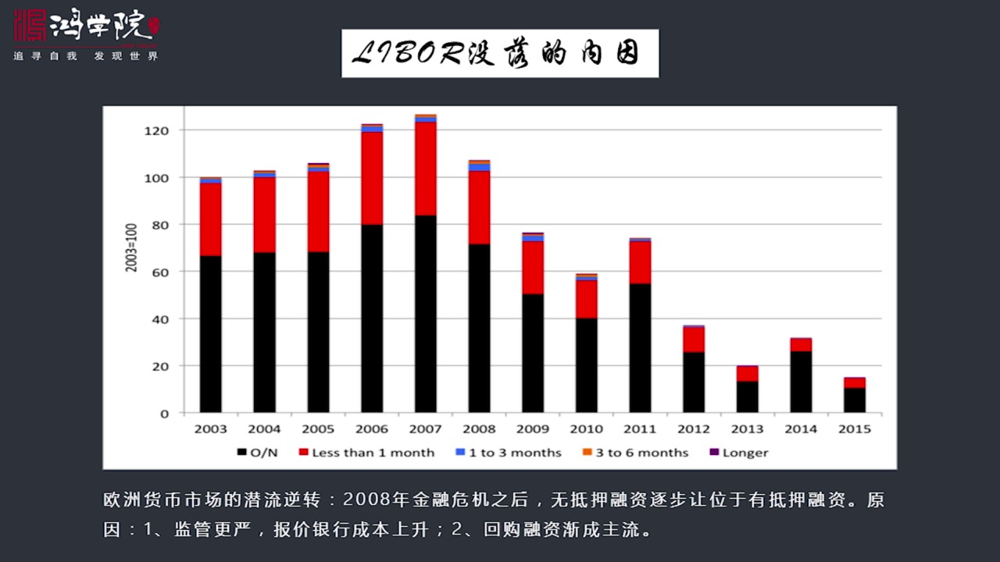
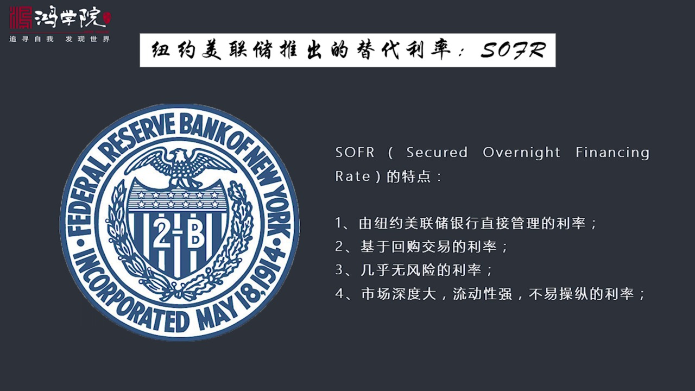
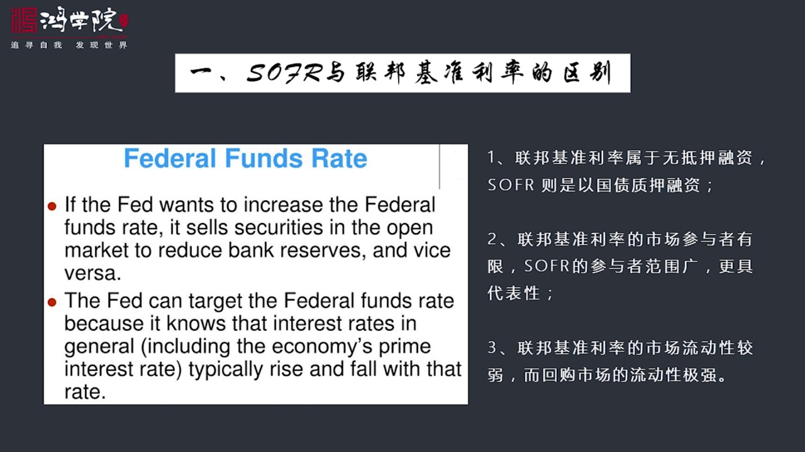
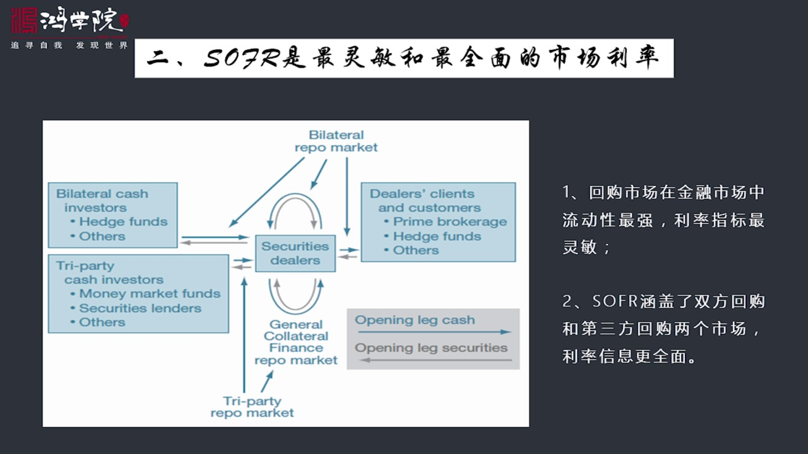
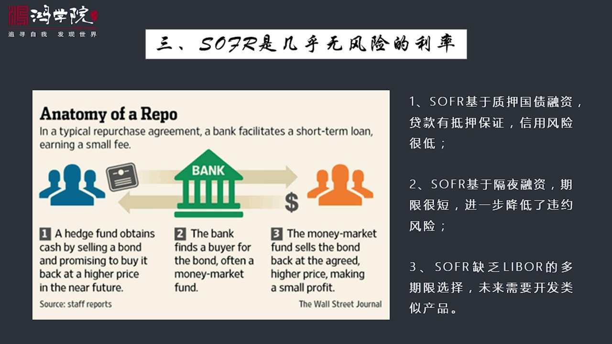
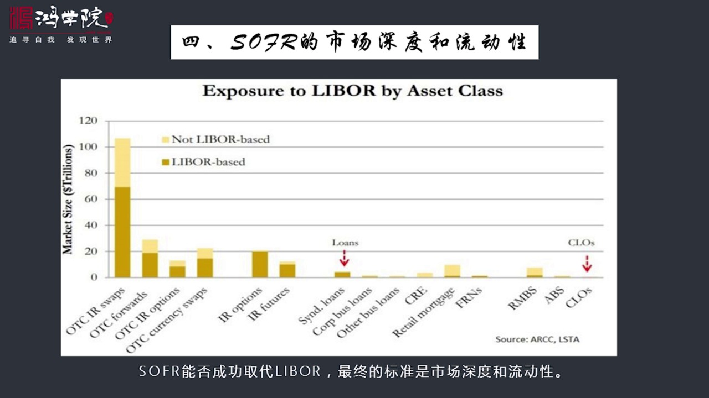
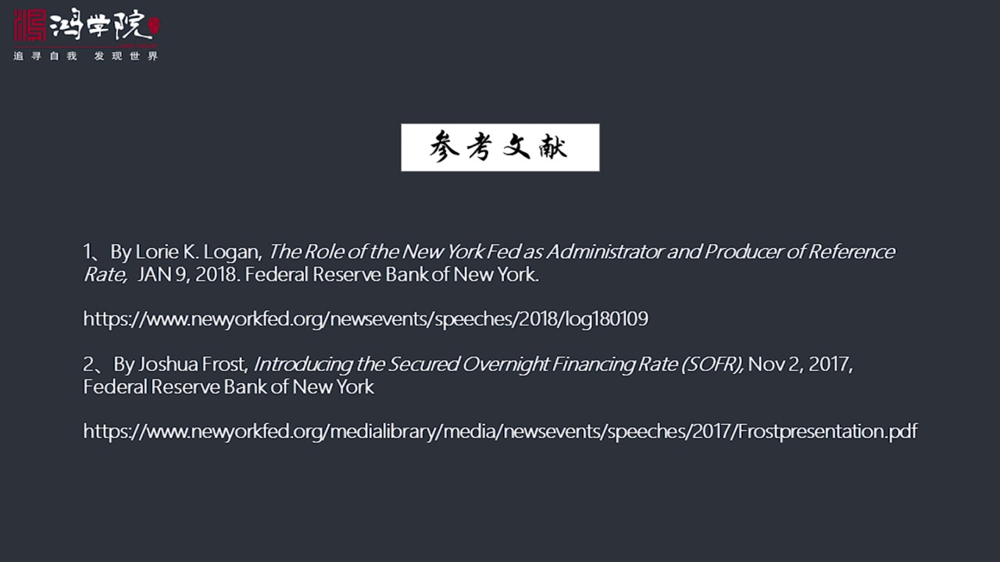

# 核心课视频-022讲.一个时代的结束 LIBOR王位陨落 SOFR新君登基 — Clean Slide Notes

> **来源**：鸿学院核心课程  
> **幻灯片**：11 张

---

### Slide 1

大家都知道Liberly率呢在未來一段時間可能會退出律師舞臺時間大概是在2021年前後所以現在世界各國都在尋求一種新的利率來替Liber今天我們就講一講這件事首先我們看一下Liberly率的歷歷Liberly率呢它全程是倫敦一行間拆解的利率

---

### Slide 2

它是怎麼來的呢只要回到60年代我們都知道在60年代的時候海外美元這個市場逐漸新忘起來二戰之後呢有段時間歐洲非常缺乏美元所以美國向歐洲提供大量的援助包括馬遣援助還有金融上的各種援助使得歐洲市場上集累了越來越多的美元當然特別是越戰之後美國政府開始大量印超票導致美元加速流向歐洲就形成了所謂的歐元美元市場歐...

---

### Slide 3

就是操縱利率操縱Liber的銀行他們形成了壹個很大的一個在國際市金融市場上變成了壹個很大的醜聞那麽為什麽它會出現它的機制有什麽問題為什麽會出現這麽大的醜聞呢主要的原因最根本的原因說到底就是他們這種利率來自利率形成是靠暴價這種暴價我們可以把它想像成實際上銀行做在壹起想像出來的壹個利率它不是市場交易出來...

---

### Slide 4

歐洲的貨幣市場出現了前六的反轉其實準確的說各個國家都有類似的趨勢就是2008年金融危機之後我們看到的Liber利率是屬於無底壓的這種貸款兩家銀行平信用我借給妳借給我我們彼此之間的這個利率這種銀行之間的這種拆解是不需要抵押的不需要抵押品的但是2008年之後我們看到趨勢越來越發生了變化就是無底壓的這種融...

---

### Slide 5

這種替代品就是這個所謂SOFR現在我還不知道準確的發音應該怎麼說因為這個利率還沒有推出來即將推出來所以我們現在檢稱它為SOFRSOFR這個利率是一個什麼概念呢它的全程就是隔夜的有抵押的這種融資的利率如果我們看美聯儲這個紐約銀行做這個事這個順便插一句說到美聯儲紐約銀行說到美聯儲體系吧很多人以前不知道它...

---

### Slide 6

美聯儲管理的很多利率比如說聯邦基準利率和Sofra之間兩者是什麼關係呢有什麼差別呢這就首先要瞭解什麼叫聯邦基準利率就是這個Found Rate他什麼概念我們都知道聯邦基準利率他的概念是什麼呢就是美聯儲這套體系有很多商銀行是加盟的大家都會在美聯儲中央銀行有自己的賬戶那麼這種賬戶上存的錢我們稱之為準備金...

---

### Slide 7

應該說是當今世界各國家所有金融市場中它是流動性最強的市場雖然它的規模並不是最大比如說銀行體系資產負在表上爬了好幾百萬億銀行資產就是這些貸款這是是不是金融資產當然是它也有一個交易市場當然它這個交易市場比如說資產底下的這種證據化的交易市場或者貸款的就是貸款一般來整體貸款一般來說它的流動性比較差但是你把它...

---

### Slide 8

什麼叫這個回購Ripple呢就是我剛剛所說的有一些這個對中基金需要錢比如說這就是我們看了途中的最左邊的還有一些呢是一些手上有客戶有储戶錢的一些比如說基金共同基金等等他們有錢那麼這個對中基金需要錢那麼這些人就可以把錢借給對中基金那麼相反對中基金壓什麼的壓債券中間有一個金辦人比如說是中間的銀行來綽合這個...

---

### Slide 9

為什麼很多人說我們想隨便推出一個取代Liber這事很難就是因為Liber從69年開始推出一直到現在它已經它非常簡單也很方便所以它的市場範圍很廣幾乎各種代款都是以Liber作為參照比如說你買房在國際上買房那個買房的代款利率就是Liber就是參照於Liber比如說銀行會向你報價你要代款30年代款它說那就...

---

### Slide 10

等這個利率推出之後它將和Liber利率恐怕會有好幾年時間並行它最後能不能有效取代Liber那麼要看這個市場它最後形成的深度還有流動性的情況能不能超越Liber好 今天關於Suffer這個話題我們先說到這兒謝謝大家收聽

---

### Slide 11

---
