# 核心课视频-023讲.辉煌的佛罗伦萨（1） — Detail Slide Notes

> **来源**：鸿学院核心课程  
> **幻灯片**：19 张

---

### Slide 1

輝煌的佛羅倫薩第一部分這一部分的小標題 叫製造業的起步從公園一千年到公園一千一百五十年首先我們來談一下這個佛羅倫薩他的重要性 就是我們看第二頁 文藝復興時期的佛羅倫薩為什麼要研究佛羅倫薩因為在我看來 ...

<strong>All subtitles</strong>

> 輝煌的佛羅倫薩第一部分這一部分的小標題 叫製造業的起步從公園一千年到公園一千一百五十年首先我們來談一下這個佛羅倫薩他的重要性 就是我們看第二
> 頁 文藝復興時期的佛羅倫薩為什麼要研究佛羅倫薩因為在我看來 中世紀初期這段時間相當的關鍵

---

### Slide 2

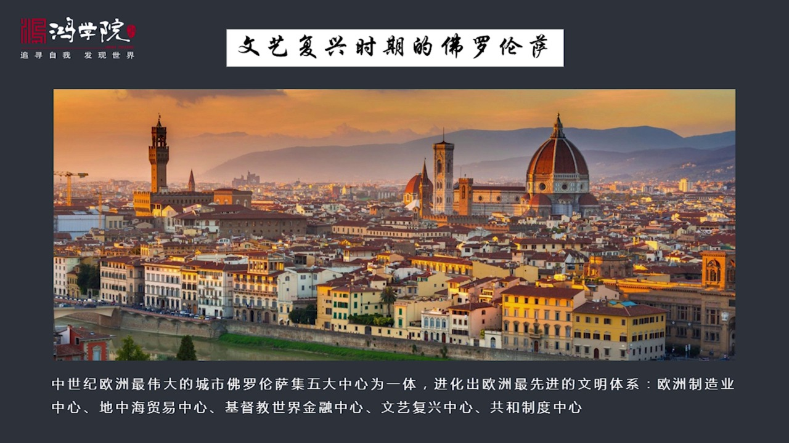

因為在這個時期 出現了歐洲南部和北部 列亞各工業中心一個是北部的負蘭德 另外就是佛羅倫薩這兩個工業中心所奠定的商業革命以及背後的許許多多的制度 法律的 政治的 經濟的 工業的這些制度的奠定 其實就是我...

<strong>All subtitles</strong>

> 因為在這個時期 出現了歐洲南部和北部 列亞各工業中心一個是北部的負蘭德 另外就是佛羅倫薩這兩個工業中心所奠定的商業革命以及背後的許許多多的制
> 度 法律的 政治的 經濟的 工業的這些制度的奠定 其實就是我們整個現在西方社會所擁有的這些制度的起源所以南北兩個工業中心是我們需要深入去理解
> 深入去理解他的歷史根源的佛蘭德 我們以前 系列課程中已經講過而現在 我們將會把關鍾點轉向佛羅倫薩 南部的工業中心那麼佛羅倫薩這個城市 應該說
> 是歐洲歷史上非常獨特的一個城市我稱之為是歐洲中世紀 最偉大的城市 沒有之一因為北部 佛蘭德的工業中心 雖然他的工業進化上比較早工業基因上 很
> 獨特 他是手創的 是原創性的但是佛羅倫薩 他卻是 不僅是工業中心而且是商業中心 還是金融中心同時還是文化藝術中心 和政治制度中心那麼他是極有
> 五大中心為一體這一點使得佛羅倫薩在整個歐洲的城市的發展室中是處於獨一、五二的定位的這就是我們為什麼要研究重點研究 佛羅倫薩應該說在中世紀初期
>  他開創了一種全新的局面是一種治了飛躍 當時也形成了歐洲最先進的一種文明體系我們發達下野 說到佛羅倫薩我們要談一下研究佛羅倫薩問題的方法論因為意大利的歷史 其實是歐洲中世紀史中間最佛達的部分

---

### Slide 3

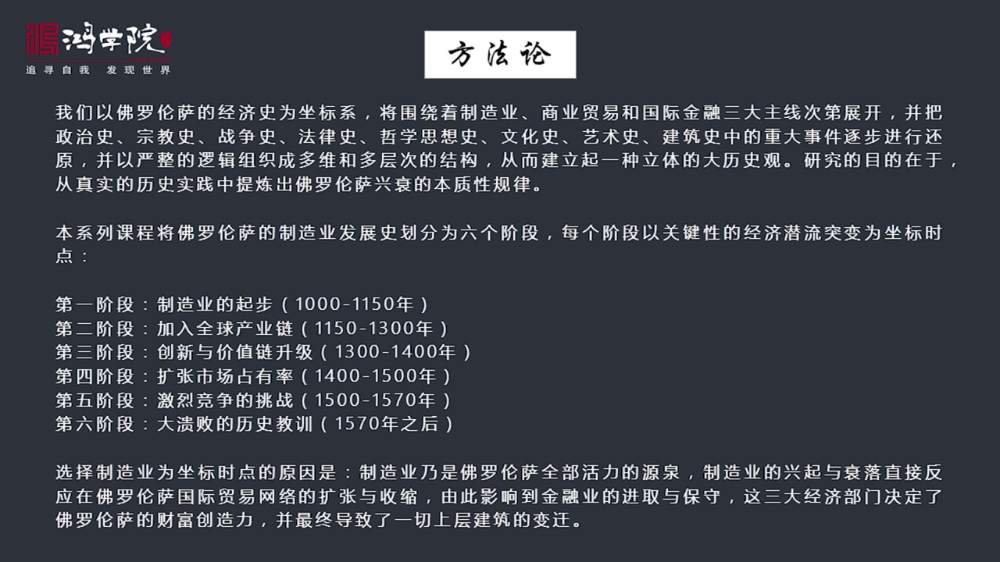

他自己內部是四分五列的在文藝福星時期至少涉及到五個國家他內部分裂成了五個城邦國家和王國比如說倫巴帝 佛羅倫薩共和國還有魏尼斯共和國 同時還有教皇國 南部還有納布勒斯王國他的外部同時也很複雜他的外部有神...

<strong>All subtitles</strong>

> 他自己內部是四分五列的在文藝福星時期至少涉及到五個國家他內部分裂成了五個城邦國家和王國比如說倫巴帝 佛羅倫薩共和國還有魏尼斯共和國 同時還有
> 教皇國 南部還有納布勒斯王國他的外部同時也很複雜他的外部有神聖羅馬帝國 就是在德意志地區還有法國跟他也有密切關係另外就是西班牙的卡斯蒂利亞王
> 國和阿拉共另外他在地上還涉及到敗戰艇的歷史還涉及到雄亞利 馬扎爾這邊的歷史同時還有伊斯蘭因為當時出現了伊斯蘭戰領西西里島這樣的歷史時期同時還
> 有諾曼人在意大利南部的經營所以他涉及到方方面面 林林總總各種地區各種文化各種國家的歷史所以使得要把意大利這個問題搞清楚他的難度是非常高的這是
> 一個方面的問題 就是他的歷史極其複雜另外在研究佛羅倫薩國中會涉及到大量的知識面兒比如說我現在看到有關佛羅倫薩數不下幾十本有關涉及到佛羅倫薩的
> 政治 經濟 文化 宗教 藝術 建築還有他的人文所以這套體系的 這是體系是分散在幾十本書中間的他最大的難度是你要把諸多的這種信息的碎片只是碎片
> 要集合在一起 要整合在一起同時要梳理出一個清晰的邏輯線這是他最大的難度所以我們在講佛羅倫薩時候我現在需要建立一套新的邏輯架構 新的知識體系具
> 體的做法是什麼呢就是我們把佛羅倫薩的經濟發展時 經濟是作為一個建立成一個整的作標 建立成一個作標系用經濟來作為作標系同時還要去圍繞著製造業和
> 貿易 國際金融這是三大主線 是這個作標系的三大主線然後把它展開一次展開然後有了這個作標體系之後再把這個北意大利 還有托斯卡納地區的政治史宗教
> 史 戰爭史 法律史 哲學思想史文化史 藝術史和建築史中間所有的重大事件進行逐一還原然後把它建立成一種多層次和立體的多位的結構目的是什麼 目的
> 是為了形成一種大歷史觀這種大歷史觀 是一種立體的歷史觀而我們最後要實現一個什麼樣的效果呢就是通過研究弗羅倫薩歷史我們能夠從真實的實踐中去體驗
> 出一個地區一個國家 它的心衰最本質的一種規律所以根據這樣的一個思路我們把弗羅倫薩歷史劃分成弱竿階段注意 我這個劃分作標的10點就是切分成6個
> 時間段這個作標10點是怎麼選擇呢主要是以弗羅倫薩的製造業的發展歷史每個時間點的起點對應著在弗羅倫薩歷史中一個重大的經濟模式的轉變以這個時間點
> 也就是前流突變模式的突變 作為時間點的選擇所以這樣一種研究方法研究思路應該說在我看這麼多數種 數中 算是一種手創我沒有看到人們是這麼來劃分它
> 的歷史的那麼大概輸一起來佛羅倫薩從公元一零零年一直到一七零零年之前我們可以把它對應成6個時間階段那麼我們的作標點作標10點是以製造業的這6個
> 階段的突出的特點作為一種選擇的標準第一個階段 我們會談到佛羅倫薩製造業的起步階段就是從公元一千年到公元一千一百五十年這一百五十年是佛羅倫薩公
> 業起步製造業起步的最重要的時間點 時間階段那麼第二階段 我稱之為是加入全球產業鏈的階段就是從公元一一五零年到公元一三零零年第三階段是創新和價
> 值鏈的升級升級這個時間段是從一千三百年到一千四百年之間第四階段是擴張市場的戰友率只是從1400年到1500年第五階段是激烈競爭的挑戰它的時間
> 段是從1500年到1570年第六階段是最後大愧敗的歷史教訓這只是1500年之後 選擇這個時間作標點的原因就是我們背後的邏輯是什麼呢在我看來製
> 造業是佛羅倫薩全部的活力的一種圓權不管你是政治上的 還是藝術上的 還是建築上的還是思想方面的 所有的活力都源於經濟而經濟的活力首先源於它的製
> 造業有了製造業 製造業興起了才能反映出 才能推動和驅動它的國際貿易網絡有了國際貿易網絡才能夠驅動它的金融網絡和金融業有了金融業 然後才能擁有
> 巨大的財富 物質財富然後才能去創造輝煌的文化藝術 建築這方面的文明所以歸根到底佛羅倫薩這個城市可以說跟其他的義大利益城市是不太一樣的其他城市
> 比如維尼斯 它就是貿易利國以貿易來驅動但是它輔助有一些製造業 但是佛羅倫薩它是個內陸城市它不是靠商業貿易起家的 它是靠製造業起家的它是製造業
>  貿易和金融 三個東西的中心最後再變成了文化意識中心還有它政治制度作為共和制的一個中心它是幾五大中心為一體 但是所有這種輝煌的根源都是源於它
> 的製造業我們可以從歷史中 這六節段中可以發現它製造業的擴張收縮 影響到了商業貿易網絡然後影響到了金融業然後影響到它全部文化藝術建築各個方面所
> 以歸根到底我們的邏輯的起點是製造業也正是由於這個原因所以我們以製造業的它的變化 重大突變作為作標的十點的選擇有了這樣的一套方法論 還有背後的
> 邏輯之後然後我們就可以進一步來輸理這個弗洛倫薩 它的輝煌 背後的一些根本性的原因如果我們看下野 首先研究歷史跟我們現在進行實證分析 到底是一樣的

---

### Slide 4

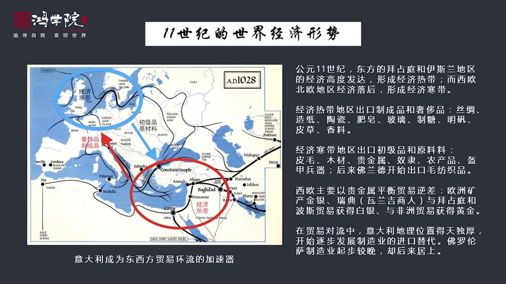

只不過我們把自己放到了當時那個歷史時代在那個歷史時代 你來縱觀全球你看到了你分析的方法和看到的一切就是當年的時證所以分析時證跟分析歷史是完全一樣的內在邏輯是本身上是一樣的要想說 清楚弗洛倫薩 它製造業...

<strong>All subtitles</strong>

> 只不過我們把自己放到了當時那個歷史時代在那個歷史時代 你來縱觀全球你看到了你分析的方法和看到的一切就是當年的時證所以分析時證跟分析歷史是完全
> 一樣的內在邏輯是本身上是一樣的要想說 清楚弗洛倫薩 它製造業的起源我們就必須要倒退到公元十一世紀也就是公元一千年左右整個全球的經濟形勢是個什
> 麼樣全球各大國之間的力量關係它是個什麼情況所以我們如果我們來看這張地圖公元一千年前後的這張國際貿易的地圖你可以發現在這張地圖上 環地中海這張
> 地圖上這個東地中海地區就是我們所說的一番特地區埃起再加上這個土耳其這個構成了環地中海的東部地區那麼在這個地區顯而易見它的文明程度是比較高的經
> 濟是相當發達的因為當時拜占廷要遠遠超過西部歐洲的這些發達程度同時穆斯林的經濟和它的文化程度也遠遠高於西歐所以這個地區形成的是一種經濟熱帶地區
> 大城市也主要在這些地方西歐的城市規模都相當的小幾萬人城市除了巴黎恐怕還在北一大利還有幾個整個歐洲就沒有這麼大的城市了而在軍事產領寶在伊斯蘭地
> 區在埃及這都是幾算人口的大城市城市的規模市場的規模都遠遠比西歐要龐大的多所以西歐那個地區 環北海地區包括波羅地海我稱之為是一個經濟的寒帶地區
> 那麼在熱帶和寒帶地區之間進行貿易對流就是先進的製造業的製程品還有設施品這種熱帶地區流向寒帶而寒帶地區回流的進行交換的這些產品主要是一些原材料
> 還有一些初級品所以我們可以看到這個貿易環流中間雙方產品交換產品的特點就是高複雜的產品是源於熱帶低複雜回流的產品是源於寒帶比如說在東地中海地區
> 它出口的主要產品是什麼呢磁籌 製程品 造紙 逃磁 肥皂玻璃 治糖 民凡還有皮草和香料這都是重要的比較複雜的產品而從歐洲這邊回流過來了呢主要是
> 什麼呢皮毛 木材 貴金屬 奴隸 農產品還有葵甲冰淇但後來在110年前後出現的是這個芙蘭德它的毛放置品的出口主要這兩個地區最大的特點就是熱帶地
> 區出口製程品和設施品寒帶地區回流初級品和原材料那麼在這樣的一個交換過程中我們知道我的儀貫的一個說法或者儀貫的一個觀點貿易是互惠的但並不平等在
> 這樣的一個貿易環流過程中顯一件會形成一個巨大的貿易落差也就是西方西歐會出於逆差狀態它沒有這麼東西可以換那怎麼辦呢它主要是靠貴金屬來平和貿易逆
> 差所以貴金屬的流向金和銀的流向非常能夠反應這個貿易環流它的健康與否或能不能持續那麼歐洲的貴金是從哪來呢主要是在歐洲的多山地區它有大量的礦產的
> 經營比如說像德意志像這個捷克像東歐的中歐的很多很多地區它是有大量這個營礦的那麼它的黃金除了本地產的礦產金還有跟非洲的貿易因為非洲比它更落後所
> 以在這個過程中它能夠擊雷這個薩哈拉以南的黃金是像歐洲流入的同時呢還有就是我們以前講到的這個圍金人像東部發展這一支叫瓦蘭級人主要是瑞典人他們在
> 跟拜登庭在跟波斯進行貿易過程中擊雷了大量的白銀白銀是流向這個地區的那麼他們在用這些白銀跟北海進行貿易對換然後它的白銀就是流入北海地區的就是稀
> 歐然後稀歐再把這些白銀轉運回來形成了貿易和貴金屬了就是貨幣和貿易的這個總體的環流那麼如果我們看這個環流你會發現從地理上來看義大利半島是德田獨
> 厚的因為義大利半島正好出在經濟寒帶和熱帶的連接著疏扭這樣的一個地位所以不管是物資也好還是貨幣流動也好義大利是畢竟之路義大利半島它是一個非常具
> 有地緣貿易地緣優勢的這麼一個地區這也是為什麼這個弗洛倫散它能夠厚發先制它在整個義大利半島中起步教完但它最後能夠起來跟整個它的地緣的位置是有關
> 的它雖然不是最佳位置但是它的位置相對不錯而它還有其它的綜合優勢導致了弗蘭德地區導致了弗洛倫散地區後來居上它的製造業越來越強大我們翻下一頁要研究一個地區的經濟發展時當首要的任務是一定要研究它的地理情況

---

### Slide 5

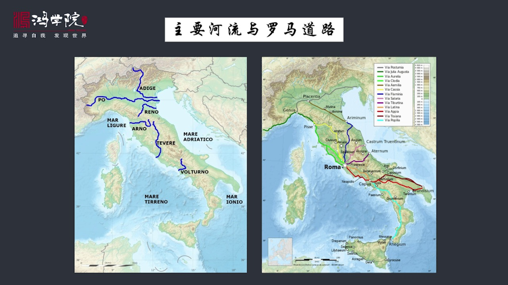

自然地理情況山脈合流道路所以研究弗洛倫散這個我們採取同樣的辦法首先研究義大利半島上的主要合流山脈和它的交通幹線也就是貿易傷到左邊這張圖是整個義大利半島上最主要的合流我們可以看到從它這個合流分布圖來看的...

<strong>All subtitles</strong>

> 自然地理情況山脈合流道路所以研究弗洛倫散這個我們採取同樣的辦法首先研究義大利半島上的主要合流山脈和它的交通幹線也就是貿易傷到左邊這張圖是整個
> 義大利半島上最主要的合流我們可以看到從它這個合流分布圖來看的話我們可以看到它最大的幾條合流體系一個是北部義大利地區的三條合波合波合流與這是最
> 重要的條合還有阿迪傑河還有雷諾河那麼在托斯卡納地區也就是我們看這張圖的話你會看到義大利中部有一條綿長的山脈從西北角一直延伸到東南地區那麼這個
> 山脈就是亞平林山脈那麼波合倫巴蒂這個一北的山脈就是二倍四山脈夾在二倍四山脈和亞平林半島之間的這片平原它的主要部分主體部分就是倫巴蒂地區那麼在
> 亞平林山脈它的稀測我們會看到有兩條主要合流一條就是雷諾河這個一條就是阿諾河另外一條是台波合這個台波合合阿諾河之間所夾的這片地區應該說是這個義
> 大利它最古老的發展地區之一那麼阿諾河這條河尤其重要因為佛羅倫薩這個城市就在亞平林山脈的南側和阿諾河的河邊所以它的地理位置我們重點需要關注阿諾
> 河這條河的位置我們看到它像一個它的它發源於亞平林山脈然後像一個金鉤一樣回旋然後順流而下一直到地了黏海它的出海口就是比上而這個佛羅倫薩的位置是
> 在於是在這個彎鉤的它的道鉤處所以這是佛羅倫薩和整個義大利半島的一個基本的山脈合流的大隻圖我們看右邊這張右邊這張是古羅馬十七義大利半島主要的交
> 通幹線就是我們所說的羅馬大道羅馬道路系統調調大路通羅馬說的就是這個道路系統但這個道路系統它像外海延伸到歐洲其他地區我們在這裡重點關注義大利本
> 土的貿易商道因為這些道路不僅是用於軍事同時也用於貿易它是貿易的重要交通幹線那麼我們看到這條貿易幹線上在托斯卡納地區托斯卡納地區就是亞平林山脈
> 它的稀存中間有一大片平原在羅馬一北在這個台北河和阿諾河之間的這個北部地區我們可以看到在這個地區的話主要幹線有兩有三條一條是黃色的地條線還有一
> 條是綠色的還有一條是草綠色的三條線這三條線面只有黃線這個卡斯亞這條這條古羅馬的商道它是經過弗洛倫散的其他兩條都沿著海邊的走沿著地倫散海這一側
> 在走我們需要對這條道路它的主要道路要印象非常深刻那麼羅馬古羅馬時代它的主要通道像北像歐洲的主要通道一條是在地倫散海這一側的草綠色這條線這條線
> 就是在海邊這條這是一條主要通道還有一條是藍色這條線我們看到從羅馬出發像北經過歐盟里亞一直到亞德里亞海這一側這兩條是主要幹線中間黃色這條線並非
> 是主要主要的道路因為它貼著山在走所以道路情況不是特別良好這呢是我們需要理解在羅馬那個時代這是它的交通情況我們再看下一頁如果我們把這張圖進一步
> 放大我們會看到佛羅倫散的具體的地位置亞平靈山脈以西這一側那麼它的背靠亞平靈山脈

---

### Slide 6

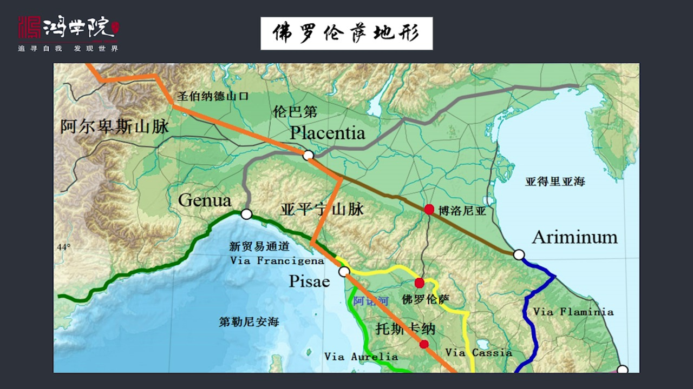

在它的這個周邊最重要的就是阿諾河這是它流津卡的一條主要河流然後除了這個之外我們會看到這個藍線這個藍線叫Flamini這條線是古羅馬南北南北交通的主要幹線還有草綠色的這條線是條相對次要理條線Aureli...

<strong>All subtitles</strong>

> 在它的這個周邊最重要的就是阿諾河這是它流津卡的一條主要河流然後除了這個之外我們會看到這個藍線這個藍線叫Flamini這條線是古羅馬南北南北交
> 通的主要幹線還有草綠色的這條線是條相對次要理條線Aurelia黃線是克斯亞克斯亞這條線是經過佛羅倫散的但是羅馬帝國崩潰之後黃線的使用越來越少
> 那麼有一條新的線路逐漸崛起這就是我們看到的起一條橙色的這條線從羅馬過來航船托斯卡納地區佛羅倫散整個這邊地區叫托斯卡納佛羅倫散是托斯卡納的首府
> 它是航船托斯卡納的平原經過第一個城市最主要城市是斜納然後向西北方向走的比賽然後再貼著海邊走然後經過這個亞平靈山脈的山口然後再到達了波河流域再
> 經過波河流域經過盛伯納德山口進入歐洲進入法國這個是後來就是羅馬帝國崩潰之後新的一條貿易主要通道這是在中世紀的這個族不興起的一條通道為什麼海邊
> 的這條草綠色的通道最後也不怎麼用呢就是因為它地是比較低打亮的洪水飯爛泥沙漁級是這條線路也不太好走橙色這條線路成了最主要的貿易通道那麼佛羅倫散
> 在這個意義上它是遠離中世紀形成了貿易主幹道的那麼它的北邊由於是亞平靈山脈的阻擋使得它向北的發展向北的貿易通道相對較窄就是說跨過亞平靈山脈這個
> 重要的城市佛羅尼亞佛羅尼亞和佛羅倫散之間雖然有通道但是通道比較窄而北邊的這個倫巴地地區它的交通情況就比較好了它有波河流域有雷諾河流域還有阿蒂
> 潔河流域然後還有大量的運河同時它的地勢主要是平原所以我們會看到它在平原地帶貼著山貼著海有好幾條重要的平心線它的交通情況要比佛羅倫散交通情況要
> 更好好當我們有了整個這樣的一種對佛羅倫散地理還有它的交通情況河流的一些大致的這種知識之後我們再看為什麼這條路地的新的貿易通道非常的關鍵因為這條通道是從羅馬開始橫川東斯卡納地區

---

### Slide 7

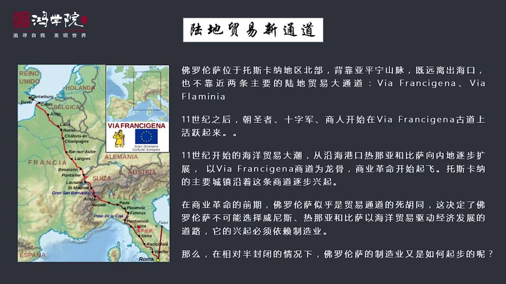

翻越這個山口二倍斯山口進入了法國經過法國一直通道香檳大市場然後通過香檳大市場繼續往前可以一直走到家來然後渡海可以到達英國這是一條冠川義大利和法國一條連通英國的一條新通道那麼這條通道它在11世紀之後逐漸...

<strong>All subtitles</strong>

> 翻越這個山口二倍斯山口進入了法國經過法國一直通道香檳大市場然後通過香檳大市場繼續往前可以一直走到家來然後渡海可以到達英國這是一條冠川義大利和
> 法國一條連通英國的一條新通道那麼這條通道它在11世紀之後逐漸形成主要是一些朝聖者還有後來的十字軍那麼再加上商人他們開始不斷地在這條線佛蘭斯基
> 在這條古道上逐漸活躍起來走人越來越多就形成了新的通道然後11世紀開始沿海貿易發展特別是像比薩佛羅倫薩比薩還有熱娜亞還有維尼斯這幾個城市率先起
> 來那麼比薩也包括魯卡他們也城市新級之後海亞貿易新級之後熱娜亞這些地方主要在十字軍東征十七和之前主要是跟伊斯蘭地區的海道做鬥爭發展起了自己的海
> 軍然後參加了十字軍第一次十字軍東征然後開始進入地中海東岸的離凡特地區進行貿易他們站那個先手所以起步叫早海洋貿易率先起來由於它這個海洋貿易起來
> 之後這股大潮經商了大潮參與海洋貿易的大潮逐漸從這些沿海的海港城市向內地擴展應該說成績海洋貿易在陸地上主要成績它的商道就是這條新商道是以這條商
> 道為龍谷商業革命才起飛的那麼托斯卡拿地區的主要承認基本上全是沿著這條這條新的貿易幹道逐漸行起了那麼在上一個命前期佛羅倫散給我們的感覺因為它並
> 不在主要的新幹線這條貿易通道之上然後它又遠離出哀口似乎那個地方是一個貿易的似乎痛就是貿易不怎麼往那邊去因為它背後是山三月山賣成本很高這就決定
> 了什麼這就決定了佛羅倫散不可能選擇像魏伊斯熱納亞比賽那種發展模式他們是以海洋貿易帶動然後國內經濟逐步發展是貿易驅動型海洋貿易驅動型而佛羅倫散
> 由於它的地位置不靠海背後又是山主要幹到不同門天過所以它要行起顯而一見它不能靠貿易它靠什麼它選擇是製造業依靠製造業新國那麼從地理上來看佛羅倫散
> 這個地方由於它的地理位置相對封閉或者叫半封閉那麼它的製造業在這種情況之下又是如何起步了呢我們看下野佛羅倫散的地理位置的確相對而言它是個半封閉的

---

### Slide 8

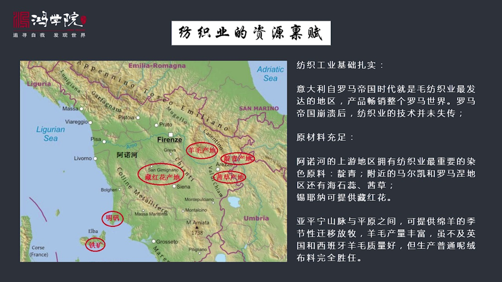

我們如果從下野這張地圖上可以看到佛羅倫散這是用了一個方形的標誌來表示的佛羅倫散它發展貿易確實不是有不是那麼有利但是它發展工業條件還是相當好的為什麼首先是整個義大利半島也包括托斯卡納地區它是有綁織工業的...

<strong>All subtitles</strong>

> 我們如果從下野這張地圖上可以看到佛羅倫散這是用了一個方形的標誌來表示的佛羅倫散它發展貿易確實不是有不是那麼有利但是它發展工業條件還是相當好的
> 為什麼首先是整個義大利半島也包括托斯卡納地區它是有綁織工業的基礎的因為當年製造業最主要的製造業部門就是綁織業所以我們談到製造業的時候腦子沒想
> 到重點是它的綁織工業因為義大利半島托斯卡納地區在羅馬時代古羅馬時代它就是毛綁織工業最發展的地區之一當時義大利半島的房支品可以說是行銷整個羅馬
> 帝國羅馬帝國崩潰之後義大利的房支業受到了重創因為它失去了外部市場也經歷了大衰退但是房支越了基本的技術並沒有失傳這是它得天獨厚的第一個條件基礎
> 是有的第二呢是在佛羅倫薩周邊它的原材料供應是比較充足的發展毛綁織工業嗎首先羊毛羊毛在哪裡呢我們如果看一下這個佛羅倫薩周邊的雅平銀山賣你會發現
> 它是有高的地方有低的地方有山區有秋林還有平原所以這就導致了木陽人可以進行季節性放幕比如說夏天我看我在高山地區內一個地方天氣涼快然後稅草很豐盛
> 到冬天到天氣比較冷的時候到冬季我可以轉到平原地區來進行放幕所以季節性放幕使得羊一年四季都有草吃西班牙我們講西班牙的時候已經講過西班牙的地理為
> 什麼它的羊毛好就是因為它也是靠季節放幕整個歐洲環境中海地區很多地方都進行季節性放幕就是羊群大規模幾百萬隻羊大規模的沿著歐洲的山脈沿著這些高山
> 和平原之間進行大規模的前夕好好檔檔我們在中國是很少看到中國立場是很少出現這種現象的因為我們早就進化除了農工文明我們的文工文明跟機差得很深所以
> 中國的歷史中你會看到它的序幕也就是內地地區的序幕也就跟歐洲相比是非常不發達的因為我們的田我們的土地都開坑了都變成了農田沒有怎麼大規模的早長就
> 是中國和西方一個相當相當關鍵的地方就是序幕也導致你的馬體牛羊人均的生出量還有牛奶羊奶這種奶製品和肉製品的社會量跟歐洲比我們是始終低約歐洲的那
> 麼除了羊毛因為你可以進行放幕羊毛產業比較高除了羊毛之外還有什麼還有重要的染色染色這些植物也很關鍵沒有這些植物就染不了色比如說電青電青的產地就
> 在阿諾河著上游地區那麼附近的這個馬爾卡還有羅馬捷地區就是在佛羅倫薩在山的西側和北側這些地區還有什麼呢海世瑞這裡是重要的染料植物它可以提供紅色
> 欠草也可以提供紅色還有新那地區是藏紅花的主要產地藏紅花我們現在知道是藥用但它還是一種同時還是一種染料它可以提供黃色所以電青提供青色你可以有藍
> 色你可以有紅色可以有黃色基本擊中原色這個幾原色都有了另外呢還有重要的美染劑名繁它是在佛羅倫薩的西南方向另外二把島上還有鐵礦使得你知道機械製造
> 各種這個加工的工具的時候有充足的供應所以呢在佛羅倫薩發展訪知工業它是有一些資源貧富的先天的當然最重要的資源貧富是下業我們翻下業它最重要的貧富是什麼呢最重要的是它有阿諾河阿諾河可以直接這個流向

---

### Slide 9

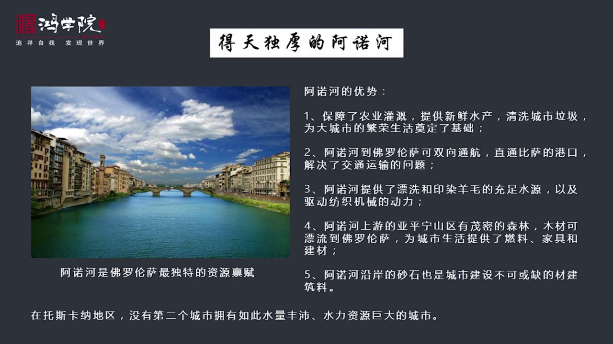

地了黏海它的中端出口就是比薩這個阿諾河應該說是佛羅倫薩跟北一大利的所有城市跟這個托斯卡納地區所有城市都不太一樣的地方阿諾河提供了幾大優勢第一個阿諾河的水量比較大所以它能夠保證農業灌蓋這就有了農業發展的...

<strong>All subtitles</strong>

> 地了黏海它的中端出口就是比薩這個阿諾河應該說是佛羅倫薩跟北一大利的所有城市跟這個托斯卡納地區所有城市都不太一樣的地方阿諾河提供了幾大優勢第一
> 個阿諾河的水量比較大所以它能夠保證農業灌蓋這就有了農業發展的基礎又糧食了另外阿諾河還可以提供大量的新鮮的水產品魚類蝦之類的另外阿諾河就像一個
> 不斷清洗這個城市的拉基清洗工城市它的土仔它的各種發展燃色工業發展防止工業會有大量的廢料這些廢料都通過核流直接沖向海洋所以它能夠保持城市的清潔
> 否則的話你發展防止工業它會帶來嚴重的汙染你沒有水源它就沒辦法發展第二阿諾河還提供了非常有力的交通運輸條件雖然佛羅倫薩它是陸地幹到不行但它的核
> 流幹到還可以從比薩意識到佛羅倫薩這個城市之前幾英里的地方是直接可以雙向通行的你既可以從下游到上游也可以從上游到下游可以通過風番可以通過人力實
> 現雙向的這個通行這解決了大問題因為如果沒有核流全部靠陸地運輸的話成本太高那麼它的第三個又是就是阿諾河提供了發展矛盟防止工業所必須的票息和印人
> 羊毛必須要有充足的水源阿諾河的水源非常的充足同時阿諾河的這個水利可以提供防止工業用的動力這也是個非常重要的特點我們先講的英國的時候我們講到為
> 什麼英國的防止工業會朝西部會朝北部這些山區發展就是因為山區有大量的水利資源可供使用那麼第四條阿諾河的上游亞平林山脈中間有很多森林貿民的地區那
> 麼這些森林砍發下來的木材可以順利而下雖然上游不能通行但是木材可以往下飄這些木材可以飄流到佛羅輪廠解決了它的重要城市生活中最重要的是燃料就是沒
> 有木材這個城市東偏是古很難過的還有家具和建築材料第五個特點就是阿諾河的演案有很多沙石沙石給這個城市的發展提供了大量的建築不可獲取的建築的這種
> 材料所以我們看整個Toscarna地區沒有一個城市像佛羅輪廠這樣擁有如此風配風配的水量和水利資源同時還有這個水利交通的方面條件應該說如果沒有
> 阿諾河就不會有佛羅輪廠防止工業的崛起好我們再看下野剛才講的是自然地理合流山脈和貿易幹道佛羅輪廠所出的地位除了這些之外我們還需要研究一下佛羅輪
> 廠經濟製造業發展起步階段它的整個政治形勢北意大利的政治形勢也是非常有利的我們看左邊的那張圖

---

### Slide 10

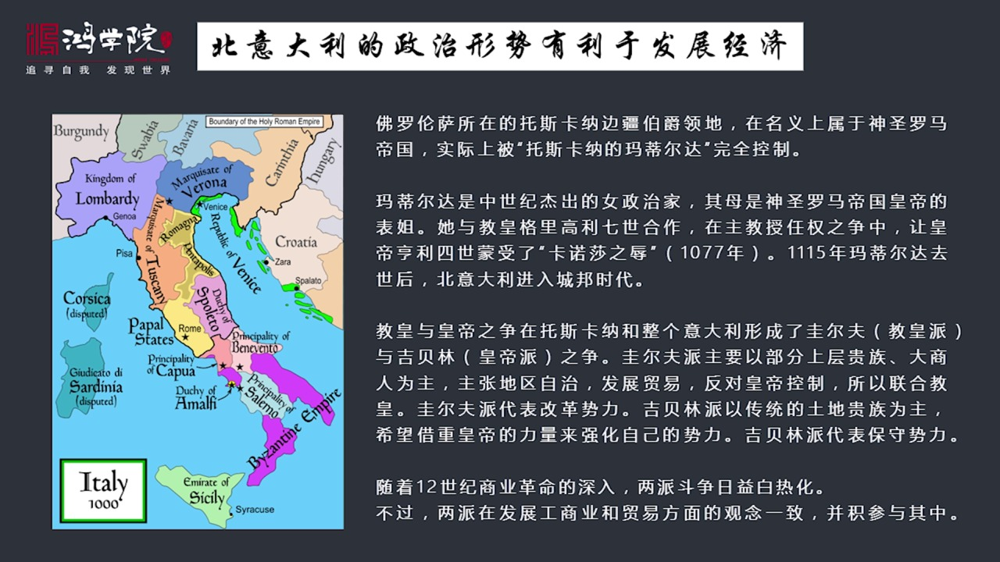

這是公元一千年整個意大利地區的它的政治版圖這個中間的黃色部分就是Toscarna地區然後它的南部這個潛黃的地方就是叫黃國然後它的北部是倫巴地還有這個維羅納大家注意當時這些地區都是在神聖羅馬帝國的控制之...

<strong>All subtitles</strong>

> 這是公元一千年整個意大利地區的它的政治版圖這個中間的黃色部分就是Toscarna地區然後它的南部這個潛黃的地方就是叫黃國然後它的北部是倫巴地
> 還有這個維羅納大家注意當時這些地區都是在神聖羅馬帝國的控制之下所以它叫Toscarna就是佛羅輪廠所在的Toscarna地區它叫什麼呢叫To
> scarna邊疆博決領地倫巴地這是一個王國那麼它還有很多旁邊還有很多工具領地還有很多其他地方那麼一大利南部我們會看到中間有紫色這部分這屬於拜
> 登廷的然後它的最難端西西禮島這屬於伊斯蘭統治的地區所以西西禮島它的文化特徵是比較鮮明的既有伊斯蘭的文化又有伊大利的文化還有拜登廷的文化同時還
> 有諾曼人的文化它是幾種文化交融的地方那麼在Toscarna邊疆博決領地這個地區它名義上是屬於神聖羅馬帝國但它實際上它是屬於Toscarna的
> 馬帝爾達這個馬帝爾達來控制這個地區這個馬帝爾達當然教授名人很多比如說英國也有這個馬帝爾達是它是一個非常不同的馬帝爾達應該說馬帝爾達是中世紀最
> 傑出的女正之家她的母親是神聖羅馬帝國的表姐然後她在這個繼承了Toscarna地區之後成了義大利北部最有權勢的一個女博決那麼在中世紀出現了一個
> 最大的一個根本性的矛盾在義大利半島就是神聖羅馬帝國和羅馬教廷爭奪控制權在這樣的一個爭奪過程中馬帝爾達是跟教皇格里高利七世合作他們是聯合在一起
> 共同對抗神聖羅馬帝國皇帝大家可能會覺得很奇怪既然它是皇帝的表姐是皇親國氣了它為什麼要跟教皇合作呢主要原因就是當時到神聖羅馬帝國它不是我們想想
> 的羅馬帝國它根本不是中央集權它是個四分五裂的有無數的這種血緣或者叫部落公決組成在一起的它的政治組織是相對分散的每一個地方的公決博決都想自立為
> 王所以他們跟中央政府皇帝之間的關係是矛盾的皇帝想要控制這個地區它不幹它想自己統治它就會跟教皇聯合起來跟皇帝做鬥爭這就體現在所謂的主教訓券這種
> 鬥爭之中最後馬帝爾達和教皇讓亨利四世就是當時神聖羅馬帝國蒙受了卡諾沙之魯一會兒我們再講什麼叫卡諾沙之魯但是馬帝爾達這個人呢這個女博決在公園一
> 一五年去世了由於他去世這個北一大利倫巴帝和托薩爾那地區就進入了四分五裂的狀態也就是城邦時代開始了由於教皇跟羅馬帝國的皇帝在這個地區的反覆爭奪
> 導致了在這個地區形成了兩大派一派叫貴爾夫派這是教皇派這是教皇的跟教皇合作對抗皇帝的這一派要求地區自治要求獨立不願受帝國的控制他們叫貴爾夫還有
> 一派叫吉貝林吉貝林派就是跟皇帝打成一片的要借用皇帝的力量來壓制周邊的競爭者這兩派的力量他們分別有自己不同的這個想法主要依靠這項要么是教皇要么
> 是皇帝所以鬥爭越南越激烈整個你看北一大利的政治發展史特別是托斯卡納的這個政治發展史都跟這兩派鬥爭有關當然隨著經濟貿易的發展兩派鬥爭奪權的這種
> 競爭也越來越白熱化不過這兩派再怎麼鬥他們對於在當時的經濟發展條件下大家都要掙錢都要參與這種投資貿易和投資工業的活動所以他們雖然掙拳但在發財致
> 富方面兩者的觀點是一致大家都投資都去賺錢這是北一大利一個獨特的當年比較有利的發展經濟的態勢因為帝國統治和教會的這種鬥爭使得托斯卡納地區的外來
> 的統治力量相對薄弱馬利爾拉斯後這個地區陷入了權力真空正是因為有權力真空你才能夠建立自治的共和國才能夠主導自己經濟發展的命運所以這是他的一個有
> 利的態勢我們看下一頁說到神聖羅馬帝國可教會之間的爭奪我們首先要解釋一下神聖羅馬帝國為什麽這麽衰

---

### Slide 11

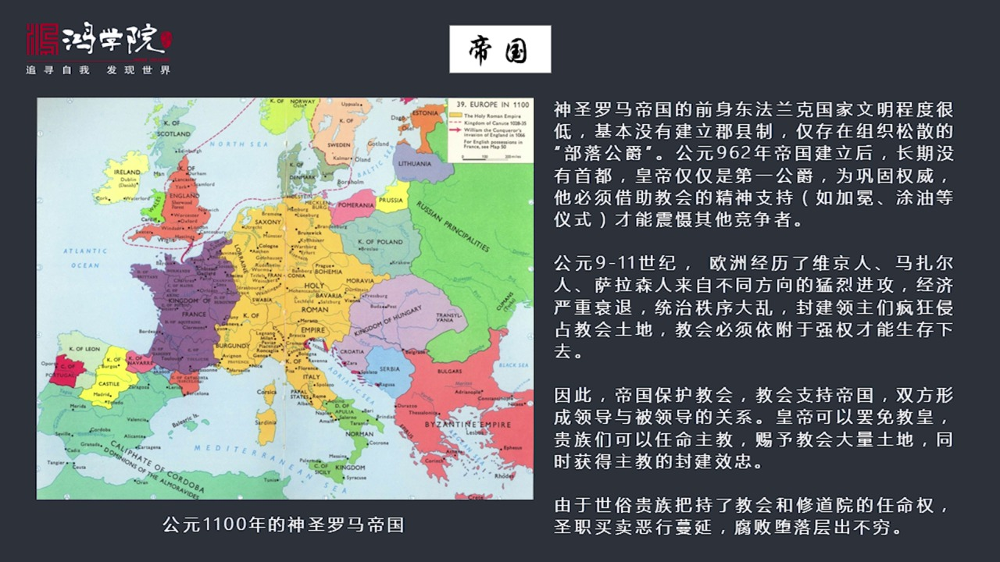

這張圖是公元一千一百年的神聖羅馬帝國我們從圖上可以看哇這個神聖羅馬帝國復原廣闊基本上從現在的北海一直到地中海涵蓋了德國的主要部分涵蓋了這個現在的帝帝國家荷蘭比利時法國的東部地區還有包括伊大利北部地區幾...

<strong>All subtitles</strong>

> 這張圖是公元一千一百年的神聖羅馬帝國我們從圖上可以看哇這個神聖羅馬帝國復原廣闊基本上從現在的北海一直到地中海涵蓋了德國的主要部分涵蓋了這個現
> 在的帝帝國家荷蘭比利時法國的東部地區還有包括伊大利北部地區幾乎全是神聖羅馬帝國的但是這個帝國它既不神聖又非羅馬還不是帝國它的前身是東法蘭克這
> 個法蘭克東法蘭克帝國東法蘭克的帝國的文化程度不是相對很低的就是主要在德國地帶我們現在說德國很發達但是在公園一千一百年或者在羅馬帝國時代它基本
> 上就是滿足還沒有建立什麼文明到了公園一千一百年這個地區仍然很落後它是滿足地區那個地方甚至沒有建立巨限制跟其他的地區比如說跟法國英國還有北一大
> 利相比它要原始的多它連基礎政權都沒有它僅僅有什麼呢是組織非常鬆散的部落公決這個人號稱公園有管這個地方但是基層的這個組織是沒有建立起來的那麼公
> 園九百六十二年也是深圳羅馬帝國奧托伊士創建了這個帝國建立之後沉入羅馬帝國在隨後的好幾百年之間伊士沒有手督可見它的文明程度之低也就是今天在這個
> 城市吃一段在它的領利上吃一段然後下一個就要轉入另外一個城市它是周游市的帶著整個宮廳到處遊走在中國已經到了北宋那麼發達這麼發達的階段沉入羅馬帝
> 國居然連手督都沒有所以你可以想像它的皇帝是沒有什麼太大權力的皇帝僅僅是諸多工業中間的第一工學排行第一而已所以皇帝要想鞏固特別是奧托伊士二世一
> 日後來的鞏固這幾個皇帝為了鞏固權威它必須要借助教會這種精神正常支持比如說它要到羅馬去加勉要徒遊這些都是為了帶來神聖的光環這樣才能夠正設其他競
> 爭頓你別跟我爭我是教會認可的我是基督教認可的那麼如果我們再看當年的基督教的形式公元九到十一世就有三百年時間歐洲經歷了維京人馬這二人就尋瓦利人
> 還有薩拉森人也就是我們先說的伊斯蘭教這些人來自四面八方的維工所以經濟嚴重混亂政治秩序也非常混亂這就導致了當時這三百年中間當時歐洲各個地方的封
> 建大領土紛紛起兵去奪教會的土地這個時候教會到了非常危險的程度所以他們必須要找一個起洋大的保護者否則就不能生存這就是帝國和教會相互需要帝國保護
> 教會教會支持帝國雙方形成了領導和被領導的關係皇帝他由於向教會提供保護所以他可以罷免教皇可以紛紛給這些大主教們土地可以這些貴族們也可以任命自己
> 境內的這種主教同時還次給這些教會大量的大量的這種土地讓教會能夠更好的支持他們在今上給他們支持認可他們是真正的權威讓其他的競爭對手不要跟我爭所
> 以他給這種教會正於土地是需要教教會的比如說主教向他進行封建效忠的就我給你土地你要向我效忠形成了主教跟封建普通的這種諸侯相對應的關係一個主教就
> 是一個地方諸侯這個地方諸侯必須要向皇帝或者向他的封建領主進行效忠是主從關係正是由於這些世俗的貴族國王啊這些工學把吃了教會和修道院的任命權教會
> 的主教修道院的院長都需要世俗貴族的任命所以這些最後導致非常嚴重的問題就甚至買賣這種惡行非常販婪比如說大主教大概價值多少錢它是民馬標價的比如說
> 特點大主教需要5000個經歷另外一個大主教需要7000個經歷就可以買下來由於你這麼幹的話然後教師還可以還可以通婚甚至還有大量的私生子還有很多
> 老婆所以她的腐敗墮落這個情況非常的嚴重我們看下一由於教會她的這種腐敗這就導致了教會中間很多

---

### Slide 12

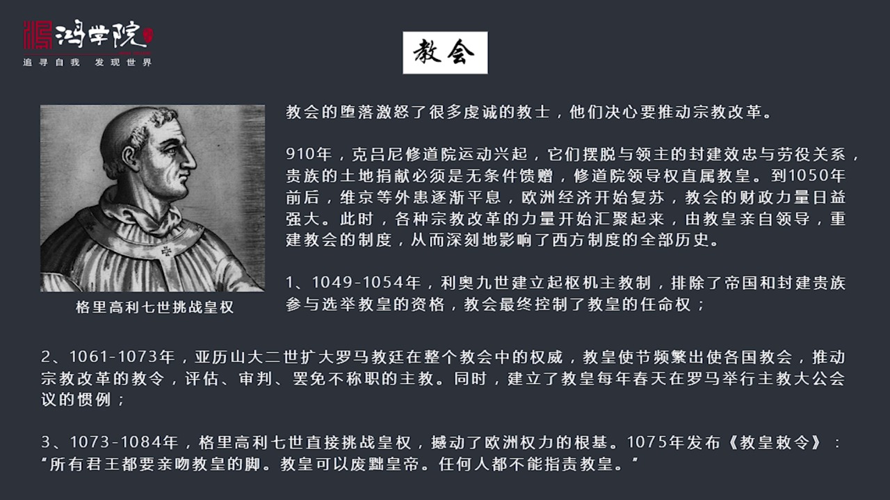

非常前程因為那個時代其中叫星期時間還不太長它教會星期時間還不太長所以這個教會內部還是有很多人要進行改革非常熱身於宗教所以他們要決心推動宗教改革這個時候就星期了克里尼修道院的運動就是放於這個公聯910年...

<strong>All subtitles</strong>

> 非常前程因為那個時代其中叫星期時間還不太長它教會星期時間還不太長所以這個教會內部還是有很多人要進行改革非常熱身於宗教所以他們要決心推動宗教改
> 革這個時候就星期了克里尼修道院的運動就是放於這個公聯910年他們這個運動有什麼特點呢就是要求擺脫跟封建領主之間的效忠關係也就是你這個封建領主
> 決線圖這給我這是你前程對上你前程的表現我給你的回報就是我為你祈禱而已但是我絕不是你的封建封城同時修道院領導權要直屬教皇不能跟你們這些世俗的貴
> 族掛鉤好我再往後到公聯105年之後1050年之後迫害這個損害歐洲三百年的這個外亂開始平息就是為驚人等等這些入侵開始逐漸退取歐洲經濟開始恢復這
> 個時候教皇的11歲收入增加了所以他的政治實力也在於日據增同時呢當時還有這個時代還有各種各樣的宗教改革運動從四面八方開始向中心會急最後就出現了
> 由教皇親自領導重建教會制度了一次偉大的改革運動這堂改革運動教會改革這堂運動深刻影響了西方制度的全部歷史這就是非常著名的這個教權和皇權之爭這有
> 三件大事第一件大事是公約1049年到1054年教皇690建立了書籍主教制以前的教皇是皇帝可以罷免的也可以生命也可以罷免690建立這個書籍主教
> 制度什麼概念呢他排除了帝國和封建貴族參與教皇選舉的權利你們有這個資格了教皇只能由書籍主教來進行推選選舉所以最終經過若干建的發展教會終於控制了
> 教皇的人民權第二件重大的事情是亞利山的二世搞的就是從1061年到1073年亞利山的二世為了擴大羅馬教庭在整個教會中的權威他派出了大量世界頻繁
> 出發歐洲各國到這些各國的教會然後推動發布和推動宗教改革的這種教令對於各地的大主教進行評估審判罷免如果你不合適立刻跟你就敵免職所以羅馬教庭在歐
> 洲的各地各地方的教會以前是死四分五裂各自違政現在教皇的世界不斷的來你不合格立刻把你罷免所以這個時候中央權威羅馬教庭的中央權威逐漸樹立起來了同
> 時亞利山的二世還搞了一個重要改革就是每年春天在羅馬進行主教的大功會議形成了一種慣例那麼第三第三個改革就是葛莉高是葛莉高是七世直接挑戰教皇了直
> 接挑戰這個恨立皇帝了這發生在這個非常著名的這個一個世界啊就是主教學生權之爭非常著名事件發生在2015年葛莉高立七世頒布的教皇吃命這個教皇吃命
> 在立上非常有名他生成什麼呢他生成所有的軍王都要親吻教皇的腳教皇可以廢除皇帝而任何人不能指責教皇我們看到這是對西方整個權力基礎的一次重大的衝擊
> 在以前皇帝是絕對權威好家會現在教皇說皇帝要親他的腳而且教皇可以霸面皇帝那不是直接震動了整個震撼了整個權力大上嗎這就是出現了葛莉高立七世直接挑
> 戰了當時的皇帝恨立四世出現這麼一個重大的事件我們看下一頁這就是為什麼會有卡諾莎之主是什麼意思呢這個1076年皇帝四世跟葛莉高立七世矛盾越來越激化他發布教令

---

### Slide 13

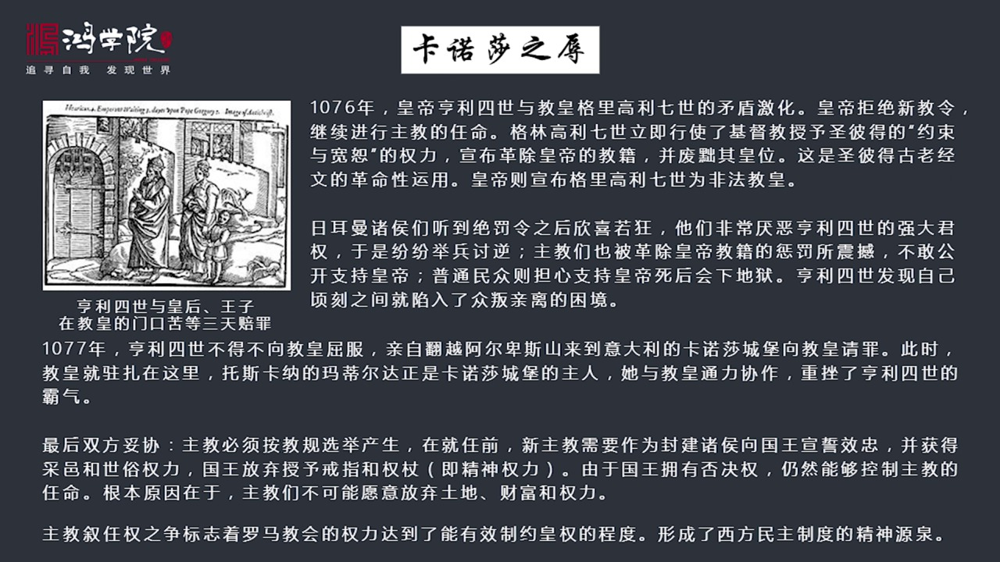

葛莉高這是發布教令所有的主教必須由教皇任命皇帝沒有資格了那恨立皇帝說你算什麼我們立上都是我們來任命有教皇主教當然是我的之前發言之內他根本不搭理這個新教皇繼續任命主教這時候葛莉高立七世就開始發警告說你再...

<strong>All subtitles</strong>

> 葛莉高這是發布教令所有的主教必須由教皇任命皇帝沒有資格了那恨立皇帝說你算什麼我們立上都是我們來任命有教皇主教當然是我的之前發言之內他根本不搭
> 理這個新教皇繼續任命主教這時候葛莉高立七世就開始發警告說你再這麼幹我要對你行懲罰了皇帝根本不搭理他繼續繼續我行我素這個時候葛莉高立七世在教會
> 上第一次行使了一個重要的權力就是基督教授予勝比得的約束與寬恕的權力他這個權力怎麼用呢直接宣布開除教皇開除恨立四世這個皇帝的教極你不再是我們基
> 督教的教徒了並且宣布廢除他的皇位這個在立上可是開天屁地的第一次震撼了歐洲所有的所有的國家因為熱罵了皇帝得一致這個神聖羅馬帝國的皇帝他並不是一
> 家督大他還沒有建立起絕對權利來他雖然打敗了很多競爭對手但是很多人還是用兵自助本來大家都對他就不符你恨立四世要想搞軍權督大把我們這些人把珠侯的
> 權利進行學點我們本來就很不符這個時候教皇發文明你開除了教極同時罷免了皇帝所有熱罵珠侯紛紛起兵新喜若狂終於找到反判的理由了所以大家起兵造反同時
> 在德國內部的所有地區的主教也被教皇的命令嚇待了為他這個決法令所震撼沒有人敢公開站出來支持皇帝了另外呢普通老百姓呢普通老百姓更不敢支持因為他被
> 開除了基督教的教極皇帝不再是教徒了我們如果幫助一個非教徒反抗教皇的話那死後會下地獄的在中世紀大家非常擔心這個問題所以老百姓也不再支持皇帝恨立
> 四世突然發現親客之間自己就從萬名之上立刻變成了重判親力到1077年恨立四世不得不向教皇屈逢親自翻月二被自身來到義大利的卡諾沙城堡向教皇謝罪教
> 皇當時就住在卡諾沙城堡裡面誰擁有卡諾沙城堡呢就是我剛剛所說的托斯卡納的馬地爾達這個女伯爵所以她在立上非常的重要她跟教皇聯手制服了恨立恨立皇立
> 據說是在卡諾沙城堡當時天亮大學是1月份非常的冷趁著腳光著腳沒穿鞋在教皇的這個門口等了3天3夜教皇才接見她所以現在她向教皇附近請罪教皇任措起求
> 教皇的寬恕這就是主教訓人權之爭達到了一個非常驚人的效果教權壓倒了皇權恨立四世皇帝城市是卡諾沙之主那麼最後雙方妥協主教必須要按著教規選舉不能皇
> 帝和那些貴族隨便人民必須按著我們基督教教教會的章童來就任之前作為一個妥協就任之前這個主教需要作為封建猪猴向國王進行效忠然後效忠之後國王才會把
> 土地和採義師父權力給這個主教每個主教仍然是封建的這樣一個猪猴但是作為一個變通的方法就是從精神這個權力來說國王必須要放棄給這些大主教授授這個授
> 嫌那時候要給他戒指和權障這個必須不能再使用了因為這個是屬於教會這是精神權力那麼國王同時還擁有否決權就是如果說你們教會選擇主教我不滿意我可以不
> 同意我可以否決他所以國王仍然實際上控制著主教的任命教會取得了精神勝利但是國王並沒有受到實際損失為什麼會出現這樣的情況呢主要是因為德國這些主教
> 們大家都是封建猪猴我手下又有兵我又有土地然後還有這個龐大的世俗權力你讓我放棄土地放棄一切這些財富讓我變成一個非常窮的主教聽命於羅馬教廷沒人幹
> 不僅他不幹法國的這些主教們也不幹所以唐英比偉大利是要唐英比就說過一句話如果當時教會這條命令得到了執行這些主教們放棄世俗權力放棄財富和土地全部
> 歸屬於這個羅馬教廷的話那嘛基督教在今天就非常的不一樣了他就真正能創建一個精神帝國但在我看來這顯然是不可能的因為所有的人包括這些教會也是非常看
> 重這些世俗權力的財富土地是絕對不會讓的我們再看下一頁正是由於這個教皇和皇帝之間的爭奪

---

### Slide 14

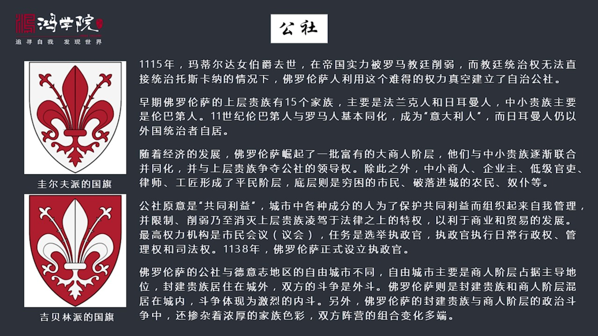

所以導致了權力爭空讓托斯卡納這個地方讓佛羅倫薩能夠在鬥爭中能夠在這個權力爭空之中他能夠形成自治這就是公社公社我們看這個公社主要是馬地爾達女伯爵確實之後佛羅倫薩利用這個難得的權力爭空建立的自治公社那麼早...

<strong>All subtitles</strong>

> 所以導致了權力爭空讓托斯卡納這個地方讓佛羅倫薩能夠在鬥爭中能夠在這個權力爭空之中他能夠形成自治這就是公社公社我們看這個公社主要是馬地爾達女伯
> 爵確實之後佛羅倫薩利用這個難得的權力爭空建立的自治公社那麼早年這個佛羅倫薩內部有十五個最上層的大規族他們這些規族都是什麼人呢主要是法蘭克人熱
> 漫人還有中小規族主要是倫巴地人其實法蘭克倫巴地和熱漫人都是屬於很大的種族的這些人隨著不同的時間進入這個當年的羅馬地區然後你比如說最早來的是倫
> 巴地人他們控制了義大利北部就是現在義大利北部經濟最發達內地方它的種族上主要很多這個有錢有事人都是熱漫人他們不是義大利人還有部分是後來進來的法
> 蘭克人公園800多年跟著查理曼大地打進來的那是法蘭克人在往後呢就神聖羅馬地國這個這個熱漫人所以這些人都是由外來統治民族那麼到了11世紀的時候
> 在北部義大利倫巴地人和羅馬人基本上混血同化了他們被稱之為現代的義大利人這就是現在我們所義大利人北部義大利人是熱漫人和羅馬人同化的結果那麼後來
> 神聖羅馬地國過來的這些人這些熱漫人他們還是覺得自己像外國人一樣還是由外國統治者自居瞧不起義大利本土人那麼所以你會看到羅馬這個佛羅倫薩政治鬥爭
> 史上很多大家族為什麼這麼短為什麼把共和國政府根本不放在眼裡動不動就把自己家庭召集起來攻打政府主要原因就是他們認為我們是熱漫人我們是封建的靈主
> 我們是這個地區的主宰怎麼能聽你共和國這些命令呢這是開國際玩笑嗎所以後來隨著經濟發展佛羅倫薩還崛起了一批非常有錢的大商人階層他們和中小貴族就是
> 倫巴地人還有熱漫人中中間比較低級的這些人主建聯合起來同化了然後開始與大的這些上層貴族這些封建有這個貴族名號的這些統治階層爭奪領導權另外呢這些
> 中小商人還有一些企業主低級觀力律師和工價他們主屆形成了佛羅倫薩的他的平民階層在往下是社會階層就是一些窮困的市民破落進程的一些農民還有努力等等
> 那麼這個公社他的原因是什麼意思呢叫共同利益就是這個城市中有上層的貴族有這個新興的資產階層還有這個市民階層還有貧困的底層底層這些層這個城市中各
> 種成分的人為了捍衛共同的利益而組織在一起來經營自治然後這種自治的結果是主要他的進化方向是為了限制削弱來著消滅上層貴族零降於法律之上的特權就是
> 當時人們已經開始形成法律面前的人平等這樣的觀念只有法律面前的人平等才能夠發展商業和貿易否則貴族都有特權那這個事就沒發生了他要殺個人不長命或他
> 要破壞你的強你的財務他不用承擔任何法律責任那這個商人沒法發展商業沒法發展他的最高權力機關是市民議會就市民會議然後他市民會議的主要只能是為了選
> 擇執政官執政官負責日常行政管理和司法所以弗洛倩在一三八年首次設立了這種執政官那麼如果我們來對比弗洛倫散和德意志地區的城市他是不一樣的弗洛倫散
> 的城市叫公社德意志地區叫自由城市兩者都不同在哪呢就是這個弗洛倫散和被義大利這種城市他是貴族大量的住在城外的貴族搬進了城內他們有自己身家大院還
> 有什麼自己的院墻他們是跟新興的商人街城市共同居住在城內的但是在德意志地區就不一樣德意志的貴族主要是住在城外城市的控力權是掌握在上升手中的所以
> 雙方是水火不相容的這就出現了一個情況在德意志的自由城市跟周邊貴族鬥爭過程中他是個外部鬥爭城內人跟城外人進行打仗軍事鬥爭等等在弗洛倫散在義大利
> 地區他這個政治權力鬥爭體現為激烈的內鬥就一次一次的血腥的內鬥是在城市之內爆發的而同時由於弗洛倫散這種政治鬥爭中不僅是他很混亂他不僅是平民跟貴
> 族的鬥爭他還是要內部的商人街城和貴族之間的鬥爭同時還設立到家族鬥爭所以他是一種非常複雜的鬥爭形態而且雙方這個陣營變化多多那麼說到這個他這個攻
> 射背後他這個法律面生人平等法律英神是怎麼崛起的這是我們再看下野弗洛倫散的攻射制度是受到了12世紀初羅馬法研究熱潮的影響當年的羅馬法

---

### Slide 15

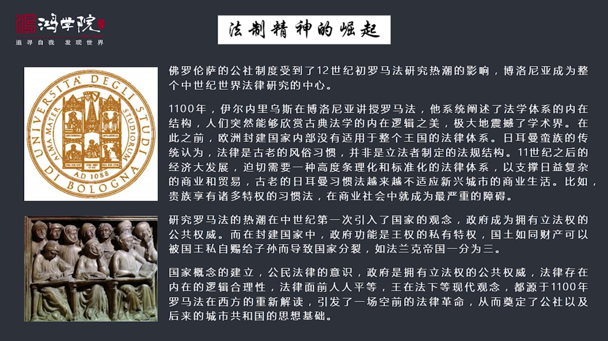

被重新發現在這個12世紀被重新發現之後立刻成了整個歐洲在歐洲興起了一場研究法律的熱潮這個熱潮的中心就在博洛尼亞就是我們看的地圖在佛洛倫散山的對面就是博洛尼亞博洛尼亞成為整個中世紀以世界法律研究的中心博...

<strong>All subtitles</strong>

> 被重新發現在這個12世紀被重新發現之後立刻成了整個歐洲在歐洲興起了一場研究法律的熱潮這個熱潮的中心就在博洛尼亞就是我們看的地圖在佛洛倫散山的
> 對面就是博洛尼亞博洛尼亞成為整個中世紀以世界法律研究的中心博洛尼亞大學成立於1088年這是全世界以之大學中最早建立的西方的這種大學制它是第一
> 個建立它主要的學科就是研究法律為什麼要研究法律呢這個法律有什麼重要的呢因為早年這個羅馬帝國崩潰之後熱漫人打進來之後熱漫人他們是一種比較野蠻的
> 文明他們沒有一種非常複雜的社會結構所以它的法律是習慣法就是他們認為一個國家的就是一個地區的法律不應該有誰這個規定誰都不用規定就按照我們的習俗
> 來所以熱漫人殘留了很多大量的原始的法律原始的習慣法比如說如果證明一個人有罪沒有罪它不是靠推理不是靠這種東西而是看比如說它有這種漏鐵法就是如果
> 你是清白的你只要手中握有一塊燒紅的漏鐵把手都燙爛了三天之後如果你的手自動恢復說明你是清白的還有什麼泥水法把人弄到水水頭然後如果你沒被激死說明
> 你是清白的諸如此類非常野蠻非常滑劑的這種習慣法是熱漫人仍然在十一、十二十季仍然殘存在很多地區的那麼現代就是到了這個一千一百多年經濟已經高度發
> 達社會越來越複雜它要求發展貿易要求發展經濟這會形成一種比較複雜的社會結構你再用這麼古老的和野蠻粗俗的這種法律體系沒有辦法治理這麼複雜的經濟體
> 所以整個歐洲都強烈呼籲要有一種立法的一種新的觀念這就是公元一一零零年著名的法學家葉爾內劉斯他在波羅尼亞首先開始講系統講受羅馬法羅馬法就是查詩
> 丁尼會編的羅馬民法的這個大權他讓歐洲人第一次發現將讓西歐人這些土老帽們被熱漫人這個統治幾百年之後人都變傻了再加上日本滿足本身就很野蠻他文明很
> 粗糙這些人突然發現哇羅馬時代他所形成的法律體系他是一個體系他是有內在的邏輯結構的人們突然能夠欣賞古典法學的內在邏輯之美這個東西極大的震撼了學
> 術界就是法律不是簡單的習慣的這樣的形成而是他有立法的目標有一個嚴謹的法律的結構背後是符合嚴密邏輯的他是推出來了在某種意義上他是一套綜合的非常
> 優美的體系這在以前歐洲人手不知道了所以歐洲人現在突然發現一種條理化高度條理化和標準化的法律體系對他們來說意義重大這就是為什麼歐洲會出現研究羅
> 馬法的熱潮而且研究羅馬法的熱潮過程中在中世紀第一次出現了引入了國家的概念因為立法誰立法當然是公共權威立法他不是習慣不是靠大家沒有一個中心形成
> 的這麼一種習慣的情況他不是靠這個他是要靠一個國家來進行立法所以歐洲人第一次產生了國家的概念產生了政府的概念產生了公共權威的概念就是公共權威要
> 擁有立法權他是從上而下制定了一套嚴密的法學體系在封建國家裡面在日爾曼國家裡面他們就沒這個概念比如說他們認為政府的功能是王權的私有私有的特權國
> 土就像國王的私人財產一樣可以隨便鎮語你比如說法蘭克帝國為什麼會一分為三就是因為查理曼死後或者在他們的那個時代吧國王認為東法蘭克中法蘭克西法蘭
> 克這就是我國王的私有財產我願意給哪個兒子就給哪兒子所以他國家會分裂領土會分裂這個在羅馬法體裡面是絕對不能認同的國家政府和他的領土是抽象出來了
> 是完全獨立出來跟你這個國王沒有關係你國王的存在是為了整個這個抽象了國家的概念而服務的而不是你的私有財產注意啊這是羅馬法引入之後歐洲產生了重大
> 的私有革命所以國家概念的建立公民法律這種意識出現還有政府擁有公共立法全這種權威法律體系存在內在合理性內在邏輯的這個完畢性法律面前人人平等王在
> 法下這一系列現在的概念全部是源於公園一一零零年羅馬法在西方的重新解讀和重新發現引發立場空前的法律革命從而列定了佛羅倫薩建立共和建立公社共和國
> 制度了這種思想的基礎我們再看下一頁正是由於我們了解了佛羅倫薩他的他的地理位置他的自然情況他的合流山脈

---

### Slide 16

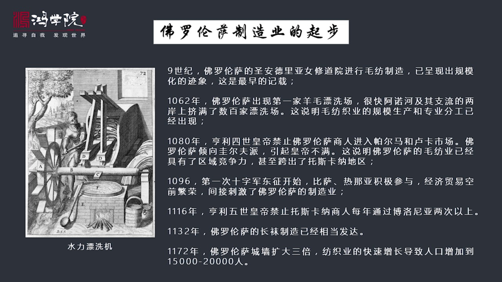

還有他的古代商業貿易通道和現代商業貿易通道以及他的政治周邊的政治環境是一世紀出現了各種有利的環境包括羅馬法從因引入我們這個時候就形成了一個綜合的觀念在十一世紀的時候佛羅倫薩是出在這樣一種狀態之下然後我...

<strong>All subtitles</strong>

> 還有他的古代商業貿易通道和現代商業貿易通道以及他的政治周邊的政治環境是一世紀出現了各種有利的環境包括羅馬法從因引入我們這個時候就形成了一個綜
> 合的觀念在十一世紀的時候佛羅倫薩是出在這樣一種狀態之下然後我們才能夠去探討佛羅倫薩製造業它是怎麼起步的佛羅倫薩製造業它其實一直沒有中斷在九十
> 世紀就有文獻記載主要是修道院主要是教會長能夠在負責自產自銷的這個毛仿著工業的生產當時已經出現大規模的這種教會控制下的仿著廠到了工業1062年
> 佛羅倫薩出現了第一條第一家羊毛票席場水利票已經出現了這就是在河邊有水利才能夠票席場很快阿諾河還有它的幾條自由上便步了數百家票席場這說明什麼說
> 明毛仿這工業已經出現了規模生產和專業分工那麼到了1080年我們從文獻中可以看到康律40皇帝禁止佛羅倫薩商人進入潘爾瑪和魯卡的市場因為佛羅倫薩
> 他在政治侵蝦上是偏規爾覆派的是反皇帝的他們要求自治的當然康律皇帝咱們就非常不滿他屬於馬地爾達的控制了這個地區所以皇帝會限制佛羅倫薩商人的出入
> 這個時候說明佛羅倫薩的毛仿是工業已經有了一定的地區競能力我真沒有必要限制他們你如果就在托草那一個地方轉我也沒必要限制你你只有走出這個地區我才
> 需要通過法律限制你那麼還有一件事就是工業1096年十字軍東正開始比薩熱納亞這些都紛紛打到了蓄利亞這一個地區里巴嫩還有包括現在的以色列佔領這個
> 地區之後建立了很多基礎教國家然後建立了貿易據點皇帝融海貿易立刻行政起來所以經濟貿易空前發展這也間接刺激和帶動了佛羅倫薩了製造業發展那麼後來我
> 們看到在1116年恨立五十皇帝發布禁令限制托草那商人每年通過這個佛羅倫薩兩次以上佛羅倫薩就是山對面的城市法律人就中心皇帝說你每年最多只能兩次
> 不能超過這說明這個佛羅倫薩的商人當時已經在到處去擴張尋找新的貿易機會1132年這個佛羅倫薩的長瓦製造已經在當地非常有名已經非常發達到1172
> 年的時候佛羅倫薩開始擴建城牆擴大了三倍這是由於訪置工業的迅速快速增長導致了就業人口的增長導致人口增長佛羅倫薩在一百年前大概是在107幾年的時
> 候他人口才五千人到了一百年之後他人口發展到了一萬五千人到兩萬人一萬五千到兩萬人在歐洲就屬實上名字了因為當時除了意大利歐洲以外的大城市就是法國
> 巴黎巴黎當年只有五萬人口你要發展了一萬五到兩萬這個規模就相當地龐大了其他的歐洲城市可能除了福蘭德地區有幾個城市之外都達不到這個水平那麼佛羅倫
> 薩發展他的房子月發展還有歸納起來他有幾個特點舊地取材原價製造和本地市場如果我們從原材料來源來看我們如果去

---

### Slide 17

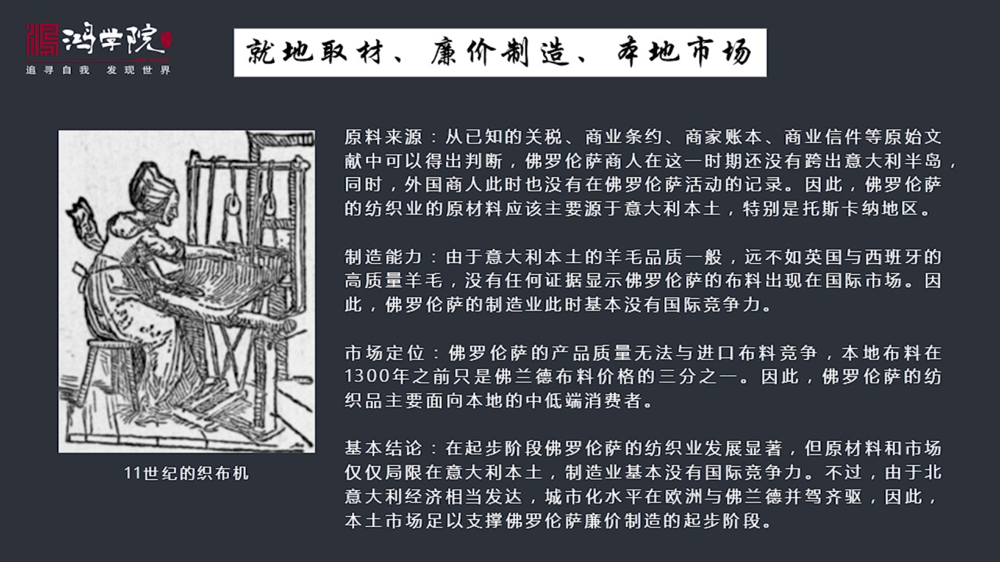

查找當年文獻通過大量運動我們會發現從各個城市的關稅商業條約商家這些賬本還有商業信件中間這些原始文獻中間我們可以得出一個基本判斷佛羅倫薩商人在這個時期還沒有跨出意大利半島同時外國商人這個時候也沒有出現在...

<strong>All subtitles</strong>

> 查找當年文獻通過大量運動我們會發現從各個城市的關稅商業條約商家這些賬本還有商業信件中間這些原始文獻中間我們可以得出一個基本判斷佛羅倫薩商人在
> 這個時期還沒有跨出意大利半島同時外國商人這個時候也沒有出現在佛羅倫薩因為沒有記錄因此佛羅倫薩的房子業的原材料主要源於他周邊的地區周邊的地區有
> 而且夠從製造能力來看由於意大利本土的羊毛質量一般他趕不上英國和西班牙的羊毛所以他就不可能他的最終製造這個製程品就不可能質量很高這也是為什麼沒
> 有任何證據顯示佛羅倫薩的布料出現的國際上比如在北歐在這個這個禮番特他就沒有他的記錄這表明佛羅倫薩的製造業這個時候就是公元一千年到一千一百五十
> 年這一百五年中間基本上是沒有國際競爭力的市場另外正式由於這兩個原因所以佛羅倫薩產品的質量無法和進口布料特別是北方萊斯蘭德的布料進行競爭北方的
> 布料一直到意這個公元一三零零年之前都是這個本地布料都是佛羅倫薩布料的三倍以上可以想像優質布料是萊源北方佛羅倫薩產品的定位顯然是面向本地市場的
> 中低端消費者就像我們現在看到的這個中國製造業所面對的這樣的一個情況一樣我們是集中在中低端製造當年佛羅倫薩也是一個也是這個市場定位所以基本結論
> 就是在這個起步階段的150年中間佛羅倫薩的坊職業發展是非常迅速的但是他的期間很低原材料和市場局限在意大利本土製造業沒有國際性能力當然了由於北
> 意大利的這個地區的經濟還是相當發達的城市化水平在歐洲跟佛蘭德地區是並亞其區的所以在意大利本土市場上他的規模還是較大是足以支撐佛羅倫薩廉價製造
> 這個起步階段的發展的好最後我們總結一下在佛羅倫薩興起的第一階段中1000年到150年

---

### Slide 18

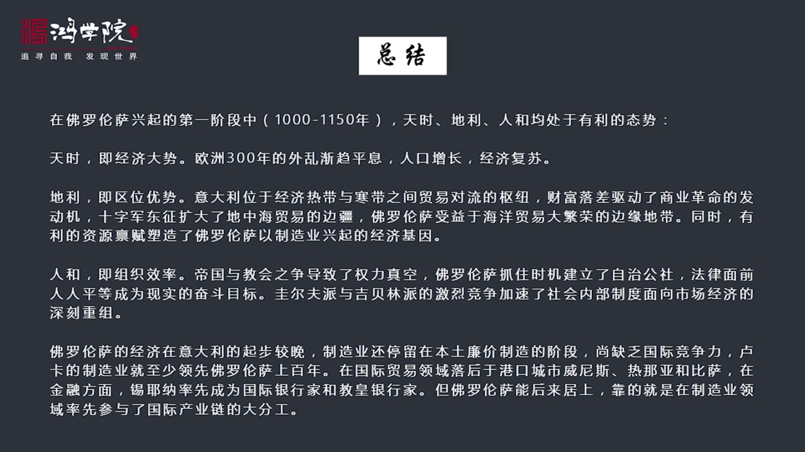

在150年中間天使地利和人和都是有利的天使就是經濟大事歐洲300年的外亂逐漸平息了所以歐洲人口開始復蘇經濟開始增長這是整個的天使地利區位優勢意大利正好處在地中海東部經濟發達的熱帶地區和北海相對落後的寒...

<strong>All subtitles</strong>

> 在150年中間天使地利和人和都是有利的天使就是經濟大事歐洲300年的外亂逐漸平息了所以歐洲人口開始復蘇經濟開始增長這是整個的天使地利區位優勢
> 意大利正好處在地中海東部經濟發達的熱帶地區和北海相對落後的寒帶地區之間的貿易對流的疏扭這樣的一個位置上所以財富是有落差的東部財富的創造力強西
> 部財富創造力弱所以財富勇動財富這個回流財富這個對流驅動了整個工商業貿易工商業貿易的發展是驅動了商業革命的發動機時尊東征擴大地中海貿易的邊疆佛
> 羅倫薩受益於海洋貿易大繁榮他是出在邊緣地帶的但是他受到拉動的同時有利的資源貧富佛羅倫薩周圍的這些自然貧富是非常有利於他興起製造業的所以地利對
> 他是有好處的任何組織效率帝國和教會執政導致了這個地區出現全力真空佛羅倫薩抓住了這個時機創建了自治工社法律面前人平等成了現實的目標而貴爾夫派和
> 吉貝林他的激烈競爭加速了社會內部機制的整合快速走向了面向市場經濟的這種重組所以雖然佛羅倫薩在義大利北部他的起步是教完的製造業還停留在基本沒有
> 國際經歷他周邊的盧卡製造業至少領先他一百年在國際貿易領域他落後於港口城市威尼斯、熱南亞和比薩在金融領域他落後於斜娜斜娜率先成為國際銀行家和教
> 皇娘家內首佛羅倫薩啥也不是但是最終佛羅倫薩卻在後來一兩百年發展中後來居上靠的就是他在製造業領域中率先參加了國際產業鏈的大分工關於這個話題我們
> 下幾課重點來探討最後我列出了一些參考文獻這些參考文獻涉及到諸多方面如果大家有興趣可以參考今天課程到這裡為止謝謝大家

---

### Slide 19

<strong>All subtitles</strong>

---
