# 核心课视频-024讲.辉煌的佛罗伦萨（2） — Clean Slide Notes

> **来源**：鸿学院核心课程  
> **幻灯片**：18 张

---

### Slide 1

輝煌的佛羅倫薩第2部分第2部分的負標題是加入全球產業鏈時間段1150年到1300年我們上當課講的是佛羅倫薩經濟的起步就是從公元一千年到一千一百五十年今天我們接下來講第2個飛躍就是全球供應鏈的加入我們看敵業敵業仍然以方法論開始因為方法論中間提到了我們6個階段的主要劃分

---

### Slide 2

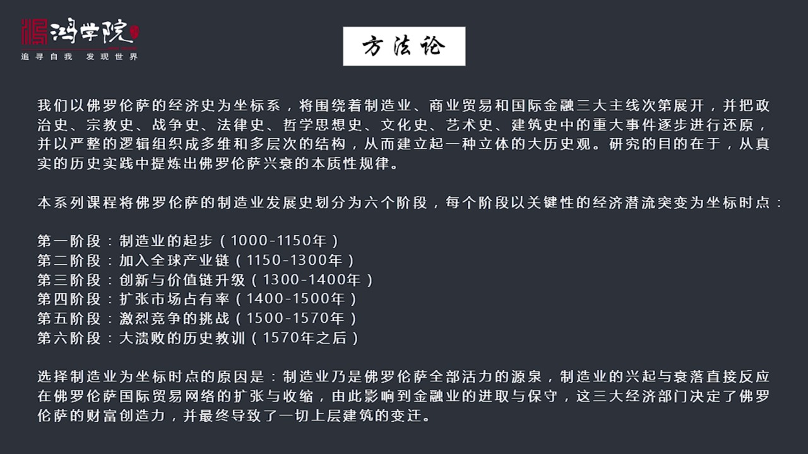

便於大家參考所以我們今天涉及到第2部分加入全球產業鏈之後對佛羅倫薩的經濟發展包括它的社會制度政治制度還有它的文化藝術各方面所造成的綜合性的影響因為我們是在建立一個立體的歷史觀大歷史觀以前我們談到歷史的時候總是分分別類去談講建築史了專門講建築史講文化史了之講文化史講政治史軍事史等等但是沒有一個主線把歷...

---

### Slide 3

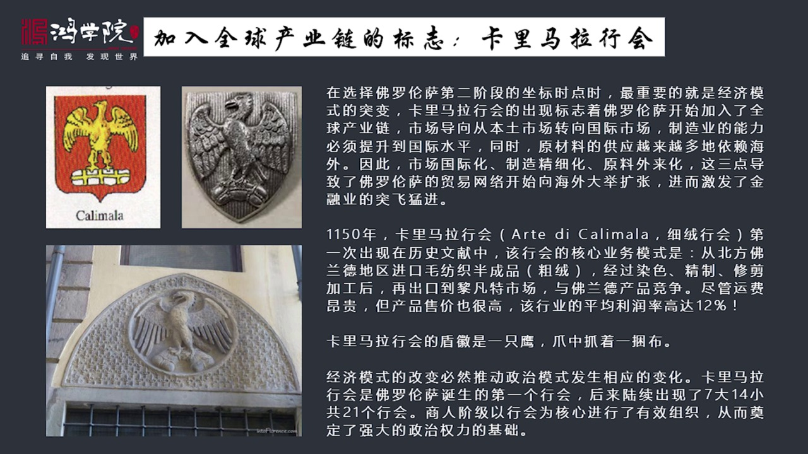

我這樣選擇並不是拍攝老闆想的包括每個時間節點選擇而這種選擇呢就跟講佛羅倫薩歷史的國外的書並不完全一樣因為我看了幾十本關於佛羅倫薩各方面歷史的書記都是世界民家所住基本上沒有人把這個時間節點作為一個特定的節點來提出來在我看來我選擇這個節點的原因在於我是從經濟發展史的角度切入雖然我看過佛羅倫薩經濟史有好幾...

---

### Slide 4

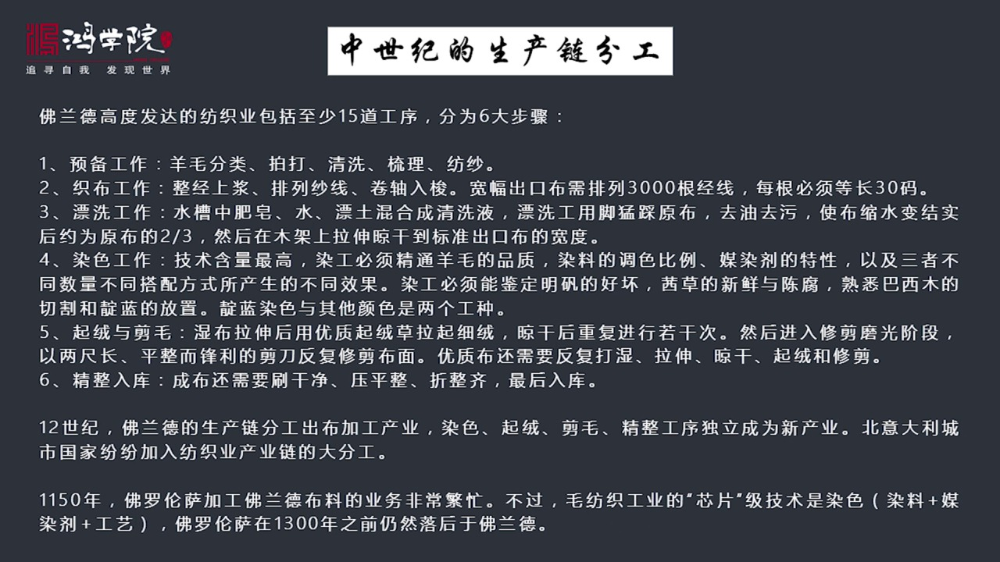

它就已經出現了高度分工的防止工業當年的佛羅這個佛蘭德的這個防止業已經進行了分工大分工可以分成六大步驟十五至少十五大工序我們以前系統輸理過這十五工序包括哪些大致說起來有準備工作比如說羊毛的分類拍打清洗等等準備完了之後就支部然後票息染色啟容和解毛最後是精整入庫那麼在這全鏈條的十五個工序中其實有一些是隨著...

---

### Slide 5

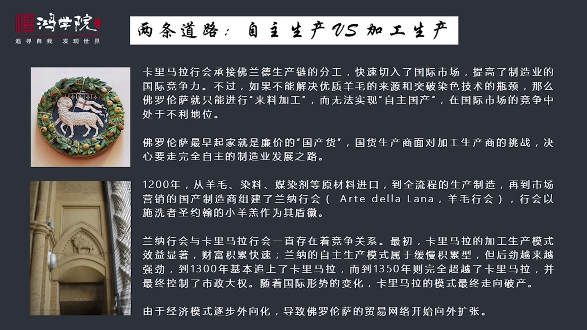

兩條道路在相互競爭一條道路就是我們剛所說的卡尼瑪拉、韓匯和所代表的加工貿易就是加工生產還有一條道路我稱之為是自主生產什麼叫自主生產呢就是這個福蘿倫散本地的毛坊之工業的製造商立實上一直在自己製造這個羊毛他們是從羊毛的採購就從原材料然後依照生產製造的全過程然後再到市場營銷全部是由他們自己來做所以叫國產自...

---

### Slide 6

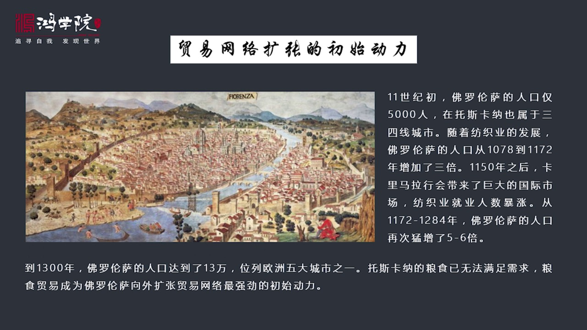

你會發現它這個貿易網絡往來走的時間是比較早的主要是什麼原因呢是人口的壓力我們剛才這個第一堂課專門講到過佛羅倫薩在1000年開始他的矛訪這個工業逐步起步到了150年第一階段實現了第一階段發展目標那個時候在他起步之前1000年的時候佛羅倫薩人口才5000人在圖子卡納這麼小個地方他也屬於3-4000城市根...

---

### Slide 7

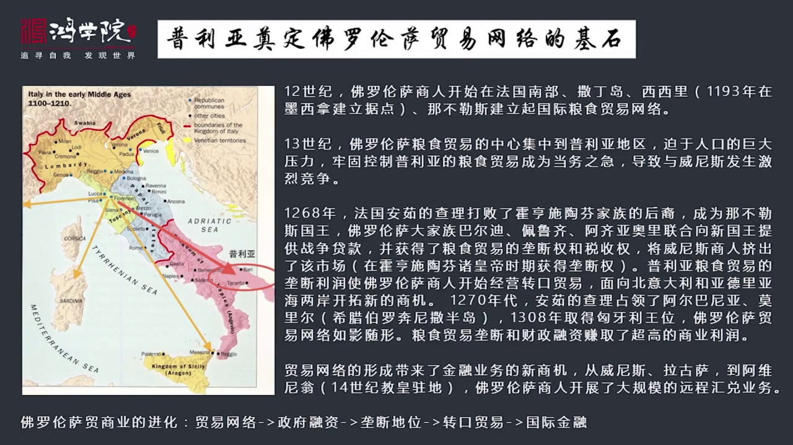

我列出了他們去很多地方去尋找比如說一一幾年就到了這個佛羅汪斯法國的南部到了薩頂島到了熙熙里比如說他們這個歷史文件記在1993年的時候佛羅倫薩商人就在這個墨西拿這個地方建立了商業之名地當然還有納布勒斯義大利南部都有他們都開始去到處找糧食義大利南部農業是相對比較發達的那麽到了一二幾幾年十三十幾佛羅倫薩的...

---

### Slide 8

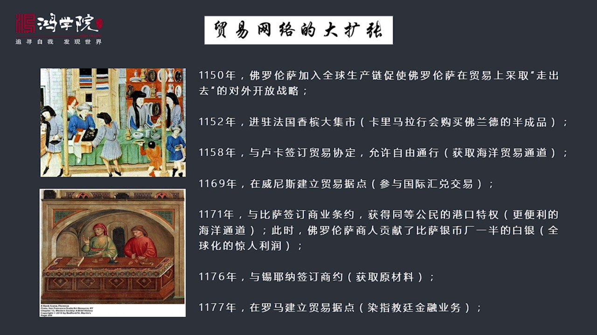

我看了幾十本書把各種各樣的重點的信息按了實驗室去把它列出來提煉出來然後你看到這個時間表再想到它這個全球商業模式的形成加入成球產業鏈這張表才能夠體驗出本身的意義否則的話在一本書裡面如果沒有這個框架比如說在一本這個歷史中提了一句佛洛倫薩在一一幾年出現了一個什麼事跟哪個城市簽訂了個商業貿易條約當它沒有放到...

---

### Slide 9

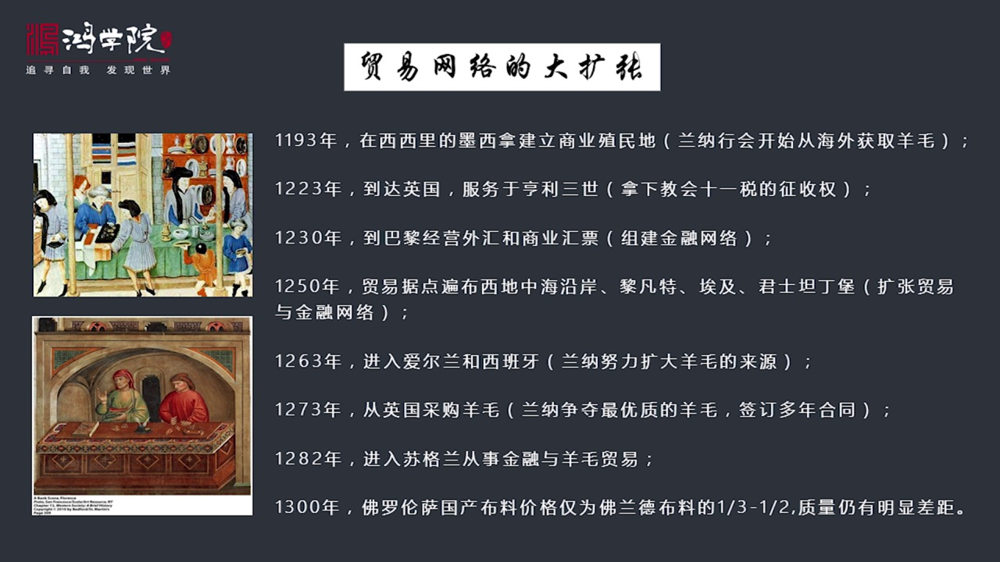

但是他雖然沒有政治成立機構但很多商人當時已經去了墨西拿幹嘛呢要從托尼斯去進口北非的羊毛這是第一次出現了托斯卡納本土羊毛不夠向海外去尋求羊毛的案例一二三年副主持人上人到了英國主要是服務於恆立三世英國國王當然他們當時還沒有到英國去做其他生意主要是什麼呢主要是開始拿下教會十一歲徵收權的業務這個時候說明到一...

---

### Slide 10

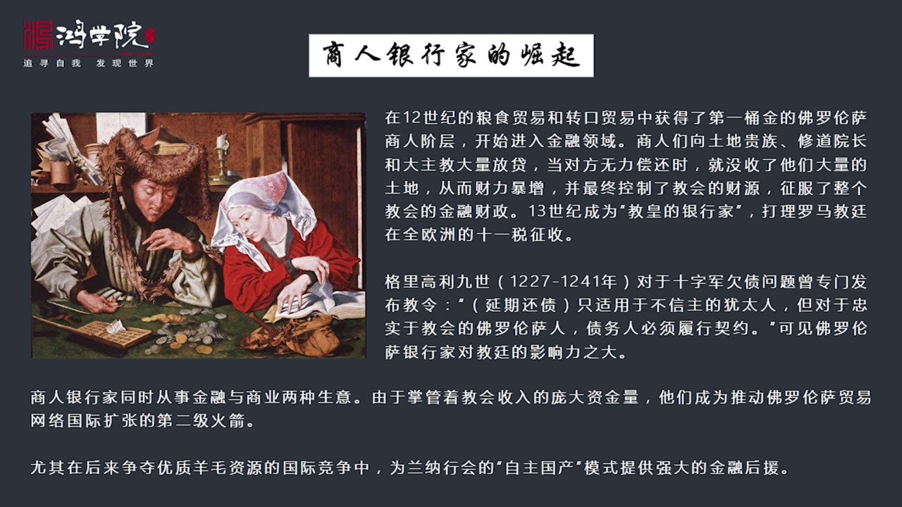

在中世紀初期就是我們現在所說這個時期商人銀行家什麼概念呢就是這幫人在糧食貿易菩利亞的糧食貿易和轉口貿易中獲得了低筒金然後這些人又把這些錢轉入了金融領域他們開始向整個意大利半島上那些土地大貴族這些人地位很高土地很多但是手上缺乏現金周轉的資金不足特別缺錢金流所以他們這些人如果有資金的需求這些金融家向他們...

---

### Slide 11

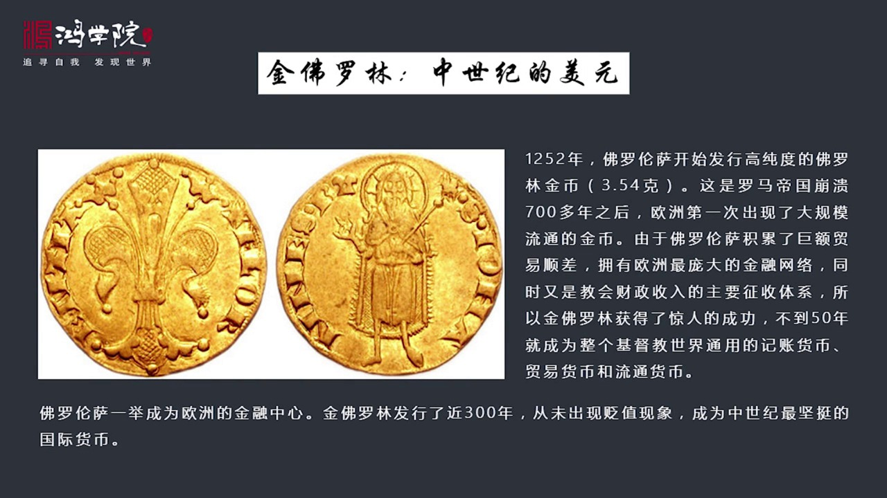

這個11歲的徵收體系然後還積累了龐大的這樣貿易順差所以在1252年的時候佛羅倫散開始發行高純度的精密佛羅林3.54克這是羅馬帝國崩潰以來700多年之後第一次在歐洲出現大規模流通的禁閉以前也有王朝發行比如說差點慢那個時代他也發行過流通量很小但是佛羅倫散流通量是動折幾百萬美的這樣一個流通量那是完全不是一...

---

### Slide 12

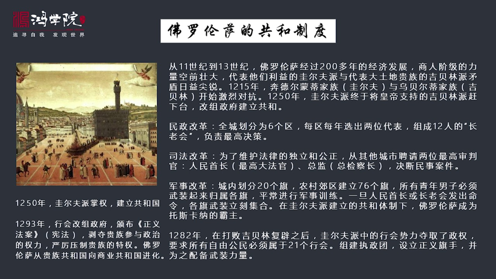

經過200多年的這種繁榮它的商人階級力量空間壯大那麼代表他們利益的就是維爾夫派代表大地主貴族的這個利益集團的就是極波林派兩派徵權多利的矛盾越來越尖銳到了一二五一二一五年這個矛盾矛盾公開爆發了兩派時間的兩大手領家族奔德爾蒙地這是貴爾夫家族的貴爾夫派的大家族它是手領還有這個烏貝爾帝這個是極波林這一派的手...

---

### Slide 13

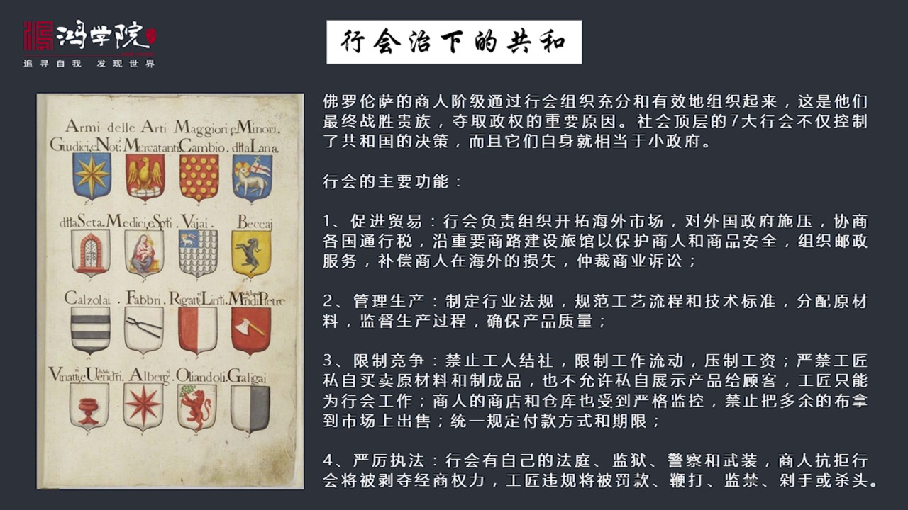

最後戰勝的貴族多起政權他是有一系列重要的原因我們已經講到了社會頂層建立了七大大航會他們控制共和國層面的所有的決策同時這七個大航會就是小政府航會主要功能包括哪些呢第一個最重要功能促進貿易就是航會要負責組織開座海外市場比如說我們要去墨西達建立執民地航會要負責到那去跟墨西達的當地政府比如說西西里的政權去談...

---

### Slide 14

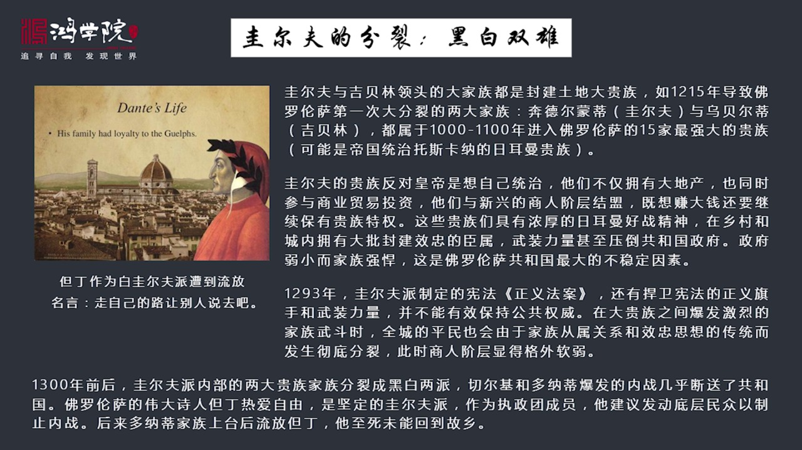

這樣一來大權在臥大權在臥之後鬼爾夫派雖然長了全他是親商業的結果他們自己發生了分裂為什麼會發生分裂呢其實不管是鬼爾夫派還是幾倍零派不管是所謂這個皇帝派叫皇派其實他們這些兩個派別的大家族都是封建土地大家族你比如說剛才提到了一二一五年導致弗羅倫薩第一次大分裂的奔奈爾蒙帝和烏威爾帝這兩個家族都是大家族你要查...

---

### Slide 15

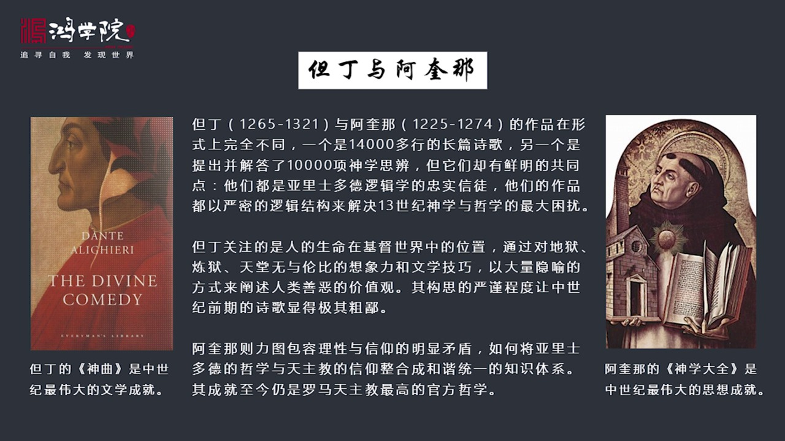

然后我们再看思想文化领域周所出现了很多问题,为什么在当时出现了这样一个伟大的思潮,出现了这么一个伟大的著作,你就可以理解当年的背景是什么呀。现在我们看文化时,好讲弹丁的时候基本上抽空了所有的历史背景,根本不知道神曲背后创作,整个佛罗伦散在发生什么,整个意大利在发生什么,整个西方世界在发生什么,没有任...

---

### Slide 16

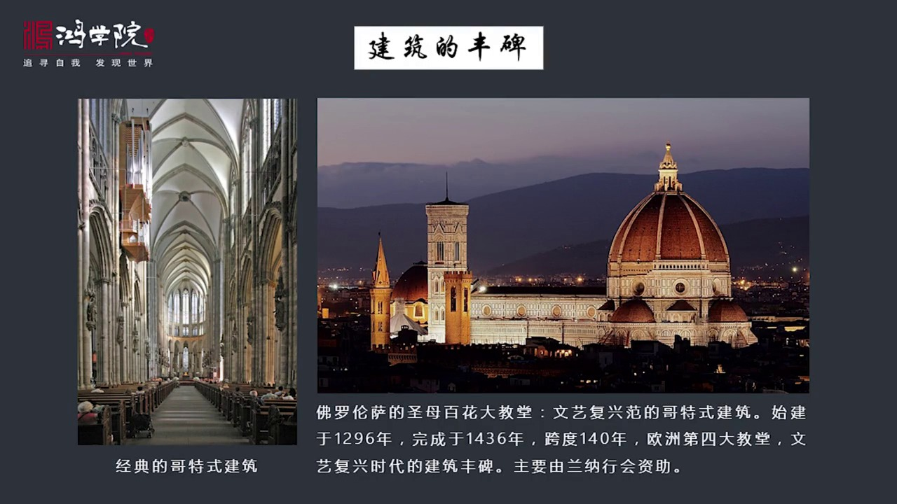

当时,在这个十三世纪的时候,一二几年,他就出现了经典的歌特建筑,歌特建筑为什麽呢?歌特建筑其实全是法国,在意大利人眼中,法国和日曼地区这些蛮足搞的艺术,叫歌特艺术。歌特艺术的称呼是意大利人教出来的,他是一种贬义词,就说歌特这些野蛮民族搞错了文化艺术,有什麽了不起,怎麽能跟我们罗马艺术相比呢?他们是有...

---

### Slide 17

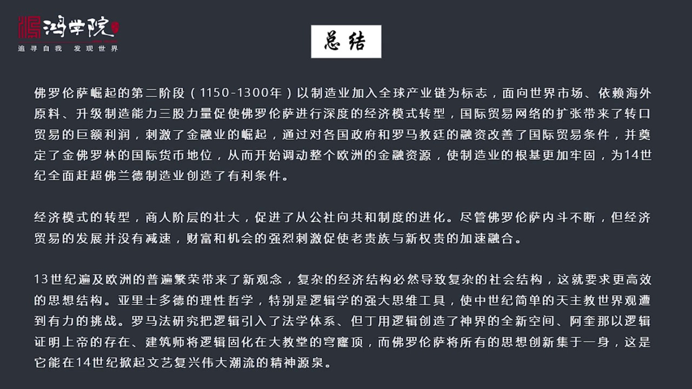

微标制的面向世界市场依赖海外原料升级制造能力这三股力量会及在一起促使了佛罗伦萨进行了深度的经济模式转型国际贸易网络他的巨大的扩张带来了转口贸易带来了巨大的利润然后这些利润倒入金融行业进行放态刺激了金融业务的崛起然后建立金融网络之后在经过资金的周围形成了金融网络最后通过对各国政府和罗马教庭的融资获得了...

---

### Slide 18

---
