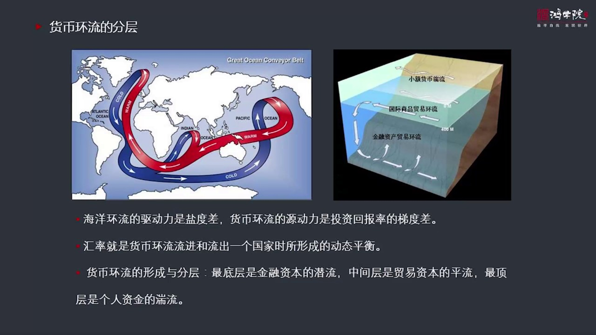
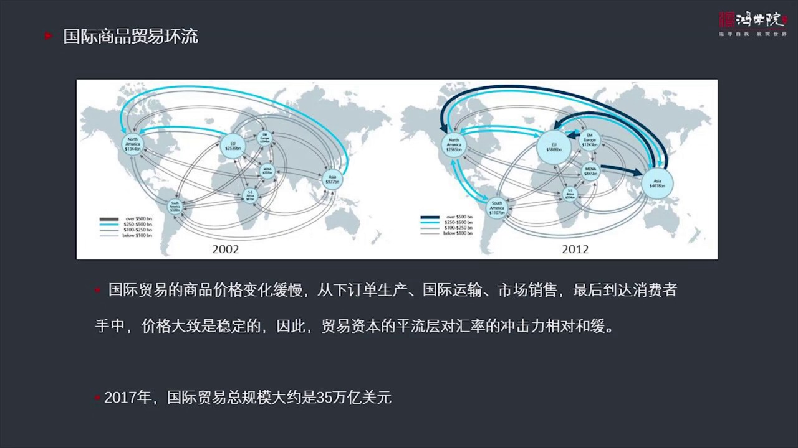
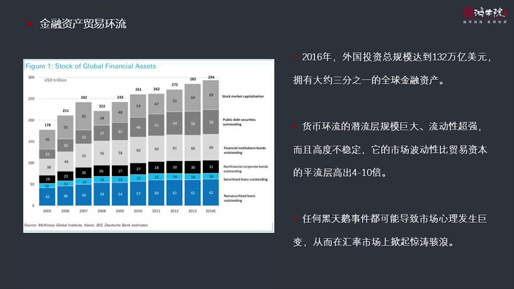
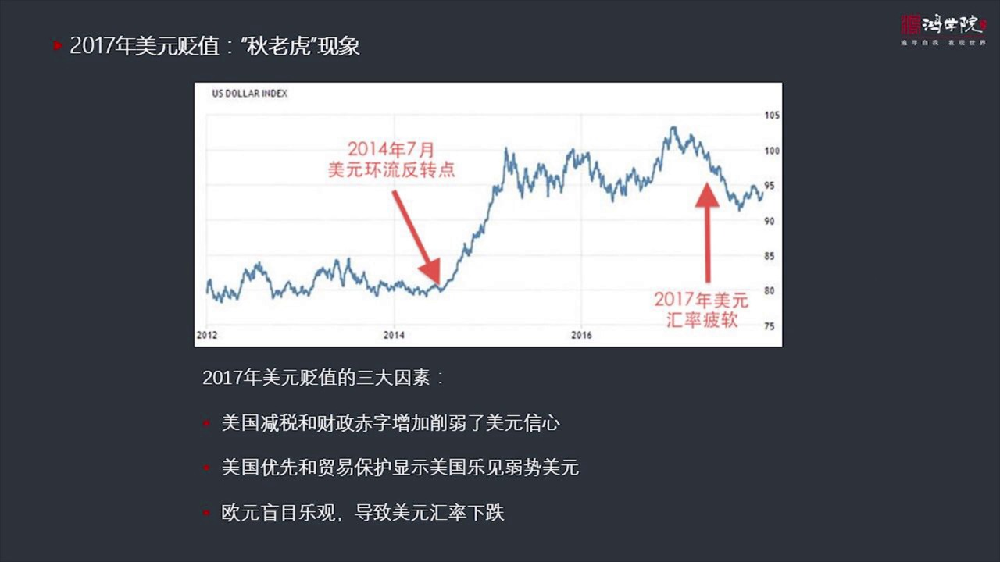
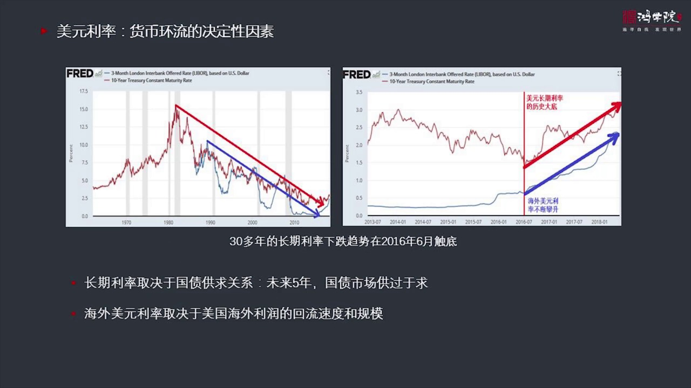
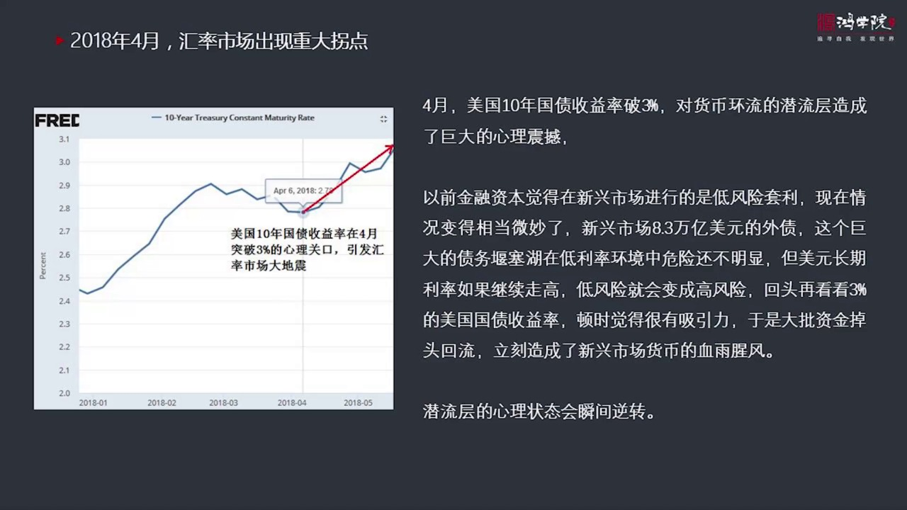
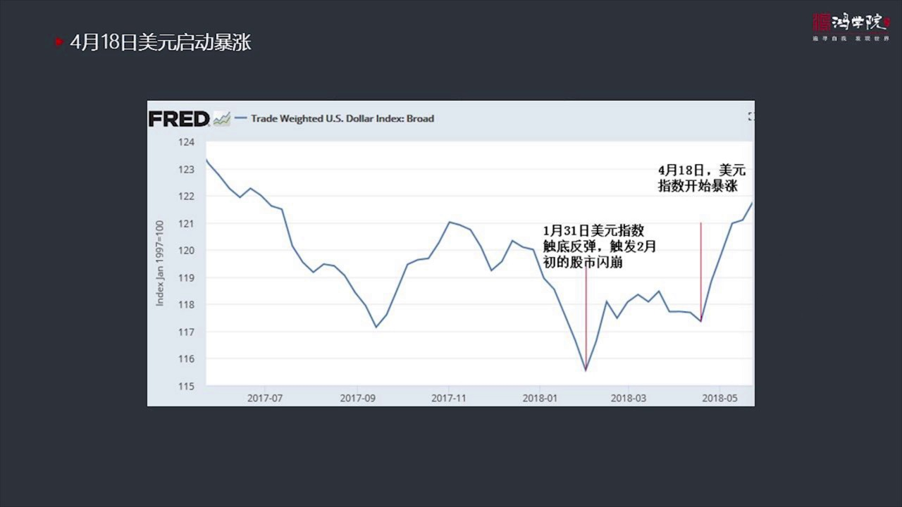
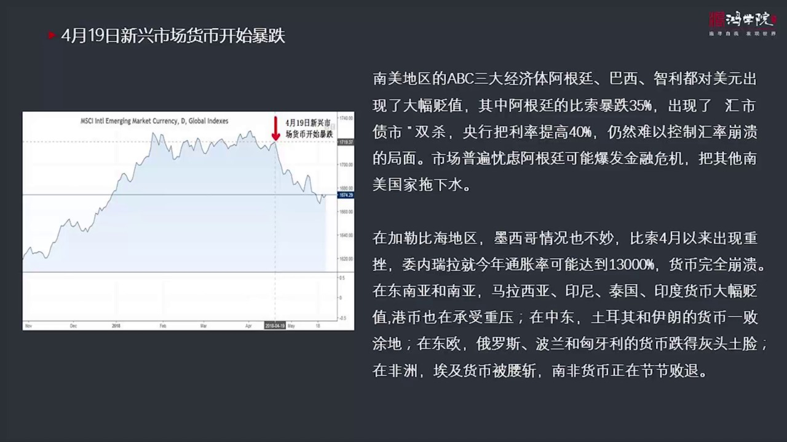
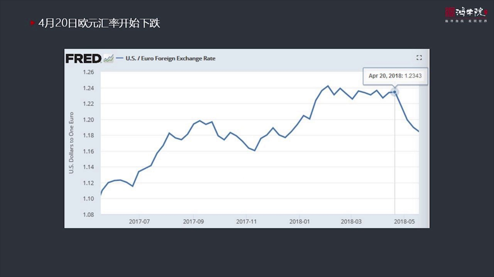
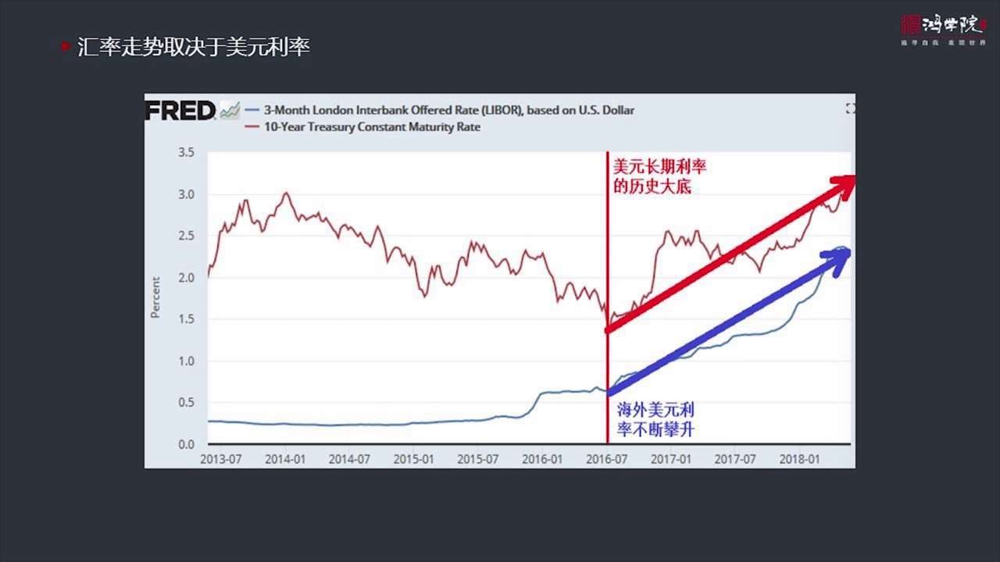

# 核心课视频-025讲. 新兴市场货币的美元劫难 — Clean Slide Notes

> **来源**：鸿学院核心课程  
> **幻灯片**：12 张

---

### Slide 1

新興市場貨幣的美元階難記得我們在年初的全球熱點掃描中專門談到了美元匯率今年有可能會突然返轉當時從市場的大部分的觀點來看大家基本認為美元仍然會延續2017年的這種貶值的態勢但我們做出了相反的判斷原因就在於我們通過分析美元匯率的外因簡單的說就是歐元在2017年他的表現過度走強就是很多是螞蟻因素由於歐元對...

---

### Slide 2

做進一步的分析我們在核心課的第一講中建立了一個全球貨幣流動的一個大的體系這是一個較粗的框架我們把貨幣還留類比於海洋還留那麽驅動海洋還留的是嚴度差那麽驅動貨幣還留的是投資回報率的提度差也就是金錢為了追助這種利潤那麽他們將會從中興區、勇相全世界各個發展中國家、新興市場國家還有其他的地區所以這套理論框架我...

---

### Slide 3

如果我們比較2002年到2012年會看到這些箭頭的粗細發生了重大變化變得越來越粗了特別是亞洲地區跟2002年比起來十年之前比起來那麼你會發現明顯的資金量這個跟歐洲交易跟美國的這種貿易還有跟中東它變得非常的粗壯就是在右途中我們用深藍色的箭頭表示的所以貿易它也在增長貿易資金的環流也在增長那麼它有一個如果...

---

### Slide 4

這個國際商品貿易它有本質區別金融資產貿易呢關注了不是貿易中的商品它關注的是生產這些商品的公司也就是這些公司的資產比如說股權或者債權那麼它是通過進入金融市場來做這個公司的資產的交易所以我稱之為是金融資產的環流它是一種資產貿易如果我們來看它的規模的話其實這個規模也相當的可觀比如2016年外國投資的總規模...

---

### Slide 5

就是更加細分化的美元環流我們再來重新的解讀一下美元在2014年主線有熱變了之後發生了一些情況譬如說我們從這張圖上可以看出2014年7月是美元環流的反轉點這在我們第一趟課就已經講過然後我們看到美元指數一路判升但是到了2017年它就出現了一個明顯的一個下滑那麼當時的美元扁只有三大因素第一是美國減稅財政赤...

---

### Slide 6

是最核心的一張圖在我看來決定這種貨幣還流的最根本的因素特別是決定它底層的金融資本的前流層的這種根本的因素是美元的利率它來主導的如果我們判斷美元利率會不斷往下走這個環流一定是熱環流因為資本要追究收益率它一定會向海外流一定要在全球去尋找投資機會但是如果這個利率的總的方向是往上走它一定會出現冷環流現象那麼...

---

### Slide 7

發生了一些什麼情況首先會率市場的重大的拐點出現了4月份為什麼出現了4月份就是美國10年國債收益率在4月突破3%以前有好幾次靠近3%但沒有真正突破但是在4月份它其實這個啟動是從4月6號以上4月24號第一次突破了3%這個對於很多人來說這可能不太明點3%就3%但是這對於整個市場的心理特別是對於貨幣還留中間...

---

### Slide 8

當然美元指數有很多我現在用是美聯儲我比較喜歡用美聯儲的數據因為它的數據在我看來它的統計還有數據的採集還有分析它的權力性更高如果我們看這個美元的指數就是跟所有的主要的這些國家做貿易的這個加權平均值你會看到美元的指數的啟動其實是在1月31號我記得我們講過2月25號2月6號美國股市發生了大地震這種大地震衝...

---

### Slide 9

我們看到4月19號新鎮長國家的貨幣就開始了暴跌這個時間基本上是完全溫和的那麼現在出現的情況南美地區三個經濟體阿根廷霸氣智力對美元都出現大幅便知阿根廷跌得最慘就是到5月份它的比索已經跌了35%出現了所謂債市和會市雙殺局面為了對付這個局面阿根廷的中央銀行把利率挑到40%這是一個自殺性的利率即便是這樣仍然...

---

### Slide 10

這都是一連串緊急著發生的一系列時間歐元會率在4月20號也開始下跌所以我們看到美元的這種走牆其實跟它內部的這種力量特別是這種貨幣環流中間的這種前流程金融資本程關係十分密切而金融資本程它的規模如此之大而且它的交易如此的簡單如此的跨境流動如此的方便再加上它的高度的不穩定性這都會導致一旦市場消息發生任何的變...

---

### Slide 11

其實就是這兩大利率一個是美元的長期利率另外一個是美元的海外的Liber利率現在我們已經看到從2016年開始這兩條線都在往上走應該說是發生了歷史性的轉折關鍵是進一步分析和判斷的時候需要需要一些更精準的一些分析和判斷比如說美元的長期利率還會不會繼續往上走這要看數據長期利率取決於國債收益率國債收益率當然是...

---

### Slide 12

謝謝各位

---
