# 核心课视频-026讲. 辉煌的佛罗伦萨（3） — Slide Notes

> **来源**：鸿学院核心课程  
> **幻灯片**：23 张

---

### Slide 1

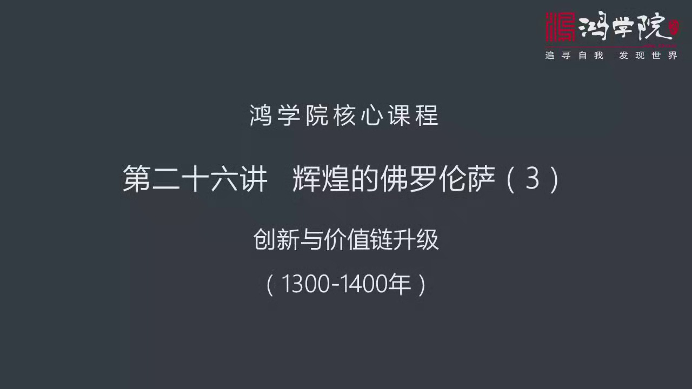

輝煌的佛羅倫薩第3集創新與價值鏈升級這個主要講130年到140年我們首先看第1頁還是重複一下方法論

<strong>Cleaned narration</strong>

> 輝煌的佛羅倫薩第3集創新與價值鏈升級這個主要講130年到140年我們首先看第1頁還是重複一下方法論

---

### Slide 2

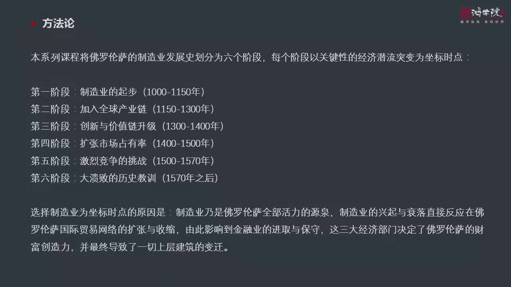

我們把佛羅倫薩的歷史分為6個階段主要的思路就是要找到他經濟結構發生突變的那個實驗點作為我們實驗作標的選取的日期所以我們談到了第1階段是製造業的起步第2階段是加入全球產業鏈那麼第3階段就是我們今天要講的創新和價值鏈升級有了這個清楚的時間分界點之後我們再回過頭來看他的這個政治、經濟

<strong>Cleaned narration</strong>

> 我們把佛羅倫薩的歷史分為6個階段主要的思路就是要找到他經濟結構發生突變的那個實驗點作為我們實驗作標的選取的日期所以我們談到了第1階段是製造業
> 的起步第2階段是加入全球產業鏈那麼第3階段就是我們今天要講的創新和價值鏈升級有了這個清楚的時間分界點之後我們再回過頭來看他的這個政治、經濟

---

### Slide 3

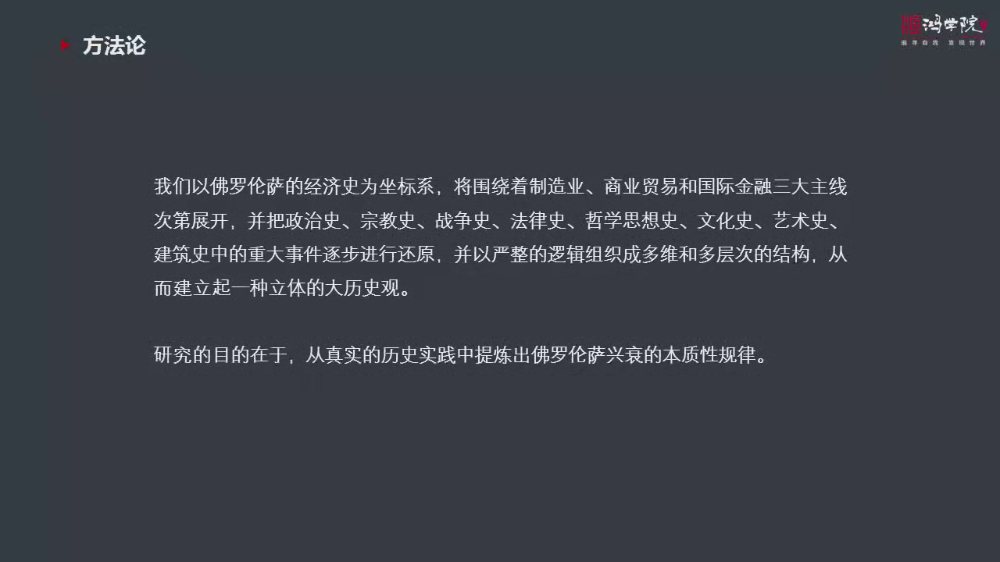

還有文化藝術、宗教等等就能夠把所有這些視角整合在一起來看到佛羅倫薩經濟崛起他的發展繁榮中間一些本質性的更深刻的規律我們看下頁技術創新他技術創新的突破點在哪裡

<strong>Cleaned narration</strong>

> 還有文化藝術、宗教等等就能夠把所有這些視角整合在一起來看到佛羅倫薩經濟崛起他的發展繁榮中間一些本質性的更深刻的規律我們看下頁技術創新他技術創新的突破點在哪裡

---

### Slide 4

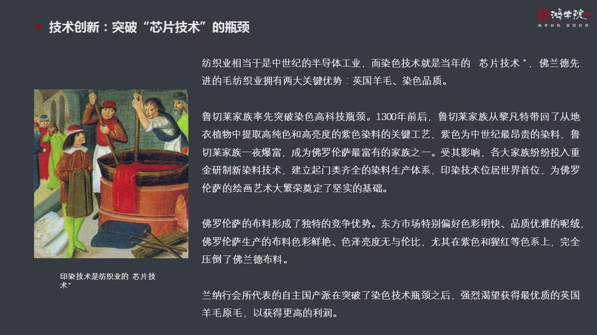

我稱之為是突破了芯片級別的技術那麼當年的綁織工業中世紀的綁織工業相當於現在的半導體他是個利潤很高而且涉及到的雇用人口數量巨大可以說是一個國家和一個經濟體的最主要的經濟發動機那麼在綁織工業中間最重要的有兩個核心點第一是優質的原材料比如英國羊毛第二就是非常核心的染色技術我稱之為是綁織工業中間的芯片如果不...

<strong>Cleaned narration</strong>

> 我稱之為是突破了芯片級別的技術那麼當年的綁織工業中世紀的綁織工業相當於現在的半導體他是個利潤很高而且涉及到的雇用人口數量巨大可以說是一個國家
> 和一個經濟體的最主要的經濟發動機那麼在綁織工業中間最重要的有兩個核心點第一是優質的原材料比如英國羊毛第二就是非常核心的染色技術我稱之為是綁織
> 工業中間的芯片如果不能突破這個芯片技術那麼你的產品質量就不可能達到那種價值鏈的頂端那麼佛羅倫薩再跟佛蘭德的這個綁織品徑比較的時候首先佛蘭德的
> 原材料用得更好他是用了英國羊毛而佛蘭德用的是佛羅倫薩用的是本地羊毛後來用一些北非的羊毛但是品質都比英國羊毛要差這是導致它的產品的質量上不去的
> 關鍵原因所以前他只能做中低端的這種產品第二個重大差距就是佛蘭德的染色技術很高它的染色的品質包括原材料像那種鹽之紅等等都是來源於最好的這種產品
> 從海外進口所以佛羅倫薩也想超越佛蘭德的話必須要在這兩個方面取得突破那麼在芯片技術上這個染色技術他是怎麼突破呢主要這就涉及到一個重要的家族努切
> 來家族是他們率先突破了這個染色技術這個芯片的平靜那麼如果我們看佛羅倫薩歷史你會發現努切來家族是佛羅倫薩一個非常富有的大家族很有錢他們家是怎麼
> 發家的呢就是大約在130年前後努切來家族的祖先他們當年在梨凡特就是現在的蓄利亞這些地區做生意也是做房子品這種生意有一天呢這個就是努切來家族先
> 人他在那個地方四處的油檔那麼他有一天經過一片草地的時候經過一片第一植物覆蓋的地區他就憋不住殺了朋友這個是一個比較有趣的傳說然後他殺完尿之後就
> 發現那片第一的顏色發生了很大的變化本來是綠色最後變成的紫色 紫紅色他從此就找到了一種感覺就發現第一植物難道還能夠變成紫色嗎還能體驗從一種最昂
> 貴最稀有的這種紫色嗎因為我們知道在歐洲比如說羅馬和希臘時代我們看到那些元老院的那些議員他們都是穿紫袍所以在歐洲歷史紫色是他們高貴的這種顏色他
> 的染料也非常難得中國是重上黃色但人家是重上紫色所以在當年的菲尼基就是我們以前講到游泰人發家史的時候講到菲尼基人菲尼基人是怎麼發家的就是因為他
> 們當時也在這個蓄料地區在地中海的東岸發現了海底又有一種這種海螺這種海螺的這個海螺這個肉體如果經過這個烤乾之後它能夠抹出一種非常非常亮麗的一種
> 紫色就是推螺紫當年叫推螺紫這個推螺就是當年的這個港口附近的一些地區所以菲尼基人就是靠這個發了財當然後來跟游泰人聯合做生意游泰人也學會了做海外
> 貿易這是三千多年前的事了那麼後來羅馬帝國曾經也擁有這種紫色的來源和技術但是後來羅馬帝國崩潰之後這套傳統的工藝就算失了找不到了那麼後來在中世紀
> 的這個前期不管是富蘭德也好富羅倫紮也好還是歐洲其他地方你的主要的染料的來源都要靠中東來提供都要靠離凡特地去來提供所以大家要為什麼要爭奪那個地
> 方就是它是染料的重要來源沒有染料就發生不了染這個防止工業這就是為什麼離凡特那個地方在歷史上它總是陷入這個爭端就是因為它是重要的染料來源努切來
> 家族發現了第一支物可以在特定情況之下轉化成紫色紫紅色這樣一個色系的非常名貴的染料然後他們就把這種提煉技術就拿回了這個富羅倫紮當然了我看到後來
> 的文獻記載它講的這個生產技術提煉技術還是相當複雜的比如說你要把這種特質的特殊的第一支物泡在比如說還有安的還有安水的這樣那個容業中要泡多少天因
> 為尿葉主要是安嘛所以泡多少天之後才能夠把那個顏色給泡出來然後再經過無數道加工的手續需要好幾個星期才能最後提煉出那個先亮的紫紅色那麼正式由於發
> ...

---

### Slide 5

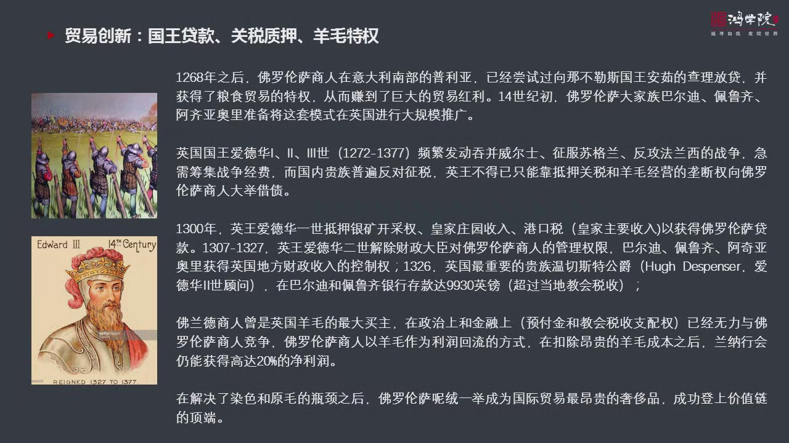

就是通過富羅倫紮的商人向國王貸款然後國王作為一種制壓要抵押它的關稅同時還要放棄陽毛的一些特權給富羅倫紮商人這就是我們看到貿易創新給富羅倫紮贏得了一個巨大的競爭優勢他們獲得了英國陽毛的壟斷權我們上期節目講上期這個課程講到了1268年之後就是在南方的納布勒斯王國安如王朝就是法國的安如家族他們建立的納布勒...

<strong>Cleaned narration</strong>

> 就是通過富羅倫紮的商人向國王貸款然後國王作為一種制壓要抵押它的關稅同時還要放棄陽毛的一些特權給富羅倫紮商人這就是我們看到貿易創新給富羅倫紮贏
> 得了一個巨大的競爭優勢他們獲得了英國陽毛的壟斷權我們上期節目講上期這個課程講到了1268年之後就是在南方的納布勒斯王國安如王朝就是法國的安如
> 家族他們建立的納布勒斯王國當年叫西西里王國那麼富羅倫紮商人在那個時代就已經到了義大利的南部當時在普利亞地區要發展糧食貿易那麼就已經跟納布勒斯
> 王國形成了一個默契就是給安如家族提供貸款同時獲得了安如家族給予的糧食貿易的壟斷權從而獲得了巨大的貿易的紅利那已經有一個成功的先例和經驗了到1
> 4世紀初就是130年前後吧富羅倫紮的幾大家族像巴爾迪 佩魯奇 阿奇奧里這三大家族當年就是在納布勒斯王國玩過這一首現在他們準備把同樣的模式在英
> 國進行大規模的複製英國當年的情況是什麼呢就是英國的金雀花王朝的三個國王吧愛德華1230 大概從1272年到1377年也就是中國的這個元朝這個
> 時代吧他們在這100年中間頻繁發動戰爭比如說要吞併威爾士要征服蘇格蘭 還要反攻法國大陸他每次戰爭都需要大量的金錢大量的戰爭經費但是英國國內的
> 這些貴族普遍不太支持就是反對征稅因為要打仗必須要征稅但是國內這些貴族都很討厭這個事兒什麼原因呢就是因為你比如說你反攻法國大陸吧就是為了爭取英
> 國的國王他同時又是法國南部 阿基坦公爵他又是阿基坦那個地方的公爵所以你要占有法國南部阿基坦的一個領土就得像法國國王效忠他既是英國國王又是法國
> 國王的培成然後後來這個法國要剝奪他這個阿基坦的領土雙方就到矛盾但是這個事兒跟英國那些貴族們沒有這些關係那是你們家的財產那是你有國王私人的問題
> 為什麼要全民爭稅幫你打私人戰爭呢他矛盾出在這兒所以英國的國王要想英國的貴族同意他爭稅來進行法蘭西戰爭這些貴族們說這算了咱還是被猜過這事兒所以
> 被逼無奈之下他只能走一條結境就是佛羅倫薩商人在英國生意做了很大他們既是教皇的這種11歲的爭收人同時還在英國做大量的其他生意所以佛羅倫薩商人很
> 有錢英國國王就向佛羅倫薩商人去借貸當然佛羅倫薩商人就援用那不樂私王國的這套經驗說行我可以借錢給你要多少都可以給你但是條件是你必須要把揚毛的精
> 權給我還要付加其他的這種權力你這些錢率包括什麼呢比如說愛華醫師抵押了營礦的開財權還有皇家收入還有趕口稅趕口稅當年是英國皇家主要收入就是關稅了
> 然後在愛德華二世的時候就對佛羅倫薩商人以前他要受財政大成的很多管制現在管理權全部放開這樣就使得巴爾迪賠魯奇阿加爾里這三大家族獲得了英國大量地
> 方財政收入的控制權後來我們看到他們又跟英國的全程你像這個文竊斯特工決他是愛德華二世非常重要的顧問搞了很多思想交易在我們從這個歷史上可以看到這
> 個公決在巴爾迪賠魯奇家族的銀行存了9,930英鎊的巨額存款現在我們說9000多英鎊不算啥當年9000多萬這個9000多萬將近1萬英鎊可不得了
> 一棒一英鎊的概念是一棒重的純銀上萬棒銀棒那個不得了這筆錢超過了英國全國的教會11歲的收入所以這是一筆巨款從中我們可以看出佛羅倫薩這些銀行家的
> 打法就是要搞定國王搞定全程同時獲得大量的貿易的特權那麼以前在英國購買羊毛的主要的大買主是佛蘭德商人他們是毛仿之工業最先崛起的地區但是現在佛蘭
> 德商人在跟佛羅倫薩商人競爭中就越來越沒有競爭優勢第一是國王更偏向佛羅倫薩商人這是一個原因政治上的優勢還有經濟上的優勢佛羅倫薩由於建立了全歐洲
> ...

---

### Slide 6

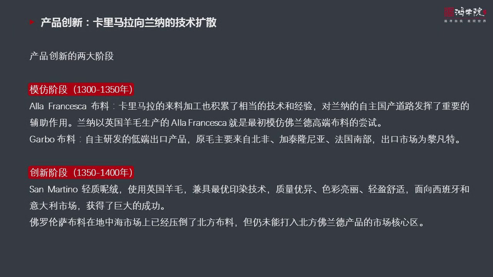

你有了優異的原材料英國羊毛那麼佛羅倫散做了第三個重要創新就是產品創新產品創新值了什麼呢它分成兩個階段第一個階段雖然獲得了很好的羊毛但是咱還不知道高端產品該怎麼生產或者還不知道高端產品的設計中還有哪些需要琢磨的地方就是不是你有了好東西就一定能生產出智量最優秀的東西來它跟設計也好關係跟產品控制也很有關係...

<strong>Cleaned narration</strong>

> 你有了優異的原材料英國羊毛那麼佛羅倫散做了第三個重要創新就是產品創新產品創新值了什麼呢它分成兩個階段第一個階段雖然獲得了很好的羊毛但是咱還不
> 知道高端產品該怎麼生產或者還不知道高端產品的設計中還有哪些需要琢磨的地方就是不是你有了好東西就一定能生產出智量最優秀的東西來它跟設計也好關係
> 跟產品控制也很有關係對這個和這個技術積累也有很大的關係所以一開始頭五十年一三零零年到一三五零年佛羅倫散還是處在一種磨索或者叫磨仿階段所以他們
> 搞的那個布料就是用英國羊毛生產的是磨仿英國的高端是磨仿Flander用英國羊毛生產的這種高端布料叫Alan FranciscoAlan Fr
> ancisco這種布料它是一種磨仿品它並不是真正的自主設計出來的所以用了五十年時間是做磨索做常識後來有了這種設計經驗有了生產技術的積累他們開
> 始生產一種低端的自主創新的布料就是Gabbo布料這種Gabbo布料它主要是用那些低端的羊毛像北非的還有西班牙加太龍尼亞還有法國南部這些羊毛品
> 質沒有這麼高所以它生產出來但是用了自己這兩次的技術生產出來這種低端布料主要是面向這個禮番特市場出口因為它是染色比較好所以在禮番特地區是有銷路
> 的這是頭五十年是屬於磨仿階段第二個五十年1350到1400年才真正進入了創新階段就是高端產品創新這是什麼Tino什麼Tino這種這種羊毛是一
> 種清智羊毛它比Flander的布料清同時它還具有很大的優勢它的印染技術超過了Flander特別是紫色染料紫色系這個染料還有它的品質它的質量生
> 產質量已經經過五十年了磨索特別是卡雷馬拉搞萊料加工業積累了很多技術這種技術像藍納這個生產製造行業進行平移所以藍納這幫人也掌握了這個高品質的生
> 產技術管理這種能力所以你就能生產出這種色彩亮麗但是穿著就非常輕盈舒適同時品質和質量也非常優異這種布所以這種布在市場上特別是在西班牙和義大利市
> 場上獲得了巨大的成功很賺錢利潤率很高能夠高達20%那麼在這種情況之下我們看到Flander的在Flander的核心市場就是歐洲北歐這個市場佛
> 羅倫洒來布要打進去仍然是非常吃力的因為那個地方Flander的布料已經盤據很多年了就是在最核心的北歐市場中佛羅倫洒來布還沒能真正殺到那個市場
> 去他現在佔領了只是一些西班牙義大利這是屬於南歐南歐的市場還有地中海了沿岸的其他國家的市場但是北歐市場那是競爭最激烈的市場展示還沒有打進去不過
> 不管怎麼樣這個藍娜的生產的這種高端布料特別是這麼Tino這種親自的泥龍已經達到了這個利潤率非常高的程度已經達到價值的頂端可以說是倡銷世界市場那麼我們再看下野除了這三個創新之外第四個還有一個重大創新

---

### Slide 7

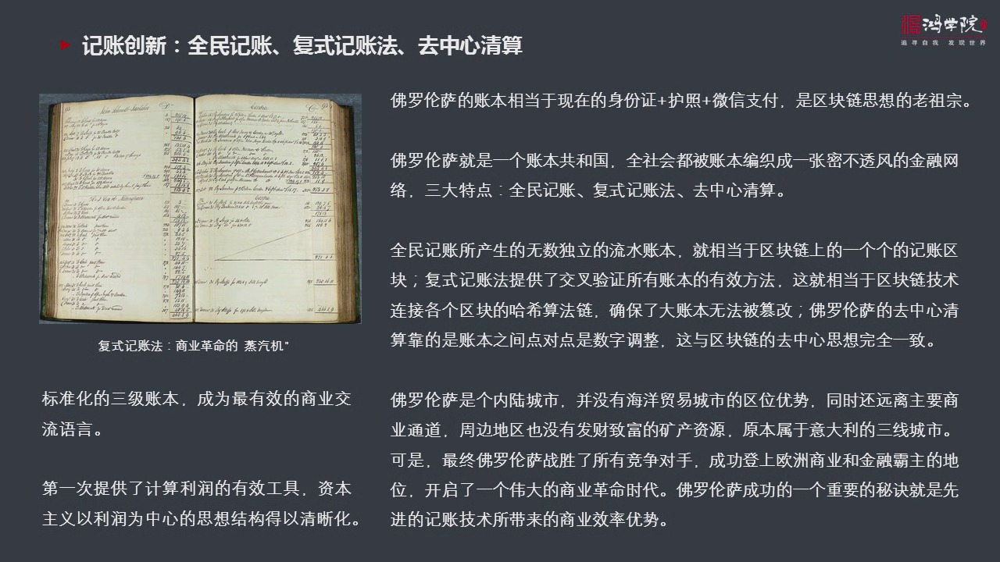

就是濟漲創新濟漲創新我蓋過起來有三點全民濟漲富士濟漲法和去中心清算這個說到濟漲創新我不知道我們同一種有多人學過快擊學過快擊人應該明白這個濟漲這個事兒太重要了他直接關於的做生意的商業效率如果我們比較一下佛蘭德他的這個濟漲跟北歐的這些國家濟漲你會發現這個佛羅倫薩和北歐這些國家進行比較你會發現佛羅倫薩的濟...

<strong>Cleaned narration</strong>

> 就是濟漲創新濟漲創新我蓋過起來有三點全民濟漲富士濟漲法和去中心清算這個說到濟漲創新我不知道我們同一種有多人學過快擊學過快擊人應該明白這個濟漲
> 這個事兒太重要了他直接關於的做生意的商業效率如果我們比較一下佛蘭德他的這個濟漲跟北歐的這些國家濟漲你會發現這個佛羅倫薩和北歐這些國家進行比較
> 你會發現佛羅倫薩的濟漲水平是非常高的首先它是一個全民濟漲這個全民濟漲什麼概念呢就是社會中的不僅是公司要濟漲基本上每家美貨的貨主都要這個濟漲這
> 個漲本 私人漲本在法庭上是具有著完全的法律效力它相當於我們現在的身份證加護照再加上微信支付這話怎麼來理解呢身份證就是它可以代表一個人一生的經
> 歷你跟什麼人做過貿易做過什麼生意之類的一筆筆全部接下來大家就知道你這個人是歷史清白了一個人上法院打官司法官頭一句話就是你們有爭議嗎拿你們兩家
> 的漲本上來法官是先看漲然後在短暗查看漲本首先是業民政神你是誰為什麼說它相當於護照呢如果你在弗洛倫散了海外社區你要想發展生意那麼你必須要有漲本
> 有漲本人家才會知道你是誰你跟哪些家族發生過這種商業上的聯繫才會對應有一種信任感所以漲本這個東西非常重要同時為什麼說它是微信支付呢或者支付寶呢
> 就是一個漲本可以直接當錢用我在這裡給大家舉一個弗洛倫散他們經典的一個支付的案例就是講一個房主他到期要收房租了他就說有一個房客他手下有個房客他
> 說你今天該向我叫房租了這個房客什麼人呢他是一個私儲償的工人也不是高級的文化也不是啊知識分子就是個普通公司房子是個私儲償的房子工人讓他交房租這
> 個人就說行然後他就寫了一個書面通知通知他的朋友另外一個人這個人是誰呢是個毛房廠的房殺工他說你來幫我叫這個錢為什麼呢因為兩個人都有漲本兩個人一
> 對漲他知道那個朋友欠他比如說我是個金弗洛倫他說你來過付然後這個房殺工呢也也不是自己馬上拿著50個金幣去付錢他寫另外一個書面通知通知他的故主就
> 是那個毛房廠讓毛房廠來付這個房租為什麼因為這個房殺工每個月在毛房廠他會留一半的這個工資在漲上在毛房廠漲上同時他手上拿一半的現金所以毛房廠在毛
> 房廠漲戶上有他的娛樂他讓毛房廠來付最後你就發現毛房廠也不付這個錢毛房廠呢就是他用了一種什麼辦法呢他就給這個房主開了一個新的賬戶在毛房廠賬戶中
> 開了一個新的娛樂賬戶然後書面通知這個房主說祝賀你你現在在我們這個毛房廠有了一個比如說50金負佬零的這麼一個額度你可以隨時動用結果最後你會發現
> 這個房主本人並不著急毛房到毛房廠去取限金距去拿錢金幣去而是拿出他自己的賬本天上一筆就是增加一個賬戶增加毛房廠賬戶上面記錄我有50個金負佬零的
> 信用額度同時在房客這邊剪掉50金負佬零這個賬就做平了你會發現在整個四方交易過程中沒有一個金幣的現金過手全部都是通過轉賬主要還有一個重要特點這
> 個轉賬中間沒有涉及到銀行這不是說大家在銀行從那個賬戶賬戶上有銀額大家可以轉來轉去而是每個人就相當於一家銀行每個個人理論上和法律上被承認為你就
> 是一家銀行你自己的賬本跟銀行賬本公立和法律效率是完全一樣的所以銀行能做事情你本人就可以做所以這個四方支付它是通過個人賬本來實現來實現清算的每
> 個人都在自己賬戶上家藝受檢一個數然後逐級傳遞最後完成這個交易所以它這套制度在我看來是非常非常先進的制度尤其是全民都這麼做這得需要多大的這種社
> 會的人力物力的培訓它是練了幾百年終於培養出這樣的一個大家的一個共同的標準性的做法大家說那中間就是如果有人賴賬或者它根本就是串改賬目或者它沒比
> ...

---

### Slide 8

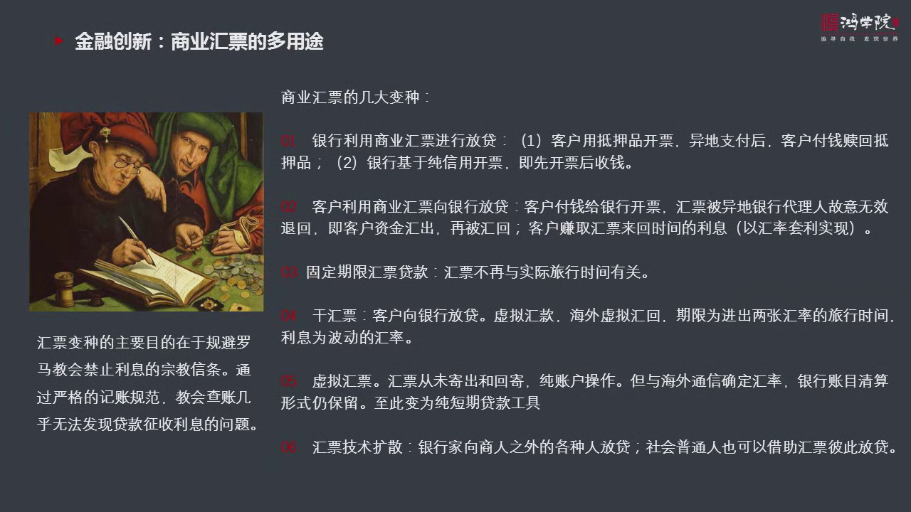

計像只是用於商業的提供商業革命它是個重要的類似於爭氣機這樣作用但它的金融上還有一個重大創新就是商業匯票商業匯票我們以前說過它是生電器團搞出來但是是佛羅倫散人把它用活的大公開推廣是佛羅倫散人用起來的一開始當然就是用於商業的完成支付這是標準用法就是我付給緊張匯票三月六月多少時間之後到期然後你到指定領行去...

<strong>Cleaned narration</strong>

> 計像只是用於商業的提供商業革命它是個重要的類似於爭氣機這樣作用但它的金融上還有一個重大創新就是商業匯票商業匯票我們以前說過它是生電器團搞出來
> 但是是佛羅倫散人把它用活的大公開推廣是佛羅倫散人用起來的一開始當然就是用於商業的完成支付這是標準用法就是我付給緊張匯票三月六月多少時間之後到
> 期然後你到指定領行去前卷這是標準用法但後來它又發展出六個不同的變種它變成了一種放待的工具就是變成了一種貸款的一種工具你比如說銀行利用商業匯票
> 可以經營放待比如說客戶要算銀行借錢正常的做法是客戶先拍五十個金幣往哪裡放你賣給我一張匯票也就是拿錢去買票然後用票來支付這是一種標準做法但是你
> 會發現銀行這個時候可以要求你不拿現金你可以拿些金銀細軟來做底然後我就給開匯票然後這個匯票在一地實現支付之後客戶再拿錢來熟回底其實也就是客戶用
> 它的金銀細軟做底向銀行帶了五十個金幣的款週期就是這個匯票付到遠方被對方支付就是這個週期比如說兩月這就相當於兩月的貸款那麼你要交銀行利息有一宗
> 世紀教會的現實你又不能直接在合同中說我要熟利息那是違法的違反教會法的怎麼辦呢我就把利息它這個收益藏在匯率中間因為比如說我從佛羅倫薩會比錢會到
> 英國但是英國的匯率跟我這不一樣我在合同中有意思的使得匯率你在英國上在英國那邊對話的時候你能夠賺出一些利人相當於你的利息但是又不肯定因為匯率在
> 波動所以教會如果來查賬教會經常來查賬應該這麼說你看我這是一個有風險的有投資風險的利益我不是在這做收利息我沒有違反教會的反高利頓法教會人一看它
> 搞不清楚因為你的所有的正式機上方法跟真實發生貿易的這個方法是一模一樣所以沒有辦法查出到底誰是在放待誰在做貿易那麼這是一種辦法還有一種辦法呢是
> 銀行就直接基於你的信用我直接就給你開票先開票後收錢就是你用完這個匯票之後幾個月之後然後你在向我來還錢那麼反過來第二種辦法客戶也可以利用商業匯
> 票向銀行放待就是銀行缺錢了我這兒手中也有限錢我也可以這個銀行這個時候就是銀這個客戶付錢給銀行來開票這個匯票記得海外然後被海外銀行帶人給退回就
> 是說這張是匯票沒開對這個就是反正就是無效給你退回來了退回來之後銀行要把這個錢還給客戶這是法律規定好那麼也就是銀這個銀行在這個過程中借用了客戶
> 的資金50金幣用了多長時間匯票寄出去再被無效退回整個匯票走的這個旅行時間就是銀行占用資金的時間那麼反過來通過匯率我們可以讓客戶得到相應的利息
> 第三種辦法就是固定期限匯票貸款就是匯票不再跟旅行時間先關了你2月好3月好我就固定成4個月不管是銀行放待給客戶還是客戶放待給銀行都一樣第4種玩
> 法就是甘匯票就是所謂的抓壁這種是什麼東西呢就是也是客戶向銀行放待那麼它實際上是個虛擬匯款海外在虛擬匯匯就是我這個匯票出去了海外是這個並沒有真
> 實給我匯款整個這個過程都是假的期限就是兩南匯票進出的時間利息也是這個匯率那麼甘匯票跟其他的這個前面我說了這集中有什麼差別呢記仗是一模一樣的從
> 仗目上因為查仗這個問題是非常嚴的而且到了差幾十年仗目是絕對不能做假的但是仗目上我並沒有真的把匯票匯出去這是一個重要的差別所以叫甘匯票第5個玩
> 法就是虛擬匯票就是連匯票就是從未記除也沒有回記它是純記仗但是與海外通訊去與海外這種通訊比如說我詢問你那邊的匯率這些東西這些信件必須要留作原始
> 的評證一定要留存好所以甘匯票虛擬匯票它是兩種不同的這種玩法但是本質上是一樣的就是全部都是在仗目上做手腳讓查仗人根本搞不清楚他到底是真實發生的
> ...

---

### Slide 9

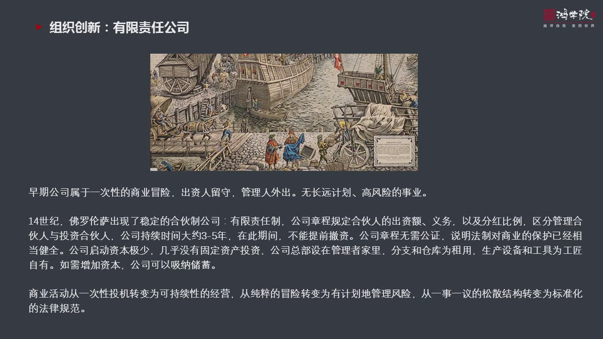

也就是佛洛倫薩在13世紀之前他的公司主要都是一些他就實際上不叫一種正式公司了他叫一種商業冒險比如說倆哥們說行我在那邊我有貨源我跑一趟你在這邊留守你給我出錢我去做這個生意做完一把之後我早點就分了這叫一次性商業冒險出資人留守管理人外出倆人並沒有什麼長遠規劃也不是說我們第二筆誠意要不要做第三筆咱們別想這個...

<strong>Cleaned narration</strong>

> 也就是佛洛倫薩在13世紀之前他的公司主要都是一些他就實際上不叫一種正式公司了他叫一種商業冒險比如說倆哥們說行我在那邊我有貨源我跑一趟你在這邊
> 留守你給我出錢我去做這個生意做完一把之後我早點就分了這叫一次性商業冒險出資人留守管理人外出倆人並沒有什麼長遠規劃也不是說我們第二筆誠意要不要
> 做第三筆咱們別想這個就像一垂子買賣然後這是個高風險的一個事情萬一規著怎麼辦那就規劣就規了 咱認了但在14世紀就是13紀紀念說佛洛倫薩出現了穩
> 定的合夥制有限責任制就是公司的章程開始明確規定合夥人他的出資額他的義務還有紛紅的比例然後誰是管理人誰是投資人公司持續時間就不再是一垂子買賣持
> 續3到5年那麼在此期間大家彼此約好我們不能提前的驅款因為咱們這個生意要繼續下去公司章程已經不需要公正了以前任何這個東西都需要公正後來取消公正
> 為什麼法律已經完全可以覆蓋通用了這種商業上的所有的行為不需要在額外搞個公正這說明藍娜在控制了政府之後制定了大量保護商業的法律就是1350年之
> 後藍娜掌權之後立了很多新的規矩保護商業的這種貿易的利益那麼他其中資金也很少幾乎不需要因為固定資產也不需要生產設備有些是這個屬於這個工人的工匠
> 的他自己不需要天制生產設備或者主要的一些貿易這些不需要天制總部設的一般管理人的家裡然後倉庫就是作用的所以他們並沒有什麼太多的固定資本開銷需要
> 的僅僅是流動現金如果說捷徑做大了還想進一步的融資怎麼辦那就可以新納儲蓄了他就通過各種各樣的方式比如說匯票的方式去融資或者新納方式去融資或者商
> 業現在的定期存款他通過儲蓄來迷補資本金的不足所以這樣一來就把這種商業從一種一次性的投機活動變成一種可持續性的經營活動從一種純粹的冒險一乾子冒
> 險變成了一種有計劃的管理風險從一是一日的鬆散結構變成了標準化的法律規範這就從冒險變成了一個事業這是一個重大的飛躍這需要組織創新佛羅倫薩也是西
> 方最早進化處這種有限責任制公司的這樣一個地區和國家所以佛羅倫薩為什麼他最後商業能成功金融能成功他是有很多底層的這是屬於細胞級的這種配套還有金
> 融上了一些工具是配套還有他的記仗了配套他需要大量的配套還有法律的配套等等他才能夠形成一個有活力的組織非常嚴密的有競爭力的這麼一個商業網絡和金融網絡我們再看下野除了這個創新他還有一個重大的

---

### Slide 10

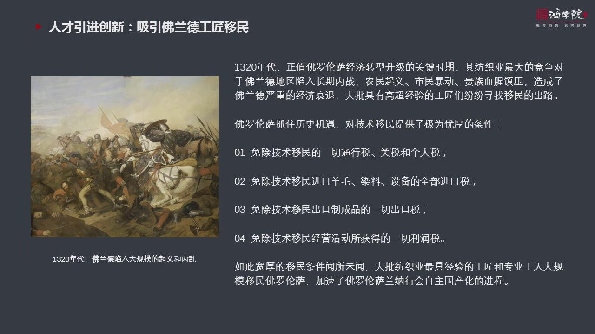

一個事情就是人才引進就是大力吸引像佛蘭德公將移民這個事兒對佛羅倫薩製造業的提升起到了重大的作用他最主要的一個應該說是天使就是感到了佛蘭德在1320前1320這個年代出現了重大的內亂其意內亂然後這種鎮壓死了很多人導致佛羅倫薩當地經濟嚴重衰退後來又打起這個陰發百年戰爭佛羅倫這個佛蘭德是受到重創的地區因為...

<strong>Cleaned narration</strong>

> 一個事情就是人才引進就是大力吸引像佛蘭德公將移民這個事兒對佛羅倫薩製造業的提升起到了重大的作用他最主要的一個應該說是天使就是感到了佛蘭德在1
> 320前1320這個年代出現了重大的內亂其意內亂然後這種鎮壓死了很多人導致佛羅倫薩當地經濟嚴重衰退後來又打起這個陰發百年戰爭佛羅倫這個佛蘭德
> 是受到重創的地區因為英國對佛蘭德地區禁止出口羊毛導致佛羅這個佛蘭德當地的很多工匠活不下去了正式在這個歷史機遇出現的時候佛羅倫薩推出了非常具有
> 信利的技術移民的政策第一免除技術移民的一切通行稅過橋、過門、過卡都不用交稅關稅就是你們各種各樣的關稅通通免個人稅都不要全免第二是免除技術移民
> 進口羊毛染料設備它的全部進口稅如果你要在比如說你是一個佛蘭德的技術移民你要到佛羅倫薩來發展比如說染色發展毛訪中工業行你要買了稅備全部進口專稅
> 是零那麼第三你是出口的產品你生產出來的迷惘或者是半成品出口關稅也是零然後你的經營活動所賺起了一切利潤就是你的最後企業的利潤盡利潤的要交稅率也
> 是零這樣的政策拿到今天來說都是不可思議的好到無以復加這就導致了大量佛蘭德工匠在當地他們那個地方已經活不下去了大距的移民到了佛羅倫薩這些人帶來
> 了什麼帶來了佛蘭德搞了兩三百年的最優異的這種管理技術技術上的絕敲還有各種各樣的這種培訓機制師傅帶土地這種學習機制全部引進到佛羅倫薩雖然佛羅倫
> 薩從表面上並沒有從他們身上賺到稅和利但是從他們帶來的巨大的人力資本中間那卻獲利無窮因為你在這發展你培養了土地或者你跟其他人交流會使得我整個工
> 業的整體的效率和技能得一大幅度的提升這就是這就是屬於人力資本的這種巨大積累佛羅倫薩要的是這個也正是由於有了這批工匠加入了佛羅倫薩所以他最後搞
> 高端設計搞高端產品的時候他才能夠如意得水要不然高端設計製造怎麼弄那就沒有辦法去跟像佛蘭德這種地區的這種產品競爭所以這個移民政策也發過了重大作
> 用好我們看下野如果我們把十四十幾佛蘭德的經濟成就歸納起來你會發現

---

### Slide 11

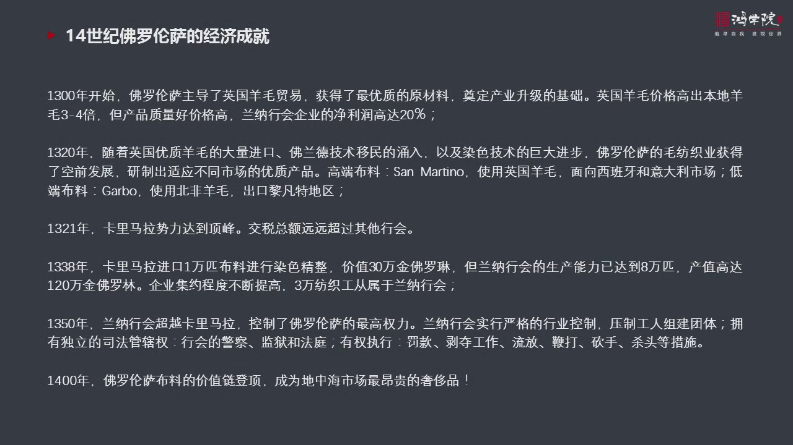

從130年開始佛羅倫薩主導了英國陽王貿易獲得了最優質的原材料這是產業升級的基礎130年開始英國陽毛大量出口之後佛蘭德的移民又大量融入然後在染色就上取得了突破所以佛蘭德的佛羅倫薩的房子業獲得了一個飛躍式的發展創造出了高端產品、低端產品然後覆蓋了不同不同國家和地區的市場然後你會看到130年的時候卡利馬拉...

<strong>Cleaned narration</strong>

> 從130年開始佛羅倫薩主導了英國陽王貿易獲得了最優質的原材料這是產業升級的基礎130年開始英國陽毛大量出口之後佛蘭德的移民又大量融入然後在染
> 色就上取得了突破所以佛蘭德的佛羅倫薩的房子業獲得了一個飛躍式的發展創造出了高端產品、
> 低端產品然後覆蓋了不同不同國家和地區的市場然後你會看到130年的時候卡利馬拉就是搞萊料加工內行達到了勢力的頂峰交稅總額遠遠超過其他行為這個時
> 候加工貿易仍然非常強大但是這個時候我們看到其實藍納行為正在迅速超越到1338年這個局面就反過來了卡利馬拉每年要進口比如說一萬匹這種布料進行染
> 色和精整價值30萬金佛羅林但是藍納行為的生產能力已經達到8萬匹了產值高達120萬金佛羅林所以你會看到此消彼長藍納行為到1338年的時候這個實
> 力已經相當強大了而且它企業集中度集成度越來越高、集約度3萬多人防止工人是屬於藍納行為的到1350年藍納行為就完全超越了卡利馬拉了就是國產自主
> 的這幫人完全超越萊料加工這些人所以最後你會看到行為和政府中間誰說了算藍納行為還是說了算成了政策最高的致敬者擁有的佛羅倫薩工和國的最高權力所以
> 他們推薦了非常嚴格的這種行業管制比如說工人不允許組織行會然後他們有獨立的司法管轄權有行為的警察、
> 行為的監獄、行為的法庭誰要違法它是有權執法的法款、剝奪工作、流放、編打、砍手、殺頭什麼樣的這個行法它都有所以它是一套行會的制度之上的共和國那
> 麼也正是由於這些發展到1400年之後我們看到佛羅倫薩的布料它的價值鏈在整個市場中間它已經居於價值鏈的最頂端了它變成了真正的奢侈品壓倒了弗蘭德
> 的這種布料這就是我們從經濟角度來看它通過七個創新所獲得的一個巨大的價值鏈的提升好我們再看下一頁當然這個發展佛羅倫的這個發展

---

### Slide 12

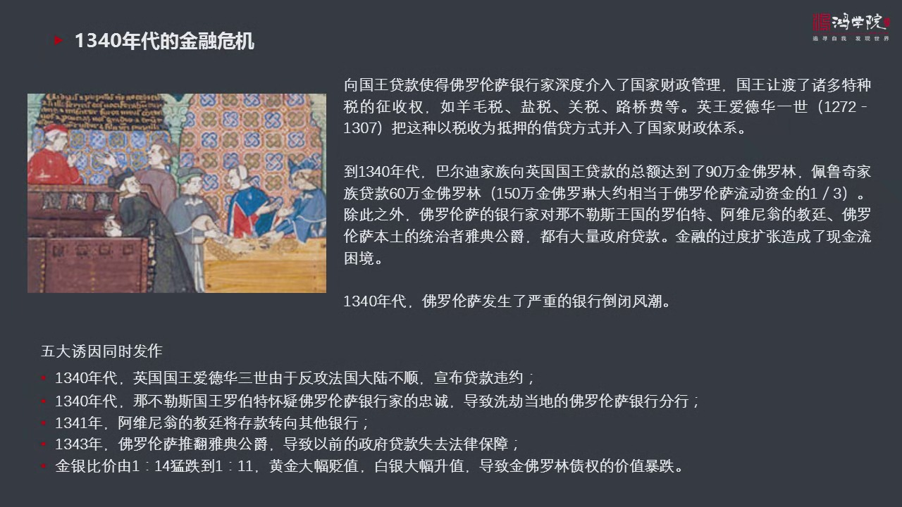

並不是一番封順的這中間還遭遇過一次金融危機就是1340年代的一次金融危機發生在1342年到1346年之間吧這一次金融危機的打擊其實不鴉於2008年金融海教因為當時佛羅倫薩也倒掉了大量銀行什麼原因呢?主要是向國王放待佛羅倫薩從納布勒斯國王就是從當年的納布勒斯一直做到英國國王生意還做了教皇的生意同時也做...

<strong>Cleaned narration</strong>

> 並不是一番封順的這中間還遭遇過一次金融危機就是1340年代的一次金融危機發生在1342年到1346年之間吧這一次金融危機的打擊其實不鴉於20
> 08年金融海教因為當時佛羅倫薩也倒掉了大量銀行什麼原因呢?主要是向國王放待佛羅倫薩從納布勒斯國王就是從當年的納布勒斯一直做到英國國王生意還做
> 了教皇的生意同時也做了佛羅倫薩自己的給政府貸款這個生意他都做所以像在英國這套體系以關稅為底去借貸後來英國國債產生了重要的思路實際上是源於愛德
> 華醫師實際上是源於愛德華醫師和佛羅倫薩的交易建立了現代的國債制度那時候後化了那麼他這個時候為什麼早1340年會出事呢?主要是他的信貸規模擴張
> 太快就是借錢借得太多了這樣的話就會導致現金流緊張你比如說八二的一家族像英國國王貸款的總額達到了九十萬金弗羅倫佩魯奇家族達到了六十萬家內旗就是
> 一百五十萬金弗羅倫其實還有阿俠奧里這個數沒差著那應該也不小這個數所以這兩家家內旗他就帶出了給英國國王一家就帶出了一百五十萬金弗羅倫這比數可不
> 是個小數他相當於佛羅倫薩全部流動資金的三分之一左右除此之外佛羅倫薩里行家就是這三大家族還在納布勒斯廣國給羅不特國王帶了很多款還給阿維尼翁的教
> 皇帶了很多款教皇當時住在有七十年的時間住在法國拉維尼翁那麼那個時代人們稱之為是教皇的八比倫之求了所以他不是一直住在羅馬的同時佛羅倫薩本土的統
> 治者這個雅典公爵這是一個外來統治者也像他帶了很多款還有大量這種貸款政府行為把十多這些三大家族資金鏈被拉得太長現今流出現的嚴重困境那麼到一三四
> 零年代佛羅倫薩就發生了嚴重的銀行倒閉風潮怎麼回事呢五大因素同時發作你會看到危機不管是2008年危機還是一三四幾年的這個金融危機到底都一樣壞事
> 總是一起出一起出一定會產生一個強烈的共鎮效應比如說在英國愛德華三世他由於當時在跟法國打仗反共法國大陸打了不順一開始打了不順後來打得很好但是一
> 開始有一段時間打得非常不順還不了這個錢了宣佈違約第二件事就是那不都是國王羅伯特開始懷疑佛羅倫薩銀行家的忠誠其實佛羅倫薩銀行家在應該說從一二六
> 八年的一二四一三四零年這好幾十年七八十年中間對納布勒斯王庭是具有相當大的影響力因為他是金主廣我是給你貸款的你也得求著我但是後來發生的比如說進
> 攻盧卡這個鬥爭還有跟邪納這種鬥爭有些情況之下這種政治鬥爭中你會讓像納布勒斯的國王會產生一種懷疑到底你是跟我是一條心還是不是一條心呢這當然是一
> 方面解釋還有一種解釋就是這個羅伯特就不想還錢了欠了這麼多錢所幸有債不還了所以他就當時下了一個命令喜劫佛羅倫薩在納布勒斯的這個瘋狂導致了佛羅倫
> 薩銀行家遭到了重大損失三件事就是一三四一年阿維尼汪的教庭開始把佛羅倫薩銀行家在他們的存在前轉到其他的銀行家手上轉到人家的站不上什麼原因呢教庭
> 也是被佛羅倫薩銀行家牢牢控制的一直到一三四零年之前一直被佛羅倫薩卡得很死要不然佛羅倫薩怎麼能成為教皇林行家去幫教皇收稅呢但是到了阿維尼汪的教
> 庭他實際上那些教皇那些主教基本上大部分紅藝主教全都是法國人他不再是義大利人所以中間有一些有些正常的因素包括法國國王對佛羅倫薩銀行家對整個義大
> 利人行家的一種敵事這都引起了教皇把這個瘋狂轉移第四個重大因素就是一三四三年佛羅倫薩這幫人推翻了雅典公爵導致了以前給政府的借貸這就沒有保障了那
> 怎麼誰來還呢不知道因為政府被推翻了這個公爵走了公爵借的錢公爵現在也還不了了還有最後一點也是不太被人提到的其實在我看來是個非常重要的因素就是在
> ...

---

### Slide 13

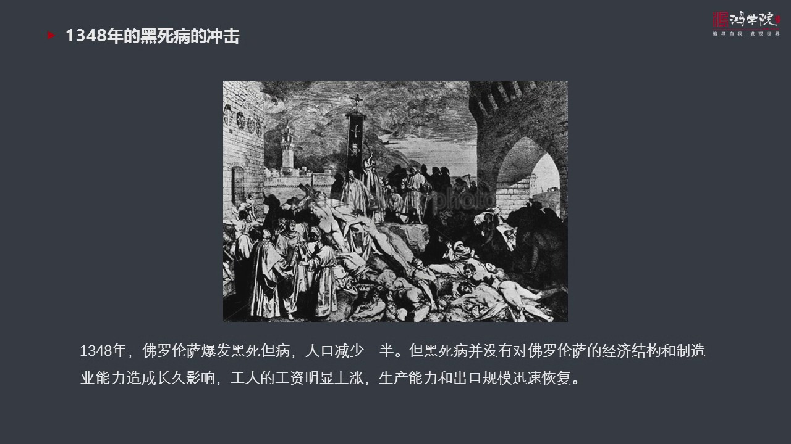

黑死病這個對歐洲整個歐洲殺上了一堆很大佛羅倫薩當時大概死了九萬多人吧這個國家球記錄死了九萬多人人口減少了一大半但是黑死病也好金種危機好並沒有從根本上摧毀佛羅倫薩的經濟結構因為技術他已經掌握了然後他的各種創新手段都已經存在了所以異常大災大難或者異常這種黑死病或者異常經濟危機是掃不到他的就好比我們可以用...

<strong>Cleaned narration</strong>

> 黑死病這個對歐洲整個歐洲殺上了一堆很大佛羅倫薩當時大概死了九萬多人吧這個國家球記錄死了九萬多人人口減少了一大半但是黑死病也好金種危機好並沒有
> 從根本上摧毀佛羅倫薩的經濟結構因為技術他已經掌握了然後他的各種創新手段都已經存在了所以異常大災大難或者異常這種黑死病或者異常經濟危機是掃不到
> 他的就好比我們可以用二戰來形容吧二戰結束的時候美國可能把德國都炸成頻率了把日本也炸成頻率了好他腦子這些東西你炸不掉吧只要這些人知道怎麼做商業
> 做工業他有這樣的強大的記憶合社會組織管理的經驗你即便是把他全部推平全部炸成頻率他也用不了幾年就能夠嫌遇再翻身再次變成一個強大的國家到底是一樣
> 的佛羅倫薩也是他這種軟件的東西是刻著腦子裡的你各種疾病殺死了很多人那又怎麼樣呢就像戰爭中會死人一樣戰爭完之後他同樣會大幅度的這個經濟一定會大
> 幅度的反彈佛羅倫薩就是一一三四八年黑死病完了之後你會看到一四一三四八年這個結束之後一三四九年他的經濟就開始強勁增長就是我們看到了二戰之後很多
> 國家都出現了戰爭之後的經濟大幅速雖然戰爭中死了好幾百萬人好幾千萬人但是戰爭一結束經濟馬上往上衝到底是一樣的再加上死了這麼多人之後每個工人的工
> 資他要剛性上漲嗎因為人少了嗎競爭少了所以他的購買力也提高了然後獲得財富也多了他是對於這些來說是生活上一種巨大的改善所以我們看到沒過兩年佛羅倫
> 薩的生產能一個出口規模就恢復到這個黑死病之前了所以這場危機包括經濟危機對佛羅倫薩的經濟發展並沒有構成持續的影響那麼我們講完了經濟再轉入政治看
> 看佛羅倫薩把它經濟結構搞清楚之後大概起我們知道他在哪個時間段做哪些重大事情再回個頭來印證他的政治上是不是發生了同樣的變化比如說佛羅倫薩在

---

### Slide 14

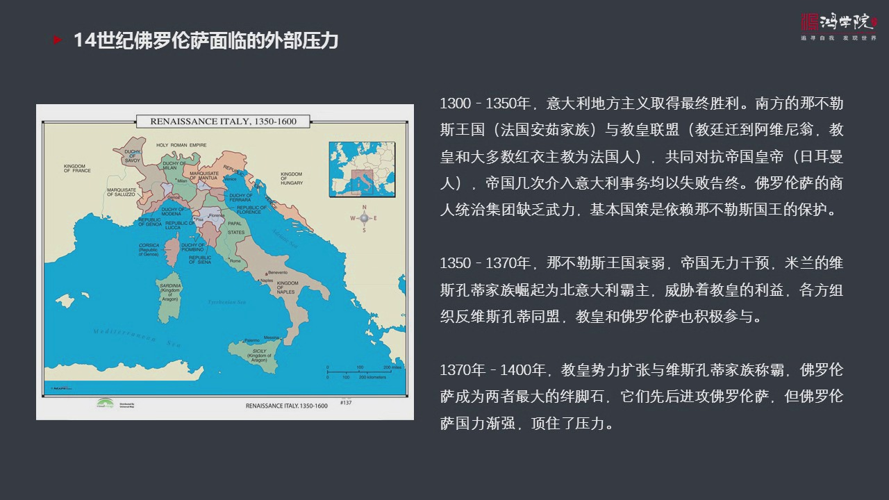

1300年到1350年我們剛剛所說了他正在進行轉型正在進行這個魔法正在進行低端的這個生產製造自主生產自主這個設計的這種生產製造他還沒有真正登上頂峰那麼在這段時間其實在佛羅倫薩正上面他的外部壓力主要面臨不同的壓力這個實驗段實際上是一大力地方主義取得最終勝利的結構南方的納布勒斯王國就是法國安入家族他們現...

<strong>Cleaned narration</strong>

> 1300年到1350年我們剛剛所說了他正在進行轉型正在進行這個魔法正在進行低端的這個生產製造自主生產自主這個設計的這種生產製造他還沒有真正登
> 上頂峰那麼在這段時間其實在佛羅倫薩正上面他的外部壓力主要面臨不同的壓力這個實驗段實際上是一大力地方主義取得最終勝利的結構南方的納布勒斯王國就
> 是法國安入家族他們現在開始跟教皇聯盟為什麼跟教皇聯盟教皇已經簽到威廓寛威就是13005年到1300年之間有將近70年是在法國的那當時還不是法
> 國但是是時候法國國王強大影響的這個地區所以教皇本人和所有的這個紅衣主教基本都是法國人那麼也就是在意大利南方是法國的家族安入家族然後教皇這邊就
> 是法國影響下的紅衣主教和教皇所以他們天然就有一種親人關係這個時候也就是納夫勒斯跟教皇聯盟共同去鬥他們認為是外來入侵者的熱漫人就是帝國深圳羅馬
> 帝國所以矛盾發生了變化以前是深圳羅馬帝國跟教皇之間的矛盾現在變成了教皇和安入家族聯合去鬥深圳羅馬帝國而這個時候這個帝國呢已經他的實力大不容錢
> 其實已經沒有什麼太大的干預意大利的這種能力了意大利已經變得相當富裕而熱漫地取得過那個地方還相當的貧窮所以他也出不及錢也打不起仗雖然帝國有幾次
> 介入了意大利事務但是最後沒有什麼也就是一兩年時間發生一點點影響但是一旦退回得過馬上點影響立刻嚴肺所以雖然出現了三次得一致的這些國王們或者皇帝
> 們殺進來但是基本上沒有起到太大作用那麼佛羅倫薩在這個決選中他做出這個重大選擇是什麼呢他一定要被靠納布勒斯王國來保護因為我們說到他的政治體系的
> 領導者是商人集團尤其是大商人集團就是藍娜航會那些人但這些商人吧他天然就有一個弱點這幫人正錢可以但打仗不行缺少那種武力那種那種浩鬥的精神蒸幅的
> 慾望他們這方面不行他們對外的戰爭一定要靠貴族靠土地貴族就是很多土地貴族其實就是日曼人的後意這些人打仗是比較厲害的而商人呢他們鬥爭能力比較弱所
> 以他的基本國策是一旦外國人打進來特別是神聖羅馬帝國皇帝帶了大軍日曼人打過來之後怎麼辦南京要找一靠啊一靠誰啊納布勒斯王國納布勒斯的羅布特國王那
> 是我們的親兄弟啊納布勒斯當時經歷了什麼的安如的茶里茶里二是到羅布特羅布特一直生活到他一直活到一三四三年所以在這段時間裡面佛羅倫薩的銀行家給了
> 他們很多的貸款也就是對這個羅布特王庭具著巨大的影響力那麼反過來羅布特王這個王朝呢也願意保護自己的這個出錢人了金主嘛如果不保護他誰來給我貸款呢
> 所以他們形成了一個非常天然的聯盟關係一旦佛羅倫薩碰到問題他就會投靠納布勒斯王國這是一三五零年之前的情況接下來一三五零的一三五零的一三七零年這
> 二十年中間情況發生了變化納布勒斯王國衰退了他不行了主要原因就是這個主要原因還是他跟西西里之爭吧西西里當年也是納布勒斯王國的一部分或者反過來說
> 吧他當年就叫西西里王國這個後來在一二八二年出現了一個重大的一個辯故就是阿拉共人就是西班牙拉共王朝打過來推翻了就是搶了西西里從安如手上搶了西西
> 里這個島雙方從此就爆發了戰爭這場戰爭打了幾十年這場戰爭打得過程中這個安如法國安如家族就不得不要依靠當地的就依大利南部這些土豪列身這些貴族你要
> 依靠別人對方就會不斷向你提條件比如說今天你把這個王承給我吧明天把那個國王之屬的城市也給我吧或者你對我地方事務越幹事越少否則我就不幫你打仗時間
> 長了就使得南部的義大利變成了一個王權非常非常衰弱的地方就是因為跟西西里長期的作戰導致了王權衰弱地方土豪的勢力極大我們說到義大利為什麼南方一直
> ...

---

### Slide 15

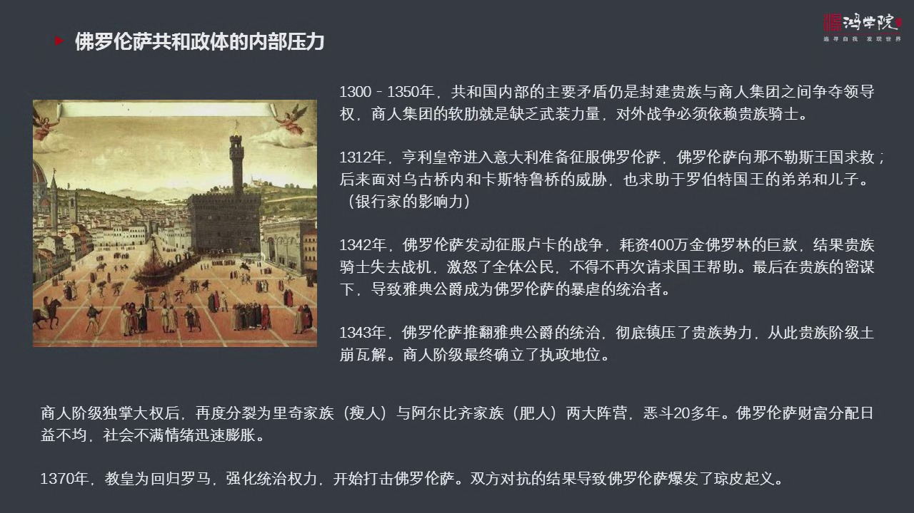

就是130年到130年共和國內部的主要矛盾是什麼呢還是封建貴族和商人之間爭奪領導權雖然我們說1293年佛羅倫薩已經搞出了憲法限制貴族甚至要打壓貴族但是貴族的武裝沒有辦法你只要對外戰爭貴族得出人出槍啊他得出去打仗啊你這個商人打不了仗所以離戰有樓外敵數親你像伊斯蘭一二年恆立皇帝打進來了一會兒什麼路易皇帝...

<strong>Cleaned narration</strong>

> 就是130年到130年共和國內部的主要矛盾是什麼呢還是封建貴族和商人之間爭奪領導權雖然我們說1293年佛羅倫薩已經搞出了憲法限制貴族甚至要打
> 壓貴族但是貴族的武裝沒有辦法你只要對外戰爭貴族得出人出槍啊他得出去打仗啊你這個商人打不了仗所以離戰有樓外敵數親你像伊斯蘭一二年恆立皇帝打進來
> 了一會兒什麼路易皇帝打進來一會兒約浩皇帝打進來他打進了好幾波人都是熱慢這個皇帝打進來怎麼辦那你就得靠這種貴族的歧視出去作戰好你既然讓人家去作
> 戰他就會有很大的權力特別是在戰爭中這樣的話雙方這種較量就很微妙所以我們看到這個佛羅倫薩你看著五十年歷史你看這個一三零年一三五零年這個歷史哇這
> 個臉花療亂大量的事情所以體驗中間的規律是非常非常吃力的因為寫書的人像馬吉亞威力這些佛羅倫薩歷史他不是按照去解釋為什麼他只是告訴你這時候發生了
> 一件這個事那你要去體驗的話就需要高度的抓去線索的能力像一三一二年恆理皇帝打進一大利要征服佛羅倫薩佛羅倫薩就像羅不特國王去求救當然了這次求救呢
> 這個國王派的軍隊來派他的手下來幫助他們打贏了其實恆理皇帝也在一大利沒帶多久他也就死了帶了不到一年多一三一三年這二年就死掉了後來這個周邊恆理皇
> 帝還留下了大量的一些周邊的一些力量像烏骨橋內當時也是佔領了比賽和魯卡的一個地方地方上的一個土豪其實也是當時整個吉布林派的一個手領也在進攻佛羅
> 倫薩在他之後又有一個更強悍的卡斯特魯橋也是來自於比賽和魯卡的這麼一個強人每次都打到佛羅倫薩乘下結果你會發現像卡斯特魯橋也是在乘下突然生病回去
> 就死了那也就是差一點打下來他要完蛋了每次出現這種重大情況的時候你會發現這個佛羅倫薩這些商人統治階級都要求助於羅布特國王先求助於他的弟弟又求助
> 於他的兒子主要還是他們這個銀行家有影響力嘛每次來但是人家也不白來俄特比如說這個打卡斯特魯橋和這個物橋內這一仗其實也沒打什麼仗人家一把就漏了四
> 個萬四個萬金佛羅倫的這個好處走所以佛羅倫薩也是花錢買和平了那麼1342年這個佛羅倫薩發動征服魯卡戰爭這個錢就是花老了花了400萬金佛羅倫這是
> 一筆據款天文數字結果貴族歧視們措施良機先是畏懼不肯戰後來就是這個有了可戰的條件結果又不願意去打喪吃了很多很多機會主要原因還是他們有私心嘛有私
> 心要想要達到自己的一些目的當然這種打法花了這麼多錢就激怒了全體公民因為這要爭稅家稅老百姓都壓著受不了了結果讓你們這幫貴族打成這樣好激怒了全體
> 公民大家就再次要求羅不特國王出手來幫忙結果呢羅不特就派了這個他手下的雅點公爵來治理來代表他治理佛羅倫薩然後這些貴族們就是遊說雅點公爵說我們乾
> 脆乾脆我們推進做終身執政嘛或者就做這個佛羅倫薩軍主吧終身軍主吧然後是不是你能給我們先好處啊但是這個雅點公爵呢他實際上也是個法國人他也是他就是
> 安如戲的嘛他是法國人然後他到了佛羅倫薩當王之後就當時商人先生不敢反抗因為人家手上兵權嘛然後又是安如家族派來的他們跟安如家族又是偷管關係所以沒
> 法反抗最後只能被迫被迫同意讓他當佛羅倫薩軍主而且是終身的然後呢這個你會看到這個雅點公爵這個人就比較繳華他認為這些佛羅倫薩貴族是靠不住的因為貴
> 族最容易造反他誰也不符所以他就把貴族就先亮一邊了然後他就重點的扶持什麼呢貴族的下層特別是底層的老百姓他就相當於繞過了貴族也繞過了這個商人階級
> 直接向下打通到了老百姓給大量蘋果農民一些好處啊讓你們組這些這個小的行慧啊什麼什麼的政治利益給你們經濟好處然後讓你們能夠聽我的從底下來就是實際
> ...

---

### Slide 16

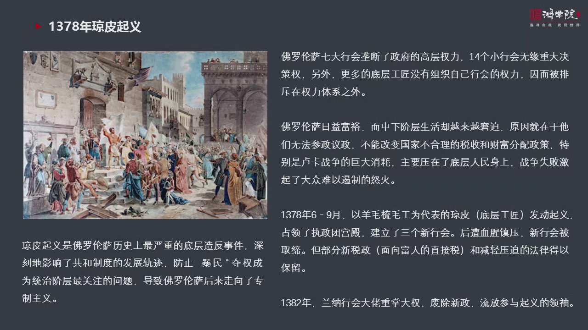

就是貧富分化到了一定程度之後社會就越來越不公正像七大航會吧它21個航會有七個大航會壟斷了政府的所有最高權力會是藍大航會大權都長十四個小航會基本上沒有什麽重大決策權另外還有大量的更多的人這些底層的工匠根本就沒有辦法沒有組織自己航會的權力所以他們沒有辦法投票也沒有辦法享受各種決策權這就會出現一個重大的問...

<strong>Cleaned narration</strong>

> 就是貧富分化到了一定程度之後社會就越來越不公正像七大航會吧它21個航會有七個大航會壟斷了政府的所有最高權力會是藍大航會大權都長十四個小航會基
> 本上沒有什麽重大決策權另外還有大量的更多的人這些底層的工匠根本就沒有辦法沒有組織自己航會的權力所以他們沒有辦法投票也沒有辦法享受各種決策權這
> 就會出現一個重大的問題你像樓卡戰爭這麽巨大的消耗四百萬金幣好誰出錢有錢人這個肥人是不出錢的大銀行家不出錢是普通的中下階層承擔極高的稅率好這種
> 戰爭在失敗你想想底下這些人該是什麽心情那肯定是痛罵這些貴族痛罵這些有錢人這就是導致當時發生重大危機的一個線索所以這場戰爭打下來結果最後就爆發
> 了奇異這就是一三七八年六月到九月期間羊毛坊之工人羊毛淑毛工為代表的窮皮窮皮這個詞來歷好像是法國的一些底層的工價在九國裡喝酒然後就說哥們然後痛
> 引罷讓我們痛引罷他其實他用了這個哥們其實就是窮皮的那個發音象徵著社會底層的這些工價他這個這幫人就是羊毛淑毛工人為代表的他們就發動了奇異然後占
> 領了執政官的工店宣布我們要建立三個新的行為代表我們底層這些人的利益那麼只有成立自己的行為才能代表的自己人說話才能夠改變這個屏幕分化這樣的一個
> 立法和稅法但是後來當然遭到了貴族的這個遭到了這個藍娜行為和其他的有錢的這些匪人的聯合鎮壓殺了很多人可以說這一天九月份的有一天是佛羅倫薩立上最
> 血腥的一天就是鎮壓窮皮殺了很多人然後所有新城的三行會一蓋被取締當然有一些有一些稅政還是保留了比如說在打仗他們不太敢再去這麼壓迫了那就可能匪人
> 要承擔一些直接稅希望財產稅諸如此類的然後壓迫也減輕一些壓迫就是他們底下窮皮最討厭的就是那個他那個法院就是那個如果你犯了一點犯了一點小錯就多你
> 手砍你頭上那個法院想多半都是外國人主要就是佛羅倫薩他願意用外來的人去執行這種非常嚴酷的東西本國人嗎他可能還可能愛著平面愛著社會這個重新關係還
> 不太好這樣痛下殺手外國人就很殘暴外國法官特別殘暴所以像這種外國法官以後就不能再擔任佛羅倫薩的法官諸如此類減輕了一些那麼到了1382年藍大行會
> 大佬重新回歸從新掌握過來廢除掉了一些的新政所有參與其一的這個領袖都被流放有的被幹掉了所以窮脾其一是佛羅倫薩立上最嚴重的一次底層造反事件也是最
> 血型的一次他對整個佛羅倫薩人的精神狀態和心理狀態產生了數百年的這種影響可以說影響了後來整個共和制度的發展的軌跡防暴引毒權這成了統治階層最要命
> 的一個問題所以他就跟所有的這個國家一樣當資產階級發展到一定程度他有錢了這個時候社會卻越來不穩定的底層造反一是卻越來越強了怎麼辦他一定要求集權
> 把權力集中起來有個強大的政府強大的軍隊強大的軍主來保護我們這就是當這種佛羅倫薩共和制發展到窮脾氣這個階段之後再往後發展他就一定會走向一種權力
> 集中的方向也就是走向專制這就是我們看到15世紀以後的美麗西加州崛起他為什麼能崛起窮脾氣就給他鋪墊了所有的這種歷史上的前級條件就是窮脾氣來鋪墊
> 了有錢人大家就非常希望找到一個靠譜的人像法國資源積極大革命最後他一定要選擇拿破輪來保護所有人的利益每個時代發展進行程度都需要一個強人這個強人
> 往往代表是專制的力量這就是我們看到一種歷史的總的規律好我們再看下一頁台灣政治之後我們說說文化和藝術藝術首先說這個繪畫

---

### Slide 17

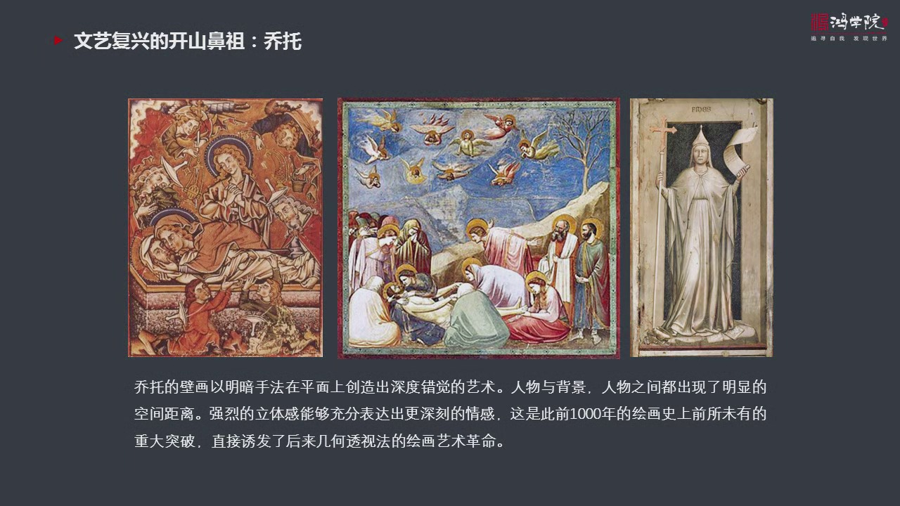

在十四世紀初就是一三零幾年時候出現了弗洛洛洛洛洛洛出現那個偉大的畫家喬托應該說是文藝復興運動的真正的開山筆祖喬托他的最大的貢獻或者他跟這個以前的畫家不一樣我們看這三張圖最左邊這是中世紀的標準圖也是埃道接觸埃道藝術去世大家埃道他的一個場景從最左邊這個中世紀的點心圖中我們可以看出這張圖沒有什麼層次感然後...

<strong>Cleaned narration</strong>

> 在十四世紀初就是一三零幾年時候出現了弗洛洛洛洛洛洛出現那個偉大的畫家喬托應該說是文藝復興運動的真正的開山筆祖喬托他的最大的貢獻或者他跟這個以
> 前的畫家不一樣我們看這三張圖最左邊這是中世紀的標準圖也是埃道接觸埃道藝術去世大家埃道他的一個場景從最左邊這個中世紀的點心圖中我們可以看出這張
> 圖沒有什麼層次感然後佈局人物大小也很不真實有些人太小大家完全就是在一個平面上但是我們來看喬托的最右邊這個畫這是性德的女人像我們看到她其實英文
> 就叫Face就是她的信仰我們看到這個左手拿一個全帳右手拿著福音書的這麼一個前程的信徒一個信中你會看到她的表情她的背後的包括背後的場景具有著鮮
> 明的音按這個音音突顯出來一種立體感你會看到有一種深度錯覺她像一個雕塑而不像一個平面上的畫然後我們在看中間這幅畫中間這幅畫就是愛到耶穌愛到耶穌
> 你會看到她這幅畫面第一次在中世紀以來一千年以來第一次出現了這些人是中間彼此之間是有距離的你會看到前對著前面穿綠衣服的那個老大媽她很悲傷的樣子
> 但是她跟旁邊的人之間是有是有距離感的她是有落有這種層次和謹申的我們會看到由於你出現這種強烈的立體感所以你的藝術表達表達方式就豐富了很多你就可
> 以傳遞一種更深刻的一種這種精神狀態你看我們看到聖約翰站在中間穿紅袍的那個兩手插開然後身體向前輕表達一種驚訝和悲傷像這種東西它就它就這種表藝術
> 表達能力就比以前這種傳統的平面實際上強大很多倍所以呢我們會看到喬托在一千年退化史上前所未有的創造出了在平面上突出一個產生一個立體的這麼一種效
> 果的能力直接又發後來了幾個透視法那就引發了整個藝術革命的一個趨勢就是會化藝術革命就完全走向了這個近代化的這條道路現代化的這條道路所以喬托是這
> 一切的比組你把它的話跟其他任何人化相比它的原創性和革命性都是無意倫比的這就是我們看當你心上化的時候你可能首先得看為什麼這幅畫我們現在看的時候
> 這畫可能沒什麼心奇的但是你要把它就復原恢復到當時那個狀態你在掃描整個全世界的畫的時候你沒有發現有這種畫法的這就是它的原創精神非常關鍵所以我們
> 特別強調學歷史的時候一定要一定要進行復原就是要恢復到當時那個狀態你攝身處地生活的那個狀態你就會知道它的了不起地方在哪了第二頁除了喬托之外其實還有一個畫牌也很牛托斯卡納一個是

---

### Slide 18

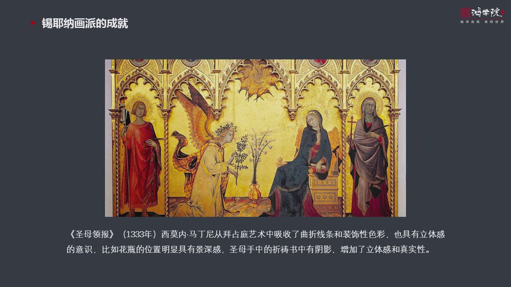

弗洛倫薩畫牌還有一個是企業納畫牌學納的後來被弗洛倫薩所控制所以學納廣義說也是弗洛倫薩共和國的一部分它的後來成就你會看到它的藝術風格比如說這個是西蒙內馬丁尼的一幅畫叫聖蒙領暴講的是聖馬利亞講的是天使加百利然後左邊戴著翅膀天使飛過來向聖馬利亞報告報喜說你懷孕了懷上了耶穌它是畫的這麼一個場景但是我們可以從...

<strong>Cleaned narration</strong>

> 弗洛倫薩畫牌還有一個是企業納畫牌學納的後來被弗洛倫薩所控制所以學納廣義說也是弗洛倫薩共和國的一部分它的後來成就你會看到它的藝術風格比如說這個
> 是西蒙內馬丁尼的一幅畫叫聖蒙領暴講的是聖馬利亞講的是天使加百利然後左邊戴著翅膀天使飛過來向聖馬利亞報告報喜說你懷孕了懷上了耶穌它是畫的這麼一
> 個場景但是我們可以從這個場景中可以看到它的一種它這個繪畫了方式尤其它的色彩和曲線非常的這個拜占庭畫拜占庭很多繪畫都是這種金色的還取得了這種刁
> 式和金色的這種背景這是點心的拜占庭包括站到左右兩邊了這個手持全站的這兩個人還有一個拿著十字架這兩個人也是非常的拜占庭畫但是除了這種拜占庭這是
> 邪納的拿手好戲除了拜占庭的這種文化的繪畫這種藥素之外你還可以看到他們其實已經稀鬧了稀收了這個橋拖了立體主義的或者叫立體感染這樣思想比如說我們
> 看中間的那個花瓶花瓶在以前的繪畫中不是這麼展現的也無法展現出這種景深這個花瓶具有著強烈的景深感我們大概知道它是出在加歪力的比如說左前方出在這
> 個出在這個聖馬利亞的跟聖馬利亞有一段距離而且是前後的距離有景深的距離這個特點和這個細節就說明了這個畫應該是出現在橋拖時代以後的我們知道現在知
> 道它是1333年橋拖那是1300幾年的畫所以我們如果說真正的瞭解這個畫中間的一些細節性的東西你就可以用這些細節當一些指紋或者當一些基因去判斷
> 任何一幅畫它大概的時間點因為在那個時間點我們知道一些像橋拖那個立體主義在它之前是沒人有的所以你看到有一個強烈的立體這種色彩的這種感覺的這肯定
> 是橋拖之後的話好一問那麼當然這幅畫其實這個拜登廳中間還有企業那它也有很高的意識成就比如它的裝飾比如說它為了處理加百力和合剩馬亮之間的空間假如
> 沒有這幅花沒有這個花瓶兩個時間是顯得太空而且上面就是顯得整個一片都是黃色而沒有任何的佈景這是要不得的所以它把花放到這兒從下面解決這個問題上面
> 我們看到上面它窮窮頂上有一大群鵝子向下腐勢鵝子其實作為一種裝飾也很好的完成了一種這個構圖使得空間沒有一種顯得特別空礦的感覺如果沒有這個鵝子你
> 就會覺得上面它空還有加百力的翅膀向上又跟窮窮的這些雕事容為一體這都是將行讀據的這種構思構圖的一種方式所以我們的佛羅倫薩它是真實藝術制度可以很
> 好的體驗一下這些義大利的好成世界藝術之母的這樣的一個地方為什麼它的這種藝術傳承這種傳統這麼深厚我們可以看到它大量的繪畫會獲得很大的啟發我們再看下一頁當然除了這個之外

---

### Slide 19

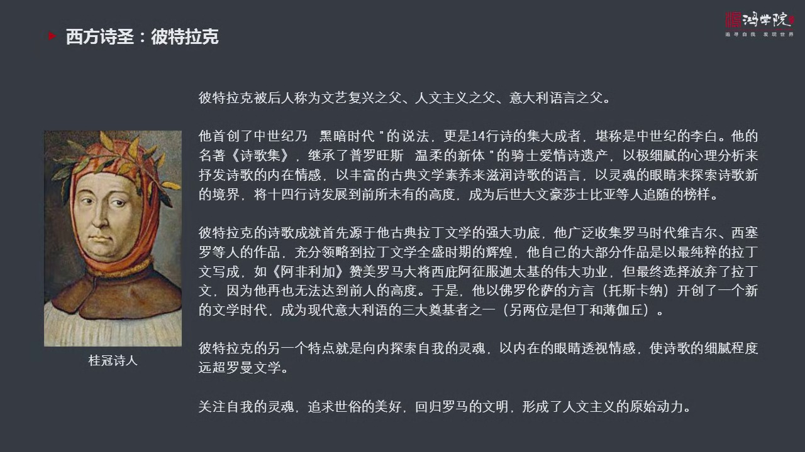

我們在談談西方的文學就是佛羅倫薩的文學佛羅倫薩出現了很多藝術家畫家就不用說了還有很多重要的師人和文學家像這個比特拉克比特拉克應該說是被後人稱之為是文藝復興之父人文主義之父和義大利與原之父三個之父都是他比特拉克在立上他最著名的他很多發明了很多東西比如說黑暗時代搭開一集中世紀是黑暗時代這是他的發明手創還...

<strong>Cleaned narration</strong>

> 我們在談談西方的文學就是佛羅倫薩的文學佛羅倫薩出現了很多藝術家畫家就不用說了還有很多重要的師人和文學家像這個比特拉克比特拉克應該說是被後人稱
> 之為是文藝復興之父人文主義之父和義大利與原之父三個之父都是他比特拉克在立上他最著名的他很多發明了很多東西比如說黑暗時代搭開一集中世紀是黑暗時
> 代這是他的發明手創還有大家都非常熟的什麼十四行師給牢拉的師之類的都是比特拉克的他的作品他是一個十四行師當然早就了但是比特拉克是一個極大成者我
> 稱之為他是中世紀的李白他的十非常的牛他的名字就是師哥吉其實師哥吉里面繼承了很多像他以前是在這個雖然他的就是比特拉克的父親他是跟這個彈丁是一個
> 時代的他們兩個是同時被留放的然後比特拉克相當於彈丁的後備相當於小他一半然後他從小就在很多地方長大比如說他在法國南部普羅旺斯的阿尾尼翁當時是教
> 皇的駐地教庭的駐地在那成長了一段很長一段時間所以在那個時代他接受了普羅旺斯的一種所謂溫柔的新屍體反映了其實文學的那種追求愛情的這種師哥那麼這
> 種師哥是在法國南部興起的後來逐漸傳到法國北部最後到了全世界這種師哥他是一種以刻化內心就是把這個女性完全進行美化神化然後熱愛的思求過來就是這麼
> 一種師哥表達方式但是比特拉克比他們高多了他用了一種實際上是一種心理分析進行了細膩的心理分析來體現師哥內在的心感然後由於比特拉克這個人的知識量
> 非常的巨大尤其對古典羅馬的這個拉丁文造意非常的深所以他的語言他的這個對於歷史典故的引用和對於這種各種文學上的這種引用他應該說是比以前那些人要
> 強多了因為他的文學工底要好得多同時他也是第一個用靈魂來內醒的人他特別重視內視往內看而不是用眼睛往外看是用心理的眼睛來觀察世界在這樣的幾個藥屬
> 之下他其實就把十四行師看到的前所未有的高度成為後來像沙子比亞對方人學習的榜樣我們會看到比特拉克他這個人比如說他在拉丁文上的那種研究和對古典文
> 化這種驚通可以說在當時那個時代他是手區域之人應該跟彈丁是一個水平級的他廣泛收集著像羅馬時代威脅吸塞羅好多好多人作品而且吸塞羅的一些書信比特拉
> 克從去發現的所以他對這種拉丁文化那種崇拜那種向往達到了無以附加的程度那成天就生活在那個時代了所以他自己也是大部分作品是以唇拉丁文來寫就是以最
> 完美的拉丁文的形式來寫包括他的一個重要的著作阿菲利加就是講羅馬當時第二次文藝戰爭跟加太級打戰的時候羅馬大將這個CPR征附加太級講哥宋這個CP
> R這個大將講的這麼一個歷史事件但是寫了一些那他最後覺得不行還是選擇放下拉丁文主要的原因我想跟我們現在為什麼沒有人寫唐師道理是一個道理唐師離這
> 個李白杜福這些人已經把他已經把能夠想到的用到這種詞彙也好還有這種境界也好已經發展到無以附加的程度我們現代人哪怕你用詞彙要大於李白哪怕你你知道
> 更多的新的表達方式但是你達不到李白那個高度你在寫著一首唐師絕對不會超過李白這種感覺跟這個比特拉克的感覺是一模一樣的主要的原因就是一個時代他有
> 一種精神有一種心理上的能量你必須得在唐朝李白那個時候他才會有那麼這個噴發像火焰一樣噴發的那種熱情才能到達那種心理能量的高度才能寫得出那樣的東
> 西來你過了2000年過了1000年到我們現在讓你在寫唐朝的感覺你現在身邊都不是唐朝的事都是美國蓄利亞垃圾包到伊朗的事你怎麼可能你的精神狀態會
> 回到唐朝那種犧牲那種氣泊所以現代人你用同樣的員是無法去回到當年的這種精神狀態的所以比特拉克說這個遊戲戰不玩了拉丁文在再搞也永遠超不夠這個西太
> ...

---

### Slide 20

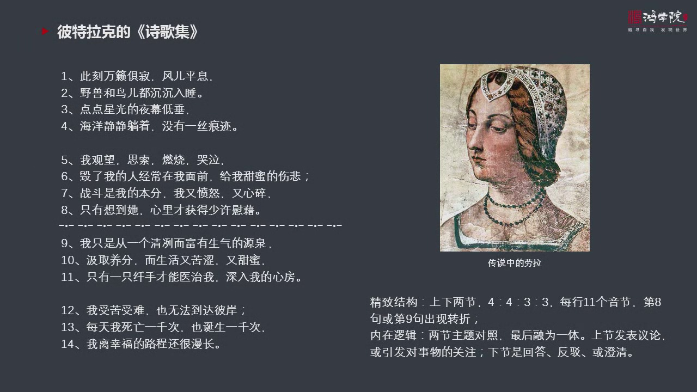

我們隨便選一首師吧這有師你會看到其實十四行師那個時代的師還是相當相當的有意思的首先他是精緻的結構不是我們有激情隨便亂寫比如說他的精結構中間我用虛線畫分出來上面是上階下面是下階就是兩階 第一階和第二階他的格式是四四三三就是十四行美行都是十一個因節當然中文翻譯過來肯定就不是十一個因節在一大利於他就是十一...

<strong>Cleaned narration</strong>

> 我們隨便選一首師吧這有師你會看到其實十四行師那個時代的師還是相當相當的有意思的首先他是精緻的結構不是我們有激情隨便亂寫比如說他的精結構中間我
> 用虛線畫分出來上面是上階下面是下階就是兩階 第一階和第二階他的格式是四四三三就是十四行美行都是十一個因節當然中文翻譯過來肯定就不是十一個因節
> 在一大利於他就是十一個因節然後第八句或者第九句一定是個重大的突然的一種轉折就是要連接兩個上下階之間需要一個掛鉤需要轉折內在邏輯呢他的兩節主題
> 是對照的就是不一樣的但是最後又容易一體比如說上階是書發一種情感或者引發一個對事物的關注或者引發討論第二階 下半階是講什麼呢是一種對這種討論或
> 者對這種提問或者對這種關注的一種回答 反駁或者成親所以我們來看這就是你會明顯的看到他中間的規律性極強比如第一行此刻萬賴劇技風而平靜也受和鳥兒
> 都沉沉入睡星星點點星光的夜幕低垂海洋靜靜躺著沒有意思痕跡這講的其實是一個警務講到海洋非常沉靜而萬物都很靜跡在這種情況之下他在觀望在思索在燃燒
> 毀了我的人經常在我面前給我甜蜜的上輩然後戰鬥是我的本份我又憤怒又心碎就想到他心裡才得到少許的位劑這個第八句他是個突然的轉折本來是在戰鬥又憤怒
> 又心碎突然提到想到他我心裡很像好說多了這就是為了引出下一節這是瓜哥高的下一節所以第九句開始他又是一個新的一種感覺就是新的一個主題他說他是從一
> 個侵烈而富有生氣的圓權中間去吸氣氧憤生活又苦又色又甜蜜只有一隻先手才能一致我深入我的心房我苦苦我受那也無法到達比案每天死亡一千次也誕生一千次
> 我離幸福的路程還很漫長其實我們可以從這樣的結構中間已經看到比特拉克的這種他的師哥他的嚴謹性邏輯性內在邏輯性和精緻結構都是應該說中世紀的時候達
> 到了無意復加的程度所以為什麼後來什麼殺世比亞人都在學比特拉克的這首師學他的很多這種師的寫法就是在於他精確的掌握這種韻律結構邏輯和他非常豐富的
> 歷史只是之間的這種寫掉關係他能夠使用我們一般說到文學作品特別說到師哥就是熱情噴發我怎麼寫我怎麼高興我就怎麼寫當然不是你會發現所有最好的作品都
> 是要克制控制激情是最高的技能你的激情要有但是一定要受到嚴格的控制像十四行師這都是一個精確的結構是一個非常非常講就控制了這麼一種發展這麼一種體
> 系他思念牢這左邊就是這個傳說中的牢但是你看他全是裡面並沒有直接在描述牢他的很多寫法跟以前的傳統的其實愛情師是完全不同的那邊就是我喜歡這個博決
> 夫人喜歡到要死我死不了我又活了然後蒸炸等等等等你會發現他們那種寫法跟比特拉克這種寫法那這個境界就判入紅泥了比特拉克這個屬於一種強烈的但是有克
> 制的在經過精確這個表達的這樣的一種學律性很強學律人很強的這樣十個鐘是緩緩到來而不是噴發出來但是給人一種強烈的感受迷慢很久這就是比特拉克他的偉大之處我們再看下夜薄加秋與世日談

---

### Slide 21

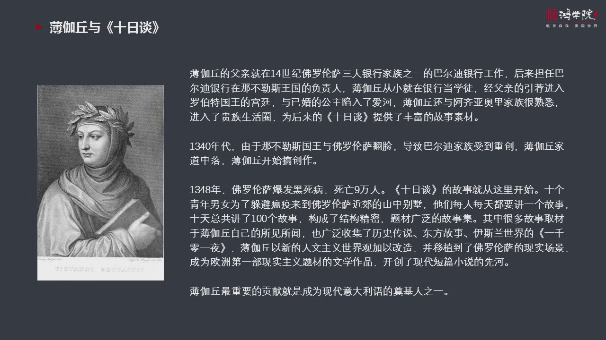

薄加秋世日談大家可能很多人都看過他的作者是薄加秋這也是薄羅倫薩三個重要人物之一三個偉大文學之一薄加秋的父親他其實在十四世紀就是一三紀年就在薄羅倫薩但三大銀行家組剛好我們提了很多巴爾迪阿奇亞里他就在巴爾奇銀行工作而且是巴爾迪銀行派駐納布勒斯的負責人就是到了非常長所以說他應該跟羅不特國王是非常關係非常熟...

<strong>Cleaned narration</strong>

> 薄加秋世日談大家可能很多人都看過他的作者是薄加秋這也是薄羅倫薩三個重要人物之一三個偉大文學之一薄加秋的父親他其實在十四世紀就是一三紀年就在薄
> 羅倫薩但三大銀行家組剛好我們提了很多巴爾迪阿奇亞里他就在巴爾奇銀行工作而且是巴爾迪銀行派駐納布勒斯的負責人就是到了非常長所以說他應該跟羅不特
> 國王是非常關係非常熟經常跟羅不特國王要借款肯定是找他他經常給國王慢事所以又從國王拿到好多貿易特學薄加秋薄加秋從小他就在一起當學圖後來他的父親
> 就把他隱見到了羅不特國王的公廳納布勒斯公廳是法國法國法他們都是法國人法國的王族然後薄加秋還愛上了一個公主就是羅不特的一個女兒這個女兒已經結了
> 婚了陷入愛河後來他還跟在納布勒斯玩過還跟阿奇亞里家族的非常熟阿奇亞里他是跟三大銀行家族他們是另外一支這三大家族中間阿奇亞里他比較奇怪他的孩子
> 們有一些就是走上了傳統道路正了錢之後買土地買了土地之後買公民就變成了升級到貴族後來在羅不特王廳公廳中間就直接把它封城了公決阿爾非公決的時候然
> 後就進出了納布勒斯的安入王朝也帶有法國富爾的這種貴族的生活圈成天在臉都混聽到了很多有趣的事或者八卦新聞這就是他未來寫十日殘提供了非常豐富的故
> 事素彩到了一三四零年我們說到由於納布勒斯開始懷疑佛羅倫薩開始跟佛羅倫薩翻臉了這是我們講到了佛羅倫薩已經那段提到了就是導致了什麼導致巴爾迪家族
> 的銀行在英國被違約在納布勒斯被墨收受到了重創佛家秋他們家當然他爸就破產了佛家秋他們家到中路後來佛家就開始搞寫作了搞創作了那麼他在一八我們又開
> 始又講到了一三四八年佛羅倫薩開始鬧黑子病死了九萬人時日談這個故事講了就是黑子病從黑時病開始有一當時死了那麼多人所以他故事中講到十個男女青年七
> 個女的三個男的為了躲避黑子病就商量我們感受到世交佛羅倫薩世交有很多山區遇到山區的一個別墅中區避難在避難中大家寫來無事就講故事吧所以大家約定每
> 天每個人要講一個故事所以一天要講十個故事這本書就是把這100個它是經過非常精心的夠私和搭建這個結構選擇了100個第三廣泛的這種故事把它繪機成
> 了是談當然終點有很多是佛羅倫當年在納布勒斯在安入王庭跟這幫人貴族們混知道了很多新鮮的八卦新文還包括說教皇的很多傳聞他在那兒聽來的還有很多是歷
> 史上的傳說東方的故事還有像一千零一頁等等廣泛收集了歷史上的各種各樣的題材最後把它改造它是用一種人文主義的思想經改造在中世紀你不能主要的文學創
> 作都得以神都得以敬拜這個東西為主題它可到好新的人文主義就是以人以個人生活追求個人生活的美好追求個人生活的享受各種愛愛的愉悅等等它就強調這個東
> 西當然跟宗教的文學和宗教的要求就相差太多了而且中間有很多故事抨擊教會也抨擊這些教室貪婪然後貪圖前才好色等等罵了一個遍所以它是以一種新的人文主
> 義的事業官把這些故事經營重新改造然後一直到了佛羅倫薩的長頸中間來所以它被號稱是歐洲第一部現實主義的過去作品也是開創了現代短片小說的先和博家秋
> 它最重要的貢獻就是跟彈丁和比特拉克一樣它們號稱是意大利益現在意大利益的三大電機人之一好最後我們總結一下由於這堂課的

---

### Slide 22

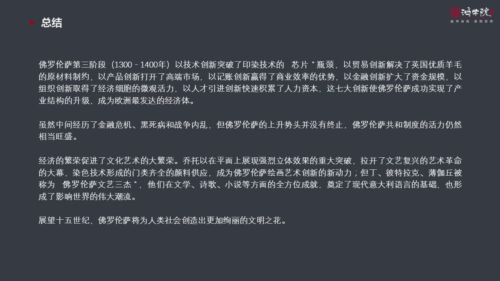

內容量非常的巨大所以我們做一個點輪總結就是佛羅倫薩第三階段1300年到1400年這是非常關鍵的一百年它以七大創新這個七大創新包括技術突破技術創新貿易創新產品創新還有技藏創新金融創新組織創新人才引進創新等等保證了它實現了產業升級成為了歐洲最發達的經濟體我們現在在講中國怎麼才能夠轉移升級怎麼才能變成發達...

<strong>Cleaned narration</strong>

> 內容量非常的巨大所以我們做一個點輪總結就是佛羅倫薩第三階段1300年到1400年這是非常關鍵的一百年它以七大創新這個七大創新包括技術突破技術
> 創新貿易創新產品創新還有技藏創新金融創新組織創新人才引進創新等等保證了它實現了產業升級成為了歐洲最發達的經濟體我們現在在講中國怎麼才能夠轉移
> 升級怎麼才能變成發達國家為什麼要去研究歷史就是因為我們必須要有參照我們必須要有界限才知道人家是怎麼成功做的這一點的而你要想成功做到是不是應該
> 學習它的很多做法或者從精神上從理念上去吸取一些有意的這種經驗那麼我們看到佛羅倫薩中間也經歷了像金融危機像黑死病還有戰爭和內亂但是佛羅倫薩上升
> 的石頭並沒有終止佛羅倫薩共和國它這個制度本身還是活力相當旺盛經濟的繁榮當然促進了文化的世界的大繁榮像喬托它是以在平面上展現強烈立體效果的重大
> 突破拉開了文藝復興運動這個大幕還有佛羅倫薩自己的染色技術門內旗權提供了大量染料這成為了文藝復興之後這個這個佛羅倫薩這繪畫藝術搞創新的一種新的
> 動力還有像彈丁比達克比達加秋這個佛羅倫薩文藝三節他們在文學師哥小說等方面的全方未成就墊定了現在一大例議員的基礎也形成了影響世界的文化潮流那麼
> 展望十五世紀佛羅倫薩將成為展望十五世紀佛羅倫薩將為人類社會創造出更加旋律的文化製化好今天我們這張課就說到這裡然後時間表長希望大家有耐心的聽完後面是三個文件主要三個文件

---

### Slide 23

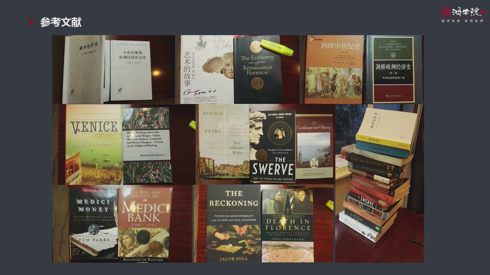

我以前都列出過現在繼續給大家展現出來好謝謝大家

<strong>Cleaned narration</strong>

> 我以前都列出過現在繼續給大家展現出來好謝謝大家

---
