# 核心课视频-027讲. 辉煌的佛罗伦萨（4） — Detail Slide Notes

> **来源**：鸿学院核心课程  
> **幻灯片**：28 张

---

### Slide 1

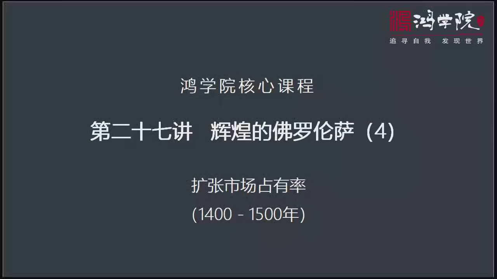

辉黄的弗洛伦萨第四部分扩张市场战友率1400到150年首先我们还是说方法论简单的回顾一下我们把弗洛伦萨的历史按着经济发展阶段

<strong>All subtitles</strong>

> 辉黄的弗洛伦萨第四部分扩张市场战友率1400到150年首先我们还是说方法论简单的回顾一下我们把弗洛伦萨的历史按着经济发展阶段

---

### Slide 2

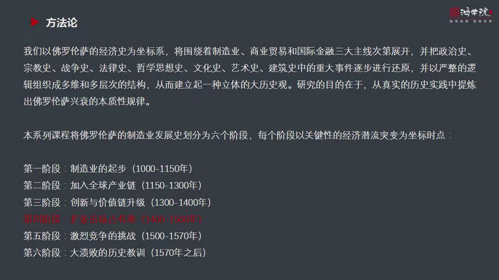

切分成六大时间段前三囊课我们已经讲过了它的制造业的起步加入全球产业链包括创新和价值链升级那么今天我们众权讲第四部分第四阶段扩张市场战友率那么前三阶段实际上是佛洛伦萨他的技术创新他的产品创新他的组织结构...

<strong>All subtitles</strong>

> 切分成六大时间段前三囊课我们已经讲过了它的制造业的起步加入全球产业链包括创新和价值链升级那么今天我们众权讲第四部分第四阶段扩张市场战友率那么
> 前三阶段实际上是佛洛伦萨他的技术创新他的产品创新他的组织结构创新所运用运量出来大量的经济潜力那么在第四阶段中这种潜能得到了巨大的释放所以说在
> 整个十五世纪这是佛洛伦萨政治经济和文化艺术达到定胜的阶段首先我们来看下液佛洛伦萨他的经济发展情况如果从整个的经济卖落来块

---

### Slide 3

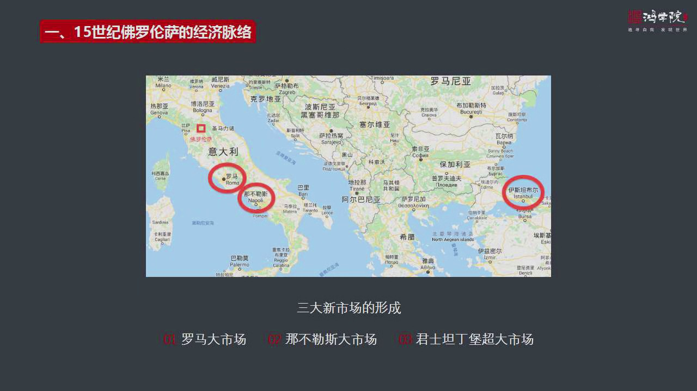

前三个阶段我们重点谈了一些细节问题就是技术细节组织细节还有产品细节等等那么今天我们课就将会换一个视角从一个更大的视角来看也就是十五世纪佛洛伦萨经济达到定胜阶段的最重要的原因是因为出现了三大新市场而佛洛...

<strong>All subtitles</strong>

> 前三个阶段我们重点谈了一些细节问题就是技术细节组织细节还有产品细节等等那么今天我们课就将会换一个视角从一个更大的视角来看也就是十五世纪佛洛伦
> 萨经济达到定胜阶段的最重要的原因是因为出现了三大新市场而佛洛伦萨他们反映非常的敏捷抓住了三大新市场的机会所以他的经济能够进一步的升级能够进一
> 步的起飞这三大新市场就是罗马纳布勒斯和军事产品宝后来这个奥斯曼帝国打下军事产品宝之后改名为伊斯坦布尔这三个新新出现的大市场使得佛洛伦萨的产品
> 获得了极大的销售的空间使得他的整个的经济发展获得了一次强有力的推进也正是在这个阶段中佛洛伦萨的政治高度稳定他的外交情况外部世界也相对和平同时
> 他的文艺复兴运动真正开始爆发就是在这一百年首先我们来看这个罗马市场的出现这就是下业我们上堂课专门提到了在14世纪

---

### Slide 4

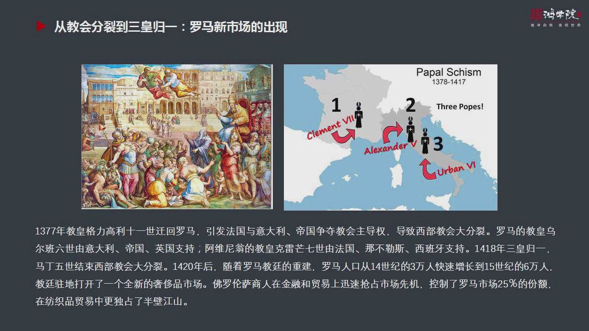

13几几年的时候罗马的教皇其实并不居住在罗马而是居住在法国南部的阿威尼翁从1305年到1370年前后有70年的时间在天主教的历史上称之为这是罗马教庭的巴比伦之球也就是在罗马人看来在罗马天主教看来他们是...

<strong>All subtitles</strong>

> 13几几年的时候罗马的教皇其实并不居住在罗马而是居住在法国南部的阿威尼翁从1305年到1370年前后有70年的时间在天主教的历史上称之为这是
> 罗马教庭的巴比伦之球也就是在罗马人看来在罗马天主教看来他们是被法国人果写了被法国人解释到了阿威尼翁在那儿待了70年所以他们称之为是巴比伦之球
> 那么后来到了1377年教皇给了高利11世决定要签回罗马把教庭从新安排在意大利但是这样一来他就引发了各个主要强权的斗争像法国当然就很不高兴法国
> 意大利要争教皇这个位置要争教皇的谁来当教皇法国人还是罗马人还有包括帝国就是神圣罗马帝国他们也在跟意大利争奴教会的主导权所以这就导致了三大外力
> 来竞争罗马天主教这就导致了西部教会的大分裂那么这场大分裂是从1378年一直持续到1417年将近40年的时间陷入了教会分裂那么最后我们看到这个
> 出现了三大教皇像罗马居住在罗马的教皇五二半六世他的背后是意大利包括神圣罗马帝国还有英国这些国家是支持罗马教皇的那么在阿威尼尔文还有法国人支持
> 教皇克雷盲七十还有就是纳布勒斯西班牙这一波人支持法国的教皇同时还在另外的地方在意大利北部还有一个教皇所以是三皇分裂那么到了1418年这三皇终
> 于出现了所谓三皇归一的这样的一个局面也就是马丁五世结束了西部教会大分裂那么正式由于马丁五世统一了罗马教会统一了整个天主教世界所以从1420年
> 之后罗马正式成为教座的城市罗马教庭签回来了也正式由于大量了罗马教庭的相关人员他们云计在这个地区所以罗马的人口出现了大夫增加罗马在古代的时候也
> 就是在罗马帝国的时候非常非常的庞大人口曾经高达上百万当然后来罗马帝国崩溃后他的城市规模日件缩小到了十三十几十四十几应该说达到了古底最小时候罗
> 马只有三万人口整个城市已经破败了不行了到处都是牛洋甚至是墓场城中秩序非常混乱其他家族相互斗也没有一个统一的权威所以罗马在十四十几一三几年的时
> 候人口下降到只有三万人但是由于这个教皇签回来了还有教庭的相关的人员他是一套非常庞大的官僚体系整体都签回来了他们还要带着家属还要带着各种各样的
> 教庭所配置的这些这些副属的这种机构还有相关人员然后再加上人口增加了特别是教庭的高官们都回来了所以他的消费他的带动的经济发展的这种刺激力大幅提
> 升那么罗马人口就迅速翻了一倍涨到了六万人六万人当时在欧洲也算是个挺大的城市了所以罗马这个地方形成了一个新的消费品就是消费品市场尤其是在社会批
> 准这个领域罗马的消费力非常的强大因为他主要是教庭的高官那么佛罗伦萨商认他们在金融上和在贸易上迅速强杀的先机进入了罗马所以我们看到在这个世纪中
> 间罗马大使厂中间佛罗伦萨占比是非常高的比如说罗马市场的所有的货员市场中的共货大概有25% 四分之一的份额是控制在佛罗伦萨人手上的那么在访质品
> 贸易中间占了半笔江山整个市场罗马市场有一半都是佛罗伦萨的产品铺天盖地另外在金融上就不用说了因为佛罗伦萨始终是教皇的铃杭家控制着罗马的财政不管
> 是在阿威宁龙还是签回罗马之后佛罗伦萨都始终占着主导地位我们看下一位除了罗马市场之外另外一个迅猛扩张的

---

### Slide 5

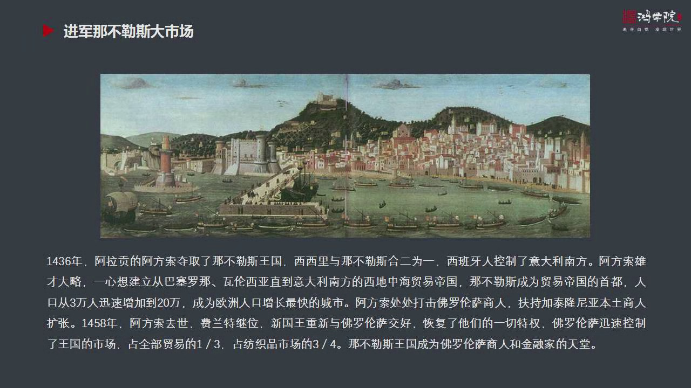

更大的市场是纳布勒斯市场纳布勒斯它以前是法国安如家族的这种领土是法国安如家族他们最到控制的地方但是後來,由於義大利,就是羅馬的教庭,還有包括法國和西班牙三方爭奪納布勒斯的控制權,導致了一三一四三六年。...

<strong>All subtitles</strong>

> 更大的市场是纳布勒斯市场纳布勒斯它以前是法国安如家族的这种领土是法国安如家族他们最到控制的地方但是後來,由於義大利,就是羅馬的教庭,還有包括
> 法國和西班牙三方爭奪納布勒斯的控制權,導致了一三一四三六年。西班牙的阿拉共,這個王朝,他們首先是在一二八二年佔領了西西里,後來又從西西里進一
> 步佔領了納布勒斯,控制了納布勒斯,當然這場戰爭持續到一四四二年,但是一三六年,他們就已經進入了納布勒斯。
> 這個時候,如果我們看地中海的地圖的話,你會看到西半個地中海,它已經形成了一個阿拉共的海洋貿易,強國的這麼一個態勢,阿拉共就是後來西班牙的兩個
> 主要,強國之一,一個是卡斯蒂利亞,一個是阿拉共。那麼卡斯蒂利亞,相對來說是在西班牙的中步,而阿拉共是在沿海地區,比如說北部的加太龍尼亞,就是
> 現在西班牙鬧獨立那個地方,巴賽羅大,還有他南部的瓦倫西亞,這都是他在西班牙地中海東側的,地中海西側的西班牙的這樣一些港口,還有他的海洋貿易基
> 地。除了這個還有他的一些群島,法國南部,還有像薩丁島西西里,然後再加上納布勒斯,這樣的話整個環地中海的西部地區,都成了阿拉共的一個巨大的貿易
> 的海洋貿易的這麼一種網路。所以阿拉共人特別他們這個國王阿方所,是個非常有熊財大略的人物,他就想建立一個整個西地中海的海洋貿易的一個帝國,而他
> 把納布勒斯這個城市作為整個海洋帝國的一個中心和首都。這樣的話,大量的商人,來自全世界各地的商人,包括西班牙的加太龍尼亞的商人等等巴塞羅納商人
> ,全部都雲集到巴塞羅納來尋找新的商業機會。所以巴塞羅納的人口,所以這個納布勒斯的人口,他的增長非常的訊懵,從僅僅3萬人迅速增加到20萬人。
> 納布勒斯是當年整個15世紀,歐洲人口增長最快的城市,就是意大利南部的納布勒斯。由於阿方所國王的主要目的是為了建立一個海洋貿易強國,所以他就把
> 弗羅倫薩商人定位成競爭對手,然後在各個方面處處擠壓、處處打壓弗羅倫薩商人。主要還是為了扶持自己的本土商人,加太龍尼亞、
> 巴塞羅納這些商人獲得了很多貿易特權,佛羅倫薩商人的特權給剝奪了。所以在這個階段中,應該有20多年時間,佛羅倫薩在意大利南部是變得非常的,他的
> 生意,他的經商活動變得非常的困難。一直到1458年,阿方所國王去世,他的後繼者,就是佛蘭特,國王他繼位了。
> 然後佛羅倫薩商人用了很大的力氣去扭轉新國王的這種觀念,當然還有大量的金融和財務上的這種扶持,所以新國王開始重新調整跟佛羅倫薩之間的關係。
> 那麼恢復了佛羅倫薩商人以前在南部納布勒斯的許多特權,這就導致了佛羅倫薩商人迅速重新控制了納布勒斯王國的全部市場。
> 那麼在整個納布勒斯王國的貿易中間,佛羅倫薩一家就佔了31%。在訪知產品中,特別是毛訪知和新興的私稠業中間,佛羅倫薩佔了整個市場的3%,可以說
> 具於絕對的壟斷地位。那麼納布勒斯王國就成了佛羅倫薩商人和金融家裡一種天堂,賺錢,生意都非常,應該說機會都非常多。
> 我們再看下一,除了這兩大市場,一大利本土了兩大市場,還有一個國外的大市場,新興的就是金融產品寶大市場。

---

### Slide 6

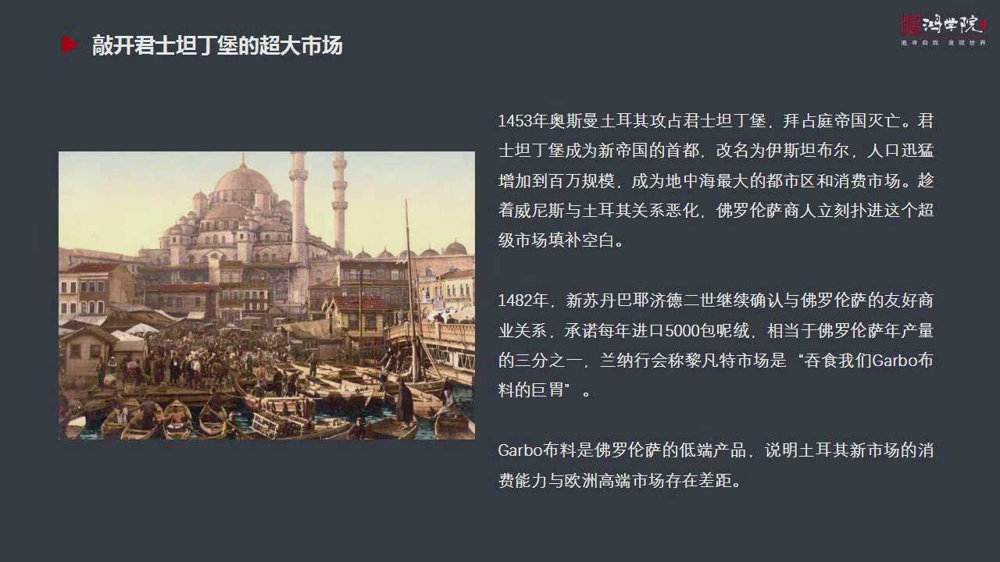

我們都知道1453年,奧斯曼土耳其帝國,罵他的罵莫德爾士,然後他帶領大軍功課的金融產品寶,消滅了拜登廳王國,拜登廳沒了。所以軍產領寶成為整個新的帝國,奧斯曼帝國的首都,改名為伊散布爾,就是現在的托爾奇...

<strong>All subtitles</strong>

> 我們都知道1453年,奧斯曼土耳其帝國,罵他的罵莫德爾士,然後他帶領大軍功課的金融產品寶,消滅了拜登廳王國,拜登廳沒了。
> 所以軍產領寶成為整個新的帝國,奧斯曼帝國的首都,改名為伊散布爾,就是現在的托爾奇特,托爾奇特一個重要城市。
> 當年是他的首都,那麼他的人口其實在拜登廳時代人口已經非常稀少了,但是成了托爾奇的首都之後,整個帝國來自亞洲、
> 歐洲的許多的這種商人,還有移民,還有中央政權的體系。大家都紛紛雲集到伊散布爾,所以他的人口迅速達到了60萬、
> 80萬突破了100萬,在幾十年之內。那就成了整個地中海地區,人口規模最大的都市,也成了一個巨大的消費市場。
> 我們如果看歷史,你會發現很奇怪,就是東方的這些國家,比如說,奧斯曼托爾奇,包括波斯,也包括中國,還有很多亞洲的其他國家印度。
> 這些城市的規模,動植就是好幾十萬上百萬,像宋朝中國的變良,還後來的這個航舟。這些城市,為什麼能突破100萬人而在西方的城市,羅馬帝國之後的中
> 世紀的西方城市,規模往往只有幾萬人,超過10萬人,那就是超大型城市了。為什麼人口,城市人口,差距會這麼大。
> 主要的原因就是西方的城市,在中世紀的時候,它完全是靠自己的商業和貿易成長起來的。它是一種賺錢的單元,是一種利潤倒向的經濟單位。
> 而在亞洲的城市,這種城市主要是個消費單元,就是國家的首都中央政府,全國的稅收,往這裡雲集,所以這裡用全國的錢養活了百萬人口,或者幾十萬人口。
> 那麼這兩種單元是不一樣的,一個是利潤倒向,是賺錢的工具,另外是個消費中心,是真正花錢的地方。
> 那麼在西方的這些城市裡面,中世紀的城市裡面,它受到經營規模的限制,它不可能發展成幾百萬人口的這種超大型城市,所以它的規模要比東方城市偏小。
> 但是它始終是盈利的,它如果不盈利,這個城市就偉縮,甚至銷亡。那麼隨著軍事產頂堡大市場的崛起,佛羅倫薩上人再次填補了這個空買,殺章進去。
> 那麼我們會看到政治在這個新市場中,佛羅倫薩和維尼斯的關係越來越僵,因為以前佛羅倫薩都是通過維尼斯上人間接進入這個立番特地區,但是現在佛羅倫薩
> 上人改變了思路,要跨越維尼斯這個中介直接進入,這就導致了雙方矛盾的產生。那麼在孟哈末的二世去世之後,他的新的繼承人,巴耶繼托二世,繼續跟佛羅
> 倫薩保持這種商業友好關係。比如說他承諾每年要進口大批的佛羅倫薩的尼融,這個規模大到什麼程度呢?大到相當於佛羅倫薩全年尼融產量的31%,可以說
> 這一個市場就是31%的天下,可見他的消費能力極其旺盛。所以當年佛羅倫薩這個蘭納航會就稱這個軍產領寶這種為代表了立番特市場,是吞噬我們這種嘎布
> 布的一個聚位,嘎布布我以前說過上堂課我們談到過,嘎布布料就是佛羅倫薩的第一端產品。
> 這個說明這個產量和銷量說明托二期這個新興市場的消費能力是相當的巨大,但是他又跟歐洲的市場有所差別,歐洲的特別是北歐洲內市場主要是高端的布料,
> 而在這個托二期新市場呢,他主要是賣了第一端布料,銷量特別好。除了這三大市場,我們再看,下野就是佛羅倫薩面對這三大新興市場所做的產品的轉型,因為市場需求變了,你這個產品就會發生變化。

---

### Slide 7

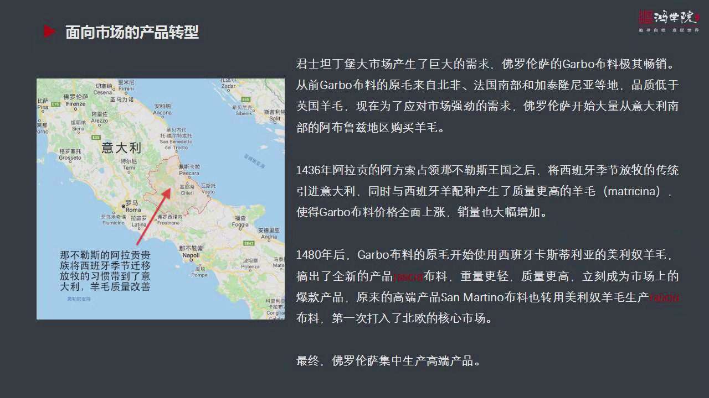

首先來看這個軍產領寶這個大市場,它規模最大需求量也非常旺盛,所以佛羅倫薩的嘎布布就是那個低端布料,所謂低端布料就是它的原材料主要是產自法國南部、北非,還有加太龍尼亞的一些地方,而它們這個布料的原料這個...

<strong>All subtitles</strong>

> 首先來看這個軍產領寶這個大市場,它規模最大需求量也非常旺盛,所以佛羅倫薩的嘎布布就是那個低端布料,所謂低端布料就是它的原材料主要是產自法國南
> 部、北非,還有加太龍尼亞的一些地方,而它們這個布料的原料這個羊毛要比英國的那種羊毛質量差,但是現在為了考慮到這個新興市場,特別是軍產領寶這個
> 市場人口很多,而且需求量巨大,所以佛羅倫薩光是從外界進口羊毛已經不夠了,所以它們開始轉向本土的這種生產,特別是意大利南部阿波魯茲地區,就是我
> 在圖中紅建圖所指向這個地區,在那個地方開闢了一個新的羊毛生產基地,為什麼會出現這個現象,因為這個地區和南部的納布勒斯,都是由阿拉共人控制了,
> 就是西班牙人,它們控制這個地區,而西班牙人我記得我們以前的節目中專門提到過,它有一個非常重要的特點,就是季節性遷移放幕,就是每到冬天和夏天,
> 季節輪回的時候,數百萬隻羊,甚至上千萬的羊會從高山下到平原,然後再從平原再回到高山,幾百萬隻羊好好當當,進行打千席,所以對農業的殺傷力特別大
> ,這個現象不僅是在西班牙有,現在西班牙人又把這種季節性放幕又搬到了一大例,所以在阿布魯茲地區就開始大規模的養羊,因為養羊這個羊毛賺錢多,所以
> 這就成了納布勒斯的一個重要的經濟發展的一種模式,由於這種羊毛供應量受到新市場的極大的刺激,所以我們看到這個產品也在發生轉型。
> 那麼這種羊毛不僅產量大了,而且質量也有所提高,主要就是西班牙把阿拉共把西班牙的羊種進行了配種,然後轉移到一大例,所以使得這種原材料的質量,也
> 就是原毛的質量得到了提升,那麼由於原材料好了,所以產品受價也會提升,嘎布布料價格全面上漲,同時銷量也大增加,因為它還是屬於廉價部系列,但是產
> 品更好了,價格更高了,在均產領導室上獲得了極大的,這種受到極大的歡迎,這成了一款爆款的產品。
> 那麼在後來1480年之後,嘎布布料它的原毛又完全開始踩,就開始轉向了西班牙的卡斯蒂利亞的美麗奴羊毛,美麗奴羊毛我們以前說過,它是西班牙最好,
> 品質最好的羊毛,它的產品的質量,就是它的原毛的質量不亞於英國的羊毛,所以美麗奴羊毛出現之後,開始大量使用美麗奴羊毛之後,那麼這個產品就發生了
> 重大轉型,它就不是低端布料嘎布了,它變成了高端的這種布料,叫雷夏,這種雷夏布料它最大的特點是非常非常的輕盈,這比傳統的尼種要輕得多,而且品質
> 更高,採取了更先進的印染技術和訪知這種精尾線的技術,所以能夠達到質量比以前輕得多,然後這個手感色彩,各方面都比以前強很多,這款產品雷夏布料立
> 刻成了一個暢銷地露海世界,甚至在北歐地區也非常暢銷了一個新產品,原來生產高端產品的,所謂高端產品,聖瑪迪諾這種布料,它們一看美麗奴羊毛的質量
> 很好,於是也開始轉用西班牙羊毛,這就是聖瑪迪諾這種布料,也開始向雷夏布料進行轉型,這就使得高低兩款產品,中間界線越來越模糊,最後就形成了主流
> 一種主流的高端產品,變成了雷西賴雷夏布料,所以我們看到整個佛羅倫薩的毛仿之工業,越來越傾向於生產高端產品,利潤高,而且它的這種銷量好,而且第
> 一次打入了北歐的核心市場,雷夏布料這是北歐以前所沒有見過的,佛蘭德布料雖然很好,但是比較厚,比較重,而佛羅倫薩生產的布料質量又好,重量又輕,
> 穿在身上手感,各方面都非常不錯,所以在北歐市場也賣得非常的好,如果我們看下夜,除了毛仿之工業之外,15世紀佛羅倫薩還新興的產業,

---

### Slide 8

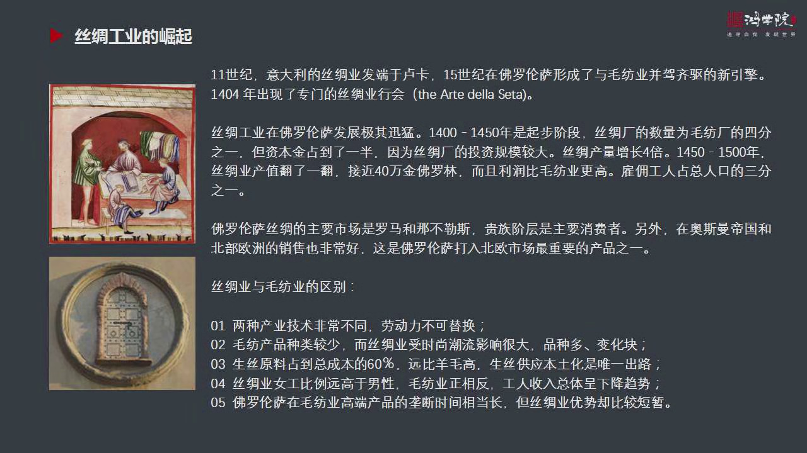

就是思仇工業,思仇工業當然我們知道最早是源於中國,後來在查詩丁寧時代,就是拜占庭論時代,公元五六百年吧,這個中國的仿之思仇的這種養殘技術和仿之技術就通過波斯傳到了拜占庭,所以拜占庭那個地方也開始生產思...

<strong>All subtitles</strong>

> 就是思仇工業,思仇工業當然我們知道最早是源於中國,後來在查詩丁寧時代,就是拜占庭論時代,公元五六百年吧,這個中國的仿之思仇的這種養殘技術和仿
> 之技術就通過波斯傳到了拜占庭,所以拜占庭那個地方也開始生產思仇,包括波斯也在生產思仇,所以波斯思仇後來有一殘思表粗,主要做波斯地毯思毯,那麼
> 拜占庭他們是負責生產高端的這種思仇的,向全歐洲進行供應,當然,後來拜占庭的思仇技術就傳到了義大利的魯卡,就是在佛羅倫薩的希特靠近海邊,他跟比
> 薩大概在一個位置,一個方向,所以魯卡是整個義大利思仇業發源的中心,這是在公元十一世紀,他就已經開始發展了這個思仇業了,後來魯卡的這種技術,包
> 括他的移民慢慢向其他地方轉移,在佛羅倫薩就出現了新興的這種,跟毛坊職工業並假其趨的這樣一種思仇工業,所以我們看到一四零四年,是一個非常有代表
> 性的時間,出現了專門的思仇業航會,以前我們講到蘭納,在往前是卡里瑪拉,現在出現了思仇業航會,那麼思仇業在佛羅倫薩的發展是非常訓蒙的,你比如說
> 他的前五十年,是一個起步階段,思仇廠的數量已經達到了毛坊廠的這樣四分之一這種水平,但是思仇廠的投資更加巨大,所以他的資本金甚至佔到了一半,那
> 麼思仇產量在五十年中間發了四倍,他的產值在後五十年中間發了一番,達到了四十萬金佛羅倫,四十萬金佛羅倫這在當年也是個非常大的數,相當於整個寶坊
> 之產品的四分之一,三分之一這樣了一個水平級,但是他的利潤要比毛坊之工業大得多,僱用人口也更多,所以他佔了總人口僱用量的三分之一,甚至比毛坊廠
> 還要高,而且他的主要僱用的都是女工為主,毛坊廠主要是用南宮,所以這兩種產業可以說對佛羅倫薩的經濟刺激是非常巨大的,一個是僱用南宮為主,一個是
> 僱用女工為主,這不就實現全民就業了嘛,所以他的失業情況當年是非常低的,那麼佛羅倫薩生產這種刺激,他的主要市場是羅馬和納布勒斯這兩大新興市場,
> 主要是那些地區的比如說,羅馬教廷的這些貴族們,還有納布勒斯王廷的這些貴族們,他們是主要消費者,刺激價格貴呀,另外在奧斯曼帝國,就是軍產領寶那
> 些一散步那些帝國的宮廷,佛羅倫薩斯仇也是非常非常創銷的,還有在歐洲北部,佛蘭德這些地區他自己的私仇工也沒有發展起來,所以大量去購買佛羅倫薩的
> 私仇,所以在北部歐洲他的銷量也非常好,只要是王宮貴族大家都喜歡穿私仇,那麼如果我們比較私仇業和佛羅倫薩毛坊業,中間有幾個重要顯著的差別吧,首
> 先,兩個產業的技術是非常不同的,所以他的技術工種,他的技術人員勞動力是不可替換的,比如說生斯,他這個燒斯這個過程,可不是跟你清洗羊毛和梳理羊
> 毛,這是完全不同的工種,性質也完全不同,這種從殘減中波斯的這種工人的技術,在毛坊之工業中完全用不上,反之依然,所以他的技術不同,導致勞動力不
> 可替換,一波是南宮為主,一波是女宮為主,第二個不同,就是毛坊之產品的種類很少,就是我生產雷下步,那我就幾十年都生產這種步調,我這兩金一球金,
> 我的染色技術超一流,但是產品本身是基本上很少變化的,這種步調就是這種步調,我可以幾十年生產,而私仇行業不一樣,私仇行業因為你主要面向的消費者
> 是貴族,這些貴族尤其是貴族婦女,她這種品位愛好,她發生變化的變化頻率,非常大,所以如果你今年還在穿去年流行的款式,就會被人瞧不起,所以這就要
> 求私仇業的市場,要根據貴族的口味,每年甚至每一季都要發生重大變化,這就導致了私仇業,它受實上的潮流的影響,要比毛仿這工業要大了多,所以私仇產
> 業必須要發展,非常種力齊全,種類非常多的產品線,而且這種產品最大問題就是變化特別快,換不得每年變一次到兩次,這晚20毛仿這工業受不了,所以你
> 會發現兩大產業,對於市場這種變化頻率的敏感度是完全不同的,私仇業要高得多,第三,生私原料,它的成本香港高,它佔了全部成本,私仇全部成本的60
> %,這比羊毛要高得多,所以在這種情況之下,弗洛倫薩就一定要高生私的本土化,養殘技術就一定要引入到弗洛倫薩,否則錢都給60%的成本,或者叫利潤
> 都給人家賺走了,那怎麼能行呢?弗洛倫薩周邊開始種桑樹開始鼓勵養殘,包括整個弗洛倫薩共和國,都進入了一個生私生產的這麼一個大的轉型,第四個不同
> 就是私仇行業,它主要共用女工,所以你會看到隨著私仇產業的發展,那麼整個弗洛倫薩的平均收入,工人的收入是在不斷往下滑的,主要原因就是女工的工資
> 不如南公高,所以整體就業人數增加了,就業率增加了,但是平均工資是在下降的,第五就是佛洛倫薩,在高端的毛坊之工業壟斷上百年,很正常,但是在私仇
> 行業,它卻做不到,因為私仇行業消費者的這種時尚,極大的影響了你這個產業的全部,每年都在變新化樣,所以這個行業要實現壟斷特別困難,這也是導致私
> 仇行業利潤雖然高,但是競爭極其慘烈,整個義大利南方的,包括北方的很多城市,像文伊斯,這都發展私仇行業,所以義大利城市之間的競爭也相當激烈,像
> 佛洛倫薩,在這個領域私仇行業,它就不可能一家獨大,占很長的時間,這也是兩種工業之間的巨大差別,好,我們看下業,那麼要面向新的市場,佛洛倫薩就必須要發展出,因為這個特別是,

---

### Slide 9

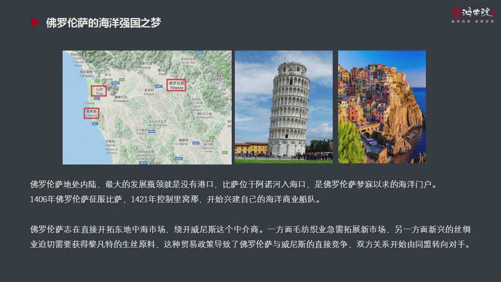

這個禮販特這個大市場,現在是成了佛洛倫薩重中之重,所以它要控有效控著這個新興的大市場,因為這個市場占了它全部模仿成功業三分之一的銷量,而它又是生私的主要供應地,當年它在自己發展私仇養殘業之前,主要是考...

<strong>All subtitles</strong>

> 這個禮販特這個大市場,現在是成了佛洛倫薩重中之重,所以它要控有效控著這個新興的大市場,因為這個市場占了它全部模仿成功業三分之一的銷量,而它又
> 是生私的主要供應地,當年它在自己發展私仇養殘業之前,主要是考禮販特供應,所以這是兩大需求,要求佛洛倫薩必須要有效控制海洋,否則的話你就搞不定
> 軍事坦尼保那個市場,那就會被別的這個競爭對手,封鎖在這個市場之外,你比如說維尼斯更接著競爭怎麼辦,所以佛洛倫薩立志要成為一個海洋強國,它要發
> 展航海,要發展自己的商船隊和戰艦怎麼辦,那就必須要奪得出海口。那麼佛洛倫薩的地位置,我們看左圖,你會看到他越來越離出海口,他實際上是個內陸城
> 市,但是佛洛倫薩有一個比較好的天然的自然條件,就是他有阿諾河,阿諾河穿佛洛倫薩一直到比薩,經過比薩進入地勒尼安海,所以佛洛倫薩人是可以借助這
> 條河流到達比薩的,但是由於比薩跟佛洛倫薩長期這個關係並不好,所以如果不能征服比薩,你這條海洋通道就始終被別人掐著脖子,這就是為什麼佛洛倫薩最
> 後的進攻方向就發展方向,要走向海洋就必須要拿下比薩,我們看到這就是1406年,佛洛倫薩最終征服了比薩,然後征服比薩之後,後來在1421年又控
> 制了李窩納,這是另外一個非常重要的海港城市,當然這個海港城市主要在16世紀得到了空間的發展,也正是由於控制了海港,所以佛洛倫薩開始興建自己的
> 海洋這個艦隊,還有海洋的商船隊,主要目的就是為了控制東地中海的新興市場,那麼這樣一來就跟維尼斯發生了巨大的矛盾,雙方在這個領域中競爭越來越激
> 烈,所以我們會看到以前在14世紀的時候,維尼斯和佛洛倫薩兩者始終是盟友,共同對付強大的米蘭,但是在維尼斯和這個在維尼斯和佛洛倫薩開始競爭東地
> 中海市場之後,兩者之間的關係發生了重大變化,盟友最後變成了對手,所以我們在分析這個看這個歷史的時候,比如說馬吉亞維利的佛洛倫薩時,還有很多這
> 個相關這種歷史,在講到這個佛洛倫薩對外關係的時候,你會覺得很奇怪,就覺得怎麼一會兒他跟米蘭好,怎麼一會兒他又投靠這個一定要跟維尼斯結盟,為什
> 麼一會兒要跟納布勒斯結盟一會兒要投靠教皇,他到底是怎麼回事,其實背後的主要原因,如果我們看清楚了,就是雙方的所謂政治聯盟背後,一定是經濟上的
> 利益,那麼當佛洛倫薩決心要控制東地中海市場的時候,他跟維尼斯的關係就沒法保持朋友關係了,就沒法在政治上聯盟了,這特別是在美地其家族科西莫那個
> 時代,表現得非常非常明顯,我們一會兒會說到這個問題,所以我們要理解義大利利史,要理解佛洛倫薩利史,就必須要研究他的經濟發展模式,他跟誰是經濟
> 對手,跟誰是合作夥伴,這主要是取得於經濟,他如果跟這個對方是在經常有共同利益的,那雙方往往就是政治盟友,如果經濟利益是根本衝突的,雙方就是敵
> 人,其實我們用同樣的世界國安和方法論,可以解釋不僅是佛洛倫薩的問題,也可以解釋古代中國的問題,也可以解釋現在,美國、
> 歐洲、中國和日本等等這些國家之間的關係,就是你的經濟利益,是一種互補的,是一種共融的,還是一種直接競爭,如果是直接競爭的話,你就沒有辦法保持
> 長遠的外交和平,或者叫外交合作這種關係,這是做不到的,在立場已經出現過了,無數這種案例了。
> 那麼如果我們看下一頁,國際貿易重新的轉移,我們剛剛所說的三大市場,

---

### Slide 10

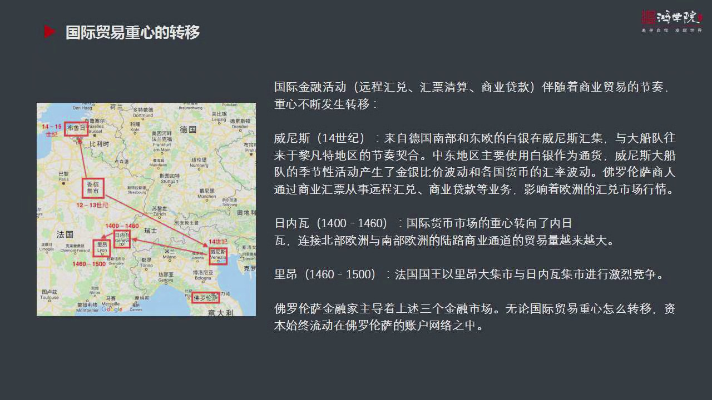

新市場那是貿易市場,其實如果我們看,剛才講的是南部地區,如果看北部和看全局的話,你也會發現一個非常重要的一個規律性的東西,比如說,如果從時間節點來看,最早的南歐和北歐之間的中心市場是在鄉民法國中部的鄉...

<strong>All subtitles</strong>

> 新市場那是貿易市場,其實如果我們看,剛才講的是南部地區,如果看北部和看全局的話,你也會發現一個非常重要的一個規律性的東西,比如說,如果從時間
> 節點來看,最早的南歐和北歐之間的中心市場是在鄉民法國中部的鄉民市場,12到13世紀,全世界最重要的國際商貿市場,來自福蘭德的布料,來自義大利
> 運送過來的香料,東方的香料,還有私愁,還有貴重的這些東西,設置品,還有他們自己控制下的染料等等,都到鄉民及事情交易,這是12到13世紀,但後
> 來你會發現,鄉民及事後來衰落了,這個市場向北轉移到了布魯日,向南轉移到了維尼斯,也就是中心市場分裂成了,南邊和北邊兩個市場,一個是北邊是布魯
> 日,南邊是維尼斯,為什麼出現這種規律呢?為什麼商人們不需要走到一起來進交易呢?主要原因是,由於商業的交流,它越來越標準化,就是沒有必要商人跟
> 著船,飄洋過海走很遠很遠,如果你在當地,比如說布魯日,它就是藍德的生產和貿易中心,你在那邊有一個住港代表,或者你有生資機構,剩下東西都是標準
> 化的指張作業,會票,然後折騰,等等,這些都是標準化的指張作業,一旦標準化之後,我沒有必要每次商人都要跟著船,飄洋過海,或者在路上坐馬車,坐到
> 這個地方進行交易,這個時代,當商業技術標準化,特別是技帳和統,然後會票,這套輔助體系還有海洋保險,逐漸標準化之後,商人就沒有必要每次都跟著船
> 走,這就導致了,它可以通過代理人和分支機構,來全間處理商業中間的日常事務,好,相冰即使存在的意義就不存,就不付存在了,沒有標,商人一定要介面
> 去談交易,我們可以通過書信,可以通過我的代理人,跟你當面談,談好價錢之後,我這邊認可付款,保險運輸,完事。
> 那麽也就是說,北邊的商報中心變成的不主日,南邊是在維尼斯。為什麽要在維尼斯呢?當然,維尼斯是個重要海洋,我們可以理解,除此之外還有一個重要原
> 因,就是維尼斯是當時13幾年,他是最重要的白銀級算中心,你比如他比熱納亞,他靠近東部、
> 歐洲和中部歐洲,所以當年的主要白銀的來源,發現美洲大陸之前好幾百年了,這個主要是德國、
> 德國南部和東歐的白銀擴散區,你比如說向捷克就有很多大銀框,德國的中部和南部都有很多大銀框,所以那些地方生產的白銀,都要向維尼斯這兒進行集中,
> 為什麼呢?因為維尼斯會有大船隊,每年5月定期的開網、離凡特、開網、軍事產領寶去做貿易,好,所有人都要通過維尼斯這個港口,來進行跟東方這件貿易
> ,前當然也會到這兒來這個會集,而他這種大船隊的出行是季節性非常強的,每年5月出發、
> 9月回來,或者是1月回來等等,跑一個來回,所以在5月份的時候,錢是大量雲集,雲集在這個白銀是雲集在維尼斯的,因為東方市場人家要白銀,所以在那
> 個階段,在那個時間點上,他這個錢貨幣供應就是供給球,所以利率會下跌,會率也會發生相應變化,但是當錢運走了,一離港,好,你會看到中間這幾個月,
> 白銀價格就開上漲,經營比價值開始變化,各國的這種貨幣,因為為什麼,雖然大家都是用金幣,但是我用佛羅林,你用杜蘭卡,他用什麼ECU什麼的,好,
> 大火的貨幣不一樣,而每個國王都想通過駐幣稅來賺錢,所以就會人為的規定他的價格,貨幣價值,這是會出現會率活動,所以維尼斯那個地方,他既有白銀和
> 金黃金之間的這種,貴基礎這樣的活動,有各國主權貨幣的,或者是政府發行的這種金幣之間的會率活動,兩大波動全部在維尼斯這集中,他就成了左右全球會
> 率市場,歐洲會率市場了一個主要中心,當然這塊主要是由佛羅倫薩人在經營。大家可能會說,為什麼維尼斯商人不是很厲害嗎?主要維尼斯商人是很厲害,但
> 是維尼斯商人沒有維尼斯的輪廈這種商業網絡體系。所以維尼斯商人,雖然在維尼斯與金錢,但是這些金錢主要是由佛羅倫薩上人在調動的,因為他們在全歐洲
> 有大量的商業網絡,維尼斯是沒法跟他比的,維尼斯的發展重點是在東避中海,而佛羅倫薩是變機整個歐洲。
> 那麼,連維尼斯商人也必須要依賴佛羅倫薩上人進行遠程轉賬,這就是說明了佛羅倫薩,他的強大的競爭力,在於他控制的金融網絡。
> 那麼後來,到了這個15世紀,從140年到140年,你會看到全世界這個貿易中心又發生了轉移,從維尼斯轉向了日內網。
> 為什麼要轉向日內網呢?因為北部歐洲的發展越來越強勁,產品數量各方面也比較多。同時,法國抓力這個地方在打仗,已經發百年戰爭了,所以海洋經濟的海
> 峽也好,巴黎也好,那個地方都不太安全,不太太平,所以從13-13幾年,一直到14-153年之間,這段時間,由於英法之間的惡鬥,導致海洋貿易和
> 陸地貿易走起來,風險都比較大。怎麼辦呢?所以主要商到從布魯日,聯繫北部歐洲和南部歐洲運輸道路就發生了比較大的變化,以前是要經過巴黎的,後來不
> 走巴黎了,走這個不跟利,然後到日內網從日內網,在道熱那樣,然後進入地中海,去跟其他地方進行貿易,所以日內網這個地方就心心,崛起了一股強大的貿
> 易的力量,大家都在日內網這來做生意。那麼日內網,你要想成為一個主要貿易中心,就需要一個堅挺的貨幣,所以日內網的君主,當時是相當於主教,紅衣主
> 教,它也是那樣的君主,它就開始搞一種堅挺的日內網的貨幣,大家可能會說,既然我們有弗洛倫薩的弗洛林,為什麼還用其他貨幣結算呢?其實當年也一樣,
> 每個君主、每個王子或者每個國王都想發行自己的精幣,雖然我們既賬,可以用弗洛倫薩的弗洛倫來既賬,但是我們真正的做交易的時候,每個地方的國王都要
> 求貨幣權,怎麼辦呢?像維尼斯有自己的貨幣,讓大家也有自己貨幣,日內網也搞出了自己的貨幣,這個貨幣跟弗洛倫薩的弗洛倫應該說在未來的一段時間,屬
> 於旗投並進的,或者屬於都是非常堅挺的貨幣,日內網搞出了貨幣叫什麼呢?就叫ECU,如果大家聽了ECU有反應的話,說明你對歐元的立場是比較了解的
> ,就是歐洲貨幣單位,後來就是所謂歐元之前的前一個階段,叫ECU,Uropin currency unit,不過這在以前在日內網這個時代,15
> 世紀的時候,這個概念就是日內網的軍主最先搞出來的,所以日內網的ECU發展成了後來歐元的前身,最後進化成了歐元,它是有這樣的個歷史傳承的,所以
> 說明日內網當年是非常重要的金融中心,那麼再往後到1460年到1500年之間,這個中心又像南,也像了李洋,所以李洋當年也是非常非常重要的國際貿
> 易中心和金融中心,由於李洋正好在羅納河這個河谷中,所以東西運到李洋之後,是流而下就可以進入地中海,沿著羅納河就直接出來了,所以李洋的優勢某種
> 意義上比日內網更強,因為日內網還是個山地,通過日內網還要走路路通道到地中海還是比較費勁的,可以說在發展的這幾個過程中,不管你是在鄉邊,還是在
> 不魯日還是到微妮斯日內網李洋,不管你貿易中心怎麼變,但是金融的控制權始終掌握在佛羅倫散任手上,因為這個錢來調動,始終是由佛羅倫散的這些商業的
> 網絡和金融網絡來左右和控制,不管你錢怎麼走,錢是在人家手上,它這個網絡始終控制了資金的調動,所以我們當我們收到佛羅倫散金融中心的時候,它並不
> 是一個純粹的地理概念,比如說我在上海金融區或者在北京這個CB地或者在金融街,不是這個概念,它是個虛擬中心,它這個中心存在於佛羅倫散的金融網絡
> 之中,無論這個所謂物理中心轉移到哪裡,但是錢永遠是通過佛羅倫散商人和金融家的這個網絡在,在賬目中,在賬本中,周遊,所以從這個角度來說,全世界
> 的金融中心,或者叫全歐洲的金融中心,當時是掌握在佛羅倫散手上的,好,我們再看下夜,有了對經濟的主要邁羅的認識,我們再看佛羅倫散當時所面臨的證據的變化,

---

### Slide 11

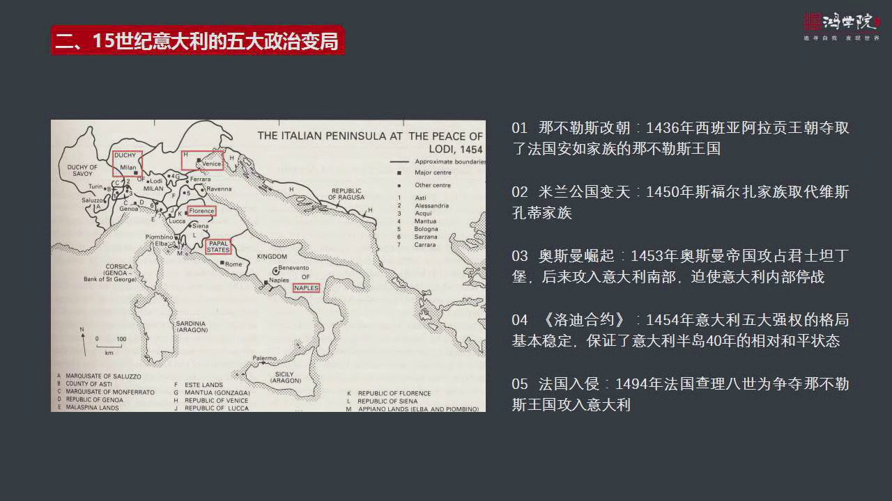

就可以看得比較清楚了,15世紀義大利益半島,出現了五大政治變局,這就是佛羅倫散面臨的當年的國際形勢,如果我們現在回到十五世紀的話,就好比當年正在做實證的分析一樣,當年實證是什麼樣呢?首先,第一大變化,...

<strong>All subtitles</strong>

> 就可以看得比較清楚了,15世紀義大利益半島,出現了五大政治變局,這就是佛羅倫散面臨的當年的國際形勢,如果我們現在回到十五世紀的話,就好比當年
> 正在做實證的分析一樣,當年實證是什麼樣呢?首先,第一大變化,證據變化,納布勒斯改朝換代,就是1436年到1442年,西班牙拉拉共往朝,奪取了
> 法國安如家族在納布勒斯的王國,這樣的話,我們看圖的最難端的西西里和納布勒斯就連成一體了,然後再加上西邊的薩領島,然後再加上那邊的這個瓦倫西亞
> 和加太龍尼亞,這就形成了整個西地中海的一個阿拉共的王朝,海洋貿易帝國,這就是當年阿拉共的阿防所最想做到的,最想實現的,這是一大變局,第二大變
> 局什麼呢?米蘭公國變天,米蘭公國以前是維持孔地加足,一直在那一方統治200多年,但是到了1450年這個加足,維持孔地加足沒有後人了,男性繼承
> 人沒有了,怎麼辦呢?就被師傅爾扎加足所取代,所以這個米蘭變天了,第三個重大變局就是奧斯曼崛起,這就是我們剛剛所說的1453年,莫德爾是共戰軍
> 事產品寶,不僅共戰軍事產品寶,後來還打進了1480年前後,還打進了義大利本土,打到義大利如果我們看,這是個高溫寫的話,打到了寫根,這個位置佔
> 領了寫根。佔領寫根之後嚴重威脅了義大利的南部,像納布勒斯,像教皇國都受到它是實際威脅,而且奧斯曼帝國還不斷打擊,這個維尼斯甚至打到了維尼斯北
> 部,像維尼拖了很多地方,甚至打到那兒,還有達爾馬梯亞的海岸這些維尼斯傳統共和國都受到了極大的打擊,正是由於奧斯曼崛起,迫使半島內部的五大權權
> 大家必須要做下的談,牽口一致對外,否則的話,那就被奧斯曼帝國給滅了。這就導致了第四大變局落敵合約,就是從1400年歷史打到1454年,這就有
> 半個多世紀,義大利北部半島一直在打仗,這個南北,包括南方,一直在爭戰不決,最後到了1454年,大家看到奧斯曼崛起了,必須要團結了,而且五大權
> 權也基本上墊頂了各自的勢力範圍,誰想改動都很困難,中間還有無數的小國,大家與其繼續惡鬥下去,還不如做下了核彈,這就導致了影響這個義大利,未來
> 四十年和平,奠定它的和平基礎的這個落敵公約。這個落敵公約一直持續到本質寂寞,也就是到1494年,法國開始入侵,然後進一步是這個義大利半島的局
> 勢佛達化,這是在1494年。所以我們如果作為一個佛羅倫薩人,你把你自己想像成佛羅倫薩當時的統治者,你所看到的這種歷史的變化,這幾大變化,在這
> 幾大變化中間如何來全衡,如何來選擇這種政治和外交的策略,是自己收益最大,如果大家必須你想一想,你是佛羅倫薩的執政官,你會怎麼來選擇,跟誰保持
> 同盟,然後去聯合,去平衡誰的勢力,或者叫壓制誰的勢力,怎麼才能保證自己的安全,和整個和平和貿易的持續進行,這個是放在每個人,我們都可以想放到
> 每個人面前的一個重大的話題,如果你的選擇不對,那麼你這個所處的這個環境就會變得非常惡劣,甚至會亡國。
> 我們現在看下夜,這就是美帝齊家族崛起的歷史了,當然我們在我們的讀書局的部中,

---

### Slide 12

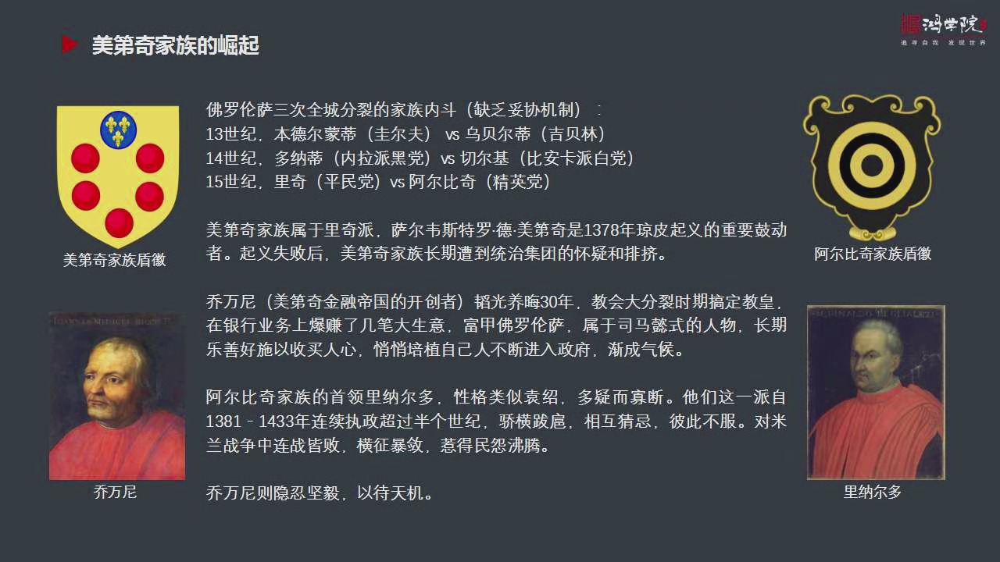

推薦了美帝齊家族新王這本書,當然這本還有像佛羅倫薩使這樣的一些書,但是呢,像這個美帝家族新衰這本書,它主要是從故事的角度去闡述,寫得非常生動有趣,不過,如果大家不仔細研究不深入去思考的話,你其實搞不清...

<strong>All subtitles</strong>

> 推薦了美帝齊家族新王這本書,當然這本還有像佛羅倫薩使這樣的一些書,但是呢,像這個美帝家族新衰這本書,它主要是從故事的角度去闡述,寫得非常生動
> 有趣,不過,如果大家不仔細研究不深入去思考的話,你其實搞不清楚,這些人物做選擇背後的主要動力,你比如說喬萬尼,就是美帝家族的創始人,就是美帝
> 齊銀行的創始人,好,它作為銀行家族的創始人,它當時所做的各種選擇,為什麼?如果你不了解前因,不了解窮壁起義,後果不了解這個當年的兒比齊家族,
> 它的勢力有那麼強大,也就不能理解為什麼喬萬尼會比較低調,也不可能去理解為什麼科興末,他的兒子繼承著為什麼會選擇,這個跟義大利北部的最強大的米
> 蘭公國去合作,而反對傳統盟友維尼斯,諸如此類的東西都無解,因為你不了解背後發生了這種經濟現象和經濟脈絡,所以為什麼這些家族史,或者叫這個轉計
> 史,必須要有強,必須要有強有力的這種經濟脈絡,作為保證以才獨的懂,才能理解當時這些人做選擇的,它的腦子裡到底在想什麼,才能理解它的思路,比如
> 說我們看美帝齊家族吧,我們前幾端專門講過義大利的家族史非常的混亂,佛羅倫薩是其中最重要的一個地區了,他也是出現了三次全程大分裂的家族內鬥,也
> 就是說你會發現佛羅倫薩也好,義大利也好,他這個家族的血鬥是缺乏一種妥協機制的,沒有辦法妥協,要不然這一派上台把另外一派全部留放,要不是對方上
> 台把你全部幹倒,沒有其他的妥協辦法。那麼這一點就跟英國非常不同,以後我們會專門講到英國,精確化王朝崛起的那段歷史中間,他們這種政治協調機制他
> 是怎麼形成的,為什麼沒有像佛羅倫薩這樣一派上台,把另外一方斬進殺絕或者完全留放,為什麼佛羅倫薩人這麼不妥協,而英國發展出一種妥協的機制,這當
> 然是跟他的歷史文化,跟他的文化傳統還有跟他獨特的地理和經濟條件都有關,那麼在佛羅倫薩立上出現了三次,一次是十三十幾,第一次是奔對爾蒙地,代表
> 貴爾夫和烏威爾帝代表吉貝林兩派的這種血型的仇殺,貴爾夫當年是代表商人的這種利益,這個吉波林呢是代表土地大貴族的利益,當然你從這個角度來說,你
> 可以說貴爾夫代表了某種進步的力量吧,這個就導致了第一次全程大分裂,第二次是十四十幾,也就是在彈丁被流放的那一次,就是多納地派,就是貴爾夫那部
> 上臺之後又分成這個多納地派和切爾機派,就是所謂黑黨和白黨,黑黨實際上更偏向於平民,然後白黨更偏向於精英,我們應該這麼講,他們都是貴爾夫,但貴
> 爾夫中又分兩派,最後是多納地這種黑派和切爾機,他們打了很多年最後,影像彈丁就是作為白黨被流放的,多納地派黑黨派上臺執政,這是第二次,第三次就
> 是十四十幾,就是窮比起義那個階段達到的頂峰,這兩派的矛盾,一派是李奇派,也就是平民黨,李奇是李奇家族是中間主要代表人物,還有二比奇派,就是精
> 英黨,你會看到在一三七八年窮比起義過程中,其實就是平民黨和這個下層的老百姓聯手,搞了四年的革命,三年半吧,後來又被精英黨所推翻,廢除了新成立
> 的各種行為,這是上臺課我們講過了那種,美帝奇家族在中間就屬於李奇派,他是屬於平民派的領袖,特別是薩爾維斯特羅,美帝奇,雖然不是銀行家族的直接
> 創始人,但是他也是美帝奇家族一個重要的組成部分,他就是一三七八年窮比起義的最主要的推動者,他也是後來的執政官,當然了這個事情期失敗之後,精英
> 黨從一上臺,二比奇家族就嚴厲打擊美帝奇家族,也就特別是始終懷疑美帝奇家族他們的政治傾向性,老覺得美帝奇家族是屬於平民的,是想挑戰我們精英統治
> 的,所以壓制美帝奇家族好幾十年,四五十年,喬萬尼就是在這樣的情況之下,在佛羅倫薩就是喬萬尼就是美帝奇金融帝國的創始人了,也是我給大家推薦的那
> 個美帝奇家族的第一個介紹重要人物,他當時是在二比奇派全勝時期,遭到了懷疑和排擠這麼一個人,所以他在佛羅倫薩就明白,如果我再向我表兄,薩爾維斯
> 特羅那樣公開跳出來跟政府鬥,跟精英鬥那絕對沒有好下場,怎麼辦呢?門頭做生意,他光養會三十年,我不去捲入佛羅倫薩內部的政治,我專門做我的金融生
> 意,所以他當時就搞定了,想羅馬教會的很多人,特別是搞定了教皇,他就派自己的兒子,就是後來科興末到處去做這種教會的工作,你比如說約翰二三世,在
> 14年參加康斯坦慈慧義的時候,那就是科興末陪同去的,科興末當時年紀還不大,陪著教皇一路走,一路聊,所以約翰二三世,還有包括前後幾個教皇,都是
> 美麗基家族重要搞定了對象,由於你搞定了這些教皇,所以教會這個銀行家的很多差勢,也就是管理教會財政這個事,就落在你們家族手上了,所以在14年開
> 了康斯坦慈慧義前後,就是整個從1400年到1420年,這前20年中間,就是我們剛所說的教會大分裂,出現三個教皇的歷史階段,這是美麗基家族的最
> 主要的發家的階段,暴轉就是中間搞定了很多大生意,所以喬萬尼後來就副家佛羅倫薩,他在佛羅倫薩長得最有錢的人,然後可以說喬萬尼這個人我覺得從各身
> 上來分析,他比較像司馬儀,他是非常有任性的,一直引人,而且他有錢之後,他就到處貸款,誰需要錢,他就借給誰,這樣的話就在民間給他留下了一個非常
> 好的口碑,所有的政治流派,大家一說的喬萬尼,一說美麗祈,那都指條大指說,這人真是康凱大坊,有求必應,這個是屬於他,好善樂師,其實在我看來是在
> 長期收買人心,為他後續的後人崛起,奠定一個很好基礎,他實際上是不斷地在培養自己人,然後這些人收了他的恩惠之後,然後他在通過這些資助他們,讓他
> 們進入政府,進入佛羅倫薩,共和國的高級的這些公元,成了這些公元之後,你會發現也越來越多的人,甚至超過一大半的人,最後都成了喬萬尼的支持者,在
> 政府中間,那當然他的地位,在政府中間的地位,在統治階層中間的地位,就越來越好潮力了,而且他就這麼有錢,所以二比其家族,就對喬萬尼非常頭痛,特
> 別是他們這個家族手領,這個李納爾多,他這個人呢,這個某種意義上有點像元少,如果咱們都三國的話,你會發現,元少這人是多謀寡斷,想了特別多,但是
> 真正排版決策的時候,特別的猶豫,他跟喬萬尼是完全不同的兩個人,你會看到他一直在祭誕喬萬尼,就是祭誕這個美地西家族這種勢力,但是呢,一直他就沒
> 有機會能夠動手,因為他內部這一派,長期執政,從1381年,1313年,這重要半個多世紀,連續執政,好,他們就養成了非常的這種相互猜忌,教恨拔
> 戶,彼此相互之間都不符,彼此拆台的事太多,大家沒有辦法統一起來,去鬥倒美地西家族,領導耳朵,發現這個問題之後,跟大家一談,大家都不知道,都不
> 知道,就是喬萬尼這人不挺好嗎?美地家族這麼低調,而且都給我們借錢,你說這樣的好人,上哪兒介紹,好,猶豫大家不支持,領導耳朵,他自己也沒辦法,
> 所以一拖再拖,喬萬尼就在這個過程中,掏光眼會,可以說是引人,建議以待天積,等待機會,奪權,我們看下一頁,這個奪權在誰手上實現呢,是在他的兒子科西莫,科西莫大權奪掌,

---

### Slide 13

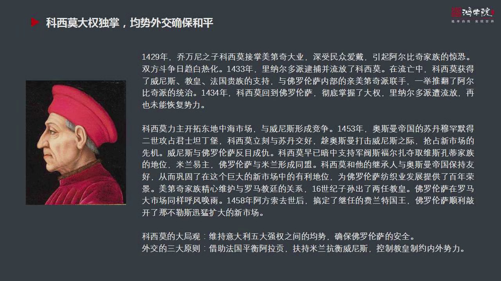

主要玩軍事外交,確保和平,如果我們看過這本書,我們讀書比這個讀書,讀書會中介紹這本書,詳細的情況,大家自己可以去讀書,檢樣來說,就是科西莫最後通過,中中手段,鬥倒了,領導耳朵,鬥倒了這個,這個rb期派...

<strong>All subtitles</strong>

> 主要玩軍事外交,確保和平,如果我們看過這本書,我們讀書比這個讀書,讀書會中介紹這本書,詳細的情況,大家自己可以去讀書,檢樣來說,就是科西莫最
> 後通過,中中手段,鬥倒了,領導耳朵,鬥倒了這個,這個rb期派,然後把他們全部流放,當然首先,在他奪權之前,首先是被對方所流放,rb期把這個科
> 西莫先流放,科西莫在流放過程中,調動各種資源,最後又把rb期派給打倒,從此之後,掌握了弗羅倫散的大權,當然他這種,這個rc莫這種控制,不是說
> 自己直接去當執政官,自己直接去參加選舉,他是把,他是成立了很多,很多特種委員會,把自己的朋友,安查到這種委員會中,而這種委員會的作用非常巨大
> ,可以說靈架與執政官,靈架與他的正式選舉的官員之上,所有事情人家有一票否決權,好,那你政府其實,其實最後你什麼也定不下來,全部都得通過專家委
> 員會,自尋委員會,這些人來審批,所以他是通過這一套,構建一套,政府之外的權力體系,就是特種委員會,專家委員會,自尋委員會,一大堆一這種委員會
> ,其實把民選政府給架空了,民選的,自尋官大家還選,然後人民首長或者是正義棄手,你們還選你們的,但是你要做任何事情,得通過我的這些委員會,當然
> ,在選舉的這些人中間也是科興莫安查的各種樣的候選人,其實最後大家都是聽科興莫的,這就導致了,他不是用一種直接的,比如說我變成一個獨裁政府,我
> 就變成了一個公決或者皇帝來直接統治佛羅倫薩,而是通過間接的手段,所以他叫建築政治,那麼由於有了這樣一種模式,所以你會看到科興莫的,他的大政方
> 針是非常清楚的,通過這套體制在運作,他內部內部的一套極致,但是他目標是清楚的,目標是什麼呢?首先,科興莫最早日知道,佛羅倫薩就像大發展,就一
> 定要開拓東地中海市場,就是要佔領軍事產領寶,那個超大新市場,那個帝國人口太多了,好幾千萬的,大城市上百萬,這個市場怎麼能丟啊?所以要想進入這
> 個市場,就必然會跟這個維尼斯行程尖銳的競爭,這是一個問題還有,你要想控制這個市場,就要發展自己的遠揚艦隊,發展自己的商船隊,那維尼斯就會跟你
> 起競爭,當年維尼斯跟熱納亞,不就是爭多海洋控制權嗎?你現在佛羅倫薩要進來參加競爭,那你也是我的對手啊,所以在艦隊這個問題上,在船隊這個問題上
> ,只要你搞,就必然是維尼斯的對手,除此之外還有,比如說佛羅倫薩那邊,像科興莫他一直想拿下魯卡,但是要拿下魯卡,維尼斯是反對的,這雙方在這個問
> 題上,也有矛盾,總而言之這種矛盾,在科興莫看起來,這是不可避免,是大國崛起中間不可避免的矛盾,那在這種情況之下,傳統的佛羅倫薩那幫政治家認為
> ,我們立朝立代,咱們都是維尼斯的好友,都是維尼斯的盟友,我們共同對付米蘭,但是科興莫的認為,局面變了,現在佛羅倫薩跟維尼斯之間的矛盾會越來越
> 明顯,越來越經濟的利益,這種衝突是不可避免的,相反,跟米蘭之間共同之處越來越多,你會看到佛羅倫薩,他在思考大戰略的時候,頭腦是非常清楚的,尤
> 其是科興莫,科興莫他要知道,他未來要跟維尼斯競爭,所以他就很早就開始扶持米蘭的另外一股勢力,維尼斯孔地自然,維尼斯孔地是一個相當於擴張,擴張
> 性,擴張成性的家族,這個對佛羅倫薩是有威脅的,但是維尼斯孔地家族,男性繼承人越來越少,這個趨勢已經很明顯了,所以科興莫就開始五色另外一個可以
> 投資,壓保了機會,這就是斯弗爾扎,斯弗爾扎本來是一個相當於一個軍閥,當年的故英軍的投資,繼位米蘭工作過,也給教皇打國賬,也給佛羅倫薩人,福購
> 物,誰給他錢多,他就聽誰的,所以科興莫很早就發現了,斯弗爾扎正是很有軍事天賦,當時他在義大利北部的馬甲地區有一塊小領地,後來又經常流利施鎖,
> 每當他困擾的時候,科興莫就悄悄地扶持他,給他錢,借他錢,這樣的話,由於米蘭工絕維尼斯孔地,他也認識到斯弗爾扎這人的利用價值,所以我一直想把小
> 女,這個公爵一直想把小女嫁給斯弗爾扎,但是他又嫌斯弗爾扎這人出生農民,沒什麼文化,而且出生又不是貴族,很樓吧,所以他一直猶豫,但是他猶豫過程
> 中,最後發現,你如果不利用斯弗爾扎,這個政權就很難鞏固,特別是這個軍事同事,如果被別人挖走,那對於米蘭影響就很大,後來他還是決定在14141
> 年把女兒嫁給他了,科興莫就發現了,斯弗爾扎這個人,他如果承諾他女去,未來必然會繼承米蘭,米蘭公國,你會看到他很早就在這個斯弗爾扎身上投入重資
> ,一直在做感情聯繫工作,一直在做金錢的輔助,所以斯弗爾扎在1450年,終於登上了公決寶座,也被教皇承認了,也被身上羅馬帝國承認了,這個時候,
> 科興莫的大政方針,他就出現了一個,結出了明顯的說過,就是北方的米蘭成了自己的,非常非常親密的一個聯盟關係,當然,Winny斯這個時候就很不高
> 興,其實Winny斯這個很早就已經不高興了,主要原因是Winny斯,當時已經發生了重大的戰略調整,就是他們現在,他們以前的歷史純粹在海洋上,
> 但是在跟米蘭鬥爭中,特別是這個老公決,威斯孔弟家族,威斯孔弟公決快不行的時候,Winny斯當時出現了內部出現了兩派,一派是海洋派,一派是大陸
> 派,海洋派要求,把我們所有注意力和國家資源全部集中在海洋貿易上,大陸派,他們當時執政官這一派,為代表這一派,就認為我們應該向義大利的本土,向
> 倫巴地地區去擴展,維尼托控制下來,然後打到戰領這個波河流域的很多地區,使我們成為一個,在大陸上有非常大的縱深的這樣一個,就是半陸地,半海洋的
> 國家,這其實是Winny斯出現了一個重大戰略失誤,就是他把很多資源轉行了,跟陸地上的強國,米蘭和教皇,什麼佛羅倫薩去爭奪大陸控制權,而在海洋
> 上的投入減少了,他基本的立足之處不是控制多少土地,而是控制海洋貿易,也正是這個原因,你會看到,為什麼Winny斯後來,在維重力死後,Winn
> y斯的擴張力量越來越強大,甚至威脅到了佛羅倫薩,這個再次說明了科西莫這人很有遠見,他已經把這個局面的前景,提前幾十年就已經看到了,而且提前佛
> 羅倫薩去做思綫炸的工作,如果我們現在去想,當時如果他沒做這種準備的話,一旦Winny斯翻轉過來對付佛羅倫薩,然後米蘭這邊又是你的強大的對手,
> 非王國不可,這就要求這種大戰略家在這種情況之下,要有凍建的能力,要有看清常遠趨勢,駕馭常遠趨勢的能力,科西莫在這個旅中絕對是做得非常牛的一個
> 人,所以他聯合米蘭去限制,去意制Winny斯,這是個非常高命的軍事戰略,就是保持義大利半島,誰也不比誰強多少這麼一個狀態,你會看到他開拓東地
> 中海,打開這個市場了,當然得罪Winny斯,Winny斯反正要跟他要處於競爭狀態,然後他扶持這個四氛炸取代,這個取代Winny斯孔地變成了米
> 蘭公爵,拉下一個很好的盟友,還有他的繼承人,他一直在跟他還有他的兒子P.I.L.O,還有他的孫子偉大洛倫佐,至於都跟奧斯曼帝國有三代通交之好
> ,三代之好,也就是說奧斯曼帝國對科西莫,這是對美帝家族是另眼相看,對他們家特別好,所以這都是長期感情的投資和這種關係的投資,這就是使得整個佛
> 羅倫薩都從中受益,因為你可以打開一個巨大的新興市場,你的毛坊的產品可以在那兒,可以他這個書上這個市場,占你整個產量三分之一,這都是科西莫的長
> 遠眼光所奠定的,你要做到這點,就必然會得罪Winny斯,雙方就沒有辦法再向以前量搞同盟了,這是背後是利益,然後除此之外,他還特別看中跟教皇的
> 關係,從約翰23世一直到後來的幾世幾世,一直到科西莫扶持的人,你會看到一直到他的孫子,這個羅倫左所扶持的這些教皇,甚至包括美帝家族自己推出了
> 兩個,後來他們家族自己也出了兩個教皇,你會看到他對教會的工作,始終是抓在這種之中,當然後來在納布勒斯運動中也是,一開始阿芳所使堅決反美帝其他
> ,但是阿芳所死了之後,他們一開始搞定他的繼任國王,富蘭特,然後給費蘭特很多錢,然後幫他解決很多困難,幫他去治理國內的很多,所謂土地貴族的挑釁
> ,除此類的幫了很多忙,所以在納布勒斯這個新市長中,弗洛倫薩也佔據了熬頭,你會看到科西莫,他的大局官用一句話概括,就是維持一大利五大強權之間的
> 軍事,確保弗洛倫薩的安全,他的外交上有三大重要原則,第一是借助法國平衡阿拉共,為什麼因為南方的阿拉共這個納布勒斯王國也是非常強大的勢力,他如
> 果向北侵犯就有可能滅掉弗洛倫薩,那用什麼辦法來制約納布勒斯的進攻呢?科西莫選擇的就是要借助北方的法國,因為法國安入家族,他的江山被搶走了,所
> 以他一直說這塊地方是他的,所以法國跟阿拉共王朝在納布勒斯上是有主權爭議的,科西莫借助法國人,就是如果你這個納布勒斯王朝要對我有什麼其他的想法
> ,好我就會去找法國人評理,法國人也有可能會出動軍隊,這就可以說對這個納布勒斯形成了一種非常持久的心理壓力,一聽到法國人要捲入戰爭,或者一聽到
> 法國人說納布勒斯是他們的,他們就很難受,所以科西莫是巧妙的借助著外力,法國在平衡阿拉共,然後扶持米蘭,就是跟米蘭聯盟來抗衡納布勒斯,因為納布
> 勒斯後來取代了米蘭,他的擴張勢力越來越強大,變成了新的霸權,然後特別重要是控制教皇,來制約內外的全部勢力,因為教皇如果抓到我手上,教皇在當時
> 那個時代說話還是有一點作用的,雖然不像以前把神聖羅馬帝國皇帝決法,然後就導致內部混亂,砍到殺之爐,當然雖然沒有這麼大權力,但是如果教皇不承認
> 你,或者出你這個絕法,那你這個國王日子也是比較難受的,所以美帝西亞族通過控制教皇,能夠有效了控制神聖羅馬帝國,有效了去控制英國法國,包括西班
> 牙,包括這個整個伊大利半島,五大強權都能夠通過教皇來進行非常有效的這種平衡。所以他的外交原則如果提煉出來就是,借助法國平衡阿拉共,扶持米蘭抗
> 衡民醫師,控制教皇制約內外勢力。當然我們看到的這個美帝加足新衰的本書也好,我們看到了馬基亞威力的弗洛倫薩史也好,雖然他們沒有這麼提煉出來的三
> 大原則,我覺得你把他所有的這種政策行為,包括對外關係提煉出來,無非支持三句話,我覺得這個正式可惜莫這人非常了不起的地方,可以說是遠見捉石的戰
> 略眼光。我們再看一下也,當然除了他之外還有他的孫子,他兒子在位只有四五年很短,

---

### Slide 14

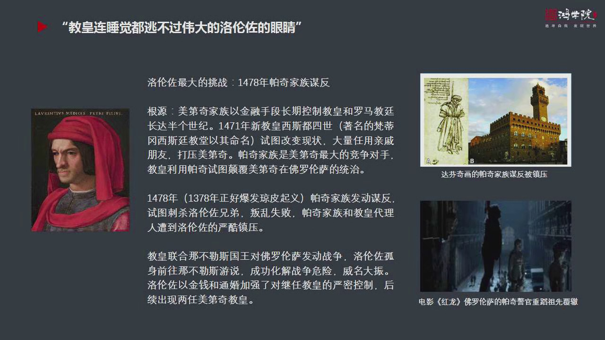

平安羅就死了。他的孫子很厲害,叫偉大洛倫左,被稱之為偉大的洛倫左。這個科興莫跟洛倫左的關係有點像康欣和潛龍之間的關係,平安羅就像中間的勇政,基本上康庸前三代加起來120年,這個三代加起來大概是60、6...

<strong>All subtitles</strong>

> 平安羅就死了。他的孫子很厲害,叫偉大洛倫左,被稱之為偉大的洛倫左。這個科興莫跟洛倫左的關係有點像康欣和潛龍之間的關係,平安羅就像中間的勇政,
> 基本上康庸前三代加起來120年,這個三代加起來大概是60、60多年,正好是一半。科興莫的時間,統治時間,康欣是60年,科興莫的30年,洛倫左
> 這個潛龍也是30年,也是60年,洛倫左也是30年,基本上都是他們一半的時間,就對了。
> 你會發現洛倫左這人也還是非常了不起,就是有譽著名的話,就是教皇連睡覺都逃不過偉大洛倫左的眼睛,洛倫左的眼睛一直盯著教皇,教皇睡覺他都知道,說
> 明什麼呢?說明洛倫左對教皇的控制力非常的嚴,非常的強,當然他也不是一直控制力都這麼好,就是因為中間出現了一個巨大的樓子,這才讓洛倫左覺得這個
> 教皇人必須要嚴格控制,否則的話會出大亂子,這怎麼回事呢?這就是洛倫左統治中間面臨的一個重大危機,1478年,怕其家中反,謀反,怕其家中謀反,
> 發生在1478年,我們可以想像一下一百年前,1378年出現什麼?出現的就是重疾起義,一百中年,他的根源是什麼?就是教皇長期被控制,這個美麗家
> 族對教皇控制力非常強,但是到了1471年,對教皇控制都70年了,新教皇出來一個新教皇,這人叫西斯都四世,我們去凡地鋼、
> 去羅馬很多人都去寡,那個西斯廳教堂,西斯廳教堂頂上,就是那個米開朗基羅那些名話,還有很多藝術大家那些話,天頂話,諸如此類的,著名的西斯廳教廳
> ,西斯廳教堂用的就是西斯都四世的,以他的名字來明明的,說明此人在羅馬教會史上還是有點知名度的,這個西斯都四世就不一般了,他跟其他教皇不太一樣
> ,他要改變現狀,這個改變現狀其中最主要的就是要用他自己的人,包括他的親戚,還有一大堆植子,有些是他四成子了,四成子了,一大批人安排在教會,各
> 個崗位上,比如說書記主教,就是從一大主教,一大批人都是他的親戚,同時還任命很多親戚,到各地當猪猴,比如說在弗羅倫薩周圍,有很多地區,屋而比諾
> ,公爵或者什麼什麼廢拉拉公爵,他都派自己人去,同時還在比如說弗羅倫薩周圍的比薩,比薩是屬於弗羅倫薩控制的,還在那兒插自己,安插自己人,任命他
> 為這個比薩主教,當然從理論來說,教王是有權利去任命比薩主教,這沒問題,但是常規是你必須要先跟諾倫子打招呼,先跟美帝西加主打招呼,美帝西加主同
> 意認可之後,你才能夠說我派這個人去,但是為什麼美帝西加主對比薩主教這個事兒一直是有不同意見,就是因為教皇在弗羅倫薩周邊什麼,柏羅倫薩在什麼廢
> 拉拉這一路上,威爾比諾不知了大量自己的人或拉攏這些人去對抗弗羅倫薩,所以弗羅倫薩就覺得教皇就是要反,教皇就是要跟我們對這幹,雙方的矛盾就是從
> 這,出發,當然了,教皇要想鬥狂,這個美帝西加主也不是那麼容易的,因為美帝西加主是有權有事,他們可以通過金錢運作很多關係,所以教皇也通過給好處
> 的方法,來拉攏弗羅倫薩內部反美帝西的加主,形成同意戰現,比如說中間最重要的一個加主,就是怕其加主,怕其加主我們講到,我想起不電影,這個電影就
> 是紅龍,這個紅龍講的中間就是講那個吃人的博士,跑到了弗羅倫薩當博物館的館長,然後弗羅倫薩有個檢察官,應該是警督,這個警督從FBI的網站上查到
> 了,原來這個博物館的館長就是FBI要重點莊南的侵犯,選賞400萬美元,300萬還是400萬了,所以這個怕其警官,就是怕其加主的後人,他就說我
> 一定要自己去把這人抓住,然後讀想這筆獎金,他有這個心思之後就一直跟蹤這個博士,當然這個吃人博士很了解他的行蹤,而且對他這個人了解特別偷徹,吃
> 人博士就把它又騙到了這個舊宮,就是我們看看上面這個,又上方這個圖像,舊宮的某一個房間,在那個窗口上把突然把它綁起來,給他打了一針,困進來之後
> ,然後就把它推出窗口,在推出之前就跟他說了一句話,他說你是怕其加主的後人,他說五百年前,你們家就在這兒,就是1478年趴去某法的時候,你們家
> 的人還有好多什麼大主教,就在這個窗口上,同樣一個窗口被吊死了,我們看這張圖像,上面這張圖像,這就是打分其一話的,就講了就是怕其加主某法這個事
> 兒,然後他說你今天重盪你家族的負責,你們家族是五百年在佛羅城廈都抬不出來,你現在才重盪他們負責,就把它推下去了,這個故事,如果我們有豐富的歷
> 史知識,你一看,你就知道這是怎麼回事,前一後果是怎麼回事兒,所以我當然在看這個電影的時候,印象就特別深刻,我希望大家就是通過這種學系,通過這
> 種知識的積累,你再看很多電影或者看了很多文學作品的時候,它一個點故和一句話,別人就沒有這樣知識體質之前,你是完全聽著無感的,有這個知識體之後
> ,你馬上就明白它背後的深刻含義,馬上就知道它的鹹外精等等,所以這是一個非常有意思的事兒,說到怕其家族這個電影紅龍,如果大家有空可以去看一看,
> 那麼利用怕其家族去某法,美帝齊的統治,這當年就是所謂的怕其家族某法案,怕其家族當時還和教皇的職子,大主教還有很多,包括一些僱傭軍的一些頭,聯
> 合在一起準備通過刺殺的手段,幹掉洛倫佐和他兄弟,結果在教堂突然發誕的時候,把他兄弟殺死了,但是洛倫佐跑掉了,洛倫佐跑掉之後,然後回過手來就全
> 程鎮壓,怕其家族殺死了很多人,而且這身死的都很慘,包括怕其家族人都被剝光了衣服調死在窗口,非常殘酷,而且還有不少人失谷,從木藏面挖出來,又拋
> 在河水面,又從河水面又被小孩弄出來,然後就掉到樹上,又鋪石街頭,然後又被人砍下手腳,完全止解的不成樣了,所以這個美麗家族報復也是非常非常兇悍
> 的,由於美麗家族對怕其家族這種嚴厲的鎮壓,導致的教皇對面就非常省解,而且把教皇的親戚給靠了,所以教皇,其實都四次就跟美麗家族試不兩力,決心一
> 定要滅掉美麗起,所以教皇就開始聯合納布勒斯王國,然後聯合對弘勒倫薩發動軍事進攻,弘勒倫薩當時情況不太有利,因為他的重要盟友米蘭當時正在鬧內亂
> ,無法出兵原救他,新老交替出現了很多問題,然後麗伊斯又變成他的敵人,這個時候你會看到好納布勒斯是我聯合教皇的軍隊一塊打進來,他就沒有辦法抵抗
> ,包括法國,法國雖然聲援弘勒倫薩,但是不出兵,因為法國當時還有很多自己內部的矛盾還沒解決完,這就導致了這個文藝斯,這就導致弘勒倫薩當時出於非
> 常危險的境地,怎麼辦呢?這個時候洛倫走左思右向,想到這個重要的辦法,就是他支身前往納布勒斯去游泳納布勒斯國王,小之以力,動之以情,這個書上都
> 有,這個書中講了也是比較詳細,但是如果你抓住這個事情的前一後,我抓住主要邁羅的話,你可以看清他背後的這個原因,為什麼他會說動納布勒斯霸兵呢?
> 主要的問題就是,首先,教皇對納布勒斯的利用是一次性的,而教皇始終是反對,始終是討厭納布勒斯阿拉共的,所以他說,這個倫子就告訴你這個國王,就說
> 如果你這次受教皇利用,那下次你把我從你借你之後把我給滅了,但是他下一步對付就是你,所以我們還是出王史還關係,你不要把這問題想歪了,國王其實心
> 裡明白,是怎麼回事,他沒有必要受教皇的利用,第二還有法國人呢,你滅了我佛羅倫薩,法國人最後,他也要進來說納布勒斯是他的,這樣的話就會有一個法
> 國的制約的作用,其實就是這兩點把納布勒斯國王給說服了,他由於單身提馬到納布勒斯去游泳國王,到敵人的宮廳上去游泳最大的對手,好,最後成功了,這
> 就使得這個洛倫佐在佛羅倫薩內部的身為大陣,本來他既為手大家都覺得他不行,但是你會發現任何一個同志者一定要做出一件,今天動地了聊不起的正義才會
> 讓所有對手幸福可福。從那以後後續的教皇,這個洛倫佐控制非常嚴重,其實這是一個重大的事件,重大的意外實踐,他下台之後剩下了所有教皇,他都進行了
> 嚴密控制,包括西斯珠的繼承人,他不僅是拉攏、匯路、琢磨這個人愛好,送大量、送大量的他喜歡的東西,而且把孩子把女兒嫁給他的私生子,通過婚姻、
> 通過很多手段來嚴格控制教皇,不僅控制教皇,還把自己的兒子、後來的孫子之類的,每一代人都會選拔一個人,任命的教皇身邊去當紅衣主教,而且這些紅衣
> 主教、書記主教,每一個都有競選當教皇的資格,所以他在運作教皇過程中也扶持了很多支持實力,羅馬的主要幾個出教皇的家族一直在競爭,所以你會看到他
> 們家族,為什麼後來有兩個人都當選為教皇就是這個原因,特別是後來後來教皇,每天西家族教皇的故事我們可以後再說,我們再看下夜,下夜就是我們講到了佛羅倫薩經濟邁落之後,然後講到了佛羅倫薩的政治,

---

### Slide 15

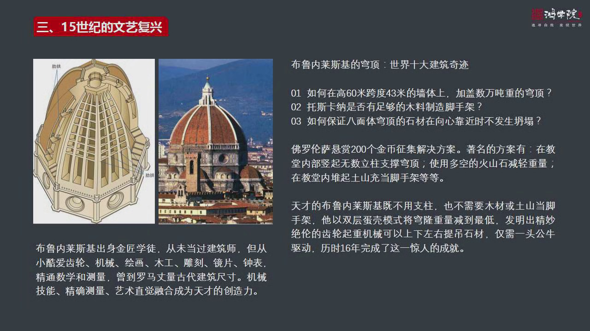

國際政治和國內政治,第三部分我們講佛羅倫薩的文藝復興,他為什麼是文藝復興的發源地,最主要的時間,這才不是十六世紀啊,什麼大分歧這些人,米克朗基羅這都是應該說是在靠後了,其實我覺得最主要文藝復興的時間,...

<strong>All subtitles</strong>

> 國際政治和國內政治,第三部分我們講佛羅倫薩的文藝復興,他為什麼是文藝復興的發源地,最主要的時間,這才不是十六世紀啊,什麼大分歧這些人,米克朗
> 基羅這都是應該說是在靠後了,其實我覺得最主要文藝復興的時間,電機這張工作和最有活力、
> 最有創造力的是出現在十五世紀,那真是民家被出,可以說這些做的工作都是革命性的工作,這個開天屁弟的工作,比如說首先,文藝復興運動中間,認為一個
> 在十五世紀最了不起的一個人,某種意義上我認為他可能這個人是誰呢,就是布魯內萊斯基,布魯內萊斯基某種意義上我認為米克朗基羅應該更偉大,因為他在
> 好幾個領域,都做出了非常全新的革命性的這樣貢獻,你比如說佛羅倫薩最著名的建築,當然就是這個建築,就是我們途中所看的這個建築,是五百花大教堂,
> 是五百花教大教堂,這是從公園一二九六年開始興建,就是我們以前可能從講到過的佛羅倫薩,當時全聖時期開始建這個教堂,建了二百年了,到一四幾年了,
> 怎麼辦呢,中間最大的問題,就是這個窮頂加不上,窮頂非常的,這是個非常高難度的工程,當時設計說還沒想到這個東西有這麼難,現在休完一看,好家貨,
> 這玩耳強已經搭起來了,這麼一個旁人大物,這個強高大概60米,20層樓這麼高,這個八面強之間空了這一塊,它的直徑跨得有多大呢,43米,好家貨這
> 是相當於我們白銀跑道跑一半,這麼大一個蓋,你要把它全部做成食材,這會重大數萬噸,你怎麼把這個東西掉上去,你是先在地上修好了,然後起中機把它掉
> 上去蓋那呢,寫著不現實,因為當時沒有起中機,你還是把磚和石頭運上去,然後慢慢的修呢,而修這個東西又怎麼支撐呢,這是一個建築上了一個巨大的難題
> ,所以這就是布魯內來斯基的窮頂,這個窮頂是世界十大建築奇蹟的第二名,非常非常的難,布魯內來斯基當時所面臨的這個問題就是,好,首先數萬噸的窮頂
> 怎麼幹,第二個問題,你如果說要搭交手架去蓋,要怎麼怎麼樣,透視卡納全部數都砍光,也搭不起這個交手架,它也耗費木材,第三,怎麼才能保證,這些你
> 在上面蓋窮頂的時候,這些食材不斷往中間靠,最後它會萬一它方的怎麼辦,怎麼保證它不發生攤湯,所以佛羅倫小當時被這個問題困擾了幾十年,政府全場2
> 00斤幣,誰能解釋這個問題拿走200斤幣,拿走200斤幣,那可不得了,是給天文數字,所以當時很多很多建築是出這個提出了無數的方案,比如說有人
> 說,在教堂內務,就是這個大窮頂底下,數氣無數跟柱子,用柱子來支撐這個頂的重量,好加慌,那如果真實那麼幹的話,那個底下窮頂底下就沒法佔人了,全
> 是柱子,還有說要使使用一種火山空心石,讓食材變得沒有這麼重,這當然是一個思路,但是還是太困難,還有呢,還有人就說我們應該在教堂裡面對其土堆,
> 對一個土山,用這個土山當教授架,但是這個土山的工程量也非常大,您得把這麼巨大的一個體,這個龐大的一個土方運進場裏,然後在堆到這裏頭,在堆的像
> 山一樣高,堆好幾十層樓這麼高,好加慌,那挖,挖這個房子,這個挖出來也是個巨大的困難,當然是救人體,我們乾脆在屠裏面撒滿了精密,也就是說,去完
> 了樓之後,大家為了去挖掘裏面的精密,這個大家就會有機機性把土給運走,就是你把土運回家,中間如果找到精密,精密就是你的了,就想了各種要吸氣股外
> 來的這種辦法,但是這個辦法都不行,最後就是不如內來司機,它提出了一個解決方案,當時大家都覺得它封掉了,它提出的方法說,我能解決這個問題,而且
> 不用一根這個教授架,不用砍一個樹,不用一根土木的這種教授架,我也不挖土山,我就能把這個窮力給你蓋上去,當然大家都覺得它是神經病,這怎麼可能呢
> ?然後就出現了一個著名的故事,有一次布魯內來司機,去參加這個市政委員會,聽眾會,人家說你怎麼可能能夠把窮頂調上去,或者怎麼可能把它修了起來,
> 不用教授架,不用土山,那你用啥呢,也不用住的,然後布魯內來司機隨身帶了個雞蛋,說你們看,這個雞蛋誰能把它立起來,當然立不起來了,這麼遠戶戶來
> ,布魯內來司機在桌上一敲,把雞蛋敲出來說,你看,就這麼立,雖然有人說這個故事是,當年哥倫布說的,但實際上,我覺得應該是布魯內來司機說的,更靠
> 譜,因為布魯內來司機,它就是用了雙層蛋殼的思路,來解決這個問題,它這個窮頂從外頭看,是一個完整的窮頂,實際上它分了兩層,它是一個雙蛋殼的一個
> 結構,非常的巧妙。當然它中間有大量技術器節,如果大家感興就到我後面的PPG中間,有一些具體的講解,布魯內來司機是一個非常,非常厲害的一個人,
> 它其實不是建築師,它以前沒搞什麼大型建築設計,它是一個金將,金將學圖,從小快齒輪,機械、繪畫、木工、
> 雕刻、競片,中表它什麼都會,特別是金通數學和測量,為什麼我說像這樣的一個建築器,如果不金通數學,不金通幾何學,這是絕對做不到的。
> 這就是為什麼我們說中國有很多古代的建築,但是你見不起這麼大規模的食材建築,因為這需要高度的測量,需要非常嚴密的邏輯思維能力和幾合的能力,你會
> 看到布魯內來司機他們這批人,工將和這種建築師,其實都是數學家,非常的厲害,而且還是發明家,搞了這個大量的這種機械發明,特別是尺輪,不知道大家
> 注意秒,中國古代很少使用傳動性尺輪,作為傳動傳動的這個動力的這種方式,這就是我為什麼說演藝邏輯是偏向尺輪性的,這個歸納邏輯不是走這條路,所以
> 雙方進化出來的包括具體的物件都不一樣,布魯內來司機是個幾合學非常厲害的,是個數學的天才,同時又是集結發明家,同時還具有強大的藝術職員,集結者
> 為議題,所以它是個非常全面的了不起的人才,它在蓋大兄弟一共花了16年的時間,然後終於用它的天才和它的這種施工的技巧,解決了中間所有的苦難,所
> 以知道今天都被認為是世界十大建築奇蹟之一,我們看下一頁,比如說它的機界裝置中間,大量的機界裝置中間有很多發明,

---

### Slide 16

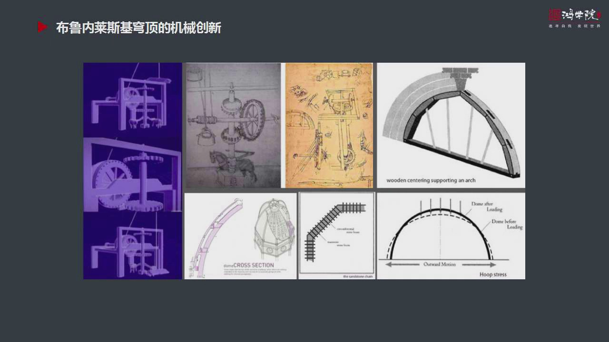

你比如說左邊中間有好幾個都是什麼它的其中機,它的其中機你會發現,它由於是把食材和專塊調上去,注意要上百萬,上百萬塊食材和專,通過要通過其中機運上去,當時又沒有機械,又沒有電力怎麼辦,它只需要一頭供牛,...

<strong>All subtitles</strong>

> 你比如說左邊中間有好幾個都是什麼它的其中機,它的其中機你會發現,它由於是把食材和專塊調上去,注意要上百萬,上百萬塊食材和專,通過要通過其中機
> 運上去,當時又沒有機械,又沒有電力怎麼辦,它只需要一頭供牛,就能夠它在量不斷的轉,就能夠把尺輪通過尺輪就可以把這個東西提高到幾十層樓的高度,
> 把這些食材運上去,建築材料全部運上去,它這個設計非常巧妙,包括比如說供牛超一個方向賺,這是把食材給運上去,那是這個框下下來,或這個預輸機下下
> 來怎麼辦,這個碼不用,或者這個牛不用換方向,它仍然保持這一個方向賺,只需要改換一個開關整個尺輪的傳動就完全反方向,而且這個其中機其中到指定高
> 度說,不僅能夠上下洞還可以左右自由移動,這都是需要高度機械,高度這個指輪傳動的這種知識才能做得到,除了這個之外,還有很多細節,比如說這個大雄
> 頂,大雄頂以前必須要有墓架支撐,否則的話這麼重的石頭壓到它會變形了,所以以前有墓架,而不如那家司機沒有用墓架,怎麼來解決這個問題,還有還有一
> 個重要的就是這個右下圖我們看到,就是這種窮龍會自動形成的壓力,因為這個窮頂全是食材,好幾千噸好幾萬噸,這麼壓下來的話,這就像一個倒扣的碗,它
> 一定會從上往下產生一種壓力,然後會在這個碗的丸口,這個水平方向會產生一個向外崩的力量,這就是為什麼我們看了酒桶,它一定要用鐵枯,如果沒有鐵枯
> ,這個酒桶就會碎裂,實在建築物也是一樣,窮頂就一定會產生強大的向下壓力,然後在碗口這部分會產生強大的向兩邊分離的這種力量,所以怎麼哭住這種,
> 就是怎麼用鐵枯把它哭住,像酒桶那個,酒桶哭一樣的,怎麼做到這一點,這也是一個巨大的工程挑戰,不如那來司機用了解決辦法,就是我們看到這張都左面
> 像鐵鬼一樣的,它是讓通過鐵鏈還有10塊,還有木頭就像鐵路的整木一樣,橫著樹著,斜著,幾個方向,形成一個巨大的這個,巨大的這個,頸孤柔的這個枯
> ,分4層,分5層吧,空把這個窮龍,在不同的距離上,這個溝住,有些你從內部看,它是個走廊,還有些你是看不見是在裡頭的食材中間,它一共在不同的位
> 置,這個束縛了好幾層,這才解決這樣的一個問題,這都是非常天才的一種思路,我們再看下一個,它這個思路就說,它為什麼不用攪手架,能夠把這個事給做成,

---

### Slide 17

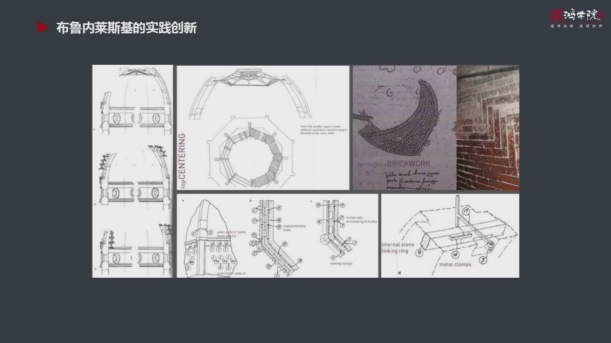

你會看到它的攪手架是旋空的,這就像一個雞蛋一樣,雞蛋它可以用一個,比如說我們用一個,這個猴皮肩,我們往上一套,用這個猴皮肩如果是比較窄的話,會套的雞蛋上,所以不如內萊斯基的辦法,是用旋空的這種,它的這...

<strong>All subtitles</strong>

> 你會看到它的攪手架是旋空的,這就像一個雞蛋一樣,雞蛋它可以用一個,比如說我們用一個,這個猴皮肩,我們往上一套,用這個猴皮肩如果是比較窄的話,
> 會套的雞蛋上,所以不如內萊斯基的辦法,是用旋空的這種,它的這種腳鎖形成的,這個溝住,就是如果你這個窮頂慢慢,慢慢往上閘,像中間靠龍,它會根據
> 你的直徑,不斷調整它這個鐵枯,就是鐵石頭形成了這個,這個枯套,調整它的直徑,讓它始終套在窮龍上,然後在中間再搭很多板子,這就可以當腳鎖架來用
> ,內外兩者均可,而這個為什麼它用不了多少木材呢,因為就是幾十米的寬度,能有多少,而且越往上修,它需要的這個木材越少,所以它形成了非常,非常巧
> 妙的旋空式的腳鎖架,然後你會看到它的,它採取了很多工程上的一些,其實它的創新,比如說人自行的這種,可以很好解決壓力這種,這種磚的佈局,還有它
> 的,包括這種鐵枯,它是怎麼實現的,鐵枯和石頭之間連接的方法,這個絕對是個工程學的巨大的創新,包括它的,它在窮龍內部,它怎麼旋空掛,這都是有一
> 套解決辦法的,除了這個之外,我們再看一下,布魯內來司機,這是它工程上的一大貢獻,但是這還是個小問題,

---

### Slide 18

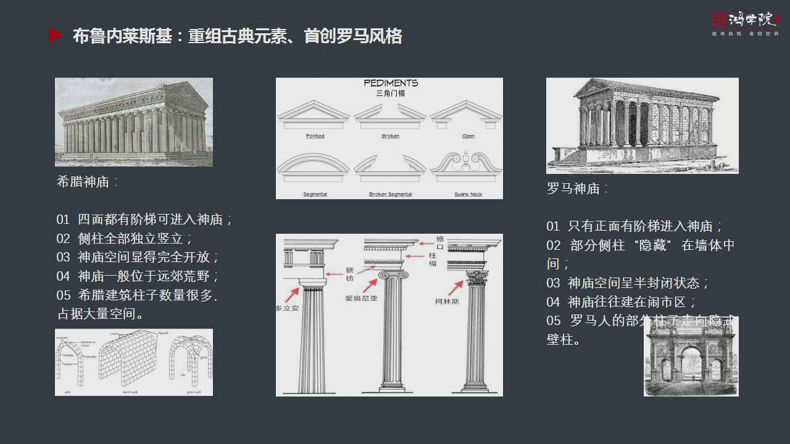

它更大的貢獻,是第二個,就是,第二大貢獻什麼呢?就是,重組了古典的建築元素,首創了羅馬的風格,這一點貢獻,那就太大了,影響全世界五百年,一直到今天的建築風格,在布魯內來司機之前,當然中世紀,我們知道更...

<strong>All subtitles</strong>

> 它更大的貢獻,是第二個,就是,第二大貢獻什麼呢?就是,重組了古典的建築元素,首創了羅馬的風格,這一點貢獻,那就太大了,影響全世界五百年,一直
> 到今天的建築風格,在布魯內來司機之前,當然中世紀,我們知道更早的古代,有兩種神妙,一種叫希臘神妙,一種是羅馬神妙,在古希臘、
> 古羅馬歷史上,希臘什麼樣,讓我想起了很多人說,希臘是古代歷史,是維史,或者羅馬歷史維史,我非常不認同這種觀念,因為什麼呢?它這套體系,不是某
> 一個人,或者某幾個人想去編,它就能編出來的,它需要不僅是證據上的顏色和風,而且包括理論體系的顏色和風,包括各種發展的,中國、
> 印度、波斯和羅馬之間的很多歷史是相互欠照在一起的,沒有辦法,在這麼符達體制內,你不改動其他國家的歷史,單獨創造一個歷史,這是做不到的,這是嚴
> 密的邏輯,比如說波希戰爭、波斯和希臘戰爭,希臘人,如果是全部偽造的話,那波斯人的歷史為什麼要記錄這一點呢?波斯人,那有波斯波利斯,你可以去看
> 古蹟,你有波斯人的傳統,有它的文字記錄,而波斯人又有印度,它的文字作為考證,或者有中國對於波斯的記錄作為考證,這是緩緩相套的,這個整個體系就
> 像區塊鏈一樣,不可能存在一個國家的歷史單獨偽造,其他國家的歷史能夠跟你顏色和風的可能性,我認為,凡是提出這種想法的人,其實就想判改互聯網,那
> 應該是區塊鏈大戰版的,這是根本做不到的事兒,包括我們去希臘羅馬看到這麼多古建築,你說那些東西都是平空後來修的,你想想看這是多大的工作量,誰來
> 做這個事兒,誰出這個錢,所以這種想法在我看來都是站不住腳,至少從邏輯上是站不住腳的,希臘什麼樣,左邊右邊是羅馬什麼樣,這兩者之間有什麼區別,
> 如果你自己看你會發現,希臘這個什麼樣,它的四面都有樓梯,四面有樓梯就是從各方向都可以進入審電,但羅馬什麼樣,只有正面有樓梯,其他三個方面都沒
> 有,說明在古希臘人人更平等,每個方向都可以進入什麼樣,但在羅馬就不一樣,它是高度專制的,它是羅馬帝國,大家只能從一個門上進,只能從一個方向進
> ,第二個不同,我們看希臘什麼樣,它四面全是柱子,希臘人覺得可能,老覺得這個柱子不夠結實還是怎麼著,他們的柱子特別多,特別密,而且四面柱子全部
> 都是獨立的,羅馬就不一樣了,羅馬柱子要用的少一些,而心裡會看到,它這個審電後來部分有很多審電,它已經氣成強了,把柱子隱藏在強中間出現了隱形必
> 住了,這樣一種感覺,第三個不同,希臘這個什麼樣,是四面都開放的,好像一吹風,四面都露風,羅馬的審電,它是半封閉的,後半部分是封住的,還有,希
> 臘審電一般處於遠焦區,而羅馬什麼樣,基本都在鬧失區,當然還有柱子的問題,希臘而柱子用得多,羅馬柱子用得偏向隱性,如果我們把希臘羅馬這些建築元
> 素提煉出來的話,你會發現它包括幾個元素,古典建築首先是上面,都會有一個三角門梅,就是三角鵝,三角形狀的,有些是全封住,有些半封住,還有一些其
> 他的形狀,桃園形等等,然後下面一定要有羅馬柱,其實是希臘柱,這個柱包括幾個部分,柱體就是柱子本身,還有柱頭,柱頭部分很重要,比如說三種柱頭,
> 多聯形,艾奧尼亞還有柯林斯,三種不同的柱形,多聯很簡單,基本就一個圓圈沒什麼調適,艾奧尼亞就出現了汙旋,柯林斯就變成非常複雜的,這種雕蓮化動
> 的,這種非常複雜的,這種花式,當然在柱頭和房額之間,在房頂之間,還有一個過渡區,這個過去包括最上層的眼口,包括柱梅,包括鵝房,柱梅就是我們看
> 到上面會有一些雕塑,或者會有一些繪畫,等等,這兒它的柱子中間的主要的一些藥塑,當然還有我們看到窮龍頂,就是我們看到右下角這個萬神念,羅馬萬神
> 念,你會看到窮龍頂,還有看到凱旋門,它是個鞏石結構圓形和鞏形,這是羅馬和希臘建築,這是羅馬建築一大特色,還有左邊你會看到,房頂它會有這種圓狗
> ,會有統型的房頂,會有這種交叉型的,交叉統型的房頂等等。布魯內萊斯基,他最大的貢獻,是從古代建築提取了諸多的這種建築藥塑,把它進行重組,按著
> 現代生活進行重組,例如三角門煤,這個東西大家看起來是很熟悉,但是,這是布魯內萊斯基首先創造,把它一個正面取出來,而不取其他面,只取它的正解面
> ,形成的就是下頁我們看到的羅馬建築風格,就是中間這幅圖,這幅圖的典型的設計風格,

---

### Slide 19

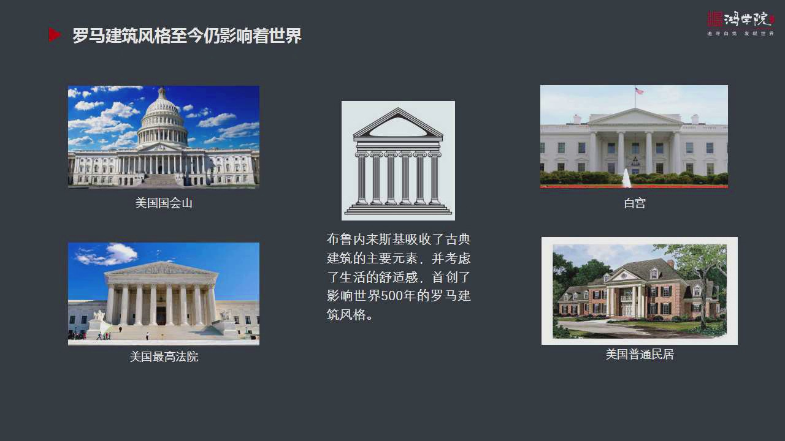

這是布魯內萊斯基提練出來的,它吸收了古典建築的全部藥塑,考慮到生活舒適感,不能做到什麼樣裡面,做得很不舒服,而搞出了一種全新的這種創造,我們現在看到的所有羅馬建築的風格,其實都是布魯內萊斯基的,它最先...

<strong>All subtitles</strong>

> 這是布魯內萊斯基提練出來的,它吸收了古典建築的全部藥塑,考慮到生活舒適感,不能做到什麼樣裡面,做得很不舒服,而搞出了一種全新的這種創造,我們
> 現在看到的所有羅馬建築的風格,其實都是布魯內萊斯基的,它最先進行進行的整合,所以它的建築風格影響了世界五百年,特別是歐洲,美國建築五百年的歷
> 史,基本上都受它的影響,如果我們看,美國現在建築向美國國會山,美國國會山不就是個萬人電嗎?前面是一個羅馬的三角門煤,加上羅馬立住,然後背後是
> 外神電的窮頂,只不過它窮頂比較高,變成國會山,我們再看右邊白宮,白宮是個非常典型的羅馬建築,三角門煤加上四根愛爾尼亞駐頭,再加上四根駐的,非
> 常典型的羅馬建築,還有美國最高法院,這也是典型的,三角門煤加上四根駐的,基本上你到美國首都皇上論,凡是有點苦,有點歷史傳承的城市,基本上政府
> 建築都會採用羅馬式建築,因為美國人認為自己是羅馬帝國的繼承者,如果我們看美國普通家庭,比如說福基尼亞這個地方,這位一走,你會發現這個大量的居
> 民主家,全部是採用羅馬式的建築,你看三角門煤,四根立住,就是右下角,這是普通民居,大概看起來都這樣,當然了,其實我們如果仔細看,如果對這些藥
> 素建築非常敏感的話,你在北京,比如說我在北京就看到好幾個襲擊中心,從外表上看,就是羅馬建築,為什麼?因為襲擊中心老闆認為,羅馬上在洗澡嘛,所
> 以我們高襲擊中心也搞成羅馬式建築,三角門煤加幾個大駐子,所以如果你仔細看的話,在國內很多建築中,也可以發現,布魯諺安斯基章是留下的深刻印象,
> 這是第二個貢獻,當然這個布魯諺安斯基搞成了這個之後,它有大量的創新的東西被,當時那個時代人所消化,其實發展出了更多的眼神,一些新的這種建築的
> 藥素和風格,所以說整個那個時代是建築大師人才被出的時代,比如說,所以左上角我們看到,

---

### Slide 20

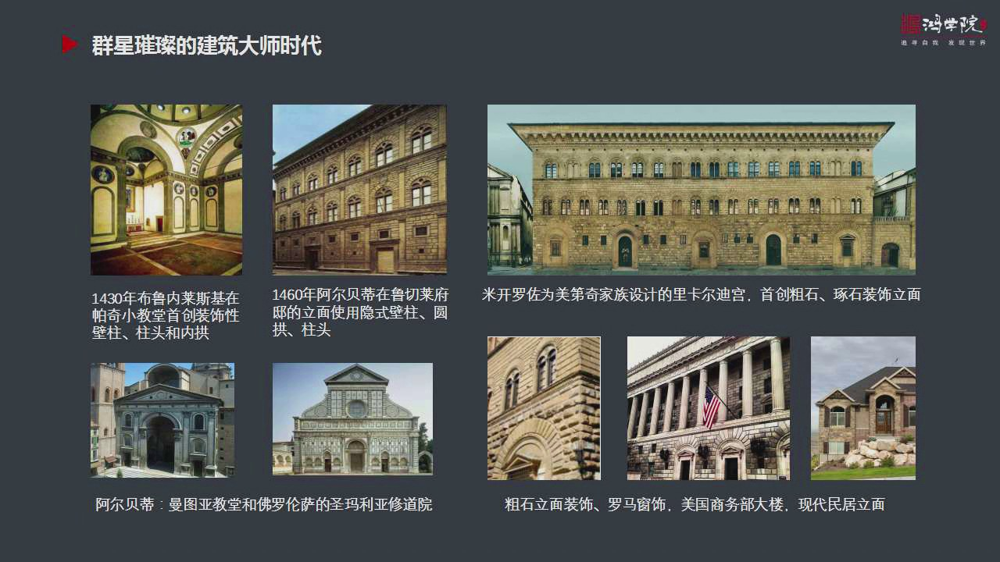

布魯諺安斯基,它給怕其一家族,就是一一四七八年,某反那個家族,這是在某反之前,給他們家族搞了小教堂,你會看到,在它這個小教堂內部的裝飾中,布魯諺安斯基已經把這種壁鑄的概念,已經完全從支撐的力鑄上,已經...

<strong>All subtitles</strong>

> 布魯諺安斯基,它給怕其一家族,就是一一四七八年,某反那個家族,這是在某反之前,給他們家族搞了小教堂,你會看到,在它這個小教堂內部的裝飾中,布
> 魯諺安斯基已經把這種壁鑄的概念,已經完全從支撐的力鑄上,已經把這個給抽象出來了,變成一個純裝飾性的,隱藏在牆壁中間的不沉重的,僅僅是裝飾了這
> 麼一種壁鑄,包括它那個窮,窮的這個,包括它那個圓骨,你也是純裝飾性的,然後它在室內所做了一切的這種羅馬藥素的裝飾,全部是用於分割區間的,分割
> 室內空間的,這是典型的現在的這種室內裝修和室內的整部局的一種特色,這都是布魯諺安斯基的手創,然後我們看到這個第二幅,1460年2,這個二倍地
> 在努切來家族,福底中使用的羅馬藥素,努切來家族就是我以前講,講到的那個染色家族,就從李翻特把這種第一竹一回,引回到了這個佛羅倫薩,然後開始染
> 料,然後開始提煉紅色染料,紫色染料,變成了個超級富有的家族,這個家族我們現在去佛羅倫薩,他們家族還住在這個樓裡,這是非常非常讓人震驚的,就是
> 經過幾百年,在我們中國早就不知道家族簽哪去了,但是在佛羅倫薩在很多意大利的城市,幾百年和現在,它的家族還是同樣家族,這個富有家族還是那些人,
> 住了還是住了他們以前的房子裡,所以非常非常的不一樣,它的傳統性更強。如果我們看,這個二倍地,它設計的努切來的福底,你會看到一層二層三層,這是
> 整個羅馬,就是當年的羅馬這個鬥爽廠的那種標準設計,第一層你看它的柱子,它這個柱頭都是多聯繫的,第二層是埃爾尼亞的第三層是柯林斯的,這些柱子都
> 隱藏在牆壁中間,我們看到布魯內拉斯基,它在很多羅馬風格中已經手創了這個思路,在內閉,在內裝室上手創了,二倍地是把它用在外裝室上,立面裝室上,
> 然後隱形閉住之間有緣狗,然後有烏爺,一層一層的,所以我們看到這是個點形的羅馬建築,不過把它隱藏,隱藏在牆壁之中,最右邊我們看到米,米開羅左,
> 因為美帝齊家族設計的這個立卡爾迪宮,它這個立卡爾迪宮也是非常有特色的,這個立卡爾迪宮,如果我們看放大,下面一排從右邊屬第三個,底下的石頭是非
> 常粗糙的,上面石頭是比較精細的,這是粗石裡面裝室,然後它在窗口和門郎的上面都有一個三角門梅,這是點形了羅馬,羅馬時代的要素,這都是不如內來司
> 機的這種手創,你會看到它現在對現在建築的影響,比如說美國商務部在這個樓,美國商務部這個樓面我工作過很長一段時間,以前真的是沒有注意到,現在研
> 究了佛羅登山歷史之後才發現哇塞,美國的主要政府基本上是一個思路,它下面是比較粗的這種,當然它不是那麼粗,比較的,但是它這個概念是一樣的,是比
> 較粗的,講到大石,上面是比較細的石頭,你會看到,美國商務部這個門,它這個孔形,包括三角門梅,這是跟美梨基加族跟米克朗,米克朗羅左,設計這個美
> 梨基加族供電是一樣的,包括它粗石的概念也是一樣的,包括上面的羅馬柱,都是當年的東西,可以說你研究完建築史,然後你四面一看,不管歐洲還是美國這
> 個建築,你馬上可以從中發現大量的藥素,是源於誰是誰,誰是手創,誰是把這東西拼在一起的,集成者,然後你會發現,原來美國人做的這些事,或者設計這
> 些建築,跟歐洲比起來,哇塞,那還是太刪債了,然後當然這就是開玩笑了,我們再看這個最第二行,最右邊這張圖,這是美國家庭,一萬很多家庭的那個住房
> ,它的一個典型的立面設計,就是除了磚之外,它會中間會有一片的石頭區,這屬於當年米克朗左開創了這種,粗石和著石的裝飾立面的設計風格,它會有一面
> 牆,或者牆了一個局部,往往是在下面,或者門鞏部分,全部用一些很粗的石頭來裝飾,如果我們不懂的話,其實說哇塞,這為什麼不用光花大理石,這個大理
> 石的立面呢,怎麼會用石頭這麼醜呢,好家荒,那就是顯然是沒有藝術石,沒有這個歷史知識的常識,所以我們要訓練自己的眼睛,首先要訓練自己的大腦,你
> 才知道什麼,它是有歷史傳承的,它為什麼當年這麼幹,是誰最早這麼幹的,所以你會現在看到歐美的很多建築,或者看到我們國內很多建築,你不會吃驚,或
> 者你會覺得不能理解人家,為什麼搞一些粗道石頭的牆上是不是很難看嗎,應該全不搞光花大理石,那就吐了,我們再看這個第二排的左邊兩張圖,一個是主要
> 是二倍地的,二倍地的兩個,你看它一個是漫圖鴨的教堂,從漫圖鴨的教堂,你會看到這是個典型的,這跟歌特是建築完全不同,典型的羅馬建築要素,三角門
> 煤,然後柱子,底下四根柱子是隱藏的牆壁面,是隱形壁柱,然後是圓鞏,這個圓鞏就像凱旋門那種圓鞏一樣,這都是羅馬經典的羅馬文明,所以它叫文藝復興
> ,基本上完全不用這種歌特式的,高調式的線條的,那種比較抽象的這種色彩,它全然不用,基本上都是現代的,都是這個經典的羅馬的這種建築要素,其實你
> 過了這麼多年,你反過來想,如果現在我們在城市中看到一個歌特式建築,你會覺得非常非常便宜,很不習慣,但是你看那個羅馬式建築,你覺得很自然,就是
> 三角門煤家僅能立住,這非常非常普遍,但是如果說周圍拿個家庭修了一個房子,是歌特式建築,哇賽,你覺得這個看起來確實是很好看,如果我們在看這個,
> 第二排的中間這張圖,這也是二杯地設計的,佛羅人薩聖馬利亞修到月,你會看到它是兩層,上面那層是個典型的羅馬式建築,三角門煤四根立住,關鍵是上面
> 跟下面中間的連接部分它怎麼處理,如果說不加上左右兩邊,我選的這個花圍,你會看到這個房子會非常非常難看,就是直接處在一層的樓頂上,這要多難看有
> 多難看,但它加上兩個非圓,也就是說我們所說的,我選的這樣一種形狀,加了兩側,整個這個建築看起來就混亂一體,沒感覺非常的強烈,這就是二杯地所做
> 的一個獨創性的東西,以後我們看到歐洲的很多建築,都有這個我選式的非圓,都是為了解決裝飾問題的,好,我們再看下頁,這就是幾核透視法,幾核透視法,在我看來是繪畫藝術史上的一個重大突破,

---

### Slide 21

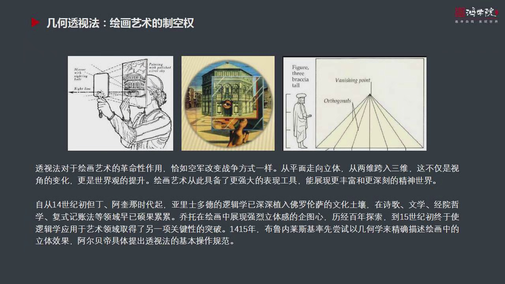

可以說是繪畫藝術史上的智空權,這是誰發明的,還是部輪內來四季,所以部輪內來四季有三大發現,三大重要貢獻,除了那個大房頂,窮樓頂,那是世界十大建築奇蹟,那是一個具體的作品,就像米克朗基羅的大衛王,那是個...

<strong>All subtitles</strong>

> 可以說是繪畫藝術史上的智空權,這是誰發明的,還是部輪內來四季,所以部輪內來四季有三大發現,三大重要貢獻,除了那個大房頂,窮樓頂,那是世界十大
> 建築奇蹟,那是一個具體的作品,就像米克朗基羅的大衛王,那是個具體的作品,它可以流傳版式,但是,除了這個之外,部輪內來四季還手創了羅馬建築風格
> ,這就影響了五百年的建築史,更重要,它提出了手創了幾核透視法,這個東西就太厲害了,這留下的方法論,影響著後世所有畫家的基本訓練和他們的世界觀
> ,如果沒有透視法,繪畫就是兩圍的,平面的,沒有立體感,這就好像軍隊打仗,你只有部輪在地面上打仗,當你進化出空軍,空軍將會決定戰爭勝負,它在很
> 大程度上空軍的壓制和打擊作用,在對戰爭的進程影響巨大,所以軍事藝術從平面走向立體,是靠空軍制空權壓倒了一切,那麼繪畫也是一樣,你從兩圍走向三
> 圍,那就必須得靠幾核透視法,沒有透視法就像作戰沒有空軍一樣,那你根本沒法打仗,也正是由於你能夠在平面中,兩圍中間展現三圍這種立體感,才使你能
> 夠有更強大的工具,去描述自己的這種精神狀態,去輸發自己的內心的感受,你就工具才會變得非常強大,沒有工具,你連表現的方式都沒有,所以我們看到,
> 為什麼幾核透視法,它會出現的佛羅倫薩,它是有歷史原因的,首先,我們以前這個課程中講到14世紀初的彈丁,阿葵納那個時代,亞里斯多德的邏輯學,就
> 已經深深地執入了佛羅倫薩的文化圖長,比如在十個中彈丁的神曲,就是個高度邏輯化的東西,包括文學創作,比特拉克的十四行詩,你會看到非常非常的精密
> ,你會看到這個阿葵納的精願哲學,它是一套完整的邏輯體系,用邏輯學來產生上帝存在的原理,就是讓邏輯學來把這個神學的體系給總之在一起,這形成了精
> 願哲學,富士機上法,我們也講過富士機上法,是邏輯學用於財務,用於商業上的典型論一個案例,也就是說它是高度標準化的,高度邏輯性的,這樣一種商業
> 通用語言,沒有這種語言,你就根本就對立論的概念就完全模糊,你根本不能體驗出精確的立論的概念,思想結構就構不成,以立論為中心來驅動整個經濟發展
> ,資本主義就無法發展,所以我們看到,佛羅倫薩,為什麼他具有這樣的一個發明幾個投資法,他這樣的一種文化圖長,就是因為他以前已經做了百年的鋪電了
> ,那麼在十四世紀初這個橋脫,為了畫家橋脫,他第一次在試圖,想在平面上展現立體的效果,但橋脫那個時候還沒有琢磨清楚,他只是平感覺化的,我想通過
> 黑暗和陰影的部分,光線,然後來突顯出中間是有一定具體感,但怎麼表達才準確,他自己並不辛苦,並沒有完全掌握,只是看著比較像立體的,但是你要真要
> 用科學的方法去仔細叫,去仔細測量的話,他一定是不準確的,那怎麼辦,所以,佛羅倫來世紀他解決了這個問題,他是在一次15年,首先提出了用幾何學的
> 辦法,來畫這種立體的東西,比如說我們在圖上可以看到,佛羅倫在世紀當時,他用了一個鏡子,在鏡上弄個孔,然後通過這個孔來看對方,來看遠處的,比如
> 說洗禮堂,他的建築什麼樣,然後,把它畫好,畫在這個畫面上,然後對面再放另外一個鏡子,把對面的建築完全擋住,然後,他的眼睛通過這個孔來看,鏡子
> 上,他畫了這個東西,畫了這個洗禮堂,是不是跟珍惜堂一模一樣,如果不一樣,說明他的透視法沒用對,所以他提出一種全新的,在平面上進行幾何以幾何的
> 精確性,進行做圖的一個方法,但是他這個方法比較複雜,後來這個二倍地,我們跟他所說的設計的,路線來加足了設計師,他就提出了,所有的藝術家都非常
> 容易掌握這個辦法,這就是用消失點,消失點來進行幾何透視的一種畫法,比如說,怎麼畫呢,在右邊這張圖上,一個人升高,比如說是三個格,好,用他的升
> 高,作為一個拉一條水平線,把這個水平線的中心作為消失點,然後把底下,六等分為,就是作為一個六等分為,每一個格,相當於這個人體升高的三分之一,
> 好,然後把這幾個點,全部連到消失點上,這個就是相當於你一個人,站在窗口,看到語言處,那個消失的位置,你大概就看出的是這個效果,注意,他中間最
> 重要的是,你不管怎麼畫,必須要嚴格按照這個消失點的,這種幾何學的精確,就是才能夠保證你,畫傳立體是真實的和準確的,所以繪畫藝術在我們看,不就
> 是畫家隨便畫嗎,我想怎麼畫就怎麼畫,好,接下來中國很多國畫,他其實是沒有立體感的,他實際上是沒有真實的幾個透視的,因為你要真拿齒子量,他肯定
> 是不對的,這個我們在想,其實很多很多人都認為,藝術的東西是隨意的,但是你會看到,佛羅倫散人所奠定的現代藝術,所謂文藝復興運動的這種技術,包括
> 現在,這是現在藝術的基礎,它是建立在高度嚴密性上,包括幾何的嚴密性和邏輯的嚴密性,必須要首先符合這個,否則你叫什麼藝術家,像布隆內來斯基這些
> 人,它都是數學家,要不然你這個樓頂怎麼蓋得上去,平空拍腦門,這是做不到的,所以我們看到,幾何透視法在繪畫中,其實是掀起了一場大革命,改編了整
> 個文藝復興運動以後的全部歷史,一直引導今天所有美術學院的這些學生,上來你就得畫,一個透是臉,兩個透是臉,三個透是臉,五個透是臉,或者幾個透是
> 臉,這是一個基本功,你要連這個基本功都沒有,你就不可能把畫給畫對,好,我們看下一頁,所以我們看到第一批透視大師出現的時候,震驚了佛羅倫散野,

---

### Slide 22

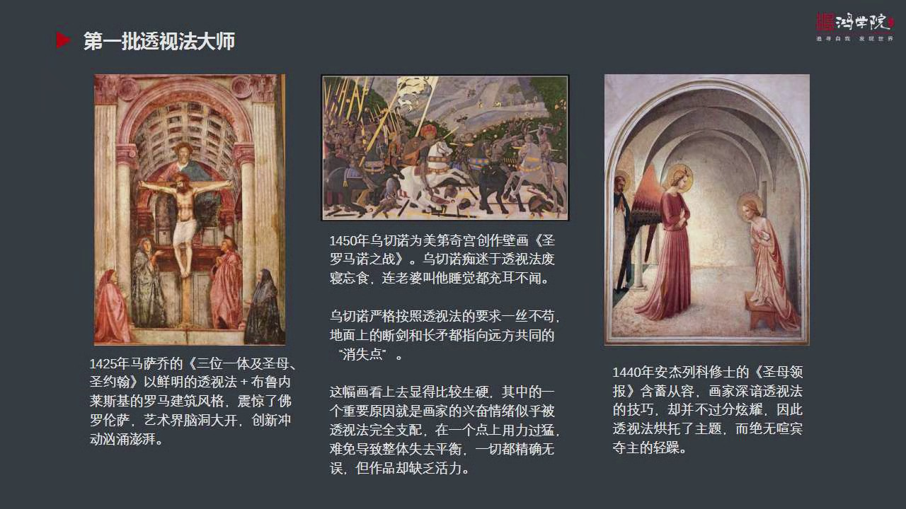

震驚了整個歐洲藝術界,沒見過這種畫,比如說第一批,用布魯內萊斯基幾何透視法做畫,就是馬薩喬,我們看到這幅畫,1425年的,三位議題及聖母和聖約翰,我們可以看到,這幅畫給人一種強烈衝擊,這個好像是在牆上...

<strong>All subtitles</strong>

> 震驚了整個歐洲藝術界,沒見過這種畫,比如說第一批,用布魯內萊斯基幾何透視法做畫,就是馬薩喬,我們看到這幅畫,1425年的,三位議題及聖母和聖
> 約翰,我們可以看到,這幅畫給人一種強烈衝擊,這個好像是在牆上做那個洞,這個洞是往深處在走,所以你可以看到這個牆上,這個洞中間的很多天花板,它
> 的消失點是非常精確的,如果你拿齒子糧,一定會指向共同的消失點,這個就是馬薩喬,第一次使用幾何透視法,畫的第一批的這種畫,給人的感覺就是非常逼
> 真的立體,這比當年喬托這個立體感,喬托那平感就畫的,這個是平數學的精確,幾何學的精確畫出來的,一透視法畫出來的這種圖,那這個對人的震撼可以說
> 相當的巨大,以前從來沒見過,好家會一看牆上這個畫,以為牆上有個大洞,有個窮龍深進去的一個很深的教堂,然後李耶蘇掛的十字架上,背後是聖復,然後
> 前面是聖母,還有聖約翰。好,這樣的圖,對於中世紀人看到,第一次看到,他會覺得非常非常有震撼力,這就是繪畫藝術,通過一種三位的辦法,通過一種立
> 體的辦法,能夠使人們這種宗教的情緒,和各種心理情緒得到極大的深化,極大的這種深華和深化,好,所以,為什麼藝術的形勢很重要,沒有這種新的形勢突
> 破,你都沒有這樣的工具,你都不知道怎麼表達自己的情感。中間這幅畫,這個是無切弱,無切弱是一個,你會看到所有的話,基本上都跟美麗其家都有關係,
> 無切弱也是其中之一,無切弱也是非常迷戀,幾個透視法的,可以說達到了招迷的程度,他有一次為美麗其工做一個壁畫,就是盛羅馬諾之戰,我們看到這幅畫
> ,盛羅馬諾之戰,他畫的是當年1432年,而比其家族帶領佛羅倫薩,打敗了對手,描述是一個戰爭場面,這個戰爭場面,你會看到他這幅畫,非常有特點,
> 他這幅畫是可以說無切弱的人已經完全沉迷在了幾個透視法中,難以自拔,他就覺得這個東西太生氣了,他的所有的,如果你仔細看這個無切弱,他是用一種極
> 大的熱情在表達對幾個透視法的一種崇拜,你看到地上的所有段刀,段件還有那種長槍,全部都指向遠處的共同消失點,一點都不太差的,他是拿尺子畫的,所
> 有畫家都得拿尺子先畫,拿尺子先比,先把這個草圖做出來,然後再往上畫,不是我們想當然的,我覺得這個立體就行了,所以你會看到無切弱他這個人,他是
> 非常意思不狗的,也正是因為這個原因,所以他這個畫顯得比較生硬,遠處比如說,遠處那些作戰的人嘛,他到底是距離多遠,多遠他跟我們現在這個比例,應
> 該是幾比幾的關係,躺在地上那些人,他的腳的長度比我們近,他應該大一些,他的手應該領我們遠些,畫這個比例對不對,只要求數學的精確性,一點都不能
> 唱,否則立體就不強了,但他立體感是很強,給人的感覺是比較生硬,主要原因是什麼呢?就是無切弱這個時代,應該說是剛剛掌握透視法,每個畫家都非常的
> 瘋狂,但是由於你對這個點太執著,你至於你對他整體的佈局和,比如說這個生動性,活泛這方面就不太重視了,我們再看右邊這張圖,右邊這張圖是一次40
> 年,安傑立科,他是個修飾,他畫的是一個聖母領暴,聖母領暴就是加百里天使,告訴聖馬利亞說,你懷了耶穌了,好,這部畫你會看到,安傑立科修飾,他是
> 一個非常內臉的人,他其實已經掌握了透視法,你比如說我們看他,整個叫他了縱生感,他窮窮的縱生感,可以很明顯發現,他掌握了透視法,但是他並不張養
> ,這個就是他跟無切弱非常不一樣的地方,境界不同,他不是炫耀,不是為了展現我會透視法,我就把它畫得特別特別立體,然後上所有人都發現,原來你懂透
> 視法,他不是這樣,他的透視法是用來轟拖整個畫的主題,而不是學民多主,所以這個安傑立科的所有的畫,你會發現,他畫得非常淡,這種淡是,他非常淡畫
> 他的技巧,而主要突出主題,他的所有的技巧使用是為了突出他神生的主題,就像他這個聖母領暴,他畫的所有畫都一樣,安傑立科也是深受美麗加族欣賞了一
> 個畫家,安傑立科這種人就跟其他人不太一樣,他想到這種聖畫的時候,在做畫之前往往是,可以說新潮起伏,痛哭流替,情緒非常激動,然後才能進入那種繪
> 畫狀態,而且畫出來的東西給人感覺,他內心的純淨和內心的宗教信仰,前程,你通過他畫就能感覺出來,我們再看下一頁,這個透視法也會帶來一種新的矛盾,

---

### Slide 23

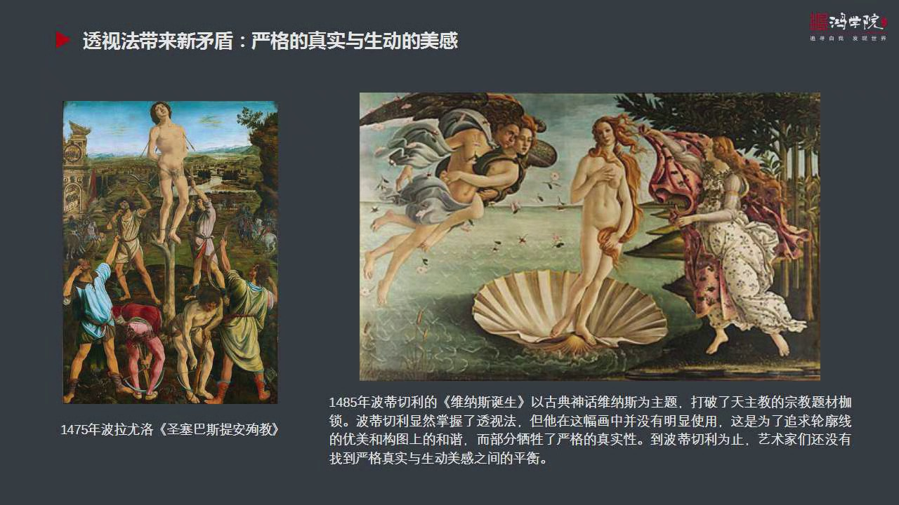

這種矛盾是什麼呢,就是太真實了,他就跟美感相矛盾,相衝突了,解決不好,很難解決這個平衡,例如1475年的,布拉郵洛,布拉郵洛這個畫呢,聖塞巴斯蒂安尋教,他就畫了問題出在哪了,如果大家自己看的話,他是按...

<strong>All subtitles</strong>

> 這種矛盾是什麼呢,就是太真實了,他就跟美感相矛盾,相衝突了,解決不好,很難解決這個平衡,例如1475年的,布拉郵洛,布拉郵洛這個畫呢,聖塞巴
> 斯蒂安尋教,他就畫了問題出在哪了,如果大家自己看的話,他是按著幾核透視法,把遠近背景特別是偷測卡納這個,這個遠處的山水,畫得很逼真,然後這個
> 樹、山,距離也對,按著偷視法的原理來看也對,但是他把這個人畫的這個釣到樹上,你會看到這個圖,並沒有原因,前面是個六個櫃子手,站得太規則,所以
> 這個東西會看顯得很矮板,但是畫家也注意到這個,所以他把每個人的形狀,身材還有他這個姿勢,做了一些調整,兩兩相對應,前面兩個人向前,側面幾個人
> 都用不同的形狀,來處理這種僵硬,但是整體看得還是不太舒服,你如果按著幾個偷視法,就必須要把人畫的真實,但是你要把人畫真實,謹畫的真實,它就構
> 圖就麻煩了,它就沒有辦法展現那種優美的構圖,古代畫之所以構圖很優美,它是不講究人的真實大小的,也不講究背後的這個遠近關係的,不講究謹聲的,所
> 以你愛怎麼放就怎麼放,現在不一樣了,那麼如果說這幅畫,完全不畫背景的話,比如說以目部作為一個背景,整個的效果又會變得非常差,畫家在這個面上糾
> 結了很久,那麼另外一個極端就是又不要這幅畫,這個是玻璃切裂的維納斯誕生1845年化,玻璃切裂也是跟美麗加度關係非常深的一個人,然後你會看到玻
> 璃切裂它畫的,為什麼畫維納斯呢?因為當年中世紀的時候,以前大家都是畫基督教的題材,含傷有人畫一教圖的題材,如果我們現在看,我們覺得很自然,但
> 是你要回到14幾年,如果有一個畫家畫出非基督教這種題材,而且畫的是羅馬希臘時代的這個神話,這個可是大地不到的呀,所以我們現在要理解當時的這幅
> 畫的重要性和革命性,必須要回到當時那個時代,它是古點的希臘人畫維納斯的誕生作為主題來進行創作,這首先在題材上就是重大突破,以前含傷有人敢這麼
> 畫,也只有唯一復興的佛羅倫薩有這種寬鬆的氣氛,而這個玻璃切裂你要看其他畫,你是知道玻璃切裂早就掌握了,即可透視吧,這已經發現了其他十年了,所
> 以它掌握一點都不稀奇,但是它在這幅畫中卻沒有使用,沒有明顯去使用幾個透視法,所以你會看到這個人維納斯和背後的樹,還要大海,你會看到他們中間的
> 這種立體感不像,不像左邊這樣塗這麼明顯,也不像其他的那些幾個透視法搞得那麼明顯,為什麼?就是因為玻璃切裂它追求的是美,它認為真實性必須要放到
> 第二位,美也是第一位的,我構圖美這是最重要的,真實性必須要服從於這一點,而左邊這樣塗你會發現,它把真實性強調到極致,就是這個玻璃有落這些人,
> 包括我們講的無切落也是這種人,它要強調真實美這東西放到測養,但是另外一個極端,就是我要強調構圖美,我要強調曲線美,我要強調這種輪廓線的優美,
> 我必須要犧牲真實性,所以你自己看這張圖,你會發現玻璃切裂畫的維納斯,看的是很美,但是自己看它是有問題的,給它的脖子,它脖子的形狀就很怪,還有
> 它這個,應該說組間的肩膀跟身體,這個接法和它比例都不對,但是整體的感覺你會發現美到了極致,其實就是義大利化派,就是南方化派和北歐的那些北部化
> 派荷蘭,什麼這些人畫了最大的不同,那邊人畫的都缺乏美感,但是非常精確,非常的寫真,而南方化派他們非常強調的,就是幾顆都是吧,然後優美,輪廓夠
> 圖,非常強調,所以你看這個畫,就知道大概是南方化派,還是北方化派的這個畫家所做,我們再看下一,除了這個之外,還有些新的嘗試,

---

### Slide 24

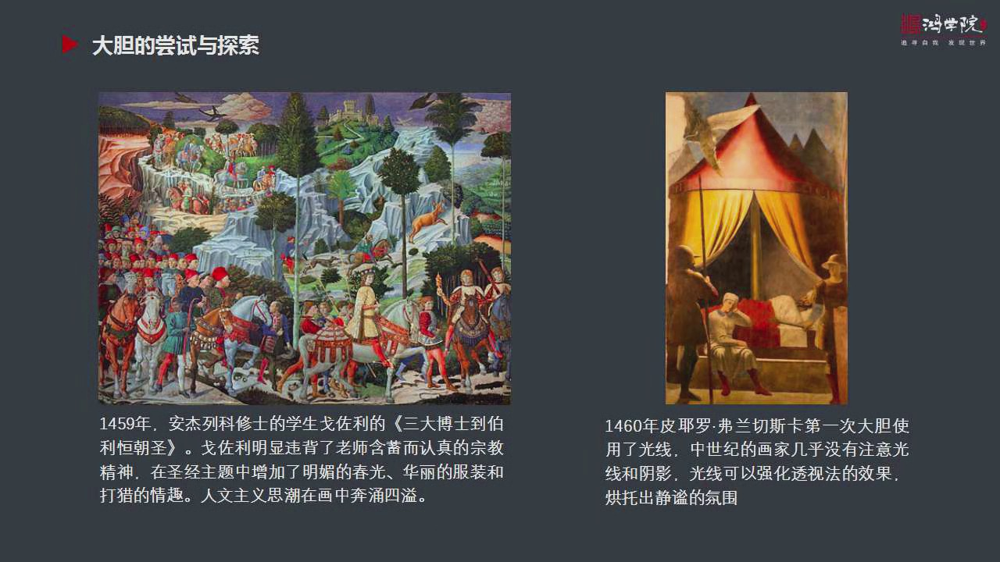

這些新的嘗試,比如說左邊的歌左力,歌左力,它就是安吉利科修飾的學生,這幅畫呢,它畫的是三大博士到玻璃層嘗試,這其實是個宗教畫,就講這個聖經,聖經當年講到了耶穌誕生的時候,有三個博士到玻璃層來嘗試,但是...

<strong>All subtitles</strong>

> 這些新的嘗試,比如說左邊的歌左力,歌左力,它就是安吉利科修飾的學生,這幅畫呢,它畫的是三大博士到玻璃層嘗試,這其實是個宗教畫,就講這個聖經,
> 聖經當年講到了耶穌誕生的時候,有三個博士到玻璃層來嘗試,但是它其實在這幅畫中,畫的博士那個時代的事兒,對它這幅畫真實用意有好幾種不同的解讀,
> 一種說它就是當年講聖經的故事,還有一種說它實際上是展現,弗洛倫散的生活,其中包括這三個起碼的博士,其實都是美地西家族的,比如說最右邊就是美地
> 西家族的人,比如說這可能是客氣墨,或者是洛倫族等等,然後這中間是旁邊又是誰,比如說可能是拜誕廳的皇帝,拜誕廳的這個還有牧首等等,因為當時確實
> 拜誕廳的這個牧首和皇帝都到過弗洛倫散,這是一種解讀,還有一種解讀是對中世紀的生活,一些日常性的一些表現,比如說背後有一些打裂的春油的這樣一種
> 圖案,可以說中間最有意思是歌左力第一次把自己畫進了圖畫,這個是凱天批地的,就是畫家把自己相當於有個簽名,中間有一個人腦門上寫著歌左力,如果大
> 家把這張圖放大的話,放鬆進能夠看得到,這是繪畫史上還是手創的,所以我們現在所講到的這些畫而這些人,它一定是具有手創精神的,然後我們才往上放,
> 有了這些作為時間的標記點,你再看另外一幅畫,你就知道比它早還是比它晚,如果它沒有用幾個透視法,我們就知道它肯定是要麼這個人不懂,如果它完全不
> 懂的話,它肯定是馬薩喬之前的,就是1305年之前的話,如果它明顯採用透視法,它就一定是1305年之後的,或者說馬薩喬1425年之後的畫,因為
> 我們知道1415年,不如內臺司機剛剛提出幾個透視法,所以在這個提出之前,是不可能有幾個透視法的標準畫做存在的,如果有,就是在這個實驗之後,這
> 就是一個標定法,如果看右邊這張圖,右邊這張圖是這個Piello,Filancheska的一幅非常有名的話,這幅畫它的革命性合在,它原唱性合在
> 呢,第一次非常非常強調光線,它是第一次隱住光線這個概念,而且把它放到了突出位置上,以前,比如說喬托那幅畫,它也有陰影,但它並不是強調陰影,它
> 強調是立體感,但是這個Filancheska這幅畫,它把光線做為了第一強調的這種重點,你會看到,講的是軍事坦林大地,當年在一次大戰之前做夢,
> 我看到了上利給它通過天使,給它代畫,說如果你信仰我們基督教,那麼你這場戰爭就會勝利,軍事坦林馬第二天,就發下這個誓言,說如果我們今天打勝這場
> 非常兇嫌戰爭,我們就全國轉向基督教,這就是共演330年前後,這樣的一場,就是坦林大地轉,就是基督教立國的這樣一個非常重大的歷史事件。
> 那麼你會看到這幅畫中間,天使通過背著小翅膀,從天上,從上面飛下來,背後這個帳篷,它是一個潛烈的一個反光,反光的地方,你會看到通過這個帳篷的這
> 種反光,透視出前面兩個衛冰,它的頭盔,包括它這種距離感,它第一次突出了光線,把光線做為最強調的東西,來營造出一種神秘的氣氛,或者叫靜密的氣氛
> ,有一些神秘色彩,更重要是它通過光線,加強了幾何透知法的效果,這幅畫是按著標準幾何透知法畫的,它本來就有立體感,但是你強化了光線之後,它這個
> 立體感更強,所以你會看到這幅畫以前是沒有人這麼用光的,沒有人這麼用光和色的,這幅畫以後,你會發現基本上每個畫家在使用光線的時候都受到了,芬蘭
> 茜斯卡這幅畫的影響,這就是它的基因,是在這個時候墊墊的,我們再看下一頁,其實除了這兩人之外,除了建築和繪畫有之外,

---

### Slide 25

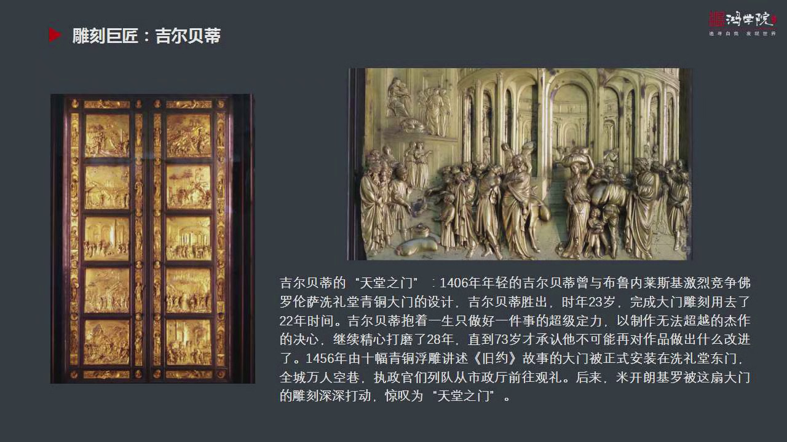

更重要的,或者說也是一個不可忽視的領域,是雕刻,雕刻這種巨降,你會看到像吉貝爾蒂,它就是一個著名的,應該說是那個時代最偉大的雕刻巨降,在弗洛恩薩有一個西立堂,這個西立堂的東門,就是我們左邊這張圖,這張...

<strong>All subtitles</strong>

> 更重要的,或者說也是一個不可忽視的領域,是雕刻,雕刻這種巨降,你會看到像吉貝爾蒂,它就是一個著名的,應該說是那個時代最偉大的雕刻巨降,在弗洛
> 恩薩有一個西立堂,這個西立堂的東門,就是我們左邊這張圖,這張圖是十幅畫,所組成的,講的是聖經舊約的故事,美幅畫講的是不同的故事,比如說有什麼
> 講納亞方舟的,有講這個約束亞,什麼什麼的,那麼這些聖經故事,如果我們把它放到它是,你會看到它中間那種銅板,就是它是青銅符雕,青銅符雕藝術做到
> 了非常非常令人陣經的這種精緻程度,就是我們看到右邊那張圖,這是中間一幅小圖進行放大,如果你繼續放大的話,你會看到它簡直是在這麼一個銅板情況之
> 下,能做出這樣的效果,讓人非常震驚,比如說這個畫中,首先我們看到什麼,我們看到吉貝爾蒂已經完全掌握了透視法,它背後的這個人和背後建築之間的關
> 係和,比如窮龍中間,窮龍之間背後的窮龍,它是完全是吉貝爾透視法的方法,來進行雕刻的,雖然是銅板雕刻,也用了吉貝爾透視法,所以它的美化的立體感
> 超強,以前我們說服雕,服雕就是有一些人物突出出來,這可以顯示立體感,但是背後服雕,背後的遠景怎麼提前它的立體感呢,即和透視法,能夠有效解決這
> 個問題,所以我們看到吉貝爾蒂這個人,吉貝爾蒂這個人,它是一個,我覺得它是一個什麼人呢,是一個非常有益力的人,它這個門,叫天堂之門,這個當年的
> 年輕時代,它20多歲的時候,吉貝爾蒂,這個吉貝爾蒂23歲時候,福倫薩對這個西里堂的銅門搞了一次,可以說是競爭吧,除了它之外,還有一個重要的競
> 爭者,就是布魯內賴司機,他們兩是爭這個話的所謂,用誰來完成這個回答的作品,當然後來選擇了吉貝爾蒂,沒有選擇布魯內賴司機,布魯內賴司機一路之下
> 就跑到羅馬去了。這個時候,這個吉貝爾蒂的人多大呢,23歲是個小年輕,但是它爆了一種信念,就是它一定要把這個東西做成一個極品,所以極品就是,無
> 論是自己還是別人都無法超越它的精美程度和藝術創造力,所以這就是哥們創作這十幅畫,用了段時間,用了22年時間,才完成這個所有的福雕的雕刻,完成
> 之後,它並沒有馬上交出去,因為它覺得,還有改進的餘地,每天都改,每天都改,每天都是名思哭响,怎麼才能把它改得更生動,每一點細節怎麼再改進,又
> 想了,又雕著多少年,又雕著了28年,所以這個福雕,這個十個大門,十幅畫,它用了50年的時間,精雕細桌,最後到73歲,它23歲開始接這個畫,到
> 73歲才完成,它實在是認為,我再也沒有任何改進的餘地了,這個事兒我已經做到極致了,不可能再有一點點改進的可能性了,它才把這個畫給交出去,當然
> ,這個事情在佛羅倫薩,是所有人都知道的,當這天安裝這個大通門,安裝到洗禮店的東門的時候,洗禮料廠東門的時候,五萬人空向,整個佛羅倫薩的執政官
> ,全部修價,不叫全部修價,排隊從執政官大廈走到這個洗禮堂,表示這種重禁,所以你會看到這個門裝上之後,一直到今天,最近好像剛剛完成修整,現在就
> 可以看了,這個門往這個洗禮堂,東門一放立刻是它其它幾個門,馬上就斷了時就失色太多了,所以後來這幫人就要求,西爾被地在幫助另外一個門也用它這個
> 辦法來重新來製作,也正是這個東門,它的清通服雕,使後來的米克朗基羅到了這個門一看,摩旺,像一看的雕刻的這種藝術水平,和這樣的經濟程度,讓米克
> 朗朗基羅大吃一驚,從此它就決心,要進行雕刻這種藝術的工作,所以它是被這個大門深深的感動了,米克朗基羅對這個門的評價就是,這是天堂之門,能把雕
> 塑,和這種背後的雕刻和背後這種宗教,結合了如此幾名,而是表達了如此生動,簡直是打開了通向,天堂的大門,所以這個級別地可以說是個雕刻的聚家,我
> 們再看下夜,除了它之外,其實這個時代出了太多太多偉大的藝術家,比如說東納太羅,東納太羅就是達分歧的祖師爺,

---

### Slide 26

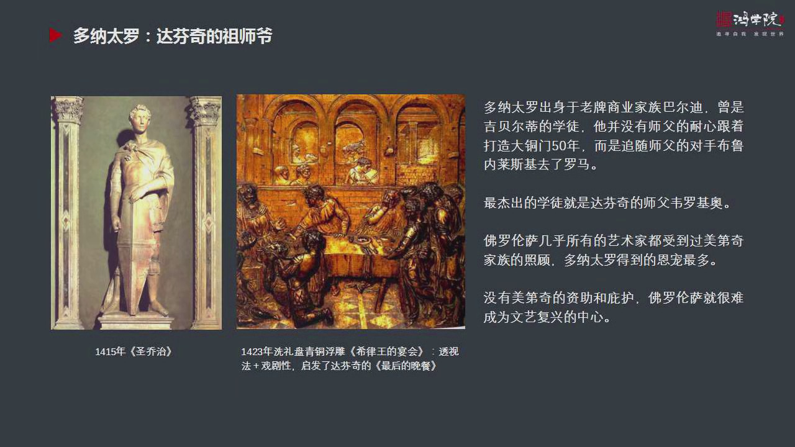

達分歧的祖師爺,為什麼說這麼說呢?因為東納太羅它的徒弟是達分歧的師父,所以從這個角段說,它也是達分歧的祖師爺,你包括看它的作品,你會發現達分歧在後來的創作中間,其實從中得到了很多啟發,比如說中間這幅畫...

<strong>All subtitles</strong>

> 達分歧的祖師爺,為什麼說這麼說呢?因為東納太羅它的徒弟是達分歧的師父,所以從這個角段說,它也是達分歧的祖師爺,你包括看它的作品,你會發現達分
> 歧在後來的創作中間,其實從中得到了很多啟發,比如說中間這幅畫,這幅畫是一個洗禮盤,輕通製造的,也是一個銅的一種幅雕,在這個幅雕上,這是142
> 3年,它東納太羅做的西律王的燕會,從這幅雕上,你可以非常明顯的看到,這是一個透視法作的,非常立體的這麼一個銅盤,一個幅雕,除了這個之外,它還
> 有一個非常大的特點,這個非常大的特點,就是除了透視法之外,它還引用了非常強烈的藝術性的表達的方式,就是它是一個劇情,不是僅僅是人物的這種雕塑
> ,它展現了一個場景,而且這個場景中間有強烈的故事性,它講了什麼呢?它講的是當年的洗禮王,說把聖約翰,聖約翰當時傳播的是一種邪教,然後他的女兒
> ,然後就說這個沙米勒,就說我要把,因為沙米勒,據說是為了追求聖約翰,當然被聖約翰所拒絕,由於是呢,這個由愛生恨,恨上的聖約翰,然後就告訴他父
> 親說,一定要取此人向上,向上人頭才能平息我的這個心頭之恨,就是由愛生恨的一個點心案例了,然後他本來在五持中跳舞,然後最後,他把說你跳得很好,
> 所有人都拍巴掌說你這個跳舞非常好,要什麼獎勵,然後他這個公主就說我就要聖約翰的向上人頭,然後這個時候,我櫃子我就把他頭一砍起來,然後呈現在席
> 六王的面前,你會看到這個呈現的動作,這是前面有個人跪著,呈現他的頭,這個當時席六王下了往後之退,他是身體是向後養的,然後這個往後,馬上就像他
> 表達的一種就是怎麼會你怎麼會被下成這樣,還有周圍這些,這個除了這個公主之外,剩下的人你會看到,都是五著臉,然後往後躲,這是一個強烈的劇情,就
> 是人頭被送上來之後,所有人的表情,他在表達一種,在表達一種這個戲劇性非常強烈的感受,注意我們以後講到最後的晚餐的時候,你會發現,答問其實是用
> 了祖師也同樣的手法,再做這個事兒,幾個都是吧,再加上一種強烈的劇情的表現力,才使得最後的晚餐,獲得如此巨大成功,但是他的藝術水準更高,但是他
> 的創作元素這個劇情的表達,是源自於這個,東納泰羅的,東納泰羅的徒弟,交出了一個重要的徒弟,就是維羅基澳,維羅基澳後來,達芬基就是在維羅基澳的
> ,這個鋪子裡面,去當學徒最後學成,所以他們這種藝術創作也是一脈相成的,那麼他還有一幅著名的這個雕刻,東納泰羅就是聖橋智,聖橋智是當年的武器行
> 會,來讓東納泰羅做的一個雕刻,因為武器行會嘛,聖橋智是武器行會的一個保護神,保護人吧,所以你會看到這個雕刻跟以前中世紀的,或者跟北方的歌特藝
> 術是全然不同的,北方的歌特藝術是這種雕塑,是沒有什麼表情的非常平靜的,非常像這種聖人一樣的這種表情,但是東納泰羅在聖橋智這個雕塑中展現了,聖
> 橋智這種表情表現力,是一種青春活力充滿了勇敢,充滿了挑戰精神,寧事遠方的敵人隨時準備,投入戰鬥這麼一種非常富有,情緒非常富有一種感染力的藝術
> 形象,這跟北方藝術是竟然不同的,你可以看到我們剛才所說的這些藝術家,其實只是佛羅倫薩還不能說是全部藝術家,只能說這是中間一部分,慶善人太多了
> ,那麼所有這些藝術家基本上都受到美麗西亞族的照顧,因為美麗西亞族給他們聽我大量的這種,比如說生意,比如說我委託你作父話,委託你搞個雕刻,其實
> 是通過了美麗其,以及美麗其身邊的所有的這些統治階層,或者叫有前人,形成了一個巨大的資助藝術家搞創作了這麼一套體系,有了這套體系才能保證像多納
> 太羅這些人,能夠在社會中能夠體面的生活,能夠全力一副去搞創作,才能夠搞出文藝復行運動,比如說多納太羅,就是最明顯的一個,他跟美麗其家族關係就
> 非常的深,因為他是個藝術家,他也不懂什麼晶商,他也沒有其他移棄職場,雖然他們家族是巴爾的一家族,我明顯講到13世紀三大一項家族,但他後來他們
> 家族不行了,這個多納太羅本身又是一個沒有什麼晶商才能的人,所以他在社會中生存本來都成問題,被美麗其家族收養在自己的公里,住了很多年,後來他的
> 才華美麗其家族非常欣賞,所以兩代美麗其都對他非常好,最後還給了他一片,就是送給他一片土地莊園,多納太羅這人,他就懶得打理他,他能寄帳的東西,
> 都去懶得去處理點事兒,所以他這個莊園精英並不好,寄帳他是會的,多納太羅寄帳還可以,多納太羅留下的賬本,記住中講到了他的,比如說講到他的收入,
> 他的一幅作品的,收入大概是100個金幣,預付款,而且他還通過轉賬,轉給起來工價,但是他的主要心思還是放在創作上的,所以你會看到,最後美麗其家
> 族就說,既然你不願意打理你的莊園,那就這樣吧,莊園的所有全人讓掛的你,多納太羅的名下,但是我們來幫你打理,我來幫你去日常運作,然後每年你就給
> 你支付多少錢就完了,就用這個濃妝養著你,用這片莊園養著你,多納太羅一聽很高興,後來多納太羅基本上後半輩子都是住在美麗其家族,他們家的,所以你
> 會看到在佛羅倫薩一大批藝術家,都是靠美麗其家族和他們這個圈子,就是統治基因,還有他商業基因對幫人提供了這種資助,否則的話是不可能搞出文藝復興
> 運動的,佛羅倫薩之所以能夠出現這麼了不起的這些名家,重要的原因就是,佛羅倫薩當時非常有錢,當然,以後我們會講到另外一個市場,北方藝術市場,它
> 是完全不同的,跟佛羅倫薩這種相當於某種意義上,相當於圈養制,包養制,它是非常不一樣,在北方藝術家們是靠市場活著,它是面向市場搞生產,搞創作的
> ,這個是非常不一樣的,好,我們總結一下,15世紀以佛羅倫薩出現的第四階段,

---

### Slide 27

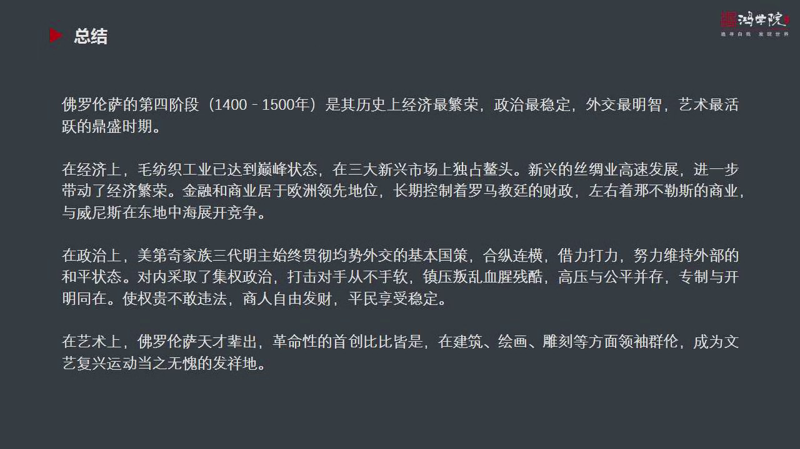

可以說這第四階段是整個佛羅倫薩例子上,經濟最繁榮,政治最穩定,外交最明智,藝術最活躍的頂聖時期,它在經濟上,毛仿這工業發展到的極盛,然後在三大市場上,佔盡獨戰熬頭,它的新興的這個思頭業高速發展,進一步...

<strong>All subtitles</strong>

> 可以說這第四階段是整個佛羅倫薩例子上,經濟最繁榮,政治最穩定,外交最明智,藝術最活躍的頂聖時期,它在經濟上,毛仿這工業發展到的極盛,然後在三
> 大市場上,佔盡獨戰熬頭,它的新興的這個思頭業高速發展,進一步提供了經濟發展的引擎,它的金融業和商業在全歐洲處於最領先的地位,對羅馬教廷的控制
> 也非常的嚴格,可以說壟斷了羅馬的財政,然後對納布勒斯的商業,對軍事坦尼保的這種東地中海的這種商業的控制,也非常的強大,在政治上呢,美地區家族
> 三代都是民主,可以說貫徹了軍事外交的這樣一個基本國策,合眾聯合建立打力,所以是整個義大利半島的這種外部的和平狀態保持了有半個世紀,對內呢,他
> 們採取了一種極權統治,對於挑戰的對手絕不手軟,然後鎮壓怕亂血腥殘酷,所以它是高壓和公平並存的一個時代,就是我對老百姓非常公平,但是我的統治是
> 非常高壓的,這是一種專制和開明同時存在了一種制度,就是我在政治上你就得聽我的,但同時呢,我又很開明,我有搞文藝復興,我有資助藝術家,我有資助
> 各種學者、藝術、哲學的大討論,我很開明,但是權力掌握在我手上,所以它在弗洛倫薩行程內是一種權貴不敢於法,商人是自由發財,老百姓享受穩定,但絕
> 不容許挑戰的是這樣的一種政治模式。在藝術上,弗洛倫薩可以說是天才被出,整個文藝復興運動有一半以上的半米江山,這些藝術家是出自於弗洛倫薩的,可
> 以說每個藝術家都有自己原創性的,甚至是革命性的這種突破,像布魯內來司機,為什麼我說他比後來了米克朗,朗基羅還有牛,就是他不僅是貢獻了一個窮龍
> 頂,這已經是在世紀上已經是建築史的奇蹟了,同時還貢獻了方法論,這就是幾個透視法,影響了後世的所有畫家,從這個依然來說,他的貢獻更大影響力更持
> 久,當然這樣的藝術家在十五世紀的弗洛倫薩還有很多建築、繪畫、雕刻等方面,應該說明家被出,所以弗洛倫薩可以說是文藝復興運動當之無愧的發想力,今
> 天我們這堂課總結了弗洛倫薩十五世紀的這種發展,為什麼弗洛倫薩會從全聖走向衰落呢?這是我們下堂課要重點探討一個話題,

---

### Slide 28

今天課就到這裡,謝謝大家!

<strong>All subtitles</strong>

> 今天課就到這裡,謝謝大家!

---
