# 核心课视频-028讲. 制药业透视（视频） — Clean Slide Notes

> **来源**：鸿学院核心课程  
> **幻灯片**：16 张

---

### Slide 1

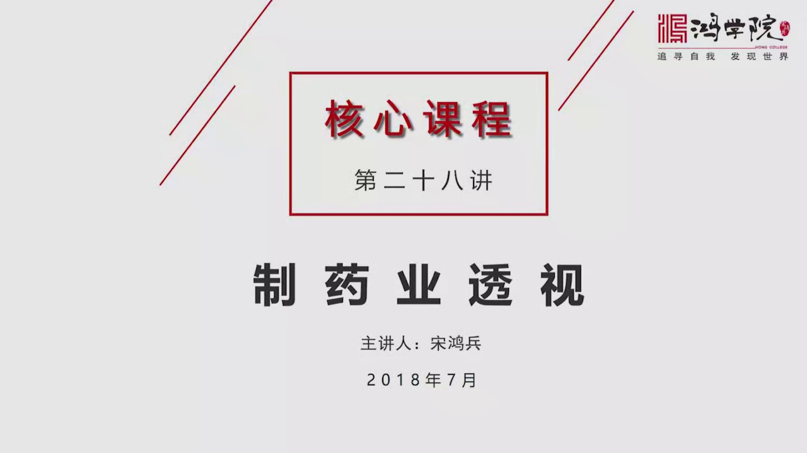

关于志耀业,我们以前的核心课中专门讲过经济复杂性这个课题。在经济复杂性的几节课里面,我们谈到了一个国家,它的经济结构中间存在着复杂的经济和简单的经济这种差别。如果我们看下一节,这就是我们复杂性那几节课中所看到的产品空间。

---

### Slide 2

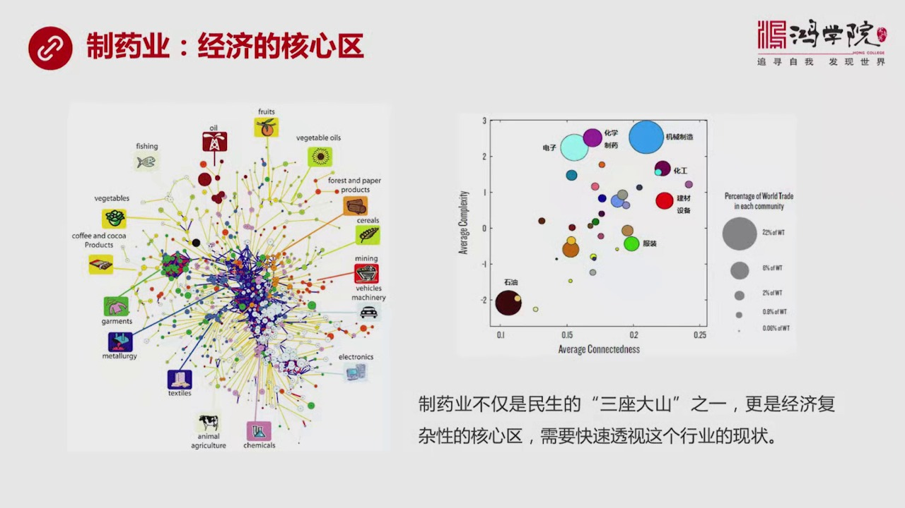

从这两张产品空间图,我们可以看到,比如说左边这张图,左边这张图粉红色的部分,就是它的化学工业,也包括化学志耀,是在整个核心区的靠下的一部分,还有中部也有一些分布。所以,化学志耀,这个是作为一个整体来看,是整个国民经济中间最靠核心的区域。如果我们再看右边这张图,我们会看到右边这张图,它的纵作标讲的是各...

---

### Slide 3

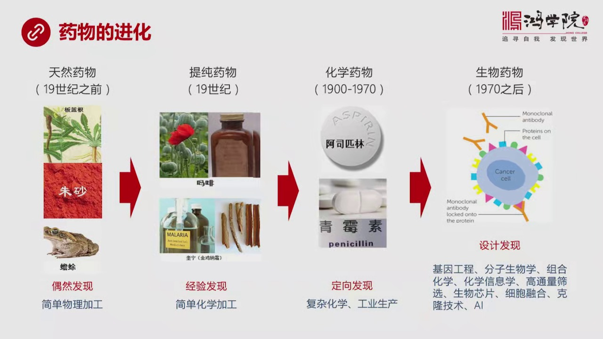

化分成了几个阶段,第一阶段就是天然药物,天然药物指的是什么呢?就是咱们中国的神东长白草,还有西方的古希拉古罗马时代,包括埃及两额六玉,也就是在早期人类文明发展的过程中,老祖先们都发现了,很多天然具有药性的这样的一些动物植物,还有矿物,比如说我们看上面的板南根,板南根我们都知道轻热,可以拜火等等,在飞...

---

### Slide 4

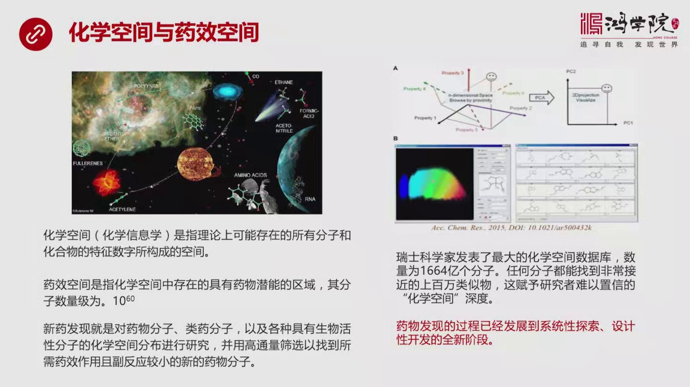

我们以前在讲到产品空间的时候,我们讲的是一个产业体系中间,各种有复杂性的产品在空间中所触的这种位置,为什么当时我们讲了脱补,学业讲到的网络学等等,就是因为我们需要把这种复杂性从空间上展现出来,让我们一目了然,其实化学空间到底是类似的,化学空间它实际上是用了化学信息学,然后它主要是要把所有可能的这种,...

---

### Slide 5

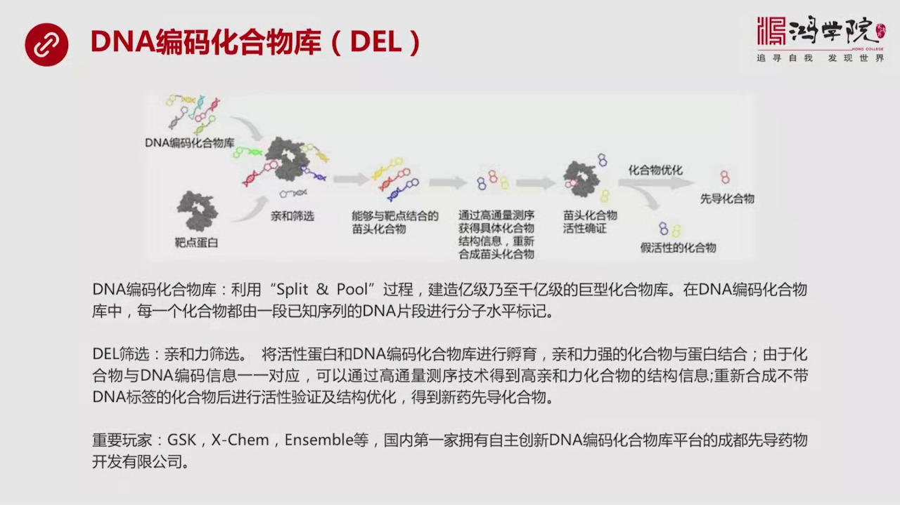

这个医学医学的论文,它讲到了一个,应该说当今生物之药中,也就是一年半以前,谈到一个重大的理论上,应该说理论和实践的一种新的做法,就是DNA编码化学,化学物的这种化合物这种酷,什么叫DNA编码化合物这种酷,它简称DL,它的概念,我们刚所说的瑞士那个搞法1664以那个分子空间也仍然太大,我们希望进一步的...

---

### Slide 6

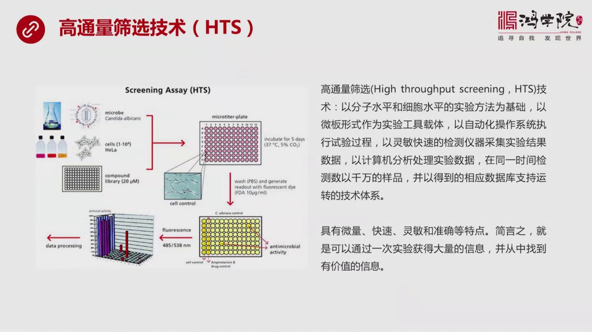

什么叫高通量筛选,就是传统上来说你有一个化合物的库,可能有百万级千万级生物质要,现代的阶段就是花学空间已经进化到1000多亿,当然这个数量级就很大很大了,所以相对于那个而言,高通量筛选技术还是属于稍微传统一点,稍微老一点的一种技术,但是没有这个技术就不能对花学空间进行,大规模的高速的高效率的筛选,如...

---

### Slide 7

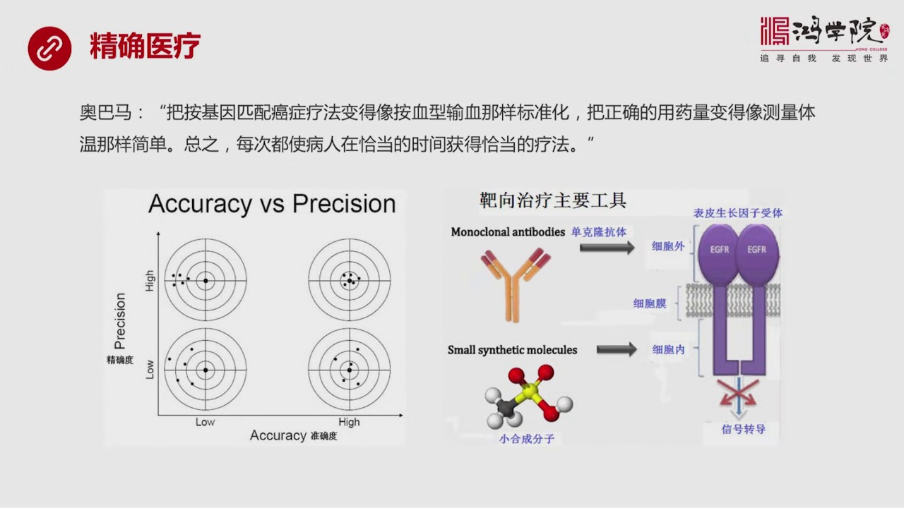

你就可以理解为什么奥巴马在2015年在国会演讲时候,他提出了一个新的非常重要,而且现在中国也在照着学的一个新的思路叫精确医疗,什么叫精确医疗呢?如果我们有了大量的基因工程的手段,有了高通量的手段,有了分子生物学,有了化学信息学,等等等等一整套的学科和技术手段支撑。那么我们就能够按照奥巴马说,我们就能...

---

### Slide 8

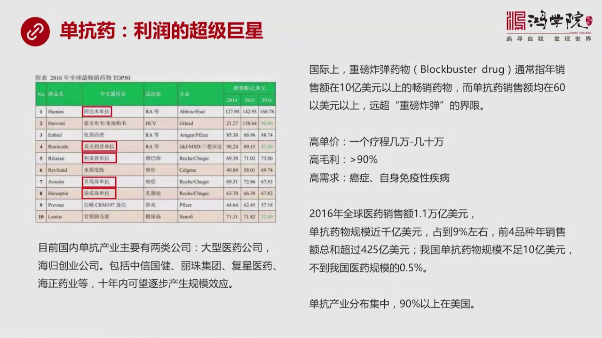

单抗药,它的利润超级巨大,所以单抗药,现在是全世界利润的超级巨星,我们都知道在全世界的医药市场中,大概是1.1万亿美元的销售额,其中三分之一是生物质药,三分之一中间,你会看到又有9%,它是属于这种单抗药,应该说它占到了上千亿,应该说整个全球医药中间的9%,占到生物质药中间的大概3.1%,所以单抗药,...

---

### Slide 9

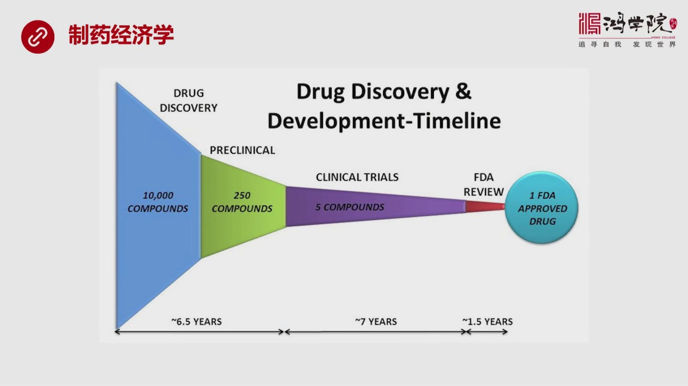

因为我们在威克堂中讲过质药是一个非常花钱的领域,他的钱,他为什么会花这么多钱,除了市场营销,除了这些其他方面,他真正花到科研上的钱,花到研究上的钱,也是非常巨大的,你比如说,他主要就是需要研制这个过程,包括前期的领床实验,包括几个阶段领床实验,包括最后的生产生产的流程,其实对他来说,风险高度集中在前...

---

### Slide 10

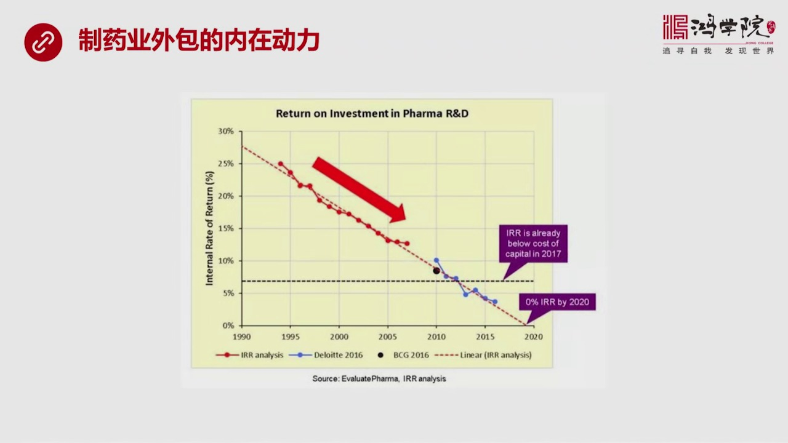

让其他人去做不同的事儿,主要是从整个研发,就是这个研发投资这个角度来看,他的利润率是下降的,风险是提高的,按照过去从九年的到现在,他的资本投资回报率是日以下降的,就是从研发角度来说,因为你要研究一万个化合物,最后只有一个能够批准,然后在这一个中间,只有20%的可能性能够大卖,或者卖得不错,所以平摊下...

---

### Slide 11

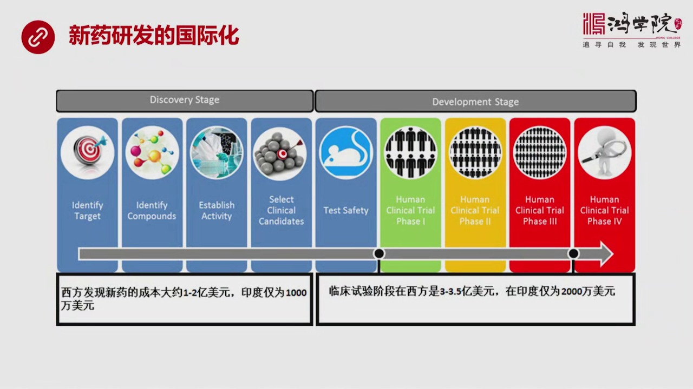

海量筛选,高通量筛选,再加上建立和筛选,评价这些化乌的库,然后再加上有效性的判断,然后再加上一系列的这种中间的过程,新西方发现一个新药的成本,大概是1-2亿美元,但是在印度这样的国家,只有1000万,只需要1000万美元,在中国,我没有看到没有查到这个数,估计跟印度差不多,也许比印度高一些,所以我们...

---

### Slide 12

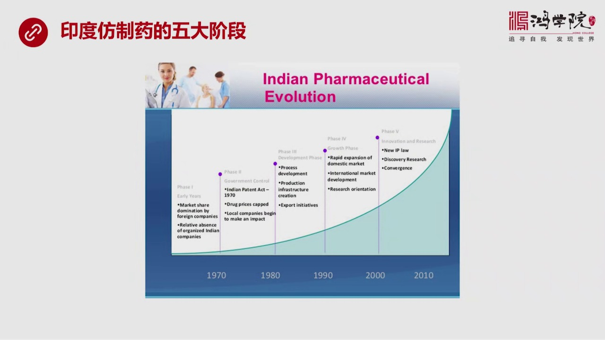

如果西方治药公司把这个通过人体实验阶段的最后成药,我们要开始生产了,要开生产线了,这个工作交给谁呢?当然它可以在本国生产,在美国生产,当然没有问题,但是如果印度的访治药已经非常成熟了,而且它的质量水平已经很高了,跟美国差不多太多,而它生产成本,开厂成本,各方面成本都很低,我为什么还要自己生产呢?所以...

---

### Slide 13

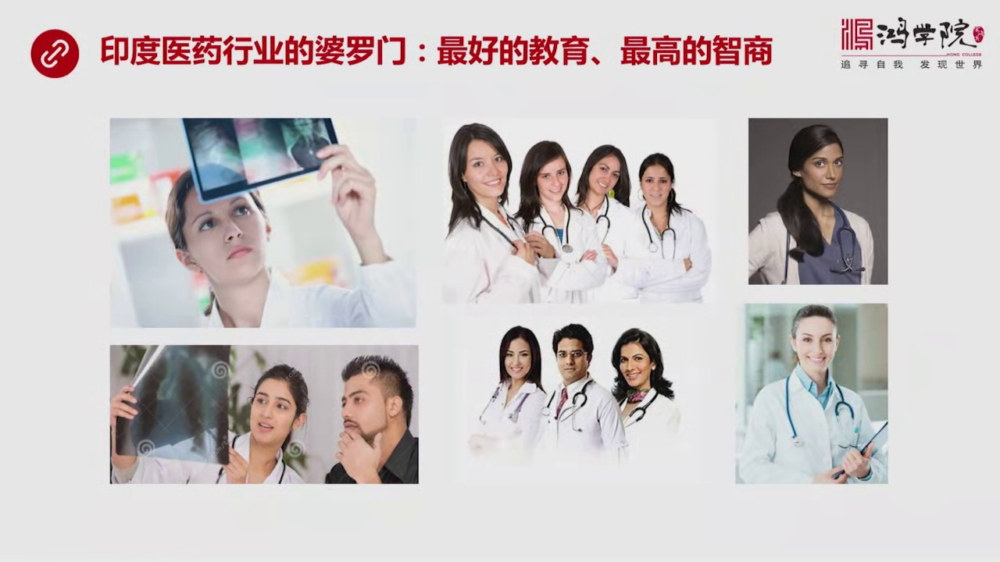

你就查印度的医生,你看到了都是这些人,这些人一看就会,你会大吃一惊,这不是我们想象中,电影中看到了印度人,他们是婆罗门,我上次在威克堂中专门讲过婆罗门是什么,他们其实是亚连人,亚连人从他们的长相,从他们的气质,你会看出他们其实更像欧洲人而不像印度的本土人,这就是特别是大家如果查,查印度女医生,你会发...

---

### Slide 14

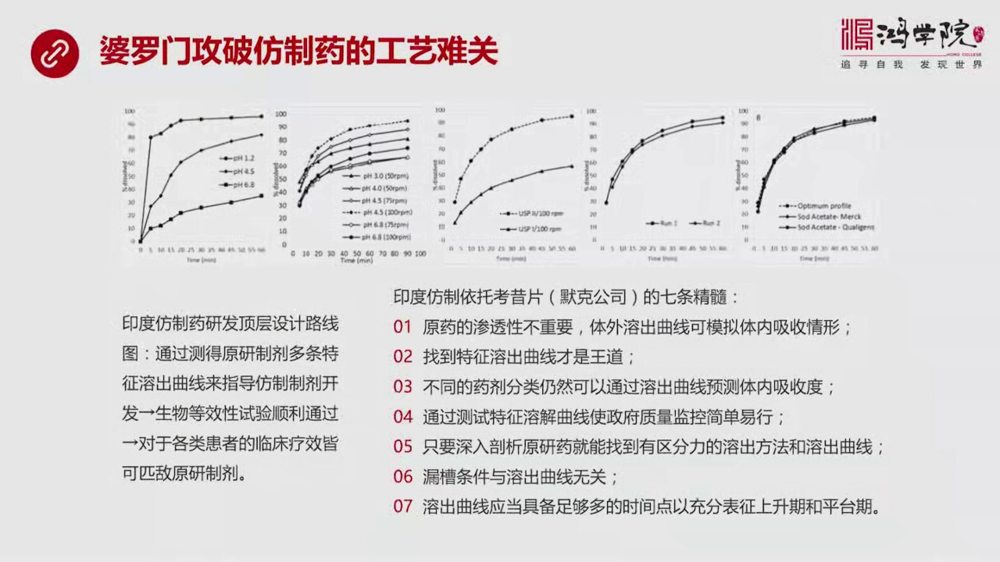

专门讲他们这个访智,默克公司的一坨烤西片,这是一种药物,他们是怎么进行访智和印象工程的,在这篇文章中,我看了好几遍,确实是确实是逐渐领会到,只要工艺中间哪个环节是最重要的,因为你读了很多很多文章之后,你慢慢发现,这个盆门是把这个事确实得做我们套了,找到了问题的关键,这关键什么呢,他们有一套顶层所谓顶...

---

### Slide 15

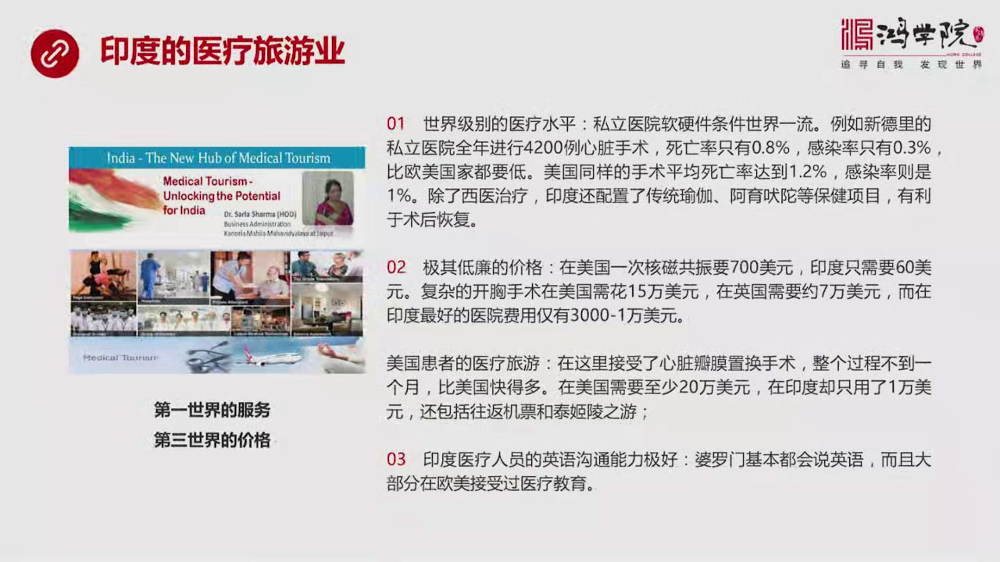

它在生产里的预中已经不存在任何问题了,它已经经过35年的技术几点,已经达到中国电子工业的对国际上的这种生产的这个价格低连,质量非常优异的这样的一个水平了,所以它的医疗行业,所谓医疗的旅游行业才能发生起来,就是在印度有一些口号,就是他们在推,全国都在推这个医疗旅游,它是到印度要享受第一世界的服务,但是...

---

### Slide 16

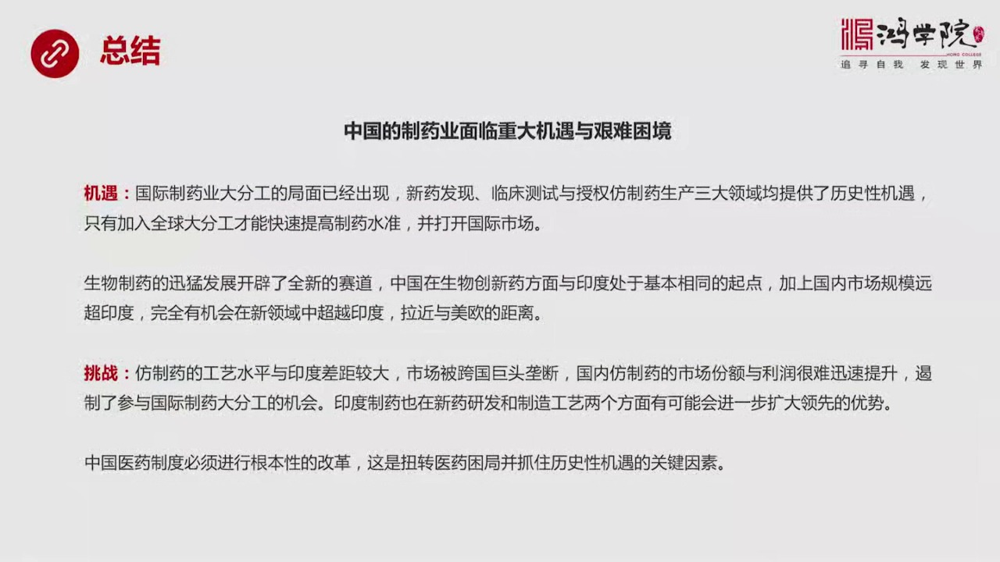

速度比较快,抓住了是一些热点性的问题,但是从这些热点性的问题和趋势性的方向,我们已经可以看到一个总的趋势,就是中国质药业现在面临着重大鸡鱼,但是也遭遇到了非常艰难的困境,什么是鸡鱼呢?就是国际质药业大分工,这个局面已经形成了,而且是不肯逆转的,只要你要对化学空间进行大规模的这种新药研发,只要你走上这...

---
