# 核心课视频-029讲. 土耳其的经济结构困境（视频） — Detail Slide Notes

> **来源**：鸿学院核心课程  
> **幻灯片**：17 张

---

### Slide 1

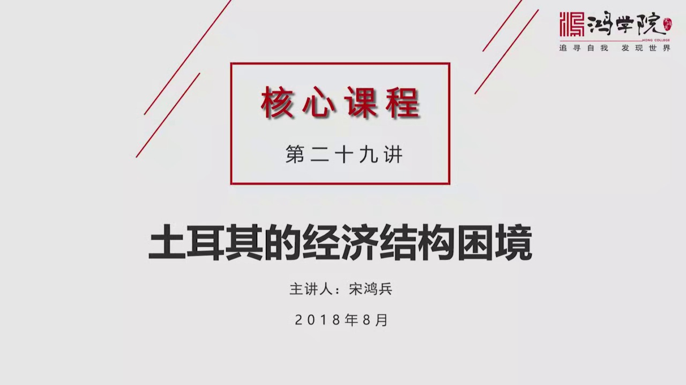

土耳其的经济结构困境大家都知道8月10号 李拉突然暴跌

<strong>All subtitles</strong>

> 土耳其的经济结构困境大家都知道8月10号 李拉突然暴跌

---

### Slide 2

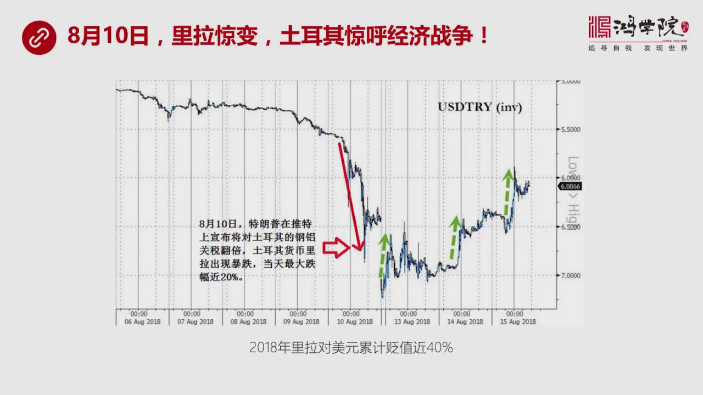

土耳其的总统二端在声明中公开说这是一场美国发动了经济战争为什么他这么说呢就是因为在当天特朗普在推特上宣布将对土耳其的钢鲁关税翻翻这个消息出来之后马上就又发了土耳其货币李拉出现暴跌当天我们看到这个最大跌...

<strong>All subtitles</strong>

> 土耳其的总统二端在声明中公开说这是一场美国发动了经济战争为什么他这么说呢就是因为在当天特朗普在推特上宣布将对土耳其的钢鲁关税翻翻这个消息出来
> 之后马上就又发了土耳其货币李拉出现暴跌当天我们看到这个最大跌幅一度达到了20%所以这一次暴跌引发了全世界对新市场国家这种货币新的担忧如果我们
> 看今天以来很多国家的新市场国家都发生了货币暴跌比如南美的不管是阿根廷、巴西还是中美洲的墨西哥伟内瑞拉还有东南亚我们看到印尼还有南亚的印度中东
> 向土耳其伊朗俄罗斯的包括东欧的俄罗斯、波兰还有雄亚利的货币还有埃及和南非这一连串的这种暴跌其实说明了一种共同的问题并不是土耳其的货币有什么特
> 殊之处但是土耳其李拉的暴跌的幅度确实还是相当惊人的在2018年全年到目前为止大概累计跌幅将近40%所以这在新闻国家里头也算是相当惊人的这个跌
> 幅这就是为什么阿尔多安会发出这是一场经济战争这种呼吁我们看下也当然土耳其这个货币危机它来得比较独特

---

### Slide 3

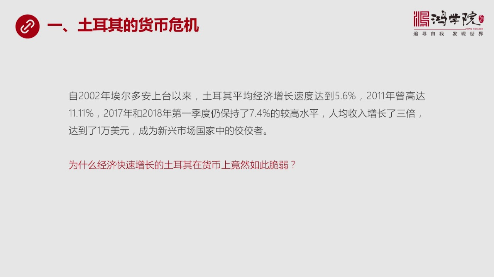

为什么这么说呢就是如果我们观察阿尔多安上台以来就是2002年到现在这将近16年的时间里面土耳其的GDP它的增长速度还是相当不错的平均达到了5.6%2011年时候曾经高达11.1%那么在2017年包括今...

<strong>All subtitles</strong>

> 为什么这么说呢就是如果我们观察阿尔多安上台以来就是2002年到现在这将近16年的时间里面土耳其的GDP它的增长速度还是相当不错的平均达到了5
> .6%2011年时候曾经高达11.1%那么在2017年包括今年2018年低纪度土耳其的经济增长速度仍然非常快达到了7.4%这个水平在全世界比
> 较起来算是相当高的甚至超过了中国所以在过去的16年时间里面土耳其的人均收入翻了三倍达到了1万美元所以在整个新闻国家里面它的排名是相当靠前的堪
> 称是新闻国家的模范生这就提出了很有意思的问题了既然土耳其的GDP连年快速增长为什么突然会发生它的货币会发生暴跌为什么它的礼拉这么脆弱这就是我
> 们今天要讲的第1个问题我们看下一页我们先从外应来分析一下我们以前说过美元环流

---

### Slide 4

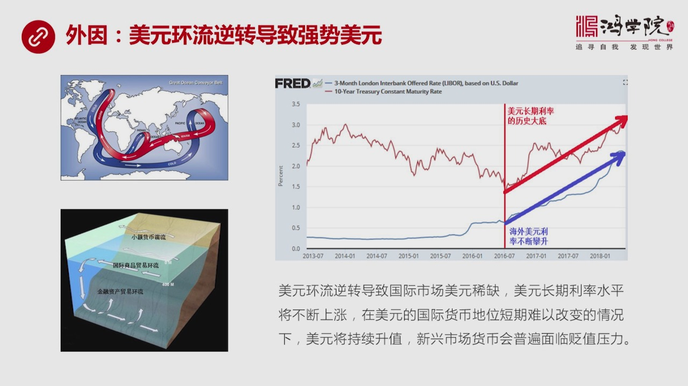

美元环流它的重大作用在于它像海洋环流一样能够使得整个全世界的经济在美元环流的刺激之下出现随着长潮和落潮出现增长或衰退这是美元独特的国际地位所决定的因为美元是全世界的交易货币储备货币所以它拥有这样的一个...

<strong>All subtitles</strong>

> 美元环流它的重大作用在于它像海洋环流一样能够使得整个全世界的经济在美元环流的刺激之下出现随着长潮和落潮出现增长或衰退这是美元独特的国际地位所
> 决定的因为美元是全世界的交易货币储备货币所以它拥有这样的一个特权那么我们在过去的核心客中专门讲过这个概念包括美元的分层的理论有两级核心客如果
> 大家对一次有什么不清楚的地方建议大家回个头去看这两级核心客那么我们在这两级客中得出了一个基本结论就是美元环流逆转出现在2014年的7月美元环
> 流一旦逆转之后它就意味着国际市场上那些高度复美元债务的国家将会发生严重的困境这种困境将会主要的原因是国际市场中的美元将会它的流动性将会出现稀
> 缺那么这些国家由于复债是美元美元来计算的那么在常还美元债务的时候就会碰到问题我们核心客中还讲过另外一些客中讲过美元长期利率走势将是不断往上攀
> 升的一个过程那么也可以说我们从美国历史上来看它的利率从这个80年代出达到一个比较高的水平之后然后持续30年时间一直是往下不断的下降一直到20
> 16年的年中中于处底而且2016年年中这个处底不是一般的利率的底而是美国如果我们看你10年国债收益率来看它的长期率的走势的话这个2016年7
> 月出现的大底是美国建国以来从1790年出现发行国债之后一直到现在是200多年的最低的底然后从2016年的年中之后美元长期利率开始大幅度的或者
> 说我们可以称之为历史性的翻转所以从现在这个趋势来看也就是说美元在海外的Liberary率和美元在国内的10年国债收益率这两个最重要的指标基本
> 上是同步网上长这个就对那些高度复债的高度复美元债务这些新身上国家构成了越来越大的压力这就是为什么这些国家它的货币会变成了根本原因关于详细的理
> 论分析我们在过去的两节核心课中都详细产出过大家有什么疑问建议大家回过去看一下以前的课程除了这个万因之外我们看下液托尔齐它的货币里拉出现贬值

---

### Slide 5

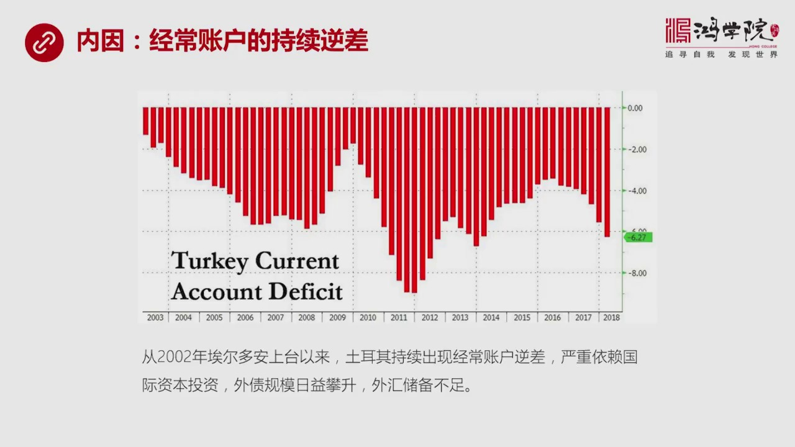

其实有其内在的原因这个内在原因是什么呢就是它的经常账户持续逆场在这个图中我们可以看到托尔齐从艾尔德湾上他以来它的经常账户是持续不断的逆场一直到今年连续16年经常账户逆场我们在过去的课程中威克堂的直播中...

<strong>All subtitles</strong>

> 其实有其内在的原因这个内在原因是什么呢就是它的经常账户持续逆场在这个图中我们可以看到托尔齐从艾尔德湾上他以来它的经常账户是持续不断的逆场一直
> 到今年连续16年经常账户逆场我们在过去的课程中威克堂的直播中也曾讲过一个国家有两个账户主要的对外账户一个是经常账户这是做生意用的另外一个是资
> 本金融账户这个是资金往来投资这种金融类的这种账户那么如果这两个账户同时都是资金流入美元流入的话那么你会看到这个国家的外汇储备一定会上升这就是
> 三者之间的关系如果说经常账户就是做贸易的这个账户它是逆场资金是往外流的如果资本账户是往里进的那么这一正一副如果恰好能抵消那么外汇储备基本上能
> 够保持平衡如果这个经常账户持续不断的逆差但是流入的钱又不足于抵消呢那就会看到外汇储备会下降这是我们看到土耳其现在出现的情况正是这种情况所以土
> 耳其现在连续十几年出现这种经常账户逆差在2014年之后它的外汇储备又出现下降这就导致了土耳其必须要严重依赖国际资本的不断流入就是这种资本投资
> 要往往里进这样就会导致你会看到一方面你得需要这个资金从金融账户账进来那它怎么进来呢很大一部分是通过债务的形式比如说欧洲的银行西班牙法国意大利
> 这些银行对于土耳其国内进行银行放贷或者土耳其的这种公司发行美元债务那么这些资金拥入它的代价是土耳其外债规模会日益叛生越来越高同时土耳其乱又出
> 卫却越来越不足这个是导致李拉它汇率脆弱了一个本质性的原因或者说是一种直接的原因那么这种直接原因我们如果进一步分析它的成因那就是下液我们会看到这种经常账户的持续义差它会导致什么样的问题

---

### Slide 6

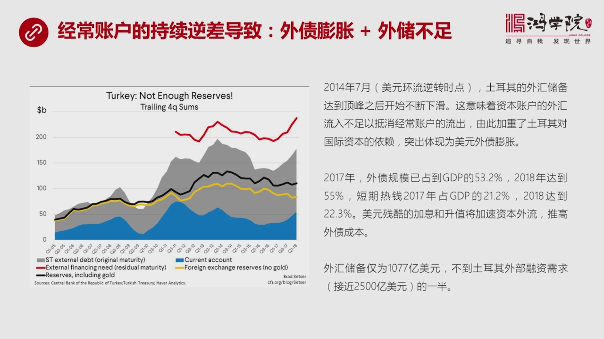

刚刚我们说了外债会膨胀外会储备会下架它是怎么发生的呢这张图已经把这个过程产数了非常清楚了如果大家仔细看的话首先我们先讲一下这张图这个黑线代表土耳其的这个外汇储备包括黄金储备在内我们可以看到它现在的规模...

<strong>All subtitles</strong>

> 刚刚我们说了外债会膨胀外会储备会下架它是怎么发生的呢这张图已经把这个过程产数了非常清楚了如果大家仔细看的话首先我们先讲一下这张图这个黑线代表
> 土耳其的这个外汇储备包括黄金储备在内我们可以看到它现在的规模大概是一千零七十七亿这个是二零一八年第一季度当然这个数随时再变但是总的这个外有储
> 备我们可以看到它在二零一四年的年中就是我们所说的美元环流反转之日所以我们提出美元环流反转的这个时间点是二零一四年的七月它不仅是对于中国对于其
> 他的所有的国家都是用包括土耳其在内土耳其的外汇储备从高点开始不断往下滑这意味着什么呢你经常账户资金是逆差是往外走的那么你的资本和金融账户流入
> 的钱不够所以外有储备会下降那么这就导致了土耳其对于国际外来资本的严重的依赖而且越来越严重这就会反映在外债的膨胀之上如果我们看二零一七年的数据
> 可以看到土耳其的外债规模已经达到了GDP的百分之五十三点二那么今年达到了百分之五十五而且如果我们来观察这个外国资金流入我们可以说是正常投资包
> 括短期这个热钱这个热钱占的比重也在上升二零一七年的数热钱占GDP的比值是百分之二十一点二二零一八年达到了百分之二十二点三所以现在如果出现美元
> 还流反转这意味着美国在不断加稀同时美元在不断升值这两重双重的这种压力会加速土耳其资本的外流同时推高美元债务的这种成本那么目前这个土耳其外会储
> 备现在大概是一千零七十七亿美元而它的外部需求外部融资需求每年需要大量借债的这种规模大概接近两千五百亿美元所以你的外汇储备还不到你每年需求对外
> 资需求的一半这个问题就严重了这是导致李拉越来越脆弱的最直接的原因所以我们搞清楚的李拉脆弱的原因也就是这种经常账户的持续逆差外有储备下降导致对
> 外资的严重依赖导致了外债的急速上升导致了它在GDP的笔值不断上升然后导致了这个外汇储备的不足这是一连串的因素所以造成了李拉的这种规律脆弱如果我们看下野那么如果说我们判断李拉的这种脆弱性

---

### Slide 7

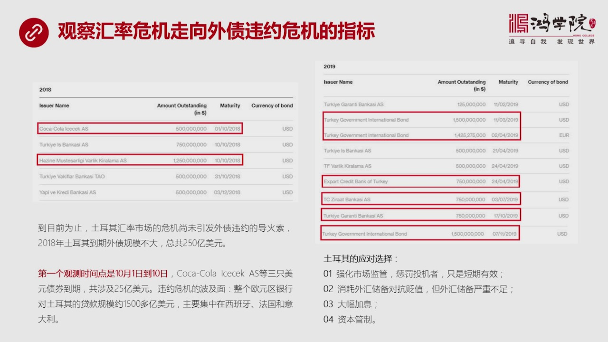

它是不断在恶化的话那么就需要观察这种现在我们看到的汇流危机会不会进一步升级或者叫恶化成外债委员呢如果出现这个情况那么我们会看到土耳其如果出现债务委员的话那么就可以想象到以前我们看到希拉债务委员或者雷曼...

<strong>All subtitles</strong>

> 它是不断在恶化的话那么就需要观察这种现在我们看到的汇流危机会不会进一步升级或者叫恶化成外债委员呢如果出现这个情况那么我们会看到土耳其如果出现
> 债务委员的话那么就可以想象到以前我们看到希拉债务委员或者雷曼兄弟公司破产等等就可以联想到一种更大的更大规模的金融市场的动大或者叫金融风暴这个
> 是我们必须要严密观察的到目前为止土耳其这种汇流市场的危机还没有直接引发外债委员的这个导火所主要原因是2018年土耳其到期的外债规模不大我在这
> 个图中列出了2018年和2019年一些重要外债的它的数字和规模当然2018年是比较全2019年我中间省略了一部分主要是把一些金融特别大的列在
> 这里为什么我要列出这些金融比较大的这些外债的规模呢就是因为我们从这个中间可以判断一些重要的时间观测点今年2018年土耳其的到期外债总规模大概
> 是250亿美元这个规模还在土耳其外有处备承受范围之内所以今年2018年它不太可能爆发大规模的委员的危机它钱还够特别是最近卡特尔还资助它150
> 亿美元当然在紧急情况之下欧盟的国家也不会受受判官因为这会牵扯的欧盟所以今年问题应该还不大上上到外债委员这个可能性较小但是我们也可以从今年的几
> 个时间点来判断全球的这种市场对于土耳其外债委员的这种可能性的判断就是大家会怎么认为这件事那最后会从这些债券的CDS或者从它的债券的收益率上或
> 者从它再融资的难以程度上可以观察出来第一个观测的时间点是10月1号到10月10号10月1号到10月10号会有3比比比较大的外债进行滚动 债不
> 到7一个是比如说10月1号可可可乐它的外债的规模大概涉及到5亿美元如果这三者1号到10号这三支外债的债券加在一起大概是25亿美元如果说我们看
> 到金融市场在10月1号到10号对于土耳其的李拉的汇率反应比较正常的话那么我们可以判断2018年它可能出问题的风险概率就很低如果说这10天之内
> 我们看到李拉出现剧列暴点或者在融资的过程中出现了一些非常一场的情况那么我们会判断就是市场对于土耳其未来的伟约的预测将会急速了恶化这将会引发很
> 明显的市场动大所以我们这些做我们很多红旋的同学们也包括我们市场中的很多做股票交易等等这些人需要眼观六路而听发放你不是指定了上海股票市场再看你
> 也不是指定了某一个市场来看你现在需要环球有环球视野你得盯很多重要的特别是市场高度敏感的这些地区的热点问题这些热点问题又可以聚焦在某一个在券上
> 或者某一个时间点的一些具体发生了一场情况所以你有了这种概念之后你比如说10月1号到10号你在判断市场的时候你就不会指定那些新闻报道中说了这些
> 问题因为你脑子里面还有另外一个人嫌这跟嫌就是李拉会不出问题如果李拉出了大问题或者这几支债券滚动出了出现的大问题那一定会引发大家对于土耳其债务
> 伟约的担心这种担心就不是一种小的担心因为我们可以设想一下这个希拉出现伟约将会如何冲击全球市场这个我们都已经看得过所以如果这个时候李拉市场出问
> 题或者土耳其债伟约有这种明显的征兆那么全球市场包括股票上都会受到重大冲击这就是我们需要掩观溜漏而停发放的原因也是需要一种全球事业的原因那么这
> 种伟约如果真的爆发它涉及到了波及面有多大当然肯定会直接首先会冲击土耳其本土的银行体系毫无疑问还有金融市场除了他们之外他的意出效应将会影响欧盟
> 因为欧盟这些国家里面对土耳其的贷款规模主要集中在西班牙法国和意大利三个国家的银行体系总的贷款规模大概是1500多亿美元我们已经知道其实意大利
> 的金融体系也是微如雷暖的包括西班牙都不太健康所以如果说在加上土耳其的这种潜在的这种风险这种伟约的风险的冲击这两国家会不会发生连锁反应这是知道
> 我们考虑了所以你会看到如果出事那就是李拉暴迪土耳其债券市场出现一种大的崩盘之后会很少欧盟的金融市场比如说欧元的市场包括欧洲的股票上和债券市场
> 然后反过来又冲击美国又会引发美国股市和债券市场的剧列活动然后在最后冲击中国所以它会有一个连锁性的恐慌效应和连锁放大了这么一种可能所以大家需要
> 密切关注这个时间点但除了这个时间点之外我们还可以看到2019年还有一些规模更大的这种债券的到期尤其是土耳其的政府发行的这种外债它的规模都比较
> 大那么现在土耳其如果真的是在一些敏感时刻遭到了这种市场上的重大冲击他们到底有什么应对的选择呢其实我们看到土耳其已经在使用一些行政或者通过行政
> 的意图通过市场的手段来干预外汇市场的举动了比如说第一条它可以强化市场监管其实他们这套是从中国学的中国当年2015年爆发过一次会议特别在香港是
> 出现人民币会议的血泵之后中国通过紧缩人民币在香港的流动性使得那些做空人民币这些融资成本距列上涨导致它不能够被迫这个割肉所以它不能够再继续做空
> 人民币了这一招在今年我们看到人民币出现大幅下跌手为什么有时候一天能够反弹八九百点主要的原因就是由于2015年用过这一招所以今年用起来它就比较
> 的快比较敏捷迅速拉高人民币在香港的融资成本立刻就会让做空人民币人吐血那么土耳其显然从中国央行那种操作中吸收到了这个经验这回在土耳其市场中也开
> 始使用就是用一种市场化的手段来惩罚投机者你不是需要理拉来做空理拉吗你不是需要做空理拉吗那你就需要搞到底了我如果让你的这种做空的成本大幅提高比
> 如说我通过这个紧索流动性这是一种方式其实还有你在远期交易中间我可以提升你的准备金的比率就是我要求你必须要预付多少钱如果这个比率越高你的资本就
> 越少而你冒了风险就越大通过种种这种监管手段是可以打败或者挫败那种极其激进的这种做空者的意图的当然这种做法我认为只有短期之内有效也就是面对这种
> 做空大潮的时候打它一棒子可以让它消停这时间但是就长远而言你这个经常账户连续十几年的逆差这个事不逆转再加上外汇储备不断的缩水那么你早晚会失去对
> 于汇率是长的控制除了这个办法第二办法就是消耗外汇储备来对抗变质我们刚才提到了就是托尔齐的外汇储备其实不够不到每年融资需求的一半所以你这已经是
> 做经验者了现在的问题是托尔齐并不是一个他是资本自由流动的一个国家他并不能直接的就外汇储备放到其实并不是用来这个像中国以前那样就是为了保障汇率
> 的平衡我央行在不断的持续不断的干预它其实它并不是那么做它相当还是相当自由的也就是外汇储备并不管你汇率你爱多高就多高我的外汇储备不是用与干预市
> 场的但是如果市场失控那么央行有可能会直接消耗外汇储备来对抗这种李拉勒贬值但是最大的问题还是那句话外汇储备如果连你一年融资规模一半都不到的话你
> 的子弹太有限了撑不了多久那么第三个手段就是大复加息当然这个是艾尔多安非常不愿意使用那个手段就是因为你大复加息之后会使国内的经济体系面临重创现
> 在其实你看托尔学的回够利率已经从66点多一口气上升到了现在17点多这个回够利率已经相当高了我们可以把它理解成一种间接的央行的基准利率所以在那
> 么高的利率之下经济发展国内经济发展一定会遭到严重的打击这就是艾尔多安不愿意用这个办法来对付意识通过膨胀二是这个李拉贬值不想用这个办法因为它的
> 杀伤力太强对本国经济杀伤力也非常强大除了这个办法之外还有什么的资本管制放弃资本自由流动了那就带来更严重的或者说对于市场的信心就会带来恐慌了因
> 为大家现在在托尔奇市场中它可以自由进出心态还比较稳定我大不了就是亏一点钱但是我可以换还是可以换美元但是如果你已经明确的资本管制那就会使很多人
> 本来没有想撤走的人包括外国投资就会陷入金孔万状的状态而且这么干的话那可能会引发资本的长期资本和短期资本的一期外流这个后果还是相当严重的所以我
> 们看到托尔奇的汇率的危机李拉下跌的风暴其实还没有结束未来恐怕还有一些新的跡象需要观察尤其是在10月份除了这个问题之外我们看下一个问题央行加稀为什么要加稀

---

### Slide 8

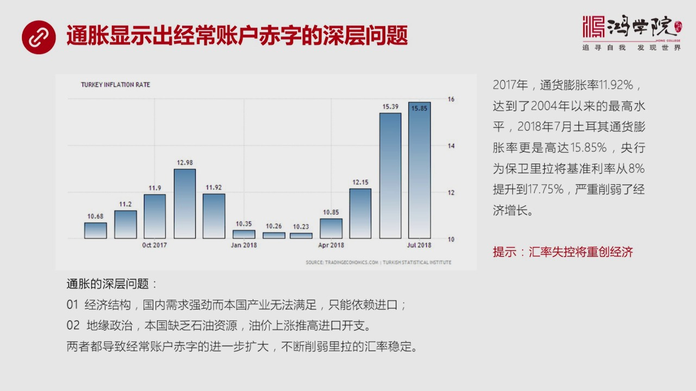

除了对重李拉贬值另外还有一个严重的问题就是托尔奇的通和膨胀实在太厉害了如果我们看这张图你会看到从2017年一直到现在其实在往前推很多年都一样2017年到现在一年将近一年时间托尔奇的通和膨胀率几乎没有低...

<strong>All subtitles</strong>

> 除了对重李拉贬值另外还有一个严重的问题就是托尔奇的通和膨胀实在太厉害了如果我们看这张图你会看到从2017年一直到现在其实在往前推很多年都一样
> 2017年到现在一年将近一年时间托尔奇的通和膨胀率几乎没有低于10%的都是10%以上平原下来是11.92%到达到20142014年以来可以说
> 达到了一个最高点今年7月份托尔奇通和膨胀率15.85%所以央行为了保卫里把基争力率包括回口力率提升到了17.75%但是这么一来就削弱了经济增
> 长所以我们看到汇率失控是会影响经济的是会重创经济的这就是我们很多人觉得人币扁置好像问题不大其实如果是那种失控性的扁置央行被迫加稀的话这个影响
> 冲击面是全国范围之内所有人所有的公司每一个人不管是股票市场投资人还是债人投资人还是买房的人人人都会受到严重冲击你设想一下如果人民币的汇率提升
> 到10%以上还会有房地展市场吗那股票市场会跌到多少那都不能想象所以汇率市场必须要稳定如果给人一种即将失控的这种预期的话将会带来严重的经济问题
> 甚至又发金融危机土耳其现在正在出现的问题应该值得中国的警惕关键的问题是通货膨胀为什么土耳其的通货膨胀会这么高因为在中国在发大国家我们遭遇到的
> 是物价长期的不动长期的下跌或者叫通货紧缩想日本这样的国家那恨不得把通货膨胀率作为货币政策的指导方针就是我一定要达到2%如果达不到我就很举算那
> 土耳其的情况正好相反那是千方百姬的压为什么这个土耳其的通货膨胀会这么严重呢所以我们会从要分析这个问题的话我觉得就涉及到几个层面第一个层面它是
> 经济结构内在的问题就是国内土耳其的国内的需求很强但是本国的产业没有办法满足所以我只能进口第二原因地缘政治土耳其是个没有太多有石油天然气资源的
> 这个国家所以它必须要进口石油油价去年以来到现在上涨了40%到50%所以它购买石油购买天然气的这种外汇支出大幅提高这两个原因都导致了经常上户的
> 进一步扩大而且这种经常上户不断的扩大我们刚才已经提到了它是威胁李拉的汇率稳定的最主要的一个或者叫最直接的一个力量好这个就把问题进一步聚焦了石
> 油这没办法土耳其天生没有石油这个怪不了谁但它的经济结构为什么土耳其它的经济结构不能够满足国内的市场需求呢它为什么不能自己生产呢像中国同伙膨胀
> 不厉害的主要原因就是你说吧要什么我都能生产而且我的产能过剩但是在土耳其却没有出现这个情况其实不仅是土耳其现在新上国家很多经济体都无法做到这点
> 就是生产率不够而且结构有严重的问题好我们来看一下下一页这就是我们需要分析土耳其的经济结构到底有什么问题

---

### Slide 9

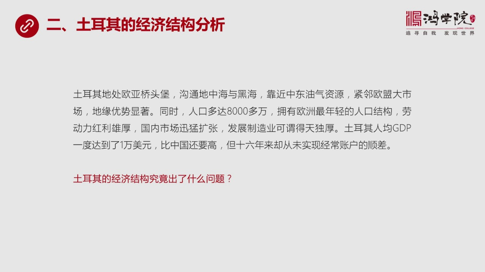

土耳其应该说地理位置相当的犹豫德天读厚它在欧亚交界线那个地方就是产临宝以前的军产能表现在一散步正好就在分界线上考州这一策但是它是整个土耳其堪称是欧亚了乔头宝同时它又可以连接理海和地中海那么它同时还靠近...

<strong>All subtitles</strong>

> 土耳其应该说地理位置相当的犹豫德天读厚它在欧亚交界线那个地方就是产临宝以前的军产能表现在一散步正好就在分界线上考州这一策但是它是整个土耳其堪
> 称是欧亚了乔头宝同时它又可以连接理海和地中海那么它同时还靠近中东的游戏资源它要做成中东这个游戏资源的书扭然后它离欧盟的大市场也非常近所以它整
> 个地缘的优势是非常明显的同时这种地缘优势带来的各种成本都偏低遇往欧洲的货物遇出成本偏低能源过来的成本也偏低然后它是人口多达8000多万在欧洲
> 排第2了应该说拥有着非常巨大的国内的市场同时它的人口年龄结构比中国要好很多它是年轻人主导地位50%的人是在30岁下所以它未来有大量的勞动力红
> 力这种激烈是非常熊厚的还有国内市场高速发展所以在这种情况之下发展制造业应该说是得天堵厚的它不管是满足国内日益膨胀的市场的需求还是满足欧盟的需
> 求它都很方便而且托尔奇的人均GDP一度达到了1万美元今年以来跌了40%一夜回到了解放前他达到1万美元的时候比中国还要高现在跌下来了就跌到中国
> 后面去了但是你会发现托尔奇跟中国最大的不同时托尔奇16年来从未实现经常上户的顺差而中国几乎年年都是顺差虽然出现个别嫉妒像今年第1嫉妒今年上半
> 年但是全年中国始终长期来顺差的这就提出一个问题了中国为什么能做到长期的贸易顺差而且人均GDP去年数字还算不如托尔奇而托尔奇却连续这么多年他为
> 什么就不能够出口创惠或者说不能够满足国内市场的需求还要从国外进口呢所以托尔奇类经济结构出的问题这是我们这一部分要讲到重点首先下一我们看一下托尔奇的经济结构到底是什么样的经济结构

---

### Slide 10

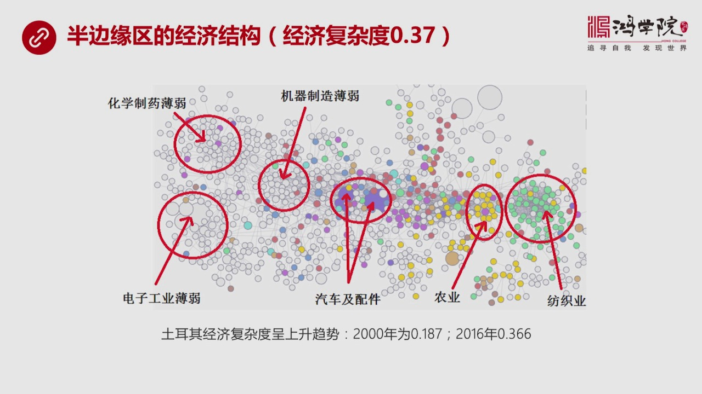

这就是我们核心课前几节说到的一个经济复杂度的问题如果我们看这张土这是一个产品空间土这个产品空间土已经非常明确的显示出来托尔奇的产品它的经济结构是一种半边缘区的典型你会看到半边缘区我在这个图中画出来的标...

<strong>All subtitles</strong>

> 这就是我们核心课前几节说到的一个经济复杂度的问题如果我们看这张土这是一个产品空间土这个产品空间土已经非常明确的显示出来托尔奇的产品它的经济结
> 构是一种半边缘区的典型你会看到半边缘区我在这个图中画出来的标志你会看到这些圆圈你看托尔奇的墙下就是它在出口方面的墙下访之业、
> 农业、汽车和配件这个是它出口创会了三个主要的大类而它在这些产业部门中我们看到这些不同颜色的小的不同颜色的这些点比较密集说明什么如果这个跨越大
> 四跨越大说明它在国际贸易战比战比比中越大如果越小说明它不太重要如果是白的基本上没有出口这个图展现的是托尔奇经济结构中面向出口能够有国际竞争力
> 的这些产业空间上看起来是什么样注意啊我觉得这张经济复杂度这套理论体系最强大的地方之一就是它非常直观你目了然知道这个国家经济态是是什么样你不用
> 读很多数据一下一看就知道了这就是个半边区的经济结构吗它的经济复杂度托尔奇经济复杂度是多少是0.37那么我们来看它的真正一个国家非常重要的三大
> 部门你看在古干部份古干部份它的机器制造非常的薄了几乎全是白的在一些高精尖的这种这些部门比如说像一些金属高端的金属制造这里它也不行在化学质药我
> 们看左上角这个化学质药基本上也是空白那么在左下角的电子工业你明显看出来这基本上没有什么电子工业出口我们在市场上基本上看不到托尔奇生产的手机电
> 视冰箱这些东西很少看到这说明什么出口竞争率不行那么我们一看这张图就可以得出一个结论托尔奇仍然出在一种典型的半边缺的状态不过我们从发展的角都来
> 看托尔奇的经济复杂度是不断上升的20000年它更差它只有0.187到现在呢上升到了0.37到2016年所以我们可以看到它的复杂度这个在过去的
> 时间中间发了一倍不过即便是到了今天从这张图上我们一目两栏可以看出来这个国家一定是密场经常上会不可能顺差因为主要的出口产品带来这个收入太有限只
> 有三个三个部内具有出口竞争率那么如果我们来比较一下另外一个国家你会看到比如说我们选一个核心区的国家下液德国你会看到核心区国家的经济结构像德国它的经济复杂度是

---

### Slide 11

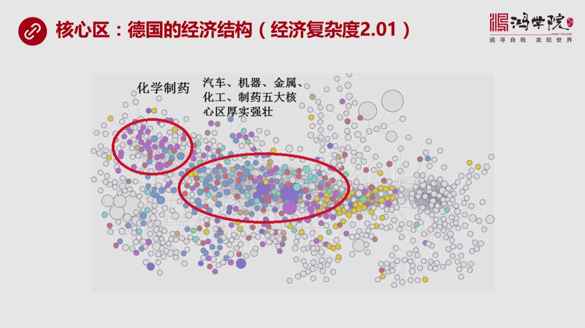

0.1这是全世界最高的几个国家之一了超过2你会看到这张图看起来在这张图上其实跟所有图都一样它的主要的位置大概差不多比如说左上角这边是化学质药左下角这边是电子工业然后右边这边是农业还有防治业等等中间古干...

<strong>All subtitles</strong>

> 0.1这是全世界最高的几个国家之一了超过2你会看到这张图看起来在这张图上其实跟所有图都一样它的主要的位置大概差不多比如说左上角这边是化学质药
> 左下角这边是电子工业然后右边这边是农业还有防治业等等中间古干部分最重要古干核心区我用大红圈圈起来这部分是德国的整个经济结构中间最核心的部分在
> 这个部分中我们看到它聚焦了汽车机器制造中国叫装备制造业还有各种金属金属质这个野金金属还有化学工业还有质药五大核心区在中间这一流行的非常的粗壮
> 很厚实各种色块高度的密集这就是典型的核心区经济结构走上角化学质药你可以看到德国的质药也相当的强大这是德国的一目了然你会发现这个国家一定是发达
> 国家再不看任何数据情况之下如果蒙住德国这两个字你看一目了然知道这一定是发达国家这就是这一套体系它强大的地方我们如果再看下野我们再来看中国中国跟土耳其如果进行一个比较的话

---

### Slide 12

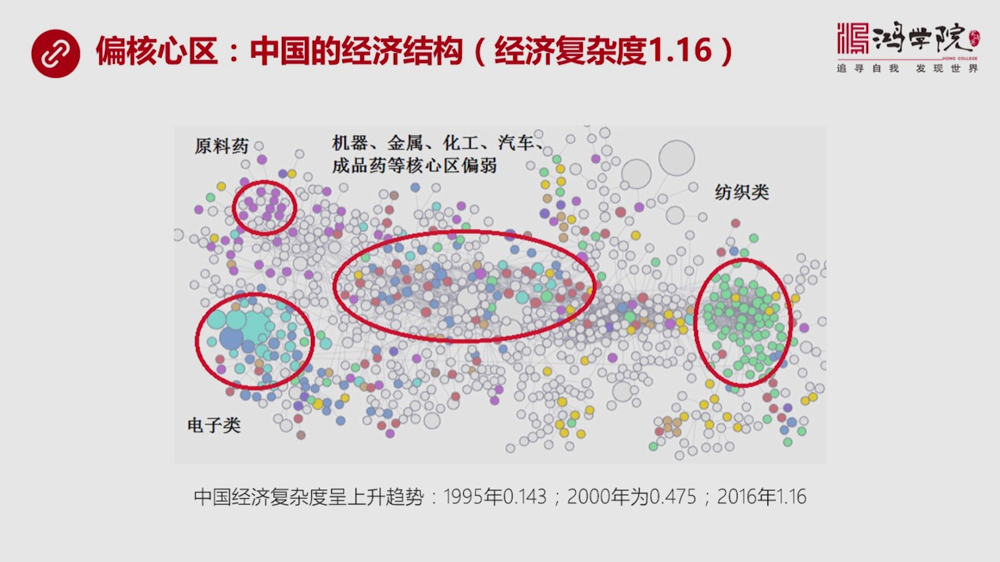

你会发现中国是属于偏核心区还没有到核心区但是又比半边区好一些介于两者之间中国经济复杂度是1.16那么如果我们看中国这个产品工程图你会发现中国的这个结构跟德国不太一样跟德国最大的区别什么呢首先中心区核心...

<strong>All subtitles</strong>

> 你会发现中国是属于偏核心区还没有到核心区但是又比半边区好一些介于两者之间中国经济复杂度是1.16那么如果我们看中国这个产品工程图你会发现中国
> 的这个结构跟德国不太一样跟德国最大的区别什么呢首先中心区核心区这个机器制造装备制造也包括已经化工汽车成品要这些区域比德国的那个密度来看要吸收
> 很多要吸收一些但比土耳其要密集那么我们看为什么说质药中国虽然成品质药赶不上印度但中国还是原料药的出口大国这个在世界上是排名非常靠前的所以我们
> 在左上角看到化学质药中间的原料药出口中国是相当有相当的份额所以咱们也不能说中国这药也不行这个成品药这个竞争恐怕争默过印度但是原料药远远超过印
> 度印度的原料药不行甚至需要中国向印度出口原料药那么中国还有一个地方跟土耳其特别不一样就是中国的电子类左下角这个电子类相当的密集和强大所以中国
> 是好几个拳头访职业我们看到右边访职业很发达这个不压于土耳其电子类比土耳其强大太多了核心区也比土耳其要发达原料药这也比土耳其发达所以你看显然中
> 国是顺差土耳其是逆差如果我们来看一下中国经济复杂斗的一个趋势你会发现1995年中国大概是0.143200年是0.475200年时候就已经超过
> 现在土耳其的经济复杂斗了2016年上升到了1.16所以从这个数据上我们可以看到中国95年到现在经济复杂斗增长了10倍所以我们看一个国家说它是
> 不是在于变得越来越发达你需要一个数字的参照物就好比物理学中间那个商商越小它有序程度越高在经济学领域中我们没有这个概念而经济复杂斗这个理念和这
> 套体系的提出是迷补了这个重大空缺否则我们真的说不清楚中国和土耳其道给谁发达你看人均GDP吧土耳其比中国要高但是你看中国的真正的经济实力中国实
> 际上比土耳其要强而且要强得多这就是为什么人均GDP这个数字或者这种概念或者GDP的总数没有什么太大意义因为它什么也说明不了说或者说明东西是错
> 的而经济复杂斗在相当程度上它是对于评价一个国家真正的经济发达程度是一个相当有效或者到目前为止我认为是最有效的一个判断标准比其他的指数都要准这
> 个我在过去的核心课程中曾经专门讲过如果我们看下眼下眼是美国的经济结构美国是一个发达国家它的经济复杂斗是1.5

---

### Slide 13

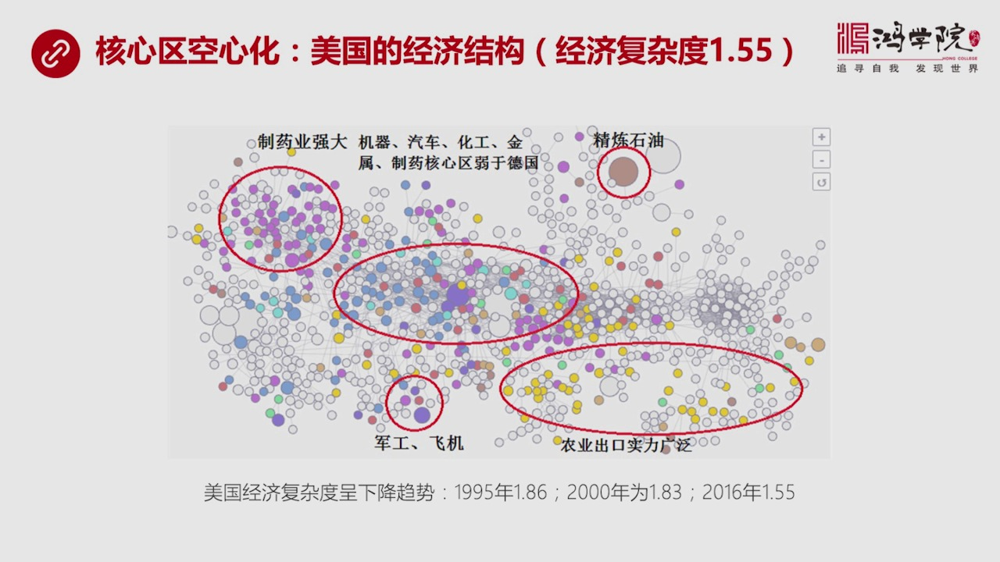

超越了中国但它不如德国那么复杂为什么因为美国的核心区经过80年以来里跟他们搞的这种新自由化的政策之后放松了监管之后大量的外流所以它出现了核心区空津化这样的一种特殊的现象如果我们看美国经济复杂斗你会发现...

<strong>All subtitles</strong>

> 超越了中国但它不如德国那么复杂为什么因为美国的核心区经过80年以来里跟他们搞的这种新自由化的政策之后放松了监管之后大量的外流所以它出现了核心
> 区空津化这样的一种特殊的现象如果我们看美国经济复杂斗你会发现从95年一直到现在它是持续不断下降的95年它的复杂斗是1.8620000年是1.
> 832016年变成了1.55所以它是从1.86到1.83到1.55不断了再下滑这就是我切身的感受94年到美国你会觉得哇 超级富裕然后各方面东
> 西都很发达但是现在回到中国然后你看再回到美国一比较你发现美国很多方面在几种设施在很多方面明显出现了之后在互联网新的经济领域中它也不如中国创新
> 能力这么强手机电信走哪儿都没信号这些问题在我看反映出了虽然我观察到是一些孤立的点但是如果通过理论体系来论证可以说明这个感受是对的就是它的经济
> 复杂度是趋于下降的那么美国的产业结构你会看到它的核心区也比较集中但是不如德国那么集中就是在装备制造机器汽车划工金属和成品药这些方面是弱于德国
> 的当然比中国强它的质药业非常强大它的质药业跟德国像可以说起股相当它真正还有一个比较独特是它的石油业严油业严气经练石油这个方向比较的强大具有着
> 相当强的竞争力还有是什么呢农业我们可以看美国的农业就是这些黄点分布的范围非常的广我没有办法很容易把它圈在一起但是你会发现美国的农业出口的竞争
> 力它是来自于方方面面总的实力是非常强的德国和美国不太一样中国和土耳其在农业方面其实竞争力其实跟发达国家相比甚至不如发达国家还有军工和飞机这也
> 是美国一个非常独特的一方军工服势军工服势因为我这个圈也圈得比较小它实际上涉及到周围很多其他的领域没有办法直接化过来所以我们可以从美国这张图上
> 你可以看到如果一个国家工业空音化或者制造业空音化它最后出现的就是这样一个发展态势好我们在分析第三部分详细分析一下土耳其的出口结构

---

### Slide 14

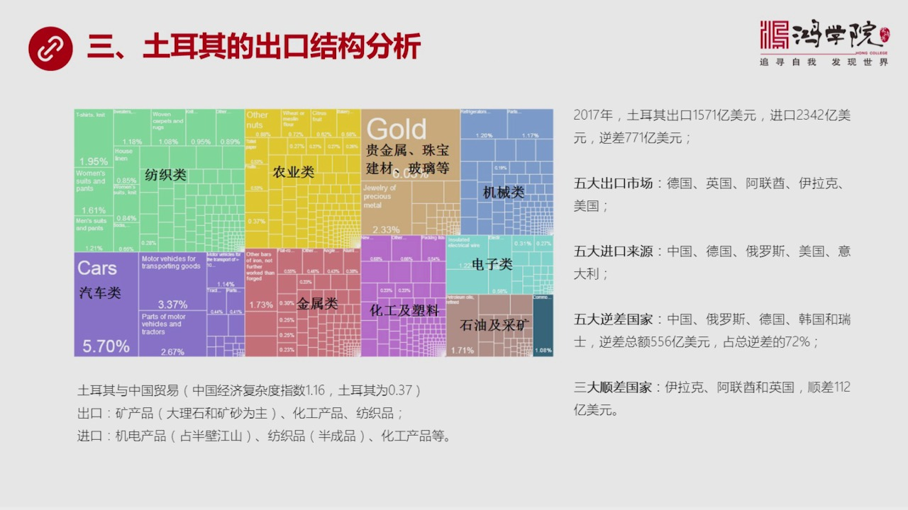

那么从这张图上我们基本上一幕两人土耳其最大的出口创惠的人这个类别是什么访智汽车然后是农业这是三大块那么2017年我们看到土耳其出口的总规模是1571亿美元进口是2342亿美元所以它的逆差达到了771亿...

<strong>All subtitles</strong>

> 那么从这张图上我们基本上一幕两人土耳其最大的出口创惠的人这个类别是什么访智汽车然后是农业这是三大块那么2017年我们看到土耳其出口的总规模是
> 1571亿美元进口是2342亿美元所以它的逆差达到了771亿美元五大出口市场德国主要德国和土耳其的关系非常近二战以来一战以来一直如此德国英国
> 阿联球伊拉克和美国这是它五大出口市场它的进口来源谁想到进口呢就是这个它的进口来源呢中国排第1德国俄罗斯美国和意大利所以在土耳其的这个经济版块
> 中间德国市场是最重要的而在它进口的这个方向上中国这个贸易伙伴是非常重要的如果我们来算逆差的话中国也是排第1就是它的五大逆差国是中国俄罗斯德国
> 瑞士还有韩国总的贸易逆差是多少五百五十六亿美元跟这五个国家战总逆差百分之七十二所以这五个国家是土耳其贸易逆差的主要来源而且中国是最重要的逆差
> 国土耳其这个贸易逆差最主要是中国贸易的逆差俄罗斯很容易理解那就是买俄罗斯的石油天然气德国很容易理解买德国的精密机械买德国的生产装备韩国估计是
> 汽车然后瑞士可能是质药等等那么它的三大顺差国伊拉克阿联球和英国它顺差一百一十二亿美元对着三个国家那么如果我们来看重点分析土耳其和中国贸易首先
> 我们比较一下经济复杂度中国是1.16土耳其是0.37中国要比土耳其要复杂的多经济结构所以你会发现在进入贸易中也体现了这个规律土耳其像中国出口
> 什么主要是一些原材料的矿产品这个矿产品中大理石和矿沙这是最主要的出口产品除此之外第一大类是矿产品第二大类化工化工第三大类访智那么它从中国进口
> 什么显而一件从中国进口最多导致义差最严重的就是激电产品占了半批江山然后访智产品它从中国进口的是半成品到土耳其经过金家工之后想欧盟或在本国本国
> 内部是消瘦还有化工产品所以我们来看一下土耳其义差的主要来源其实是来源于中国贸易中间的激电产品是它最最大的贸易的这种逆差的单向来源好它的出口结
> 构看完之后我们再来看一下下业它的三家马车访智汽车和农业访智业这是它的竞争

---

### Slide 15

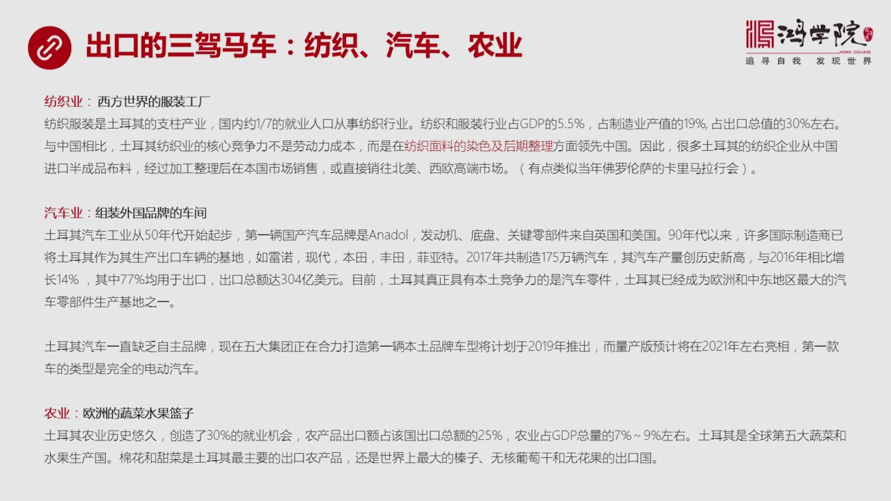

应该说在国际上竞争最有利的一个产业号成是西方西方世界的服装工厂访智它的它的特点是什么当然它首先访智业规模很大1%的人是从事访智业的在制造业中占19%的比例在出口中独占30%这个比例是最大的那么它真正特...

<strong>All subtitles</strong>

> 应该说在国际上竞争最有利的一个产业号成是西方西方世界的服装工厂访智它的它的特点是什么当然它首先访智业规模很大1%的人是从事访智业的在制造业中
> 占19%的比例在出口中独占30%这个比例是最大的那么它真正特色如果跟中国相比的话它的核心竞争力不是劳动力成本因为它前两年人均级对比比我们还高
> 所以劳动力成本超过了中国它真正的竞争力是它在访智面料的染色和后期整理上连比中国更先进这就让我想起了佛罗伦萨卡里马拉西这个行会当年就是从佛兰德
> 进口这种半成品半成品不料在佛罗伦萨进行印染可进家工就是后期整理然后向中东向布斯林市场去卖所以我们会看到土耳其很像当年的这个佛罗伦萨这个卡里马
> 拉的模式那么中国在跟土耳其的访智品贸易中土耳其企业就发现从中国进口那种原料的没有染色的步这比较便宜比土耳其自己去访智去生产那些布料要划算的多
> 所以越来越多的土耳其企业从中国采购或从中国进口半成品未染色的这种布料然后在土耳其进行印染然后进行进家工整理然后向欧盟市场和本国市场销售这就是
> 它访智液最大的一个特点第二个产业出口的大户是汽车业汽车业在我看来用一句话来概括就是土耳其的汽车业并不是它真正的汽车业它是组装外国品牌的一个车
> 间在这点上恐怕连中国都赶不上中国毕竟还有一些自主的国有的这种汽车品牌虽然不是特别强大但是还是有土耳其基本上就很少听见像土耳其汽车工业其实是从
> 五十年代就开始发展它第一辆国产汽车也是在五六十年代推出来的它这个汽车其实它并不是全部国产生产的比如说发动机底盘关键部件是来源于美国和英国那么
> 后来了发展的结果到八年以后它以前是进口替代就是外国能生产了我也能生产工业化了道路整个伊斯兰设计基本上都这样埃及也是这样我们以前讲埃及这个红关
> 节目中有一些专门讲埃及的工业化基本上跟土耳其的方式或者说是学习土耳其的那么在很大程序上两者的发展模式一样八年代之前搞进口替代八年代之后转向了
> 出口转向了国际贸易馆转向了全球化90年代之后全球化加速你会看到大量了国际製造製造汽车的这些厂商把土耳其作为整车生产的整车组装的基地像雷诺现代
> 本田封天菲亚特这一大批还有德国的一些企业一大批其实企业都把土耳其利用它联将劳动力利用它的这种靠近欧盟市场的变力条件然后在那里德国这些法国还有
> 日本韩国这些企业工丝实际上是在土耳其完成最后的组装而已而真正的核心部件核心的这些企业车像发动机器像一些最重要的东西都是从国外进口的这个跟中国
> 的企业工业发展有点像咱们是核资他们当年也搞这个也搞类似这条路但最后的结果什么呢最后的结果实际上它的市场被外国品牌基本上战战的差不多了它已经没
> 有余地来发展自己的这种汽车本土的自由品牌的汽车工业了虽然在2017年这个土耳其生产了175链175万量汽车创造了历史最高级路但是它的汽车主要
> 17%是用于出口的很明显是像欧盟出口这也就是说欧盟利用土耳其连架劳动力然后组装完之后反消欧盟市场这不就是全球化的一个另外一个样本吗欧洲版的这
> 种样本在东亚地区是美国把企业放到中国连架利用连架劳动力生产出来的东西反消美国到底是一样的那么这个到目前为止土耳其的自由的汽车工业基本上都已经
> 土崩瓦解了情况有点像克罗迪亚斯罗文仰他们的这种经济发展模式你基本上被别的国家的强大的汽车工业把你执解和消化了你的这些国内的以前的企业干吗呢生
> 产零件吧所以土耳其它发展成了欧洲和中东地区最大的零部件生产企业生产基地这个是土耳其我们看到它有个很大的两个很大的紫色的圈代表汽车业很好帽势很
> 强大不是土耳其自己的汽车列强大那是外国公司的汽车业强大土耳其只是在帮别人组装虽然出口全部算的土耳其的账上但是这技术不是你的它真正有竞争力的是
> 它的汽车零件这个是它的所以土耳其一直没有自己的品牌缺乏自主品牌怎么办呢现在土耳其的汽车集团五个集团练上在一起要打造第一量本土的真正本土自由品
> 牌准备在2019年搞出来量产准备在2021年开始出现它第一款产品是什么呢已经搞不了传统车了传统车市场已经它已经没气了彻底放气了它准备搞的是电
> 动车目前也在跟中国谈判谈判它当然需要中国的电池还需要一些其他的技术它靠它自己连电池都搞不了所以最后合作来合作去它还是搞组装核心部件像电池恐怕
> 也得依赖中国那么再看农业可以说土耳其是欧洲的蔬菜水果蓝子它的土耳其农业历史非常有酒其实真正小卖的重值最早应该是出现在土耳其的陶陆斯山卖九千年
> 前土耳其人当然不是现在的这个突厥人了是很早很早以前的土耳其本土人就已经发现了脉子是可以从野生进行循化的创造了农业这个概念这个农业这个整个的发
> 展体系是源于土耳其土耳其的这些原始部落的人把这种技术带到了两核流域带到了苏敏尔地区发展出了两核流域灌盖的农业当然这是源于土耳其所以它的农业历
> 史非常悠久而且农业大概提供了30%的旧业机会30%人口是农民旧业的人口是农民它的农产品出口占到出口总额的25%仿着也最大占30%那么它主要的
> 出口产品什么呢?棉花、甜菜这是它最主要的出口农产品当然出了这个之外还有一些比较小的但是在国际上排名非常靠前的比如说针子这个葡萄杆、
> 蒙花果这都是土耳其在全界都是属于爽二的所以这是它的出口的三驾码车我们再看下一通过这个分析我们其实已经可以看到

---

### Slide 16

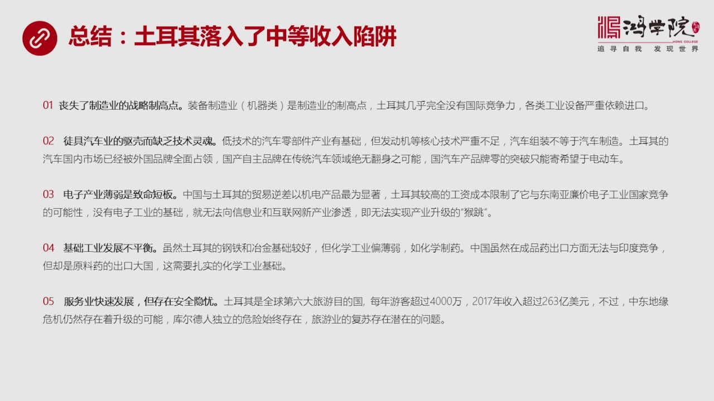

土耳其的经济出了什么问题它出的问题就是简单用一句话概括土耳其落入了中等收入陷阱什么叫中等收入陷阱土耳其就是典型我们分几个方面来说第一个方面首先它丧失了制造业的战略之高点战略之高点什么呢?装备制造业机器...

<strong>All subtitles</strong>

> 土耳其的经济出了什么问题它出的问题就是简单用一句话概括土耳其落入了中等收入陷阱什么叫中等收入陷阱土耳其就是典型我们分几个方面来说第一个方面首
> 先它丧失了制造业的战略之高点战略之高点什么呢?装备制造业机器这是整个制造业各行各业的这种不管你什么工业类别你都得使用机器没有这种机器制造业你
> 就没有这种母机没有这种母机你就没有办法生产自己的工业的装备所有行业都得一靠进口这种装备那还了得就必然会产生严重的赤字所以装备制造业是整个工业
> 体系的它的战略性的制造点而土耳其在这个方面几乎完全丧失了任何的这种竞争力就是我们看到产品工业图它的装备制造业机器这一块基本上是空埋所以它的各
> 种工业的高端的设备还有各种设备要严重依赖进口有些是高端是从德国进中端的有些是从中国进它自己生产不了机器这是一个巨大的问题第二个虽然帽子它的汽
> 车工业好像出口增长越来越快但是它图剧汽车业的曲壳而没有真正的技术灵魂这是托尔其汽车业最大的问题就是组装汽车并不等于生产汽车汽车组装不等于汽车
> 制造它真正有基础的是低技术的汽车零件但发动机器这些核心技术完全找到外国手上所以托尔其出现的情况比中国还要糟托尔其连自由的国产品牌都没有它整个
> 了国内上完全被外国产品所垄断和占领这就导致了托尔其要想再想开发自助国产的汽车品牌如果你搞传动车基本上绝无可能用无翻身之日所以它只能定位成要突
> 破寄希望于电动车而电动车它的电池技术恐怕还要依靠中国来提供实际上还是没有解决问题这就是为什么一个国家你会看到如果在核心技术上没有灵魂你搞不出
> 核心技术你其他的东西表面再夸张再滑烧最后等于零中国的芯片已经双名这个问题了中国的汽车其实也是一样我们的大部分绝大部分是啥已经被外国品牌占领了
> 所以传动汽车工业已经完全没戏了放弃只能放弃中国现在唯一能够弄到超车的是互联网汽车或者电动车这是有可能重新超越的所以我们在谈到对外开放的时候如
> 果你这市场被对方完全占领你还有生存的可能还有自助、生产搞出自助品牌的可能性吗当然就没有了而我们现在在经济学中有个严重的概念上了一个错觉把GD
> P认为所有的国家这些跨公司在你这身产所创造出的产值算到你名下但是技术真的是你的吗不是这个是一个最大的一个统计上的一个物厂我们看到GB数字很高
> 就像看到托尔基汽车出口量很大一样这是一种错觉因为你自己生产不出来你是组装别人的一旦发生风食草动一旦出现任何外国变化这些企业说走就走这只是一个
> 问题更严重的问题是人家是从全球高度来进行分工的那么如果打开了你的市场是把你这块的资源整合到他的体积中如果从生物学的角度来说他是把你的体积打破
> 了从你身上吸取了蛋白质来供他生涨而你呢你这种行业就由于损失了有机物和蛋白质而得不到营养发展不起来这是一个此销彼长的残酷过程所以当有一当跨公司
> 在这个国家中所占领的市场分额越来越大的时候这个国家将会损失你自主经济增长的有机物和养量最后这个产业会被活活饿死这就是我们看到的从土耳其身上从
> 很多所以中等收入陷阱这个国家看到了普遍规律GP这个数字不重要自主研发从整个产业体系都是自己的这个笔记的数字更重要第三个问题就是电子产业薄弱它
> 是个致命的端板我们看到土耳其的产品工业中电子产业基本上是空白为什么电子产业是个非常重要的一个产业就是中国一开始起步于简单的电路或者这些组装但
> 是它有了这样的一个基础之后就可以慢慢的进化我就可以慢慢往各种电路复杂电路上发展慢慢往急生电路上发展慢慢能够生产成品的电视、
> 冰箱、加电还有手机等等我有了比较好的电子产品的印象基础逐步发展成信息产业的物质基础然后再往后发展我就可以生产手机和像华为公司生产的越来越先进
> 的电源设备和手机我就可以超这个方向逐步去拖展然后我就可以进入一个新的领域就是信息产业和信息产业之上的互联网新新的产业不管你是人工智能还是什么
> 什么东西都要需要芯片都需要电路谁来生产中国可以生产所以你未来的商业创新的巨大空间就被打开了不管你是电子商务也好还是我们看到的现在这个层出不穷
> 的这种新概念商业上的电商的新概念都说明这个问题你这些东西都必须要依赖硬件没有硬件你往上发展的所有内东西都只是画柄而土耳其最大的问题就是它较高
> 的工资成本上得太快以至于它现在已经没有办法回过头去发展最基础的电子工业了因为它蒸不过东南亚这些连价的电子工业国的竞争我们从中国和土耳其的这个
> 贸易义差中已经可以看到基电产品是大头超过了50%说明土耳其在这个预中它已经永远落后了也就是丧失了电子工业的这种基础它就没有办法实现新产业的这
> 种头跳我们称之于产业升级我称之于喉跳这个豪子它要从一颗树上跳到另一颗树上这两颗树必须足够近你没有消费电子工业你没有这些简单的这东西作为基础了
> 你这颗树都没有你在一片沙漠中怎么从一颗树跳到另外一颗树乔格的距离太远这是土耳其掉入中等收入线紧一个巨大的标志第四基础工业发展不平衡土耳其的钢
> 铁已经基础还可以因为奥斯曼帝国改革开放很早17几年就开始改革了但是搞得搞趣现在一直没发展好它的产业关键是产业并不是平衡发展比如说它的化学工业
> 就比较弱填在化学质药我们基本上看到它化学质药的出口产品那一块产品工业也是空白中国现在虽然我们的成品药方面争播印度但是原料药中国是出口大锅你要
> 想生产原料药就需要基础的化学工业这些方面是土耳其的弱向第五虽然土耳其的服务业发展很快但是特别是旅游业因为土耳其它是全界对六大旅游的目的国东西
> 方文明各种遗迹都有确实是非常好玩每年以前游客超过了4000万但它现在最大问题是由引游有安全的引游特别是地缘冲突的风险仍然存在比如说中东会不会
> 未来困扰人独立序量的战局还没有完全的产业落地所以这些问题都会影响土耳其的安全比如说困扰人如果放炸弹怎么办或者一些恐怖分子搞恐怖袭击怎么办像2
> 016年那就发生了无奇全世界的游客就会被下退所以土耳其现在虽然发展服务业发展旅游业这方面潜景还不错但是它的这种旅游业现在也面临地缘政治上的潜
> 在的挑战从这五个方面我们基本上看到了土耳其它的经济结构处在一个典型的半边缺而半边缺国家一旦不能够进一步往上进入偏核心区的话它就会所谓记留勇尽
> 不尽责退你在核里游泳水在不断往下冲你上不去就得往下退所以现在土耳其最大的最严重的问题就是它没有核心技术制造业上不能搞装备制造电子工业是它致命
> 短板同时汽车工业为代表的制造业整个缺乏自主技术这就是它发展的最严重的几个问题今天我们关于土耳其经济结构上出的问题先聊到这里我们通过对土耳其经
> 济结构的理解反过来就能够加深我们对土耳其汇率出现问题的这种本质性原因的认识经济结构有问题导致你的经常账户会连续出现赤字经常账户赤字最后会引发
> 你的外债拍声引发你的外汇处备下架极了到一定程度就是汇率危机好 今天课就到这里

---

### Slide 17

谢谢大家收看

<strong>All subtitles</strong>

> 谢谢大家收看

---
