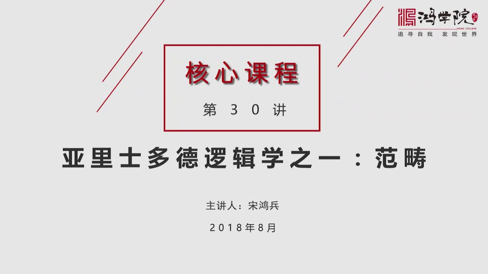
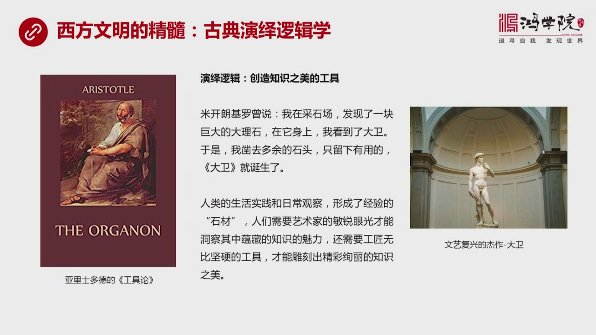
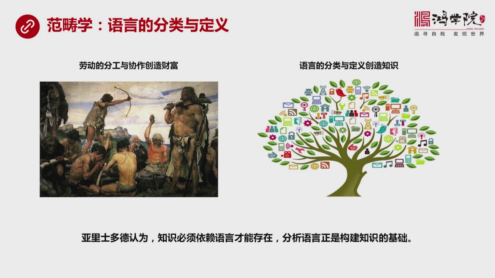
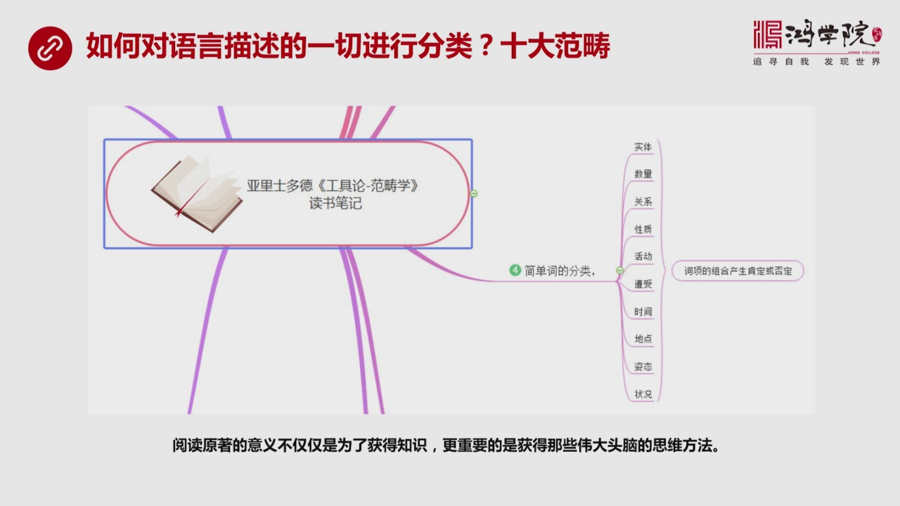
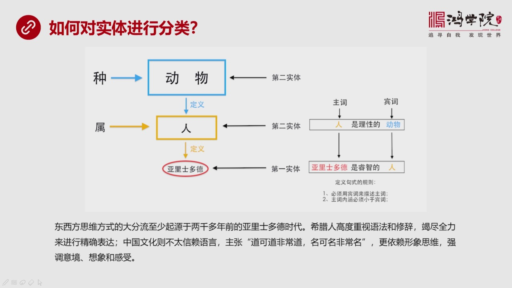
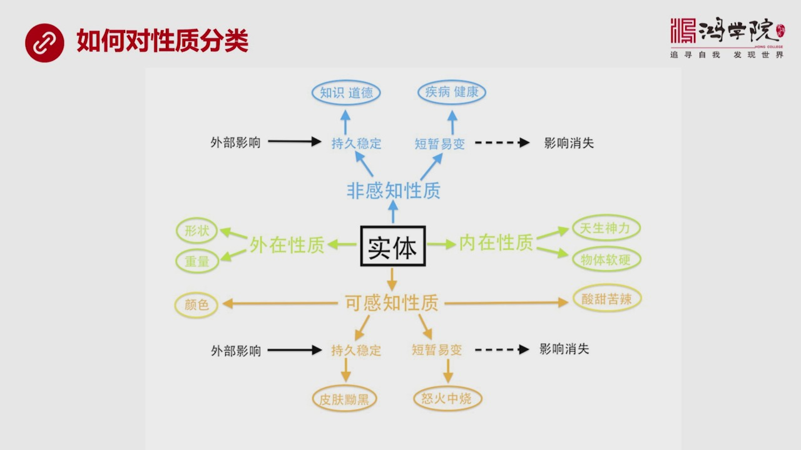
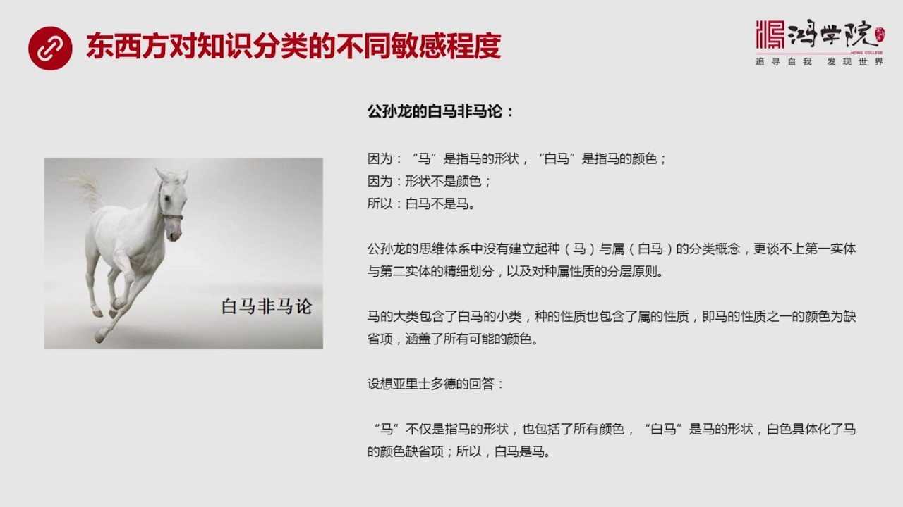
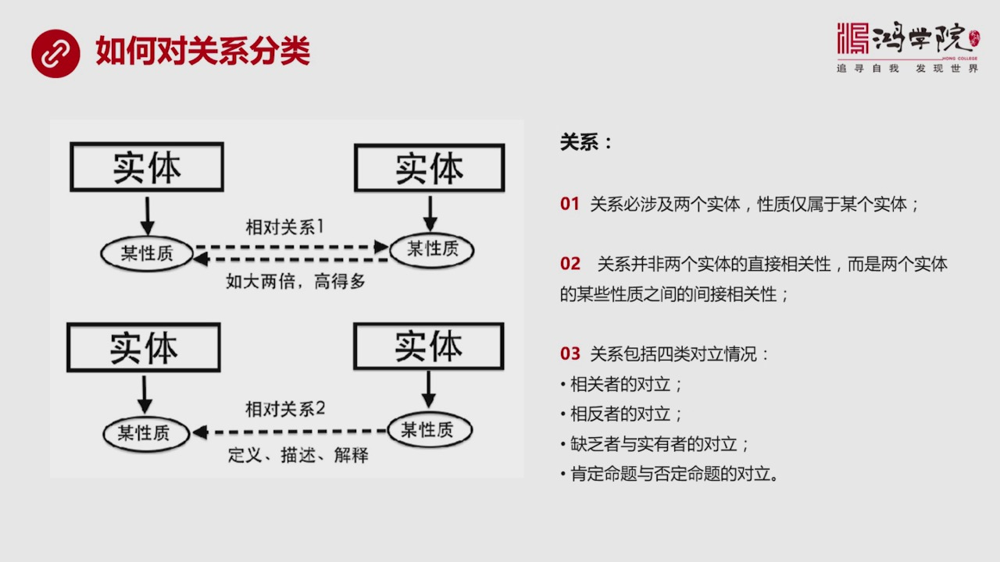
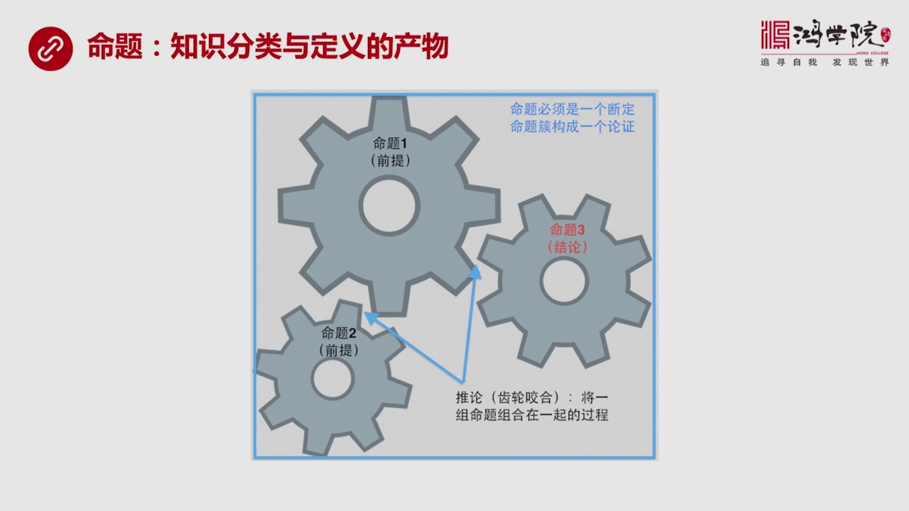
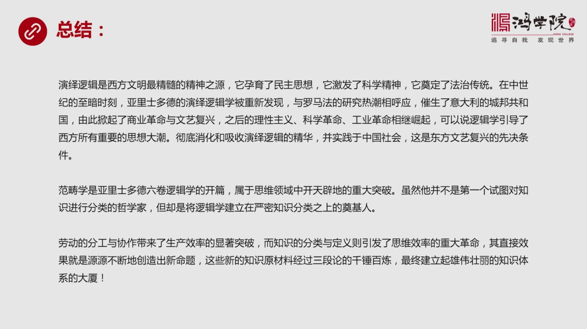

# 核心课视频-030讲. 亚里士多德逻辑学之一：范畴篇（视频） — Clean Slide Notes

> **来源**：鸿学院核心课程  
> **幻灯片**：12 张

---

### Slide 1

亚里石多德的邏计学,第一部分,范愁学在这里我想说明一下我们这个系列的邏计小课程主要是以亚里石多德的邏计学六券作为一个主线所我为什么没有挑其他的这种邏计学的教材当然这种教材有很多主要的原因是我希望我们能够通过独元柱不仅能够了解邏计学它的发展的源头特别是能够通过独元柱来理解这些伟大的人物它的思想方法它当...

---

### Slide 2

它最重要的精髓也是最显著与东方文明的差距就在于它是用演艺邏计在思考一些问题可以说演艺邏计塑造了整个西方的文明这就是为什么我们需要深入去理解演艺邏计的本质究竟是什么我们在小学中学和大学基本上没有专门开过邏计学的课程所以红院的同学也好社会上的很多人事业好大家在表述问题在辩论在输血文字在讲演在一切场合表述...

---

### Slide 3

很多人其实并不理解为什么亚理说得得会把范仇学当成第一讲来讲罗季学而不是直接跳到命题三段论和有关这种知识听起来好像那个更像罗季学范仇学为什么这么重要他放在开篇呢在我看来亚理说得得的方法论是什么呢他认为知识必须依赖语言才能存在我们思考一下你在想任何知识的时候你在经营思维的时候你在经营越读的时候我们必须要...

---

### Slide 4

这个工作从一开始来看的话可以说是无比的复杂其实工具论亚利斯多德这个明天我早在大学时候就读过但是说实话当时了人生跃离还有对问题的理解力并不足以真正的明白亚利斯多德为什么要怎么干只是觉得他那个这个工具论中写的那些语言把我的表述很混乱不明其所以然你只是说看到那些说法但是觉得总是没有抓住问题的要害当然现在我...

---

### Slide 5

怎么对实体性形分类呢我们看到亚里斯德德用了一套在我看来也是相当相当了不起的一种分类方法他首先定义种书和具体的这个东西三层的关系比如说种吧我在图中用的是比如说动物这是一个种一大种这是一个大类书是一个小类就是人人是属于动物的这个大类中间的一个组成部分然后亚里斯德德是一个具体的人他当然属于人这类当然也间接...

---

### Slide 6

这么一个一个走下来因为有些东西很简单像数量关系像什么活动关系像这样的一种东西我没有必要去深入去讲因为望文生意大家看了就明白了关键是讲中间比较难的部分就是比较核心的部分你比如说性质刚才讲的是刚才我们讲的是这个实体实体是最重要的除了实体之外就是实体的性质因为所有关于性质的这种这种词它必然负助于某个实体如...

---

### Slide 7

我们可以从这个例子中看到东西方对知识分类的不同的敏感敏感程度白马菲马论这在中国立上是个非常有名的逻辑学的备论公孙龙的出生时间其实跟亚洛兽德的差不多稍晚稍晚一些亚洛兽德去设的时候他他还没出生隔了几年可以说他们是同时代的人吧那么公孙龙也是中国立上哲学家中间比较有名的鬼便学家他代表一大派而他最诚明的就是白...

---

### Slide 8

关系什么呢关系一定是设计到两个实体的某个实体跟某个实体之间比如说一座山是另外一座山比另外一座山高那就必然设计到两个东西的比较这是相对关系一种相对关系或者某个物体它的尺寸是另外一个物体的两倍这也是一个实体跟另外一个实体的相对关系但是亚里斯多德在工具篇中没有明确指出的是它并不是直接比实体和实体而永远比的...

---

### Slide 9

他的目的是什么呢他的目的是要创造一个产物这个产物就是命题当我们把知识进行分类之后然后进行有效的组合有了分类就有了定义然后把这些这些相关的词像进行不同的排列组合就会产生就会生产出不同类型的定义有全程的有特程的有肯定的有否定的四大类的命题然后这四大类的命题就会形成一个尺轮我特别愿意用尺轮相互咬合来形容演...

---

### Slide 10

在我看来演艺逻辑是西方文明中间最精髓的那种精神之源可以说有了演艺逻辑之后它才能够运营民主思想它才能夕发科学精神它才能垫定法制着传统后来到中世纪最黑暗的时候其实亚律师多德的演艺学演艺逻辑学正式在那个时刻发现的被重新发现从一发现之后同时代研究罗马法这个热潮也在星期所以这两股潮流结合在一起结果就导致了一大...

---

### Slide 11

这只是一个开篇未来我们会在一系列课程中把亚里斯多德的六篇逻辑学主义进行介绍好今天我们课就到这里谢谢大家

---

### Slide 12

---
