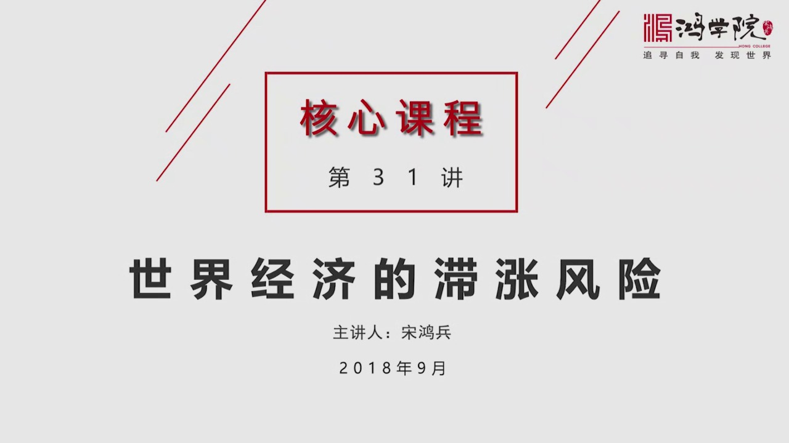
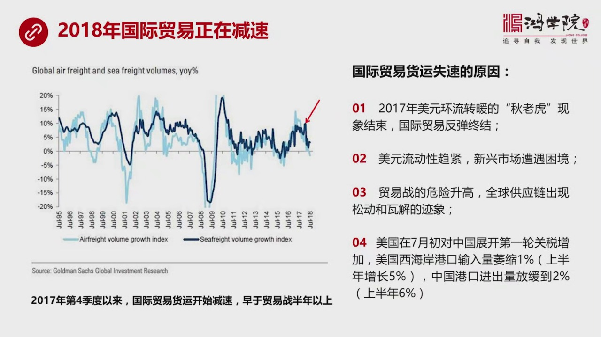
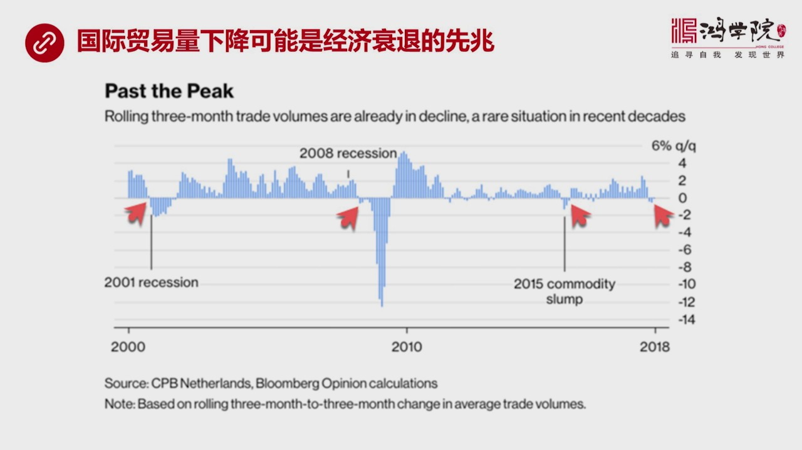
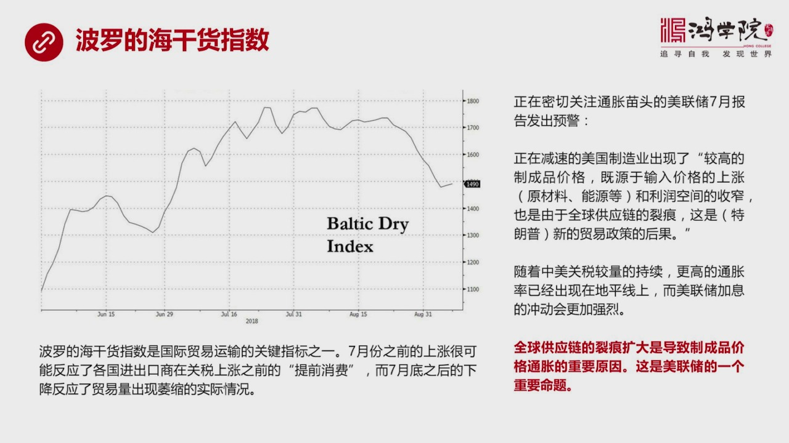
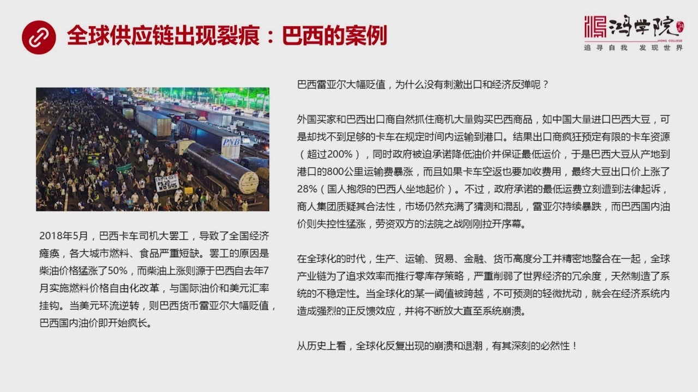
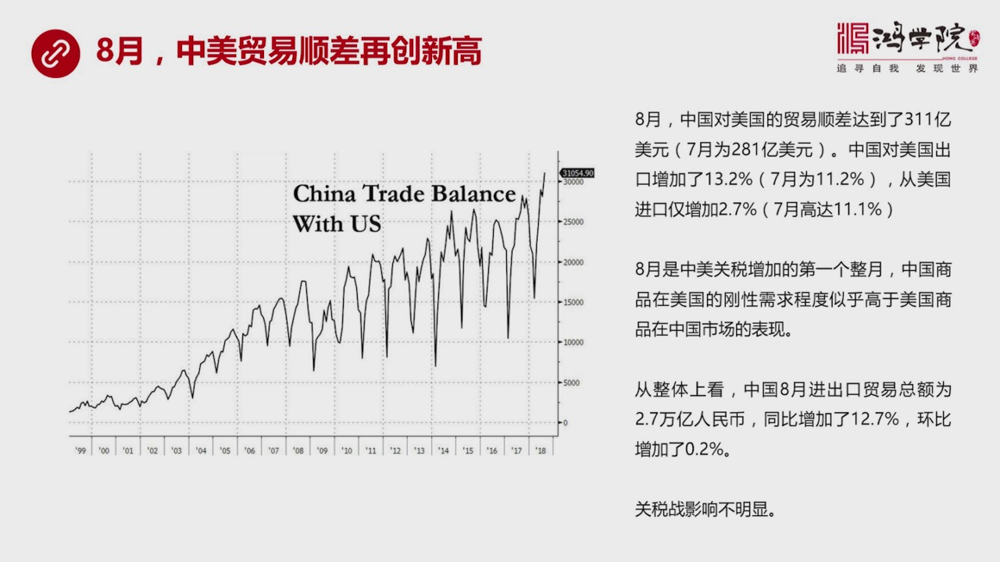
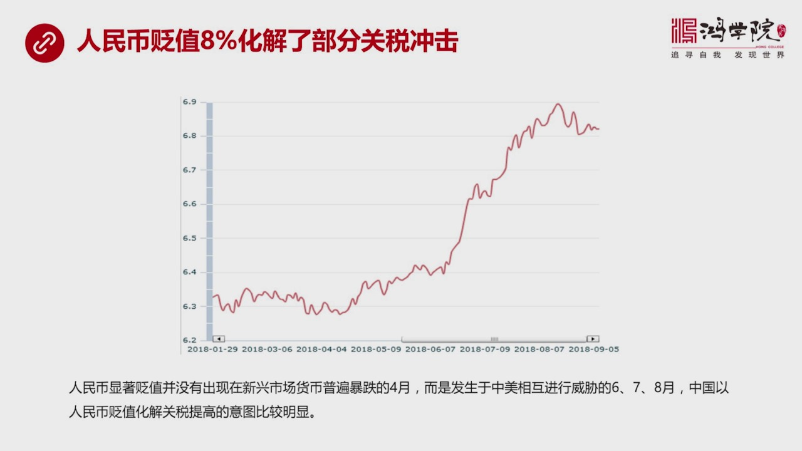
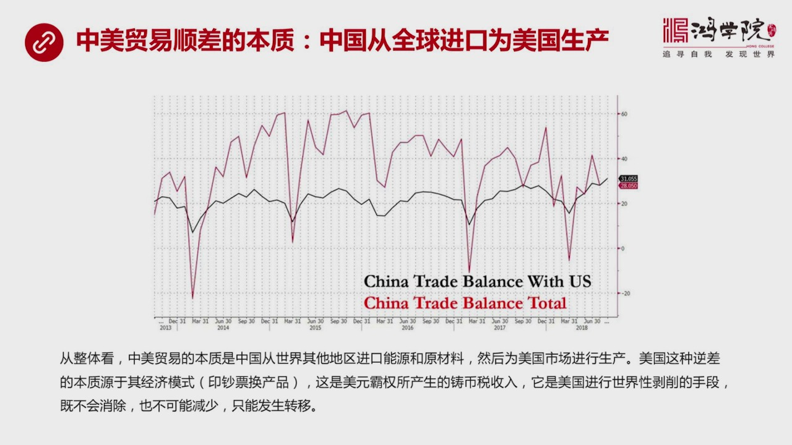
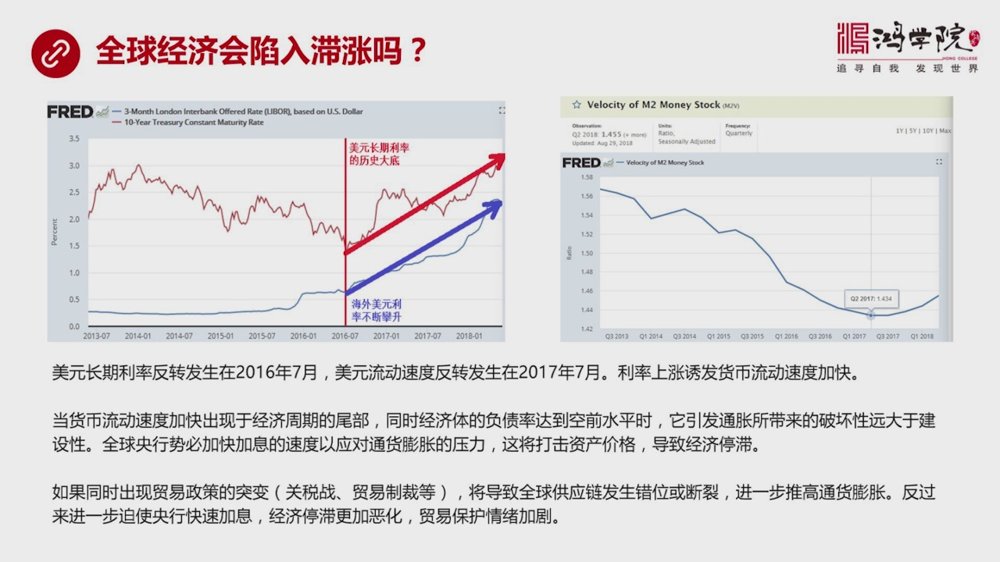
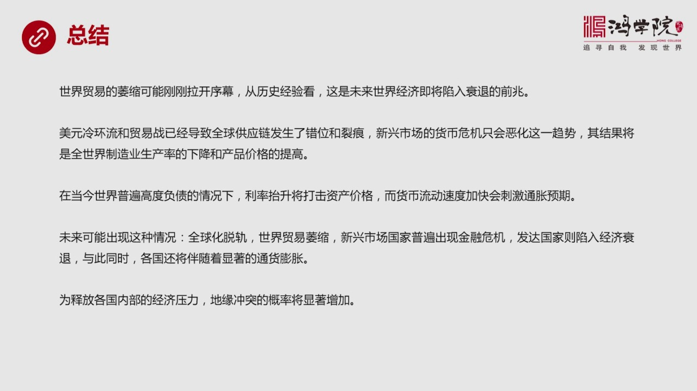

# 核心课视频-031讲. 世界经济的滞涨风险（视频） — Clean Slide Notes

> **来源**：鸿学院核心课程  
> **幻灯片**：11 张

---

### Slide 1

世界經濟的智障風險我們大家都知道在七十年代的時候由於出現了兩次石油危機同時還有美元脫離一金本位1971年所以在那個時代出現了全世界範圍內的經濟衰退同時伴隨著嚴重的通過膨脹所以人們把那個時代稱之為是一個智障的時代那麼我們今天談一談往未來看世界經濟有沒有出現智障的這種風險呢?我們現在看第一頁從目前的這個...

---

### Slide 2

就是2018年以來國際貿易它正在出現一個減速的情況比如說左邊這張圖我們可以明顯看出來從2017年第四季度以來國際貿易的後應量以速度來看的話它其實已經開始失速了其實這個時間點是比我們大家現在最關心的貿易戰問題要早半年以上也就是說在2017年的年底從那時候開始全球貿易它就已經開始減速了我記得我們以前說過...

---

### Slide 3

如果我們從歷史經驗來看的話它往往意味著經濟衰退的前召如果我們看20年以來有四次比較明顯的這樣的一種這個國際貿易量的下降剛才我說的是這個增長速度的變慢其實從現在反過來倒退三個月的話你會發現十幾貿易量也出現了下降那麼前三次一次是ITPOP莫破裂的2001年出現了經濟衰退還有一次當然就是2008年出現的經...

---

### Slide 4

從這個波羅地海干貨指數我們其實也可以看到國際貿易量出現了一些微妙的但是非常值得關注的一些信息波羅地海干貨指數它是國際貿易運輸的一個關鍵性的指標7月份之前我們看到它一路在爬升主要原因是什麼呢很可能是反映了各國面臨貿易戰這種威脅比如說關稅即將增加或者預期要增加所以大家拼命趕在關稅上漲之前大量買貨大量進口...

---

### Slide 5

在這裡我們有個現成的例子就是巴西出現的卡車工人大霸功這是一個非常典型的案例我們可能看到新聞都知道在5月份的時候巴西的卡車司機大霸功持續了10天結果導致了全國經濟整體的貪汗比如說各大城市的燃料食品嚴重短缺因為巴西這個國家跟中國不太一樣它的鐵路運輸比較脆弱主要的這種城市貨運是靠這種卡車所以當卡車司機霸功...

---

### Slide 6

現在讓很多人很吃驚不光是中國的很多人吃驚美國的很多人也很吃驚因為8月份中美貿易出現了一個順差的新的情況就是中國的順差再創歷史新高而不是大家以為的由於美國對中國很多商品提高了關稅那麼顯而易見中國的貿易應該委縮對美國的貿易逆差應該減少為什麼中國的貿易逆差中美之間的對美國的逆差或者說對中國的順差再次創造歷...

---

### Slide 7

沒有出現一個由於關稅增加而導致出口對美國出口繼續下降的原因除了說中國商品在美國上上剛性比較好就是它很很難被人家替換比如說你可以換越南的但是越南的生產成本高你可以換印度的但是印度沒有這麼大生產規模滿足不了你的市場對規模和量的需求這是一方面原因另一方面原因是中國在8月份的時候或者在最近幾個月吧明顯出現了...

---

### Slide 8

其實在我看來這張圖把這個問題已經解釋得很清楚了就是中國對美國的貿易順差基本上從數量上相當於中國和其他權限其他國家之間的貿易的這個逆差相平衡也就是換句話說我們可以這麼來理解吧就是假如沒有對美國的順差那麼中國跟美國以外的其他國家做生意做貿易我們是逆差的中國是出現了逆差那麼為什麼會出現這個現象或者我們怎麼...

---

### Slide 9

我覺得我們可以從兩個方向來看第一個方向就是看我們核心課以前講過了一個內容就是美元利率的反轉長期利率的反轉和美元流動速度的變化在以前的課程中我們專門提過2016年的這個年中6月7月這個時間點是美元長期利率的最低點這是一個歷史性的大底最低的時候美國十年國債收益率到了1.63%我說是歷史性大底不是30年的...

---

### Slide 10

我們現在剛剛看到跡象它很有可能是剛剛拉開序幕未來這個趨勢還會延續而從歷史經驗上看這是未來世界經濟陷入衰退的前召美元化流變冷還有貿易戰這些問題導致了全球供應鏈發生了錯味和烈痕比如說美元化流變冷導致了巴西很多新上國家出現了嚴重的問題好全球供應鏈如果放到那兒這個供應鏈就會發生錯味發生斷鏈那麼這些國家的貨幣...

---

### Slide 11

謝謝大家

---
