# 核心课视频-032讲. 亚里士多德逻辑学之二：解释篇（视频） — Detail Slide Notes

> **来源**：鸿学院核心课程  
> **幻灯片**：14 张

---

### Slide 1

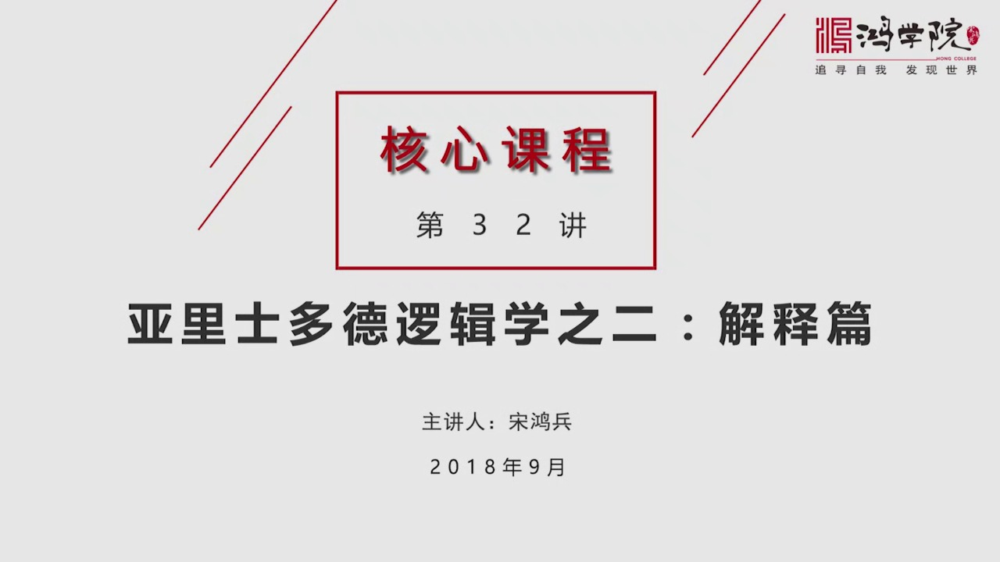

亞里斯多德邏輯學的第二篇解釋篇如果我們看第一頁,什麼是解釋篇?解釋篇就是關於命題的理論

<strong>All subtitles</strong>

> 亞里斯多德邏輯學的第二篇解釋篇如果我們看第一頁,什麼是解釋篇?解釋篇就是關於命題的理論

---

### Slide 2

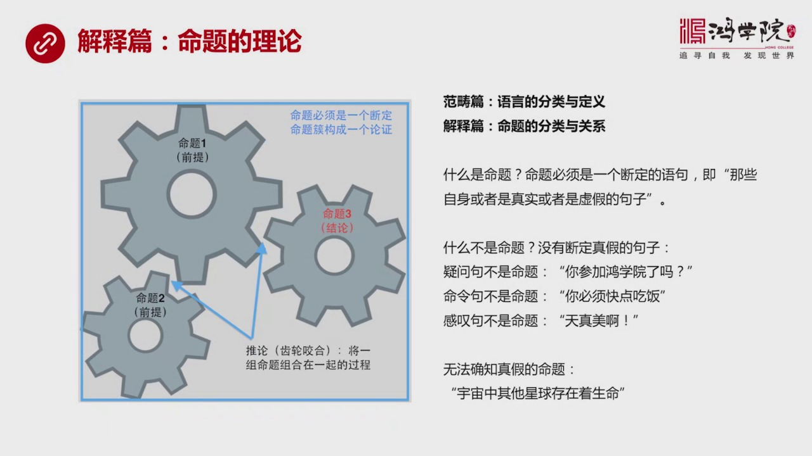

我們在邏輯學的第一講中專門講到了亞里斯多德的範疇篇範疇篇也就是亞里斯多德認為思維它的一切的基礎是靠語言所以我們要有效的分析思維的結構就必須要從語言分析開始它正式通過對語言的分類和定義通過範疇學的這樣一...

<strong>All subtitles</strong>

> 我們在邏輯學的第一講中專門講到了亞里斯多德的範疇篇範疇篇也就是亞里斯多德認為思維它的一切的基礎是靠語言所以我們要有效的分析思維的結構就必須要
> 從語言分析開始它正式通過對語言的分類和定義通過範疇學的這樣一套體系建立了整個邏輯學、
> 演繹邏輯學的基礎我們可以類比經濟學亞當斯密提出的勞動的分工與協作勞動的分工和協作帶來了生產率的提高那麼如果我們對語言進行分類和定義將會帶來思
> 維效率的提升我們在上眼中用到了左邊那張圖我把演藝邏輯思維的這套體系形象表達為尺輪傳動系統各個不同的命題在相互搖合的過程中就像尺輪搖合一樣不斷
> 的推動思維的推理的過程最後得出新的結論、產生新的知識所以今天我們要談的解釋片重點就是產數命題的它的一系列原理也就是命題的分類和命題之間的關係
> 那麼什麼是命題呢?命題首先必須要是一個斷定而且它同時是一句話用亞里斯多德的原話來說命題不是一般的句子命題是那些自身或者真實或者虛假的句子因為
> 在語言中有大量的其他類型的句子它認為那些的屬於修詞學團為比如說師哥、散文、不同的表達方式但並不斷定任何事情並不提出這件事情是真實假這樣的判斷
> 這些都不屬於命題的範疇什麼不是命題呢?我們可以舉幾個例子比如說一問句它就不是命題你參加紅月圓了嗎?這是一個疑問還有命令句也不是命題就是你必須
> 快點吃飯這是一個命題嗎?當然不是同樣感嘆句也不是命題比如說今天的天真美當我們說到這句話的時候美是一個主觀的你自己的一個描述代表你的意見但是別
> 人不一定同意也許他今天心情很糟他覺得天意一點都不好所以這種描述他不是一種斷定沒有客觀性沒有必然性另外還有一些雖然是命題的這個表達方式但是我們
> 在現有了知識體系之內是無法判斷它是真是假的比如說宇宙中其他星球存在著生命這顯然是一個命題而且這個命題顯然的結論要麼是真要麼是假不過我們現在卻
> 無從判斷因為我們現在還不具備足夠了宇宙學和外太空的這種知識體系所以我們不知道那麼也就是說我們在討論命題的時候必須要確定它的基本的組成的成分它
> 必須要是一種特殊的表達的語句來斷定一件事情是真還是假這是命題的最基本的理念也是它的核心搞明白這點之後我們在看第二頁命題首先是一句話是一個句子為什麼亞里斯多德會提出這樣的一個思路呢

---

### Slide 3

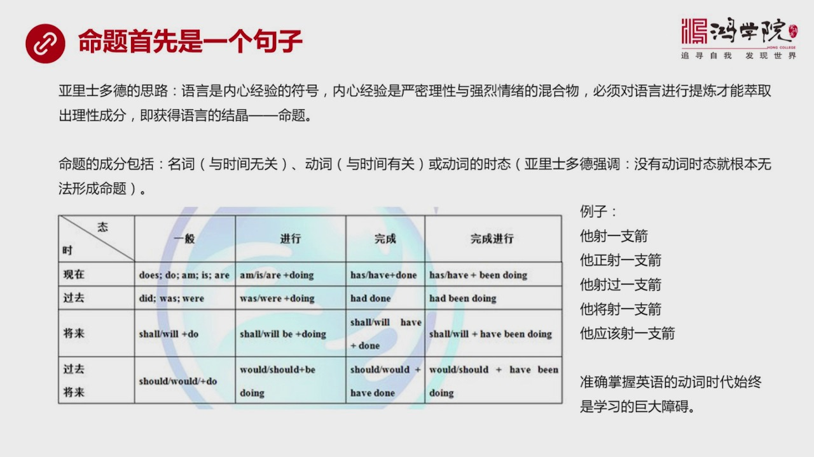

就是如果我們讀它的原住為什麼我強調讀原住原住不僅能夠看到它的結論在我看來更重要的是通過原住的閱讀你可以理解它的思維方式也就是了解它的思路而我認為了解它的思路比知道它的結論還要重要當然我們在我們的傳統教...

<strong>All subtitles</strong>

> 就是如果我們讀它的原住為什麼我強調讀原住原住不僅能夠看到它的結論在我看來更重要的是通過原住的閱讀你可以理解它的思維方式也就是了解它的思路而我
> 認為了解它的思路比知道它的結論還要重要當然我們在我們的傳統教育中間可以說都是以結果為導向我們不關注過程我們不需要了解過程我們只是想盡快知道結
> 果但是正是由於長期的這種教育體系的對於結果的追求使得我們喪失了探索過程這種能力甚至包括這種興趣都沒有這就是我們必須要回到一些偉大著作的它的原
> 始文字上來通過這個精獨這些原住能夠逐漸地了解這些偉大的思想家們他們為什麼會冒出這些在我們看來特別是我讀原住的時候非常不能理解它的思維方式你必
> 須要反復讀然後慢慢才能摸到它的門道它為什麼會這麼想問題所以我讀了很多遍之後我自己的結論就是它在提到這個命題的時候它是一種什麼樣的思維方式呢它
> 的意思是說我們內心都有一種生活的內心的經驗那麼語言是用於表達這種內心經驗的一種符號而我們一般人的內心這種活動內心經驗記包括嚴密的理性的部分同
> 時也夾到這大量的強烈的情緒它是一種混合物那麼我們如果想真正找到理性的部分就必須要對心理經驗包括它的這種符號語言進行高度的提存才能萃取中間那些
> 有效的理性的成分也就是獲得語言的結晶命題這是它的一個基本思路所以我們在讀它的原住所它寫的有時候你會覺得寫的非常的繞口或者非常的難讀但是你需要
> 理解它為什麼會這麼想問題這個過程一旦適應了之後你會發現它的思維方式跟我們的思維方式確實有極大的不同你比如說它對命題的成分進行了分析名詞首先提
> 出了一個命題中間必須要有名詞主向這個名詞跟時間無關這句話我在讀到的時候就有一種情緣類的感觸為什麼我在想名詞的時候沒有做夢出來它跟時間之間的關
> 係我並沒有去想它跟時間之間的關係而被它點名之後你才意識到它原來是這麼想問題的它把一切東西跟時間掛上勾比如說它談到動詞的時候偽像中間的這個動詞
> 它說動詞就是一種語時間有關的表達方式這就讓我感受非常深因為表達一個行動一定是在一個時空中展開一定是與時間存在了相當密切的關係除了動詞之外還有
> 動詞的時態這個給了我另外一種深刻的體會因為亞里士多德在他的書中專門強調了沒有動詞的時態就根本無法形成命題這句話給我印象非常深刻因為我們中國人
> 在想一句話的時候主語、衛語、名詞動詞我們是可以理解的但是對於動詞的時態包括名詞中間的格我們是相當不熟悉的你比如說我們就拿英語來說當然我們知道
> 亞里士多德它肯定是用的希臘語我們用英語進行類比因為希臘語我本人不是很熟悉所以沒有辦法有一個深刻的感受但對英語我們從小到大都學過那麼對英語的時
> 態我覺得這可能是中國人學英語最難功課的一關學了十幾年、二十幾年一直到今天當你跟外國人用英語交流的時候你仍然會發現時態是經常犯錯的地方稍微不注
> 意就會犯錯你必須要集中全部注意力才能把控住時態為什麼?因為我們思維習慣中間我們的語言中間我們的漢字中間缺少時態的概念所以在精確表達用英語進去
> 表達的時候我們的表達習慣中不太擅長或不太習慣準確的形式太比如說英語中的時態可以分成十和太兩個部分十是代表時間的關係太是代表行為的狀態它可以分
> 成十六種多達十六種的這種表達方式而我們用中文表達起來你要把這十六種表達方式進行非常精確的復原事件極其困難的事比如說我舉個例子它設一之間這是一
> 般的現在事它正在設一之間這可能是進行時它設過一之間它將設一之間它應該設一之間我們用了五種方式來表達設建這個狀態但是你別忘了英語中間還有一共有
> 十六種表達方式而某些表達方式對我們來說就極其困難你比如說將來完成進行時過去將來完成進行時怎麼來用中文來進行準確的表達這是一個極其困難的事情我
> 們不習慣去說這種話而且即便你能說出口別人聽起來也非常的難以理解它不明白你要說什麼問題比如說我們看下一頁下一頁我在思考這個問題的時候從當然你可以

---

### Slide 4

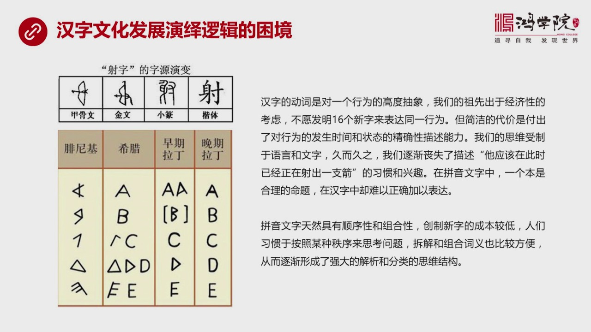

為什麼我們對實際上這個東西不太重視可以有很多種解讀我是從文字角度提出了一個思路或者說我認為漢字文化在發展演藝邏輯中是面臨困境的你比如說我剛才說設建這個設置我們可以從甲谷文意識到現在的臺體我們可以看到它...

<strong>All subtitles</strong>

> 為什麼我們對實際上這個東西不太重視可以有很多種解讀我是從文字角度提出了一個思路或者說我認為漢字文化在發展演藝邏輯中是面臨困境的你比如說我剛才
> 說設建這個設置我們可以從甲谷文意識到現在的臺體我們可以看到它的演化過程就是我們左邊這張圖漢字的動詞當然也包括名詞我們現在強調比如說設這個動詞
> 它是對一個行為的高度抽象它的原始狀態就是一把弓箭一個人設建的狀態逐步演化成了現在的漢字設所以它是對一個行為的一個形象化我們可以設想上設想它是
> 一個圖片這個圖片之後對圖片進行了高度提煉之後形成了一個字也就是我們祖先當時可能由於書寫的成本問題比如說你要用竹剪再往前可能要用無歸的背那些玩
> 意兒都是屬於成本非常高的原材料你要在上面寫字不光是時間成本還有材料的成本它是非常昂貴的所以我們的祖先發現我如果要用就像希臘人一樣或者像後來的
> 拼紋字這樣如果要表達一個設置我要用16個時代來表達那麼就意味著我要發明16個字來表達同樣一個行為這個東西太負擔而且成本太高所以我們簡化了簡化
> 其實就是一種抽象和體煉這也是中國人為什麼歸納邏輯比較強某種意義上來說某種歸納思維的能力特別強我們把萬數萬物可以體煉抽象成金木石河土抽象成陰河
> 洋抽象成道這是由於我們的紋字在很大重視上它使得我們願意進行這種高度抽象的表達方式高度抽象帶來了表達的簡潔但是這種簡潔是有代價的這種簡潔的代價
> 就是導致我們對行為發生的時間和狀態這種精確性的描述能力受到了損失我們的思維仍然是受到語言的限制受到漢字這種語言的限制我們不管想什麼事其實你仔
> 細想想你都是在用紋字在思考沒有紋字就不可能有思維那麼漢字這種高度抽象高度簡潔的表達方式當然也會影響我們的思維那麼久而久之我們就逐漸喪失了描述
> 一種精確精確行為的各種不同的時間和行為狀態的這種能力就像剛才我說的那個例子如果用一個非常複雜的一個實態來經表達我們怎麼說清楚這個狀態呢比如說
> 它應該在此時已經正在射出一支劍我的天哪一般人不可能這麼表達一句話你也不太明白哪怕你根據這個標準時代做了描述你自己也不太明白你到底要說是什麼意
> 思更別說你的聽眾什麼叫它應該在此時正在射出一支劍呢太繞口所以我們逐漸就喪失了這種表達的習慣也喪失了這種表達的興趣這就是我們在思維的過程之中受
> 到語言的限制導致了我們對16種行為狀態中間我們只取了少數幾種進行描述而更多的更精細的這種表達方式我們逐漸放棄了如果亞利斯多德所說的沒種語態沒
> 種實態都是一個有效的命題他說這句話是完全正確的也就是說我們在16種中間可能經常表達5種而喪失了9種命題的表達方式就導致了我們當然在思考邏輯方
> 面的問題建立命題的時候你會天然就缺少很多東西而在拼文字中間這正好是它的強項拼文字是源於菲尼基的這種3000多年前菲尼基所發明的這種拼文字當然
> 最早在菲尼基人之前全世界都是用的些性文字兩個流域的向性文字後來的埃及包括中國這些國家的使用的這種文字都不是拼文字但是菲尼基人由於在地中海東岸
> 做生意特別是做以前我們在節目中談到的一種染料生意推羅子那麼還有很多這個訪世品貿易的這種生意他們是海上民族經常做生意在做生意過程之中就由於你的
> 這個厚量太大所以導致如果你用些性文字慢慢一個字一個字去课這個效率太低他們就發明了一種素季素季法用埃及文字中間的某一些形狀把它抽向出來變成一個
> 符號然後用幾個符號組合在一起來表達一個貨物時間長了菲尼基人就慢慢體驗出了這個字母的這套體系比如說他就進化出了26個字母然後再往後希拉人借件了
> 再往後拉丁文字也借件了這就演化出了現在所有的西方文拼文字的這套體系注意我們再用拼文字表達就從文字的這個表達方式來看你就會很容易發現漢字是一幅
> 畫而拼它是個寂寞的組合它有著高度的排序性和高度的組合性這是它最重要兩個特性順序不用說我們看到英文字點中它從A到Z很容易把所有的這個單詞都排序
> 排得很準確但是我們用中文的你要按著順序來排的話中文怎麼進行順序排序很困難只能按筆畫或者按拼音在沒有拼音之前那只能按筆畫而你要按筆畫去查一個案
> 子我的天啊這個工作上實在太大而且相當的複雜換句話說我們的文字漢字中間缺少排序的內在的屬性組合性也一樣拼音文字是很容易把它拆開然後重新拼接創造
> 新字的也就是說它們創造新字這種成本很低而拆解很容易拼接也很容易也就是人們在玩弄這種文字的時候或者在進行這種書寫思考在做任何的跟文字相關的工作
> 過程之中它們特別容易也特別善於把文字拆開把拼音也拆開進行重新組裝這種拆解和組合意味著什麼拆解就是分析組合把相同的東西組合在一起這就是分類所以
> 它這種文字天然的這種排序性和組合性導致了它們長期經過這種訓練之後它們思維結構中間解析問題分析問題和分類就成了它的強項而對我們來說這是漢字的短
> 處這就導致兩種不同文明進化的不一樣的路徑好我在這滿收這個問題的時候當然提出一種假設當然我們也可以從其他的方面進行這種解讀為什麼要做這件事情就
> 是我們得明白為什麼我們的思維方式跟它們不一樣從什麼時候開始不一樣因為什麼不一樣的你搞明白這些東西之後然後你再去深入去研究當你讀這個壓力師都的
> 援助的時候你才會想明白為什麼我們從來不會這麼想問題它這麼想問題太奇怪了你只有追根碩原才能找到問題的本質好我們看下頁命題的核心究竟是什麼

---

### Slide 5

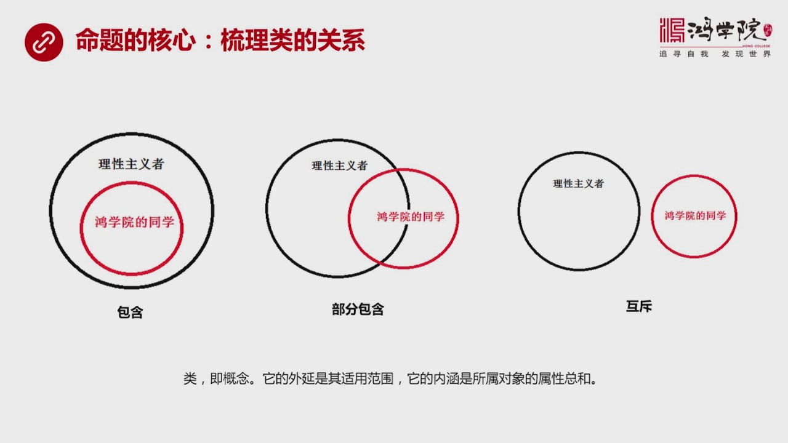

在我來看簡單說起來就一句話梳理類的關係什麼是類類就是概念一個概念它有外言也就是它的使用範圍什麼東西被包括在內它還有內含它的內含就是它包括在內的所有的這種研究的對象它們所有的屬性的總和明白這個道理之後我...

<strong>All subtitles</strong>

> 在我來看簡單說起來就一句話梳理類的關係什麼是類類就是概念一個概念它有外言也就是它的使用範圍什麼東西被包括在內它還有內含它的內含就是它包括在內
> 的所有的這種研究的對象它們所有的屬性的總和明白這個道理之後我記得上一次我們講過白馬飛馬論公孫隆的這套軌變邏輯其實你要受過嚴格的邏輯訓練演繹邏
> 輯的訓練你當然當然馬上你就知道馬的屬性中包括所有白馬的屬性所以馬的外言更大它的內含中包含所有白馬的這種屬性的總和所以白馬當然是馬的一種那麼就
> 不可能存在軌變的任何的可能性這就是嚴格邏輯推理之下公孫隆這種它的這種軌變就根本沒有生存的餘地但是它在中國立上你會看到無數的很了不起很著名的儒
> 家的這些大學者找他辯論居然說不過他為什麼因為他們這些人普遍缺乏或者共同缺乏的就是一套思維的體系沒有乾淨體系那就沒有辦法僅討論明白這個之後我們
> 在談到命題的時候其實命題的核心就是在探討一個類跟另外一個類之間的相互關係一個概念跟另外一個概念之間的相互關係這就是命題的核心所有命題談的都是
> 幾個類幾個概念類之間的它到底是什麼關係舉個簡單例子類包括三種一種包含包含什麼意思呢比如說我在這兒用一個圖形來表示同學的同學這是一個類這是一組
> 人或者叫一個類它也是一個概念同樣理性主義者是一個更大範圍或者更大外延的一個概念這兩個概念是什麼是怎麼來表達呢如果是一種包含關係的話那麼比如說
> 我們認為同學的所有同學都是理性主義者那麼這個圓圈的外圍就是理性主義者同學的同學被完全包括在內這就是馬和白馬這間的這種關係是包含關係當然了也有
> 人會說同學的同學並不都是理性主義者還有很多很感性所以我們看中間這個圖它就叫部分包含這種關係同學的同學中在交叉部分有些人是在理性主義者之外有些
> 是屬於理性主義者這叫部分包含還有呢還有一種可能就是紅血的每一個同學都不是理性主義者這兩個概念完全是不交叉的當然我希望不是這個情況事實上也不會
> 是這個情況紅血的同學最有可能是中間這個情況一部分人是理性主義者一部分人是感性主義者但是我們用這個三個框圖可以把這個命題的核心抓住它要探討的就
> 是一組概念一組類之間他們到底是什麼關係所以整個的演繹思維邏輯體系就是建立在命題之上而命題要討論的就是類與類之間存在著什麼關係好明白這個道理之後我們再看下一頁那麼命題職業命題包括四大類

---

### Slide 6

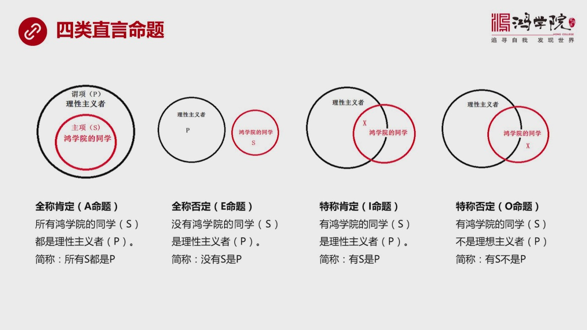

這四大類什麼呢在這個圖上我們看最左邊也就是紅血的同學完全包含在理性主義者這個範疇之內這個叫全稱肯定命題也就是A命題A類命題我們把中間紅色部分紅血的同學這就是主向簡稱為S理性主義者它是未像簡稱是P這句話...

<strong>All subtitles</strong>

> 這四大類什麼呢在這個圖上我們看最左邊也就是紅血的同學完全包含在理性主義者這個範疇之內這個叫全稱肯定命題也就是A命題A類命題我們把中間紅色部分
> 紅血的同學這就是主向簡稱為S理性主義者它是未像簡稱是P這句話怎麼表達呢就是所有紅血的同學S都是理性主義者P如果我們簡稱就是所有S都是P那麼第
> 二種類型的命題叫一命題全稱否定全部都否定簡單來說就是沒有紅血的同學是理性主義者這個簡稱就是沒有S是P第三類叫特成肯定i命題有紅血的同學是理性
> 主義者簡單說就是有S是P在這個圖中我把X標註在兩者交叉的部分代表有人是在那在兩者中間的交叉地帶那麼第四類是特成否定O命題就是有紅血的同學不是
> 理性主義者簡稱有S不是P所以AEIO代表了四類之間命題的最根本的類型尤其只有這四類好簡單了解這個概念之後我們再看他們之間的關係第一種關係叫矛盾關係

---

### Slide 7

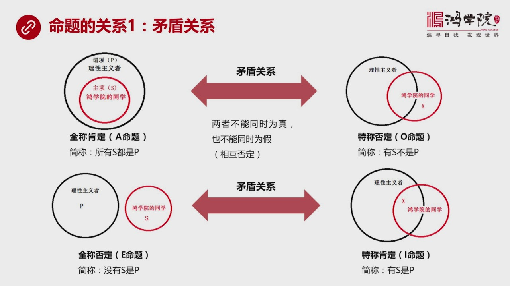

兩個命題之間是相互矛盾的什麼叫矛盾否定相互否定比如說我們來看第一組第一組就是全程肯定A命題所有S都是P跟他相矛盾什麼呢有S不是P從圖中我們可以看到這兩種顯然矛盾如果說所有S都是P的話如果說你你說有一個...

<strong>All subtitles</strong>

> 兩個命題之間是相互矛盾的什麼叫矛盾否定相互否定比如說我們來看第一組第一組就是全程肯定A命題所有S都是P跟他相矛盾什麼呢有S不是P從圖中我們可
> 以看到這兩種顯然矛盾如果說所有S都是P的話如果說你你說有一個情況是有S不是P這兩者之間是一定會發生相互否定的有你無我有我無你這就叫相互否定這
> 就這就是矛盾關係矛盾關係兩個不可能同時是真也不能同時是假它就是矛盾的相互否定那麼再看第二個矛盾關係就是全程否定一命題就是沒有S是P從這個圈中
> 我們可以看到兩東西不相交那麼它跟他相矛盾的這個命題是什麼呢叫特成肯定i命題簡稱就是有S是P如果你說沒有S是P而我的結論而我的命題是有S是P這
> 兩者之間當然也是直接矛盾相互排斥有你無我有我無你所以這兩種兩種這個A和OE和I都是相互矛盾的這種關係這就是第一個命題之間的關係矛盾關係我們再看下一頁命題的第二個關係是什麼呢叫反對關係

---

### Slide 8

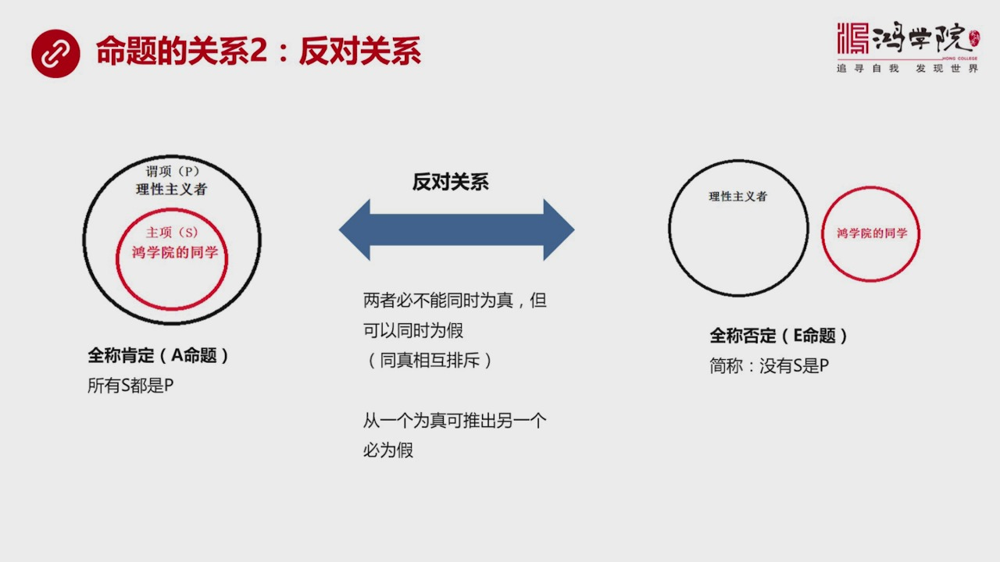

反對關係我們看這個圖其實也很明顯就是所有S都是P所有同學的同學都是力量主義者所有S都是P它跟什麼相反對呢就是沒有S是P這兩者是完全是排斥同征排斥兩者必不能同事為真從圖中你看可以看到如果是左邊那就不能是...

<strong>All subtitles</strong>

> 反對關係我們看這個圖其實也很明顯就是所有S都是P所有同學的同學都是力量主義者所有S都是P它跟什麼相反對呢就是沒有S是P這兩者是完全是排斥同征
> 排斥兩者必不能同事為真從圖中你看可以看到如果是左邊那就不能是右邊如果是右邊它就不能是左邊但是可以同事為假為什麼可以同事為假呢當然如果兩者有相
> 交的部分它就出現了例外了嗎兩者相交的部分說明什麼有一部分同學是力性主義者還有一部分不是所以在這種情況之下兩者都是假命題它是成立的所以這叫同征
> 相互排斥那麼我們可以從一個圍針推出另外一個幣為假如果你說所有S都是P那麼我們就推出另外一個沒有S是P必然是假的反過來也一樣如果沒有紅旋同學是
> 理性主義者如果這個是真的話那麼所有紅旋同學都是理性主義者這個命題必然是假命題這兩者是反對的關係相互排斥那麼這是一種反對關係我們再看下一頁還有另外一種反對關係這種反對關係

---

### Slide 9

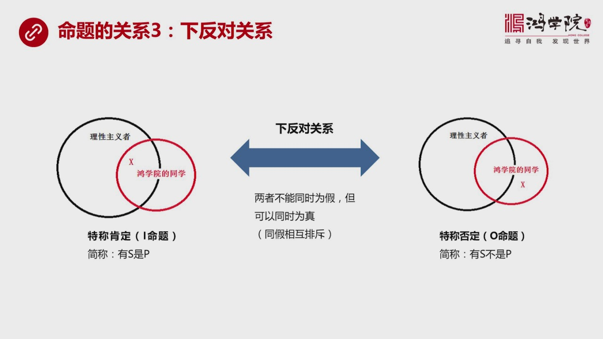

人們通常稱之為下反對關係一會我們看到一張圖大家就可以理解為什麼它分成下反對那麼下反對概念是什麼呢就是有S是P這種情況和有S不是P顯然我們看這個命題你會發現聽起來有問題但是從圖中我們一眼可以發現它能不能...

<strong>All subtitles</strong>

> 人們通常稱之為下反對關係一會我們看到一張圖大家就可以理解為什麼它分成下反對那麼下反對概念是什麼呢就是有S是P這種情況和有S不是P顯然我們看這
> 個命題你會發現聽起來有問題但是從圖中我們一眼可以發現它能不能同時是真的可以因為這個圖中已經顯示了我們會看到只要兩者相交那麼有S是P和有S不是
> P這兩個東西都成立因為這就是圖中所展現的這個情況有些紅旋同學是理性主義者有些不是所以有S是P有S不是P這兩個東西都可以同時是真沒問題但是不能
> 同時是假如果同時同時假的話這個圖我們就沒法化了所以這種排這關係它也是一種排斥所有反對關係都是一種排斥這種排這關係叫同假相互排斥當然我知道大家
> 在看到這裡說恐怕有點覺得抽象但是不要忘記壓力是多得琢磨這個問題不是琢磨了一天兩天也不是琢磨了就像我們現在30分鐘一個小時它是琢磨了很多年而最
> 後把它化成框土一步步提煉是它後代的很多邏輯學家經過了數百年的提煉所以你要覺得一下記不住或者一下腦子不是很清醒這可以說是百分之一萬的正常沒有人
> 能夠一下把這東西全部搞得很明白所以不要有這種沮喪我怎麼記不住很正常一般人包括壓力是多得本人也不能在這麼多的時間內全部把這個東西想得非常透貫穿
> 於心然後自由運用這需要很多年的功力好我們再看這是第三個關系我們再看下野第四個關系第四個關系叫什麼叫等差關系什麼是等差關系呢

---

### Slide 10

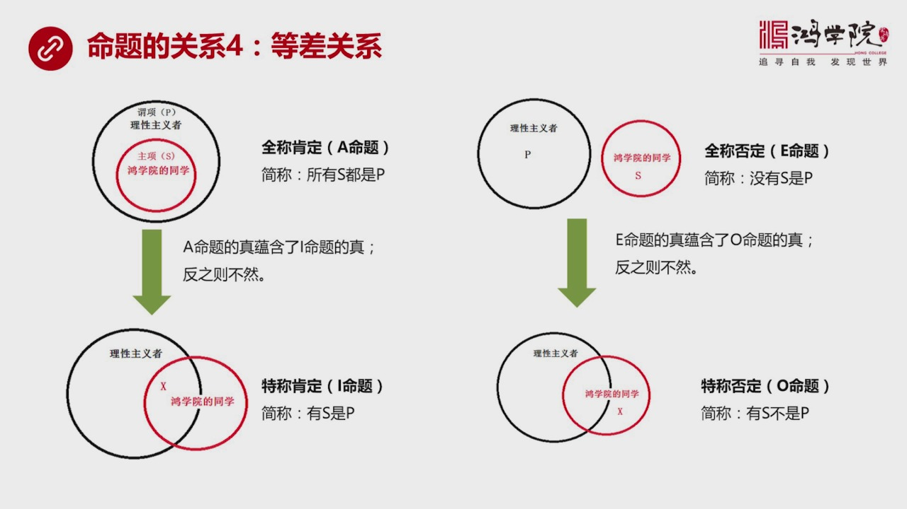

你比如說我們看左上角左上角就是所有洪學院的同學全部是理性注意者在這種情況之下跟下面這個有一部分洪學院的學生是理性注意者我們會發現如果上面這個命題是真的話那麼它自然包含著下面這個命題也是真就是A命題它的...

<strong>All subtitles</strong>

> 你比如說我們看左上角左上角就是所有洪學院的同學全部是理性注意者在這種情況之下跟下面這個有一部分洪學院的學生是理性注意者我們會發現如果上面這個
> 命題是真的話那麼它自然包含著下面這個命題也是真就是A命題它的真運含了I命題的這個它也是真就是如果說我們說所有洪學院同學都是理性注意者那麼顯然
> 洪學院中間的一部分有洪學院的同學是理性注意者顯然是可以推出來的注意啊這就是從命題中可以推出一個命題或者叫運含了一個命題所以我用綠色箭頭像下畫
> 表明它是可以運藏的是可以推導的這是一種情況還有另外一種情況還有另外一種情況就是右邊這個情況也就是沒有洪學院的同學是理性注意者這幫洪學院同學這
> 幫人全都是瘋狂的感性注意者完全不用理性思維的那麼底下這個命題歐命題就是有S不是P有的洪學院同學不是理性注意者當然這也是一個相互運含的關係從上
> 面那個命題可以推導到下面一個命題所以我們會看到從A命題中間它包含著A命題如果是針A命題就可以被推出來反之在另外一個角度來說我們可以看到A命題
> 為針歐命題也是被包含在中間的是運含關係但是反過來推就不一定了我們不能說有洪學院的同學這個是理性注意者就推出所有洪學院同學都是理性注意者因為還
> 有些可能不是所以明白了這種關係你會發現它是一個等差也就是在一個量中間有差異全程中間包含了所有特程中間只包含了一部分全程就是每一個都是特程中間
> 就是有一部分有些事好明白了這個等差關於之後最重要的是下野對當方陣對當方陣其實就是命題的關係舉證

---

### Slide 11

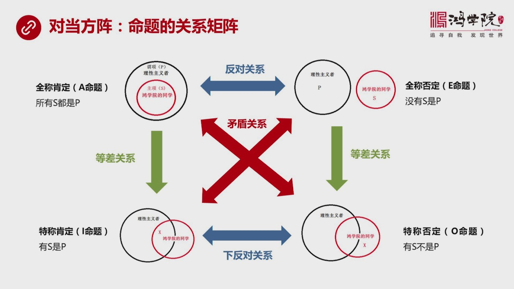

如果我們把剛才所有的命題這四大類AEO做成一個舉證你會發現它成一個相互之間成一個類似於舉證這樣的關係左上角這個A命題所有S都是P所有洪學院的同學都是理性注意者它跟什麼相反呢跟一命題是反對關係一命題就是...

<strong>All subtitles</strong>

> 如果我們把剛才所有的命題這四大類AEO做成一個舉證你會發現它成一個相互之間成一個類似於舉證這樣的關係左上角這個A命題所有S都是P所有洪學院的
> 同學都是理性注意者它跟什麼相反呢跟一命題是反對關係一命題就是兩者完全相互排斥沒有S是P另外左邊這個是說所有都是另外說沒有是所以這兩者的關係是
> 截然相反的就是如果我是對的你就必然是錯的如果你是對的我就是錯的這是一種截然相反的相互排斥的關係當然他們兩中間有沒可能兩者都是假的有可能如果中
> 間出現了交叉有一本洪學院同學是理性注意者有一本不是這兩者都是假的這就是上面這個關係然後我們再看下面下反對的關係我們剛剛已經說過I命題和O命題
> 是下反對關係也就是有S是P有S不是P兩個都可能是針洪學院的情況實際情況就是如此但是兩個不能都是假所以這叫下反對關係如果我們再看綠色的這個截頭
> 等差關係就是所有洪學院同學都是理性注意者可以自動運喊著有一部分洪學院同學是理性注意者好一問但反過來推就不成立又不要這個等差關係也一樣如果說所
> 有洪學院同學都不是理性注意者這班人都是風格想法都很亂那麼就自然會運喊著下一個O命題有問洪學院的學生他不是理性注意者很自然這個結論是包含在上一
> 個結論中間的或者叫上一個是針底下這個東西是被運藏在裡面的比較有意思是中間用紅色標注出來的矛盾關係是個對角線對角線就是你會看到A命題始終跟O命
> 題是矛盾的一命題跟I命題是矛盾的我們剛才已經分析過這個關係了比如說所有洪學院同學如果都是理性注意者的話那麼如果你說有洪學院同學不是理性注意者
> 那就矛盾了這兩個是完全的水火不相容的你對我就錯我對你就錯兩人既不能同時為真也不能同時為假那麼一命題跟I命題一樣如果洪學院同學都不是理性注意者
> 全是風格那麼你如果說洪學院同學有一些是理性注意者這不就矛盾了嗎到了一樣這就是要相互的矛盾關係這張圖濃縮了亞里斯多德所有的解釋片中間的全部的內
> 涵當然他這本書裡面並沒有這麼講因為他這個書講得比較複雜講得比較二口你要讀很多遍才能逐漸摸索出來原來我們可以用這張圖來精確的表示用對當方證可以
> 涵蓋解釋片中的所有內容這個需要相當的耐心和慢慢地去讀他的原文讀這個原文過程中主要去思考他當時為什麼會做嗎這個問題對當方證只是一個結論但所有推
> 倒了過程他的思維方式全部隱藏在他這個書中我非常建議大家如果有時間有耐心特別是那種非常希望從這種偉大思想家的他的這種推倒的邏輯中間推倒了思維中
> 間去吸取真正精華的東西那麼不只要看他的結論更重要的是看他的推理過程這就是我們反覆強調的紅學院不只是告訴結論更重要是要學習思維的過程受人與不如
> 這個我給你這個一條與不如交給你怎麼去捕魚所以道理是相通的好最後我們看結論亞里斯多德這個工具工具論中間的解釋片

---

### Slide 12

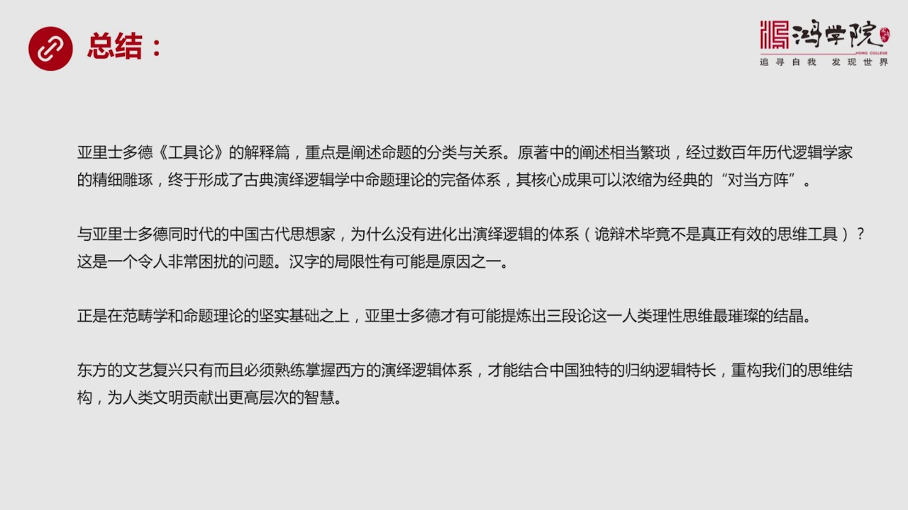

如果我們概括起來說它產生的是命題的分類和命題之間的關係當然原住中間的探討探討它的表達比較的複雜但是如果你那下新來去讀真正有營養的東西全部在它的原住中原住可以說是高湯如果你靜下新來慢慢去琢磨可以領悟出很...

<strong>All subtitles</strong>

> 如果我們概括起來說它產生的是命題的分類和命題之間的關係當然原住中間的探討探討它的表達比較的複雜但是如果你那下新來去讀真正有營養的東西全部在它
> 的原住中原住可以說是高湯如果你靜下新來慢慢去琢磨可以領悟出很多東西來這套東西這個解釋片的全部內容是經過200年每一代的這種邏輯學家反覆的作募
> 反覆的經驗一點點提煉出來的它是精雕細著最後才打磨出來了整個演繹邏輯體中間它最核心的一部分它的基礎部分是什麼就是命題理論也正是這個命題理論體系
> 的逐漸完備包括它這種對稱關係然後你才會發現它最終被提煉和加工成了對當方正這樣的一個高度精美的一個東西當然這叫經典對當方正它中間還有些缺陷這個
> 缺陷我密後再提到的時候再說那麼這套東西在我看起來它就是構成了整個演繹邏輯體系的一個基礎和潛體那麼我跟它說到了與亞利斯多德同時帶來中國戰國時期
> 的那些豬子擺家們為什麼沒有進化出這麼嚴密的思維體系演繹邏輯體系呢當然我們知道工廠門搞了一套軌變數還有很多豬子擺家也是研究辯論的那一種辯論我們
> 可以說它是一種邏輯是一種軌辯的邏輯但是它並不是真正並不是真正有效的思想工具它不能創造什麼東西公司能創造什麼它除了創造了一個圍命體之外沒有給中
> 國的文化創造出更多的更精彩的更有價值的可以絕對信任的不斷積累的知識體系沒有所以這個問題一直讓我非常困擾當然我在這個課程中提出了文字的局限性漢
> 字的局限性有可能是原因之一當然也可能有其他的更多的原因為什麼我會強調這一點就是因為最近我在研究宋朝的時候你會發現儒家這個宋明理學特別是在豬子
> 這個豬稀稿的這個理學的可以說是儒教的重大的宗教改革運動在中間它提到了很多比如說革物之之革物怎麼革怎麼制之你會發現當然它認為存在的天理我們要去
> 體會體會這個可以說是老天爺或者叫自然界或者叫萬事萬物之間的這種內在的關係它需要去革去琢磨去想但是你會發現想來想去它不能把這個問題真正的說透或
> 者想透想不透因為它缺少演繹邏輯的分析體系它不能把這個東西精確地再往下分比如說從亞利斯多德那個年代往後當然包括更早更早時期提出了原子論你會發現
> 用這套工具去革物才真正能夠保護給革清楚而你沒有這套工具沒有掌握這種思想方法你怎麼革革到一定程度就下不去了這就是我們看到在中國整個思想精華中間
> 由於缺少演繹思維這套邏輯體系我們在分析所有問題的時候到了一定的界限抽象到一定程度之後就再也沒有能力把它進行進一步的分解了我們的分析工具不夠我
> 們沒有一種像這種鑽石這麼堅硬的東西像這種像沒有這樣的堅硬的工具就沒有辦法去召開這種實質的花缸延的這樣的這樣的物體就沒有辦法對它進行解析這就是
> 缺少要理石多德工具論中間的一整套思維的工具體系沒有這些工具做不了這個事也正式在範疇學我們第一講和今天講的這個命題理論這兩者的堅實基礎之上鑽石
> 多德才有可能體驗出三段論我認為三段論是人類理性思維中間最慘的接近沒有質疑就是整個演繹思維邏輯體系它的核心就是三段論三段論怎麼能夠得出三段論呢
> 前提就是我們講到了對語言的分工對語言的分類和定義對命題的分類和探討到毫無關係有了這兩點之後有了這兩個基礎之後才能夠往後進一步去提練三段論但三
> 段論我們是下講要講的內容在我看來東方的文藝復興當我們提到這樣的概念或者我們認為中國發展經濟到了今天這個在世界上屬於屬二這個程度他就一定會帶來
> 經濟復興經濟復興一定會帶來文化的復興我們可以從古今中所有歷史中找到類似的規律經濟發展了物質生活豐富了有一大批人可以盡量先來琢磨文化琢磨思想琢
> 磨哲學的時候這個國家就一定會出現巨大的這種文化繁榮那麼如果中國想真正創造一種文藝復興運動這樣一種偉大的思想潮流那麼就必須在當今這個社會和當今
> 的這個時代就必須要真正的熟練長西方的演繹邏輯思維體系然後用這套體系來結合中國真正的特長就是歸納邏輯這是中國真正的強項也就是把西方的強項跟中國
> 的強項要的融合然後才能重構我們思維結構我們現在在中國社會中大部分人是缺少演繹邏輯思維體系這種訓練也沒有這種思維方式所以大家在探討問題說沒有辦
> 法進行真正的辯論而且這種辯論往往就淪為一種詭辯或者是一種爭辯它未的不是說探討真理得出一種有效的結論就是為了戰勝對方就是為了一種自我虛榮這種辯
> 論其實沒有任何價值所以我們只有把這兩種思維方式演繹邏輯和歸納邏輯進行高度的整合才能夠使我們進化出一種更高水平的思維結構然後為人類文明做出一種
> 更高層次的這種貢獻貢獻出更高層次的智慧這就是我們要做要去深入研究邏輯學的它的全部的原因好今天我們的這堂課就先講到這最後參考文件在網上

---

### Slide 13

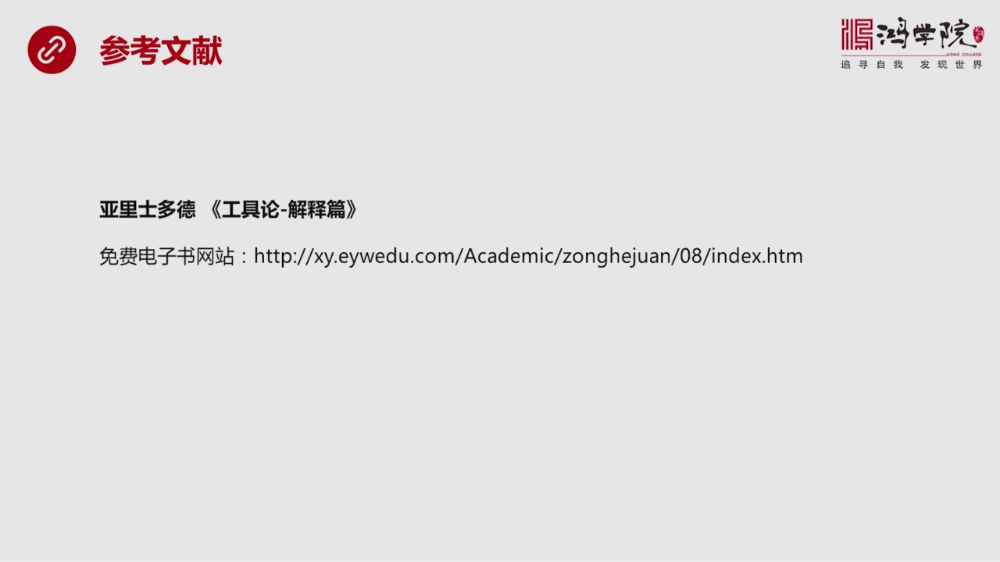

有這個免費的電子書的網站在參考文件中給大家提供了鏈接好今天我們課就到這裡

<strong>All subtitles</strong>

> 有這個免費的電子書的網站在參考文件中給大家提供了鏈接好今天我們課就到這裡

---

### Slide 14

謝謝大家

<strong>All subtitles</strong>

> 謝謝大家

---
