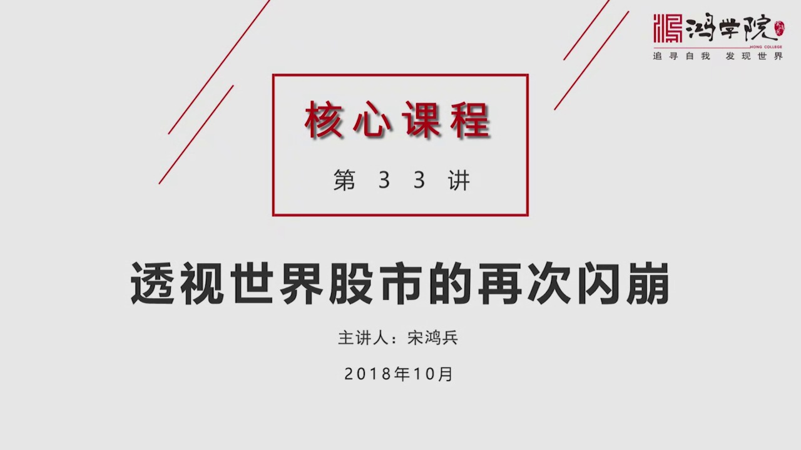
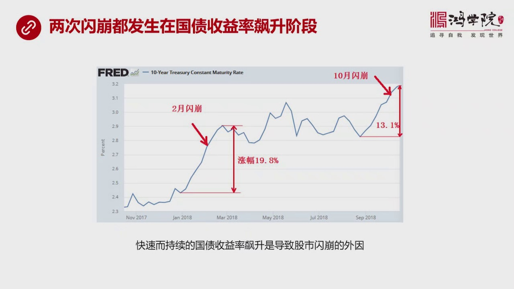
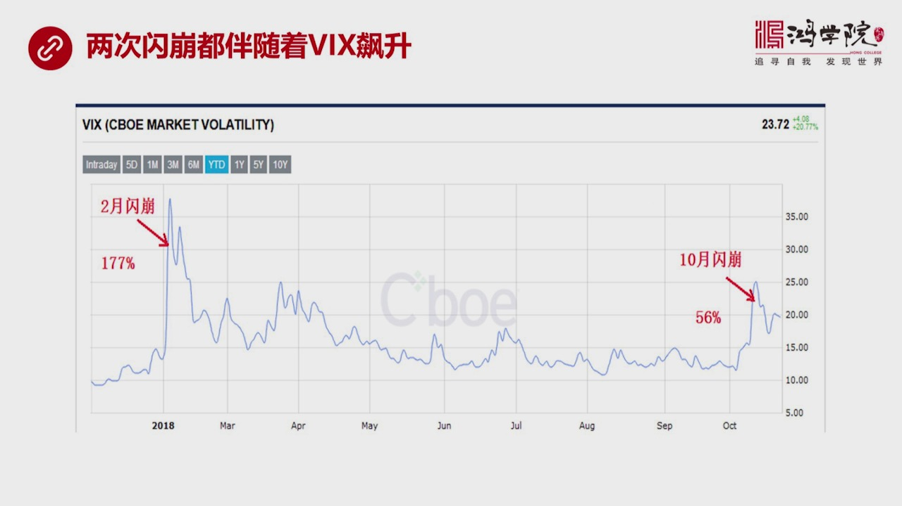
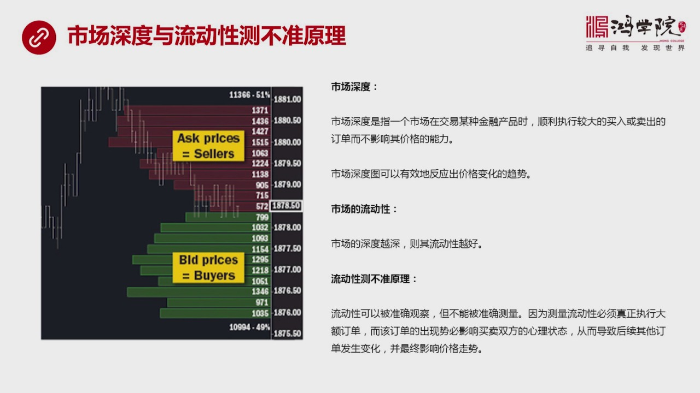
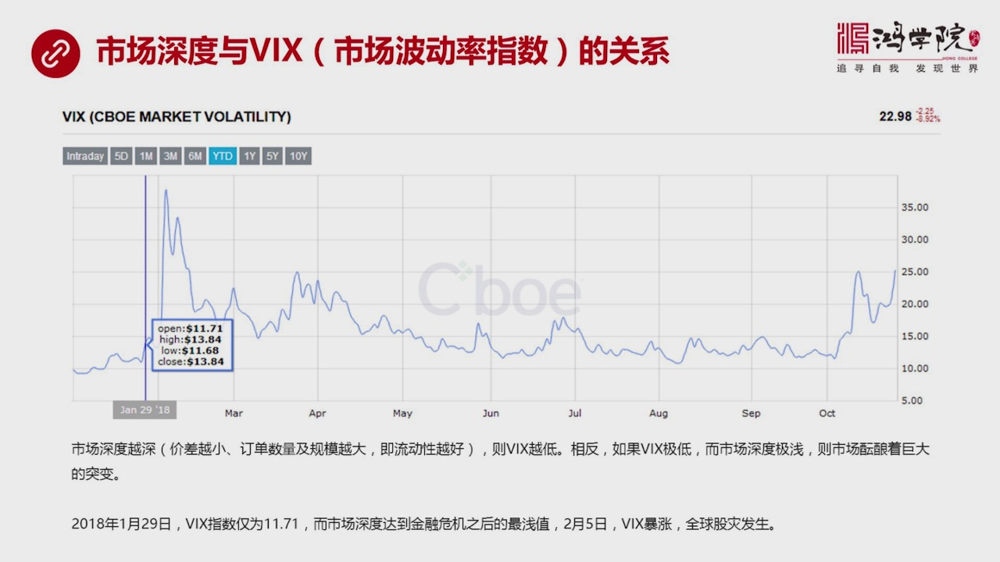
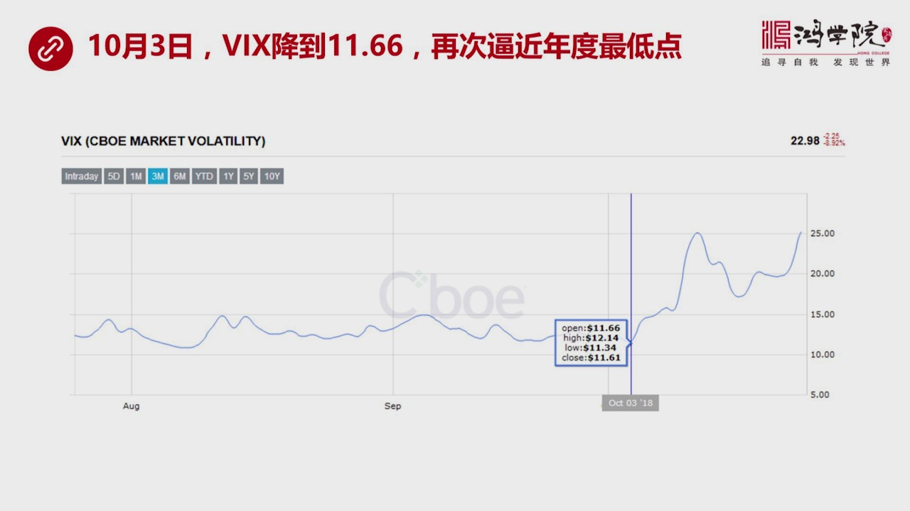
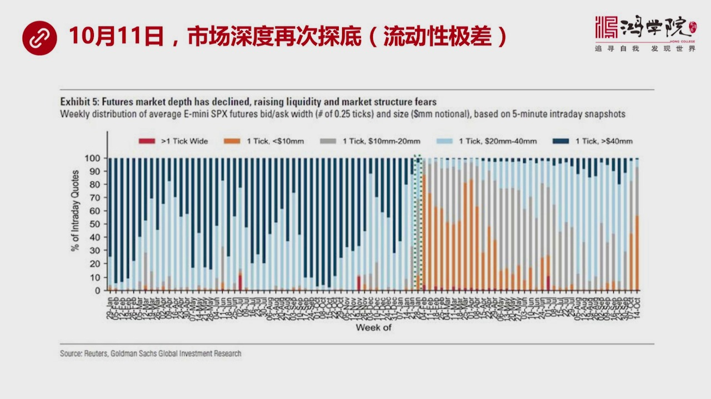
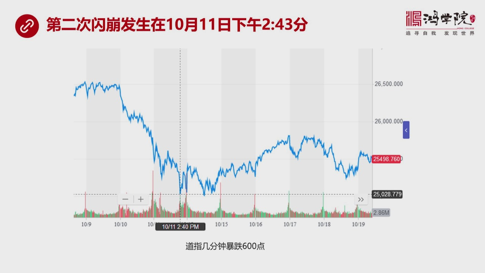
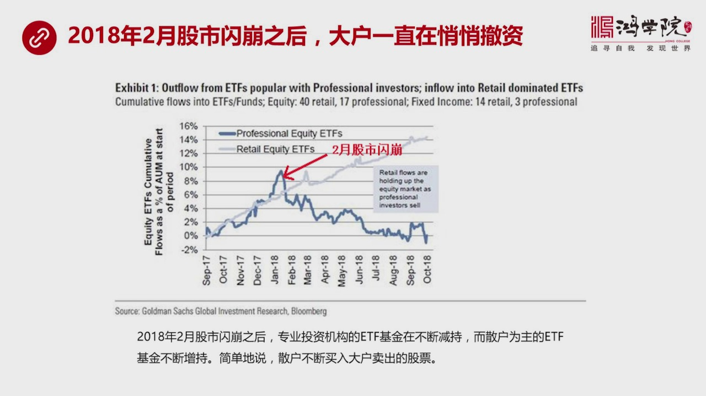
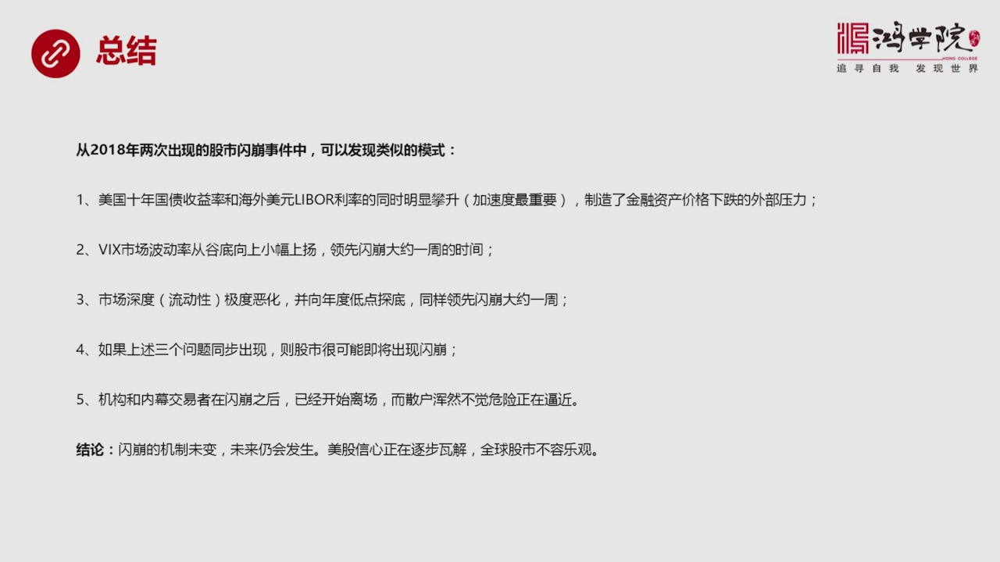

# 核心课视频-033讲.透视世界股市的再次闪崩（视频） — Detail Slide Notes

> **来源**：鸿学院核心课程  
> **幻灯片**：11 张

---

### Slide 1

透视世界股市的再次闪崩我们在2月份已经看到了全球股市出现过一次闪崩那么我们在核心课的前级讲重点分析了上一次股市闪崩的它的一个关键性的原因就是Wix指数或者叫市场波动率指数也有人称之为是恐慌指数对于股市...

<strong>All subtitles</strong>

> 透视世界股市的再次闪崩我们在2月份已经看到了全球股市出现过一次闪崩那么我们在核心课的前级讲重点分析了上一次股市闪崩的它的一个关键性的原因就是
> Wix指数或者叫市场波动率指数也有人称之为是恐慌指数对于股市闪崩所发生的这种关键性的作用那么10月份我们再次看到了美股出现的闪崩当然由此也连
> 累了全球股市那么这一次闪崩跟上一次有什么不一样或者说我们如果换一个角度的看会发现什么新的问题这是我们这一刻要讲的主要内容我们看敌业首先从这张图上

---

### Slide 2

这张图是美国国贷尔收益率十年国贷尔收益率我们非常清楚的可以看出一个非常类似的规律2月闪崩的时候正好是美国国贷尔收益率开始标升的时候当时从2.4%左右逐渐攀升到2.9%涨幅高达19.8%那么在这个阶段中...

<strong>All subtitles</strong>

> 这张图是美国国贷尔收益率十年国贷尔收益率我们非常清楚的可以看出一个非常类似的规律2月闪崩的时候正好是美国国贷尔收益率开始标升的时候当时从2.
> 4%左右逐渐攀升到2.9%涨幅高达19.8%那么在这个阶段中我们看到了2月闪崩的出现那么在10月闪崩的时候我们同样看到了类似规律也就是美国身
> 间国贷尔收益率从2.8%冲到了3.2%虽然它的涨幅不如2月份那一次这么高但是也达到了13.1%那么从这两个国贷尔收率爬坡大幅标升的过程中我们
> 看到了2次闪崩这说明一个什么问题呢说明国贷尔收益率代表着美国长期的融资的成本也就是美元长期利率它的基本走势当长期利率突然开始从一个比较平和的
> 状态开始以加速度论这样的一个状态往上攀升的时候特别是在这个过程发生的这个开始阶段由于它是个突变量这种突然的变化会使得整个市场承受巨大的压力因
> 为我们知道利率上涨就意味着资本的成本在提升那么不仅是借钱的成本在提高而且使用资本进行投资进行生产进行一切领域的这种开支它的成本都会大幅上升所
> 以如果用钱的成本在上涨这对于资产的价格会形成向下的压力也就是国战社会率的标升的阶段对于资产价格会形成较大的这种向下的这种压力这就是两次产崩出
> 现的类似的外部压力我们称之为是一种由市场交易出来的长期利率所形成的外部事件这种外部事件构成了产崩的一个重要原因当然了除了这种外部原因之外它还
> 有从内部产生这种产崩的机制这就是我们看下液我们从内部机制中可以看到这个内部机制说到这里我们还看一下外部还有一个因素就是Liberly率它也是
> 跟美元长期利率形成了个相对应的关系Liberly率代表海外美元的融资成本就是以伦敦卫中心所形成的海外拆借美元的这样一个成本它跟十年国债税率一
> 个构成了美国国内的利率一个构成了海外的美元的利率一个代表着长期的另外一个代表着现实的短期的一个利率所以我们会看到Liberly率也存在着类似
> 的规律二月选崩的时候Liberly率正在开始明显的从一个比较平化的一个波度往上抬升那么在十月份也一样十月份之前我们看到Liberly率基本是
> 稳定的甚至有往下走的趋势但是到了九月份之后开始抬升到了十月份之后更明显所以从外部的这个Liberly率也可以看出来跟十年国债税率是类似的就是
> 一旦美元的长期或者短期利率开始抬升那么在抬升的初始阶段这个变化量发生了之关重要的作用好我们看完这个两个外部条件一个是长期利率一个是美元的短期
> 利率之后我们再看一下它的内部机制内部机制就是我们看下也这个我们前讲讲过的

---

### Slide 3

Wix指数的标升就是市场波动率和或者叫这个市场恐慌指数那么在这一次我们同样发现了类似的规律也就是在二月审讯的时候Wix指数在当天跳升了177那么在十月份之后十月11号说跳升了56%当然从数字上来看十月...

<strong>All subtitles</strong>

> Wix指数的标升就是市场波动率和或者叫这个市场恐慌指数那么在这一次我们同样发现了类似的规律也就是在二月审讯的时候Wix指数在当天跳升了177
> 那么在十月份之后十月11号说跳升了56%当然从数字上来看十月份这一次好像跳升了没有那么邪惑不像二月份来了这么抖当然这也可以从股票市场下跌的幅
> 度比如说到情资指数你也可以看出来这次下跌的深度不如上次这么狠但这次它是连续下跌所以它的市场恐慌的心理会比上次更严重这一次大家是真正出现了一种
> 情形的瓦解上一次大家可能认为是意外事件当然我们在核心科来的前几期重点分析了波动率它的形成的机制那么从那两节课种同学们如果认真听的话其实已经发
> 现了这个机制它具有着自我重复的这样的一种性质也就是说它会反复出现如果没有外力的影响如果不考虑中央银行改变它的力虑政策从家习变成这样习如果不考
> 虑这个因素的话那么它会自动的重复出现这是我们上两节课所讲到的核心的一个机制就是Wigs指数它的不断的向下的这种调整或者不断探抵这意味着资产价
> 格最硬会上升那么在过去的弱感年之内进入危机之后的10年我们看到了一个总的规律时利率下降当然会导致资产价格上升同样的由于大家相信每年处的利率不
> 会太深或者越来越低那么Wigs指数也是主建走低的所以这个因素同样会造成资产价格上涨那么反过来当你资产价格也上涨大家认为它越不可能下跌那么恐慌
> 指数它就不可能大幅标升所以从Wigs指数这个角度来说我们可以把它想象成一个保险合约就是由于大部分人绝大部分人不相信Wigs指数会大幅标升所以
> 他们站在了卖保险的地方而是让中只有少数人这个比例是非常全书的一个比例只有少几少数人认为有可能Wigs指数会上升所以他们买保险买卖保险都是为了
> 这个这个买保险主要是为了持有股票资产它做一个对冲当然也有部分作为纯粹的投机而卖保险人是为了获得一个额外的收益获得一个额外的现金流这是被这种D
> B的政策B的走投无路的这些投资人机构投资者对冲基金由于各种资产收益对太低他们只有用放大风险放大杆杆放大风险的方式来拨取一点点收益而这一点点收
> 益背后却运藏着巨大的风险那么大家考虑到有中央银行接盘或者有中央银行的政策大家不怕这个风险所以敢于去大规模的作空这个Wigs指数换句话说以Wi
> gs指数不断下跌站在麦保险内方的投资基金还有这个ETF还有以这个为核心以野生传来一大批这种基金他们实际上西纳是散户的钱然后来作空播动性来麦的
> 这种保险实际上中只有少多人去买保险那么就会在市场中形成一个越来越倒窍的就像一艘船越来越斜越来越清洁的状态那么这个过程会自我家具它是个正循环就
> 是你越是Wigs指数低自展价格越高越是自展价格越高Wigs指数就越低它产生个正反馈一个小的播动会被逐渐放大这个船会越来越清洁到一定程度微小时
> 间就可以是整个船翻掉就会爆发闪光它的基本的机制从2月份一直到现在并没有发生根本性的改变所以我们会看到这就是我们核心各种在3月份这个核心各种已
> 经可以明确地看到下一次闪磅一定会来到当然没有想到10月份这么快的时间就在一年之内发生两次闪磅其实立次金融危机都有这个现象第一次出现的这种闪磅
> 或者市场的大幅的下跌人们认为是一个偶然事件不会太往心里去但是第二次再次出现类似情况会造成市场信心的逐步的瓦解会有很多人会发生动摇那么再来一次
> 它恐怕就会又发更大的危机这基本上是立次的金融风暴它的一个基本的套路所以我们现在看到10月闪磅虽然它的幅度不如2月闪磅来得这么这么严重但是它对
> 人们信心的这种瓦解程度却超过了第一次第一次大家认为是偶然第二次越来越多人认为这不是偶然的而是预测者或者说预示者未来更大危机的来临所以这两次闪
> 磅我们看到WeX指数都在飙升但是它背后的含义是有所不同的好我们再看下野上一次我们重点谈到是WeX指数但是没有深入去分析

---

### Slide 4

为什么WeX指数它会导致会导致市场闪磅或者说我们没有深入去解读WeX指数我们说了WeX指数会导致过去闪磅但是没有深入去解读为什么WeX指数它会发生这么大了一种变化也就是说什么又发了WeX指数了这种调生...

<strong>All subtitles</strong>

> 为什么WeX指数它会导致会导致市场闪磅或者说我们没有深入去解读WeX指数我们说了WeX指数会导致过去闪磅但是没有深入去解读为什么WeX指数它
> 会发生这么大了一种变化也就是说什么又发了WeX指数了这种调生我们并没有深入去分析那么今天我们从另外一个角度来解读WeX指数背后发生重大变化了
> 先导因素就是什么又发了WeX指数变化而WeX指数又会又发股实暴跌我们要再往前推一步就是市场深度的概念这就是我们下野看的市场深度什么叫市场深度
> 呢如果我们用一个简单的图来做一个显示这是我们看到的这个左图这个左图是一个市场深度直观图那么从这个直观图上我们可以看到在这个市场中围绕着某一个
> 价格比如说这是SNP它的一个纸数的一个情况我们可以看到中间有买家也有卖家那么他们在不同的价格上会形成不同的订单的数量订单数量有大 有小而且金
> 额也有大有小规模不一样如果我们把它形象的展示出来的话我们会看到上面红色的这一部分代表着在不同价格上它所拥有的订单的规模就是叫卖家我要多少钱我
> 才卖底下是买家底下绿色这些买家的代表者在各个不同的价位上有多少人有多大的订单的规模这些订单的金额总的盘子有多大那么从这张图上我们一目了然就可
> 以看到上面的红色的总的规模或者总的面积会大于底下绿色的这种面积这意味着什么意味着市场价格有可能会向下大概率时间它是向下的所以这就是市场深度的
> 一个直观的显示那么从理论上来说什么叫市场深度呢如果用一句话来概括市场深度是指一个市场在交易某种金融产品的时候顺利执行一个较大的订单不管是买入
> 还是卖出那么你执行这个订单而不影响整个市场的价格这是一种能力这种能力叫市场深度换句话说当这个市场的价格比如说我们看图动这个时1878在这个价
> 格上你要发出一个大了订单很快可以被执行掉因为买家很多只要你要卖立刻有人抢执行速度非常快以极短的时间以极低的交易成本在完全不影响市场价格的情况
> 之下你这个订单就被消化掉了这个叫什么这个叫这个市场的深度很深那么这个相对应的有另外个词就叫流动性市场的流动性从市场深度和流动性之间的关系我们
> 可以发现一个市场的深度也深那么就表示着它的流动性非常好任何一个金融产品如果我们说的是金融市场的话在这个市场中只要你抛出立刻就会被强调而且中间
> 的价差非常的小甚至完全没有你说一个价这个价立刻就成交了这个就叫市场的深度非常深市场深度越深这个市场的流动性就越好所以这个是我们从一个新的角度
> 来观察这个市场的表现情况那么在市场的深度和流动性这个深度和流动性中间我们可以提出一个就是关于流动性的一个基本的原理我称之为是一个测不准的原理
> 什么叫测不准的因为流动性这个词在金融圈它一直是个比较模糊的概念没有人说得太明白什么叫流动性当然我们刚刚已经解释过了就是在一个市场中还有深度的
> 市场中你抛出任何东西能够很快就被消化掉也就是这个产品在这个市场中流动性极好但这个概念仍然是比较抽象怎么来测渡这个流动性呢我们可以观察到我们可
> 以感觉到它流动性很好但是要拿一个流动性的指标来进行数学测算这是一个很大的难题就是可以观察到但不容易被测出来为什么不容易被测出来因为它中间是有
> 原因的这个原因就是当你要测量观察流动性静态的观察就像我们这张图样这是个静态观察图你可以看到这个流动性还不错但是当你要测量它的时候就意味着你需
> 要深入市场去进行交易也就是说你需要具体去执行一个大哥订单比如说我要卖出一万手你只有执行这个订单才能够测出来它在市场中好不好卖你卖这个订单的时
> 候就是执行这个订单的时候你的价格是不会出现影响这个市场价格比如说你卖这个1878但是人家买家却只愿意出1877或者1876中间会有比如说一块
> 钱或者两块钱的落差这个落差越大当然我们认为这个流动性越差而你只有执行这个大哥订单的时候你才能够真正知道才能真正测算出来它到底流动性好还是不好
> 静态来观察不行为什么不行呢就是因为你下了这个订单比如说你要卖一万手你这个订单一旦挂出来之后它就会影响市场的其他的买家和卖家会影响他们的心理状
> 态人家看出了这么大的订单这是不是行不行啊或者你出了一万手的买单这是不是股票长啊你的这个行为会又发市场其他后续订单的连策反应就是会影响买家和卖
> 家在市场中的心理所以他们的心理受到影响之后就会改变他们的订单的数量和金额这就会扰乱这个市场所以这个测不准原理非常像海森堡提出的物理学测量粒子
> 的那个感觉你如果清楚地知道它的位置你就不能知道它的动能你如果精确地知道它的动能你就不能测上它的位置就测不出它的位置如果我们拿这张直观的流动性
> 的图你可以看出它好比是一个精确的位置图也就是相当于这个粒子在空间中的位置这个时候你只是观察你还没有探测它你还没有对这个市场施加影响当你对市场
> 施加影响的时候你挂出一万手的订单的时候那么这个市场的动能也就是心理的动能会发生变化而你如果精确知道它的位置你却不可以知道或者你时间并不能知道
> 它会对市场心理的动能造成多大的影响假如你抛出一万手的这个订单观察到它直心的情况包括价格的波动情况或者叫市场的动能发生了变化但是你却很难知道在
> 你下定单之前这个市场的位置应该是个什么状态这就是测不准原理在流动性方面的这种应用或者说我们可以借用物理学这个原理来解读金融市场的这种测不准的
> 性质其实一切市场在我看来都是测不准的就是你要执行订单就会影响价格你要不许影响价格就不能准确知道你这个订单能不能顺利执行获不引起价格变化所以这
> 个是我们需要事先了解的一个基本概念有了这个概念之后我们再去分析这种市场的深度它是如何影响这个这个如何影响这个位置指数的好 夏夜我们就要重点弹一下这个问题了市场深度跟位置指数

---

### Slide 5

市场波动率到底是什么关系其实我们可以从位置指数1月29号这一天的行请你可以看到当天的位置指数开盘是11.7111.71什么概念呢就是我们知道它如果在20以下市场是比较平稳的就是市场波动性或者人们对波动...

<strong>All subtitles</strong>

> 市场波动率到底是什么关系其实我们可以从位置指数1月29号这一天的行请你可以看到当天的位置指数开盘是11.7111.71什么概念呢就是我们知道
> 它如果在20以下市场是比较平稳的就是市场波动性或者人们对波动性的预期是比较低的11呢它仍然是一个相当低的一个程度接近于历史的比较低的程度了低
> 于时是很罕见的你要是时往上多一点点大家认为这个市场是非常大家心里非常稳定不认为它会大幅动大所以从这个图上我们可以看到1月29号这一天它是个比
> 较低的一个开盘价那么我们看到双方两者之间的关系是个什么关系呢在我看来也就是市场深度越深市场越深度越深是指了什么意思呢就是叫卖价和叫卖价之间的
> 价差非常的小甚至没有然后定单买价和卖价的定单量非常的巨大而且金额也非常的巨大如果是这样的话这就意味着这是个市场的流动性非常之好你卖什么买什么
> 都非常简单而且不影响价格那么如果市场是出在一个深度很深的状态定单数量很大流动性很好状态那它Wix指数一定是很低的也就是市场深度越深Wix指数
> 越低也就是说明两者之间的关系反过来说也类似Wix越低人们觉得市场的波动性不大市场应该的它的深度就比较深但是这是应该事实并不完全如此那么现在出
> 现的情况就是如果我们提一个相反的问题假如Wix现在变得非常的低就像1月29号出现了11点其一这样的一个价格那么会不会出现市场深度极淺的情况呢
> 如果出现市场深度很淺就是定单很少流动性很差这又说明什么问题呢其实正好说明如果人们都不预测都没有想到市场波动力会抖然上升市场会变得非常动荡如果
> 大家都没有这种预测但那个时刻恰恰在那个时刻市场的流动性极差深度极淺这意味着什么这正好意味着市场可能晕亮了巨大的突变为什么这么说就是如果定单很
> 少那么一个小定单就可以是整个市场发生较大的变化而这种较大的变化一定会刺激Wix指数出现明显的变化所以这个市场的流动性越差或者深度越浅说明这个
> 市场越不稳定而它如果恰恰出现在Wix指数积低的情况之下说明这个市场即将晕亮的反转或者叫突变那么从实际情况来看情况正是如此在18年的1月29号
> Wix指数开盘价是1.7亿这是一个接近全年最低价在1月初它会更低甚至一度跌破了10而在内天就是在内天1月29号所代表内州它是一个州的统计数据
> 统计了一个数值那么市场深度达到了金融危机之后一个最浅值十年以来一个最低值就是我们看到了整个市场的深度然后紧接着在2月5号Wix出现了一个17
> 7的爆长然后就是全球股市产崩爆发了这说明我们刚才所说的这两者之间的关系应该是市场深度越深Wix越小反过来如果Wix即小而市场深度也极淺的话那
> 么很可能这预示市场即将发生距变就是说即将出现产崩所以我们现在除了Wix之外还多了另外一个补充说明Wix的一个先导的一个因素或者先导的参数就是
> 市场深度所以当我们考虑Wix的时候同时还要观察它的市场深度然后才能够更准确的或者更有效的去判断产崩会不会出现那么这是我们看到的1月份的情况1
> 月29号情况后来一个星期之后Wix爆长全球产崩爆发那么这一次我们看下液10月3号的时候是不是又符合这个规律呢

---

### Slide 6

如果我们看这张图你会看到10月3号的那一天我们知道古灾是11号也就是在那之前一个星期又是一周那么Wix指数降到了11.66比1月29号那个还要低再次逼近了年度的最低点紧接着7天以后我们看到了Wix指数...

<strong>All subtitles</strong>

> 如果我们看这张图你会看到10月3号的那一天我们知道古灾是11号也就是在那之前一个星期又是一周那么Wix指数降到了11.66比1月29号那个还
> 要低再次逼近了年度的最低点紧接着7天以后我们看到了Wix指数的爆长全球产崩发生所以在10月这次古灾这次古票产崩的出现了这个同时我们仍然看到了
> Wix指数下探到了古底那么在这个时间点在这个时刻到底市场的流动性或者市场深度的情况如何呢这就是我们要看下一张图10月11号所代表的那一周

---

### Slide 7

市场深度再次探底换句话说就是流动性极差市场深度极限这一张图就说明了这个问题这张图是高胜他们的一个研究问题出了一个图这个图非常非常有效的说明了刚刚我们所说的这个原理就是当Wix指数很低同时市场流动性很差...

<strong>All subtitles</strong>

> 市场深度再次探底换句话说就是流动性极差市场深度极限这一张图就说明了这个问题这张图是高胜他们的一个研究问题出了一个图这个图非常非常有效的说明了
> 刚刚我们所说的这个原理就是当Wix指数很低同时市场流动性很差市场深度很浅的时候这意味着图面即将来到你比如说这张图是什么意思呢这张图是一个从去
> 年到今年左边这个蓝色的蓝色线比较多的这是去年今年这是今年这个黄城色这个曲线比较多的这是今年图然后它是一个周每周每周一年五十四周它是按照周来排
> 的那么这张图说明什么问题呢简单的说它说是如果蓝色的这个调状调状的这个曲线多这个调状是什么呢就是市场在每波动一个刻度的时候上下它会不断的波动就
> 像我们刚才看到的这个SNP500的这个指数从1878往上跳到1879或往下跳到1877它每跳一个刻度大概会有多大的资金量才能把它跳动一个刻度
> 蓝色这个条块说明要大于4000万美元才能够跳动这样一个这样一个市场那就说你需要一个很大的规模才能够有效跳动它那么它是一个什么概念呢它是一个不
> 是4000万应该是这个41美元它是个什么概念呢就是当你跳动一个刻度需要的资金量越大说明这个市场的深度越深说明它的定单量极大说明金额交易金额在
> 这个价位上需要巨大的角度就会有大量的成交额发生也就是说流动性很好所以蓝色曲线多的地方蓝色条块多的这个图表明市场流动性很好表明市场深度很深那么
> 成色多意味着什么呢成色多就意味着资金资金量很小就能跳动一个刻度你比如说在这中间那就是你可能少于10亿美元交易量不到10亿美元这个刻度就发生变
> 化了所以如果说我们看右边这张图这是今年的图你会发现这张图中成色的这种条块明显战剧主导地位而蓝色的条块非常非常的少而去年情况正好相反蓝色的战主
> 导说明什么说明2017年整个SNP500的它的这个期货期权交易市场它的资金量很大市场流动性很好也就说明它市场深度很深而2018年你会看到2月
> 份这个市场几乎就没有流动性了就是你只要动用一点点钱这个价格就被你炒翻了这就意味着而在那个时刻恰好是波动率最低的时候波动率这么低才11.71你
> 动用一点点钱就可以把这个价格给挑上去或者把它压下来那就意味着在那个情况之下波动率这么低的情况之下动用一点点钱就能把它敲动而时整个波动率会跟着
> 飙升那么说明这个市场是极端不稳定的是非常脆弱的那么如果我们看右边这个成色部分你再看到10月14号所代表这周包括这个暴跌的是10月11号这两天
> 你会看到这个蓝色的部分几乎又变成零了就是要动用4000万才能去波动这个扩度的机率太小了或者这种情况发生太少了更多什么呢一个成色的或者灰色的灰
> 色是在意在10和20这种之间那么这说明这样不需要太大就可以把它波动同样这个规律跟月份出现的规律是类似的尽管不像月份这么明显和突出就像我们看到
> 利率期限这次并没有这么倒反过来说明这次下跌的闪崩的这个扶度没有这么深但是它说明了一个同样的道理这个道理就是只需要叫少了资金就能够波动市场就能
> 够又发Wix指数大幅跳升那么Wix指数大幅跳升就会产生对股票价格暴跌的这样一种影响力这就是三者之间的关系市场流动性在波动率达到最低的时候市场
> 流动性最差或者市场深度最前这意味着股票上运遇着巨大的危机一点点钱可以波动市场那么一旦波动市场就会又发Wix指数跳升Wix指数跳升就会导致股票
> 市场闪崩所以这次三者之间的关系逻辑关系就理顺了好如果我们再看下液那么第二次闪崩发生在什么时间点呢

---

### Slide 8

其实发生在10月11号的下午2点43分从这个时间点上你可以看到道雄思指数几分钟之内暴跌600点背后的原因就是我们刚刚所说的由于流动性太低市场深度太前不大的交易额就可以使让Wix指数大幅跳升而这种指数跳...

<strong>All subtitles</strong>

> 其实发生在10月11号的下午2点43分从这个时间点上你可以看到道雄思指数几分钟之内暴跌600点背后的原因就是我们刚刚所说的由于流动性太低市场
> 深度太前不大的交易额就可以使让Wix指数大幅跳升而这种指数跳升带来了股票市场的暴跌或者我们称之为闪崩这个时间具体发生时间点就是在2点43分股
> 票快收盘之前突然出现的一个一小笔资金就可以含动一个巨大的市场这说明什么这让我想到了湖跌的翅膀在南太平洋山一下结果北边的北半球就开始闹巨峰说明
> 当一个系统非常的脆弱和不稳定远离平衡状态的时候那么一点点扰动无论这个扰动是美国决定制裁伊朗还是沙特的广子按杀了一个记者或者是意大利的预算碰到
> 了欧阳的麻烦或者是德国的一个什么义会扒发了一会的扒发了一会的选举或者是中国跟美国贸易战的任何一点点消息都足以造成这种扰动而且这个系统已经高度
> 不稳定了越来越容易被这种微小的事件所影响而具体的事件已经无足轻重了它可能是一个石油价格的图片可能是一个地缘政治的一个冲突或者是中美之间又发生
> 口脚或者是美联储这个主席随便说两句话或者是特朗普发了一个推特任何的微小的波动都会造成系统性的危险这就说其实全世界的金融市场是处在一种越来越不
> 稳定的状态越来越远利平衡状态了那么它未来遭到的这种微小绕动的可能性就越来越大就像一个人的集体已经完全丧失了免于能力这个时候伤疯感冒任何一点小
> 病都可以多人之命啊这就是我们看到的现在的股市为什么我说2018年和2019年这两年是非常非常的危险大家要玩股票不管你在哪上玩不要忘了影响全球
> 的中心市场是眉股所以你需要把眉股给吃透了要把他影响眉股的所有的原因内在机制包括WIX指数包括现在我们说的市场深度流动性都要进行全面的观察你才
> 能够意识到上海股市为什么会暴跌我们很多人做了上海股市我们很多顾名其实完全不具备对国际上的判断能力或者完全不理解为什么股市会美国股市会暴跌也不
> 能理解为什么美国股市暴跌上海股市会跟着跌当然在我看来金融市场全球金融市场是连在一起的眉股出现两次闪磅全球股市没有谁能够信免那么未来这个爆发的
> 中心仍然是可能是在美国金融市场如果要出现下次闪磅那么在上海朝股票人在深圳朝股票人同样会受到严重的冲击这就是为什么我们必须要全面的深入的而且特
> 别细致的去研究股票市场内部的这种动力学类原理你才能够搞明白投资应该防范哪些风险不是仅仅听到媒体说美国经济在好转然后就业绿已经这个失业绿已经很
> 低了然后GDP到了4%多那些都没用因为在当机世界金融市场决定了一切金融市场往往先与实体经济出现崩盘而金融市场的崩盘会导致金融市场金融资产价格
> 暴跌金融资产价格暴跌会使所有的表面上看起来银行都不错的有巨大资本金的这银行由于他持有了资产暴跌立刻会吃光吃掉他的这个资有资本金会使银行立刻陷
> 入贪患他哪还要放态能力啊他如果不放态了整个社会就缺乏流动性了缺乏资金了那工厂就不敢着人了然后公司就开始结构了然后消费就开始下降了金融危机就开
> 始爆发了很多人就会北约黄省钱因为没有收入了或者资产价格暴跌都是他们不得不卖钱二的资产所以在当今世界GDP这已经是属于严重落后的东西了失业率这
> 也不能说明问题真正说明问题导致危机金融危机的爆发是这个市场的高度不稳定性由于这个原因导致金融市场危机先爆发先发生然后实力经济再受到重创所以不
> 能由于他的失业率低当然这个失业率本身这个计算方法是有问题的或者GDP高就判断一个经历体没有问题菜调相反你应该重点研究是导致他出问题的先居条件
> 就是金融市场是不是健康是不是稳定是不是处在屏工状态还是高度脆弱一胖击垮这个是我们判断经济大使的一个重要的线索也就是金融市场的危机在当今社会已
> 经跟七年之前不一样了货币制度发生变化了所以当今社会是首先判断金融市场是不是稳定是不是健康然后再看实力经济的数字某种意义上是金融市场的健康或者
> 危机决定了实力经济会有发生危机然后我们再看下液有一个有意思的现象这个现象就是

---

### Slide 9

其实在二月份发生股票闪磅之后美国的大护门一直在悄悄的撤资而撒护门永远去接盘换句话说我认为2018年实际上是美国股市出现了一次严重的歌韭菜的自美现状我如果我们看这张图你会看到现在大家都用一TF不管撒护还...

<strong>All subtitles</strong>

> 其实在二月份发生股票闪磅之后美国的大护门一直在悄悄的撤资而撒护门永远去接盘换句话说我认为2018年实际上是美国股市出现了一次严重的歌韭菜的自
> 美现状我如果我们看这张图你会看到现在大家都用一TF不管撒护还是机构投资者你可以说它是一种被动的投资工具被动的基金也就是说我把钱买了一TF的鞋
> 子之后然后我就放哪然后这一帮一TF这帮人他来运作他来根据市场来进行投资所以对于每个撒护来说你已经不是自己来决定我要买哪支股票或者卖哪支股票而
> 是完全交给别人由金融市场来替你操作所以对于投资人的投资这种撒护来说或者投资人来说他变成了一个完全市场的被动者不主动参与交易不仅是撒护如此机构
> 投资者也是用了第一TF的这种方法因为他高度的方便高度的灵活而且资料比较大所以这是现在所有人都玩了一种被动投资的手段用一TF来做那么如果我们看
> 这张图你会发现深藍色的是代表着机构投资者他们所拥有了一TF我们会看到他在2月闪崩之后这些人这些资金量是始终不断在下滑的一直到10月18号10
> 月11号之后就出现了一次也是出现大规模的这个撤资其实我们可以看到机构投资人所代表的这些大的玩家一些比较有钱的人或者企业主或者高兴阶层这些人已
> 经从股市中再撤资了相反欠藍色这根线代表着散户所拥有的一TF他们主导的一TF你会看到他们在2月暴跌之后2月闪崩之后完全没有任何的感觉仍然往里冲
> 电视媒体中曾经说股票要超底只要暴跌就是超底的机会谁超底了夫人们可都走了窮人们中产阶级称了阶盘侠历史上历次金融危机爆发之前也有类似的规律也就是
> 说那些有钱人那些掌握者某种意识上掌握者公司内部动态的比如说企业高管他们在2月份之后就不断在套现股票再回够就公司在华大家前回够股票台生股股价的
> 同时他们在乔乔的车他们在卖当然股价一旦被回够力量所推动往上走的时候撒护们拼命去接而且在家上没提这种血染说这个意思这个是股票下跌这个是买金的机
> 会前几年前10年都是这个规律所以这就导致出现了一个现象撒护们成了真正的阶盘者而大护们一直在撤这就不是一个好赵徒明白了这点之后我们最后总结一下今天我们的这个课程我觉得从2018年出现了两次股票选丰中

---

### Slide 10

我们可以发现几个类似的非常高度雷通的模式第一个美国时间国载收益率和海外美元Liberary率同时明显的上升注意啊它从平到开始往上这个走高这个变化这个涂变量也就是加速度这是最重要的不是看它生到最后的尾端...

<strong>All subtitles</strong>

> 我们可以发现几个类似的非常高度雷通的模式第一个美国时间国载收益率和海外美元Liberary率同时明显的上升注意啊它从平到开始往上这个走高这个
> 变化这个涂变量也就是加速度这是最重要的不是看它生到最后的尾端有多高而是再看它一开始从零到一这个涂变这个是最重要的那么美元长期利率和Liber
> ary率它制造了一个金融资产向下调整的外部的强大的压力这是第1个共同支出第2个共同支出就是Wix是上波动率它会从古底向上小夫上羊做一次试探我
> 们看前面的那两张涂都能看出这个规律来领先闪瘋大概一周的时间可以说我们如果观察到Wix指出不断探底探到比如说十附近的时候然后有一次出现小夫上羊
> 这个往往预示着有可能会出现问题就需要引起你的警觉你要验证光从Wix指出本身还不能够得到彻点整你还要观察下一个指数就是市场深度流动性的变化如果
> 你看到流动性的这个资金量变得非常的小总的市场深度的规模严重伪缩而且向整个全年的最低点不断地去探底的话而在这个时候Wix指出这个开始也达到了一
> 个比较低的程度因为这两者几乎是同时发生的市场深度极度恶化也是出现在闪瘋之前一周所以你在闪瘋之前一周会有另外一个指标就是你看市场的流动性市场的
> 深度如果规模极度恶化而且恶化接近到了全年最低点与此同时Wix指出也是出在全年较低点而且有一定幅度的上扬这个时候如果再加上力虑上升三个条件同时
> 满足那么我们根据现在这样的一些经验和数据或者这种模式就可以推算或者可以我们可以猜测股票市场有可能会出现闪瘋为什么我们说是一种猜测因为中间有可
> 能漏掉其他的因素这个必须要积累下次闪瘋其他的再度发生闪瘋还会有一些新的指标和新的数据没有被我们现在所抓住我们在二月份手抓住了Wix指数在这次
> 我们发现了市场流动性市场深度那还会不会有其他的因素呢当然我认为可能还有但是我们现在还没有有效的把这个信息抓住也就是你手上掌握这种信息和关键指
> 数越多你把它组合在一起对市场的判断就会越准确或者越有效那么除了以上四点之外第五个结论第五个模式我称之为是机构和内幕交易者在闪瘋之后他们已经开
> 始立场了撒户完全没有绝杀到危险正在逐渐的毕竟所以这就要求我们的同学们需要深度去了解市场需要功课做的比较细最后我们这堂课的结论是什么闪瘋的机制
> 没有发生变化未来仍然会反复出现闪瘋那么两次闪瘋之后我认为美股美国股市现在的信心正在逐步瓦解你会看到唱帅的人越来越多这是市场信心瓦解的一个信号
> 在二一份那次大家不是这么看的大部分人或者说绝大部分人认为那是一次孤立事件发生就发生了后面关系但这一次你会看到越来越多的人跳出来在发出警报说2
> 019年股市恐怕键点了好如果说到这一点的话这意味着全球股市未来不容乐观不管你是在那国家做金融市场是连成一片的美股是世界金融市场的他的一个领先
> 者实际的问题往往会连带其他人所谓成门是火央急吃鱼所以最后还是建议大家今明两年做股票市场的人一定要小心谨慎小心使得万年传利益观溜路而停发方特别是要重点关注美股因为这将明显影响上海或深圳的股市好

---

### Slide 11

今天我们课就上到这里

<strong>All subtitles</strong>

> 今天我们课就上到这里

---
