# 核心课视频-034讲. 辉煌的佛罗伦萨（5&6合集）（视频） — Detail Slide Notes

> **来源**：鸿学院核心课程  
> **幻灯片**：30 张

---

### Slide 1

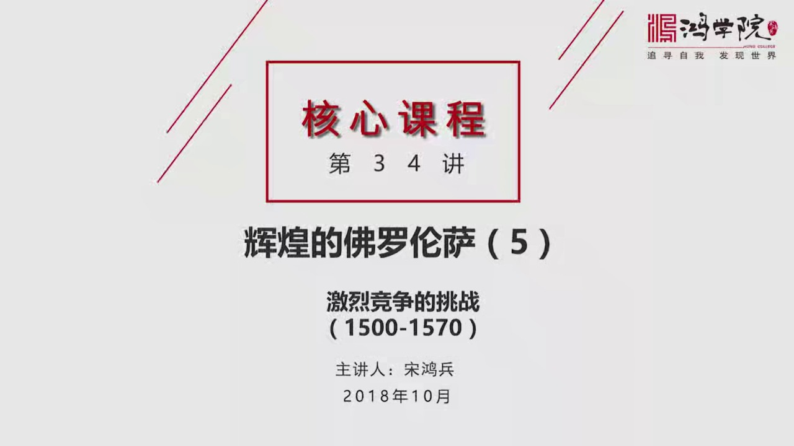

輝煌的佛羅倫薩第五集這集主要是講佛羅倫薩所面臨的激烈競爭的挑戰他的時間段是從150年到150年我們看敵業方法論我們在每集課一開始都談到了方法論

<strong>All subtitles</strong>

> 輝煌的佛羅倫薩第五集這集主要是講佛羅倫薩所面臨的激烈競爭的挑戰他的時間段是從150年到150年我們看敵業方法論我們在每集課一開始都談到了方法論

---

### Slide 2

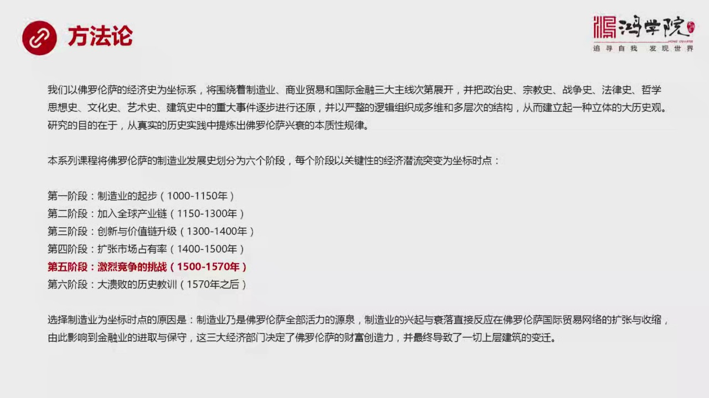

今天我們講的是一個新的歷史階段就是十六十幾中間的主要部分前四講我們講到了佛羅倫薩的從起步然後到發展到創新到逐漸抵達這種灰荒的境界那麼這個第五階段實際上我們看到佛羅倫薩的他的歷史出現了一個重大轉折也就是...

<strong>All subtitles</strong>

> 今天我們講的是一個新的歷史階段就是十六十幾中間的主要部分前四講我們講到了佛羅倫薩的從起步然後到發展到創新到逐漸抵達這種灰荒的境界那麼這個第五
> 階段實際上我們看到佛羅倫薩的他的歷史出現了一個重大轉折也就是達到了聖極而衰的這樣的一個程度所以今天我們重點講的是為什麼佛羅倫薩他到了150年
> 以後會出現這種游聖轉衰的這樣的一個轉折關頭我們看一下業首先我們還是從經濟角度來分析

---

### Slide 3

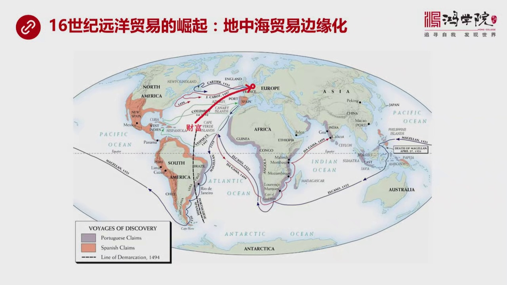

首先咱們看看貿易的情況因為在之前的幾百年中地中海史中史歐洲的經濟中心圍繞地中海的貿易像一大利還有中東的地區雷凡特這個市場都是依賴地中海貿易而變得非常新勝包括拜登廳那麼到十六十幾以後我們都知道一次九二年...

<strong>All subtitles</strong>

> 首先咱們看看貿易的情況因為在之前的幾百年中地中海史中史歐洲的經濟中心圍繞地中海的貿易像一大利還有中東的地區雷凡特這個市場都是依賴地中海貿易而
> 變得非常新勝包括拜登廳那麼到十六十幾以後我們都知道一次九二年西班牙發現了新大陸從那之後我們看到整個的貿易出現了遠離地中海的趨勢就是大西洋貿易
> 崛起了與此同時或者比他還更早一些是葡萄牙人在1415年就已經擴張到了北非佔領了修達和一切的北非的其他的這種殖民點然後我們會看到葡萄牙人和西班
> 牙人分成兩路葡萄牙人是沿著非洲的這個海岸最後繞過了好望角通過印度洋抵達了印度然後通過印度作為跳板到達了馬來西亞海峽最後一直到達了這個中國的澳
> 門甚至到達了日本所以我們看到葡萄牙人在1550年之前就已經到達了遠東到達了亞洲而且逐步控制了香料群島還有馬來西亞海峽所以由於葡萄牙人控制了香
> 料貿易整個香料貿易已經不再走中東地區不再走這個蓄利亞也不再走軍事產品寶所以包括埃及所以地中海東岸就是整個東地中海他的貿易受到了沉重的打擊我們
> 看到很多的穆斯林這些國家為什麼在地理大發現之後他會逐漸走向衰落他的根本原因就在於喪失了貿易的距離人沒有貿易的距離人那麼經濟發展財政貨幣都會出
> 現一系列的問題那麼西班牙人走了另外一條線西班牙人主要是跨越了大西洋到達了中美洲到達了加了比海從加了比海作為基地逐漸佔領了墨西哥然後向北向北到
> 達了現在美國的南部向加州等等然後向南逐漸擴展到了南美洲那麼特別是在1546年前後在南美發現的波托西大營礦對於整個西班牙地國乃至整個歐洲都出現
> 了一場被稱之為價格革命的重大的歷史事件大量的美洲白銀不斷地勇相歐洲導致了歐洲出現了大規模的通貨膨脹當然這個大規模是相對於以前的在中世級之前歐
> 洲的物價基本上是很低臉的但是出現了美洲白銀之後大量的白銀勇入美洲之後價格在150年之內反了一倍甚至更多所以這被稱之為是一次歷史上非常罕見的價
> 格革命或者換句話說叫通貨膨脹吧所以由於與遠洋貿易的崛起跨大西洋貿易還有葡萄牙的印度洋和太平洋到達了遠東這些遠洋貿易使得全球的格局貿易格局發生
> 了重大變化我們可以說貿易地緣變了以地中海為中心的那個時代逐步走向落幕而圍繞大西洋還有與遠洋貿易直達印度洋和亞洲這變成了一個新的財富的大通道所
> 以這件事情本身是超越了葡萄倫薩所能控制的範圍這是由於地緣特別是貿易地緣的重大改變而出現的一種格局形的改變我們再看下一那麼在這種改變之中有一個城市

---

### Slide 4

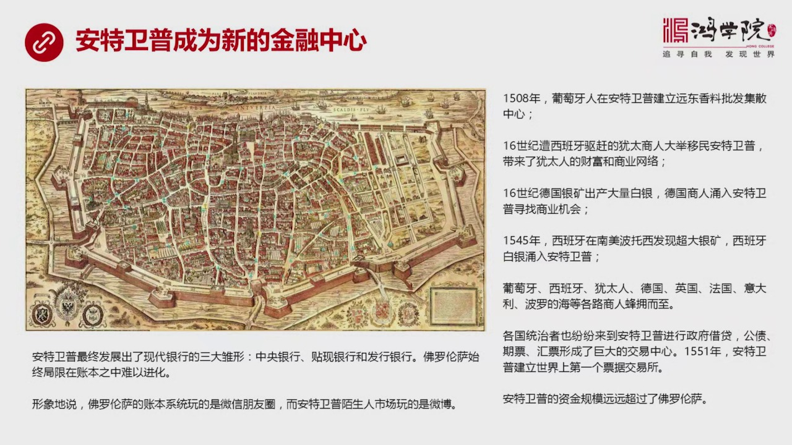

它成了最重要的受益者這就是安特威普如果我們看安特威普他的地理位置你會發現他的地理位置得天堵厚由於他正好處在環北海貿易的一個中心他其實離大西洋他就是靠近靠著大西洋的同時他又是聯通歐洲內陸的富蘭德地區經濟...

<strong>All subtitles</strong>

> 它成了最重要的受益者這就是安特威普如果我們看安特威普他的地理位置你會發現他的地理位置得天堵厚由於他正好處在環北海貿易的一個中心他其實離大西洋
> 他就是靠近靠著大西洋的同時他又是聯通歐洲內陸的富蘭德地區經濟最發達的地區北歐地區的經濟發動機又是聯通這個玩意和上有的熱漫地區同時也可以到達波
> 羅地海的地區他是作為一個幾大貿易之中軟站所以義大利人他們通過航運可以到達來做生意同時各國的商人英國的法國德國的波羅地海的商人都可以到達來做生
> 意再加上出現的葡萄牙人和西班牙人的海外之名擴張所以各路商人紛紛地用到了安特威普我們知道在安特威普之前其實在他的西南方向還有一個重要港口叫布魯
> 日安特威普之前主要是布魯日布魯日他的輝煌時間大概是一三零年以後一直到一五零年之前但中間猶豫出現了黑死病這樣的一個嚴重的衝擊所以布魯日他真正的
> 輝煌大概是從這個15世紀一直到16世紀出為什麼布魯日會衰落呢當然主要是猶豫他的港口聯通北海有一條重要的一條河流這條河流由於常年的海水海沙包括
> 他的河水中所攜帶的泥沙導致了河床的漁績這條通道被廢掉了這樣的話這個港口城市他就沒有海路了當然大量的商人就就近向北轉移到了安特威普而安特威普正
> 好在斯海爾德河的河岸上他是天然的優良的申水港所以這個地方作為港口他的地理位置可以說跟布魯日非常的類似他的位置也非常好而且他有天然的這個申水良
> 港這使得他最後超越了布魯日在1550年以後那麼如果我們看1550年之後安特威普出現了一些新的商業的這樣的一種動態首先是1558年泡刀牙人由於
> 開頭的新的航道運來了大量的香料所以他們以安特威普為中心建立了銷售面向歐洲銷售遠東香料的這樣的一種集散地批發和集散這就導致了香料貿易可以以十倍
> 的價格銷售導致了大量的白銀用香了安特威普前來了因為有好東西除了這個之外第二件事就是1492年西班牙完成了在征服運動而且實現了阿拉共和卡斯蒂德
> 亞兩個王國的合併變成了西班牙王國完成征服穆斯林之後他們其實在這個征服戰爭中一直有一種比較狂熱的宗教信念所以征服了穆斯林之後馬上對國內的猶太人
> 進行迫害強迫猶太人改宗甚至改宗之後也不行必須要趨趕他們出境把魔人趕走了把猶太人趕走了這就出現了這個150年之後大量的猶太人從西班牙逃出來這些
> 逃出了猶太人被稱之為賽法的猶太人這就是我們貨幣戰爭系列中所談到的從西班牙出來的這些人去了哪呢有一幫人就到了安特威普當然還有一些人到了中東到了
> 巴格達還有一些人到了東歐、德國等等所以賽法的猶太人是猶太人中間比較會經商的而且長期在西班牙量了一個連接這個穆斯林世界和歐洲世界的一個喬特寶所
> 以他們有非常好的商業貿易網絡能夠連穆斯林地區同時還擁有非常強大的資金實力當然在加上有太民族天生的幾千年善作生意這種頭腦所以這些人用到安特威普
> 之後給安特威普增加了大量的資金貿易的機會貿易了網絡同時還有新的經商的辦法就是商業技巧除了這幫人之外另外在16世紀德國開始發現了大營礦德國營礦
> 開始出產大量白銀所以德國商人也開始帶著白銀到安特威普來尋找商業機會當然可以賣賣香料也可以買賣這種防治品銷售他們的葡萄酒還有糧食等等大家都到安
> 特威普來討生活除了這三坪人之外更重要的是第四批人就是1545年前後西班牙在南美波特西發現了超大跡的營礦自此之後南美白銀美洲白銀才是大量融入安
> 特威普西班牙人也是以安特威普作為一個主要的貿易積散地所以我們看到葡萄牙人來了西班牙人來了猶太人德國商人英國商人法國義大利波羅地海各國商人紛紛
> 的湧香蘭特威普他的資金量遠遠高出了佛羅倫薩因為他有美洲白銀有德國白銀兩大白銀全部湧香這個這個重新還有新的巨額的賺錢的商業機會以這個亞洲的香料
> 為代表除此之外我們看到各國商人都到這裡來賣東西英國人到這兒來賣他們的羊毛佛蘭德人在這兒銷售他們的支撐品尼龍還有義大利商人也會把他們從中東轉過
> 來的各種真氣義寶拿到這兒來銷售德國商人到這兒來推銷他們的各種工業智品也金產品金屬還有帶著他們的白銀還有他們的葡萄酒等等所以葡萄地海商人葡萄地
> 海商人最主要是帶他們的魚這種魚缸還有他們的這種森林的木材還有葡萄地海已經越來越逐漸地轉向糧食生產基地還有大規模的糧食除此之外我們會看到各國這
> 些統治者國王這些大公們也紛紛跑到安特威普來融資為什麼因為各國當時頻繁的交戰爭奪各自的領地所以頻繁爆發戰爭而戰爭是要花錢到哪去找錢呢如果各路商
> 人和最重要的白銀全部與雲集在安特威普當然大家要到安特威普來找錢在這兒融資的成本非常低所以各個公國各個王國包括神聖羅馬帝國皇帝全部到這兒來發公
> 債以公債形式來進行資金的目擊所以安特威普就很快形成了一個票據的交易市場這就是151年建立的世界上第一個票據交易所股票交易所在這裡由於大家必須
> 要買賣公債同時還是得各種其他的票據既然你可以交易公債那能不能交易會票商業成對會票呢當然也可以能不能交易個人和公司的這種本票或者叫其票也可以所
> 以這個地方就變成了個票據交易中心那麼久而久之這個安特威普的資金規模就越來越大這裡成了期間的海洋大量的金融產品在這裡進行交易他的流動性非常地好
> 所以正是從安特威普這裡進化出了最終進化出了現代銀行了三大出行那就是中央銀行貼線銀行和發行銀行我們會看到在這個階段中特別是在1550年以後安特
> 威普迅速超過了佛羅倫薩在一百年前1450年時候根本安特威普遠遠不及其佛羅倫薩但是在往後發展1550年之後那佛羅倫薩已經遠遠往不上安特威普的相
> 背了局面在一百年之中發生了根本性的變化為什麼就是佛羅倫薩嚴重依賴他的帳本系統我們以前反复強調過佛羅倫薩的本質是個帳本共和國而安特威普他卻不是
> 一個帳本共和國他實行的是票據交易如果形象來說佛羅倫薩玩的都是熟人間的這種對象這叫熟人圈我們可以稱之為是玩微信朋友圈而在安特威普所有的商人都不
> 認識互相彼此不熟好幾千個商人在這個地方交易來自各個國家的商人他們當然沒有辦法像佛羅倫薩人一樣遵守共同的文化遵守共同的法律有一個強大的韓匯系統
> 管制所有的人他們沒有這個機制所以他就不能玩朋友圈他只能發展成微博的模式所以這就是兩個不同的環境帶來不同的需求這種不同的需求使得兩個城市走向了
> 不同的道路我們看下一為什麼說他是中央銀行的出行呢就是因為他的票就交一所股票交一所他實際上實現了集中的清算

---

### Slide 5

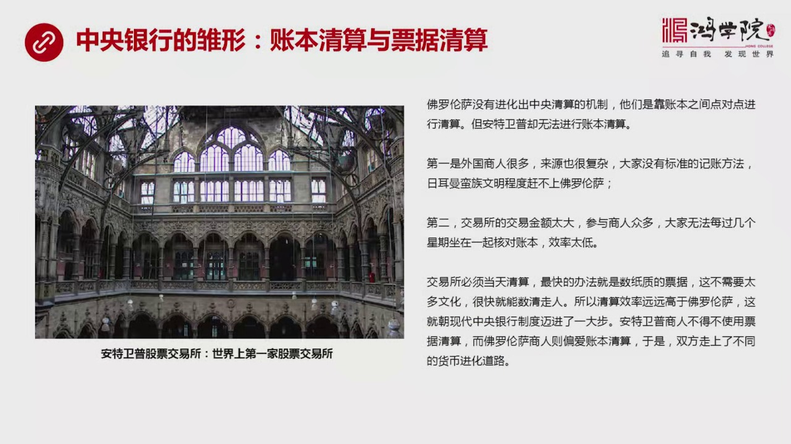

帳本清算我以前專門提到過在我們以前的課程中核心課裡面專門提到過帳本清算是點對點的清算比較類似於現在的區塊鏈他沒有一個中央的清算的中心所以佛羅倫薩的銀行體雖然很發達但是他從來沒有進化出中央銀行和中央清算...

<strong>All subtitles</strong>

> 帳本清算我以前專門提到過在我們以前的課程中核心課裡面專門提到過帳本清算是點對點的清算比較類似於現在的區塊鏈他沒有一個中央的清算的中心所以佛羅
> 倫薩的銀行體雖然很發達但是他從來沒有進化出中央銀行和中央清算體系全都是大家各自拿著帳本我們在彼此對戰過程中完成清算他是點對點的但是這套東西在
> 安德衛普卻玩不賺為什麼呢首先我們剛才提到了各個國家的商人來源比較複雜大家彼此之間並沒有像佛羅倫薩量行程復持機漲的標準機漲方法佛羅倫薩已經搞了
> 好幾百年了所以大家記帳都養成了習慣每家每一戶都記帳你怎麼能要求什麼德國人 英國人 法國人這些都是他在文化上比佛羅倫薩都落後很多他們相當於日漫
> 漫祖他們的文化水平像在義大利像佛羅倫薩他是實字律師非常搞的有一座貿易由於古典的這種義大利的羅馬帝國的這種文化的傳承像七億 像大學都是從義大利
> 開始搞的所以他們的文化水平要遠遠高於北方熱漫漫祖北方熱漫漫祖實字律非常低商人也沒有統一的記帳的方式對這個東西也不重視所以這就使得在安特威普那
> 個地方他沒有辦法實現佛羅倫薩那種通過大家都記帳然後通過贊物的核對來完成清算做不到他的水平也不夠然後來的這個好幾千個亂七八糟的人來源也很複雜這
> 個東西真沒有辦法學佛羅倫薩這是一個臉室同時我們看到他沒有把臉室轉變成了優勢為什麼因為在安特威普的資金量遠遠超過佛羅倫薩他這個交易數額太大佛羅
> 倫薩大家可以新民進核美國一兩個月大家坐在一起喝茶吃飯喝酒在那之前先對賬這個清算的速度是比較慢的但是在安特威普這不行因為他這個交易量資金遠遠超
> 過了佛羅倫薩參與這個商人來源又比較廣泛大家要求加快清算速度我不能等這麼久因為我可能下星一舊坐船走了到另外地方去採購去了我哪能成天待在這兒而且
> 當時又沒有這個簽證制度又沒有什麼國籍護照之類的這個人走了之後上哪去找這都是問題所以大家必須要加快清算速度最好當天清算這套東西在佛羅倫薩是沒有
> 辦法實現的而在安特威普大家想了一個辦法想了一個辦法是什麼呢我們如果都對賬這玩意兒不行黃蔡都良了咱們最好的辦法是發明一種通用的支票就是票劇只是
> 票劇我們數票劇這玩意兒來得很快這筆對賬來得快票劇不計名所以我們每個人都不需要這個嚴密的靠對賬制度來完成清算我們數票子就完了這玩意兒多快當天就
> 能夠完成這個清算這就是使得安特威普出現了集中和中央清算這樣一種體制而這正是後來中央銀行他的最主要的功能後來到Arms的單之後我們會看到建立了
> 第一家現代版的中央銀行但是他的除行他的基因是源於安特威普正是由於安特威普走向了集中清算而這個弗洛倫薩仍然是沿用藏本清算所以這兩條路發展下去就
> 走向了不同的貨幣精華之路中央銀行就從這裡開始起步而弗洛倫薩他就仍然居現在他的賬本裡面沒有實現進化我們看一下也貼線銀行這是現代銀行的第二個特徵

---

### Slide 6

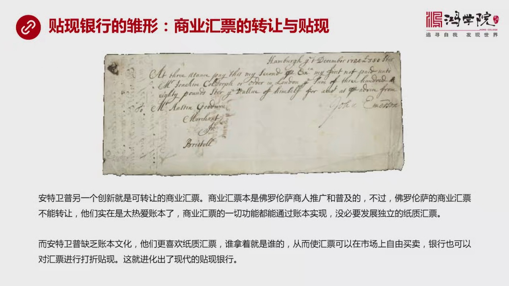

貼線銀行是什麼意思呢就是在商業交易中間所開除了商業成對會票我們以前核心課講過好幾次這種商業會票可以轉讓和貼線我們以前也說過商業會票這個玩意是弗洛倫薩和義大利上人最先搞出來的但是卻沒有在義大利和弗洛倫薩...

<strong>All subtitles</strong>

> 貼線銀行是什麼意思呢就是在商業交易中間所開除了商業成對會票我們以前核心課講過好幾次這種商業會票可以轉讓和貼線我們以前也說過商業會票這個玩意是
> 弗洛倫薩和義大利上人最先搞出來的但是卻沒有在義大利和弗洛倫薩獲得這個網紙票方向發展這樣的一種進化路徑他們仍然是通過計賬來解決所以你如果商業會
> 票也是通過計賬那就沒有辦法轉讓就是計名的而且大家都通過賬本來走那你這個東西就沒有轉讓的可能沒有轉讓就不會打折就不會貼線這就是我們看到安特魏普
> 他的一個重大創新就是指致的核轉讓這種商業會票可貼線這個就是一個新的重大的發明那麼為什麼說他是個重大發明呢就是你如果不願意吃就是他這個法律上做
> 了一個重大的改變就是你如果不願意吃就有這個指致會票那麼你可以在市場中賣而這種賣就是誰拿這就是誰的這是一個重要的法律的改變誰持有這個票據誰就是
> 主人這在弗洛倫薩這套法律體系可不是這麼規定的你必須得是屬於誰就屬於誰你這內不能轉讓而你限制的轉讓這就是會票和貼線沒有辦法進行所以在安特衛普他
> 既有這樣一個中央的清算中心就是他的股票交易所同時就大量的公債可以交易然後再加上商業程度以後票也可以在那邊進行交易貼線那個地方就出現了很多銀行
> 機構他也可以在這個市場中去收這些回票他可以打個折95折或者90折你就把回票賣給我我只有到7我來賺這個立差而你加快資金周轉所以他這個他這個銀行
> 體系就出現了一個打折和貼線的功能注意這就是現的銀行了第二大特征貼線銀行出現了我們再看第三個特征現在銀行第三個特征是什麼呢就是貨幣

---

### Slide 7

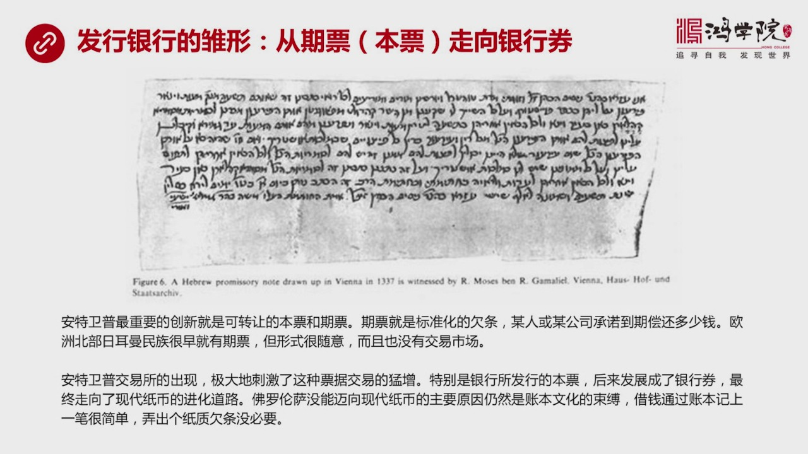

就是紙幣他是從銀行券銀行券也變成了紙幣但是這個銀行券銀行發生了這個東西他是從哪來的呢他的根本的來源就是從7票和本票發展來的什麼叫這個7票和本票呢其實7票也好本票也好這兩東西其實是一回事就是有沒有時間規...

<strong>All subtitles</strong>

> 就是紙幣他是從銀行券銀行券也變成了紙幣但是這個銀行券銀行發生了這個東西他是從哪來的呢他的根本的來源就是從7票和本票發展來的什麼叫這個7票和本
> 票呢其實7票也好本票也好這兩東西其實是一回事就是有沒有時間規定本票你拿出來隨時他就見票積對7票是到了一定7線之後然後再對線反正就是個標準的欠
> 條就是某人和某公司承諾我一定會付你錢要麼現在就付要麼未來某個十點付其實北方的日曼人我為什麼非常重視日曼人的歷史研究就是因為他這個文化他跟南方
> 是不一樣的跟義大利西班牙這地方是非常不同的包括法國南部這是兩種文化北方的日曼人很早就實心這種個人打欠條就是這種7票早就有了但是呢這種7票的協
> 法大家很隨意並沒有標準格式可能隨便寫個紙條按照首要簽個字就完事了而且當時日曼這個蠻足地區他們沒有一個可交易的市場所以雖然有7票存在有本這個7
> 票和本票這種代念存在但是從來就沒有實現過大規模交易也沒有標準化安投衛普這個交易所出現之後這就極大的刺激了這種個人欠條公司欠條的發展而且越來越
> 標準化因為你最後要手票你不能我用黃色紙票你用藍色紙票我用大一號你用小一號那就亂套了後來就統一的標準化交易會導致標準化的出現那麼在這個過程中銀
> 行也發行銀行相當於一個公司也相當於一個私人跟私人一樣跟公司也一樣他也可以發行自己的7票和本票那麼他所發現的這個東西就逐漸變成了銀行券所以這就
> 走向了慢慢的進化向了現代指幣制度銀行如果發行的東西逐漸成了標準化大家都接受的一種可以償還公司債務的這麼一種東西他就進化成了貨幣了這個時候銀行
> 券這個思路就逐漸走向了現代的指幣那麼弗洛倫薩為什麼沒有走上這條路還是因為弗洛倫薩人太愛賬本了因為賬本上大家你欠我錢我欠你錢你說的7票這個本票
> 不就是轉賬嗎遠程會對轉賬他的金融網路面大家改賬本就完了7票不就是借款嗎借款我也也可以在賬本中實現這個借貸的功能我沒有必要專門發明一種紙片的東
> 西然後不繼名的在市場中交易沒這個必要正是由於沒有這種需求所以他就不會往這個方向去進化這就是佛洛倫薩人他成功當年成功就是成功在他的寄賬文化上而
> 他現在的失敗同樣是由於這套東西跟身地固導致他無法適應新的變化所以通過這個例子我想說明一個道理就是當一個國家一個民族在經濟發展中突然薄心崛起了
> 這並不是因為他們做了大量的改變把自己的本性改成另外一個人了而正是由於他們去原來的僱有的本性在這個時代突然這碗要變得特別的火爆所以他利用這個機
> 會而崛起這就是說為什麼每個國家他都有自己的發展機遇這個東西是不能強求的如果這個風沒有挖到你這兒來你想改變這個民族的習慣改變成中國人想改變成熱
> 漫人那你永遠也走到但是如果由於你這個如交文化帶來了文化的凝聚力很強帶來種種這種特徵包括大家處是很靈活說不定哪一天這個風刮到你這兒你已經起來了
> 所以在我看來研究各個國家新衰的一個重要的一個側面是要研究這個地區的文化特質還有人們思維的結構他們是怎麼做夢問題的怎麼想事的不僅是經濟不僅是政
> 治史還有思想史和文化史同樣非常重要這就是為什麼我們的佛羅倫薩一系列課程中會反覆講到它的建築、
> 它的藝術、它的繪化它的文學、它的師哥包括宗教因為這種東西是會影響它的思維結構的生成和思維結構的形態而這種思維結構會直接影響它的行為這就是我們
> 需要從這個高度來認識我們再看下一頁那麼除了安特魏普作為一個新的金融中心對佛羅倫薩進行了

---

### Slide 8

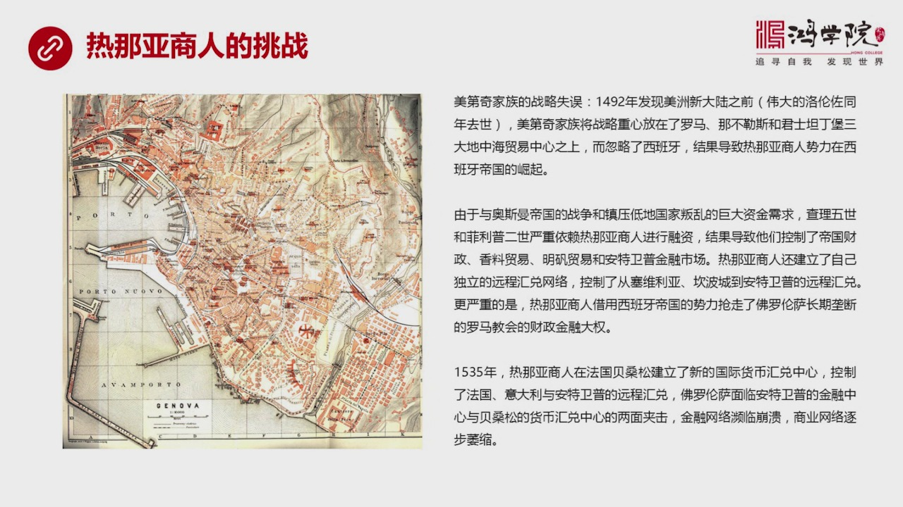

相當於一個非常嚴重的挑戰某種意義上把它取代了除了這個金融中心的轉移另外還有一個比較嚴重的問題就是商人這個國際商人群體的競爭現在出現那個新的重大的對手熱納亞商人熱納亞當然起源是很早它做生意做海洋貿易它比...

<strong>All subtitles</strong>

> 相當於一個非常嚴重的挑戰某種意義上把它取代了除了這個金融中心的轉移另外還有一個比較嚴重的問題就是商人這個國際商人群體的競爭現在出現那個新的重
> 大的對手熱納亞商人熱納亞當然起源是很早它做生意做海洋貿易它比佛羅倫薩還早一兩百年它是從2015年就開始對北飛這個繁海道然後進攻到北飛它就那個
> 時代它就已經開始捲入地中海貿易了包括在十字軍東爭的過程中它一直是主要的出船的出海軍的出運輸的這麼一個這樣一支船隊是源於這樣熱納亞而且它在十字
> 軍東爭過程中由於它出了力出了海軍出了這個艦艇所以它獲得了大量這種地中海貿易中間的很多特殊優惠十字軍東爭在地中海東案件的一系列的港口城市熱納亞
> 人是獲得了優惠權的在那個時代也就是頭兩百年根本就沒有佛羅倫薩人什麼事也就佛羅倫薩比熱納亞人要完兩百年左右不過後來佛羅倫薩決起了這個熱納亞有一
> 段時間是比較它這個運氣不太好由於跟維尼斯的海戰打敗了而且雙方據列爭奪上百年導致也就是一場維尼斯和熱納亞的百年戰爭導致熱納亞有一段時間它比較消
> 停但是從後來它開始起來了為什麼呢因為佛羅倫薩商人特別是美麗西亞族他們在15世紀的時候對整個貿易平式進行進行了一次我稱之為是戰略誤判他們把精英
> 的重新放到了軍事產品寶放到了地中海、東岸而西班牙人呢由於搶不過佛羅倫薩人熱納亞商人由於搶不過佛羅倫薩商人所以他們被迫去發展比較偏遠地去向西班
> 牙所以那個時代這個熱納亞商人就已經深入到了這個西班牙幫助西班牙人發展這個貿易同時也資助他們進行恢復他們土地的在征服戰爭所以他們在西班牙落地生
> 根逐漸發展狀態而西班牙人後來抖起來了發現了北美新大陸在這個過程中當然熱納亞商人就獲利巨大特別是兩個王國卡斯蒂亞和阿拉共合併之後把主要的財政金
> 融還有對外貿易的這種政策還有這種經營的特偽權全部交給了熱納亞商人注意啊發現了大營礦之後這種主導權就太重要了因為它能夠控制美洲白銀的流向我記得
> 我們去這個西班牙這個塞維利亞我們進行文明治理的時候專門到塞維利亞那個港口去看當年西班牙人從美洲大陸運過來的白銀滾滾不斷倒答塞維利亞前後400
> 年總共運過來13萬噸但是這些白銀運到了塞維利亞之後並沒有在岸上停靠沒有裝洩上岸大部分白銀直接就裝上熱納亞人船還有一些其他國家的商人船直接運到
> 安特威普也就是西班牙人成了一個白銀的白銀工過路財神才不往裡流這些錢流的哪去了呢流到了安特威普所以這也就是我們看到的熱納亞商人崛起之後控制了美
> 洲白銀所以導致他們的勢力發展得非常快那麼當年安特威普它的重要性在於在16世紀當阿拉共和卡斯蒂利亞整合成一個王國之後建立西班牙王國之後依少悲了
> 女王跟菲蒂蘭國王兩個人結婚結了婚之後一個代表卡斯蒂利亞女王還有菲蒂蘭代表這個阿拉共兩個人結了在一起之後變成西班牙王國了這個王國誰說了算依少悲
> 了算雖然名義上阿拉共的菲蒂蘭牌的前頭但實際上掌權的還是依少悲了他們生下的女兒有一個女兒叫豐女皇娜最後嫁給了深圳老馬抵國皇帝他的兒子最後生下來
> 這個孩子就變成了重要的一個人物就是查理武士查理武士是作為一個西班牙王國的繼承人同時又作為深圳老馬帝國的繼承人那這個東西就厲害了他接管的地方就
> 太多了像西班牙他的海外帝國殖民帝國全部被他收歸自己的名下像這個西班牙阿拉共在義大利南部的西西里和納布勒斯這些領土也被他收於自己的名下同時他還
> 繼承了奧德利哈布斯堡王朝在德意志的大量的領土同時他們還繼承了博根帝王國當年的博根帝王國一直涵蓋就從法國的東部一直闖過比例是闖過盧增堡比例是一
> 直到達現在富蘭德地區這是個龐大的新月型的地帶全部被他繼承了所以這個查理武士既有龐大的海外殖民帝國又有歐洲的西班牙帝利國家和蘭比例是盧增堡同時
> 還有法國的東部同時還有奧德利還有德國的西南部還有義大利的半島的南部大片的領土納布勒斯和西西里當然還有大量的群島這就使得查理武士非常非常的強大
> 當然由於你太強大了當然自然會激起反叛像河蘭就是這個當時叫尼德蘭後來他為什麼叫河蘭因為在這幾個七省聯盟中間有一個省是河蘭省在尼德蘭地區他基本一
> 次就是海平脈以下的地方河蘭省這個地方造反最堅決後來七個省大家乾脆把整個尼德蘭地區都稱之為河蘭這就是河蘭這個名稱的來歷河蘭造反當然河蘭的地區整
> 個都亂那麼查理武士包括他後來的兒子菲律普二世我們我一直給他推薦的菲律普二世的地中海世界就是講了他們也了這段時間的故事在這個階段中那個地方反叛
> 反叛要鎮陽同時還有一個強大的對手就是法國法國一看你在南邊在西班牙然後在我的北邊都是你的地方那我不是南北家機了嗎再加上跟義大利這種局面對法國非
> 常的不利所以法國他就會聯合外敵誰是外敵啊奧斯曼帝國來聯合對付查理武士的西班牙和這個奧帝利所形成的哈布斯堡王朝他們是對立的所以大量的戰爭持續不
> 斷的爆發包括哈布斯堡王朝還有跟奧斯曼土耳其打仗奧斯曼土耳其當年非常厲害橫掃歐洲而且經常打到了烏克蘭打到了這個波蘭打到了這個雄耀利逼近這個臉也
> 就是打到了哈布斯堡的家門口所以這個查理武士必須要在東西兩線進行多面作戰技藥跟奧斯曼作戰同時還要在北線跟這個和蘭造反造反的這幫人作戰主要是他兒
> 子了菲律波二世主要是鎮壓他們同時還要在南邊防著法國所以他是幾路出擊需要花大量錢這個錢從哪來呢當然就需要有人幫他運作這個運作人自然就成了熱娜亞
> 上人所以熱娜亞上人在當年是非常活的由於他們給這個查理武士提供了大量的融資其實啊查理武士本身當選神聖羅馬帝國皇帝就是這個這幫商人們出的錢有熱娜
> 亞上人還有難得一致上人他們一塊出的錢他才能當選所以他就把他的很多帝國的財政相量貿易的壟斷權還有民凡貿易這些權力都交給了或者叫壟斷權都交給了熱
> 娜亞上人當然熱娜亞上人還逐漸控制了安特威普市場控制了從賽威力亞坎坡城到安特威普的各種遠程會對對於弗洛倫散展說最嚴重的情況是熱娜亞上人藉助西班
> 牙帝國對於教會的影響力強走了弗洛倫散長期壟斷的教皇的財政大權這個權力可是整個集中教世界非常關鍵的權力之一結果被熱娜亞上人強走了一大部分當然這
> 還不算完熱娜亞上人在這個1535年他們還在法國貝桑松建立了新的國際會對中心建立了自己新的會對網絡我以前說過弗洛倫散人之所以能夠在國際心中市場
> 上吃炸風雲連維尼斯上人都要通過他的網絡來進行會對就是因為弗洛倫散上人有變極世界的會對網絡現在熱娜亞上人由於他的勢力逐漸膨脹在各個地方都有藉助
> 皇帝藉助西班牙的勢力在哪兒都有他的生意所以他們也建立了自己獨立的會對網絡而且壓倒弗洛倫散的網絡金融網絡那是控制資金的他既在北邊控制安特衛普又
> 在南面再搞出個貝桑松那就使得弗洛倫散他就沒有在金融上就越來越上是發現全而且遠程會對資金都從他那走都不從你那走那你就像他沒有人流量沒有資金流了
> 那就必然會金融網絡必然會委縮和癱瘓商業網絡也會委縮和癱瘓當然我們看下野熱鬧也商人還不是唯一的金融對手還出了另外一幫人

---

### Slide 9

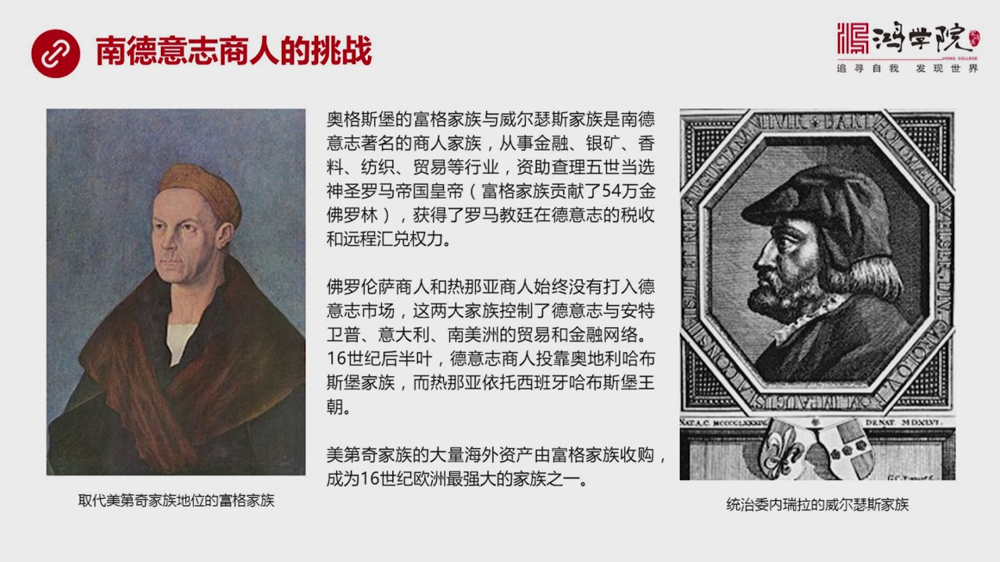

也很厲害就是難得一致商人難得一致整個德國以前經濟都非常的落後但是後來靠金融大力這個難得一致所以難得一致我們基本上從經濟史角度來說製了是多腦和一男這個地區也是以奧克斯堡為中心的木尼黑這一代他的發展是跟義...

<strong>All subtitles</strong>

> 也很厲害就是難得一致商人難得一致整個德國以前經濟都非常的落後但是後來靠金融大力這個難得一致所以難得一致我們基本上從經濟史角度來說製了是多腦和
> 一男這個地區也是以奧克斯堡為中心的木尼黑這一代他的發展是跟義大利的這個崛起文藝復興是有直接關係的所以奧克斯堡這個城市非常重要我們去年到德國進
> 行這個文明治理的時候專門到了奧克斯堡你會看到奧克斯堡這個城市有的非常復力彈劃完全不像我們現在想像的一個小城市的確他當年可不是一個小城市而是德
> 國南部的金融重鎮經濟重鎮貿易重鎮什麼原因呢就是奧克斯堡出了兩個重要的家族一個叫福克家族一個叫維爾斯斯家族這兩個家族他們是整個得一致地區最重要
> 的商人家族從事金融從事銀行還有開礦銅礦銀礦都有還有香料貿易房子品等等特別是這兩個家族對於查理50當選神聖是羅馬帝國皇帝發揮了重大貢獻除了熱南
> 亞商人給了錢之外福克家族一家就貢獻了54萬金福羅林當時他整個競選花了80幾萬福克家族一家貢獻了40幾萬當然另外一個家族維爾斯斯家族也貢獻了1
> 0萬剩下了就是熱南亞商人因為皇帝的選舉當然德國歷史為什麼是要選舉皇帝我記得以前在宏觀的德國的節目裡面做過介紹他選帝侯制度是怎麼發展起來的德國
> 皇帝為什麼要選舉這要追蹤熱慢民族的他的一些特性他一直是搞選舉制很奇怪但是這就是德國同時由於這兩個這兩個家族牢牢的控制了德一制南德一制當然由南
> 德一制南英和南德多腦和往往他的下游走在往北可以延伸到東歐的很多地方波蘭的很多地方所以這兩個家族基本上遮斷了佛羅倫薩商人也包括熱南亞商人向北推
> 進的可能性因為一北的地區都是這兩個家族在控制所以他們就形成了一個新的巨大的商業的挑戰者例如這個威爾瑟斯家族後來由於自助皇帝有功後來就把德國在
> 南美洲的殖民地就是偉內瑞拉封給了威爾瑟斯家族他們在那統治了很長一段時間所以他們就成了那個地區的某種以上相當於總統或者我們簡單說就是突霸王就是
> 一個小國王所以偉內瑞拉的歷史跟南德一制商人是有密切關係的同時這個福格家族後來美利奇奇家族衰落之後基本上他們家族在歐洲的很多資產是被福格家族所
> 所並構這就使得這個南德一制商人他後來的勢力非常的強大成為16世紀歐洲最強大了家族這兩個家族非常的厲害所以後來這兩個家族就是南德一制的這種他們
> 為代表的南德一制的這些商人群體和熱鬧鴨商人群體他們最後又走向了分化因為這個查理武士死後他的兒子菲律賦二世把奧迪利他繼承著西班牙和義大利的這些
> 領土也包括這個像荷蘭和比利時佛蘭德這些地方當然還有海外帝國而在北部的江土像這個奧迪利和德一制的很多領土是化分給了哈布斯堡的另外一個另外一支所
> 以兄弟分家了兄弟分家之後就導致了哈布斯堡王朝分裂成了西班牙的哈布斯堡和奧迪利的哈布斯堡由於這種分家熱鬧鴨商人就一直是跟隨著西班牙的哈布斯堡王
> 朝而德一制的南德一制的這兩個家族就跟隨著這個奧迪利的哈布斯堡家族所以他們就逐漸產生了分化明白這個道理之後我們再看下野除了金融中心轉移了又崛起了兩幫國際

---

### Slide 10

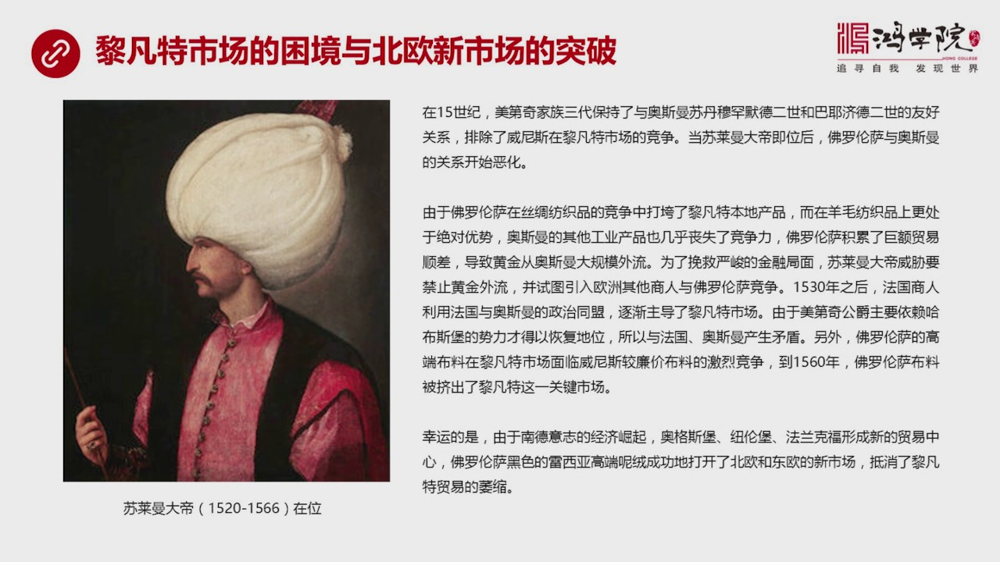

國際商人群體對佛羅倫薩都形成了重大挑戰除此之外除此之外除此之外除此之外除此之外除此之外除此之外美帝西亞族最看重的在15世紀最看重的這個事出現了問題為什麼會出現問題呢我們上一次這種上一次關於佛羅倫薩他的...

<strong>All subtitles</strong>

> 國際商人群體對佛羅倫薩都形成了重大挑戰除此之外除此之外除此之外除此之外除此之外除此之外除此之外美帝西亞族最看重的在15世紀最看重的這個事出現
> 了問題為什麼會出現問題呢我們上一次這種上一次關於佛羅倫薩他的第四期課程中專門講過美帝西家族就是他們的這個開山比組這個特別是從科興末皮哀羅和偉
> 大洛倫族這三個人這是相當於中國的康庸前到時間正好跟中國少一半每個人都少一半大概是這樣一個比例在這三個人統治期間那麼也就是從1436年遇到14
> 92年在這段時間裡面他們一家三代都跟奧斯曼帝國的小貓貓貓的二世還有他的兒子八一季的二世都保持了通家治好所以在土耳其市長長獲得了巨大的憤哥日子
> 過得很不錯但是當蘇萊曼帝繼位之後1920年之後情況發生了變化兩國家關係越來越僵蘇萊曼帝是一個應該說含有遠見桌式我以前講過火藥帝國三個火藥帝國
> 的時候土耳其蘇萊曼帝就是其中之一另外還有薩薩法維王朝還有這個莫爾王朝這是三個穆斯林的前國當時最厲害了就是蘇萊曼蘇萊曼帝執政期間他在經濟上在政
> 治上都有自己的紅土大略而佛羅倫薩相當於在土耳其的市長是長王長壩某種意義上相當就就意味著蘇萊曼帝認為自己簽署了不平等條約經濟貿易好處都被佛羅倫
> 薩人賺走了而且打垮了這個澳斯曼帝國的本土的產業其實跟現在特朗普的想法差不多怎麼辦呢他要是澳斯曼帝國重新偉大起來怎麼辦就是貿易逆差這事兒我不能
> 在容忍了因為貿易逆差會導致澳斯曼帝國的黃金大量了外流流向佛羅倫薩發生了嚴重的衝突同時蘇萊曼帝覺得直接跟這個佛羅倫薩競爭他還是不佔優勢因為他產
> 業已經垮了怎麼辦呢他希望能夠引進其他的澳洲商人譬如說法國就很好因為法國跟他的戰略同盟雙方共同夾雞哈布斯保王朝或者雙方有一種戰略上合作意圖某種
> 意義上跟英國的世界這種三角關係非常像所以澳斯曼帝國的艦隊冬天王王是在法國的馬賽亞沛茅東然後第二年恆少基督教世界當時把教皇切壞了認為法國人非常
> 的不敵倒怎麼能夠跟穆斯林聯合起來去跟基督教世界鬥爭呢其實因为法国非常不满哈布斯保王朝一统天下他就是受到威胁了所以谁能够帮助我对付我的对手我就
> 跟这合作这是法国人非常明显的一个政策由于法国商认进来了他们逐渐占据了主导由于文尼斯商人连假清晓等等原因使得到1560年之后佛罗伦萨的布料基本
> 上被挤出了迷范特这个最关键的市场因为那个地方人口多帝国的这个规模市场规模非常地巨大所以损失了离范特市场对于佛罗伦萨来说是一个相当严重的大级不
> 过他为什么没有很快地垮掉佛罗伦萨的经济主要的原因也就是他比较幸运的在于难得一致这帮以佛哥家作为代表这帮人崛起之后打通了像北北部欧洲像佛罗地海
> 沿岸和像波兰像烏克兰方向进行贸易的这种通道所以虽然是难得一致商人掌握着但佛罗伦萨的布料也可以卖过去就通过人家的渠道来销售那么就崛起了像奥克斯
> 宝游轮宝法兰克福这些新的巨大的贸易中心使得佛罗伦萨的这种高端的黑色的泥荣所谓这个雷夏布料高级泥荣在那儿卖得很好都是贵族买大家都觉得哇就是佛罗
> 伦萨产品的账太扭了那么也就是说在东部市场中損失了这些偏低偏低一些的这种市场份额就是布料差一点的布料差一些的这种黎范特市场的份额被北部市场的开
> 拓基本底销了所以佛罗伦萨在1570年前后他还没有出现重大的马上崩溃的跡象就是因为开拓了北欧的市场主要的原因是难得一致商人的崛起我们再看下一那么整个16世纪来看的话我们会发现佛罗伦萨金融上我们已经说了

---

### Slide 11

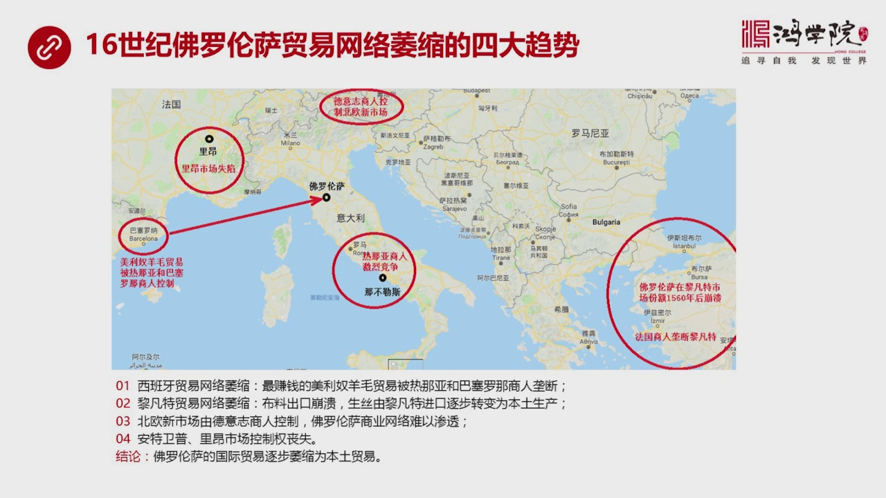

他的中心地位已经被安特微博所取代而他的贸易网络呢也出现了全面伪缩的几个趋势你比如说在西班牙贸易网络逐渐伪缩了因为热闹鸦商人控制了这个地区最赚钱的美丁奴羊毛他这个贸易被谁垄断了呢热闹鸦商人和当地的巴塞罗...

<strong>All subtitles</strong>

> 他的中心地位已经被安特微博所取代而他的贸易网络呢也出现了全面伪缩的几个趋势你比如说在西班牙贸易网络逐渐伪缩了因为热闹鸦商人控制了这个地区最赚
> 钱的美丁奴羊毛他这个贸易被谁垄断了呢热闹鸦商人和当地的巴塞罗纳商人联合垄断所以佛罗伦萨商人到那之后你拿不到货员人家把你挤走了你在那还搞什么搞
> 没有什么太大的笨头了虽然有一些商人也在仍然留在西班牙座生意有的也发了财向美丁家族另外一支在本土的美丽家族摔了之后他们也是还比较强大就是因为他
> 的西班牙座生意但是总的说起来佛罗伦萨在西班牙的竞争没有办法跟热闹鸦相提并论那么第二个市场就是我们刚才所说的离翻特市场贸易委缩了所以出口不料出
> 口不料了出口量崩溃而以前跟他有贸易关系从离翻特主要是进口生私产私我们上去讲到了佛罗伦萨的私仇制造业在14几年突飞猛进但是由于后来残私主要转向
> 了本土意大利本土特别是佛罗伦萨周围的很多地区开始重商数养残所以他的生私主要有本地来供应而不再从离翻特进口那么我跟离开特之间还有什么关系呢我的
> 不了卖不出去我要的原材料我自己能生产那我们当然这个贸易关系就委缩了在那个地方贸易网络也就逐渐地瓦解了那么第三个方面是什么呢就是北欧新市场虽然
> 起来了但是是德意志商人掌握着小时候渠道佛罗伦萨商打不进去第四个就是安特威普和李洋市场逐渐喪失了金融上门和贸易上的控制权李洋当年也是个重要的一
> 个商贸城市和金融中心北边是安特威普南边就是李洋由于李洋这个市场他的佛罗伦萨本来一开始在那站去主导地位但是后来热闹亚商人激进去了同时法国商人对
> 于佛罗伦萨的态度越来越不好法国为什么跟佛罗伦萨关系会越来越疆呢我们一会会讲了国际政治的时候会讲到这一点那么也就是佛罗伦萨商人在李洋也后面下去
> 了这就导致了我们看这张图他的上下左右几个方向商业机会都在伪缩那么在伊加利本土呢特别是还有两个市场纳布勒斯和罗马呢也遭到了热闹亚商人的这个滩透
> 因为南边这两个城市主要是由西班牙人西班牙这个势力菲律博二世还有他爹查理武士他们来控制所以热闹亚人跟他们的关系很好这就导致了不仅强的教皇的财政
> 权而且强了很多热闹亚热闹亚人强了很多罗马和纳布勒斯的很多商业机会这样的话佛罗伦萨的金融制搞点没了他的贸易圈逐步被压缩到伊加利半岛而且逐步被压
> 缩到了佛罗伦萨本地其他地区的产品还纷纷的卖到了佛罗伦萨这就是他整个的势力范围严重的伪缩所以这个结论就是佛罗伦萨的国际贸易已经逐步伪缩成了本土
> 貿易我们再看国际政治潮流之下业国际政治潮流当时出现了一个新的局面就是民族国家的崛起承帮共和国的甩路

---

### Slide 12

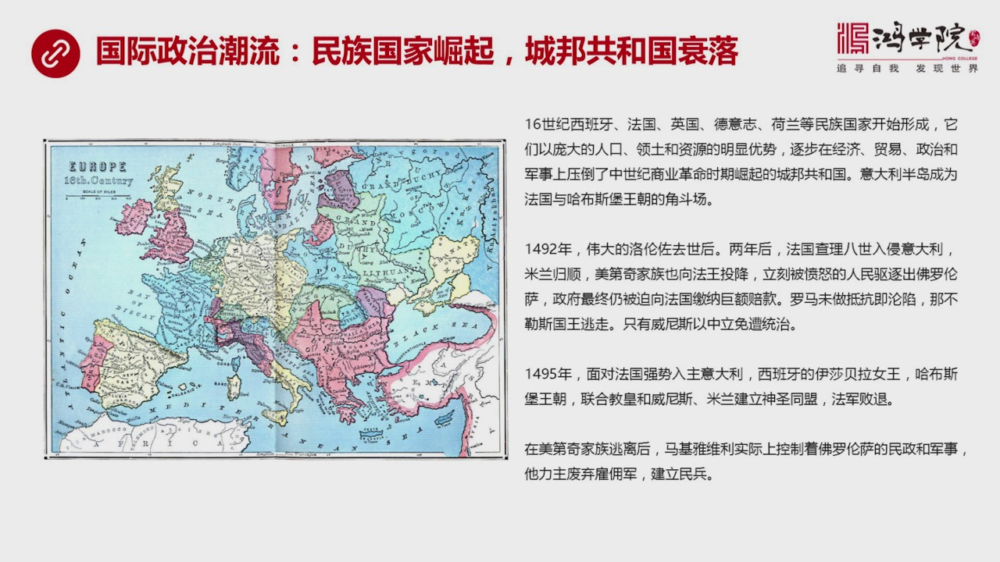

很显然以前承帮共和国崛起的时候民族国家们像法国英国还有德伊质量很多地区西班牙他们还处在封这个封建的割剧状态就是国王全力很小封建了这些工具员们博决们他们承望承网所以这些封建王国还是四分武力但是经过百年战...

<strong>All subtitles</strong>

> 很显然以前承帮共和国崛起的时候民族国家们像法国英国还有德伊质量很多地区西班牙他们还处在封这个封建的割剧状态就是国王全力很小封建了这些工具员们
> 博决们他们承望承网所以这些封建王国还是四分武力但是经过百年战争经过十五世纪的一切的发展像法国它的中央集权就变得越来越强大英国跟法国基本上同步
> 还有西班牙完成的统一也变成了一个民族大国就是民族国家当然德伊质量很多地区它也变成了一个比较强大的民族性质非常强的这些公国还有低地国家像荷兰像
> 比例石这些地方当年的佛兰德也出现了越来越强烈的民族注意的情绪特别是在荷兰反对西班牙振压了过程中他们的民族意识越来越强当然北游的像瑞典这些国家
> 也相应的出现了类似的趋势所以成万共和国为什么不好使了成万共和国往往是以某一个城市或者周围的几个城市像佛罗伦萨他可能周围有一些听他话的一些城市
> 包括他征服的像比萨像后来的李温还有阿里佐这些地方可能听他的话但是鞋纳就不服啊所以你会看到这些小的成万共和国以这么点的人力物力和经济资源是没有
> 办法长期对抗民族这种国家的崛起的这是一场必然会失败的战争或者这种较量正是由于民族大国的崛起导致一大力半导这些四分五列的成万共和国他就面临几大
> 强权的压力西班牙法国英国得治纷纷压向了西班牙半导那你还怎么成得住呢所以从1492年这个一方面是西班牙人发现了新大陆另外一方面是佛罗伦萨的洛伦
> 佐第三代领导人洛伦佐伪大洛伦佐失掉了局面很快就惡化了1494年法国的国王查理巴士就带领军队入侵一大力了为什么呢他说按照王朝我们以前就占领洛伦
> 斯现在我们来收回我们当年的这个王权了始终他就没承认那个地方是属于阿拉共的所以这就达起来了这个时候你会看到法国军队那种战斗力他就不是中世纪一大
> 力那些雇雄军雇雄军打仗经常是大家与后来与回去一场大战亦才死一个人这一个人还从马上掉下来摔到尼堂也淹死了自己淹死的还不是说在战场中打死的因为这
> 个雇雄军他主要的目标是为了去打结这个抓富路要属金所以他们战争中这种血腥程度很低因为抓富路每个富路可以卖多少钱对方来熟他是以经济思路在打仗根本
> 就不是正式把钱给打仗但法国军队可不一样那是经过百年战争习力的那是跟英国打出来的而且是国家军队所以这一帮人查理巴士在这帮人就如蒙虎杀入阳群打入
> 一大力之后一大力除了温泥斯勉强通过宣布中立保持住了自己的独立之外其他的基本上被很多地方连反抗都没有就直接偷强了像米兰这个事主要是米兰引起的他
> 们招惹他们把查理巴士招惹进来了是请进来的结果发现请进之后他的独立反而喪失了包括这个富路能撒美地西加足也像法王投降了正是因为他们向法国国王投降
> 查理巴士提出一系列不平等的非常非常喪权農国的条件美地基加足居然同意了因为路论做了儿子实在是不打地这样的话就激怒了富路能撒的这些人民所以他们就
> 立刻爆发了起意驱逐了美地西加足把他们赶走了而且政府把他们加产全部默收其实最后你会看到富路能撒还是打不住法军因为法国当时实力太强大了最后政府还
> 是向法国各地培款主要是培款了罗马也没有经过抵抗他也放弃了纳布勒斯的国王简直下着不敢打仗直接逃走了所以你会看到查理巴士在1494年入侵意大利基
> 本上打不顺风顺水从北向南几个月就打穿了这以前可不是这种大法但是资本以来的话就搅动了国际局势如果你法国太强的那西班牙这帮人就不干了哈布斯导那帮
> 人也不干了所以大家就形成了反法同盟1495年建立了你进攻意大利第二年就搞出了神正同盟西班牙历纱威乐女王再加上哈布斯导王朝再加上教皇这帮人都不
> 干了维尼斯米兰建立了神正同盟最后跟法国较量那就变成强国以强国之间的这种直接的冲突了那么法军在几次战役中被打败了而且这个查理巴士到了纳布勒斯过
> 得太愉快所以他们也没有心思去打仗最后就被赶回了法国那么佛罗伦萨情况比较乱因为梅迪西加足控制佛罗伦萨已经已经这么长时间了那么其实要从这个科西莫
> 他爹这个乔万尼一开始算起已经进百年了那么一旦这个权力中心丧失就会形成城市中的权力阵控那怎么办呢这帮人心起来这个造反这帮人就干脆我们搞共和制回
> 复共和制然后这个当时虽然有一些民意上的一些人在领头其实主导作用尤其对军队和民政及主导作用是马基亚威力就是那个军主论的一些佛罗伦萨使的那位他实
> 际上主长着佛罗伦萨的兵权还有他的民政的很多权力他是实际的操纵者当然后来美丽加族复庇了打回来了马基亚威写了很多包括这个佛罗伦萨使这本书写的基本
> 上就是在为美丽加族各公宋德但是他为什么要这么写呢一方面是他自己的统治经验其实他没统治太长时间还有他对佛罗伦萨的历史研究他是主要目的是为了讨好
> 美丽加族让他重新获得权力他这人本来就是一个所以马基亚威力主义者是指着什么呢就是权力之上了不讲不讲一些底线了所以他本人就是这种人当然美丽加族一
> 直没有打理他这是后话那么我们再看下野那么美丽加族是怎么东山在起着呢他们不是被赶走了吗

---

### Slide 13

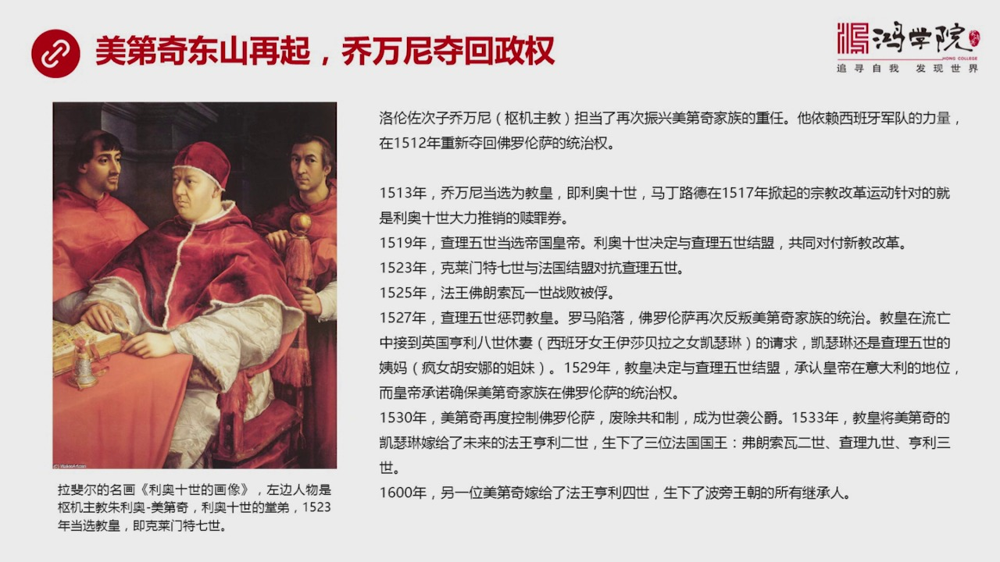

主要还是源于美丽加族除了另外一个比较厉害的人就是伟大洛伦佐他有两儿子嘛还有一个儿子喬万尼这个喬万尼从小就被洛伦佐送到了罗马从教会开始干起他就在意大利大家都有这个传统儿子中间怎么着也得安排一个去教会为什...

<strong>All subtitles</strong>

> 主要还是源于美丽加族除了另外一个比较厉害的人就是伟大洛伦佐他有两儿子嘛还有一个儿子喬万尼这个喬万尼从小就被洛伦佐送到了罗马从教会开始干起他就
> 在意大利大家都有这个传统儿子中间怎么着也得安排一个去教会为什么因为教会在意大利的权力罗马教庭的权力是非常巨大某种意义上零价于这些攻绝这些这些
> 本土的这些王侯之上因为教会还有统治整个基督教世界全欧洲的这种能力和能量所以大家基本上都愿意把自己就是除了发财这条路派个儿子掌权这条路可能有个
> 儿子但是还有一个儿子必须要派往教会准备在教会集体中间攀上权力的顶峰那么喬万尼作为洛伦佐为大洛伦佐的第二个儿子他主要就被派到了罗马教庭当然喬万
> 尼这个为大罗伦佐很有钱了所以而且在罗马教庭他是说了算的所以他很快在那儿子十几岁的时候就给他搞定了书记主教这样的职位他可能是由事以来最年轻的书
> 记主教什么叫书记主教就是罗马教会制度他是一个金大型最顶段当时教皇教皇谁选举的就是这些书记主教书记主教们选举教皇书记主教再往下就是各个大区的这
> 种主教比如说英文有词叫克斯伊众为什么叫克斯伊众呢因为克斯伊众的意思就是大主教他的座座堂的这个教堂就是他在这主持米萨里拜这个地方就叫主教教堂教
> 座教堂那么一个大区的主教教堂某种意义上相当于教会系统的神伟书记再往下是那些普通的红一主教这个大主教然后底下是红一主教红一主教就相当于一个市区
> 的市的社委书记再往下就是修道院的院长了还有当修道院不一样修道院某种意义上是这个直属教皇的特别是克里尼修道院和后来兴起了一系列修道院他们是教皇
> 的直属的部队所以修道院跟教会还不一样为什么教修道院修道院往往是在城市的远礁区或者身上老林地方修道院他要修炼自己所以要远林医宣销之处闭门唱圣歌
> 或者进行痛苦的这种折磨自己的体力劳动还有这个前程的敬拜这叫修道院教会教会要宣扬其主教必须要在城市中心要在闹市区所以教会就是这个教堂一定是在闹
> 市区在市区修道院一定是在远礁区或者身上老林林所以搞明白这个道理之后你就知道书记主教他的地位谨刺于教皇而教皇就产生于书记主教好家伙洛伦做把他的
> 赐子喬万尼医很快就提拔到这个位置上当然是用钱的原因那么喬万尼就获得这个巨大的一个能量因为他可以调动教会的很多力量当美丽家族被赶出了佛罗伦萨之
> 后他就一直在找机会东山在一起找来找去发现可以要么依靠法国人要么依靠西班牙人一定要依靠外力才能重新夺回佛罗伦萨的权力后来他们在喬万尼之前他们留
> 在佛罗伦萨的美丽家族是投靠了法军但是法国人最后占败了他那只掌门人业死掉了肚荷是烟死了所以喬万尼他就决定要依靠西班牙人来奪权151、
> 12年重新奪回了佛罗伦萨的统治权西班牙人相当于借用外力迫使佛罗伦萨投降把政权交回来到了151、
> 13年喬万尼当选为教皇美丽家族出的第1个教皇也就是利奥时事我们都知道马丁录德在1517年搞了宗教改革运动影响了整个全世界的基督教产生的大分裂
> 新教出现了跟罗马天主教打起了1517年就在德国发表了他的95点论钢他的95点论钢批判谁呢重点是批判利奥时事因为利奥时事大力推销熟罪劲赚钱赚钱
> 主要是为了主要是一方面奢侈的生活但是更主要还是为了修圣彼德的大教堂我们也会说到但是这个行为本身激怒了马丁录德马丁录德反的是谁呢反的是美丽奇家
> 族的喬万尼有一副名话拉菲尔的一个名话利奥时事的画像在左图在画像中做的前面这当然是利奥时事就是美丽家族的喬万尼他左边还有一个书记主教这个人叫什
> 么呢叫朱利奥美丽奇这个朱利奥美丽奇也是美丽家族的我记得上次核心科我们讲到这个洛伦佐他还有一个兄弟朱利亚诺朱利亚诺当时跟乔跟这个洛伦佐他们在教
> 堂手被人刺杀了兄弟俩他被刺死了这个洛伦佐逃跑了正是由于这个原因所以导致了后来这个惩罚判判土或者这个城市判土我记得有布电影叫红龙就讲到这个事怕
> 其家族就是当年主要的蒙反家族这个红龙这个偏子眼的就是一个警察洛伦佐的一个警察的总督后来被调死了就是讲的怕其家族那么这个朱利亚诺他死的时候已经
> 有一个移负子这个移负子就是做的做表了这个初级主教朱利亚美帝齐所以他跟洛石是算是唐兄弟那么洛石是就一直在提霸他这个唐兄弟后来洛石是死了之后这个
> 一无二三年朱利亚再次当选教皇这就是美帝家族出的第2个教皇他这个教皇叫什么呢叫克兰门七世克兰门特七世所以美帝家族一共出的第2个教皇非常的非常的
> 厉害那么这个一无一三年他当选教皇之后马丁陆德开始造反一无一九年查理武士当选帝国皇帝他虽然掌权掌握这个掌握西班牙还有这个机场了很多移产之后但是
> 皇帝这个皇权必须要选他是一无一九年当选的一无一九年当选之后立要实施就决定要跟查理武士同这个结盟因为查理武士实力看起来更大一些来共同对付新教因
> 为他已经做上了教皇这个位置叫考虑整个教会天主教教会的势力的问题所以必须要打击新教怎么办那必须要联合皇帝查理武士来做这个事儿那么到了一无二三年
> 也就是他死了之后他的堂帝这个注料现在被称之为克兰门特七世他又改变了方针有跟法国结盟又对抗查理武士其实我们看教会师你会发现很有意思教皇这个人呢
> 或者说教皇作为一个职业他只要做到这个位置上他都会想自立为王甚至有些时候他甚至想就作为世间的皇帝他自己做皇帝有没有有就在这个在更早一些的时候比
> 这个文艺服刑更早也是更早一些时候公元九百年到一千年那个大混乱局面的时候他就认为既然你法国国王都这么弱咖啡家族刚建立时候是比较弱的那我为什么不
> 能全儿代之我为什么不能做既做精神领袖又做实际领袖呢所以叫皇一般来说不管谁做教皇都会非常讨厌有一个大国主宰这一大例如果你是查理武士主宰我我就会
> 跟法国那边没来演去如果法国这边太强大我就会跟神盛罗马帝国皇帝没来演去就是法国德国我一定要让这两强掐起来有时候还加上西班牙掐得越厉害我从中火中
> 取历的这种机会就越多所以教皇这个职业或者谁做到这个位置上都会做这种事手术两段不断的去拉这个打那个一会就拉那个打这个玩这种权力的游戏但这么一来
> 呢就激怒了查理武士他跟法国健盟而法国的这个国王富朗索瓦伊士占败了不仅打败而且被服了就跟神盛罗马帝国打仗的时候然后这一下子一下他这靠上没了查理
> 武士一看好家伙你准备干啥你准备造反所以查理武士决定要惩罚教皇但是除了他的军队还有一些新教的军队还有一些乱七八糟的一些贵族的军队在查理武士出兵
> 之前就已经攻陷了罗马攻陷了罗马之后富罗伦萨听到这个消息之后富罗伦萨人当时是被迫臣服于美帝下族的好一听你现在这个看来门七世这个主要美帝习被赶下
> 台就是被赶走了他从罗马逃出去了纳罗富罗伦萨人就立刻就又反了再次反叛美帝下族这个时候这个看来门七世就冬朵西藏刘立施所正在刘立施所之中接到了英国
> 国王康利八世要休期这个历史上大家都知道这段历史是恒利八世非常真正非常搞笑这个取了很多无数老婆也杀掉了很多休期的这个这个情愿书就是在克萌萌特七
> 世刘王的过程中这个在上午骗下午一张床的情况之下教皇收到这个请求虽然他很想去讨好康利八世但是他现在实在是没有办法他希望能够回到罗马之后再从一考
> 虑这个事这就导致了康利八世就认为教皇如何如何最后就导致了英国建立了国教托利罗罗马教会此来后话那么他休的康利八世休期休的谁呢休的是西班牙女王一
> 下背了的他的女儿凯斯林一上背了生了好几个女儿四个女儿各个都很厉害有一个是风女欢娜就是剩下了查理武士的那个那个还有一个是这个凯斯林嫁给了康利八
> 世王后所以呢凯斯林还是查理武士的这个他的姨妈那么到了1929年呢我为什么要说这些他的亲戚关系因为这些亲戚关系如果你搞的不是太清楚的话那么你在
> 看这些王朝历史的时候就搞不清楚他中间的厉害得是关系搞不清楚他结盟的背后的真是意图就是我们既要研究经济史同时也要非常仔细地去处理他的政治史其实
> 你是用经济发展在包括经济发展之前的自然地理一层一层的向上解读最后搞清楚为什么他会摔落为什么他能够崛起来解读他的他的发展的趋势和方向经济的政治
> 的文化的思维的一层一层往上推演那么到了1925这个1529年教皇决定再次与查理武士结盟承认皇帝在意大利地位他为什么又做了改变因为他的老家老潮
> 佛罗伦萨丢了每天一家族被赶走了所以他这个时候觉得有必要还是跟还是跟这个更强大的查理武士结盟算了结盟之后我承认你在意大利的特殊地位同时你要确保
> 承诺我们每一家族要在佛罗伦萨取得统治权而且取得统治权我们要做实习的所以1530年1929年到1930年每一家族靠着西班牙的军队维困佛罗伦萨最
> 后佛罗伦萨不得以再次投降武这一回就干脆废除了共和制就出现了工决事情工决每一家族从工和制变成了工决制这就是佛罗伦萨工决然后1533年教皇将每一
> 期的这个家族的凯斯林就是他想把自己的家族的女儿安查到王氏中间去就嫁给了后来的法国国王杭利亚士杭利亚士生下了三个法国的小国王兄弟杀都当了国王佛
> 罗伦萨二世查了一九世和杭利三世当然再往后1600年另一个美帝机家族另一个美帝旗马丽美帝旗嫁给了法王杭利四世开创了著名的博帕王朝博帕王朝后来所
> 有的从杭利四世以下的什么 陆以十三 陆以十四 十五十六然后十八这一系列都是这个美帝旗嫁做的后代都有他们一半的学员但除此之外还有西班牙的王氏还
> 有这个因为西班牙的王氏在这个后来是陆以十四的孙子去做的国王那么这个这条线一直延续到一九一九三六年当时西班牙内战佛朗哥上台之后把门干走了但是一
> 九七六年这帮这个佛朗哥死后人家又要恢复西班牙 恢复国王制度又把博帕王朝家族请过来当国王一直到今天所以西班牙王氏仍然是博帕王朝博帕王朝的主要他
> 的创始人是谁呢河内四世河马里美帝旗好这个搞明白之后我们看一下下夜我们干所说佛朧萨工决

---

### Slide 14

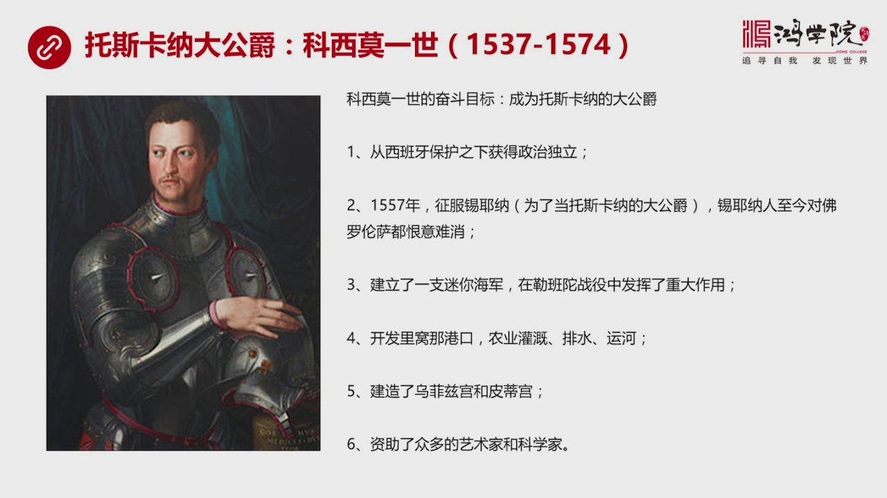

那只是管佛朧萨这个地区后来呢他们这个家族出了一个科西莫伊士也就是在一五三七年科西莫伊士他其实是另外一只比较愉晚的是瞧完一创始人内置留下来的因为后来洛伦佐他们这条线下来的都是四孙子没有权力继承这种工决或...

<strong>All subtitles</strong>

> 那只是管佛朧萨这个地区后来呢他们这个家族出了一个科西莫伊士也就是在一五三七年科西莫伊士他其实是另外一只比较愉晚的是瞧完一创始人内置留下来的因
> 为后来洛伦佐他们这条线下来的都是四孙子没有权力继承这种工决或者继承这种试习的绝位所以他们选了另外一条线科西莫伊士他选了自己的名字叫科西莫伊士
> 他建立了这个他努力做了很多事情他唯一的目要是什么呢就是成为托斯卡纳这个地区的大工决佛朧萨就好比是一个省会比如说佛朧萨工决相当于南京市委书记他
> 现在想做整个江苏省的市委书记省委书记怎么办要征服托斯卡纳的这个主要的城市那么为了实现这个大目标他分成了几个步骤来做比如说从西班牙西班牙一直依
> 靠西班牙顺利保护那么他首先要赢得政治独立西班牙当时正好又发现在意大利这个盘子里要狡猾佛罗伦萨这个妻子还是有用的最后就从佛罗伦萨撤军他就获得了
> 政治独立第一步第二步是他一无五七年争复了鞋纳为什么呢目的还是为了当托斯卡纳大公决因为这个鞋纳是托斯卡纳边缘地区了如果这个地方也不占领不争复他
> 那么你怎么能耗成自己是大公决是这个地区的省委书记呢所以他一定要打其实是鞋纳当时人口很少他几万人五万多人而且没有多少税收但是这场这场这个维困战
> 打得特别坚心打了两年多四场无数最后终于争复了鞋纳所以鞋纳人意大利人是比较有意思他们一旦形成了这种他们就有很强的这个地域意识鞋纳人一直到今天说
> 到佛罗伦萨忍仍然是没有好没有好这个心情的这个就说明我们看到这个这个家族记仇或者什么什么记仇你不至于记五百年吧意大利人真能记五百年意说到佛罗伦
> 萨忍鞋纳人就吐血很不爽意大利人仍然有恨意这就是我们要了解一大例的时候听到鞋纳哪在印象出问题了鞋纳在哪儿鞋纳是立上发生过什么事鞋纳跟佛罗伦萨跟
> 罗马之间什么关系他到底老百姓心面在想什么这些问题如果不搞明白或者完全没有概念的话你还怕那什么国际金融形式那么第三他做的重要事情就是建立了一支
> 迷尼海军他这海军不大但是呢在这个后来的1570年前后的这个罗伴陀站一种发挥的重大作用打败了在打败傲斯曼帝国的过程中起到了旗宫旅舰旗宫第四个他
> 做了一个非常重要的工作就是开发了李国纳赶口李国纳后来之所以能成为一个意大利重要的赶口就是科义莫伊士在当年所做了一个巨大的开发工作除此之外意大
> 利的农业托斯卡那农业在科义莫伊士统治期间也获得了其他的改善比如说农业怪怪排水和运河排水就是找则在意大利托斯卡那很多找则地找则地如果不排干水的
> 话就会出很多瘟疫啊还有这个纹蟲啊之类的会这是长期来是帝农海国家一个非常偷偷的问题不排干找则没法发展农业所以你看像罗马为什么他叫七个小山头因为
> 最早城市都见得山山这个小山头的顶上底下这些地方是什么是找则所以像英文中的这个forum这个论谈这个意思这个论谈他的原因不是这个大家好像变论这
> 个论谈他原意指的是七个小山头底下的找则地带后来排干了找则之后城市才往下修最后在那个地方建立起来广场大家在广场中辩论这个forum这个词是源于
> 七个小山头底下抽干找则之后建立的广场大家在广场辩论这个词员是这么过来的那么这个第五他建造了无非自攻还有帝农这就是我们现在到forum论盖你会
> 看到无非自博管哇那里头真是好东西太多了帝农那也是建筑建筑中的一个奇异我在上一节forum论盖核心客中专门介绍过这两个地方第六他当然还资助了众
> 多的艺术家和客家媒体家族基本上文艺复兴的这些这些首要人物基本上全顺跟媒体家族非清这个虽然非清非故但是都受到媒体家族的长期的包扬和资助有没有媒
> 体家族基本上就不可能有文艺复兴了当然还有客家想后来的什么隔半年也收到过他们家的援助还有家力略也受过他们家的资助所以他们对科学对艺术对文化都起
> 到了重大的作用下午我们来看一下这是一个整体的媒体家族的一些重要人物

---

### Slide 15

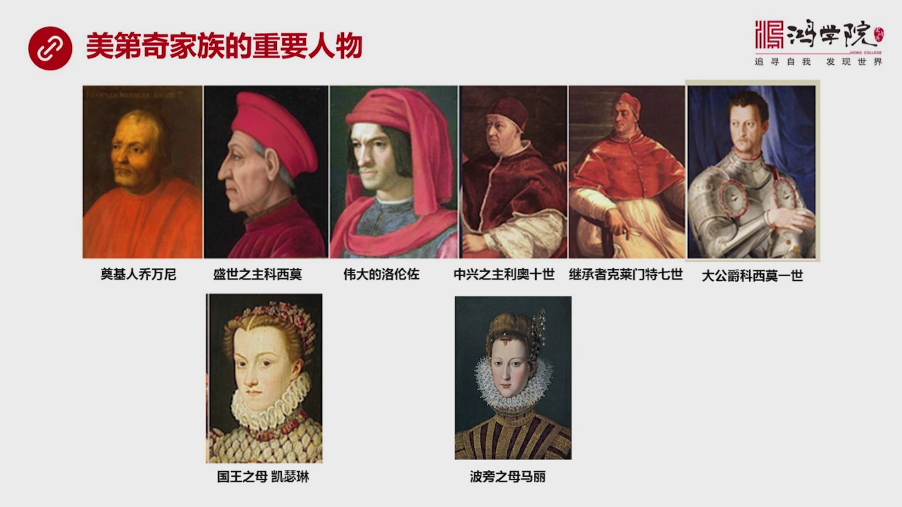

其他人不记得没有关系但这几个人是要知道的电机人敲完你敲完你相当于这个清朝的诺尔哈翅吧然后科兴莫呢盛世之主他就比较类似于康熙了然后中间还有一个Py罗Py罗这个媒体家不太重要相当于庸正过动一下然后就是伪大...

<strong>All subtitles</strong>

> 其他人不记得没有关系但这几个人是要知道的电机人敲完你敲完你相当于这个清朝的诺尔哈翅吧然后科兴莫呢盛世之主他就比较类似于康熙了然后中间还有一个
> Py罗Py罗这个媒体家不太重要相当于庸正过动一下然后就是伪大罗伦佐伪伦佐之后就是他们家的中心之主就像韩国五弟留秀一样利药实施教皇他之后继承他
> 的教皇职位的是他的唐利科兰们七世科兰们七世之后在他们家族最重要的一个人就是大功绝托斯坎的大功绝科兴莫一世然后两个非常厉害的女的一俩都是法国皇
> 后一个是国王之母他生了三个孩子都是国王嫁给了一个法国国王就生了三个法国国王三个儿子都是法国国王他的最后一个儿子康熙三世之后就是康熙四世了就开
> 创了一个从瓦罗瓦就变成了这个一五八九年就变成了不怕王朝不怕王朝的王后是谁呢居然又是他们家的家族了这个国王之母马力然后凯斯林跟马力就是这俩两个
> 美丽旗基本上控制了法国的这个后来的国王控制很多代从一五三几年一直就是再往后基本都是他们家族的后裔了当然凯斯林这个还有除了三个儿子当国王还有一
> 个比较神奇的女儿马格皇后这个以后我们有机会再说到这些匪文这些有趣的故事好美丽家族对佛罗浓上统治我们大概就说这么多下面我们讲一下佛罗浓上他在十六世纪

---

### Slide 16

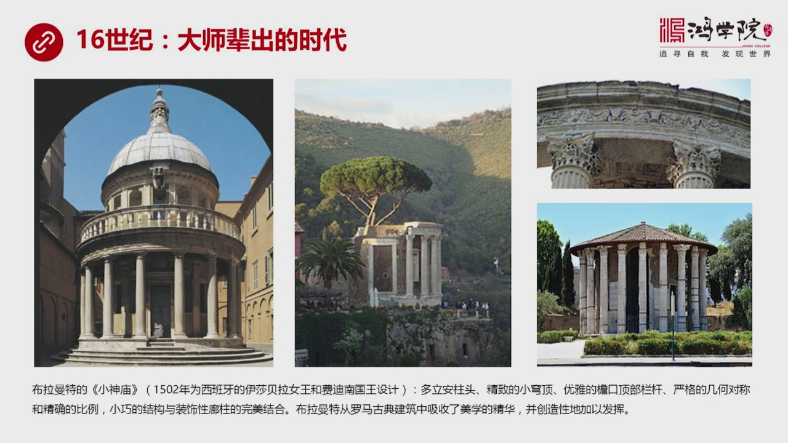

实际上达到了文艺复行运动真正的顶封状态他是个大师被出的时代就是一个地区他的经济发展比如说佛罗浓上吧头一百年在十三世纪他还在打基础每个人都忙着胜钱根本就没有时间也没有经历也没有这个心思去发展艺术文化就像...

<strong>All subtitles</strong>

> 实际上达到了文艺复行运动真正的顶封状态他是个大师被出的时代就是一个地区他的经济发展比如说佛罗浓上吧头一百年在十三世纪他还在打基础每个人都忙着
> 胜钱根本就没有时间也没有经历也没有这个心思去发展艺术文化就像中共现在一样刚刚附了四十多年大家其实还没有进下心来去研究文化问题文艺复行运动的发
> 生是在他百年富裕之后从一三零这个一三零零几年开始瞧脱那时代才开始出现了一种文化思想艺伤的一种新生的力量要创新了为什么呢他已经付了一百多年了已
> 经有很多家族很有钱了这些家族在一百年分头之后相当于第四代第五代人的时候开始调叫这些孩子们穿衣吃饭礼貌 礼节然后古罗马时代一流下来了七种这个艺
> 术七种学科等等开始非常重视在不愁吃不愁喝不愁金钱的情况之下开始培养这些下一代或下几代的他的一种修养一种精致的生活一种对美对艺术的这种这种见场
> 能力品味这些东西会带来文艺复行艺大利文艺复行的发源主要是在一百年富罗伦萨了新生繁荣之后从一三零零开始但一三零零一百年还不足以激烈出很多大事来
> 除了乔托之外太有名的大事没有几个但是到了一四几年那就除了一大批结出的人才像我们上这个讲的什么多纳泰罗什么歌左立一大批当然我们可能很多人不太熟
> 但是没有关系你听一下这个核心课上一个核心课然后脑子买就会有印象他们除了一大批建筑家雕刻家 艺术家 会化还有各种各样的人比较比较了不起的人物像
> 布罗内南斯基亚像多纳泰罗这些人惦定了十六十几就是一五零年之后一个更大的飞越这个飞越是吗那就是世界级别的我们现在人都知道的这些大事被出的这个时
> 代那么可以说十六十几是它真正文化的顶峰文艺复兴的顶峰但是实际上十六十几就是它开始经济政治走下坡路的这段时间所以我们可以看到文化一个地区的文化
> 它的发展要晚于经济繁荣一百年也就是中国现在到现在一直七十年可能大家生活越来越好了但是还没有到真正文艺复兴的时候可能还要再过二三十年的基点才会
> 出现真正的可以说是化时代的这种世界级的大使现在级电还不够因为大家都还忙着挣钱这点事还没整明白一时温宝还没有彻底的解决还没有太多人有太多的心思
> 去琢磨这些事儿但是再过三十年一定会出但是这个时期要至于经济发展之后于经济发展一百年而到了经济摔落的这个一五年之后经济开始游战转摔的时候正好又
> 是文化繁荣的顶峰期所以它整个文化繁荣跟经济发展之后它是有个智后的周期的经济不行了它的积累达到了顶峰因为积累了三百年了那就除了一大批伟大的人物
> 比如说第一个当然在建筑学中就是非常著名的布拉曼特当然它不见得它不是佛罗伦萨人但是我在这里讲的是佛罗伦萨的文艺复兴已经开始向意大利加城市进行扩
> 散了你比如说美克朗、俊罗然后这些达芬奇然后拉菲尔这些人其实都去过意大利的很多城市是他们把一些先进的理念艺术和文艺复兴中间的很多革命性的东西革
> 命性的记忆带到了意大利的各个城市所以那个时代每个城市基本上都受到佛罗伦萨的影响想布拉曼特的小什么样其实在罗马这个小什么样是为伊杀卑勒就是西班
> 牙的女王伊杀卑勒和菲敬丹国王印他们的要求来修炼的这小什么样有什么特点你会看到如果我们去法国去这个欧洲的北部国家你会看到他们的建筑很少他们的建
> 筑都是在那个时代是完全不同的都是尖领的那种哥特斯大教堂原顶的穷龙那种东西是意大利人他的手创也是他们最喜欢用的模式代表着一种他们认为是一种完美
> 的象征他们不愿意修那种尖顶的他们认为那是哥特哥特是那是野蛮的野蛮的蛮人我们意大利人那是非常非常地罗马帝国的后人我们罗马帝国搞的都是穷龙建筑那
> 个东西最美所以在这个建筑出现之前你看意大利的他的所谓文艺复行他这个富古很大程度上是跟他的穷顶大量的应用有关我们上期节目讲到了佛罗伦萨的生白花
> 大教堂布罗内拉斯基盖上去的一个大穷顶开闯了一个历史的灰荒的新的篇章那么在罗马为什么罗马这个时候后来就他一开始是落后佛罗伦萨的在文化艺术上因为
> 他当时还没有教皇不在罗马教皇是在阿文尼翁一三七七年才签会罗马真正罗马开始大规模新建就是从150年以后特别是利耀时事美丽基加族的这个教皇上位之
> 后开始大规模的新建罗马开始重修这个城市重修这个城市第一批这种非常伟大的建筑了不起的建筑布罗曼特的小什么要是很有代表性的因为在此之前没有出现过
> 罗马没有出现过这样的精美这样的一种非常复古的但是又有现在范儿了文艺复兴范儿的这种建筑你比如说其他不是说没有原型像布罗曼特参考了很多古典建筑这
> 个希拉罗马时代的我们看到中间和右边纪长图都能说明简单来看它这柱头显然是希拉式柱头多连它在这儿用的是多连柱头当然还有按钮尼亚克林斯像右头上面这
> 是克林斯柱头那么布罗曼特用的是多连式柱头然后上面盖一个小穷顶非常优雅的一个盐口上面有很多蓝杆环形的蓝杆它整个设计体现了非常严格的几合对称和非
> 常精确的这种比例关系那么整个这个结构可以说是小巧和装饰小巧的这个建筑结构和装饰性的这些柱狼外面这一圈是柱狼它是个非常完美的一个结合假如我们设
> 想一下它没有一些狼柱那这个建筑变成什么变成水统会非常不好看那么上面如果上面这个盐口的上步如果没有一圈小的二楼没有一圈小的围篮我们设想一下它会
> 变成什么那会变成上面一个一个统放到下面一个统之上也会变得非常不美观如果没有这个窮龙没有这个窮龙就变成我们看到了右边最下面那个图那就带来个草帽
> 了那就很难看了所以这个布拉曼特是把好几种罗马建筑中间的一些精华这些药素加以体链和终核它实际上是创造性的发挥了古典建筑了美和佛艺复兴的那种范所
> 以它这个代表座是很有名的小什么药正是因为它搞出这个小什么药1502年所以它被叫黄看中了叫黄就说你能不能帮我们做这件大事下一步下一篇这件大事是什么呢从建圣笔的大教堂这个事可太大了

---

### Slide 17

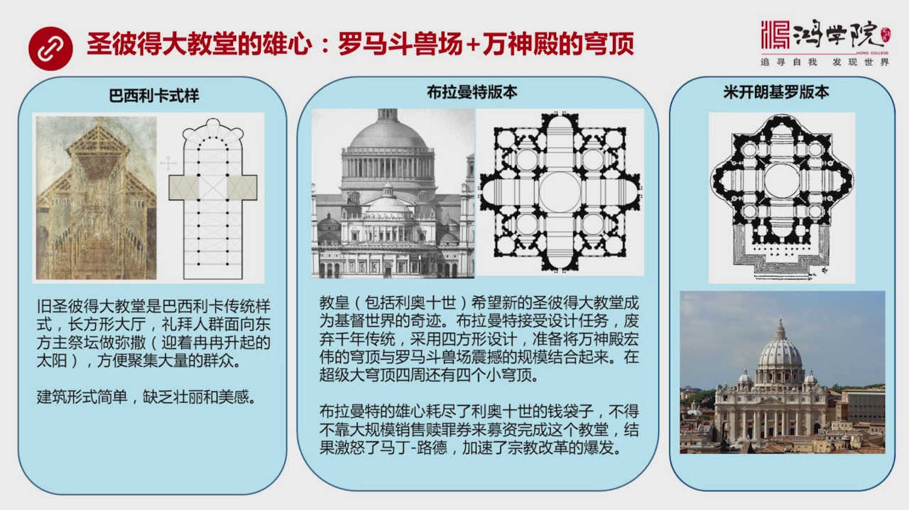

因为圣笔的大教堂以前它是巴西里卡巴西里卡样式什么叫巴西里卡的样式就是我们看到左边你会看到传统了罗马教堂就是在罗马帝国那个时代和罗马帝国崩溃之后的头几十年它是一个什么情况它是一个长条型长条型因为罗马当时...

<strong>All subtitles</strong>

> 因为圣笔的大教堂以前它是巴西里卡巴西里卡样式什么叫巴西里卡的样式就是我们看到左边你会看到传统了罗马教堂就是在罗马帝国那个时代和罗马帝国崩溃之
> 后的头几十年它是一个什么情况它是一个长条型长条型因为罗马当时新起基督教的时候大家没有聚会的长所这个聚会长所要很方便的要聚集数百上千人所以他们
> 把它修成了长条型长条型的上面加盖的这种两层的这样的一种屋益其实看起来非常简陋这谈不上什么美感然后它的教堂的门是像习的这个信仲进去是面向东边东
> 边我们看到这个右图上面巴西里卡样式的右图上面这是个计团弧形这是计团这些信仲是面向计团也就是面向出生的态进行导告那么它的建筑样式当然非常简单谈
> 不上什么熊伟壮例后来那么这个巴西里卡这个样式就是圣笔的大教堂旧的圣笔的大教堂的形状和样式据说就是圣笔的在那儿最后被处死的地方所以有几年益在那
> 儿被调上十字架死掉了那么在同样的位置上教皇先把原来的建筑旧的圣笔的大教堂给拆掉建一个全新的大教堂这个全新大教堂当然这不是一个教皇玩能够完成的
> 西方大教堂通常要建上百年几十年上百年很正常甚至几百年所谓千年大纪教会的教堂才能做到千年大纪为什么因为这个组织是跟王朝没有关系的跟皇帝没有关系
> 的只要西方社会存在他就一定会有教会所有人都坚信不疑这一点所以教会做事他是以千年作为齿度来衡量的一笔说我觉得我们去托尔齐军闪领寶现在伊斯坦波尔
> 圣笔的大教堂好家伙它是公元五百多年建的到现在一千五百年了仍然是这么壮观你进去看哇塞一千五百年前就能修上百米高的这样的一种雄龙式的建筑而且一层
> 套一层好几个雄龙都是用石头修的修得如此之高如此之灰黄和壮观你会觉得非常地非常地震撼这个叫千年大级所以教皇不是一个教皇能完成的第1个教皇就列斯
> 提出有这个想法之后第2个教皇第3个教皇接着干第2个教皇就是接受这个教皇谁就是利耀时事就是美帝家族的利耀时事瞧完你好他说这个既然你能够把小教堂
> 修得那么完美那你设计一下这个大教堂上面的大教堂该怎么搞这个关于这个教堂设计出了很多稿布萊曼特出的是第1稿他接受这个任务之后他说我们要修成整个
> 基督教世界的一个前所谓有的奇迹必须要创新的不能再搞以前那个东西了小了小气的没啥意思搞什么呢搞一个方形的四方形的而不是长条形的一个巨大无比的建
> 筑体按照他的设计方法他是他的规模相当于罗马都受场我们很多人可能去过罗马你到罗马都是场你会觉得站在那面前的那种震撼他的这个规模之雄之雄尾他的意
> 思是说我们建成了规模得有这么大在这么大的这样的建筑之上给他盖上万神殿的顶那个大穷顶哇塞万神殿的大穷顶大家很多人去过那很快是四十几米一个巨大无
> 比的一个穷顶他还把这个穷顶再放大因为罗马都是场比那大多了方形的罗马都是场那种规模上面盖上万神殿那么大规模的穷顶好 家伙这玩意这个雄心状质可以
> 说震撼动地教皇说行好我们就得把这个这个相比达大教堂搞成这样了一个基督要世界的一个奇迹但是这个他不仅是个大穷顶四面还有四个小穷顶其实外表上看起
> 来有点像盛索菲亚大教堂大家去伊斯坦波尔说可以看一下他也是中间一个大穷隆四面还有四个小穷隆这个中间这张图就是他画的左边杀了一个外观图右边是他的
> 一个内部的平面图但是布拉曼特这个雄心有点太大教会的营资不够耗尽了利亚实施的前奈子利亚实施怎么办就是美丽七家做这个乔丸你不得不大规模的发行熟罪
> 债券然后来募资完成这个教堂因为太少钱了这个熟罪宪什么概念就是你如果想避免死后有一本人要去天堂有本人要去地狱还有大部分人还要尽练狱练狱就是考验
> 你在过渡过程中你最后经过练狱的洗这个火烧把你身上自己给烧完了你有可能上天堂烧把你下地狱好那么你叫尽练狱怎么办大家不愿尽练狱行你换点钱满角熟罪
> 债券满了熟罪债券就免遭练狱之苦直接上天堂否则有可能下地狱所以这玩意儿特别好卖因为大家都信嘛这样一来这个马丁路德就不干了就开始造反就出现了新教
> 改革运动那么我们再看右边这张图布拉曼特这个版本没有实现因为规模太大然后米克兰接罗接手了大家说米克兰就罗这不是画家雕刻家吗其实当年大家都相同了
> 布拉曼特米克兰就罗还有后来你看到拉菲尔这些人即使画家又是雕刻家同时还能搞建筑骑了怪了包括大门骑这都是一专多一专多能啊所以在现在这个社会尤其在
> 美国有个非常就是这些大学在招生的时候有个非常失贸的词就是我想做一个文艺复兴人什么概念那要做达芬奇要做米克兰去罗要做拉菲尔就是你各个方面都要设
> 立都要懂还不是一点懂还要懂得表声这就跟我们传统教一种讲的这个不是我的专业我学建筑的或者我学自动化的我学经济的我当然我就不懂这些什么意大利的历
> 史或者其他的这种东西所以红旋要求或者提出了一个目标是要跨文化还要跨学科还要跨思维为什么这三跨其实我们提出的就是一个文艺复兴人的理念当然不是西
> 方的文艺复兴而是东方的文艺复兴如果我们看了米克朗基罗这个版本你会看到米克朗基罗只用了几笔它就把这个布拉曼特州版本改得非常的尽臭非常的有条理如
> 果仔细对于这两张平面图你不觉得布拉曼特这个它这个平面图特别的乱中间如果我们看这个四个角每个角上都有两个圆形就是小穷顶小穷顶旁边还有一些其他的
> 圆形的这个quire上头那为什么要这么设计呢这个显得非常的这个复杂非常的荣誉所以你看米克朗基罗改得很巧妙它只动了几笔并没有太动它的当然规模缩
> 小了并没有太动它的主要的设计这叫一个希拉十字希拉十字是什么概念就是一个正形的长短四个四条标都一样长拉丁十字它就是个长条形的横正的十字架叫短数
> 字的十字架的那个尴叫长这是个点形的希拉十字架希拉十字架你看到它除了规模缩小之外它并没有改变它的基本结构但是经过米克朗基罗的减化你会发现它整个
> 建筑更紧臭没感更好而且更容易更容易让人产生清晰之关的这样的一种印象最后米克朗基罗这个版本我们现在看到的这个圣笔的大家要谈的主要的部分就是米克
> 朗基罗乱们当之后还有拉菲尔的版本还有好多人都搞过在它之前还有拉菲尔的版本还有很多在它之后还有很多其他版本但是那都是小改米克朗基罗乱这个是定下
> 了它的基本架构如果我们今天到罗马一定要去看一下圣笔的大角堂它这个大窮顶它这个大窮顶也是米克朗基罗设计它其实某种意义上有点像一百年前不如内来司
> 机搞的那个大窮顶那个大窮顶设计的这个跟它的尺尊相比佛罗轮上那个规模更大一些它这个应该在当时的基督教世界应该排第三圣索菲尔大角堂也比它稍微大一
> 点就是它的窮顶那么它这个窮顶你会看到它这个窮顶跟这个跟不如内来司机设计的佛罗轮上的窮顶相比它这个应该说更美关一些当然我们可能是美这个东西可能
> 不同的有不同的看法但我觉得它这个建筑的难度还有它建筑的这个规模某种意义上还是要比还是要比这个胜败华大教堂要强胜败华大教堂你走里面看外面看非常
> 的训维但它里头的高度它的这个面积各方面还是没法跟这个胜比的大教堂相提并论所以大家如果有趣会去可以仔细感受一下它那种壮观和震撼注意啊这是美开朗
> 基罗当年修的这是15几几几年所以到现在已经有五百多年历史了为什么还是我经常提到这个问题为什么中国人不善于不愿意或者不会用石头建筑这种高大的能
> 够持续千年或者一两千年的这种大型建筑呢是不愿意还是不喜欢还是不会这个是我成期在思考的一个重要的问题也希望大家有时间去好好想象这个问题因为中国
> 能够保存下来1500多年的这种建筑基本上是没有很罕见除了长城当长城是它是用专修的每朝都得从英修而这种是原始建筑像盛所飞的大教堂它的石头它的那
> 个建筑结构那是1500年前的建筑结构主要的石头也是1500年前的石头后来虽然有维修有维护但是它的这种震撼力它的这种当年的这种建筑的这种这种能
> 力让人非常的震撼为什么他们能够休息这么大型的这种实财建筑这是我始终没有搞明白的始终不太理解的这是一个非常非常难做的一件事你要把一个建筑修到一
> 百多米高你的垂直误差如果石头平一点点这个垂直误差就不得了这个整个大沙会垮掉的而那个大教堂那就挺力了五百年一千五百年经历了多少地震的火灾和人为
> 的破坏甚至把口红炸它仍然非常接触的力在哪儿说明它这个建筑结构历学的测算实财的切割它的精确程度达到了让人非常精确的程度好我们再看下眼米开朗基罗它有个师傅

---

### Slide 18

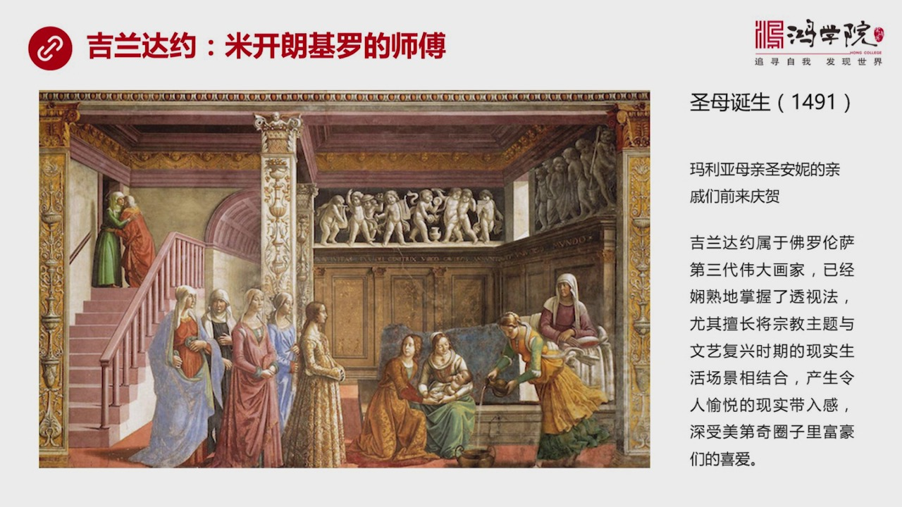

为什么我们要它分一层的师傅就是我们要看到它这种脑子所形成的艺术这些基因是从哪来的它的师傅叫什么既然达约既然达约也是当年佛罗人杀一个非常有名的名网非常高的一代宗师了这个既然达约它的比如说它这个它在佛罗人...

<strong>All subtitles</strong>

> 为什么我们要它分一层的师傅就是我们要看到它这种脑子所形成的艺术这些基因是从哪来的它的师傅叫什么既然达约既然达约也是当年佛罗人杀一个非常有名的
> 名网非常高的一代宗师了这个既然达约它的比如说它这个它在佛罗人杀应该算是第三代了第三代伟大华价如果我们说瞧脱它们是第一代各走力它们那个14级年
> 应该是第二代那么它就算是第三代了那么从这张图这是它的一个衣服很有名化胜不胆胜胜不胆胜我们看到是讲的胜不马丽它的母亲生下它它母亲叫胜安妞生下它
> 之后来了很多家里的亲起来探望我们从这张图上一看你会发现这非常不像是公元公元前多少多年因为耶稣诞生是公元一年二零年吧就是七十年公元一年那它妈淡
> 身的时候那就更早了公元前了公元前的建筑怎么会这样的建筑呢这显然是中世纪的一个贵族或者贵族的商人这样那种装饰和安排这说明一个道理从这张图上你可
> 以看到它整个的构思这就是急着拿约一个非常突出这个特点它是把宗教题材几百年前或几千年前前发生的事情放到中世纪放到文艺复兴时代的那种建筑结构还有
> 那种人的穿着打扮还有他们各种各样的熟悉的生活场景中这是非常逃巧的因为你要画一个比如说在耶路撒冷公元前多少年那可能那个建筑跟现在大家看起来它产
> 生不了感情和生活那种愚悦度的共鸣它这看这个东西觉得跟我生活没有关系而不要忘记惠化艺术宗教惠化艺术是一种讲故事的能力这种讲故事为了宣传是为了宣
> 扬这种基督教的这种理念和精神受众大都市人不识字它是通过宗教化就像我们看小儿书养不认识没关系你认识的画吧所以西方的宗教艺术是源于大都市老百姓是
> 文忙它不得不用更直观更是更形象的方式来解读宗教那种很抽象宗教故事那么这个就是讲的是我们看到这幅画讲的就是这个圣安尼它出生之后它们家亲戚来探望
> 是马莉亚出生之后它们家亲戚来探望你会看到这个图首先它是个文艺福星时代的一个建筑里面这些人的传终打扮还有这些感受感觉都是文艺福星时期的这样就会
> 使文艺福星时期一大例的弗罗伦萨这些贵族们或者有钱的这些商人们看完之后它就闯心悦目觉得这个很符合我们市场的调调这个叫抓住市场客户它能够起到这样
> 的作用能让人产生一种非常愉快的带路感其次我们会看到这个图中间非常具有力的感这是什么呀几颗透是吧说明几来大约已经非常熟练地掌握了几颗透是法当然
> 这个东西是这幅画是1491年华的我们知道这个布鲁内来司机早在几十年前半世纪以前就已经搞出了几颗透是法所以有五十年时间让各路画家去学习这已经足
> 够了到1491年时候我们已经看到了当时的画家已经非常非常熟练而且非常精准地掌握了几颗透是法看到非常立体至关形象我们看到上面还有很多伏雕一些小
> 天使这些是这些天使看起来它也是一种非常鲜明的伏雕的感觉所以它的立体感之强达到了相当高的程度这就是米克朗基罗从他师父那儿学到的一些基本技巧第一
> 是会画中间的技巧比如说这种诗闭画在这种还没有干的这种诗灰或者这种叫石膏之上还没有干透在上面做画你的染料这些各种矿物质怎么跟这些石膏水泥这些东
> 西混在一起它怎么能够形成一种非常好看非常 非常稳固的这么一种会画的状态这种画的颜色包括它干的程度是不是会影响颜色等等这套东西是套非常复杂的体
> 系需要大量的经验诗闭画它不是油画并不是画的木头上也不是画在反部上这是画的墙上而且墙还没有干所以你得考虑染料你的颜色的这种染料和石灰跟石膏之间
> 的容解还有它整个变干的过程中对颜色的影响所以这些都是专门的技巧除了这个之外还要学习几个透视吧还有一些其他会画方面的一些基本技巧这个是米克朗基
> 罗从吉兰大约哪学到的那么我们来看下野米克朗基罗的主要重新在哪里呢其实米克朗基罗

---

### Slide 19

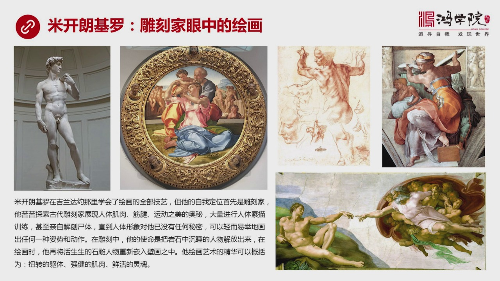

虽然在吉兰大约那学会画但是在西木中始终认为我是一个雕刻家务会画只是我的业余而我的主业应该是应该是雕刻所以它一直在苦苦探寻那些古代那些古西大古罗马那种伟大的雕刻家它们所展现出来那种力量、人体的肌肉、力量...

<strong>All subtitles</strong>

> 虽然在吉兰大约那学会画但是在西木中始终认为我是一个雕刻家务会画只是我的业余而我的主业应该是应该是雕刻所以它一直在苦苦探寻那些古代那些古西大古
> 罗马那种伟大的雕刻家它们所展现出来那种力量、人体的肌肉、力量那些筋剑还有运动过程中那一叉纳所形成了那种梅感它这个澳密到底在哪里啊为什么它们能
> 够雕出这么好看这么具有动感、这么生动这么有力量的这样的一个形象呢所以它要搞明白这个道理就要进行大量的人体的素描找摸它来画素描甚至它跟这个大分
> 析都一样亲自解破尸体咱们其实解破了大概三十多句它也不少它要寻求什么呢就要把人体中间的所有秘密全部搞清楚就没有任何秘密我是不理解的搞明白这些东
> 西之后而且经过长期的训练之后它就亲而易举的可以说可以画出任何一种人体的动作不管你是怎么拟还是怎么扭还是本跑还是进作还是一个举众的姿势它都能够
> 很快很轻松、很自然的把它的形状、把它的这种形态给展现出来这它非常了不起的地方经过长期这种训练当然还加上天赋那么我们如果看这张图你会看到米克朗
> 基罗最大的特点是什么最大的特点就是它是用雕刻加了眼光来做画的也就是我记得我们在讲罗基克说我用了一句话米克朗基罗人家说你为什么能够雕刻出大位最
> 初不要这个大位为什么能够雕出这么北大的作品它就说了一句话它说我其实是现在十头中看到了从一块一整块颜示中先看到大位形象然后我只不过雕把多余的十
> 块给糟掉而已这个大位自然就出来了这话很经典所以它在雕刻中它的使命是把颜示中沉睡的人物解放出来而它在会化的时候它再将活生生的十雕人物重新牵入壁
> 画之中所以你会看到米克朗基罗的话是非常具有雕塑感的它的会化精华可以盖过成什么呢所有的姿势都是扭曲的曲体这个身体是扭动的然后在扭动中展现强健的
> 肌肉然后还有它一个非常先糊的灵魂它的米克朗基罗的话是非常容易变人的你只要看到比如说我们看这个诸念这张图这个是生物马利亚从约测夫从老公那儿把耶
> 稣给接过来他为什么要你有过身子接你会看到在宗教画面生物马利亚和圣子这样的话很多但是你有过身来去接孩子这个动作是非常非常罕见的应该说只有米克朗
> 基罗才会这么画其他的都是一个非常安静的圣母抱着圣子它是扭过身来为什么它要展现雕刻的那种力量那种肌肉那种动感那么我们看右边这张画右边这两张一张
> 是宋苗一张是在范丁康希斯丁那个墙壁上他画了四年中间一小幅底下对付大家都都应该很熟了上面这两幅什么意思呢你会看到他首先画了宋苗是个非常也是千名
> 特点也是身体扭动人在扭动过程中所展现出来了肌肉谷歌和筋劲他的力度力量和这种力量所透出出来的这种美然后他把它画到这个壁画中你会看到什么你直观的
> 感觉就是这个画是一个雕塑它是突出来的有强烈的雕塑的感觉然后你看基本上希斯丁顶上那个他画了一画基本上看起来都像都像是从纸面上突出突出出来了有强
> 烈的这种雕塑感然后当然底下这个画是大家都非常熟的天赋然后这个耶稣应该说天赋吧然后通过接触或者叫点纸也好或者叫一个什么换形的这个亚当人类啊富予
> 这些生命等等所以我们看到上帝这个一样纸江柱未住到这个亚当的时候你会看到一种神奇的力量换形的生命给创造了人类吧这种姿势或者这个手势或者这个姿势
> 你会看看到很多电影比如说一T啊很多电影其实都是它的基本的形态都是源于这幅画其实我们看到只要稍微认真可以看到大量的类似的这种手势这都是从米克朗
> 基罗这个画中是我得到的这种启发那么我们看一下也除了米克朗基罗另外一个伟大任务

---

### Slide 20

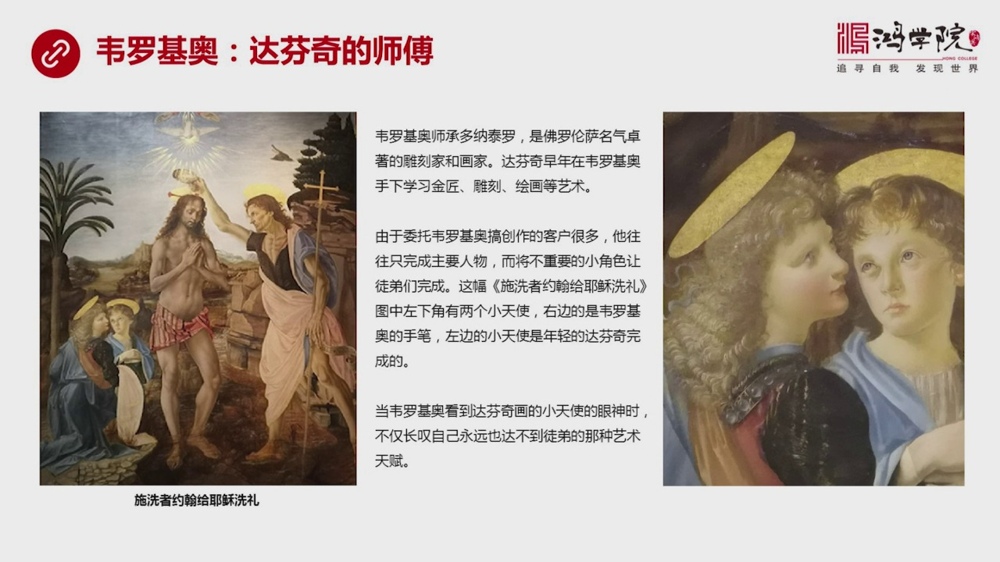

当然就是达芬奇达芬奇也有一个师傅达芬奇的师傅叫维罗基奥维罗基奥他也是个他即使画家也是个调课家还会导弹这种金属质品金匠那么维罗基奥的老师是谁呢是多纳台罗我们上一期节目中上一集佛罗基奥专门讲过多纳台罗的伟...

<strong>All subtitles</strong>

> 当然就是达芬奇达芬奇也有一个师傅达芬奇的师傅叫维罗基奥维罗基奥他也是个他即使画家也是个调课家还会导弹这种金属质品金匠那么维罗基奥的老师是谁呢
> 是多纳台罗我们上一期节目中上一集佛罗基奥专门讲过多纳台罗的伟大贡献这个维罗基奥是从他那儿学到的标课的一些精华那么这个佛罗基奥这些人这些画家当
> 年那个时代人基本上都是全面手那么达芬奇是在维罗基奥手下去学习他的一些比如说他学的金匠学的标课学的会华艺术他都学那么这个维罗基奥当时在维罗伦赞
> 也是名气非常的大甚至一些远在其他厂室想维尼斯的一些一些工绝维尼斯的执政官什么的都请维罗基奥去给他们做很多雕塑做很多雕刻和会华方面的工作他接的
> 活很多客户很多那么由于接了活多了这个维罗基奥他就不可能美伏化他都亲自一笔一笔从头画到尾所以他经常就是把主要部分画出来主要人物画出来把最重要的
> 不太把最重要的他自己来不太重要的这些一些执起的东西比如说一颗树一条狗一个小人物让他的学生就画那么这一伏画左边这伏画就是实际者约翰给耶稣习李这
> 个习李约翰是是他轻轻的表哥给他失礼你会看你会看到在这伏画中有两个小孩这个小孩左边这个和右边这个那么左边这个小孩最左边这个小孩就是为了教授先我
> 画得让了剩下交给你了你把这个小孩画出来吧好大分期接手开始画然后画出来之后等画完之后为了教一看不尽大吃进哇塞这个这个水平比我高太多了你会看到这
> 个左这个右边这个小孩小天使这个是为了教自己画的左边这个小天使这是让他的徒弟当时还是个年轻少年的大分期画了你看这两个小孩的眼神你就可以看到这一
> 伏画必须要放了比较大才能看清两个小孩的眼神右边这个小孩为了教画了他显然就没神或者说呆质眼中空洞无物而大分期画这个小天使这个眼神这个小眼神充满
> 了一种让人难以描述的这种这种美感充满了一种养望充满了一种崇拜充满了一种期盼所以他这个眼神画了让你有多种这种猜想所以为了教一看哇这个徒弟不得了
> 这个可能是他自己天赋永远达不到的这样一种感受受到了强烈冲击好我们再看下一那么在意识中其实也存在着

---

### Slide 21

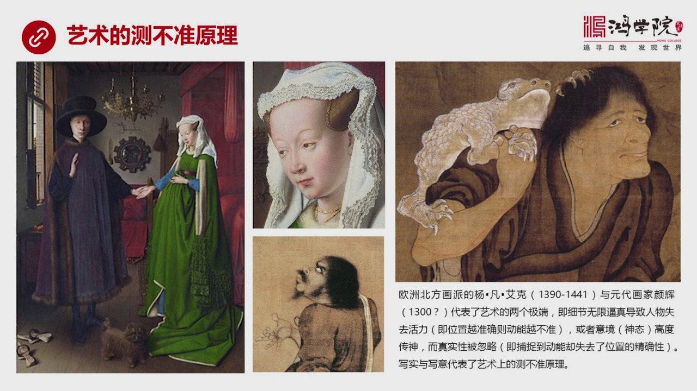

在我看来存在着策本原理其实量子力学了那基本的规律我认为是放着似孩儿接准的什么叫量子力学的策本原理呢就是如果有一个微粒子一个粒子他在你再策量他的时候如果你想精确策出他的位置如果你把他的位置给按得很死策得...

<strong>All subtitles</strong>

> 在我看来存在着策本原理其实量子力学了那基本的规律我认为是放着似孩儿接准的什么叫量子力学的策本原理呢就是如果有一个微粒子一个粒子他在你再策量他
> 的时候如果你想精确策出他的位置如果你把他的位置给按得很死策得非常准确那么你一定策本他的动能如果你把他的动能就是速度给策得非常准用他的位置你看
> 你策不准简单的说就是策本原理那么在意识中这个怎么来理解呢我以前也在想用什么直观的办法把这个概念给说清楚后来我在9月份去日本京都去拍一个旅游的
> 节目就是关于日本的酷山水挺愿的这个艺术然后有一天没事我就走到日本的京都的博物馆京都有一个非常好的但是去了人很少的一个艺术博物馆摸进去了摸进去
> 中间突然看了一幅画这幅画里面画的画的一个画的一个一个人的眼神当时让我觉得看了之后非常震撼当然后来一看介绍知道这是颜灰颜灰是宋末原出应该算是原
> 带的一个画家搞不清楚什么时候生生的时候死应该是1300年前后画的这幅画它是一对一对画左边是一幅右边是一幅左边这幅画的什么呢是道教的一个人物右
> 边画的是铁关里铁关里是一个铁关里的这种铁关里是个仙人了八仙之一这个道教这个这个人是刘海你会看到它的肩膀上趴了一个趴了一个产厨那么它这个我觉得
> 最打动我的是它的眼神当然这幅画其实真画它的大大概有两米这么高宽也有一米多而你站的离它很近就说哇塞我看它那个眼神就让我大概有几分钟我我盯它的眼
> 神就在那就觉得它这个眼神特别特别地奇异有一种说不出的一种满足还是一种像习国读那样的这种眼神比较飘但是充满了这种好像它的脑子飞到了外太空这个眼
> 睛这个眼神我觉得画的真的是非常非常精彩这个眼这个眼灰这个人可能在中国立上起到了作用还不太大但是据说对日本的惠化艺术发生了非常巨大作用它画的话
> 不多在中国流的话不太多但是在日本看到它的它的原画之后真的是大致已经我觉得这个画画的太传神了这个代表了中国艺术这个刘派它走向了一个基本方向就是
> 我认为它走到了极致非常的传神就讲就是写意而不写行行什么你看这个这个眼灰画的这个道教这个刘海这是真人吗它真人会长成这样吗你要让打分歧这帮让人你
> 看两级罗一笔一笔画鸡肉画经浸那些人一看这画的不行这哪有鸡肉感这哪有真实感一点都不真实但它确画的非常传神也就是意境和真实之间我们走的是追寻无限
> 的追寻意境我们在看左边这样图左边这样图是这个欧洲北方的富兰德的北方的日曼人画的日曼艺术家画的格特式的这个方向你会看到这个是著名的杨坏爱克啊这
> 个杨坏克画这个画你会看到它跟中国这些一画完全是两个计端它画什么画的是一笔一画高度惊喜高度逼真的完全的模仿就跟照相机一样比照相机还得是好几千万
> 这种像素的超级清新照相机这佛画本身你你你如果不在原画前看的话你如果从我们这个PPG这种可能看不清楚你如果真的是看到它的原画把这个原画放大的话
> 哇塞比如说底下那条狗那条狗身上的每一个毛就是每一根这个毛都画得非常地准都画出来了画得非常地仔细和精细你如果看这个女孩她的脸中间的她的头发她带
> 那个项料如果我们把这个头给放大的话你会看她带了那种黄色珍珠线的每一个猪子的闪光那个反光了那个那个就是光源那个视角都一点不含糊你看她这个包括她
> 对为了这个头巾每一层这个折皱都非常的惊喜这就是日慢人画画高度的逼真指追求真实但是你越追求真实你会发现这个人看起来非常矮板她的眼睛没有神她完全
> 就没有抓住她的灵魂为什么呢当画家一笔画得在给狗一根一根画毛的时候你越画了逼真你就越丧实她的灵魂想反在中国的话里面就像这个严挥画的这个道教的刘
> 海你看她画的她画得非常传神她指重是神当你特别强调神的时候你就会丢掉行这个人就不真实所以这就是我们所说的艺术中的测不准原理当你抓住没比美画画了
> 极其真实的时候你就自动会丢是她的灵魂丢是她的她的意境丢上她的传神的地方而你一定要抓传神的地方你就会丢是她的真实性丢上她的那种逼真丢上那种精密
> 的细节所以如果我们把洋饭爱课这种一笔画这种高度精密的高度真实的话当成我们册定立子的位置你可以把位置说得非常清楚那么她一定会丢掉她的精神的动能
> 丢掉她的神想反梁挥这幅画抓严挥这幅画抓住了她的神把神抓了非常的准但是你就不得不放弃她的行也就是你要抓住她的传神的地方也就是抓住她的动能测算很
> 准的知道她的速度对不起那你位置就搞不清楚了所以这就是艺术的测不准原理我们来看达芬奇最伟大的画盟那里沙在我看来就是突破了

---

### Slide 22

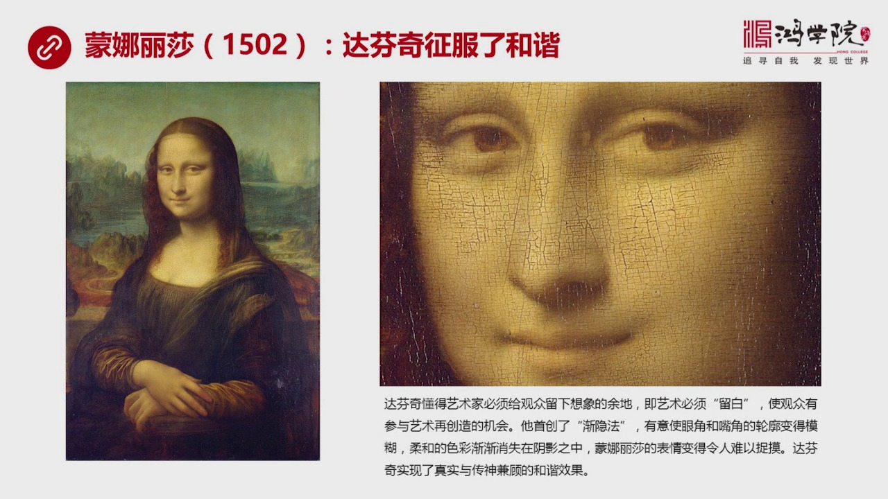

找到中间的一个和谐或者说达芬奇的盟那里沙征服了和这个征服了这种和谐的意境它既有真实同时又很传神怎么做到的大家都说咱们其实这画一二三四大家都能说一下比如说到左边它这个图可能一些右边高一些让你看起来的力气...

<strong>All subtitles</strong>

> 找到中间的一个和谐或者说达芬奇的盟那里沙征服了和这个征服了这种和谐的意境它既有真实同时又很传神怎么做到的大家都说咱们其实这画一二三四大家都能
> 说一下比如说到左边它这个图可能一些右边高一些让你看起来的力气感比如说身上这个衣服的皱尔这个折皱神上发光画很真实那个手非常的逼真能够让你清晰的
> 感觉到它那种肉都都那种感觉这都没有错但是它真正的突破重大突破解决了前所未有的一个巨大难题是解决了一个非常矛盾的地方就是真实性和传神两者不可坚
> 得也就是这种错不人员里达芬奇是找到了一个破解的办法所以我称之为它征服了和谐这样的境界达芬奇其实通过盟那里沙这个画它其实非常深刻地理解就是艺术
> 压一定在你的作品中要留下给观众想象的余地就是比如说七百十的话它强调刘白当然不光是七百十中国艺术中间都强调刘白刘白这么概念就是我不要把这个画面
> 全部填满了我得留下空当让你自己来想这个其实是带入感让观众把观众带入到你的画中让它的想象来替你完成一部分工作换句话说任何一个伟大的作品它最成功
> 的地方是让千百万人不断的从各个角度去进行再创作看到这幅画看到一本书看到一本民众它不断地把自己的情绪把自己的爱恨情愁把自己的一切心情苦惱欢乐把
> 这些情绪全部跟你这个画节在一起再度进行创造所以每个人都杀试比啊都会有不同的哈们雷特每个人都红了梦都会有不同的感受每个人看完哪里啥不同的时间不
> 同的地点不同的光线也包括你不同的年龄不同的季节你都会看到不一样的梦那里啥为什么就是你被捲进去了你的情绪被捲进去了你的情绪参与了伟大的在创造所
> 以这幅画在你的心目中它已经变成了你的产品了变成你创造出来一种精神的一种产品这是它伟大的地方它怎么实现这一点的如果杨芳爱恨那个画你绝对没有再创
> 造的鱼地你也绝对不想再创造因为那个人画的太真了没有任何的鱼地让你创造了大分期搞明白这个道理所以它手创了见影法你比如说人的表情吧人的表情最有说
> 服力或者最有表现的那只颜角和嘴角你看到大分期在它的这个蒙那里上的颜角和嘴角这个地方使用了一个非常吸引的做法见影法是它发明的这种见影法它有意识
> 这个颜角和嘴角的轮廓变得非常的模糊它这种颜色这种柔和的色彩是见见消失在阴影之中所以正属于它处理的巧妙通过见影法处理的颜角和嘴角让你觉得整个蒙
> 那里是表情你琢磨不透了你不知道它是在微笑还是在嘲笑还是在愚悦的欢乐的这种笑容还是一种什么状态这跟你的心情有关也就是你把你的心情投射到这幅画上
> 投射到它的眼睛投射到它的嘴角你会接受到反馈反馈会引发你情绪的变化所以这幅画伟大就伟大在它传神了它确实是达到了一个传神的境界但它同时又很逼真这
> 都来源于它巧妙的处理了一个见影法的问题所以我们看到有什么伟大的作品它是伟大的我认为伟大有两个概念第一它是原创再次之前没有人使用过这个办法它是
> 第一个使用第一个发明创造出来的这是它一个层次的伟大第二个层次的伟大是它能够影响多少人自从达分期画了吗那历史之后再往后了500年一直到今天基本
> 上所有的花家它都必学这一刻也就是这一幅画影响到后续的所有的人当然如果是你能画成这样的一个境界自然这个画是一幅伟大的画好除了这个大分期之外我们
> 再看大分期除了这幅画之外还它还有一幅画就是最后的晚餐但是在讲最后晚餐之前我想先讲另外一幅画通过这幅画你来理解最后的晚餐才能够想得更明白这幅画是比达分期更早的菲律波利比画的话

---

### Slide 23

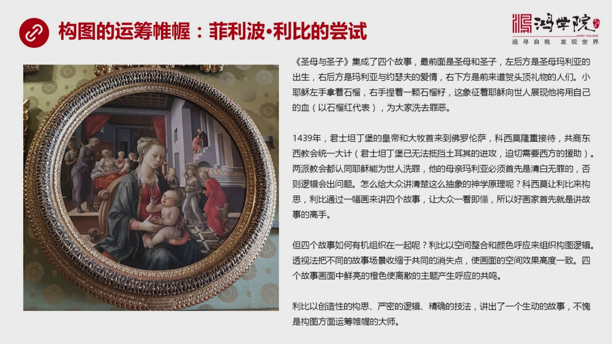

通过这幅画我想讲一个什么感受就是会画它是一个构图的运筹伪握运筹伪握这个词是有一次我到在一次旅行过程中碰到了中国一个画家这个画家它应该说在这个圈子里边还是很有影响力然后我们在探讨会画艺术的时候说到佛罗伦...

<strong>All subtitles</strong>

> 通过这幅画我想讲一个什么感受就是会画它是一个构图的运筹伪握运筹伪握这个词是有一次我到在一次旅行过程中碰到了中国一个画家这个画家它应该说在这个
> 圈子里边还是很有影响力然后我们在探讨会画艺术的时候说到佛罗伦萨说到我对很多西方艺术的这种理解然后它就给我讲它的理解然后它用了一个词我印象特别
> 深它说我们的它说它在中央委员给学生上课的时候它就说它说你们怎么才能成为一个很好的画家呢难道就是每天去临摩这些模特每天到野外去写真去送描你就能
> 够成为一个伪大了画家吗它说完全不是这么回事它是一个真正伪大的画家重要的是能够运筹伪握在会画的过程中运筹伪握这种运筹伪握包括很多个层面比如说构
> 图构图就是一种运筹伪握就是把各种要素组织在一起来达到您想突出的效果所以我把这个菲德波利比菲德波利比这幅画作为一个构图的运筹伪握的一个解读菲德
> 波利比当然它是一个修饰某种上是个花盒上它这个人比较搞笑后来这个在美丽西家里供养它很多年美丽西这个科习墨对它既很有爱因为这个人确实有天赋很有会
> 画的本礼但是也很讨厌它因为它这个人经常耽误公时它就是它心境不好它就不画或者它就懒得画非常懒得画经常跑出去到这个机院跟这个基女鬼混科习墨就非常
> 生气有一天就把它关在它的房间里面不准它出来结果这个门就从它楼上它住在楼上然后把自己床子搞成一根绳子传成一根绳子然后从楼上爬着是个床子爬到体验
> 然后又爬到机院去了后来科习墨跟它大事把大闹但是没有办法就觉得这个人确实是个天才而且脾气很酱怎么办呢科习墨最后还被想它的配立道歉最后承认艺术家
> 确实有创作的自由我虽然出钱给你但是我没有权力去干涉你创作过程中的一切的决策这个其实就是艺术家为什么越来越牛就是说它艺术家跟这个客户之间那得客
> 户求着艺术家而不是艺术家倒过来求客户跟其他的服务业势完全不同的他们认为我们是艺术家是鬼大的创造者你们出钱出钱没啥了不起有钱人都是事但我画家只
> 有一个菲律宝的一笔他画这幅画叫聖谋野胜子这幅画他非常巧妙就是因为他集成了四个故事如果我们看这幅画的前面他是让是聖谋抱着艺术他的右后方讲着什么
> 讲着聖谋马利亚的出生就是艺术他妈妈当年小时候出生的时候就是生安妮生这个聖马利亚他画的左上角的然后右上角右后方我们看到是聖谋马利亚跟约瑟夫他们
> 俩的爱情后来俩结婚了当然后来有了耶穌并不是他俩生的这是天赋这个通过神祭让处女马利亚怀孕然后再往右下方看这个边就是很多人来住贺头上顶都领过来住
> 贺这是四件事情画的一张图中这是他的巧妙之处如果我们看小约瑟如果放大你会看到他手中拿着一颗16这个16代表什么呢石油的红色代表耶穌的血然后他右
> 手小手只能还加了一颗石油子这代表着耶穌他能够通过他的血给大家输罪他这个石油子还表明耶穌的教会就是整个基督教会就像这个种子样可以彭博的生长和发
> 展他讲的大概是这个意思那么为什么这幅画面要画圣谋马利亚的妈妈这个生他的时候呢这就要讲到他的历史未经了在1439年时候我们知道1453年军事产
> 领寶被攻陷那么在1439年就是他的这件事情被莫斯林阿斯曼帝国攻陷之前十几年军事产领寶的皇帝和大陌手就是他们的教皇来到了佛罗伦萨这个时候是科西
> 莫龙众接待双方共同探讨东西教会合併的问题因为军事产领寶当时已经打不住阿斯曼托尔去了随时有可能就实现了所以迫切得需要西方的援助当然这件事情后来
> 龙马教皇也好什么应法这些国家也好大家都不感兴趣就觉得军事产领导那帮希拉人跟我们这个日晚人这个文化圈就完全是两个世界咱们就不爱搭理他虽然大家现
> 在承认希拉是西方文明的火俱与种子诸如此类的但当年日晚人看起来希拉人是完全是外星人这是跟我们日晚的这个文化这个差距太大咱们不理解你们那些抽象的
> 思维的逻辑的那些东西所以双方的就是希拉圣子文王跟他们没有关系是希拉人在主掌军事产领导那么双方教会都认为耶稣这个定义这个设计到宗教学的一些理论
> 争议了两双都认为耶稣他的学是能够给试人替试人洗罪的这没问题那么如果要他要有这种神性那么他的母亲马尼亚必须首先是清白无罪的就是他不应该生来就是
> 一个罪人因为我们除了这个这个耶稣之外生下人都有罪生下就有罪那么如果生马尼亚生耶稣的母亲他是我是有罪的生下了耶稣这晚上这个逻辑上就会出问题生出
> 来耶稣有罪没罪有罪他是人还是神好这就牵涉到宗教中间的很多辩论所以双方在讨论这个问题的时候东西教会在讨论问题的时候就产生了这样的一个辩论就说我
> 们承认耶稣他是可以给世人洗罪的那么他母亲马尼亚就必须得是个纯结无罪的人清白的人所以当科西莫理解这一点之后他就找他的话家菲德波利比说好你把这个
> 概念给我画出来所以这就是我们看到左下左上角圣文马尼亚出生的时候他妈妈圣安尼怀孕然后生他的时候表明什么他生出来他就是纯结的就是无罪的就是生马尼
> 亚就是无罪的所以生下了耶稣就无罪耶稣无罪了所以他就能给世人全世界人都洗罪这就是我们可以看到一个好的话家必须要是一个好的讲故事的高手其实我们现
> 在你会看到的话这是一个故事那么四个故事怎么组织一起呢组织一起这是个天大的难题你想想看这个给你出这么一个这样一个概念让你来画你脑子没一片空白你
> 怎么才能够把它把这四件事画在一个画里我们来看菲律波利比是他是怎么做的利比呢他是以空间整合和颜色呼应来完成这个组织架构这是他的构图逻辑什么叫空
> 间整合呢你看整个这幅画看着就像在一个空间里面发生事因为它是用严格的透视法把四个场景整合在一个透视法中间的消失中心所以所有的消失点都在一个共指
> 向共同的点无论它发生在哪个时代发生在任何其他的空间在这幅画里面它在空间上是完全在一起的这就是通过透视法来解决空间整合的问题另外一点就是它通过
> 颜色我们看它这四个画面中间每个画面都非常非常有意地用了一种非常鲜亮的橙色比如说上面的这个左上角的窗簾这个挂脸然后它床上的这个布升玛丽亚身上穿
> 的红这个橙色的这个裙子还有在右上角的升玛丽亚去找约瑟夫它在楼梯上穿的也是橙色的裙子还有底下这个送离物的人你会看到它是通过颜色不同故事里面的有
> 意用的橙色产生了一种呼应让大家觉得这是一个共同的整体所以它在空间上通过透视法形成了一个空间的整合同时又在颜色上采取了这个橙色的互相呼应了这样
> 一种手段是整个主题形成了共鸣所以菲利波利比这个人他是以创造性的思维然后非常严谨的逻辑精确的计法讲出了一个宗教的生动的故事所以他不愧是构图方面
> 的运出为为了大师好我们再看一下明白了菲利波利比我们就能够理解达分歧

---

### Slide 24

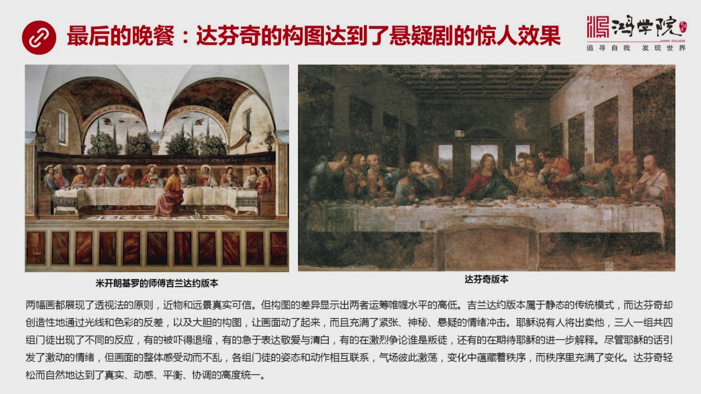

所做的最后的晚餐达到了一种什么样的效果你比如说我们看左边因为立场画最后的晚餐的画家有很多包括梅克朗基罗的师傅这个吉南大约他也画过你看左边吉南大约画的就是规格征种每个他的门徒都做哪老老实实的然后叶苏做了...

<strong>All subtitles</strong>

> 所做的最后的晚餐达到了一种什么样的效果你比如说我们看左边因为立场画最后的晚餐的画家有很多包括梅克朗基罗的师傅这个吉南大约他也画过你看左边吉南
> 大约画的就是规格征种每个他的门徒都做哪老老实实的然后叶苏做了他们前头跟他讲有人出卖我了然后我要被抓走你们中间谁是判徒或者大家都在猜谁是判徒我
> 们看到这一幅画他显然吉南大约掌握了偷尸法他有两个窗户窗户外面的圆景和他的进景之间非常明显这是一个非常准确的几颗偷尸法的画法说明他掌握了偷尸法
> 同时也掌握了一些布局的基本的这个就是光线布局构图规格征种的他唯一论问题是什么这东西看太死板太挨板说他都做那没有任何的生机就感觉到你会看到中世
> 纪以前的这些画家画家的东西就是感觉是不活路死板将硬如果我们看达芬奇他是怎么解这个问题的他也是偷尸法你看这个耶稣背后有三个窗户窗户外面可以看到
> 远出的山远出山里面还有各种各样的建築树之类的全部符合偷尸法也就是你一眼看我就觉得背后远山他是核户情理的就是他是真实的在那在那里这就是偷尸法要
> 解决的问题所以咱们记在这上来就告诉你我可以掌握偷尸法我这个东西是个立贴的东西然后是一个有元金有尽尼东西它的尽尽元尽和它的背景背后的那个远山它
> 为什么画三个窗户目的就是为了展示偷尸法那么除了这个之外它还大的大胆使用了光线你看吉丹达约这个它这个画面它才是非常明亮了就是白天了达芬奇这个是
> 最后的晚餐你会看到它又有一种昏黄的灯光昏黄的这种光线所以它会产生一种神秘感产生一种紧张旋移这种感觉它整个看这一画你会觉得是在看一个旋移剧因为
> 耶稣在在跟大家说你看有人出卖我了然后你会看到它说完这句话之后立刻这个场景就出现了动感有些人就吓了往后退这个然后再看最右边这人咱们是三个人讨论
> 这是谁看的这是三个人最右边这三个人他们就讨论激烈争论可能是怎么回事为什么耶稣要说这种话然后这个最左边这些人这三个人就有点木灯口来就等着耶稣进
> 一步解释一下到底怎么回事还有耶稣这个还有这个左边的第二组人就是三个人然后你就看到圣体的从从后面一下冲过来批击比较急然后再跟前面的人说调调话然
> 后不小心就把这个黑头把这个人寄到前头来了黑头啊这人谁他就是有大他用这种非常巧妙的方式为什么你看有大他姿势跟所有人都不一样他的表情他的姿态他不
> 自然他看到你看其他所有人都是每个人的这个表情和行为都是可以解释的都是自然的就是他他虽然放的三个人中间的最前面但是你会觉得这个人相对相当于说他
> 是孤独的其他人的气场他们的言语都互相互相在呼应和碰撞就他一个人跟所有人都没有关系虽然他的一个其他人很近很近对他巧妙的地方所以他通过三人一组三
> 人一组这个方式一下耶稣说完这句话之后立刻产生了气场了几大立刻产生了大家行为之间的相互连观整个看起来他就动起来了所以他是在变化中运藏着一种秩序
> 三个人一组三个人一组而在这种秩序中间又不是僵死的秩序又是一种充满了变化他这种神态行为这种气场是是惯通的是流动的是在发生激烈的碰撞的所以他达到
> 了一种玄一巨的精神效果就是到底这事谁干的谁是凶手这样的话我们现在看起来可能觉得好像话都应该这么话但是如果你到退到500年前没有人在此之前画过
> 类似的话这就是原创性这种原创性又影响的后来多少人呢几乎所有的话家都会受他影响每个人在构思的时候再讲究这个构图的时候都会做我们这个问题所以达分
> 歧为什么他说他是含了而且他解决了两个主要的问题一个是这种传神和写真之间通过盟那里上你会看到他解决了这个写实和写意之间的天然的矛盾他找到了突破
> 办法第二他是达到了构图方面写实比如说接着大约左边这样他就是写实但写得非常矮板右边他让他动起了产生个舞台的效果产生个剧情效果这就是他了不起的地方好我们再看下一第三个了不起的人是谁

---

### Slide 25

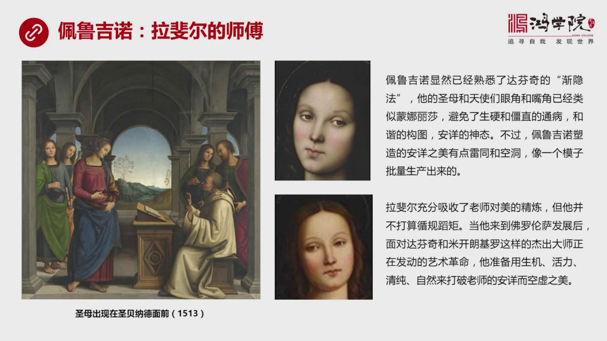

第三个伟大大师是拉菲尔拉菲尔也有师傅他的师傅叫这个培育级诺培育级诺我们如果看培育级诺左边对付话胜舞出现在胜舞贝嫩胜舞贝嫩的额面前你会看到他的整个布局也好各图也好还有任务的表情也好都很美比如说我们抓出一...

<strong>All subtitles</strong>

> 第三个伟大大师是拉菲尔拉菲尔也有师傅他的师傅叫这个培育级诺培育级诺我们如果看培育级诺左边对付话胜舞出现在胜舞贝嫩胜舞贝嫩的额面前你会看到他的
> 整个布局也好各图也好还有任务的表情也好都很美比如说我们抓出一些图来包括这两张图是源于他不同的图一样的如果我们把这些图放在一起看胜舞马莉亚的表
> 情和他背后俩天使的表情还要从其他话中看到这些表情你会看到大家都是一个模子到出来的如果你仔看这个配奏级诺显然明白建议法的原理所以比如说我们看右
> 边这个图这个美女这个图你会看到它的眼角它的嘴角都开始使用打不起的建议法包括下面这张图也是一样所以它的这个画避免了以前的很多这种圣舞天使这种表
> 情的姜这个姜化神态比较姜化它避免这个毛病不生意不僵智而且构图也比较和谐然后这些人看着是一种安响的美不过如果我们自己看着两个人的表情和这个画种
> 人的表情你会觉得安响是安响了就是眼神有点空而且这个美法都差不多像一个模子里批量生产出来的某种以上介绍我们现在大街上看到那些整国龙的小女孩们基
> 本上全部是椅子脸这个其实就是佩洛基诺那个时代搞出来的当然这个他搞出来这个应该叫一个概念叫标准化的亮产的这种美的模式安响美这是他佩洛基诺最大的
> 这种市场中的竞争力因为他画人都差不多而且都是一个模子了所以他给批量生产让每个人都照这个模子画拉菲尔是在他手下学拉菲尔从他师父这儿继承了什么学
> 到了吸收了他画这种美女安响两个字他是把他提电出来了但是他绝不打算照他老师这种做他觉得这个画者简直这没有火力也没有生命没有灵魂所以他后来到了洛
> 人大之后正好是大分歧还有米克朗俱乐比较大型米克朗俱乐比较大发碎大分歧可能比较大三十多岁虽然大家就是都在弗洛伦萨而且对于拉菲尔说影响最大就是你
> 跟前辈这些解出的委人在一起出大事在一起那你这个心里上还是有压力的但是由于这些伟大的接触人物因为还有一大批人这些人开闯了一种新的风气这种风气就
> 是不断在意义上追求一种新追求一种伟大的创造所以这种东西影响了拉菲尔那么拉菲尔就决定他要用一种带有生机的充满活力的然后高度轻纯的然后一种纯粹的
> 自然来打破老师这种空洞的安响就是一种空虚的安响我们看拉菲尔夏夜看他的成就你会看到拉菲尔

---

### Slide 26

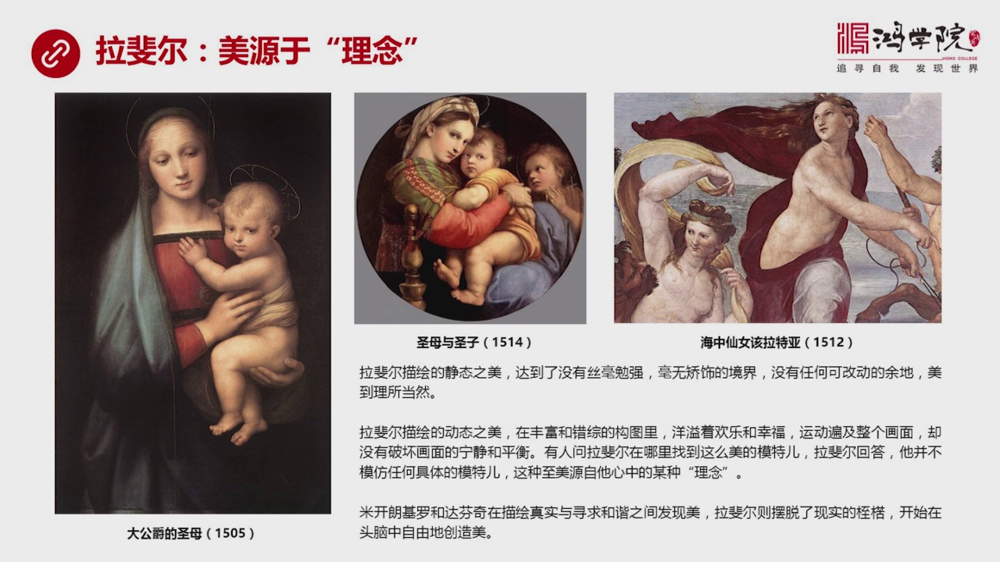

他画的这个圣马利亚跟这个小天使可以说拉菲尔是全界画圣猫马利亚画的他开闯了一个经典在这之后没有人能超越他他这个没法就没到的极致你比如说最早不要这个圣马利亚他的这种眼神这是一种静态的圣舞之美达到了一种什么...

<strong>All subtitles</strong>

> 他画的这个圣马利亚跟这个小天使可以说拉菲尔是全界画圣猫马利亚画的他开闯了一个经典在这之后没有人能超越他他这个没法就没到的极致你比如说最早不要
> 这个圣马利亚他的这种眼神这是一种静态的圣舞之美达到了一种什么在我看下达到了没有丝毫的勉强没有丝毫的交入造作的境界你没有任何可以改动的预定你随
> 便动哪儿都会破坏他这个和谐所以我称之为是美到了理所当然中间你看这个圣马利亚抱着小耶穌这个圣马利亚充满了生机和活力这种形象是极臺拿月画不出来的
> 他画不出这种神态这种活力临的活生生的感受包括他的姿势他的眼神最右边你会看到拉菲尔这个是讲了海中就是讲了海中鲜女这个该拉特亚该拉特亚这个是神化
> 神化故事他这时候画的唯一的服务讲神化了其他都是讲宗教的那么他在这幅画面你看他描写这种动态之美这幅画我取的是一个局部当然在这个局部中你看你如果
> 看整画你会发现他的整个构图非常的复杂挫踪复杂但是他不乱整个画面充满了一种幸福和欢乐运动他整个画面就充满了一种动感但是整体却给你一种安香寧静和
> 平衡就是看起来很动整个画都在运动但是画本身却同时给你一种寧静的和平衡的感觉所以包括他这个人物海鲜他这个海中先生你看他这种欢与这种这种快乐这种
> 表情你会你会觉得这个东西他是怎么想他是怎么画出来的所以就有人问拉特斯说你是从哪找到这么美的摩托画出这么美的东西来拉特斯回答说他说我从来不模仿
> 任何具体的摩托他说这种致美他源自心中的毛中理念注意啊我觉得拉特斯说这个话已经达到了一种相当高的境界为什么米开朗计罗和大分歧搞解迫去分析肌肉为
> 什么因为他们要忠实的描述自然要把它写的非常画的非常的逼真大分歧但是找到了一种妥协或者和谐的办法来处理真和美之间的矛盾就是策本人原理怎么写实怎
> 么传神这两东西怎么交代一切他还是被真所束缚者但是拉特斯呢他已经完全摆脱了现实的智库就是什么真不真的我画的东西是我脑子面自由的创造我这种美不是
> 说哪个摩托站到我面前把他描迫出来而是是我脑子面这是说我理念里面做构造出来是所想象出来了所以对拉特斯来说它是理念的创造是一种每个理念的创造高度
> 理想化的东西它已经不写实了超越了写实是个阶段所以从革命性的角度来说拉特斯这个东西它的境界恐怕会更高那么拉特斯是怎么做到这一点的呢我们看下一其实在我看来就是举重弱钦

---

### Slide 27

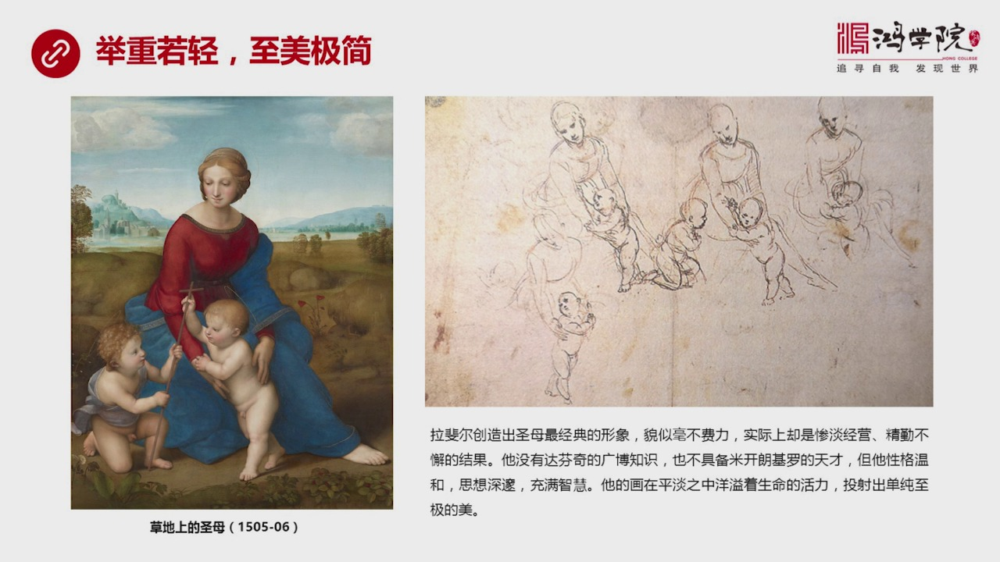

是美集结这话怎么理解比如说这幅左边这幅画草地上的圣母拉菲尔画这幅画这个也是一说故事一开始讲的讲到类伏你诈一看觉得好像很轻松很自然就拉菲尔随比一画就能画的我们自然知道它非常的美看起来这个美的好不非立它是...

<strong>All subtitles</strong>

> 是美集结这话怎么理解比如说这幅左边这幅画草地上的圣母拉菲尔画这幅画这个也是一说故事一开始讲的讲到类伏你诈一看觉得好像很轻松很自然就拉菲尔随比
> 一画就能画的我们自然知道它非常的美看起来这个美的好不非立它是一画就画出来了但实际上不是这么回事拉菲尔是经过惨淡经营秦这个非常精情不懈的努力才
> 做到了比如说右边这张图是它画了大量的这种草图中间的一部分你会看到拉菲尔一开始并不是考虑圣母做的这个角度头这样测着外它尝试了各种不同的组合方法
> 圣母的头朝另外一个方向外小孩是另外个字是另外个小孩另外个字是好它画了很多幅这种送描也就是惨淡经营不是说我们一拍脑门中国人一说伟大的什么叫艺术
> 家艺术家就是喝了酒之后一阵狂话那就是伟大的艺术当然不是像拉菲这种能够画的美的最高境界因为在往后是很少有人能够达到还表示超越拉菲尔这个对美的这
> 种描绘没有人能够做到了它这种极致的美可不是拍脑门想出来的是精心构造是用眼密的眼密的试验一个一个试出来的所以为什么西方的强调了这种美是一种高度
> 控制下的美它的音乐强调是有控制的音乐一个人越有激情它就越需要控制它控制得越好它才能够把内心中那种激情展现得越回谎惨了所以这跟我们脑子们想到这
> 个艺术家都是乱的脑子是乱的它是乱的它如果不能聚焦它就不可能成为伟大的艺术家所以我们看到了那些自由自在的自由闪漫的或者在创作中自由闪漫的这些人
> 是不可能成为很好的世界了不起了艺术家的你看了这么多艺术这些历史之后你会发现共同的规律是什么就是一个人他内心燃烧的激情然后又要通过眼密的理性的
> 高度可控然后喷发出来的东西那才是了不起的东西那么拉粉这个人如果你跟达芬奇比我觉得他没有达芬奇这么广播的知识他也没有迷开朗基罗的那种天赋但是拉
> 粉有什么呢无比的兴奋他的性格非常地温和他的思想很深碎而且他的脑子们还是充满了艺术的智慧所以他的话能够在平淡中间给你一种强烈的生命的活力投着出
> 一种简单至极的美这就是拉粉所以你会看到在文艺复兴运动之后全世界的艺术家真的很崩潰因为很很难再达到这三位这种境界和高度了突破不了你怎么能画的比
> 拉粉更美呢这真的是做不到所以才会有各种各种各样不同的艺术新型的艺术运动试图从这三个伟大巨匠所画的这个地界中间争托出来逃脱出去我们再看最后下一页文艺复兴的颠峰

---

### Slide 28

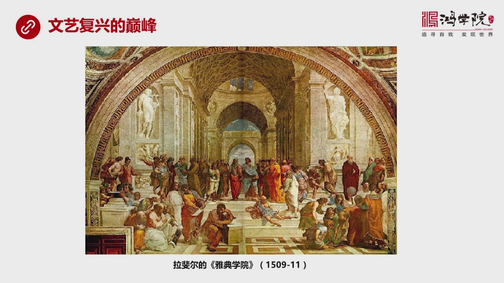

就说16世纪15几年经济上佛罗伦萨不行但是他的文艺复兴达到了颠峰这幅画拉粉的雅典学院就是中间最著名的一个代表我为什么把它放到这放到这些课的最后就是我希望红续院也能够像拉粉这幅画所展现的这种雅典学院这种...

<strong>All subtitles</strong>

> 就说16世纪15几年经济上佛罗伦萨不行但是他的文艺复兴达到了颠峰这幅画拉粉的雅典学院就是中间最著名的一个代表我为什么把它放到这放到这些课的最
> 后就是我希望红续院也能够像拉粉这幅画所展现的这种雅典学院这种气势因为我觉得中国需要有一次文艺复兴东方也需要有一次文艺复兴因为经济发展已经集累
> 了这么长时间了应该有人超脱于现实的那种很索税的这种事情干扰能够想一些更纯粹更高一些的形容上的东西中国人一般不太愿意走这些走这些问题因为觉得这
> 些东西没有用我们是以用有没有用作为判断要不要做事的标准我们从来不是说从来不是说学知识是为了追求真理追求光追求一种形容上的东西咱没这个文化传统
> 或者说大部分是没有这种传统的希望红旋案能够就像这幅画表点学院所展现的那样这一帮人是在真正追求一种追求一种智慧它不是在追求一种具体的有用的东西
> 它不是在追求工具不是在追求一种气名它是在追求一种道而且以追求这种道作为一种终身使命和驱动自己奋斗的力量的圆权所以我希望红旋案的同学们中间能够找到这样的人形成新的压电学院好今天我们来总结一下内容表多

---

### Slide 29

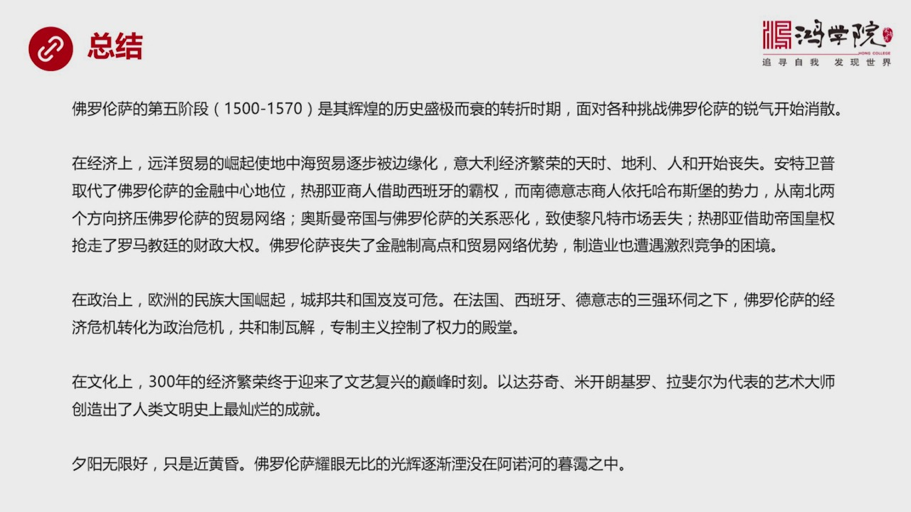

佛洛人萨的第五阶段也就是从150年到15070年这70年时间是它恢黄历史剩下摔的转折时期面对各种各样的挑战佛洛伦萨进取的锐气已经不行了开始消散了首先填在经济上远洋贸易的崛起使地中海贸易逐步会边缘化意大...

<strong>All subtitles</strong>

> 佛洛人萨的第五阶段也就是从150年到15070年这70年时间是它恢黄历史剩下摔的转折时期面对各种各样的挑战佛洛伦萨进取的锐气已经不行了开始消
> 散了首先填在经济上远洋贸易的崛起使地中海贸易逐步会边缘化意大利经济这种繁荣的天使地的人河开始喪失了安特维普取代佛洛伦萨的金融中心地位热闹亚人
> 借助西班牙的霸权而难得一致人一拖哈布斯堡王朝的势力从南北两方向挤压佛洛伦萨的贸易网络浩斯曼帝国与佛洛伦萨之间的关系恶化使得佛洛伦萨最终喪失了
> 整个立番特的市场热闹亚借助陈圣罗马帝国的皇权最后强走了罗马教庭的很大一部分财政大权结果就导致了佛洛伦萨逐步喪失了金融的制高点同时还有贸易网络
> 的优势而制造业也遭遇了越来越激烈的竞争那么在政治上欧洲各大民族国家崛起所以承帮共和国的伪大时代结束了法国西班牙得一致三强围绕着意大利其实三虎
> 争持在这种情况之下佛洛伦萨的经济危机最终会转化成政治危机共和制瓦解了专制主义大功约控制了权力的电堂在文化上应该说佛洛伦萨三百年的经济繁荣终于
> 集电出了唯一复兴最壮丽最恢復的时刻以大分期以米开朗基罗和拉菲尔维代表的艺术大师创造出了人类文明之伤最惨烂的这种成就不过西洋物线好只是近黄昏佛洛伦萨要演无比的光灰逐渐也末在阿诺河的梦外之中

---

### Slide 30

今天我们的课程就讲到这里谢谢各位

<strong>All subtitles</strong>

> 今天我们的课程就讲到这里谢谢各位

---
