# 核心课视频-035讲. 亚里士多德逻辑学之三：三段论的有效格式（视频） — Clean Slide Notes

> **来源**：鸿学院核心课程  
> **幻灯片**：14 张

---

### Slide 1

亚里是多德罗基学的第三部分今天我们将开始探讨三段论了因为三段论是整个罗基学的核心也是我们前两个课铺垫而现在要推出的重点内容我们今天探讨的是三段论中间的一个部分就是它的有效格式我们在红旋的作业中可以看到同学们试图在使用三段论但是使用了方法特别是格式还非常不标准主要的原因就在于我们从小到大从小学到大学我...

---

### Slide 2

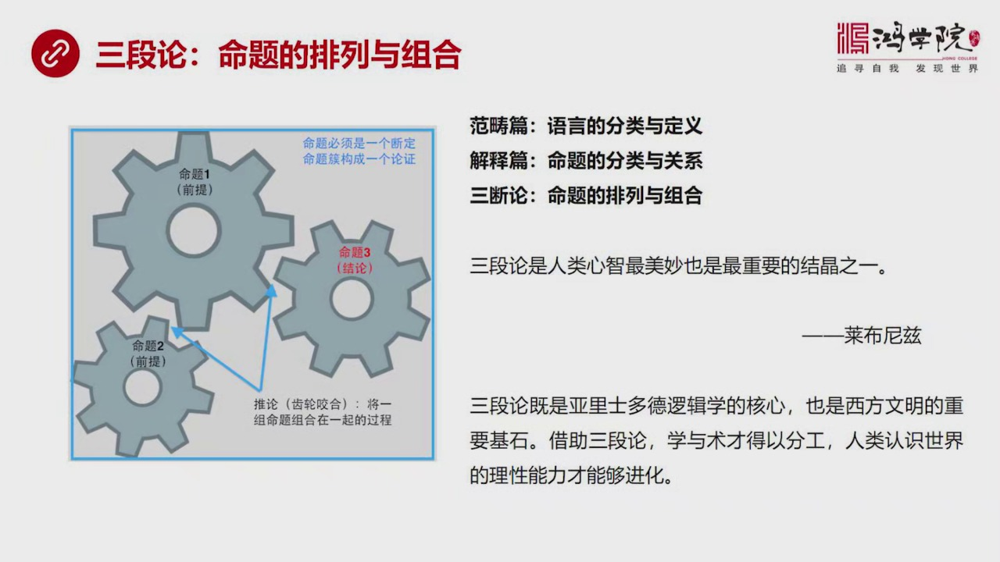

在这个尺轮中实际上设计到三个命题其中两个是前提一个是结论也就是三段论的核心是一个命题组的排列和组合三个命题怎么排列怎么组合才能形成一个有效的表达方式所以我们回顾一下在第一堂课面我们讲到范愁篇范愁篇讲的是语言的分类与定义它的主要目的就是通过对语言的这种分类和定义来可以正确地表达一个命题因为不是所有语言...

---

### Slide 3

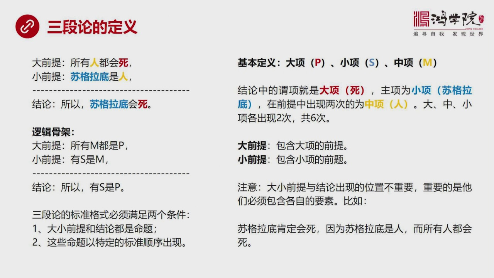

也有很多人写出冒肆想三段论的这样一种格式但其实它不是三段论为什么因为三段论必须要有标准的标准的体系表达方式是严格标准化的你比如说最著名的三段论就是大肩体是什么呢所有人都会死小肩体呢苏格拉底是人结论所以苏格拉底也会死这个推理大家一听符合逻辑听起来并没有什么觉得不能理解的所有人都会死吗苏格拉底是人所以他...

---

### Slide 4

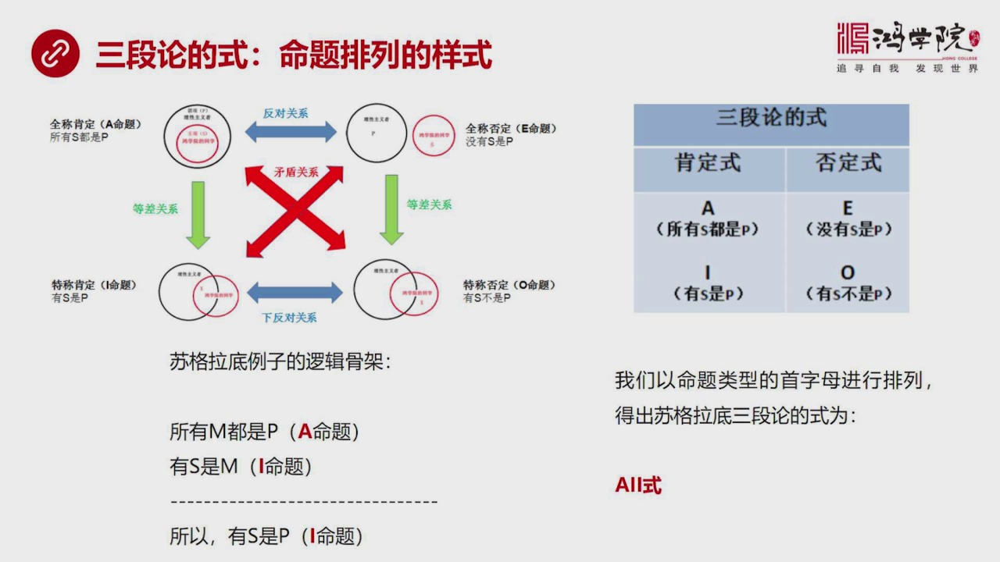

首先要提到一个新的概念就是它的试什么叫格式的试三段论的试是什么概念在我看来三段论的试它就是命题排列的一个样式就是四大命题AIO怎么个排法那么我们在上级课中用到了这样图就是比如说A命题全程肯定所有S都是P我在这里说所有S都是P指着就是它表达方式中所有什么什么都是什么无非无论它叫S还是叫M还是叫什么什么...

---

### Slide 5

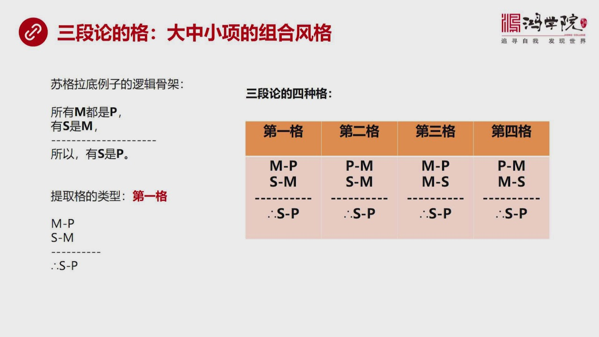

现在再讲格我们所说的格式格式在三段论中间我们把它的命题分类方法叫做式把它的中间的大小大中小像它的排列组合的具体的方式称之为格就是大中小像的组合的这种风格那么我们还是看这个速克拉底这个逻辑股价所有M都是P有S是M所以有S是P好我们如果把它抓起出来也就是我们把这些汉字全部提掉那第一行大前提就是M刚P作为...

---

### Slide 6

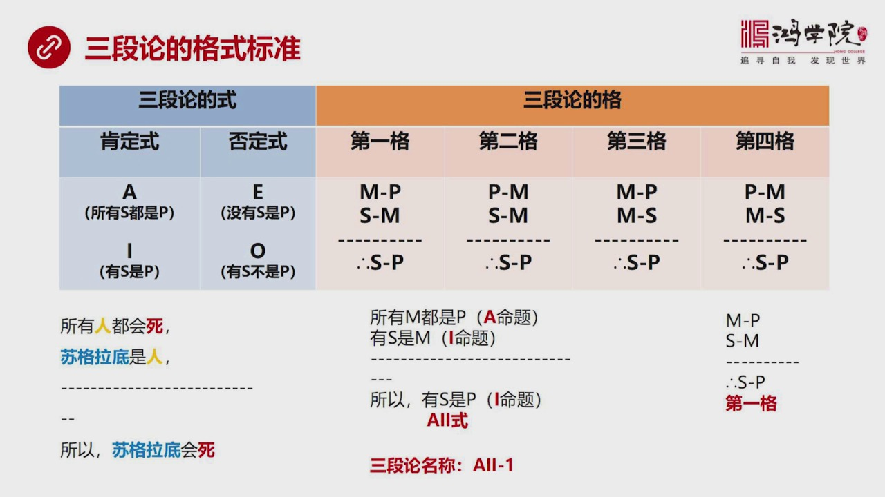

我把三段论的试和三段的格做到一张表上大家就可以一模了然了我们再重复一下刚才这个简单的例子所有人都会死速克拉里是人所以速克拉里也会死这是它的一个表达方式然后我们从中把它的逻辑股价提练出来就会看到这是个AI试然后我们再把它的大中小像进行这个排列组合的分析我们会发现它是M刚PS刚M这样的形式我们知道这是第...

---

### Slide 7

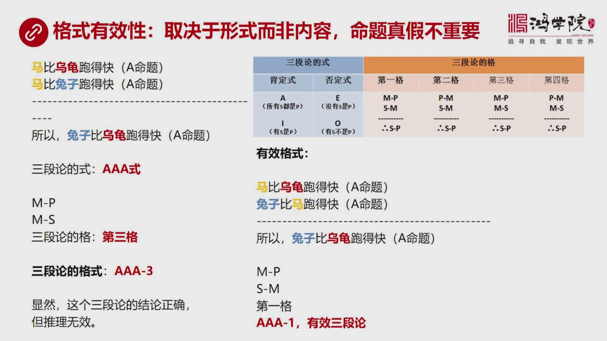

什么时候说它是有效什么时候说它是无效的三段论呢这是取决于形式的内容就是格式的内容取决于形式而非内容就是取决于它这个是AI-1还是AI-2而不是它的内容就是我说速克拉底怎么怎么样可以我说探酸盐和什么什么化学物也可以我说蛋白质和梅也是一个道理我说美国和中东石油还是一个道理我说任何的事情都没有关系就跟它的...

---

### Slide 8

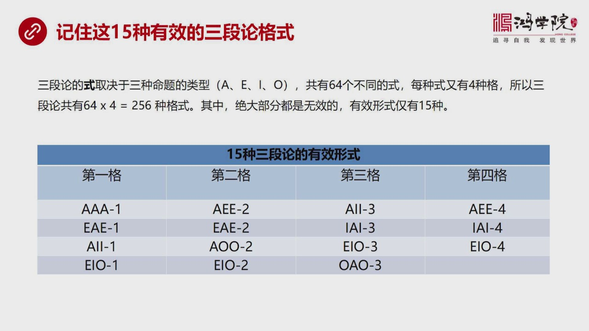

有且只有15种是有效的格式其他通通无效三段论的式就是靠AIO这四个命题的类型来进行组合一共可以组合从64个不同的式而每一种式又有四种不同的格就是我们该所说的那些格的表达方式所以三段论一共会有多少种格式会有256种那么我们看到的我们同学们经常做一种写的三段论有些是不标准的因为缺下甚至没有中下或者少一个...

---

### Slide 9

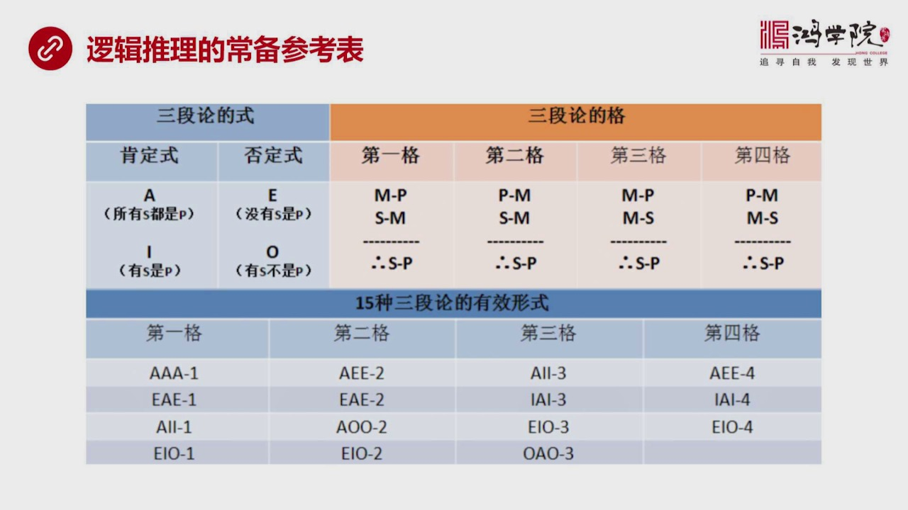

就是一个逻辑推理的长辈参考表就像我们以前没有集算70的时候什么被很多长数或者有个什么长数表这个起到了这么一样的就跟字点一样三段论的是AIO左边是肯定右边是否定三段论的格1234四种底下的最底下的结论都一样就是不用计就是M和SP之间的关系第二个第三个你会看到M都在右侧第三个M都在左侧所以你看这一下就记...

---

### Slide 10

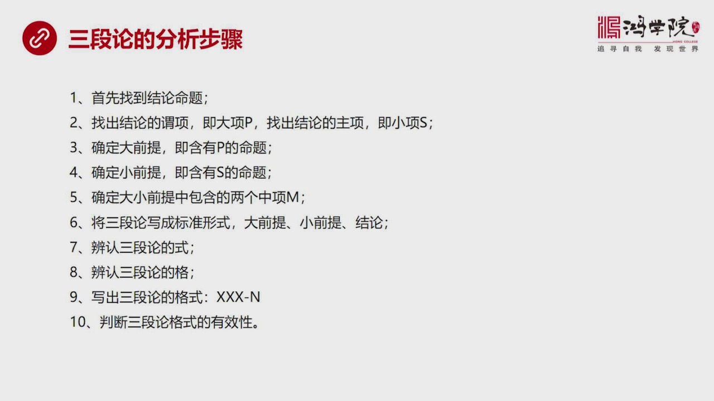

走拿到一段话拿到一篇文章比如像我看红约同学们的作业一样一般我就找它结构中有没有表述或者在摘药中有没有表述或者在证文中间有没有体现出明显的这种格式如果有我就会很敏感首先你看它一个表达方式比较像三段论好这个时候你要做了第一步事情首先找结论它的结论是什么结论有的时候很明显有的时候却非常不明显需要分析所以找...

---

### Slide 11

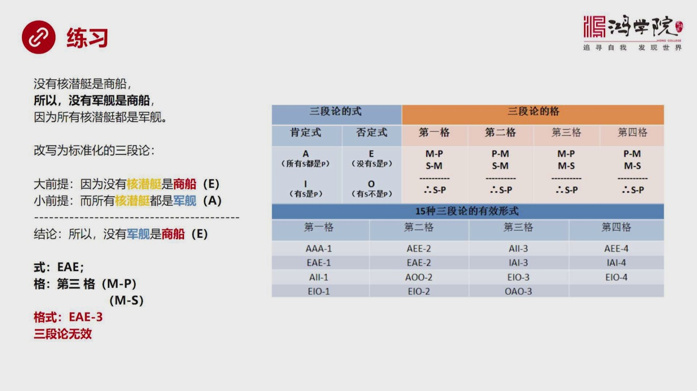

三段论要熟悉一下非得大量练体不可这是一个梯海梯海的问题没有办法因为你不练光是理论的性能东西没有用比如说这个命题比如说我们看这个练习体没有核心艇是商船所以没有军舰是商船因为所有核心艇都是军舰主要当这个逻辑顺序给你打乱之后或者它的表达顺序不扇着大前提小前提和结论来表达之后你一般听到这句话之后你是反应不过...

---

### Slide 12

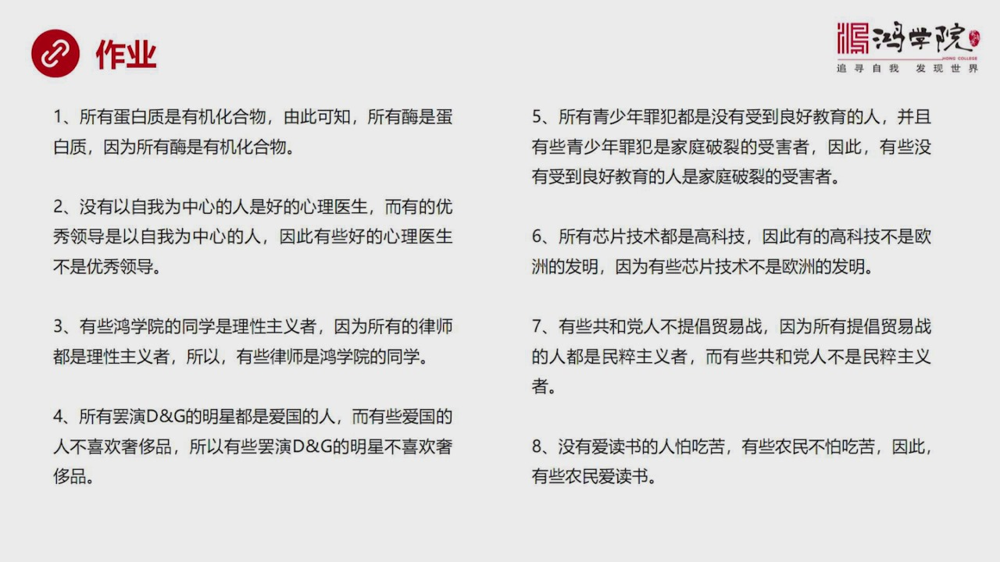

三段论表达形式我在这里给大家留了八道我自己编的一些题但这些题也都是根据它的股价别的我们可以看一下比如说第四题我给大家念一遍看看大家听完或看完之后有没有感觉你是不是能听出这句话说了对还是错你比如说所有霸演DNG的明星都是爱国的人就是我们现在知道发生了事情而有些爱国的人不喜欢设置品所以有些霸演DNG的明...

---

### Slide 13

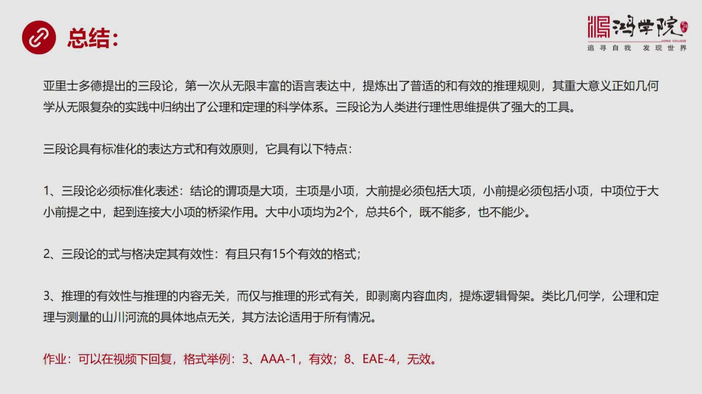

它是第一次从无线丰富的语言找到中提炼出了普世性的和有效的推理规则这什么意义啊这正向几何学中从无线复杂的这种生活工作实验中提炼出提炼出了公理和定理体系是一个道理就是大埃及人曾经上万次测量泥罗河的时候他们并没有提炼出几何学这套原理并没有提炼出这套知识体系来所以他们再做一万年仍然提炼不出来就像远和人之间这...

---

### Slide 14

这个今天咱们课就上到这里谢谢大家

---
