# 核心课视频-036讲. 经济与网络学（一）（视频） — Slide Notes

> **来源**：鸿学院核心课程  
> **幻灯片**：14 张

---

### Slide 1

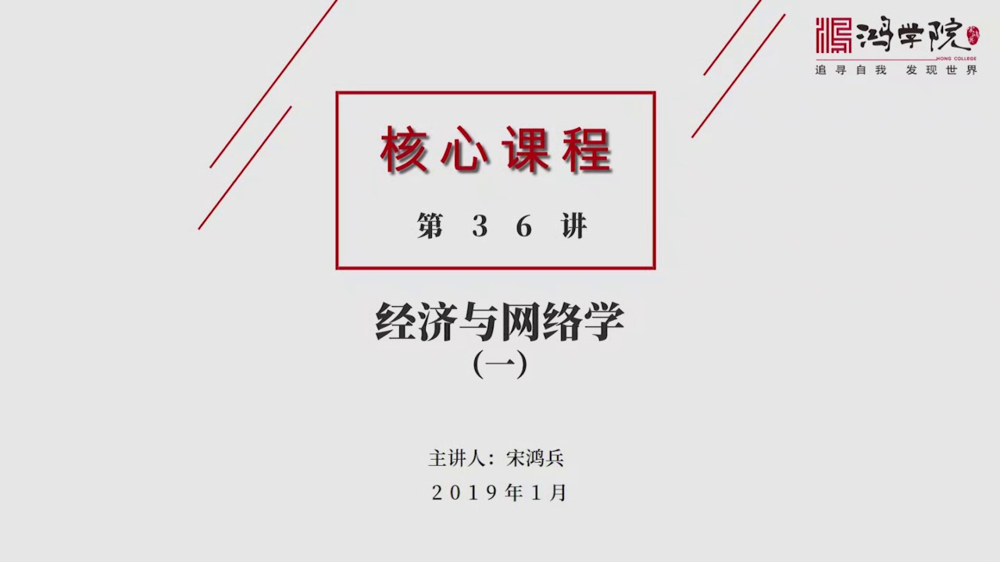

经济与网络学第一部分为什么要讲这个话题呢主要是因为我在做前流节目中第二季重点谈到了中国建国70年以来工业化城市化全球化所产生的巨大的这种经济上的成功当然也有一些问题存在那么在分析这个过程中我发现用一种新的思维方法新的旅程工具也就是借助网络学可以有效的解释很多问题所以在做节目过程中做了很多笔记但是由于...

<strong>Cleaned narration</strong>

> 经济与网络学第一部分为什么要讲这个话题呢主要是因为我在做前流节目中第二季重点谈到了中国建国70年以来工业化城市化全球化所产生的巨大的这种经济
> 上的成功当然也有一些问题存在那么在分析这个过程中我发现用一种新的思维方法新的旅程工具也就是借助网络学可以有效的解释很多问题所以在做节目过程中
> 做了很多笔记但是由于节目压力很大没有来得及把它做成核心课程所以从现在开始我们将通过一系列这种网络学和经济学之间的这种融合的新的方法来重新解释
> 很多问题我们会看到为什么中国建国支出工业化这种起步包括后来的改革开放再包括后来城市化和全球化几种潮流合在一起推动了中国经济发展的一个巨大的成
> 功吧当然这个成功中也办随着大量的问题所以我们需要用一种新的方法论来重新书立很多问题首先我们看敌业当我们说到经济活动的时候

---

### Slide 2

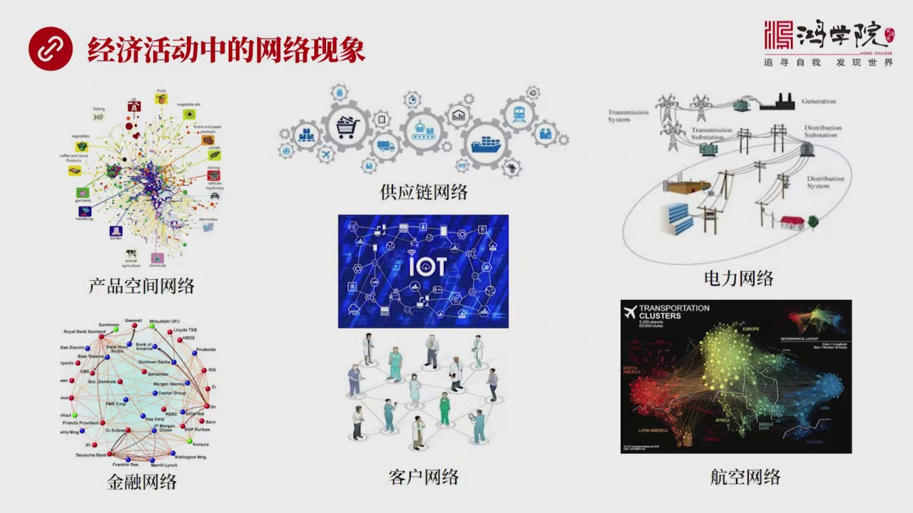

其实我们应该有一个意识就是经济活动的本质是人的活动而人是生活在社会的网络之中所以经济活动的本质它一定是个网络的现象一切的商业行为一切的个人的投资行为消费行为生产行为等等都是发生在网络之中所以经济它天然具有着网络的特性你比如说我们看到的我们以前讲到的产品空间网络就是从这个核心课里面我们系统的解读了产品...

<strong>Cleaned narration</strong>

> 其实我们应该有一个意识就是经济活动的本质是人的活动而人是生活在社会的网络之中所以经济活动的本质它一定是个网络的现象一切的商业行为一切的个人的
> 投资行为消费行为生产行为等等都是发生在网络之中所以经济它天然具有着网络的特性你比如说我们看到的我们以前讲到的产品空间网络就是从这个核心课里面
> 我们系统的解读了产品的它的空间这种理念包括经济的复杂性的形成它就是一个网络用的是网络学的思维方式和方法论来做的一种新的理论概括包括金融网络当
> 这张图杖画的是各大机中机构之间的相互的机中之间的关系商业网络还有供应链网络上游下游的企业在全球形成大分工这也是一种网络还有比如说电力网络就是
> 供电系统发电发电厂还有熟变电站还有全国的这种电力网络它也是一种典型网络行为另外航空交通印书铁路也是网络还有我们在企业经营管理中所设计到的客户
> 管理客户也是网络还有物联网万物互联说来说去我们看到社会中的种种现象这种经济活动的背后都是一种网络的行为明白这点之后其实我们可以把这个概念再往
> 大去向如果我们看下一页其实在我看来整个大自然的一切的一种变化

---

### Slide 3

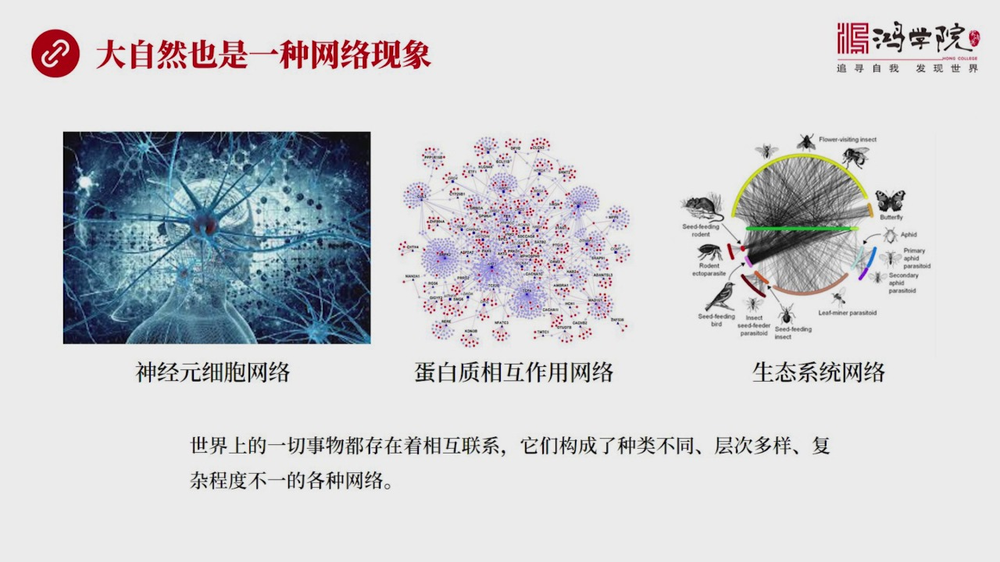

也是一种网络行为其实它远远超过了经济活动本身你比如说我们大脑的神经元细胞它就构成了一个非常巨大的网络神经元细胞的总量超过1500一个它所形成的连接关系之复杂超过了宇宙中所有星系加在一起的总和这种可能性还有在生物学中的蛋白质新称代謝他们的相互作用也构成了网络当然还有向生态系统各种物种的进化它也是相互影...

<strong>Cleaned narration</strong>

> 也是一种网络行为其实它远远超过了经济活动本身你比如说我们大脑的神经元细胞它就构成了一个非常巨大的网络神经元细胞的总量超过1500一个它所形成
> 的连接关系之复杂超过了宇宙中所有星系加在一起的总和这种可能性还有在生物学中的蛋白质新称代謝他们的相互作用也构成了网络当然还有向生态系统各种物
> 种的进化它也是相互影响构成了一种生态系统的网络甚至包括整个地球它的各个不同时代它的地震、火山、
> 洋流还有氧气二人化碳这种变化、浓度之间的这种变化其实都反映了地球作为一个整体它的不断进化类似于一种有生命的这样的一种进化其实它也是在一个更大
> 的这种地球的这样的一种网络之中来进行的所有各个相互影响的要素它们就构成了一个网络所以在我们看来世界上的一切事物都存在这相互之间的联系都有内在
> 的相互作用所以它们就必然构成了各种各样的种类不同的层次多样化的还有佛达程度也不一样的各种网络所以我们看到的一切的行为都可以解释成网络行为或者
> 我们都应该从一个网络学的这种视角去重新解读很简单比如说人类进化为什么人类这样的一个不如类动物它在各个特场中都不一定比得过动物你比如说奔跑跑不
> 过老虎和师子你比如说上述你爬不过猴子和星星你要是寻秘食物你也赶不上很多具有天赋的这种动物比如说下海补鱼你比不过各种各样的海生动物你要是在路地
> 上打猎奔跑你赶不上这种石肉动物还有各种各样的生物的特场和动物的特场人类跟他们相比并没有一种特场上的优势但是人类最后进化成了可以说是地球生物的
> 霸主靠的是什么靠的是一种综合的协调能力就是人类进化出是一个平台的能力也就是它是网络的一种行为所以它的协调性更强人类语言发音能够有一个突变经营
> 有个突变导致人能够有效的通过语言来经营沟通是它的这种综合协调的效率高于其他动物那么再往后有了文字再往后发明了各种各样的这种联络的方式通营方式
> 是整个人类社会的协调性它的信息的处理能力大大超越了其他动物所以进化速度越来越快可以说人类进化超越各个其他的物种的一个主要原因也是人类有效利用
> 了网络就是我们的网络利用的能力和这种信息的交换的这种能力处理的能力远远超过的其他动物使得我们的协调力综合进化的能力超过了其他的物种所以我们必
> 须要用这种新的思维来理解经济活动来理解经济理论中存在了很多问题我们看下野经济理论存在在我看它存在一个最严重的理论缺陷就是

---

### Slide 4

它忽略了经济活动的网络的本质因为亚当斯密那个时代还没有网络学这样的一个概念所以它是用一种机界论用一种牛顿时代的一种非常姜化非常这个解化的这么一种机械的观点然后来思考经济问题因为说中间整个经济理论中最重要的概念就是理性人理性人什么人在这样的一个理论模型中它是没有相互之间的影响的每个人都独立做思考跑比每...

<strong>Cleaned narration</strong>

> 它忽略了经济活动的网络的本质因为亚当斯密那个时代还没有网络学这样的一个概念所以它是用一种机界论用一种牛顿时代的一种非常姜化非常这个解化的这么
> 一种机械的观点然后来思考经济问题因为说中间整个经济理论中最重要的概念就是理性人理性人什么人在这样的一个理论模型中它是没有相互之间的影响的每个
> 人都独立做思考跑比每个人都关了一个小黑屋里根本不跟其他周围任何人打交道所以它的决定不管是投资还是生产还是消费所有的决定都是一个人关在小屋子里
> 面没有跟任何人商量也不受任何人影响的情况之下自己通过对于自己未来的长远的理性的研究得出了一个决策所以它这整个理论基础都建立在飞往落的情况之下
> 都建立在所有经济活动的主体都是孤立的存在相互没有交流没有相互的影响每个人都按着自己的逻辑按照理性来做判断来做分析这是构成整个传统经济学的一个
> 根本性的假设当然在实际生活中我们看到完全不是这个现象因为实际生活中我们看到双十一它会产生一个巨大的一个消费的热潮为什么因为身为中每个人都会影
> 响其他人你的行为会受到你朋友的影响会受到你家人的影响会受到你同事的影响如果你看到有人买了一个新的东西而你没有你会产生判比的心理或者你买了一个
> 什么东西大家觉得很好都会跟进所以这种人与人之间的这种强烈的影响力它远远超过了传统经济学所构想的那个模型那个建立的那种理论模型它就是一个非网络
> 的模型而在真实的经济中就完全不是这么回事所以我们当前要对传统的这种经济学你要意识到它的短板在哪里和它致命的缺陷在哪里就是你如果只研究一个个体
> 而不研究它周围了所有的关系那其实这个得出的结论是必然有问题的我们现在的GDP的统计怎么统计呢那就是盘斯搞出来的国家快击学也就是通过账目的整理
> 严格地说你可以把社会中每一个人的账户它的经济活动每天产生多少经济增加值然后进行全年的累价然后再进行总人口的累价得出来一个总数这是一个结论但实
> 际上你并不知道它发生过程并不是每个人单独关的小黑屋里来做消费来进行生产正好相反人们是在密切的交流活动之中来创造的财富实现的消费所以在这个过程
> 中你会发现分析人与人之间的联系分析大家相互之间的影响通过什么渠道以什么方式以什么样的结构网络的结构来进行影响它实际上会影响整个GDP的总值也
> 就是如果我们不分析这个过程不从网络的角度来分析这个过程就得不出来或者就不知道为什么会有这个GDP这个数字存在或者说我们不知道怎么去调整这种关
> 系可以增加GDP的产量增加这个经济的最终的产出所以用网络这种新的思维方法去深刻理解这种人与人之间的关系那么对于我们调整或者改善或者增加经济活
> 动总量都是有巨大的帮助的所以这个问题具备着非常强的理论价值也具备着非常重大的实践的价值关于网络学我们看下一页首先网络学是怎么起源的这个网络思想它是什么时候开始起源的

---

### Slide 5

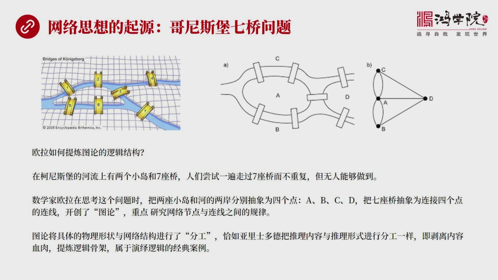

当然我说这个起源并不是说所有人一开始没有网络的概念可能有猫猫忽忽的但是没有真正体验成一种理论的高度这个事是谁做的呢这个是在18世纪格尼斯宝主要的实现人就是数学家欧拉当年在格尼斯宝有一条河河中有导语有两个导语在导语和两岸之间有七座桥梁这个七座桥梁它的分配的它布置的图我们可以看左边有一张地图你会看到这七...

<strong>Cleaned narration</strong>

> 当然我说这个起源并不是说所有人一开始没有网络的概念可能有猫猫忽忽的但是没有真正体验成一种理论的高度这个事是谁做的呢这个是在18世纪格尼斯宝主
> 要的实现人就是数学家欧拉当年在格尼斯宝有一条河河中有导语有两个导语在导语和两岸之间有七座桥梁这个七座桥梁它的分配的它布置的图我们可以看左边有
> 一张地图你会看到这七个桥梁横跨在河和导之间那么当时格尼斯宝有很多人就在左边一个问题当时大家也在尝试就是看谁能够一次性不移漏的走完所有的桥还不
> 重复所以很多人施阿施阿施了很多遍因为这七种这种桥的这种七种的这个七座桥你要考虑的各种各样的走法从不同的起点各种各样的走法大概一共有五千多种那
> 么一个人要想完成这么多排列组合要想一个一个去世这当然难度很大所以这个问题困扰了哥尼斯宝人很多年大家谁也没走出来也没找到一个很好的走法所以就有
> 人请叫欧拉这是十八世纪了这个大叔爷叫欧拉他在接到这个请求的时候他也开始研究这个问题当然他的研究过程也不是一番疯顺不是一拍脑边就想说答案他实际
> 上研究了一年多就是困扰普通人的问题也困扰着了但是经过一年多的深入思考他之所以跟其他人不一样关键就在于他有非常强的体链逻辑架构的能力我反复在我
> 们的课程中包括大家写作业时候强调抓取逻辑架构体链逻辑架构是一种举众是一种智力上的举众是非常非常艰难的也是非常痛苦的这个过程是真正链你这个脑力
> 的链思维思维脑力的但是很多人不理解什么叫体链逻辑架构什么叫一个智力举众大家缺少这种实际的感受也不知道这道理是意味着什么意思我在收到大家问题的
> 时候就有不少人问到底什么叫体链结构我在这里就用欧拉这个他解开歌尼斯宝去调问题就从他这个解读的过程中他解决这个问题的过程中你可以自己去体验一下
> 什么叫做体链逻辑架构第一步欧拉是怎么做的但是他把这个桥这个齐桥的问题要把它进行一个转化你比如说他把左边这个地图上这个桥首先转化成了一个逻辑上
> 的桥你就是说我们可以看到在右边这两个图A图基本上还像一个地图对吧但是到了B图你会发现他把它进行了抽象抽象抽象成什么抽象成点和线了你比如说从这
> 个桥的这种形状上来看你会发现中间的A它是在一个中点C和B在两边所以它把A,B,C放到了这个抽象图的这个就在右边这张图的这个一侧另外你看A和D
> 之间的关系和D,B和D,C之间的关系也可以用连线抽象出来所以它在右边这张图的B图中间其实给出了一个相当抽象的这样的一个概念图它已经不是实实在
> 在的那个桥的地图了注意这就是我们说体链结构的最重要离步就是怎么能够抓去结构呢就是你得把它中间的股价给拎出来这个股价是什么不就是这个关系吗所以
> 我们这个O拉在解决这个问题的时候第一步最主要的一步就是把具体的东西把它的血肉剥离掉把股价子拎出来这个过程就是举中中最难的一个过程就是如果你不
> 完成这个过程的话其实你想的所有问题都被都被这个桥的具体的物理形状还有它的地形和流宽度等等你的大脑会受到诸多问题的干扰就是为什么一般人在做我们
> 这个问题的时候它不能够解开这个答案就在于他们的脑力消耗太大就是脑力耗損主要源于对被周围的这些无足轻重的细节抓取了大量你的脑力耗散了你脑力的这
> 种能量你不能集中所有的脑力与一个点所以一般人在想这个问题的时候99%的脑力都被细节问题所消耗掉只剩1%的时间和经历和脑力去做我们真正实际的问
> 题Ola也经过痛苦的一年多的思考然后它在实现的这种转化把问题体链出来了体链成了点和线就是闭图你可以看看当它思考闭图的时候它脑子里面的所有杂念
> ...

---

### Slide 6

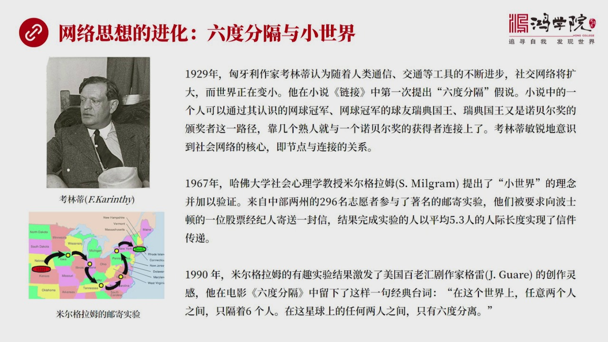

慢慢慢慢进化出来的一种网络学的概念你比如说在这个过程中有几件事我觉得是具有重大的分水领的或者是要实现了一种阶段性的突破比如说第一个人需要谈到的就是1929年熊亚利我发现熊亚利人的数学很厉害一会儿我们还看到还有熊亚利人搞出很多数学模型熊亚利人我还没有来得及做彻底的这个仔细的研究他们应该是有某种不太一样...

<strong>Cleaned narration</strong>

> 慢慢慢慢进化出来的一种网络学的概念你比如说在这个过程中有几件事我觉得是具有重大的分水领的或者是要实现了一种阶段性的突破比如说第一个人需要谈到
> 的就是1929年熊亚利我发现熊亚利人的数学很厉害一会儿我们还看到还有熊亚利人搞出很多数学模型熊亚利人我还没有来得及做彻底的这个仔细的研究他们
> 应该是有某种不太一样的就是跟西方所有这个国家不太一样的文化基因比如说熊亚利的这个作家烤零地他写了一本书在1929年他这本书他的基本理念是什么
> 他就认为人类技术在发展所以通讯技术交通技术在不断进步那么当然人与人之间的这个联系就会逐渐地变得平凡密集社会交往的网络会扩大换句话说用今天的话
> 说就是世界的变小所以他就推论出了他脑子他这个作家他脑子面就想像出了一个像对树寒树量的曲线也就是随着这个技术进步好这个曲线慢慢爬升就是大家相互
> 联系的这个这个频繁程度越来越多好爬升到一定程度之后他就去向一条平直的线这达到了某种极限这个极限是什么在他脑子面似乎在写出之前我觉得他就脑子面
> 有一种曲线这种曲线就是随着交往密度越来越大这个交往的工具越来越先进最后发现世界变小了人与人之间的距离也变小了达到了某个极限之后那就所有的交流
> 都不会超过一个界线好他在他的小说里面就是他有一个小说叫欠实际上这个或者叫这个欠Links其实翻译过来就是练接这是他写了一系列短片的这种故事小
> 说有很多具有这个科幻或者叫预测未来的这样的一种书在这边小书里面他就第一次提出了六度分割假说这是一个很牛的假说这个假说是什么呢就是他假设这个故
> 事中间有一个人他呢认识一个就是他想去认识一个诺宝奖金的获得者他怎么去认识他呢就像我们现在考虑你要认识一个什么诺宝奈尔物理学家的得主在比如说在
> 欧洲某个国家我们会认为这很困难不容易他在小时候中就举了一个例子他说这其实并不难如果小时候中了一个人物他正好他的邻居或者他的一个朋友是网球的冠
> 军而网球冠军他的这个打网球对方人他是个小圈子在他朋友圈面就有瑞典的国王爷爷打网球他们俩是既然你是冠军他这个国王爷爷打网球当然你们的关系就会很
> 好好瑞典的国王自然会认识所有的诺宝奖金诺这些得主因为瑞典国王会负责给他们搬检所以他通过这样的一个推理他就认为其实任何一个普通人离另外一个帽子
> 很遥远的人距离并没有这么长中间经过几个朋友就能够找到任何一个人当然他说的这个这个六度分割理论其实他其实这个他的说法他的核心的问题是什么呢就是
> 当这个对数曲线到了平花期之后所有的人羽人之间的交流所有人羽人之间的这个距离其实就固定在一个数上了这个数他认为是六或者是五好那么这个事实的什么
> 概念就是当我们社会交往平凡和技术但平凡到一定发到一定程度人羽人间这个圈子这个人羽人之间这个建议格小到一定程度世界变小到一定程度那么这个上线就
> 出现了也就是你怎么绕在地球上的七十一人中间你都能够通过不超过六个人而找到地球上的任何一个人大家一想这个事太神奇了难道真是这样吗其实我们想一想
> 看如果你想认识比如说在咱们的同学中间有人生活在北京他想认识一个生活在加拿大北级圈里面的爱思寂寞人的一个一个捕鱼的人或者打裂的人有没有可能通过
> 六个人我认识有可能的你比如说如果有亲戚是在加拿大读书假如他有这样一个亲戚或朋友他就可以找到他这个朋友他这个朋友如果在加拿大读书那么他毕竟是在
> 一个大学里这个大学里很有可能就有比如说社会学或者叫人类学这样的教授而专门研究这种社会学人类学这些教授他就一定得了解这个国家所有的比如说少数民
> ...

---

### Slide 7

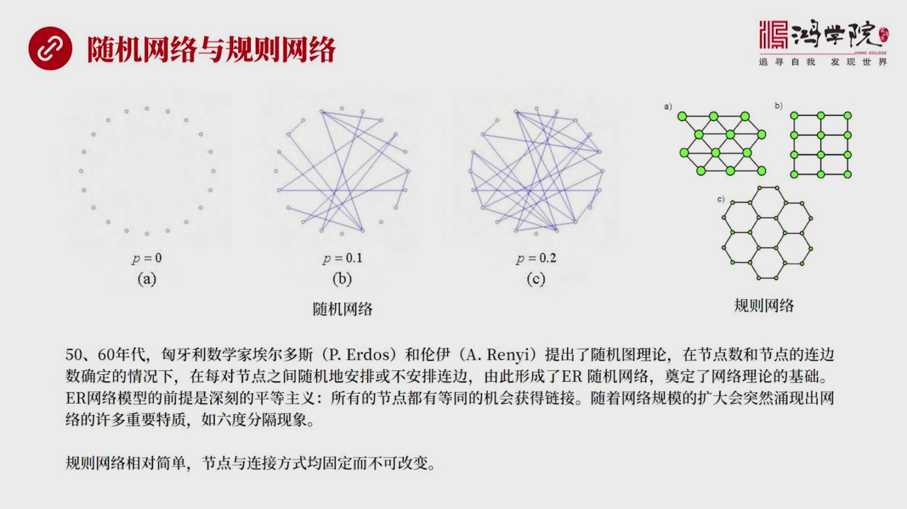

提出之后就引发了很多人对网络线上的关注大家就不停的这个在做研究在做讨论然后再分析这个网络问题究竟是个什么问题当然这就出现了有些人想用数学模型把这个网络的本质六度分割的理论的本质给抓出来所以就提出了随机网络的概念诸亚这个随机网络的提出者也是奥迪利的这个也是匈亚利的两个数学家所以匈亚利人在数学方面还真的...

<strong>Cleaned narration</strong>

> 提出之后就引发了很多人对网络线上的关注大家就不停的这个在做研究在做讨论然后再分析这个网络问题究竟是个什么问题当然这就出现了有些人想用数学模型
> 把这个网络的本质六度分割的理论的本质给抓出来所以就提出了随机网络的概念诸亚这个随机网络的提出者也是奥迪利的这个也是匈亚利的两个数学家所以匈亚
> 利人在数学方面还真的是有一点与众不同的地方但这个问题以后我们去专门去研究匈亚利人其实不是欧洲人不是热漫人也不是也不是这个开尔特人也不是其他的
> 罗马希拉人他们是凶人很有可能来自于这个中亚地区所以他们身上有一些特点是需要仔细研究的那么在五六十年代这个匈亚利这两个数学家一个叫二二周四一个
> 叫这个轮移这两个人就提出了一个随机图的理论随机网络如果我们看这个上面这个图它假定一开始有弱干个节点然后节点之间的连接基本确定情况之下然后它通
> 过随机的办法让这个节点之间产生随机的连接那么在这个图上有P等于0P等于0生概念就是这个概率随机的概率如果是0的情况之下你怎么试它的不可能出现
> 随机连接没有连接因为概率是0没有发生重新连接的可能性好如果我们把这个P把这个概率提高一点点提高到0.1你会发现经过弱干轮的这个常试其实点之间
> 产生了一些连接如果在0.1的这个概率之下我把连接数给固定下来比如说你要产生多少个连接然后随机同性连它每一次连接数是一样的然后这个节点是固定不
> 变的然后你会看到它连接的方法不断在方向变化如果我再把这个概率再调高一点就让它连接概率更高一点你会看到第三张图C它就变得更符答连接线更多那么这
> 套体系或者这套模型被称之为是12125落122往来就用它们俩的手字母名字的手字母来订这是一个纯粹随机的网络你会看到它们这个网络背后这个最大的
> 理论的假设是什么呢是一种平等主义认为每个节点都有平等的机会去重新连接为什么是平等主义这也许跟它们当时需要力是受主义制度有一定关系当然这是我的
> 猜测那么它们认为所有的节点都有同等的机会进行连接的重新配置重新获得连接好这一套理论能不能有效的解释六度分割现象呢是有是有这个可能的当这个网络
> 规模越来越大的时候这个节点数越来越大然后连接数越来越大然后概率给定不断的调整你会发现大到一定极限的时候超过一定的这个预值的时候突然出现了用现
> 出了大量的复杂网络中间的许多特性六度分割就是其中之一也就是你达到了一定上线之后想像一个这个对处曲线吧它这个数量大到一定程度之后它就会逐渐逼近
> 一个极限值在这个极限值上你会看到六度分割理论出现了从一片混论中用现出来了好这个就是这个随机网络不管是随机网络还任何网络你只要让它数量大到一定
> 程度它都必然会出现六度分割这样的一个现象这个是随机网络搞出来的这样的一个数据模型因为它相对的时候比较简单用数据的算法各种这个试验了这种包括当
> 时计算机的能力还不够强大搞出的随机网络这一套理论统治了这个网络学大概四十多年另外还有一种网络另外一种网络就更简单它就是个规则网络就是我们看到
> 右边上图要么是个六边形要么是个三角形要么是个四方形每一个节点它的连接的数量都是固定的连接方式也是固定的连接线也不能重设也不能断掉也不能重新连
> 一切都固化在那永远过化在那所以它的这种这种规则网络跟随机网络就不一样随机网络有一定的概率可以进行重新变化搞明白这两个网络之后我们看下一关键是我们为什么要

---

### Slide 8

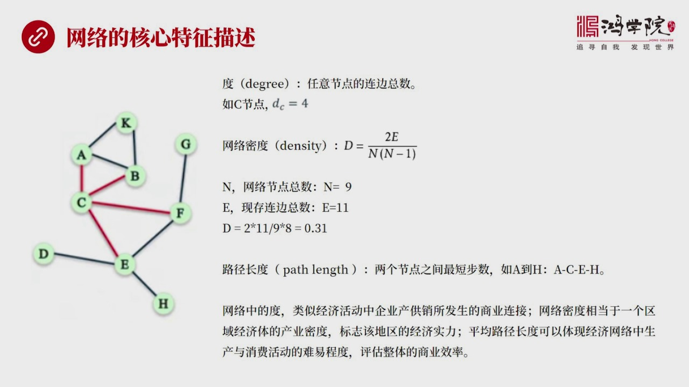

我们为什么要去关键网络主要是因为我们想找到或提炼出来不同网络中间的它的结构性的特征是什么所以我们需要关注你描述一个网络怎么对它的特征进行描述这中间设计了几个概念我认为最重要的几个概念吧第一个概念是肚肚就是Degree是什么概念呢就是任何一个节点它到底连接到了几个周边的节点它的连接线有多少就是它的连边...

<strong>Cleaned narration</strong>

> 我们为什么要去关键网络主要是因为我们想找到或提炼出来不同网络中间的它的结构性的特征是什么所以我们需要关注你描述一个网络怎么对它的特征进行描述
> 这中间设计了几个概念我认为最重要的几个概念吧第一个概念是肚肚就是Degree是什么概念呢就是任何一个节点它到底连接到了几个周边的节点它的连接
> 线有多少就是它的连边总数你比如说以C节点我们走着左边这张图C节点显然有4条连线分别连接到了A,B,F,E所以它的肚DC就等于4这个是一个概念
> 肚的概念每个节点只要你有连接一个连接就叫一个肚两个连接你的这个连接肚就是2那么第二概念是网络密度网络密度什么概念呢就是我现在如果把所有的这个
> 比如说我们看着公式吧嗯这个公式它就是体现出了一个基本的概念就是一个网络中间现有的连边总数当然我们可以看到这个网络它并没有全部连完有很多点和点
> 之间并没有连接那么以它作为分子除以所有可能出现的全部连接完了你大概一共有多少连线这两个受相处也就是我们可以这么想象就是一个网络被全部铺满这种
> 理想情况这是一种理想情况那么实际上你没有达到全部铺满所以你的密度是一个百分比是个百分之多少那么这张图我们可以得出一个计算结果它的这个这个网络
> 密都是0.31这是可以算出来的根据这个公式好这是第二个概念第三个概念就是节点与节点之间的路径长度你比如从A到H从这张图上你可以看到它中间的笨
> 几步笨到C笨到E最后笨到H要跳三步所以这就是它的最短路径当然你可以从A跳到B再跳到C再跳到F再跳到E最后跳到H这就笨了好几步笨了这个五步那什
> 么叫最短路径什么叫路径长度我一定取最短的接近也就是AC1H走这条线而不走其他绕路这条线那么这个路径长度如果我把A和H之间搞明白了我再把A和G
> 之间搞明白在D和F搞明白然后K和H搞明白我把所有没对的这样的节点路径长度全部算出来然后再处于处于这个节点总数我就算出整个这个网络中间的平均路
> 径长度为什么要计算这个概念我们看下面关键是我们要把这个概念用在就是当然在网络学中它有它自己的这个一套价值体系就是它有它的价值但是我们更关心这
> 些概念的主要原因是我们要把它用的经济理论的解释和解读这个中国的经济发展过程中出现了种种问题你比如说网络中的这个度它类似什么这个度就是C跟AB
> EF之间的这种连接线在我看来这个C就好比一家企业而AB这些接点相当于它的上下有的其他的企业那么之间的连线这个度其实就是相当于产工销你的商业合
> 同你买了多少货经过加工卖给谁上下游分别是谁你会看到其实它某种意义上这个节点在经济网络中间就是企业或者是个人那么你跟周围所有人所有企业发生了这
> 种关系可以用度这个概念的进行表示那么网络密度网络密度相当于一个经济体一个区域的经济体中间的产业密度你到底有多少个节点多少个企业这些企业之间有
> 没有实现充分的连接如果连接不够你这个密度就还没有达还没有达到一个比较好的一个密度如果是这个密度比较高那么说明你的经济实力比较强当然我在这儿是
> 一个龙统说法我们在下眼中我会讲到其实有很多特殊情况比如说连接方式它不一定要是所有节点之间相互联系而有一些更高效的方式因为你一次连接就会占有一
> 些资源好那么平均长度平均路径长度它体现出了所有在这个网络节点中间的不管人企业还是个人不管商量者还是消费者大家彼此找到对方的中间的步骤这个步骤
> 越短说明商业效率越高如果一个整个网络的平均下来这个路径长度比如说是二那它一定比平均这个数是五的这种网络要更有商业效率好这是我们在这个前六节目
> ...

---

### Slide 9

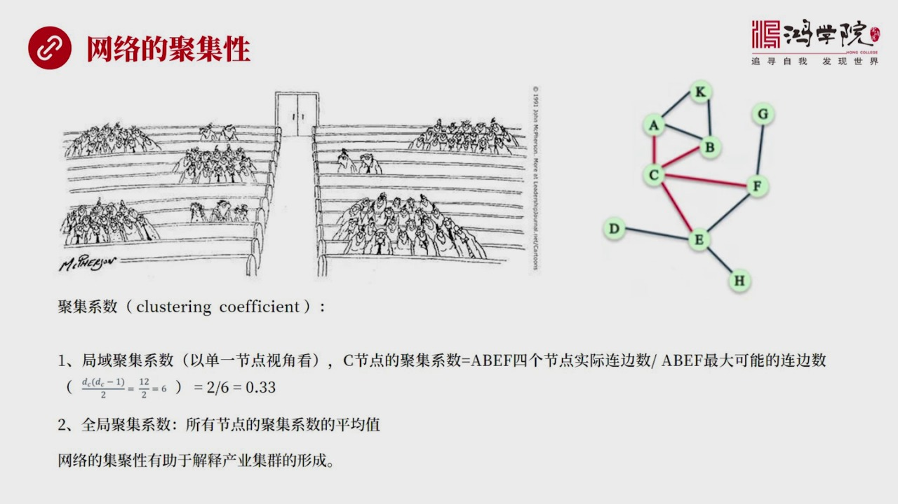

网络中间一个非常关键的一个属性就是它的聚集性什么叫聚集性其实我们看左边这张图你会发现在任何一个房间里或者任何一个工厂和中总是三五成群的大家聚在一起而不是平均的保持距离这叫什么物以类聚人以群分举个简单类子就像红旋红旋的同学之间它就会形成一种聚集状态而跟其他的社会状态其他的不达达的人没有什么关系的人保持...

<strong>Cleaned narration</strong>

> 网络中间一个非常关键的一个属性就是它的聚集性什么叫聚集性其实我们看左边这张图你会发现在任何一个房间里或者任何一个工厂和中总是三五成群的大家聚
> 在一起而不是平均的保持距离这叫什么物以类聚人以群分举个简单类子就像红旋红旋的同学之间它就会形成一种聚集状态而跟其他的社会状态其他的不达达的人
> 没有什么关系的人保持了一种比较疏远的这样一种模式这种模式就是我们需要看到现象之后需要想我怎么才能够把一团人聚集在一起特性体验在网络上就是一个
> 节点跟好的节点或好的节战报团聚在一起我怎么能用数学的方法把这种现象体验出来用数学的方法和数字来进去表达这就是聚集系数它的重要性好 聚集系数它
> 可以分成两个层次一个层次叫局域的系数比如说我们以这个C节点为例C节点是中间连接线比较多的它有4条连接线 连接到4个节点那么它的聚集系数怎么算
> 呢也就是我把4个节点这是它的十几点面数和它连接着这4个节点A、B、E、F这4个节点之间最大可能的连面数进行相处算出来了就是C节点以这个节点为
> 一个视角来考虑它的聚集度就能够算出来当然我们可以从这个公式中你可以求出来也就是怎么求它的最大的连面数A、
> B、E、F这4个跟它相连的这4个节点最大连面数是多少呢当然就用这个公式一套就知道了也就是实际上是4个节点减去3就是4.1那当然34就12了1
> 2再出也2你得到的是6也就是A、B、E、F最大可能最大的可能存在的连面数是6你要不信自己去自己去画去好那么它十几连面数多少那只有A和B、
> E和F实际这4个节点中间只有两条线所以其实12出6那多少31吗0.33用这个办法就可以把C这个节点的聚集度这个给算出来聚集系数然后你再把第一
> 每个节点都用同样的办法去思考去计算然后你再把所有的这些数加在一起除以它的总结点数最后你算出来的是这个全局的就是整个这个网络的平均的聚集系数你
> 就知道这个网络大概是一个非常仇敏的状态非常暴图的状态还是个比较吸收的状态为什么要关心这个网络的急剧性呢为什么要关心这个系数呢在我看来我们在下
> 两中间要用这样的一个理念去理解产业集群它是怎么形成的为什么会形成特别是中国长三角和猪三角的产业集群它的形成过程我们会用急剧性网络急剧性这个概
> 念去重新理解当然描述急剧性急剧性急剧性系数还有不同的其他的方法那么这我在这的讲的是一种集团方法其实还有另外一种那个是算算一个比如说它是一个三
> 角形的一个网络它在整个的这样的一个全局网中间所占的实现的这个三角网络和没有实现之间的笔质那也是一种办法这种办法和我刚才介绍的这种办法它描述的
> 网络急剧性的特征有所不同这个问题到碰到类似现象的时候我们在专门解读我们再看一下也好 我们有了简单的网络

---

### Slide 10

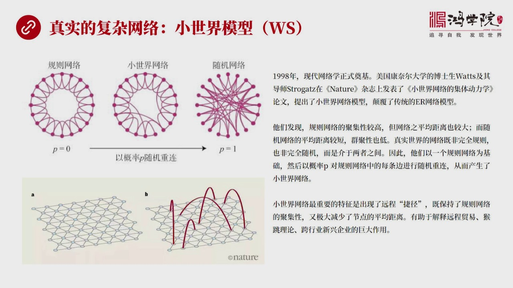

有了规则网络还有简单的实际网络但是这两种网络网络其实都并不能真正代表真是世界中的复杂网络真是世界的复杂网络跟我们所说的规则网络肯定不一样也跟那种彻底的实际网络也不一样真是网络是什么样的呢至少有一种被发现出来了就是所谓的小世界模型刚刚我们讲到的小世界是个理念六度习格好关键是怎么用数学方法用标准的网络网...

<strong>Cleaned narration</strong>

> 有了规则网络还有简单的实际网络但是这两种网络网络其实都并不能真正代表真是世界中的复杂网络真是世界的复杂网络跟我们所说的规则网络肯定不一样也跟
> 那种彻底的实际网络也不一样真是网络是什么样的呢至少有一种被发现出来了就是所谓的小世界模型刚刚我们讲到的小世界是个理念六度习格好关键是怎么用数
> 学方法用标准的网络网络学的语言把它把它产数出来把它做出来用计算机自动生成小世界网络这个是有挑战性的这个重大的突破也就是1998年做菜的代表了
> 现在网络学真正的诞生在此之前还不能叫真正的网络学现在1998年之后网络学诞生了它成了一个典型的跨学科跨思维这样的一个理论体系引起了很多很多不
> 同领域的这些学者的兴趣大家各做各的研究但是都用同样的这个小世界的模型来做获得了大量的新成果所以这个概念这篇文章就是美国看了大学的当时是个博士
> 生这个Words和他的导师他们俩搞出来的发表在了自然杂志上他们这篇文章就叫小世界网络的集体动力学也就是小世界网络它的一些基本特征所以用他们俩
> 这个手字母得出了一个新的网络模型WSWS这个小世界模型基本上颠覆了传统的一二模型那么它的特点是什么呢你会发现比如我们看左上图你会发现它首先是
> 一个规则的网络他们就是从规则网络起步规则网络如果说把它的概率连边这个重新设连接着这个概率设成零的话P如果等于零的话那它就是规则网络它永远不会
> 变对吧你如果把它加到1从零到1那它就开始随机乱动随机乱连最后连接出来的就是最右边这张图随机网络你会看到这个左右这两张图最左边说最右边它有个特
> 点最左边的规则网络它的每一个节点之间联系是比较紧密的或者说它的暴团程度比较高积极性比较强但是你要看像类似一个手滑的这么一个网络从左边到右边最
> 上面到最下边它中间要走很多步它跳很多步才跳得过来所以代表了它的路径比较强虽然它的暴团性比较强但是路径比较强这是一个它的特点那么最左比较的随机
> 网络你会看到它的暴团程度很弱你看大量的左右的节点根本不相连它没有左右零距之间都不打招呼的所以它们暴团的程度是比较弱的但是它的好处什么呢它的连
> 接性比较强而且它到处都是飞线从这个节点到另外一个节点不管你相课多远我有很多飞线可以到的所以它体现了这样的一个特点就是一个是暴团程度强但是网络
> 距离比较大另外一个是暴团程度弱但是网络距离比较小好 有没有这两者之间的这种中间的过度过程呢其实是有的这就是小世界网络那么这两个人吧他们在做实
> 验的时候他就把屁从零慢慢调高调高一点之后你会发现一调高就会出现一些飞线这个飞线很有意思的首先它这个调整链接就是如果比如说我们看到这张中间这张
> 图底下有一个飞线产生之后你会发现这个飞线产生之后它跟零具之间的一根线断掉了因为这条线被重新链接连接到了另外一个节点上产生了三条飞线好冒四三条
> 飞线很少并不多但是它却急剧的改变了整个网络的特征也就是平均的路径被大大缩短了这是它一个非常非常重要的特点就是那种飞线少及少说的飞线可以极大了
> 降低这个网络中间的这个路径的距离这是意味着什么就是稍微调整一点点关键的路线就有可能极大的提升一个网络的商业效率提高一个经济的商业效率这就是它
> 的最大意义所以我们如果看底下下面这张图你会看到A图它是一个非常规则性的一种网络好通过一定概率让它给它一点点概率让它产生飞线你会看到在这个平板
> 上它在远端从一个点就是从这个网络的一边跳到另外一边出现很多飞线这个飞线就是接近这种远程接近非常的关键我记得以前我们这个讲弘劳轮萨历史说专门强
> ...

---

### Slide 11

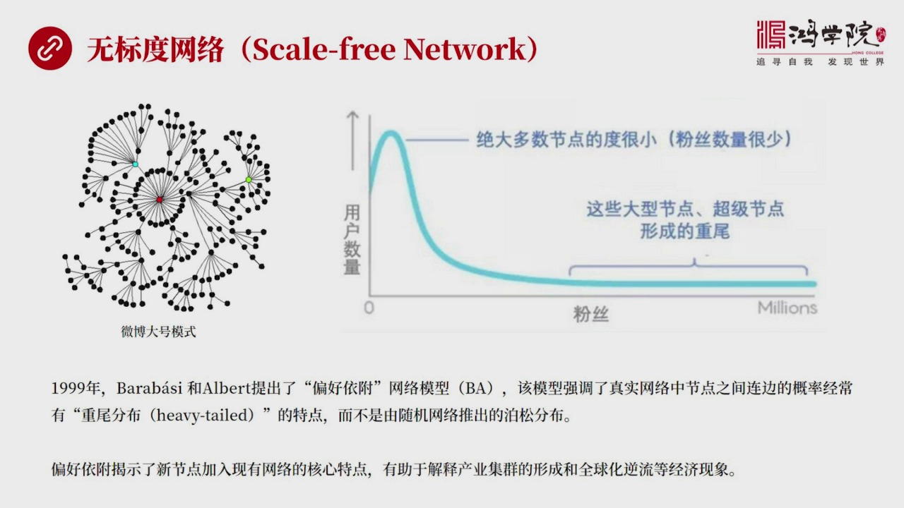

这个网络模型这个模型也非常牛叫无标度网络无标度网络是99年出现的它的两个作者提出了这个提出了一个重要概念叫偏好衣服网络模型简称是BABA和WS它又不太一样你会看到这个用这种无标度网络形成出来的这种网络比如说我们看作图你会看到它是一个以中心节点为主的一个非常不公平的网络你会看到这些小的节点左右之间大部...

<strong>Cleaned narration</strong>

> 这个网络模型这个模型也非常牛叫无标度网络无标度网络是99年出现的它的两个作者提出了这个提出了一个重要概念叫偏好衣服网络模型简称是BABA和W
> S它又不太一样你会看到这个用这种无标度网络形成出来的这种网络比如说我们看作图你会看到它是一个以中心节点为主的一个非常不公平的网络你会看到这些
> 小的节点左右之间大部分节点没有任何关系就是它们没有任何连接都是一些骨尔但它们共同连接到一个大号上我称之为是微博模式或者叫推特模式也一样就是这
> 个网络中间的不管有几亿人还是十几亿人但是真正发挥重大作用的往往是极少数人几千人几万人剩下的大多数人都没有粉丝而所有人都关注一些特技大号有的是
> 几千万有的是几百万它是一个以这种重要的非常不公平的或者叫赢家通吃了模式形成的一个网络为什么叫无标度无标度概念就是我已经没法判断就是已经平均的
> 一个度的分配已经这个规律已经完全不是用了我现在已经变成高度这个连通度高度不均匀的一个这样的广乱没法策定了所以无标度了在无标度的网络中间你会看
> 到右边这张图大部分人就像咱们的微博一样你会看到微博上绝大部分人的粉丝量很少几十几百上千个都比较少而几少数人拥有着非常大量的这种粉丝这叫什么这
> 叫众为尾巴很重拉得很长你看前面这个高峰这些高峰都是大多数这个大多数的用户都是属于这个类型的人他们对应了粉丝数量几少但是在长尾巴最后这一点这些
> 人人数很少但是每个人拥有了粉丝量巨大为什么这个理论很重要他跟这个小世界理论我认为是整个网络学的两个最重要的基础最重要的支柱就是因为他中间提出
> 了这个偏好医护理论偏好医护这样一个重要的原理什么叫偏好医护呢就是在一个现成的网络里比如说微博吧你是一个新新来的一个人当你这个节点加入现有网络
> 之中那么你会天生青像于加到哪个网络哪个节点上呢你是随机找一个他也只有十个粉丝的人你去关注他吗还是你关注一个大号那么经过数学的册算你会发现不管
> 是计算机网络微博网络还是蛋白质网络还是一切的网络共同的各率都是偏好医护就是新增接点会首先以更大的概率连接上那种大号为什么就好比一个粉丝你要进
> 入微博这个圈子那么你首先关注一个有几千万人的这样的一个大威你通过他你就能够尽快尽快的了解整个网络中发生的各种新闻有什么好玩的事你就能够了解了
> 假如你要连接这个关注了一个小号他也只有十个粉丝那对你来说意义不大你加入这个网络的意义非常小好 这会造成什么习意这会造成什么现象呢两级分化 营
> 价通知马太效应你叫什么都行在我看来这个衣服偏号理论偏号衣服理论可以非常有效的解释产业集权是怎么形成的当一个新生的集合建立之后他会优先选择跟谁
> 合作在哪里合作这就是我们以后下午可以要讲的这个产业集权的地理分布还有他这个偏号衣服还能够有效解释全球化为什么会出现逆流你想想看在这样的一个无
> 标度网络中间大多数人都衣服在一些少数的成功且身边周围或者叫营价通知互联网上只要营价通知这会造成什么现象大多数这些单字节点在微博中这个现象就很
> 明显好 我在微博中玩了两年我写了不少东西结果我一共才二十个粉丝每次写好几千字就像红圈写作业一样发到微博上就只有一个点赞或者一个都没有因为一共
> 只有二十个粉丝那么我还会有热情去继续创作吗当然就不会有了因为没有刺激你会觉得很难过很伤心最后怎么办我不玩了退出了微博所以我们看到当微博头几年
> 2012年一三年非常火爆的时候全民大家都在写写微博结果你会发现越来越多的人发现自己写出来东西没人看那我当然就没热情了最后大家就从微博往老中撤
> ...

---

### Slide 12

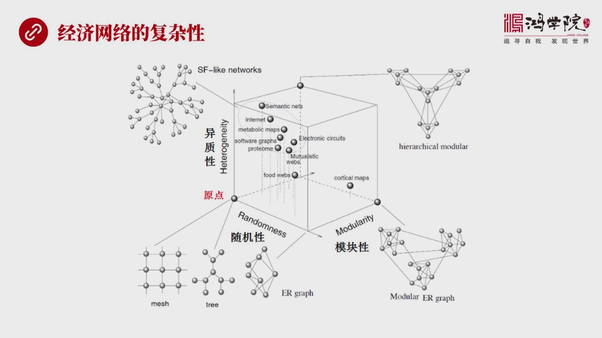

所派生出来的一系列结论我跟他列出来是一些主要的还有一些其他的这种结论关键支出是我们要分析在全世界的经济活动中这种网络它到底是一种什么样的形态也就是我们在以前在解释经济现象的时候我们都是用失业率用GDP 用CPI 用PPI诸如此类的参数来解读所有的经济问题好还是坏你发现没有这套理论体系中完全就没有网络...

<strong>Cleaned narration</strong>

> 所派生出来的一系列结论我跟他列出来是一些主要的还有一些其他的这种结论关键支出是我们要分析在全世界的经济活动中这种网络它到底是一种什么样的形态
> 也就是我们在以前在解释经济现象的时候我们都是用失业率用GDP 用CPI 用PPI诸如此类的参数来解读所有的经济问题好还是坏你发现没有这套理论
> 体系中完全就没有网络的概念它们完全就没有这种意识它的基因中就没有网络所以你会看到为什么GDP测证很多东西其实是不靠谱的非常不靠谱主要就是这个
> 思维方式它缺少网络这种概念但是经济的网络究竟是一种什么样的网络这种研究现在在全界才刚刚起步我用这张图其实为了说明它的结构的复杂性比如说它的原
> 点往上代表网络的这种意志性不同性质的这种特性它往X周这个方向是随机性它有多大的随机可能它如果这个概率到了1它就变成随机网络了然后它横着还有一
> 个特性就是它的模块性越临远点的鞋线上还有个模块性它是不是一个高度模块化的网络所以它有三枚的不同的展现三枚不同的展现中对于不同的经济现象不管你
> 是软件还是生物还是互联网还是这个食品供应等等它对于这些网络每一种网络都有不同的网络的结构和不同结构所具有的不同的网络特性包括它的平均长度包括
> 它的密度包括它的这个聚机性等等所以我们在考虑问题时候你会发现要用网络学去真正解读经济现象还面临着大量的这种基础性的工作比如说你得搞清楚在长三
> 角和周三角地区这个经济网络是个什么形状它的特征它的特征描述应该什么样的一个描述方法就是我刚才所说的那些参数长三角和周三角能一样吗我认为肯定是
> 不一样的因为每个地区有它不同的文明文化的几点导致人们思维方式不一样所以连接出了那个网络的形状和它的参数和它的结点各方面情况都会不一样好还有你
> 睡到不同的行业计算机行业跟制造也能一样吗它的形状也会不一样你服务业跟这个房地产或者金融它的网络形状一样吗它也不一样所以它的多样性和多层次性还
> 有它的复杂性这些都是我们需要进行系统研究然后才能有效地利用这套理论来解读很多经济现象好最后我们对今天这张课进行的总结那么在我看来这个所有的经济活动

---

### Slide 13

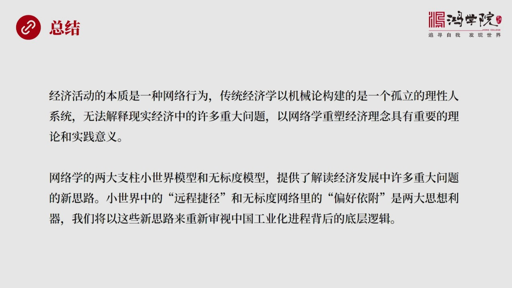

它的本上都是一种网络活动而传统经济学是一种集结论的世界观构造的是一个大家彼此相互孤立的理性人的系统所以它没有办法真正来解释现实生活中和现实经济发展过程中的很多重要的问题因为它全是网络问题所以我们现在应该以网络学这样的一种新的世界观新的方法论来重速经济理论中间的很多原理在我看来这是具有重大的理论价值也...

<strong>Cleaned narration</strong>

> 它的本上都是一种网络活动而传统经济学是一种集结论的世界观构造的是一个大家彼此相互孤立的理性人的系统所以它没有办法真正来解释现实生活中和现实经
> 济发展过程中的很多重要的问题因为它全是网络问题所以我们现在应该以网络学这样的一种新的世界观新的方法论来重速经济理论中间的很多原理在我看来这是
> 具有重大的理论价值也具有重大的实践价值实际上我们在核心科的中间的经济复达信中已经开始使用网络学中间的很多方法而经济复达现了一个研究本身就是基
> 于网络学那么在网络学中间今天我们系统的总结它的起源它的思想的进化它的一些重要的突破时间点还有现在的整个网络学的两大支柱小世界和无标度两个模型
> 那么我觉得这两个模型它分别提供了不同的重要的工具比如说小世界小世界中间是远程洁进这个飞线就是一个非常出彩的地方也是一个相当丰历的思想工具另外
> 无标度网络中间的偏好衣服也是一个非常强有力的这样的思想工具这两者是不一样的远程洁进是什么是在线友节点之上重新连接而偏好衣服是在新产生一个节点
> 情况之下它怎么去跟线友网络连接所以一个是在线友基础之上进行再造另外是完全重新的生成一个新的节点一个是在线友节点之上重新连接另外是产生一个全新
> 的节点这个重大的差别对于我们解释中国工业化工程中的很多细节问题具有这重大指导意义所以我们把这些理论拥有了新的理论拥有了新的方法论和世界观之后
> 把网络学的很多基础的东西基础的这种逻辑构用在解释中国的经济现象过去的历史的现在正在发生的包括对未来的这种预测你会发现我们就不是在凭拍脑门了我
> 们就不是在看到媒体中所说的我们假设GDP一年纵成百分之六十年之后我们会成事业老大二十年之后会成为宇宙老大就不是拍脑门了你凭什么认为你的GDP
> 会平均一每年百分之六的速度增长呢很多人给出这理论就是啊因为其他国家在类似发展阶段他们都是百分之六或者这个中统收入陷阱大家达到的人举意外美元就
> 如何如何这种人的思维方式中完全没有没有网络的概念就是你认为美国当时在一百年前形成的年军百分之六的增长率会同样是由于今天的中国吗或者每个不同的
> 国家会符合同样的标准吗难道你完全不考虑这个国家的人人与人之间的网络是怎么构成的吗所以我们需要突破传统经济学理论的诸多人这个评计和界限需要打破
> 这种传统这个传统需要形成新的思维方法用新的观念新的原理去解读问题当然所谓的创新所谓的用新的方法去想问题必须得有一个现场的逻辑架構必须要有一个
> 强大的有说服力的能够跨越很多领域具有着普遍解释这样的一个逻辑工具或者叫逻辑结构才能做到这一点而不是我们随便拍脑门推导了以前的但是你有搞不出新
> 的东西来那就会造成更大的思想混乱好关于如何用网络学的这些原理和逻辑来解读中国经济发展中的很多实际问题我们将在下唐课给大家进行重点介绍今天我们的课就上到这里

---

### Slide 14

谢谢大家

<strong>Cleaned narration</strong>

> 谢谢大家

---
