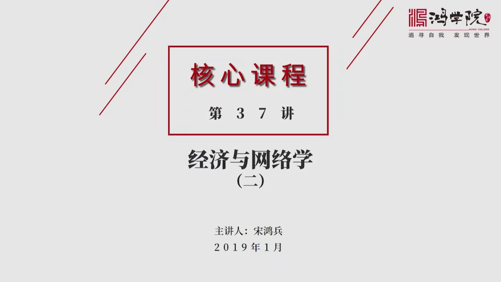
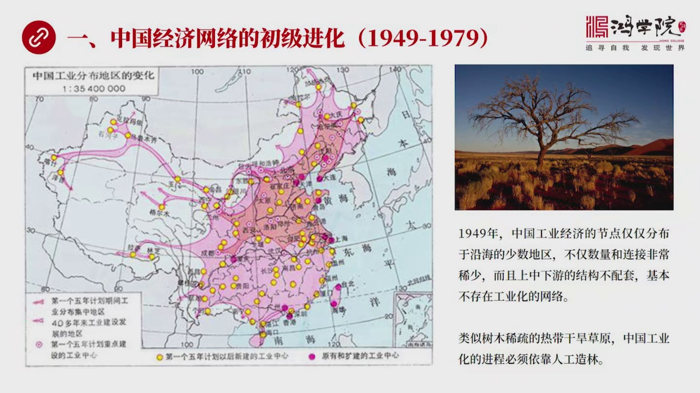
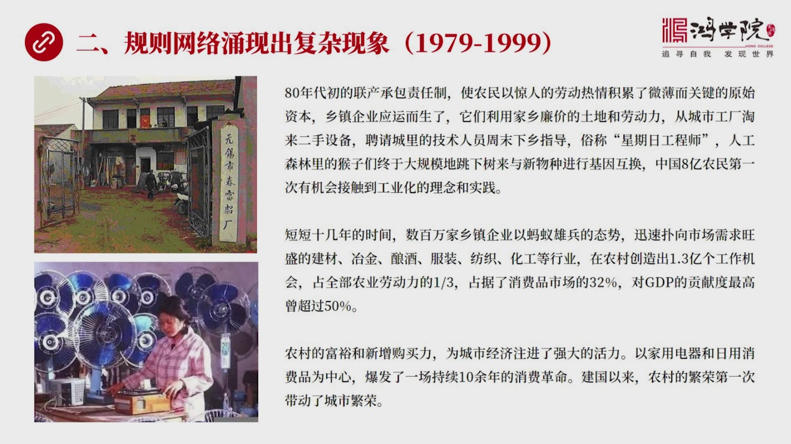
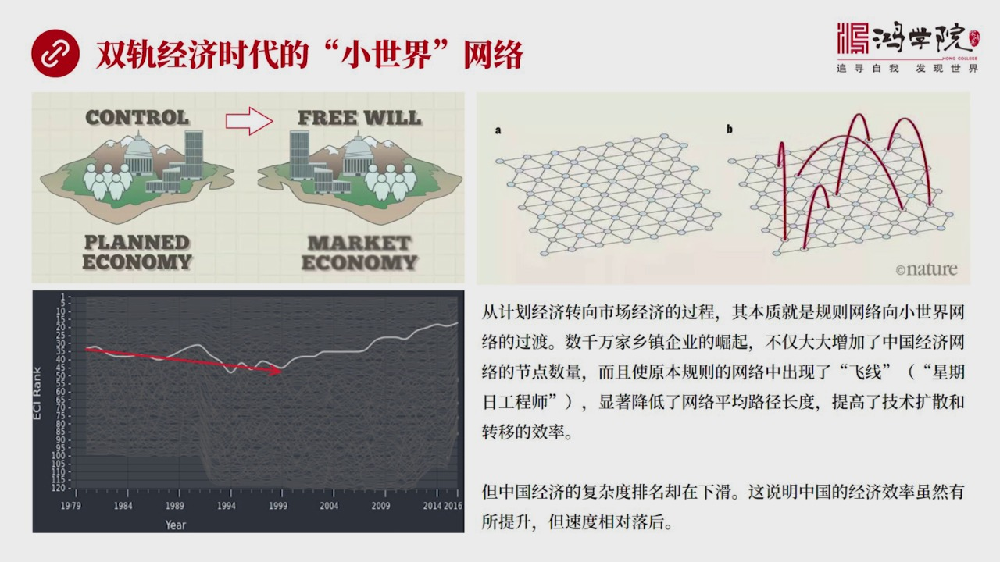
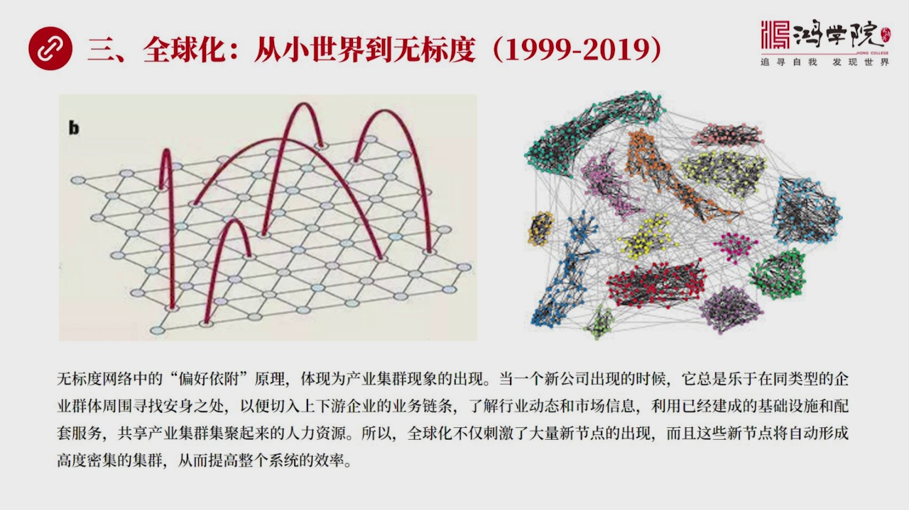
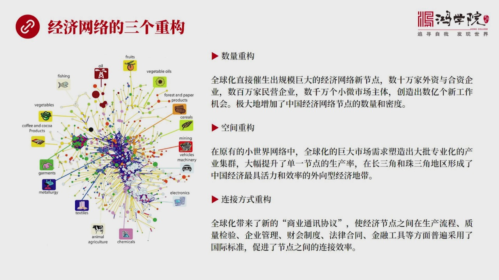
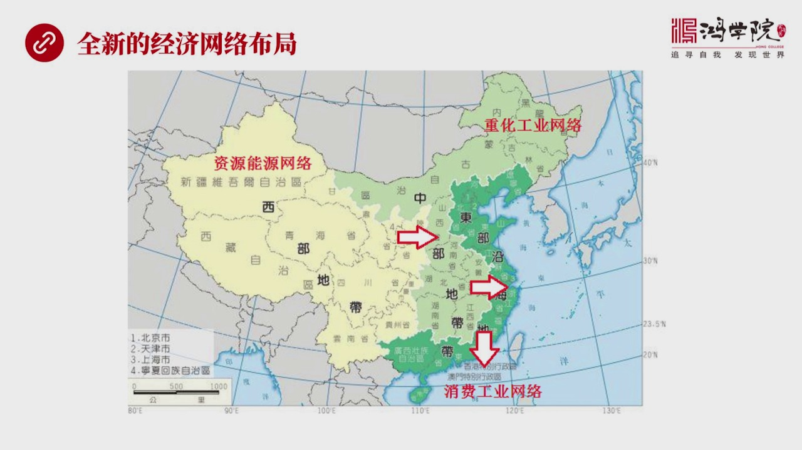
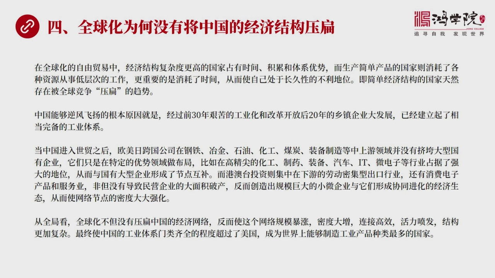
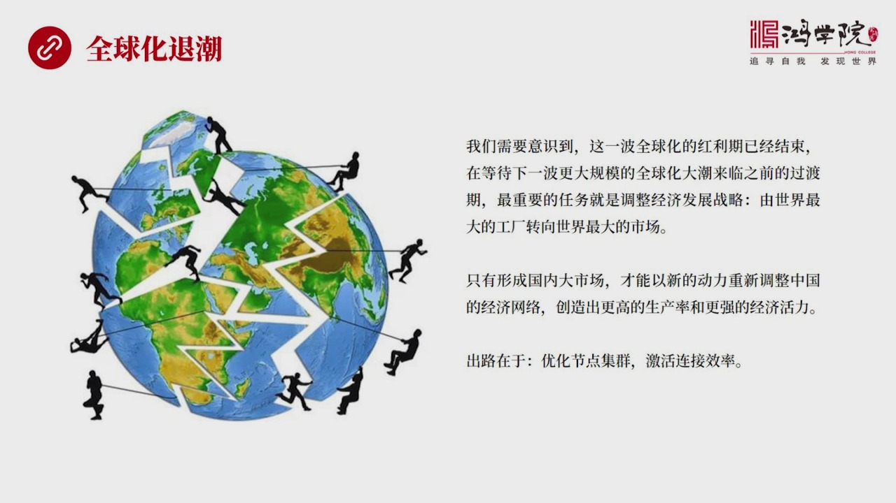
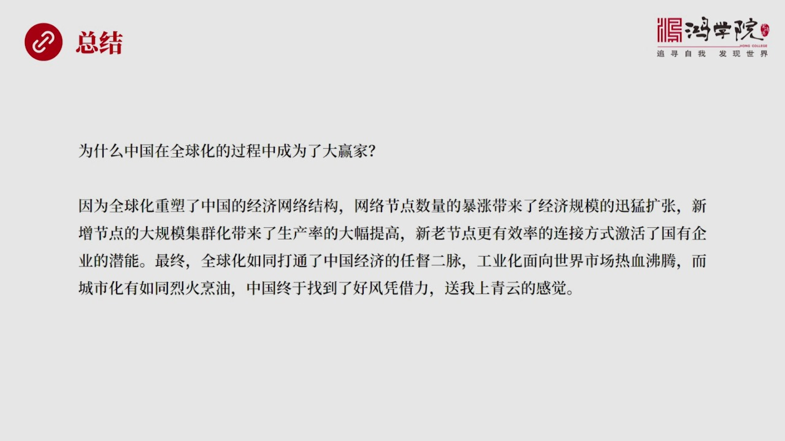

# 核心课视频-037讲. 经济与网络学（二）（视频） — Detail Slide Notes

> **来源**：鸿学院核心课程  
> **幻灯片**：12 张

---

### Slide 1

我們上集課說到當今的經濟學 它的理論體系是建立在牛頓立學的那種機械世界觀之中基本上忽視了經濟活動它的網絡的天然的性質因此在解釋很多現實的經濟問題上出現了不少問題你比如說如何看待中國加入WTO進入全球化...

<strong>All subtitles</strong>

> 我們上集課說到當今的經濟學 它的理論體系是建立在牛頓立學的那種機械世界觀之中基本上忽視了經濟活動它的網絡的天然的性質因此在解釋很多現實的經濟
> 問題上出現了不少問題你比如說如何看待中國加入WTO進入全球化過程之後的經濟的迅速發展其實在這個問題上就有很多理論問題因為中國走的是一種跟西方
> 的經濟學理論幾乎是完全相反的道路按著傳統經濟學理論那麼你就必須要完全的開放 越自由越好 關稅應該越低越好同時政府也不應該干預經濟不過從現實發
> 展來看 我們發現中國所走的很多道路其實是非常獨特的 而且跟這種西方的經濟學理論它是有很大出入的特別是中國傳統的這種計畫經濟包括現在政府對經濟
> 的很多干預力度 產業政策像中國製造2025這樣的概念和這樣的執行措施 這都是違反經濟學理論的所以我們如何來解讀就是中國這種獨特的模式在進入全
> 球化之後的這樣一種很優異的表現我覺得這需要一種重大的理論創新所以我們上一課 包括這些課都在深入分析 我們需要一種新的框架新的理論的邏輯結構來
> 解讀現實的問題那麼在上一課中 我們重點談到了網絡學的一些基本的理論和一些基礎那麼今天我們就用這些新的這種概念來總結一下中國在過去70年之中它
> 的經濟發展 包括工業化的進程從網絡學的角度來看 到底應該怎麼來分析我們下面看 第一部分 我們要從網絡學的角度來解讀

---

### Slide 2

中國頭30年這種經濟發展它走過了這種工業化的道路應該怎麼來從網絡學的觀點來看那麼在我看來 如果我們看左邊這張地圖你可以非常明顯地看到這是一張中國15期間15之後和後續的這種發展你可以從這張圖上非常鮮明...

<strong>All subtitles</strong>

> 中國頭30年這種經濟發展它走過了這種工業化的道路應該怎麼來從網絡學的觀點來看那麼在我看來 如果我們看左邊這張地圖你可以非常明顯地看到這是一張
> 中國15期間15之後和後續的這種發展你可以從這張圖上非常鮮明看到這個這張圖擴展的一個範圍上面這些紅點是代表中國建國之初的一些經濟節點就是一些
> 重要的工業城市它的布局你可以非常明顯地發現它是沿著在東北地區還有東部的沿海 逐步展開的這表示出中國在建國初期這種工業的基礎基本上是在東北和東
> 北部當然我們都知道東北是在日本長期殖民統治之下建立了一些工業基礎那麼東部地區包括上海這些地方都是在民國時代包括洋務運動 更早洋務運動在中國的
> 東部也有一些工業基礎而整個中國的中部和西部這種經濟節點工業化的節點就非常的少所以我們看到在1949年的時候中國的整個經濟節點它是不成體系的 
> 不成網絡的而且數量非常的稀少各種產業也沒有形成一種配套中工業沒有發展起來 裝備製造也沒有發展起來只有在前端的一些少量的親工業想免奮製造 想一
> 些同油還有一些無礦具備著 某種一上具備著市場競爭力而其他的大部分產業基本上都是一些非常沒有競爭力的小行業像中國的這個剛產量才是十幾萬噸中國的
> 當年的很多這種親工業也沒有什麼國際競爭力像洋火就是這種沒有洋火 這都必須要進口食灰 水泥 所謂洋灰它也須要進口 包括履鍋也製造不了 等等等等
> 所以中國在建國以後 它所面對的情況就是按照我們以前所說的喉跳理論的話中國的工業體系它是一個熱帶乾焊的草原的這樣一種情況如果我們把工業化看成是
> 一種森林 熱帶雨林的話你會發現中國當時完全不具備熱帶雨林的條件只有熄熄拉拉幾顆樹 在這樣情況之下猴子是無法實現跳躍的 也就是喉跳理論它是站不
> 住腳的 就是因為我們的產業體系太細鬆我記得在我們以前講經濟複雜性的時候也是用到網絡學的這種理念不過當時的網絡學這種理念是局現在最終的產品的空
> 間上並沒有倒數到它前端的產業體系結構我們今天要講的就是從產業體系它的發展來看 就是從另外一端從上又來看而不僅僅是從產品最後的產品空間來看所以
> 中國當時建國初年要想徹底改變要想從一個落後的農業國變成一個工業國要進行工業化的話 它就必須要改變這樣一種工業體系網絡極點 非常稀疏這樣一種情
> 況但是如果你按著傳統經濟學的角度來看那麼這個事就不能夠以政府來主導它應該靠自然的進化 自由競爭嘛如果按著這個理論走下去的話那麼中國可能就走上
> 了印度那條路你至今也不一定能建成完備的工業體系那麼中國走的是一條可以說是人工造林之路這就是我們所看到的建國初年中國以蘇聯原建的156個大項目
> 作為古幹那麼也就是這個地圖中間的粉紅了部分你會看到由於這些156項大項目落地之後它引發了一些大型的配套的工業項目的誕生大概有1700多個其中
> 光是在東北地區為了配套這幾十個重點項目就有700多個工業項目同時生成了那麼在這個全國範圍之內你的這些重點配套的就是核心項目古幹項目是156個
> 配套的好幾千個那麼與這些配套的再配套的更外圍的這種工業的節點那就呈現上萬了所以通過這個第一個五年計畫到五千年的時候我們可以看到中國的這個經濟
> 節點特別是工業的節點布局就已經從東部沿海擴展到了中部也包括西部的很多城市這就是地區中間的黃點這些黃點的它的意思就代表著新興的工業中心興起了所
> 以從這張圖上我們可以看到整個中國工業的這種網絡的布局就是這種經濟網絡它已經呈現出了一種合理化和全局化的布局而且在地理上它呈現成一個有效的網絡
> 結構這就是我們看到的中國前三十年打下了一個重要的基礎就是網絡結點開始全國分布而且它從空間上來看具有這很大的合理性那麼我們看第二頁但是中國在建國初年所見的這套人造森林體系

---

### Slide 3

它從網絡學的角度應該怎麼來理解呢在我看來就是計畫經濟時代的這種初級的經濟網絡它是一種典型的規則網絡這就是我們看到左邊這張圖它的網絡的結構是固定的而且連接線之間也是固定的不能夠輕易的變就好像一家國有企業...

<strong>All subtitles</strong>

> 它從網絡學的角度應該怎麼來理解呢在我看來就是計畫經濟時代的這種初級的經濟網絡它是一種典型的規則網絡這就是我們看到左邊這張圖它的網絡的結構是固
> 定的而且連接線之間也是固定的不能夠輕易的變就好像一家國有企業在計畫經濟之下它是不能夠隨便改變它的定貨它的銷售它跟客戶之間的關係因為都是國家計
> 畫指導的國家讓你生產什麼你就生產什麼然後你從哪裡定貨這也是國家安排的你沒有太大的自主權包括產共銷自主權都相當的小那麼從網絡學的角度來看就是節
> 點與節點之間的連接是固化的不能輕易改動的也不能隨機的斷掉從新連接這都是不能發生的所以在這樣一個固化的規則網絡中間在計畫經濟之下那麼最大的問題
> 就是很難出現猴跳現象我們講的猴跳就是那種人才技術和資金能夠在不同的經濟節點之間自由的轉移因為只有猴跳它才能夠形成擴散才能形成技術轉移才能把一
> 些其他領域的這種工業技術進行大範圍的複製是更多的行業受益就像我以前講到的英國工業革命英國工業革命它的爭氣積轉移了大量的技術才能夠不斷地改進比
> 如說中表製造中間的精密加工中間的精密鑽孔這些技術就是從其他行業轉移過來了所以你任何一個工業體系的發展都需要經濟節點之間都需要不同技術領域之間
> 進行大規模的轉移只有轉移才能創造出新的更好的產品和新的工業體系就像中國的飛機製造我們現在看到中國的這個監20這種戰鬥機的它的技術水平已經非常
> 高了但是我們知道中國的軍工行業並沒有對外開放也沒有參與國際競爭在很大程度上是屬於跟美國和一些發達國家它的技術交流似乎是存在了一個防火牆密不透
> 風西方包括美國對我們的軍工技術進行嚴密封鎖理直到現在把統的這種規定的很多軍事技術都是不能向中國轉移的但是為什麼中國的這種戰鬥機發展和研發獲得
> 這麼大的成就包括航天技術在內其中最主要的就是我們在發動機的飛機發動機比如說在這種電子儀表這個方面它是可以直接其他工業領域的技術轉移的比如說中
> 國的深圳廣東地區於發展成了這種消費電子為核心的這樣一種電子走廊包括上海的芯片技術等等你會發現這些技術雖然是用於民用的這種工業體系但是你的芯片
> 你的電子技術是可以轉移到軍工的所以中國這種戰鬥機的儀表電子化的顯示其實很大程度上是從民用工業轉移過來的就是你的工業體系電子工業體系發展到一定
> 程度那麼軍事工業可以非常容易的去通過訂單通過技術轉移可以把這些技術平衣過來飛機發動機也是當你的野軍工業當你的裝備製造當你的經歷工業發展到一定
> 程度之後那麼很多這種最核心的這種技術實際上也會發生平衣這就是我們看到的規則網路在純粹規則網路如果你不允許技術平衣的話或者很難實現技術平衣很難
> 出現侯跳現象的話那麼你的發展就會受到極大的制約但是初級網路就是中國前三十年的這種工業化吧它最大的貢獻就是建立了完備和獨立的工業體系就像一張網
> 一樣你只有有了一張網才能補魚也就是你沒有這個網路一個完整的網路結構你就無法實現人才技術它的積累很明顯你如果一家工廠都沒有你怎麼能夠培養技術員
> 呢怎麼能夠培養工程師呢而且即便是有這麼個別幾家企業如果不成體系的話這些人也發揮了這種作用也會相對較小如果這個工廠倒閉了這些人員就流失了技術積
> 累就全部淹銷雲散了這就是最大的問題比如說你最近這個中國的長額4號登陸月球的背面來說美國曾經很早的時候就實現了登月69年但是隨著那個時代一大批
> 非常優秀的技術專家工程師他們是因而朝那個時代的人現在已經完全退休了注意隨著他們退休他們腦子裡的大量的知識經驗這種積累就損失掉了而現有這套體系
> NASA的這套體系中間如果不能有效的繼承他們腦子面存出了大量的技術而很大情況之下這東西是很難被有效的文字化或者文黨化全部抓取出來很難做到所以
> 隨著老一輩這些技術專家和工程師的退休新一輩的這些年輕人由於很長時間沒有做登月飛行了他們腦子面積累的技術經驗就不夠所以美國想再次登月那就費老鼻
> 子進了這就是很可能他們會落在中國中國登月之後原因就在於此所以技術積累跟人非常有關係人要是流失了技術積累中間的很多關鍵的東西也就流失了中國正是
> 由於建成了一個初級網絡不管多麼的簡陋但是它畢竟是個網絡在這個網絡中間你的工程師在見過初年只有兩萬多人經過這三十多年的培養你在這個題中極電了這
> 個接近兩千萬工程師和科技人員科研院所所以這些人才的底子是中國後來改革開放乃至全球化過程中它所能夠帶來工業創新和工業平移等等它之所以能實現的這
> 些東西這些人才積累我認為是第一要素很多人有一些觀點比如說認為這個當年蘇聯元建中國的技術水平跟西方比是比較落後的第一從客觀上來說這是不對的當年
> 蘇聯元建中國的很多技術項目在當年在世界上也是屬於技術比較靠錢的第二很多人認為這東西後來落伍了其實好像蘇聯給中國的原住不過是一堆沸騰爛鐵這個觀
> 點也非常錯誤因為你忘記了人才的積累它的重要性如果沒有人家給你原建這156個項目和配套的呈現上萬的這種工業項目你根本就無法培養兩千萬技術人才那
> 你改革開放靠什麼來進行對外技術的引進靠什麼來進行後續的創新根本就沒有人才所以一切都是空彈那麼這種規則網絡它的最大的弱點就是我剛剛所說的技術的
> 橫向轉移和擴散能力不足效率很有限主要的原因就是規則網絡節點與節點之間缺乏分線上一課大家如果有印象的話你會知道在節點與節點之間遠程節點之間如果
> 有弱桿條分線那麼可以極大的提高整個網絡的效率本來從這個網絡的一端到另外一端可能要走成百上千步但是由於出現了一根飛線就可以使整個網絡平均的路徑
> 長度大幅下降所以這個飛線的作用別看它數量少出現了幾根就可以極大的提高整個網絡的這種橫向交流的效率大大縮短平均路徑它的長度所以飛線的存在就是在
> 遠程節點之間飛線的存在是至關重要的而當年在計劃經濟條件之下中國的初級工業化的網絡嚴重缺乏飛線這是導致它效率低下的一個非常重要的結構性原因我們再看下野那麼第二階段是什麼呢就是1979年到1999年

---

### Slide 4

就是中國加入世貿之前二十年改革開放到加入世貿之前有二十年的時間在這二十年時間我稱之為是中國的規則網絡用線出了複雜的現象就是出現了飛線主要我們現在探討經濟問題探討中國改革開放這四十年的時候大部分並沒有一...

<strong>All subtitles</strong>

> 就是中國加入世貿之前二十年改革開放到加入世貿之前有二十年的時間在這二十年時間我稱之為是中國的規則網絡用線出了複雜的現象就是出現了飛線主要我們
> 現在探討經濟問題探討中國改革開放這四十年的時候大部分並沒有一個在我看來真正能夠有效解釋現實人力論的體系所以所依照的仍然是彈斯內套甚至亞當斯密
> 內套就是生產要素生產率等等而缺少一種網絡對網絡的理解如果你缺少這種理解的話你看很多問題其實看得並不透就是傳統理論體系是有缺陷的而心而要我們要
> 用心的這種結構和這種思路來看來解讀過去七十年包括改革開放四十年的很多問題的時候你會發現這一套新的網絡學的思維方式能夠非常有效的非常強有力的解
> 釋過去的很多現象比如說八十年代改革開放之初在工業化的體系中最大的變數是中國出現了鄉鎮企業鄉鎮企業就是農民在聯想承包責任制一開始獲得了一些財富
> 的積累之後他們用這些微博的財富積累創造了大量的鄉鎮企業而這些鄉鎮企業它是完全有利於規則網絡之外的它搞了另外一套體系生產出了一種全新性質的網絡
> 接連它們做的主要工作就是面向市場市場中缺什麼我就生產什麼他們的生產設備往往是從成立的這些所謂的國營企業淘汰的二流二手設備他們主要是淘這種二手
> 設備技術讓比較落後但是它機制很靈活那麼它的人才從哪來這就是當年蘇南模式就是在江蘇南部出現了很多所謂的星期日工程師的現象就是這些工程師平常在國
> 營企業上班到了週末下鄉到鄉鎮企業去指導大家的生產管理等等這個意味著什麼用猴跳理論來看的話意味著猴子們大規模下樹了從樹上蹦下來了那麼它們把自己
> 的經驗技術進行橫向傳播也就是從國營企業中間把很多技術大規模的評移橫向轉移到了鄉鎮企業所以這是中國這個建國以來幾十年第一次出現了大規模的橫向技
> 術評移它的效果是什麼效果相當驚人因為這就好評經濟結構中出現了很多飛線那麼在短短十幾年時間裡面數百萬鄉鎮企業崛起了在中國的這種鄉村地帶崛起然後
> 他們在市場的空缺的領域比如說親工業、服裝、房支、建材等等大量的投入生產填補市場空白因為國營企業當時不局不夠的密你的節點太太稀鬆還有很多市場空
> 白的地方那麼鄉鎮企業的出現在農村地區創造了1.3一個就業機會當時站到中國全部就業機會的31然後占據了整個消費品市場的32%占GDP的這個比重
> 最高的時候超過了半米江山所以農村的工業化或者叫鄉鎮企業的崛起是改革開放之後頭20年最重要的一個經濟現象我們看下一頁從網絡學的角度怎麼來解讀鄉鎮企業

---

### Slide 5

鄉鎮企業的出現實際上是中國出現了2種軌道就是雙軌制有一種仍然是按著計劃經濟軌道在運行的另外一種是以鄉鎮企業為代表當然也包括城鎮裡面的很多個體護那麼他們是以市場機制在運作所以中國在80年代出現了一個雙軌...

<strong>All subtitles</strong>

> 鄉鎮企業的出現實際上是中國出現了2種軌道就是雙軌制有一種仍然是按著計劃經濟軌道在運行的另外一種是以鄉鎮企業為代表當然也包括城鎮裡面的很多個體
> 護那麼他們是以市場機制在運作所以中國在80年代出現了一個雙軌制的這個時代雙軌制的時代就是既有市場經濟部分又有傳統的這種計劃經濟部分所以在這2
> 種網絡體系2種網絡節點並行的時候也就是出現了複雜網絡那麼在它並行期間出現了小世界現象小世界現象是什麼就是飛線在經濟發展過程中在網絡節點之間隨
> 機的被創造出來隨機網絡創作就是隨機隨機數重新連接可以創造飛線使得整個規則網絡像小世界網絡進化小世界網絡最大的特點就是可以既保持原有的規則度或
> 者叫急群或者叫急劇性同時又能夠使整個網絡的效率由於飛線的連接得以大幅提升所以我們來看這張圖你會看到這個在轉軌制在雙軌經濟運行時代右邊這個網絡
>  右上角這個網絡原本是一個標準化的非常規則的這樣一個工業節點體系現在出現了節點與節點之間的飛線不要看這個飛線只有少數幾條但是由於它的跨越性跨
> 這個跨節點的遠程連接可以極大的提高整個網絡的效率這其實就是為什麼中國改革開放之後頭二十年經濟顯得比過去要有活力的多什麼叫活力活力就是經濟的效
> 率就是整個工業網絡它的平均路徑長度如果你把這個路徑長度壓縮了大量這個星期日工程師他們就好比是飛線或者叫豪子那麼由於他們的出現和大量的活動使得
> 整個經濟它的平均的從一個領域跨越到另外一個領域的平均的路徑下降了就好比是經濟運轉中間的阻力係數減少了當然對應了就是效率的提升不過在改革開放的
> 頭二十年我們看我們的左下圖這就是我們講經濟複雜性的時候從產品空間的角度來看就是一個國家所創造出來的具有出口競爭力的這種產品普適它的複雜程度怎
> 麼樣我們以前專門講過複雜性是從產品角度來看特別是從出口產品的角度來看那麼如果從這個區限我們可以看到這是一個經濟複雜性的一個國際排名的這樣一張
> 圖我們可以看到從1979年到1999年在二十年之內中國出口類的產品它的複雜程度它的複雜度排名是在下降的這說明什麼說明我們的活力有了但是你要真
> 正創造出能夠出口在國際上上有競爭力的這種產品的話你可能跟其他國家相比還相對之後了雖然經效率提升了但是在國際競爭力上這種排名是在下降的那麼是什
> 麼原因導致了這個排名的下降呢我們看下野這就是我們要講的全球化第三個話題

---

### Slide 6

就是全球化不同於你一個局部的孤立的網絡因為在全球化中間它的特點如果從網絡學的角度來說在我看來是從小世界這種網絡過渡到了無標度的網絡這就是1999年到2019年到現在改革開放的後20年出現了新的情況為什...

<strong>All subtitles</strong>

> 就是全球化不同於你一個局部的孤立的網絡因為在全球化中間它的特點如果從網絡學的角度來說在我看來是從小世界這種網絡過渡到了無標度的網絡這就是19
> 99年到2019年到現在改革開放的後20年出現了新的情況為什麼選1999年因為1999年中美達成了加入世貿的協定雖然中國實際加入是在2001
> 年但是中美之間達成了這個之後使得最後一國待遇這個問題成為歷史中美之間的貿易式中國對外貿易的主流在當年所以以99年作為分界線反映了當時中國的國
> 際貿易的一個通道迅速被打開那麼我們來看為什麼中國在國內出現的小世界網絡在國際競爭中卻並沒有戰友這種複雜性的優勢呢這是因為國際市場是一個全球化
> 高度競爭的市場它的主要特點是無標度無標度網絡它最大的我們上級課講到它最主要的一個特徵是所謂的衣服偏好就是偏好衣服理論也就是當一個新潔點加入現
> 有網絡的時候它會優先選擇那些在原本網絡節點中間它的聯通度最高的節點形象說就是微博和社交網絡中間的大號現象當你加入一個新的網絡體系時候你會優先
> 選擇以更大的概率去連接那些已經有很多粉絲的大號因為只有通過它們你才能夠很好的了解整個社交網絡所發生的新情況新世界這就好比我們加入一個社交群體
> 的時候也有類似的感受你會首先選擇去認識那些朋友最多的人因為通過它你才能了解整個的網絡的社交網絡的一些每個人的特點等等企業也是一樣企業再加入一
> 個新企業成立之後再加入現有了企業群體的時候加入這個企業網絡你想想看這個企業家會優先選擇在哪裡設置企業呢當然很明顯它會優先選擇靠近自己這個產業
> 圈的這些產業集群周圍去設立自己的產業為什麼因為你的企業設計的設置在跟類似的企業在一個產業鏈上的這些企業如果地理上比較靠近的話那麼你就有機會去
> 加入這個產業分工比如說你從於上下遊中間內一個組成部分可以很方便得到訂單為其他的企業提供服務你也有生意可做另外就是你通過這些同行的這些人在一起
> 可以迅速的瞭解整個產業的動態包括市場信息除此之外還有這些產業已經在當地形成一段時間所以公共基礎設施配套服務都已經有了一定的規模所以你在附近建
> 立企業可以究竟享受這些配套的服務和基礎設施還有這些產業集群如果在那已經實現了那麼大量的人才就已經被稀付在這個領域稀付在這個地區依靠近這個地區
> 建立你的企業就能夠獲得人力資源招人變得更方便更容易所以偏好衣服理論提出了最重要的一個觀點其實是產業集群為什麼會自動出現它是解讀產業集群生成的
> 原理也就是在全球化的競爭之中它天然就會形成產業集群的現象這從網絡學中可以得到有效的解釋那麼如果我們把中國的小世界網絡跟全球化了網絡進行比較你
> 會發現中國的小世界網絡中間集群的能力集群的現象還相對有限而在國際上它是一種高度集群化高度產業集群的這種現象存在的所以小世界網絡雖然有一些飛線
> 的存在可以提高整個網絡的效率但是如果你沒有一種集群化的我們看右邊這張圖集群化的網絡跟小世界網絡它的特點是非常不一樣的由於它的整個產業是集中在
> 一起所以它的集中度高而作為整體的效率更強而這些集群之間又存在著大量的小世界那樣的飛線使得它既有這種產業集群的生產率更高這樣一個優勢同時又有小
> 世界這種短鏈階的優勢也就是它既有生產率的優勢又有連接效率的優勢當然在這種情況之下你小鏈階就小世界這種短鏈階跟集群無標度的這種全球網絡相比它的
> 效率肯定是不如的所以我們看到中國在改革開放頭20年由於你沒有加入全球的網絡所以你的小世界這種網絡的效率跟全球網絡相比還是有差距的這就解釋了為
> 什麼中國在79年到99年你在國際出口這些產品空間中間你的排名複雜度的排名是在下降的核酷清理因為其他國家的網絡它是面向國際的所以它形成了這種集
> 群的力量更強而整體效率更高搞明白這個原理之後我們看下野那麼99年中國加入了

---

### Slide 7

世貿或者說更準確說是跟美國達成了加入世貿協定中美這件貿易完全打開某種意義上這佔了中國對外貿易的主流包括這個之後的20年的發展我們看到中國的經濟實力可以說是凸飛猛進出現了致了飛躍為什麼會這樣我們再次從網...

<strong>All subtitles</strong>

> 世貿或者說更準確說是跟美國達成了加入世貿協定中美這件貿易完全打開某種意義上這佔了中國對外貿易的主流包括這個之後的20年的發展我們看到中國的經
> 濟實力可以說是凸飛猛進出現了致了飛躍為什麼會這樣我們再次從網絡學的角度來重新分析一下在我看來中國的經濟網絡出現了三個重構在全球化的這種巨大的
> 市場的這種刺激之下第一個重構叫數量重構因為大量的企業外資企業用到中國來設立工廠設立這個包括研發機制研發機構在長山角中山角出現了大量的外資企業
> 總數達到120萬家而猶豫這些企業是專門面向國際市場生產的那麼在他們的帶動之下又來了數百萬個港資台資澳門的企業這些華僑和海外華人企業在整個東南
> 沿海地區分布著非常的密集那麼猶豫這些對於外這些都屬於外向型的這種企業大規模的出現使得中國的經濟往典經濟網絡中間的節點大幅增加同時在他們的帶動
> 之下中國本土的民企小威企還有市場的一些個人主體就是所謂的個體戶又出現了數千萬個新增的節點這些節點加到一起這些新增節點又創造了數億個就業機會這
> 就是為什麼過去改革開放過去40年特別是全球化長20年中國創造了這麼多就業機會這麼多人口從鄉村轉移到的城市就業機會哪裡來的就是由於這些新增的節
> 點所創造出來了所以你的網絡節點的數量你的網絡的密度在大幅的提高第二個重購叫空間重購空間重購就是我剛才講的偏好衣服理論依據偏好衣服理論所有新增
> 的這種節點會天然形成極群也就是在全球化這麼大一個市場需求的拉動之下中國所出現了幾百萬幾千萬個新增的節點它會自動的形成極群就像殘角殘角形成了大
> 量的專業的分工的這種產業極群關於這個話題我們將在下一堂課想興趣分析產業極群它的特點由於你形成了極群所以你綜合利用資源的能力經這個效率得到了大
> 幅提升所以是這個極群中間每一個節點的生產率獲得了幼校提升這就好比是驗證理論如果一個大驗形成了一個驗證那麼它的為什麼大驗要這麼飛就是因為它所形
> 成的窩流空氣中的窩流會使每個大驗在山吃飽的時候都比較節省體力也就是提高了飛行效率道理用在產業極群中是一樣的由於資源共享人力資源土地資源包括市
> 場的資源包括這種產業整合的這種資源每個企業都能夠分享而不用每個企業單獨的打造它當然對它來說是有好處是可以提高它的效率的所以空間的重構使得長三
> 角和珠三角這兩個產業極群最密集的地方它的生產率獲得了大幅提升而且它的經濟活力變成了中國最強大的地區第三個重構是連結方式重構就是全球化帶來了某
> 種意義上帶來了連結方式的改變我稱之為是商業通信協議就像互聯網了這個通信協議一樣商業也有通信協議商業通信協議是什麼就是節點和節點之間的比如說生
> 產流程我怎麼規範質量檢驗我怎麼規範企業管理用什麼樣的現在企業管理制度財快比如說審計財快制度法律合同金融等等由於大量的這些外向性的企業是跟國外
> 打交道的所以它必須按照國外的方式來進行商業通訊比如說合同該怎麼簽法律合同然後這個金融支付手段信用證還是什麼什麼等等包括你的產品至今要達到IS
> O的什麼什麼標準等等這些東西都是向國際靠攏而當時相對而言全世界這個網絡中間全球網絡中間它的通訊商業通訊的標準要比我們要先進的多所以當你像一個
> 全球通用的商業這種協議去靠攏的時候你會你會這個發自內部的出自本能的提升你的經濟效率這就是中國國內的所有據點比如說一開始是長三角周三角這個外向
> 行企業跟國外行程利標準化的打交道的方式那麼這些企業在跟國內的上游的供應商包括上游的原材料還有配套的企業跟他們打交道說也會要求對方按著國際的標
> 準來我們也要簽合同我們也要有相應的這種質量管理的這種手段你要符合我這手段我就從你的採購所以這就使得這種國際的標準化的商業通信協議通過這些產業
> 這個外向行的這種工業的節點一層一層的向中國內地進行擴散一直到上游的國營企業所以由於連接方式的改變是中國所有的經濟節點最後都普遍地得到了連接效
> 率的提升正是由於數量重構空間重構連接方式重構這三個重構加在一起使著中國全國的總的這個經濟效率得到了提高我們再看下一所以經過全球化這個二十年的

---

### Slide 8

系列之後你會看到中國的它的經濟網絡布局發生了根本性的變化在這個布局中你會發現中國的現在的經濟地的可以大致化東部沿海東部沿海是一個面向國際和國內市場的一個消費工業為主導的經濟網絡外向行的長三角周三角當然...

<strong>All subtitles</strong>

> 系列之後你會看到中國的它的經濟網絡布局發生了根本性的變化在這個布局中你會發現中國的現在的經濟地的可以大致化東部沿海東部沿海是一個面向國際和國
> 內市場的一個消費工業為主導的經濟網絡外向行的長三角周三角當然他們也現在越來越看重內部市場它的主要的方便是面向消費中端的所以我們可以大致把它劃
> 分成消費工業所形成的這種網絡不管是這個電子產品還是同性產品還是衣帽香包等等傳統的用消費品那麼中間淺綠色就是中部地帶我稱認為它比較集中集中了中
> 國的重化工業的網絡比如說山西湖南湖北還有江西安徽等等這些地區包括內蒙中化工體系都是當年最早蘇聯原建的很多項目就佈局在這些地區當然也包括後來很
> 多省由於自己的資源的優勢向山西的煤礦內蒙內很多煤礦當地的一些其他的自然資源使得這些地區發展出重化工體系就是提供清工業的上游產品能源電力還有裝
> 備有了上游的產品之後東部地區才能夠有效進行最終的生產那麼再往西部看就是西部地帶它是顏色更淡我稱之為是個資源能源網路這些地區主要是擁有大量資源
> 比如說石油天然氣煤炭這些資源網路也包括從海外引進的天然氣管道石油管道也是通過西部向東部進行導演所以這就形成了中國的全新的一個分工這個分工使得
> 中國的工業體系它從結構上它的特點更鮮明集中化程度集中化程度更高而且網路連機效率它的效率也大大提升了那麼我們從這張網路上可以看到它基本的資源的
> 流向是從西部流向中部比如說石油天然氣還有各種能源電力中部地帶利用這些上油過來的能源資源還有本地這種資源進行這個中化工業的加工生產裝備製造汽車
> 生產等等然後再把這種這種經濟資源向東部地區進行轉移向最終消費工業網路進行轉移轉移到比如說長三角和周三角這些地方在利用這些中化工的上流資源中油
> 資源包括中備製造進行下油的最終的面向消費者國際消費者和國內消費者的生產所以這就形成了一個新的全國的一種經濟網絡布局在這種網絡布局中間我們可以
> 看到國油企業它現在主要退居中上油比如說在西部地區是國油企業為主因為它要控制能源和資源就是在整個產業內條中上油資源和能源這主要是國油企業還有中
> 油它要上油和中油中間的中化工和裝備製造這在其他從上也是國油企業為主而偏中油和下油的偏向消費者的這些清工業消費工業電子工業通信等等這些領域還有
> 包括服務這些領域是民營企業為主所以它從產業上國油和民營也化分出了一個網絡也出現兩種不同的網絡集群這就是中國現在所出現了一種全新的網絡結構布局再看下一頁這其實提出了一個很有意思的問題

---

### Slide 9

因為我以前講的過像很多這種國家加入全球化之後由於全球化的競爭高度激烈也就是像多的很多國家像波蘭它本來以前也有自己相對獨立的或者比較完整的工業體系但是由於參與國際競爭在高度激烈的國際競爭這種壓力之下它本...

<strong>All subtitles</strong>

> 因為我以前講的過像很多這種國家加入全球化之後由於全球化的競爭高度激烈也就是像多的很多國家像波蘭它本來以前也有自己相對獨立的或者比較完整的工業
> 體系但是由於參與國際競爭在高度激烈的國際競爭這種壓力之下它本國的很多產業搞不下去了沒有競爭力所以就不斷的向內整個經濟結構就同一個比較複雜的有
> 完備體系的結構逐漸被壓扁很多工廠倒閉了很多企業這些技術人員流失了到其他國家打工去了所以它的汽車制造也垮掉了現在只能進行這個給其他國家配到生產
> 就是裝備只能做這個事或者生產一些零部件然後它的重化工業基本上也瓦解了裝備製造人產也流失了然後在重化工業的很多領域基本上都出現類似現象以前可以
> 造自己的軍事工業提供軍事裝備現在這個行業也基本款了所以你會看到這樣的國家它的重化工業基本上瓦解之後剩下的工業就只剩下裝配了而且是幫別人裝配然
> 後其他的這些就業人員工業上的集累了幾十年的這些技術人員要麼退休了要麼到海外打工去了到英國到法國到德國去工作去了所以人才大量流失剩下來的這些人
> 主要做什麼主要進行簡單的服務業高端服務業你做不了電信金融你玩不了那麼他們就做只能做旅遊做餐飲做這種一些基本的基本的這種服務業那麼在這樣情況之
> 下整個國家的經濟結構你會發現它其實是從一種普達結構倒退成了一種簡單結構我稱之為是在全球化工程中它的經濟模式被壓扁了其實是一種倒退是一種退化這
> 個人十七十幾十六十幾在俄羅斯坦所寫的全球世界體系中間講到邊緣性國家是一個道理它本來有機會進化從簡單進化成複雜但是在激烈進程中卻不斷的退步從複
> 雜倒退為簡單這就是我在以前課程中和經課中所講到了寶母原理就是從事複雜工業的這樣的一種國家它永遠比從事簡單工業勞動的這種國家要戰友優勢這種優勢
> 就是時間優勢積累優勢和體系優勢以寶母為例一個寶母它每天從事的是一個簡單的工作重複的工作十年不變那麼一個企業家共用寶母這個企業家它從事的工作是
> 一種複雜勞動我節省下來一個小時不做家務我用這一個小時幹嘛去經營企業去擴展人脈去發展新的商業模式去搞技術創新去把企業內部的管理的更有效我的這種
> 企業家的一個小時勞動它更複雜所以從時間角度來說它是不斷增值了從人脈關係從各種經驗積累它也是不斷增值的它有積累的優勢有時間優勢有體系的優勢因為
> 你最後建立起是一個商業的體系人脈的體系和你管理企業的這樣的一個體系所以對於企業家來說它每省出一個小時投到這些領域中間它都獲得了一種更優越的積
> 累而寶母實驗如一日幹的同樣地打掃了衛生的這種工作完全沒有任何的時間積累體系積累也沒有任何這種技能的積累所以雖然從表面上看兩者的交換勞動的交換
> 是一種純粹市場經濟是一種所謂的平等貿易兩者之間交換也可以叫貿易嗎但是這個貿易雖然互惠但並不對等互惠概念就是你請我願在一個供應的價格中我接受這
> 個價格這是所謂的互惠但為什麼說不平等就是因為積累的時間包括體系技能這種從時間角度來說越靠後越這個時間越長寶母的競爭優勢越弱而企業家的競爭優勢
> 越強這就是我們所說的寶母原理波蘭維代表的這些東歐國家加入全球化所遭遇到了情況就是他只能從事寶母的工作而不能再從事企業家的工作他在競爭中被壓扁
> 了而中國之所以沒有走上波蘭那種道路中國的經濟網路之所以變得越來越複雜原因是什麼原因就是首先你有前30年的積累你已經建立了完備的工業體系規模相
> 對於波蘭這種東歐國家你要比他大那麼在改革開放的過程中中國並沒有走向波蘭他們那種修克療法我一看一下打開國門讓我所有的工業體系面對直接強烈的這種
> 競爭和巨大的這個壓力那麼結果就是波蘭的這種修克療法包括俄羅斯都走了都走著同樣一條路你一打開你的大門在沒有任何保護情況之下你的主要的工業基礎會
> 全面的崩潰因為你無法跟國際上最先進的競爭好這些產業一旦崩潰了工人一旦下港技術人員如實了你就永久地失去了技術積累你等於前三十年所投入了一切的努
> 力全部擺監你未來再也發展這個行業已經發展不起來因為你人沒了好這就導致了這些國家它的核心工業基礎被激垮了然後連帶了它的配套的工業體系也無法維持
> 所以國民經濟處於崩潰狀態整個工業體系瓦解和破損了中國改革開放之初我們走的是一個雙軌制並沒有完全打開他們不管是關稅還是這個對外開放的力度外資是
> 可以到中國來建廠但是你受到諸多的限制包括核子企業等等你只能走一個很間接的道路才能進入中國市場這樣的話在激活你的內部機制的同時又笑了保護了你的
> 核心產業核心工業體系沒有被激垮你比如說一開始安上鋼鐵廠它的進程力肯定趕上日本也趕不上美國也趕不上很多發大國家德國但是由於我有一種保護所以我沒
> 有讓像鋼鐵廠的公司在國際進程中直接垮掉你給了它喘息的時間而在這個過程中它不斷地提高自己不斷地改善自己所以你的鋼鐵器車還有很多行業這些重化工業
> 的核心部門並沒有被激垮那麼除此之外進入WTO之後進入全球化之後在那之前還有20年的鄉鎮企業的大爆發鄉鎮企業的爆發使著中國經濟節點的數量增加而
> 且密度增加了同時使著它在整個經濟效率活力增加了這也是為什麼中國的這種核心工業沒有垮台主要原因是幾千萬家鄉鎮企業的出現幾百萬家鄉鎮企業出現幾千
> 萬個就會機會製造使得我們的這個核心工業和這個新興的這個民營企業之間新興的鄉鎮企業之間所共同創造這個網絡的效率提升了所以這也是為什麼國營企業的
> 核心部門核心的這些產業並沒有垮掉因為你這個整個網絡效率提升了它也能受益這就是為什麼它能看得住外部的競爭沒有全部垮台那麼到了全球化之後你會發現
> 情況發生的變化第一是國內的工業體系整體效率提升了經濟網絡提升了同時大量的節點佈置基本完成在上中下游上游是壟斷性的資源和能源中游是大型的中化工
> 業裝備製造這是國有企業的重頭然後中下游的面向消費者是大量的民企它已經高度市場化高度市場和這個競爭化了那麼跨國公司在進入中國的這個現有了網絡只
> 是這種情況之下它們發現比如說它並沒有在鋼鐵也已經石油化工煤炭裝備製造這些中上有領域跟國營企業全面的競爭在很大程度上像鋼鐵也已經這也有化工這些
> 領域嗎這些領域對於很多發達國家來說它認為已經是傳統的西洋工業了並不是把競爭的主要的這種力量放到這些領域當然在特定的核心的一些優勢領域它還是有
> 相當強大的優勢比如說德國的化工高金間的化工包括製藥它的裝備製造也是已經在非常強大的高金間的種類製造包括汽車IT和微電子這些行業是它重點布局的
> 行業而在上游的能源資源它無法競爭因為中國是壟斷的在這個資源和能源方面那麼在中游的這些鋼鐵中化工這個領域它並沒有全面布局去把中國給基礎而只是重
> 點布局的領域所以你會看到中國加入世貿之後並沒有很多大型的國企倒閉沒有崩潰和破產因為外來的這些歐美的這些高金間的領域它並沒有直接跟中國的產業結
> 構核心的這種產業產業節點發生雪拼而是雙方各站各的地盤這個歐美日他們這個高金間的站高金間的製造業的領地裝備製造中化工他們站他們優勢的領域而中國
> 傳統的國有企業他們站有傳統的這個順方是互補而不是發生直接競爭這就是中國跟波蘭最大的不同俄羅斯你的這個中化工業像波蘭中化工業基本上完全倒閉了中
> 國的大型國企不管生產汽車的還是生產鋼鐵的有哪個倒閉了沒有出現大規模倒閉破產的情況所以這些大型國企挺住了使得中國上游骨幹它沒有垮臺這個而資源能
> 源又出於被控制被壟斷的程度所以保證了你上游和中游沒有出現大面積的塌方那麼下游下游就是消費品工業了消費品工業這本來就是這個港澳臺還有中國民企業
> 的強項那麼外外商進入中國全球化這個過程來了之後這些企業非但沒有出現倒閉破產反而激活了大量的這種活力因為它面向全球上有了更大上有了更大的擔盡有
> 了更大的動力所以我們來看中國加入世貿它的上游中游和下游都分別獲得了好處而沒有出現大規模的全方位的破產核心體系沒有破產這就是中國跟波蘭和其他國
> 家最大的不同所以全球化並沒有壓點中國的經濟網絡反而是這個網絡的規模爆炸就是直接點數量大增然後密度也增加了連接更高效了所以它整個的活力噴發了面
> 向國際上激活了米的活力同時就整體而言這個網絡的結構變得更加複雜所以經過二十多年的發展進入世貿進入WTO之後在全球化的過程中中國現在已經它的工
> 業體系的門類已經超過了所有國家甚至包括美國也就是在聯合國規定的這種產業細分的工業部門中間中國所能生產的工業品的種類是全世界最多的這都是全球化
> 給中國帶來的巨大的紅密而要取得這樣的紅密靠的是前三十年那種不斷的工業的艱苦的積累還有改革開放了後二十年所出現的民企業的巨大的這種創新對這種經
> 濟網絡的創新然後才會有才可能有全球化二十年所帶來的突飛夢境所以我們在看待一個事務的時候不能夠孤立的把前三十年和後四年隔離必須要有機會積著去看
> 待這個問題當然我們會說前三十年這個工業增長這麼慢後四十年增長非常快其實你看所有國家所有的企業所有的文明發展都是這個情況積累階段非常地漫長但是
> 爆發的階段非常地短你看阿里巴巴你看看他財務報表看他的這個收入你就會發現他逃二十年所證的所有錢可能不如最後兩年這麼錢多難道他逃二十年白干了嗎當
> 然不是一個國家一個公司到底是一樣的前期的積累漫長這是正常的所有的增長局員都這樣然後最後積累到一定程度之後最後開始爆發爆發的程度就非常驚人這就
> 是我們看到中國在最近二十年爆發程度非常的驚人一直引起了包括美國在內的很多國家都認為中國即將成為世界老大即將挑戰美國霸權但是不要忘了要我們沒有
> 錢這個前幾十年的這種艱苦的積累沒有漫長的增長非常緩慢的這種積累你就不可能有最後的爆發所以我們在考慮問題的時候一定要有一個全局官一定要有一個連
> 續的這樣一種概念通過網絡學我們可以優秀的解讀為什麼中國在每個階段出現了不同的經濟發展的特徵好我們再看下一頁現在的問題是全球化退潮了

---

### Slide 10

出現了逆流我們現在不能肯定是這是一個短期退潮呢還是個長期退潮也就是我們不能肯定這是一年到三年的這樣一個折騰呢還是八年十年甚至更長一段時間的一次大退潮但是我們肯定的是全球化了下一波高峰還會來到因為歷史上...

<strong>All subtitles</strong>

> 出現了逆流我們現在不能肯定是這是一個短期退潮呢還是個長期退潮也就是我們不能肯定這是一年到三年的這樣一個折騰呢還是八年十年甚至更長一段時間的一
> 次大退潮但是我們肯定的是全球化了下一波高峰還會來到因為歷史上這種事出現了很多次了現在不是全球化的第一次在以前也出現過若干自全球化而且每次全球
> 化發展到一定程度都會出現退潮體系都會進行重組然後迎接下一次全球化的高潮這點我們現在雖然不能肯定這是短期還是個中長期的退潮期但是我們需要知道的
> 是這段時間之內你必須要進行調整因為中國經濟效率整個經濟網絡效率大幅提升靠的是全球化全球市場的巨大的拉動力現在那個市場需求沒了那麼你要想進一步
> 的推進自己經濟網絡了效率的進一步提升靠什麼一定要靠內部動力也就是我們在以前課程中所提到的中國經濟戰略必須發生根本性的轉移從全球最大的工廠要變
> 成世界最大的市場也就是要靠國內的力量來進一步推動整個經濟網絡的不斷的升級讓它的效率變得更高只有形成國內大市場才會有新的動力來重速你這個經濟網
> 絡創造出更高的生產率和更強大的經濟活力關鍵是怎麼做出路在哪我覺得出路是兩點根據網絡學你可以得出兩個重要的發力點一個發力點是一定要優化節點它的
> 極群讓這個極群的力量變得更強第二個就是一定要激活連接之間的效率現在雖然已經有所改善但還遠遠的不足當然關於這兩個話題我們下集課將重點分析最後做一下總結為什麼中國在全球化過程中成了大贏家

---

### Slide 11

就是因為全球化從速了中國的經濟網絡結構網絡的節點數量大幅增加帶來了經濟規模的迅速擴張而新增的節點出現了高度的極群化這樣的趨勢又帶來了整體生產效率的大幅提升然後新老節點更有效率的連接就是國際化的這種商業...

<strong>All subtitles</strong>

> 就是因為全球化從速了中國的經濟網絡結構網絡的節點數量大幅增加帶來了經濟規模的迅速擴張而新增的節點出現了高度的極群化這樣的趨勢又帶來了整體生產
> 效率的大幅提升然後新老節點更有效率的連接就是國際化的這種商業通訊協議激活了國優企業潛在的一種能量最終全球化就像打通了中國的人都二賣產生效果打
> 通了人都二賣之後使得中國整個的經濟的健康狀況得到大幅好轉然後在面向全球化面向全球市場的過程中那你的增長的潛力和經濟效率提升上來之後增長潛力得
> 到了巨大的激發同時城市化是為中國經濟的工業的全球化是作為一種配套的服務也就是你要面向世界市場進行生產所以你必須要給我生產足夠的電力必須要給我
> 配套足夠的交通設施鐵路公路橋樑、機場等等要給我配置足夠的倉儲、物流還有各種各樣的金融服務、
> 商務服務等等所以城市化的過程是半隨著或者服務於這種工業化的進程來進行這就導致了全球化、工業化、
> 城市化三種潮流合併在一起是中國進入了一種經濟的黃金時代在全球化的旅遊中獲得了極大提升那麼未來假如全球化的過程逆轉了現在我們看到這個趨勢已經在
> 各國表現越來越明顯中國的未來應該靠什麼東西哪條道路、擺脫困境進入一個新的發展的一個軌道這個問題就是我們經濟和網絡學的第三節課要重點談論的問題好 今天我們的課就上到這裡

---

### Slide 12

謝謝大家

<strong>All subtitles</strong>

> 謝謝大家

---
