# 核心课视频-038讲. 经济与网络学（三）社会资本（视频） — Detail Slide Notes

> **来源**：鸿学院核心课程  
> **幻灯片**：17 张

---

### Slide 1

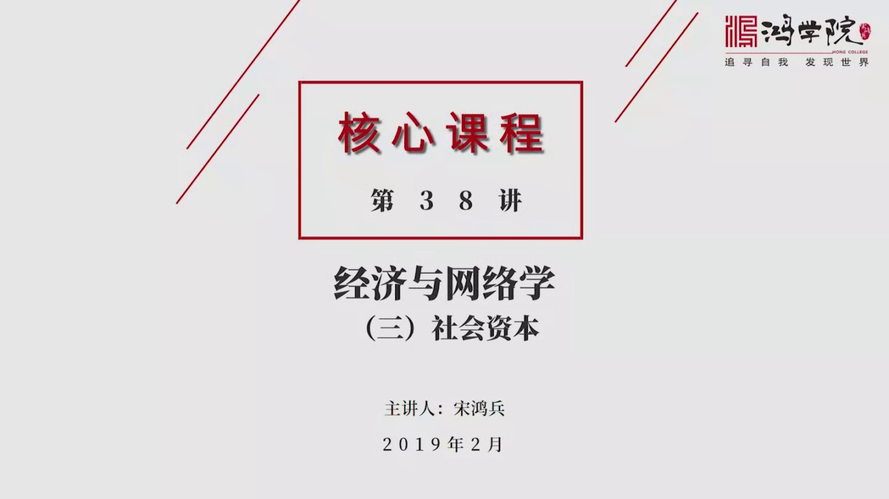

在前两次课程中,我们讲到了,从网络学的角度来理解经济和经济发展,谈到了经济存在于一个网络之中。那么,在经济的网络中间存在着大量的节点,这些节点之间的相互关系,深刻者影响的经济发展。

<strong>All subtitles</strong>

> 在前两次课程中,我们讲到了,从网络学的角度来理解经济和经济发展,谈到了经济存在于一个网络之中。
> 那么,在经济的网络中间存在着大量的节点,这些节点之间的相互关系,深刻者影响的经济发展。

---

### Slide 2

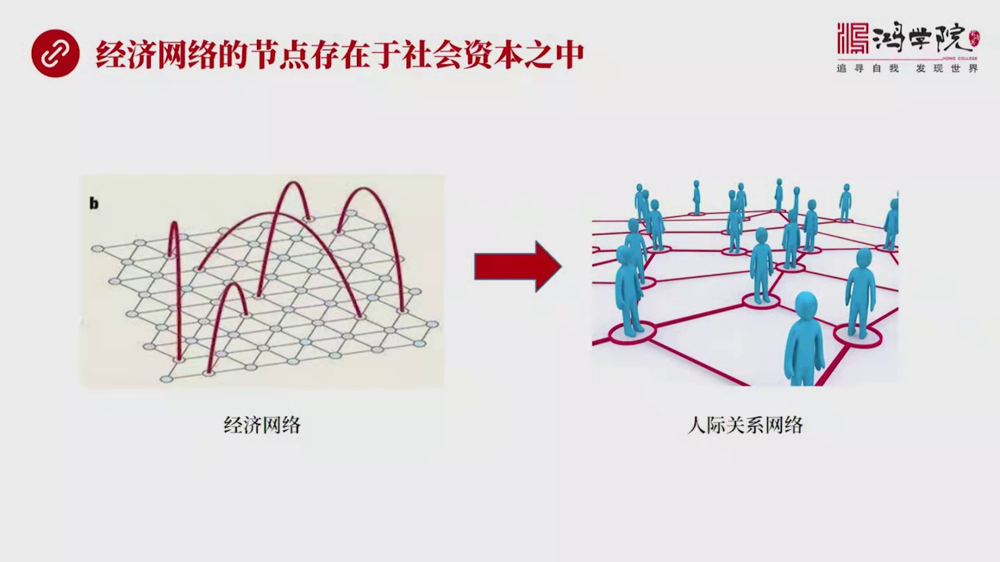

如果我们把经济节点进一步放大,你会看到在这些经济节点,也就是我们前进步中所谈到的企业公司,在他们的背后,把他们放大开来之后,我们会发现什么,其实会发现它是人既关系网。不管是企业内部的,这样了一个人既关...

<strong>All subtitles</strong>

> 如果我们把经济节点进一步放大,你会看到在这些经济节点,也就是我们前进步中所谈到的企业公司,在他们的背后,把他们放大开来之后,我们会发现什么,
> 其实会发现它是人既关系网。不管是企业内部的,这样了一个人既关系网,还是企业内部人员跟外面设惠周边的这样的一种人既关系,都是一个存在于人与人之
> 间的这样的一个网络关系。所以,今天我们就重点来研究一下,在一个区域,在一个地区,它的存在于人既之间网络中间的这些内在的经济资源,如何被调动,
> 用于推动经济增长。我们如果看这个下一頁,这就提出了一个重要的概念,这个概念就是设惠资本。

---

### Slide 3

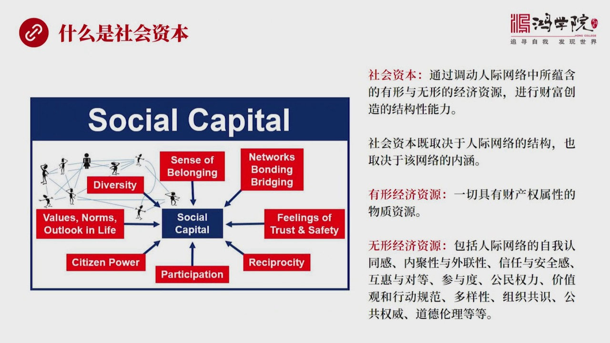

设惠资本如果我们看这张图,你会发现这张图,提炼出了设惠资本的各种属性。首先,设惠资本,我们给它下一个定义,什么叫设惠资本,就是通过调动人既网络中所运藏的那些有形和无形的经济资源,进行财富创造的一种结构...

<strong>All subtitles</strong>

> 设惠资本如果我们看这张图,你会发现这张图,提炼出了设惠资本的各种属性。首先,设惠资本,我们给它下一个定义,什么叫设惠资本,就是通过调动人既网
> 络中所运藏的那些有形和无形的经济资源,进行财富创造的一种结构性的能力。那么,这种设惠资本,它既取决于人既网络的结构,也取决于网络的内涵。
> 中间设计到的什么叫有形的经济资源呢?就是我们所看到的一个区域之内存在的所有具有财产权性质的物质资源,比如说土地,比如说框山,还有各种各样的天
> 然资源,能够被有效的调动起来发展经济,这就是有形的经济资源。那么什么是无形的经济资源呢?比如说,在一个人既网络中间有很多是属于看不见摸不着,
> 但实实在存在的一些明显的特点,在人既网络中会发现,大家都会对某一个群体有一种认同感,这种认同感就是属于无形的经济资源。
> 还有,在这种认同感之下,在网络之中,比如说一个朋友圈,大家都会有一种向心力,我们成之为神内具性,或者叫凝聚力,同时这个网络还跟其他的圈子有着
> 诸多的联系,我们成之为是它的外联性。那么在这个群体之中,人与人之间存在着一定的信任感,在交往之中存在着一种安全感,同时这个圈子还能够提供一种
> 相互了帮助,就是护会和对等。那么大家还共同参与很多,比如说社区的管理,大家的权力,公民权还包括共同的价值观,还有共同的行为规范,比如说怎么做
> 生意,你这个承信是建立在人与人之间的某种规范之上的,如果有人这么做,大家会认为这事是靠谱的,如果有人超出了这个界限,大家就会认为它的做法是不
> 靠谱的,或者没有底线,这就是行为规范。同样在这个网络中间存在着多样性,有些人对某些东西更感兴趣,另外些人对其他的这种话题更感兴趣,这就是多样
> 性,同时大家还会对形成某种组织有一种共识,还有就是在这个体系中间存在着公共权威,轮力道德等等,这些都是人际网络中间存在的一种巨大的潜在的能量
> ,这种能量如果被有效的转化成经济活动,它就能有效的促进经济增长。所以社会资本这个概念,对于经济的发展是有相当重要的促进作用的,我们看下一,社会资本的内部属性,

---

### Slide 4

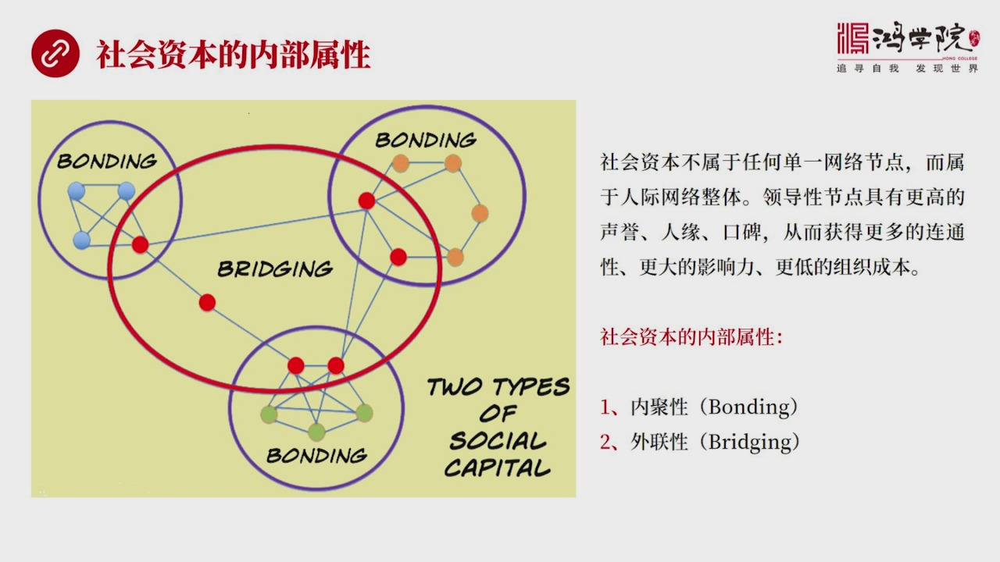

关于社会资本的内部属性,它大致分成两大内,一类内部属性,叫内具性,就是在这个群体之内,人与人之间产生了一种邦定的,也就是聚合力,产生了一种向心力,名距力,人们是靠着这种名距力,你比如说通过学员,通过亲...

<strong>All subtitles</strong>

> 关于社会资本的内部属性,它大致分成两大内,一类内部属性,叫内具性,就是在这个群体之内,人与人之间产生了一种邦定的,也就是聚合力,产生了一种向
> 心力,名距力,人们是靠着这种名距力,你比如说通过学员,通过亲情,通过老乡的圈子,通过各种各样的这种人与人之间的关系,所形成的有一定向心力和名
> 距力的这样一种属性,这就要内具性,从途中我们可以看到每一个自称体系的圈子,都会有大量内部连接,这种内部连接可以通过不同的种类来进行定义,比如
> 说有些是文化的,有些是宗教的,有些是亲情的,有些是上下级关系的,有些是朋友之间的这种关系,它可以通过不同的属性来进行连接,内部节点之间存在着
> 非常有效的大量的内部连接,这就形成了它的一个重要内部属性,叫内具性,同时从这张图上我们还可以看出,在一个圈子之内的某些节点是跟其他圈子相应的
> 节点会有一定的联系,这种联系就是跨越圈子之外,跨越一个人机网络,连接到另外一个人机网络的一些飞线,这种特征,它叫我们称之为是外联性,就是br
> eeding,就像桥量一样,从一个网络中架出一个飞桥到另外一个网络之中,这就使得网络具有着一定的开放性,如果完全没有外部连接,这就是一个封闭
> 的网络,如果中间存在着大量的外部连接,我们称之为它就具有着外联性,从它基本的这两个属性的关系我们可以看出一个道理,就是内部存在着内具性的这样
> 的一种网络,它的对外联系相对是叫少的,并不是每个内部的节点都跟外部有联系,如果每个节点都跟外部有联系,那么它的内具性就会下降,就好像在一个朋
> 友圈里,所有这个朋友圈人都是其他所有圈子的朋友,那么这个内部性,它的内具性就会下降,因为如果你是所有人的朋友,所有人也是你的朋友,你们周围所
> 形成就在内部所形成这种朋友关系它就会变得比较疏远,或者变得不那么重要,如果一个人是所有人的朋友,所有人也是它的朋友,那么其实它就没有真正的朋
> 友,所以内具性和外联性它是具有着一种相反的关系,就是内具性越强它的外联性就应该越弱,相反如果外联性越强它的内具性就会同样变得比较弱,那么在这
> 样一个社会资本的这样一个网络属性之中,你会发现没有一个节点是拥有整个网络的全部的资源,社会资本不属于任何单一的网络节点,而是属于整个网络整体
> ,当然中间有一些突出的我们称之为是领导性的节点,它由于拥有更高的生育,人员或者口碑,所以它可以从这个体系中间产生更大的链接,它跟所有的圈子内
> 的人都认识它,所以这称之为具有着较高的联通性,这些领导性的节点当然也具有着更大的影响力,它们组织内部网络时候它的组织成本也会较低,这就是我们
> 看到了社会资本的内部属性的两个特征,我们看一下也,那么社会资本对经济发展的贡献,

---

### Slide 5

怎么来评估这种贡献,其实在传统经济学,就是所谓古典经济学中间,在理论体系中提炼出了对经济发展起到根本性作用的几个要素,你比如说资本,勞动力和土地,联合作用于经济,带来了经济增长,这是亚当斯密,他们那个...

<strong>All subtitles</strong>

> 怎么来评估这种贡献,其实在传统经济学,就是所谓古典经济学中间,在理论体系中提炼出了对经济发展起到根本性作用的几个要素,你比如说资本,勞动力和
> 土地,联合作用于经济,带来了经济增长,这是亚当斯密,他们那个时代所形成的一个核心观点,在这个中间,把勞动力当成了一个孤立的,所谓理性人的概念
> 就是它存在于一个社会之中,但是每个个体是理性的,每个个体跟其他个体之间是没有,不考虑它的相互关系,当然我们知道,你如果这么去看待经济,那就完
> 全无法说明很多人与人之间产生的这种关系,对于经济发展的影响,也就是说,如果你单独的把勞动力看成个孤立的因素,而不是把它放到群体之中,那么对经
> 济现象的解释能力将会受到极大的限制,那么到60年代之后,出现了新孤典主义学派,他们在这个理论体中间就觉得勞动力这个概念偏弱,就是它只考虑到某
> 种意义上只考虑到体力,而没有考虑到脑力,而在20世纪,我们会看到脑力劳动在经济发展中所做的贡献度是越来越大,所以怎么才能够评估脑力劳动对经济
> 发展所产生的作用呢?这就是要把勞动力转化成一个不光是一个成本的问题,它还是一个创造性的一个圆权,所以人力资本的概念进入了一个这个理论体制中,
> 考虑到人力资本,不把它完全当成成本,而当成生产力的有利的促进因素之一,90年代以来再往后发展,你会发现大家越来越重视一个更新的概念,就是网络
> 群体中所形成的这样一个社会资本,它对经济发展的贡献力,现在越来越多得到了这个理论界的重视,所以我们看到从传动经济学简单的资本勞动力土地,逐渐
> 变成了更强调人力资本,到现在更强调社会资本对经济发展的这样一个贡献,所以现在在各种经济流派中间其实已经越来越看重社会资本,它对经济发展的贡献
> ,大家越来越多得认识到社会资本对于经济发展,它的作用不亚于货币资本,人力资本土地资源科技创新企业管理,这些都叫影响经济发展的要素,而社会资本
> 某种意义上不亚于任何这样的一个要素对经济发展的起到的促进作用,其实我们在现实生活中你可以明显直观的感到,就是在某些地区如果社会资本比较发达,
> 那么做事相对来说就容易,交易成本低,如果大家互信,做生意,就是不用担心扣门外片,那当然你交易成本就会低,经济效率就会高,而我们在评估各个地区
> 经济发展的时候,如果你不考虑社会资本这个概念的话,很多问题就很难解释,你比如说,如果按照传统经济学,我把各种生产要素,把各种经济要素,不考虑
> 网络,不考虑社会资本情况之下,你很难解释中国的这种经济发展跟印度之间的差别,这种差别当然有很多社会制度,有很多比如说政府对经济的这种管理能力
> 有诸多这种要素的影响,但是不同的社会的内部组织形态,对于经济发展它所起到的作用,有没有影响,当然会有影响,不同的人与人之间的关系,当然会影响
> 经济,因为经济活动就是人们每天从事的生产劳动,各种经营活动,构成了经济发展的基本要素,那么人与人之间的关系打交到了这种行为方式,共同的价值观
> 当然会影响经济产初,所以我们在考虑一个地区经济发展的时候,如果完全无视社会资本的话,就不可能对这个地区的经济发展做出有利的解释,这就是为什么
> 社会资本这个概念变得越来越重要,如果我们从一个微观层面来看,社会资本可以明显地影响一家企业的经营状态,你比如说招工,人力资本,H2的人去招聘
> 人,你是通过什么方式来招人,你当然可以通过打广告,你也可以通过朋友推荐,那么朋友推荐这就显然是涉及到一种社会资本的概念了,如果这个社会体区中
> 间存在着比较强的社会资本的话,那么人与人之间的信任成本它是比较低的,所以你如果相信一个人很能干,而这个社会组织体系相对比较完善的话,那么它所
> 推荐的人,你的信任度就会很强,融资方式也一样,那么我们看到中国的很多地区,比如说福建,大家人与人之间,它这个或者企业家区之间,它有大量的亲朋
> 好友之间的借钱融资的渠道,大家很习惯做这种事儿,比如说你可以把自己出去借给某一个企业家的朋友,它会给你打个借条,上面写上多少多少利息,甚至亲
> 朋好友之间,亲戚之间,兄弟姐妹之间也可以发生这种借的关系,大家都是要写只条的,都是要写欠条的,而且要包括利息,那么这种融资方式和,比如说我们
> 的老家四川,在那些其他的地区,大家就不太愿意,或者不太愿意一个放待的停事,作为经济投入,作为资本借出,而且是朋友之间的亲情,我也不能要利息,
> 要利息,人家会觉得这个人没人亲味,所以你会看到由于不同的社会环境,不同的社会环境之间的关系,这种社会资本的性质和形态不同,会导致企业融资的渠
> 道,和它的成本是不一样的,另外管理成本,管理成本如果这个地区的人受过比较好的教育,有比较深的社会传统,那么这个地区的管理成本就会相对较低,而
> 另外一个地区,如果大家没有受过这种训练,而且整个社会比较松散,比较瓦解,那么你管理他们的成本就会较高,其实这种成本是非常影响经济发展的,这就
> 是为什么你在非洲建一个工厂,或者在中东建一个工厂,和在中国印度建工厂,它那种管理上投入,这种投入成本是不一样的,如果这个社会组织比较幻散,现
> 在非洲很多国家,缺少基本的这种严密的社会组织的传统,那么大家行为方式和很多这种价值观,它是支立破碎的,你要想把它组织起来,你得花多少经历和时
> 间,去说服它按着统一的某种行为规范,来进行做事呢,当然这个成本就会较高,还有市场意识,不同的社会资本在不同的地区,这种社会资本会导致,大家对
> 于这种市场意识的有些地方强,有地方弱,比如说在南方地区,它就会比北方地区的对市场明感度更高,大家在思考问题的时候会更多的考虑市场因素,而在北
> 方这种意识就相对薄弱,所以这些方面都会影响一个企业,它的诸多的行为,它的机会和它的成本就会变得不一样,这就是从微观角度来看,那么从红观层面来
> 看呢,到了也一样,因为社会资本能够影响一个地区的营商环境,你在这儿做生意开工厂或者办公司,那就要涉及到跟政府大角道,涉及到跟各种协会大角道,
> 涉及到跟企业科研机构大学之间的各种合作关系,这就是我们看到为什么有些地区,你比如说美国的归股,它的这种政府协会企业大学科研机构的合作程度就很
> 高,包括金融资本,它就能够形成一个有利的产业链条,而且有大量资金的扶持,所以内地房有上千家风头,这些风头又可以找到呈现上万的创业者,在创业者
> 的背后又是几十家著名的高校,几百家科研机构国家县市,然后再往背后,那就是强有利的法律体制,公共权威,政府的配套扶持,所以它就形成了一个非常有
> 利于年轻人经创业的这样一个环境,这样一个营商环境,这个环境实际上就是一种社会资本对红关,这种经济发展环境的一个重大的影响表现,那么你比如说,
> 这个其他地区也一样像以色列的创新模式,中国深圳的创新模式,你会看到每个地区,它的这种创新模式都是跟它背后的社会资本有着非常强烈的关系的,我记
> 得以前我讲到以色列,在红关的有期节目中讲到以色列的创新精神,是来源于他们很多年轻人掉去参军,准备打仗,所以在他们以色列的军内,每个年轻人都要
> 参军,在那儿有一种特殊的训练,这种特殊训练就是在一个小组中,比如说这个小组有10个人,有一个人的指定的角色,就是专门怀疑和否定,九个人拿成了
> 共识,这个人的指定指责就是你要反对九个人,那么你就必须得挑他们的错,找他们的毛病,这就是打破共识的一种培养的一种机制,所以在以色列的它的这种
> 军队的强化训练中间,它也是一种社会组织,它也是一种社会资本,那么在这样的训练之下,你会发现总有人,而且它的指定指责就是说弄,就是否定,为什么
> 否定,它的指责就是找到原因,那么这种长期训练就会使得人们对于现有的,大家公认的很多东西,它会提出挑战,其实这就是创新的一个思想的根源,那么在
> 中国深圳,你会看到深圳的创新环境跟北京环境,它就不一样,北京它是一个社会层级,或者叫金子塔型,比较明显的一个地区,权力,金钱和各种社会关系,
> 是成金子塔型的分布,因为各大机构中央的北京式的,还有部围,全部集中在那,所以它形成是一个金子塔型的分布机构,那么年轻人要想在这样的一个权力体
> 中间,它要想冒头,想要创新,难度自然很大,为什么年轻人愿意到南方去发展,到深圳那个量去发展,因为当年深圳它是没有这种权力结构的,大家全部到那
> 儿都是一个水平级的,不管你什么出身,不管你什么家庭,不管你背后有什么样的资源,但是在深圳相对于中国其他厂市而言,是一个比较公平的竞争厂所,英
> 雄不问出路,只要你最后能够打下一片天下,你就是好汉,社会它就对这种人给予比较高的评价。
> 所以你会看到中国大量的年轻人从四面八方勇相深圳去搞创业,主要源于深圳的社会资本的形成,对于创新这件事情来说,它提供了一个很好的土壤。
> 所以我们不管从宏观层面来说,还是从微观层面来说,这些社会资本对经济发展的明显的影响力,我们再看下一叶,那么在这里我们首先要谈一下这个社会资本,

---

### Slide 6

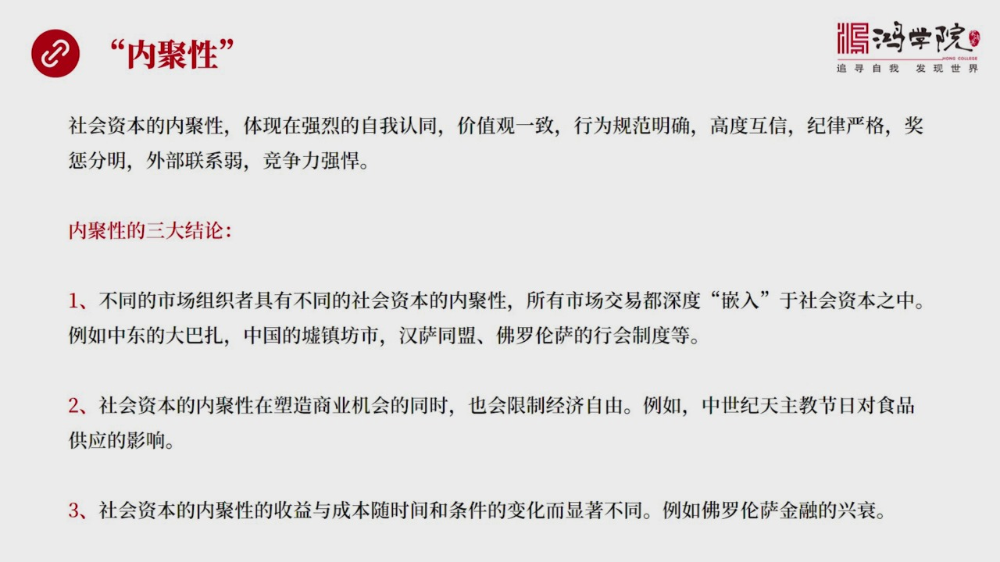

它的内在的属性,我们刚才已经提到了内具性,什么叫内具性,内具性体现在一种强烈的自我认同这个圈子,这个人气关系往,它人与人之间都有非常强烈,我们有一种自我认同,我们是属于这个圈子的,而且价值观是高度一致...

<strong>All subtitles</strong>

> 它的内在的属性,我们刚才已经提到了内具性,什么叫内具性,内具性体现在一种强烈的自我认同这个圈子,这个人气关系往,它人与人之间都有非常强烈,我
> 们有一种自我认同,我们是属于这个圈子的,而且价值观是高度一致的,行为规范非常明确,人与人之间它是互信的,高度互信,而且纪律严格将成分明,在这
> 样一个内具性很强的圈子面,它跟外部之间不是每个接点都有联系,只有一些重要接点才跟外部有联系,所以它的外联性它是弱的,比较弱,而这种群体内具性
> 很强的这种群体,它有一种强悍的竞争力,那么我一会儿再举一些具体的例子说明,我们先说内具性它具有这一些明显的,古往进来你可以参照很多经济发展,
> 发展过程中你会看到内具性它体验在很多方面,在这里我提出了它有三个共同之处,就是内具性体验的三个这种三大结论,第一个是什么呢?我们以前提到了市
> 场组织者概,市场组织者这样一个概念,也就是市场不是一个无组织的随意发生的,没有任何空间,没有任何组织性的,出现在所谓的交换,而所有的交换所有
> 的这种市场交易都必须要发生在特定的时间特定的场所,而且在这样一个场所,在这样一个市场中存在着高度的组织性,也就是市场组织者必须要参与进来,它
> 要规范市场交易中的所有的规则,要对这个市场进行有效的管理,也就是说任何一个市场组织者,它都代表着一种社会资本的内具性,这种内具性,体现在说明
> 一个什么问题,它体现在一种所有的市场交易,这种行为,其实都是深度欠入于社会资本之中,你有什么类型的社会资本就会出现什么样的市场组织者,就会出
> 现什么类型的不同性质的市场交易,这是一个对于社会资本,与市场交易中间的一个新的社交,就是不同的社会资本属性,会产生不同的市场交易的行为,这种
> 市场交易行为最终会影响价格,影响市场的效率。你比如说,在我们去中东的很多地方走,你会看到伊斯兰文化中间普遍存在着大巴扎这样的概念,这种大巴扎
> 是伊斯兰文化中所形成了一种独特的市场交易方式,基本上从北非一直到中东,你都会发现完全类似的一种模式,这种市场交易的行为,这种市场交换了一种行
> 为。那么在中国的情况又不一样了,中国立场发展出来的市场交易行为,就是在相存地区,我们称之为虚证,虚就是所谓的草事,农民定期到某个地方进行交易
> ,而且这种交易时间长了之后,这个地区就变得比较繁荣,以前可能并没有多少房子,后来就逐渐建立了铺面,建立了街道,最后发展成了急阵。
> 中国的阵基本上都是这种草事,或者叫虚事逐渐演花过来的,后来就叫什么什么阵?再大的这种交易中心,后来就升格威线。
> 那么这是从农村交易中间产生出来的这样的一种模式,这是中国比较独特的一个方式,那么在城市中间呢,这种交易又不一样,跟其他国家又不太一样,比如说
> 唐代发展出来的这个访事制度,所以访,比如说108访,西安当时叫查案了,那就是每个访事所谓的居民区,300部就是一个礼仪,这个在这样一个区间之
> 内,用维墙维让居民区是住在里头的,那么除了这个居民区之外,还有事,事当然就是市场交易,专门做商业那帮人被集中在市里面,那么他们化在自己单独的
> 格子里面,所以我们看到长安的这个布局它是其班格的,有些地区是专门的居民区,被围到维墙里头,这些城市交易的这些访事,市场中间它也是被围墙围在一
> 起,所以它是个居民区和商业区分开的,而且商人们全部集中在这些市里面,这位也是有围墙围上,所以两种这种访事制度,它所形成的一个是一个非常明显的
> 有代围墙的,然后每天有明显的一个交易时间,比如说太阳升起了,打开市场的大门,商人们进入,然后开始做生意,到了太阳落山的时候,大门关上,所以堂
> 代的城市中间,至少在前期,基本上没有业势,就是市场是进行高度管制的,居民和市场之间是有一个明显分界线,不允许随意跨越,那么后来,当然我们看到
> 到发展到宋朝,这套体制就瓦解了,接就是这种所谓接道,作为以前作为墙,把大家隔开的地方,这种访的这种墙被推倒了,然后试着这种墙也被推倒了,大家
> 就逐渐融合成一种商业阶,而且出现了业势,晚上也可以交易,那么在这样的情况之下,你会看到商业的繁荣出现在宋朝,特别是到了南宋,达到了高度,繁荣
> 这种程度,这套体制,这套这个市场组织的方法,或者叫形成于中国的这种社会资本,就跟其他国家明显的不同。
> 那么我们以前核心客中还讲到汉萨同盟,汉萨同盟垄断着波罗地海和北海之间的很多贸易,他们就具有着强烈的排他性,就是我要轮断,我要控制,比如说研贸
> 易,我就一定要控制实验的来源,然后我要定价,所以我们看到其实很多英文词汇中间,像英邦斯德林斯德林斯的来源,就是源于汉萨同盟卖的研,它是高度的
> 可靠的,它这个词就是斯德林演化出来的,它这个词根就是从汉萨同盟一半年的纯度,它的高可靠性,获得了这个成乎,那么汉萨同盟,他们形成是另外一套,
> 他们组织体系是一种另外一种社会资本,形成是另外一种交易制度和控制贸易的制度,当然还有我们以前讲到的佛罗伦萨的行为制度,行为也是一种社会资本,
> 它有效的控制整个城市的经济活动,包括后来整个佛罗伦萨公和国,怎么做贸易,怎么做内部的生产,有严格的这种制度管理,行为还有自己的军队,警察和监
> 狱,所以它就形成了另外一种社会资本,那么我们可以看到,其实我们看到所有不同的国家,不同时代都体现出了,社会资本对于市场交易是具有明显的影响,
> 这是一个共性,哪怕到了今天,情况也一样,那么第二个结论,就是社会资本的内具性,在塑造商业机会的同时也会限制商业自由,就是由于不同性的社会资本
> ,它会创造出不同的这种商业机会,但是同时,我创造出这些机会的同时也会屏蔽,或者阻碍另外一些自由经商的权力,除了轮杂,这是一个明显例子,就是我
> 的行为管理染色,那么这些师父要做这个做那个,他按照一系列标准流程来做,但是,我给你们创造就业机会,但是同时也限制了你们,随便去跟其他城市的商
> 人到这儿来做买卖,那是不行的,必须要通过行为的严格管制,另外还有一个例子,就是我记得在威克堂中讲到过,中世纪天主教,他没有很多宗教节日,比如
> 说星期五,包括星期五,他是不能吃肉的,因为耶稣基督,他的这个被定的十字架上在那之前的这个时间,你必须要摘剑,这样的宗教节日在天主教国家,各种
> 各样的宗教节日加在一起,多达180天,也就是半年时间,那么,当然这就会严格的限制,吃猪肉,吃牛肉,吃红肉的这样的行为,因为不允许吃肉,但是可
> 以吃鱼,鱼可以替代肉,这样的一个规定,这样的一种社会资本,他会产生什么样的,他会创造什么呢,创造巨大的鱼的市场,就是嫌鱼,腌鱼,他的市场量,
> 他的市场的消费量非常大,但是对于肉类,他就会产生明显的制约作用,因为一年钟一半,你不能吃肉,要吃肉怎么办,那会受到重罚,像英国,在十五十几十
> 六十几的时候,他法律民文规定,要在宗教的近日中间吃肉,那是会被吊死的,所以我们看到社会资本的内具性,他可以创造给某些行业创造上一机会,但是也
> 限制着其他一些行业的一些发展,这个现象其实一直到今天同样的存在,第三个结论,就是社会资本的这种内具性,他的收益和成本,他是随着时间和条件变化
> ,而明显的不同,某些制度,某些这个社会资本所形成的这种制度,在某些时刻,在某些地方,具有着惊人的效益,能够创造很大的这种收入,但是在另外一个
> 时代,另外一些地区,却会产生完全不同的,非常糟糕的后果,这就是我们核心科中所讲的佛罗伦萨金融的星期,他这照制度,如果放到十三十几十四十几,全
> 部用记仗来完成这个交易的话,他的效率非常高,他的金融的这种能力相当强大,就是在这样的一个时间段,在佛罗伦萨那个地方,以使用他的这个社会资本,
> 他的这个特性可以创造巨大的竞争力,和这种竞争的效率,但是如果放到十五十几十六十几后,你会发现这一套模式就越来越不行了,因为跟他竞争的像安德魏
> 普,像后来的这个阿姆斯特丹,他们进化出来就是完全不同的,我不靠对象了,我就靠这个匿名的交易,属指片,就是指片为核心的,而不是记仗为核心的清算
> 制度,那他的效率远远高于你,特别是在自己那样越大的时候,他效率越高,所以佛罗伦萨人对记仗这种知名,这样的一种特性的社会资本,到了另外一个时代
> ,到了另外一个地区,却完全的丧失的竞争力,这就是辞义事业、毕仪事业。最根本的原因就是,社会资本的内具性,他的收益和成本随着时间变化,他的增减
> 情况特别的显著,所以我们看到资本内具性,他存在这三个共同的结论,关于资本内具性我们举几个例子,就是越强的内具性的社会资本,

---

### Slide 7

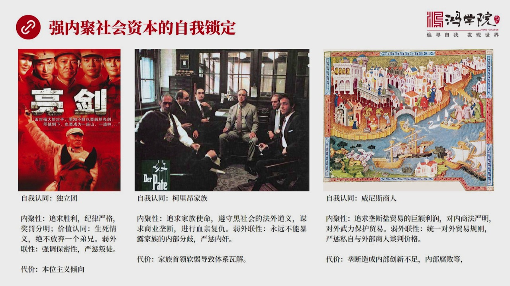

他有这一种越强烈的自我所订的特征,比如说我们都看过一个电视剧叫亮剑,这个亮剑,如果我们刚所说的内具性来看的话,他是具有一个超级强烈内具力的内具性的,这么一个社会资本,因为他也是一个人狱人间的关系,那么...

<strong>All subtitles</strong>

> 他有这一种越强烈的自我所订的特征,比如说我们都看过一个电视剧叫亮剑,这个亮剑,如果我们刚所说的内具性来看的话,他是具有一个超级强烈内具力的内
> 具性的,这么一个社会资本,因为他也是一个人狱人间的关系,那么他这个社会资本特点什么呢,就是首先自我认同感非常强,李云龙是团长,大家都认为我就
> 是独立团的,独立团的每个战士对独立团的这种骄傲自豪和对他的认同感超级强烈。他的内具性,现在哪呢?就是他内部的人狱人间的关系,现在我们是共同追
> 求,就是要打声仗,就是要追求胜利。那么在这个过程中,你会发现他们保持着强烈的这种纪律性,要冲锋的时候,谁也不能不冲锋,要打滚额的时候,大家的
> 一起上,干任何事情统一化一,他的纪律性非常强,也将成封密,将成特别的鲜民,有攻击上,有过必罚,而且他们价值观认同,认同感也非常高,就是生死情
> 义的一种认同,绝不放弃一个地双,电影中很多镜头,我记得有他的手下,李云龙手下有个连长,好像叫张大标,打张过程中,他突然被敌军包围了,然后这个
> 李云龙他们是已经冲出了包围圈,最后他又带着人,冒着巨大的风险杀回去,当时说了句话,独立团绝不落下一个地双,这就是一种价值观的高度能改,那么这
> 样的一个网络独立团,他的外联性怎么样,外联性是比较弱的,因为他强调保密性,在部队中每个战士出门一定要请假,因为怕你跟其他人陌生,因为他的军队
> 行动特别强调保密性,如果你接触人太砸,那保不清你就会说漏嘴,或者怎么样,所以他这个外联性,就是行动自由,或者你随便想跟谁交往,那是不行的,而
> 且要延长判徒,我记得这个电视集中出现了有一个判徒,最后一定会受到眼力的制裁。好,这是内具性非常强的一个典型,他的战斗力的确非常强悍,但是他也
> 会具有的代价,他是个代价什么呢,就是本位主义倾向,非常的严重,就是独立团,我甚至可以强其他团的装备,或者说大家就争强过程中,我只考虑我们这个
> 团的理由,我不考虑其他团的理,这个片子其实非常鲜明的展现出了这个特点,为什么我们很多人看了觉得很爽,但是作为上面的,比如说他这个旅长应该是成
> 功那个角色了,或者刘博成、师长,对于他们来说或者彭特怀这个总司令,他们这个级别人是要考虑权局,假如你这个团,为了抢战类品,你不听招呼不听指令
> ,想干嘛就干嘛,那我这个战友没法打了,我这个根据地没法进行有效的组织了,所以他们对于独立团知道你的战斗力很强,但是他不能够过度纵容,如果过度
> 纵容每个团都这么干,整体的团结性和整体的协调一致就会是要极大的削弱,所以他是具有代价的,这个代价就是本位主义会非常严重。
> 那么我们再看第二个例子,第二个例子呢,教父,教父也是个非常强的,他的社会资本的内具性也非常强,自我认同感什么呢,我们都是这个科粮家族的,那么
> 他在内具性体验在什么,就是追求一种家族使命,就是这个家族要在纽约也好,在读成也好我们要做大,那么他遵守的是黑社会的一个他的一种道义体系,叫法
> 外道义体系,就是我们是存在于法律之外的,但是我们这些黑帮的人也要讲就社会的道义,所以他黑社会的这帮人越是高层的黑社会,越是组织越强的黑社会,
> 越不会胡乱打乱杀,他的组织性和继续性,他是存在着所谓道义有道,黑道也有自己的道义,那么他们所追求的是什么呢,就是商业的一种壟断,不管是在纽约
> ,还是在读成,他都要占壟断的地位,而且要进行血清復仇,血清復仇,比如说你要杀了我家的一个儿子,我就必然会报复,他就会产生家族之间的战争,这都
> 是属于纪律性,而且惩罚性非常强,那么他的外联性就比较弱,就是永远不能暴露家族内部的分歧,我记得在这个电影中有一个镜头,第一节,教父第一节,我
> 镜头我影响非常深,好像就是这个图片中展现这个镜头,这个老教父在跟一个有个独品犯,要求这个科利亚家族提供保护,他要做独品生意,可以分他们多少利
> 润,然后这个老教父就不同意,说这个独品生意我不碰,在这个时候他刚刚表温态,他的大儿子就站出了说一句,站出来就跟这个独犯说,反正你的意思是不是
> 说,我们只需要提供保护,我们就可以分到钱,如果大家注意到这个镜头,你会看到,当这个独犯被送走之后,这个教父就非常严厉地说他儿子,就是说永远不
> 要在外面前暴露家族内部的分歧,因为一旦外人知道你们内部有分歧,他就会失手段,在电影中这个手段就是,他们就采取了刺杀老教父,把他儿子让他儿子来
> 介入独品生意,因为他觉得他的儿子有可能被说动,就会造成致命的伤害,所以在这种内具性非常强的这种社会资本的组织体制下,是绝对不能暴露内部分歧的
> ,而且延程内间,这里面也出了很多内间,有一个人他的宝标,教父的宝标,出卖了教父的信息,最后被杀掉了,还有甚至他们三兄弟中这个老二,他是出于一
> 种无意的,并不是要伤害他兄弟,老三这样的一图暴露了这个老三的行踪,暴露老三的一些问题,然后就倒这老三差点被刺杀,结果,老三当了教父之后,除掉
> 了老二,亲兄弟之间,也会,只要你是叛徒,只要是家族的叛徒,绝不手软,这就是强烈的纪律性,他们代价什么?代价就是,他过于依靠家族手里,如果这个
> 家族手领身体不好,或者他的领导力不足,要么太冲动,要么太弱弱,那么整个这套体系就会土梦瓦解了。
> 那么第三个例子,比如说文英司商人,他们的自我认同感,也很强,他的内具性是填在,追求壟断贸易,他的聚恶力顺常,然后对内,文英司的商法是非常严厉
> 的,非常严明,对外是武装保护压运,所以文英司的艰兑很厉害,他是用艰兑的武力,去扩大市场,战友率去,包括进攻军事产品宝,你会发现,他就是用武力
> 来开拓市场,那么他外联性也很弱,就是他的内部要严格规定,对外贸易的规则,任何的内部的商人,不允许单独去跟别人叹佳格,特别是我们以前讲到的严贸
> 易,在严贸易中间,如果你不按规矩来,立刻就会遭到严厉的惩罚,就是我们只能统一叹佳格,只能有一个我们的商会集团,所有的商人必须按照统一价格来进
> 行买卖,没有任何人能够允许,去跟别人随便叹佳格,这是违法的,而且时候会遭到严厉惩罚的。
> 好,你会看到其实佛洛伦萨也类似好多意大利的这种城邦国国,基本上全是这个思路,他的代价是什么?就是这种内具性,特别强的这个社会,他导致的后果是
> ,他确实造成了高度隆端性,也确实获得惊人的利润,但是他内部很,如果搞不好就会变得很腐败,而且,久而久之会喪失创新的能力,就是你过于依靠这种内
> 具性很强的社会,那么你的成员跟外部之间就缺少联系,缺少联系的话,你对很多心的理念,你就会拒绝,或者无法在内部进行这个,在内部进行推行,向佛洛
> 伦萨机上制度,你这个安特魏普这张匿名制度在这儿他就没有涂涨,因为我们内部的名具力太强,排斥外部的东西缺少创新性,还有,由一个内部的组织长期隆
> 端权力,最后一定会导致腐败,会因此后来也出现了很多问题,所以我们可以看到,这种内具性特别强的社会资本,它是具有自我所定功能的,那么如果是如果
> 社会资本,它会出现自我被削弱,所以这是一个,不是说内具性越强也好,也不是内具性越弱也好,它需要始终,它需要一个中庸之道,好,我们再看另外一个特性,就是社会资本的外联性,这两个都是它的所谓的内部属性,

---

### Slide 8

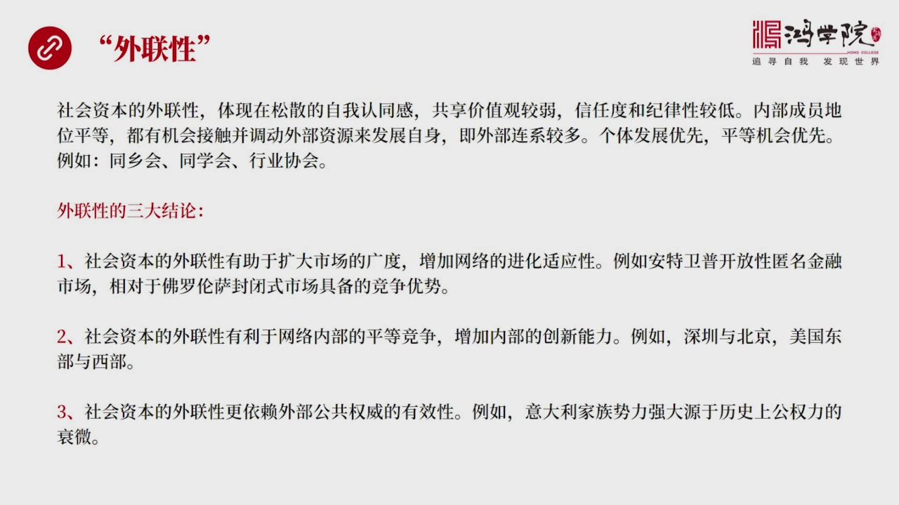

它内部的结构特征是什么,一个是内具,一个是外联,这个外联性是什么呢?外联性呢,它主要特征体验在,它是一种很松散的自我认识,自我认同感,共享价值观呢,也比较弱,大家的信任程度和继续性也不太强,就是不怎么...

<strong>All subtitles</strong>

> 它内部的结构特征是什么,一个是内具,一个是外联,这个外联性是什么呢?外联性呢,它主要特征体验在,它是一种很松散的自我认识,自我认同感,共享价
> 值观呢,也比较弱,大家的信任程度和继续性也不太强,就是不怎么重视,惩罚啊,讲惩啊,它是一种松散结构,那么这种松散结构,它有它了好处,松散结构
> 就是内部的成员,第一位是平等的,在内具性很强,那种网络中间是不可能的,这种是团长,所有人都得听他的,还有班长连长,然后在黑社会里面,在这个教
> 父里面,当然教父是老大,他也是有一个非常严格的等级制度的,那么在外联性比较强的网络中,这种等级制度就很不明显,比如说大家其实都差不多,然后每
> 个内部成员都可以自由的,或者比较自由的,去跟外部网络去联系,或者外部资源来发展自己,所以对于这样一种松散形网络,或者对于这种外联性网络比较强
> 的,这样一种里面的个体,它是比较有利的,而且大家平等,所以我们可以相互竞争,外部联系也比较多,所以它是强调个性发展游线,个体发展游线,平等机
> 会游线,最明显的例子,比如说咱们平常所见到了各种同乡会,四川同乡会,程度同乡会,山东同乡会,还有很多同学会,中学的大学的,还有各种行业协会。
> 在这样的一些,比如说同乡会里头,不存在地位高和低,虽然你是会长,但是你没有权力命令我,大家也都是到这儿来,并不见得是有什么共同的价值观,虽然
> 我们有认同感,都是四川人贴个标签,但是并不是说我们这些人就在一起就一定是为了一个共同理想,要如何如何,没有什么太多的共同理想价值观,然后纪律
> 性也很差,新人度一般,就是这个纪律性就说,不可能说我没有完成这个四川同乡会,不知我认我会受到严历的惩网,会被编打,或者甚至被这个砍掉手指,脱
> 掉脱个不卸土,不会出现这种情况,自然就是长疆成,非常的弱,甚至没有疆成,当然在这种情况之下,你的内部的宁和力肯定是不足的,好处是什么?好处是
> 大家可以自由发展呢?我到这儿来认识这个同乡,认识那个同乡,说不定我们可以做到生意,或者认识个什么人,介绍于什么关系,大家是出于这些资源共享,
> 信息共享的目的,来参加这种无外联性,非常强的,而内部整合力,内具力特别弱的这样的一种组织,这就是代表两种极端,一种极端是教父,是教父社会中所
> 体验那种内具极强的社会资本,另外一种像处长同一会,体验是外联性非常强,而内具性非常弱的这样的一种群体,这是两种不同性质的,不同特征的社会资本
> 。那么对于外联性,我们也可以得出几个结论,第一个结论,社会资本的外联性,是有助于扩大市场的广度的,就是你认识人多了,带来的更多资源,那么可以
> 增加这个网络进化的声音性,比如说举个例子,你这个安特魏普,他的开放性就远远超过佛楼轮廠,安特魏普来的全是莫生人,来自欧洲各地方的商人,全部跑
> 到那儿去做生意,而佛楼轮廠,他们是不接受外部的商人到佛楼轮廠做生意的,或者有严格的限制,那么在这样的情况之下,你会看到安特魏普开放性很强,来
> 的都是莫生人,那么他就具有着更强的,他就能够把市场规模做得更大,什么时候我都要,来之后你就可以把你是市场资源带进来,他把他的市场资源带进来,
> 所以我讲到游泛人来了,法公来了,英文来了,德国人也来了,好,你这市场规模自然就做大了,做大之后大家又是公平竞争,那么在公平竞争过程中就会出现
> 很多金融创新,就是我们讲到的这种票剧的这种交易,所以他具有这种网络,具有着比较强的竞争的事情性,如果这个时代不行了,或者这个特点不行了,我可
> 以转向另外一个特点,因为我内部有很强的竞争力,内部之间的这种内部创新也很贫翻发生,所以我在碰到环境改变情况之下,我自视应的能力就会较强。
> 第二个特点是什么呢,外联性的这种社会资本呢,它是有利于内部竞争的,有利于创新能力的,就是我们刚才也提到了这个问题,比如说另外一个例子就是美国
> 东部和西部,东部地区,美国东部地区就比较像北京,它已经形成了一个老钱和新钱的一个这样的一个竞产型社会结构,就是老家族们控制着东部社会的很多权
> 力,新家族或者新的这些人很难在传统的全家国中,获得足够多的竞争这种机会,怎么办呢,大家去加州了,加州那个地方就是开放的,比较像中国深圳,年轻
> 人到那里去创业,不用受到很多家族,很多社会关系这种制约,也没有什么玻璃天网板,到那你有本事你就创业了,创业之后把公司做到就上市了,然后你就发
> 起来了,所以深圳和北京的这个关系比较像美国的这种西部,加州和东部,这种社会权力比较形成比较久远的这种精塔型的结构,比较类似。
> 那么第三个特点,第三个特点是社会资本的外联性,它更加依赖于外部公务权威的有效性,就是如果说整个社会的主要组成部分都像四川同样会,当然这种社会
> 资本的话,它没有内具力,没有内具力,大家每个人都是一个比较松散的结构,那会出现什么问题?那怎么能够使我们在竞争中获得同等的这样的机会,或者在
> 竞争中定位差不多呢,你必须要靠外部非常强大的法律体系和政府去进行统一的管理,就是我不需要组成一个非常有内具性的这么一个团体,我就能够发展得很
> 好。那么反过来来说,如果你公务权威不够,法律制度政府权威都不够的话,那就一定会导致这种内具性比较强的社团来出现,例如说意大利,意大利我们可以
> 看到,为什么加足意大利特别讲就是加足黑社会,当然我们看到的是教父体验中的这种情况,这不光是出现的息息里,在整个意大利很多地方,他这种加足性地
> 域性都非常强。主要原因就是意大利历史上,从罗马帝国以后,一直到这个19世纪之间,他长年的一千好几百年都出在一种分裂状态,就是他没有一个中央集
> 权,没有一个中央政府,或者说没有一个,甚至没有一个跨地区的这样一种强大的执政力量,他总是四分五裂的,外部势力长期干扰,所以导致一会教皇的权力
> 表达,一会儿神职罗马帝国权力表达,一会儿法国皇力达进量的一会儿,所以他总是出在各大强权,把他执解和分裂,分别控制情况之下,所以在这样一种弱中
> 央,或者没有公共权威基础之上,在这样一个权力之下,那么就会导致意大利人要想,你要想生存要的发展,你就只能靠血清,靠家族,否则你连自我安全都保
> 护不了,你还谈什么发展,所以弱中央,或者弱政府这样的一种社会结构中,一定会出现强家族,强的一种社团,他要有效的迷补公共权力不足,所以这就是外
> 联性,社会资本的几个大,几个大特征,我们看下一,刚才我们谈到是内部的两个属性,现在我们在谈社会资本的外部属性,

---

### Slide 9

社会资本的外部属性也有两个,一个是红关性,一个是微关性,什么叫红关性呢?红关性讲的是这个社会的公共关系,比如说这个政府,它非常强大,或者皇帝非常强大,或者国王非常强大,或者是民选政府非常强大,然后法律...

<strong>All subtitles</strong>

> 社会资本的外部属性也有两个,一个是红关性,一个是微关性,什么叫红关性呢?红关性讲的是这个社会的公共关系,比如说这个政府,它非常强大,或者皇帝
> 非常强大,或者国王非常强大,或者是民选政府非常强大,然后法律制度非常的健全,这导致整个社会的教育成本比较低,然后政府连接高效,然后整个所在的
> 社区,它管理也很完善,所以这种资本,它的红关性,体现在它的一种社会关系这个领域,那么什么叫它的微关性呢?微关性强调就是社会人员之间的私人关系
> ,刚才谈的是公共关系,现在说私人关系,私人关系就是人员之间,人籍关系中间的,比如说两个人之间,它的新人感,安全感,护住精神,倒得规范,行为的
> 一种规则,这些都属于它的一种微关性,强调人员之间的这样一种关系,好,我们看下野,如果我们把社会资本的两个外部属性,加两个内部属性,化分成一个
> 向线图的话,我们会发现社会资本可以呈现为四个向线,就是上面的内职性,外联性,下面的微关性,红关性,这个都是社会资本体现出来的内部和外部,特征
> ,那么我们来看这四个特性之间的向线图关系,在一个社会资本内职性很强的地方,

---

### Slide 10

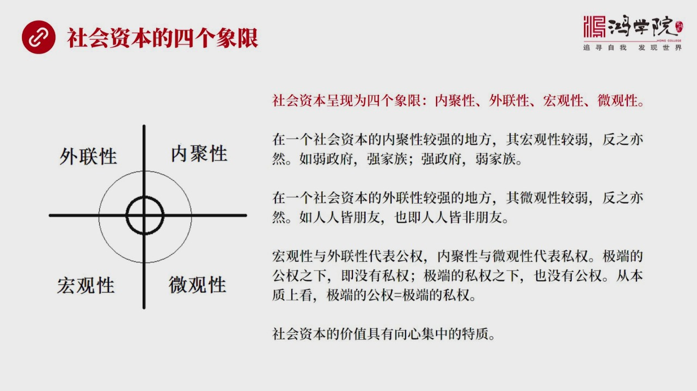

它的红关性就会偏弱,反制也一样,这就是我刚才所说的,若政府的情况之下,就会出现强家族反制,如果一个社会的政府非常强大,它的家族就非常的弱,因为政府强大,你没有必要,还搞一个内部的跟政府对抗的这么一种社...

<strong>All subtitles</strong>

> 它的红关性就会偏弱,反制也一样,这就是我刚才所说的,若政府的情况之下,就会出现强家族反制,如果一个社会的政府非常强大,它的家族就非常的弱,因
> 为政府强大,你没有必要,还搞一个内部的跟政府对抗的这么一种社会组织,所以强政府是会压制这种非常强悍的那种内职性,特别强的组织,就是政府施力强
> 大一定程度,它就一定会消灭黑帮。所以这两者之间,社会资本如果内职性特别明显的情况之下,也就是家族是特别强大的情况之下,它的红关性就比会比较弱
> ,就是公共职能或公共的这些权威就会比较弱。反过来,公共权力如果比较强的话,它这个社会人内聚性,它的社会资本的内职性就会下降,这就是一种相反的
> 关系。同样,在一个社会中,社会资本的外联性很强,外联性很强什么意思?人人都认识,那么它的违关性就比较弱,因为违关体验在人与人之间的私人关系。
> 简而言之,就是如果每个人都是朋友,人人皆朋友,也就是人人皆非朋友,就是,你会看到在社会中永远都存在这个现象,如果一个人它的社会关系特别地广,
> 所有人都认识,所有人都是朋友,这种人往往办不了事,因为这种人,它关于太多,维护这种社会体系,它会付出很多经历,所以你要求它办事,它觉得你也作
> 为它的朋友,但是在它所有朋友中比重太低,在这个权重太低,所以你要找这样的办事是办不了的,也就是说它跟所有人都是朋友,它其实也不是你的朋友,反
> 过来也一样,那些朋友很少的人,如果只有你一个朋友,它会对你非常非常地认真,你要有求于它,它会尽它最大能力去帮你,所以这就是两个相反的概念,当
> 一个外联性很强的一个广路,人人都相互认识的话,人都可以冲击到底的话,那其他人不存在真正的朋友了,所以这就是一个强外联性,它就必然,它的微关性
> 就会比较弱,人与人之间的关系去反而弹幕了,那么如果我们把这个项线图,分成左右来看了,你会发现左边的,外联性和红关性,这代表什么呢,代表一种公
> 权的力量,就是红关性我们刚刚所说的公共权威,外联性就是公共权非常强的情况之下,那么大家人与人之间关系就表平等,那就是,所以你都认识所有人,这
> 个就代表公共权力很强的,内局性和微关性的在右边这个项线,这边代表私权,那么如果我们按着它的左右画分你来想一想,如果一个社会它的公权大到极限,
> 公权大到极限什么概念,就是这个一人之上万人,就是这个只有一个人统治,所有人都是它的成名,比如说在古代皇帝之下,所有人,大家都是一样都是它的成
> 名,在这种情况之下,而且具有绝对权威,那么那私权就没有了,因为公权太大了,我可以任意剥夺任何人的私有权力,只有公权了,那么还有一种情况呢,这
> 个就是极端的私权之下,也就没有了公权,就是比如说我们在地上看,希特勒和德国,当然希特其实并没有具有真正极限的那种所谓的公权力,我以前讲过它受
> 制于很多国内因素,假如我们把这个形象无限的极端化,就好像一个希特勒,就可以管制所有德国,它可以灭掉所有人,如果大家不听的话,它可以有谁面谁,
> 好,在这种情况之下,它是具有着绝对的这种极端的公权,那么任何人的私权都会随意被它剥夺。
> 那么相反情况,就是极端的私权之下没有公权,比如说我们在地上看到了美丽家族,它是一个家族,但这个家族非常的强大,最后变成了整个佛罗伦萨的真正的
> 主人,后来变成了大功绝,好,这就是一个私人的家族,当它旁到一进程度拥有了公权,它就自己这个家族代表了佛罗伦萨,那就是极端的私权之下,公权也就
> 没有了,但是反过来,从本身来看你会发现极端的公权跟极端的私权最后的结果是一样的,最后佛罗伦萨如果是抽象的极端,极端话就想,美丽家族它就代表了
> 佛罗伦萨,好,它也是一人之上,一人管理着所有人,希特勒那个情况把它极端化,也是它之下了所有人,所以极端的公权不就等于极端的私权吗?从本身来看
> 就这么回事儿,所以呢,我们可以看着这四个项线,这极端特征,你单独强调一个,都会是社会资本变弱,甚至变成副数,所以呢,它必须要一种协调和平衡,
> 才能产生最佳的,这种社会资本的效益,也就是社会资本的价值,它具有着天然向心极端的特性,不能在四个项线,任何一个上线走了太远,不能走极端,而要
> 向中心收缩,所以我在图中画的中心这个圈,代表社会资本相对来说更强,更有效,对已经发展更有效,而越往外走,越极端画的这种东西,它就越弱,它是这
> 样一个试一图,为什么画这个试一图,因为要把这四个概念给产生清楚,如果没有一个立体东西的话,说这种关系其实是比较费脑子的,所以我们有时候要借助
> 于图形和形象,你可以直观的了解这些概念之间的关系,我们再看下野,我们讨论这个社会资本的主要目的是,用于解读,

---

### Slide 11

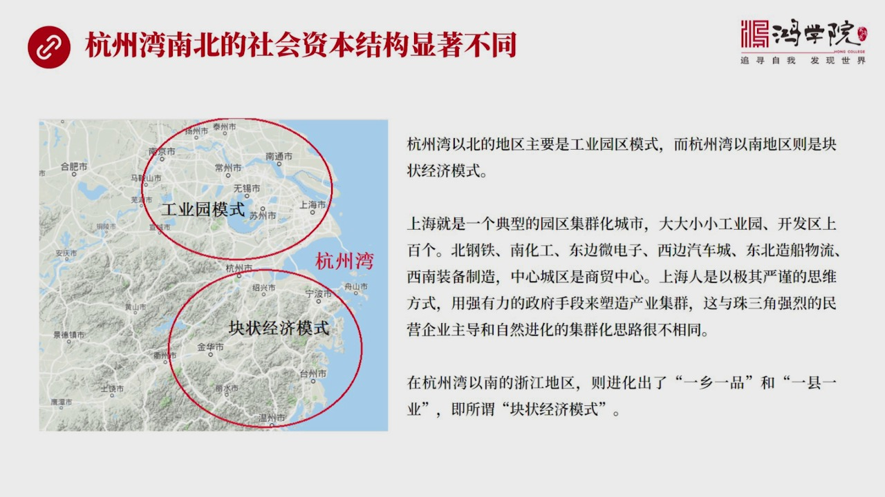

为什么一个区域跟另外一个区域,它的经济发展模式会不一样呢?为什么这个地区它会出现这个特点,那个地区会出现那个特点呢?其实就是要解读它的社会资本,为什么会不一样?如果我们在这场图上,如果我们看这场图,我...

<strong>All subtitles</strong>

> 为什么一个区域跟另外一个区域,它的经济发展模式会不一样呢?为什么这个地区它会出现这个特点,那个地区会出现那个特点呢?其实就是要解读它的社会资
> 本,为什么会不一样?如果我们在这场图上,如果我们看这场图,我是把这个,比如说长山角,大家都是长山角是一个地区,但是,其实我们如果做细致的研究
> ,你会发现长山角地区,其实更准确的词,应该叫杭州湾南北地区,它体验着非常不同的,这种经济发展模式,杭州湾一北地区我称之为是一种工业员模式,杭
> 州湾一南地区,称之为是一种快撞经济模式,当然这都是大家统一的教法,工业员区的模式,体验在哪呢?比如说上海,苏州还有所有北部城市吧,它最大的特
> 点就是,它的这种工业员特别发展,所有的这种企业是被政府非常严谨的部署在工业员区之内,上海工业员好几百个,上百个,大大小小各种各样的工业员,它
> 的这个配置,它的基本的地理配置,还有各方面都是经过严格的仔细的认真,的严谨的布局的,所以你会看到上海,当然也包括苏州工业员,都是经过非常严谨
> 的,非常理性的这种布局,所形成的工业员区,那么它是一种这样的一种思路,所以我们可以,我们可以明显地变别出来,上海或者叫杭州安一北地区的工业员
> 区这个模式,非常不同于杭州安一南的地区,杭州安一南就是包括杭州在那样,这个宁波少星杭州,然后包括周围的,包括温州台州这些地区,你会看到折疆偏
> 南部地区,它们发展出来这种快状经济,却非常不一样,它是形成一块一块一个箱,一个线,形成一个非常密集的某一个专业的,这样的一种产业基群,这种产
> 业基群并不是靠弱,是市政管理人员这个规划,并不是靠非常像市长,市委开会,我们画一个非常精准的一个原子,把各种企业都搬到里面去,它不是,它是一
> 块一块一坨一坨长出来的,它是靠自然进化,自然发展形成的这样的一种经济模式,就像我在前六节目中讲的这种,想大堂证,它所形成的这种制挖业,就是一
> 种典型的非规划型,自然形成的自然进化出来的快状经济,它一年生产80多亿双挖子,它怎么形成的不是政府规划出来的,而是当地了老百姓自己干出来的,
> 所以呢,这两种模式在我们脑子们,就是这个亦夕阳你会发现的,它是非常不一样的,关键是为什么,我们可以明显辨识出来,杭州湾以南和亿北地区,这种社
> 会资本的结构,它形成的过程一定是不同的,这就是很多人说长三角,把它当成一个统一地区,其实你要细分,它不是一个统一地区,它有南北两种文化,杭州
> 湾以北东化和杭州湾以南的文化,所形成的社会资本的结构,是存在显著差异的,那么我们要真正去深入研究,南北差异的根本原因是什么,它是怎么进化出这
> 种差异的,这就需要红学院,包括我们所有同学在内,要真正扎到,我们现在从表面上已经看到了,它的经济模式不一样,但是要想解读这个模式,为什么会变
> 成那样,就需要真正的进行深入的研究,深深的扎入这两片土地,去研究它的历史,研究它的文化,研究它经济发展过程中,它所极电出来的独特之处,它为什
> 么会形成一种,快装了社会资本呢,为什么北方,为什么杭州湾一北,会形成不同的社会资本结构呢,这两种社会资本结构一定是显着不一样的,这是杭州湾南
> 北,我们再看下一个,其实珠江两岸的社会资本也是非常不一样,我们讲到珠江三角州,

---

### Slide 12

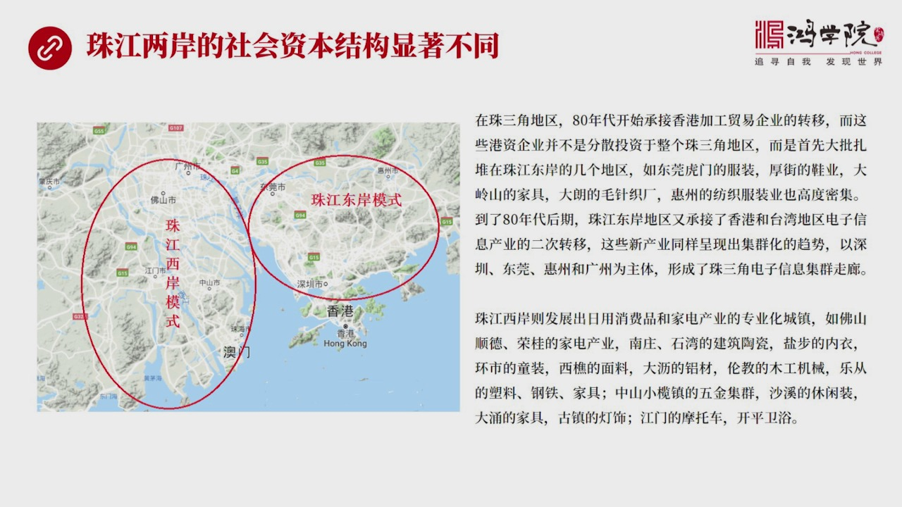

其实东西两岸,珠江的东西两岸是明显不一样的,东岸地区,你会看到它现在主要是电子信息,电子信息走廊,从深圳东管会州到广州,这一线发展起来的一个强大的电子工业,作为它一个非常突出的一个不同之处,而珠江西安...

<strong>All subtitles</strong>

> 其实东西两岸,珠江的东西两岸是明显不一样的,东岸地区,你会看到它现在主要是电子信息,电子信息走廊,从深圳东管会州到广州,这一线发展起来的一个
> 强大的电子工业,作为它一个非常突出的一个不同之处,而珠江西安发展出了大量的专业阵,这些专业阵主要生产,任用消费品和加电,大量的一种专业阵,防
> 止,向顺德、荣贵,它的加电,还有南庄十万的建筑桃瓷,还有颜布的布伊,内伊等等,它有大量的这种专业阵,所以你会看到这两个方向,珠江了东岸和珠江
> 线,它这个经济发展模式,背后的社会资本肯定是不一样的,但是,如果要想深入去研究它,我们就会发现,你必须要深入到广东内部,它的历史文化中间去找
> 原因,所以这需要一整套的研究方法,就是需要深入去研究社会资本形成,它的详细的路线或详细的进化路径,究竟是在哪里出现的分水,在哪里出现的分流,
> 为什么东岸和西安,人们的思维方式不一样,行为方式不一样,观念不一样,做事的方法也不一样,最后就产生了两套体系,究竟这一切是怎么形成的,当然,
> 除了朱江三角洲,除了杭州万南北,中国的每一个地区都可以便是出来不同的社会资本,所以这就要求,我们要想把中国的问题真正搞清楚需要系统去做研究,
> 需要把每个地区的经济发展模式背后的社会资本结构,首先研究清楚,那要研究清楚这个社会资本结构,需要什么呢?需要我们有一套完整的方法论,这就是下业我们看,红旋院的方法论是什么?

---

### Slide 13

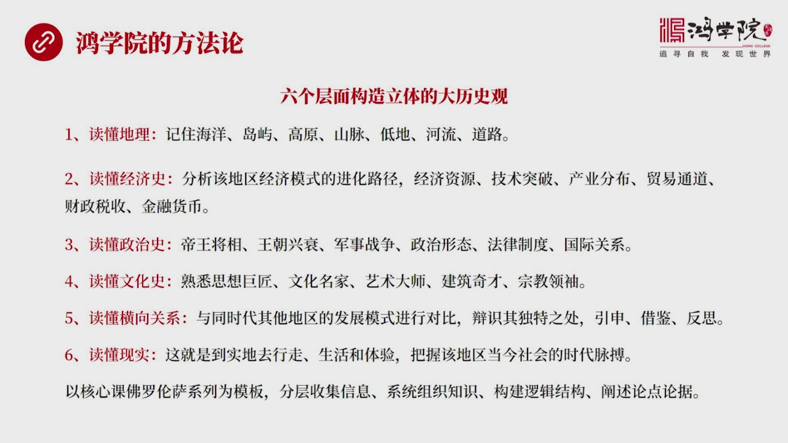

这就是我在核心课,特别讲佛罗文萨这个系列课程中,我提出了一个六个层面,来形成一种大历史观,你是用这种大历史观来指导研究每一个地区,某一个地区它的社会资本形成的路径,为什么会形成这样的社会资本,它的特点...

<strong>All subtitles</strong>

> 这就是我在核心课,特别讲佛罗文萨这个系列课程中,我提出了一个六个层面,来形成一种大历史观,你是用这种大历史观来指导研究每一个地区,某一个地区
> 它的社会资本形成的路径,为什么会形成这样的社会资本,它的特点是什么?那么这个大历史观分成六个层面,首先,从底层往上,最底层要研究一个地区研究
> 什么?要研究它的地理,独动地理,山脉合流,因为不同的地理状况,比如海洋,导渔,高原山脉,地地,合流,道路等等,这些是塑造,一个地区经济发展的
> ,塑造它社会资本形成的一个基本的条件,这是舞台,没有这个舞台什么也谈不上,所以首先要独动地理,研究任何地区,哪怕你研究,比如说你研究长南角和
> 周三角的某一个区,或者一个线,或者一片地区,都需要首先研究它的合流,不仅是现在的合流,而且要明白它的古代,它的流量有多大,它能不能形传这个船
> 能够逆流而上走到多远,它运东西的成本是多大,它载中量的多大,需要详细了解,这就是系统性研究,道路当时的道路情况,载中量,你要是马车还是牛车还
> 是人强,坚挑还是驴,那么它的载中量和它的成本,这些问题都要搞清楚,因为不搞清楚这个东西,你其实独不懂历史,你不知道为什么那个地方出现了战乱,
> 其实出现战乱就是争多利益,那个地方为什么会有利益呢?那就需要非常细的,非常准确的地理信息,需要知道导与海洋,比如说海洋它的产与还是产严,那么
> 这些地方为什么会形成起来?形成起来之后,就会引起争朵,引起这个地区的控制,所以它会影响潮政,潮政你可能我们看到漢武的那个时代,它为什么会出现
> 七国之乱,就是有些地方有些地方的所谓的王国,它拥有巨大的财力,它具有助弊权,它具有海洋的生产和分派的这种权力,当然它的财富就很巨大,你不缺它
> 的翻,它最后就会反过来多中央的权,所以你要想把像当年的五国,像当年的什么怀难国,它的历史你要搞明白的话,你会发现你首先得研究它的地理条件,自
> 然秉付,然后研究它的经济时,这是第二层,要明白它经济是怎么起来的,为什么这个地区,它财富会比较多,为什么它对整个王潮影响力比较大,为什么那个
> 地方会出现战乱,为什么会出现军事争朵,战争等等,所以第二层面要独动它的经济时,就是分析该地区经济模式进化路径,很多人就说我们现在研究,比如说
> 这个长三角地区的经济发展模式,这跟过去有什么关系,当然有关系,为什么长三角地区会出现,两种不同,一种快装经济,一个是工业园区的经济呢,你要仔
> 细去问,当然是人们在这两个地区的人们的思维方式是不一样的,想问题的方式是不一样的,所以它才会形成不同的行为方式,那么这个思维方式怎么形成的,
> 不是今天形成的,也不是最近几十年形成的,是过去数千年以来它所形成的,它就是这个思维方式,为什么,这叫研究历史,研究它的经济时,不是不仅是研究
> 它现在的这个经济模式,而是要倒退回去,你会看到它的每个阶段所形成的经济发展模式,最终是怎么影响大家的思维方式的,为什么大家要这么想问题,而不
> 是那么想问题,所以这就是研究经济模式,这个地区经济模式的进化路径,要倒回去几千年才能逐渐把它梳理得清楚,还有研究这个地区的经济资源,它在什么
> 时代取得什么样的技术突破,这种技术突破产生了什么样的制约作用,使它形成了这样的一种思维方式,还有研究它骨网金来的产业分布,还有研究贸易的通道
> ,还有研究这个地区的财政,税收,包括金融和货币,你把这些底泽东研究清楚之后,第三个层次,你读政治时才能真正理解,帝王将向王朝新帅军事战争政治
> 形态,法律制度和国际关系,它为什么会这么变,根本性的结构性的推动力是源于经济,它会影响到历史,影响到政治时,影响到王朝新帅,那么再往上这个层
> 次就是文化时,当它在文化时,它又是一个更长期的影响,做成更大的一个,就影响时间更长到的一个层面,就是你的帝王将向或者这个王朝新帅,这些东西是
> 可以起伏的,它文化的持续时间就更长了,比你一个王朝要长得多,所以在第四个层次上你要研究这个地区的思想巨降,比如说珠西,城珠这帮人他为什么出在
> 那个地区,或者在这个地区为什么会形成,南宋会形成李学的这种复兴,所谓的如家的思想复兴,为什么会发生在那个地区?特别是它集中于营播少星这一代,
> 包括对杭州影响力也很大,为什么这个地区这种思想它能够生根呢?背后当然有这个地区独特的经济模式,特别是战成到引进到江南地区,所形成的生产模式的
> 巨大变化,使得那个地区需要非常有秩序的组织和管理,否则的话你根本养活不了这么多人口,那么你要形成这样一种严密的生产组织管理方式,就必须需要思
> 想上的配合,或者叫文化上的配合,因为大家要接受这种思维习惯才能够老老实去做事。所以它就会需要一种高度秩序化,高度严谨,这样一套思维体系。
> 你的文化必须是跟这个东西相气合,它才能在这个地区获得巨大的生命力,然后包括江南的世家,世族,它的常年的这种积累,所形成了巨大的家族的力量,从
> 北松开始一直到南松,包括明清那个时代,你会看到江南的家族力量是越来越,它占的这种对王朝领想力是越来越大,而这种家族或者叫这个大的世生这套体系
> ,对于文化的这种影响也非常巨大,所以要了解每个地区的思想巨降文化名家,艺术大使建筑器材和宗教领袖,第五层次就是要独懂横向关系,就是每个地区发
> 展在同时代,或者在不同时代,它这个发展是可以进行模式进行比较,我们可以把佛楼轮杀跟营剥地区,营剥烧行地区进行一个横向对比,你会发现两个地区是
> 有类似之处的,你可以把广州跟威尼斯进行横向对比,就是要挑到它的模式,找到模式非常接近的两个地区,然后进行模式对比,发现为什么威尼斯是这么进化
> 的,而它跟它类似的广州生那么进化的,差别在哪里,这是独懂横向关系,然后从中找到它那些独特之处,然后隐身借鉴和反思,同样,立上可以这么对比,当
> 代也可以这么对比,越港澳大湾区,你也可以跟纽约湾,究竟沙湾、东京湾境对比可以,所以这都需要横向进行对比,而我们这套体系,它不仅是进行当今时代
> 的这个时间切片的横向对比,我们是叠加式的,你是从古道经一层一层叠加上来的,所以当我们进行城市对比的时候,我们的脑子里不仅有中国,不仅有广州和
> 威尼斯这样的印象,而且你还有威尼斯2000多年,从公元应该从600多年,一直到现在应该是1000多年,它的发展历史中所发生的所有变化,还有跟
> 广州同样时间段所发生的所有变化,你要进行一种发展趋势对比,不仅是时间切片的横向的模式对比,还有它的模式发展的趋势,或者叫露进对比,所以当你做
> 到这点的话,你会对很多关键地区的它的历史把握得非常的有纵征感,就是能够看透很多问题,我们如果只进行横向对比,只比一个时代,只举一个时间切片,
> 你看不清楚它的历史的趋势,所以这种就是一种很浅的对比,那么第六是独现时,就是我们要到当地去走,去体验,要把握这个地区当今的时代卖博,当我们从
> 底层到上层走完这六层的时候,每个地区的这种研究能够达到这六层分层的这种研究,然后分层的收集信息,然后进行集中的这种系统组织和知识的架构,你就
> 能够产生一种系统性的认识,这就是有了这种系统性的认识,你再看社会资本形成的路径,再看社会资本这样的概念,你就会抓得非常的准,而且有了这个概念
> 之后,建立了社会资本把这个问题想透之后,你再看现在的这些地区的经济发展和未来的走势,这不就一目了然了吗?因为它几千年的进化路径已经搞出来了,
> 而且它的社会资本的这样一个结构,你也研究清楚想透了,那么这个地区它未来发展它的前景,这不是一万可知吗?所以说我们在研究经济的时候,不能简单地
> 拿几个数据来对比中国和越南,谁都发展前提大,你如果不了解两个地方,比如说广东,中国广东和越南的南方,或者明是跟那个地方进行比较,如果你不了解
> 它的历史文化,根本搞不清楚它的社会资本的构成它的结构,那怎么对比?那你只有几个数据,就不可能进行深入对比,或者说得出的结论往往是付钱的,甚至
> 是错误的,有误导性的。好,要实现这个方法论,我们还需要行动,这就是下业,这就是为什么现在红旋,这个准备在2019年开始,

---

### Slide 14

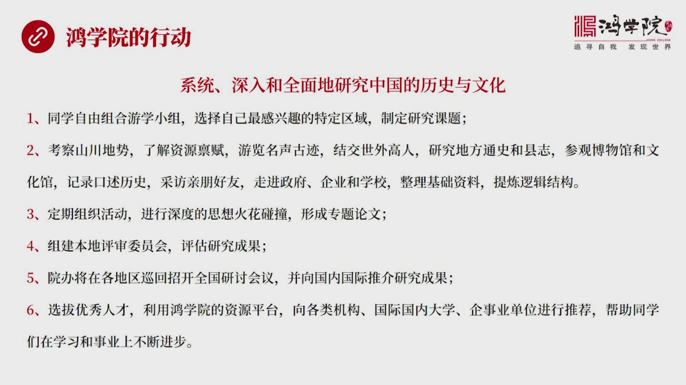

推动一项工作,就是系统深入全面的研究中国的历史和文化。所以我们所提上的这个,跨文化,跨学科,跨思维,然后实现中国的文艺复行,这绝不是一句空话,这要落实到大量的实际行动中,这种实际行动就是我们希望,因为...

<strong>All subtitles</strong>

> 推动一项工作,就是系统深入全面的研究中国的历史和文化。所以我们所提上的这个,跨文化,跨学科,跨思维,然后实现中国的文艺复行,这绝不是一句空话
> ,这要落实到大量的实际行动中,这种实际行动就是我们希望,因为中国服务员之大,历史,纵深,这个跨度之深,然后每个地区的文化差异也非常明显,要想
> 把这套体系真的给研究明白,这绝不是几个人的工作量,甚至不是这个一两代人的工作量,是需要很多代人,而且是需要长间上万的人进行系统的基电,然后才
> 能逐渐的形成对中国整体的系统性的,全面的人士,形成大力时官,所以我们现在红旋做着这个工作,它必须要靠所有人参与,必须要红旋在不同地区的,你不
> 管生活在四川,生活在闪西,生活在东北,生活在江南或者广东,挑你感兴趣的地区,或者你的家乡也好,所在地区也好,所在的县市,甚至乡镇都可以,挑选
> 你最感兴趣的地方,最熟悉的地方,然后制定一个研究课题,比如说我要研究这个地区的社会资本,它是怎么形成的?然后要做第二件事是什么呢?考察,你要
> 了解这个地方,要考察当地的山川地市,要研究它的资源秉付,由蓝名圣古迹,然后这些由蓝名圣古迹着过程中,还要结交世外高人,所以世外高人就是在各个
> 县,各个镇,各个市,里面有很多研究地方同时,和写限制的那些人,那些往往是一些甚至一些妙理的核上,这都叫世外高人,因为他们对这个地区的理解和对
> 很多东西的认识是非常深的,虽然某一个点,只有某一个点,但是那一点足以给你带来巨大起发,要广交世外高人,然后要到当地区参观各种博物馆,文化馆,
> 然后要记录这种口书的历史,因为很多这种人,他的很多观点并没有形成文字,没有写成书,也没有写成文章,所以你要去跟这些人聊,才能聊出名堂来,还有
> 在这个地区的亲朋好友,谁能带你去参观一个什么地方,比较有意思的地方,所以这是我们要了解一个地区,还要走进政府企业和学校,这才能够建立基础材料
> ,然后你把这基础材料限制,然后包括这个线里面各种口述,建了很多高人,自己拍了很多照片,把这些东西进行系统整理出来之后,再提烈他的逻辑结构,第
> 三个工作就是要定期组织活动,这个地区如果大家组成个资源研究小组,我就要研究这个地区的社会资本,大家就可以定期来组织这种讨论活动,不管是面对面
> 还是通过微信,还是通过视频,对话聊天之内的人间都可以,然后进行深度的思想碰撞,因为你已经有一个非常明确的目标,而且你对本相本土或者对某一个区
> 域特别感兴趣,在这个过程中,你会有深度的思考,思调整理,提烈逻辑结构,所以你再跟你的同伴一聊过程中会碰撞出巨大的思想活化,这样就可以形成专体
> 的论文。在这个做这个事情过程中,你会发现,你会发现作为一个比较长沙人,你居然不了解长沙的历史,或者你作为一个志工人,你居然不了解中国严业,特
> 别是四成严业发展的,它中间的很多有意思的事儿,就是你越研究,越会对本相本土产生深刻的认识,也会产生深刻的感情。
> 我们现在人生活了好像都跟过去没关系,很少有人去研究本相本土的这种历史,而你真正开始,琢磨本相本土是怎么发展起来,你会觉得这事儿太有意思了,你
> 会加深你对这个地方,它的一种热爱,也加深对这个地方的理解。然后第四步就是组织本地的平常委员会,比如说长沙地区的,湖南地区的,或者叫湖北地区的
> ,或者某一个省的,然后大家组成评估委员会,专门来评估这些研究成果,然后第五步是愿办在各地区进行巡回的,全国的研讨会,然后在体练这个精整基础之
> 上,形成专业性的一种研究成果,我们可以向国内,也可以向国际上的一些机构去进行推荐。
> 然后第六就是选拔人才,因为利用红学院的各种资源平台,可以向研究机构国内的国际的这种大学,企业、
> 事业单位进行推荐,优秀人才,然后帮助同学们在学习和事业上不断进步,然后根据这样来个目标,我们在2019年和随后的几年,制定了一系列的这种国内
> 文明之旅的形成,这是我们翻下议,我大概列出了关于中国经济史一些

---

### Slide 15

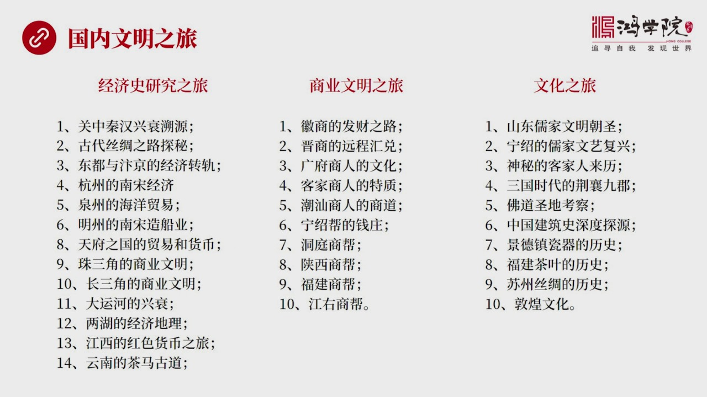

很有意思的研究课题,商业文明史,还有文化之旅的很多课题,大家可以自愿组成小组去这些地方进行考察,当然我们也会,比如说我如果要走这个情汉的观中这条路,那么我也会给当地同学发出通知,大家可以一块节成一个车...

<strong>All subtitles</strong>

> 很有意思的研究课题,商业文明史,还有文化之旅的很多课题,大家可以自愿组成小组去这些地方进行考察,当然我们也会,比如说我如果要走这个情汉的观中
> 这条路,那么我也会给当地同学发出通知,大家可以一块节成一个车队也好,节成一个小组也好,到这些地方去严县进行考察,当然这些我列出只是其中一部分
> ,我相信很多同学会对本乡本土了解了更深刻,所以大家可以提出更多的也就项目,然后可以在网上也好,通过我们公众平台也好,去着急对这个特殊的这个形
> 成感兴趣的人,自愿组织,然后自己安排,也可以愿办也会安排一些形成,可以大家感兴趣的话,一块去到这地方边走边学习,也就是读万件书,行万里路,好,我们在最后总缘一下,

---

### Slide 16

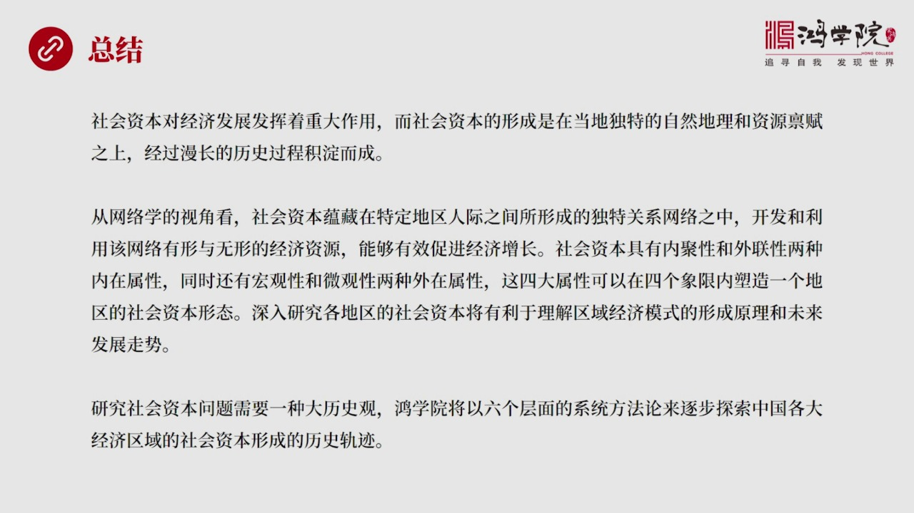

什么是社会资本,就是社会资本,它的重要意义是什么,当然我们通过这个讲座已经可以看到,社会资本对经济发展,它的作用是相当巨大的,而要形成一种社会资本,它是要在当地独特的自然地理和资源兵服质上,经过漫长的...

<strong>All subtitles</strong>

> 什么是社会资本,就是社会资本,它的重要意义是什么,当然我们通过这个讲座已经可以看到,社会资本对经济发展,它的作用是相当巨大的,而要形成一种社
> 会资本,它是要在当地独特的自然地理和资源兵服质上,经过漫长的历史过程,最后沉淀而成。
> 那么从网络学的视角看,社会资本运藏在特定地区的一些人际关系中间,所形成的独特网络之中。
> 开发和利用,这些网络中有形和无心力经济资源,就能够有效的促进经济增长。在课程中我们谈到了,社会资本具有这四大属性,两个外在,我们可以把它画分
> 成四个项线。那么这四个项线,这四大属性可以说塑造了一个地区的社会资本的形态。当然,在现在的经济学理论中间,还没有一种统一的,或者说是标准化的
> 这样一种精确的这两手段,还没有办法对它进行大家公认的这些数据研究,但是我们现在已经可以看到,我们可以提出这样一个思路,怎么去定义。
> 有了定义之后,再想怎么去把它进行标准化,或者叫数据化。这个是红旋未来一段时间,特别是大家深入去研究本乡门土,研究本乡门土的这种社会资本过程中
> ,我们自己就可以体验出一整套研究方法,包括数据採集办法,形成毒有的一种研究方法,到目前为止,国际上是没有一种统一的,大家公认的理论体系的。
> 这套理论体系,当然我们可以提出。所以深入研究,每个地区的社会资本将会有利于理解去经济发展模式,它的形成原理和未来发展趋势。
> 研究社会资本的问题需要一种大力时关,不能靠传统的那种方法,工具不够,思路也不够。我们提出的是一种六个层面的系统方法,以这种方法论来逐步探索一
> 个地区的把它研究经,研究透。然后把它的历史形成轨迹,社会资本的历史形成轨迹给描述出来,而且把现状的看得更加清楚,而且能够看到这个地区,社会资
> 本对于未来的经济发展模式,它进一步的影响以及未来这个地区,它的经济的走势。

---

### Slide 17

今天我们的客就上到这里,谢谢大家。

<strong>All subtitles</strong>

> 今天我们的客就上到这里,谢谢大家。

---
