# 核心课视频-039讲. 社会融资规模（视频） — Clean Slide Notes

> **来源**：鸿学院核心课程  
> **幻灯片**：17 张

---

### Slide 1

社会融资规模关于这个概念我想大多数同学在最近几年以来不管是在电视上还是在媒体上应该是经常能够听见那么为什么我们需要提出这样一个新的概念为什么我们不用MR会不会供应量这样一个比较简单的这样一个概念来解读现在经济活动货币政策租入此类的问题这就是我们今天重点要谈的内容我们现在看第一页首先我们来看在一个社会...

---

### Slide 2

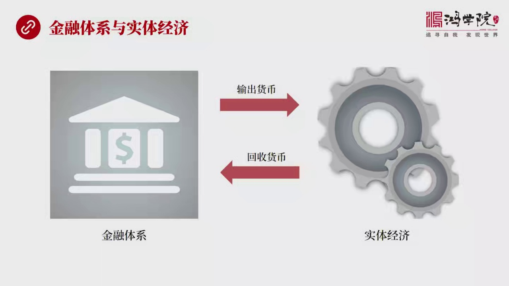

经济部门大致分成两类一类是金融体系另外一类是实体经济我们都知道金融体系应该为实体经济而服务那么两者之间的关系是一种什么样的关系呢就像我们这个图中所显示的这样其实是实体经济从金融体系获得货币然后经过实体经济的运转产生一个增量然后货币再回流回金融体系换句话说整个经济的运转它是需要货币的那么谁来提供货币呢...

---

### Slide 3

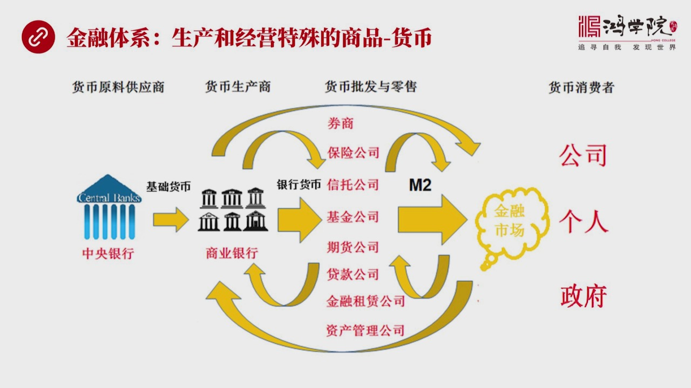

也就是解读什么是金融体系金融体系它的它的意义到底是什么在我看来简而言之金融体系就是生产和经营货币这种特殊商品的这套体系如果从这个图中我们可以把金融体系大概分成几个部分首先中央银行我称之为是货币原料的供应商如果我们大致了解金融货币学的话你会知道中央银行是提供基础货币基础货币供应给了商业银行到了商业银行...

---

### Slide 4

我们会谈到一个重要的观念社会融资规模它的主要目的是什么它主要目的是从财富倉库的内部视角来观察整个的货币金融它的运转为了把这个问题说明白我们再做一个直观的比喻什么是货币货币我们刚才已经说了经济分成两个部分一个部分是创造财富的真正创造财富的就是实力经济这个部分个人公司和政府这个部分是真正进行经济活动的每...

---

### Slide 5

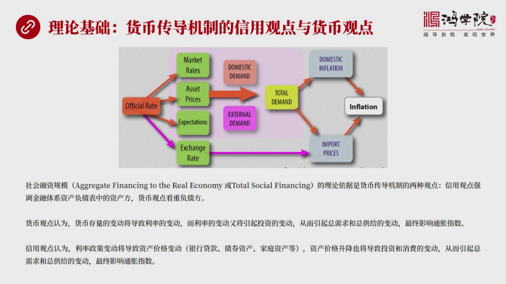

我们刚才听了觉得还有道理通过侵察财富账库的库存我们好像似乎能够知道货币的最终流向和他所发生的效果但是这个玩意儿理论基础有吗其实是有的这个理论基础就是货币传导机制这是一套理论体系在这套理论体中间有两派观点一派是信用观点一派是货币观点所谓货币观点就是我刚才所强调的他关注的是收据流出的收据他是怎么走的也就...

---

### Slide 6

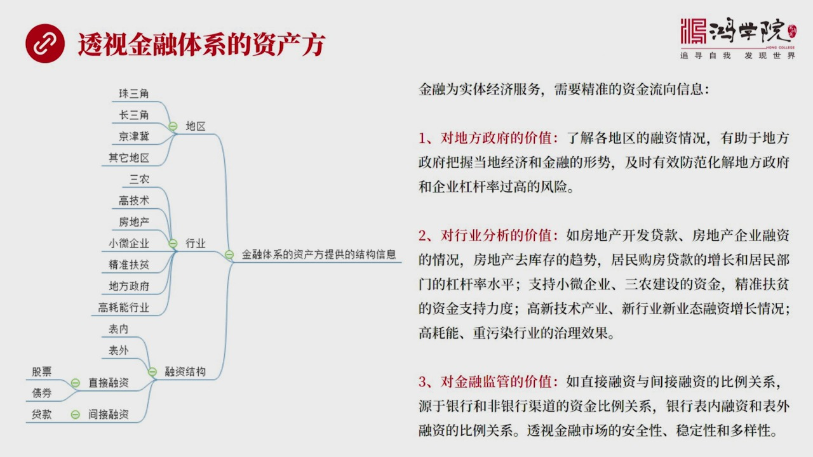

我们把整个金融体系当成一家公司当成一个机构那么它当然有资产和负债负债不用说了负债就来嘛我们主要看资产这个资产中我怎么能够获得更有效的信息呢我们都说金融从要为实际经济服务你竟然要为实际经济服务就需要准确的知道实际经济中间哪一块获得了多少资金当你的货币政策方式变化的时候那么在传统的用MR这种就是用负债端...

---

### Slide 7

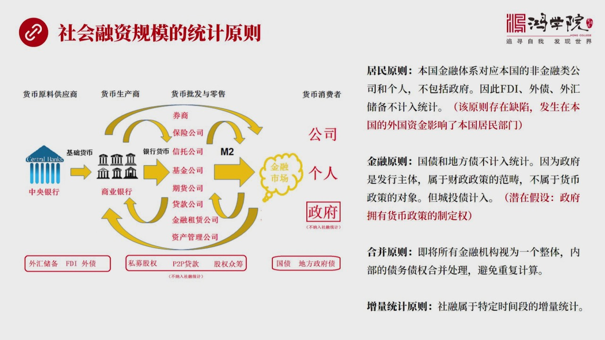

你要统计数值需要一系列统计原则左边这张图呢我画的大家一看会觉得很熟悉其实这就是刚才这张图但是有几个地方不一样这个不一样就是它中间有一些东西是不记入社会融资总规模的那么为什么有的记入有些不记入中间是有一些规则在做约束总体说来吧它大概有四大规则第一个规则是什么呢叫居民原则居民原则指的是本国的金融体系对应...

---

### Slide 8

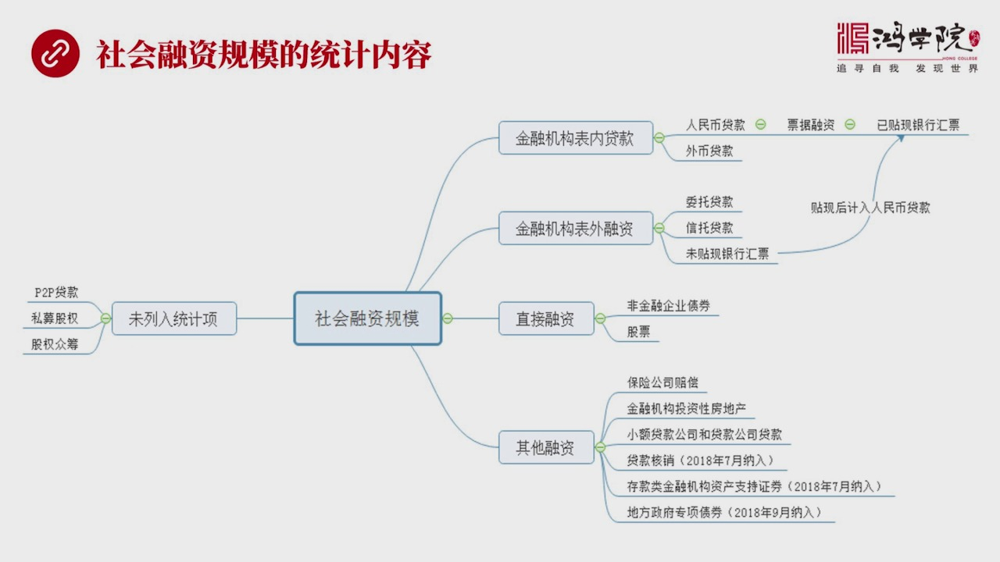

它到底统计些什么东西呢这是我用这个思维导图这样化出来之后大家可以移目了然它大概分成四大类十几个小类包括拿几大类呢金融机构的表内贷款金融机构的表外融资直接融资和其他融资四大类那么在表内贷款中间又分成人民币贷款外币贷款这很容易理解然后人民币贷款中间比如说包括什么呢包括票据融资中间的一提线会票这个金融机构...

---

### Slide 9

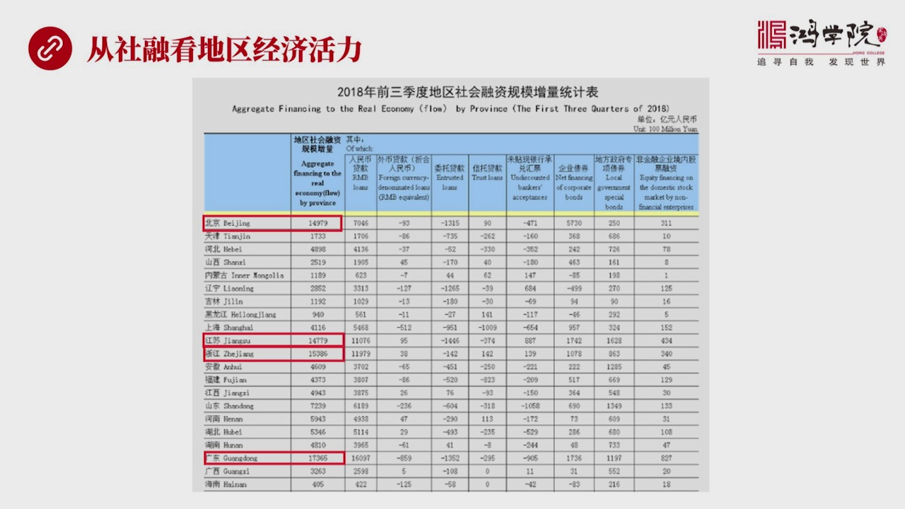

那么从这些数据中间我们谈到了他可以对于区域做出一些判断这就是我们这张表上可以看到比较2018年前三季度社会地区不同地区的社会融资总规模的增量同级表当然第四季度还没有看到这个数据这个数据好像已经出来但是我还没有找到央行网站上提供的是前三季度2018年前三季度你会看得很明显在所有的三十个省份中间广东是高...

---

### Slide 10

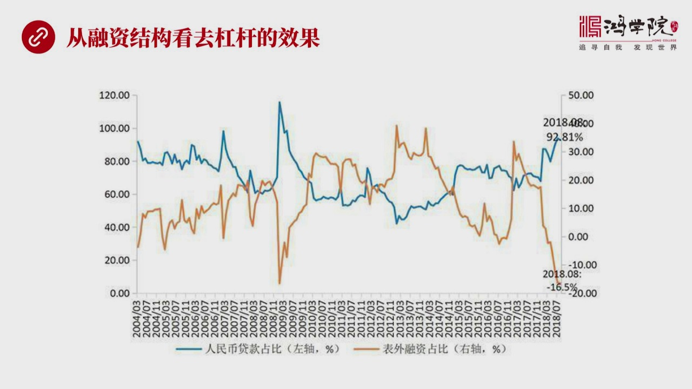

从融资结构上你也可以看出比如说去年开始的区档杆金融区档杆到底发生了都大的效果发生这个效果这个明显还是不明显从这张图上我们可以看到从2017年开始比如说这个黄线代表着表外融资就是那个三样一个是伟头贷款一个是新头贷款还有一个是伟贴线银行匯票这三项表外了你看到它的区线这个黄线是表外的它的在整个社会融资中的...

---

### Slide 11

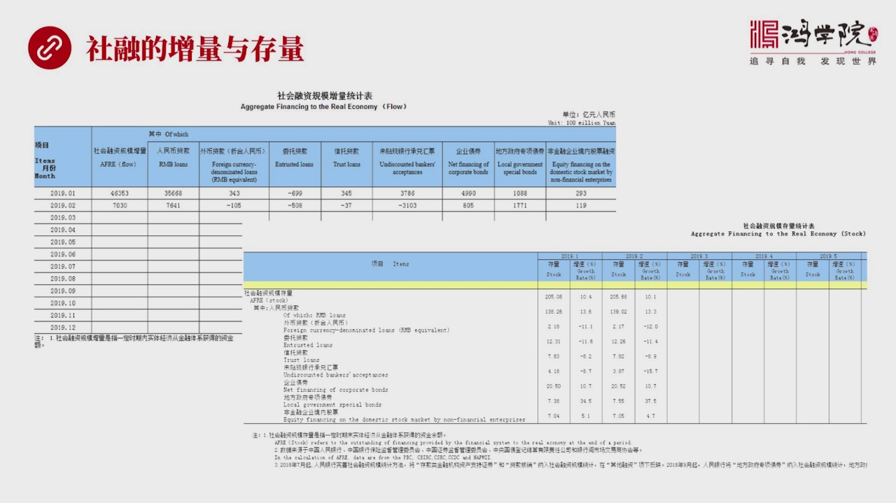

它统计原则中间的一下它既公布增量也公布存量为什么要公布两数就是因为比如我们看这张图的底下这张图是讲的是增量部分2019年1月和2月增量你会看到这两个月它这个变化特别的抖从486000亿1月份2分变成了7000亿我进行环比的时候这玩意儿就很就很废尽因为它波动性太大我没有办法很好的看出它的规律性12月份...

---

### Slide 12

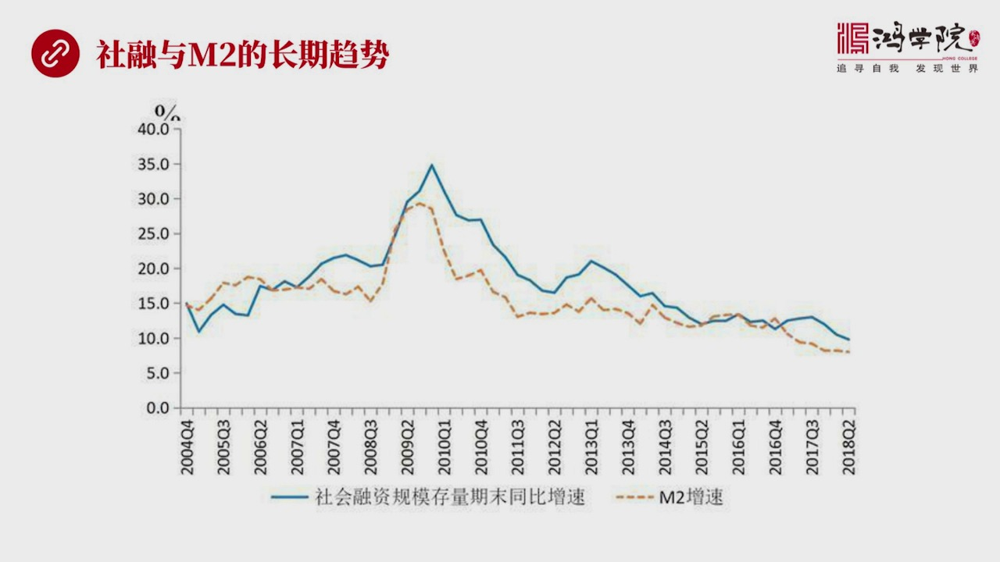

是不是能够有效的代表M2那么如果我们来看两者之间的长期趋势你会看到这两者之间基本上是同步的社会融资总规模就是这个栏线M2就是它就是这个额色这条线我们可以看到这两者的它的变化的趋势大体相同所以我们可以通过社会融资总规模来迷一步M2中间的很多缺陷信息上的缺陷同时呢社会融资总规模也可以带来一些新的新的结构...

---

### Slide 13

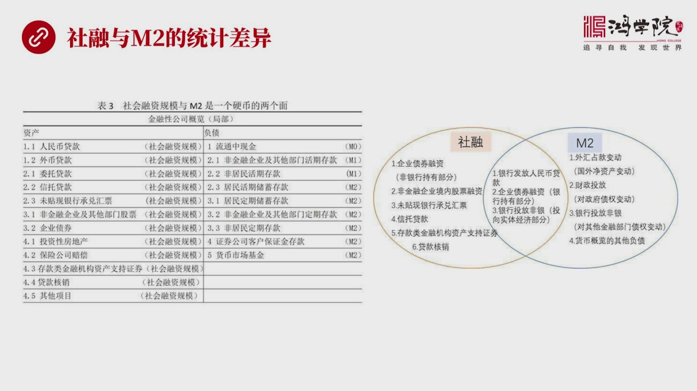

具体说来就是我们看到这个涂中有一张左边这张表这张表中详细来列出了哪些算哪些统计项算社会融资总规模刚才我们已经说到了大概有四个大类十几个小项那么哪些我们再看这个资产负债表这张资产责表我们可以想象成是一张所有金融公司合併成了一家公司消除了中间所有债务债权之后列出了左边的资产右边是负债那么这个右边的负债中...

---

### Slide 14

最主要目的不就是通过金融体系的资产这方面资产端来分析资金向实力经济流动的细节吗这它最主要的功能但是呢这个指标存在了理论和事件上的很多困难理论问题我刚才已经提到了现在再次强调就是第一个理论问题是居民原则僅应于国内金融体系但实际上外国直接投资外债和外国占款等外国资金真实的影响了国内货币的传导机制不纳入统...

---

### Slide 15

到目前为止中国是首创也是唯一统计社会融资规模的国家原因我已经讲了其实我们的思路跟西方国家的思路是不一样的我们认为政府是领导金融体系领导是已经计的西方不是西方比说在美国政府是协调者是立即当协调者它不是领导者既然如此那么金融体系它是自我独立的那么用你这套东西用刚才所说的金融原则军原则就不好使除此之外社会...

---

### Slide 16

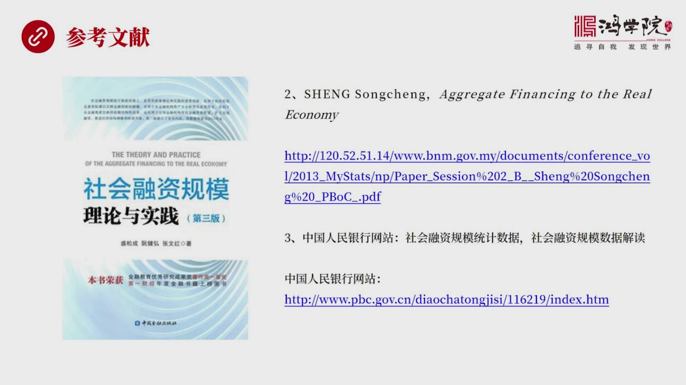

一些参考的资料一个是圣诚它的一本书讲社会融资规模的理论与事件是一篇比较在这个理论中比较全移性因为这套指标就是它手创或者在它领导之下搞出来的然后它有一篇论文就是第二篇发表它是用英文写的一篇关于社会融资对于实力经济的影响了一篇论文我得给了URL大家可以直接去点可以再网上看第三就是关于社会融资规模的那些统...

---

### Slide 17

我们就先说到这谢谢大家收听

---
