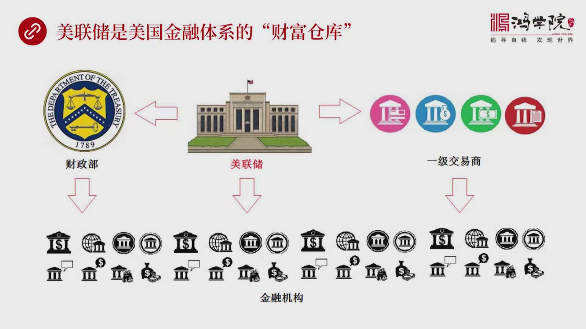
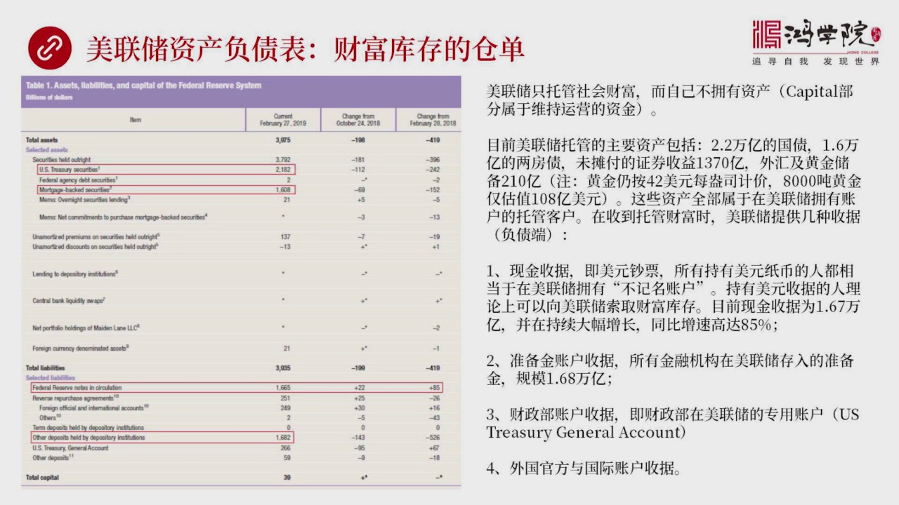
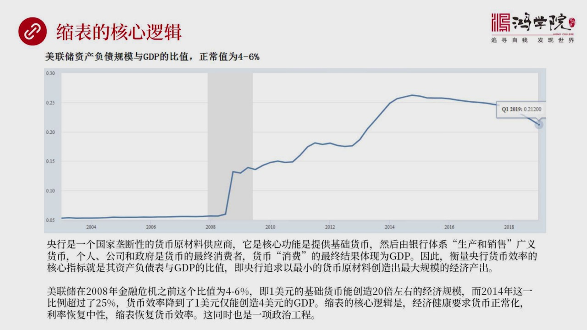
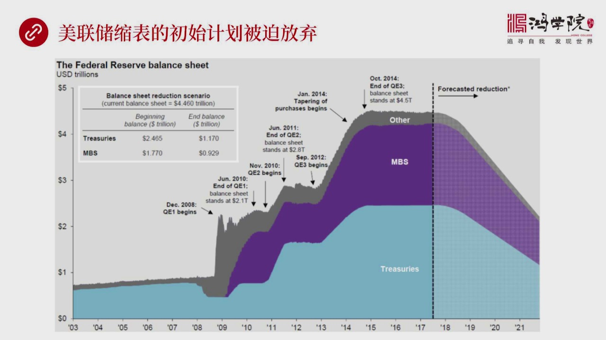
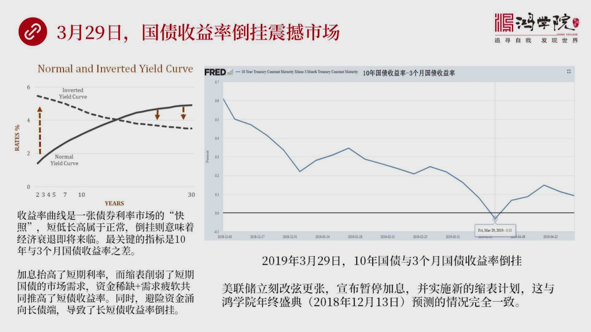
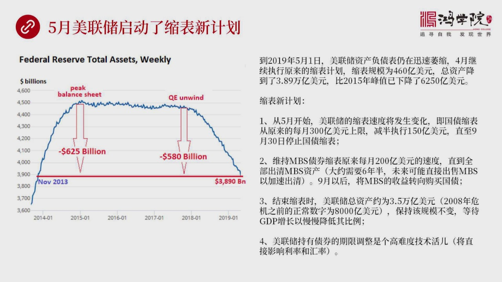
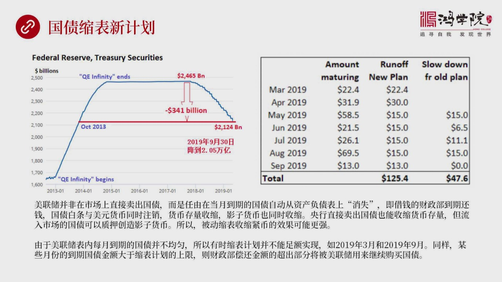
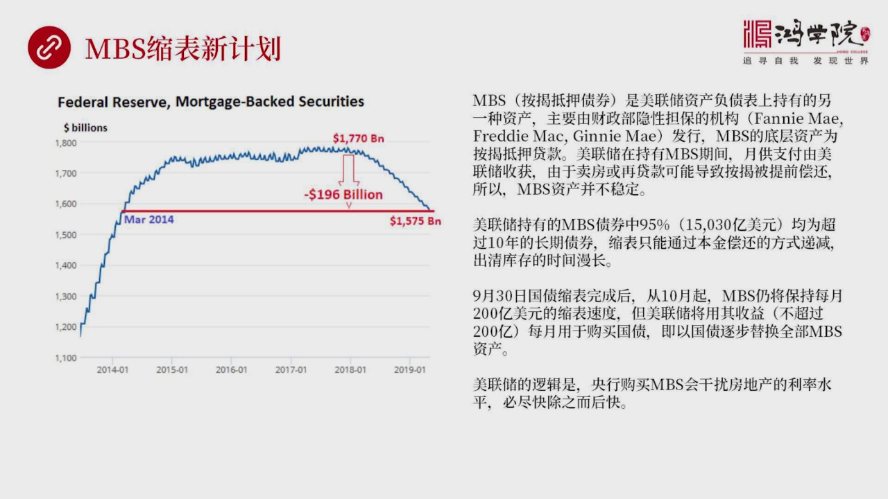
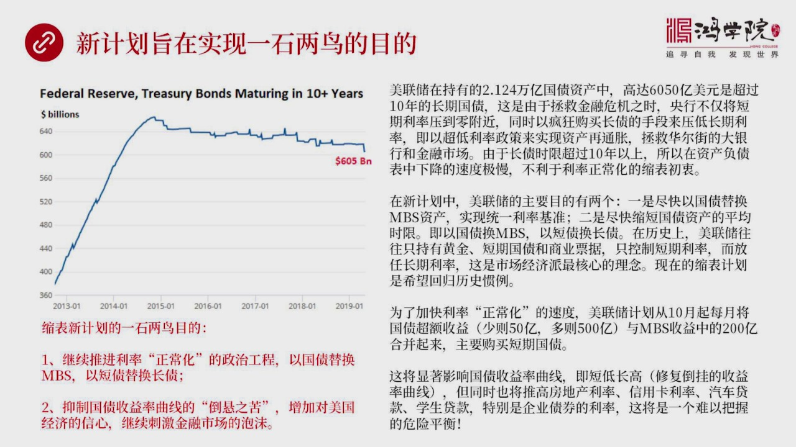

# 核心课视频-040讲. 透视美联储缩表的真实意图与挑战（视频） — Detail Slide Notes

> **来源**：鸿学院核心课程  
> **幻灯片**：12 张

---

### Slide 1

透視美聯儲搜表的真實意圖與挑戰首先我們看第一頁如何看待美聯儲作為一家中央銀行在美國的金融體系中所處的位置

<strong>All subtitles</strong>

> 透視美聯儲搜表的真實意圖與挑戰首先我們看第一頁如何看待美聯儲作為一家中央銀行在美國的金融體系中所處的位置

---

### Slide 2

我們可以看一下這張圖我把美聯儲稱之為是美國金融體系的一個財富倉庫我們在上一屆課講到了社會融資規模這個概念上面有一張圖講的是中央銀行和商業銀行以及所有的金融機構他們構成了一個金融體系那麼這個金融體系它主...

<strong>All subtitles</strong>

> 我們可以看一下這張圖我把美聯儲稱之為是美國金融體系的一個財富倉庫我們在上一屆課講到了社會融資規模這個概念上面有一張圖講的是中央銀行和商業銀行
> 以及所有的金融機構他們構成了一個金融體系那麼這個金融體系它主要的作用就是貨幣這種特殊商品的商產批發和零售貨幣的最終使用者是誰呢最終消費者就是
> 個人公司和政府那麼我們看待金融體系和實體經濟可以用這種兩分法的視角來看那麼現在我們需要把我們關注的眼光放到金融體系的內部放到中央銀行我們這節
> 課主要是從中央銀行的視角來理解它跟金融體系之間跟其他的金融機構之間他們之間的相互關係那麼這張圖上我們從這張圖上可以看出美聯儲是美元的創造者美
> 國基礎貨幣是源於美聯儲的那麼圍繞它會有一系列的金融機構比如說在它的右邊我稱之為是一級交易商這些交易商主要是跟紐約美聯儲銀行是他們之間進行很多
> 交易就是公開市場操作那麼現在的一級交易商大約有23家在歷史上會有一些變化那麼他們的主要功能是什麼美聯儲的貨幣政策比如說宣佈加息0.25個百分
> 點那麼這是在華盛頓的美聯儲委員會做出的決定怎麼才能夠把這個決定變成市場中一個利率的真是反應呢那麼在美國主要是通過一級交易商來做這些一級交易商
> 有一些是銀行像網跟納通像傳統一上的投資銀行比如說高盛美聯那麼這些交易商都在美聯儲紐約銀行開有自己的賬戶那麼當公開市場委員會做出了一個當這個美
> 聯儲委員會做出一個利率決定之後公開市場委員會具體有紐約銀行紐約聯儲銀行和這些交易商來協助來完成這個任務也就是說如果是加息那麼意味著在美國金融
> 市場中的美元流動性會被收縮這是怎麼來做到呢就是美聯儲把自己的債券擁有了國債通過一級交易商賣向市場這就是這個箭頭向下指向的是美國的所有金融機構
> 那麼這些金融機構用現金去購買這些債券那麼這些現金最後會流回美聯儲那麼債券會流向這些金融機構這樣的話整個金融市場中的貨幣就變少了而大家持有了債
> 券會增加這樣的話金融市場中由於資金出現了短缺所以他的利率水平就會相應台高一直到達到這個美聯儲委員會制定的加高0.25%的那個指標為止所以我們
> 看到他是指標是有一定的動態上下浮動了範圍的就是這個原因因為他是市場交易出來的那麼如果想降息這個過程是相反就是美聯儲從市場中通過一級交易商從市
> 場中去收購這些債券收購在券的過程中突出貨幣所以這些貨幣就會流向市場市場中貨幣多了那麼利率水平就會相應下降所以我們看到一交一商主要是為了實現美
> 聯儲的一個貨幣政策他所制定的目標那麼在左邊我們看到還有個美國財政部美國財政部和美聯儲之間是什麼關係呢因為美聯儲建立實驗表晚是1913年才立法
> 1914年才成立那麼在美聯儲成立之前美國財政部是1789年就存在了所以在美聯儲出現之前主要是由美國財政部來監督來監管所有的金融體系所以他始終
> 在中央銀行成立之前始終擔負著監管金融體系的這樣一個重要職能而且財政部他不管是發新國債融資還是做各種各樣的這種金融活動都需要跟金融機構打交道所
> 以他在立上財政部是跟金融體系是有一個密切的關係的美聯儲成立之後那麼有了中央銀行財政部跟美聯儲這件關係就是實際上就是國家的資金因為他代表著國家
> 的稅收收到財政部之後他會把中央銀行作為他存儲資金的一個一個倉庫所以呢兩者之間是有大量的合作關係的美聯儲收到了全國的稅收這個財政部收到全國稅收
> 他需要中央銀行去幫他管理這筆錢那麼當他支付的時候政府花錢的時候大量的資金是從美聯儲是從財政部在美聯儲的賬戶之中直接劃到頂下這些金融機構在美聯
> 儲的賬戶之中這樣就可以方便地進行全國的稅收收集還有政府花錢可以通過這套體系通過金融體系可以很容易的把錢給支付出去那麼美聯儲跟下面所有的金融機
> 構之間的關係呢主要是一個他是銀行的銀行底下這些金融機構在立上主要是商業銀行為主那麼商業銀行都需要在美聯儲開立自己的賬戶開設自己的賬戶那麼美聯
> 儲提供了一個重要服務就是銀行之間資金化轉是由美聯儲的支付體系來完成就是從蒙跟納空從蒙跟納通的一個賬戶中要轉到高速的賬戶中它只是需要在兩個賬戶
> 之間做一個數字加減這個清算就可以完成當然現在金融危機之後大量的金融機構也在美聯儲開有賬戶所以美聯儲它的監管範圍是擴大了所有在美聯儲中有賬戶的
> 人有賬戶的機構都受他監管那麼除此之外美聯儲跟金融機構之間還有一層關係就是貨幣政策中間的準備金率如果說假如我們說美聯儲要求各大商業銀行必須要交
> 10%的準備金存在美聯儲賬戶之上那麼就會收縮他們放待的能力這也是作為貨幣工具的一個主要的一個選項當然除此之外美聯儲還開設有比如說貼線賬戶貼線
> 賬戶就是金融機構需要票據貼線的時候可以找到中銀銀行你的商業票據可以在中銀銀行進行打折直接拿到現金美聯儲持有這些票據到期他獲得一個收益所以我們
> 可以把美聯儲跟金融體系通過這樣的一張圖全面和清晰的展示出來當然美聯儲的功能除了這些之外他還有比如說保護消費者監督金融體系的穩定性等等他還有一
> 系列其他的功能那麼我們在這裡最關注的是財富倉庫這個核心概念我們現在放到第二頁第二頁講的是美聯儲資產負債表這是2019年2月的一張資產負債表

---

### Slide 3

這個資產負債表是什麼意思我們所說的說表其實就指的是美聯儲資產負債的這種擴張或收縮那麼怎麼理解央行的資產負債表在我開用一個非常簡單的概念就是他是財富庫存的倉單那麼要想深入理解的概念我們需要理解什麼叫財富...

<strong>All subtitles</strong>

> 這個資產負債表是什麼意思我們所說的說表其實就指的是美聯儲資產負債的這種擴張或收縮那麼怎麼理解央行的資產負債表在我開用一個非常簡單的概念就是他
> 是財富庫存的倉單那麼要想深入理解的概念我們需要理解什麼叫財富倉庫上一課我們提到了一個大的概念我們在這裡是從金融體系內部從中央銀行這個角度再次
> 來分析這個概念美聯儲他只是拖管社會財富而自己並不擁有資產這是很多人腦子面可能會非常迷惑的一個觀點覺得美聯儲的資產負債表越大他所持有的資產越多
> 但是他是拖管他是別人偽拖他代館的資產這些資產的所有權是屬於金融機構的是屬於財政部的或者屬於其他的外國政府的而不屬於美聯儲從財產的所有權從法律
> 界定來說美聯儲的資產負債表規模再大中間也沒有他自己的財產當然我們從資產負債表中最底下你可以看到他有Captop這個概念就是相當於公司資產負債
> 表出了資產負債之外你還有自己的acquarty這些部分的Captop部分是值得美聯儲用於維護自己的運營因為他是央行嘛他是非營利的他的主要目標
> 不是為了賺錢他只是為了保持中央銀行的基本運作所以他需要有一些資金這個錢可以忽略不盡因為我們看到這個數字很小三百九十億美元跟他好幾萬億的總資產
> 來比錢可以說倉海一素這些錢主要是用於維持他的運轉所以這是第一個我們腦子裡面要形成了清晰的概念美聯儲只是拖管財富他自己並不擁有任何資產那麼現在
> 美聯儲的資產有哪些呢我們先看他的資產方就是他的上半部分他現在主要拖管的資產包括兩點二萬億的國債1.6萬億的兩房債還有一些未貪富證券的收益大概
> 大約有1370億美元除此之外還有外匯和黃金儲備一共211億美元大家可能會覺得奇怪因為美國號稱有八千噸黃金八千噸黃金怎麼才值兩百億美元呢當然遠
> 遠不止這個數這是世界你按著一千二百美元洋斯來估算當然這個數是很大的數但是在美聯儲的資產負在表上這個黃金的估值他的計價可不上這現在的世界而是按
> 著七十年代每行私四十二美元這應該是1973年的黃金價格來計價的1973年之前都是三十五美元後來黃金放開之後有所上漲鎖定在四十二美元來計價所以
> 美國八千噸黃金的估值一共它的價值不過一百零八億美元當然它還有一些一百億美元走遊外匯儲備因為美國不需要外匯儲備它的貨幣直接就是世界貨幣它不需要
> 其他國家貨幣作為儲備那麼這些黃金到底是屬於誰我剛剛已經說了美聯儲自己不擁有任何資產黃金是屬於美國財政部的那麼當美聯儲收到了金融機構還有政府還
> 有各種外國組織和外國的金融機構和外國政府拖管到美聯儲的這些資產大家都要到那存放資產它是個大倉庫嘛那麼他收到人家的資產收到人家財富之後需要給別
> 人開出收據就說這個你的資產方我這兒我給你一張收據那麼這種收據就是美聯儲的負債也就是說從根本來說它體現成一種美元的形勢它大概分成四大類型當然我
> 們理論上說是四大類型其實還有更多但是主要是這四大就是他在美聯儲的資產負債表的在負債方也就是他的收據類型第一種類型是什麼呢就是現金收據現金收據
> 什麼就是美元超票啊任何人拿到億美元的超票理論上來說他可以隨時找到美聯儲去要求對換背後的抵押資產因為我拿到是收據我的資產是放在你倉庫裡的所以所
> 有持有美元超票的現金的人都可以被當成是在美聯儲擁有一個不祭明的賬戶曾經讓萬人大家都有共同的一個不祭明賬戶這樣便於理解也就是說我們可以把一切在
> 美聯儲開有賬戶的人都稱之為是對美聯儲擁有債權的現金是一種特殊的賬戶它是不祭明的那麼這一塊收據發行量有多大呢有1.67萬億美元也就是說流轉在市
> 面上的現金美超大概有1.67萬億美元而且還在不斷的增長你比如說如果我們跟一年前相比同比增長速度高達85%這說明一個什麼問題呢我們很多人認為現
> 在不是無現金社會往上中國人都很少使用現金大家都用微信支付手機支付等等那麼我們看到最近幾年以來持有美元現金的人越來越多而且增長速度同一年前比增
> 加了85%這意味著什麼意味著在一個動盪的世界裡面不管是地緣還是這個經濟體系金融市場都出現了越來越多不穩定的這種狀態特別是在國際上有越來越多的
> 人大家願意持有美元現金你比如說美國如果制裁伊朗那麼伊朗如果手上有現超我就不怕你金融制裁因為我完全不走金融支付體系那是電子化的Swift那是電
> 子化的體系我不走那個我直接付超票人家賣賣的東西一定賣所以持有現金可以從根本上繞過美國的所有金融制裁只要市場上有人收現金收美元那麼他就可以用來
> 購物這就是很多國家在美國的海外就是在美國之外吧在海外越來越多的國家和個人願意持有美元現金第一是為了防止美國的金融制裁第二是現金在很大程度上他
> 很方便比如說軍火犯子或者毒品犯子等等這些人都願意使用現金其實在美國國內也也有越來越多人願意使用現金為什麼因為當你利率已經接近零特別現在這種銀
> 行的這種處蓄利率零點零幾幾乎可以忽略不計那麼甚至未來說不定再來一次金融危機有可能把利率搞成負利率我持有現金就比存在銀行要划算所以在歐洲也好在
> 德國日本和美國其實大家持有現金日越來越多德國和日本也可以容易理解因為德國當年戰敗日本戰敗之後他們的金融體系出現大混亂所以這些國家的人相對來說
> 他金融觀念比較保守不太願意相信政府所說的這種承諾美國人是擁有一種更強烈的個人自主的權利意識就是這是我個人權利就像他近槍為什麼旅境不絕就是因為
> 大家認為我不能完全相信政府因為大家殖民國家而且一開始地廣人西大家住的很分散要出真是出點什麼打結這種事警察趕到你這三五個小時之後那早就該出事就
> 出大事了所以每家美貨必須要有槍來捍衛自己的權利那麼貨幣也一樣所以凡是那種對政府的信用比如說德國日本還有一些日漫高地日漫這些國家和民族都不太相
> 信政府的信用他們營運是有先進那麼在美國呢是由於大家獨立是很強他有一種很強的自我控制這種自己的生活自己的這種命運或者自己的金融支付了很強的自我
> 意識對於隱私權對於這種就是屬於自己權利範圍之內的事它是不含糊的不像中國很多人可能為了一點點應投小例願意去交換自己的這樣的一種屬於個人權利的東
> 西那麼在歐洲和在美國大部分是排斥這樣的一種情況的所以我們可以看到現金的使用量在各個國家歐美的很多國家都在上升那麼除了這種現金收據之外還有第二
> 種是什麼呢準備金賬戶它也是一種收據所有金融機構特別是銀行都在美聯儲開有賬戶那麼美聯儲對大家有一定的準備金的要求除了這個之外大家為了方便彼此之
> 間的清算也會在準備金賬戶上存一筆錢金融危機之後這個銀行在美聯儲存的這個錢超指沒金這個量就非常大了這個量大到什麼程度呢大到1.68萬億美元跟現
> 金的比例幾乎是1比1就是銀行在美聯儲存的這種錢和流轉的市場上的美元超票數據幾乎是1比1可以說現金的規模相當之高第三種賬戶第三種這個收據就是財
> 政部他的在美聯儲的賬戶我們稱之為是財政部賬戶他也算一種收據財政部在美聯儲開利的這個專用賬戶這個賬戶是用來做什麼的呢就是用來跟美聯儲進行結算用
> 來政府收稅拖管資金然後用來政府支付一切開銷都要通過金融機構所以既然所有金融機構都在美聯儲有賬戶那麼財政部在那兒有賬戶可以方便進行支付第四種收
> 據就是外國官方和國際賬戶的這種收據比如說很多國家都把自己的黃金主備存在美國還有很多金融機構在美國要開銀行你也需要在美聯儲中間有你的賬戶這些是
> 第四類所以美聯儲的負債我們可以理解成就是各種不同類型的金融機構外國政府和外國這種金融機構包括持有現金的人他們對美聯儲的倉庫免了所有財富所擁有
> 的鎖取權美聯儲的所有倉庫免了所有財富都屬於這些人這些人分別持有不同類型的收據但是他的性質是一樣的無論拿一美元的超票還是你有一美元賬戶的賬戶的
> 存款他的鎖取權的性質是完全一致的搞明白這個道理之後我們再看下野這是屬於我們對美聯儲對中央銀行的一些基本理解現在我們需要理解下野的就是為什麼美聯儲要鎖表

---

### Slide 4

他背後的邏輯是嗎他不鎖表能不能行那麼我們來看他這個核心邏輯在我看他是一個與一個數值有根本性的聯繫就是美聯儲資產負債的規模和GDP的筆值這個筆值他正常的數字比如說2008年金融以及之前基本上都是4%到6...

<strong>All subtitles</strong>

> 他背後的邏輯是嗎他不鎖表能不能行那麼我們來看他這個核心邏輯在我看他是一個與一個數值有根本性的聯繫就是美聯儲資產負債的規模和GDP的筆值這個筆
> 值他正常的數字比如說2008年金融以及之前基本上都是4%到6%平均下來就5%左右吧這是個什麼概念呢如果我們把央行當成一個就是國家壟斷性的專門
> 負責貨幣原材料的生產作為主要的這種貨幣原材料生產方全國只有一家他是壟斷性的他生產出來這個原材料就是基礎貨幣這也是他中央銀行的核心智能那麼銀行
> 體系在得到的原材料之後在對原材料進行生產加工最後進行批發和零售這個過程就創造了國網一貨幣或者叫銀行貨幣也就是大家在手機上打開你的銀行賺貨打開
> 你的支付寶打開你的微信支付上面那些數字都是屬於銀行貨幣它不是基礎貨幣而是銀行創造出來的貨幣而且在創造過程中會有一個貨幣成熟也就是把原材料成以
> 弱干貝會變成整個國家的一個貨幣供應量這就是大家所說的m2那麼個人公司和政府是什麼呢他們是貨幣的最終消費者他們在拿到貨幣之後不管是銀行的貨幣手
> 機上的貨幣還是現鈔在交易過程中所創造了經濟活動形成的就是GDP所以呢衡量這個中央銀行他這個貨幣他提供了這個貨幣服務質量好不好效率高不高他的核
> 心指標就是看資產負債表的規模央行資產負債表的規模除以GDP這個比值大不大如果這個比值太大說明效率太低如果這個比值很小說明效率很高所以我們簡單
> 來說就是央行追求以最小的貨幣原材料去創造最大規模的經濟產出這是衡量他的效率貨幣服務效率高低的最關鍵的指標那麼如果我們看美聯儲在2008年金融
> 危機之前這個比值多少呢大概是5左右就是8000億美元左右的基礎貨幣維持維持著一個16萬億規模的GDP所以呢億美元中央銀行每創造億美元的基礎貨
> 幣就能夠帶來20倍左右的經濟規模就是1比20說明他的效率比較高但是2014年就是無數測量化寬鬆之後2014年之後美聯儲自戰分量比較誇張到了4
> .5萬億美元的時候這個時候這個比例就是他一下上升從4%到6%上升到了25%超過25%這意味什麼意味著他貨幣的效率貨幣服務效率嚴重下降以前你創
> 造億美元的基礎貨幣能夠帶來20倍的經濟規模現在你創造億美元的貨幣只能帶來4美元的也就是4倍的GDP的產值說明什麼說明效率嚴重下降那麼縮表了核
> 心邏輯什麼也就是現在大家都說美國經濟付出很好既然你經濟付出很好那麼貨幣就要正常化利率還有自戰貨幣的規模那麼這個這就提出了一個問題要既要加息同
> 時要收縮資產出來表讓你這個筆質從25%不斷的下降到2019年第1季度這個數下降到了從25%下降到了21.2%但仍然太高要跟立上傳統比起來要降
> 到5%才說明你降到了位這也是為什麼美聯儲他非常著急地想做這個事急什麼呢急的主要是一個政治上的壓力所以縮表這個問題他的核心是一個政治工程因為美
> 聯儲在金融危機之後所採取了量化寬鬆政策現在在美國國內乃至在全世界各個國家大家都在紛紛抨擊寬鬆貨幣所帶來了一系列毛病比如說自戰泡沫金融市場的泡
> 沫股市的泡沫和房地產的泡沫幾乎是所有國家的人從政治家到學術圈意識到普通老百姓都已經產生越來越強烈的反感特別是造成了社會的兩極分化這個問題幾乎
> 已經造成了各個國家內部的社會上的一種嚴重的政治分裂所以我們看到了美國大學出了很多謠惡子我們看到英國脫歐我們看到了歐洲出現了各種各樣的反對歐盟
> 的這樣的一種民意我們在中國也看到了大家對房地產的高度不滿什麼導致的房價上漲從根本一來說當然是貨幣擴張太快這個問題是全世界普遍擁有普遍存在的共
> 同問題所以這就變成了一個美聯處要面對四面八方的所有人幾乎是人人指著鼻子罵這是一種強大的政治壓力如果你面對這樣的情況無動於衷的話就很有可能出現
> 國會總統再加上民間這些人越來越強大了批判和指責最終就會導致美聯處這幫人的獨立性受到嚴重的挑戰現在我們看到特朗普跟美聯處之間的幾個回合的較量已
> 經看出這個描述來了如果再再不努力去修正或去改善那麼這個問題只會越來越嚴重說不定有一天真會導致美聯處徹底他的權力被收走收回國會這就是他生死存亡
> 的一個政治上的鬥爭他不得不考慮因為他也是一個組織他也有自己的政治上的利益所以他不可能完全憑必政治上這種壓力我稱之為縮表他最核心的就是你不是說
> 經濟復甦了嗎貨幣就應該正常貨幣正常的話就應該縮表如果你不這麼做說明經濟沒有復甦說明你以前搞得貨幣寬鬆全錯了那你存在的價值合在呢這就是縮表的最
> 根本上的這種邏輯我們再看下野如果我們看美聯處縮表他的初始計畫我們會看到這張圖基本上反映他的

---

### Slide 5

資產負責表膨脹的階段還有他在2017年下半年開始11月份開始說我要縮表了他的整個的預期這個資產負責表的預期的下降規模從這張圖上我們可以非常明顯的看到在美聯處資產負責表上主要主要有兩類資產一類是國債一類...

<strong>All subtitles</strong>

> 資產負責表膨脹的階段還有他在2017年下半年開始11月份開始說我要縮表了他的整個的預期這個資產負責表的預期的下降規模從這張圖上我們可以非常明
> 顯的看到在美聯處資產負責表上主要主要有兩類資產一類是國債一類是NBS資產底下證券按節底下證券還有一些其他的規模較小的比如說外國主外比如說黃金
> 主外等等那麼如果我們仔細看這張圖你會發現在2008年經歷一之前是沒有NBS的他的核心資產中間他沒有任何NBS只有國債和少量其他的其他的這種資
> 產為什麼沒有NBS就是因為美國的積准的利率就是央行控制著短期的聯邦 聯邦基金的這個利率是央行能夠通過加稀減稀調整的利率除此之外一個最重要的市
> 場交易出來的利率是國債收益率國債收益率並非是美聯處直接控制而是大家在市場中買進和賣出導致國債的貼面價格不斷的上漲和下跌在國債價格上漲和下跌過
> 程中引發了收益率的變化國債就是我發現了國債我承諾給你5%100億百元的票面價值但是如果是這個價值被炒上去了這個票面價值被炒上去了那麼我收益率
> 就會下降也就是人家102買的國債你才最後拿到5%的回報那我跟我100去買那當然我102人最後拿到了收益就變小了所以他是用國債的收益率來作為一
> 個整個市場交易出來的一個長期利率的積準那麼有國債收益率就夠了他是作為唯一的積準因為在金融市場中國債被認為是風險最低的或者說是零風險如果你信任
> 美國政府還會存在的話那麼他所發現的國債就不會違約所有其他的公司所有其他的這個房地產的按揭抵押債券都有可能違約就是政府不會違約因為他永遠會收稅
> 他有這個法定的權利那麼國債收益率就作為所有市場中的這個美國金融市場中的一個積準利率房地產的價格汽車貸款的價格還有包括信用卡學生貸款的這種利率
> 的價格都會以國債收益率作為一個積準的參照物所以在以前金融危機之前他只需要國債這個一個利率的毛就夠了但是在金融危機之後呢為什麼會增加NBS這個
> 按揭抵押貸款就是他同時繼續控制一個長債的就是長期國債的一個積準利率同時要壓低房地產的利率只要政府不斷的只要美聯儲不斷的印鈔票去買這種按揭抵押
> 貸款的債券那麼就會是房地產利率被壓下來這樣的話會使美國的房地產盡快的復蘇從而出現他最希望的通過貨幣政策來時資產出現再通脹資產價格漲上來金融機
> 構就會面於破產因為資產價格上漲了然後老百姓就有錢去花了因為房價漲回來了感覺財富效應出來了這就是為什麼他有NBS那麼按照他的出使計劃來看他的基
> 本思路就是要縮表怎麼說呢每個月國債要亞縮就是國債要縮表300億NBS要縮表200億也就是每個月大概總共是500億的收縮的規模那麼他們的一個積
> 準計劃就是這個我們看這張圖上有個表這個表就是代表了他們的一個縮點計劃出使出使值比如說美國國債是2.464.5萬億美元那麼到了結束的時候他應該
> 降到1.17萬億美元NBS應該從1.77萬億美元降到0.0.929萬億美元這是他的一個基本的計劃就是縮表我們要達到這樣的目標但是我們看到這個
> 計劃最終在3月份被推翻了美國宣布展廳加稀同時宣布這個縮表計劃要發生調整推出這個新的計劃這個新的計劃是什麼呢我們來看下一頁首先來看他這個為什麼會終止這個原來的縮表計劃

---

### Slide 6

我覺得在這個過程中間3月29號這一天出現的事件是個決定性的事件也就是說在這一天出現了國債收益率突然倒掛這個事件嚴重震撼了全球金融市場為什麼收益率倒掛會震撼金融市場呢我們要看下左邊這張圖左邊這張圖談到了...

<strong>All subtitles</strong>

> 我覺得在這個過程中間3月29號這一天出現的事件是個決定性的事件也就是說在這一天出現了國債收益率突然倒掛這個事件嚴重震撼了全球金融市場為什麼收
> 益率倒掛會震撼金融市場呢我們要看下左邊這張圖左邊這張圖談到了事就是在一個正常的市場就是這個債券市場中大家都在買賣買賣交易交易出來那個價格債券
> 的價格最後會決定這個收益率在市場中有各種類型的比如說有3個月的國債有1年7個國債有2年3年5年也有7年10年30年的國債這些不同品種的國債一
> 起在市場中交易那麼如果我們在某一個時刻趴給他拍一張快照那麼你會看到在每個實現上在每一種類型的3個月6個月還是1年2年5年10年30年在每一個
> 這樣的一個這個類型的債券上都會出現一個那個時刻特有的收益率如果我們把這些點連在一起你會看到一條收益率區限就是我們看到的這個黑實現所代表的收益
> 率區限我們會看到月往左邊這個期限月短月往右邊期限月長最長的30年最短的比如說3個月好如果出現這樣一條區限的話你會發現它的基本規律是什麼呢就是
> 月短的這個月短期限的債券的收益率越低越長的越高大家想這完全合夥情侶為什麼因為我如果買的是一個3個月的國債那基本上沒有什麼太大風險3月是那美國
> 政府不會倒台所以我認為我這個風險極低既然風險低當然市場跟你的回報也低也就是收益率偏低如果我買30年的國債誰知道30年之後會不會出什麼大問題所
> 以你買了欠月長收益應該越高這就是短低長高這是屬於正常情況但是有一種情況也就是出現了相反的這樣的一種這樣的一種態勢短期收益率往上大幅台升就是我
> 們看到區限所代表的這個收益率倒垮了這倒垮什麼意思呢就是短期國債的收益率高於長期國債收益率這3個月你得到了回報居然比30年還要高這不是寫了門了
> 嗎這種現象往往預示著經濟危機經濟衰退即將在一年左右的時間出現在二戰以來吧美國一次經濟未至終吧之前吧都會出現這種現象應該說接近百分之百的準確性
> 只有一次他這個沒有倒附數但是也非常接近所以這個指標被收益率這個倒垮的指標被金融市場的人被這種不管是學術界還是新中市場還是政治上的這些人普遍當
> 成是一個浴室經濟衰退即將來臨的一個先導性的指標而且極其準確只要一出現所以對倒垮那麼意味著經濟危機經濟衰退即將來到為什麼會出現這種現象呢因為大
> 家如果感覺到經濟危機即將來臨的話那麼大量的資金就會勇向長期債券因為長期債券我覺得這可能未來好幾年之內經濟都不好所以我要去閉鞋所以大家都去搶1
> 0年30年的國債就會把他的價格給抬高同時把收益率給壓低那麼短期資金就會相對變少相對變少之後那他的價格就會下跌收益率就會上升這就會導致收益率區
> 限的一個倒垮也就是當人們非常不看好經濟潛艇的時候大家都願意把錢放到長期債券那邊而不願意配置短期短期債券到了也很簡單就是你今天買的是一個好像看
> 似比較高的短期債券的收益率但是明天後天每天出他肯定會降息呀他一降息之後你就只賺了三月的錢那時候你再去買長期債券人家都沒了或者這個價格都炒得很
> 高了你就亏了所以這種情況之下往往會出現資金向長端流動短期收益率抬升那麼這一回縮表這個事還有加息他就導致了收益率到關什麼原因呢比如說加息吧加息
> 明顯就是短期的時候益率會抬升因為市場中普遍短期的利率隔夜差距率如果上升之後資金就難借了嘛資金變少了資金變稀缺了所以短期收益率會被加息這個事情
> 抬升也就是我們看到這個圖實現的最左邊會往虛線那個方向運動往上抬升同時長期的同時美聯儲的資產出來表中由於你持有的美國國債在很長很大的範圍之內在
> 很大的規模之上他都是短期的債券縮表意義什麼呢就是縮表等這些債券到期之後他就自動失效了自動退出了自動退出呢美聯儲如果縮表他又不能再繼續買進這就
> 會導致美聯儲以前作為美國國債第一大購買者的第一位就沒了他他就從買家退出了那麼他本來是第一大買家他如果退出就會導致對短期國債需求的下降意義方面
> 是資金短缺意義方面是對短期國債的這種需求疲軟這兩者加在一起就自然會推高短期國債的收益率這就是我們看到的這個實現就會向虛線方向運動就抬高了抬起
> 來了同時呢由於大家看到這個這個虛線越來越倒掛這個趨勢越來越明顯本來是一個拋物線結果後來逐漸拉平後來變成一個反向了就是倒掛了那麼資金在看到這個
> 趨勢越來越明顯的時候就會判斷經濟衰退即將來臨所以大量資金就開始向長端運動把右邊這個實現就是實現的最右段往下壓左邊往上抬右邊往上壓就會出現收益
> 率到轉收益率出現一旦到轉之後就會強化它會產生一種自我強化的效應大家就紛紛開始在股票上狂拋在金融市場上拋售債券股票上拋售股票等等這就會帶來經濟
> 危機之前的股票大跌金融市場混亂這個時候大家就更加相信衰退即將來臨這就變成個自我強化的惡化過程這一天也就是2019年3月29號我們看到10年國
> 債和3月國債收益率出現了盜貨在這個圖上就是這張圖是什麼呢是10年國債收益率撿去3個月國債收益率的它這個差值的曲線這個差值的曲線如果跌到了領以
> 下出現了富術意味著3月的國債收益率高於10年國債收益率也就盜貨了這一天出現在2019年3月29號我們注意到其實美聯儲就是在3月份會議的時候他
> 已經看到這個曲線很明顯了做出的立刻改權增張停止下息然後實施新的縮表計畫我記得我們在紅學院的年終勝聯那是在2018年12月13號的時候我當時做
> 了做了一個預測3張圖第一張圖是比較10年和5年的收益率盜貨情況還有一張是比較10年和2年還有一張比較10年和3個月當時我就說10年到5年這個
> 盜貨是一種爭照10年到2年更有說服力10年到3個月10年和3個月一旦出現盜貨美聯儲必定停止下息必然出現他這個縮表這個東西的停止現在如果大家有
> 興趣的話可以回過去看一下我們當時的這個PPT還有這個視頻其實當時我們看到的這個情況或者說推測這個情況跟實際發生情況是完全一致的也就是這個情況
> 一旦出現10年和3個月一旦出現盜貨美聯儲立刻他就得變逛立刻就會停止下息然後縮表計畫改變我們現在看下一關鍵是他這個5月份準備開始新的美聯儲的縮表計畫他這個計畫

---

### Slide 7

到底什麼樣這個是個什麼樣的計畫我們如果先看左圖我們可以看到美聯儲的整個自然分裁表的變動情況也就是從高峰期2014年我們看到高峰期達到了一個45000億的這樣的頂峰期自然分裂表的規模也正是在那個時代在那...

<strong>All subtitles</strong>

> 到底什麼樣這個是個什麼樣的計畫我們如果先看左圖我們可以看到美聯儲的整個自然分裁表的變動情況也就是從高峰期2014年我們看到高峰期達到了一個4
> 5000億的這樣的頂峰期自然分裂表的規模也正是在那個時代在那個時段吧2014年7月我們第一堂核心課講了就是美元環流反轉所以美元環流反轉就是他
> 這個自然分裂表擴張達到了極限然後接上下去就開始掉頭向向就開始尾縮了這個尾縮的過程就會引發美元環流的變化當然最終會導致匯率利率各方面情況都會出
> 現相應的變化那麼在美聯儲到2017年的10月開始真正縮減的時候可以開始退出了自然分裂表開始縮減了我們會看到從那個時候依照現在美聯儲縮減的規模
> 自然分裂表縮減的規模達到了5800億美元5800億美元使得他最高峰的這個4.5萬億美元就降到了3000降到了3.89萬億美元從4.45降到了
> 3.89也就是出現了一個大幅的尾縮那麼在4月份的時候我們看到了這個美聯儲自然分裂表還在進一步尾縮為什麼呢因為他3月份做出這個決定的時候這個決
> 定是在5月1號以後開始的執行所以整個4月份仍然執行原來的縮表計劃縮表規模是460億美元沒有超過510上線總資產降到了3.89萬億美元那麼比2
> 015年的這個峰值已經下降了625億美元那麼從5月1號以後也就是從現在開始他推出的是個新的縮表計劃這個縮表計劃我把它概括成4個要點第一個要點
> 就是從5月開始美聯儲的縮表速度這樣發生變化以前美聯儲的國債縮表是一個月不超過300億美元現在解半每個月不超過150億美元9月30號停止國債縮
> 表這是第1個重點第2個重點是什麼呢就是維持NBS債券縮表原來的速度以前是2.15月1號之後仍然是2.1即便到了9月份之後還是以這個速度甚至還
> 會加快而這個NBS的規模比較大他要以這樣的速度來執行的話大概需要6年半才能把所有這個資產費在表上的NBS全部出清以後不排除為了加快這個速度他
> 可能直接銷售而不是等待他到7那麼這一點說明什麼呢說明美聯儲他非常希望徹底的從資產負料表上清除NBS這種資產第3個要點就是當結束縮表的時候美聯
> 儲總的資產規模將大概下降到3.5萬億美元2008年金融危機之前這個數字大概是8000億那麼這個3.5萬億比8000億當然還是高出很多他的這個
> 跟GTK的比值仍然偏高但是美聯儲知道我不能再減了再減金融市長還會出問題所以他只能保持3.5萬億美元的規模長期不便等待什麼等待GTK的增長GT
> K增長之後這個比值不就下降了嗎所以他是希望通過時間來逐漸的使這個貨幣服務的效率恢復到一個正常值但是如果以現在GTB增長速度要想使這個比值回復
> 到4%到5%4%到6%恐怕需要很長很長的時間也就是所謂的正常化幾乎是一個漫無就是在時間處都讓是一個漫無編輯的這麼一個指標第四個要點就是美聯儲
> 持有債券的期限調整這個是一個關鍵就是美聯儲現在持有的債券的時間平常他現在想把這個實現亞縮現在倉庫裡面堆的都是一些長期債券我現在需要把這個長期
> 債券和短期債券中間這個平均值像短期方向推也就是縮短他的實現但是這是一個非常高難度的一個工作因為這會又發利率市場和會率市場的重大變化一會兒我們
> 會詳細講這一點現在我們看下一那麼新的這個計劃分成兩部分一個是國債縮表的新計劃

---

### Slide 8

先看國債縮表新計劃我們可以看到國債的這個他持有的規模他持有的規模是2.465萬億美元那麼通過縮表了這個2017年開始縮表意料今天他已經下降到了2.124萬億美元到2019年9月30號去到今年9月30號...

<strong>All subtitles</strong>

> 先看國債縮表新計劃我們可以看到國債的這個他持有的規模他持有的規模是2.465萬億美元那麼通過縮表了這個2017年開始縮表意料今天他已經下降到
> 了2.124萬億美元到2019年9月30號去到今年9月30號的時候他的目標只是要下降到2.05萬億美元這是他準備在9月30號達到了一個國債資
> 產的規模那麼他怎麼縮表每年出縮表呢他並不是說每年出把自己的這個國債直接拿到市場上去賣他的這種縮表方式是等待認有比如說他在這個月中間這些國債中
> 間有一部分會到期到期之後怎麼辦到期之後欠國債的人是美國財政部也就是代表美國政府他發現了債券他容了資他做了自己的要做的事那麼到期到期之日美國財
> 政部就必須要償還全部資金償還全部資金他會把錢從財政部在美聯儲的賬戶上化到美聯儲化給美聯儲美聯儲從他的資產負在表上就是收據拿到了資產相當於退休
> 了資產沒用收據當然也就沒用了所以國債到期之日是國債這個東西和他所對應的收據同時消失的過程一旦被註銷在資產負在表上把他這個書一捷他就錢也沒了國
> 債也沒了同時消失這個時候整個社會中的貨幣存量就會收縮同時他會導致影子影響體系的貨幣影子貨幣也會收縮因為你沒有國債了沒有國債就不能以他作為抵押
> 在市場中去去制壓貸款創造新的影子貨幣我們在以前的關於影子貨幣的核心客中中專門講過這一點如果大家不明白可以回個頭來再看想法如果央行直接賣出國債
> 在市場中通過EGEG這個交易商我要說我要賣100億美元的國債這是什麼概念呢也就是EG代理商會在金融市場中通過金融市場的交易找到買家這些買家把
> 現金交給EG交易商最後轉給美聯儲美聯儲這一招也同時實現了貨幣收縮因為錢從金融市場上被抽回去了美聯儲的債券出來了那麼這也會導致債券和貨幣同時這
> 是債券和貨幣所對應的這一項同時被消除也會導致貨幣收縮但是影子貨幣卻沒有收縮因為債券出來了流到金融市場中來了金融市場中的人可以債券作為制壓在市
> 場中去借錢然後這個持有債券抵壓把錢借給別人人呢又可以把這個債券再轉抵壓給另外的人另外人還可以轉抵壓給其他的人這個過程就是我們所說的創造了影子
> 貨幣所以呢如果是美聯儲直接賣國債把國債賣出去雖然消滅了貨幣但並沒有消滅國債所以這個國債流到市場中去同樣可以創造繼續創造影子貨幣從這個意義來講
> 所謂的被動縮表他對貨幣的收縮的效果可能會更強我之所以說可能而不絕對這要取決於整個金融市場的他的當時的貨幣成熟包括影子貨幣的這個成熟也就是金融
> 體系本身創造貨幣的能力和意願到底有多強所以這是一種可能但從趨上來看被動縮表其實緊縮的這種趨勢更加他這個效果更強那麼美聯儲他當時買國債的時候進
> 行量貨寬鬆就是我印鈔票在市場中買國債他並不是均於買的有些期限的債券要多一些有些要少一些他買的並不太均勻所以每個月到期的國債數量不等那麼這就導
> 致了縮表計畫過程實現過程中有些月份他這個到期的國債不夠你比如說我們從右邊這場表上比如說2019年3月到期國債只有22.4只有224億美元而他
> 的計畫實際上是要達到三十三百億美元一個月也就是他不足額不足額怎麼辦那就少了就是少收縮一些了那麼還有一個月比如說2019年的9月這個月到期的國
> 債只有130億美元那麼在新計畫執行內過程中他應該到期十五億美元但是他沒達到這個數那就只有到期十三億了所以這是由於美聯儲持有國債的數量並不均勻
> 所導致的他縮表計畫有的時候多一些有的時候少一些但是不會超過那個上限同樣有些時候到期的國債金額要遠遠大於縮表計畫的上限比如說我們在這個表中可以
> 看到2019年8月這個月就會有695億美元到期但是他的縮表規模只有15億美元也就是說他這麼多到期只有15億是勾銷掉的剩下的還有45億還有55
> 億怎麼辦呢還有55億美元他得到了美聯儲得到現金就是財政部給他這個現金他將會在市場中重新用於購買國債所以他就會使得國債的這個規模開始增加這是國
> 債縮表的現金好我們下面再看他另外一項縮表就是還有兩項縮表計畫一項是國債收縮一項是NBS的這種收縮從這個圖上我們也可以看到NBS現在他從1.77萬億美元已經下降到了1.57萬億美元

---

### Slide 9

這基本上是2014年的水平那麼NBS按鍵疊在卷是美聯儲資產負在表上第二大類他僅持於國債的規模什麼叫NBS按鍵疊在款呢就主要是由向房地美房地美還有建立美這三家機構他們表面上來看是私有的金融機構但實際上他...

<strong>All subtitles</strong>

> 這基本上是2014年的水平那麼NBS按鍵疊在卷是美聯儲資產負在表上第二大類他僅持於國債的規模什麼叫NBS按鍵疊在款呢就主要是由向房地美房地美
> 還有建立美這三家機構他們表面上來看是私有的金融機構但實際上他是有財政部的已經擔保的也就是這些金融機構在市場上大量去這個收購按鍵疊在款然後把他
> 們打包製作成NBS就是有現金流的這些按鍵疊在款那麼我都可以把它呈現上萬代款打成一個資產包然後讓每一個債券形成標準化的債券然後每一個債券會產生
> 固定現金流把它做成做成把貸款做成債券這個過程就就是NBS按鍵疊政權化的過程那麼他最後發現了債券美聯儲也持有那麼在他持有NBS的時候因為大家每
> 個月買了房你仍然要還債款你這個月供去哪呢誰持有歸誰所以美聯儲持有1.7萬億美元這樣的一個龐大規模的按鍵疊在款的時候這些債券的時候那麼每個老百
> 姓你付的月供主要是打到這個資產包裏面都會最後被支付到美聯儲就是你的月供會通過中間機構最後美聯儲來獲得收益但是NBS這種資產不太穩定有些情況下
> 比如說有人搬家賣房賣了房之後這個貸款就沒了因為我一次性還清了或者是轉貸款賣房的時候就是買家一次性把錢都給你了然後你就把貸款給還了那麼再貸款就
> 是我現在利率下降了我可以重新做一筆貸款那麼以前貸款就退伍了這兩種情況都會導致提前償還貸款這就是會使NBS的這個債權的價格發生變化就是它這個資
> 產很不穩定或者叫不太穩定這是美聯儲不太喜歡這個資產的原因而美聯儲現在持有的NBS債權中絕大部分高大95%這個金額是1.5萬億美元都是超長期的
> 債權都超過10年了所以你現在縮表搞了2017年開始搞了縮表到現在絕大部分這個債權並沒有到期95%的債權不可能到期因為他超過10年了所以這個縮
> 表在NBS這個方向上他收縮規模就只能靠越共來了這個資金來緩慢的縮減所以他出勤整個庫存的時間非常漫長到9月30號國債縮表計劃完成之後從10月份
> 開始NBS仍然保持每月21的速度縮表那麼美聯儲會用他縮表所獲得的那些收益因為越共大家仍然在仍然在交給美聯儲他將會把這些錢收集起來以美越不超過
> 200億美元的規模去在市場中買國債他這個思路什麼呢就是最終他是要用國債來全部替換資產負在表上的NBS所以美聯儲在這個問題上的這個邏輯就是他們
> 覺得整個市場的定價就應該有國債的定價不應該由NBS參考進來以前是沒有辦法進入一技術為了整個房地產現在我們要正常化了那我當然就不想要這個資產來
> 干擾我的整個利率定價這個國債所謂的定價這個事那麼所以這個美聯儲他們的主要的想法就是盡快的把NBS這些資產全部幹掉越快越好我們再看下一新計畫他的主要目的是什麼我稱之為是一十兩秒的

---

### Slide 10

一個一個主要目的如果我們仔細看美聯儲持有的國債中間他的期限就是長期國債的數量比較高比如說他持有的2.2124萬億美元的這個國債資產中間有高達650億美元是超過10年的長期國債也就是你從2017年開始正...

<strong>All subtitles</strong>

> 一個一個主要目的如果我們仔細看美聯儲持有的國債中間他的期限就是長期國債的數量比較高比如說他持有的2.2124萬億美元的這個國債資產中間有高達
> 650億美元是超過10年的長期國債也就是你從2017年開始正常化開始縮表這10年超過10年期的這個國債是不可能到期的那麼我們從這張左邊這張圖
> 上也看出這個趨勢了就是2014年7月好美聯儲的資產費代表達到頂峰達到4.5萬億美元好由於中間大量的是10年超過10年的國債我們可以看到超過1
> 0年國債的到期的數量是相當有限的所以說他並沒有下降太多到這個目前為止仍然有高達6000多億6000多億美元的這種10年期的國債下降多多主要原
> 因就是期限太長下降速度很慢這也是美聯儲特別頭疼了他們也特別不希望擁有長期的這種國債因為在在應該說在歷史上美聯儲持有的都是一些超短期的比如說在
> 金本位的時代持有的主要央行持有的主要資產黃金這是大頭還有超短期國債還有就是商業票據幾月就到期了他們喜歡持有這些超短期的債券因為從整個理論來看
> 吧你要推薦市場經濟理論那麼短期的利率央行是控制的但長期利率一定是交易出來了如果你持有大量長期的國債實際上相當於就影響了長期利率的走勢這不符合
> 市場經濟的基本的理念這也是為什麼他想盡快退把長期的國債逐漸退役掉換成短期國債這樣最好所以呢在新的縮表句話中不管是NBS還是國債的縮表句話中美
> 聯儲了主要目的有兩個一個是盡快以國債替換NBS這種資產實現同一利率的基準第二是盡快縮短國債資產的平均年限平均實現簡單說就是以國債換NBS以短
> 債換成債這是他的核心的一個目標所以現在為了加快這種或者叫繼續推進利率市場化或者叫正常化的進度那麼美聯儲現在他們計劃在10月份開始吧每個月會把
> 這種國債收益的超額部分就是我們剛剛說說了有些月份會有將近70億美元的這個道歧但是700億美元的道歧但當月只有150億美元的這個計劃退役所以多
> 出了50億美元怎麼辦這550億美元全部會被投入10月份以後全部會被投入在市場中去買短期國債注意這是一個非常非常重要的一個指標那麼與此同時更重
> 要是與此同時實際上以後NBS說一中每個月要拿出200億美元所以我們可以想下一下我們從他這個國債退役的這個時間表和NBS這200億加在一起你會
> 發現有些情況之下市場中對短期國債的購買力會是這個央行會釋放出來多少呢會釋放出來高達7800億有些時候呢至少也是兩百兩百五六十億如果一一年的齒
> 度來看這就是個相當精神數字也就是美聯儲的這個政策調整他要把長期債券換成短期債把整個實現給壓縮就會導致美聯儲出現一個非常大的一個購買行動可能以
> 一年的指度來過算有七八千億甚至更高的對國債的需求量短期國債的需求量這是一個新突然增加出來一個新的購買力也就是改變了需求使需求變得超級強大這就
> 會出現什麼情況呢這將顯著影響國債社會對著曲線10月份以後所以我們在做任何投資理財或者在做任何曲勢判斷的時候千萬不要忘記10月份他這個新計劃執
> 行到10月份的時候會市長能會永見出強大的資金購買去強美國國債的短期短期國債3月一年兩年三年的這些會受到中央銀行的強購那會出現什麼情況如果出現
> 平白增加這麼大規模的一個月多數好幾百億一年多數數千億那麼就會使他的收益率被使他的價格被被抬高收益率會被嚴重的壓低我們那所說的收益到短就是到掛
> 的情況是短期收益率太高而長期太低現在出現了相反的情況中央銀行實際上通過這個行為把短期收益率給使今往下壓這就是出現了一個修復到掛收益率驅現的一
> 種現象那就是長債這邊由於我要主要是賣長買短長債我這邊我盡可能不要或者盡可能讓他退役或者在市場上賣掉我把主要資金集中起來買短債好那麼長債在市場
> 中購買了一就下降了就下降了所以長期的利率和上升短期利率會下降那麼這種交易利率的驅現就變成一種正常或者偏向正常的收益率驅現了好但是這種修復行動
> 將會推高美國的房地產的貸款利率也會推高信用卡的利率也會推高汽車貸款的利率還會推高學生貸款全縣利率長債利率都會上升特別是企業債券的利率將會明顯
> 走高而企業債券的利率明顯走高明顯上陽會帶來一些新的非常非常威脅的現象所以對於美聯出來說他必須要把握一個精準的平衡也就是我是希望把收益率驅現給
> 修正的比較像正常狀態但是我又不得不或者我又不想讓長期的利率上漲過猛所以要把握這樣的一個精準的平衡這是一個需要非常高的一種技巧這是一個很危險的
> 平衡搞不好長債就是長期債券的收益率上漲帶來的長期利率上漲會又發重大危機但關於這個問題我們會在下一個核心課去重點分析那麼最後我們總結一下就是為什麼美聯儲要縮表在我看來美聯儲迫切渴望縮表的核心邏輯

---

### Slide 11

是儘快提升貨幣服務的效率以最少的基礎貨幣來創造最大規模的經濟產出這是美聯儲合理存在的基礎也是證明他在前幾年貨幣寬鬆是行之有效的他是一種確鎖的證據他能夠恢復正常所以我以前做的是對的這樣一來就可以削弱美國...

<strong>All subtitles</strong>

> 是儘快提升貨幣服務的效率以最少的基礎貨幣來創造最大規模的經濟產出這是美聯儲合理存在的基礎也是證明他在前幾年貨幣寬鬆是行之有效的他是一種確鎖的
> 證據他能夠恢復正常所以我以前做的是對的這樣一來就可以削弱美國國內乃至全世界對美聯儲巨大的政治壓力所以他是個政治工程那麼除此之外美聯儲在加薪和
> 縮表過程之中出現了他史料危急的情況這種情況實際上是一種自身內生的一種矛盾不可克服的矛盾也就是在台高短期收益的同時卻壓低了長期的收益率最後導致
> 收益率出現到掛這些到掛就會強化大家對經濟衰退的預期市場就會做出激烈的反應那就是股票大跌債券市場大跌這是美聯儲一開始致敬這個計劃的時候的確沒有
> 想到的也正是由於市場的反應過於激烈整個經市場陷入一片混亂所以美聯儲不得以放棄了原來的收表計劃新計劃他的主要目的就是以國債替代NBS資產同時以
> 短債替代長債第一是為了推進利率正常化這樣的一種政治工程削弱大家對他的批評第二是為了修補收益率出現到掛解他到懸之苦技能增強市場對美國經濟的信心
> 又可以繼續刺激金融泡沫不斷的不斷的膨脹大家接大接大歡喜美聯儲也靠高興花姐也高興股民也高興好這個泡沫可以做越來越大當然這是理想化的情況問題在於
> 這個長債收益的上升將導致長期利率的這種上升所帶來的新的嚴重問題美聯儲是不是有能力保持這個危險的平衡呢這個問題我們將在下一節課重點來分析好今天就是我們

---

### Slide 12

核心課的主要內容謝謝大家

<strong>All subtitles</strong>

> 核心課的主要內容謝謝大家

---
