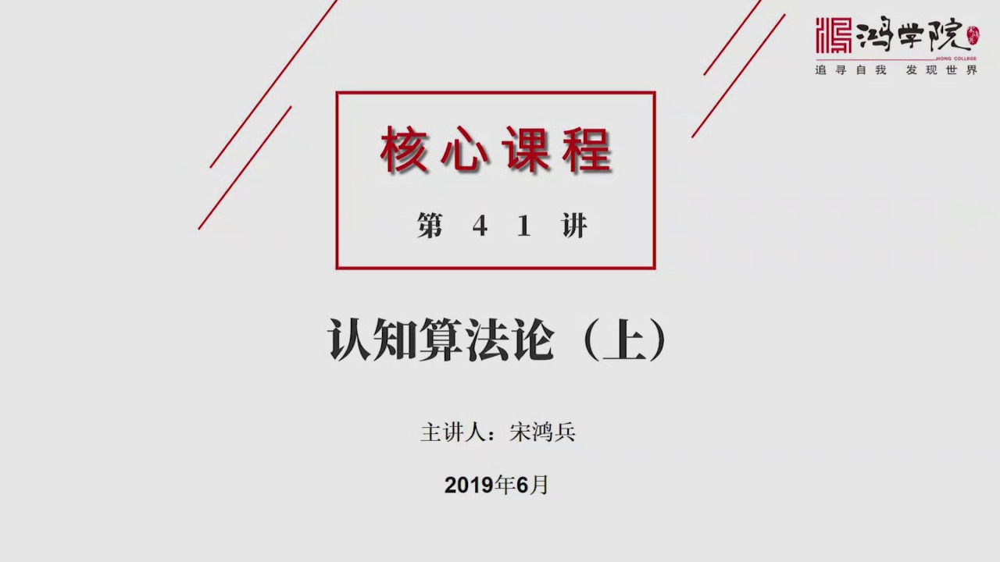
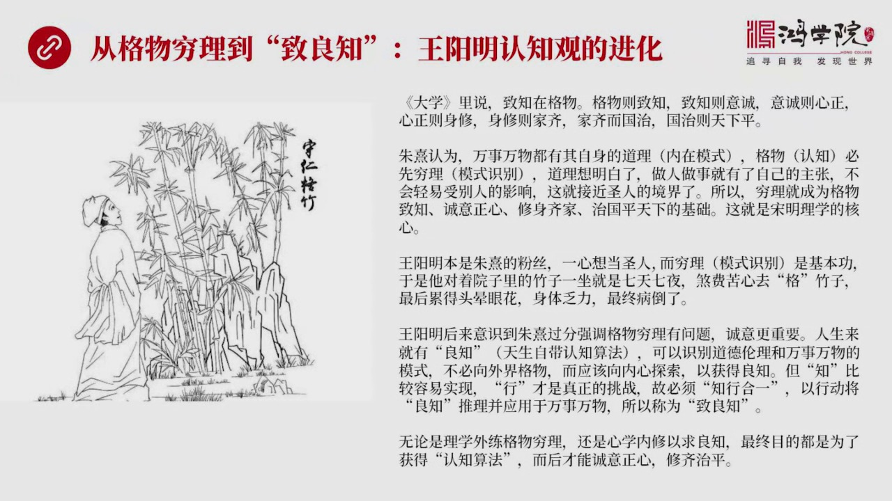
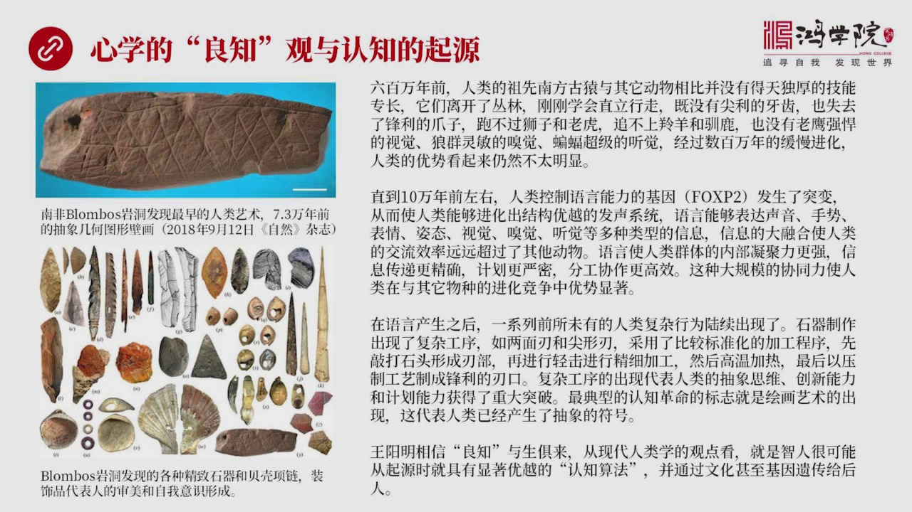
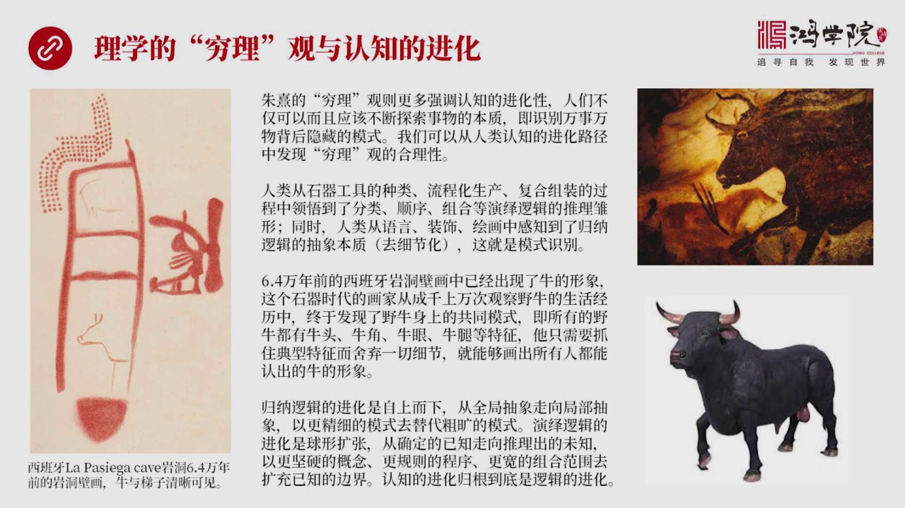
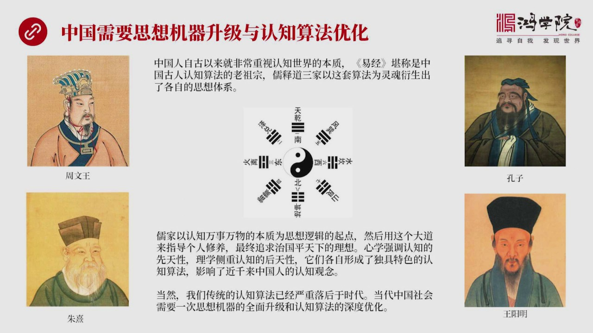
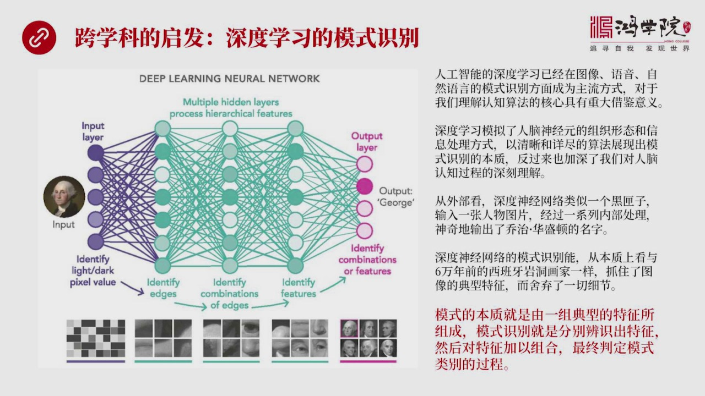
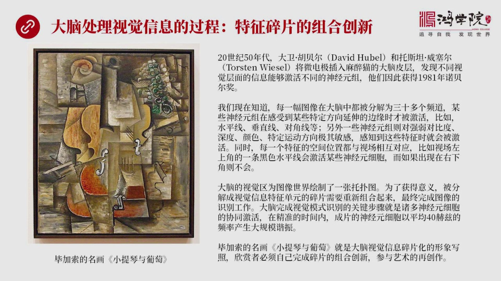
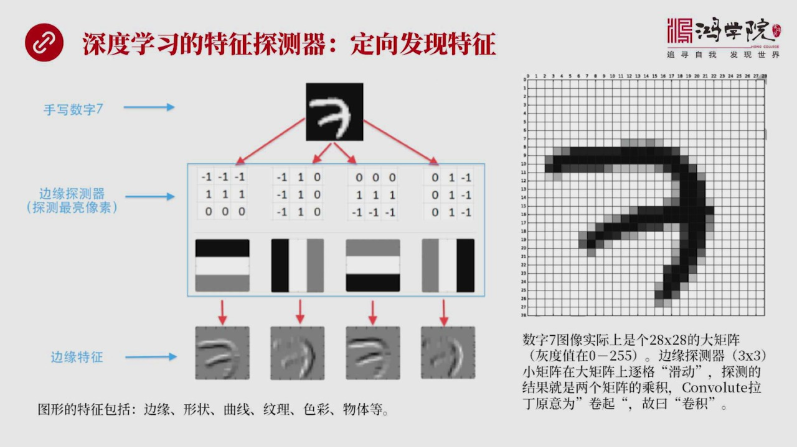
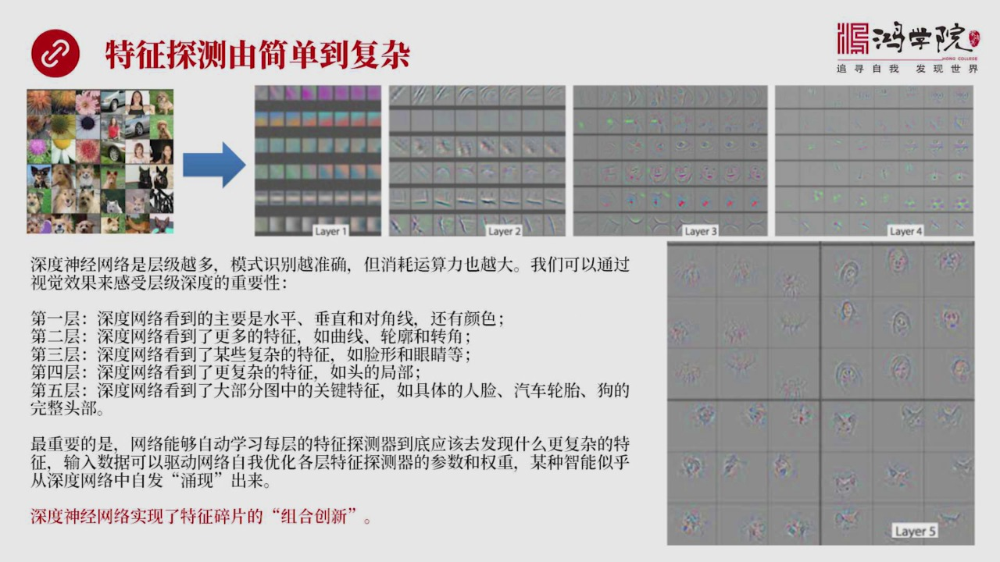
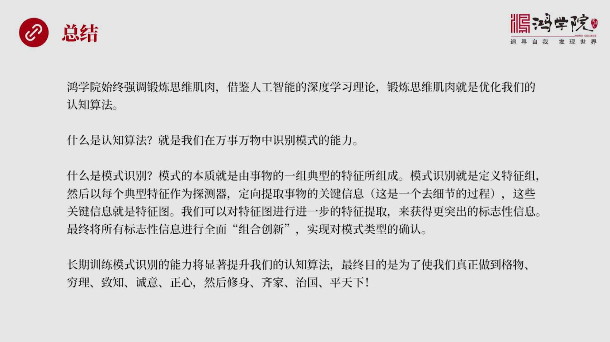

# 核心课视频-041讲. 认知算法论-上（视频） — Clean Slide Notes

> **来源**：鸿学院核心课程  
> **幻灯片**：11 张

---

### Slide 1

最新要读了一本好书 就是技术的本质 也跟大家推荐过这本书的一个重要观念 就是组合创新这对我在很多领域中都产生了一种巨大的启发 包括对认知问题那么最近我也一直在研究人工智能的深度学习理论 就是选举深境网络那么从中也误出了很多道理那么今天我把这些内容组合在一起我想把认知算法论大概分成两个部分第一部分就是...

---

### Slide 2

来探讨我们的古人他们到底是怎么来认知这个世界的应该说中国的如将文化在宋代之前是一个体系在宋代成诸他们提出了这个理学观念之后到了明代又发生了新的变化所以这就是黄阳明提出的新学理论那么黄阳明它的观点跟诸细有什么不一样呢我们来重点谈下这个问题大学里如果大家看过这本书大学里有一句话这句话就是致之在可恶可恶则...

---

### Slide 3

到底有没有什么样的这个物质根源呢就是他说了这个东西到底可不可以验证呢这就是我们谈到的这些内容就是心学的良知观与人类认知的一种起源我们需要我们提上这个东方文艺复兴吧他不是说纯粹站在古人的狭异的字面上的观念去理解传统文化我们其实需要用现代的理论现代的思维方式去重新输理重新去辨别去可以说是一种平叛吧古人在...

---

### Slide 4

她这个穷理官和我们人类认知进化之间的关系珠熙的穷理更强调认知她的进化性就是她的后天性不是语生俱来的而是我们后天不断的训练她可以不断的增进的她的观点就是人类不仅可以认识而且应该不断去探索事务的本质就是我们不仅有能力而且应该不停地练就是要实别事务背后的那种隐藏的模式这种能力是可以被训练出来的当然从进化角...

---

### Slide 5

和认知算法的深度优化为什么呢因为我们古人其实是非常重视认知世界的本质也就是非常重视认知算法最早的当然就是意经意经为什么是群经之少是整个中国思想文化所有领域中其实都可以说它是源于意经的意经应该说是中国古人认知世界的一种最高算法它是算法中的老祖宗如世道这些不同的思想体系还有各种各样的这种比如说医学、艺术...

---

### Slide 6

我觉得我们应该借鉴化学科的很多理论体系带给我们的起发特别是人工智能因为人工智能现在显然已经在很多领域中获得了重大突破比如说图像与音和自然语言它的模式识别已经有了一种成熟的可靠的现在越来越普及化的这样的一种算法或者这样的一种发展的一种流派我们已经可以看到非常清楚了各个地方都在用所以我们深入去理解人工智...

---

### Slide 7

这个人工智能不仅是在组织形态上模拟大脑的声音源细胞同时也是在信息处理它的方式上模拟人类人类的大脑这就是我们看到了大脑人类大脑到底是怎么来处理信息的归屏道理一句话其实就是特征碎片的组合上心怎么来理解这句话二十四季五十年代有两个重要的科学家大位湖位和托斯坦威塞尔这两个人曾经做了一个著名实验他们把那种微小...

---

### Slide 8

深度学习他做的完完全全的就是模拟这一点就是如果你理解了刚才我们所说的比较所内复化和他背后所代表的脑神经科学中间神经员这个级别大家这个是怎么形成意识的你要理解这个过程化你再理解深度学习就会觉得这非常非常合乎到了他不这么做才怪首先我们刚才所说的这个大脑中间信息是分频道的某些信息只检测特定的特征也就是比如...

---

### Slide 9

它是一种从简单到辅罚的一种一种分层的进化比如说我们看这张图这张图就是一系列照片中间有花儿 有人 有汽车 有狗有各种动物你把这些图片输入到生动神经网络系统中比如说它是分层分层了五层的这样的网络层数越多 我抓到特征越多我能够辨识辨识的模式能力也就越强这就为什么叫深度学习讲的是它多分成多少层层越多 越好但...

---

### Slide 10

我们学的不仅仅是具体的知识当然我们要学的知识但是我们更强调的是通过知识这种大数据来训练我们的思维基终用人工智能的理论来说就是这种思维基终的训练就是优化我们的算法我们学到的大量知识或者说看来的书读书读的书或者我们每个星期的点评其实都是数据或者大数据或者之后来帮助我们训练大脑中的认知算法让它越来越优化认...

---

### Slide 11

谢谢大家

---
