# 核心课视频-042讲. 认知算法论-下（视频） — Detail Slide Notes

> **来源**：鸿学院核心课程  
> **幻灯片**：17 张

---

### Slide 1

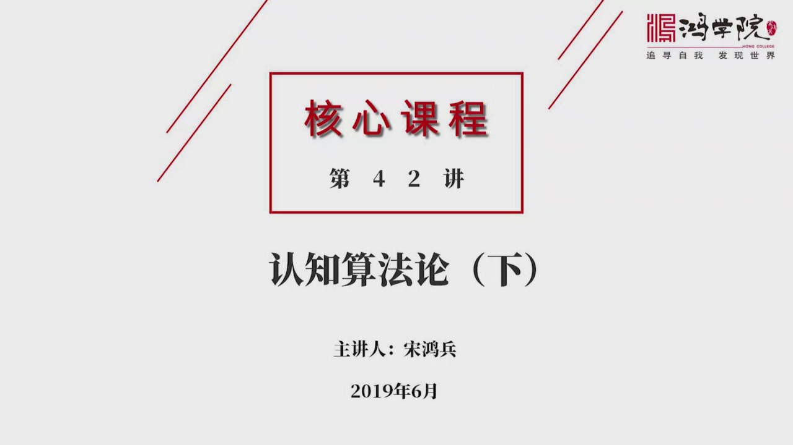

认知算法论的第二部分我们翻第一页在上一堂课中我们讲到了人工智能

<strong>All subtitles</strong>

> 认知算法论的第二部分我们翻第一页在上一堂课中我们讲到了人工智能

---

### Slide 2

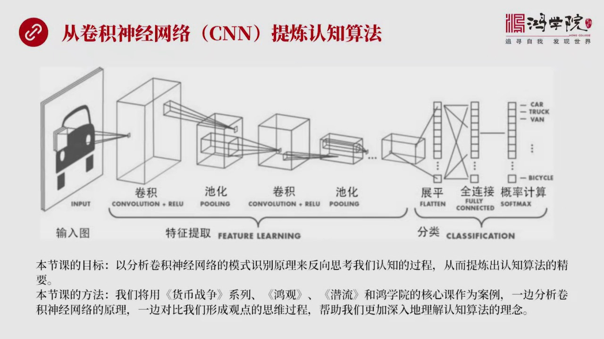

它的深度学习理论对我们认知算法的一种启发那堂课我们主要讲的是一个概念性的理解那么这堂课呢我们将会深入去了解这个深度学习中的远级神经网络CNN对我们认知算法这个概念的理解它到底能带来什么样的新的启发说到...

<strong>All subtitles</strong>

> 它的深度学习理论对我们认知算法的一种启发那堂课我们主要讲的是一个概念性的理解那么这堂课呢我们将会深入去了解这个深度学习中的远级神经网络CNN
> 对我们认知算法这个概念的理解它到底能带来什么样的新的启发说到远级神经网络大家应该都听说过应该说现在这个概念是IT行业中最火的这么一个行业昭洋
> 行业未来应用了前景还有工作机会整个IT行业中应该是数一数二的但是关于远级神经网络我自己最近也研究了很多书看了很多文章我觉得很多的这种介绍并没
> 有把问题的实质给讲透有过多的数学员数学公式还有大量的这种图我相信一般人在阅读和理解远级神经网络说都会碰到很多困难就是理解了不透彻我们这堂课并
> 不是完全讲远级神经网络而只讲它中间最核心对我们认知最有帮助的这部分那么我们这堂课程的主要的目标是什么呢就是一卷级神经网络它是怎么进行模式识别
> 的来搞明白这个原理然后理解了它模式识别原理之后我们再反思我们日常生活工作和学习中我们的思维过程就是我们是怎么识别模式的通过这样的一个可以说是
> 对整体神经网络模式识别原理的深刻认识来加深我们对自己认知过程的这样的一种理解这就是认知算法那么我们这堂课用的方法是什么呢我们将用这个会边征系
> 列包括我的红关节目、前流节目还有我们红旋这个一系列的核心课作为一种案例我们一边讲卷级神经网络它的工作原理紧接着我们再讲在这些内容中间我们是怎
> 么来反思我们是怎么得出我们这种观点的它的思维过程究竟是什么用这个办法就是一边讲卷级神经网络一边讲我们在很多核心课提到很多观念然后进行对照用这
> 个办法来加深我们对认知算法的这种理念它的深刻的理解那么我们这张图可以看到一个卷级神经网络的一个基本架构这是它的一个逻辑架构最左边是一个输入的
> 图片比如说这个图片中有一个汽车那么它经过落干个步骤首先是经过卷级卷级我们在上堂课中简单的提到过这堂课我们以后会详细探讨经过卷级然后吃话然后再
> 卷级再吃话在这里我们这张图上画了两个层次实际上在真实应用中可以多达数百甚至上千个降了一个轮回最后一步然后我们把最后卷级出来的这个结果进行展平
> 展平之后把它对应的全面阶级的深度神经网络的中间层最后的目标是什么呢是计算出一个概率分布也就是说这张图片是一张是一个车的概率到底是多大是一个卡
> 车还是一个其他的车型每个输出的分类中间都要标出它的概率那么整个这个卷级神经网络它基本上分成两部分就是中间这部首先我们看中间这部分是特征提取它
> 实际上是从图片中抓出中间最核心的特征第二部分就是分类把这些特征进行从组我们谈到的技术本质这本数面提到了组合创新其实分类的这部分就是对卷级所提
> 炼出的图形中间的最典型的特征把这些特征买上去的特征进行组合创新来发现每个模式所对应的概率这个就是一个总体上的一个认识好我们看下一页第一层我们分层来组成来解读

---

### Slide 3

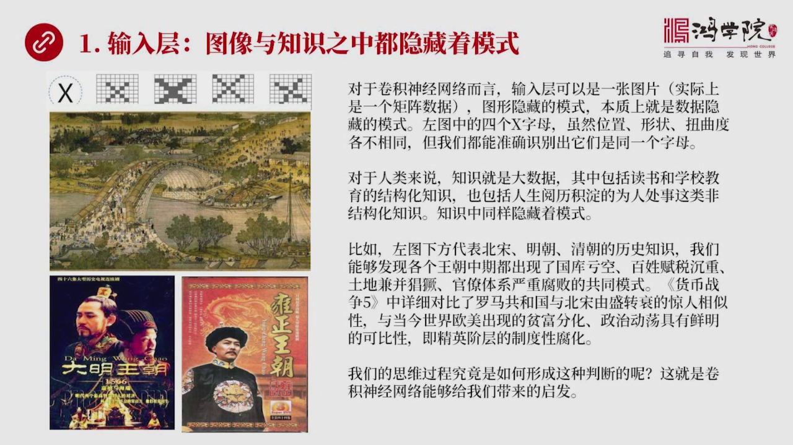

第一层是什么呢是输入层就是一张图片输入给神经网络那么输入层在这里我们要认识这张图片的本质这张图片其实跟我们红院所讲到的各种各样的知识不管是类似的经济的还是国际政治的还是地缘方面的图像和知识他们的内在都...

<strong>All subtitles</strong>

> 第一层是什么呢是输入层就是一张图片输入给神经网络那么输入层在这里我们要认识这张图片的本质这张图片其实跟我们红院所讲到的各种各样的知识不管是类
> 似的经济的还是国际政治的还是地缘方面的图像和知识他们的内在都隐藏着各自的模式就是一张图片有图片的模式我们所学的所有的知识也隐藏着模式所以我们
> 看左边的那张图我们可以看到如果我们要识别一个字母X那么X可能会有不同的形状简单的数学比较或简单的计算机比较比如说主点每个向速进行比较那是没细
> 的因为有的是发生了唯一有的是它有所扭曲所以它的形状内有不同我们要非常机械这么一对一对对比那肯定识别不出来但是我们的眼睛一眼就能看出来这不就是
> X吗不管你是用极种鞋法但是它的核心特征是摆在那里的我们觉得这个事儿很神奇但是不理解它怎么能够把稍微卷曲的稍微旋转的稍微问一对这些东西这些不同
> 的表情方式怎么能够把它认识出来怎么能把它识别出来呢这个就是它比较神奇的地方也是很多人觉得人工只能好像听起来很旋实际上没有这么旋那么其实对于我
> 们的这个学习的知识而言也是一样我们左边那张图中我列了三张图一张图是北宋的还有就是一个电视剧大名王朝1566年这个片子拍的非常不错我最喜欢三部
> 电视连续剧历史剧我觉得可能是有史以来拍的最好的大名王朝1566年是其中一部还有一部就是右边的勇着王朝还有一个是汉务大地其他的历史剧跟这三部比
> 起来不管是历史真实度还是对于中国的这种文化心理政治心理的解读的深度还是对观场的对政治上的一些分析的这种角度都感不上这三部电视剧的它的所达到的
> 高度所以大家如果看如果要了解历史的话我觉得除了读书之外看看这种拍的非常好的电视剧也是一个办法那么为什么我把三张图放在这其实要说明一个道理就是
> 我们看到这些历史知识它也是一种大数据这种大数据包括我们从这种知识我们可以分成两部分一种是结构化的知识就是我们从学校、
> 从读书所获取的这种历史教科书成章节的它是一种结构化的历史知识其实也包括我们电视剧看来的很多信息也包括我们人生越历中间所经历的人和世为人处世你
> 也会得到一种感悟得到某种经验而这种东西往往是一种非结构化的知识那么不管是结构化的知识还是非结构化的知识里面同样隐藏着模式所以我们图片这个中间
> 它本质是一种举振它其实是数据就是数据中隐藏着模式同样知识中也隐藏着模式那么我们看这个历史中间不管是北宋明朝还是清朝我们其实都能发现到这个王朝
> 中期就是这个王朝建国七八十年左右这个时间段各个王朝都会同样出现非常尽四的某种模式我们都能发现国库亏空了然后老百姓的库这个税库越来越重然后在同
> 一时期土地监病开始非常长矩然后关掉体系日益复化这都是一种共同模式我在货币战争舞这边顺便曾经详细对比了罗马共和国和北宋当他们游战转摔的时候是相
> 当惊人的一致性就是历史惊人相似源于背后历史中间这个人性他惊人相似那么我们从当今社会中看到的比如说不管是欧洲还是美国还是亚洲社会其实普遍反映出
> 了一个共同的一个现象就是屏幕分化任意严重階层凍结了问题任意严重政治的动荡越来越明显所以这些事情跟历史上这些事情比较起来我觉得存在着模式上的相
> 近性也就是经阶层的制度性复化这是问题全部问题的根源也是并根我们在想这个问题说我们的思维推理是怎么得到这样的一个判断呢我们怎么就能意识到北宋、
> 罗马、明清还有欧美这些彼此相隔万里的时代相差好几千年的这些事情中间我们怎么能感觉出他们中间有共同的模式呢这就是我们要深入理解我们要深入网络它
> 能够给我们带来的重大启发好我们看下一我们现在要深入讲一下选积深入网络中间的一些细节了

---

### Slide 4

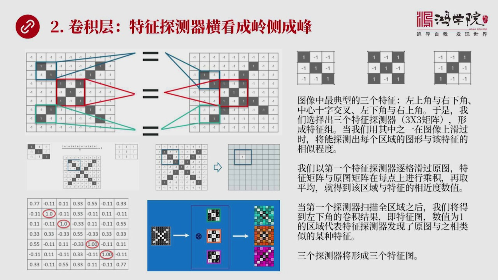

刚才讲的是输入图那是第一层第二层是关键第二层叫捲积层捲积层我们上堂课稍微提到过捲积实际上是两个举阵之间进行成绩为什么要做这个事我们如果把这张左边的图仔细分析一下你会看到两个X左上图有两张一个是一个比较...

<strong>All subtitles</strong>

> 刚才讲的是输入图那是第一层第二层是关键第二层叫捲积层捲积层我们上堂课稍微提到过捲积实际上是两个举阵之间进行成绩为什么要做这个事我们如果把这张
> 左边的图仔细分析一下你会看到两个X左上图有两张一个是一个比较正规的X另外一个发生了你有去的X我们怎么来判断这两张图是一样的呢或者这两个图所代
> 表的字母它是同样的一个字母呢首先要第一步我们要做的就是要旋准特征探测器你比说我们怎么来看这两张图它的相思性呢我们可以看到左图上有一个左上角一
> 个小方块它实际上代表着三征三类的举阵那么它是一个对角线黑线的中间每个格是1白的部分是1通过把左上角跟第二张图的左上角线已经对比我们会发现这两
> 个区域中间黑线这个对角线从左上到右下这个对角线看见这一块比较相思所以我们把这小块这个局部三征三这个举阵就在右边我列出来列出来的第一个我们以为
> 一个特征探测器它专门探测在某个区域之内是不是满足黑色对角线这样一个特征同理我们可以把中间部分我们会发现中间一定会有一个X有个十字交叉型不管是
> 左图还是右图用红色这个框框框出来的部分我们可以看这两者之间也很相似虽然它其他地方发生了扭曲但是中央交叉部分是类似的所以我们把中心交叉这部分作
> 为第二个特征探测器然后第三个就是左下角两个图的左下角非常类似其实除了这个之外我们会发现它用在右上角也是类似的或者左上角的特征用到右下角它也是
> 类似的所以我们用三个特征探测器就够了就能够把图把它背后的模式给试骗出来怎么个试骗法我上堂课也稍微讲到过一点其实就是把第一个特征探测器我们看到
> 黑色的对角线从左上到右下对角线拿到左边输入图上然后把它进行逐格的滑动就像日本鬼子晋村还怕把图去买地雷拿碳雷器这么研图这么少它做的工作是一个事
> 也就是拿一个三成三的举阵在输入图上从左上角一直到右下角逐格的线水平然后一层一行一行全部掃描完掃描一遍那么在每一个地方停留的时候在每一块停留的
> 时候它做什么工作呢其实就是做一个举阵的相成比如说我们看中间这张图的左图我们会发现这个举阵相呢其实也很简单就是相对应位置的每一个值比如说低排第
> 一个跟输入图的低排第一个低排第一列然后进行成绩然后再加上低排第二个和对应的第二个位置进行相成然后把所有的九个全部算出来之后进行雷加就完了进行
> 雷加就会得出一个值那么这个值我们要取个平均有九个格我们就出一九所以就会得到一个数值如果我们看它的第一张图就是中间第一张图你把这个探测器放在绿
> 框画的这个位置蓝框框了这个位置上你算一下这个举阵当然得出来就是1然后它的平均值你把这个九值算出来之后一平均还是1所以我们列到了右图上的这个1
> 这个位置上这说明什么呢说明我们特征探测器在这个局部上发现了跟它一模一样的特征所以它的数值是1如果不一样不一样数值就会逐渐变小比如说0.8那就
> 比较相近或者0.5那就差得比较远然后0.3或者甚至更差差到了一个附数那就完全不像了所以我们的特征探测器是在输入图上不断的结极滑动每停留一个那
> 个地方就算出一个数值最后我们算出这个数值就是右下角我们看到这张数据表从这张数据表中我们可以看到对角线部分我用红色圈圈出的部分都是1说明什么说
> 明我们特征探测器在输入图的这个这些位置上这4个位置上发现了完全一样的模式一模一样所以它是1而其他地方有正有富有大有小那就说明一个问题通过成极
> 的方法这叫捲极捲我们上次说的它其实是一个拉丁拉丁此根极其实是举正成极的意思所以叫捲极那么如果我们有这是一个特征探测器探测出来这张图如果我们有
> 3个特征探测器当然就会探测出3个图这就是我们在右下角看到的这个X经过中间我们看到有个成号加一个圆圈实际上就代表捲极的意思对这个第一个探测器对
> 原图进行捲极我们形成了一个结果叫特征图就是我们看到的这张图上右上角这个绿色的偏绿色的这一部分我们会看到中间的对角线明显的是白色对角线跟我们这
> 个特征图上显示的一样当然为了用颜色标志出来会更明显第二张图特征图就是用成色来显示我们会发现它的中心部分它的相似度是比较高的那么第三张图第三张
> 特征图就是我们看到是另外一张对角线所扫描出来的捲击出来的这样一种特征图所以三个特征三个特征探测器我们就会产生三个特征图三个特征探测器分别在同
> 样的一个输入图上原图上进行扫描得到一个第二个扫描得到第三个得到第三个好这个就是我们特征探测器它起到了重大作用在我看来特征探测器它的核心有印划
> 概括就是横看城里测成风我可以从这个角度看可以看到它是零我从另外一个角度看可以看到它是风那么从第三个角度不同的时间不同的地点看那么会看到不同的
> 特征我们要想把一个数要观察得非常仔细需要大量的特征探测器从方方面面从上上下左左右又不同线段对它进行不断的扫描你就会产生大量的特征图这个特征图
> 都对着某一种特征探测器这是卷机层它的最根本的理验好我们来看下一页那么卷机层对我们会有什么起发呢我认为主要有三个起发

---

### Slide 5

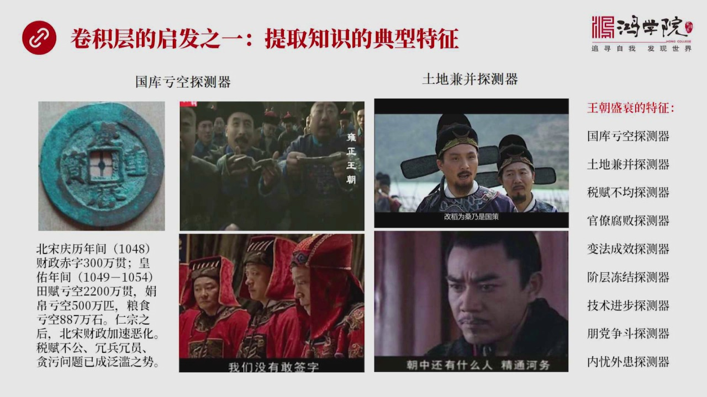

第1个起发我们在阅读知识的时候比如说我们在读一文史书其实我们脑子面也要非常清楚地意识到我们不是漫无目的的侠侃首先我们得定义我们的特征探测器也就是你读对这道史书你准备发现什么东西比如说我们可以设计一个特...

<strong>All subtitles</strong>

> 第1个起发我们在阅读知识的时候比如说我们在读一文史书其实我们脑子面也要非常清楚地意识到我们不是漫无目的的侠侃首先我们得定义我们的特征探测器也
> 就是你读对这道史书你准备发现什么东西比如说我们可以设计一个特征探测器我成为国库规空探测器然后你在读史书的过程之中你这个探测器只关心这个部分的
> 那种其他东西通通不看这读书不就快了它不就省事了吗所以如果用这个国库规空探测器来扫描宋史的话你比如说会变成我中间有大量的关于这方面的财政规空国
> 库规空方面的一些具体数据好这些数据从哪来的当然是读宋史读很多其他的自己的空间读很多类似的这种书你可以从中这个探测器只关心财政规空论体其他东西
> 我不要我们得到了这个数据什么呢比如说北宋年间清理年间1048年它的财政赤字300万块好黄幼年间就是清理之后是黄幼那么在这个年间它的填复规空的
> 多少冠它的棉薄规空的多少皮凉是规空的多少然后你会看到宋人中之后那马上财政问题是加速额化1048年财政规空在300万块1049年到1054年光
> 是填复折断成钱规空了2200万你可以看到财政恶化的速度是如此的惊人就是它这个席率非常地抖什么原因呢当然是北宋的财政加速额化顺利负不公老百姓收
> 不上老百姓负税太重官员有钱人收不上来然后再加上朝廷养兵太多上百万大军但是那些兵又不能打仗所以就形成了荣兵和荣员贪污问题也变得非常严重好其实我
> 们在读书的时候一本好书或者一本重要书你要读很多遍为什么因为每一遍你关注了特征你的特征探测器探测器是不同的东西这是给我们一个重大起发其实我们看
> 说说都是这样你要一个字一个字去看那你能看多少说其实我们在研究历史过程中你用了通常是特征探测的办法掃描是月毒而不是竹章竹字竹竹句的月毒因为那样
> 效率太低那么国库亏空探测器你如果看其他的历史你也可以马上找到类似的这种案例比如说涌政王朝这个电视局里面讲的为什么四爷涌政要进行国库国库亏空的
> 这个追笔欠款呢这不是也是由于黄河发了大水几百万咱民升级无招朝廷拿不出银子来银子到哪去了被官员们借走了所以康熙让涌政让他这个四黄子去到各地去追
> 笔欠款这个现象其实我们看了这个时候就跟你读到书一样你马上会对这个问题特别敏感因为你脑子面首先有一个国库亏空探测器放在哪儿了所以你对这个东西超
> 级敏感然后你再看大名王朝1566年这位电视局如果你你脑子面有这个国库亏空探测器的话你会对它们变论比如说有个场景四个饼笔大太监这是皇上的秘书代
> 表皇上的还有内閣的这些隔老们隔员们他们在争论朝廷的财政问题比如说我记得一个镜头说这个冰布上报这个预算到结果到了年底亏空了超级了300万300
> 万200亿哪去了然后那边延迟翻就是延松了儿子他也是主要的一个一个隔员了然后他就在解释这个钱到哪去了修皇宫为什么花了这么多钱然后采集木采为什么
> 不能从云南这个山里云因为没有道路只有从南洋云等等不管冰布路签了钱还是公布签了钱但是你会明显的感觉到家境眼界明朝的财政已经相当的困难整个这个片
> 子里面有大量的数据大量的这种方面的内容的介绍由于我对这个问题超级敏感所以马上看到这个这个镜头说立刻就知道背后他们出现了一个跟清朝跟北宋跟罗马
> 类似的问题包括今天的美国财政亏空这么大每年这么大的财政赤字发这么多国债难道没有问题吗如果我们相信历史是智慧它是早晚会出问题的另外还有一个探渔
> 我称之为是土地监病探渔也就是你会发现在出现国库亏空的同时往往面临着大量土地监病为什么就是因为富人不那睡然后你比如说这个大明云王朝1566年这
> 中间有一个重要的镜头重要的故事情结讲了改到维桑这个事改到维桑结果还要放水去腰老百姓的填为什么就是因为利用水灾打压填架平常是50旦这个糧室满意
> 目的现在发灾了发水灾了是人为发水灾它可以借卖可以借卖八旦时旦就换意目的所以这个现象说明了在加进年间土地监病之恶劣它这个恶劣程度已经达到了精人
> 日程度一个指导局的一个商人他就能够一次监病50万目土地这是他的胃口你可以想象一下这种土地监病规模你一对比各个朝代你就会发现到加进年间明朝出了
> 大问题其实我们看到包括南宋、包括北宋包括明朝你会发现为什么这些朝代会被外足所灭不是蒙古人有多么多么厉害也不是轻兵入关它的战斗力有多么多么强它
> 最根本的原因是上亿人或者几亿人根本就不愿意去抵抗谁愿意知识这么复材的朝廷谁愿意去支持一个把我的土地全部抢光的朝廷所以这些问题是我们看到精兵入
> 关能用十几万病例打败百万的民军这是适所必然的事情因为已经烂得跟了任何一个人来统治都会比他们搞得好所以老百姓选择了不抵抗当然我们看到类似历史事
> 件有很多比如说漢武大地里面有个镜头也是漢武地当年也是黄河发水灾了但是指淹指淹这个北岸不言难啊为什么因为合到那帮人是有意的往北边拔口子淹的是老
> 百姓的天南边呢虽然那些摊图本来就用一些红但是由于南边是太后家的是国舅家的土地还有很多非常有钱有世的这些官僚的土地所以他偏偏烟老百姓钱而不言自
> 己家的钱这种问题都说明在各个朝代中反复出现类似的这种模式我们在看史书说一看你会发现这个模式这个朝代这个模式跟另外一个朝代模式太相近了然后你要
> 对比它的规模就是在想这个问题严重到什么程度所以除了这几个探测器还有很多王朝圣书来游圣转书来的拐点的时候会出现大量的特征比如说税幅不均官僚腐败
> 然后进行变法变法成败到底成效怎么样階层凍结了探测器技术进步的探测器还有膨胆斗争最后还有内容外患当然这种探测器还可以列很多很多这种概念我们以前
> 是游但是没有把它清楚的提提烈到非常清晰提烈到特征探测器这个概念上来你有了这概念之后脑子里面在看书的时候你就会有一种非常非常清晰的这么一种意识
> 以前萌萌萌萌有现在你要把它定成弱干探测器的话你看书的效果绝对不一样好我们再看下野卷机层刚才说是第一个起发特征探测器

---

### Slide 6

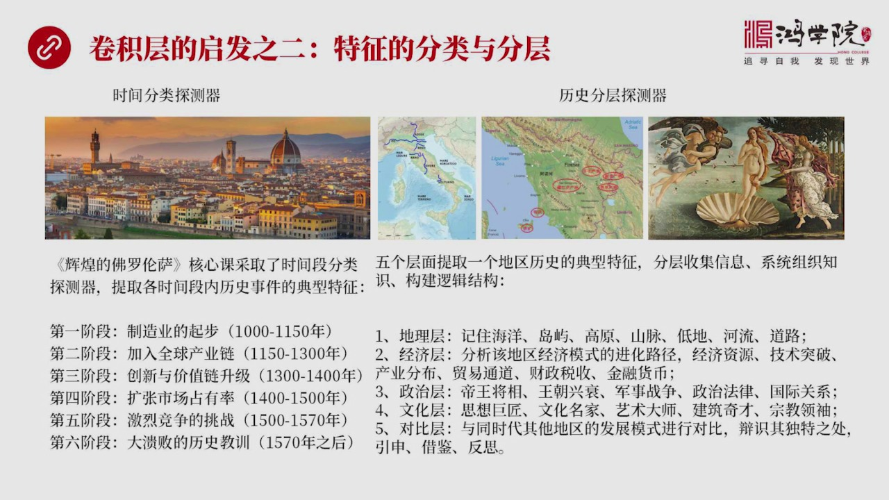

对于我们读书对于我们思考问题相当相当的关键第二个起发是什么特征探测器可以进行其他方向的分类你比如说可以在时间上分成不同时间断了探测器比如我们核心客徽黄佛罗伦萨他的这个讲述方式就是时间分类探测器第一阶段...

<strong>All subtitles</strong>

> 对于我们读书对于我们思考问题相当相当的关键第二个起发是什么特征探测器可以进行其他方向的分类你比如说可以在时间上分成不同时间断了探测器比如我们
> 核心客徽黄佛罗伦萨他的这个讲述方式就是时间分类探测器第一阶段制造业企步哪年到哪年第二阶段加入全球价值量第三阶段创新与价值量的升级第四阶段扩张
> 市场量有率第五阶段激烈的竞争的挑战第六阶段大亏败好从哪年到哪年这是按时间段来进行分类的这种探测器的好处就是你可以把这个时间段作为一个探测的主
> 要主要的一个方向在这个时间段里去找相对应的特征但还有一种分类方式称为是历史分层探测器我们讲佛道倫散的时候我也提到了去很多地方进行游走或者叫深
> 度的文明之旅我也提到了一个共同的方法就是历史分层法把历史分成五个层次来进行研究怎么研究呢就是先研究地理层记住河流导语山脉高原地地和这种道路这
> 是属于地理层你先把地理搞清楚第二层就是在地理层往上往上一层是什么呢经济层经济层是什么呢分析该该地区它的经济模式有什么特点它的资源有哪些技术突
> 破有哪些产业是怎么分布的贸易道路是怎么样贸易通道还有财政税收金融货币等等然后再往上一层是什么第三层是政治层也就是研究地亡将向外交战争王朝新衰
> 法律体系以及国际关系那么这层研究清楚之后再往上一层是文化层就是要了解这个时代这个地区的思想巨降文化名家艺术大师建筑其才宗教领袖它也是个跨学科
> 的一个研究方式在文化层上再往上呢就是对比层了你把这个地区给吃透了分成若干个层次之后把每个层次都研究清楚了你要进行对比那就是横向来看艺大利当时
> 和中国当时的情况北宗它那个时代跟欧洲哪个时代相对比明朝那个时代跟佛罗伦萨相比怎么比它的模式上有哪些一同然后再看哪些地区它的发展模式有哪些独特
> 之处然后隐身界界和反思这就是分层探测器好我们再看下页下页我讲的是特征图玄机层里面设计到

---

### Slide 7

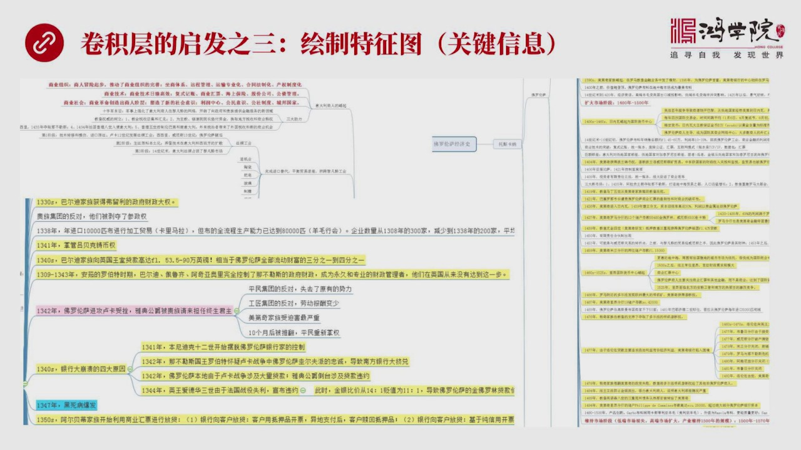

两个矩正成绩成完之后这个玄机结果存在哪儿啊放到第三个矩正中这就是一张特征图这张图量保持着关键性的信息其实我们看书的时候也可以借鉴这个观点比如说我放上这个图是我研究佛罗伦萨经济史的时候有一本英文书很好这...

<strong>All subtitles</strong>

> 两个矩正成绩成完之后这个玄机结果存在哪儿啊放到第三个矩正中这就是一张特征图这张图量保持着关键性的信息其实我们看书的时候也可以借鉴这个观点比如
> 说我放上这个图是我研究佛罗伦萨经济史的时候有一本英文书很好这本书啊你如果漫无目的的独独三遍你也记不住因为中间信息上太大怎么办呢我才许办法就是
> 我对哪个方向的知识感兴趣比如说我中间这个图中中间用黄色标注的全部是跟经济贸易相关的用红色用粉色标注的就是他对外用兵国际关系出现了种种的这种证
> 质蓝色呢他当然就标志着一些突发事件比如说黑死病等等然后呢是分门别类就是按着不同这个当时我并没有特征探索去这个概念但是也是按着分门别类的方式进
> 行组织就是你独这个书的时候一边独一边把中间的信息全部抽取出来因为我知道这本书对我来说很重要所以我是要通独的就是要竹子竹具的独但是竹子竹具独你
> 是记不住的怎么办呢就把相关的信息从书中玻璃出来我觉得英文中有个特别好的词叫Pars就是把这个内容通过Parser通过这个调分旅系的这么一个机
> 器把它所有的只是全部信息出来分门别类的放置当然最好的办法是思维导图有思维导图来进行组织然后当然这张图非常非常的大而且花了好好的好的图但是到最
> 后我可以放下这本书说我可以不再看这本书我只看我的图我就知道中间的全部关键的信息和关键的这些内容在什么地方而且很好找这就叫绘制特征图这个特征图
> 怎么来的当然事先就有一个当时我并不知道的一个特征碳的器比如说我对它的贸易特别感兴趣对于它的佛罗林金币特别感兴趣所以围绕着一组特征碳的器它不断
> 地帮我在收集信息然后把它组织在思维导图之上这种办法我觉得是非常高效的一本书都在所有内容全部在图上看图因为它有空间感它永远比技文字要容易的多好 我们再看下一页回到捲机 神经网络来刚才我们讲的是捲机层

---

### Slide 8

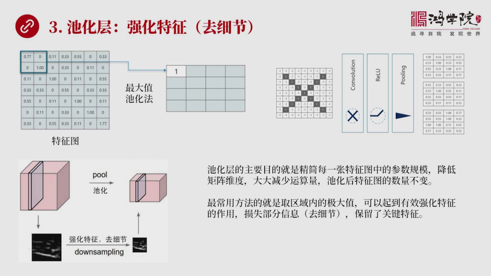

然后再对应捲机层给我们的启发现在我们再回过来回到这个原来的思路来来从既上理解第三步它在做什么第三层实际上叫迟化层抠领这个干净什么在我理解起来其实归大学很简单就是一句话强化特征去细节就是要把最突出这个特...

<strong>All subtitles</strong>

> 然后再对应捲机层给我们的启发现在我们再回过来回到这个原来的思路来来从既上理解第三步它在做什么第三层实际上叫迟化层抠领这个干净什么在我理解起来
> 其实归大学很简单就是一句话强化特征去细节就是要把最突出这个特征要把它进一步强化当然技术术上或很多人的理解它觉得这是一个减少参数量减少运算力消
> 耗了这么一种办法当然也对如果我们来看它具体的做法你比如说我们左边这张图我们已经获得了一个特征图捲机之后这种特征图这个特征图太大我们想把它缩小
> 在我看来是我们要突出它中间的特点怎么突出呢比如说左上角这个蓝框所框住的这个份四个数它是22局争我这个4个中间直取最大的小的都不要我只取一个那
> 当然这4个中间最大的是1我就把这4个合并成了1个这个办法就好像我们在照片上下面我画了一个下面这张图是一个更形象的一个表达方式就是我们看到图上
> 这个有个图形经过这个直化之后它把它变得更加的突出就是小的我都不要我只留大的当然它最突出的特征就被放大了就被强化了就像我们画漫画我把一个人的鼻
> 子画得特别显着因为这个人鼻子可能看得比较明显但是我把它用漫画式的方式表达出来那不是看得就更明显吗抓住这个人特征那么经过直化这个过程之后我们来
> 看右边这张图你会看到这个X这个输入图经过第一步卷级第二步这个锐炉锐炉什么概念呢其实是一个数学概念它是一个寒树也就是把中间所有的副数全部干掉我
> 只保留如果你是0我保留是0如果你是副数我全部给你改成0如果你是正数正数我不动所以从锐炉这个寒树中我们可以看到它是个在X轴上是平的然后到了0点
> 到了0这个做标原点之后它是往上敲的这就代表了它是一个这样的一个几个寒树由于这个寒树对我们认知没有什么太大作用所以我在这并没有并不想去深入去讲
> 但它的功能就这样然后这个第三步我是什么呢就是齿化齿化之后产生仍然是三个特成图只不过这三个特成图比原先卷级之后的那个特成图

---

### Slide 9

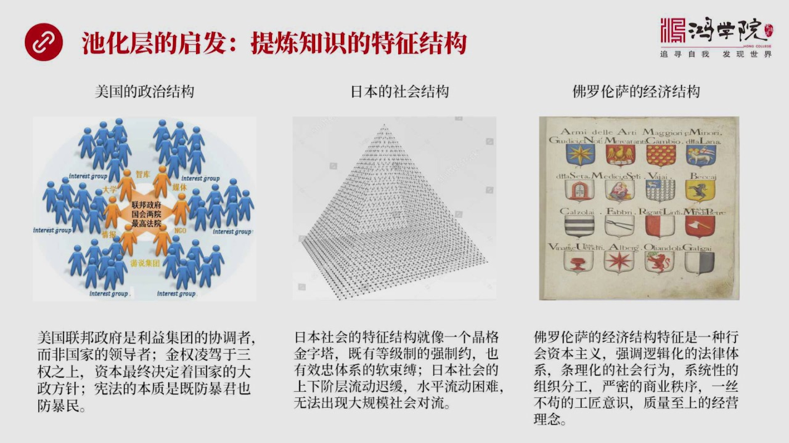

要大幅搜小了因为我进行了参数的收缩所以我形成了三个更小一些的特成图除了减少预测量之外在我看下来它最重要的当然这个齿化的一个基本方法就是取最大值也有取平因值的但是我们在这儿用的是取最大值的这样的一个算法...

<strong>All subtitles</strong>

> 要大幅搜小了因为我进行了参数的收缩所以我形成了三个更小一些的特成图除了减少预测量之外在我看下来它最重要的当然这个齿化的一个基本方法就是取最大
> 值也有取平因值的但是我们在这儿用的是取最大值的这样的一个算法在我看下最重要的功能是有效的强化特征当然这个过程会似是部分信息这叫什么这叫去细节
> 我不需要这么的信息我只需要它的特征特征保留细节甩调这就是我要的齿化成的效果好 我们看下一那么这个齿化对我们认知有什么起发呢我觉得它最主要的起
> 发就是我们需要提链知识的特征的结构我反复在我们红旋的作业中反复强调这个结构它不是一个粘药不是一个去述这篇文章我有一个什么什么我把这个所有转内
> 容剪药的描述在这不是这个概念齿化给我们带来的起发就是保留最显著的知识特征这个是我们最需要做到的你比如说我举三个例子吧第一个是美国政治结构这个
> 我在很多场合上已经讲了美国联邦政府是一个什么样的就是它的结构性的特征它最典型的特征抛强所有细节我不需要知道它发生了哪件事因为这个结构就是从千
> 百万件事件提出来了在我看来它的政治结构它这个框架这个政治结构是用什么结构联邦政府是立即端的协调者而不是国家的领导者而且在这个体系中间金权是高
> 于其他的三权的我们都说三权分类但是实际上背后还有一个隐形的金权是资本最终决定着这个国家它的大政方针宪法的本质即防暴军也防暴民这都是对它政治结
> 构了一个高度的经验中间没有任何的具体那件事情的出现因为我只要结构我只要最典型的特征所以我们同学在写作业的时候你这个结构部分不应该出现任何具体
> 的哪在哪这事而只是提出了这个结构第二个比如说日本社会什么我提到这个结构叫金格金字塔它既有等级的这种强制性约束也有效忠体系的这种软约束社会中的
> 每个人都要有自己的一个效忠对象所以在这样的一个社会结构中它既是金字塔层级等级制很严在日本的公司你要想想从普通的一个这个员工上升到上升到高管或
> 者CEO每一个三四十年你根本做不到上升通道非常缓慢而且水平方向也非常不容易流动因为你得有个效忠的人你在社会上去混你向谁效忠啊所以你们日本这个
> 社会你看看年轻人为什么不爱去创业他有文化上的这种效忠因素的制约同时也有社会层级的压制但是不是日本现在进入消消二十年之后他才出现这问题在日本经
> 济高速发展的这些年份他也一样他也没有出现创业热潮这个从1868年这个名字卫星之后他就没有出现过这个时代不是偶然的是由于社会结构他这个金格金字
> 塔造成的所以金格金字塔就是对日本社会结构了一个典型概括那么第三类子是佛罗伦萨佛罗伦萨经济结构怎么给他进行一个高度的概括呢我称之为是一种航汇资
> 本主义航汇资本主义是什么概念的就是这个航汇的这帮人制定法律他们掌管军队他们有自己的军队监狱和法庭所作为一切政策都是为了保障航汇的利益的所以他
> 们特别强调逻辑化的法庭体系调理化的社会分工系统性的组织然后严密的商业秩序意思不狗的工匠精神质量质量的新铃链这基本上涵盖它所有最主要的特征了这
> 叫佛罗伦萨的航汇资本主义这就是迟化层对我们认识任何一个东西任何一个领域的知识其实都是需要强化特征去细节的我们再看下一页好 再回到远级神经网络来它的第四步是什么呢

---

### Slide 10

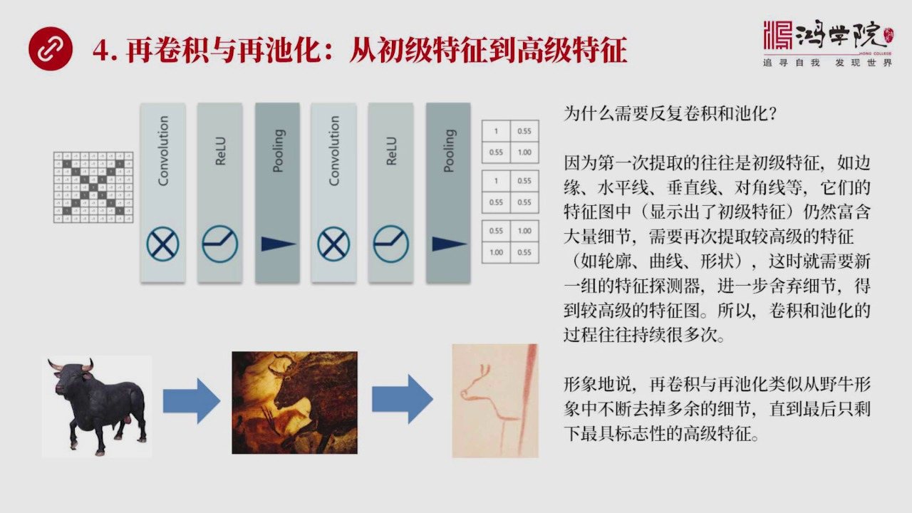

再卷级与再迟化就是从初级特征要进化到高级特征大家可能会觉得这个就是为什么卷级一次之后我已经有了特征图了它已经把一些主要的特征过抓出来了为什么还需要再卷级呢我还需要反复的迟化呢主要原因是什么就是我们上级...

<strong>All subtitles</strong>

> 再卷级与再迟化就是从初级特征要进化到高级特征大家可能会觉得这个就是为什么卷级一次之后我已经有了特征图了它已经把一些主要的特征过抓出来了为什么
> 还需要再卷级呢我还需要反复的迟化呢主要原因是什么就是我们上级课也提到过因为我们第一次提取的特征往往是一些初级特征你比如说图形中的边缘水平线垂
> 直线对小线这是我们第一层特征特征器所主要发现的它主要做这个事而且这种体现出来特征图仍然保留了大量的细节它是初级特征而且还有大量细节在里头我们
> 需要再次对这种初级特征图再次进行卷级再提取高级的特征比如说我要从边缴我要从这个边缘水平线垂直线中间我要体链出轮扩曲线和形状就是要对简单特征进
> 行体链把它上升到高级特征这个时候就需要另外一批特征特征器就是第一层我们有就是图中我们有三个特征特征器第二层再捲再对它们这个特征图初级特征图进
> 行卷级的时候我们需要定义第二组特征这个第二组特征特征特征器然后来体链更高级的特征所以卷级和迟化这个过程往往会重复很多很多次程摆上千次然后才能
> 逐渐体链出越来越越来越复杂的这种特征的典型特征才能越来越越往后才能发现越复杂的这种特征形象说是什么呢就是我记者上常课我们讲过西班牙六万四千年
> 前这并化我们会看到这个过程再拳击的再迟化它就比较像把一头牛本来是游戏有肉力头牛第一次我进行卷级卷级出来之后就是中间这个牛把它变成了一个大大的
> 减化的抓住它一些基本特征的怎么一张图但这张图上人有很多牛的细节太多了还有一些我觉得不行我还需要更抽象的这种图那怎么办呢我们就出现了壁画上这只
> 有牛的一些最最典型的特征了我把细节全部给全部给甩光了那么这种最最最最典型的特征就是一个牛头牛脚牛鼻子然后它身体的曲线和腿这个概念就是它是一个
> 从复杂到从一个非常具体到一个非常抽象从一个非常简单到一个非常复杂的特征这样一个体点过程所以这是为什么我们需要对这个捲机要进行反复对捲机和策划
> 要进行反复的这么一种操作的它的根本性的原理所以从这个图上我们可以看到这个X这个字母图经过若干刺经过两次的捲机锐炉铺利就是策划然后再经过一楼之
> 后它就变成了一个非常非常简单的一个特征图了刚才我们看到还是很大的一个举站现在变成二成二了为什么呢这个图就对着底下这头牛这个牛我只要知道几个关
> 键点我就能准确判断它是一头牛我不需要知道更多的东西了因为我最终目的是为了分类所以我为什么知道它长多少根毛有什么用呢或者它有什么什么其他的一些
> 细节上的肌肉是什么什么具体的形状对这些信息我已经不感兴趣了因为我最后马上形容分类了好我们再看下页再卷级再迟化给我们带来一种深深入的对树本质的一种

---

### Slide 11

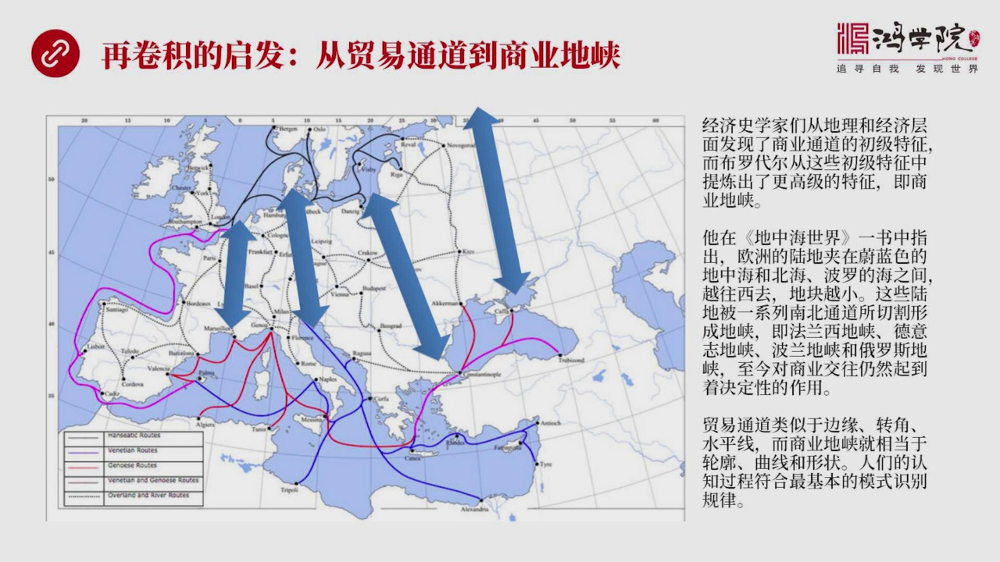

认识上的起发在这里呢我举个例子就是布罗代尔的地中海世界我给同学们反复推荐过这边书真是一本好书读十遍是源源不够的你这辈子读这个书应该读个几十遍可能还差不多我们有一些同学看过三遍之后就觉得啥也没记住不要指...

<strong>All subtitles</strong>

> 认识上的起发在这里呢我举个例子就是布罗代尔的地中海世界我给同学们反复推荐过这边书真是一本好书读十遍是源源不够的你这辈子读这个书应该读个几十遍
> 可能还差不多我们有一些同学看过三遍之后就觉得啥也没记住不要指望三遍就能记住很多东西如果你不用思维导徒把所有特征全部组织起来这书的内容量实在太
> 大这个书中间最重要的一个概念在我看起来或者说对我印象最深的一个概念就是它提出了商业地下的概念那么其实以前经济史这帮学家们他们在研究中世纪欧洲
> 的这种贸易活动中发现了很多贸易通道就是这个城市到另外一城市是这种贸易主要走的线路这叫贸易通道贸易通道相当于一种初级概念初级特征就像我们刚才所
> 说的边缘那么布罗戴尔实际上从大量的贸易通道中发现一个规律他发现当然我这张图上画的贸易通道是极其简单的就是这张图展现极其简单你看布罗戴尔这个书
> 中画得得一致地下密如之网他大量在从大量密如之网贸易通道中发现了一个总的规律就是集中在几个地区相当的密集比如说在法兰西地区存在一个他称为法兰西
> 地霞的这么一个区域准确说就是从罗纳河河口发过南部罗纳河口一直往上走经过所恩河然后到达抵达兰阴河流域最后到达法兰德地区这条线路是主要的最密集的
> 贸易通道而且你会发现法国的主要城市星期就在这个地区最早星期像里洋他在早年比巴黎要扭着多在罗马时代他就已经起来了然后所有城市的发域基本上跟贸易
> 通道的跟商业地霞的这个进化是同步的所以布罗盖尔他从贸易通道的大量的这些初级系列中他就发现了背后的规律这个规律就是我可以把这些初级的特征组合变
> 成一个高级的特征商业地霞所以他在这本书里面把欧洲他的这个地理研究透了之后他说在这个书里面他就说欧洲陆地像夹在两片海洋中间的一个一个越来越窄的
> 这么一个地块南边是地中海北边是北海和布罗地海然后这个西边大西洋所以他是一个越来越窄的陆地深向海洋那么在这个这样一个地形中间有四个主要的地霞切
> 割把这个大陆切割成几块他这个四个地霞最左标这个叫法兰西地霞中间这个从文伊斯这个这个位置从意大利北部一直直通到德国汉堡这是德意志地霞当然他是一
> 个有宽度的地霞律贝克到汉堡是在他北端南端是热闹药到文伊斯那么还有一个地霞叫波兰地霞波兰地霞就是从正常铃宝和巴尔干这个地区一直延伸到波兰的蛋泽
> 这条主要是被定成波兰地霞还有呢当然就是俄罗斯地霞从黑海有时候也包括黎海一直到这个纳福格勒德到这个后来的圣笔的宝然后进入波兰地霞那么当他提出这
> 四个地霞的时候突然我们就有了一种更高层次的一种认识有种认知提升了其实你会发现自古以来不管是多少年前和现在这几个地霞都是欧洲城市最密集的地区他
> 古往进来但是他都从这条通道上不断地买卖货物运送钱币所以他的商业重要性自古以来他就没有发生真正的变化人们今天仍然是这么地走过去是这样在进行经常
> 的貿易现在他的重要性同样存在所以这个貿易通道这是一个初期特征就好像边缘和转角水平艳而商业地霞就是一个相当于轮廓曲线和形状这样一个更高级的一个
> 特征所以从这个角度来看我们可以看到我们认识历史认识很多这个经济很多问题说它也是符合人工智能远级声音网络这个模式识别的基本原理我们不是一上来就
> 可以认识很复杂的模式我们是从简单模式开始的从简单的特征变成复杂的特征进行组合变成复杂特征最后形成一个模式的判断好我们再看看下一那么第五层远级声音网络

---

### Slide 12

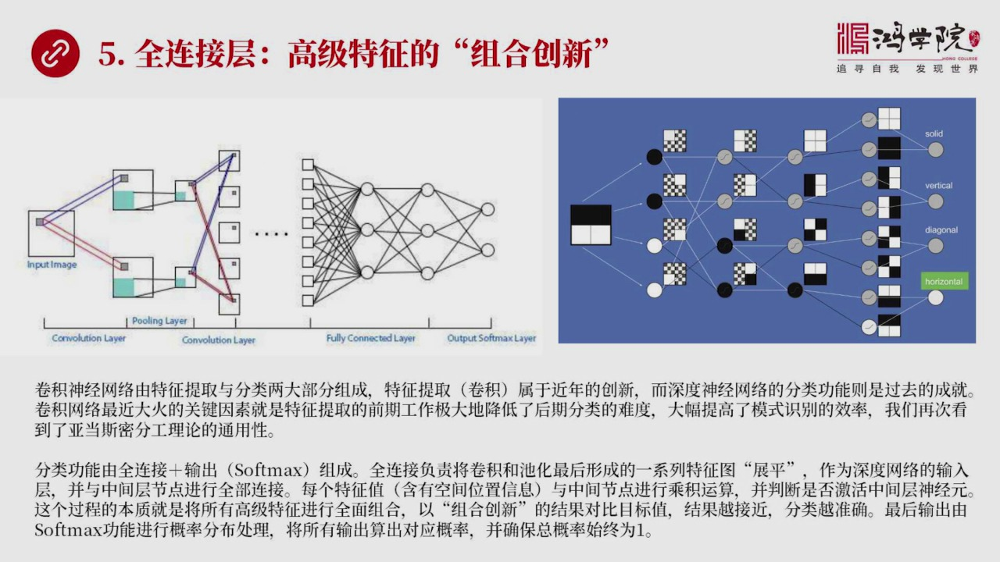

就叫全链阶层全链阶层在我看来是一个最有意思最好玩的一层其实也是最费劫最难以理解一层因为是在这一层进行了所有特征的组合创新我们刚才已经说了一层一层特征体链到最后其实已经是一些高级特征了就是它的标志性只要...

<strong>All subtitles</strong>

> 就叫全链阶层全链阶层在我看来是一个最有意思最好玩的一层其实也是最费劫最难以理解一层因为是在这一层进行了所有特征的组合创新我们刚才已经说了一层
> 一层特征体链到最后其实已经是一些高级特征了就是它的标志性只要有这些点它就一定会说明它是哪一类那么我们把这些特征图一大批高级特征图是在哪里已经
> 组合创新呢就在全链阶层全链阶层我们再看我们先看左边这样图吧这张图我们可以看到它输入图是一张图片然后经过卷机然后经过这个迟化然后到达了全链阶层
> 全链阶层我们可以看到它是一个它是一个相当组以为的相当组然后它是主播排开相当于一创神音源作为一层然后它跟后面的每一层神经源就跟第二层神经源每一
> 个掉链阶所以叫全链阶然后这个神经源分成若干层可以是一层作为隐形也可以是两层也可以是三层也可以是无数层最后两个是最后几个最后一排叫输出层就是我
> 们看到这明显是两个结构吧左边是卷机右边是分类分类它是靠什么时间呢就是全链阶然后输出关键是这个我们看到的这个人工智能大家说来说去说人工智能其实
> 这个关键的部分在右边这个人工智能的这个网络深度网络这不是新概念这以前就有从过五十年代一直进化到现在进化了半个多世纪真正现在大火的是它左边那部
> 分就是卷机卷机是个新的概念卷机是用网络现在最火因为它是个新的概念为什么这两个东西叫组合在一起呢其实亚当斯密早就说过劳动要进行分工生产率才能提
> 高在这也一样你要认知一个事物要实别出它的模式也必须进行分工就是特征提取要跟分类进行分工效率才高各自其职每一部分把自己的专业做到极致组合在一起
> 就会产生很高的人质效率所以这种这只算法就是一种高度优化真正的算法它比以前纯粹利用右边这个分类从一开始这个图片直接凸给它行不行可以但是效率积低
> 需要运萨量积大有了这个分工兆那么分类右边这个部分它这个传统的深度神经网络它是怎么进行分类的呢它主要也是两部分第一部分就是所有的神经园这一层跟
> 类层进行全部连接第二部分是输出输出它要用一个韩数Suffermax这个我们一会再说那么它的主要的权利连接它主要负责什么呢主要负责将捲极其和迟
> 化的最后一层最具特征性最高级的这一层形成一个特征图形成这些移系列特征图之后要把它斩平斩平之后形成深度神经网络的输入层然后与中间接点每个都连接
> 然后每一个特征值其实它中间是还有空间位置信息的我们造下业会相信讲这个概念然后与中间接点进行成绩认算也是居正成绩阵然后判断是否积活中间层的某个
> 神经员这个过程本上就是将所有的高级特征进行全面的组合创新然后以组合创新的结果来对比最后我的目标值如果这个跟目标值差距越小结果这个越接近那么最
> 后我做分类的时候我的分类就越准确那么什么叫Suffermax其实最后输出的时候比如说我要输出8个分类8个分类8种代表8种事务或者说我们通过字
> 母试别我要试别26字母那就26分类每10别一张图这个图可能是X所以这个X的它的它这个输出的这个只是多少我要用一种Suffermax这个办法我
> 把26个字母这个分类中间给每个分类分布一个概率就是实际上是把概率进行分布我会看到如果它是X它的概率很高92%如果是把它10别生A了那它是错的
> 太领埔了那可能这个0.01%所以它把每一个分类中间都做了一个概率的分析做了一个概率分布但是要确保26个字母上头每个概率分布它的概率总值是1这
> 它要起动主要作用这个数学细节其实没有什么更多可讲的关键是它是如何进行高级特征的组合创新的这个就涉及到传统了是您网络了就是右边我用这张图来表示
> 它是怎么进行组合创新的如果你把这张图读得比较明白当这张图只是最后的一个简化步骤中间还有一些其他的过程你会看到最左边这个输入图就是上面是黑的底
> 下是两个白块实际上它是4它是相当于二成二的一个四块上面两块黑的第二两块白的你看它这个过程通过低层第二层第三层你会发现它每一层都在进行组合成绩
> 的过程就是组合的过程你会看到当这个最上面这个黑色的就是第一层上面黑色的声音员跟另外一个声音员进行成绩的时候它变化出了一个很奇怪的一些新的组合
> 方式所以成绩的过程两个节点进行成绩的过程它本来就会创造出新的排列组合一让最后我们会看到这样的一个图形把所有我们能想象的这个排列组合全排出来了
> 最当上最后它实别是最下面这个上面一条是黑的底下两是白的然后它被激活了就是它这个颜色偏浅所以输出的结果就是它是一个水瓶水瓶的这样的一个识别的分
> 类那么这张图其实很有意思我在这里不说那么多细节其实你自己观察这个图你从每个节点到另外一个节点两个节点之间的成绩你再看它上面复着这张小图就明白
> 了原来从这张图可以逐渐通过这个一层一层这个运算可以把所有的它可能排列组合所有的这种特征全部给你展示出来这就叫特征的组合创新使用理解这一点之后
> 再加上我们对刚才卷积实话这个过程的理解基本上就完全理解了卷积声音网络它到底在干吗好 再看下一那么我们来看还是回到细节刚才说的是理念

---

### Slide 13

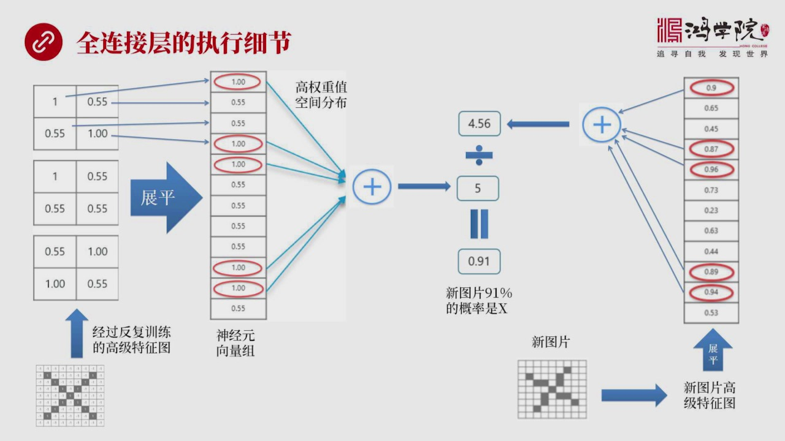

但是它怎么来计算怎么来计算概率但是这个是我刚才所说的十边X这个这个例子它的一个简单的概念事异比如我们可以看到去看左边左边我们最底下有个这个X这样的一个图形然后经过反复训练它实际上不是训练一次就能训练出...

<strong>All subtitles</strong>

> 但是它怎么来计算怎么来计算概率但是这个是我刚才所说的十边X这个这个例子它的一个简单的概念事异比如我们可以看到去看左边左边我们最底下有个这个X
> 这样的一个图形然后经过反复训练它实际上不是训练一次就能训练出来它进行成千上万次的训练最后你会发现经过反复训练形成了一个标准的特征图三块三张特
> 征图因为我们有三个特征碳的器最终一定是三个特征图但是都是高度减化了都是二十二三个二十二的举认然后你会看到我们要做的一件事情首先是把它展平我用
> 一些指示线就是展平的过程很简单就是它是按照这样一个规律左上角放了第1个然后第2个放到数列的第2个然后足够的时候把它排下就完了它真正有意思的地
> 方就在于通过成千上万次训练之后你会发现它的相量组中间在特定位置上这个数是1我又红色地圈把它标出来了这代表什么代表着它是有一种空间代念的就是经
> 过千万次训练认识好二十六这么反费练反费练到它读到X的时候就会在这几个点发量在这几个特殊的空间位置上它变成了11当然是相似度最高了也就是它完全
> 是重合的所以我们看到之这个1代表的一种权重就是它匹配度特别高代表它权重非常大而这种权重分布是有空间感的所以我们看到如果我们把这些所有是1的圈
> 起来的这些数字进行相加你会得到一个数值之五好这个时候训练完成拿到时间中去用了这个时候有人输入一张新照片这个新照片可能是我们看到右边是歪着写了
> 一个X不太像但是仔细看又有点像好这样了一个图片进入神经网楼之后当然卷机先是第一轮的卷机然后迟化第二轮的卷机然后再迟化然后然后训练什么呢形成一
> 个新图片的高级特征图它这个特征图也可以进行赶平像我们刚才左边这个展平样展平出来是这样一个数据的结果如果我们仔细一向一向对比你会发现它并不完全
> 的相似并不完全相同比如说左边是1的地方它是0.9或者0.87或者0.96或者0.890.94但是靠近1而其他的数值偏低而它出现这些位置跟我们
> 刚才所看到这个出现1的位置非常非常一致的就是如果我们看到左边这个经过法服训练了高级特征图你会看到它是在第1个然后第4个第5个然后后面底下两个
> 那么这边这个Y的扭曲的X出现的位置跟它是相近的是完全一致的而数值是相近的好这说明什么说明这张图看起来有点这样X关键像像到什么程度这要进行运算
> 如果我们把这5个数圈起来这5个数右边这个这个数字中5个数字上加是得出一个类加值是多少4.56而我们刚才标准化就是已经就过千锤百链了这个最具特
> 征的这个值加在一起是5所以4.56出于5我们得到了0.910.91就看起来说明什么说明我们新数这样图片跟我们标准的这个目标值它了稳和度它的这
> 种稳和度是91%是0.91%换句话说我们新出入这个图片最后被10%就是最后被认成X的概率是91%所以这就是一个全链节执行的一个细节问题搞明白
> 细节其实很重要不搞明白细节的话其实我们对于很大道理的推论是站住脚的明白这个细节之后我们再看下一那么全链节层给我们一种什么样的起发呢我觉得对我自己来说

---

### Slide 14

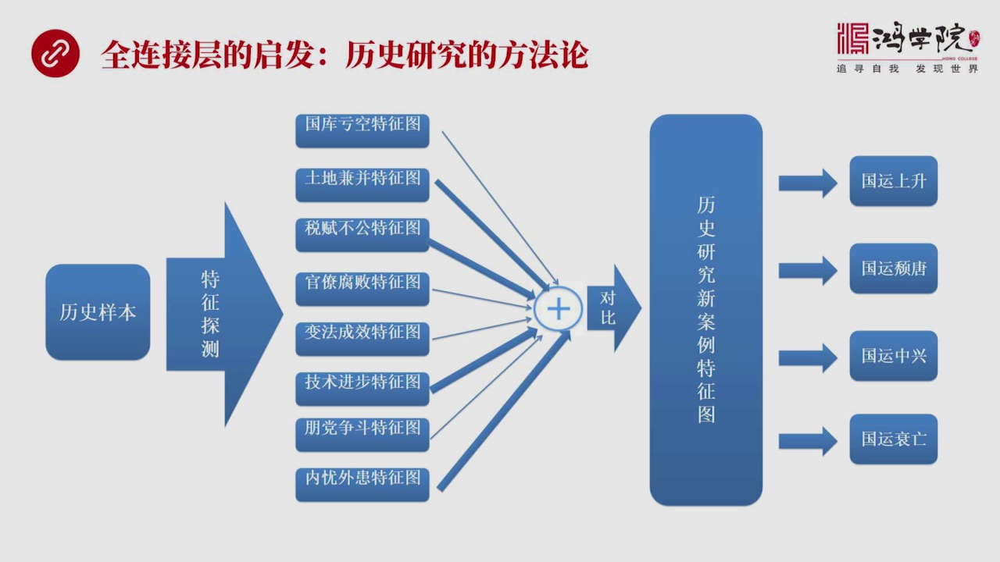

研究历史方面我觉得会产生一种方法论的一种新的认识以前我有很多本能的概念本能的理念在时间中不断在用但是没有把它精化 经练到或者要把它准确化到一个概念体系的成统上那么通过学习选择事情网络之后实际上带过很多...

<strong>All subtitles</strong>

> 研究历史方面我觉得会产生一种方法论的一种新的认识以前我有很多本能的概念本能的理念在时间中不断在用但是没有把它精化 经练到或者要把它准确化到一
> 个概念体系的成统上那么通过学习选择事情网络之后实际上带过很多起发历史研究只是其中之一如果以历史研究为例的话我们首先要反复训练一个历史样本比如
> 说我研究堂朝研究汉朝然后在研究宋朝以这三个朝代为主经过反复的训练就大数据反复的训练然后我就形成了一个历史样本然后我读到历史的时候怎么读呢其实
> 是首先经过脑子练比如说有20个特征碳子气比如研究汉朝这些知识流进到我的大脑中之后我的大脑中我已经一直到我现在分布了20个特征碳子气判册什么呢
> 比如说国库库空啊土地监病啊睡服不空啊国庖腐败 变法技术进步 膨胆内容外患好这是举个简单内容脑中间分布着大大小小的这种特征碳子气当我读到汉朝历
> 史这个信息流进来的时候不管它是电视剧还是实际还是这个别人还是忽略网上所说的它汉朝的一系列这种这种文章包括论文好 这些信息不管猜起来发的信息经
> 过大脑的时候首先是流经这些特征碳子气然后这种特征碳子气只对中间的某一个局部感兴趣比如说国库库空只对财政收住感兴趣其他信息我不看其他信息我不过
> 脑子然后同时啊就是看完一遍之后第二遍比如说我现在换上土地监病然后第二遍我在扫描这个信息是我只对土地监病的信息感兴趣经过反复的训练汉朝我训练完
> 了然后我在看唐朝当然这些训练出来结果肯定要做到特征土上就是四倍导土然后在看唐朝然后在看宋朝好 每个皇帝看一遍之后然后你就会形成一个带有权重的
> 这样的一个概念就是每个特征碳的气在王朝新摔的转折关头或者在优胜转摔的那个转折点上哪个特征碳的气的作用最大它的权重最高在这个厨上我用粗线表示那
> 就说这件事情很重要比如说土地监病比国库库库中的库空的权重要大为什么呢因为国库库库空有些时候在新王朝建立的初期都会出现这个现象国家刚刚打完仗税
> 收不足国库是欠钱的但并不代表这个国家要完蛋要走下坡路它还在征中日上所以在那个时候你出现国库库库这个权重应该被缩小不应该这么大比如说最大权重是
> 1它那个应该是0.3所以跟那个比起来土地监病的它的权重应该很大因为土地监病是代表一个王朝优胜转摔非常重要的一个参数出现了土地监病当然现在我们
> 叫财富分配不军到底是样的好出现这个问题之后它就一定会出现税负不公的问题土地监病了有些人不愿纳税所以想尽办法隐瞒土地国家查到这个钱收不了这个香
> 深释身机成了这个全贵的进税那就只有把税压给老百姓好这个时候税负不公也是一个高度重要的权重非常高的一个特征值然后再往下比如说技书进步其实很重要
> 因为我们以前在研究王朝新税的时候往往忽略了技书因素如果你在走下坡路过程中迎来一次重大的技书突破会不会改变王朝命运呢有可能以前我们低估了这个因
> 素现在必须要把技书对经济零响来这对整个社会对王朝的这种影响都要靠着进去还有呢内外患因为最后王朝总是要么是王云农民企要么是王云外地入侵所以他的
> 权重也很大而其他的比如官僚腐败这个权重相对来说他是有作用的没有这么大为什么因为立场立代没有不腐败的官僚这是一个通常的老比只是说他的严重性和整
> 个其他的权重已经对比他的什么阶段出现了这个腐败比如说在明朝初年有一些腐败但是当时这个他这个王朝争争日上所以他不会营养大局所以把这些全部的权重
> 进行累加然后你再跟比如说我现在研究一个新的炒弹我现在要研究原炒以前没研究过原炒好你把原炒这个历史样本跟你已经经过千岁百链的这样一个样本进行对
> 比就像我刚所说的两个样本算一个比率最后你会发现原炒在某一年出现了一个什么什么事件或者出现什么什么什么东西你以来对这件事情进行一个平派它到底是
> 说明原炒处在哪一类就是国运分类就是最后表这件事情我们可以把它算出个概率来理论上来说是可以算出一个概率算出一个概率经过我们考虑几十个特征探责器
> 包括其权重然后跟我们经过千岁百链数值进行相处得出这个比例然后再经过softmax然后你可以把它算出一个一个权重的分配一个概率分不图然后你会看
> 到在比如在这个1372年出现了一个什么什么事这个事是个官员贪污烂键那这件事情本身是不是意味着原炒上就要灭亡呢好这个1368年它已经灭亡了比如
> 说这个1300年吧出现了一个问题好这个时候你算出这个概率你会发现其实它当时国内还在上升1368年它的灭亡所以好你如果得出一个概率来那它应该是
> 出在一个国运上升期或者国运推行期或者国运中心期或者国运衰亡了所以任何一个历史时间都可以通过一个加全计算跟我们一个标准目标值进行一个对比我们就
> 可以发现就可以对它进行分类这个事情的分类它到底是出在哪个17国运的分类就能够得出一个完全不同于以前它的一个新的思想方法以前我们研究历史是可以
> 说弹性太大或者没有张法我想怎么看就怎么看我想怎么说就这么说没有标准所以每个人说的历史都不一样就不规范不系统不调理化好我们再看下一个第六个层次也是非常有趣的层次

---

### Slide 15

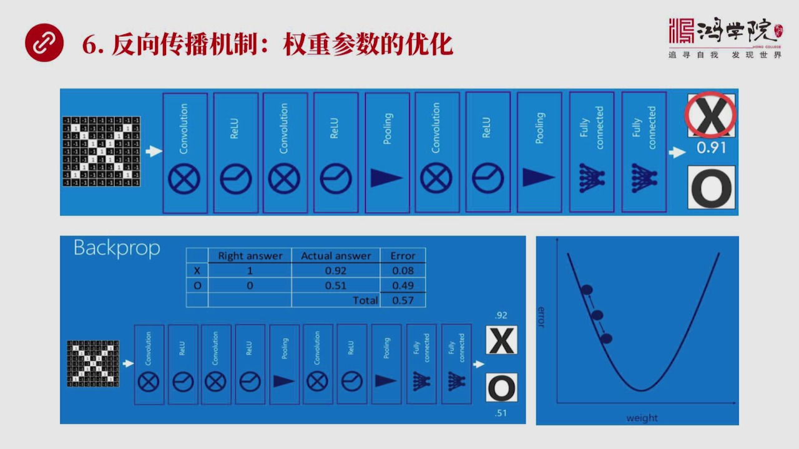

它叫反向传播机制反向传播机制如果我们看上面这张图它经过了这个X那之后经过了好多层首先是拳击然后锐炉然后是再拳击然后再锐炉然后再铺领再吃话然后走一个轮回再走一个轮回走两个轮回之后进行全链接两层全链接之后...

<strong>All subtitles</strong>

> 它叫反向传播机制反向传播机制如果我们看上面这张图它经过了这个X那之后经过了好多层首先是拳击然后锐炉然后是再拳击然后再锐炉然后再铺领再吃话然后
> 走一个轮回再走一个轮回走两个轮回之后进行全链接两层全链接之后输出一个结果X比说0.91它的概率那么O是另外一个概率就说这套模式训练传了但是你
> 是0.91啊你不是1啊说明什么你还有0.080.08这个0.080.09这样的一个概率概率15啊这个概率15是怎么来的呢能不能改进呢这可能一
> 开始你可能这个数字还比较低我们现在要谈到优化问题优化问题它是要通过反向传播机制来进行优化就是0.91代表我个目标值你这个1还有差距好我们要理
> 解它这个训练的过程从一开始一开始是一个什么状态一开始没有经过训练的训练网络X进来它的第一层卷机那个数那个中间那个特征碳子器那些所有的数值全都
> 是随机分布的全中每层的全中包括这个全链接中间每一层的神经圆的全中全部是随机分配的随机的好这样算走一圈下来一定是一个错的非常临普的一个可能不是
> 临着与可能是0.31就是只有30可能这个数是X这个数值是X那怎么办差的太大差的太大就要进行反向传播了那我们把差这个数值通过它的内在机制传到回
> 去传到去更新比如说我的这个卷机层我第一个特征碳子器我一开始是乱的比如说一个33与正这个数值是随机排的好我现在要做调整的时候怎么调整我不能乱改
> 乱改就没有意义它就不系统了我要调整它的方式是按照我们右下角这个图这个图它其实上一个山奥它的基本原理就是我在每个数上调这么一点点往下和往上走比
> 一点点走一点点之后我算一遍我看一下这个最后的输出值到底是以前第一次是0.31现在是变成了0.25了如果变成0.25说没有错误动力谱了行那我就
> 往下调如果我刚刚把这个数往上调我去现在就往下调然后一调之后再应该再发现我变成了0.4说明这个方向是对的我再调往0.4方向再往这个数值同样的方
> 向再调再调我发现0.60.70.8越来越高它就好像是山奥上的这些石球慢慢滚到了最低处这个就是反向传播它的基本原理每一次改都要改什么呢我改这个
> 卷级层的头脑炭的器的残数我要改神经圆中间的很多很多残数全中这都得改然后一遍一遍呈接上了1次改完之后这个叫训练和优化然后最后改到一个非常高的一
> 个数值比如说0.91过关了这就变成了一个可以进行投入使用的成熟的产品这个时候我不管是10bx还10b0什么什么东西这套神经网络它的每一层的残
> 数和全中都已经定在了就这个数了这是最优化的好再来一张心土我用最优化的东西的识别它的准确率就会非常高所以反向传播机制在中间起到了重大的作用不过
> 现代的整体神经网络它反向传播机制在很大程度上已经被标准化所以我们从这个如果大家是学生工程搞人工智能的话这一套统一它就变成省事了要不然它的背后
> 的理论还是比较复杂好我们看一下价业反向传播机制有什么起发呢它的最大起发

---

### Slide 16

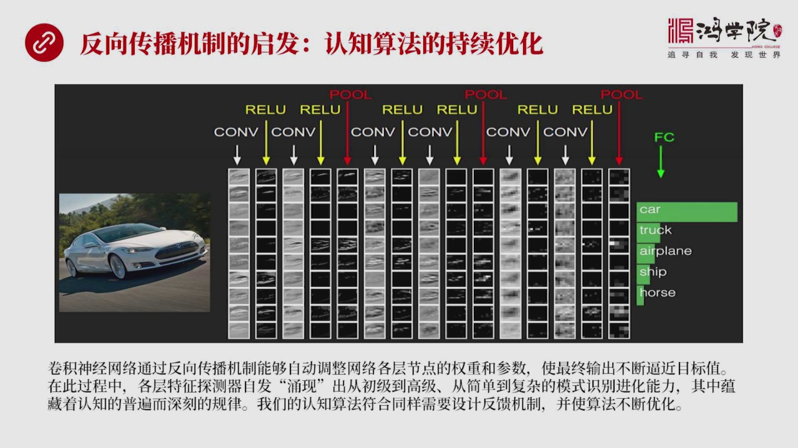

就是我们的认知算法需要实际优化而且也可以实际优化你比如说我再用这张图再重复一下整个整体神经网络它的过程你看图片中是一个汽车然后经过第一层卷机然后它卷机出来是一些移系列汽车的特征比如说它是246680它...

<strong>All subtitles</strong>

> 就是我们的认知算法需要实际优化而且也可以实际优化你比如说我再用这张图再重复一下整个整体神经网络它的过程你看图片中是一个汽车然后经过第一层卷机
> 然后它卷机出来是一些移系列汽车的特征比如说它是246680它是十十来个这个卷机端子器就是特征端子器出来是十几张照片好然后我对这些图片进行锐炉
> 就是把副的全部去掉保留零和正数然后你会看到它一下就变成了另外一个状态然后我在把这个这个这一系列职责为输出再给下一层再进行卷机卷机又发现另外一
> 种就是它用另外一个系列的特征端器又探测它的另外一个特征然后再进行迟化然后再进行卷器然后再进行迟化搞三遍之后最后进行权料界输出输出你会看到这个
> FC就代表权料界它输出就是你明显看到这个卡汽车的这个轿车的这个概率就非常大卡车飞机船和码这三个都比较小但这几个加在一起它比较有五个输出五个输
> 出这五个加在一起它一定要是1概率总的概率一定要是1它怎么做到这一点当然是从我反向传播一开始肯定这朔朔乱的就是输出的概率是完全离谱的经过一遍一
> 遍一遍反向传播这种训练机制它逐渐变成了优化成的这样它这个中间最有意思的地方是什么呢它实际上是一种自动调整网络各个层次节点的参数和权种这些东西
> 比较神奇你比如说我不是说一开始我就认为我只需要只需要规定比如说我选三个特征炭的器还是三十个我一开始只需要规定这个数包括它的大小比如说三成三个
> 举认还是五成五十举认我把这个东西固定之后中间所有举程中间所有数我是不用管的不是像我们想象这样我一定要把它写成国库亏空炭的器中间有一个固定的数
> 字它没有它需要固定的只是特征炭的器的数量还有特征炭的器的这个举阵举阵的大小那么经过反复的训练之后就是跟目标之反复交队然后反复训练之后你会发现
> 它的每层的特征炭的器是自动进化出来的它的参数是自动进化出来的也就是我第一层直检测非常简单的边缘还有拐角或者颜色然后第二层我就检测比较复杂的比
> 如说轮廓形状和曲线第三层我就检测一个更复杂的比如说狗脸 人脸马腿主持策略这种自动进化出来的特征炭的器的所有参数这个是一个非常非常神奇的事这也
> 是这也是很多人其实它困惑就困惑在这儿比如说我们以前特别强调演艺逻辑我们在以前的课程中这个任何过程我们理论说都可以用这个数据公式来表达用多次模
> 拟的方式把它画出来的曲线然后来进行模拟演艺逻辑它的最高进届就是我以我把一切东西都可以进行精确的表达连历方程式然后精确表达任何曲线我都可以表达
> 出来但是人工智能中间的这种反馈所引发起来的每成参数自动调整让每一层的特征特征器自动进化出不同的层次来每一层测试的特征的复杂程度不一样这玩意这
> 个过程怎么能够用这个过程它就无法用演艺逻辑来理解也无法用任何公式来进行描述你如果真烈恐怕得烈几万个或几十万个连历方程而这是完全无法列出来的也
> 就是说我们用演艺逻辑的思维已经无法理解这个黑瞎子面它怎么会变成这样这就涉及到一个思维方式必须要进行革命的这样一个话题西方人最强大的实际上是演
> 艺逻辑还不是归纳逻辑归纳逻辑中国人更强一些所以你会看到西方他在走到了这样的一个演艺逻辑的镜头的时候三段论让了石头的那个时代开场开天屁地然后经
> 过后来的哲学家不断的推进然后我变成了树里逻辑变成了符号化变成了公式演艺逻辑这帮人他的最高境界就是把一切东西全部用年龄的方程来解但是发现在越来
> 越发现大量数包括人工智能的这个它这个能够它是怎么实现黑瞎子面能够把东西10月出来这个过程我们现在已经把它讲明白了但是我们仍然不理解它这个多层
> 论决定是你网络它到底最后包括后来的这个分类器它到底是具体的工作原理一步一步推倒你还想推转吗绝对推不出来很困难这就是演艺逻辑走到了人工智能我觉
> 得它已经撞上了一堵撞上了一堵墙也就是人们无法理解人工智能真正的工作原理就是好像我们大家无法理解大脑在想事这个事情要按照一条准确的演艺逻辑来推
> 来推这个思维过程这能做到吗做不到所以这需要一种更高层次的思维的突破但是不是说演艺逻辑不重要当然很重要如果没有演艺逻辑我们连现在说到这个地方的
> 所有的认知的这样一种过程都描述不出来就像网络网络名格主子它能够隔出这一东西来吗当然不行就是由于缺乏演艺逻辑所以演艺逻辑现在说它仍然非常重要但
> 它已经面临了一种复杂问题的巨大挑战这是我们需要认识的也就是说我们现在你会发现它这个过程中反馈机制所带来的美藏的这个参数调整然后自动进化成为一
> 种识别模式的能力这其实代表了一种人类认知事物也是同样的规律因为它是自动进化出来的跟人类自动进化出来本上应该是一样的所以深刻理解人物是能它的模
> 式识别的一些原理对于我们理解我们人类自身认知也是有帮助的也就是从简单的模式到复杂的模式从低级模式到高级模式然后对模式进行组和创新这个过程不断
> 地持续不断地优化我们就会人类就会变得认知事物就会变得效率越来越高好最后我们总结一下今天对堂课的内容我们通过对选积声音网络模式识别的过程分析

---

### Slide 17

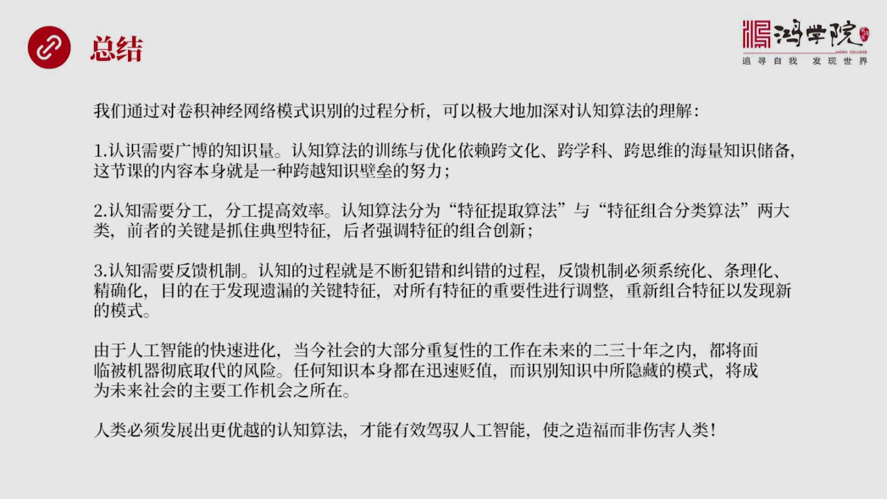

其实可以极大的提高极大的加深我们对认知算法的一种理解其实也可以说提高我们认知算法的能力从三个方面来说第一个方面就是认知需要广播的知识量这是前提为什么就像算法一样必须要大数据来训练认知算法的训练也一样认...

<strong>All subtitles</strong>

> 其实可以极大的提高极大的加深我们对认知算法的一种理解其实也可以说提高我们认知算法的能力从三个方面来说第一个方面就是认知需要广播的知识量这是前
> 提为什么就像算法一样必须要大数据来训练认知算法的训练也一样认知算法它的训练和优化都要依赖于跨文化跨学科跨思维的海量知识儲备你如果不读书如果你
> 不愈预读大量的这种大量的书没有广播知识知识儲备的话那就不可能真正的提高自己的认知算法而我们这堂课本身大家如果自己签认知听你会意识到这堂课内容
> 本身就是一个跨学科跨越知识必累的一种重大努力因为无论在中国还是在美国不可能找到第二节类似的课第二个就是认知需要分工而分工提高效率亚当思密早就
> 说过这个问题所以认知算法应该分为两大部分一部分是特征提取算法另外一部分是特征组合分类算法那么前一种特征提取主要是抓点形特征而第二个算法主要是
> 强调组合创新在这两个算法中间如果能够取得突破那么时会说我们认知能力不断提高第三认知需要反亏机制认知的过程就是不断犯错和纠错的过程其实反亏过程
> 就是不断的在纠错而这个反亏机制它必须要系统化调理化精确化目的在于发现一路的关键特征我们是不是判断错之后我们说是不是忘掉或者忽略了某些关键特征
> 然后如果没有忽略是不是对所有的特征它的全重分配不对我们要进行调整然后要从因组合这些特征的这些关键性的特征从因排列组合之后你可能会发现新的模式
> 这就是我们为什么需要认知为什么需要反亏机制由于现在人工智能的快速进化可以说越来越快那么当今社会大部分重复性的工作估计在未来二三十年之内都会面
> 临被机器彻底取代的风险这其实对我们每一个同学包括这些同学的孩子们包括他们的教育都有重大的影响一切重复的工作机器都能做我们看到了人工智能现在图
> 像视约云视约还有自然云视约这三个方面的重大突破已经标志着这个时代它从技术从来上已经没有问题了现在就是在细化和在住多领域的普接而已那么你如果回
> 想一下每天上班的工作只要是重复性的只要是略带重复的这些东西都有可能被替代只有每天创新每一件事情做的都创新才有可能生存这就是人工智能将给未来的
> 社会带来巨大挑战那么从另外一个小段说知识任何知识什么样的专业知识都一样所有知识都在迅速变职知识本身在变职但是识别这些知识背后隐藏的模式这种能
> 力将会变成未来重要的能力将会变成社会可能受未来主要的就业方向就是在进行模式识别上知识大量的廉价的攻击但是知识背后的模式识别这种人就少了虽然人
> 工智能可以帮我们做但是人工智能需要人类的指导也就是我们人类必须要发展出更优越的认知算法才能够真正有效的价于人工智能使时造福于人类而不是伤害人类好今天我们关于认知算法论诊下半部分就先讲到这里谢谢大家

---
