# 核心课视频-043讲. 脸谱天秤币（视频） — Slide Notes

> **来源**：鸿学院核心课程  
> **幻灯片**：15 张

---

### Slide 1

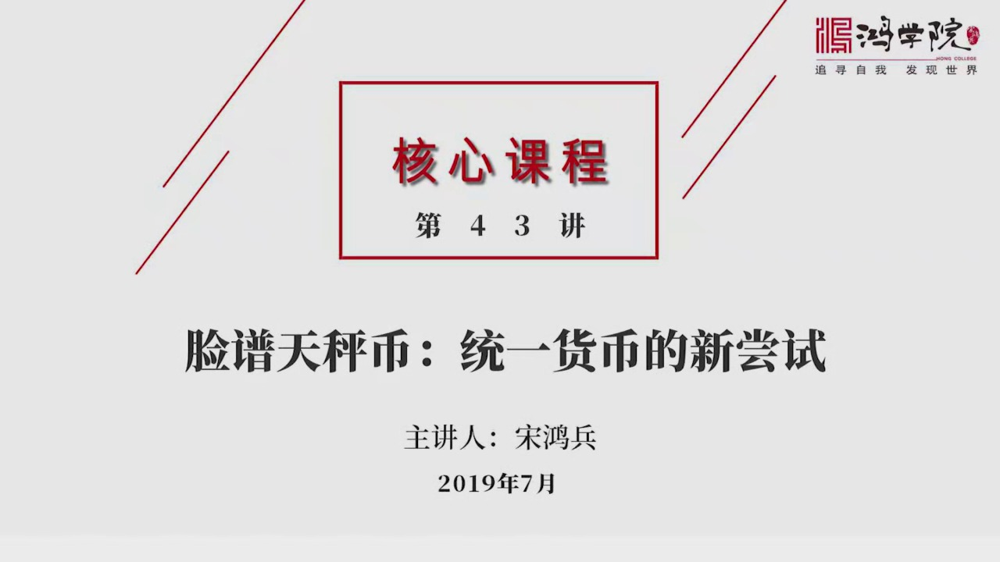

联普天政币统一货币的新尝试2019年6月联普公司提出了要搞一种数字加密货币Libro 减成是天政币消息传来引起了世界各国的巨大翻响也引起了很大的争议我们都知道全世界有一种非常强大的潮流就是认为未来会形成一种全球的统一政府那与之相适应就需要一种全球统一的货币这种尝试在历上经过很多次包括特别低管权包括更...

<strong>Cleaned narration</strong>

> 联普天政币统一货币的新尝试2019年6月联普公司提出了要搞一种数字加密货币Libro 减成是天政币消息传来引起了世界各国的巨大翻响也引起了很
> 大的争议我们都知道全世界有一种非常强大的潮流就是认为未来会形成一种全球的统一政府那与之相适应就需要一种全球统一的货币这种尝试在历上经过很多次
> 包括特别低管权包括更早的这种黄金美元现在出现了一种新的方式就是数字货币来统一全球货币体系至于这件事能不能做成人者建人制者建制但是联普公司提出
> 这个天政币从数字货币发展的潮流来看的确是很有特色的一种新的尝试所以今天我们就这个话题来深入分析一下联普搞这个天政币它的本质是什么那么它未来能
> 不能够顺利地推进开来下面我们看第一页我记得我们在核心课认知算法论中间曾经讲到过

---

### Slide 2

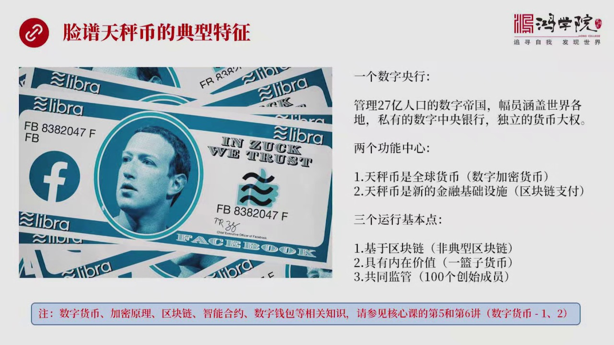

我们在分析任何事务的时候首先最重要的事情是要抓取这个事务最本质最典型的特征所以我们按照这个思维方式来看联普网所推出的这种天政币它最典型的特征究竟是什么我在仔细研究了这个天政币它的白皮书之后把它的典型特征归纳成了这样几个数字就是一个数字央行两个功能中心三个运行基本点什么叫数字央行我们可以想象一下联普网...

<strong>Cleaned narration</strong>

> 我们在分析任何事务的时候首先最重要的事情是要抓取这个事务最本质最典型的特征所以我们按照这个思维方式来看联普网所推出的这种天政币它最典型的特征
> 究竟是什么我在仔细研究了这个天政币它的白皮书之后把它的典型特征归纳成了这样几个数字就是一个数字央行两个功能中心三个运行基本点什么叫数字央行我
> 们可以想象一下联普网它所构建的实际上是一个数字帝国了在里面生活着27亿人口这些人每天在联普网中分享自己的生活和工作的种种的体会交流着对时事对
> 新闻的各种看法同时还参与很多社交包括游戏这样的活动27亿人聚在这样的一个空间之中会形成一种巨大的思想的潮流那么我们都知道思想其实是具有能量的
> 我们可以称之为是一种试能那么这种试能一旦给它提供相应的条件比如说给它提供数字货币这样的一种方式那么这种试能就很有可能转变成一种经济上的动能大
> 家就开始使用这样的数字货币来进行经济活动所以这种思想的试能在特定条件之下是可以转变成经济动能的那么想想看连普网这个数字币国有多大里面生活这2
> 7亿人口相当于世界人口的三分之一还有多它的边疆可以说涵盖全世界所有的国家另外它还具有独立的货币发行权这样的话就是这样的一个数字币国变成了一个
> 超越主权之上的强大的经济试体在这个经济试体中间现在连普准备搞出一个独立的中央银行而且是私有的中央银行数字样行所以它对全世界的经济乃至于对世界
> 各个国家的主权都会形成巨大的影响这就是它为什么会引起这么多国家的强烈的反应这就是它第一个重要的特点一个数字央行而且是全球统一的数字世界的最大
> 的样行那么两个功能中心就是在它白批书一开始连普网就明确提出它这个搞着天称币是一种数字加密货币但同时也是一种全球货币这是它的明确的提法全球货币
> 我们可以想象一下连普网是对自己的定位非常高它有一种熊心状质统一全世界的货币要建立全球货币所以这是一个非常高原的质象第二功能就是这一套数字加密
> 货币体系同时还是一种新的金融基础设施也就是用区块链作为全球金融体系的支付的主要的一种手段来取代现有银行体系的传统的支付手段所以它同时具有这两
> 种功能一种是全球的货币另外一种是替代当金银行体系的支付系统那么三个运行基本点呢也是在它白批书中明确提出来的首先是基于区块链关于区块链这个概念
> 我们在我们的核心课第五奖和第六奖中间专门讲到过这两奖都是讲数字货币的上下部分中间设计到什么叫数字货币什么叫加密什么叫区块链什么叫智能合约包括
> 数字钱包等等相关之事如果大家想了解这些内容的一些细节可以去参考核心课的第五奖和第六奖那么连破亡搞的区块链其实是一种我们可以称之为是非典型区块
> 链因为典型的区块链像比特币为代表的这种区块链它是一种区中心的而连破亡的区块链并非是区中心的它有验证的节点这些验证节点由于它们起到对所有交易的
> 验证的做法所以使得整个连破亡天称壁的区块链它非常不同于比特币的区块链可以说它是有区块但不用链它不是有一个一个区块由于竞争计仗串在一起形成了一
> 个超级大仗户而是只有一个超级大仗户不是一块块组成的也不用核心算法把它串在一起不用竞争计仗这就导致它的计仗效率非常高我们知道贬型的区块链它的交
> 易速度由于竞争计仗消耗了巨大的运算力所以每秒钟大概也就是6-7比的计仗速度这当然跟传统的金融体系的这种计仗的速度要差得多了传统的计仗速度我们
> 可以达到上千比以上每秒钟那么比我们看到比特币所形成了区块链的巨大的竞争计仗所形成的这样的一种平静使它难以成为全世界日常生活和交易过程中所依赖
> ...

---

### Slide 3

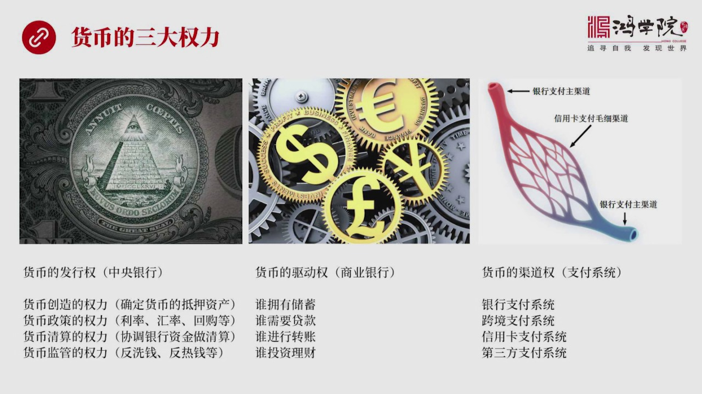

具有三大权利任何一种权利这个全球货币都会具有三个权利第1个权利叫货币的发行权第2个权利叫货币的驱动权第3个权利就是货币的驱道权在途中我们把这三个权利分别列出来了比如说什么叫货币发行权这主要是被央行所掌握货币发行权我们又可以把它细分为四个主要权利就是货币创造的权利货币政策的权利货币清算的权利和货币监管...

<strong>Cleaned narration</strong>

> 具有三大权利任何一种权利这个全球货币都会具有三个权利第1个权利叫货币的发行权第2个权利叫货币的驱动权第3个权利就是货币的驱道权在途中我们把这
> 三个权利分别列出来了比如说什么叫货币发行权这主要是被央行所掌握货币发行权我们又可以把它细分为四个主要权利就是货币创造的权利货币政策的权利货币
> 清算的权利和货币监管的权利货币创造就是它有权确定创造一种货币以什么东西作为抵押资产比如说从前的应棒19世纪的20世纪的美元你会看到应棒是采取
> 的金本位创造一应棒背后必须要有等值了黄金作为支撑所以应棒号称是跟黄金同等的价值那么一战以后包括在这个二战结束的相当一段时间之内美元取得了应棒
> 那么它也是以黄金作为抵押来创造美元的所以那时代叫黄金美元那么那个时代的货币发行制度叫做金会队本位制其实也是间接以黄金作为支撑来发行美元所以叫
> 美金一美元背后有31.1克的黄金作为支撑或者说我们可以说这个美元的背后是黄金一样是黄金31.1克那么它所对应的美元价值就是35美元应该说一美
> 元背后有接近一克的黄金作为支撑那么这个叫货币创造的权利当然了在1971年之后金本位解体了后来就变成了石油美元买石油需要用美元所以它的价值的最
> 终的抵押品黄金变成了石油表面上来看当然是这个发行美元的基础是国债但实际中在国际上上它的真正价值支撑是石油这叫货币创造的权利什么叫货币政治的权
> 利呢就是中央银行有权决定比如说利率 美联出美每次召开会议的时候都有一个利率的决定这个决定信了全世界所有金融市场参与金融市场交易的这些人士的普
> 遍关注加稀 检稀这是央行的决定权还有会率比如中国央行对会率是高度关注的人民币和美元的比值是多少如果人民币贬值到了一定程度央行会过断出手一持会
> 率稳定说这个之外还有比如我们既然看到新闻中讲到了回够你回够释放多少多少资金或者对整个金融市场进行一些操作这些都是货币政策的权利货币清算的权利
> 呢也就是各个银行之间的转账我们不管用微信还是用这个支付宝还是用银行转账其实最后的清算是央行在做清算所以清算的权利也是中央银行的核心权利之一当
> 然还有货币的监管权比如我们看到央行经常说要惩罚哪个金融机构由于它微反了比如反热钱的一些法律或者反洗钱的一些规定所以对它进行一些惩罚这是监管货
> 币的权利所以中央银行 每家中央银行都具有这一系列的权利那么除了货币翻新圈之外呢货币的全球货币的第二大权利是驱动权驱动权就是我们怎么来驱动货币
> 的流动使它保持一个流动的这样的方向性就是货币怎么被创造出来使用到哪些领域中间去这些权利往往是掌握在商业银行手中的这些权利包括什么呢比如说商业
> 银行体系掌握着相当多的信息谁拥有处序谁需要贷款 谁需要转账谁需要投资理财由于银行体系掌握着这些关键性的信息所以它能够细纳处序创造货币也就是通
> 过贷款的形式创造货币然后能够提供转账的服务然后能够帮助老百姓进行投资理财银行通过这样一系列的服务实际上主舞蹈这货币流动的方向或者说驱动着货币
> 流动这个我们可以称之为是货币的驱动权货币它是要流动的 怎么流 谁来驱动商业银行体系第三个权利货币的第三大权利就是它的驱道权货币要想流动就必须
> 要在某种驱道中间它不是屏空飞的是要在物理驱道中进行流动我们一般人都非常了解决话驱道维网在金融体系之内驱道维网这个概念同样成立就是谁控制着货币
> 流动的驱道谁其实就是真正货币运动的主摘者那么这就是货币的支付系统这套系统传统上来看是由银行体系 包括央行 商银行组成了支付全国这全球的银行支
> ...

---

### Slide 4

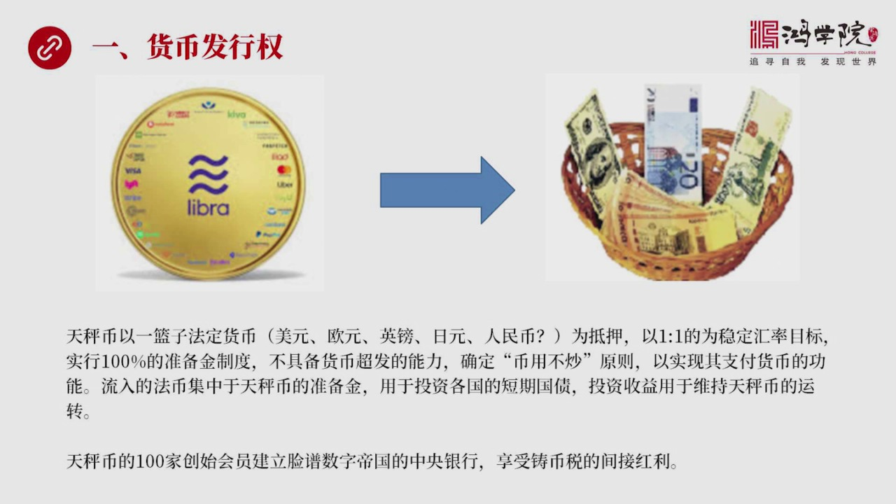

又是如何来控制货币的发行权的那么连普的这个天称币我们刚才提到他是由伊兰子货币 法定货币来作为发行的基准包括美元 欧元 应棒 日元不知道未来有没有人民币是以这伊兰子货币作为价值的支撑为抵押来创造天称币那么他的基本原则就是1比1他要实现一种稳定汇率的这样的一种目标而且他实行的是百分之百的准备精致动行县举...

<strong>Cleaned narration</strong>

> 又是如何来控制货币的发行权的那么连普的这个天称币我们刚才提到他是由伊兰子货币 法定货币来作为发行的基准包括美元 欧元 应棒 日元不知道未来有
> 没有人民币是以这伊兰子货币作为价值的支撑为抵押来创造天称币那么他的基本原则就是1比1他要实现一种稳定汇率的这样的一种目标而且他实行的是百分之
> 百的准备精致动行县举个例子就是你要想创造一个天称币不能够平空创造你必须要有亿美元或者相对应的一个货币单位法定的货币单位留进去他以这个为抵押创
> 造一个天称币那么留进去这个法币去了哪去到准备精那么当你如果要留出比如说你要退出天称币系统你把这个美元或者一个法定货币带走那么体系之内的天称币
> 也会同时被消灭用这个办法来保证整个天称币的货币发行体系里面完全是百分之百的准备精如果没有准备精货币同时被退回所以这中间是没有货币超发的能力的
> 在我看来这句话用一个简单的表达方式就叫避用不吵原则我们现在经常提到的房子是用来住的不是用来吵的那么天称币用的也是这个思路天称币是拿来支付的不
> 是拿来吵作的所以我称之为是避用不吵原则一种货币要想成为大家普遍使用的支付货币日常交易货币它一个基本特征就是必须要价值稳定不管是匯率的跟其他的
> 法币之间的对换关系还是它内部价值高度稳定之后人们才会使用这种货币来经营交易而这正是其他的数字货币现在面临那个主要的一个困难你比如说比特币如果
> 它升值很快这意味着没人愿意用比特币经营交易因为你用它经营交易你亏了所以你就会有迟币带购迟币这个等带升值有这样一种强烈的起初你不会愿意使用这种
> 货币因为用了你就亏了但如果它是贬值贬值很厉害那么接受货币的地方往往不愿意接受贬值的货币你比如说它从一万多掉到了3000那么很多商店就说你付给
> 我比特币而这东西亏惨了所以不管是升值还是贬值如果幅度太大对于这种货币成为日常生活中的普遍使用的交易货币和支付货币都是非常非常不合适的这就是价
> 值稳定会率稳定是任何一种货币成为日常生活使用支付货币的一个前提条件不具备这个条件不执行这样一个避用不吵的原则它就很难流行开来所以我们看到天政
> 币为了解决这个问题它采用了跟法定货币挂钩采用了一比一的稳定会率的一种手段实行了百分之百准备精致度这几项原则来确定它的币制稳定会率稳定那么流进
> 这个天政币这些法定货币去了哪里呢比如说未来在联邦网中流进了一万亿美元的资金这些资金去了哪里呢因为在联邦网中一万亿美元会创造一万亿个联邦的这个
> 天政币那么一万亿美元去了哪呢全部去到了准备金账户这是一个超级大钱包我们可以把它想象成一个微信的钱包或者是支付宝的钱包那么在微信和支付宝中间可
> 以享受一些投资的红利比如说你可以进入货币市场通过第三方那么你可以赚取一些比如说支付宝中间的一些利息但是在天政币这个系统中你是拿不到这个东西的
> 所有的资金全部被归笼在准备金账户上准备金账户用来投资各个国家的一些短期国债当然这就会产生收益这收益归选不是归使用天政币的普通用户而是归监管或
> 者说天政币的创始的一百个会员这些出了钱搞出了天政币体系那么要维护这套天政币体系是要有成本的那么这种投资收益就归属于这些人当然了我们明眼人一看
> 就知道天政币所招募的这些创始会员比如说他现在准备招募一百家这一百家创始会员其实就是数字央行的股东未来的股东那么天政币这套体系其实也是一个典型
> 的私有中央银行私有的数字的中央银行所以很多人在我们这个讨论货币创造过程中讨论银行的功能这些问题的时候很多人不理解为什么西方的央行制度他是立上
> ...

---

### Slide 5

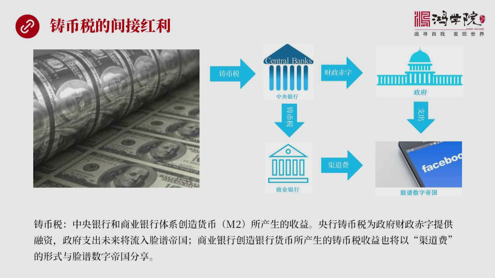

体系联合创造的货币M2他所产生的种的收益因为货币在历史上他是金币那么那个时代进行货币驻造了过程中会有损失那么这个驻毕场会向老百姓争收一定的额外的费用当然中央银行当然政府后来中央银行控制这套体系之后他们就把这个损失额做得越来越大我们中国立场叫火号其实在西方立场这个叫驻毕税到底是一样的就是我以不足额的金...

<strong>Cleaned narration</strong>

> 体系联合创造的货币M2他所产生的种的收益因为货币在历史上他是金币那么那个时代进行货币驻造了过程中会有损失那么这个驻毕场会向老百姓争收一定的额
> 外的费用当然中央银行当然政府后来中央银行控制这套体系之后他们就把这个损失额做得越来越大我们中国立场叫火号其实在西方立场这个叫驻毕税到底是一样
> 的就是我以不足额的金币把他定义成一种很高的价值他的面质定义的很高中间的差价就是驻毕税那么在现在生活中现在的经济生活中我们看到比如一百美元他的
> 真实的游墨费纸张费全部的真实成本大概是四美分一百美元的真实成本只有四美分而普通老百姓要获得这一百美元的超票你得付出百分之百真实的努力真实的勞
> 动成果才能交换这一百美元的超票中间四美分和一百美元中间巨大的差距哪去了被人家收走了被驻毕税的征收方给人家走了所以你是亏了而且亏惨了那么这些驻
> 毕税是怎么征收的被谁征收了呢我们看右边这张图你会看到每一张超票一百美元的成本是四美分中间产生了巨额的驻毕税首先被谁收走呢中央银行每天储他印超
> 票不管是真实超票他还是数字的这种银行体系的数字表现他都是货币一美元被征收了这么多那么这些钱去了哪两部分第一部分他其实是带美国财政部征收的驻毕
> 税就是中央银行本身每年出本身他不是一个盈利机构这些发行所产生的驻毕税收入实际上是一部分是归属美国财政部的也就是美国财政部由于长年的入步付出出
> 现了巨大的财政赤字那财政赤字谁来给你提供融资呢谁来给你捕这个缺口呢就是全世界使用美元的国家和这些国家中使用美元的个人拥有美元账户的个人和公司
> 你只要拥有亿美元的超票或者银行账户中的等值货币你就等于是为美国政府提供了亿美元的融资去补贴他的财政赤字所以对任何一个国家来说你所拥有的美元量
> 越大代表着你对美国财政部这个财政赤字做出了巨大的放线所以中美谈判中没有人提到这个通过驻比税对美国政府提供补贴这样的概念我觉得是非常非常奇怪的
> 一件事就是美国老说我吃归了其实你吃什么归了你看看驻比税有多大的收入就是你发行超票一年所增发的美元三日流向了海外意味着你三日货区就是不几乎无成
> 门的超票换取了各国家聚额的商品的价值这是歌韭菜我们通常说古标是让人歌韭菜但是谁歌韭菜能歌得过美联储直接印超票收歌大家的韭菜所以驻比税这个巨大
> 的差异其实是应该进入贸易谈判的也就是掌握着这样一个重大的驻比税的这样一个优势美国哪里吃归了在全球贸易中它占了极大的便宜因为它印超票没有成本中
> 国要把商品送给它去换不值钱的超票那怎么能叫吃归呢所以美国的财政部所代表了美国政府的财政赤字是驻比税的一大货义者当然财政部发行了国债签了很多钱
> 发行了国债之后它所收到驻比税收入财政部本身也花不完它必须要用于去购买产品和服务在市场中所以它把这些驻比税所获得了好处在市场中花出去了那么花出
> 去之后使得整个美国经济体获得了巨大的收益美元的经济体实际上是驻比税一部分收益的间接货利者那么我们用这个角度来理解问题的话连普所创造这个数字帝
> 国如果大家以后都把美元换成天政币那么实际上你会看到财政部在获得这个钱支付的时候它只要一支付这个支付行为往往是发生在数字帝国版图之内的发生在连
> 普网的连普网这套体系既可以处理日常生活的交易也可以处理数字商品的交易就像我们现在微信和支付网你可以在线下也可以在线上购买各种产品和服务所以驻
> 比税的相当多的红利是进入了假如天政币最后能够发展成气候那么这些驻比税是被连普网的数字帝国所分享的一部分这是一条馅还一条馅是从中央银行到商银行
> ...

---

### Slide 6

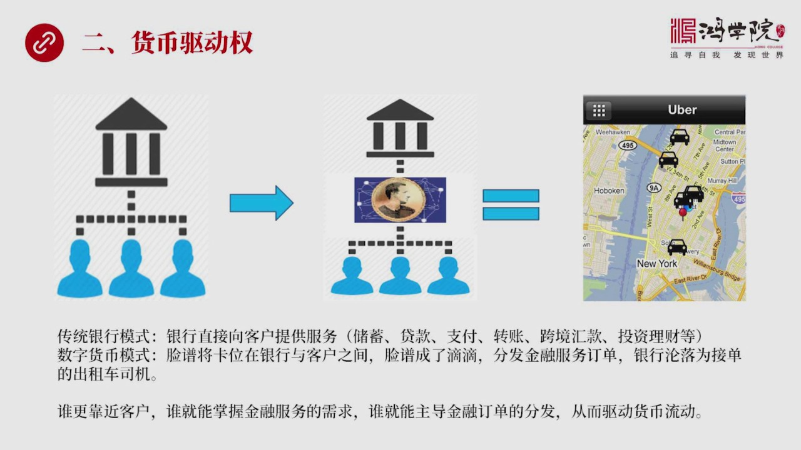

如果我们看这张图你会发现传动了这种金融体系那么如果你看最左边图你会发现那就是消费者或者客户可以说企业也可以说是个人也可以说是政府大家是跟银行直接发生关系的就是中间没有第三方不管你企业需要贷款你可以找银行消费者需要买房子安静连贷款也照银行政府缺钱了也照银行进行贷款而在银行和客户之间没有第三方这是传统的...

<strong>Cleaned narration</strong>

> 如果我们看这张图你会发现传动了这种金融体系那么如果你看最左边图你会发现那就是消费者或者客户可以说企业也可以说是个人也可以说是政府大家是跟银行
> 直接发生关系的就是中间没有第三方不管你企业需要贷款你可以找银行消费者需要买房子安静连贷款也照银行政府缺钱了也照银行进行贷款而在银行和客户之间
> 没有第三方这是传统的银行模式银行向客户提供各种服务除去贷款支付转账跨境会款投资理财等等中间没有第三方那么中间这张图代表着连破网所搞出这个天生
> 币它所形成的未来的模式你会发现这种模式我们可以称之为是数字货币模式发生了根本的转变那么客户跟银行之间的直接关系被阶段了中间夹进了第三方差进了
> 第三方就是连破连破网的天生币这套体系卡在了客户和银行之间实现了卡卫这么一卡卫你会发现因为客户大家如果常年使用连破网的天生币那么很多交易很多融
> 资行为就会发生在连破网之中那就变成了连破网来给银行进行发单比如说进入融资需求连破网自己可以做它可以发现各种白条各种背宝之类的贷款型的产品它也
> 可以它自己不想做也可以转手让给银行来做转给银行做这个时候它的作用相当于低级打车银行就变成出租车的司机这样的话那谁赚钱多少这个商业模式就变了那
> 就变成了以前是银行来驱动货币创造货币流动现在变成了连破网发挥这个作用连破网来决定怎么创造货币谁来创造货币通过什么渠道来创造货币驱动全发生了重
> 大转变可以说在互量中有一个基本规矩就是谁最靠近客户谁就能掌握这些客户的最重要的最基本的最强烈的金融需求它有各种各样的金融服务的需求谁靠客户最
> 近谁就能线于其他人掌握好你只要拥有这样的比别人更早更准确更细致掌握客户需求那么你就能够主导金融的这种业务的分发那么这实际上就变成了一种新的商
> 业模式就变成了是由这些来驱动货币的流动货币的创造和货币流动这就是我们看到的货币驱动权在数字货币时代在联邦网中间发生了根本转变银行的主导性银行
> 的驱动的这种根本的动力被削弱了这个权力逐渐转到了联邦网和天称币这套体系他们的手中所以这是一个重大的转变好我们来看驱动银行各种业务就是驱动货币
> 的各种业务传统银行做的比如说处序带管支付转账这些东西它是怎么发生变化我们看下一首先你会发现数字货币

---

### Slide 7

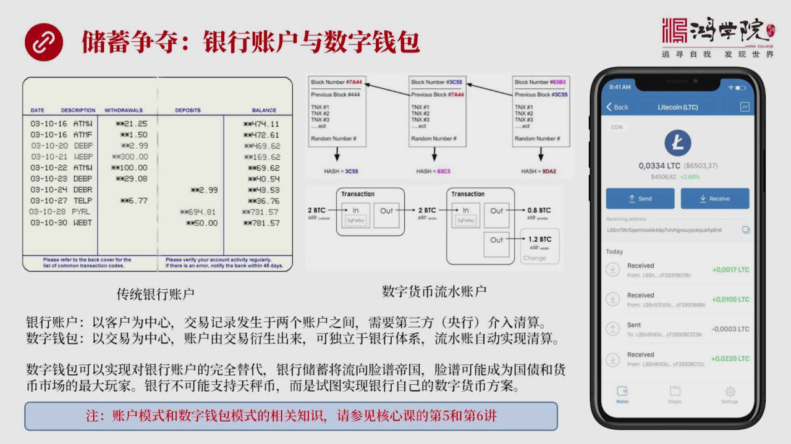

再跟商业银行争夺处序处序权这是一个我们说驱动货币的一个第一个特征处序争夺如果我们看这张图你会看到走延这张图它画的是一张银行的基本账户我们每个人看到网上银行也好你收到了这个邮件也好你的银行账户的发生交易模式就是这个账户这个模式几月几号今天几分你是取了一笔钱还是付了一笔钱然后交易金是多少这个叫传统的银行...

<strong>Cleaned narration</strong>

> 再跟商业银行争夺处序处序权这是一个我们说驱动货币的一个第一个特征处序争夺如果我们看这张图你会看到走延这张图它画的是一张银行的基本账户我们每个
> 人看到网上银行也好你收到了这个邮件也好你的银行账户的发生交易模式就是这个账户这个模式几月几号今天几分你是取了一笔钱还是付了一笔钱然后交易金是
> 多少这个叫传统的银行账户这种银行账户你会发现它背后的基本理念是以客户为重新也就是一切的东西是围绕客户围绕这个人在转那么交易的记录不管你是取权
> 支付转账也好它一定涉及到另外一个主体的存在是两个主体比如说两个银行账户之间发生的交易活动而你要记录这个活动就必须要引入第三方来介入清算比如说
> 建认银行和招商银行你把钱从建认银行账户中转给你的朋友在招商银行中的账户这样的一个交易就一定要涉及到第三方介入它来帮助你进行清算这就是传统银行
> 的账户模式也就是一切是以人为重新的我们再看数字货币中它其实出现了新的模式叫数字钱包模式数字钱包模式是一种什么样的这样的一种态势它实际上不是以
> 客户为重新它不关心客户是它只关心钱是怎么流动的也就是以交易为重新当然它也会形成比如说比特币你也可以看到自己账户上有多少多少钱但这个账户是衍生
> 出来通过交易的细节我可以最终算出你的账户中就是你这个人在交易过程中你还剩多少钱就是我们看到手机这张图上浅出来了你有多少多少比特币来头币什么什
> 么数字货币它这个账户这个概念跟银行账户是完全不同类型的概念银行是必须要依赖账户的而在数字货币中账户的概念是交易的衍生品是交易过程最后你能够通
> 过交易过程前进和前出算出来还剩你还有多少钱那么这一套体系我们称之为数字前包体系或者叫头肯这套体系它是完全不同于账户模式的它可以完全独立于银行
> 体系而单独存在而且两个体系还有一个重大差别就是怎么做清算银行必须要第三方中央银行来借助清算而在数字货币这种流水账的体系之中完全不需要中央银行
> 的存在不需要第三方来提供清算服务它是机账体系只要这个流水账在哪账目是自动就完成清算了我不用算不用进行清算所以它是个自动清算体系这就是我们看到
> 的这个数字货币跟传统银行账户货币最根本差别一个是账户为中心基于账户一个是前包为中心基于前包两者最大的区别是什么就是数字前包这种数字的银行体系
> 可以完全摆脱银行 我不需要银行存在我单独只需要一个流水账本就可以存在所以数字货币的出现是对传统银行的不光是货币理念的挑战也是对传统银行的运行
> 方式买至生存的重大挑战只要大家都用数字前包这样的一种数字货币体系大家就没有必要再使用银行了所以数字前包对银行账户是一种完全替代的关系是可以彻
> 底取代银行的银行业是可以完全不存在的所以这就是两者之间可以说是生死教练水火不相容的敌对关系我们看到联邦网发展成案中间有一些支付机构比如说配票
> 比如说兴谈master visa但是没有一家银行参与就是因为银行是明白这个道理的只要数字货币大星期到银行的商业模式就必然破产双方是水火不相容
> 的关系银行为什么要加入联邦网搞了这个天政兵那不是成了自己的绝幕人了吗所以两者关系是尖锐的矛盾的关系大家如果要搞清楚为什么数字货币这个流水仗是
> 对传统银行账户的一种彻底取代大家可以参照一下核心客是第五奖第六奖在那里面我专门讲的区块链它的这种数字钱包跟银行账户中间最本质差异究竟在什么地
> 方不过从这样的一个解释我们可以看出来银行的处序是可以被转移到数字货币的体系中间来的那么银行就会流失处序那么银行丧失处序之后它贷款能力也会伟缩
> ...

---

### Slide 8

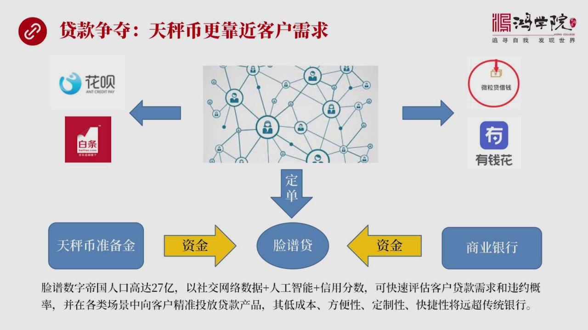

银行提供另外就是贷款服务贷款上大家也会升夺为什么因为天政币更靠近客户需求比如说这张图吧这张图让我们中间画了这是一个类似于互联网的这样一个客户关系族上面代表中国现在已经发生的事就是不管你是使用这个资保还是用微信使用你的卖票在里头你会发现大家买卖东西或者进行交易或者进行社交互动的时候如果有借钱的需要资保...

<strong>Cleaned narration</strong>

> 银行提供另外就是贷款服务贷款上大家也会升夺为什么因为天政币更靠近客户需求比如说这张图吧这张图让我们中间画了这是一个类似于互联网的这样一个客户
> 关系族上面代表中国现在已经发生的事就是不管你是使用这个资保还是用微信使用你的卖票在里头你会发现大家买卖东西或者进行交易或者进行社交互动的时候
> 如果有借钱的需要资保可以提供花贝啊京东网可以给你提供白条啊这个微信可以提供微颗利的微粒微粒代借钱呢或者是有钱花百多的每家公司基本上都会提供贷
> 款的产品让你去借钱这就是中国已经发生的事那么下面我们看美国即将发生事如果联邦网成绩好了那么联邦网所拥有这个巨大的数字帝国拥有27亿人口中间发
> 生了大量的这种融资需求那么这种融资需求是被联邦网所最先感知到的或者说它成了这种贷款产品的定单的会计方它可以自己做这就是我们看到这个定单下去联
> 邦网可以搞出一种比如说类似于花贝等它可以搞出一种联邦带或者叫联邦花贝或者叫联邦的白条主持策略的产品它的自信从哪来呢它的自信从天称帝的准备金账
> 户中移过来比如说这并账户现在是用于投资美国国债好这100家创造会员一看投资美国国债收益率在2%这太不合算了你要想搞个白条产品收益8%那和不我
> 们自己干脆就做这个生意得了好我们不投美美国国债了我们把钱资金这10万亿美元中间的很多钱转移到联邦带中间来能不能输到当然可以在3账只要大家想赚
> 钱3账人投票通过这个政策就变了所以资金是可以从天称帝准备金中这些美元资金转过来来做联邦带或者叫联邦白条的生意除了这个之外还可以通过什么呢联邦
> 往如果自己的钱不够或者他或者某种意义上他改变不了这个货币的一些发行的规则比如说3账人当不到怎么办呢他要想做这生意他可以把定单转给上银行也就是
> 说我联邦可以向上银行借钱我有生意吗我可以找你借一把钱给我之后我来做这个生意或者我把这个定单直接交给上银行你来做贷款我只中间收手续费全部贷款额
> 我收过23%B.0赚钱不承担任何风险所以风险都是商银行的所以这个模式就变成了联邦往成了低级大车分发定单的发行方银行成了跑腿的所有定单都是源于
> 联邦往这就是整个的双方之间的关系发生了变化联邦成了党在银行额扣中间的一个非常重要的这样一个中间者银行被隔离在外了所以贷款双方也是存在着高度的
> 增多的那么联邦他可以实现什么低成本呢方便定制快节这方面都会比银行做得更好因为他有大量的客户信息行为信息所以他可以精准的对客户的需求进行融资需
> 求进行画像所以他比银行更了解客户而且可以在各种场景之中精准的投放他的广告所以客户跟联邦往的关系会更近而跟银行的关系更远争不过银行争不过联邦在
> 做贷款方面我们在中国的这个我们看到这个花贝也好白条也好你都已经发现了类似的趋势他们竞争力确实非常强传统银行大有尽念不知的态势好我们再看下一页除了储蓄争夺除了贷款争夺还有一个支付方式的争夺

---

### Slide 9

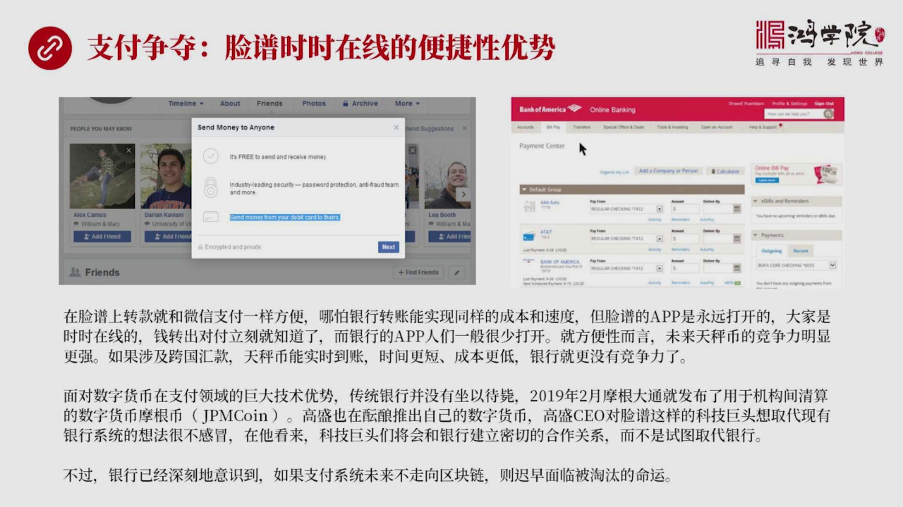

联邦往实实在线这个优势太强的银行没法比你比如说在联邦往中现在他就已经可以做到不用数字货币你能做到用他的messenger就是他发短信的这样来一个发他信息的这样的一个手段只要我找到联邦往中间的一个朋友我直接就可以一点钱就过去他现在这一点钱过去是因为你绑定了银行卡实际上他这个点击是把银行卡中的钱转到另外...

<strong>Cleaned narration</strong>

> 联邦往实实在线这个优势太强的银行没法比你比如说在联邦往中现在他就已经可以做到不用数字货币你能做到用他的messenger就是他发短信的这样来
> 一个发他信息的这样的一个手段只要我找到联邦往中间的一个朋友我直接就可以一点钱就过去他现在这一点钱过去是因为你绑定了银行卡实际上他这个点击是把
> 银行卡中的钱转到另外一个人的银行卡里面去从这个意义来讲他现在已经能做到了那么未来数字货币出现之后天称密这个开始流行之后那这个事就更简单了我根
> 本不用把银行卡我只要他有一个数字钱包有一个自己的这个甚至没有银行都可以比如说联邦往说我要为17亿人口这些人都没有传统的银行怎么办呢我可以给他
> 这些非洲的贫困的国家的人口我可以给每个人生成一个数字钱包只要他在中间有钱那么他就可以够买联邦网上任何东西或者现下了商业生态中间的任何的商品这
> 样就使得这些人不用开银行账号也可以使用金融服务也可以进行支付而且同样非常方便那么在支付这个争作中你会看到我当然使用联邦网更方便因为我的朋友全
> 部在线而且24小时我们大家都不关手机的所以我只要想把一笔钱专门一个朋友我只需要找到这朋友然后一点就过去了而且我可以马上告他钱已经发了你查一下
> 这有人一收到立刻就可以给我回信一秒钟之内说钱收到了交易完成好这种方面性跟银行相比我们每时每刻是打开联邦或者打开微信的可是我们很少去开招商银行
> 建设银行的APP大家看看是不是这个道理也就是银行APP的使用效率积低不到万不得以后不到我们需要贺钱是我不会开一行APP这是导致哪怕你银行可以
> 跟他做到比如在国内转款可以跟他做到同样实实性可以做到同样低的成本或者几乎是银成本但是你方便性拼不过他因为你用银行APP转账之后你还得打电话告
> 诉你朋友或发微信告他钱转过去你查一查这个时候收到你的信息之后他还要打开自己的银行银行了这个APP然后去查这个钱是不到了或者要查自己的短信或微
> 信银行通知有没有到这个钱他麻烦了他的便利性不如连普这种或者叫社交媒体这种APP的方便性所以呢就支付而言在支付争斗中银行也是拼不过这种新型的社
> 交媒体转件的好这就出现一个巨大问题了就是银行明白他们这套支付体系再跟数字货币竞争手是不占优势的那怎么办呢银行也没有做一代币也比如说2019年
> 的2月蒙根大同就发布了自己的用于专门结算的竞争机构之间进行结算的摩根数字币解评摩根当然他通过发现这个数字被吓未来鞏固自己在竞争业的老大的地位
> 当然其他公司其他的银行也也在非常感兴趣对于数字货币这个概念比如高盛高盛也在积极率量搞出自己的数字货币而高盛这些人呢包括蒙根大同他们对于联普这
> 种科技去投搞搞这个数字货币他们是怎么看的呢其实我们可以从立争逻辑角度来看你就会非常明白两者之间的关系是一种尖锐的竞争关系也就是他们认为数字货
> 币要真正成细后如果是联普网这种科技去投搞起来的话那我们花尔街我们银行体系传统银行体系这帮人搞了好几百年苦心经营的金融体系就被好处所以好处就被
> 别人拿走了这个是不能忍受的或者这样的损失是非常巨大的当然表面上不可能这么说所以高胜CEO就说这个科技续头就想取到现场的银行体系这个想法应该是
> 太贴任了再看来科技续头们必须要跟银行建立合作关系而不是师傅取代银行当然这一话只是一个银行的一方面的想法最后是不是真的这么发展呢联普网是不是真
> 的能取代他们吗我觉得现在我们下节目还太早还有观察天成为一上线之后的实际运行情况不管怎么样银行这帮人已经深刻地知道了如果他们现有的银行体系的这
> ...

---

### Slide 10

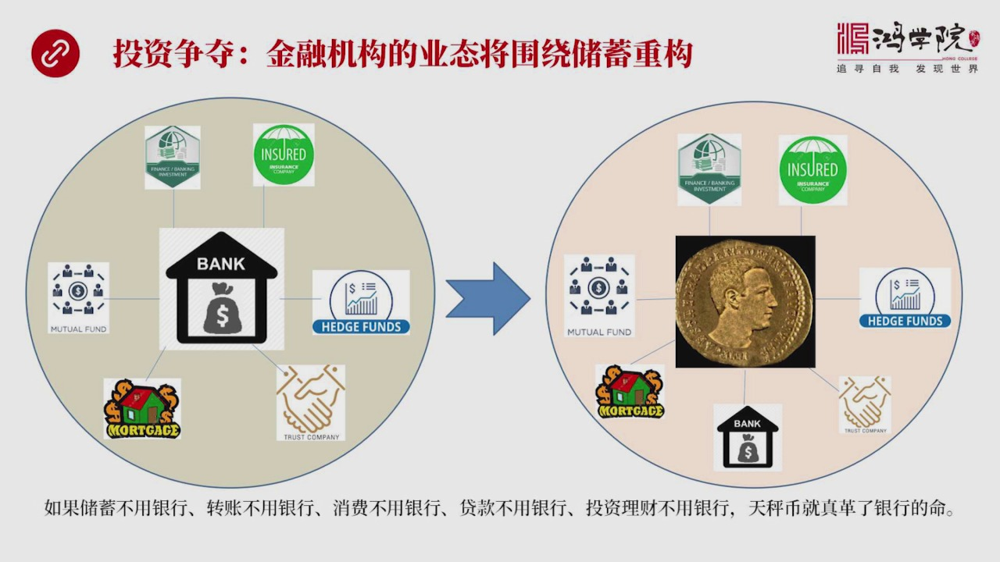

贷款支付了方面的竞争数字货币天成为跟银行体系还有一个竞争就是争夺投资理财的投资权我们看一下走远这张图现在的竞争机构不管你是券商还是保险公司还是信透公司还是各种各样的小摆广公司他们的钱从哪来都要从银行的除续中来老百姓是把钱存在银行体系中那么处续全部是集中的银行的这些竞争机构就好比是在银行的处续周围建立...

<strong>Cleaned narration</strong>

> 贷款支付了方面的竞争数字货币天成为跟银行体系还有一个竞争就是争夺投资理财的投资权我们看一下走远这张图现在的竞争机构不管你是券商还是保险公司还
> 是信透公司还是各种各样的小摆广公司他们的钱从哪来都要从银行的除续中来老百姓是把钱存在银行体系中那么处续全部是集中的银行的这些竞争机构就好比是
> 在银行的处续周围建立起了自己的一套寄生的这样的一套生态系统大家都要指望银行把处续吐出来大家才有生意做不管你是券商还是信透公司还是保险公司钱对
> 源头是来自银行处续现在的商业模式是围着银行处续所构建的各种投资基金各种共同基金对冲基金还有向按计达代管公司保险公司还有这种信透公司等等但是未
> 来我们刚才已经说了天称幣是要跟传统银行体系争多处续的如果大量处续留下了天称幣体系生态环境就发生了变化这就是变成了右边的一张图扎克伯格就变成了
> 处续就变成了整个数字帝国27人的处续中心那么所有的寄生型的这些金融机构或者叫做处续下家生意的这些人必须要重新形成新的商业的生态大家就围着连迫
> 往来重够自己的新的商业模式这就像我们国内看到的银行体系或者叫应该说金融机构吧像券商也好货币基金也好这些人都要跟马以金服寡购为什么马以金服背后
> 是庞大的支付宝支付宝搞出来这套募集了好几万亿资金的这套体系把这个钱引流到马以金服通过马以金服对接货币基金然后在货币上进行回购也好投资债券也好
> 投资国债也好等等他才能够赚钱所以这些货币基金的人必须得有围绕的马以金服来打赚未来在这个连迫往这个世界这个数字帝国周围也会出现这个情况各大金融
> 机构必须要开通和连迫往对接的数字的接口才能获得流量才能获得生意才能获得自己流所以我们来看这样的话双方的态势就明确了出去可以不用银行转账也可以
> 不用银行消费也可以不用银行贷款也不用银行投资理台现在也不用银行那银行还有什么存在的价值呢所以就长远而言天城币如果大星期到就会真的隔了银行的命
> 这就是银行跟天城币的关系是水火不降融从商业模式来看的话一方要隔另外一方的命这就是双方不可能真正合作的原因好我们再看下一除了这个之外第三个权利就是货币的渠道权

---

### Slide 11

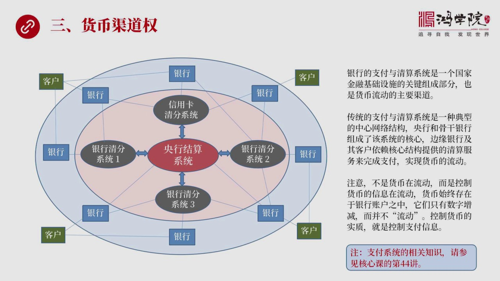

我们讲货币发行权讲货币的发行权还有货币的驱动权那么第三个最重要权利就是货币的驱道权这个驱道什么时候货币的驱道其实货币是在哪里流通是在金融体系的支付系统中流通所以支付体系支付和清算体系吧是一个国家我们都说金融基础设施什么叫金融基础设施啊其实主要的最核心的构成的部件就是支付和清算这套体系如果我们看左边那...

<strong>Cleaned narration</strong>

> 我们讲货币发行权讲货币的发行权还有货币的驱动权那么第三个最重要权利就是货币的驱道权这个驱道什么时候货币的驱道其实货币是在哪里流通是在金融体系
> 的支付系统中流通所以支付体系支付和清算体系吧是一个国家我们都说金融基础设施什么叫金融基础设施啊其实主要的最核心的构成的部件就是支付和清算这套
> 体系如果我们看左边那样图你可以看到这是一个非常复杂的体系这是传统的支付支付的这样一套体系或者叫传统货币流动的驱道吧在这张图这正中心我们可以看
> 到这是当然是央行的结算系统注意要清算清算这个词应该分成两部分一个叫清分ClearClear ring另外一个叫结算结算是Cytoment所以
> 这是两个不同的过程也是完全不同的行为关于支付体系这套东西的详细的一些解释这到底是怎么运作现在前在全世界各地在现在的金融网那中到底是怎么流动的
> 我们会在核心课的第44讲中详细介绍全球当今的支付体系他是怎么在运作的不了解这个东西其实我们对全世界的金融体系就不能真正看透渠道是很重要的因为
> 渠道为王不掌握渠道你其实就没有金融的权力或者叫丧失的金融高边疆如果我们来看在现在这套体系中间央行的结算系统处于最中心的地位在他周围是若干个银
> 行之间的清分系统就是清分和结算这构成了一体化了那么具体的这个清分和结算到底怎么回事我们会在核心课第44讲中详细讲但是我们先看一下这个结构现在
> 我们主要了解这个基本架构你会看到一个国家会有若干个清分系统但是只有一个重要的结算系统就是央行那么信用卡信用卡也是中间的一个清分系统之一你会看
> 到在往外围呢就是银行了若干家银行可能加入一个信用卡的清分系统还有些银行加入某一些银行的清分系统另外一些加入另外一些这些清分系统列成123详细
> 说中间有一些是试试的大哥的交易有些是小皮量的是大皮量小金额的非试试交易他会分成若干个不同的功能的清分系统但最后的结算都是在央行来的来进行结算
> 的好客户不管你是个人还是企业全部要在银行开户通过银行体系通过中间这一块来进行清分和结算所以当今世界的传统这样的一种支付体系是一个典型的中心网
> 络结构中央银行在中间清分系统在旁边在往外围是银行最外围是客户任何一个客户都不能直接跟跨过银行体系直接跟其他的客户进行转账你转不了账你必须得依
> 靠银行所以银行支付体系它是处在所有客户发生自己网来的最中心的最核心的这样的关节点上或者是组成了书牛银行和一些大型的古怪银行比如说中国的中文功
> 念胶这些人组成了最核心的古怪的这个结算系统还有一些小银行在外围的比如说北京农商银行或者天津的城市商银行等等或者信用设这些都在外围他们自己做不
> 了不能直接做这个跟央行打交道他们是通过清分系统来跟央行建设打交道那么看到这张图之后我们需要明白一个道理其实应该注意到所谓的货币流动我们强调货
> 币流动我们一般脑子里面会想这个钱真的是在管道里面流动其实这只是一个形象来形象的比喻而货币它其实不流动不是货币在流动而是控制货币的信息在流动货
> 币在哪儿货币永远在银行的账户上你转一笔钱其实钱没有动而是两个账户中间有一个账户加了一个数有一个银行相应检调一个数就完事了真正在动的是什么是支
> 付的信息这家银行支付信息转到了另外一家银行然后另外一家银行收到这个信息之后调动这个央行的结算系统来帮你实现加数和检数这样来个过程所以流动的不
> 是钱流动的是信息控制货币的核心是什么它的本质就是控制支付的信息当然关于这个想象的那种我们会在44讲中进行更深入的讲解我们再看下一我们再看在整个这个支付体中间存在这个银行卡

---

### Slide 12

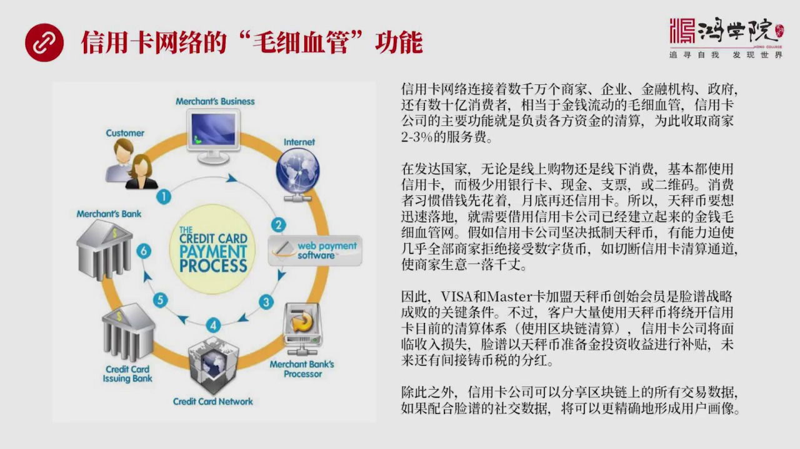

存在这个这个银行卡相对应的信用卡的网络信用卡的支付网络跟银行相比它是一个更具毛细血管的这样的一种功能什么是信用卡网络呢信用卡网络它主要就是联系联接着全界几千万个商家企业还有金融机构还有政府当然还有10号几亿人有信用卡的这些人它这个网络是联系的这么多这么多这个参与交易的交易者所以它提供的是日常交易者一...

<strong>Cleaned narration</strong>

> 存在这个这个银行卡相对应的信用卡的网络信用卡的支付网络跟银行相比它是一个更具毛细血管的这样的一种功能什么是信用卡网络呢信用卡网络它主要就是联
> 系联接着全界几千万个商家企业还有金融机构还有政府当然还有10号几亿人有信用卡的这些人它这个网络是联系的这么多这么多这个参与交易的交易者所以它
> 提供的是日常交易者一种大家最常使用的最普遍的一种金融渠道我称之为是金钱流动的毛细血管它提供了主要服务是什么呢资金清算的因为你想想看一百家银行
> 一万家银行或者更多的这个银行参与在一起到最哪家银行该收哪家银行的钱这是个巨大的一个非常复杂的网络如果每家银行自己单独打交道那就麻烦死了一家银
> 行如果在整个题中有一万家银行我一家银行要跟999家银行建立双方的这种信息交换系统然后来决定到底是我负你钱还是你负我钱这个东西这个体现能发展吗
> 发展不了所以你要是参加了这个机构多了必须要有一个中间的结算方或者叫中间的中心的清算方把所有人的交易的这个这些投寸把进行集中计算然后最后我算出
> 一个总数来来确定谁像谁支付宿航公司提供了就是这样的一个资金清算的服务也正是因为这一点所以所有商家都要向宿航公司脚纳你成交额的2.3% 作为服
> 务费当然我们看到很多商家不愿意啊因为我好不容易卖一个产品我的利人在5%向信用公司交个12%到3% 凭什么主要原因就是信用公司提供了一个巨大的
> 清算服务如果没有它提供的这个清分这个服务应该叫清分服实际上是商业世界它就没有办法很方面的运作那为什么信用公司这套网窝在中国没有发展起来在西方
> 大型祈祷主要原因是西方国家它长期以来很早很早就已经形成了透支消费的习惯你如果去发到国家你去看不管是商店还是在网上这种支付大家使用的普遍使用都
> 是信用卡很少看到有谁在商店中是用银行的处去卡进行刷卡的几乎没有看到过也很少有人用现金了现在现金用了越来少90年代还有人写支票买东西现在估计也
> 非常罕见了当然更没有二位码这么一扫这种在发到国家都还没有实现主要靠什么靠信卡为什么靠信卡因为信用卡可以借钱花越出我没钱这个钱不够好我就使用信
> 用卡先刷了再说到月底咱在环拿了工资或者拿了工资之后我在环信用卡当然很多人是还不起用卡所以信用卡的债务累积越来越大这套支付的习惯消费的习惯是连
> 破网的天政币改变不了也左右不了的所以你天政币要想落地就必须跟信用卡工资合作我们设计一下假如不跟信用卡工资合作会出现什么后果信用卡工资完全可以
> 阻断你的所有的线下的消费和线上消费的所有渠道就是信用卡工资可以告诉商家你要么用我信用卡要么你用天政币你自己选二则二则只能选其一如果你选天政币
> 对不起我的炮子机我就收回了或者我就切断你轻松通道你就用不了信用卡了而海外或者叫发到国家绝大多数消费者至少在一开始都是要使用信用卡的你如果是选
> 择天政币合作你放弃是信用卡等于商家的生意一落前账你无法生存所以这些公司必须某种意识商家他受到信用卡公司强大影响力这个时候如果只能二选一的话他
> 必须要选边那么大多数会选择跟着信用卡走天政币就落不了地全世界几千万个商家怎么可能同时都会用数字货币呢当然不会所以天政币明白要想让他这个数字货
> 币落地离一不开这个信用卡网络的这种毛袭袭尔功能必须要搞合作好这个时候你会看到信用卡公司加盟进来了加盟进来之后变成了创造会员但信用卡公司他会面
> 临一定的损失为什么呢如果大家还是在购买东西的时候刷这种卡片问题也不大这还是走以前那他亲自通道他还是生日12.2到3商家会交这个钱但是如果是大
> ...

---

### Slide 13

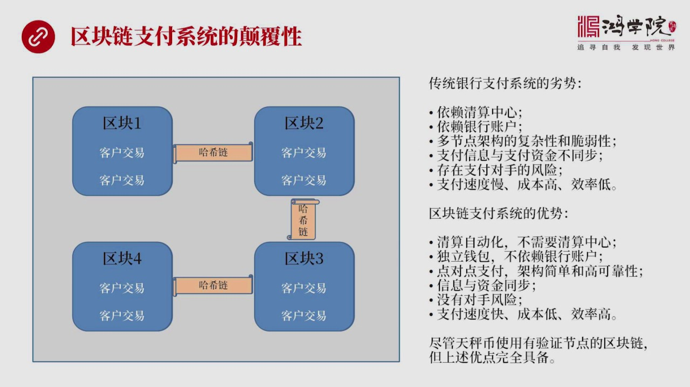

这个网络来看银行体系那套系统跟区块链就是天城币这套系统比赛到底怎么样可以说区块链支付体系具有着颠覆性的优势我们看这张图其实可以很简单地看出来这样一种图比刚才银行的那个网络中心结构那简单太多倍了区块链当然我们这是用普通的区块链标准区块链做一个解读区块链1234四个区块链中间通过哈西链把它连在一块然后每...

<strong>Cleaned narration</strong>

> 这个网络来看银行体系那套系统跟区块链就是天城币这套系统比赛到底怎么样可以说区块链支付体系具有着颠覆性的优势我们看这张图其实可以很简单地看出来
> 这样一种图比刚才银行的那个网络中心结构那简单太多倍了区块链当然我们这是用普通的区块链标准区块链做一个解读区块链1234四个区块链中间通过哈西
> 链把它连在一块然后每个区块上记忆是记录若干个扣交易注意啊这里面没有账户的信息全都是流水账通过一个块两块三块四个唱在一起我就能够把所有人的账户
> 账户的鱼鱼我可以衍生出来可以算出来那么这套体系我们发现它没有中心的清算的机制我不需要中央银行我不需要任何银行存在我就是一个大账本一个流水账我
> 就能算出所有的数来所以我这套东西是高度简单的而传统银行体系实在是太麻烦了我们来看一下传统银行体系支付体系它有哪些列式第一它是依赖清算中心的没
> 有中央银行一切都玩不断必须得有中央银行第二它必须得依赖银行账户没有银行账户也没法做所有的转账支付第三刚才我们看到那个同心园那个巨大的网络结构
> 太复杂几点太多你正称因为几点多所以构成一种整体的这个系统的复杂性由于系统太复杂所以它具有着非常强的脆弱性假如某个节点被攻破或者中央银行比如说
> 孟加拿国2016年被转走八千万美元这种事情一旦重要节点被攻破整个体系都不安全还有呢支付信息和金额转账金额不同步我得先把支付信息发出去在整个银
> 行体系统走一转来在清分过程中先算清楚谁账上有钱谁账上没钱有多少钱然后在几家银行中间要打好几个来魂我才能够最终算清楚每家的投诉有多少然后再启动
> 支付真正的资金转移第二步那是第二步所以我的信息传递跟我的资金最后的专业银行操作两个账户中间是有不同步的问题的正是因为有不同步所以就会演成出下
> 一问题存在这支付对手的交易风险你比如说他给你发出一个转账的就是要求你这边付款的指令好你会发现如果对方账上没这么多钱然后你把这个钱已经支付给别
> 人了但是他在那个时刻他账上没有这么多钱或者他同意给你的而他不给你这就是交易对手风险这种风险是存在的这也是传统银行体系中间非常关注的一个问题假
> 如在某个时刻本来他账上有这么多钱结果突然进入危机爆发雷曼兄弟公司老闆然后就使得很多账上有该有钱的账户突然没钱了那么整个支付体系就陷入巨大的混
> 乱存在吗?这个风险陷是存在的而且实际发生过所以银行这种支付体系是存在着交易对手的风险的还有支付速度慢成本高效率低跨进转账你得三五天而且收拾1
> 0%咱也没商量还有这样的效率当然很低了重量还是在外负交易等等去块链就简单多了清算自动的不需要依赖任何第三方也不需要依赖重量银行只要既账这个所
> 有的账他就自动完成清算了还有独立钱包你有银行账户没有银行账户无所谓没有银行账户我也能进行转账所以他是独立的这个钱包的系统然后点对点我可以不用
> 绕过这么多银行然后做这么多次操作我就是点对点直接到达非常的简单架构简单可靠性就高还有呢信息和自信同步只要我想做这个事我信息一旦发出钱也立刻转
> 过去了没有交易对手的风险同时速度快成本的一效率高当然我们所说的天称并并不是典型的这种区块链技术但是实际上他虽然不用这4个块他是一个统一的一个
> 大块也不用他系练但是区块链所拥有了所有有点他也自动拥有他也不需要中央银行帮助清算他也是独立钱包也可以实现点对点也可以信息和自信同步也没有交易
> 对手风险速度快成本的一效率高所有的优势他都有所以天称并从这个角落来说他对于线有扬体系如果他做到了线有扬体系的转账这套支付体系就会彻底崩溃因为
> ...

---

### Slide 14

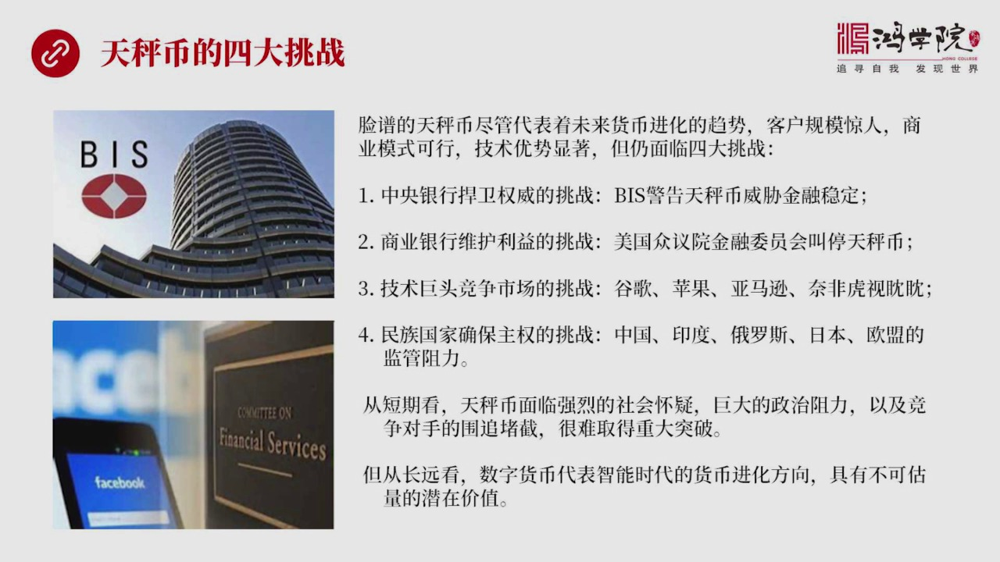

趋势这没有问题然后他有27亿客户规模惊人这也没有问题杀一模式呢当然可行也没有问题技术优势比川普一行要显出的多但是尽管你拥有这么多好处或者优势但是挑战仍然非常尖锐四大挑战低大挑战是什么呢中央银行要捍卫自己的货币全威这是一个巨大挑战所以他一定会压制或者叫管制天称币我们看到BS就是国际新闻银行可以说是全世...

<strong>Cleaned narration</strong>

> 趋势这没有问题然后他有27亿客户规模惊人这也没有问题杀一模式呢当然可行也没有问题技术优势比川普一行要显出的多但是尽管你拥有这么多好处或者优势
> 但是挑战仍然非常尖锐四大挑战低大挑战是什么呢中央银行要捍卫自己的货币全威这是一个巨大挑战所以他一定会压制或者叫管制天称币我们看到BS就是国际
> 新闻银行可以说是全世界中央银行的银行他就提出了一个就是天称币发布消息之后他们就提出了一个发表的报告严历警告这种数字货币天称币为代表了这种科技
> 巨头进入金融领域会造成巨大的金融稳定性的威胁当然BS显然代表全世界中央银行在说话因为它就是中央银行的银行它已经看明白这个趋势了觉得如果我们放
> 手不管这个事那过不了几年中央银行它的权利就会損失待近而且这一帮人技术公司要这么搞的话说不定搞出一些重大金融危机也有可能所以它发售了警告中央银
> 行为了捍卫自己的货币的控制权这个央行的货币权威它也必然会出手来限制天称币的发展第二个挑战是什么呢商业银行体系为了维护本利集团的生存为了维护他
> 们的根本利也会限制或者叫组织天称币的发展他们会怎么来做这个事当时游税了因为金融体系华尔街对于美国的立法集团具有这重大影响力所以会看到天称币的
> 消息出来马上美国众议院金融委员会的主席立刻发表这个一篇文章也给这个天称币的人写了一封信就说叫停先别搞了然后把你们潜在的各种各样的技术问题说清
> 楚否则不允许搞是一种非常明确的制止的态度叫停的态度什么原因背后的银行体系商业银行体系在游税这种立法还会有参与院也会有所以商业银行体系跟天称币
> 之间是一种对抗的关系如果连迫不想办法找到双方的合作点或者说你要真的想把现有了银行体系要颠覆那么银行体系的人也会跟你玩敏感第三个挑战是什么就是
> 技术巨头门对于未来市场了它会有一种非常激烈的竞争也就是你连迫往可以搞的事我谷歌也可以搞苹果也可以搞亚马逊内飞这些公司大科技公司美加企业背后都
> 有一个庞大的一个客户群体都是好几十亿或者好几亿人口吧所以对他们来说你可以干事我也可以干好如果美国允许天称币怎么干就没有理由阻止谷歌亚马逊远和
> 苹果怎么干好这样一来一个统一是统一的这个数字货币就会出现若干个竞争对手你搞一套我也搞一套最后出现五六家甚至更多的数字货币体系好那么全球统一货
> 币这样的一个理想仍然不能实现天称币也未必最后能战上风所以科技巨头挑战也是一个非常重要的因素但第四个挑战就是民族国家要确保主权那么他要确保货币
> 主权他就会限制天称币在本国的发展比如说中国很明显天称币想得没想根本进不来连破网都进不来别说天称币了印度印度也一样印度的民族旅行系也非常高从四
> 七年建国以来印度搞了很多次国有话所以印度也不会放任天称币在印度随便随便用因为大家都明白你这个货币天称币要长期使用的话那我本国的银行体就垮了包
> 括我的中央银行的权利也会螃落没有一个国家会允许这样的事情发生特别是在这种主权意识民族情绪比较高障的全球化的退朝期每个国家都有这样的意识所以俄
> 罗斯也不会同意日本估计也够强哪歐盟呢大国也不会同意像德国法国英国这个包括意大利这些国家都不会让你随便的进到他们的国家里面把他们的精神体搞垮所
> 以面临这四道挑战天称币最后能不能成功这也还要打一个谈大的问号从短期看天称币确实面临这样的问题是否会怀疑巨大政治阻力还有精神对手为追读结估计很
> 难取得重大的突破但是从长远来看天称币所代表了数字货币的基本发展方向这个东西它是具有的不可过量的钱的价值这个是应该引起中国的高度重视的由于中国
> ...

---

### Slide 15

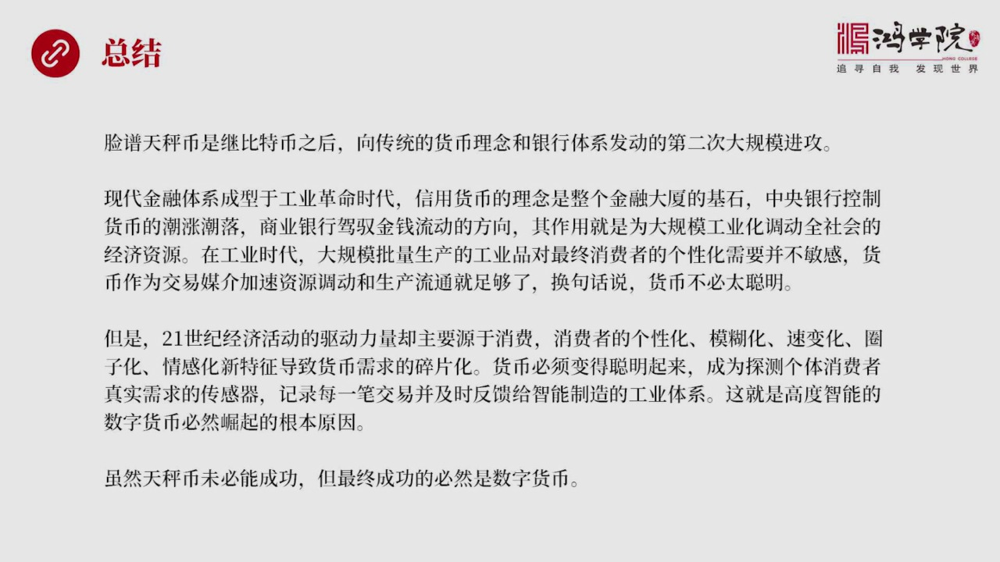

天称币我认为天称币是在比特币之后即比特币之后向传统的货币理念和银行体系发动了第二次大规模的进攻现在精神体系我们可以说它是成型于工业时代工业革命这样的一个时代信用货币的理念是整个金融大赏了一种基石中央银行控制着货币的潮涨和潮漏商业银行价于着金钱流动的方向他们的基本作用就是为了大规模工业化来调动全社会的...

<strong>Cleaned narration</strong>

> 天称币我认为天称币是在比特币之后即比特币之后向传统的货币理念和银行体系发动了第二次大规模的进攻现在精神体系我们可以说它是成型于工业时代工业革
> 命这样的一个时代信用货币的理念是整个金融大赏了一种基石中央银行控制着货币的潮涨和潮漏商业银行价于着金钱流动的方向他们的基本作用就是为了大规模
> 工业化来调动全社会的资源那么在工业时代的时候这是没问题的大批量大规模生产的工业产品它不再获最终消费者的各信化需求货币作为一种交易媒介它主要的
> 作用是加速社会经济资源的调动然后维持生产流通这就够了简单的说货币不需要太聪明但是进入二十一世纪之后全世界经济发展模式发生了重大变化现在驱动经
> 济发展主要力量是源于消费生产平静已经被攻克了消费中首要问题是如何找到客户需求就是精准地发现客户需求这成了驱动经济发展的最主要动力那么消费者呢
> 现在由于网络化了大家盘笔心里或者参照心里或者这种暗示这种示范使得消费者的消费心里发生重大变化就是各信化模糊化素变化圈子化情感化这都是消费者新
> 的特征由于每个客户每个消费者都有不同的心态受到不同的这种影响它就使得人们对于货币的需求比如说我要融资要贷款这种货币需求四变化了不像以前一家大
> 工厂我搞个样子动折我借客上百亿可以但现在十几亿消费者每个人可能选择的贷款金额就是五百块钱两千块钱这种就变成那种高度碎片化了货币需求这是我们新
> 时代发生的新问题所以这些要求货币必须要变得比工业时代要聪明的多要具有更高的智商每一张货币或者每一块钱都必须要成为探测各体消费者真实需求的传感
> 器只要消费者消费一个货币单位传感器立刻把握住了这个消费者的心理动向然后把数据传回来传回来传到哪呢传给工业制造体系高度智能化的工业4.0这些部
> 门知道原来消费者喜欢这种商品我相当于根据这个信息来对某一种商品进行微量的或者叫定制化生产整个社会运软效率才会大幅提升从这个角度来说货币进化方
> 向它必然会走向高度智能化高度智能化的数字货币它必然崛起这是无力阻挡的只要你这个社会经济再超这个方向发展这个货币就一定会发生便宜现在这种传统的
> 货币它迟早会解体当然虽然天政币这个常试未必能成功就是具体这种货币不一定能成功但是最后成功的货币必然是高度智能化的数字货币好 今天我们关于天政
> 币它的一些基本原理还有它未来发展中可能会碰到来挑战我们就先收到这里谢谢大家

---
