# 核心课视频-044讲：美国支付系统（视频） — Detail Slide Notes

> **来源**：鸿学院核心课程  
> **幻灯片**：18 张

---

### Slide 1

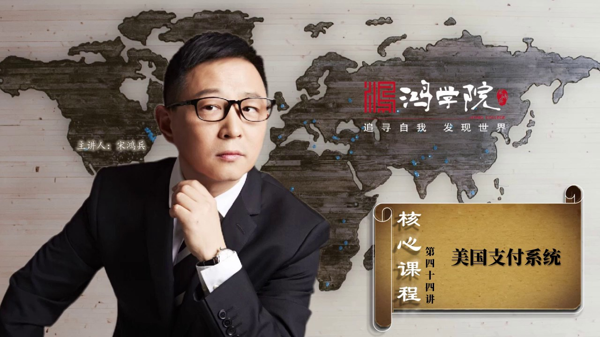

美国支付系统说到支付问题我想很多人都没有意识到虽然我们每天使用金钱但是我们却很少关注金钱到底是怎么流动的除了现金之外那么在金融体系室内在金融市场之上在各行各页的尸体经济中资金是怎么流动的在哪里流动以什...

<strong>All subtitles</strong>

> 美国支付系统说到支付问题我想很多人都没有意识到虽然我们每天使用金钱但是我们却很少关注金钱到底是怎么流动的除了现金之外那么在金融体系室内在金融
> 市场之上在各行各页的尸体经济中资金是怎么流动的在哪里流动以什么方式流动我想很多人都没有去升纠这个问题其实支付系统对一个国家而言它是金融基础设
> 施的最核心最底层的部分对于我们了解全球金融市场运作规律而言它也是其中最重要的中书之一比如出现金融危机的时候2001年底美联储的支付系统中间就
> 明显的感觉到了美元流动性的短缺如果你不懂这套机制是怎么运作的你甚至根本绝杀不到或者不知道到哪里去查询美元流动性出现紧缩出现短缺在支付体系中间
> 在哪些点会有明显的征照所以这就是我们需要全面系统深入的去理解金融市场不仅是理解表面上那些股票市场了涨跌或者一些金融产品还需要了解他们底层的流
> 动中间的一些具体的机制我们今天讲的是美国支付系统我们未来还会去介绍中国的支付系统是怎么发展起来的有了理解美国金融系统中间的支付部分那么我们理
> 解中国理解全世界的资金流动它就有了一个基础好 我们现在看下一页收到支付到底什么是支付

---

### Slide 2

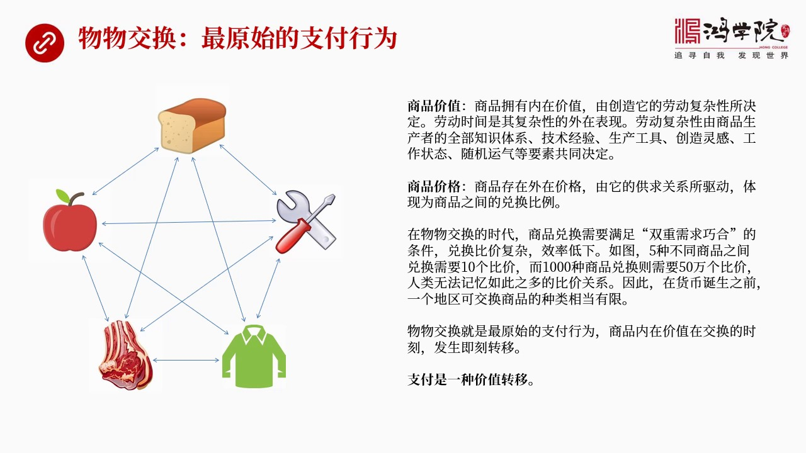

我们从最简单的最原始的状态来进行一个表述比如说我们可以看这张图这张图上表现的是比如说在没有货币的时代原始社会那么一个部落中有不同的人生产不同的产品我在这里列出了五项也可能更多面包 水果 肉 衣服或者工...

<strong>All subtitles</strong>

> 我们从最简单的最原始的状态来进行一个表述比如说我们可以看这张图这张图上表现的是比如说在没有货币的时代原始社会那么一个部落中有不同的人生产不同
> 的产品我在这里列出了五项也可能更多面包 水果 肉 衣服或者工具那么这五种商品它都有它们内在的价值就是商品有其内在价值这在马克思资本论中进行过
> 详细论述那么它在论述商品内在价值的时候用的是平均劳动时间一个社会大家普遍使用这么多时间它就有内在价值而我在这里要对这个概念进行一定的修正我认
> 为劳动时间仅仅是它外部的某种特征仅仅是一种内部特征的某种外国表象它内在的特制是什么呢是制造商品的复杂性也就是商品的复杂性决定它的平均社会劳动
> 时间那么商品的复杂性又是怎么来体现出来的呢那就是生产这个商品所需要生产者的全部支持体系需要它的全部技术经验还要看它使用什么样的工具它在生产过
> 程中它的灵感创造的灵感有多少还有它当时的工作状态甚至还包括随机的运气等等这些因素共同决定了这个商品的内在的复杂性决定了它外部的劳动平均时间所
> 以我们说任何一个商品都有其内在价值内在价值的原因就是生产这个商品的劳动过程很复杂那么这个复杂程度又有一期的因素所构成所以它有内在价值当然我们
> 也知道商品除了内在价值还有外在价格那么价格又是有什么决定的呢当然就是我们大家都知道的供求关系我用的是驱动而不是决而不是决定为什么呢决定是一个
> 静态的感觉我认为驱动代表了供求关系在不停的变化代表了价格它未来具有这变化的趋势所以我在这里用的是一个驱动这个词那么它最后体现出来的是商品与商
> 品之间的对换比价比如说三个苹果对换一个面包还是一金肉对换十个面包这种比价关系就是商品的价格那么在物物交换时代也就是没有货币嘛那么在这种情况之
> 下你要进行交换它的难度是非常大的其中有一个重要因素就叫双重需求偶合双重需求的这种巧合只有这个生产面包的人和生产肉的人彼此都相互需要对方的产品
> 否则这个交换无法发生这个就使得物交换这套体系它变得非常的复杂而且相当的困难除了这个之外还有比较关系比如说从这张图上我们可以看到现在是五种商品
> 五种商品彼此这个对换会有几种价格会产生十个比价如果我们把这个数量放大假设这个部落中能够生产一千种商品那需要多少种比价关系呢需要五十万个所以大
> 家可以闻心这个自问一下在一个没有货币的社会中如果一个部落搞出了上千种商品那么这种比价关系就没有办法通过人脑的记忆来进行交换了太复杂了这也就是
> 说在没有货币的时代整个社会它的商品的复杂程度商品的种类会受到嚴格的制约也就是经济不可能发展上去那么物物交换作为一种支付的方法它应该说是一种最
> 原始的支付行为商品的内在价值在交换实现的时刻就同时发生了可以说是即时的转移你把苹果换了面包苹果和面包的内在价值当时立刻就发生了转移所以我们把
> 这个物交换的实质提练出来用一句话概括就是支付是一种价值转移我们再看第二页现金支付无仗户则无清算

---

### Slide 3

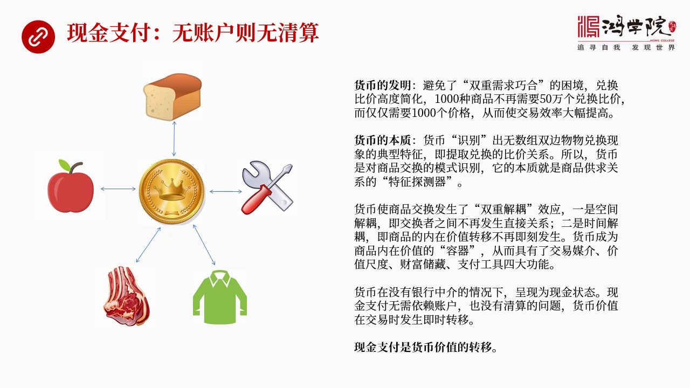

这什么意思呢就是为什么人类用物交换是难以发展经济的刚才我们已经提到了因为比价关系太复杂那么货币的发明就是为了解决两个问题第一个问题就是我刚才所说的双重需求巧合的困境正好两个人都彼此需要对方的东西这种好...

<strong>All subtitles</strong>

> 这什么意思呢就是为什么人类用物交换是难以发展经济的刚才我们已经提到了因为比价关系太复杂那么货币的发明就是为了解决两个问题第一个问题就是我刚才
> 所说的双重需求巧合的困境正好两个人都彼此需要对方的东西这种好事哪找圈非常的困难那么有了货币就没有这个麻烦了大家是用东西换成了钱再用钱以后换其
> 他的商品所以对于任何生产者来说我只要换到钱就可以了我不管未来交换什么其他的东西但是我目前只换钱这个工作就大大减化了同时商品之间的这个价格它这
> 个比较关系也变得很简单以前秘闲这种商品你需要50万个比较关系当然是崩溃了谁也记不住但是如果我们发明了货币就像这张图中所展示的所有商品都是跟货
> 币经罪换货币在跟其他商品经罪换这样的比较关系就立刻简单了1000种商品最后只需要1000种价格事情就变得很容易进行交易了这就是为什么货币的发
> 明它能够极大了促进经济发展促进贸易原因就在于此那么货币的本质是什么当然货币的本质我们可以提出不同的说法从不同的角度来看但是这里我想用我们认知
> 理论就是我们核心课中专门讲到的认知它的过程是什么是一种模式识别是发现和提取典型特征那么我们把货币的这个核心如果用认识论的角度重新闯数一下我们
> 会发现货币其实是识别出了无数种双边物对换中间的比较比较关系是一个典型的特征它抓取它提取的就是所有的物物交换中间的比较关系所以货币它实际上是对
> 商品交换的最核心的特征进行了模式识别它发现这个特征的本质是什么呢就是要提取商品供求关系中间的核心的比较关系所以我们可以称之为货币是商品供求关
> 系的一种特征探测器我们只要用货币去探测供求关系就会得到价格这就是从认识论的角度来重新闯数货币的本质那么货币它实际上是商品交换发生了偶和就是结
> 偶和的这样的一个过程双重结偶本来和东西进行物交换双方必须偶和的很紧而货币作为中介进来之后就把这种非常紧密的偶和关系给进行了瓦解这种瓦解分成两
> 个方向一个是时间接偶一个是空间接偶我们先说空间接偶吧空间接偶实际上是所有商品的生产者要进行交换的时候大家不用发生直接关系了生产面包的生产水果
> 了大家不用同时在场我也不用卖给你也不用卖给我我们都跟货币已经交换所以这就是空间接偶大家可以不同时在一个市场中同时出现那么时间接偶我生产苹果人
> 我先换成金钱换成货币之后我可能过两个星期我再去换面包或者过三个星期再去换工具这就出现了一个之后也就是商品的内在价值物交换情况之下是立刻转移但
> 是在货币介入之后它就会发生延迟转移那么这个延迟造成了什么它就使得货币成了商品内在价值出现了一个叫藏作用我们可以称之为货币成了商品内在价值了一
> 种容器成了容器它就具备了货币的其他的功能所以空间接偶加时间接偶使得货币从逻辑上产生了四个主要功能就是交易媒介价值耻度财富处藏和支付工具全部是
> 来于远于这双中接偶没有双中接偶就不存在货币的私大功能那么货币如果在没有银行存在的情况之下那就是现金罗那么这种现金它如果进行交换的话它不需要依
> 赖任何银行账户也就是没有清算的问题无账户则无清算那么交易完成那个时刻也就是货币价值发生了转移所以现金支付归纳起来一句话就是它是货币价值的转移
> 好我们再看下一頁那么在往后发展我们会发现出现了一种新的支付方式

---

### Slide 4

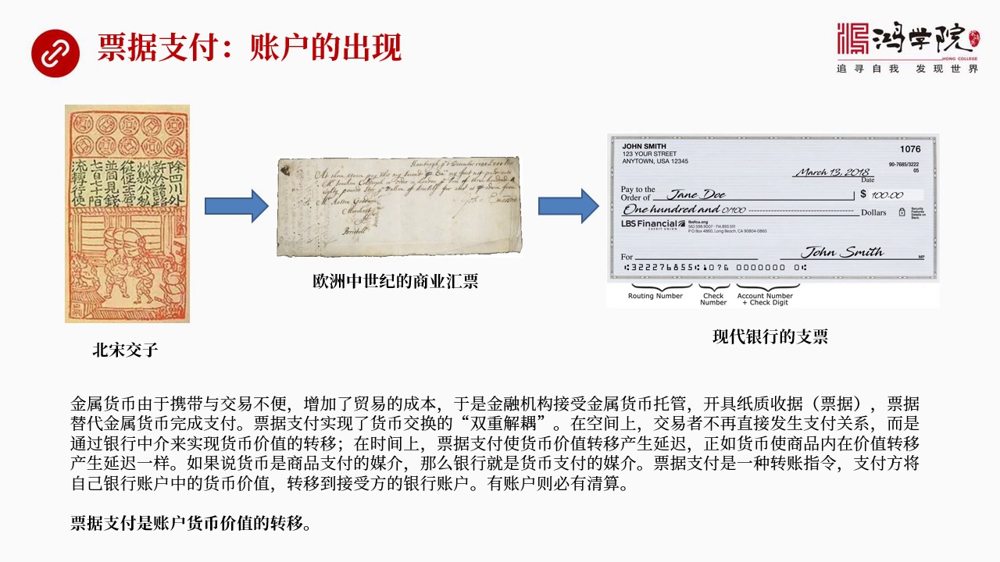

这就是票剧支付票剧支付就会使得账户这个概念被提炼出来了比如说立上我们看到中国北宋公元1024年北宋出现的官办的胶子其实在官办之前还有民间的胶子已经运行了一二十年了也就是成都了十六个大账户大家当年觉得用...

<strong>All subtitles</strong>

> 这就是票剧支付票剧支付就会使得账户这个概念被提炼出来了比如说立上我们看到中国北宋公元1024年北宋出现的官办的胶子其实在官办之前还有民间的胶
> 子已经运行了一二十年了也就是成都了十六个大账户大家当年觉得用在刺转地区由于缺少货币的材质同所以大家只能用铁来进交易但铁的重量实在太沉了大家发
> 现搬着铁块跑的跑去做生意非常的麻烦所以十六个大账户他们就共同发起了一个伟大的金融创新这就是指币交子怎么做呢所有的商家你们可以把铁块这种钱存在
> 参户里十六个大账户某一个商户的参户里这个商户相当于给你开个账户然后给你一张收据这个收据就是交子你从那多少铁块我们再上他就可以填多少数然后人们
> 交易就使用这个收据来进交易所以交子就成了一个流通的工具变成了货币了那么当接受到这个交子的人最后要去变现他就会找到这个商户说这是一开的收据所以
> 我现在要从这提取铁块也没问题人家可以当场对换这就出现了使用指币使用票剧来进行交易他是让是一种收据来进行交易来进行支付同时客户们出现了账户就十
> 六个大商户会给他的客户开立这个交子的账户那么在往后中国是最早发明交子的在往后我们看到欧洲中世纪的时候意大利商人手创了什么商业会票我们核心课以
> 前的课程中专门讲到过这段历史大家想搞明白商业会票是怎么进行交易的是怎么进行支付的可以去回过头来看那几节核心课在往后就出现了现代银行的支票其实
> 不管是商业会票还是银行支票还是交子共同支出都是必须要依赖金融中介就是必须要有金融机构我们可以称之为是交子户或者是当时的银行或者现在的这种现代
> 银行但是必须要有账户所以这就出现了一个票剧支付问题票剧支付呢它其实又实现了一个货币交换中的双手节有问题空间上也一样交易者不再直接发生支付关系
> 买卖双方大家不用说我把现金给你我现在是给你一张票剧所以我们俩的支付在支付方向上就没有直接的这种金钱的直接往来而是通过一个第三方把这个账给你转
> 过去那么在时间上票剧支付是货币价值发生了延迟就像货币是商品价值发生延迟一样这就产生了一个货币的一个新的货币一个新的作用就是它使得商品的交易出
> 现了货币没借之后再用货币没借之后就再出现了金融机构这个没借那么这个票剧的本质是什么票剧的本质实际上是一个指令是一个转账指令支付方把自己的银行
> 中所存的钱通过支票的形式通过票剧的形式命令开户房转向接收方的这个账户所以这就涉及到一个清算问题因为到底怎么个调整账户的数据这个办法怎么来做呢
> 谁先调谁后调还是有一个第三方来帮着调所以有账户籍必有清算那么票剧支付的本质是什么是账户货币价值的转移所以我们看物务交换是一种价值的转移这是龙
> 虎来说货币支付或者叫现金支付它是一种商品内在价值的一种转移那么票剧支付呢它是货币价值的账户货币价值的一种转移所以这就是三种不同的这种理念第一
> 是商品内在价值转移第二是货币价值转移第三是账户货币价值转移好我们现在再看下液刚才我们说到有账户币有清算那么清算到底什么意思呢

---

### Slide 5

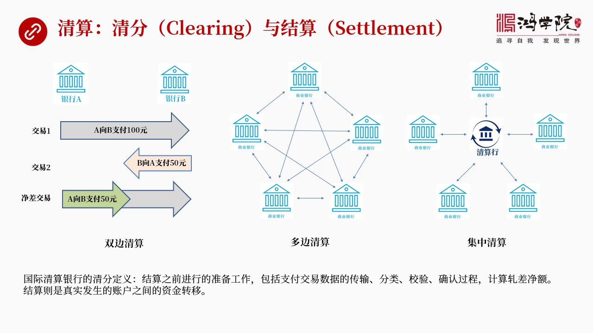

清算其实分成两个部分清分与结算这个清分是什么意思结算又怎么来理解呢我们看这个图中左边了这张图看到有两个银行银行A和银行B如果我们要理解清分我们看这个最左边这张图你会看到如果说这个银行A要付给银行B10...

<strong>All subtitles</strong>

> 清算其实分成两个部分清分与结算这个清分是什么意思结算又怎么来理解呢我们看这个图中左边了这张图看到有两个银行银行A和银行B如果我们要理解清分我
> 们看这个最左边这张图你会看到如果说这个银行A要付给银行B100块钱这是要发生这样的一个交易但是同时银行B又欠了银行A50块钱这就是交一二所以
> 双方真正需要搬动的资金比如说你是金币还是银币还是铁块不需要搬两次第一次是A银行往并银行愿意100块钱第二次是并银行再搬回来50合并呢我们还不
> 如做一个警察看看我们最后到底谁欠谁谁欠谁欠多少所以我们看到这就是一个警察交易第三个警察交易就是最后发现我只需要从银行A向银行B搬一次钱就够了
> 有多少50块钱所以这就是双边清算两个银行之间进行清算算竞差通过竞差来进行这个最后的结算这个结算是什么意思这个清分的意思和结算它是不一样的清分
> 其实就是在按着国际清算银行的定义就是在结算之前做的数据准备工作包括交易数据它的传输分类教验和确认然后计算这个竞差结算呢其实真实发生资金转移的
> 过程叫结算就像我们刚刚所说的这个双边竞算你在算第一次我向你交易一向你送过去一来块钱交易二你向我送50块钱那么我算出来其实我们只需要从A到B送
> 50块钱过去就行了这个过程叫清分最后真正搬钱的那个过程叫结算当然这个双边结算它的效率是比较低的为什么呢就是我们想象一下吧就像物交换一样如果我
> 要跟一万家银行每家银行之间都要发生双边关系这个过程就太复杂了就像我们看了中间这样图那多边清算就像我们来所说的五家银行就有十种双边关系你要有1
> 000家银行呢那就是50万种那还怎么做清算那太复杂了吗所以最终的发展方向一定是就是当银行越来越多的情况之下它这个进化的必然方向就跟货币出现十
> 一个道理它一定要做集中清算就是大家通过一个中央的或者叫中心的清算行就是清算中心来进行这个集中清算就像我们看到右边这样图这就简单了吗你有一万家
> 银行每家银行都不用互相跑得跑去的就只跟清算行一家打交道就可以了那就是清算关系结算的过程变得极其简单那么清算行做的事情就是清分与结算算竞差谁欠
> 谁多少钱最后搬钱那么这个过程其实就是我们理解支付的一个最重要的核心理念清算 清分和结算到底怎么做好 我们再看一下一页那么刚才我所讲的

---

### Slide 6

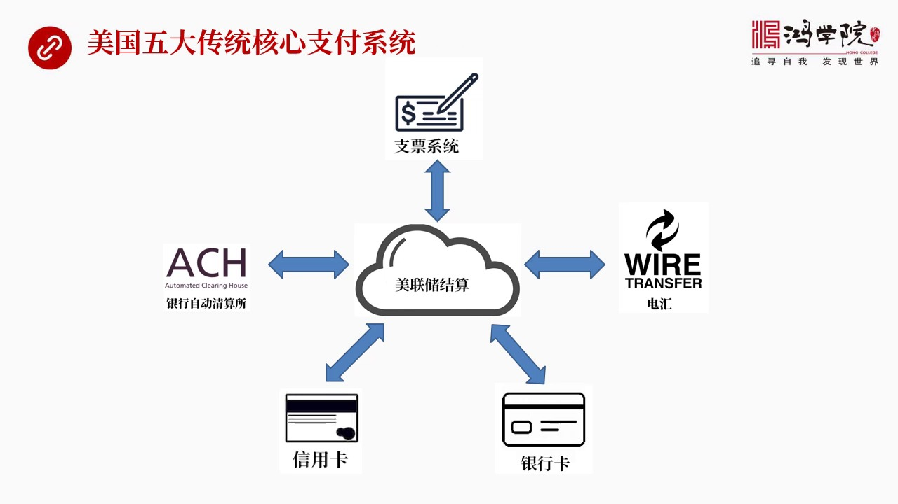

是支付中间最基本的一些方式比如说物交换比如说现金支付物交换是一种现金支付是一种其实这都是比较原始的在现在社会中我们不可能用那样的方式进行这个支付所以在现在社会中除了现金支付之外最主要的非现金有五个核心...

<strong>All subtitles</strong>

> 是支付中间最基本的一些方式比如说物交换比如说现金支付物交换是一种现金支付是一种其实这都是比较原始的在现在社会中我们不可能用那样的方式进行这个
> 支付所以在现在社会中除了现金支付之外最主要的非现金有五个核心支付系统比如说美国的最重要的整个支付体一种最重要的一块或者说它是整个支付中间它的
> 远头支付这个问题从哪儿提出来的就是从支票系统提出来的这是支付概念中最核心也是最重要的一个出发点当然除了支票系统之外我们如果再看第二个就是SH
> 银行自动清算锁这也是个非常重要的支付系统然后再往后就是信用卡信用卡大家每天这个刷卡其实你需要理解是刷卡背后到底发生了些什么那么信用卡它也是一
> 套单独的这种支付系统当然还有银行卡银行卡不同于信用卡它是ATM机所组成的一个全界连网的网络除了银行卡之外第五个最重要的也是量最大的就是电汇电
> 汇大家脑子面肯定是非常熟悉这个词但电汇是怎么进行交易的它是整个操作的过程是怎么进行的可能很多人并没有生存去了解所以我们看到这五个系统围绕着一
> 个中间的就是中间做结算的最终的结算方式是谁是美联储是美国中央银行最后做结算我们可以把五大系统都理解成一种侵分系统各种各样的信息过来之后我在这
> 先给你台序做警察等等然后最后搬钱的过程我要委托中央银行来做做结算做搬钱当然这是一个大的体系的这种理解那么我们再说到每个小系统的时候还会介绍它的一些细节问题好我们再看下一第一个系统我们先谈一下支票系统

---

### Slide 7

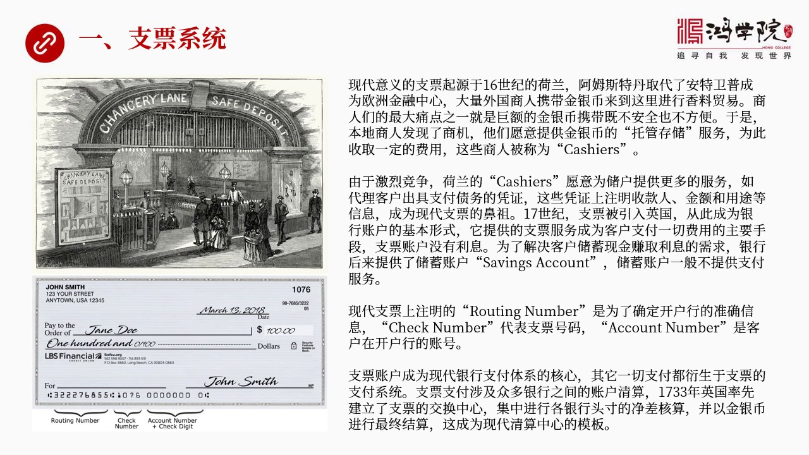

支票是整个支付体系中间最早出现的概念也是整个银行体系中间最重要的概念因为我们中国人不太习惯或者说大部分人没有使用过支票个人支票所以对支票的理解不是很深刻不知道为什么要有支票账户和处区账户这两种账户所以...

<strong>All subtitles</strong>

> 支票是整个支付体系中间最早出现的概念也是整个银行体系中间最重要的概念因为我们中国人不太习惯或者说大部分人没有使用过支票个人支票所以对支票的理
> 解不是很深刻不知道为什么要有支票账户和处区账户这两种账户所以要理解这个概念我们必须要回顾一下支票它的历史当然我们知道历上很早就有类似于这种支
> 票的东西你可以说古代就有从古罗马时代中国的唐朝飞前还有很多很多中世纪异大利都有阿务博世界也有但是我们所说的现代支票并不是源于这些概念实际上我
> 们所说现在支票它应该是起源于16世纪的荷兰最接近于我们现在支票体系可以说它是直接的比资当年阿务斯特丹取代了安特维普我们核心客中也讲过这两城市
> 包括他们之间的死心比衰的历史原因所以阿务斯特丹取代了安特维普成为欧洲金融中心之后就发生了一个重大的转变安特维普大量的香料贸易转到了这个阿务斯
> 特丹那么大量的外国商人比如说游泰人或者是什么英国商人 伊大利商人他们到阿务斯特丹来办理来进行从事吧这个香料贸易还有其他的各种各样的商品贸易碰
> 到一个最大问题就是扛着金字银子大量 现在大量金幣和银幣这玩意儿太不方便而且也不安全可以说这是远到而来的这种商人们最大了一个痛点之一所以安特维
> 普这个阿务斯特丹的本地商人就发现要解决这个痛点有一个很好的一个商业的机会所以就出现了本地商人愿意提供一种服务帮助外国的商人存这个存储携带了这
> 种现金携带了金和银就出现了一种新的拖管服务就是我们可以说叫什么呢叫科歇尔科歇尔这个慈当年就是专门指的阿务斯特丹本地的商人为外国商人提供金银保
> 管业务的这么一种商人他们为了拖管业务要收取一定的手续费好 这样一来的话大家发现这个声音很好做因为没有什么风险稳正不陪还收手续费所以很多人都来
> 参与竞争竞争越来越激烈 导致大家只有这个比拼能不能提供更好更好的服务 更多的服务那么这个有一些科歇尔就是这种拖管商人就想到了一个新的增之服务
> 这个增之服务问就是你到我这来存钱存赢子之后我可以帮你带办一个业务就说你比如说你在那买了香料那么你要负别人一百个精闭你其实不用到我这来取精闭这
> 个现金你其实可以让我写一个单剧支付的单剧上面形成谁呢谁收款那么支付的金额是多少原因是什么然后牵上你的大名然后你就把这个支票给对方这个支付的单
> 剧给对方对方就可以到我这里来取现金取这一百个精闭或者到我这家银行开在不如日开到伦敦开到佛罗伦萨可以到所有联程式只要是我的分号都可以取钱这就是
> 一个非常非常受欢迎的一个业务我就不碰这个金子了懒得看来看去的这种业务其实就是我们所说的现代支票的比组它变成了一种支付行为从事商业活动中间的支
> 付行为那么到了17世纪这种支票账户的理念被传入了英国那么英国人把这套理念发扬光大最后就建立了现代银行的支票这样的体系那么它出现了这个支票这个
> 体系之后其实又有一些人提出了新的问题新的问题就是我有很多金币银币我只需要就是我平常做生意用不了这么多我有一万个银币一万个金币我只需要动用一百
> 来买东西就告了我剩下还有九千九千我都存在你这儿你还收我这么高的费用那我就亏了所以大家竞争结果就是如果你只用一百个金币经济交易的话那剩下了这些
> 钱我可以给你存到另外一个账户中这个账户叫处序账户这个处序账户我还可以给你利息那么这就变成了我在货币战争书中所谈到了金将银行家金将银行家就是我
> 把你的钱收到了我的处序账户之后你这个钱是不能随便用的这是一个处序账户它这个有限制那么你如果不能随时来取我就可以动用这笔钱把它放在给其他人这就
> 出现了信用的放大这就出现了货币成术就是从这样的行为中出现的所以知道今天我们看到全世界基本上主要国家的这个银行都提供两种账户一种叫checki
> ng账户就是支票账户另外一种叫saving账户就是处序账户checking账户支票账户是没有利息的方便你写支票付款提供这样付款的服务支付服务
> 那么saving处序账户是帮你证一些利息的所以这两种账户是不一样的一般而言在大多数情况之下银行给你开的处序账户它是不会给你支票的你是没有办法
> 去用这个处序账户的钱去支付账单或者去买东西当然有限银行提供但是那就是属于后来的衍生业务了那么这就是我们看到了为什么这个支票账户和处于账户它是
> 有区别的这是它的演化的历史如果我们看一张现代支票看走图吧上面就是当年出现的这个金将银行家出现了可歇尔这些包括后来金将银行家他们办了一手取金责
> 和银责我给你开开这个手具给你提供一个支票的服务你可以用支票进行转账支付那么下面呢就是一张现代的支票现在支票呢我们如果看它的最下方最下方最左边
> 会有一串数字这串数字上面写的是Routing number就是这个一个路径实际上这个路径是什么概念呢它是确定了这是哪家银行在哪里因为银行的名
> 字可能有重复哪一个银行只是有一个单独的这个号就像什么这号一样所以我只要知道你支票上的头几个数字我就知道这是哪家银行的就是写支票这个人它的开户
> 杭是是在哪里在哪个地址银行是谁那么中间这一块数字呢是支票号我知道它是支票号我就知道它是大概用过多少张这是银行用来用来这个检查用的还有呢第三个
> 号就是这个它的账户抗南本这个是它的账户每个储厚在银行都有一个账号这个账号都有一个数字其实这就是现在支票的一个标准格式上面写着付钱给谁然后付多
> 少钱是七千字而是那么为什么说支票账户是现在银行支付体系的核心呢就是所有的支付概念就是存钱存钱的目的并就一开始并不是为了吃利息存钱的目的是为了
> 买东西是为了消费是为了支付所以我们看到了其他几大系统都是从这个概念中从支票账户中后来眼省出来的其他所有的支付体系它的根基它的思想源头都在于支
> 票账户上那么支票就涉及到成千上万家银行了因为每家银行你如果开家这个账户的话都会给你一个支票玩那么成千上万个人在做交易的时候就会涉及到成千上万
> 个银行这就需要进行集中清算否则的话那一千家银行就有50万种这种双方打交道的不同的规则和办法那把人给整死了所以必须要集中清算集中清算然后算出各
> 大银行到底谁限谁欠多少钱然后最后搬银子的时候就简单了这套体系是谁最先搞出来呢集中清算集中中心的概念是英国人1733年率先建立了支票的交换中心
> 就是大家都到一个地方去就是你把你这个我这个银行收到大量的支票客户到我这来存支票然后我把这些支票这些支票会走然后送到交易中心而且交易中心各大银
> 行的代表都在那大家搬这个带来支票之后在那里进行集中的交换哪些要进行分类哪些要算进差最后那就成了一个交易中心就是支票的交换中心然后集中计算各个
> 银行他的投寸他的进差最后一天完了之后我们到最后下班之前再以精英币进行银行之间的这种支付就是结算然后完成全部过程这就是现代清算中心的典型的模板鼻子就从英国来了1733年再看下一夜纽约清算所

---

### Slide 8

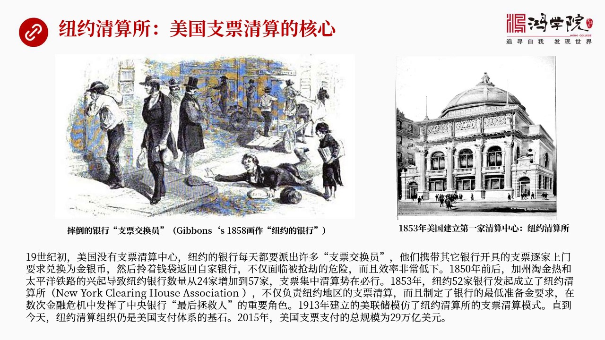

美国支票清算的核心因为英国人1733年搞出这套体系之后美国比英国的金融要落后很多 土老猫美国是英国的致命地很长一段时间美国的金融都很落后到了19世纪19世纪初美国都已经见过好几十年了但是他们仍然没有搞...

<strong>All subtitles</strong>

> 美国支票清算的核心因为英国人1733年搞出这套体系之后美国比英国的金融要落后很多 土老猫美国是英国的致命地很长一段时间美国的金融都很落后到了
> 19世纪19世纪初美国都已经见过好几十年了但是他们仍然没有搞出清算中心这样的体系来当年的纽约是美国最发达城市纽约的银行家们怎么进行支票的支票
> 的交换呢注意啊美国很早就使用支票但是他们一直没想明白这个支票该怎么交换你看看这张这个左边上面这张图这张图是当年1858年一个画家他画的纽约的
> 银行家带着支票临着前段在大街上进行这个到处奔走然后进行这个支票交换的场景也就是当年在纽约每个银行收到支票之后客户来来存支票然后来上战那么他们
> 拿支票要到其他银行谁是开户行要找开户行去拿钱怎么办呢他们就顾了大量的这种叫支票交易员这有些人骑着马有些人走路这些支票交易员要手上有另一个袋子
> 或者绑着腰上这个袋子面全都是这个银行他要到其他地方去要钱的支票那么他们是怎么做的他因为没有集中清算他们叫一家一家银行去敲门比如说我拿了支票带
> 这个第一把支票可能一块了比如说纽约第一城市银行给我开的他们的客户给我们的所以我要到那把支票给他们让他们给我多少个金币多少个银币然后我再把这些
> 钱装到袋子里再拖回来拖回我们本银行锁到我们的金教里那么这张图上画了就是有一个交换员拿了一个钱袋你看大家手上都拿着钱袋还有拿支票袋的结果这个人
> 在地上摔了脚差点把钱袋给丢了所以这就说明了当年纽约应该说在1850年之前大概就是这么一个情况支票没有办法集中进行交换当然这就麻烦就很大了因为
> 拎着这么多钱再接上走所以打节而且效率也非常低那么在1850年前后整个美国的经济高速发展低纪是加州发现大金矿所以就进山崛起大家到那逃进去了需要
> 很多很多钱需要融资还有就是太平且铁路横跨美国大路的也开始新建所以需要大量的融资活动大量的钱银行也变得越来越多以前大概这个24家银行到1850
> 年前后变成了57家我刚才在图中已经说过了这个银行了数字如果增加了双边的这种交换关系会变得非常非常复杂那真是成指数型上升了所以变成57家这个纽
> 约的银行家还搞不定了因为这个交易的复杂程度就变得越来越让人无法承受所以集中轻算必须要进行这就是1853年纽约的52家银行连合发起了你纽约轻算
> 所纽约轻算所主要负责纽约地区当然还有周边的美国东部地区的支票的这个轻算所有支票都到这儿来进行交换也就是那些支票交源不用挨家挨护跑了你不用每天
> 跑27家或跑52家银行类似人你就只去纽约轻算所一个地方就够了然后把所有支票拿出来该收多少钱该负别人多少钱算出竞差来然后把竞差给拉回来所得金库
> 里完事所以这一套体系搞出来之后使得整个纽约的经济还有它的这个融资的效率大幅提升除了这个之外它还有一个重要功能就是纽约轻算所它是各大银行搞的是
> 属于私人的所以他们还有对各个参与银行的加盟银行开始制定各种规章制度比如说美加银行你必须要有多少准备金你账上必须要有多少竞库里必须要有多少金币
> 如果你这个金币太少我们现在人就会承担风险因为你的客户开出来的支票最后到我这会被谈过来因为你金教里面有什么的钱吗不能瞎态所以你必须要由一个最低
> 准备金在那这就是后来我们看到的它起到了一个类似于中央银行的作用制定货币政策制定银行的规章制度然后后来美国发生了一系列各种各样的经济危机金融危
> 机像1857年的包括后来1872年73年还有1882年还有后来的1907年在历次金融危机中间纽约清算所都起到了非常重要的最后贷款人的角色就是
> 中央银行所以在美联储建立之前纽约清算所它起到了类似中央银行的作用当然后来1913年中央银行建立了美联储建立了美联储建立之后它面临了一个主要业
> 务也是全国支票的清算它自己也不知道该怎么做从哪学当然美联储的建立也是这些纽约银行家发起的然后它的支票清算模式也是从纽约清算所学来的所以直到今
> 天纽约清算所它当然现在改名了叫纽约清算组织仍然是美国全国的支付体积中间最核心的一个部分不仅做支票清算还要做很多包括电影会清算和其他业务清算我
> 一会儿都会讲到所以直到今天纽约清算组织仍然是美国整个支付体积中间核心的组成部分2015年这个美国支票全国的支票交易总规模就是支票支付通过支票
> 来支付的总规模是多少呢是29万亿美元大家听到这个数觉得很大其实这个还不是最大的如果我们再看下业下业呢

---

### Slide 9

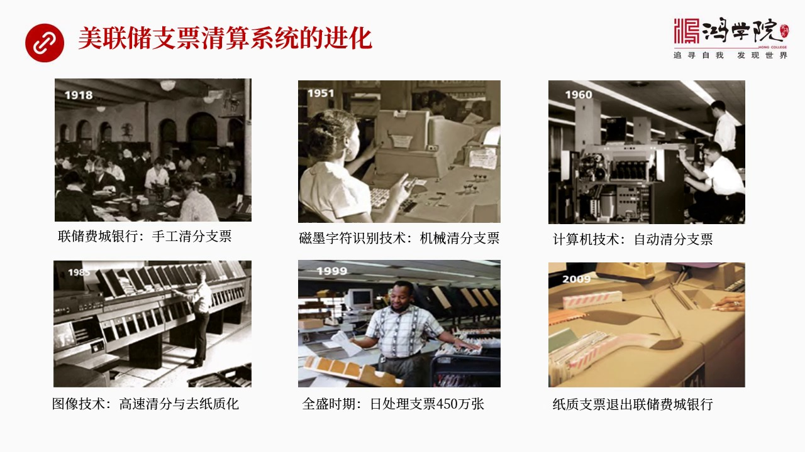

就是当纽约清算所发展到后来特别是1913年美联储成立之后纽约清算所和美联储之间就形成了一种合作关系也就是我刚刚所说的清算实际上是清分和结算清分这个部分可以在纽约的清算所来完成但是最后的结算大部分结算业...

<strong>All subtitles</strong>

> 就是当纽约清算所发展到后来特别是1913年美联储成立之后纽约清算所和美联储之间就形成了一种合作关系也就是我刚刚所说的清算实际上是清分和结算清
> 分这个部分可以在纽约的清算所来完成但是最后的结算大部分结算业务还是要放到中央银行因为各个银行都在中央银行开有自己的账户中央银行进行账户调整是
> 最简单的所以两者进行了分工那么在美联储的12家中央银行里面他有纽约银储非常连储等等那么他有12家连储银行共同组成的美联储的系统再加上华人顿的
> 一个委员会这叫整个叫美联储系统那么比如说我们中间举一个例子拿非常连储来看他的业务怎么开展你会发现整个美国支票系统支票支付它是怎么进化的比如说
> 我们看这张照片这都是非常连储对他们历史的一个总结我抓去了中间一些最有特点和最有阶段性的一些照片当然他们他们都是在讲述整个支票体系的进化第一张
> 照片1918年也就是美联储成立五年之后这个非常连储银行你看看大家做那是怎么在轻纷支票的纯手工就是美加银行把所有的这个银行这个支票进行分类然后
> 美加银行进多少出多少谁欠谁多少这全部用手工来分所以就需要很大的工作量这当然是非常麻烦所以这经济发展那支票量越来越大每天处理几万长几十万长把这
> 个人都累死了这肯定是最终手工是不行的所以到了我们后来看到这个第二张照片1951年出现那种新的技术叫这个磁墨自服识别技术也就是我们看到了那些有
> 些卡上背后有一些磁条还有一些纸上也有一些磁条实际上就是把银行的支票中间刚才我说了一些核心的一些信息什么饶天能备切个能备什么银行的支票的这些号
> 码还有相关的一些重要信息全部存处在磁墨这个自服中间就是存处在这个磁条上它还有重要的防尾作用因为你支票我可以负印或者是画出来都可以但是存在磁场
> 中间你要想把它读取出来就不好伟造了所以有了这种磁墨自服识别技术之后还需要读卡机这个读卡机其实就是把这些磁场中间存取的数据给抓出来然后通过一种
> 机械式的办法来进行支票的清分所以我们看到50年代的时候它就已经实现了机械化的清分可以说它们对于支票发展技术投入是很大的我们再看到了1960年
> 计算机出现了所以开始通过计算机通过读卡这个设备把磁条中间的东西读出来之后然后用计算机来进行处理那效率就更高了它的处理的速度就变成了一种高速处
> 理自动来清分这个支票然后最后做结算算出经常做结算就很简单了那么到了1988年、89年我们看到走下脚出现了图像技术图像就是什么呢在以前骂这个支
> 票如果大家去看一些照片的话你就会发现这个支票的清分机是非常非常复杂的一个机器然后你比如说工作人员把一大落支票然后放到这个机器的一个就像复营机
> 的那个脱盒然后你就看到支票夸易非常高的速度一秒钟十几张或者这个一分钟这个几十张的速度然后在一个自动流水线上飞快的移动然后它在移动过程中然后它
> 的细细被不断的堵取然后这个支票就不断被不断的被甩入一些就是一些盒子中间那些盒子中间就是清分之后的结果然后同时又把中间的数给堵出来了堵出来了之
> 后然后你就看到这个处理的速度非常快那么图像技术是怎么回事图像技术就是大家想当时一样家想你不就是因为这个要把这个磁条中间的数据堵出来吗如果这样
> 的话我们也可以照项照项之后通过就是通过这个图像技术也可以解决这个问题特别重要的是这些支票如果我有一个因为它最后根据每个法律最后支票都要反给开
> 出了银行再反给这个写支票的人个人所以我记得90年代在美国写了大量支票之后你会发现过下个月的时候银行又把你这个支票给你记回来当然它已经处理过了
> 所以你会收到你原始开出支票的它这个原始单剧图像技术出现就是不要搞得这么麻烦还要把支票支支票借来借去借来借去它太复杂了我们用图片用照项产生这个
> 图型来取代指示这不是一个很好的办法吗当然这个原理是早就没问题了在90年代的时候在美国就已经普遍使用了但是法律上还不行这个要等到90年代以后美
> 国通过了一个新的法律叫切刮21切刮21这个法律讲那就是其实图像那个照相照上那种图型的数字文件它的法律效力等同于指指支票这个完成之后美国才会全
> 面进入图型的这种清分系统就进化到另外一个时代了到了1999年这个时候我们可以看到这是非常连处它达到了一个历史上处理支票的高峰每天处理支票的量
> 达到了450万张你可以想象一下它这个处理速度有多快那真正一分钟就会出去我看它们那个电影一分钟出去那个简直上设见每张支票的应用速度非常的快所以
> 它能达到一个日处理支票450万张的水平当然我觉得在中国哪怕你在银行工作基本上都没有接触到这种设备因为中国从来就没有兴起过私人支票对公支票是有
> 但对公支票的数量显然没有这么多所以中国的银行工作体系中间恐怕没有向美国从机械化从这个磁墨自服识别再到计算机械的图型图像我们现在是有图像这个这
> 个清算系统倒是有以前那些机械式的恐怕都没见过那么到了现在2009年以后我们看到指示支票已经完全退出了这个流通了连终一样不再做这个事了因为支票
> 的指示支票使用量越来越低其实通过支票系统的清算我们可以看到美国整个它的技术眼睛的方向我们再看下一这就睡到一个

---

### Slide 10

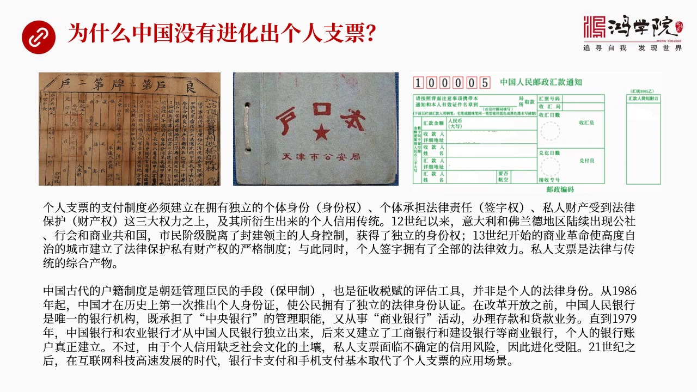

比较有趣的问题了为什么中国没有进化出个人支票呢其实我们想想看个人支票它是需要一定的基础我称之为必须要拥有三种权利它需要一种社会文化传统法律各方面的支撑这三种权利是什么呢第一是个人身份权你必须要有一个正...

<strong>All subtitles</strong>

> 比较有趣的问题了为什么中国没有进化出个人支票呢其实我们想想看个人支票它是需要一定的基础我称之为必须要拥有三种权利它需要一种社会文化传统法律各
> 方面的支撑这三种权利是什么呢第一是个人身份权你必须要有一个正式自己是谁的身份第二要有各地承担法律责任的这种权利也就是你的签字要管用第三就是私
> 人财产要受到法律的严格保护所以你要搞个人支票制度一定要建立在身份权签字权和财产权这三大权利之上有了这三个权利之后才会整个社会才会演化出才会进
> 化出个人信用这样的文化我们立上没有西方那从八百年前十二十几十三十几它就已经形成这条制度所以它一样成了一个人信用文化所有的信用都是跟着个人走中
> 国没有这个概念为什么从十二十三十几开始出现这样的一个情况呢主要是当时一大例还有富兰德这两个地区现在比例实地区陆续出现了公这个所谓公社也就是类
> 似于早期的共和国这样一个政权组织还有航会包括后来进化出的城市共和国商业共和国那么在这些这个自治市或者叫共和国里面市民阶层已经完全摆脱了对封建
> 领主的这种人生衣服它获得了完全自主的身份像法国的很多城市只要你是一个奴隶奴隶跑到城市待满一年你就会自动变成合格的就自动变成合法的城市居民哪怕
> 领主再找到你城市都说这个人已经在这待了一年它已经变成独立人了跟你没关系了如果不服那就要打仗所以这套体系就建立起了一种独立的个人的身份的就是公
> 民制度公民制度当然包括你身份的验证然后每个公民都要签字投票等等所以你的签字全具有着法全部的法律效力还有商业革命以来就是三十几商业革命以来那么
> 商人的利益越来越大权力也越来大所以他们要求严格保护他们的私人财产这就建立起了法律严格保护私有财产权的这样的一个制度所以在这三个制度之下西方开
> 始逐渐形成了个人信用个人签字的法律效力等等反过来如果我们看中国中国的情况就很不一样中国立上也有户口也有户籍但这种户籍它不是为了证明我是个独立
> 的公民我有法律身份它不是这个概念它是同志者封建同志者封建王朝为了管理诚民的一种手段比如说立上我们出现的保假制五家连锁在一起有一家犯罪其他五家
> 连锁所以我们看到左边这样图这个是清朝这是明朝这个户口本包括我们后来第二张图看到是文化大革命还有文革这个改革开放之前的户口本这种体系其实它反映
> 了它反映了是一个统治统治阶层管理诚民的思路给你一个户口并不代表你有个人代表你有独立的公民的各种各样的权利而是说我们为了很好的管理这个地区不出
> 问题为了让这个地区老百姓能够很好的蒸税根据户籍来贪派各种税负所以它不是一种个人法律身份中国真正建立比较独立的这种个人身份认证什么时候是198
> 6年以后才建立了个人身份证以前来身份证都没有办任何事情都得拿到户口本还得拿到单位介绍信理论来说你不是个独立的人首先是找你的单位你如果不属从属
> 于任何单位那这人就麻烦了你在社会中那你算谁啊你就没有一个没有一个就像好像飘在社会中了一个过分也鬼一样所以在七十年代六十年代当然我们大多数同学
> 恐怕都没有经历过那个时代在那个时代中人要没有单位那是在社会中恐怕是真是寸不难行那么由于这种身份制度建立个人身份个人的法律包括千字这种制度建立
> 的很晚到八十年代之后才开始录续建立同时呢八十年代之后中国的银行才第一次进行分工就是以前人民银行中央银行是唯一的全国的这种大的唯一的这么一种金
> 融机构没有其他的银行它即使中央银行管理货币政策同时又从事上银行管理储蓄进行这个储蓄还要进行这个贷款什么也有它都做所有的基层的储蓄所都是人民银
> 行的城市的基层单位农村信用社某种以上在某些的东西也是人民银行在农村地区的基层单位所以大家如果回想起来八十年代我记得上大学的时候家里给我们汇款
> 不是像现在用手机支付或者这个在银行卡上给你转过来但是没有银行卡怎么办全部用的是邮政邮政汇款单这是我们看的右上角也就是到这个负拿着钱到邮局把这
> 个钱给了邮局之后邮局让你填个汇款单这个难填完之后通过邮局的方式发到学校然后拿这个从门房从说法室拿到邮局的通知汇款通知之后然后然后到银行去办理
> 区款到邮局去取出现金来所以当时中国是这样一种运作制度我们如果对比像美国的支票制度你会发现这个落差确实太大了人家是早在1911年甚至更早的时候
> 他支票的交换制度就已经建立起来了而我们当时在这个时代其实还不知道我们就只知道前存的银行这就是一个账户什么checking什么caving或者
> 支票或者叫处区账户完全没有我们就只有一个账户这个账户就是在处区走中给你的银行本上处区本上写了一个数就是那个东西那么后来中国这个人民银行在79
> 年开始录续分出农业银行然后中国银行后来84年分出工商银行后来在建立商业银行制度才有了银行银行的账户然后每个人才能拿到身份证去办账户给你一个出
> 去本这个时候才建立起真正的银行账户来但是你即便是有了银行账户整个社会没有个人信用这样的一个历史传承我们就不认为个人写支票这能当钱用比如说你的
> 商店你开张支票比如说在国外你就开张支票就可以买东西了就是支付了但是在中国那哪个商店会收你个人开的支票呢这是不可能的事因为谁知道你上上有没有钱
> 你万一骗了我怎么办我把东西给你了你造人闪了最后我拿不着钱我不是亏了吗所以这套制度在中国就一直没有推得开就是银行有这个银行的支票有被拒签拒收的
> 可能性所以私人支票行不通到21世纪之后2019年之后中国现在这个互联网发展很快移动互联包括银行卡信用卡特别是后来手机支付基本上这套题发展起来
> 之后私人支票就再没有进化的空间了所有应用场景基本上都可以用手机支付还有这个银行卡支付来替代也就是说中国在支付体系进化中基本上完全跨越了美国和
> 欧洲最重要的一个历史阶段就是私人支票的这种支付体系我们根本就没有也从来没有存在过吸的糊涂不知道怎么回事一下就跳到了手机支付了这个就导致了我们
> 在理解全世界的这种金融体系中间你脑子卖回缺一块知识你不知道支票账户很重要其实一直到今天它承认很重要你要理解全世界的金融体系的运转就不能不理解支票账户我们现在再看下一頁

---

### Slide 11

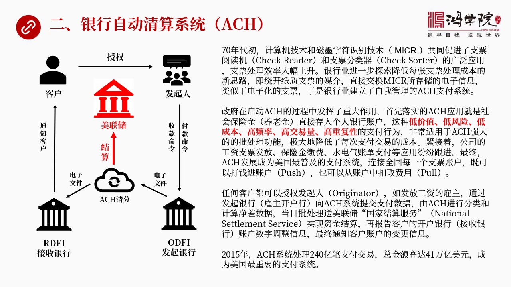

除了支票系统之外美国第二个重要的支付系统就是SH银行自动清算系统为什么会有银行自动清算系统呢为什么搞这套系统呢它的根源就是搞它的动机仍然是源自于支票账户源于支票系统因为在青年内初计算机技术还有这个我能...

<strong>All subtitles</strong>

> 除了支票系统之外美国第二个重要的支付系统就是SH银行自动清算系统为什么会有银行自动清算系统呢为什么搞这套系统呢它的根源就是搞它的动机仍然是源
> 自于支票账户源于支票系统因为在青年内初计算机技术还有这个我能所说的MSC2就是这个慈末自服十别技术这两个技术发展起来之后就使得这个支票处理的
> 速度越来越快出现了支票这个月独机独卡机还出现了支票的分类器锁头还有大规模的自动化积极化了一种应用所以支票处理速度越来快当张支票以前要好几分钟
> 现在就是一秒钟再往后就是一秒钟处理好几张所以银行也一看这个技术进步很牛还了不起他们就要进一步去设想进一步去想我怎么能够再想办法能不能再降低一
> 些处理美张支票的这种处理成本那么最好的办法当然就完全绕开指示支票你反正是独的那些信息独的那个什么绕提Number 银行Number 这个看N
> umber还有一些其他的核心信息我们不一定需要用指示的东西把它存进去再把它读出来合逼咱们一开始就用电子化了把这些数据直接传过来不就完了吗再一
> 个电子化的交易中心把电信信交换同样可以实现指示支票的作用对吧这个概念其实就是绕开指示支票直接用这个电子信息来进行电子化的支票的交换也就是进行
> 这种集中的清算然后使得处理美单业务每一个交易的成本进一步下降这就是为什么银行在千万年的初会建立起自我管理的SH支付系统这套支付系统直接源于对
> 于支票支付系统的改进进一步降低它成本才发展起来的SH当然理念是很好但是在推广中还是有点困难因为这就像使用微信一样你要用能多了它它有价值而如果
> 你朋友都不用那你使用这个有什么价值所以怎么敲开这个市场第一步基本上不是问题男是男在其中市场在这个过程中政府起到了很重大的作用就是政府首先它把
> 第一个落实的场景就是它推这个事怎么落实呢就要求各个银行要求你们的客户因为每个人都有养老金账户就是社会安全安全金的这个账户也就是说银行这个国家
> 每个月要通过跟你分发养老金的方式把钱打到你账上那么政府就说我现在要用用SH这个方式来打这个养老金所以你们必须得上这个系统上了条系统之后那么政
> 府就每个月定期的通过电子化的支付方式可以把钱直接打到这些养老退休这些账户上这就导致了所有银行很快都开始推行这条系统那么我们想想看养老金的分发
> 社会安全金的分发它有一个它有什么重要特点我总结下来是3D和3高第一是低价值低价值就是没比钱都很少一两千块钱退休金嘛第二是低风险这些钱不会存在
> 什么重大的风险比如说对方可能是可能有什么犯罪嫌疑或者洗钱的嫌疑或者对方有可能收不到这个钱这种风险比较低还有低成的因为处理这样电子交易它是很快
> 的同时还有3高第一是高频率就是大量的全国有很多很多人要领养老金好几千万人所以它是一个高频率发生的有些人是几号领有些人时间不一样还有就是高交易
> 量因为全国几千万人都要得到这笔钱每个月那么它就是一个高交易量的一个事还有就高重复性每个月给每个人发了支票的数字数字都一样如果说我全部用指示支
> 票每次写我不是重复劳动吗所以对于这种3D3高的交易来说SH特别特别的符合特别是SH它有一种强大的功能就是批处理功能就是败气就是一次性我把所有
> 的这个进查算完之后我让它在一个时间段集中各处理几十万个或者几百万个这个交易它处理下就非常非常的迅速所以这就使得整个交易的成本大幅下降那么再紧
> 接着公司的各种工资发放工资发放就是以前都是给支票我记得以前我们工作的时候都是每两星期领导一张指示支票然后签上字之后到银行传口中存这个交给银行
> 的这个人员然后他在把你的支票上这个数给你存的银行传户上然后这张指示支票银行最后经过处理之后还要记回到给你发支票支家公司我们各人写支票也是一样
> 走一圈之后收到支票的人存到他的银行最后这个支票再反给我这个过程特别符的成本很高所以后来工资也开始大量使用支票大量使用这个SH还有保险金搅付水
> 电器的账单以至于现在美国几乎所有重复发生的这种低价值的高频率的高重复性的然后这种低成本的这种支付基本上全用SH所以他就成了美国支付体移中间成
> 了这种类型运营中间的主要的一种使用的这种渠道他成了一种主渠道而且他的普及度最高因为SH要给每个人发洋老金或者要收你的保险或者要付账单所以每个
> 人全国的每一个银行账户中间的支票账户全部连进了这个系统只要你有银行账户你都连在SH面那多方便全国这么多人每个人都有每个人都能够连到他的账户上
> 所以SH就可以发挥非常巨大的作用他能够使钱直接抵达每个人的账户每个人的支票账户那么他这种方式是双向的不仅是可以给你打钱就是可以往你账户中纯件
> 这叫 push往你推往你账户上推还可以从你账户中把钱给拉出来托就是扣钱扣费脚费所以他可以同时实现这两功能SH他为什么后来变得现在变得非常非常
> 的普及就是因为他的功能好成本低处理大批量的这种交易非常适合如果我们看左边这张图的话大致描述了他的流程你比如说从左上角这个客户这个客户他可以授
> 权发起人发起人就是比如他的公司你可以两星机给我负一张支票负到我的账户上这需要授权然后发起人他就通过命令通知发起银行发起银行就是比如说这个这家
> 公司的开户行这家公司开户行就说现在每个月9号我要给我的员工装三发钱好这是个支付指令然后这个支付指令通过发起银行就转发成一个电子文件电子文件我
> 们可以理解成就是一个电子型的支票然后送到SH的清分系统然后他他每天要出于这个几百万个这样的一个电子文件然后这个电子文件再转向了接收银行接收银
> 行最后再通知客户说你的前道账了这个过程一家公司如果拥有一万个员工的话这个过程要重复一万次所以他必须要依靠SH强大的这种批处理的清分工能否则的
> 话这个工能太扫了你要给一万个人发工资你想想这个工能量手工或者说你如果不是一套全自动化的而且成本很低的方式那真是要把人给整死了好这一套SH他完
> 成时时清分最后前再哪里转移结算是在哪里发生的SH要依赖美联储进行结算就真正搬钱的工作搬钱是从哪搬就从这个公司所在的开户行然后从这个开户行中间
> 比如说把2000块钱的一月工资转到张山在他个人的开户行他的账户上最后这个班的工作是中央银行在做是美联储在做所以SH只是做清分最后的结算是美联
> 储做那么如果我们来看他的交易的交易的规模有多大呢2015年SH系统处理了241比交易支付交易总经过高达41万亿美元这是成了美国最重要的普及度
> 最高的能够知道每个人的银行账户这么一套系统刚才我们所说的其他的这种系统比SH而言支票系统比SH而言他的处理量还有他的普及度都没有这么高而且S
> H确实是现在在各行各页中用的都相当的普及我们现在再看下一页那么

---

### Slide 12

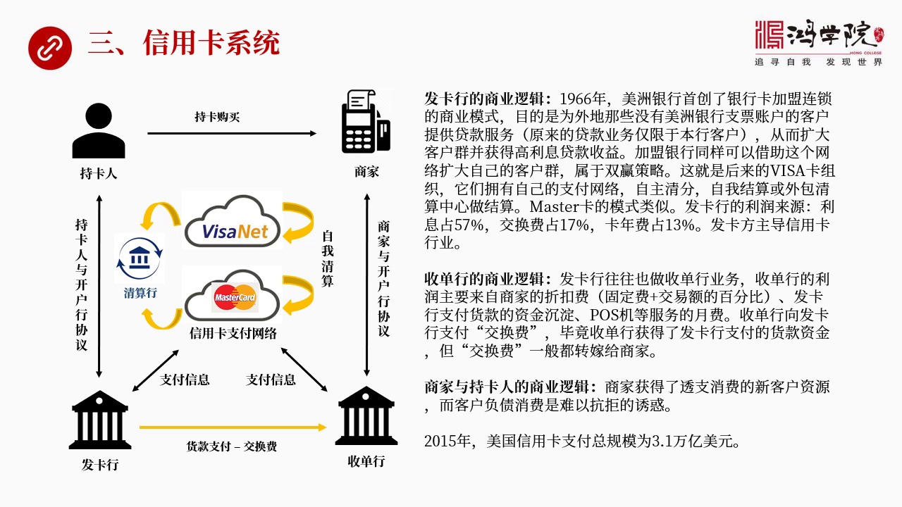

除了SH之外还有一个重要的第三个重要系统就是信用卡系统信用卡系统我以前专门讲过信用卡的历史所以我在这里不重复信用卡他的发展历史我现在只谈他背后的商业逻辑他这个支付系统跟支票的清算系统跟SH有什么不一样...

<strong>All subtitles</strong>

> 除了SH之外还有一个重要的第三个重要系统就是信用卡系统信用卡系统我以前专门讲过信用卡的历史所以我在这里不重复信用卡他的发展历史我现在只谈他背
> 后的商业逻辑他这个支付系统跟支票的清算系统跟SH有什么不一样那么在这个体系中间我们看左边的那种图你会发现信用卡系统一定涉及到四方首先是吃卡人
> 拿着信用卡的人然后他就买东西要找到商家然后刷卡购买商家把这个信息传递给了收单行收单行就是商家的开户行负责帮商家收取收取银行的这个会款那么收单
> 行再把这个吃卡人的支付系统转给信用卡的网络注意信用卡不管我们看到visa还是master卡还是一年还是日本什么卡每一个标志背后是一个复杂的计
> 算机全世界的网络你如果看到visa在这个卡上这就说明刷卡的时候他走的是visa背后的那个那个全球支付网络你要是master他如果刷卡刷是ma
> ster的机器那他走的是全球master那个网络如果是一年那走着中国的计算机网络每个信用卡都有自己完全不同的结算网络完全不同的清算网络这是我
> 们脑子面一定要清楚的你买东西的时候别人会问你比如说我们国内的银行卡左边是visa右边是银联然后外国的服务员会问你你倒是你倒地用visa还是用
> 银联你如果说我用visa好他一刷走的就是visa的清算网络在国际上另外一套技能机网络如果你说我要用银联他一刷那其实是把整个支付信息送到中国的
> 境内走中国的机能机网络进行清算所以这个就是我们要明白每个信用卡背后都有自己一套独立的计算机网络来负责这个资金的清算那么比如说我们这个银行的刷
> 卡信息送到了比如说master的网络他经过确认认证然后确认这个这个人在这个账上有这么多钱他怎么确认他跟发卡行进行联系确认最后发卡人认可没问题
> 然后再把这个认证消息再转回去转换找商家说认可了认可他这个是合法的而且刷了钱没有超过额度好这个时候才发生第二次交易第二次就是真实的搬运资金资金
> 就发生了转移那么这个资金的转移这叫清算他是在哪完成了呢兴卡公司有自己的兴卡网络有自己的一套清算方式他可以在自己的网络中完成清算也可以为拖清算
> 行甚至为拖中央印象来做清算都可以那么关键是他背后的逻辑是什么比如说我们先看发卡行为什么有这个有银行愿意做兴卡这个意误为什么他发现兴卡呢那么我
> 们如果还是简单的回顾一下历史1966年兴卡这个东西是美中印象最先搞出来的他搞兴卡的主要目的其实跟支票账户有直接的关系所以我说所有的支付提起其
> 实都远于支票账户为什么呢因为你想想看美中印象是加加州的印象他蛮那满算的加州就这么几千万人口那么我想到其他地方去开展业务那我必须要开很多很多分
> 支机构那成本就很高了那么我怎么才能比如说我要到东海岸去发展业务要吸引那二个客户成为我的银行了成为我银行的支票账户这种客户呢这很难所以他们就想
> 了一个办法他们想了办法就是什么呢我们能不能找一些合作加盟的伙伴比如说在东海岸发展一些合作伙伴跟我们这个美中印象一块做然后我就是我们共同发行的
> 比如说美洲银行卡如果说他把东海岸银行当中他的一个销售代理如果说你把这个卡给我推销出去好那么哪卡的人申请之后他不是成为我的他无法成为直接成为我
> 的支票账户的客户但是他可以成为我的贷款客户我可以给他放贷放贷干嘛他可以透支消费这当然是远于消费卡的那边的消费卡的那条线的思路但是银行卡的人反
> 映过来之后就发现如果这个人是透支消费的话那么我就可以把它转化成一个非常高的给我支付利息的这么一个新的财园也就是说在这个人还不是我的比如说我在
> 加州银行在加州那个人在附近年好这人根本就不是我的支票账户的客户按照以前的规定我是不能给这样进行贷款的这个声音有做不了但是如果我通过在东海安的
> 一家银行把他发展成了这个每周卡的吃卡会员那么我就可以给他开一个贷款账户虽然他也不是我的支票账户的客户这是发卡银行的核心逻辑他转了什么钱他转的
> 就是一个高窝的利息胸卡的利息非常高大家都知道那么他吃了就是这个利息而且我还就是在你还不是我的支票账户的客户的情况之下我就可以给对你进行放贷这
> 是一个非常大的商业模式跨越一般而言在美国以前的历史上你首先必须要是这个银行的支票账户的客户你才能够进一步去开处习账户然后你才进一步能够搞贷款
> 才能办其他东西你现在啥账户都没有你就直接可以成为他的贷款客户这个东西是以前没有的我们今天在中国的时候其实你也可以想想看我们很多人其实你拥有的
> 胸卡比如说招账银行有一张胸卡但是你可能拿了招账银行胸卡从来不是招账银行的账户的客户你没有招账银行的客户但你可以有他胸卡为什么你使用他的卡你就
> 算是招账银行的贷款客户这个逻辑是这么来的但是为什么在分析压的时候或者在美国东部的其他银行银行院加盟呢美中想就说你看你加入我这个网络我虽然可以
> 通过你你将来我的销售代理帮我去去拉这些贷款客户反过来我也是你在西海岸的销售代理东海岸这个一听也对我们从来不可能到西海岸去发展客户双方这是个双
> 银加入银行越多这个组织力量就越大那就可以开闭全国市场未来就开到了全世界的市场这就是后来成立的威萨威萨卡当然这一套体系他们自己又遭用线路遭用卫
> 星的通讯线路后来要发展计算机网络构建起了全世界的这种威萨的阶算网络然后主要他的引力模式是靠什么呢主要他的引力模式其实是靠贷款的利率贷款的高稀
> 也就是双银卡的高稀收入这些发卡行的利润他的利息占了57%交换费占了17%卡费占13%所以在整个双银卡行业中间发卡引行主导着整个这个行业这里面
> 涉及到一个交换费17%什么叫交换费我们看左边这张图你会看到发卡行和收款行之间有一条黄线这条黄线代表着实际上是吃卡人买了东西之后发卡引行相当于
> 给他提供贷款所以这个钱必须要从发卡行留到收单行也就留到商家的开户行人家卖了东西收钱所以资金流动是从发卡行留下收单行的好但是发卡行就说你看我这
> 个资金是留下你那的所以你占了我便宜为啥呢你相当可以压任我资金对我来说这是有损失的所以这中间涉及到一个交换费的问题所以我在这儿写的是它的资金流
> 动实际上是贷款这个货款买了东西之后支付货款要减去交换费这才是给收单行的最终的金额这个交换费就相当于是收单行为了获得这笔资金我付给你的一个服务
> 费这叫交换费好但是这笔费用它不小它挺大的所以收单行就觉得这晚上我不是吃亏了吗那怎么办我就把这个费用贪销给转价给我的客户转价给商家他怎么转销我
> 给商家报价就是你要加入我这个要委托我做你的收单行那么你就必须我就必须收你钱比如说我的机器泡子机是我的你要给我交月费同时我还要收你一个什么呢就
> 是我要把我的报价标准是一个交换费加上一个百分多手比如说那个叫折扣费一般的商家加入银行卡体系性行体系都要交2%到3%那么也就是我的交换费加上这
> 2%到3%这是你要向我付的钱所以收单行的利润收单行的商业逻辑他为什么要做收单呢主要就是商家要给他贡献2%到3%的交易额再加上个固定费同时还要
> 承担交换费这就是收单行的商业利润当然大家一听肯定觉得发卡行更爽了发卡行正是高额利息收单行就正是交易中间的2%还要这个还有一些其他的这个月费吧
> 其实一家银行往往同时即使发卡行又是收单行他两个月我都做一般分成两个部门有一部分专门做发卡有过部门专门做了收单但后来反正有些银行他如果发卡又做
> 了很强大的话收单也就不愿意做因为利润太低那么这是两家银行发卡行收单行的商业逻辑那么吃卡人和商家的逻辑是什么为什么我要使用性卡呢当然商家他的就
> 是从这个商家脚来看就说我加入性卡这个网络之后他会给我带来新的客人其实在全世界你会看到你要在西方在美国你不用性卡基本上买不到东西其他东西包屎当
> 然银行卡是可以但是要说用微信支付质那可能没信啊所以主要使用最多使用的还是性卡网上买东西也一样现下买东西也一样大家基本上都已经被性卡所垄断了不
> 用性卡就没有其他的办法所以这些商家为了能够进入这个性卡这个联盟如果不进入话人家怎么付钱给你你的生意量肯定做不上去嘛所以这就是商家加入联盟的这
> 样的一个商业逻辑那么吃大人呢吃大人就是我进入我可以透支消费啊我一个月正一千块钱我可以花两千下月再说慢慢还着所以这就是四方的使用性卡系统的这么
> 一个逻辑关系那么性卡系统是一个非常这个在美国是应该说零售业非常大的一个系统一般网上买东西商场买东西吃饭什么的买任何东西基本上都用性卡那么它在
> 2015年性卡的支付总规模这个体系过了资金总量是三点一万一美元当然它赶不上那些批出里的发工资的那些大额的那些大高频率大量的那些交易但是它在零售中占比非常高我们现在看下一页下一页就是第四个系统

---

### Slide 13

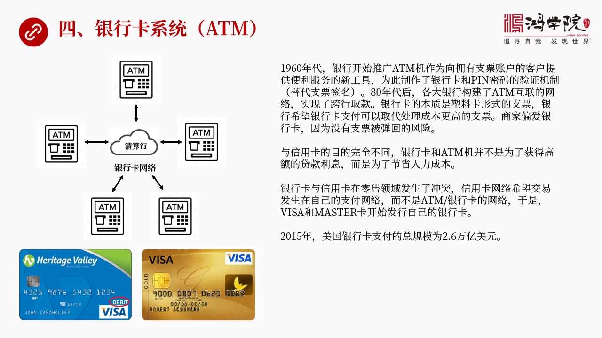

第四个系统是什么是银行卡系统银行卡系统是ATMG的这种组成了一个全国连网全世界连网了体系你拿着中国银行卡你可以到西班牙到美国或者到非洲只要它有ATMG你大概率都能够去到前为什么因为它是世界连网的它又是...

<strong>All subtitles</strong>

> 第四个系统是什么是银行卡系统银行卡系统是ATMG的这种组成了一个全国连网全世界连网了体系你拿着中国银行卡你可以到西班牙到美国或者到非洲只要它
> 有ATMG你大概率都能够去到前为什么因为它是世界连网的它又是怎么发展起来的这套网络是一套完全不同于完全不同于迅卡的单独的计算机网络两者之间没
> 有什么关系了那么这套体系发展是从六年代开始的银行开始推广ATMG为什么要推广ATMG它还是为了服务于支票账户的客户所以你看不管你是什么样的业
> 务最后都是起源的时候都是为了服务于支票账户的客户因为支票账户这些客户给它提供一些变力人家会愿意在这开账户吗那么他们就为了做这个事就是要制作一
> 种比如说蘇勒卡就是银行卡除此之外银行卡我们在这个机制面它一定会让你输入密码四位数的密码这个密码是为了起程作用就是代替你的签名因为你在机上机上
> 没有人没法看你的这个签字对还是不对所以你的密码相当于具有同能法律效力那么这套体系搞拆之后它主要的功能比如说它也可以用用卡来进行支付比如说买东
> 西商店买东西的时候你可以用信用卡你也可以用银行卡有些大量商场到两者都收所以大家刷卡买东西刷银行卡这个叫diby card不是信用卡刷这个银行
> 卡买东西是直接从你银行账户中靠的钱其实ATM机制的这个银行卡它的作用非常像一种取代支票的作用直接这个支付那么它的实质什么它实质其实就是一种电
> 子化或者叫这种电子化的一种这种或者叫塑料化的一种支票那么但是它的逻辑是不一样的乡卡发现乡卡的逻辑是什么呢这个发现乡卡的逻辑是为了增加利润我为
> 了赚取高额的贷款的利润乡卡的利性很高但是ATM机银行卡它不是这个目的它是为了降低交易的费用降低人力成本的费用我不需要这么多银行的职员手的贵台
> 上用机器可以取代人力所以它是降费的费用但是它发展的非常快这就形成了信用卡和银行卡之间双方的斗争为什么呢因为其实在很大程度上这些各大商店的职员
> 就是收盈的这些人或者商店老板吧它的逻辑是我肯定用银行卡比用支票对我来说更有利因为我收到支票支票是指的东西我还得到银行器存很麻烦而且还有可能这
> 个支票被棒死过来被谈回来就是对方根本没有钱没有什么都钱是有存在这种风险的那么如果是刷卡刷银行卡就很简单了这一刷卡如果是过不了的当场就拒绝了它
> 就没有支付风险所以各大商场同时也愿意接受银行卡双方就掐起来了就是银行卡公司和区用卡公司区用卡集团围绕争奪主战场就产生了激烈的矛盾那么新用卡公
> 司就非常希望比如说威斯卡就非常希望所有的交易都发生在我的支付网络里面不要走银行的ATMG的网络那么为了跟银行卡来竞争他们就搞出了一种比如说银
> 行卡这个迅用卡上写着dabby就写着这个实际上类似于银行卡的这种功能我在底下付了两张照片你看左边这张迅用卡虽然写着visa在上面我用红胶圈写
> 的是dabby卡实际上是普通的银行卡他也做这个业务了大家刷卡的时候如果刷这种虽然写着visa但是dabby这个字就是它是一张普通银行卡的话实
> 际上是直接从你账号中画钱根本就不是透支的概念就是不是说它借着给你那么右边这张卡就是一张普通的兴用卡你刷卡的时候它是相当于给你提供贷款你要付它
> 利息的在这个结算期之后那么这两张卡最关键的一致在什么只要上面写着visa不管你是从银行照顾中直接扣钱还是上它借了兴用卡的高利贷但是交易走的它
> 都是visa卡的网络它要的就是交易信息要的就是个大数据这就是两者之间我们看了银行卡和兴用卡之间一个非常大的不一样而且双方确实存在的竞争关系但
> 是兴用卡显然战了上风因为银行卡它推这个事儿的动力不够强它只是为了节省费用而人家是为了赚更多的钱那这种主动精神它就不一样了2015年美国银行卡
> 它的支付组规模大概是2.6万亿美元就比胸卡要少一些好我们再看下一页那么下一页讲到的是美国第五个

---

### Slide 14

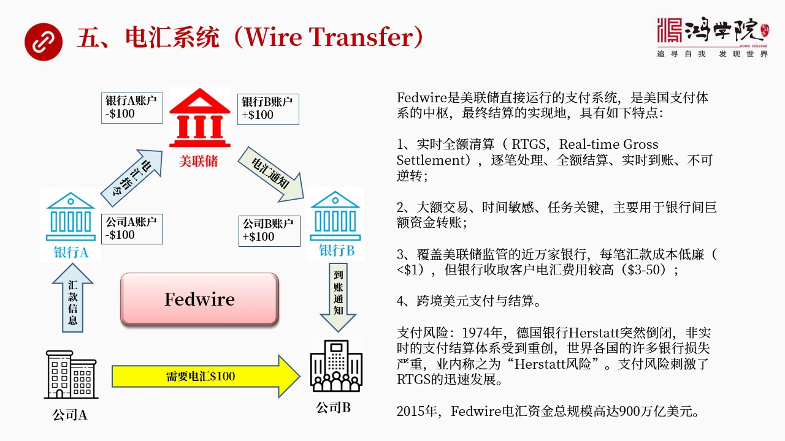

最重要的支付系统就是电汇系统Wire我们知道我们以前经常听说电汇觉得电汇好像专门高然后速度很快刚才我说的不管SH还是银行卡还是新用卡这些支付系统其实都不是一种都不是一种实施系统都是最后要进行批处理的就...

<strong>All subtitles</strong>

> 最重要的支付系统就是电汇系统Wire我们知道我们以前经常听说电汇觉得电汇好像专门高然后速度很快刚才我说的不管SH还是银行卡还是新用卡这些支付
> 系统其实都不是一种都不是一种实施系统都是最后要进行批处理的就是要等待到一天结束的时候然后才进行大量的这种清分和结算最后发生结算往往是在第二天
> 所以这个钱真正到账还要隔一天为什么就是因为它不是实施系统但电汇系统不一样电汇是实施系统就是一发生就立刻发生不延迟那么我们来看这个实施系统第一
> 个美国它有两个主要是实施系统一个是FileWireFileWire是什么意思就是美联储自己来运行的国内最大的一个实施系统也是全界可能规模最大
> 的就是处理规模处理量最大处理的金额最大它是美国整个支付体系的中心我们刚才在图上已经画到了美联储结算中心在中间最后搬钱的是它它靠什么搬钱靠的就
> 是这万元搬钱如果没有这套系统它搬不了钱搬不动钱而这套系统你会看到它有几个特点第一个特点是迟实的全额清算迟实全额清算是什么概念第一是主比一比一
> 比的清算一比一比做我跟它所说两家银行做双边清算的时候它要算一个竞差比如说我如果是一比交易过去是一百块钱然后你再回给我五十块钱所以我们这个不用
> 走这两个交易了我们就把两个交易合而为一就走一个我付你五十块钱就完了这相当于把两个合并成一个但是这个FileWire不一样就说我就是两比交易一
> 比就是我全额付你一百然后第二比你全额再付我五十为什么简单我不用做竞差清算我不用等待我立刻就能发生这就是它的核心逻辑而且在每年处实现这个会款这
> 个账户一旦调整它它是不可逆的出了什么情况也反不过来了其他了还有补偿机制但这个是没有的所以它是主比处理全额清算实实到账不肯定转这就是实实全额清
> 算RTCS这套系统应该是这种实实清算应该是全界现在主要的一个发展趋势快因为时间就是钱第二个特点什么呢它是大额交易时间敏感的这些交易还有任务关
> 键性的交易大额交易就是它动车就是这个几百亿上前亿甚至上万亿美元的资金的流动是用FireWire来做而不用一般的一般的其他的非核心的支付系统还
> 有就是时间敏感就是我要在几天几分之前这个钱一定会过去我不能等到下班以后我不能等到你清算开始进入这个批处理的这个时间比如说五点半以后等不了必须
> 要在四点钟过复所以我就会用就会选择用电汇还要能任务关键就这笔钱一定得会到了因为买这批货太难找了如果说没有在规定时间里面会到这个钱可能这个货就
> 没了我就再买不到了或者就会出人命等等所以它是大额交易试试敏感任务关键主要是用在银行之间巨额资金转账各大银行之间用它比较多第三个特点是涵盖了美
> 联储监管了近万家银行9000多家吧那么所有加入美联储的就是你受美联储监管就在美联储要有账号这些银行总数有9000多家那么美家银行因为在美联储
> 都有账号所以它能够非常容易地把这个账号的钱找到另外一个账号就是加一个售钱一个售完成了所以对它来说这种交易的成本是很低连的美联储的这个娃尔川斯
> 这个费用是多少呢一般没比较一小于一美元很小很小但是银行我们到银行去做电汇的时候你想想我们很多时候要往国会前有时候要用电汇你到银行的时候它去告
> 诉你三十美元或者五十美元的电汇费为什么因为它要吃你的钱它有种情况是它本身就是美联储的这个这个监管的这个银行比如说中国银行它肯定在纽约的分行是
> 美联储的这个成员是肯定受监管的那么它在中国的分行或者在中国的分子机构你要到那去去做的话它很可能收你一个比较高的费用因为它要成本它还要委托还要
> 这个通过Swift还得交Swift的费等等这些东西都会导致成本越来越高第四个特点是什么呢是跨境美元支付于极算我们看到中国和美国要大量的贸易或
> 者这个买卖国债大规模的这个资金怎么运转的你想想看全世界的资金就是说如果我们用美元交易这个美元交易最后怎么交易这个倾算怎么倾算都得通过这个Fi
> reWire的倾算所以它是整个美元支付倾算体系的最合心的部分你要说制裁伊朗制裁朝鲜什么什么所谓卡断美元的倾算通道卡的就是这儿只要FireWi
> re被卡掉了等你就没法进行倾算了这就是它是跨境美元支付和结算的最主要的或者最重要的一个这个这个最后落实的部分搬钱的部分就在那但是呢这种为什么
> 会搞这种实施全额交易系统呢就是因为立场出过一档的事这档的事就是一个1974年德国有一家银行叫这个赫斯塔特这个赫斯塔特在1974年一天突然倒闭
> 了由于他有很多代理人正在通过他的系统进行转账那么他要一旦倒闭了或者他宣布破产了这就会打乱全世界所有做这种贿款因为很多都受他这个银行影响结果导
> 致了全世界很多银行垮台给很多银行这个支付造成巨大的混乱造成严重的损失所以在业内称之为是赫斯塔特风险为什么支付会有风险就是我承诺比如说上午九点
> 钟我通过建成银行给工商银行会议大笔钱比如说会一百万结果他最后的清算要放到最后的清算和结算要放到下班以后或者到第二天隔日清算隔日搬钱结果到隔日
> 还没有隔日之前我这家银行先倒了那我会出去那个钱不就没有了吗那就出了重大风险这叫支付风险出了这一趟的风险之后大家就说一定得搞实时清算实时全额清
> 算这就是为什么会有这样的系统全世界都在搞现在已经成了一个非常重要的发展方向那么2015年File of War它的电汇资金总绘膜高达九百万亿
> 美元当然大物了基本上所有的结算最后都要它来搬钱大量的结算都要它来搬钱但是其他的清算中心区域清算中心也能做一部分结算也就是如果我是一个清算中心
> 你们在我这儿也有账户那么到时候你们转账之间我可以帮你们改数在账本上改数调个数减数在很多情况之下是可以这么做的但是这就涉及到一个谁做成本最低的
> 问题其实有些清算中心会把最后的结算也无外包给美联储包给美联储来做因为它成本最低我要自己做万一涉及到一些一些其他的比如说上线超过了它在我这个银
> 行中的存款我没分进行数目调整比如说它要付120万它账上只有100万怎么办我这就卡住了动不了了或者它所付的这个收款方不是我这儿的成员我这很麻烦
> 对吧所以我的应用逻辑会变得很混乱与其这样我全部转给美联储它来做结算更简单所以这就是不同的逻辑背后涉及到不同的成本如果我们看这个左边这张图这张
> 图把Fileware它的基本的流程给画出来了比如说公司要电会一百美元给公司B这是黄色镜头所代表的它怎么走呢它首先是发出一个会款信息给它的开户
> 房銀行A然后銀行A你看你想转转钱一百块钱转给公司B那行我就在你的公司A的账目上扣掉一百它改个数然后把电会指令发给美联储然后美联储就从美联储账
> 目中銀行A和B都必然是美联储的成员因为是美联储监管吗所以它在这个銀行A账户上检调一百在銀行B账户加上一百调整这个账目完成然后发出通知告诉銀行
> B你的钱已经上账了銀行B收到这个信息之后它就在公司B它领行账户中加一百然后在通知它的这个公司B公司B相当于它的客户嘛你的到账到了所以Fire
> Wire它是一个比较实实的快速的马上就能解决问题的从事大个交易的这就是美国列案的电汇系统中最重要的一个它实际上是最后是完成清算完成结算它是搬钱的那么还有一个是什么呢我们会看下一个美国还有一个系统

---

### Slide 15

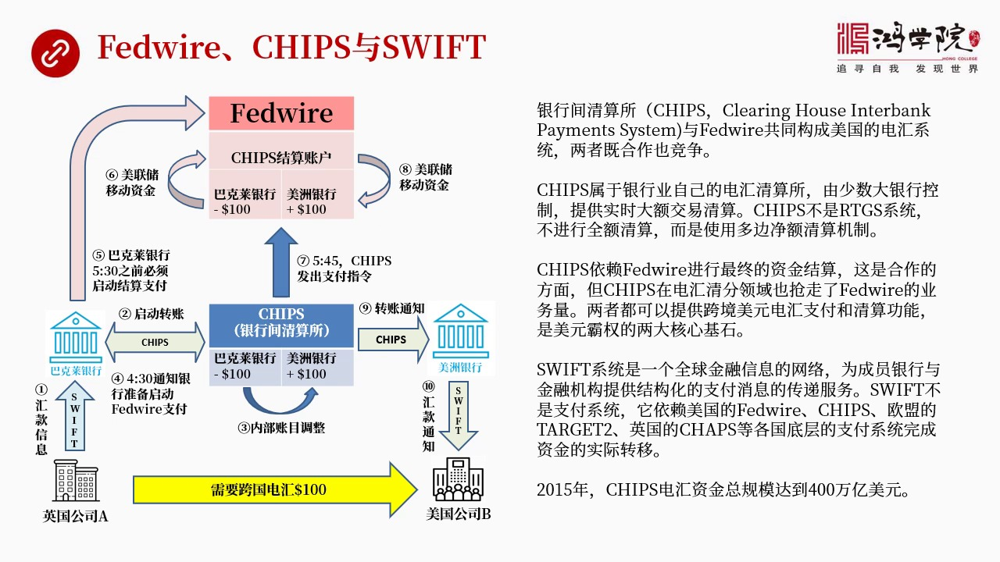

叫Chips在这里就是很多人其实我看了很多人对于电汇系统还有对于这个银行大部分这个银行间的这种大量自行转移的这种系统还有包括Swift搞得不太清楚所以我把这三者放在一起来讲这三者什么关系呢FireWi...

<strong>All subtitles</strong>

> 叫Chips在这里就是很多人其实我看了很多人对于电汇系统还有对于这个银行大部分这个银行间的这种大量自行转移的这种系统还有包括Swift搞得不
> 太清楚所以我把这三者放在一起来讲这三者什么关系呢FireWire和Chips还有Swift这三者有关系但是又不太一样首先我们先说FireWi
> re是最大规模的电汇系统Chips呢Chips是叫什么它叫银行间清算所也是银行之间就是由这个当时我说的这个纽约清算所他们这帮人搞出来的另外一
> 个专门进行电汇清算的一个新的清算中心他们以前搞了其他的像SH像其他的这种中心还有这个支票清算中心这都属于另外类型的清算现在我们所说的是电汇清
> 算电汇清算就是十十的Chips它是怎么做的呢它也是由这些大银行自主成立的一个机构然后运作这么一套系统自建的系统它跟美联储的这个FireWir
> e是一个既竞争又合作的关系为什么这么说因为它跟美联储有很多很多相同有很多不一样的地方首先美联储它是它是一个这个属于政府管理的一个机构它的Fi
> reWire是属于受财政部的管理的机构那么如果我们看Chips它不是它是由少数大银行直接控制的就是几十家那么美联储设计了客户就多了就先多个都
> 可以在美联储转账但是Chips它只质负责服务于四五十家自己最大的就是美国最大的最大的这些银行和他们在美国分支机构然后这个Chips呢也可以提
> 供实实的大哥教育清算但是它不是一个实实的全额教育教育清算的系统全额很重要它不进行全额清算而是进行多边的进额清算就是全额我刚刚所说了我会一百块
> 钱给你那就是这是一个单独的教育然后你再会给我一百五十块钱给我没关系我们就两比教育不要不是算出两比教育中间的一个进差然后把它合并成一合并成一比
> 教育因为那样慢耽误事而且存在的支付风险万一倒了怎么办万一家倒了这个东西就出问题了所以这个美联储用的是全额的清算但是器不似呢它没有用它用的是进
> 额清算主要原因就是成本我如果全部都是一比一比呢那我这个总的比数会增加很多我的负载量会增加很多我的运行成本会增加所以它考虑是一个经济就是都是经
> 济成本问题怎么做最合算怎么做是我每单教育最成本最低当然还要风险可控如果说为什么它不放开只搞几十家最大的银行这几十家都是世界金融将会上的老人都
> 好几百年了所以对这些人是有基本信赖的你要是来个莫名其妙来个小银行这个小银行这个过两个岛了那我这套体系都会被打乱这就是两者不同的思维我通过控制
> 银行参与的家属和他们的规模来管控我的支付风险虽然我是进俄的这种清算但是考虑到这些人都不要靠谱所以我这风险仍然是很低的那么它的合作先说它的合作
> 方面合作方面就是Tipsen它是一个进俄的清算体系但是最后搬资金它仍然要依赖File of War来搬资金要依赖每连处最后在每连处上上进行资
> 金计算这就是合作方面但是它也有竞争方面竞争方面什么呢就是File of War本来是可以把全国所有的每一笔的这种电汇业我都到我这来但是由于T
> ipsen出现分流了在清分部分进行分流了最后几算还在我这几算但是清分部分被Tipsen抢走了同时两者都可以提供跨境美元的支付和清算比如说中美
> 之间的贸易中国德国的贸易中国和英国的贸易你可以走Tips也可以走File of War看哪个成本能力或选择如果你是直接是Tipsen成员直接
> 会员你当然走它可能更方便但是如果你不是它成员你还得找找一个代理行就是这个代理行是它的成员你要通过它来走或者你可以选择走File of War
> 但是这两个体系最后都能完成美元的跨境流动跨境的支付但是最后的结算美元所有投诉的结算是在File of War进行结算那这两者加在一起其实构成
> 了美元霸权的核心就是靠Tips和File of War没有这两个美元没法进行跨境清算没法进行跨境支付那还搞什么搞所以搞清楚Tips和File
>  of War非常重要那么Swift是一个消息系统它是消息为导向的它不管支付也就是全世界有一万多家金融机构加入我这个Swift系统之后我负责
> 给你们传递就是你们之间要相互通消息又不能加微信怎么办呢都通过Swift来进行标准化的结构化的信息传递比如说A英行要付一笔钱一百块钱给C英行那
> 么C英行要付给B必要付给D什么什么的好这些所有的信息全部到我这儿的集中我来给你进行转发它是负责转发支付消息的那么真正发生半钱的事是在哪呢它还
> 要依赖美国欧洲中国还有其他国家的支付系统比如说它要依赖File of War或者Tips 或者欧盟的Target2Target2其实也是一种
> 实实的大全额的这种交易系统还有呢还有英国的Caps这是英国银行的也是实实的还有中国的这种系统等等也就是我们脑子没有要有一个清晰真实就是Swi
> ft它只负责消息的传递真正算钱半钱的活不是它而是各国的支付系统来来做清分来做进俄计算来做最后半钱的活所以如果没有各国的这个种支付系统存在那S
> wift也就无法存在那么在2015年整个Tips的电汇总经额达到了400多万亿美元当然跟美联储就相比它要少一些美联储900万亿主要原因是它是
> 这个这个所有的东西的结算最后都要在美联储来进行如果我们看左边这张图这张图是一个非常就是花了很多时间看了很多的这个流程把很多业务流程给书里出来
> 的一张图所以为什么这张图花了很多时间准备就是因为美业的图花了我大量时间要做得非常的仔细而且要逻较全部正确图还得看着美观不同的机构得用不同的颜
> 色不同的体系要用不同的颜色标准出来这一张左边这张图其实就就说明了这个花了外耳起司还要Swift这三者之间的关系比如说这张图设计到是从一家英国
> 公司A付钱给一家美国公司B这就是跨国的电汇他是怎么会比如说会一百美元那么英国公司A首先要联系它的开户行巴克萊银行进行国际转账那么它这个会款信
> 息说我要转一百美元转到美国公司B那么这个会款信息走的就是Swift因为它是一个跨境的一个支付其实不跨境很多人也用Swift所以它的消息的结构
> 化的消息的它的模板它的模式是Swift的模式然后巴克萊银行这是第一步我们再看巴克萊银行到Chips之间有第二步但巴克萊银行可能是在英国但是它
> 的美国要分支机构第一步是当然是在美国第二步是启动转账收到这个公司A的这是我的客户收到它要转款巴克萊银行就开始通过Chips来启动转账的这个转
> 账的流程那么Chips在Chips中间就有巴克萊银行的账户也有美中银行的账户美中银行就是美国公司的开户行那么巴克萊银行和美中银行Chips的
> 加盟的成员我说闯查过这两家银行真是因为一个是B一个是A比较好G一个是巴克萊B一个是美中银行A那么这两家银行都是Chips的清算的成员所以Ch
> ips的组织它下面有这两家银行的账户那么它启动的转账是什么意思呢就是内部账目要进行调整把巴克萊银行账户上的钱扣掉一百然后把美中银行这边加一百
> 因为从巴克萊会馆到美中银行这是第三步但是它并不是发生真实资金的转移它只是做清分转移是在美联储座结算是在美联储座所以这是第三步只是完成了内部账
> 目调整那么第四步呢第四步我们看到就是Chips在回一个信息给巴克萊银行就是在比如说在4.30分通知巴克萊银行准备启动File 2支付了我这边
> 只是给你做一个清分算出来了然后你呢要在4.半在4.半的时候我通知你你要在5.半之前把你真正转款这个指令发给美人储第五步巴克萊银行5.半之前就
> 是Chips通知它你在5.半之前必须启动结算支付这就是我们看到的第五步这个是一个弧形的这样的一个这样的一个箭头只像File 2这个指令是发给
> File 2的就说5.半之前我要转移比前好那么第六步第六步就是美联储移动资金了注意这就是真正的移动就是真正的结算了它怎么做的呢它首先把巴克萊
> 银行和巴克萊银行在美联储账户中扣掉100块钱转到Chips结算账户上注意啊巴克萊银行和美中银行既是Chips的客户同时也是美联储在美联储都有
> 账户那么巴克萊账户中被扣掉了100块钱被扣到了哪儿去呢被转移到了Chips结算账户就是美联储要帮Chips这个系统你做清分我做结算好那我们俩
> 之间有账户往来关系那么你要在我这儿开一个专门的Chips进行结算的账户这是一个中间的过渡的账户我们看这个时间就能看出来美联储转了这笔钱之后下
> 一步就是第七步第七步就是Chips有个蓝色的箭头5.45分Chips发出支付指令发给美联储的Files外这什么意思呢就是巴克萊银行在第六步转
> 到Chips结算账户中那笔钱是展示靠在哪儿的什么时候动这笔钱什么时候把这笔钱转给美洲银行只要等通知这个通知什么时候发出是5.45发出所以它的
> 实验顺序就是5.半巴克萊通知Files外你可以把我的钱转可以转到100块钱转到这个结算账户了美联储立刻就做但是这笔钱是后的在Chips的结算
> 账户上没有动直到5.45Chips发出指令说你可以动了好 每年处就把Chips结算账户中这100美元化到了美洲银行它的账下给它加了100块钱
> 好 这就是第八步第九步呢Chips发现这个过程完成了第九步就发通知告诉通过Chips模式发通知给美洲银行说好 你账上有100块钱了然后美洲银
> 行再通过SwiftSwift的这个消息模式再发给美国公司B告诉你 你的账上现在增加了100块钱可用了这就是这三者居然的关系我们看到Swift
> 的在中间只是提到消息的传递那么这个轻纷部分是在Chips完成就是蓝色的部分而结算是在Federal完成我在网上看到大量的这个关于这三者之间的
> 关系我觉得我们这张图应该是把所有逻辑关系所有的发展的顺序和三者之间的关系应该是想最透彻的一个了好我们再看下液

---

### Slide 16

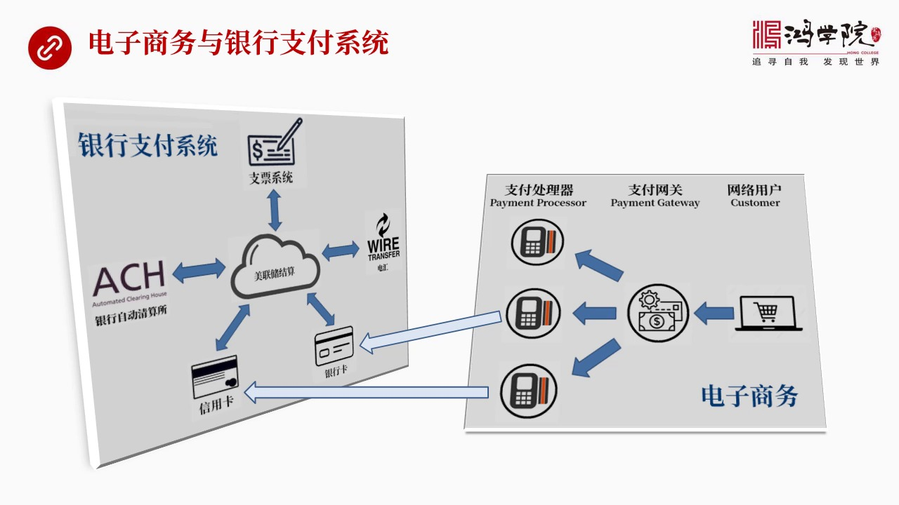

下液涉及到了就是一个电子账就是电子商务互联网绝起之后跟银行支付体系之间到底是个什么关系我们刚才所说的所有的支付这五大系统再加上每年处的核心结算系统全部都是银行体系的那么现在电子商务绝起了我们知道有配配...

<strong>All subtitles</strong>

> 下液涉及到了就是一个电子账就是电子商务互联网绝起之后跟银行支付体系之间到底是个什么关系我们刚才所说的所有的支付这五大系统再加上每年处的核心结
> 算系统全部都是银行体系的那么现在电子商务绝起了我们知道有配配我们知道有什么ApplePay苹果还有什么谷歌这些都在发展支付他们跟传统的银行支
> 付体系有什么关系呢这就是机长图要解释的左边是传统银行账户传统银行的支付系统就是支票系统SH系统卡 银行卡还有Wire 电汇围绕美联处的结算中
> 心每个系统最终的结算搬钱都是要在美联处进行的这是从罗静上来讲实际发生的情况有所不同好 关键是电子支付绝起之后互联网 移动手机这些包括配票决几
> 之后难道他们他们是从屏空转账吗当然不可能他们的所有转账必须的依靠银行体系支付系统所以电子商务比如说电子商务中间我们看看到右边电上图客户 网络
> 客户在手机上淘宝 卖东西不叫淘宝应该在亚马讯吧在国外在亚马讯买东西或者在什么其他的电子电商网站上买东西好然后这个购买了信息也就是你购买你要输
> 入你的信用卡信用卡号码或者银行卡号码或者支付其他的细节好这些信息传给谁呢传给了支付网官台门给的位台门给位什么概念呢就是我收到你银行卡的信息收
> 到你信用卡信息收到其他的你的这种金融的信息这晚上是高度保密的所以我得负责给你加密我得负责给你找到你这个东西应该找哪去处理所以网支付网官起到一
> 个很大作用就是要对所有信息叫加密要保护这些敏感的金融信息不被卸出去同时要去验证就是你这条就是我应该把你的这个请求转给哪个支付处理器支付处理器
> 就是第三官我们看到了Payment Processor这个什么概念呢就是不同的不同的支付手段我会这个导演到不同的支付处理器上支付处理器我们可
> 以信仰理解成就是泡斯基它完成的工作就是我要跟我要跟这个我的开户行就是收单行联系我要跟这个发卡行料要联系我要跟商家联系泡斯基要完成这三种联系也
> 就是要确认这个发卡行有没有这个客户这个客户有没有这么多钱它现在超没超得然后得到确认之后然后我再通知把这笔钱转到这个商家的这个收单行上那么Pr
> ocessor支付处理器做的就是这个工作直播它是虚拟的在网上通过软件来实现的所以我们来看到这个流程就是假如客户输入是信用卡信用卡号码还包括信
> 用卡过期是等等那么到了支付网上之后支付网关通过加密通过验证之后把这个请求就转给了最下方的支付处理器这就是信用卡支付处理器然后这个信息这个处理
> 器就好比是一个泡斯基样然后就进行跟信用卡网络之间的验证确定然后时时然后这个清分然后最后这个结算然后这块玩了之后这个钱就转到了转到了这个商家的
> 收单行上然后收单行再通知商家你的钱到了然后最后通过信息反传回来通过支付网关再告诉用户你的钱已经成功扣除东西已经在路上了所以我们看到是美国还是
> 中国还是任何国家你搞到手机支付微信支付还有这个其他的这个还是其他配票还是任何东西你最终打交道的一定是银行的支付系统就是这五大系统加上美联储加
> 上重量银行你绕不开所有的钱都是在银行体制内转没有任何人能绕得开没有任何方法能绕得开只不过这个方式处理方式不一样那么美国的电子商物为什么比中国
> 复杂就是因为它这一套东西都是一套开放的东西就是支付网关支付网关可能最失贸的现在有市场上最失贸有十个支付处理器它就更多了人人都可以做所以支付处
> 理器可以存在激烈的竞争几十家来竞争这个商议机会支付网关也可以有很多家竞争比如说配票就是一个支付网关它同时也做处理器但它还有竞争对手啊其他人也
> 做啊所以这就存在一个竞争竞争在每个环节中在每个系列中进行竞争就会导致整个系统能它的效率越来越高而且它开放式随便拿开拿掉一个处理器拿掉一个网关
> 插一个东西进来整个系统照样运转那么当然这个就跟中国了不一样中国人向微信用支付宝它是从头到尾从电子商物一直干到了银行把整个东西全都包在一起搞成
> 了封密式的网络当然关于这个问题我觉得我会在以后的课程中专门讲中国支付体它是怎么进化的这些人的思路跟我们今天讲的这些思路有什么不一样好我们再看下页

---

### Slide 17

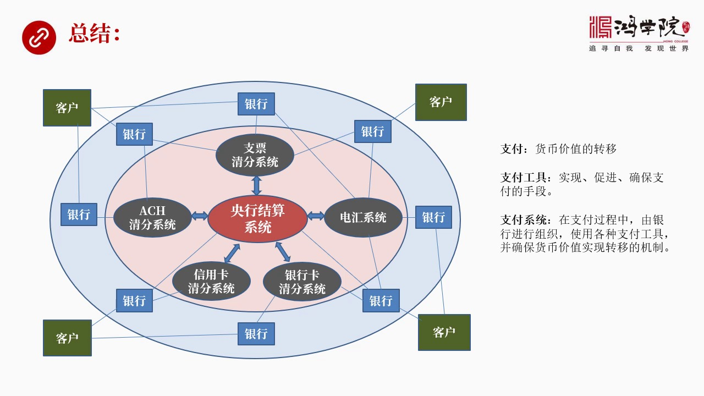

下页呢就是一个总结因为这场课信息上非常大我也准备了很长一张时间尤其是画图大家看这些图就知道这里面会有多大功能量而且要把中间的所有的细节逻辑数字全部较对正确确保它这所有的核心逻辑是完全符合商业的商业的运...

<strong>All subtitles</strong>

> 下页呢就是一个总结因为这场课信息上非常大我也准备了很长一张时间尤其是画图大家看这些图就知道这里面会有多大功能量而且要把中间的所有的细节逻辑数
> 字全部较对正确确保它这所有的核心逻辑是完全符合商业的商业的运转流程这需要花费大量时间特别是涉及到各个不同系统那么我们总结的时候看起来就很简单
> 简单是因为这个图我用最简单图来做总结我们看到在整个这个框架之内最核心的是央行结算系统在这里我们讲的就是美联储的结算系统然后围绕它有五大系统五
> 大支付系统一个是支票第二是SH第三是胸卡第四是银行卡第五是电汇电汇中间有包括两个电汇的这种系统一个是Fellowire一个是美国的Chips
> 那么我们再看其实在外围一圈这都是银行每家银行都要跟这五大系统中间的某一个进行联系有的也跟江航的系统进行联系那么所有的客户就是在金融圈的外围就
> 是在这个银行的外围这些客户是银行的客户他们怎么才能够转钱呢他必须要利用银行的这个五大支付体系最后包括央行结算系统才能够真正有效完成资金的转移
> 那么互联网时代之后这些客户可能是网关可能是这种网关的处理器网络这种处理器支付处理器等等那么外围的客户就是消费者在网上消费者是通过网关在通过网
> 络支付的处理器来跟五大系统打交道最后再跟间接跟央行拿交道最后完成资金的流转所以我们看到这个体系其实是非常复杂它进化了好几百年然后它的理念并没
> 有发生太大的变化但是它的工具它的技术在不断的复杂化它使用的技术手段但是在我看来这套系统它天然存在了一个很大的毛病这个毛病就是它严重依赖消息就
> 是支付的消息你看所有刚才讲到五大系统全部要等待支付消息然后确认然后传递然后再传然后再验证然后再返回来双边走两遍这个过程就是使整个银行体系的支
> 付体在我看来是个典型的以消息为中心的这样一套系统它显然存在着消息跟资金的搬运不同步的问题同步这中间就有效率的落差这就是为什么银行的传统的支付
> 体系哪怕你现在已经搞得非常非常复杂的技术了已经用了卫星已经用了这个互联网已经用了WiFi 5G什么都用上都没问题但是它的核心设计的理念逻辑是
> 成就的这就是为什么我是没从根本上来说就是区块链的那种高度警检的没有什么信息消息和资金不同步的问题而且它是高度透明的不用信息传来上去不用搞这么
> 复杂的这套系统它很简单的就可以实现你所有要实现的东西从这个角度来看我觉得这个两者之间技术存在着代差的差距也就是如果说我们说这个区块链是属于这
> 种核武器时代的话那么我们看到了现在的银行传统支付体系还停留在计划战争这个阶段两者是最终无法较量的存在着代差无论利益集团这个信用卡公司这些多么
> 强大但是由于这个技术落差太大只要有一个国家按照这个先进方式来其他国家在全国的经济金融货币资金运转的效率上就跟人家差太远了一下就被摔到后头去了
> 所以这个玩意儿是没有办法长期组络的大耳关于这个问题我们以后关于新的支付体系这样的理念和这样的系统我们会找时间在专门做介绍这个咱们今天的课就讲到这里谢谢大家收看

---

### Slide 18

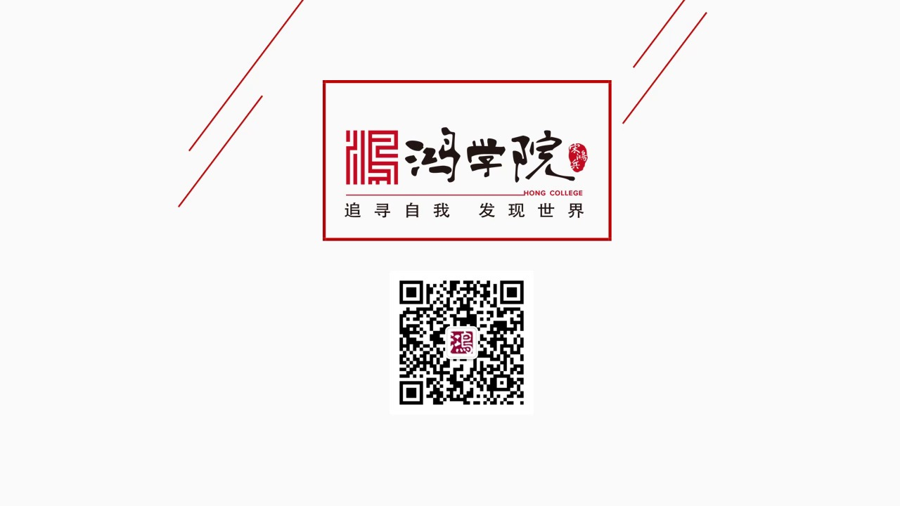

好 再见

<strong>All subtitles</strong>

> 好 再见

---
