# 核心课视频-045讲：中国支付系统（视频） — Clean Slide Notes

> **来源**：鸿学院核心课程  
> **幻灯片**：19 张

---

### Slide 1

在核心課第44講中,我們講到了美國的支付系統有了對美國支付體系的全面和深入的理解這就會幫助我們能夠更深入的了解中國支付系統,它的形成的過程還有它在野化的過程之中,所存在的各種問題使我們有能力進行批判性的思維使我們能夠更加深刻的理解中國支付體系,它的未來發展的方向好,下面我們看第一頁,文明起源從前莊繪...

---

### Slide 2

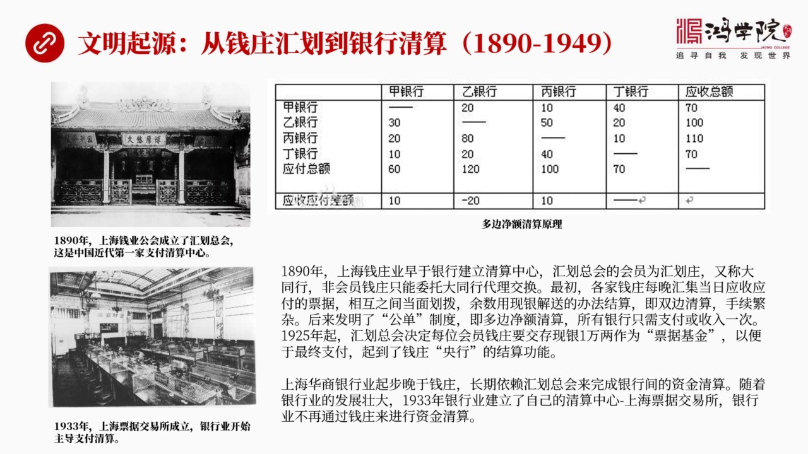

主要講的是1890年到1949年,這段時間之內為什麼我要用文明起源來進行這樣的一個描述呢?主要是我想從時間劃分上做一個切分文明起源,然後古代、近代、現代它的劃分標準就是中央銀行有沒有介入到清算過程之中換句話說,最後結算就是搬運資金的過程有沒有中央銀行的介入,這是一個核心劃分標準那麼如果我們看從189...

---

### Slide 3

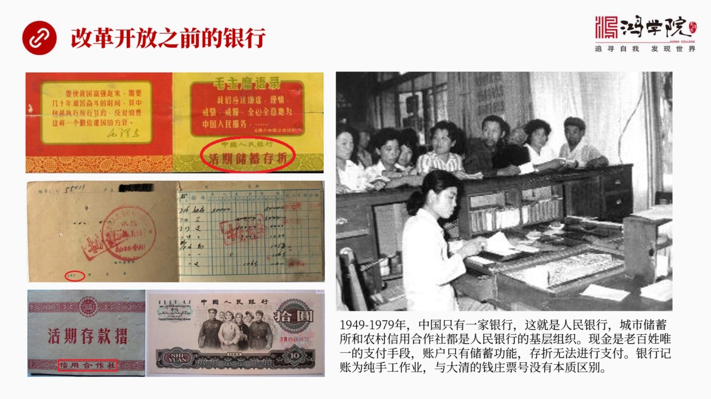

就是1979年之間這前30年中間中國的銀行體系我們需要有一個這個基本的認識當時中國的銀行其實只有一家就是中國人民銀行比如說發現了人民幣十塊錢這是最大票額的人民幣我們很多同學可能對當時就當時還沒有出生對當時的這個銀行制度運作還不是很了解我們在這種簡單說一下就是中國的這個人民銀行是作為中國唯一的一個金融...

---

### Slide 4

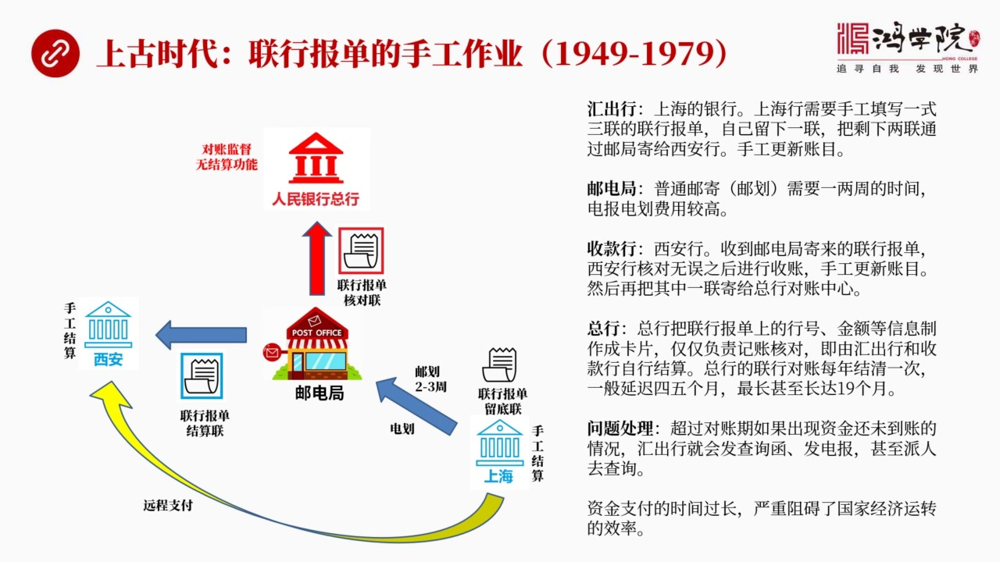

就是咱們有史前時代解放前當年還沒有中央銀行中銀行成立的教完那麼上股時代是怎麼做業務的我們來看當時的業務方式我稱之為是聯行報單的手工作業階段這大概就是1949年到1979年之前的情況我在這個左邊這張圖上畫了一下它的流程圖那麼人民銀行總行這是在北京還有一家銀行是西安比如說西安的人民銀行分支機構還有上海也...

---

### Slide 5

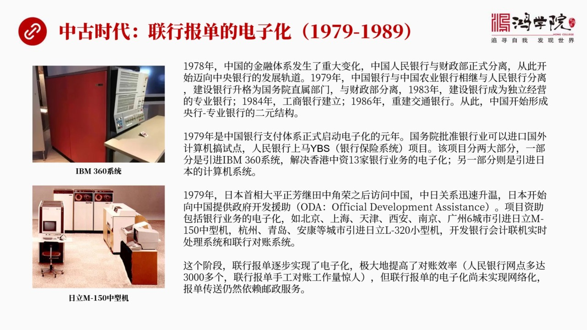

一直到89年這段時間為什麼叫中古時代因為剛才所說的聯航報端原來是指致的在中古時代聯航報端開始進行了電子化所以這個時代我稱之為是中古時代為什麼會開始電子化呢當然大家都知道電子化你在對障過程中你用手工去抄寫這些障幕錯過的概率很大你如果把他全部電子化之後會提高對障的效率那麼中國當年在改革開放之前其實在19...

---

### Slide 6

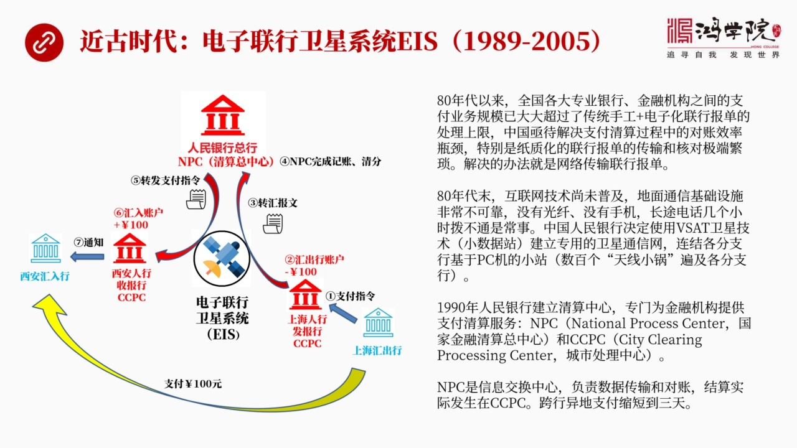

當然就是近代的意思了為什麼呢因為當時開始進行了聯航爆單的這個連網化這就是電子聯航衛星系統 EIS這個時間呢大概是從1989年開始進行設計到2005年這套系統逐漸退出那麼如果我們來看這個當時發生的情況你會發現整個的業務銀行之間的業務越來越繁忙因為中國各大專業銀行成立了這些專業銀行在各地都有自己的分支機...

---

### Slide 7

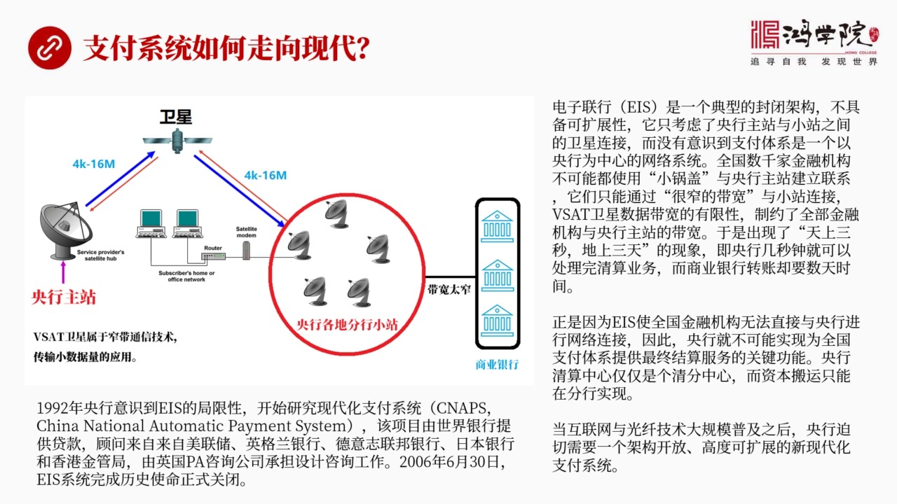

其實剛才我們看了內業批評以後你會發現人民銀行總行意照那個時代並沒有做資金的結算資金結算是在分行這個層次來做的而且分行做的這個資金結算就是賬目上的調整速度較慢用了3天時間這就是當年銀行業所談到的一個大家所談到的一句話叫天上三秒地上三天什麼原因我們這叫看一下這個衛星系統它的系統圖如果我們從這個系統圖上你...

---

### Slide 8

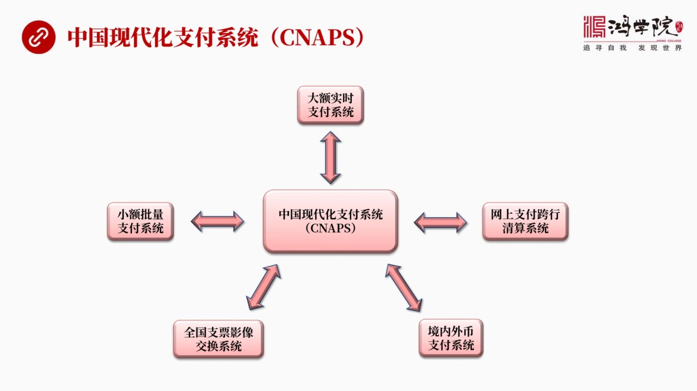

是一個中國現代化支付系統Cneps的一個大體的一個框圖就是包括哪些主要的系統我們來看它主要包括五個系統當然它還有其他系統但是我們今天我認為最重要的是這五大系統都是頒獄資金的最重要的首先是大額實施支付系統然後是小額批量支付系統然後是網上支付跨航清算系統注意啊這三個是最重要的尤其是大額和小額網上這個跨航...

---

### Slide 9

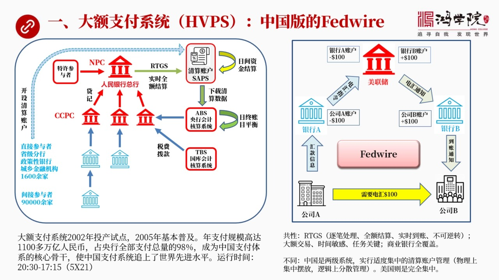

第一個系統也是最重要系統是大額支付系統它是中國版的File of WireFile of Wire我們上次客中專門講到過它的框架我放到了右圖如果我們對比的話你會更加深入理解我們的大額系統到底是怎麼工作的如果左圖我們看左圖左圖是中國的大額支付體系首先我們看到最上面最核心的NPC是國家處理中心是人民銀行...

---

### Slide 10

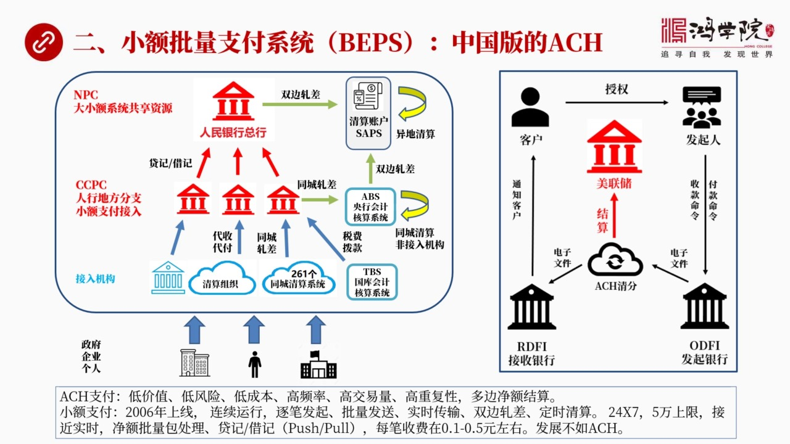

就是小額批量支付系統BPS這個我稱之為是中國版的SH我們在44講中專門講到它是美國的銀行體系為了降低每一張支票或者處理每一筆支票交易中間的預先成本所以要對它進行打包它是一個集中處理的打了包之後就是打了包之後然後是批處理而且是做多邊進額清算就像我們剛才講的上海那個繪滑裝的時候有一張圖表那個圖表就是多邊...

---

### Slide 11

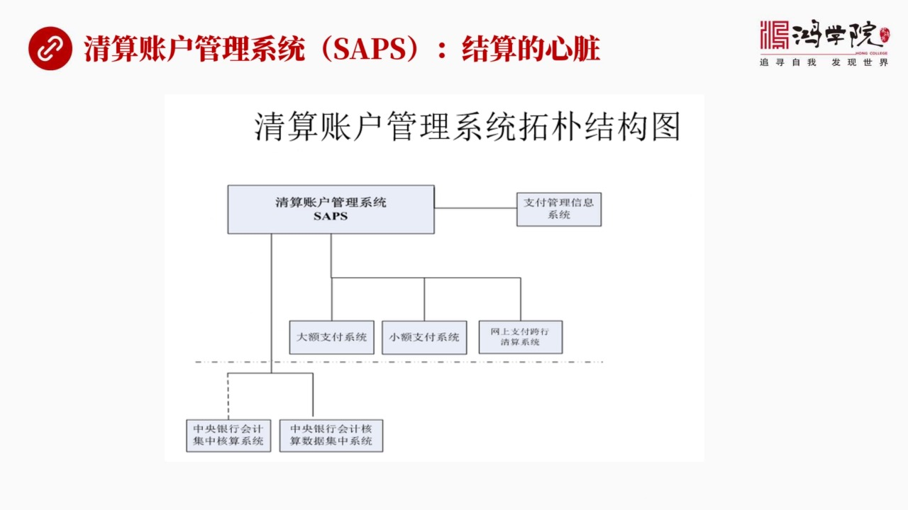

Saps這個是結算的心臟就是不管是大額小額最後發生資金頒運的都是在清算贊護上有上千家銀行在這裡開設的贊護實際上這套贊護的管理就是我什麼時候把誰的錢轉到誰的錢贊上怎麼個轉法這中間設計了很多具體的問題比如說設計到你的贊護中頭頌多不夠你要轉100萬你只有90萬這就不行不行怎麼辦你先排隊排隊到下次結算說我再...

---

### Slide 12

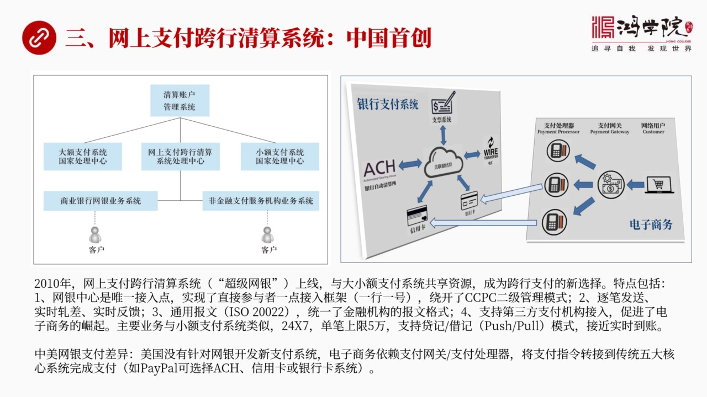

第三個重要的支付系統就是頒銀子的搞結算央行內部最重要的第三個系統是網上支付跨航清算系統這個就是超級往臉超級往銀這是中國的手創如果我們跟美國相比你會發現美國的支付體系中間並沒有因為搞出了電子商業電商業務我就專門在搞個針對電商的支付體系他不用他不必他是通過網關和網絡這個支付網關和支付處理器這種模式來解決...

---

### Slide 13

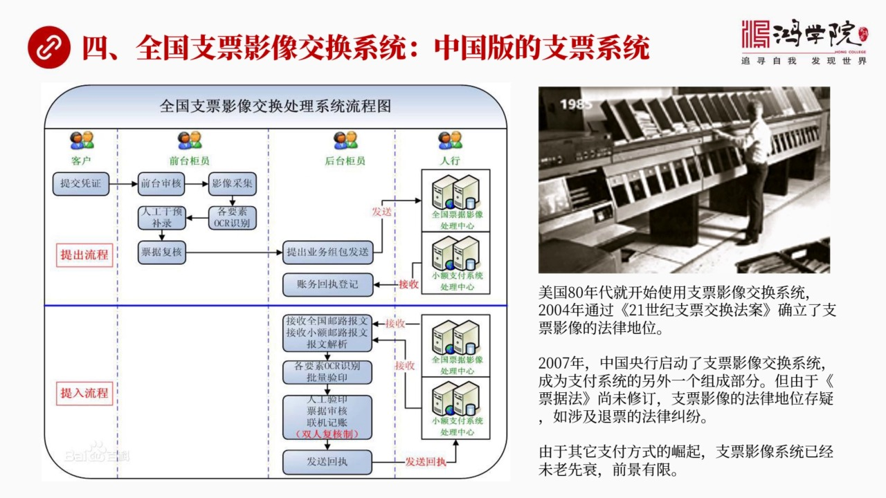

第四個現代化系統是什麼呢是全國支票影像交換系統這是中國版的支票系統我再上一點點我們講到美國支票體系的時候專門講到美國的所有支付是源於支票帳戶那麼它支票處理發展的很早特別是影像影像這個支票交換在80年代就已經發展起來了80年代中就已經成型了那麼它也一直受到一個困擾就是雖然你影像這套技術沒問題但是由於法...

---

### Slide 14

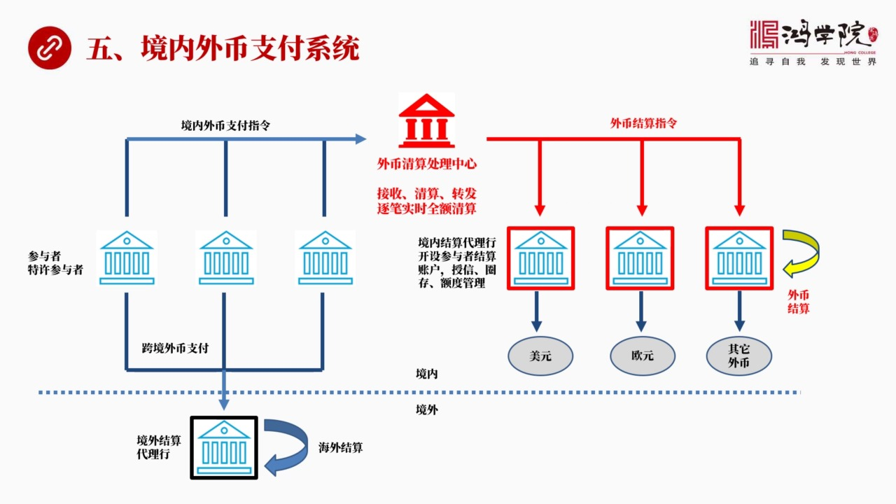

就是在中國國內也有很多外匯每些這個每個人大家都可能有些外匯有的存在中國銀行有的存在建設銀行有些是美元有些歐元有些是港幣那麼在中國國內怎麼來比如說我要把這個中國銀行的這個美元一百元我要想轉到我招商銀行賬戶上這事該怎麼做這就需要人民銀行提供一個境內外閉的支付體系在國內來幫助大家轉錢轉外匯當然這就是我們看...

---

### Slide 15

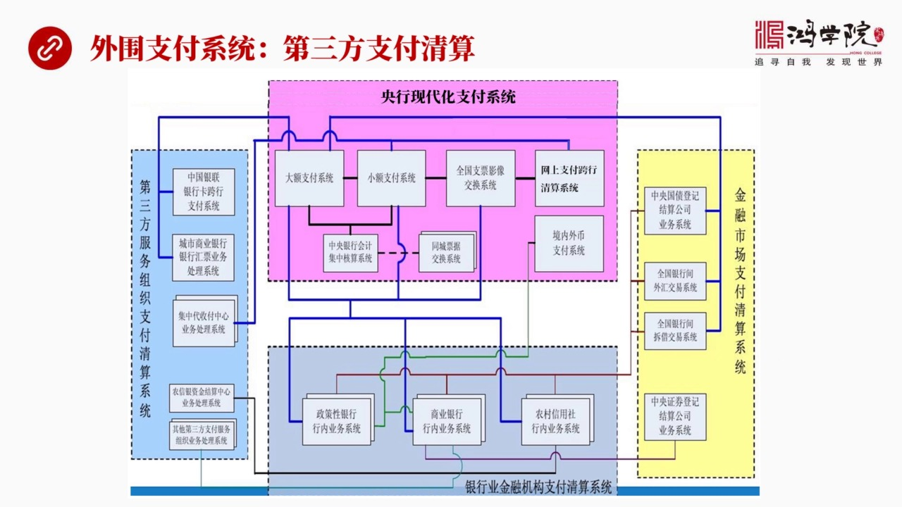

人民銀行它內部了五個核心的支付系統那麼我們下面來看什麼呢就是人民銀行這套現代化支付體系跟它周邊的體系是個什麼樣的關係就是第三方清算特別是第三方清算跟央行的管理體系跟央行的支付體系到底是個什麼樣的關係所以這張圖畫了央行的核心的支付系統和外圍的周邊系統之間的一個邏輯關係你比如說央行內部我們講到了大額我們...

---

### Slide 16

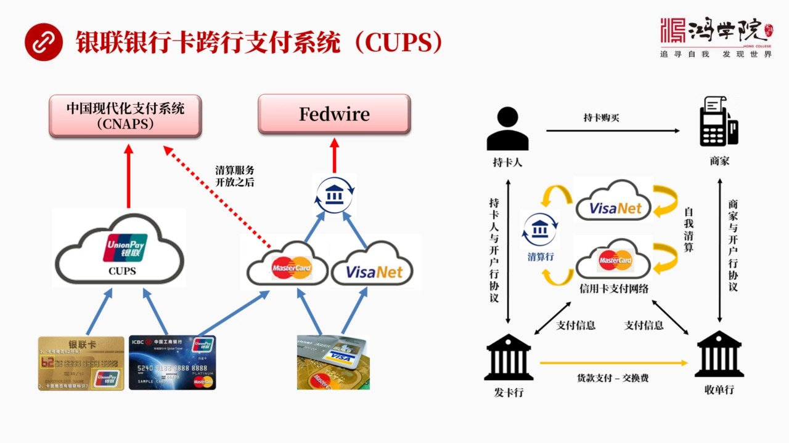

這個系統中間首要重要的最重要的是哪個呢當然就是銀簾中國銀簾銀簾有銀行卡的跨行支付系統Cops它是通過Cops然後來進行所有銀簾業務的這種清算注意清算是清算最後結算靠誰還是靠央行的搬運系統就是大小額還有超級網銀等等所以我們來看如果跟美國這張圖是右邊我們來進行那個對比的話當然這顯然所有的卡業務都是四方四...

---

### Slide 17

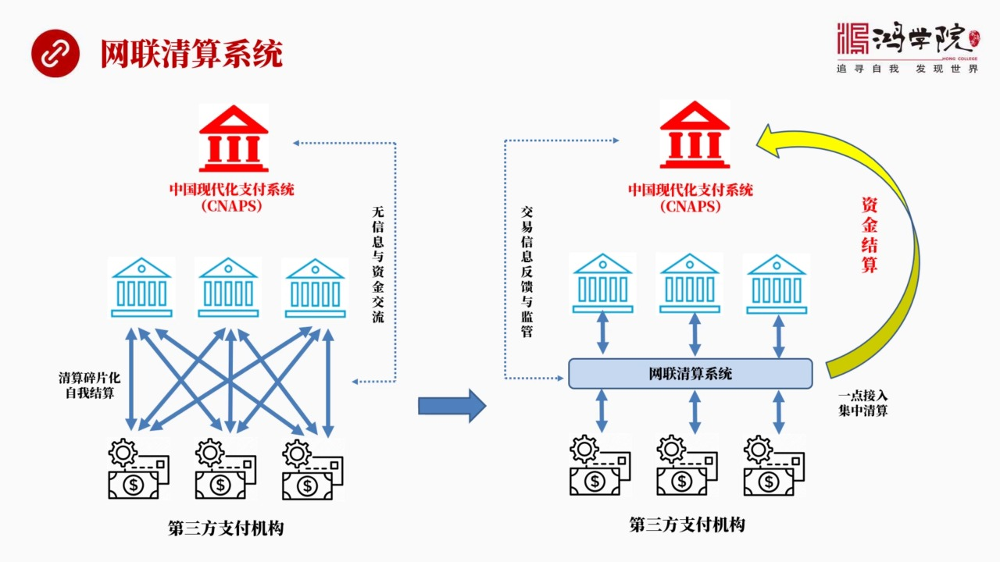

還有第三個系統作為第三方這個系統也是最近發生起來的就是網聯網聯清算系統我們剛剛講到超級網銀就是網上跨航這個銀行這個結算系統跟這個網聯是不一樣的它不是一回事那個是核心系統負責搬銀子了直接操作央行的清算賬戶這個網聯和銀聯是在外面是在中央銀行體系之外的他們都是屬於第三方的在我看起來他們的功能應該屬於這種支...

---

### Slide 18

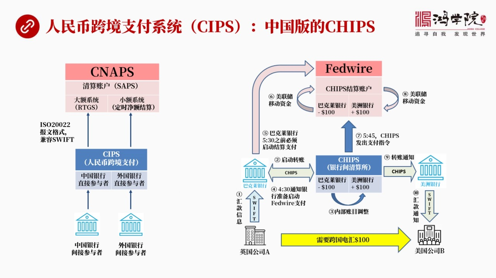

在第三方系統中還有一個就是人民幣跨境支付系統Sips為什麼我把它放到第三方呢因為它不是央行的核心系統央行核心系統就那五個它應該是在這個體制外的這個主要是負責中國境外的人民幣支付業務其實它的地位相當於我稱之為是中國版的Tips美國也有個Tips中國是要Sips為什麼都是處理跨境美元貿易中國是處理跨境人...

---

### Slide 19

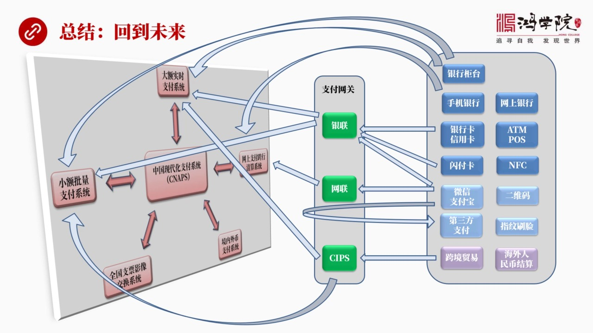

總結呢我因為這裡面設計到的中國支付體系非常的複雜如果用文字來表述太過反鎖所以我把基本上想到的所有業務全部用框圖來表達出來這就是我們看到的這個總結的框圖我稱之為是回到未來我們從過去回到了未來那麼這個圖左邊這部分當然就是央行的線的話支付體系包括大額小額超級網營包括支票影像系統還有包括境內外比支付系統那麼...

---
