# 核心课视频-046讲：回购市场惊现美元荒（视频） — Detail Slide Notes

> **来源**：鸿学院核心课程  
> **幻灯片**：15 张

---

### Slide 1

红旋的图级们大家好我们今天讲核心课程的第46奖回够市场经线美元荒大家可能注意到了2019年9月16号这一个星期美国市场上回够市场出现了巨大的恐慌这种恐慌我们在以前的核心课程曾经专门说到过他的原因就是影...

<strong>All subtitles</strong>

> 红旋的图级们大家好我们今天讲核心课程的第46奖回够市场经线美元荒大家可能注意到了2019年9月16号这一个星期美国市场上回够市场出现了巨大的
> 恐慌这种恐慌我们在以前的核心课程曾经专门说到过他的原因就是影子货币与回够那么今天我们来深入分析下究竟是什么原因导致了美元这个市场上会出现这样
> 的一个美元荒关于这个问题我最近读了很多市场上各种分析的文章也参观了美联储的关于回够市场中的很多的这种报告那么综合在一起我得出了自己的一些想法
> 所以今天我们这些课重点来分析一下导致回够市场上不断出现这种流动性哭泉的真实原因究竟是什么好 我们现在翻下液关于这个货币市场恐慌了问题

---

### Slide 2

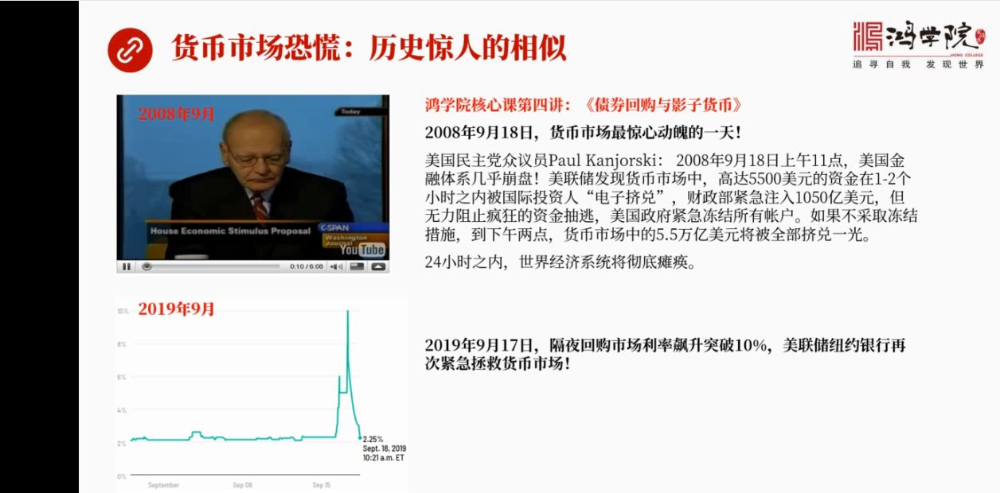

我觉得在历上出现过很多次其中上一次就是2008年9月我们在核心课程第四讲债券回够与影子货币这场课程专门谈闹过这个危机的经历那么可以说历史竟然相似因为这一回大概过了11年上次是9月2008年9月这回到2...

<strong>All subtitles</strong>

> 我觉得在历上出现过很多次其中上一次就是2008年9月我们在核心课程第四讲债券回够与影子货币这场课程专门谈闹过这个危机的经历那么可以说历史竟然
> 相似因为这一回大概过了11年上次是9月2008年9月这回到2019年9月再次出现类似问题我们在上次的核心课程中专门讲过9月18号那一天200
> 8年形容危机爆发那么爆发的当天就是9月18号我们看到了美国货币市场出现了最精心动破的一天堪称是历史上前所未有的精心动破那么后来呢美国的一个众
> 议员在电视上专门谈闹了这一天的经历就是说当天上午11点美国金融体系差一点就崩盘了因为当时美联储在监控货币市场中突然发现有高达5500亿美元的
> 资金在1到2个小时之内几乎被国际投资人电子几对几对一光所以财政部紧急注入了1050亿美元但是党不住兇勇的这种资金抽逃结果美国政府紧急凍结了所
> 有的账户谁也不准跑他说假如当时不采取这样的措施几个小时之后倒下午2点短短几个小时整个美国货币市场中的5.5万亿美元将户被全部几对一光这意味着
> 什么他在电中明确提出了他的结论就是假如美国货币上贪患了崩溃了那么在24个小时之内整个全世界的经济将会彻底贪患为什么因为美国货币市场是整个金融
> 市场流动性的发动机大量的企业政府银行还有各式各样的投资人他们的资金他们的多万七周转的资金将严重的依赖货币市场的融资假如这个市场的资金没了那么
> 你会发现很多工厂他第二天该交水电费的交不了了该发工资的发不出去了全国的运输体系也会出现类似的问题火车发不出去飞机几倍不了为什么因为没有资金了
> 所有了航空公司铁路公司也都严重依赖货币上进行这个短期的融资很多公司发行的比如说他需要一百万美元的短期融资他需要依赖比如说商业票剧上来进行这个
> 发行票剧短期借钱这种借钱的方式往往是提前一天给你的经济人或者经济公司打电话然后确定了条件之后然后当天资金就能到账所以在美国的金融体系之内大家
> 都严重依赖这种就是第二天的这样的一种融资手段美国公司账上的现金都非常少因为他们把钱多余的钱全部投入了货币上进行放贷收取资金利息这就叫资本管理
> 要让每一分钱发挥最大的效仪所以在每个公司的账上现金部分都非常少钱都借出去了他需要用钱的时候临时在在货币上再把钱给提回来所以这个货币上对于政府
> 对于公司对于企业对于所有人来说都是至关重要的一个市场所以我们会看到美国货币上他的重要性决定了整个美国经济体系是不是稳定和安全如果他贪患了那么
> 你就会发现老百姓他的生活将难以为寄也就是你开车上街加不了油你到商场买东西你一刷卡会被拒绝你到ATM机上去取钱你取不出来所有的体系都要依靠货币
> 上提供流动性这就是这个市场虽然很小但是他的作用他的重大的作用非常的关键其实我们很多人在了解金融市场的时候其实并没有真正抓住这种金融市场中间最
> 核心最要命的这种发动机究竟在哪儿我们在前两趟各种讲到的支付体系其实就是底层最重要的底层机制之一回够市场跟他的性质差不多也是属于整个金融基础设
> 施中最核心最重要的部分如果我们在研究投资研究金融市场的时候你如果不了解这个市场中最核心的货币上你将看不到金融危机爆发之前的许多征兆因为所有危
> 机的爆发现代金融危机首先都是源于货币上如果你能够早一步地看到这个市场的一场你就能够给自己赢得更多的逃命的时间那么我们看今年9月这个市场中再次
> 出现重大的动荡可以说引起了华尔街也好引起了这个所有的投资人也好高度关注而我们一般人一般的普通投资人如果你没有意识到这个市场的核心的重要性那么
> 你只是在新闻中看到了有这么一个标题而根本不理解我们离崩潭究竟有多远就像2008年一样大多数人根本不知道这个市场出现了这么大的问题也不能理解这
> 个市场怎么会出这么大问题当然你就根本不可能知道金融一起是怎么回事现在我们再次出现了这样一次非常难得的一次积预仔细观察货币上上究竟出现了什么问
> 题那么未来这个问题的根源会不会得以消除还是会反复出现类似的前方直到整个系统出现更大的这种贪汉这就是我们这堂课要重点研究的一个话题那么在今年的
> 9月16号我们看到这个美国的隔夜的回够市场利率开始大幅攀升突破了5%而到了17号突破了10%这个时候美联处开始紧急的救援这个市场我们只是从店
> 中看到了很多这种消息但是没有人真正把这个问题给搞清楚到底里面什么地方出事了所以看了很多很多文章之后我发现中间的规律跟以前的规律是类似的本质是
> 一样的只不过表现的方式发生了一些变化我们现在看下野首先我们做一个事件回放

---

### Slide 3

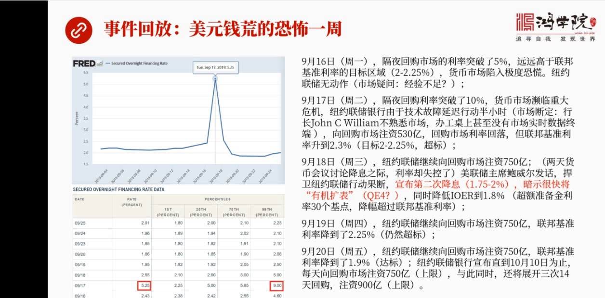

看看这一周到底发生了些什么就是美元前荒最恐怖的这一周当然我们可能很多人觉得不恐怖一点感觉都没有那是因为你根本不了解这个机制是怎么运作的如果我们看左边这张图你会看到这是美联处它的回够利率的就是我们核心课...

<strong>All subtitles</strong>

> 看看这一周到底发生了些什么就是美元前荒最恐怖的这一周当然我们可能很多人觉得不恐怖一点感觉都没有那是因为你根本不了解这个机制是怎么运作的如果我
> 们看左边这张图你会看到这是美联处它的回够利率的就是我们核心课中讲过的从Liber利率转向Sofra就是一种新的回够利率的方式来取代Liber
> 这一趟课我们以前讲过那么在这个市场中你会看到这个利率在9月是7号突然达到一个很高的水平5.25当然这个5.25我们看体验这张表你就知道了它这
> 个5.25算的是一个中间址也就是不是最高峰的那个址因为不同的债券它在不同的交易条件之下它的利率是不一样的回够利率是不一样的那么实际上你会发现
> 其中某一些的某一些品种的交易的利率产生利率达到9%注意啊这是中间1%的这种这样的一个一批债券它的质压然后融资的利率其中有一些已经突破了10%
> 这就是我们怎么看这张表怎么理解这张图它不是一个真正的最高峰不是那个峰值而是一个平均址而是一个中间址所以它严重低估了问题严重性那么我们来看星期
> 一那天周一周一隔夜回够市场的利率突破了5%远远高于联邦基准利率联邦基准利率是7月份设定的当时的利率是2%到2.5%之间整个货币上当时就已经陷
> 入了巨大的恐慌因为这已经超标了超标了一倍了怎么会出现这种现象大家想不明白正是因为很多人其实已经意识到了对这个市场有充分理解的这些人已经意识到
> 了这是一个巨大的问题但是扭约连处银行却没有任何动作所以市场中在当天就已经有很多人在质疑至于什么至于美联处的扭约连处这帮人特别是要这个新行长2
> 018年上任的这个人到底有没有经验因为这个人以前他是从舅迪山调过来的这个人长期研究的是货币政策而并不是真正的像美联处这个利来的美联处扭约连处
> 的贯利他不是一个市场操作性的人所以市场就会质疑他面对这么紧急的情况到底有没有能力才去断然措施我刚才已经提到过在2008年9月18号这一天如果
> 你的判断延迟了三个小时四个小时延迟这么短的时间就已经可以造成整个金融体系的崩溃造成世界经济的崩溃所以为什么市场会质疑他的能力就是当天你居然没
> 有任何动作要等的第二天才醒悟过来这说明什么对市场判断出现了严重实物就是没有意义上问题有多严重那么到了星期二9月17号格业回够利率突破了10就
> 是我刚才所说的有一些品种突破了10这个时候货币上已经是面临重大危机了那么永远美联储终于明白过来了采取紧急措施结果呢有一技术故障延迟了半个小时
> 采取行动这再次被市场断地就是这个新行长完全不熟悉市场有人甚至描述在他的办公桌上连这个彭博社的实施数据中端都没有看不到市场这个实施的行情这么一
> 个人主管美联储最重要的一个分行你有约分行而且这个行是专门落实货币政策的一切的操作都要通过他来进行而且也是一线直接管理整个金融市场的最重要的一
> 个分支机构如果他的一把手是如此的不敏感的话对市场变化如此不敏感的话那么真出现了2008年这个级别的重大危机那么后果将不堪设想那么当半个小时之
> 后技术部长排除了那么美联储纽约银行才能够向市场向回够上注入了530亿美元的资金怎么注入通过回够的方式就是回够放出前去收回债券作为质压然后向市
> 场注资那么由于这个530亿美元进去之后进到市场之后导致了回够市场的利率这压利率有所回落但是连帮几准利率却上升到了23%注意当时的目标只是2%
> 到25%这是超标了大家也许会觉得很奇怪因为我们今天这场课要数据很多基本概念就是当我们说到利率的时候你到底只能哪个利率是回够利率还是连帮几准利
> 率还是什么其他的利率今天我们将重点至少要讲4个利率这4个利率的性质完全不一样而我们在媒体中在很多报纸上你看到了他们根本没有区分到底是哪个利率
> 什么利率出了什么问题注意连帮击金的利率叫击准利率击准利率就是美联储要设定的每年开八次会每次要设定加息还是减息减的是那个利率而回够市场是交易出
> 来的一个回够制压利率这两个利率是不一样的我们往后会逐渐把这些概念一一理顺那么到了9月18号星期三你约连储继续向回够上注资750亿就是第一天第
> 1次530亿丢进去不管用到第二天需要再来一次750亿那么正好是在这两天17号28号美联储正在开会讨论减息论题这个时候突然发现还没说完减息的事
> 利率失控了出现了这么大的一个偏差所以美联储主席报位在会议节祝之后他就开始发表他的看法他认为这不是一个特别大的问题然后美联储也没有判断书行动还
> 是比较果断的同时宣布第二次降息就是在这一天9月18号宣布了降到多少降到1.75到2%这是一个区间联邦基准利率并且同时暗示了一个非常重要的信息
> 就是有机扩表按照他这个说法就是资产发展表非但不能缩解反而要比我们想象的更早的开始扩大当然他给出理由是经济发展了对货币需求增加了所以我们要扩表
> 但是当然明眼人都知道这是胡扯主要的问题是由于前两天出现了重大的回够上这个危机那么迫使美联储不得不重新思考要不要增加资产负代表要不要再次回到Q
> E的老路上来这句话已经提醒了我们我到最后会分析他的集中可能性我们会再回到这个问题同时周三他还宣布什么呢降低IO12就是超约准备金的利率到1.
> 8%1.8%主要我现在谈到第三个利率了超约准备金账负上的利率降了30个基点而联邦基准利率只降了25个基点这是为什么这就是我们后来后面要不断去
> 分析的记住这个问题记住每个概念和他这种表达方式背后所代表了全部含义你能听懂就能够真正的理解这个事情他到底是怎么发生怎么演化未来的问题又可能是
> 什么那么9月19号星期四纽约连处银行继续向回够上住资750亿注意啊这已经是连续三天了联邦基准利率开始下降到了2.25但是仍然超标因为现在新的
> 利率头一线宣布降息的利率区间是1.75%那么22.5%仍然超了0.25%所以还是超标虚然没有压下来连续个三天都没搞下来那么到了星期五9月20
> 号我们看到纽约连处银行继续向回够上住资750亿连邦基准利率终于落到了1.9%也就是在2.2%内了1.75%到2%掉到了1.9%这就达标了那么
> 纽约连处银行宣布继续在未来一段时间继续住资一直到什么时候一直到10月10号每天住资的上线750亿美元与此同时还要同时展开三次就是期限回够我们
> 说的每天的这个回够750亿这是隔夜的就是今天放出去明天收回来我再放资金再收回来都是隔夜而这个未来一段时间还将展开三次14天的回够就是我今天放
> 出的钱14天以后再回收也就是把期限给拉长了总的规模是多少900亿看了这些数字之后大家就就会响一个小小的问题似乎已经贫富了为什么还要动用这么多
> 钱其实这件事还没有完我们看下野那么如果我们真的去分析和研究你会发现这次钱荒的规模

---

### Slide 4

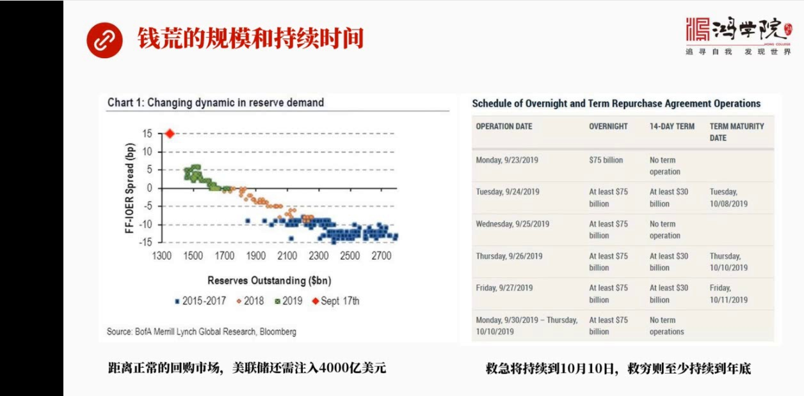

远远超过我们的想象而且持续着时间也超过了大多数人的想象应该这么说这次钱荒的总的规模就是要想回回复到正常状态之下的话每年处还需要重入至少4000亿美元的资金才能赌上这个骷髅才能使回复市场恢复正常运转否则...

<strong>All subtitles</strong>

> 远远超过我们的想象而且持续着时间也超过了大多数人的想象应该这么说这次钱荒的总的规模就是要想回回复到正常状态之下的话每年处还需要重入至少400
> 0亿美元的资金才能赌上这个骷髅才能使回复市场恢复正常运转否则他将始终处在不正常运转之下就是类似于9月16号以来这一个星期的巨烈的回够利率的这
> 种暴涨失控将反复出现为什么会得到这样的一个结论我们后面会接着讲我们现在只需要知道它的规模相当巨大同时它持续的时间也远也超过我们的想象右边这张
> 图我们看到的是它的一个回够的实验表还有就是隔夜回够和期限回够两种回够的实验表这个实验表你会看到每天注资的规模都是750亿上限那么一直持续到1
> 0月10号但是这个钱荒的问题什么时候真正能得到控制住呢就是钱荒的问题现在10月10号之后是不是就不存在了吗当然不是钱荒的问题从现在开始一直持
> 续到今年的眼底2019年的眼底往后这个问题还会存在如果不采取有效的对策的话而这些对策本身也带有其大的后患这就是我们一会儿要讲到了其他的问题好我们现在翻下一页那么为什么说货币市场

---

### Slide 5

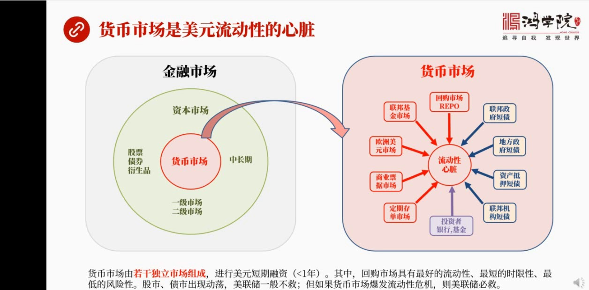

这个市场这么重要我们知道回够市场是货币市场了一个组成部分为什么回够市场也好货币市场也好他是美元流动性的心脏我用这样了一个简单的图来做一个图示其实要把脑子面我们对金融体系的意见要转化成图形这事件很困难的...

<strong>All subtitles</strong>

> 这个市场这么重要我们知道回够市场是货币市场了一个组成部分为什么回够市场也好货币市场也好他是美元流动性的心脏我用这样了一个简单的图来做一个图示
> 其实要把脑子面我们对金融体系的意见要转化成图形这事件很困难的事儿就是很多概念听了就是我们脑子们一下是明白的但是你要把它表达出来表达了让所有人
> 都明白而且一眼就能看明白需要把它图形化而图形化的过程是对人们对我们是对我们的一种很大的挑战因为你不仅要理心所有思路而且要把正确的逻辑关系放到
> 正确的位置别人才能看得懂你比如说在金融市场吧左边金融市场是个大概念金融市场中分成资本市场和货币市场这是两个不同的市场一般人画图他会把金融市场
> 画分为两个部分资本市场在上头会不会上在下面但是我却把托币市场画在资本市场中心为什么就是因为我觉得他是流动性的心脏他的重要性超过了资本市场本身
> 而且他居于流动性的中心地位那么什么叫资本市场资本市场首先就是我们大家都非常了解的股票股票市场债券市场包括金融眼神秘市场金融眼神秘市场无非就是
> 提供股票和债券的提供保险而已所以他们这一块叫资本市场那么他有什么特点呢首先他分成一级市场二级市场比如说我们发现股票IPO那么首先是在一级市场
> 上包括债券也都是一级成要商买了之后然后再分发给下这个二级市场的人进行交易那么他这个特点就是中长期往往这个资本上所进行了融资活动他的期限都超过
> 了一年这是金融市场中资本是让了典型特点那么货币市场呢货币市场情况就不一样了货币上我们看右涂流动性心脏我把流动性心脏画到中心你会看到他有多个市
> 场组成并不是一个货币市场而是分立的好多个市场而且是贵台交易往往没有二级市场那么这些市场包括什么呢比如说回够市场repo这个市场是我们今天要讲
> 的重点还有呢联邦基金市场也就是所有银行都在中央银行存有这个准备金那么把所有准备金的总量加在一起其实也是很多人所说的现金这个现金跟普通的超票不
> 一样不过是存在中央银行的相对应的账户里面那么这个联邦基准利率市场的主要的目的就是为了调节所有银行有些缺准备金有些准备金多了大家可以在这个市场
> 中进行调计也正式由于这个市场的调计作用所形成的就是前不能白给你我得省你利息这个利息就是联邦基准利率就是最重要的这个美联储决定了个利息这是在联
> 邦基金市场决定的除此之外呢还有美元欧洲美元基金市场欧洲美元基金市场和联邦基金市场是一个道理它也是存在这个银行体制内只不过它的快击机长是发生在
> 美元的境外美国境外发生在海外但是它实在在是跟联邦基金市场是联在一起的其实我们如果仔细去想一想就明白这个道理所有的美元真正的美元除非你是现金否
> 则美元投存是不可能流出美国国境的它全部在美国金融体制内无论中国外主流有多少无论你的账上有多少美元储备有多少美元的存款如果你在中国的话你要意识
> 上你这只是个影子只是一个投存的影子而真正的美元是存在美国的某家银行账上这个道理涉及到我们对金融的很多其他的理解大家在这首先要意识到这是个问题
> 所以欧洲美元基金市场和联邦基金市场它实际上是联通的只不过记仗方式发生在海外而已除了这个市场还有商业票局市场商业票局市场就是很多企业为了解决当
> 天的融资问题或者超短期的这种融资二百七天以内的它往往在商业票局市场上去发债发商业票局就是一种债券这就是美国金融市场跟中国不太一样的地方中国你
> 要发债你必须得是三个A平级你必须得是央企你必须得是有各种各样的标准资产负责率等等还得有多少现金流因为发改委要省但是在美国商业票局市场很简单不
> 需要谁省也不需要到哪去去这个备案也不要也没有这么多操作这种手续很简单 你是一家企业你这家企业就会有人给你融过资那么也就是你的代理的这种融资中
> 介的代理这往往是一些这种金融机构了解这个企业 知道这个企业它不管你经营的这个什么负债率怎么样也不管你这个其他的这种其他的这个资质如何只要你有
> 资金需求都可以找到你的这种代理商去跟它谈条件如果它了解你 知道你的底细了解你经营情况它就会愿意给你来成销那么整个这个过程就几个小时就能完成那
> 么这是一个超级简单的获得资金的方式而且它们也很低所以美国很多企业为了避免正式发行企业债公司债量的很萝卜的手续能够使用商业票局市场发行超短期的
> 这样的一种商业票剧进行融资解决公司的运营还有投资等等需求都可以除了这个之外 当然还有定期存单市场就是银行的存单CD定期存款6月或一年当然 这
> 些存单都是可以一架的票剧你可以拿到存单市场上去买和卖因为这个对储户来说你存在银行中6个月的存款你就不能随便娶了因为要娶要罚款所以在6月之内这
> 个钱是被凍结的这个钱 银行会把它转手卖出去它作为一个可交易的这么一个单剧是可以交易的比如说有人可以打点折打点折呢又比你给储户的利息中间有立差
> 那么很多银行就愿意做交易所以有买的有卖的就形成了定单交易市场定期存单但是说这种情况之外还有很多专门的这种代理商来代理企业和代理其他的机构的这
> 种定有存单所以他们也形成了一个市场包括会票市场这可以说也是某种意义上的商业票剧银行会票 商业程度会票等等那么这是一系列的货币市场中的一系除了
> 这个之外我们看这个图的右边 你会看到那么这些市场中它融资交易有很多需要制压比如说回够吧这种制压品之什么 底压品什么比如说你可以用联邦政府的短
> 债可以用地方政府的短债可以用资产底压的这种短债等等还有联邦机构短债那这些东西可以作为底压品在这个市场中去底压 去获得这种资金除此之外还有投资
> 者 投资者包括银行基金保险公司等等这就构成了美国整个流动性的心脏地区所有的超暖期的融资一年以内的都在这一系列市场中解决那么其中最重要的我们今
> 天要谈到最重要的一个是回够市场还有联邦基金市场这个回够市场它的特点什么具有这最好的流动性因为它是用国债作为底压所以它的流动性超强同时最短的实
> 现性 短的就隔夜长的七天 十天 十四天等等最长也不超过一年同时还有最低的风险性因为它底压品是国债而我们认为或者市场认为美国政府只要不到那么美
> 国国债就不会委约它可以应超票 所以它永远不会委约所以它的市场具有这最好的流动性最短的实现性和最低的风险性如果我们看美国政府就是看美联储 美国
> 财政部他们在历次拯救危机的时候如果你是单纯的股市危机债式危机出现股票暴跌 债程市场暴跌美联储不一定会动手去帮你不一定会直接拯救股市但是如果货
> 币市场暴发流动性危机就像2008年那次 它是非出手不可为什么非出手 不可呢就是因为如果你不拯救货币市场特别不拯救回够市场的话那么整个金融体系
> 就会崩盘它会连带所有的体系 所有的银行机构所有的市场交易全部被它脱下水所以当货币市场出问题的时候美联储必救就像这一次贸易市场没有什么太大的事
> 情为什么它要出手4000亿美元来拯救这个市场这就是原因而股市争发几万亿美元美联储可能不会去管债权市场出现几万亿美元的波动它也不一定会去管但货
> 币市场要出现超过这个联盟机种利率上限一定比例的这样的一个超俄幅度的话它是非管不可的这就说明了再次说明了货币市场特别是回够市场在整个金融体系中
> 间它的核心重要性它是流动性的心脏我们怎么来理解流动性就是不管你什么样的金融产品金融的这种票剧只要你进到这个市场很快就能卖掉而且不打折或打折率
> 非常低的把它出手这就叫流动性好所以所有的市场都符合同样的规律就是流动性最好的市场具有着非常强的价格牵引力就是它是定价者所以是货币市场再给整个
> 美国金融体系的其他所有资源价格再进行定价比如说回够利率比如说各种各样的美联储交易出来联邦基金利率都是在这里进行定价明白这一点之后我们看下液下液我们看一下回够市场和联邦基金市场

---

### Slide 6

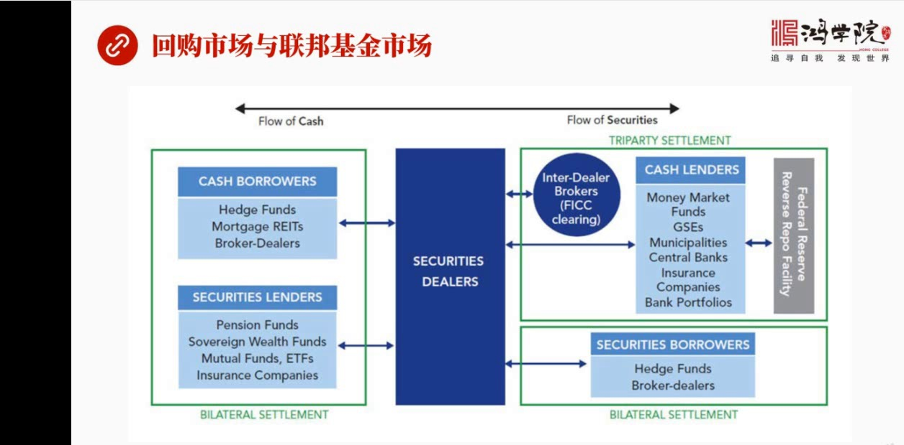

这是两个市场这两个市场又有机会整合在一起这张图是美联储的一张图我觉得这张图基本上把回够市场它的基本原理画的比较清楚所以我们来看一下它这张图的基本够价最左边我们看到的是就是需要借钱的人融资方不管是需要借...

<strong>All subtitles</strong>

> 这是两个市场这两个市场又有机会整合在一起这张图是美联储的一张图我觉得这张图基本上把回够市场它的基本原理画的比较清楚所以我们来看一下它这张图的
> 基本够价最左边我们看到的是就是需要借钱的人融资方不管是需要借资金还是借这种证券都在左边他们跟谁打交道呢他们跟所谓的做事商就是整个金融体系中间
> 他存在了很多做事商这些做事商就是寄买用卖中间赚这个叫卖账叫卖账之间的差价那么在右边我们看到有现金的放带者CashLender这叫放钱放带的还
> 有兜跃的钱要放带还有可以借出还可以证券也可以借也可以放带也可以借入所以我们会看到在这个这张图上出于中心地位的是做事商然后在做事商的右边我们会
> 看到一个圆形的这是清算行就是FICC专门负责可以说是后台工作寄账的就是你这债券我帮你收着你的钱外帮的收着我帮你整理账户然后交格有我来帮你负责
> 你们就专心做买卖就行了其实这个回够市场他的本质是什么就是你手上有债券你债券为抵押去借现金当然要打一点折然后你要承诺过一天之后或者过多长时间之
> 后一个更高的价格把你的债券给买回来那么它所形成的这个差价就是所谓的回够利率那么在回够市场中其实包括有两种一种是双边的回够一种是三边的回够三边
> 回够就要涉及到清算涉及到有人帮你做事双边回够就是现金的放带者和现金的需求者之间他们自己去谈条件哪种形势好呢或者哪种方式它更流行呢当然是三方的
> 我们讲过三方可以做很多集中清算它的工作量可以说大大减轻了双方的工作量所以大家普遍会采用三方回够双边回够也有一些特殊利用处比如说三方回够中假如
> 你就需要特别需要某一种债券比如说十年机国债的某一个品种我只需要这一种那么我就愿意用钱去放带出去然后拿手上拿到这个这个品种的债券这个东西对我有
> 用比如说我要用来交割我要用来其他的对冲其他的这种交易中间的投存的一些处理我需要用这种债券所以双边债券双边这个回够是有特殊目的的三边的是更方便
> 更流行的那么在最右边我们看到有美联储的就是美联储了一个逆回够这个逆回够什么概念呢这个逆回够的概念其实是从市场中抽取资金就是他把债券送出去然后
> 把别人的资金就是别人相当于向美联储放贷美联储以债券为抵押他是个回龙资金的过程主要这跟中国人的逆回够正好相反因为中国是站在央行角度中逆回够是放
> 钱出去但是美国的金融体系是站在低乐的角度他实际上是一个反过来的一个叫法所以我们看到美联储说逆回够的时候他实际上是在回龙资金这个跟中国是相反的
> 大家务必要记住在这张图上我们看到这个现金流还有正券的流正好相反现金从放贷方流向了借钱方这个抵押品正好相反但是这一张图呢我觉得他虽然画了很清楚
> 概念的话很清楚但是他不是太直观也就是说如果我们直接去理解这张图我们还是不太能够明白他到底这个金融市场是怎么运作的所以我想为了把回够市场和联邦市场之间的关系说清楚我自己从今画了这张图下意在这张图上

---

### Slide 7

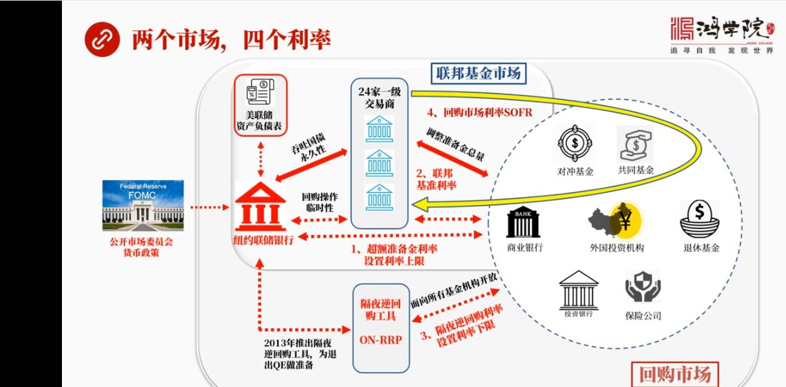

就是关键是两个市场要搞清楚两个市场和四个利率之间的关系我觉得我的这种表达方式用这种图形的这个绘制的方式更明显更清晰更容易懂特别是从流程角度来说你更容易搞明白是怎么回事你比如说从最左边看当然这就是美国的...

<strong>All subtitles</strong>

> 就是关键是两个市场要搞清楚两个市场和四个利率之间的关系我觉得我的这种表达方式用这种图形的这个绘制的方式更明显更清晰更容易懂特别是从流程角度来
> 说你更容易搞明白是怎么回事你比如说从最左边看当然这就是美国的公开市场委员会美联筹的那么公开市场委员会他要制定各种货币政策然后制定政策之后比如
> 说减细或者加细然后把这个货币政策是指令传到纽约连筹银行注意纽约连筹银行是12个美联筹银行中最重要的一个因为他直接负责执行因为金融市场的中心在
> 纽约在华尔街所以他是负责执行货币政策的从理论到时间中间又很长的一段距离不是大家想象的将0.25个百分点然后就降漏不是那么简单他跟市场的心里跟
> 交易的对手还要跟各种各样的这种具体的包括交易的品种都有关需要非常丰富和细致的这种知识和经验否则这个事搞不定这就是为什么我们看到市场中很多很多
> 人评价这个新行长2018年上任这个江威林斯就说这个人不行你要把它跟以前的行长比或者跟他这个手下的最厉害的两个交源结果都被他炒掉了他真的是这回
> 处理的相当的不得道你会发现换一个人来操作差异非常的大就是从理论到时间对市场的理解非常的关键而是需要丰富的知识丰富的经验才能做到不是那么简单的
> 加息减息就调整一下就完事了那么他究竟是美联处扭运行究竟是怎么来执行加息和减息这样的政策呢上面当然我们知道他其实这个美联处有自己的自然负赛表你
> 的调整最后会反映到自然负赛表上那么他手段有几种第一种就是画的比较粗的箭头吞吐国债吞吐国债是什么意思就是我们说的量比如说美国量的坑中货币政策Q
> E的时候其实就是美联处印超票到市场中去买进国债放在自己自然负赛表上自然负赛表不就长大了吗不就膨胀了好这个钱就流向了金融体系这是我们概念上知道
> 所以这是他第一个执行影响利率的方式我如果印很多钱把国债买进来放到自然负赛表上前出去了那利率不就下降了吗他当然可以影响利率但这件事怎么做他不是
> 自己到街上去叫外也不是随便哪个金融机构都直接能跟他打交道在执行吞吐国债这样的过程中吞进来就是释放货币出去吐出去就是回龙资金回来然后把这个债券
> 给卖出去所以一个是扩张扩张货币一个是紧缩货币收紧流动性他都必须要通过二十四加一级交易商这交易商都是几百年以来就是在美国金融市场上都是属于摩批
> 滚打人卖关系然后市场经验各方面都炉火春清的这些人被称之为一级交易商他们有自己的人卖有自己的渠道他能够一次性吃下几亿美元的债券然后通过他非常连
> 密的消失网络包括这种机构能够迅速了把几亿美元能够半个小时之内全用卖掉花个人这事就搞不定而且资金要比较大他们还要有自己的库存所以这些东西都是一
> 级交易商他去负责处理的美联储吞吐国债只跟一级交易商打交道他就相当于一个一级批发商然后他拿到这些国债之后你会看到他在金融市场上这就是在这张图的
> 中间我花了一个调整准备金的总量也就是当他卖出这些债券的时候卖给银行卖给金融机构的时候那么资金不就是从银行手上从银行的账户中留到他这来了吗实际
> 上这些钱又通过他转给了美联储那意味着什么意味着现金市场也就是银行的体系之内的现金被美联储抽走了抽走了会形成什么现象呢抽走了之后就会出现资金的
> 短缺资金吸缺了资金吸缺了之后银行之间的在联邦基金市场上进行交换的时候因为总的资金量下降了所以大家每个银行说我现在缺点这个准备金能不能让我点那
> 么这种借贷利率就会上场这就会影响联邦利这就是联邦利率会影响联邦利率的上场或下降去觉他怎么操作所以美联储是可以通过吞吐国债的方式来压低利率的就
> 像QE当然他也可以反出来可以台生利率让自己变得吸缺联邦利率就能台生主要是通过21家交易这个一起交易商通过他们在跟银行做交易跟金融机构做交易然
> 后在这个交易中收走或者放出资金量影响整个金融体系之内的资金现金存量从而间接的影响每一家银行在联邦基金市场上进行借和带的时候影响他们的资金吸缺
> 性影响他们的利率这就形成了联邦基准利率的一个方式当然方式不止这一种还有呢第二种什么呢就是从永远美联储银行出来他还可以用第二种方式就是通过回够
> 操作来进行资金的收合放当然也是通过24家这种一机交易商这种回够操作什么概念呢就是比如说这个格业格业就是如果我要我要放出资金那么我就到市场中去
> 收就是问有没有人愿意向我抵押这个债券然后需要钱我可以把钱给你第二天我们反过来做也就是我把资金收回来你把你的抵押品拿回去这种方式他起到了作用跟
> 我刚才所说的吞吐国债效果是一样的只不过他每天都要做而吞吐国债是一次性的所以称之为是永久性的改变自然分代表而回够操作他的释放资金只释放一天第二
> 天就倒回来了所以对于资产分代表本身来说并没有直接的影响这取得快据原则快据原则在这里规定了如果你是回够的话那么你并不影响资产分代表但是你会影响
> 你的这种比如说每天中账上的国债资产如果被抵押出去了这个抵押是要记录的除了这个之外还有什么呢还有就是超约准备金账户上的利率那么再讲超约准备金账
> 户利率之前我们首先这个稍微回复一下就是吞吐国债这种方式叫QE就是辽宽松那么通过回够性的这种操作来释放释放这种资金或者回收资金呢这个其实是20
> 08年以前金融危机之前美联储惯用的他们特别喜欢用回够来影响金融体系中间他的整个准备金的总量就是你通过回够回够嘛如果你要收资金那么你就把债券抵
> 出去抵出去之后上银行把钱转给你实际上就把钱借带给你那么整个银行体系中资金不就下降了吗利率不就上升了吗虽然只有一天但是也能起到同样效果只要他第
> 二天照着在在这个滚动一次他就可以做成两天或者更长每一天每天的这么续他就可以他就可以调整这个利率其实美联储规定了利率之后宣布加稀之后你会看到这
> 个公开市场操作在2008年之前他得平凡进行调整来v条这个利率有的时候比如说你定在2%他有时候多了一点有时候少了一点需要通过美联储的公开市场操
> 作通过回购来不断进行调整那么除了这两种方式之外第三种方式来影响利率就是超过准备金账户上的资金美联储可以给他定利息以前是没有的金融危机是前是没
> 有的为什么呢因为超级准备金账户相当于上银行存在美联储准备金账户中的切签要看就是支票账户支票账户我们以前这个在合音客中准备讲过支票账户是没有利
> 息的这也是合乎美国传统银行的这样的一个逻辑和思路但是金融危机之后银行体系损失惨重所以美联储他通过给他首先通过两个观松我大量硬超票去买金融上的
> 债券把资金放出去了放出去了放给这个银行这个银行手上钱多了他其实就存到了美联储的账户中这就形成超过准备金以前是不给利息现在给你利息实账是一种变
> 相的补贴严格说起来就是拿纳税人的财富去补贴亏锁了银行体系这些很贪婪贪婪之后还有全民救助然后救助完了还不行还给他们这个补贴然后他们好发奖金道理
> 是这么一个道理但是他的在货币这个政策中的用处他有一个特殊利用处就是设置资金的利率的上限设置屋底什么原理呢我们到下野时候会仔细讲所以这是第一个
> 利率我们需要记住超过准备金账户利率他是利率的上限是美联储公布的公布的比说1.75%到1.2%他就是那个上限手的上面的那么第二个利率我们要谈到
> 的就是联邦基准利率这个我们刚才已经说了通过吞吐国债也好通过临时性的回够也好都可以影响整个金融市场中准备金的总量使得大家在联邦基金市场中相互借
> 带手这个利率会发生变化这是第二个利率第三个利率是什么呢第三个利率在下面这个下面呢我们看到这是美联储怎么操作呢他在2013年的时候为了配合即将
> 退除量的观松搞了一个叫格业逆回够工具这个格业逆回够工具主要是为了设置利率的下限所以这是第三个重要的一个利率那么在这个框土中我这儿著名了格业逆
> 回够工具呢他跟临时性的这东西不一样他是一个通过技术手段通过硬件体系通过软件体系保障的一个通道临时回够市场操作的时候并不是一个具体的他只是临时
> 操作一下操作完了之后他可能就不这么用了你比如说回够操作在2008年之后有很长的时间一直到这一次之前基本上有10年没有再动用以前这个工具而这个
> 格业逆回够工具他就变成那个固定式的长设的一个工具这个工具的目的是什么目的是为了设置利率下限逆回够刚才已经说了是从金融市场上收回来自金的就是回
> 融自金是用这个格业逆回够工具那么他跟以前每年处的操作有一个重要的不同就是他是面向所有金融机构的这就是我们看的右边这张图中这个圆圈中所展现的这
> 些金融体系的金融机构包括商业银行对重基金共同基金退休基金还有投资银行保语公司还有包括外国投资者等等外国中的银行都在这个金融体系里面他们是金融
> 体重要的参与者是货币市场的重要参与者那么以前这个每年处只跟商业银行达较到他不跟这些对重基金不跟共同基金职业达较到现在呢格业逆回够工具是像所有
> 开放的大家都可以通过格业逆回够工具来跟每年处纽约银行来进行商业往来换句话说每个圈圈里面的金融机构都可以向每年处纽约银行放带通过逆回够他们把钱
> 借给每年处银行来赚取一个立插这个立插就是格业回够的这个格业回够了这个利率他赚的就这个钱好如果我们看整个这张图上还有一个黄色的一个大的大的这样
> 的一个这样的一个箭头回旋箭头他什么意思呢这指的是回够市场这个回够市场是一个自发形成的一个市场那么就是24个交易商中间有两家非常重要一家某跟大
> 通代的这还有一个是这个梅龙银行这两家银行是作为回够市场中三方回够市场中的两家清算行也是最重要的两家核心银行他们负责给三方回够这个所有参与者提
> 供清算服务提供账户服务提供资金保管风险对冲都是他提供大量的后期工作就是所谓后台工作大家都到他那去开户然后我们买和卖或者这个进行回够都通过他们
> 那个平台来做对大家说都很方便而且成本比较低那么在降了一个黄色的绘员局院中他其实代表了一个什么呢就是代表了原券中的所有金融机构都可以跟交易商中
> 间的这两家进行交易而且是他们这些对冲进行上银行投资银行保证公司他们之间彼此的借贷以什么为底以国债或者以两方债等等作为质压然后到萌萌大通那去开
> 个户然后我们双方在那做这个借和带然后到第二天比如说隔夜的第二天我就把钱我是放在这我就第二天早上我就把钱收回来了然后同时呢我就把你抵押给我的这
> 个债券还给你了所以这样的一个过程都是在第三方这个第三方回够中的两家清算行里面来进行的这就是为什么要用黄色剑头来代表这样的一个回够市场这就形成
> 了第四个利率第四个重要利率是什么就是回够市场利率sofa这个利率我们在和银客中专门讲过他代表的是他这个平均数就是所有银行因为回够市场他是一个
> 贵台市场没有一个像股票上或者是这个债券上了一个集中集中交易的一个地方那么有些人选择双边的有些人选择三边的三边你可以在这也在萌萌大通也可以在梅
> 龙银行或者你们还有什么其他的选择大家都可以所以这个银行的这套回够的这套利率他是数就是比较难掌握的也很难知道具体有多大规模所以每年初每年在统计
> 回够的数据的时候都比较头疼因为这个数据很难准确把握不管怎么样他能够算出一个基本的平均的回够的成本就是这个利率这叫市场回够利率或者叫回够市场利
> 率那么这个利率就是我们看到出事的这个利率所以我们现在搞明白了四个利率这个超级美金利率联邦基准利率第三个是隔夜运回够利率这是每年处设置的第四个
> 是回够市场的利率第四个是真正市场形成的利率第1个是什么第1个是每年处设置的超级美金利率第3个利率下限隔夜运回够利率也是每年处设置的那当然中间
> 这个联邦基准利率是交易出来但是他已经设了上下限所以你拼不到哪去应该说是半市场化搞明白这个图之后你会看到其实有两个市场存在一个是联邦基金市场我
> 用蓝色字给标杀了这中间就包括了美联处包括了这些交易商包括了这中间的金融机构特别是银行那么联邦基金市场主要是银行之间上银行之间的准备金进行彼此
> 的调计所形成的交易出来的这个叫联邦基准利率所以这个市场是包括这一小部分更大的市场是整个就是我用这个赫色标志出来的回够上他基本上包括所有人了也
> 就是每个人都在中间利用逆回够隔夜逆回够正回够彼此之间做回够还有三方回够利用清算做回够等等都在这个体制内所以这是列案个市场一个叫联邦基金市场一
> 个叫回够市场同时存在着四个重要的利率这些问题想清楚想明白之后你才真正能够看了懂的新闻到别的说什么甚至你能够发现新闻中说的不对因为新闻那个人那
> 个记者没有搞清楚他背后真正的逻辑关系所以这就是为什么要用图来说用图才能把中间的细节的逻辑才能解释清楚好 我们现在下午下午就是要讲到联邦基准利率它这个区间是怎么控制的

---

### Slide 8

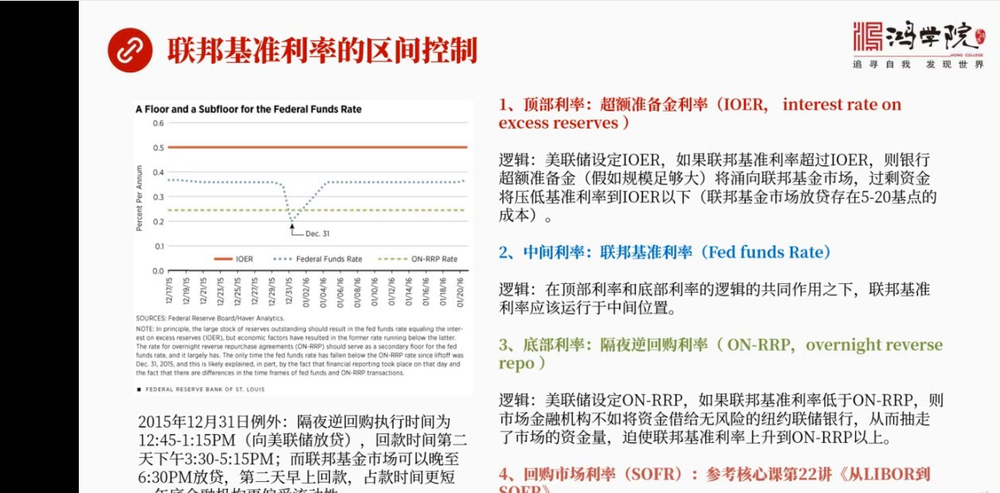

为什么我们要说这么多就是为什么不直接跳到结尾去讲危机怎么爆发的其实如果我们不理解联邦基准利率的设置它这个空间设置是怎么回事不理解这整个金融市场的它的构成什么叫联邦基金市场什么叫回够市不理解这四个基本的...

<strong>All subtitles</strong>

> 为什么我们要说这么多就是为什么不直接跳到结尾去讲危机怎么爆发的其实如果我们不理解联邦基准利率的设置它这个空间设置是怎么回事不理解这整个金融市
> 场的它的构成什么叫联邦基金市场什么叫回够市不理解这四个基本的利率概念我们根本就不能够去说的明白这个市场究竟发生了些什么那么如果我们来看这张图
> 这张图这也是美联储他们做了一个试一图这张图的上边是一条红线这个红线标志是什么Ior1Ior1是什么就是超过准备金利率美联储设定的它把它作为一
> 个利率的上线那么底下最底下还有一个草率色的线这个什么这个叫overnightreverse purchase这个其实就是所谓逆回够的隔夜逆回
> 够的工具所以作为它的下线所以在这两个线中间这个栏线是什么呢这个蓝色的虚线就是所交易出来的联邦基准利率所以我们现在看到再次记一下红线代表着顶部
> 利率叫超过准备金利率底下的草率色的线叫什么叫隔夜逆回够利率叫底部利率中间形成了联邦基准利率我称之为是中间利率关键是他们背后的逻辑是什么为什么
> 我通过设置超准备金利率我就能够控制上线呢背后的逻辑是啥这个利率首先是由美联储设定的美联储设定之后这背后的逻辑是假如联邦基准利率就是中间的条线
> 超过了逃到上面去了超过了这个顶部超过了超准备金账户超准备金账户上这个利率那么银行中的超准备金就是以前有就是我们现在知道在电话空中时代有好几万
> 亿是爬在账上没动的爬到超准备金账户上好 假如你的联邦基准利率很高超过了超准备金账户利率那就会产生什么效应这些先一定会跑出去的一定会从美联储的
> 账上从这个超准备上上一定会从向联邦基准利率市场联邦基准利率市场为什么那边利率高我当那边不是去转弓弄前不是更方便吗好 那么大量的资金就会从超准
> 备金账户上用向联邦基准利率市场这会带来什么效果它一定会使得那个市场中资金过度充分资金过盛了共决关系决定什么那么资金过盛了利率就会下降所以联邦
> 基准利率会自动下滑最后跌到这个超准备账户利率之下这就是它的基本逻辑它这个顶就是这么疯的为什么会掉到之下呢因为你超准备金这些钱勇相了联邦基准这
> 个市场之后你要在中间要借和带这中间都有手续要花钱要花时间等等是有成本的所以往往你会看到交易圈的结果是联邦基准利率会低于这个上限利率超准备金利
> 率大概五到二十个级点原因就在这儿那么底部我们先不说中间我们先看第三第三个底部利率它的背后的逻辑什么底部利率叫格业逆回够利率格业逆回够利率它的
> 逻辑是美联厨也是涉及这个利率的也就是大家向美联厨放贷如果说美联厨的联邦基准利率比这个还要低那我作为一个放贷人作为一个放贷者我可以用你这个我可
> 以这个用你这个联邦你回够这个利率我也可以用美联厨的这个基金就是这个联邦基金来经放贷我看哪个对我更何算假如联邦基准利率比它还要低那我为什么要把
> 钱投到那个基金市场中去呢因为那还有风险因为是无底压的联邦基准利率所形成的那个联邦基金银行之间彼此是不需要底压他们是空口就能借到的所以那个市场
> 还有一点风险如果说那个市场比美联厨给的放贷利率还要低我我当然愿意带给美联厨毫无风险零风险所以这样干的话就会使市场中很多人把大量资金带给美联厨
> 带给美联厨结果什么整个基金市场中的资金就短缺了短缺就会破石整个联邦基准利率往上台超过它的底部这就是定部和底部两个利率的它的运行的背后的逻辑好
>  中间那个利率什么就是联邦基准利率联邦基准利率就是你把顶过风把底部给我风了逻辑都讲清楚了那我只能在你们俩中间波动对吧所以我们看到左边这张图蓝
> 色这条线所代表的联邦基准利率基本上就维持在顶和底两个利率之间不过在这样的一个图形中我们会看到还有一个利率就是第四个回够市场利率回够市场利率我
> 们在核心课的第22讲专门讲到了这是第四个利率就是从Lyberto Sofra在这个课程中我们专门讲到了刚才我又重新提了一下也就是你的联邦基准
> 势场中的还有回够市场中它共用一个资金池这个资金池如果它在不断地发生变化那么就会影响两个利率那么影响回够的这部分就叫回够市场利率影响联邦基准利
> 率如果大家有什么疑问可以参考一下核心课第22讲那里面已经把这问题说过了我们再看这个图中间其实有一个很深的一个凹槽这个凹槽发生在2015年12
> 月31号这一天发生奇怪这个发生了一个奇怪的现象就是联邦基准利率居然掉到了地板之下就掉到了你这个阁业你回够利率之下这不应该因为我们刚才已经讲了
> 这个逻辑了如果掉下来的话那么大家应该把这个钱存到每年处就是把这个钱放大给每年处我不应该因为这个利率到才0.08这是没什么意思就是这个利率太低
> 了我根本就不想根本赚到什么钱我放大给每年处不赚了更多吗因为每年处当时是0.25它的底线也就是我放在给每年处可以赚0.25我在回够市场上我才能
> 赚0.08百分之0.08那当然我放大给每年处合适了怎么会出现这么一个跌破地板价的这样的一个情况呢这背后是有原因的这是一个例外这个例外的原因是
> 什么就是隔夜你一回够实行的操作就是你要放大给每年处是有时间限制了而且这个时间不太理想是中午12点45到1.1克这是给每年处放大的时间那么你隔
> 夜收回这笔钱的时间是什么是第二天下午三点到五点一克三点半到五点一克那么这段时间就站得比较长也就是从今天中午一直压到明天下午三点你才还过或者三
> 点到五点才还过压了我一天多而联邦基准这个联邦基金市场呢这个市场流动性比较好因为这么多家银行八九千家银行再加上外国的金融机构那就更多了这些市场
> 中大家交易量很平凡所以流动性很好大家有这个有卖有卖有借有带那么这个市场你可以比较晚的成交可以晚到六点半也就是你做一个放待人我先把手上多一钱放
> 待出去的话我可以到晚上六点半我才把钱放待出去而回收时间是第二天早上一早我就可以把钱给收回来所以这个资金压转时间短多了特别重要的是12月31号
> 他是跨年份的也就是在这种情况之下金融机构都非常希望自己自这个自展负赛表上或者才有报表上好看你这个资金如果借出去了而且又有风险的话这个玩意儿就
> 这个在金融赏上就会被看空所以正是由于跨年的原因大家宁愿要资金被少占几个中头也要他这个宁愿选择这个流动性而不太看重那一天的这个利率所以在年底的
> 时候金融机构往往更偏爱流动性这就是为什么他在那一天会跌破地板架跌到地下去了原因就在这儿下一到明白了这三个利率的关系我们现在就可以深入来看问题了

---

### Slide 9

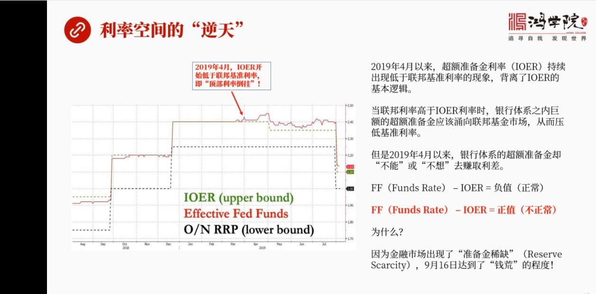

导致这次前方的一个重要的原因是什么是利率空间出现了逆天的现象看左边这张图绿线就是绿色I-O-I-O-E-R就是所谓的顶部利率超准备经常户利率它本来应该在上头这个就是炒绿色这条线那么红色这条线呢就是联邦...

<strong>All subtitles</strong>

> 导致这次前方的一个重要的原因是什么是利率空间出现了逆天的现象看左边这张图绿线就是绿色I-O-I-O-E-R就是所谓的顶部利率超准备经常户利率
> 它本来应该在上头这个就是炒绿色这条线那么红色这条线呢就是联邦基争利率它应该在中间而底下这个黑色利率呢就是你回够利率呢它应该在最底下结果我们发
> 现在2019年4月今年4月出现了一个非常奇怪的现象就是这个超准备争户的利率开始低于联邦基争利率了也就是顶部的利率倒挂了这个倒挂其实也存在于利
> 率这个区限的倒挂其实也存在于回够市场上也就是2019年4月今年4月在顶部的超准备争户掉下来了掉到了联邦基争利率之下我们刚才已经说了这个逻辑就
> 错了为什么如果你掉下之后这就意味着这个它的逻辑就不对了那么当联邦基争利率高于超准备争利率会发生什么呢刚才我们说了银行体制内是拥有着好几万亿聚
> 额的存款的超准备争资金的这个时候它应该跑出来跑到市场中就是因为联邦基争利率更高吗我这爬着好几万亿一比我高出一个百分之多少那我肯定我要把这个这
> 个钱从超准备争战户中要取出来假如我是银行我是放在这的话我一定想把这个钱投到联邦基基金市场中却赚更高的更高的回报但是问题怪就怪在这4月以来银行
> 超准备争的账户却不能够或者不想或者拒绝去转这个可观的立差注意这是导致我们久迫看到这次重大的货币上它的一个危机的一个非常关键的原因为什么就是为
> 什么大家不去转这个立差爬到超准备争上上嫌待着而对方比你高这个现象第一次出院在今年的4月那么我在底下写了一下这个在这个在这个文字中写的这是FF
> 检去Io12FF是什么呢就是联邦基诊利率检去Io12它如果是负值的话是正确的如果它负值说明Io12大于它那就是Io12是在它上头超准备争那个
> 顶部那是正常的反之如果联邦基诊利率检去超准备争后是政治那就变成4月以后这个情况了那就不正常意味着超准备争后的资金被困在那个地方不知道什么原因
> 它们本应该留下这个联邦基金上去转那个更高的立差它不去这就怪了所以当我们看到这个执变正的时候说明事情出问题了关键是为什么原因最主要的原因最核心
> 的原因就是意味金融市场出现了准备金的稀缺这种稀缺导致就是你看着呢好像有1.4万亿超准备金趴在你每年种账户上但是实际上这个市场中存在了严重的资
> 金稀缺准备金总的来说是不够的当这种不够达到了一种极限到了9月16号就爆发了钱荒好这个就是我们开始真正接触到问题的核心了立律市场出现那天爆发在
> 4月而4月以来1.9月才真正出现现在这个危机是由于这样的一个问题不断的积累积累了将近半年的时间最后终于爆发了好我们看一下也那么这这个事真的很奇怪了1.4万亿的准备金怎么会稀缺

---

### Slide 10

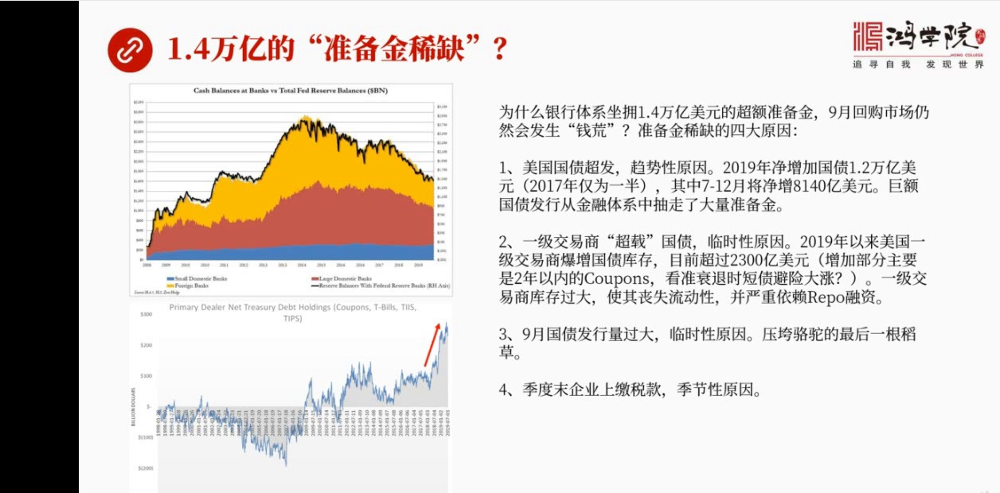

走途我们看到上面这样图这画的是整个美国金融体系中各种金融机构它存有的现金就是准备金吧加在一起这是一个现在的比例将近14000亿既然银行体系作用这么大规模的现金为什么9月回够市场仍然会发生前荒我们刚才已...

<strong>All subtitles</strong>

> 走途我们看到上面这样图这画的是整个美国金融体系中各种金融机构它存有的现金就是准备金吧加在一起这是一个现在的比例将近14000亿既然银行体系作
> 用这么大规模的现金为什么9月回够市场仍然会发生前荒我们刚才已经反复说过超纸美金应该在市场紧确自信的时候它应该留出来留出来去转回够市场中的钱或
> 者叫联邦联邦基金中间的这个立差的钱它为什么不去它为什么出现稀缺原因有4个原因第1个原因美国国债超方这是一个趋势性的原因2019年美国将竞争加
> 国债1.2万亿而2017年只是他离伴说明2019年增加了非常地盟为什么由于特朗普最近两年的这个减税各种开支的剧增导致美国的这个财政赤字越来越
> 严重当然体现为国债它的爆炸那么最严重的是什么最严重是下半年7月到12月增加的量它的比例更大也就是上半年还比较少下半年达到了8,140亿美元哇
> 塞那就是增加的主要部分是发生在下半年这就是为什么7893个月到9月份它就忽不住了就是准备金不断地被削减削减到一定程度因为每个月要增发23,0
> 00亿特别的9月份然后在增发过程中增发国债过程中大量资金就买了国债就从金融体系中就流走了就被抽就被抽掉了所以它就会导致这个准备金稀缺当然另外
> 再加上在前几个月不停的在缩表缩表也是在回收流动性所以缩表虽然停止了但是前几个造成了后果是存在的也就是准备金不断地在下滑再赶上下半年国债的暴增
> 导致大量的资金被从金融体系中抽走了这就导致了准备金的稀缺这是第1个在我看来也是一个最重要的原因因为它是个趋势性的原因因为国债增发还会持续下去
> 而且会这个量会持续很长一段时间那么第2个问题是什么第2个问题是一个临时性问题当然也很重要这是又发9月危机的一个重要原因第2个问题就是一期交易
> 商刚才我们说过在这个美国国债上上有14个24个这个一期交易商在回够市场中有两个最主要的一个这个做清算做这个做事的这两个这两家这个交易商那么由
> 于他们2019年以来这是看左边下面这张图2019年以来这里这一批吧一交易商他们持有了国债的库存开始抱掌我称之为是国债抄载你跟他以前从90年代
> 98年还是一直到现在你会发现现在特别是在今年2019年以来出现了个直线上升使得他现在国债的这个目前的库存量超过2300多亿美元我记得在后边那
> 种五中间我讲到在2012年前后时候以及以及这个交易商他的国债库存大概是1400亿那么现在一下就标伤上来了到2300亿了增加了部分主要是短期的
> 两年以内的两年以内的短债为什么会出现这样的一个情况我们如果换位思考一下为什么如果你作为一级交易商你手上你有大量的资金为什么你要囤断七国债也就
> 是说在今年2019年出现了什么情况我认为可能是他们意识到了经济出来他要来领在经济出来的来领的时候我大大的持有断七占国债那么这就会因为金融危机
> 来了之后这个金融对来领降零危机爆发那么所有资金都会强国债特别是多七国债作为毕竟的工具那么他们实际上是先运市场先囤落货大家到时候一出现出来的一
> 来强我手上这个东西不就赚大钱了吧应该背后是这样的一个逻辑那么这也导致什么呢导致他们库存量太大他们这个库存他不是靠完全靠自己先进因为他们的尴尬
> 率就是他们所持有的资产跟他们自有资金的这种差距往往是几十倍的这样的一个差距所以他需要借钱来做这个事借钱来源从哪儿从回够市场上去融资质压国债去
> 融资所以呢如果他的国债库存量非常大也就是他需要大规模的融资回够融资也就在这种情况之下就会对回够市场的利率超级敏感如果回够市场的利率上升比较多
> 他就吃不消了因为他是借钱来通货的也正是由于他囤了大量的国债大量的这种债圈的库存使他喪失了流动性自己的钱不够了喪失流动性之后他作为做事伤进行这
> 种做事的交易买进卖出这种能力就被极大的削弱这导致了回够上变的超级的脆弱这就是为什么九月份会出事这也是一个重要的原因那么第三个原因当然就是九月
> 份零食这个月发债比较大我认为这是个零食性的问题也是个零食性的原因但是九月份这个三千亿的两三千亿的国债的增发量这是压垮落土的最后一根稻草实际上
> 起的一个导火所又发的作用当然另外一个导火所就是这赶上了激动墨要到第四季度了第三季度快到快结束了激动墨说企业要交税那么这就导致了一个季节性原因
> 大量交税几千亿美元要交税那么就会从银行中把钱取出来然后然后这个这个去交税那么这几个原因加在起使得九月份爆发了严重的准备金不足所谓准备金稀缺的
> 问题这就是这场危机它的真正的本质好我们再看下野那么如果往后看会出现什么样的问题

---

### Slide 11

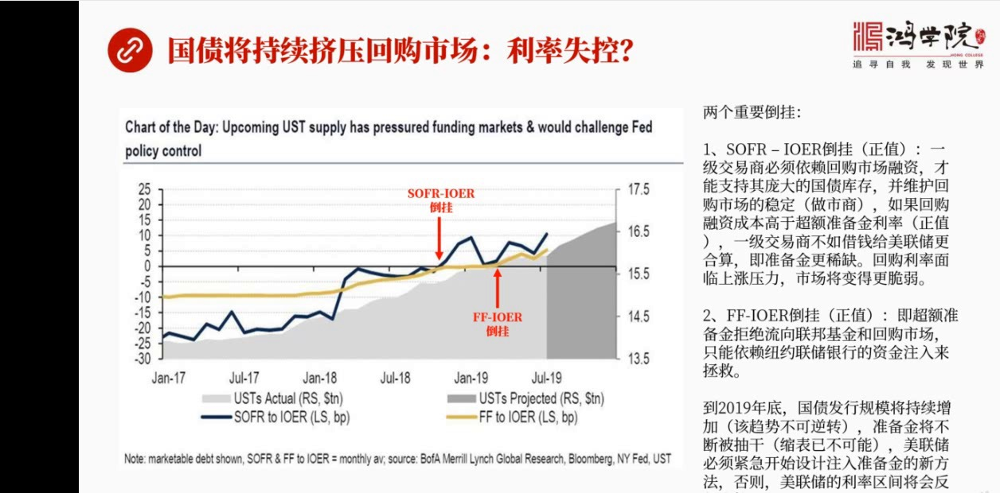

就是现在我们已经理解了九月份出现问题的关键是准备金不够了不要看有点似万亿仍然不够那么再往后看看年底情况会如何呢我觉得这张图左边这张图非常直观形象了把几种关系表达得非常清楚这种关系什么首先灰色的这个灰色...

<strong>All subtitles</strong>

> 就是现在我们已经理解了九月份出现问题的关键是准备金不够了不要看有点似万亿仍然不够那么再往后看看年底情况会如何呢我觉得这张图左边这张图非常直观
> 形象了把几种关系表达得非常清楚这种关系什么首先灰色的这个灰色的部分代表着国债的增加的速度和规模我们可以看到从七月份依照年底这个增加量是持续不
> 断往上涨了从年初年初这个这个十五收点五万亿美元会涨的年底的超过是六点七万亿美元也就是今年会上涨这个一点二万亿美元那么在七月份之后上涨幅度仍然
> 非常明显其实在这条上升的爬坡曲线上我们可以看到另外两条曲线一个是黄色的曲线一个是蓝色的曲线基本上跟它保持这同步的关系换句话说国债的发行量或者
> 国债的这种市场的存量不断的扩大跟这两条曲线有关他们有正相关的关系这两条曲线是什么呢一个就是这个黄色的曲线代表了我刚才所说的联邦基准力率减去超
> 过准备精力率如果这个只是正值在这里我画了一个画了一个就是下面这个红箭头什么是出现道挂正值它出现正值就要道挂也就是跑到上面去了变成零以上变成正
> 数了这发生在2019年4月以后看到这个黄线明显的超过了零另外一个另外一个栏线就是回够利率sofra减去超过准备精账户的这个利率这就是个栏线它
> 的反转发生的2018年发生在去年去年的这个年底所以这里两个道挂需要引起我们的高度重视第个道挂就是回够融资回够融资的成本减去超准备精利率它要出
> 现正值说明了什么背后的逻辑是什么就是一级交易商那24个交易商他们必须要依赖回够市场融资才能够支持庞大的国债库存刚才我们讲了他们库存增长很快并
> 且维护回够市场的稳定这中间两家是重要的回够的交易商是回够的做事商非常关键某个党同还有梅龙银行其他的也是一些回够市场的主要的参与者他们基本上起
> 到了维护回够市场正常运转的这样的一个功能记住他们是从回够市场上借钱然后来囤国债同时来进行做事这个回够市场的做事交易假如回够市场的利率sofr
> a的成本过高高造什么程度高 高造超过超过准备进账户利率的程度也就是倒挂了这两个数一解变成政治了那意味着你如果做一集交易商你会怎么想那我如果融
> 资成本太高而我持有这个库存代价很大或者我作为做事商维护整个回够市场我的代价和成本很高我就不愿意做这事了为啥因为我有更好的选择我还不如把这个钱
> 投到了就说我还不如把这个钱借给美联储就完了吗借给美联储他不就能够给我带来更高的利息回望吗我何必要囤这个国债我会何必要花更多的资金去维护回够市
> 场所以他就会使整个他就会使这个依交易商不愿意再去扩大这个扩大资金交易去维护这个回够市反而使这些资金留入了美联储因为美联储给的利率更高就是超纸
> 美金账户更高所以我就把钱带给了美联储我赚更多的钱赚更高的利息那么久而久之就会使这个市场回够市场变得比较脆弱而且回够利率会面临上涨的压力我们看
> 看这个倒挂的时间从2018年这个下半年意识到现在持续了很长时间我们一直没有观察到他的交易利率出现了变化直到9月份说明这个市场的积累他积累风险
> 是不断在积累高到一定程度之后再有一个倒火所移右发这个问题就爆发了那么第2个倒挂是吗第2个倒挂就是我刚刚所说的这个联邦基准利率和这个IO12的
> 这个倒挂也就是它们俩变成政治也就是说超准民众或者钱应该去追求联邦基金市场那个更高的利息因为那个利息比他高而他却流不出去他却不或者叫拒绝流向联
> 邦基金市场他为什么不从每年处账物中流出去呢那个利息比较高他自己超准民进这边更低一些最后导致的原因是眼睁睁的看着回够市场那边掌发了天然后这个联
> 邦基准利率那边也在上涨而他拒绝去赚这个钱这件事情就是每年处主席报位特别不能理解的包括他手下的这个新任的纽约联处银行的这个交易主管就是专门负责
> 这个政权交易这个主管他们俩在不久以前发表了讲话包括现在包括这个这个发生问题之后他们俩的讲话你仔细分析会发现他们没有搞明白为什么1.4万一资金
> 不流出去不流向那个市场马上把这个利率给压下来不就完了吗为什么非得一号美联处这边住入资金呢这不合情理啊这不合逻辑啊他们俩在前两天发表的讲话中都
> 没有搞清楚背后的原因那么关键是未来发展趋势我们看到下半年国债上涨了趋势仍然在上这个国债持有量会仍然上涨那么这种现象会指得整个金融体系的准备金
> 进一步伪缩到2019年年底国债发行规模向持续增加这是一个不可改变不可逆的过程因为财政赤字他已经义转不了了减税的钱已经花上去了那么准备金将不断
> 被抽干而这个时候缩标实际上已经不可能虽然就是现在我们知道缩标已经停了而现在发生这个情况缩标就更不可能了美联处现在必须要紧急的开始设计怎么把更
> 多的准备金住入到金融体系之内再不动手那可能要出大问题也就是说如果现在美联处不马上搞出一套新制有效的向整个金融体系之内住入准备金的措施那么美联
> 处对利略的控制将会失控他控制不了这个区间了将再次发现将再次发生我们这个这个9月16号以后这个星期看到的美元荒落问题好我们看当然这背后还是那个最主要的问题

---

### Slide 12

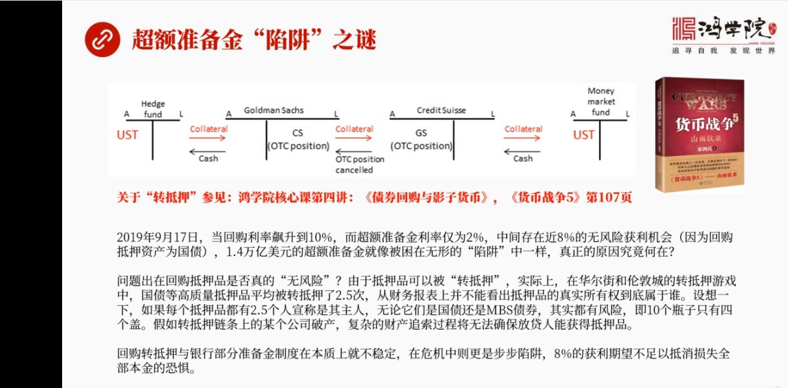

下夜我专门讲的是为什么抱这个抱位美联处主席还有纽约联处银行这个做交易的主管他们俩没有说清楚一个问题或者没有想想明白一个道理就是为什么朝准不进就像调到现金里一样不愿意出来我我个人认为看到很多很多文章之后...

<strong>All subtitles</strong>

> 下夜我专门讲的是为什么抱这个抱位美联处主席还有纽约联处银行这个做交易的主管他们俩没有说清楚一个问题或者没有想想明白一个道理就是为什么朝准不进
> 就像调到现金里一样不愿意出来我我个人认为看到很多很多文章之后我提炼出来原因就是货币战争舞第一百零七夜讲书的原因同时也是我们核心客第四奖转抵押
> 这个奖转抵押过程中讲到的债券回够预引资银行这堂课面讲到的转抵押问题也就是我们这个通过质押去融资去借钱而我们的抵押品给了别人之后比如三方交易我
> 如果把我的抵押品押给了比如说某个那通某个那通做这个中间商那么他是有可能或者我作为双面交易的时候我压给了某一个某一个人而这个人是有可能把我的抵
> 押品再一次转抵押给别人在我们这交易没有完成情况之下比如说我是这个两天三天五天的这种回够我在那压五天或者压三天结果他在这期间把我抵押的东西转抵
> 押到伦敦去了伦敦那帮人就更没有借钱了就是伦敦管他基本上就是一个想怎么干就怎么干的地方完全没有这个监管了那么在伦敦的时候这个抵押品有可能又转给
> 了下一家对重基金下家又转给了保险公司保险公司又转到最后转到香港这个抵押品可以在几天的过程中转给好多人那么到底谁拥有这个抵押品谁是他真正的主人
> 呢因为在流展过程中每个人都说我拥有他我拥有他但实际上只有一个比如说有有三个人说我拥有这个抵押品实际上只能有一个是真正的主人你不能同时出现三个
> 主人这就是导致我们看到这个超纵美金留不出去困在现金买的核心原因我们来仔细分析一下当这个9月17号的一天回够利率飙升到了10%超纵美金的利率才
> 2%中间存在这个将近8%的无风险套利机会为什么说无风险因为回够抵押的资产是国债1.4万亿美元超纵美金困在那里不愿意留出或者留不出去或者不敢留
> 出去真是的原因是什么问题就出在这个抵押品到底是不是真的没有风险呢我们如果不理解回够市场的人你是看不出来的但是我而回够这些人特别深深这个美国这
> 个华尔街的大银行这些人是完全整的明白是怎么回事的只不过他们没有公开这么去说但是通过分析我们可以找到问题的本质就是实际上在华尔街和这个伦敦城抵
> 押品的平均的转接的次数是2.5次2.5次什么概念就相当于任何一个抵押品在任何一个时刻同时有2.5个主人两个半人号称是他的主人我怎么知道到底谁
> 是真正的主人呢好这个时候我们设想一下你说无风险抵押这个国债这一张100万元的国债你说他无风险他本身是没有风险但他由于转抵押过程中被2.5个人
> 拥有如果真出了事转抵押量条长了如果出现金融危机中间有一系列公司破产了我怎么知道我如果放带给你你给我压个债券你质压给我我怎么知道我会被遭遇到官
> 司因为这个东西理论上来说是我的但是有可能还有两三个人共同说这是他们的如果给我放带这个如果我借钱给的这个公司如果他款台了倒闭了那么按理来说我应
> 该拥有这个国债我应该把它卖掉换钱进播的损失但实际上我会面临的大量法律就分甚至拿不到这个债券为什么因为别人那个追锁钱可能没我更强那个时候我将面
> 临着我会损失全部本金的代价我将颗粒无收所以特别是在金融危机的情况之下平常正常情况之下大家觉得这个也就是十个平子爽刷四个盖这个游戏还能玩得动但
> 是到了金融危机的时候每次到了金融危机盖儿就会掉你不断的去收缩自展负赛表就是每天主不断的缩表再加上国在不断的增发这就导致这个盖儿会越来越少也就
> 是准备精变的吸缺准备精变的吸缺实际上是准底所产生的必然后果准底次数越多准备精就必然更吸缺哪怕你什么条件都不做哪怕你不增发国债也不缩表当你准底
> 次数多了现金仍然是不足现金盖不了这些盖儿盖不了这些平子所以真正的毛病是处在这到了危机的时候谁也搞清楚谁会破产谁也不敢肯定我拿到了底下的这个东
> 西这个底下品是可靠的而不被别人抢走所以你告诉我有8%的投资汇报的可能性而我考虑的是我会损失全部本金的恐惧这是我的恐惧而且在金危机要爆发9月1
> 7号16号是7号18号那几天的时候眼看着这个危机要爆发我敢把债券我敢把钱借给你压你的债券吗我不敢这是为什么1.4万以爬在准备经常上他不敢动就
> 是因为他们知道这个市场中玩的都是是个平子几个盖儿这样的故事随时这个盖儿都会可能掉下来就是中间会有一系列公司破产对中基金也好或者是这个破产也好
> 一旦出现这个情况你出去的资金根本就收不后来很可能会遭遇到严重的测试所以超过准备经掉进了一个陷阱出不来本质上是由于转抵这个模式所造成下一我们把这个原理给讲清楚了

---

### Slide 13

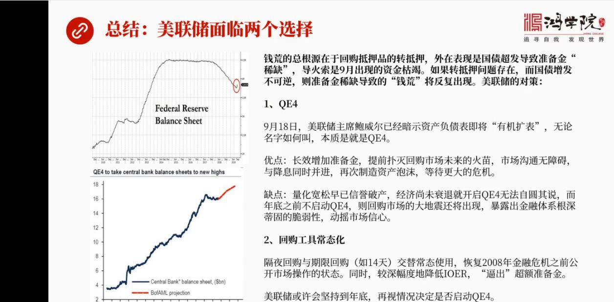

把出现钱荒的本质也说明白了我们现在做一个总结也就是说钱荒9月份爆发这个钱荒的他总的跟远在我看来是存在于回够抵押品的转抵押现象表面上体现为是国债超发导致的准备金稀缺实际上是转抵押问题转押次数月多准备金月...

<strong>All subtitles</strong>

> 把出现钱荒的本质也说明白了我们现在做一个总结也就是说钱荒9月份爆发这个钱荒的他总的跟远在我看来是存在于回够抵押品的转抵押现象表面上体现为是国
> 债超发导致的准备金稀缺实际上是转抵押问题转押次数月多准备金月稀缺准备金稀缺只是一个外在表象而到复所是9月份出现的资金库解出现资金库解的原因有
> 继续的原因有零身原因只是一个突发的一个现象导致了是一个已经严重存在着不稳定性的事出现了问题而以那么如果我们看未来假如转抵押问题始终存在而国债
> 增发是不可逆的这两条件存在的情况之下那么准备金稀缺导致钱荒这个现象就不可避免将反复出现那么每年处的对策是什么这是罗基上推导的被人结果每年处用
> 什么样的办法可以避免这个现象选择有两个第1个就是Q1寺那么其实我刚才已经提到了在9月18号说每年处主席报纬尔已经强烈的暗示了资产负债表将进行
> 有机扩表就是有机增长为什么因为金责发展所以我们这个资产负债表也应该跟着一块发展这都是废话因为他以前根本不是这么说的以前说的跟这个现在正好相反
> 一定要尽快了吧资产负债表给简先来现在又说另外一个说法那么就是蒙人其实只要你是扩表无论你叫什么名字他本上都是Q1寺这就是我们其实看到了左边走上
> 头你一看到每年处资产负债表在9月份的时候已经开始反弹了这是从2015年16年开始准备说表以来前所为有的现象第一次反弹为什么要反弹就是因为现在
> 正在救助这个市场投入了大量资金实际上是买金的很多资产导致资产负债表上升了那么如果真要搞Q1寺他的有点什么有点就是我们买靠买金输出了货币然后买
> 金的资产放在资产负债表上说是个长效增加了准备金资金出去了呆的金融体制内不会每天一进一出而是一直呆的这个金融体制内这是个长效的准备金那么如果我
> 现在提前发很多准备金出去那么将会有效的铺面未来几个月会烧起来的灰河市场的这种大火而且市场沟通也没有问题所有市场参与者他们都理解他们都明白Q1
> 怎么回事搞了玩了10年了每人都是手手了所以市场沟通是没有障碍的也就是他一旦宣布了大家很快照着以前的方式就来就完了同时再降息两者并进主要的这样
> 做的主要目的什么再次制造资产泡沫让维持资产泡沫不至于崩溃继续吹大泡沫然后做等下一次危机到来更大的危机来到反正危机总是要来的但是我可以把危机的
> 时间可以继续往后推这是他的优点他的缺点是什么他的缺点是量化宽松这个政策早就被人瞧破了可以说现在已经超大阶了庆余破产那么经济还没有摔退比如说在
> 年底之前你必须得做这个事因为他们已经现在如果说理解问题的本质缺4000亿的话为什么我们说缺4000亿就是只有加上4000亿才能回到这两个力量
> 这两个力量不到挂的情况你需要4000亿的资金这就是我们一开始说缺口怎么算出来就这么算出来的那么如果说如果说你现在还没有到年底你就着急忙慌要启
> 动qe4为什么要着急忙慌因为不启动恐怕真的来不及了还会出更大的问题那么你怎么资源起说呢你今天还没有说退你就说我现在再次要搞一个已经冲明到中了
> 两个月中我怎么能够向市场解释怎么能向政府去交代呢这就是它困难的地方但是如果在年底这些不启动回够市场有可能再次出现大地震这将暴露出金融危机它一
> 个本来的仇恶面目或者叫金融体系根深地固的一个结构性的缺陷这将会动药市场信息所以这是它的缺点两款总好但是对他们来说挺好但是这个问题启动起来它的
> 缺点也很明显那么还有一个办法是什么就是回够工具的常态化什么叫回够工具常态化呢现在我们看到每年就拯救了错误有两个第一个是隔夜隔夜回够就是零万年
> 以前那套现在就开始了再次启动隔夜正回够它就是放出资金嘛那么这是一种方式第二天还要收回来那么他们现在搞的第二种方式就是启键回够14天我一次放出
> 14天14天之后再收回来这两种方式交替使用然后把它作为一个常态的工具要建立一套机制来把它常态化那就变成了二零零万年以前公开市场操作他们那个基
> 本的工作状态同时我们看到在星期三就是18号的时候报备还是专门说了一句它调酱Io12就是操作比例利率调到三十个几点下来而联盟几整率率却调到二十
> 五个几点目的合在其实在我看来它的目的很简单就是我如果把这个联盟几整率率继续往下调而且调整幅度较深那你们待在这就没意思了吧它的思路是我压低之后
> 你们一看哦外面那个联盟几整联盟几斤那个利率更高而我现在变得更低那我待着就没有意思了增加我这个逃离超多准备经济账户这样一个动力当然在我看来这个
> 这招恐怕不是很好使因为真正的问题的本质不在那差几个几点上真正的问题的本质是在于如果出现了资金就是如果出现了这个金融市极端不稳定有可能爆发危机
> 情况之下人家担心的是本金会不会全部丢光转抵压这种现象存在导致我借钱给别人我压的这个债券有可能根本就不是最后不是我的被别人抢走了这是真正的问题
> 所以如果是真正出现的事上动到这招是不好使的当然你要说在正常情况之下一切恢复正常了能不能这个又是这个超准备已经账货的资金出来呢这倒是可以观察有
> 待观察那么还有可能我就出现的每天储面临这两个选择两个选择还有可能他会采取结合的方式就是我先用回够工具零食周转一下就是通过到10月10号之前每
> 天住住入750亿美元我先把这个市场稳住然后我再看比如说快到年底的时候如果市场条件允许大家这个互生很强烈或者是出现了出现经济摔退这种情况我那时
> 候再是情况决定是不是要正式启动Q14或者给他按一个什么其他的名字其实在我看来名字不重要实际就是扩大资产负赛表只有这条路才能才能够挽救回够市场
> 和整个货币市场体系不至于不至于再次发生前荒或者更严重了就是发生崩盘这一次出现的只是一个一个小的一个震荡下次出现的或者未来由于国债量越来越大你
> 这个这个准备金这种期确论体会越来越严重这是个必然发生了体而大量转抵压了这种现象仍然存在这几个条件放在这所以再次出现这种回够利率完全失控整个这
> 个货币长出现严重危机的情况是完全可以预期的只能采取扩大资产负赛表放更多准备金提前面货或者是回够工具常态化能够临时面货或者是两者就在一起没有其
> 他出路但是即便是这样难道危机可以永远的推迟吗这就是一个给同学们留下了一个客厚的问题好今天我们这个主要内容先讲的这现在推荐这个月毒独

---

### Slide 14

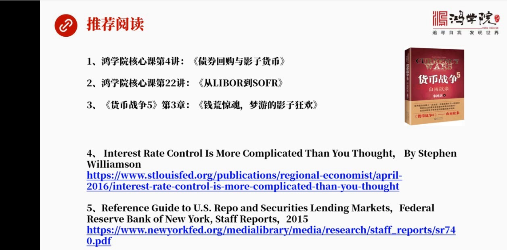

去看一下也有三个我们的课程一个是核心课第四讲债券回够与影子货币希望大家有机会看一下要把整个事情搞明白彻底理解债券回够和影子货币是必须的第2个就是推荐大家参考一下核心课第22讲从Liberary率到So...

<strong>All subtitles</strong>

> 去看一下也有三个我们的课程一个是核心课第四讲债券回够与影子货币希望大家有机会看一下要把整个事情搞明白彻底理解债券回够和影子货币是必须的第2个
> 就是推荐大家参考一下核心课第22讲从Liberary率到Sophia这个讲的是回够融资成本这个新的利率是怎么形成的第3但是就是货币战争5第3
> 张第3张讲了就是前荒金魂梦游的影子狂欢这个专门是讲了影子货币和债券回够创造影子货币的他的一些理论和一些更系统的东西除此之外再给大家推荐两篇英
> 文的文章我觉得毒了东西算了很多但是这两个东西我觉得企业都是非常好就是能够提供企业领抓住问题的本质一篇是美联储的一个人写的这个控制利率难度比你
> 想象要大就是要更复杂这篇文章主要是分析他这个顶部利率底部利率和中间利率他是怎么形成的他探讨了非常的细致逻辑很清晰把美联储当时是考虑的所有的方
> 面他都就是所有的这种考虑的逻辑都讲了很透还有一篇也是美联储的美联储扭远银行的相当于内部的工作报告这篇文章讲的是美国的回够市场还有这个正确的这
> 个这个相当于出界的业务这两个市场之间的这种关系这篇文章他最大的特点这不是一篇文章实际上是一本相当于一本书了他最大的特点是他把美国的这个回够市
> 场的他的形成他的参与者他的逻辑关系他的运作中间的诸多细节介绍了非常地相近当然也是相当的权威因为他来自于美联储扭远银行所以如果我们要真的想深入
> 了解回够市场他的具体运作的方式和他一些一些更重要的一些细节问题更多的细节问题可以参照这本电子书我把他们的这个网址都累在了旁边大家点击即可进入好今天我们这刻就上到这里谢谢大家

---

### Slide 15

祝大家生活愉快

<strong>All subtitles</strong>

> 祝大家生活愉快

---
