# 核心课视频-47&48讲：东方文艺复兴（一）文明腔体（视频） — Detail Slide Notes

> **来源**：鸿学院核心课程  
> **幻灯片**：25 张

---

### Slide 1

這一堂課也是我們東方文藝復興系列課程的第一部分我稱之為是文明的槍體我們先看第一頁在這堂課裏,這實際上相當一篇總論

<strong>All subtitles</strong>

> 這一堂課也是我們東方文藝復興系列課程的第一部分我稱之為是文明的槍體我們先看第一頁在這堂課裏,這實際上相當一篇總論

---

### Slide 2

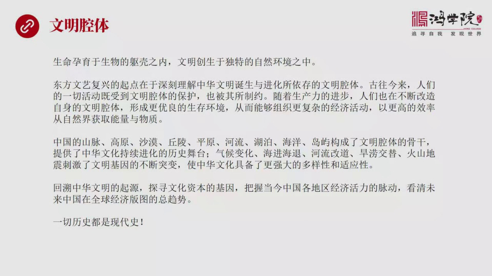

也就是從生物學的這樣的一種理論框架中借用了關於一種槍體把這個概念進過來用於理解系統性的分析中國這種文化,它的韻御、它的誕生、它的進化那是它未來的發展趨勢在生物學中,我們都叫槍體的作用是使生命能夠韻御其...

<strong>All subtitles</strong>

> 也就是從生物學的這樣的一種理論框架中借用了關於一種槍體把這個概念進過來用於理解系統性的分析中國這種文化,它的韻御、
> 它的誕生、它的進化那是它未來的發展趨勢在生物學中,我們都叫槍體的作用是使生命能夠韻御其中那麼文明它也是一種生命體那麼文明的狀況生,它也需要非
> 常獨特的自然環境那麼這種自然環境的全部,我們可以稱之為是一種文明它的生存、發展、進化所需要的槍體在我看來,我們進行東方文藝復興系列課程的它的
> 一個主要目的,就是為了深刻理解我們必須要做到真正的還原還原什麼呢?還原中華文明在起源的那個最初狀態它自然所包含的一些文化基因還有它在不斷進化
> 過程之中所遭遇到了諸多的困難、挑戰那麼這一切都是發生在一個獨特的文明槍體之內那麼這種文明它這生命力,就在於它能夠不斷的克服不斷的調整、
> 不斷的適應、新的環境、新的挑戰所以我們真正就是作為後人而言吧真正的挑戰,在於我們能不能做到真實還原就是把我們倒退回去之後能不能真實地看到當時
> 中華民族的先人他們所碰到了真實的困難、客觀的現實我覺得是還原歷史最大的一個挑戰那麼這種槍體、
> 這種文明的槍體就像生物槍一樣它寄起到了保護這個幼小生命的作用其實這個生命本身的發展也受到它的制約文明也一樣,就是在一個獨特的環境中成長受到了
> 保護、受到槍體保護但是同時你也會受到它的制約不過在不斷的發展過程中生命越來越強大一種文明越來越複雜它也具有著強大的能力來改造自身的槍體然後它
> 會形成一種更高水平的追求一種更高水平的一種生存環境用這種更優越生存環境所帶來的能力來組織更複雜的各種社會行為比如說經濟活動、
> 政治活動它的總的目的是為了以更高的效率來從自然界中獲得更大的能源和物質這樣的一種進步那麼我們從文明的槍體這樣的概念中可以引申出一系列重要的要
> 素比如說中國的山脈、高原、沙漠、秋林、平原、河流、胡破、海洋和島嶼這都是構成中國這個文明的生命體它所运遇的這種槍體的一些主要的組成部分那我們
> 可以稱之為是古幹那麼也正是在這個槍體之內中華文明生生不稀不斷地發展它相當一種歷史舞台同時在這個槍體的內部和外部還存在著大量的變量存在著一些波
> 動和擾動因素比如說氣候的變化還有立上出現的海晉和海退由於冰河漆的影響還有在內部出現的比如說黃河改道還有各種各樣的水漢自然災害交替出現火山地震
> 然後銀河的這種銀沙的這種預計導致新的大陸的出現導致胡破、變成了潛攤、變成了耕地等等這些內外因素是一種變量它從內部和外部不斷地再給這個文明的槍
> 體提出新的挑戰所以我們需要理解這種變量可以把它作為一種文明機能突變的因素來加以考慮也正是中華文明在這個過程之中不斷地驚受了各種各樣的挑戰每驚
> 受一種挑戰你就獲得了一種新的技能獲得了一種新的能力實際上這種能力和技能的獲得是你在未來發展中具有著更強的文化具有更強的多樣性和更廣泛的選擇性
> 是硬性所以這種文明才能夠生生不惜的發展那麼我們這個系列的課程實際上是要回溯到中華文明的起源也就是追蹤它的起源從起源開始才能夠把很多總的規律特
> 別是類似有文化基因的東西才能提升了出來然後我們還要接著去尋找中華這個文明中其實它是有各個不同的地區所組成的那麼每個地區的獨特的這種文化的基因
> 是什麼概括起來我們要提煉出來中國文化的一種資本文化資本的它的重要的基因我們需要文化資本的概念來解釋為什麼當今中國在不同的地區我們會看到不同的
> 這種經濟活力有些地區甚至就革一條江一條河有些甚至在同樣一個沒有河流沒有山川阻擋情況之下就是革了一條比如說一條馬路兩省交界處但是會產生完全不同
> 的就是自然條件正在條件完全相當的情況下會產生完全不同的經濟活力這個是我們需要從源頭上去理解的也就是我們需要去真正理解為什麼中國的每個地區它的
> 經濟發展的動能潛力和活力會有這麼大的差異這樣才能說我們更好的看清楚中國整個的經濟形勢的發展社會形勢的發展文化和政治趨勢的發展最後能夠幫我們看
> 清中國這樣一個大國在未來全球的經濟版圖它中間所處的是什麼樣的一種位置未來發展變化的趨勢究竟是什麼我們研究了一切的目的不是為了紙上談兵或者說是
> 僅僅是業餘的愛好在我看來一切歷史都是當代史所以我們對過去所做的一切分析判斷只要你能夠真實的還原到當時發生的情況那麼你所能夠理解所能夠採取的所
> 能夠理解那些人所採取的各種各樣的英類措施其實對今天就是有階段意義的所以我們的研究是為了當今的理解當今的經濟形勢來提供一種有效的幫助好我們看下一頁首先第一個部分由於我們這堂課是總論

---

### Slide 3

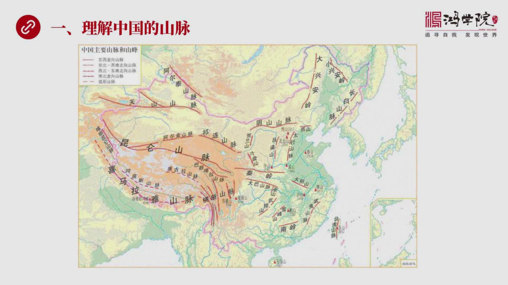

所以我把總論提煉成幾個重要的要素其他的刺激的要素我們會在未來的分去研究的這種課程中會不斷往裡融入首先我覺得理解中國的它整個這個國家的歷史文化最重要的起點是什麼要理解中國的山脈所以我們看這張圖上大家可以...

<strong>All subtitles</strong>

> 所以我把總論提煉成幾個重要的要素其他的刺激的要素我們會在未來的分去研究的這種課程中會不斷往裡融入首先我覺得理解中國的它整個這個國家的歷史文化
> 最重要的起點是什麼要理解中國的山脈所以我們看這張圖上大家可以看到這是我們中學或者小學地理課本上都會有類似的中國的地形圖在地形圖上標註著中國的
> 主要山脈合流還有海洋等等基本信息那麼如果作為一個學過中國地理的人瞭解中國地理的人你從這張圖上可以看到中國主要的一些大的山脈中間有很多山脈是東
> 西走向也有不少山脈是南北走向還有一些山脈是偏東北和西南在地質學上我們可以說叫北東他們的主要原因就是我以北作為一個主要的直北針然後我被往東偏多
> 少度比如說北東就是加45度角北北東就是加22.5度等等所以呢我們在這裡會用一種通俗的語言來介紹這些山脈的一些走勢關鍵論計是你從這個山脈的走勢
> 中各種形狀和各種方向的走勢中能夠看到什麼樣的一些基本規律呢當然我們很多人都已經有了一些基本概念但是我們如果把這張圖再進一步的放大你會看到一些
> 獨特的在局部的地區所出現的一些有意思的規律我們看下一頁比如說這張圖就是中國東南部

---

### Slide 4

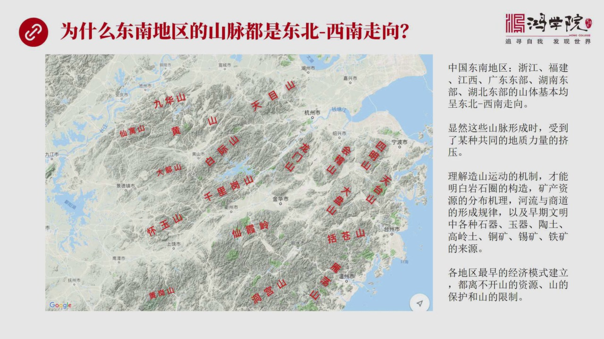

哲江和一部分這個敏南福建地區它的山脈的基本走勢我覺得大家從這張圖上恐怕很容易能看出來這些山脈都有一個基本的共同規律也就是他們都是東北和西南走向就是北偏東有些偏的多一些有一點少一些但是基本走勢是這樣的一...

<strong>All subtitles</strong>

> 哲江和一部分這個敏南福建地區它的山脈的基本走勢我覺得大家從這張圖上恐怕很容易能看出來這些山脈都有一個基本的共同規律也就是他們都是東北和西南走
> 向就是北偏東有些偏的多一些有一點少一些但是基本走勢是這樣的一個共同規律其實不光是哲江地區的山脈我是用哲江地區的山脈的代表其實你如果仔細看福建
> 地區的山脈江西廣東的東部湖南的東部湖北的東部他們各種山脈這個山體的基本走向基本上都是同樣的走向我們很容易發現這麼多山脈它這山體走向成這個方向
> 說明了什麼很顯然我們可以感覺到有一種大的地質性的力量在擠壓這些山脈讓他們形成了類似的這樣的一種共同的方向性的規律為什麼我們要理解這種造山運動
> 的機制呢這是屬於地質學的研究範圍完全不屬於經濟我們在紅穴中反覆強調要跨文化要跨學科還有跨思維一個主要目的就是當你要研究一個具體問題的時候要研
> 究經濟學發展了一些規律的時候一個地區的經濟發展其實是沒有專業界線的一切領域只要對研究你的這個問題能夠有所幫助都應該去研究所以我們立來提倡必須
> 要跨學科比如說我在這裡所列出這是山脈的主要原因我正在研究就是杭州灣南北兩岸它的經濟發展模式那麼你要搞清楚比如說杭州灣以南寧少平原的經濟發展那
> 麼你當然要關注寧少地區寧波少行地區它所能夠利用的自然資源有哪些那麼它的交通要到同樣也就是貿易幹線商業大通道它跟誰會發生商業聯繫它怎麼獲得原材
> 料杭州灣北岸道理也一樣看了這麼多它的經濟發展還有一些各種各樣的這種史前和歷史時代包括現代的各種經濟發展你會發現你的原材料從哪來在上古時代當然
> 就設一道一些具體的問題就是說兩種文化中玉氣是它的核心文化那麼這些玉是從哪些山上才來的是在天幕山還是從遠道經過昆倫山運過來的這就是一個非常現實
> 的問題還有你的各種桃氣製作桃圖從哪裡來這種原始詞或者包括後來的月謠所燒的各種詞氣燒靈圖這個詞圖是從哪裡來越過建立我們知道五月他們的冰氣製造都
> 非常先進那麼你的銅你的西是從哪裡來而且這些山形決定著河流的走向甚至決定著對它河的寬度還有它的流速包括河的深度這決定了通行條件比如說不過的時候
> 到底這個戰艦能不能經過前堂江經過前堂江的上游附程江新安江經過其他的之流能不能到達破洋湖這取決於它的通行條件其實從史書中我們看到有這樣的提法但
> 是能不能走通這就需要我們真正了解這種地理要了解什麼樣的山出什麼樣的食材出什麼樣的礦產必須要對地質學友所了解所以我們提上了跨學課就是當你圍繞這
> 個問題想不明白的時候你需要深入去借件了解其他學課來幫助你理解所以每個地區的最早的經濟模式建立實際上是墊墊了從經濟文化最核心的基因這都是需要我
> 們重點關注的其實要把這個問題搞清楚你就離不開對山的理解對造山運動的理解因為山提供了資源也提供了保護同時山也是一種限制這就是我們說的文明槍體中
> 最核心的這些幾個要素好既然它有共同的規律那麼這個共同的規律是什麼呢我們看下一頁其實在地質學上對於造山運動

---

### Slide 5

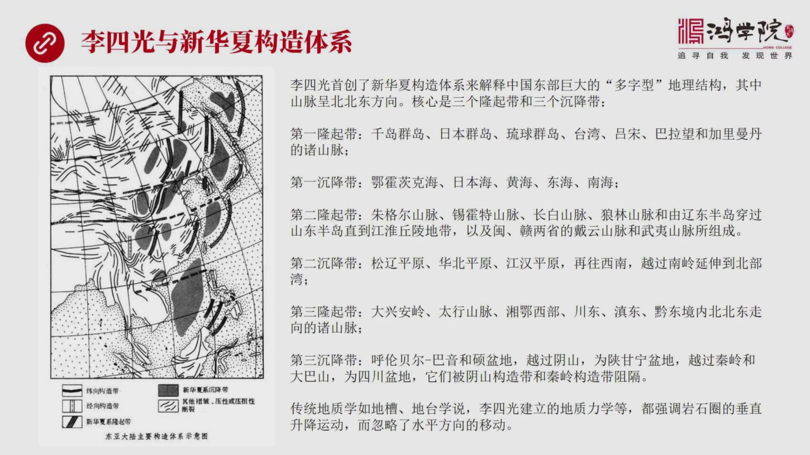

有好幾個學派或者從歷史發展的角度來說包括最早的地曹地台說包括李斯光提出的地質歷學包括我們後來大家都比較熟悉的板塊板塊夠糟我們先從李斯光的這個體系來看因為李斯光它能夠從中國很複雜的山形中應該說是它有強大...

<strong>All subtitles</strong>

> 有好幾個學派或者從歷史發展的角度來說包括最早的地曹地台說包括李斯光提出的地質歷學包括我們後來大家都比較熟悉的板塊板塊夠糟我們先從李斯光的這個
> 體系來看因為李斯光它能夠從中國很複雜的山形中應該說是它有強大的模式識別能力從這麼多樣化和比較複雜的盆地這種山脈中找到了中間或者說抓取出來了一
> 些非常重要的特徵這種重要的特徵它把它組織成了新華夏構造體系這樣的一種理論那麼它的核心是什麼它的核心就是如果我們看中國就是整個東亞地區的地形它
> 認為這是一個巨大的多字形其中核心是有三個龍啟帶還有三個乘降帶你比如說第一個龍啟帶就是從日本群島從日本的群島包括更上面的青島群島到琉球還到台灣
> 旅走巴拉望和家裡曼丹的各條山脈基本上都是屬於一個系列的這是叫第一龍啟帶第二個就是什麼呢僅跟著它往西走就是第一個乘降帶包括什麼呢包括比如說俄羅
> 斯克海日本海黃海東海和南海這就是我們途中用黑色陰影飆住出來這些地區就是第一個龍啟區往西就是第一個乘降區那麼這個乘降帶再往西就是什麼呢是第二龍
> 啟區第二龍啟帶包括什麼呢就是北面的最北邊從周各山脈開始還有喜霍特山脈長白山脈郎林山脈這是在韓國還有就是在朝鮮半島還有遼東半島也有一些山脈跨越
> 了博海之後進入山東半島了一些秋林還有江湖來秋林地帶這是一第二個龍啟帶那麼再往南就到了就是這個福建和江西兩省的一些山脈像大雲山脈和五一山脈如果
> 你從地形圖上一看這個規律確實是一眼就能變人出來那麼在它的西邊就是第二城將帶包括北邊的松遼平原華北平原江汗平原再往南呢就是越過南領之後延伸到了
> 北部灣這是第二城將帶那麼再往西就是第三龍啟帶第三龍啟帶包括大鮮安領然後泰航山鮮樂就是胡南湖北西部的山脈還有川東的山脈還有丁東前東這些境內凡是
> 這種北北都北北東走向也就是一北圍主向東偏20度左右這種系列的山脈都是屬於這個第三龍啟帶那麼第三龍啟帶如果我們再往西就是第三城將帶這就從胡倫貝
> 爾把銀河塑盆地開始然後向南越過了陰山到達了閃乾寧盆地然後經過秦嶺和大巴山進入了四川盆地這幾個盆地之間雖然他們中間被陰山被秦嶺所階段但是它總的
> 規律還是能呈現出來的被階段的主要原因是因為它受到了這兩條山西造山運動的影響那麼這一套它所提出的這套三個城將帶和三個龍啟帶我覺得從地主讓看看完
> 之後確實是你你能發現它很有說服力因為按著地質力學它所建立這套學說來看的話那麼龍啟的地方必有礦產城將的地方必有油田其實它也是根據這樣一個大的原
> 則找到了大清油田找到了注入像四川潘之花的鋼鐵還有很多鐵礦還有很多這種礦產都是用類似的思路找到的儘管地質力學這個學說它現在已經不再是主流但是它
> 對於中國地形的這種認識來說我覺得具有相當強大的這種直覺力是至少我看了它這套理論再去對比其他的解釋中國造山運動我就它這套理論從解釋地形解釋山脈
> 的角段說是相當有說服力的那麼傳統地質學包括地質力學在那樣它強調的都是一種山體的垂直運動也就是山體和平原要麼你台生要麼成這樣它是一個垂直方向的
> 運動那麼在傳統的地質學中也包括地質力學他們的腦子裡面其實並沒有一種水平方向山體能進行水平方向運動的概念它覺得水平方向的運動如果不施不可能至少
> 也是不重要的只是一種垂直產生了一種分裂而已為什麼他們會產生這樣一種概念呢主要是當時大家理解山體或者你說一個大的平原它底下有延失圈這個延失圈在
> 人們的印象中是一種非常堅硬的東西是不能夠柔軟把它這個彎來彎去更不可能發生飄流所以如果出現的造成運動那肯定是垂直方向要麼往上台生要麼向下成這樣
> 其他方向的力沒有什麼值得考慮的這樣的可能性這就是傳統地質學一個很大的一個局限就是因為他們的大腦或者他們的世界觀被局限在了一個比較窄的領域所以
> 後來我們都知道出現了更強大的板塊血說這就是下一頁那麼板塊血說最早提出跟造山運動

---

### Slide 6

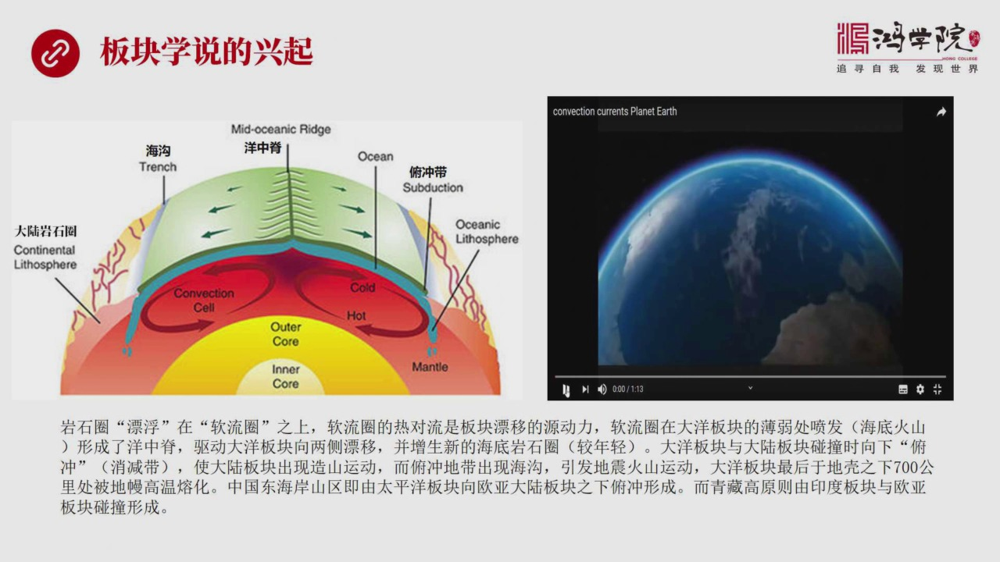

並沒有什麼太大關係它主要是為了解釋為了解釋為什麼南美洲的生物和大廂對岸的這個非洲這邊這麼像啊這兩個地方分的這麼開而且它的地形也非常的類似就像其他把可以拼在一起一樣所以它首先提出大陸是漂移的當然這個一開...

<strong>All subtitles</strong>

> 並沒有什麼太大關係它主要是為了解釋為了解釋為什麼南美洲的生物和大廂對岸的這個非洲這邊這麼像啊這兩個地方分的這麼開而且它的地形也非常的類似就像
> 其他把可以拼在一起一樣所以它首先提出大陸是漂移的當然這個一開始是不可能為大家接受的就是地質學長腦子們都認為板塊或者說大地它這個地殼中間的延似
> 層是僵硬的是不能動的當然後來我們發現在比如說在五年代以後美國的地區家在大洋的在海洋的中心發現了海底的這種所謂洋中級這樣的一個現象說明這種地海
> 洋底部的這些延似層延似圈是真正可以移動的當然這就構成了第二個學說就是海底它是可以不斷生成新的它是不斷在擴張的這個延似圈子不斷擴張有了這麼一個
> 概念當然把這兩個概念這個在一起就是板塊學說成了一種新的強大的有舒服力的學說這個學說就是我們圖中所看到做圖所看到的推動板塊運動首先傳統的地學中
> 對於延似圈的概念是錯的它不是硬的它是一種可以飄移的就是它本身在底下有一個所謂的軟流層延似圈是漂浮在軟流層之上的你只要理解這點立刻實際上就實現
> 了一個認識上了一種突破或者說我們稱之為是腦洞大開原來我們沒有意識到其實地河這個延似層這一圈還非常的薄底下地球內部有大量的軟流軟流層包括地漫然
> 後是中心的地河高 溫度更高由於地漫這個部分還有包括它上步的軟流層溫度非常高它成一種可以融化的融融狀態它是一種業態或者叫年仇的這種業態所以它一
> 定在高溫之下會發生對流對流圖就像我們圖中所展現的這樣對流都是成一個所謂小方格的方式或者小圓圈的方式在新對流就像我們燒水一樣燒到一定程度之後這
> 些水分子就在以一種圓形的這樣的一種方格就是要六邊形的這種格子開始運動來進行熱對流所有液體對流都會呈現類似的這樣的一種方式所以大地中間這種地漫
> 這種高溫高熱的半液體的這樣的東西當然它要傳遞熱量靠近中心部分熱在上面比較涼所以它會形成熱的踢渡叉自然會形成對流那麼這種對流在大洋的某些海洋底
> 部這些板塊非常薄的地方岩石層非常薄的地方首先容易被擊破擊破就會在海底出現火山噴發形成洋中級就是大洋中間的噴發出來然後被冷卻火山噴發出來然後岩
> 石被冷卻形成的海底的一串的就像山級一樣的這樣的一種海底地形所以由於這個理論也就是底下的軟流圈子在運動它們產生了巨大的擴張海底板塊的一種力量那
> 麼這種力量通過洋中級的形成海底火山爆發那麼會把這些海底的延誌向兩側推當兩側這種運動到了比如說陸地板塊邊緣的時候就會發生碰撞這種碰撞成一種腐衝
> 也就是海洋板塊往下往大陸板塊的下面再下去由於它比較低同時密度比較大那麼再下去之後我們會看到這張圖上你會看到它大概掉落到700公里這麼深的時候
> 就被高熱的地漫所融化所以大陸這個延誌圈這個海洋底不是這個延誌圈所構成的這種地殼它就被融化掉了所以它又叫小簡單就是腐衝帶和小簡單那麼在另外一邊
> 就是在大陸板塊這一次它就會還起攻起來形成造山運動所以在這個過程中就會有火山奔發地質的不穩定等等因素的爆發所以我們如果看全世界的火山爆發這些熱
> 點圖你會看到基本上就在環太平洋延誤很多地方都是屬於地震火山的平凡爆發的地區那麼在另外一個作用之下就是它往底下腐衝的時候海洋板塊往底下腐衝的時
> 候又會形成巨大的海溝就像我們看到了太平洋板塊和亞洲板塊碰撞了邊緣部分出現了馬利亞拉海溝等等事實上最深的海溝1萬1千米那麼都是板塊卻說解釋起來
> 得心應手的所以我們看到如果我們理解中國東部的山脈你會發現原來那是太平洋板塊海底板塊碰到了亞洲大陸板塊之後產生了腐衝腐衝當然一方面是形成了巨大
> 的海溝一方面在中國野沿海那部分形成了跟這個太平洋板塊碰撞這個方向像平行的一系列山脈這就是我們看到了為什麼中國的東南地區它的山脈的走勢成這樣的
> 一個這樣的一種平津線的方向來進行分布那麼青藏高原是另外一個例子青藏高原相當於印度印度板塊衝過來撞上了歐亞板塊然後印度板塊進行腐衝然後使得青藏
> 高原濃起所以用板塊學說是可以解釋相當多的我們所看到的一些山體構造的一些基本的基本的這些大家可能會有疑惑的地方那麼我們在這裡如果看一下這個路向
> 這個路向把我們剛才所說的這個理論進行了更形象更容易理解的一種描述大家看這是軟流圈所形成的對流那麼從上到下然後從中部的海洋底部形成噴發然後這種力量帶動板塊向兩側印動最後形成了大陸飄移

---

### Slide 7

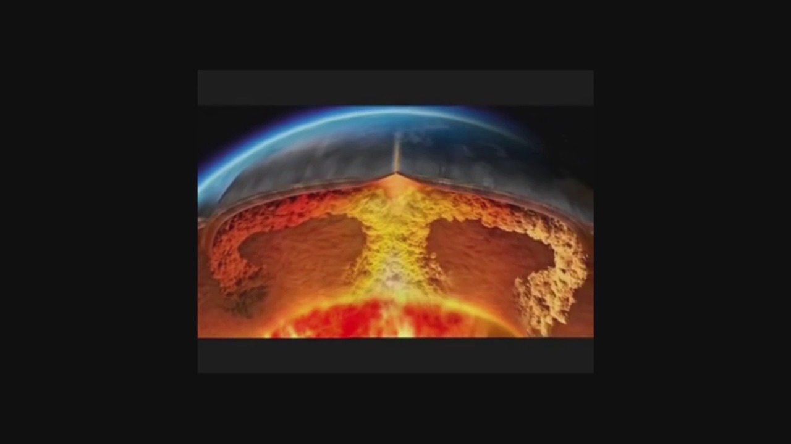

形成了我們看到的各種各樣的大陸板塊那麼這個這部分在講述腐衝向地下腐衝海洋板塊在向大陸板塊地下腐衝那麼它伸到了700公里的時候

<strong>All subtitles</strong>

> 形成了我們看到的各種各樣的大陸板塊那麼這個這部分在講述腐衝向地下腐衝海洋板塊在向大陸板塊地下腐衝那麼它伸到了700公里的時候

---

### Slide 8

就會被融化掉當然同時會產生大量的熱量然後這些高溫高壓的東西又通過海底的某一些局部就是洋翹的這個厚度比較薄的一方噴發出來形成一系列的海底火山好如果我們看下一頁板塊學說呢

<strong>All subtitles</strong>

> 就會被融化掉當然同時會產生大量的熱量然後這些高溫高壓的東西又通過海底的某一些局部就是洋翹的這個厚度比較薄的一方噴發出來形成一系列的海底火山好如果我們看下一頁板塊學說呢

---

### Slide 9

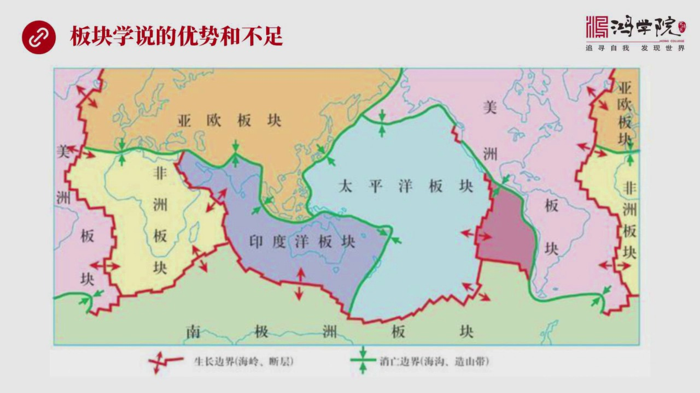

當然它的優勢就是它的解釋力非常強特別是你在理解了軟流圈這個概念之後你會發現這種陸地的板塊這些延時圈所形成的這板塊不過就像傳送彈上被傳送的一個物件一樣只要海底的這個對流活動立漫層的這個對流活動在進行那麼...

<strong>All subtitles</strong>

> 當然它的優勢就是它的解釋力非常強特別是你在理解了軟流圈這個概念之後你會發現這種陸地的板塊這些延時圈所形成的這板塊不過就像傳送彈上被傳送的一個
> 物件一樣只要海底的這個對流活動立漫層的這個對流活動在進行那麼總是有一種強大力量可以把這個東西推走了所以這樣來理解大陸飄移然後就覺得腦腦打開就
> 是這套理論特別的有說福利那麼當今的板塊理論把世界分成了6大板塊我們可以看到像台平板塊在撞上腰板塊的時候在這些區域裡面形成了碰撞這就是我們看到
> 的從日本一直到台灣還有包括菲律賓和這個印度凝下了一些地區那麼在這些板塊的碰撞之下就會形成中國東部是包括東北部的很多造山運動所以用板塊學說對於
> 中國東部的一些造山特別山脈的走勢是具有一定說福利的那麼青藏高原來崛起我們也可以從印度板塊撞上腰板塊來解釋也非常有道理不過板塊學說並不是包打天
> 下的它仍然有一些非常明顯的不足因為用板塊學說來理解那就是我板塊碰撞之後我要把腐衝腐衝下去之後我這個東西就被融化掉了700公里之後就被融化掉了
> 所以這些板塊不斷的消失既然這樣的話那麼也就只有在碰撞的那個碰撞的那條線上也就是在板塊相撞的那一系列的接著面上會有比較明顯的造山運動會有強烈的
> 水平方向運動注意他們提出的地質力學和傳統地曹地台學他們沒有想到的一個強大的水平方向的力量傳統地質的強調是垂直方向的力量認為也是確實剛性的不能
> 夠水平移動那麼板塊學說補足了這點就是水平的力量也有而且它過它非常強調水平方向的力量但是這套學說帶來另外一個它的短板什麼的就是既然只在邊緣存在
> 的這種距離的這種地質運動造山運動板塊的其他部分特別是板塊的中心部分像中國你除了靠近東海大陸架兩個板塊碰撞這個地方其他地方應該沒有山了對吧因為
> 其他地方並不是板塊碰撞了地方那個地方為什麼會出現造山呢為什麼會有垂直方向的嚴實的也是圈的起和落呢注意這個是板塊理論最大的短板他們認為只有在邊
> 界部分板塊邊界部分會有強大的造山運動而在板塊的非邊緣部分中心部分遠離這個邊界部分你用板塊來理解就不好解釋了因為補充下去的板塊它已經很快就被消
> 化掉了被融化掉了那是什麼力量在板塊的中心拖起了這個岩石圈向上濃起這個力量是什麼力量從哪裡來呢板塊去說解決不了這個問題也就是我們看傳統地質學它
> 的強項是解決垂直方向的力從地質力學方向去理解從物理的這樣的一種機界運動的角度去理解我們都有直觀的非常容易理解的地方那麼板塊學說帶來了水平方向
> 運動的這種力我們現在也可以理解這是地蔓運動造成的對流造成的但是板塊中心的或者板塊非邊緣地區的造山運動它這個力量是從哪裡來的這就必須需要新的理論好我們看下一頁新的理論呢就是現在

---

### Slide 10

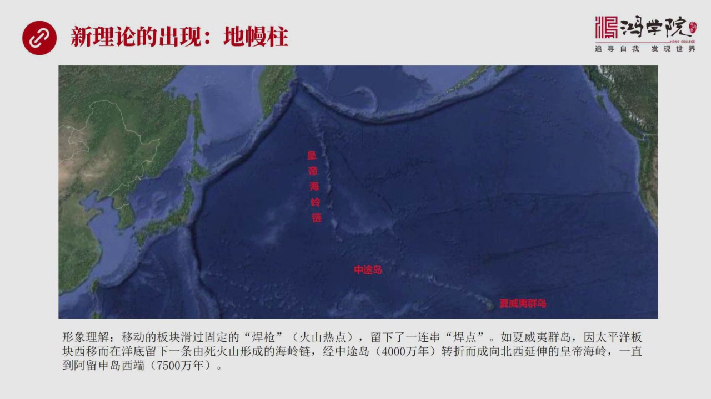

當然現在還沒有成為主流但是我覺得它的解釋力還是相當強了這種理論就叫地蔓住在地質學中間它也是一個比較新的在板塊之後興起的應該說21世紀之後它現在關注人越來越多到目前為止可能還不是真正的就是具有強大說服力...

<strong>All subtitles</strong>

> 當然現在還沒有成為主流但是我覺得它的解釋力還是相當強了這種理論就叫地蔓住在地質學中間它也是一個比較新的在板塊之後興起的應該說21世紀之後它現
> 在關注人越來越多到目前為止可能還不是真正的就是具有強大說服力的也有很多人不信但是我覺得它具有板塊學說那樣高的就是讓你一聽就覺得這個理論的思維
> 邏輯是正確的就會有這麼一種感覺什麼是地蔓住我們看一下太平洋這張地圖是一張太平洋的海底地圖你會看到夏威夷群島是在這個圖的下部分然後你會發現在太
> 平洋中心夏威夷群島的西側有一系列從夏威夷到中途島再從東途島到黃地海岭有一系列的海底海底的所謂的海岭海底的山岭而且形成了一個鍊在中途島這個地帶
> 進行了轉彎那這什麼意思呢有很多人就提出六十年代就有一些地址下提出說這恐怕就是有一種火山噴發這個點這個熱點滑過運動的板塊所移留下來的痕跡在這裡
> 我形象來解釋一下其實我們可以把太平洋板塊當成一個可以移動的鋼板那麼夏威夷火山這個底下它現在仍然是屬於帶有活性的這種火山它就好比一種漢槍高溫的
> 漢槍火山熱點地區所以它在這個地方燒燒燒它有可能會帶來火山噴發那麼隨意這板塊的移動這就好像這個漢槍固定在某個地方那是板子在運動所以我們看到了從
> 夏威夷群島直到中途島直到這個皇帝的海領鏈它實際上是由於固定的大洋深處在夏威夷那個位置上由於把固定的漢槍再往上噴發巨大的熱量太平洋整個的板塊相
> 當於一個鋼板從西像從東向西緩慢的移動然後當然運動方向會發生變化然後這個漢槍在這鋼板上留下了一系列的焊點那麼這就有意思了因為它這個留下的痕跡是
> 有規律的比如說夏威夷群島這是一個火火山火火山有可能再度爆發中途島就是一個死火山中途島的時間它的年齡大概是4000萬年而皇帝領皇帝這個皇帝領這
> 一系列死火山還得死火山拒金是7500萬年所以你會發現離火離這個噴射點焊槍點越遠的地方在這個鏈上它的年齡越早這就再次說明了這個東西是有規律的確
> 確實實可能存在一把海底的漢槍這就是帝曼駐學說的一個重要的啟發我們聽起來覺得不合邏輯但是你只要繞過這個卡你會覺得這個理論確實從這張圖上來看具有
> 強大的說服力也就是它的邏輯性非常非常的嚴謹而且它甚至可以算出大陸移動板塊海洋這個太陽板塊移動了速度所以它的直觀性和邏輯性都非常的強大背後的原理是什麼我們看下一頁背後的原理是帝曼駐

---

### Slide 11

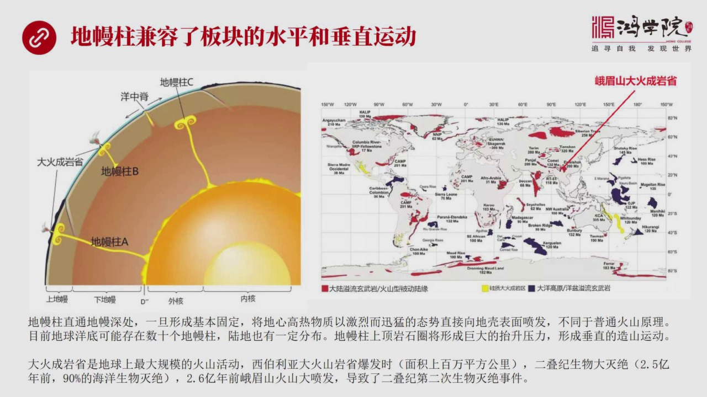

相當於從帝曼的深處甚至非常深的地方靠近帝河這些地方深處了一個非常細長的管道這個管道把帝心中間的特別高溫度的這種熱和這種熱物質通過這樣那個管道直接頂到地面然後在地球表面的最薄的地方形成大噴發這個是帝曼駐...

<strong>All subtitles</strong>

> 相當於從帝曼的深處甚至非常深的地方靠近帝河這些地方深處了一個非常細長的管道這個管道把帝心中間的特別高溫度的這種熱和這種熱物質通過這樣那個管道
> 直接頂到地面然後在地球表面的最薄的地方形成大噴發這個是帝曼駐的一個非常重要的一個它跟非常重要的一個與眾不同的一個思路也就是這種帝曼駐一旦形成
> 它並不是隨月飄移的它是基本固定的那一旦是固定下來這個地方就變成了固定的那把汗槍一直用它舉著燒燒這個地殼那當然最後可能把地殼就燒穿了然後熱物質
> 就噴發形成剛才我們看到的這個海領的鏈那麼由於它是帝曼深處相當於一個巨大熱量的猛烈碰發所以它帶來這種火山的效應跟其他地區是跟普通的小火山爆發那
> 是底下岩江或者帝曼層的溫度就是把一些熱物質向上頂岩江向上頂有些地方在一些地窖比較薄熱的地方噴出來那是一個比較淺的熱物質的噴發而它強調的是直接
> 插到帝曼這是它非常不一樣的地方那麼這種帝曼駐在全球是有很多分佈的比如說在海洋底下就有好幾十個在大陸上也有一些那麼從歷史上來看就是從帝智史上來
> 看其實這些帝曼駐留下了很多可以說很多遺跡吧你比如說這種遺跡就被稱之為是大火成岩大火成岩省省這個概念大家可以把它理解成的面積非常大的你比如說西
> 波利亞三分之一的西波利亞都是屬於大火成岩省也就是當年在那麼一個好幾百萬平方公里上這樣一個超級的廣大的火山口從地球的內部甚至接近地形的地方巨大
> 的這種噴發從接近地形帝曼的深處往上直接衝上一個好幾百萬平方公里的大火山口形成了大量的火山的這種遺跡火山活動的遺跡而這種遺跡在全世界有很多分佈
> 你比如說在中國在土壤我標誌出來這叫鵝眉山大火山岩省當然中國還有一個塔利木也有一塊現在國際上基本接受塔利木那個也是個大火成岩省這樣一個概念那麼
> 這種形成的就是我們今天可以看到可以測量的大火山岩省其實就已經很能說明問題當時這個地區的火山噴發這個規模和類似於世界末日這個非常瘋狂非常可怕的
> 景象我們現在人生無法想象的但在地球的41-41多一年的進化這個進化過程中迪迪確確出現過很多次而且每一次出現像西伯利亞這種大火山火山岩省爆發這
> 個情況一定會導致全球生物的大滅絕這就是我們看到的二聯繫生物大滅絕二點五一年前那麼在這次大滅絕中90%生物海洋生物滅絕了70%的陸地生物沒了這
> 次滅絕導致的原因因為它的時間正好是跟西伯利亞大火成岩省形成的時間一樣也就是我們非常非常可以就說可以想象到這兩者是聯繫在一起的想想看三分之一個
> 西伯利亞作為一個巨型火山口地心深處比地漫還要深的地方那種非常熱的東西從底下噴上來會形成什麼會形成大量的火山灰會形成大量的酸雨會形成大量二氧化
> 碳覆蓋整個地球而那種爆炸力和那種巨大的這種火山活動是我們現在無法想象的當然它導致地球出現大規模的生物滅絕是完全可以理解的所以這是一次還有呢就
> 是俄眉山這次爆發2.61年前俄眉山大火山的爆發這個地區也非常大四川在四川的西南廁也有一大塊現在我們還可以看到當時的這個火山運動所留下的一季而
> 這次大爆發規模雖然沒有熄波利亞那次大但是這也是個生物滅絕就是生物進化史上一個重大的滅絕事件就是二連續第二次生物滅絕事件就是四川俄眉山所形成的
> 巨星火山爆發所以地漫住這套理論它有一種強大的直覺上的合理性非常強的一種解釋性那麼它的解釋在哪呢就是為什麼板塊中心遠離邊緣地區也會出現垂直方向
> 的運動因為底下的地漫住它會產生一個巨大的向上推的這種力量可以把岩石層向上頂起來當然這個過程中有些地方就噴發出來形成形成這個火山噴發有些地方周
> 圍的很大一塊區域中間都會形成一個巨大的地理的變形毫無疑問這是可以做到的所以這套理論它其實是把兩者就把這個傳統地質學這種垂直升降激進運動的垂直
> 升降物理力的這樣的一種作用和板塊學說水平方向的這個力量推動力量可以整合在一起或者說具有相當強的包容性所以地漫地漫住這個理論現在是具有著非常我
> 覺得具有著非常強的進化的可能性好我們看下一頁那麼這都是過去的歷史了現在呢

---

### Slide 12

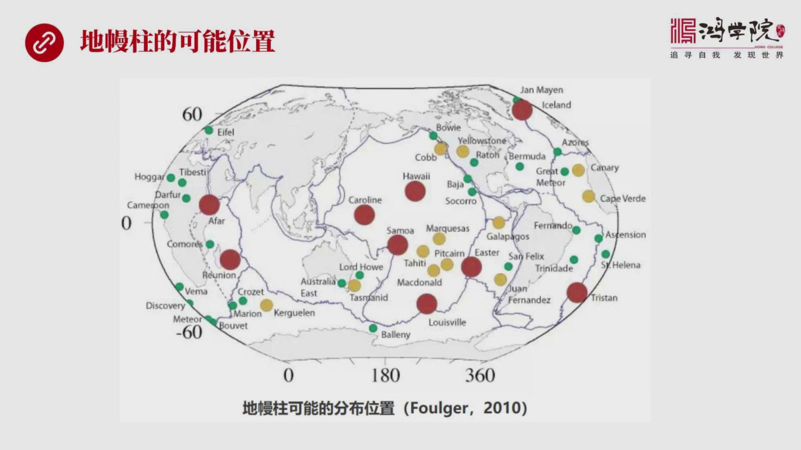

地球上還有多少個地漫住的可能位置呢這有一張圖大家從這張圖上可以看到現在在全世界有相當多的就是屬於地漫住的可能存在了位置比如說在加州我們會看到黃石公園黃石那個地方就一定是個大型的地漫住下文移不用說黃石公...

<strong>All subtitles</strong>

> 地球上還有多少個地漫住的可能位置呢這有一張圖大家從這張圖上可以看到現在在全世界有相當多的就是屬於地漫住的可能存在了位置比如說在加州我們會看到
> 黃石公園黃石那個地方就一定是個大型的地漫住下文移不用說黃石公園早就有地址學家說那遲早會形成巨型的果然爆發我們看這張圖上這個地方也標誌很清楚其
> 實以前國際上很多地址定不太性地漫住但這一次美國的一般可以加在2014年左右進行了幾百台全球聯網了地震移同時去測看看這個地漫住是不是真的存在在
> 黃石公園以黃石公園檢測黃石公園這個地方當然它是在各個不同的地區來進行精密的偵測實驗結果表明或者要測試結果表明這個地漫住有可能直接被證證實也就
> 是這一套學說我覺得從各個方面來講具有著非常強的說服力很可能是未來一個相當熱門的一個相當於現在板塊學說這樣一套新的理論體系那麼從這張圖上我們可
> 以看到很多熱點地區都是在板塊的結合處所以這就是未來可能出現重大所謂生物滅絕性的這種大的火神噴發和這樣的地質事件就有可能發生在這些地區但如果真
> 的是出現像西伯利亞或者鵝米山那種巨型噴發的話我覺得估計人類或者叫人類構建了一些文明恐怕就要到此為止了這就是我們需要在所謂東方文藝復興不是就理
> 解我們眼前的增一點一點點事就是能夠站在一個更高的高度上理解人類的命運人類的過去和人類的未來好我們現在看下野這是我們講到的第一個問題就是關於山的問題第二個

---

### Slide 13

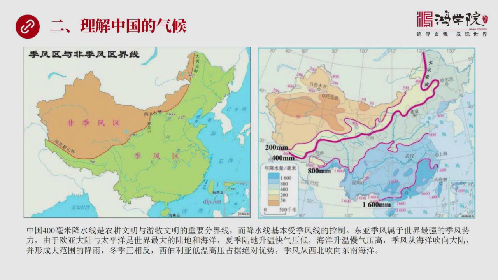

我覺得比較重要的問題是理解關於中國的氣候中國的氣候大家其實很多人都非常非常了解比如說左邊這張圖上列出來就是中國的一個祭封不圖你可以從祭封圖上可以看到中國顯然分成兩個部分祭封區和非祭封區右邊這張圖是一張...

<strong>All subtitles</strong>

> 我覺得比較重要的問題是理解關於中國的氣候中國的氣候大家其實很多人都非常非常了解比如說左邊這張圖上列出來就是中國的一個祭封不圖你可以從祭封圖上
> 可以看到中國顯然分成兩個部分祭封區和非祭封區右邊這張圖是一張降雨亮的這個等降雨亮的圖你可以看到中國有一條非常著名的線叫四百毫米的降雨亮等降雨
> 亮線從這個四百毫米等降雨亮線我們跟左邊這個祭封圖你會看到這兩個基本上是一回事基本一致主要原因是什麼就是導致降雨的核心的元素核心的這個因素就是
> 祭封祭封把這種太平洋上暖石空氣推到了這個這麼遠的地方在那形成的降雨那麼我們看到的這種祭封其實是理解中國氣候中國包括歷代的這種戰爭有問民族入侵
> 還有農業減產農民企業其實都是跟祭封這事有有密切關係的所以我們非常需要理解祭封發生的原理那麼祭封的原理從大的方面來看就是比如說下跡下跡我們知道
> 太陽照的這個大地上陸地生溫速度是比較快的海洋生溫是比較慢的所以陸地這邊形成了被這個太陽太陽一直射立刻形成了這個生溫很快然後熱空氣往上往上走那
> 麼在地表部分就會形成低氣太陽上它熱容量比較大太陽要對這個大海晶加溫比較慢所以它溫度上的表慢這樣就會形成它的氣壓太陽上的氣壓相對高而大陸上有一
> 熱空氣蒸發蒸發往上走之後地表的氣壓比較低這就會導致太陽上的這種熱濕空氣吹向從東南方向吹向大陸那麼它可以吹多遠可以一直吹到中國的西北地區冬天呢
> 這個情況就反過來了冬天就是西波利亞那邊形成了一個高壓這個因為它溫度低然後這個氣壓是比較高的那麼大海這邊呢相當說溫度比較高而氣壓比較低所以形成
> 了一個從西北方向從極力方向往海洋吹的西北祭風就是冬季祭風下季我們是東南祭風所以這就是我們理解祭風的基本的一個知識好我們現在看下野除了祭風會影響中國的

---

### Slide 14

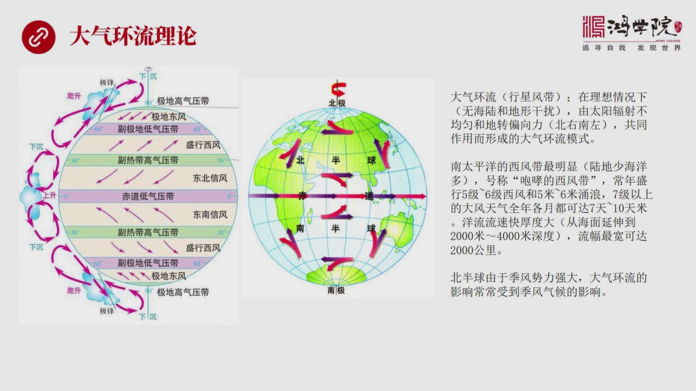

氣候之外其實還有一個重要的因素叫大氣環流理論我們以前在講的美元環流的時候其實借助的是溫言環流海洋環流的一個概念在這裡呢我們需要再次接觸到一個大氣環流的理論體系什麼叫大氣環流呢就是如果我們看左邊這張圖我...

<strong>All subtitles</strong>

> 氣候之外其實還有一個重要的因素叫大氣環流理論我們以前在講的美元環流的時候其實借助的是溫言環流海洋環流的一個概念在這裡呢我們需要再次接觸到一個
> 大氣環流的理論體系什麼叫大氣環流呢就是如果我們看左邊這張圖我們可以看到在南曼球和北曼球你會發現有好幾個高壓帶和低壓帶比如我們往北曼球看南曼球
> 原理是一樣在北尾三十度的地方有一個富熱高帶就是富熱帶高壓帶就是今天我們聽天氣報經常會聽到這個詞這個富熱帶高級要帶那麼這個富熱帶高級要帶什麼呢
> 說明這個地方的氣壓比較高那麼吃到地方氣壓比較低我們剛剛已經講了因為吃到這個地方它的它跟這個大陸之間它會有一個這個所謂熱力的所形成這種溫差這就
> 會導致氣壓是不一樣的那麼你會看到在這樣一個這個圖上所顯示出來的特別是左邊這一次它一個上下一體的一個氣流就是海洋上形成的這種氣流是向上的因為它
> 受這個吃到上受太陽直射溫度比較高所以它會形成一種低氣這種低下會使得熱空氣就是熱空氣是往上走使得海面形成一個低氣壓這個熱空氣往上走的一定高度之
> 後然後就像比如說像北方向流或是南方向流那麼它在流的過程中在高空向北運動的過程中它會受到地球它的轉動會產生一個偏心力這種地角的偏心力會讓它在北
> 半球會出現一個向右偏轉的一個方向然後它在30度北尾30度的上空大量的這個偏產生了偏心向右偏或是像東偏的這種力量之後會使這些氣體當然同時包括降
> 溫會使這些氣體在北尾30度的高空形成一個向下沉的一個巨大的趨勢空氣冷了它向下沉另外大家的偏心力是很多空氣在那個地方形成了一個集中帶所以形成了
> 一個自上而下的一個沉降大量空氣往下壓這種壓的過程中往往來帶來增溫的效應它溫度會變高絕熱它是一種往下壓幾壓的過程中會產生一種熱所以它的溫度高而
> 且是垂直方向那麼這個就會使在北尾30度形成一個高氣壓帶因為空氣密度大了那麼這就是我們所說的負責帶高氣壓帶它的基本的一個原理好如果這樣形成了高
> 壓帶它就會對更往北的地方氣流就會往那個方向流但是它是沉下來之後所以它是從比較低的空比較低的這個平面比較低的這個高度向更北的地方去流那麼就會形
> 成我們看到了這個它的這個圈流就會繼續向北到了北尾60度的時候就到了這個負極地低壓低氣壓這個帶那麼這個時候遭遇到了從北極下來的因為北極的它的這
> 種氣溫最低所以它的氣壓是比較高的所以這股力量衝過來之後兩股力量形成了一個錯風就是從這個富熱帶高氣壓帶來的這個空氣被抬上去了抬上去之後衝向北極
> 再到北極再沉降下來然後沉降下來之後然後這股氣流所形成的弱干個循環導致了每個地區出現的一種非常不同的氣壓的表現比如說在富熱帶高氣壓帶的北部也就
> 是從北尾30度到北尾60度之間它形成了一種西風就是所謂的西風帶為什麼會西風呢就是我剛才所說的你從富熱帶高氣壓帶你從它的海平面就是從比較低的這
> 個海拔高度像高尾都去運行在運行過程中由於地角的偏心力你會產生一個偏向會向右偏那麼這個像右偏我們從地主上一看這其實就是吹著西風嘛所以這套理論體
> 系是理解整個大氣循環的一個基本理論但是這個理論呢它是一種理想狀態也就是如果你不考慮地球上有山有大陸或者大陸面間還很大山的形狀很複雜如果你不考
> 慮這因素的話那麼這套大氣循環理論就夠了那就是一定會形成北尾30度以內30度以下是什麼呢東北信封30度到60度是盛行西風然後再往上極地高尾都地
> 區是極地東風它會形成三個不同的這樣的一種這個氣壓帶這種氣壓帶這個導致中間出現東北信封西風帶極地極地的東風帶它會形成這樣一個理論上的框架但是呢
> 北半球和南曼球情況是有所不同的因為南曼球它更用這套理論模型去解釋要更準確一些主要原因是南曼球我們看它的整個南曼球它的陸地很少主要地球的大陸都
> 集中在北方南方就是澳大利亞和非洲的南美的一部分包括大洋洲包括南基州所以這些地方陸地比較少海洋比較多沒有太多的地形這種阻礙所以那個地方的西風是
> 非常強大它在西風帶也就是它的南尾30度到60度這個區間大概在我們看到在澳大利亞以南的很多地區那麼這些地區它的西風就非常的厲害號稱逃效的西風帶
> 長年運行的西風速度是5-6級這5-6級會會吹起5-6米的這種大浪長年都這樣正常情況下沒有任何情況之下它這個西風就刮了這麼厲害而且經常常態就是
> 5-6米的這種大浪相當於兩層樓這麼高的浪7級以上的大風天氣佔全年每個月都都平日佔到7-10天就一個月有小三日一的時間是會有7級大風的所以那個
> 地區的洋樓速度非常的快而且它這個規模很大厚度也很大從這個大洋表面一直往下到海面底下2-4000米然後它的寬度洋樓的寬度能達到2000公里20
> 00公里2-4000米的海面做巨大的圍繞南極洲在南極洲的北側進行大規模的快速的流動這個是非常驚人的為什麼我們需要理解大氣環流理論因為它對我們
> 它對我們理解中國的氣候具有著非常重要的指導意義好我們看下一頁這個指導意就是我們在這個地圖上

---

### Slide 15

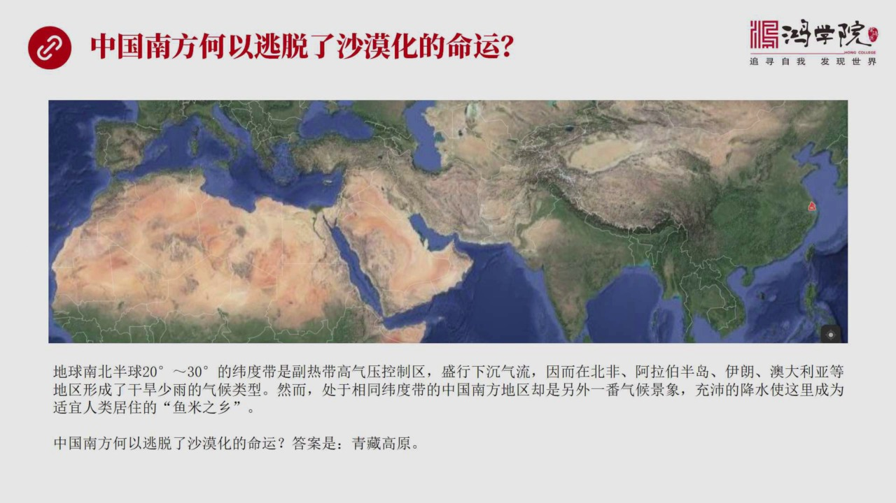

我們可以看到這個這張地圖說明那個很有意思的規律就是在北尾南北半球其實一樣我們先說北半球北半球20度到30度這個這個尾度帶我們一大點就能看出來這是個大沙漠的地帶沙哈拉大沙漠沙特的這種大沙漠還有伊朗伊朗的...

<strong>All subtitles</strong>

> 我們可以看到這個這張地圖說明那個很有意思的規律就是在北尾南北半球其實一樣我們先說北半球北半球20度到30度這個這個尾度帶我們一大點就能看出來
> 這是個大沙漠的地帶沙哈拉大沙漠沙特的這種大沙漠還有伊朗伊朗的很多地區其實非常的乾汗然後包括其實美國的西海岸加州也是個非常少雨的地方那麼你會看
> 到在這個尾度帶上基本上都是這樣一個不毛之地的氣候其實都是屬於乾汗少雨為什麼因為這些在這個尾度帶上就是北尾20到30度就是我剛剛所說的是這種重
> 要的一種重要的一種氣力地理的這種氣候的方式它主要受到附熱帶高峽帶的控制我們剛剛已經講到在附熱帶高峽帶上出現的是一個高溫的高溫和高壓的這麼一種
> 降了一種氣候也就是它沉它沉積在海上之後在這個帶上在這個尾度帶上都會阻止降雨而且溫度非常高非常乾汗不下雨像我們看到是這種沙拉沙漠它其實旁邊就是
> 就是大西洋可是由於你受到了這個附熱帶高峽帶的控制之後它就不會降雨或是降雨非常的稀少沙特也是它西邊是紅海東邊是波斯灣南邊是印度洋那地方怎麼就不
> 下雨呢就是因為受到復高這種氣壓的這種影響那麼在這個尾度帶上有一個特例就是我們看到中國的江南地區如果說20到30度這個尾度這是什麼呢就相當於中
> 國的上海到廣州我們基本上可以認為是中國的江南的很多江南半米江山本來他們的命運應該跟沙克拉大沙漠和沙特這種阿拉伯半島上這種沙漠氣候應該一樣但是
> 他們就逃脫了這個惡運沒有變成這樣當然我們看到印度的這個尾度但也沒有傳染這個問題因為這兩個地區都有充沛的降水他們非大沒有變成沙漠反而成了非常宜
> 人的雨米之鄉為什麼會出現這個現象為什麼中國的這個北歪20到30度這些地區或者這種命運呢關鍵的原因就是清藏高原我們看下野清藏高原

---

### Slide 16

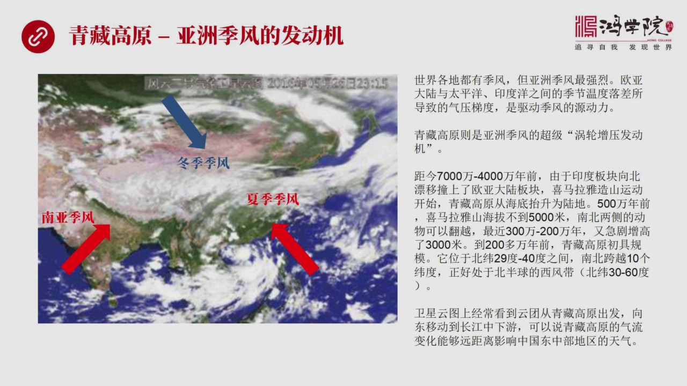

有的氣氧學家把它稱之為是亞洲祭封的發動機如果我們從這張圖上你會看到我這標誌出來了下架封下進了這種這種祭封有南亞祭封有東亞這種祭封南亞是從印度洋吹上來了它是一種對於我們來說是一種西南封那麼這個太平洋上出...

<strong>All subtitles</strong>

> 有的氣氧學家把它稱之為是亞洲祭封的發動機如果我們從這張圖上你會看到我這標誌出來了下架封下進了這種這種祭封有南亞祭封有東亞這種祭封南亞是從印度
> 洋吹上來了它是一種對於我們來說是一種西南封那麼這個太平洋上出來的呢是東南封東進的當然我們很清楚大家都說別喝西北封了它是來自於西北的其實我們很
> 多人看清雷波看清雷波之後這個天氣報你要仔細看那個雲團它的運動的方向會發現在很多情況之下這個雲團是在清藏高原上行程行程然後一路往東飄一直飄到上
> 海飄到這個長江中下由地區先經過中央再經過到達上海地區全程影響了這一路上很多地區的這種氣候當然也可能現在其他方向飄飄的山東飄的河北其實很很早就
> 有人意識到中國的天氣受清藏高原的影響非常非常的明顯早在50年來說中國的很多氣氧學家有幾倍氣氧學家就已經提出了一種非常有先見知名的一種理論他們
> 認為清藏高原實際上是整個亞洲祭豐的發動機沒有清藏高原整個亞洲的祭豐活動不會這麼強當然就像美洲就像其他的大洲像歐洲澳大利亞這些都有祭豐但是祭豐
> 能向中國這樣下跡熱空氣一口氣從海南從東海的海南島一口氣能夠吹到藍洲西安這個運動這個能量是非常強大的或者冬季從西溫利亞一口氣能刮到廣州一般的大
> 陸的這種祭豐它的力道弱很多為什麼會穿這個現象清藏高原起到這個非常重大了一個發動機的我稱為是污輪增壓放動機因為它形成了大量的污旋而且是增壓的增
> 加了這種氣壓所以它更像一種污輪增壓放機表示一種更形象的這樣一種感覺那麼清藏高原是什麼時候形成的大概是距今四千萬到七千萬年前我們知道這段時間大
> 家都看過朱樂基公園大孔隆滅絕五千五百萬年前然後這個段階段基本上就是我們看到了印度版塊開始碰上了亞歐版塊的時間那麼這個時間其實就已經出現了西馬
> 拉亞造成運動它就已經開始了這三千萬年就已經把清藏高原從海底已經還升為陸地了七千萬年之前清藏高原是在水下在海底然後出現這個碰上之後四千多萬年它
> 就台上上來了所以這個過程是一個是清藏高原從海底上升為陸地的過程它真正上升比較快的迅速崛起的是五百萬年前到三百萬年這一段時間它的上漲速度非常快
> 五百萬年大家可能會知道就是人類都已經出現南方古原已經在非洲出現了那時候清藏高原才開始迅猛的決勝那個時候五千萬年五百萬年之前西馬拉亞山就是現在
> 世界污集當時不夠五千米高不到五千米四千多米吧那個時候西馬拉亞山南標的這個印度和這邊的清藏高原還是可以動物還是可以翻閱的但是到了兩百多最近二百
> 三百年它是上漲速度特別快到二百二百多年的時候這就使得清藏高原已經完全抬起成現在就是已經出去規模有現在這種規模了所以最近兩三百萬年這一段時間是
> 一個非常重要的一個研究領域因為清藏高原的決起使得氣候發生了重大變化整個亞洲的氣候都發生了重大變化那麼我們知道那個時候的原始人其實從非洲有可能
> 已經有很多波爾走出非洲了他們來到的亞洲來到中國來到印度他們將會在哪裡生存他們的一技在哪裡在我看來如果沒有清藏高原形成之前吧三百萬年以前沒有幾
> 個非常大的高原阻礙的話那麼中國的東部地區東南部地區它的氣候條件恐怕就是半甘漢非常甘漢的這種情況恐怕就不一定能夠就是有可能出現大量的文明因為這
> 個氣候有極大的關係而在兩三百萬年之後清藏高原台生使得這成了一個巨大的一個對氣候來說是個發動機的作用這改變了很多東西包括早期的人類進化式那麼清
> 藏高原它的規模是非常巨大的它正好出在北偉29度到北偉40度之間跨越了10個北度我們知道這正好是西風帶西風帶是北偉30度到北偉60度所以它正好
> 出在西風帶上這就是我們看到當你看到清藏高原這樣的一個崛起的時間你會發現這跟人類其實是有關的因為它上漲最快的時間是五百萬年以內是兩百萬到三百萬
> 年之間這個跟中國了最早的考古發現找到人類化石的時間也就差三十萬年而已所以清藏高原對於中國的古代人的這種進化都會產生直接的影響好我們看下一為什麼清藏高原是一個

---

### Slide 17

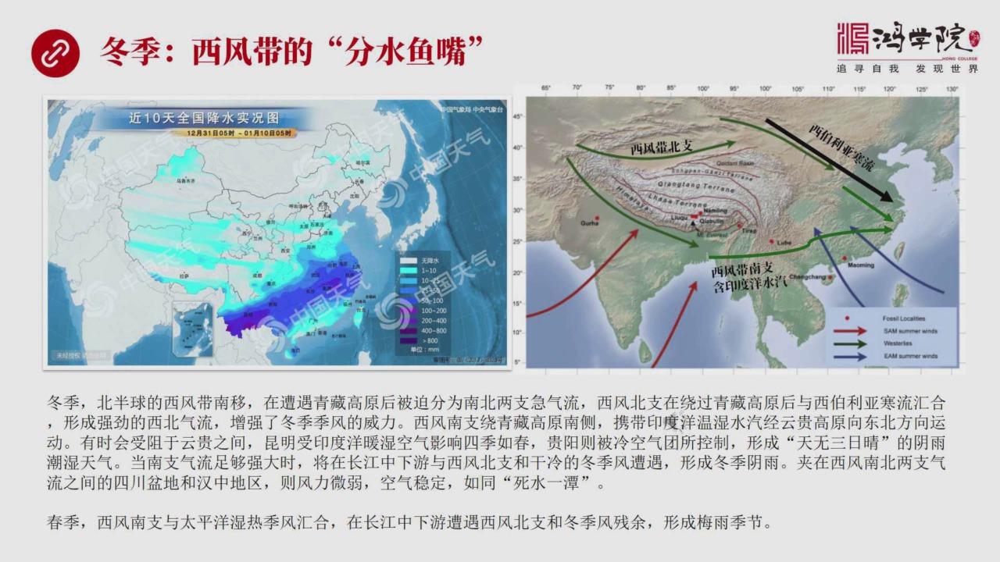

季風的發動機首先我們要看一下要看一下西風帶的作用就是清藏高原對西風帶的作用這就是我們先看右邊這張圖這個西風帶的這種碰到西馬來亞山所產生的這種效應就很像我在督江頁看到那個紛水魚嘴的那個起到的作用它是紛水...

<strong>All subtitles</strong>

> 季風的發動機首先我們要看一下要看一下西風帶的作用就是清藏高原對西風帶的作用這就是我們先看右邊這張圖這個西風帶的這種碰到西馬來亞山所產生的這種
> 效應就很像我在督江頁看到那個紛水魚嘴的那個起到的作用它是紛水的把水一刀批成兩半所以我在這兒用西它是清藏高原是西風帶的紛水魚嘴這些西風正好在這
> 個尾都帶上掛過來之後到了清藏高原一定會被迫分成兩支這個有一支叫西風帶的北枝還有一個叫西風帶的男枝北枝繞著清藏高原從北側走繞過來之後跟西波利亞
> 我先說冬季現在是冬季西波利亞極低了冷空氣過來然後兩股核流衝向中國的東南部分那麼它其實到了強化或者叫增強冬季季風的功能所以它是它是一種增壓的這
> 樣一種作用或者叫發動機的作用是冬季季風變得更強那麼它的男枝它的男枝是從西馬蘭亞山一南經過印度繞過來的而在這個部分它會接觸到印度洋的很多冷這個
> 所謂溫濕空氣它寫在這些溫濕空氣之後然後進入中國的所謂的雲貴川的雲貴雲貴高原這個這個部分在四川以南然後在這條線上你會發現它衝到了雲貴的時候當然
> 高原會對它有一定的阻擋同時它還有些冷空氣南下可能也會形成阻擋所以在那個地區會形成一種僵尺這就是我們看到為什麼昆明這個地方有四季如春跟它同尾度
> 差不多地方的貴洋確實天無三日情冬天又冷又濕主要原因就是昆明受到了西風的南枝的影響兩枝雞流快速流動的氣流南枝這個帶來了大量的溫暖的空氣使得昆明
> 的氣候冬天要比這個貴洋要好很多那麼其實當這個力量如果繞過西馬蘭岸南側的這個南枝雞流這個氣流如果能夠寫在大量水氣而且功力特別強大的話它會衝破這
> 種阻礙一直衝到中國的長江的中下游衝到江南地區然後在那裡遭遭遇西波利亞下來的冷氣 乾冷氣還有西風的北枝兩個會合在一起的那股力量在那形成一定的降
> 雨所以在這一路上它都會造成降雨帶這個降雨帶就是我們看左邊的貴津銀土上這個銀銀土是有看到是冬季的12月到1月平常這個地方是不怎麼下雨的應該是不
> 怎麼下雨的但是天氣報中有些時候你會看到從雲南這個地方會出現一個西北向從西南向東北方向一個降雨帶這個降雨帶說明就是西風的南枝所攜帶的大量冷氣沿
> 途實現了降雨所以在冬季有些情況之下江南也是會有雨季的也是會非常因冷下雨的這個就是我們你要理解其實是西馬拉亞山起到了作用正因為你冬季會降雨那你
> 怎麼會成撒哈拉大沙漠呢你當然就不是一種沙漠性氣候西馬拉山起到了或者是青藏高原起到了那種分水雨嘴的那種作用它把氣流給切分了切分之後一邊乾一邊冷
> 就是一邊是乾冷一邊是溫度比較高比較潮濕所以兩者一旦相遇就必然形成降水這就是我們看到的這樣一個為什麼江南會避免成為沙漠地區的這麼一種原因另外這
> 兩支南北氣流你會看到它其實繞著就是繞進了四川盆地它沒有在四川盆地形成交繪所以四川盆地包括漢中地區冬季是沒有風的它兩支西風都從它眼前過但是它們
> 不交叉所以在四川地區冬季的表現當然它就是風力非常微弱空氣穩定相當於四水一彈當然由於清零的阻礙北方的空氣也不容易積界阻礙冷空氣也不容易難下這是
> 一個積界阻礙的作用但是西風的南北兩支繞開四川和漢中這也是導致這兩地區冬天沒有什麼風然後空氣穩很穩定就像四水一彈也是這樣的一個作用之一那麼到了
> 春季春季西南之的所謂西風的南之它帶了水晶器之後在太平洋上在太平洋這個它跟在這個顏圖上跟太平洋從東北方向帶來的熱風熱濕的空氣會和在一起產生更強
> 大的這種更強大這種作用也就是這種作用在江南地區就會引發遭到北方的冷空氣遭遇之後就會形成長時間的美語季節這也是西風南之所造成的重要的結果所以如
> 果沒有西風的南之又不會有這麼強的美語降雨季節也不會有冬季降雨而為什麼會有西風南之呢主要是因為青藏高原的存在好我們再看下一頁這是屬於春春天我們在看看下田

---

### Slide 18

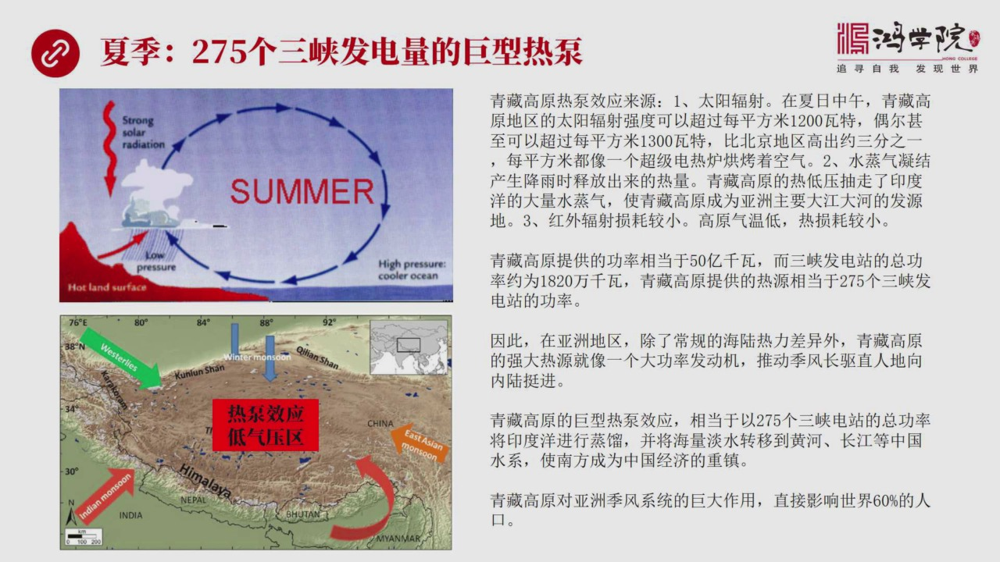

下田這個地方它對季風的這種促進作用極微強大遠遠超過冬季和春季為什麼下田會產生這麼大的促進作用促進季風呢首先要理解青藏高原它實際上是一個巨型的熱棒熱棒在下田的時候我們如果要理解這點看這張圖左上圖我們可以...

<strong>All subtitles</strong>

> 下田這個地方它對季風的這種促進作用極微強大遠遠超過冬季和春季為什麼下田會產生這麼大的促進作用促進季風呢首先要理解青藏高原它實際上是一個巨型的
> 熱棒熱棒在下田的時候我們如果要理解這點看這張圖左上圖我們可以看到這張圖是一個專門研究印度高原印度了這個季風氣候了印度季風氣候當然這個左側這個
> 山脈就是西馬拉亞山翻過去之後在更左側沒有花出來這本就是青藏高原我們這種這張圖可以說明為什麼整個青藏高原是一個巨型的在下田是一個巨型的熱棒因為
> 這個太陽直射太陽直射就會使得整個青藏高原因為它高然後空氣稀薄所以太陽的浮射浮射強度非常強它生溫很快生溫很快之後就會產生熱空氣往上走底下就形成
> 一個地表部分就形成的低壓熱低壓它就會吸引其他地區的空氣過來填補那麼從印度洋過來的這種帶有水氣的這種風就過來了然後在它那邊提升上來提升上來之後
> 提升到高空之後形成雲形成雲之後形成降雨那麼這個過程其實就是它一個巨大的一個熱棒的一個原理的基本的原理我們看到這個為什麼它會有熱棒效應它為什麼
> 會產生熱棒這種效應有三個原因第一是我剛才所說的太陽浮射夏日政務的時候青藏高原它的太陽浮射的強度可以達到美平方米1200瓦特1200瓦美平方米
> 像它有一個1200瓦的熱這個所謂的電烤爐把空氣烤熱了往上推往上烤空氣讓它趕緊往上走往上吹吹熱氣這是第一大熱源因為這個強度太強了有些地方是能達
> 到美平方米1300瓦所以太陽直射所產生這種浮射的強度太高如果大家去西藏的時候它那個地方的強度比其他地方要強太多了你只要忘圖了防射雙第一天甚至
> 是一個下午然後你的臉就完全燙成了被浮射烤成了像龍蝦一樣的狀態所以大家去西藏一定要注意防射防浮射主要是第二個作用水蒸氣凝結產生降雨它會釋放大量
> 熱量我們都知道水蒸氣你要把它加熱它是不斷的稀熱變成了蒸氣往上走然後到了高空形成冷卻形成與這個暈暈形成與這個寒水這個雨滴的時候它會大量放熱所以
> 在這個暈層中間海雨層中間它的頂部是非常高溫的因為這個水蒸氣在凝結的過程中釋放大量熱量所以這個暈菜上面暈頂是非常高溫的然後這就會產生進一步的熱
> 崩效應把空氣往高空吹當然還有一點就是它熱浮射的這個孫號比較小因為熱浮射就是熱浮射跟什麼跟這個熱度的踢渡有關那溫度踢渡有關在清藏高原熱浮所謂太
> 陽的這種照射很厲害但是它的溫度氣溫並不高所以在清藏高原它夏天也就十來度二度我們看了西藏人經常穿一半的就是那種圍的皮袍另外一半穿的是很薄的衣服
> 主要就是因為它的空氣溫度並沒有這麼高這就導致它的熱浮射效應就往外就是一方面太陽往往裡往地球照射你會會帶來很多能量一方面這種大氣層也在就是地表
> 和大氣層也在往外浮射能量這就使得這個浮射這個能量量也很大也能達到美食美好幾百瓦所以這就導致這個誰的浮射量比較小誰的熱源效率就會比較高這個在清
> 藏高原上這三點都佔了所以清藏高原總共能夠提供一個相當高的熱邦效應熱邦的效應相當於五千這個相當於五百億千瓦相當於五十一千瓦五十一千瓦是什麼概念
> 呢如果我們跟三峽大壩進行比較三峽大壩一年發電的這個功率大概是它的總共率是一千八百二十一千八百二十萬千瓦而你如果是五十一千瓦如果折算一下那麼整
> 個清藏高原相當於它的熱源相當於二百七十五個三峽電站發電的總共率我們可以這麼設想就是把二百七十五個三峽電站所發出的電全部變成熱能去燒烤清藏高原
> 它的空氣當然這些空氣就會加速往上跑底下就會形成一個非常非常低的熱地壓然後大量四周的空氣就會向中間猛烈的流動然後被它加熱之後再迅速提升那麼這會
> 產生什麼效應這會產生一個極大的促進東南祭封的作用比如說我們看下面這張圖東南祭封夏天東南祭封是從東南方向過來在清藏高原這如果形成這麼低一個熱地
> 壓帶那麼它就會產生個抽氣的效應就把熱風往這邊抽把熱水空氣往這邊抽所以它會使得整個的東南祭封走得更遠實際上在那進行了加速或者進行了中計之後使得
> 這個祭封貼著清藏高原標上網北所以夏天的時候四川地區它在清藏高原這個清藏高原的東廁它會感到強烈的難由南向北的氣流就是這種風是由南向北吹的這就是
> 熱崩效應使得東南方向的祭封到四川這個地方或者到其他地方折而向這個走向北的通道然後吹向更深的西北方向所以它對於祭封產生了巨大的影響使得夏天這個
> 海洋上熱水空氣可以向中國的西北部推進很遠很遠這就是為什麼它是發動機當然還有一點我覺得是一個更重要的更重要的一點我看專門研究這個問題的一些書並
> 沒有把這個原理講透因為這個熱崩效應它還有一個重要的功能就是向人275個三峽電站發的總電量用這些電量採出了能量實際上對印度洋進行了大量的蒸發就
> 好像電蒸發把這個熱是把這個海洋上的這些把海洋這個水蒸流之後變成淡水然後把這些淡水轉移到西藏的上空進行大規模降雨這些降雨就形成了中國長江黃河和
> 所有主要河流的源頭的水源換句話說青藏高原實際上起到了一個為中國東部水系提供水源的重大的作用它這個熱崩的效應能產生轉移這麼多海水可以說是海量的
> 這種淡水向中國東部進行侵卸所以我們可以想想想如果沒有青藏高原這個熱崩效應哪會有江南的美好生活當我們沒沒想到這時候你會一直到青藏高原的重要性它
> 可太大了好像平常就跟我們關係很遠但實際上青藏高原為中國的整個南部地區提供了大量的水源給北部地區提供了大量的計峰帶來的降雨否則的話中國江不能形
> 成現在這個局面所以我們看到青藏高原不僅是對中國的影響對印度的影響對西亞中亞的影響都非常巨大青藏高原它這套季峰它對季峰的這種熱力的影響效應就是
> 這個熱崩效應實際上直接影響了世界60%以上的人口他們的生活他們的工作所以這就是我們要理解對於中國理解中國的文化理解中國的這個歷史發展的話青藏
> 高原是非常重要的一個關節點好我們現在在講第三部分理解中國的海洋說到海洋

---

### Slide 19

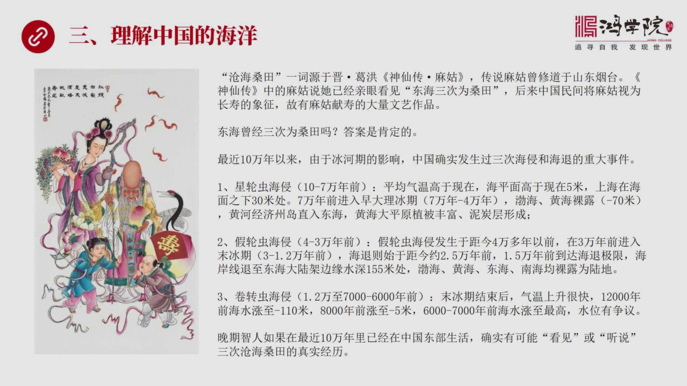

大家可能經常會聽到比如說我們的老化中說到蒼海桑田這樣的概念其實蒼海桑田這個成語它是源自於近代近朝這個格洪它寫的神仁鑽神仁鑽裡面有篇關於麻姑的故事當然我們老百姓對麻姑的選手都很熟說到麻姑就是在歷上的麻姑...

<strong>All subtitles</strong>

> 大家可能經常會聽到比如說我們的老化中說到蒼海桑田這樣的概念其實蒼海桑田這個成語它是源自於近代近朝這個格洪它寫的神仁鑽神仁鑽裡面有篇關於麻姑的
> 故事當然我們老百姓對麻姑的選手都很熟說到麻姑就是在歷上的麻姑被傳說是在山東煙台修過道你看很多沿海的故事都是出現的跟海有關的故事都是出現在沿海
> 地區山東煙台那麼在這個故事中間就提到麻姑說她親眼她已經親眼看到就她這輩子已經親眼看見了三次東海成為蒼田就是蒼海蒼田就從這個故事中移生出來的麻
> 姑一個小小的年紀在她有生今之年看到了三次東海變成了蒼田這當然是個神話傳說但是我覺得中國的很多最古老神話傳說當然是最古老的沒有經過編輯加工的沒
> 有經過剪輯的沒有經過美化的是還有相當多的非常原始的信息量的當然由於麻姑在她的一生中看到三次蒼海變成蒼田她肯定是個很長壽的人所以民間的故事把麻
> 姑現壽作為一個主要的文藝作品表現方式那麼她所說的東海三次變成蒼田到底有沒有什麼回事現在可以考證當然是她這個麻姑這個三次看到東海變成蒼田確實是
> 曾經出現過答案是肯定的這就是最近十萬年以來由於地球冰河期的影響中國的東部確實出現了三次海清和三次海退的重大事件每次海退就會造成都會造成這種蒼
> 海蒼田的變化大海以前是大海現在變成了可以重地的三田那麼第一次就是星輪重海清也就是最近十萬年到七萬年那個時候平均氣溫要比現在高幾度海平面比現在
> 高五米左右在星輪重海清之前就是在十萬年之前是天氣和冷是冰河期然後到星輪重這個海清的時候溫度上升上升之後產生了海面的迅速提高因為地球兩級的冰雪
> 融化海水量變大了當然海平面就夠上升那麼海平面比現在高通了高五米那麼上海當時應該是在海下30米的地方因為上海是後來堆積出來的所以它當時的那個還
> 沒有這樣一個城市還沒有這樣一個地方存在那麼七萬年前這個地球進入了這個進入另外一個冰河期就叫早大理冰期這個冰期它持續了三萬年就從七萬年持續到四
> 萬年這個時候你看到在冰河期的時候那麼海水大量被南北兩級的冰風給鎖起來鎖住了然後在大陸地區形狀大量的冰川使得降水減少這都會使大海的海平面下降下
> 降的使得整個博海和黃海全部滷滷出來了變成能看見底的了因為黃海的水位它的海平面比較低它70米就是下降70米它就完全滷滷了那麼黃河它的入海入海口
> 已經發生了變化它不再是現在這個入海口了因為整個黃海和黃海都成了平原了所以它一直要到了東海然後經過經過記者島那邊進入大海所以你會看到黃海大平原
> 當時是直背是非常豐富的當時還有泥碳層的形成大量直背被埋藏才會形成泥碳層這都在中國的海洋底下黃海和東海包括博海那麼這是第一次第二次叫甲倫崇海清
> 這是距今4萬年到3萬年那麼甲倫崇海清它發生在離現在4萬多年以前開始然後在3萬多年以前進入了就是墨冰期這個墨冰期什麼概念就是甲倫海清溫度上升了
> 還是上漲了又把這些海底的平原給淹了然後天氣到了3萬年之後又開始變了這就進入墨冰期了墨冰期從3萬年前一直持續到距今1萬2000年前那麼這個時候
> 就發生了再次發生海退大海又向後退這種後退大概於2萬5000年開始到1萬5000年退到了最遠處這是有海底貝克蒂可以建定的這個最遠處基本上就向東
> 海大陸架降了一個位置也就是在東海大陸架邊緣現在的水深155米處那是最後發現了最後一道貝克蒂那麼在這一次海退過程中黃海博海東海南海全部都落路成
> 路了這是第二次第三次的是捲轉重海情捲轉重海情就是從1萬2000年到距今6000年前墨冰期結束後氣溫很快上升1萬2000年前的時候水位開始大漲
> 漲到了比現在大概第一百一十米因為它最深的時候就是最這個海水最前的時候大概比現在跌到將近160米現在恢復到了富110米然後8000年前恢復到了
> 富5米就比現在還平面第5米左右到了6000年前海水漲到了一個最高位當然是個最高位現在各種學者吵了一大糊塗並沒有一個準確的一個結論但是應該是比
> 現在還平面高不少那麼現在我們可以說一下假如是當時中國已經有了晚期智能從非洲出來了最新一波人到達了中國沿海部分那麼他們在最近十萬年前如果生活在
> 那個地區的話那他確實有可能看到或聽到三次蒼海桑田這樣的事情這就是為什麼這個麻姑現售這個事從遠古傳下來它是代表了一些真實的傳說中是有一些真實的
> 成分在裡面那麼從現在我們剛才所說的三次海禁和海退我們已經看到了迪迪確確在十萬年之內存在過三次海禁和海退現在我們看下一頁當時的這個海禁海退

---

### Slide 20

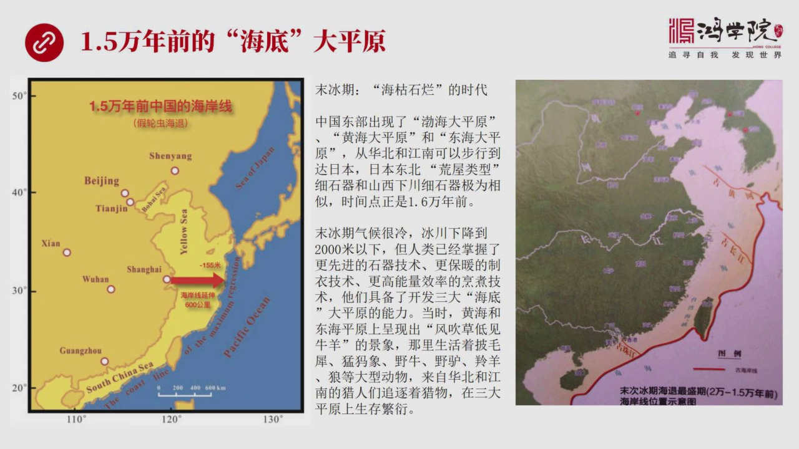

對於整個亞洲東部地區造成了重大影響你比如說海退發生最極端的時候就是最近一萬五千年的時候整個東海大陸架向東延伸了六百公里如果我們看左邊那張圖你會發現波海變成了波海大平原黃海變成了黃海大平原還有東海大平原...

<strong>All subtitles</strong>

> 對於整個亞洲東部地區造成了重大影響你比如說海退發生最極端的時候就是最近一萬五千年的時候整個東海大陸架向東延伸了六百公里如果我們看左邊那張圖你
> 會發現波海變成了波海大平原黃海變成了黃海大平原還有東海大平原南海也有一個平原四個海都變成陸地了然後更重要的是你看東海大陸架就是這個東海的陸地
> 這個東海大平原已經直接跟日本接上了其實很多地方都已經水都乾了像白天海峽人是直接可以從遠東走到這個美國的走到阿拉斯加的那麼中國當時你不管是華北
> 人還是上海人你只要走到東海大平原可以通過這個大平原直接登上日本就是中間沒有任何的海洋隔離這一點非常重要其實我們現在所想的中日間這個文化交流其
> 實早在那個時代一萬五千年甚至更早就已經有來往了比如說日本的他們在考古學中有一個非常重要的一種時期荒污類型那種細實器但是他們是出現在一萬五千年
> 一萬六千年左右在以前沒有任何歷史是一段空白而中國山西夏川夏川考察說是兩萬四千年到一萬六千年顯然這就接上了所以日本人聽到中國在山西考察制在七年
> 代聽說中國山西考察出現了這麼大一個重大突破非常高興非常興奮知道自己的文化來源其實來自於中國換句話說是華北山西那幫人把這種細實器技術傳到的日本
> 兩種時期的這種加工方式和類型都非常類似這就是一個直接的驗證一萬六千年這個時間點正好是處在東海大平原行程的時候那麼當時的氣候是個什麼樣呢我們說
> 到冰河氣候人都活不了人了當然也沒有這麼嚴重人是可以活平均氣溫比現在大概低七到八度也就是現在你在長江流域這種氣溫的感覺相當於在東北遼寧或者吉林
> 那一代就是夏天和冬天的感受差不多當然當時的冰川覆蓋了很多地方特別是江南那些比較低的山比如說爐山上面都形成了冰川黃山恐怕也有冰川就是一千米左右
> 一兩千米這些海拔一兩千米的山都會有冰川的存在這當然會對各個地方造成了一種降溫的作用不過當時人類已經發明了什麼細實氣已經有細實氣了就是接近細實
> 氣那個武裝水平了同時人類還有學會的保暖的衣服同時還學會的用火來燒煮烹飪食物使人類獲得能量的效率大幅提升我既有衣服穿又熱動力吃所以我抵抗嚴還能
> 能力是沒有問題的就像現在東北人冬天沒有問題他能夠好好生活當時在江浙一代的人他的氣溫跟現在的東北的全年氣溫差不多冬天是可能也是零下二三十度夏天
> 是二路左右所以他只要有足夠暖或者衣服有火有火烤著他不會被凍死這就是為什麼印聯人其實也是在這個時間段一萬五千年到一萬兩千年之間在東北亞洲通過白
> 天海峽大陸橋到了美洲這說明在更北的西波利亞地區人們已經掌握了更先進的遇寒的技術這沒有問題所以人類在那個階段是可以生存的那麼這三大海底平原比如
> 東海平原 黃海平原當時是個什麼情況呢當時以他所呈現情況是風吹草地建牛洋這是考古發現的就是發現動物化石中間包括批貓溪 蒙馬巷這都是靠近非常西波
> 利亞靠近北極那個地方的那種動物牽涉到這個地方來了還有呢野牛 野鋁 林洋 狼這些大型部落動物都出現了出院在東海平原上 黃海平原上當然還有大量的
> 植物主要是草殼類的植物有很多這說明那個地方是一望無際的草原而且伴隨有大量動物由於人類已經具備了非常先進的這種時期技術衣服打裂技術等等所以他們
> 是可以在這三大平原上生活的畢竟中間有非常長的一個時期長達數千年所以我們可以想想一下現在考古學在考古發現的過程中其實有個很大的一個遺憾吧就是他
> 沒有辦法到東海的海底進行考古我相信如果那曾經生活過東海人的話或者叫東海平原上的人類的話那就一定會留下考古一技當然現在技術條件恐怕還不允許在東
> 海去鑽碳或者去進行大面積開發恐怕成本是比較高的難度比較大但是那底下一定有很多寶貝所以我們看到在15000年前三大海底平原出現了而且核道也發生
> 重大變化就是右邊那樣圖你看到古黃核道古長江道都跟現在不一樣而且注意當時海平面下降了155米核道就會形成155米這麼深的縱切所以當時的古黃核和
> 古長江在海底切出了150米深的一個非常深的這麼一個山谷因為由於它的長期的沖刷它就會在核床形成下切作用這個切的深度要跟海平面一樣所以當時一定存
> 在一個非常深的核道的山谷如果我們現在去考察當然現在經過上萬年的海水的漁極這地方可能已經有沙拉已經有這種漁泥沉澱現在從表面上也許看不到任何核古
> 的跡象但是那個地方是有的如果專探技術或者新的科技技術能夠更先進的話如果通過掃描的方式能夠探測出來古核道的存在那就更有價值了我們現在看下一頁那麼這是一萬五千年前

---

### Slide 21

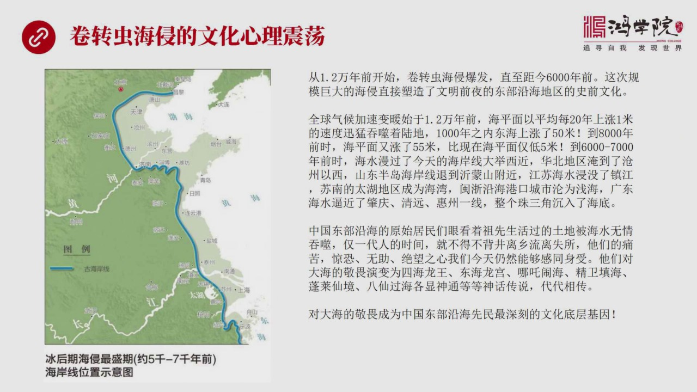

中國的一個地理形式緊接著從一萬五千年前之後特別到了一萬兩千年之後整個全球進入了所謂的這個全因式也就是進入了我們現在一個這個溫度比較高的狀態並和其結束了人類又開始在一個新的溫暖時代開始新的爭成可以說我們...

<strong>All subtitles</strong>

> 中國的一個地理形式緊接著從一萬五千年前之後特別到了一萬兩千年之後整個全球進入了所謂的這個全因式也就是進入了我們現在一個這個溫度比較高的狀態並
> 和其結束了人類又開始在一個新的溫暖時代開始新的爭成可以說我們現在人類的所有的發明創造主要是源於這一萬兩千年這一萬兩千年其實在立場中不過是兩次
> 冰氣中間的一個漸漸冰氣我們應該看到冰氣在地上是周二富士出現的所以現在我們未來一定還會有冰氣當然由於我們的現在的能力比當年提高很多所以下次冰氣
> 來到的時候這個文明肯定是可以存活下去的只不過會受到重創那麼我們回個頭來看一萬兩千年開始地球開始快速升溫那麼它就引發了第三次捲轉重海清的爆發那
> 麼捲轉重海清爆發它是速度比較快的超過了前幾次就是升溫速度很快所以海水漲了很快從一萬兩千年到一萬一千年只用了一千年時間這個海水的上漲的幅度就達
> 到多少呢就達到了50米一千年漲50米平下來每二十年漲一米一米是什麼概念如果我們用測量移你去測一下長三角猪三角還有華北大平原測下它的海拔高度海
> 拔高度真的沒有幾米這麼高有些地方三米有些地方五米而且非常的平緩它的波度差很小當時東海大平原波海大平暴露程度的時候情況也是一樣非常的平所以它這
> 一米海水上漲二十年上漲一米這一米可就不得了這一米的淹沒大量的土地如果說二十年上漲一米也就是在一個人可能有生之前它會經過兩三米的上漲那麼它這個
> 家族從爺爺傳到孫子可能會有十米左右變化那就是今天動地也就是這個家族的人聽上一代或者聽上上代講故事也好或者親眼看到也好都會給它一種非常強勒感受
> 大量的土地被海水所清吞劉力施所這是到了這是從一萬兩千年到一萬一千年然後到了八千年從一萬一千年到八千年海水又漲了五十五米僅比現在海水還平面第五
> 米到了六七千年前之後海水漫過了現在的大陸的沿岸大舉稀進華北地區我們看左邊的那張土華北地區一直淹沒到了蒼州以西山東漫島海岸線一直退到了一蒙山區
> 山東漫島基本上全部變成了海了蘇南地區太湖基本上成了一個大海灣海水一直向西它淹沒到了蒼山蒼山這個山角然後在其他省份也一樣像在哲江南部還有福建沿
> 海了這種現在這些最繁華海口海岸城市基本上全部沉在海裡了廣東竹山角地區情況也好不動去竹山角的地勢也非常的低海拔非常低而且非常的平好現在從廣東從
> 廣東的地勢來看趙慶侵遠惠州一線基本上海水慢到那了也就整個竹山角差不多都沉到海底了所以中國東部沿海的這些原始居民看到自己的祖先所經營或者所生活
> 打獵採集的這些顧居吧僅僅在一旦人的時間裡面就不得不被迫了背景離鄉流利施所而他們對這一切完全是一種完全是一種痛苦驚恐還有無助和絕望他沒有辦法去
> 阻止這個現象的發生如果我們現在你設想一下把你放的當時那個你們家如果是住在東海大平原上你看到海水二十年長一米你二十年前住的地方現在肯定不能再住
> 了到你四十歲的時候就得遠了一海岸線很遠了就離你的家鄉傳統家鄉已經很遠了到你孫子那一帶哇塞你已經簽出好幾百公里了那會導這種什麼樣的心理感受一定
> 是一定是一種無助的是一種驚恐的是一種敬畏的你覺得大海大海這肯定是太厲害了一定有神在裡面一定有一種超自然的力量在推動大海上漲所以這就會形成一種
> 對海洋的一種敬畏然後如果我們看現在的這種這個語言的神話故事我們會看到很多類似跟還有關的比如說四海龍東海北海西海南海各有一個龍還有東海有龍宮啊
> 這個龍宮是非常了不起的人們就設想在大海裡面肯定有一座金幣輝煌的龍宮還有奴障鬧海精衛天海彭來先進八先過海等等這些故事神話或者成語其實都說明東部
> 中國沿海鮮民們對海海禁和海退的深刻人士它是帶帶相傳的所以對大海這種敬畏是整個東部地區一種非常深刻的或者說是一種文化底層的基因那麼我們再看下一頁其實全世界

---

### Slide 22

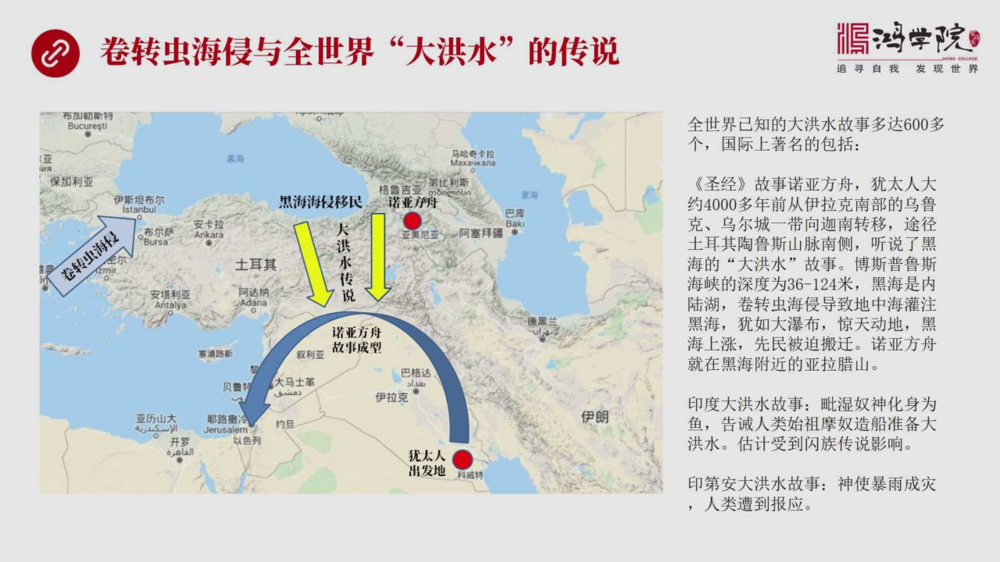

都有早期出現大風水這樣的一種傳說那麼由於考慮它的補面性所以我們很難想像是某一個局部地區有一降量多了然後產生了大風水不代表全球不可能具有全球意義對於全球意義當然海清是肯定具有全球意義的氣溫轉軟肯定具有全...

<strong>All subtitles</strong>

> 都有早期出現大風水這樣的一種傳說那麼由於考慮它的補面性所以我們很難想像是某一個局部地區有一降量多了然後產生了大風水不代表全球不可能具有全球意
> 義對於全球意義當然海清是肯定具有全球意義的氣溫轉軟肯定具有全球意義的這兩者相結合要麼是海水大風長要麼是這個降雨量增加導致了河流泛濫這兩者因素
> 這兩者結果在一起可能都有可能帶來大風水這樣的一種傳說當然我覺得降雨量相對人不是一個還不是一個特別有說服力的因為它這個海晶的過程天氣轉軟的過程
> 發生在數千年的時間所以你要說由於舊轉軟所以降量大了或者洪水爆發你就無法解釋這個東西能夠持續好幾千年嗎從一萬兩千年一直持續到七八千年幾千年都這
> 麼下雨這不是很正常嗎所以後來的滯水洪水大雨滯水這就不符合邏輯了因為你大雨滯水這是短期之內的大洪水爆發而不是一個連續五千年降水量增加那還有什麼
> 那不是變成一種正常狀態了嗎所以它不太可能是由於降雨量大增導致大功磨泛爛非常有可能的是海晴全轉成海晴這一次就是從一萬兩千年到劇情六七千年這一段
> 時間的海晴恐怕是全世界產生大量大洪水傳說的根本原因因為海是全球相通的儘管每個地區的海平面並不絕對一樣但是總的上漲的幅度或者總的上漲趨勢應該是
> 肯定的如果我們來看這個全世界現在已經有的大洪水方面的各種的話已經有600多個故事了國際上比較有名當然是聖經諾愛芳州的故事諾愛芳州我們知道是猶
> 太人記錄他們的歷史了形成的舊約舊約形成的過程其實它是一個漫長的過程不是某一天突然寫出來的早期要不然他們早期猶太人4千多年前吧實際上是從伊拉克
> 南部就是吾爾城和吾魯克這個地區現在在巴斯拉附近在這個地區開始了長度瓦射他們要轉移到加南地區所以走了一個胡星為什麼走胡星呢因為中間是沙漠所以這
> 叫新月型地帶是可以有比較良好的水草可以過得去了那麼在走胡星過程之中你會看到他們經過了土耳其的陶魯斯山脈的南側在這個南側顯然會接觸到了當地的龍
> 化圈當地的龍化圈就會流傳一個故事這個故事就是一兩千年以前就是捲成海青最厲害的時候五六千年七八千年這個階段出現什麼問題呢出現了地中海盜貫或者叫
> 貫駐黑海這樣的一個巨大的事件我們知道伯斯布洛斯海峽是連接地中海和黑海的唯一通道伯斯布洛斯的海峽它這深度很淺它的最大深度124米最淺深度36米
> 這意味著什麼意味著絕轉重在中國東部上漲了155米肯定這個地方伯斯布洛斯海峽至少有很大一份是不通的或者說被隔斷了那就導致了當時的黑海應該是個糊
> 是個內魯糊而地中海是個海因為它的深度比較深那麼當你溫度上升在一千之內上升那麼多然後海水海平面一千年內漲50米的話那麼這個海通道就有可能這個干
> 河的伯斯布洛斯海峽就有可能進水然後從地中海湧過來了這種海水就會從天而降因為當時黑海的海海平面比較低因為它是湖面中間有個巨大落差所以從伯斯布洛
> 海峽有一個巨大的海水關注這個黑海持續了數百年然後這就好像天上來的鋪布大了洪水爆發它這個這個想生可以說震天動地整個居住在黑海周圍人都會受到心理
> 上的震撼當然由於關注了幾百年的水當然黑海的海平面會大漲這就使得原先在黑海海底進行在黑海這個潛底進行牢座的這些人進行農業生產或者手大列手機這些
> 人就布得布千億那麼這些從黑海海清這個過程中轉移出來的人當然就是從土耳其北部當然不是土耳其人是原始居民然後就會向土耳其的南部運動想找一個更安全
> 的地方進行農業生產當然是兩個留意最好所以他們就會把黑海被淹的大洪水的故事告訴猶太人當然猶太人也會打聽得到所以他們在他們的歷史記錄中就把這件事
> 情當成自己經歷了歷史寫得進去就約中講到了亂艾豐洲在哪裡就在我這個圖中畫了這個地方亞南大山脈亞南大山是在哪裡其實就在黑海旁邊現在在土耳其當然我
> 去亞米尼亞的時候亞米尼亞認為那是他們的神山雙方在這個問題上還有巨烈的爭議所以我是站在亞米尼亞這一次看到亞南大山脈亂艾豐洲就在這個山上至少有一
> 派考古學家是怎麼認為的那麼我們可以看到其實這套就是整個的這個大洪水傳說我覺得存在幾個這個故事的中心區一個就是兩個流域兩個流域蘇美爾人其實最早
> 起了這個頭然後後來的八比人人然後猶太人他們就把這樣的故事經過他們的擴散之後就變成了一個全球性的故事就變成了一個應該說是中東和歐洲的一個主流故
> 事因為跟他們有很多生意往來的比如說埃基人比如說印度人這些人都接受這種觀點都記住在他們的一種也記住大洪水這個現象或者是大同小異的故事我覺得他們
> 可能受到兩個流域這種故事流傳的影響那麼還有一個地區跟他們不太一樣就是印聯人印聯人已經被隔絕在美洲了很少有人去所以他們很難聽到發生在兩個流域的
> 故事因為他們一萬兩千年就已經被隔絕出去了好他們創造出來一套神話體系也是關於大洪水的他的可信性就比較高因為他是代表著另外一支在美洲生存的獨立的
> 人類他們所經歷的東西那麼印聯人大洪水的故事講的是暴雨大暴雨之後成災然後神降暴雨就是神接觸很多通過木頭造了很多人後來又不聽神的話所以把神給惹怒
> 了然後降暴雨來懲罰大家所以人們招到了暴影而印度版的大洪水的故事就非常像非常像都愛芳州了就是當年皮神奴化身圍漁變成了一條漁然後告介印度人類的人
> 類師族這個魔奴讓他造船準備當日來之後把一些動物的物種把一些植物物種帶上然後逃到一個比較高的地方然後就能逃難這條漁皮神奴當時拖著這個大船油瓦油
> 最後油到了一個安全的地方人類就延續下來了其實這個印度版的故事還有暴雨芳州的故事是比較相近的印聯安這個故事相對來說比較獨立那麼我們再看下眼中國這個故事當然我們都知道是大雨之水

---

### Slide 23

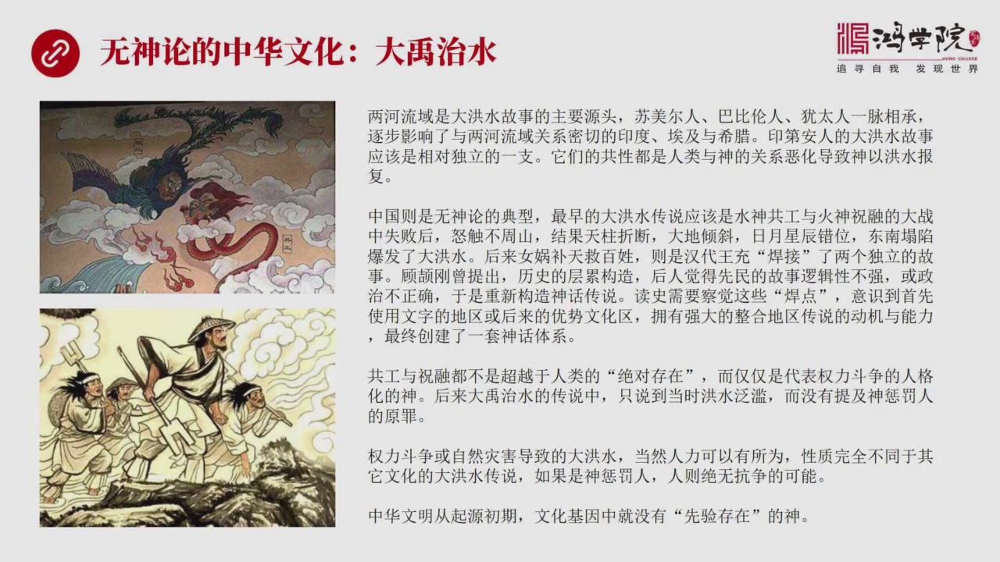

其實在大雨之水之前還有一段故事跟這個大洪水有關的如果我們來對比中國的這種故事流傳它顯然具有一種無神論的色彩而其他地區都是相當明顯的有神論不管是蘇美爾人他們的故事還是印聯安人故事還是印度人還是游泰人他們...

<strong>All subtitles</strong>

> 其實在大雨之水之前還有一段故事跟這個大洪水有關的如果我們來對比中國的這種故事流傳它顯然具有一種無神論的色彩而其他地區都是相當明顯的有神論不管
> 是蘇美爾人他們的故事還是印聯安人故事還是印度人還是游泰人他們基本的所以方式都是人和神的關係變得越來越差人得罪了神所以神要懲罰人要懲罰人類發一
> 場大洪水把人們都滅絕了這個是他們的主要的特點但在中國的文化中在中國的古代傳說中最早的大洪水也沒有記錄是這樣的一種性質的人對神對人類的懲罰一位
> 人有原罪所以神要懲罰你要把你滅絕中國的文化一開始就不是這樣的有傳說實在早在有文字之前的傳說實在就沒有這樣的一種神的基因你看中國的文化中是怎麼
> 傳說的呢就是共工水神是共工然後火神是柱容這兩個人其實他們代表兩個世族了這兩個人發生了戰爭不管是當然關於這個戰爭的版本有多種版本有人認為爭奪權
> 力有些人認為是其他的原因但不管怎麼樣通用版的或者說我們覺得最普遍的特徵就是主管水就是主管水務的這個共工和主管火的掌管火這個事務的柱容發生了大
> 戰大戰之後怎麼辦呢這個共工打敗了打敗之後氣的用頭去撞了不周山不周雙在哪裡不知道反正是個神話傳說的山這個不要緊關鍵是撞斷之後天駐蛇了就是這個有
> 一個駐子停著天在古代很多共工傳說中天都是一個幹有駐子撐著你要把駐子給撞倒了大地就清鞋了然後天上的心心越亮這個位置都不對了東南這個地也塌線了河
> 流在那兒都跑到那兒去聚集那就會發洪水然後就會導致大洪水時代的到來然後女王補天練時補天然後看到老百姓這麼苦把天給補上之後老百姓安靜樂業這是其實
> 是兩個故事如果我們看考古文獻你會發現這個故事是在漢代被王衝論衡中間把這兩個故事漢節在了一期其實這個就是他漢節了兩個獨立故事女王補天是女王補天
> 的故事然後駐榮和共工打仗這是完全不同的故事但是有人在後期把他加工加工成一個故事了這個就是這個怎麼說呢這個就是我們看到了在民國時代貴傑剛曾經提
> 出歷史的所謂的曾雷構造它是什麼意思呢就是後人不斷地在修改前人的故事所以後人堆積采的東西越來越多就像地層堆積是一個道理那麼他講這個話我覺得是有
> 一定道理的因為後人在寫前人歷史的時候特別是這種神話傳說歷史的時候往往覺得前人編的不是太遠邏輯不是太通或者現在政治跟當時的朝廳的政治正確不相符
> 合所以後人有很強烈的這種遇望或者這個動力去把它改造要把好幾個故事連在一起創造一種神話體系所以我們在讀史說這時候要特別重視這些漢典我稱之為是史
> 料中的漢典問題就是原始的素材是最有價值的被後人加工和漢傑的就使他的真實性和可高興大幅下降越往後的史料其實越不可靠而越原始的東西越可靠但是我沒
> 有得不到第一手最原始的東西怎麼辦你只要去研究這些拼接過程中所暴露出這個漢典的缺陷才能發現這是漢典有了這種意識之後我們最主要是需要知道所有歷史
> 的文獻它都有一個怎麼說呢就是誰先發明文字或者說它是一種文化的強勢區它就擁有一種能力把各個地區的傳說進行體系化它是有這個能力也有這種動機的最終
> 它的目的是要建立一整套神話傳說體系對它這個地區是有力的各個朝代甚至這個史前的很多很多部落都有這個傾向我們在研究力的時候一定要特別是東方文藝復
> 興為什麼我們跟歷史中所做了這個考古的這個學派也好或者跟這個研究這個學派也好我覺得都不一樣我們是真正置身事外或者叫不帶任何有色眼睛去評價和分析
> 也不存在任何動機要組成一個有利於什麼集團或者它要有什麼用場沒有任何這種主觀的動機也沒有任何的這樣的一種其實就是置身事外的態度要把你放到歷史之
> 外然後你只是去發現什麼東西是客觀的什麼東西是合乎邏輯的除此之外其他都不重要這就是這種用這種心態和用這種方法研究出來的東西才是真正的東西我們才
> 能看清歷史究竟是怎麼回事而不是別人給我們灌輸的別人讓你認為這個是個正確的觀念那個是個錯誤的觀念你應該承認或者接受正確的東西來秉起錯誤的對我們
> 來說不存在誰告訴我們的正確和錯誤也不存在什麼是別人告訴我們的價值系統我們要的就是真相是實實在在客觀發生的事而不是編造出來的事或者編轉出來的事
> 或者修改過的事那麼我們看到中國這個傳說跟西方傳說最大的不同是哪呢我們看到最早的時候中國這種共工和柱容它這個打仗這個事你就會發現雖然它們兩個是
> 火神一個是水神但它並不是真正西方意義上的神它不是那種超於人類之上的絕對存在或者鮮艷存在那種神它是一種人格代表人格那種神這是一種女人化女人化的
> 神那麼這種神它其實代表的不是真正的神西方那個上帝那種感覺對於人類的一種原罪的懲罰而是一種權力鬥爭而你會發現到大雨傳說的時候大雨之水的時候不管
> 這個事兒爭和價現在我們不討論這個問題就是這次客不討論這個問題但是關於大雨傳說中間的所有地方都沒有提到就提到大水爆發了洪水爆發了但是沒有提到是
> 什麼原因沒有提到是誰在懲罰人類這種原因這是我們看到的這兩個洪水故事中間都沒有真正的西方的神的那種意義上的存在不存在神在懲罰人那麼這就帶來一個
> 問題了如果中國人不認中國人老祖先問不認為是一個絕對至高無上的神在懲罰他們的話那無非就是共工和柱容他們是兩個代表兩個權力兩派在鬥或者是大雨之水
> 那個年代是天災不管是人與人鬥還是天災這都是我們可以努力去改變的東西這就形成了一種我能夠做事去扭轉這個局面就形成這樣一種文化基因如果在西方那種
> 是一個絕對的神先驗的神至高無上的神它要懲罰你你還有反抗的機會嗎你還有反抗的意識嗎你根本就不會這麼去想所以你只能接受和承認這次導致了文化心態中
> 中國文化中非常獨特的一點抗爭它這個命運的抗爭的基因就是原因從這個神話傳說中我們就已經能看到了的確是老祖先問從那個時代從傳說時代還沒有文字的時
> 候就已經形成了絕對不符書絕對不接受任何外在的強佳的命運一些東西我都能改變了這樣的一種勇氣和決心這成了一種最底層的文化基因之一好我們再看最後也最後也我們對今天課進行一下總結就是首先

---

### Slide 24

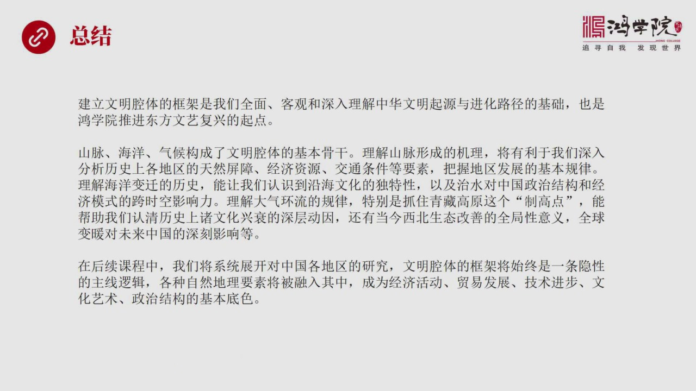

我們在今天這堂課中提出了建立文明要建立文明槍體這樣的一個新的構架因為有了這個構架之後我們才能夠把很多東西融入在各種樣的自然條件和自然因素融入在這個構架之內來幫助我們課官的理解中華文明它到底是怎麼起源的...

<strong>All subtitles</strong>

> 我們在今天這堂課中提出了建立文明要建立文明槍體這樣的一個新的構架因為有了這個構架之後我們才能夠把很多東西融入在各種樣的自然條件和自然因素融入
> 在這個構架之內來幫助我們課官的理解中華文明它到底是怎麼起源的課官起源的真實的原因和真實的過程不要任何的添加不要任何的刪減任何的避諱我只要真實
> 還原它是怎麼發生的它不是怎麼進化的這其實就是我們所說的東方文藝復興的根本的主指我要的是真實的東西真實的歷史是一種科學性的歷史是不容任何參加的
> 歷史是一種理性的歷史那麼這一套東西能夠給我們今天能夠給我們這些人能夠為這個社會帶來什麼呢其實就是要帶來一個認識問題的一個認識歷史和認識社會的
> 一個總的框架比如說山脈、海洋氣候是構成這些文明槍體的基本股價為什麼要理解山脈它有什麼意義呢理解山脈形成的基地是幫助我們理解每個地區它的經濟活
> 動它的文化活動它的各種方面的活動它誕生的根本的資源在哪裡槍體提供的平臟經濟資源擴展資源從哪裡來從哪山上挖山上有什麼這些山導致它文它交通條件的
> 非常不利的因素這個不利因素到底強了什麼程度會阻礙什麼樣的發展所以有利和有幣都要把這些因素考慮在內合流、
> 走向等等都跟山有關這就是只有了解這些細節你才能夠真正理解這個地區某個地區它發展的基本的規律為什麼我們要分地區研究就是我們以前說中國都是說個很
> 大很空的概念中國是有什麼組成的不就是有各個地域組成了嗎我們現在需要精確地分析每個地域它最獨徹的地方它的槍體是什麼當然我們還要理解海洋的變遷的
> 歷史為什麼因為海洋能夠讓我們理解深刻的理解延海地區的文化跟中原文化究竟有什麼不同因為中原文化根本就沒有經歷過海清和海退這樣一個歷史所以它們對
> 於那種變遷會有完全不同的心理狀態所以延海地區的文明和中原和內地的文明肯定是有本質性的差別的而這一點會影響到直到今天我們看到改革開放我們看到經
> 濟發展我們看到延海模式直到今天都在發生作用我們需要把這個規定搞明白還有延海地區的它的治理海退的時候一定會睡到大量治水不管是江澤一代蘇南還是折
> 東地區治水是貫穿了它們歷史發展了一個主線所那麼這種治水的方式治水的模式和治水的體系所形成的對文化對政治對經濟模式都有一種跨越實空影響力一直到
> 今天所以我們需要把很多問題給這個主線所給抓對得看透才能理解每個地區的歷史發展的規律還有就是要理解大氣環流就是理解氣候的總的規律特別是抓住清藏
> 高原這個制高點以前我們很多人在思考中國東部南部問題或者是西北、東北的問題說從來沒有意義到清藏高原存在腦子上甚至沒有想過這個問題會對這些地區造
> 成什麼影響但是我們看到了清藏高原如果不是作為一個夏天作為一個高溫熱笨的話哪來的降雨啊東部西部哪來的降雨啊如果沒有清藏高原那整個東南沿海很多地
> 區就會成為半沙漠地區半乾汗地區核彈經濟發展什麼也他們上所以清藏高原所發生的一切氣候的變化熱笨它這個效率的變化都會影響整個中國人它的氣候漸漸影
> 響整個中國的經濟你比如說現在西北地區降雨量越來越大它的生態在改善當然這具有著重大的全具性利益因為中國你的長遠的戰略是一帶一路是從西北這個方向
> 走所以那個地區如果生態改善了對中國當然實現你的戰略會有一種助力那它的根源是什麼我剛才已經說了中國所有的氣候的變化降雨變化最終都是計風的變化計
> 風受水控制受發動機控制受發動機的攻略控制也就是最終是由清藏高原所決定清藏高原發生了些什麼導致中國的計風能量變大了像西北推進的距離變遠這個動力
> 機制是什麼這都是需要研究的還有這種西馬拉爾山和清藏高原發生了變化對於中國很多古代的文化很多地區的這種向兩種文明的衰落表面上來說我們絕對想不到
> 跟清藏高原有關係但是我想它的衰落一定是跟水利有關因為它是高度建立在水利基礎之上水利就跟很多天氣有關了就跟氣候有關了降雨量還有海晉等等海晉海退
> 都會影響所以這就開脆了一種新的思維方式會不會跟那個有關呢還有全球變暖是當今世界各個國家都普遍在感覺到的一個問題那環全球變暖最後導致海平面上升
> 會從遠歷上的海晉海退倉海桑田要知道中國現在經濟最發達的地區全部都是海平面就是海拔非常低的地區上漲一米就不得了上漲5米6米那就整個中央經濟乃至
> 世界經濟幾乎就要崩潰了因為最發達的地方都在那兒怎麼防範所以這些問題都需要我們有一個對於很多大問題都需要有一種長遠的思考或者戰略性的思考說白了
> 吧中國的文化也好中國的很多學說也好你要在世界上要有舒服力要有被世界各國所接受的這樣一種這樣一種特製你就必須首先得關心世界情的問題你越關心世界
> 情的問題你提出的方案越能解決世界各國的問題你的理論你的學說或者你的這樣的思想體系才能越被別人所接受所以我們不僅僅是關注中國歷史的發展變化我們
> 實際上是透過這套東西來提電一種思維方式解決全球性的問題是用得上這種中國的大智慧所以我們在後續課程中將會系統的對中國每個地區進行分片研究然後我
> 們要把文明牆底中間的這種框架作為一個隱形的主線一直在美堂課程中灌穿然後很多具體的比如說合流比如說島嶼或者湖泊或者一些當地的山脈都會變成一種基
> 準色被揉入這個框架它提供機色在這個機色之上我們才能夠去畫出會出這種經濟活動貿易發展的技術進步文化藝術還政治結構的變遷等等才能做出這些梳理出這
> 些圖畫才能把這些工作給做得更好好 今天我們關於文明槍體這堂課就先講到這兒這是我們東方文藝復行的第一個部分

---

### Slide 25

以後我們還會陸續推出其他部分好 今天課就到這裡謝謝大家

<strong>All subtitles</strong>

> 以後我們還會陸續推出其他部分好 今天課就到這裡謝謝大家

---
