# 核心课视频-49&50讲：东方文艺复兴（二）江南文明的起源（视频） — Clean Slide Notes

> **来源**：鸿学院核心课程  
> **幻灯片**：22 张

---

### Slide 1

今天我们讲核心课程的第49和50奖东方文艺复兴的第二部分江南文明的起源到我们研究一种文明的时候一定要追根数源找到文明刚刚预议和诞生那个时刻从那里开始我们将会发现大量的这种文明的原始基因还有它的初始基因那么江南文明到底起源于何处这就是我们本来要讲的重点我们下面看第一页通过考古学的诸多证据我们现在基本上...

---

### Slide 2

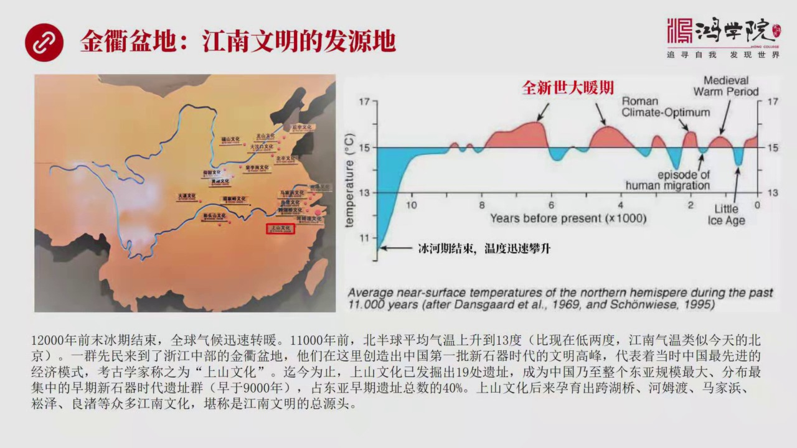

江南文明的发源地应该在金曲盆地就是折疆的精华和曲州在这个盆地中间如果我们看地图的这个左边这张地图我们可以看到在中国的新时期时代就是一万两千年以后一直到有文化有文字记录的这段历史我们会发现中国的它的最早的文明其实首先去起源于江南长江中游和下游还有华南的某些地区那么在这个区域中间上山文化也就是位于金曲盆...

---

### Slide 3

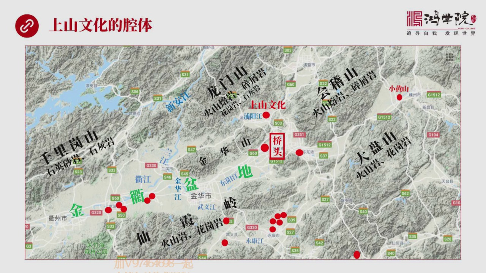

必须要运运于某种枪体也就是它的周围的自然环境气候包括水土等等那么金曲盆地有什么独特之处呢这张地图上我把各种信息集中标注在一起我们可以看到金曲盆地大概的地理的情况从渠州到金华这一代金曲盆地它的东西大概长度是200公里南北的平均宽度大约是20公里这是个霞长型的断裂型的这种对级盆地那么在这个盆地的四周由主...

---

### Slide 4

我们可以按流域进行画分当然这都是来源域考古学的很多报告还有专注我把它提电出来提电出来我们可以总结成几大流域渠江流域有很多遗址群渠江流域你会发现渠江在在这一段它的河流流速是比较缓的因为它的河道平均的波架比较小大概是千分之零零二五那么这些遗址群很有特点全部分布于渠江的难这是有原因的那么这些遗址但不光是渠...

---

### Slide 5

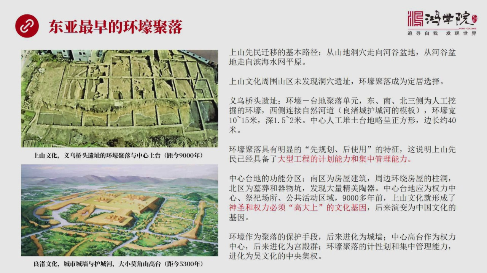

枪体选择非常合适所以这个地方发展起来了可以说创建了东亚地区最早的环豪巨落如果我们看上山文化之前你会发现几乎所有的更古老的文化全不是动血文化就是鲜民们只能居住在动血之中他们没有办法在平原扎根这中间有气候的原因有他们的技术水平工具水平的问题等等所以上山文化是我们启金发现的最早在平原上扎根的这样的一种定居...

---

### Slide 6

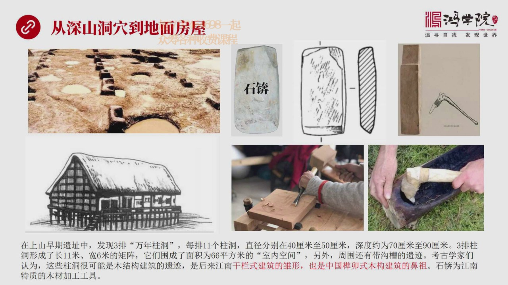

到地面建筑就适比要涉及到建筑房屋这就出现了建筑业建筑学的理念我们可以从这个左上族上可以看到这就是考古遗旨中发现的上山文化的这种城牌的驻动这称之为是万年驻动因为都有一万年历史了每牌是三个主动直径是40公分到50公分之间50公分就是半米大家可以想象这个柱子是非常粗的是需要很粗的树干所以它才能顶起比较高大...

---

### Slide 7

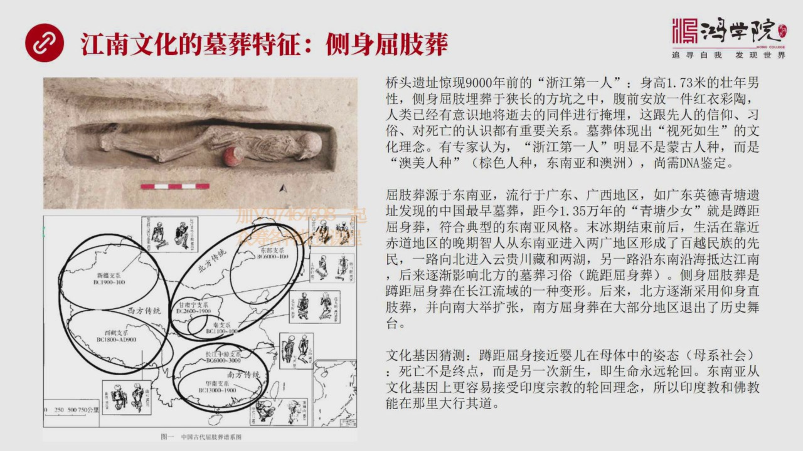

可以说姜南最早的木杂这个木杂它是个完整的一个第一个发现了完整的木杂这个木杂中是一个男性你会看到这个图上所展示的样它是测身取之脏就是它的腿部稍微有些弯曲手中抱着一个彩淘红色的这种彩淘气这种木杂特别重要因为它涉及到人们对死亡的看法所谓人生大事无非生死二字人活在这个世界上出生很重要死亡很重要这个社会怎么认...

---

### Slide 8

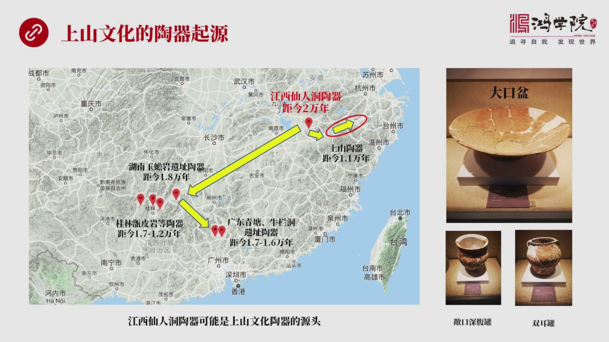

叫陶器这种陶器的起源是从哪里起源的我们先看这个左边这张大地图这张地图你会发现中国最早的陶器都是源于江南长江以南的地区其中最早的陶器是在江西仙人洞它所发现的这种制造的陶器究竟已经有2万年历史了应该是整个世界最早被确认的陶器是在江西当然从这个地图为什么我们可以看到它领警的政部员其实离金区盆地也很近所以从...

---

### Slide 9

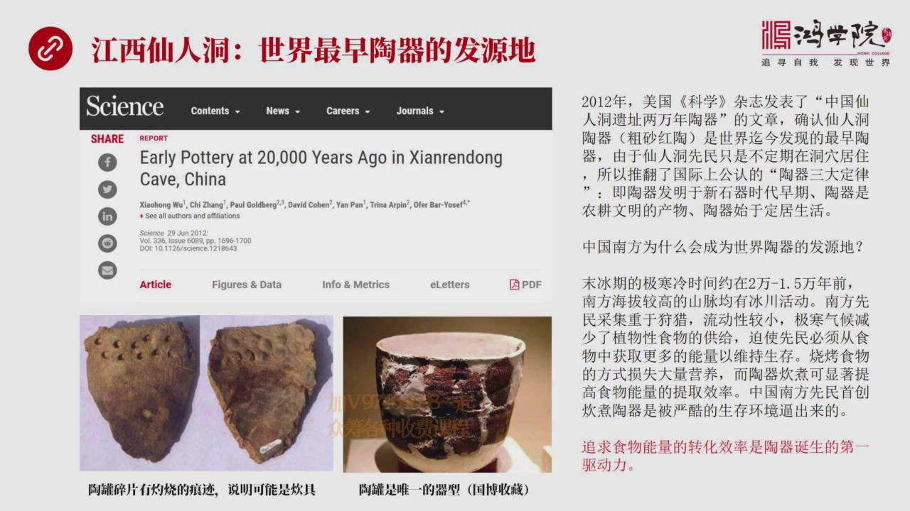

陶器是出现在仙人洞呢包括全世界可以说仙人洞这个陶器应该说是世界最早陶器的发源力这个结论在2022年美国科学杂志上发表了一篇文章得到了确认就是中国仙人洞已只两万年陶器确认了仙人洞它主要是这个它的陶器是粗沙红陶可以说是当今世界基金发现最早的陶器由于仙人洞这个仙名他们并不是长期定居在这个山洞中它是不断的这...

---

### Slide 10

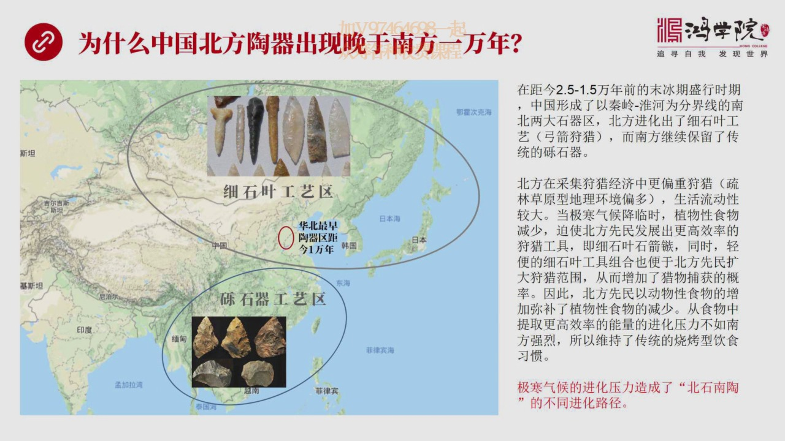

为什么中国北方它的淘气没有搞出来呢因为中国北方的淘气要比南方晚了一万年大家都知道北方更冷那不是更需要转化能量吗为什么它不搞淘气呢如果我们来看这个地图吧中国 北方 华北地区是北方最早搞出淘气的地区它的时间是聚金一万年而江西先生都是两万年可以说北方的淘气发展物案于南方一万年这跟我们很多人的观念是不一样的...

---

### Slide 11

是非常不同意时期的为什么因为制桃是一种伟大的技术制桃是一种伟大的技术进化的平台为什么我说它是一种技术进化的平台而不是单一的技术因为它涉及到很多领域的跨技术领域的范围非常广我记得以前我专门说过在我们读书会里面谈到过布萊恩·阿瑟他所写的这本书他把技术定义成什么叫技术技术是人类对自然现象有目的有计划的编程...

---

### Slide 12

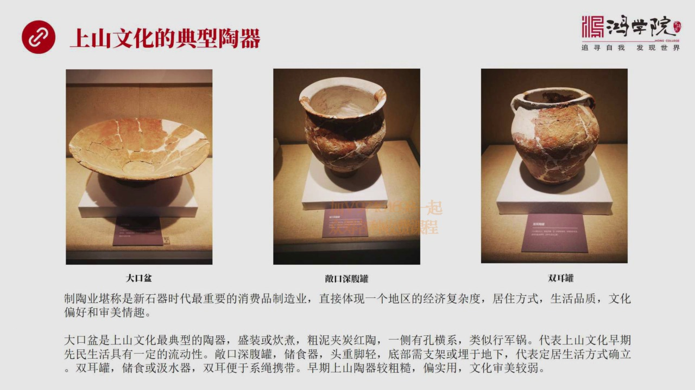

大口盆真是深浮贯还有双耳贯那么大口盆它是主要用来干嘛的它应该说是上山文化中最典型的这个器物它的主要的目的是为了成装还有吹煮这是它的核心的两大用处它的一侧是有一种有孔的它可以背着走就拿繩子一双可以背着走某种预上类似于新军锅所以上山文化中所发展出来首先你得吹煮啊没有这种吹煮器我怎么生活啊我怎么提高我的1...

---

### Slide 13

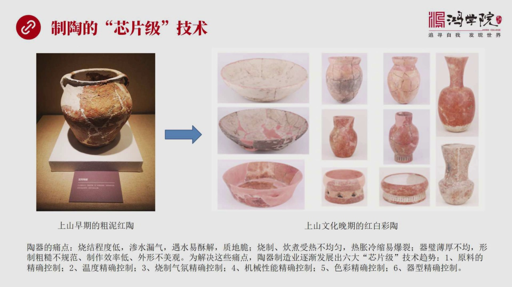

是聪明红陶后面到了乔头这个阶段九千年前从一万一千一到九千年之后你会到九千年之前的时候发现它的陶器已经发生了巨大的变化首先看起来这些陶器都更加精美外面都有红色的陶一特别重要是里面还有一圈白色的陶一说明什么说明出现的彩陶红白彩陶它的气形也更加地攻准漂亮而且沈美的这个特性也得意提高看起来非常好看那么这就说...

---

### Slide 14

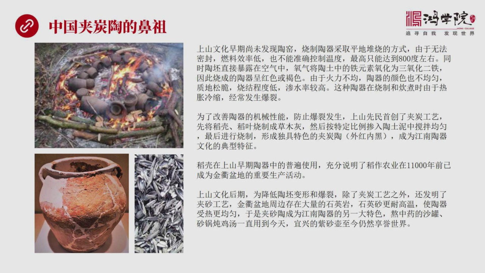

最突出的贡献是发明了夹探陶我们在上山一纸中你会发现这个考学家一直没有找到陶谣早期的这种一纸没有找到陶谣也就是说它要烧制陶器只能采取大家想想一想想想一想你怎么才能够烧制陶器呢如果没有陶谣的话你只能是平地堆烧就是把柴火就像我这个图片中所展现的样把柴火围在一起然后点着火然后把陶器放到这个柴火上面然后点着火...

---

### Slide 15

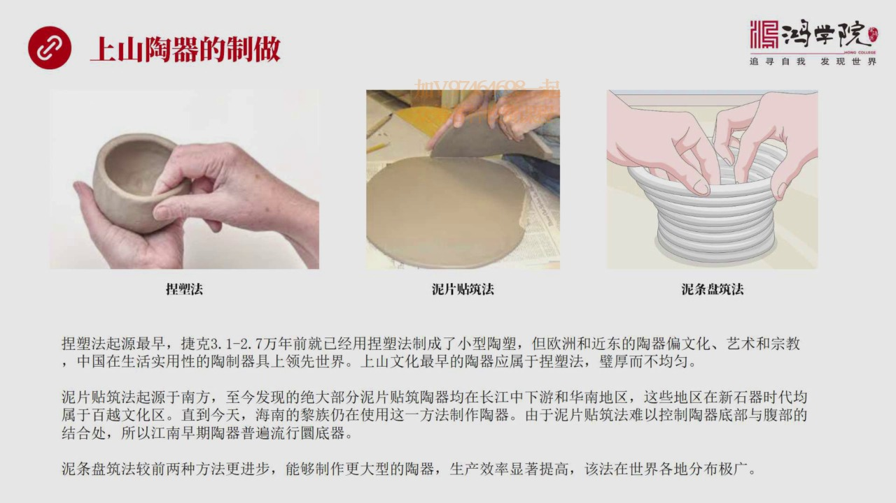

从世界各地来看的话逃期制作最早的阶段是三种捏速法就像包汤圆一样咱们活了面之后要包汤圆你在中间用手跟捏出一个窝来夹上心包脚子也是一个道理这是最早的捏速法如果说逃制屏最早发明人是谁到目前为止结课这个地方是发明逃制屏的最早的地方他在三万一千年到两万七千年之间就已经用捏速法做出了很多小型像大牧旨这么大的一些...

---

### Slide 16

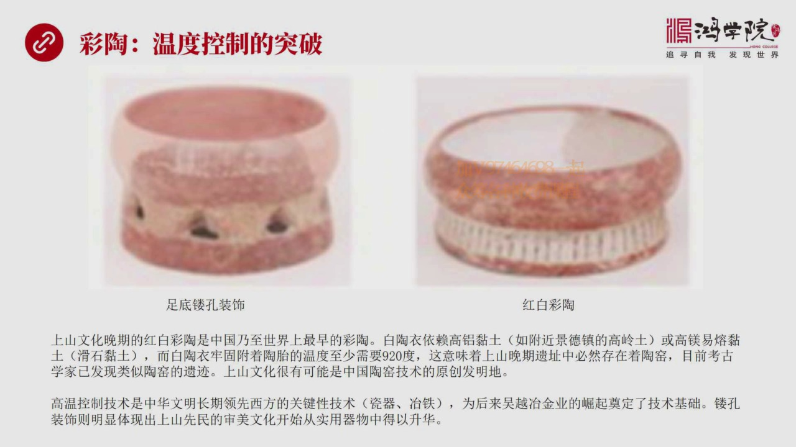

我们刚才所说这个上上文化到后期已经出现了彩桃彩桃意味着什么意味着温度控制出现了重大突破从这个图上我们可以看到又不要这张图红白彩桃红白彩桃意味着什么意味着上上文化有可能它是全中国买着全世界最早出现彩桃的地区而白桃的出现就是它要衣服在这种高旅年图或者高美年图它的这种胎壁之上你要想副作在上头你就必须要有更...

---

### Slide 17

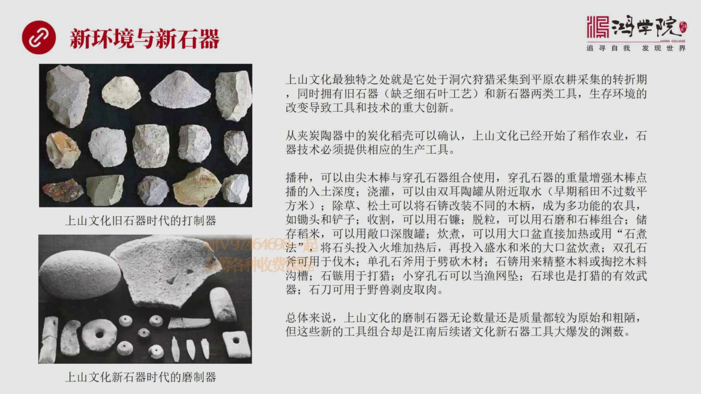

时期我刚才已经说了中国南方时期缺少这种戏时期就是戏时业工业发展阶段他现在从上山现在所发掘的一只中间大量都还是传统的这种历史器就是比较粗比较大的砍它就是傻大黑粗的这种时期注意北方的时期技术要远远高于南方而南方的制逃技术在初期要远远高于北方这是南北双方它的地理环境生活方式还有面对自然环境的变化所应对的路...

---

### Slide 18

盗座农业刚才我们讲了盗座农业其实有很多地方都生成是发源地比如说湖南地区比如说广东地区还有长江中下游还有湖北地区每个地方都说自己盗座农业的发源地这个不要紧因为盗座农业肯定是廠江绿于发生起来的我们以考古的这样一个依据然后来注意探讨那么大家都知道这个盗子分成野生盗还有这个人工盗野生盗就是我们看到图片中这种...

---

### Slide 19

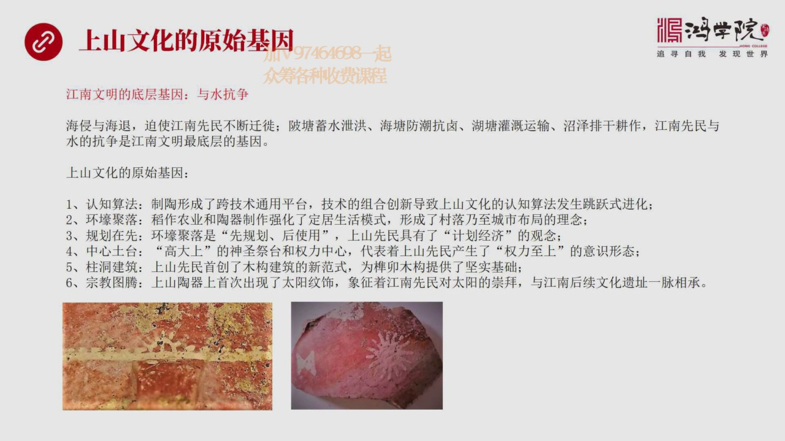

为什么我们重点说这个文化因为这个文化是从洞穴走向平原的第一个文明 第一个定居文明所以它具有所有文化的最早期的基因如果我们来体验一下的话我觉得有几种基因包括第一堂课文 我们讲到了江南文明整个的基层的底层的基因那就是雨水抗争首先是海清和海退破石江南鲜民不断的签议水涨上你就得撤水退下的时候你要进包括后来历...

---

### Slide 20

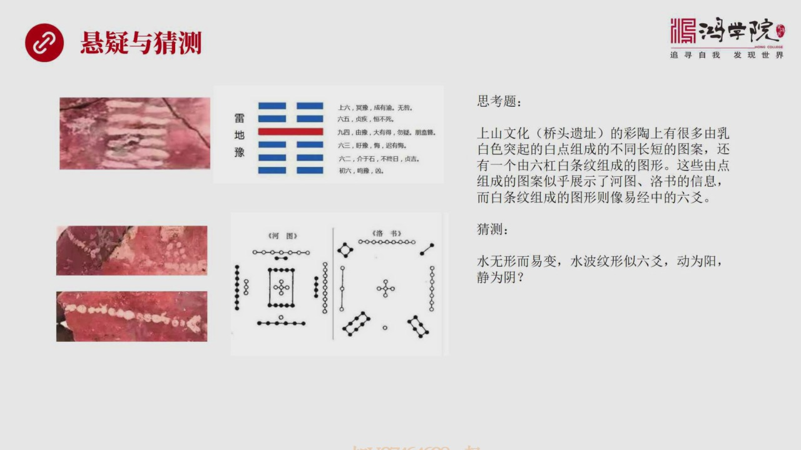

我称之为是旋仪所以我们要猜想一下这些东西是什么比如说在它逃击上好几个逃击上都出现了我们看左边这张图出现什么出现了类似于八卦的白形就是白色的调星图案这个图案看起来有点像这个八卦中的雷地域懂八卦的同学可以仔细想想这是为什么还有底下的这种照片提供了什么就是类似于核突落书的一些信息它出现了白色的点这些白色的...

---

### Slide 21

这堂课的主要内容这堂课我们其实归大鞋三句话金曲本地是上山文化运遇的枪体上山文化是江南文明的源头江南文明是盗座农业的核心区上山鞋名是首先从洞穴中走向平原追求在冰河旗结束之后占据最有力的生态位他们在金曲本地找到了运遇伟大文明的最佳枪体而这个枪体包括了六个典型特征山前台地海拔市中禁止远干水这个光组水封采集...

---

### Slide 22

今天咱们的客就上到这里谢谢大家

---
