# 核心课视频-51讲：美联储启动QE4（视频） — Detail Slide Notes

> **来源**：鸿学院核心课程  
> **幻灯片**：15 张

---

### Slide 1

美聯儲啟動變向QE4我們先看第一頁目前在華爾街大家都在爭論一個問題

<strong>All subtitles</strong>

> 美聯儲啟動變向QE4我們先看第一頁目前在華爾街大家都在爭論一個問題

---

### Slide 2

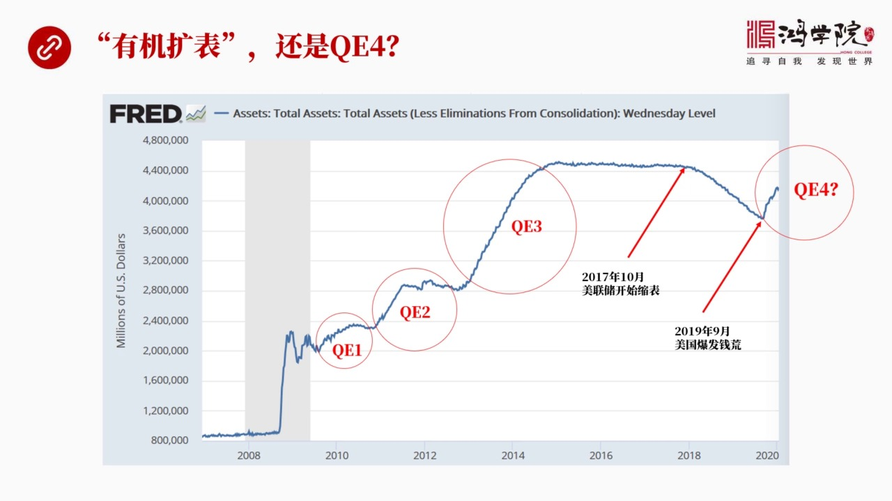

美聯儲是不是已經開始了QE4如果我們從這張圖上來看我們可以看到2008年金融危機之後美聯儲進行了三輪量寬鬆政策就是QE1QE2和QE3在這個圖中我們可以看到美聯儲的資產負債表有三次大幅度漏跳升QE量寬...

<strong>All subtitles</strong>

> 美聯儲是不是已經開始了QE4如果我們從這張圖上來看我們可以看到2008年金融危機之後美聯儲進行了三輪量寬鬆政策就是QE1QE2和QE3在這個
> 圖中我們可以看到美聯儲的資產負債表有三次大幅度漏跳升QE量寬鬆它的本質是什麼它的本質就是中央銀行美聯儲印超票同時買進市場中的美國國債這樣的話
> 就會使美聯儲的資產負債表膨脹那麼它所印發的這個超票流入到了金融機構他們的這種資產負債表之中就相當於把貨幣注入了整個金融體系美聯儲的目的是希望
> 這些銀行金融機構獲得這些資金之後能夠擴大對實力經濟的放貸那麼這就會啟動經濟擺脫經濟危機這個就是量寬鬆它的出使的設計目標當然經過三次量寬鬆之後
> 我們其實看到美國的經濟從GDP的增長速度來看出現了所謂的復蘇但是從整體的社會表現來看比如我們看到就業率是業率是在下降但實際上就業的參與率停止
> 在一個很低的水平之上那麼由於金融市場了價格高估股市 債市導致了整個社會的財富分配出現了嚴重的問題這當然也就是特朗普能夠對當選的重要原因那麼維
> 持了十年之九的就是貨幣寬鬆之下的所謂的經濟擴張到了現在已經越來越走向它的周期的鏡頭所以我們看到美聯儲他們非常希望能夠盡快的結束給我寬鬆因為你
> 已經持續了十年了如果經濟還起不來的話那就證明整個這套政策貨幣政策是有嚴重問題的所以為了這個目的在2017年10月我們看到美聯儲宣佈開始縮表就
> 是要讓資產負責表恢復到正常狀態要讓利率恢復到正常狀態所謂的正常狀態對於美聯儲的資產負責表而言如果我們看2008年之前你會看到美聯儲人資產負責
> 表的規模很小大概就是七八千億美元而在量貨寬鬆第三輪結束之後QE3結束之後它最高曾經達到過4.5萬億美元當然如果說仍然維持這麼高的資產負責表你
> 就無法解釋量貨寬鬆政策到底有用到底起到什麼樣的作用是不是有用所以縮表就是一種驗證如果說資產負責表回到了過去那個水平金融以及之前的水平同時利率
> 從接近漁林恢復到正常的聯邦基準利率水準也就是金融以及之前的大概5%經濟還能撐得住這就代表著量貨寬鬆政策成功了但實際上我們從2019年的情況已
> 經看到金融市場出現了重大的前荒危機也就是從2017年的10月每年初開始縮表之後僅僅進行了兩年縮表這個規模也不大大概7000億美元左右那麼到了
> 2019年的9月整個金融市場就已經吃不住劍了這就是我們看到的去年9月爆發的回購市場的前荒我們在以前的核心課中專門分析過這個問題但是今天我們會
> 有一些重大的新的信息的補充和更新讓我們能夠更完整的了解美國回購上到底出了什麼樣的問題那麼從9月份之後一直到現在四個多月時間我們看到美聯儲的資
> 產負債表非但沒有進一步縮減反而開始大幅反彈這個大幅反彈的速度和規模應該說都超過了前三輪Q1、Q1、
> Q2和Q3所以現在市場中普遍認為美聯儲從2019年的9月以後進入了第四輪量貨寬鬆也就是Q1、
> 4所以我們今天來重點分析一下這樣的一個Q1、4它究竟是一種什麼性質它要達到什麼樣的目的它能不能成功Q4有沒有可能退出這都是今天我們要重點談論的話題我們翻下一頁如果我們來看9月前往之後

---

### Slide 3

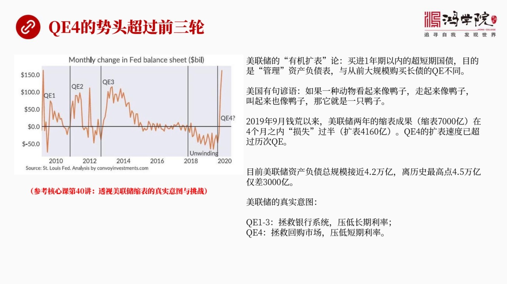

美聯儲資產負債表的擴張速度和它的規模我們會發現Q1、4的它的來的抖度明顯超過了前三輪當然美聯儲他們有個說法他們拒絕承認現在搞的是Q1、4他們稱之為現在美聯儲的搞的這什麼呢是有機擴表而不是量貨寬鬆主要論...

<strong>All subtitles</strong>

> 美聯儲資產負債表的擴張速度和它的規模我們會發現Q1、4的它的來的抖度明顯超過了前三輪當然美聯儲他們有個說法他們拒絕承認現在搞的是Q1、
> 4他們稱之為現在美聯儲的搞的這什麼呢是有機擴表而不是量貨寬鬆主要論點是什麼主要論點就是在Q1、
> 4的過程中或者在這輪資產負債表的擴張之中美聯儲主要買的是一年期以內的超短期國債目的是為了管理資產負債表這個跟他們以前大規模的去買長期債券是不
> 一樣的這是美聯儲的基本論點與此同時他們所持有的NBS就是資產底下證券的規模仍然在收縮所以美聯儲堅持認為我們這不叫Q1、
> 4我們這叫有機擴表基本的原因就是我們買的是短債短債12月之內就會逐漸的退出到期了到期我不增加這個資產負債表自然會回落所以我們這是管理資產負債
> 而不是真正的大規模持續不斷的擴張資產負債表當然我們從剛才那張圖上已經看到兩萬中四反彈的規模其實它跟前三輪這個兩萬宗無論從模式還是它的性質在我
> 看是一回事這就是美國有一句言語如果有一種動物看起來像鴨子走起來像鴨子叫起來也像鴨子那麼它就是一隻鴨子無論美聯儲怎麼解釋以什麼方式來說我們看到
> 資產負債表的大幅膨脹這是一個事實跟前三輪兩萬宗沒有本質區別那麼如果我們來看這回資產負債表反彈的規模你會看到速度是非常驚人的規模也非常非常大那
> 麼從2019年的9月前荒以來美聯儲2年就是17年到19年2年縮表的成果一共是7000億但是在四個月之內這個成果就損失了過半因為這四個多月以來
> 美聯儲資產負債表膨脹了4160億美元你兩年才說7000億我四個月就給你反彈4160億當然這個規模和速度是相當驚人的目前美聯儲資產負債表總規模
> 達到了4.2萬億它最低的時候是3,7000多億那麼這4.2萬億離歷史最高點也就是第三輪那樣寬鬆結束之後歷史最高點是4.5萬億現在是4.2萬億
> 緊緊還差3,000億所以這輪QE4來的試頭是非常的凶猛的那麼美聯儲的真實意圖是什麼在我看來它在前三輪的另外我看從中它的主要目的是為了拯救銀行
> 體系因為當時全美國的銀行面臨著整體性的崩潰的威脅大量印鈔票把這些錢塞給這些銀行體系讓他們獲得足夠的資金才能維持這些企業的經營這些銀行的正常運
> 轉同時它購買長載的行為主要是為了壓低長期利率的走勢因為美國當時出在嚴重的負債之下長期利率如果太高整個經濟也會崩潰那麼兩塊鐘四就是QE4這回它
> 主要買的是多晚載它的核心目的是為了拯救美國的回購市場主要前三輪是拯救銀行體系而最近這一輪兩塊鐘四主要是為了拯救回購市場它的一個主要目標是為了
> 壓低短期利率短期利率就是回購利率所以我們明白了它是真實意圖之後我們再看一下它如何做到這一點翻下一頁首先我們要看一下

---

### Slide 4

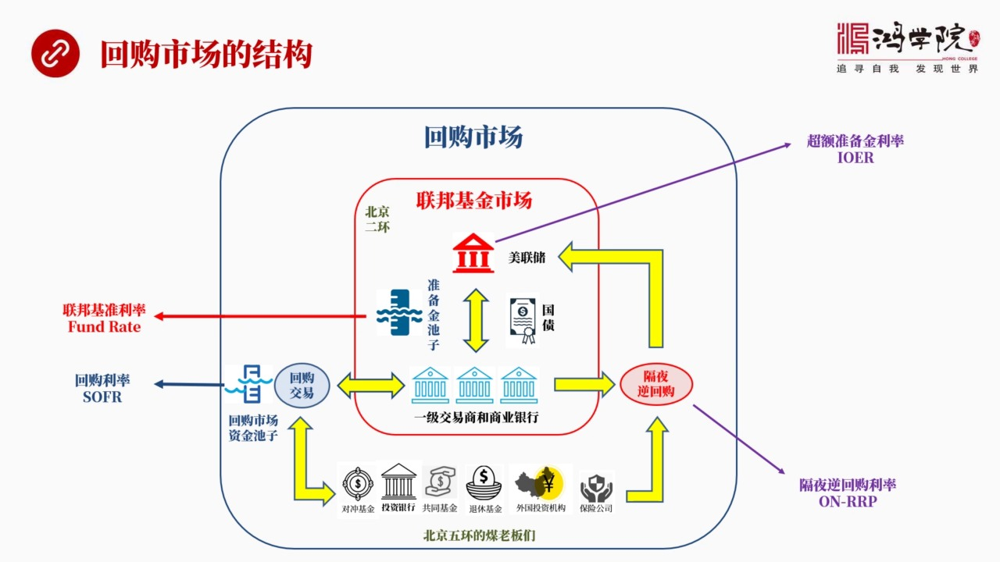

它這個壓低短期利率的核心的東西核心目標是為了壓低回購市場的利率當然我們這美聯儲有好多利率比如說聯邦基準利率是它的利率之矛回購利率這是市場中的回購市場中形成的交易利率還有各種各樣的其他利率這些利率到底什...

<strong>All subtitles</strong>

> 它這個壓低短期利率的核心的東西核心目標是為了壓低回購市場的利率當然我們這美聯儲有好多利率比如說聯邦基準利率是它的利率之矛回購利率這是市場中的
> 回購市場中形成的交易利率還有各種各樣的其他利率這些利率到底什麼樣的關係我們以前的核心課我專門講過我這一次的課件中把上次那個比較複雜的不太直觀
> 和形象的圖進行了重新的梳理我想用一個更簡單更直觀大家更容易理解的就是類似二環和五環這樣的一個概念來吧這個核心的回購市場再給大家解釋一下首先我
> 們來看這張圖這張圖的外面一圈就是回購市場裡面這一圈用紅線標誌出來的就是聯邦基金市場當然這兩個市場都屬於貨幣市場中間的組成部分那麼我們先看裡面
> 這一圈聯邦基金市場裡面這一圈我們可以形象稱之為是北京的二環北京二環裡面當然有金融街金融街裡面有中央銀行還有中東公聯交這些大銀行那麼在裡面這一
> 圈裡頭我們直觀來說就是北京二環裡面它所形成的市場叫聯邦基金市場當然它的核心是美聯儲美聯儲還有美國的商銀行體系醫生交易商等等這些人都居住在二環
> 以內那麼他們所形成的這個市場它的運作原理是什麼呢在金融危機之前美聯儲如果說我要加稀0.25個百分點它是怎麼來實現的呢主要是靠吞吐國債就是美聯
> 儲和醫生交易商之間通過吞吐國債來形成這個資金池的變化比如說我們在吐中可以看到裡面有個準備金池子其實形象說就是北京二環中間的中南海它也是個水池
> 如果我要實現利息比如說我要讓它調整0.25個百分點那麼我這個時候如果是投放國債美聯儲如果市場中投放國債它就會把金融體系中間的流動性抽回來就是
> 我拋出國債拿回資金回融資金那麼整個這個水池的水位就會變化那麼水位如果一旦下降好那麼利率就發生了變化所以它是用這個辦法通過吞吐國債來調整聯邦基
> 準利率就是如果我要降稀我就往實資利注稅注稅就是我印鈔票在市場中去買國債如果我要加稀我就要抽稅從這個中南海裡面抽稅這個抽稅就是投放國債回收流動
> 性讓你這個水位的目標讓這個水位的最後是靠近越來越靠近我制定了目標利率所以在2008年金融疫情之前美聯儲要經常做一個公開市場操作公開市場操作就
> 是投放國債或者回收資金通過這兩種方式來調節中南海的水位讓它逐漸逼近美聯儲的目標利率就是聯邦基準利率但是在金融危機之後美聯儲搞了三輪量和寬鬆剛
> 才我們已經說了像市場中注重大量的流動性資產費代表曾經膨脹到4.5萬億美元那麼大量的資金就注入給了銀行形成了超過準備金這個超過準備金的數量最高
> 峰達到2.6萬億美元換句話說在那種情況之下美國的銀行各個都有大量的現金所以他們彼此之間不再擁有相互拆解的需求以前在金融危機之前為什麼你能通過
> 吞吐國債來調整聯邦基準利率呢就是因為銀行之間存在著拆解資金的需求所以他自然會形成聯邦的基金市場每個銀行在這個市場中彼此同業同行之間僅拆解他有
> 界有帶他就會形成一個利率市場但是由於三輪量和寬鬆注入了好幾萬億的資金每個銀行都有錢了大家不需要彼此拆解了那麼聯邦基金市場就陷入了貪汗那這個基
> 準利率怎麼制定呢比如說美聯儲要說我現在要調整一下聯邦基準利率降息我怎麼辦以前降息我是可以通過放水的方式印鈔票買國債但現在大家都不缺錢了都不缺
> 錢這個池子已經到處都是水了所以在這種情況之下聯邦基金市場彼此之間沒有拆解需求這個市場利率怎麼形成呢於事忽每聯儲就制定了一個就是我們用紫色箭頭
> 畫到右上角的就是超過準備金利率就是銀行把他用不完了錢放在每聯儲的超過準備金賬戶上以前這個數是很小的幾百億也沒有利息是零現在每聯儲為了控制聯邦
> 基準利率為了讓他發生作用他現在給超過準備金賬戶上設定了利率這個利率叫超過準備金利率就是IO12IO12這個利率設定之後他們就把這個利率當成一
> 個所謂的房領利率就是天花板利率聯邦基準利率必然是低於他的什麼原因聯邦基準利率為什麼會必然低於聯邦這個超過準備金利率呢因為超過準備金利率如果我
> 們假設一下銀行之間如果相互拆借超過了這個利率如果超過了這個超準備金利率那麼人家為什麼還要彼此拆借呢我還不如把錢放在超準備金上然後每聯儲自動會
> 給我錢所以我們會通過超準備金賬戶這個利率可以看出每聯儲設定他的所謂天花板利率的一個主要的正存目標也就是說聯邦基準利率理論上不應該超過超準備金
> 利率超過的話這些賬戶上的錢就會勇向聯邦基準利率市場去把這個利息給加下來考慮到你要有很多經營和運行方面的這樣的成本所以聯邦基準利率應該低於超過
> 了民賬戶利率的20個積點左右4到4個積點的20個積點之間應該比它個率低好這個就成了每聯儲在2009元金融危機之後所確定的一個積準利率的制定的
> 上限天花板利率同時我們可以看到在二環以外還有一個五環市場五環市場就是在類似北京五環在五環裡面還有很多其他的非銀行金融機構就是非銀行類的金融機
> 構包括什麼呢比如說對重基金投資銀行共同基金還有外國投資人包括保險公司等等等等凡是不是西納處戶處去的這些金融機構都叫非銀行類的金融機構他們普遍
> 生活在五環一線那麼在五環裡頭也有一個池子這個資金池我們可以想像城市北京的朝陽公園裡面那個朝陽公園裡面那個湖朝陽湖那個市場那個池子其實就是一個
> 回購市場所形成的資金池那麼回購利率它主要是在這個池子中由於共求關係來形成的回購利率那麼回購利率回購我們知道它類似於擋戶就是各大金融機構之間彼
> 此拆借銀行之間是沒有抵押的但是金融機構非銀行類的金融機構對重基金和銀行之間或對重基金和其它的退休基金之類的這些機構拆借的時候在五環那個市場朝
> 陽公園裡面那個市場大家是要拿東西作為抵押的你得抵押國債得抵押NBS或類似的這些高等級的債券作為制押才能獲得融資那麼這個市場一般是第二天叫還所
> 以是隔夜拆借就是我今天晚上壓給你這麼多債券借了來這麼多錢我第二天早上我保證我還以前你把債券還給我所以這個就叫隔夜回購市場那麼在這個市場中形成
> 的一個利率當然就是回購利率回購利率和聯邦基準利率之間的關係是一種什麼樣的關係呢這兩者應該是一致的也就是北京的中南海二環裡面的中南海和五環裡面
> 這個朝陽湖這個水應該是相通的從途中我們也可以看出來就是裡面的銀行機構跟外面的這些非銀行類的金融機構是可以相互流動資金的只要你能相互流通資金利
> 率就應該相差無幾才對到底很簡單如果說回購利率就是五環市場了這個五環朝陽湖園裡面這個市場利率如果非常高那麼二環裡面中南海後海裡面的水自動就會流
> 出來流出來他就可以套利相反如果二環裡面的中南海的水位第一了朝陽湖五環的這個水位高那麼這個資金也會流進去也可以通過回購交易市場被銀行所借走所以
> 這兩個利率應該相互之間是保持一致所以我們看到聯邦基準利率和回購利率聯邦基準利率是個政策性的利率回購市場形成了這個利率也是純自然通過回購了自動
> 交易出來的所以他叫交易形成的這種利率這兩者應該一致這個原理搞明白之後我們再看美聯儲他定了一個上線就是我們看到了超級美金賬戶這個利率聯邦基準利
> 率應該比他低回購市場應該跟聯邦基準利率一致那麼下線怎麼辦如果利率太低了會不會出問題應該怎麼來給這個利率上定一個低這就是美聯儲設置了一個新的在
> 誤還比如說在旺金內帶設置了一個新的這麼一種我們可以說是他設置了一種新的這種進行交易的機制就叫隔夜逆回購當然逆回購這個詞中國和美國的用法是不一
> 樣的美國永遠是站在交易方這個角度來談正還是反正回購還是還是逆回購中國是站在人民銀行的角度站在央行角度來看所以在中國所說的逆回購是向中央銀行向
> 市場市場市場資金就是中央銀行央嗎給錢這個叫逆回購但在美國如果我站在對方的角度來考慮那麼這個逆回購我們看到這個右邊這個逆回購市場實際上是中央銀
> 行在從市場中收錢所以我們要理解這兩者概念是不一樣了看你站在誰的立場上說話在美國是站在交易方的立場上說話這個逆回購隔夜拆借的這個市場他的機制主
> 要是那麼在五環生活的這些非銀行類金融機構也包括這個二環面市這個居住的這些銀行他們都可以向美聯儲進行放待如果他們有多餘的資金美聯儲說你們借給我
> 吧借給我我設定這個利率就是所謂隔夜逆回購利率這個利率就是我向你們借錢的利率換句話說這些資金是流向美聯儲的美聯儲要給個代價這個代價就成了利率市
> 場的底部地板利率什麼原因啊就是如果說在五環還有比這個地板利率還要低的這樣的一種利率的話就沒人願意去做了我還不如毫無風險的把錢借給美聯儲他肯定
> 會還毫無疑問那麼我為什麼還要把錢以更低的更便宜的這個成本借給其他人呢沒必要所以隔夜逆回購利率設置是為整個利率上設置了一個底部低於這個利率大家
> 就不幹了大家寧願把這個錢借給美聯儲所以我們在經常圖上在右邊兩條子線這是美聯儲設定的一個是天花板利率超過準備金利率另外一個是底部也是美聯儲設置
> 的隔夜逆回購利率這兩個利率卡死了利率波動的上線和下線那麼在中間的一個是聯盟基準利率另外一個是市場的回購利率這兩者聯盟基準利率和回購利率應該幾
> 乎是完全一致了那麼他應該在天花板的頂和底之間上下波動這就是一個正常的回購市場他運作的基本的框架那麼在這裡面最重要的是我們要注意到有兩個資金的
> 池子一個是準備金這個資金池也就是中南海那裡面形成了水位還有一個是在五環以內的潮流公園潮流公園也有一個湖那個是回購的池子有大量有錢的金融機構我
> 們可以把他們通促成為生活在北京五環的沒老闆們比如說對中基金比如說投資銀行還有很多有現金的特優基金共通基金等等保險公司這些人的錢他主要是在潮洋
> 湖的那個公園裡面大家進行交易那麼這兩個水池之間資金池是相互聯通的所以正常情況之下剛才我們已經描述了這個過程四個利率兩個資金池兩個資金市場是完
> 全打通的正常情況之下就不會出現太大的變故好我們看下一頁但問題居然出現了

---

### Slide 5

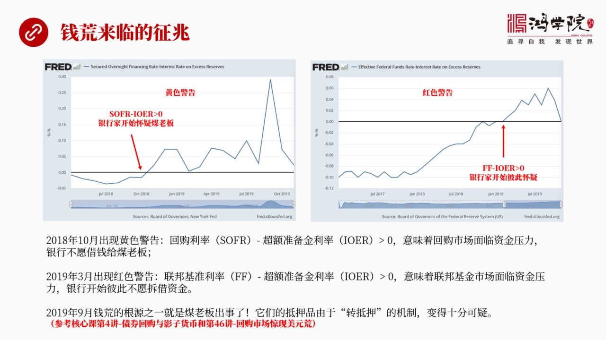

就是我們看到了9月份爆發的前荒其實在9月爆發前荒之前已經有一些徵兆了這個徵兆就是不正常的東西就是不正常的現象第一個我稱之為是黃色警告黃色警告什麼時候出現呢實際上是在2018年的10月出現了黃色警告這個...

<strong>All subtitles</strong>

> 就是我們看到了9月份爆發的前荒其實在9月爆發前荒之前已經有一些徵兆了這個徵兆就是不正常的東西就是不正常的現象第一個我稱之為是黃色警告黃色警告
> 什麼時候出現呢實際上是在2018年的10月出現了黃色警告這個警告如果我們看左頭的話你會發現在10月以後2018年10月以後回購市場的利率居然
> 超過了天偶版的那個超過什麼經歷率回購我們跟他說了就是潮洋湖圓的那個利率沒老闆們交易的這個利率怎麼會超過這個超準備經的利率呢如果超過的話那麼二
> 環裡頭的錢應該有到五環來不應該持續不斷的超過這說明什麼問題說明五環那一圈的市場出現了資金的緊張的壓力而且這個壓力持續不斷的從2018年的10
> 月一直持續到2019年9月爆發的前方危機持續了這麼長時間從這張圖讓我們可以螢幕了然說明什麼說明銀行二環裡面的銀行開始懷疑沒老闆的信用開始懷疑
> 沒老闆所以不願意把這個錢借給他們哪怕你給我的利率更高但是對不起我還是不借所以就會出現一個倒掛問題那麼更嚴重的是右邊這張圖我稱為是紅色警告紅色
> 警告是什麼問題呢就是在2019年3月出現了一個新現象這個新現象就是聯邦基準利率超過了超準備經的利率也就是二環裡面銀行之間彼此都不信任了所以他
> 們彼此拆借這個利率比例超準備經率還要高銀行之間開始彼此攜帶不借這裏面就更奇怪了因為銀行之間的這種信用是比較高的那麼如果說聯邦基準利率長期持續
> 不斷的超過你這個天花板那麼天花板裡面天花板意味什麼意味著大量銀行超準備經的存在中央銀行的帳戶上它應該湧向聯邦基金市場因為這中間有立差很明顯為
> 什麼不去套利呢這就說明了一個嚴重的問題銀行之間不太相信對方所以你雖然在你是不是某一家銀行你想找我這個大銀行貸款但是我覺得你的信用有點問題哪怕
> 你給我更高利息我也不願借錢給你這個現象出現在2019年3月一直持續到錢荒爆發所以這裏啊個現象第一個是資金不願意從二環以內流向五環這代表這沒老
> 闆銀行對沒老闆的信任程度在下降第二個就是在二環以內的銀行彼此之間也不願意借貸這個現象說明銀行之間的信任出現了嚴重的問題其實我們看到的2019
> 年9月前荒爆發了一個重要跟原之一就是沒老闆們出事了沒老闆們出事之後雖然在回購上上他是以國債作為抵押來借錢理論上說應該沒有風險但是我們以前核心
> 客專門講過比如說核心客第四講我講到過銀子銀行講到過債戰回購里面專門談到過還有46講回購市場了美元荒的時候專門講到過美國的回購上是存在著1.4
> 倍的轉抵押的問題也就是沒老闆們手上拿了這個國債他的所有權到底屬於誰這是有爭議的他可能背後有兩個或者有其他的人生成同時擁有他的所有權所以如果沒
> 老闆倒閉了那麼他抵押給你的這個所謂的資產如果同時有兩個人在爭這就會導致大量的法律官司在這種情況之下就沒人願意冒這個風險因為我把錢借給你了你壓
> 過的東西別人說是另外人的那我這個到底能不能拿到手就不好說了所以你的利息在高比如說當時衝到10%我也不願意去冒一個喪失本金的危險所以每天主當時
> 在9月份說特別不理解為什麼這些銀行機構賬上趴著1.4萬億的準備金外面這五環市場已經炒到了10%裡面在2%為什麼這些錢不願意衝出去無風險套利著
> 8%實際上並不是無風險是有風險的這個我們上一次核心客中講到回購前方的時候專門探討過這個問題那麼今天我們要增加一些重要的細節我們看下一頁這個重要的細節

---

### Slide 6

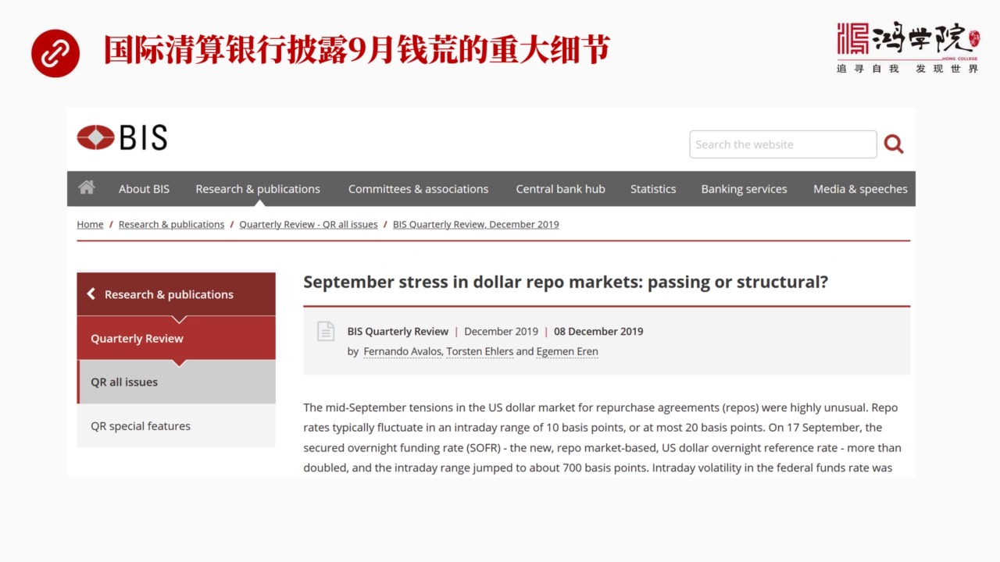

就是在去年年底吧2019年12月份國際清算銀行經過了幾個月的調查和研究當然我們知道國際清算銀行號稱是央行的央行就是央行如果叫央嗎那麼國際清算銀行就是央老老央老老手上掌握著大量的分類數據大量的精確的數據...

<strong>All subtitles</strong>

> 就是在去年年底吧2019年12月份國際清算銀行經過了幾個月的調查和研究當然我們知道國際清算銀行號稱是央行的央行就是央行如果叫央嗎那麼國際清算
> 銀行就是央老老央老老手上掌握著大量的分類數據大量的精確的數據實際上他們更加具有全局性分析的更細所以國際清算銀行的報告是很值得認真讀的他們發表
> 了這個應該是在12月發表的這個篇報告專門搶專門分析和研究了美國9月份回購市場出現的問題到底是一種什麼性質的問題在這個報告中他提出了好幾個非常
> 重要的細節是我們以前課程中沒有講到的所以我們有必要把它增加進來然後對整個回購市場出現前荒他的性質以及未來他還將出現哪些問題才會有一個更深入的理解好我們看下一頁在這篇報告中

---

### Slide 7

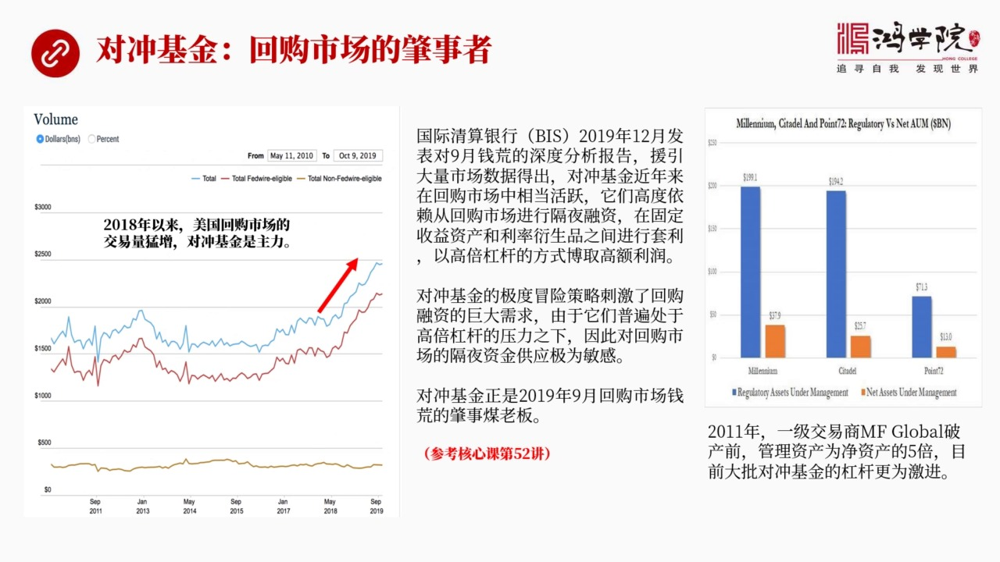

國際清算銀行首次明確的指出了回購市場的照試者是誰是誰啊對衝擊精我們以前看到的這個就是做了這種分析包括世界各國很多專家學者寫的這些分析文章還有很多華爾街的這些交易原本寫的這些分析文章他們都不具有全面的數...

<strong>All subtitles</strong>

> 國際清算銀行首次明確的指出了回購市場的照試者是誰是誰啊對衝擊精我們以前看到的這個就是做了這種分析包括世界各國很多專家學者寫的這些分析文章還有
> 很多華爾街的這些交易原本寫的這些分析文章他們都不具有全面的數據的這種全微性國際新冠銀行擁有的數據量比他們更全所以他利用了大量市場交易數據得出
> 了一個照試者的一個非常清晰的這麼一種確認對衝擊精出問題了也就是說對衝擊精是山西眉老闆住在五環的這回照試者就是他們他們是怎麼照試的這個話題我們
> 是作為下一節核心課是專門要重點分析的不只是對衝擊精還有他在回購市場中所運行所涉及到的清算問題都是這次回購市場出現前荒了重大的原因當然我們這一
> 回課是專門講兩萬鐘四所以有關照試者這個問題我們往後放那麼為什麼對衝擊精會出問題主要是他們非常非常的依賴回購市場格業融資也就是我作為一個對衝擊
> 精我手上有大量的國債我在回購市場中把它抵壓出去然後拿回大量的現金我拿回這個現金做一種高風險的博弈高倍槓槓的高風險的博弈也就是我會在利率市場我
> 們以前專門講過利率要七這個市場也就是在我持有的或者我有倡位的這種固定收益類的資產上和利率衍生品的這個市場之間我進行套利這個套利由於加了槓槓之
> 後本來在正常情況之下這個立差非常小的但是我如果加上十倍的槓槓中間利率就出來了這個具體的原理和具體的做法我們留到下一堂課去講但是我們在這需要明
> 白的是一個這是一個高倍槓槓的高風險的一個博弈那麼也正是由於對衝基金大規模的進行這樣的一種套利行為導致他們對回購市場的融資需求及速膨脹如果我們
> 看左邊這張圖我們會看到在2018年以後美國的回購市場的交易量開始猛增現在是這個2.5萬億美元在金融危機之後很長一段時間裡面它只有1萬多億現在
> 達到了2.5萬億這個市場僅僅是三方回購市場關於三方還是雙邊還是現在的集中清算這個是我們下堂課要講的主要內容我們在這裡只需要理解只需要明白20
> 18年以來美國回購市場空前火熱一個主要原因就是對衝基金非常強烈的渴望利用這個市場去獲得大量的融資利用這個融資再加上高備槓杆來進行固定資產固定
> 收益類的這種資產和利率類的這種衍生品之間的套利使得這個市場空前的爆炸超級火躍但是由於對衝基金是使用了高備槓杆的所以他們就必然會對回購市場隔夜
> 拆解每個晚上要戒第二天早上就得還錢所以你會對這個回購市場的資金它的來源會變得非常的敏感由於加了槓杆一旦你獲得不了資金不能夠滾動那就完蛋了這就
> 會出現大規模的嚴重的這種所謂前荒樂危機就會導致這種基金背破要雪崩式地跳到大甩賣它的資產如果說同時有大批對衝基金都這麼幹那整個資產市場就會迅速
> 迅速踏防就會衍生出金融危機來因為大量對衝基金會倒閉他們一島加上海量泡沼資產資產價格會暴跌就會是很多銀行和跟他們相關的跟他們有交易的金融機構被
> 拖下水金融危機就是這麼爆發的那麼這個問題我們會放到核心課的第52中52講中間來分析他的原理和他的一些具體的運作的一些細節問題由於這個對衝基金
> 的高倍槓杆高倍槓杆平均都在10倍以上如果我們看立上出問題的這些很多這種基金吧你比如說2011年美國的一級交易商MF Global它破產的時候
> 它管理的資金管理下了這種總的資產規模是它自由的進資產的五倍左右而現在對衝基金的幅度都遠遠超過了它所以你只要加了槓杆或者你整個管理資產規模很大
> 而你自由的資金進的資產很少那麼你就很容易進入破產狀態一個浪子打來這公司就完了一旦完蛋就會把你跟所有有交易有聯繫的金融機構全部套下水就會引發大
> 規模的連鎖式的破產好我們再看下一頁由於它高倍槓杆所以對衝基金對於回購市場的資金

---

### Slide 8

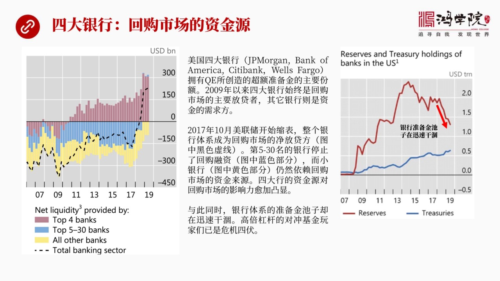

是高度敏感的而這個資金的主要供應者是誰呢就是美國的四大銀行這個也是國際清算銀行它提出了一個非常重要的新的信息美國四大銀行我們都知道捷匹摩根美國銀行花期還有我要發購應該叫副國銀行吧我要發購包括這四家銀行...

<strong>All subtitles</strong>

> 是高度敏感的而這個資金的主要供應者是誰呢就是美國的四大銀行這個也是國際清算銀行它提出了一個非常重要的新的信息美國四大銀行我們都知道捷匹摩根美
> 國銀行花期還有我要發購應該叫副國銀行吧我要發購包括這四家銀行雖然國際清算銀行並沒有點這四家銀行但是基本上它提到了是美國最大的四家所以我們根據
> 這個對於美國的金融體系的了解我認為它說了就是這四家銀行這四家銀行實際上也正是美聯儲量的寬鬆極倫下來之後獲得了最大的資金注入的銀行所以他們的潮
> 流準銀賬戶就是美國整個銀行體系的潮流準銀賬戶是高度集中於這四大行的其實這四大行也是2009年以來回購市場資金的主要提供者他們是回購市場的資金
> 的源頭而其他的銀行普遍是需要從回購市場中去借錢的如果我們看BIS就是國際清算銀行提供了一張數據圖左邊我們會看到美國最大的四家銀行它用的是紅線
> 紅色的色塊第五到第三十名的二十五家銀行用的是藍色其他的所有中小銀行用的是黃色從這張圖上我們可以非常明顯的看出2009年以來主要是上面這一塊也
> 就是四大銀行向回購市場提供資金那麼底下這些第五名以後的所有銀行主要是需要資金也就是借錢房大銀行四大銀行是放待房但是這個過程到2017年10月
> 主要2017年10月美聯儲開始縮表了它以縮表之後我們會發現藍色這一塊也就是第五名到三十至二十五家銀行不再借錢了另外小銀行仍然需要回購市場的融
> 資這張圖它非常的有說服性如果我們看這個中間顯示出了黑色的虛線黑色的虛線就是把所有銀行作為一個整體來看它們跟回購市場的這種關係它到底是借錢房還
> 是拿錢房那麼我們可以看到在大多數時間裡面整個銀行體系是屬於從回購市場中去拿錢的但是到了2017年以後就是到2017年10月這個美聯儲開始縮表
> 之後那麼這條曲線反過來了也就是銀行體系成了向回購上供應資金的地方所以在這個整體全部如果我們把整個銀行體看著一個整體的話那麼這個整體中間它作為
> 回購市場資金的供應房資金員它的主力是誰絕對主力就是四大銀行所以這四大銀行的資金的充裕還是緊缺直接影響了回購市場資金的源頭它們如果資金充裕回購
> 市場就會有活水如果它們的資金陷入哭結那麼整個回購市場中間那些玩高位槓槓的那些對衝基金都會面臨強大的壓力越來越大的壓力這就是我們從這張圖中國際
> 經營銀行提供了一個重要細節可以得出這樣的一個結論我們在看右邊這張圖右邊這張圖說的就是我剛才所說的四大銀行能夠給回購市場提供的資金源頭正在快速
> 的哭結比如說我們看右邊這張圖這個國際經營銀行的這張圖它說明一個什麼問題這是紅色這條線代表這整個美國銀行體系所擁有的操作準備金就是資金池裡面操
> 作準備金賬戶上是個資金從2.6萬億的這樣一個高峰不斷的下跌到了2018年以後開始加速下跌加速下跌那麼在加速下跌過程中它其實能夠給回購市場提供
> 的資金來源活水的源頭就在減小而且它主要影響的是四大銀行這就是我們要看下跌四大銀行受到什麼樣的影響那麼從四大銀行的資金受到了影響

---

### Slide 9

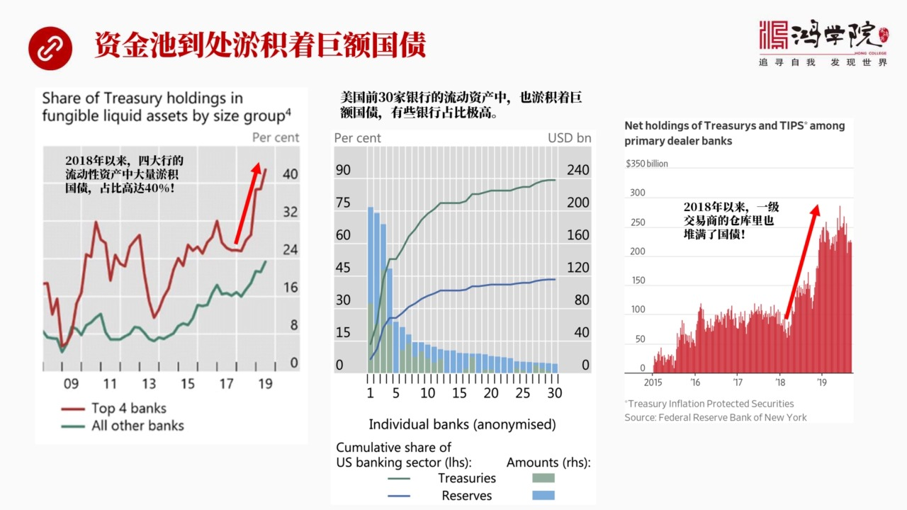

我們主要看左邊那張圖這張圖非常明顯的表示出來了四大銀行出現了問題2018年以來四大銀行的流動性資產流動性我們都知道是巴斯爾協議中間規定每家銀行你要保持有多少高度流動性的資產那麼高度流動資產中即可有現金...

<strong>All subtitles</strong>

> 我們主要看左邊那張圖這張圖非常明顯的表示出來了四大銀行出現了問題2018年以來四大銀行的流動性資產流動性我們都知道是巴斯爾協議中間規定每家銀
> 行你要保持有多少高度流動性的資產那麼高度流動資產中即可有現金也可以有國債也可以有比如說NBS或者美國政府的很多債券高政府擔保了一些債券所謂高
> 質量這種資產都是屬於流動性資產在流動性資產中間現金戰都到了比例是非常非常重要的一般情況之下大家都願意在流動性資產中都願意持有比較多的現金靈活
> 特別是這個經營過程中你要放在你肯定是需要錢的對吧所以在正常情況之下比如說在09年以前我們看到美國的各大銀行基本上都保持這個比如說你持有的這個
> 國債這種也算是流動性資產但是比例都在8%以下很低但是我們看到2018年以後四大銀行這個紅線所代表四大銀行他們所持有的國債的比例出現了驚人的跳
> 升也就是從20%多一下子飆升到了40%這就像學官裡面流動的學業中間突然沉澱出了很多國債的這種尼莎就好像學官裡面成績了很多脂肪它是流不動的所以
> 由於這些大銀行中間把他流動性資產中間40%的比例都配置成了國債那麼剩下你只有剩下一部分中間的某一些比例才能向回購市場提供所以回購市場的資金的
> 源頭受到了極大的削弱那麼如果我們再看美國前30大銀行就是中間這張圖我們也可以看到國債所佔有了比重越來越高其中你看這個從第一家到第三家中間我們
> 如果觀察綠色的部分就是國債它的在它流動性資產中國債所佔的比例你會看到有好多銀行這個國債基本上就是佔了大部分好幾家銀行都出現這個問題不僅是四大
> 而且30大銀行中間有相當多的銀行都出現了國債佔有的比重太高的問題所以它就影響到了整個銀行體系我們再看右邊這張圖這張圖剛才我們說的是銀行體系和
> 四大銀行右邊這張圖說的是一級交易商一級交易商中間當然有大銀行但是還有很多是投資銀行就是所謂的券商這些一共有24家還有一些國外的包括歐洲的一些
> 公司他們叫一級交易商只有一級交易商才能夠每聯儲做國債的這種交易相當於他們是屬於國債銷售 國債的這種融資回購融資的一個主要的一個最大的這樣的一
> 個管道所以一級交易商中間他們所持有的國債我們可以看到這張圖上再次非常鮮明的顯示書這個趨勢也是從2018年以後一級交易商倉庫裡面的國債開始訓蒙
> 判聲增加了從1000億不到增加到了將近3000億所以我們看到不管是銀行類的金融機構還是這種一級交易商這個類型的金融機構每個金融機構中手中的國
> 債都在訓蒙的上升也就是國債庫存在暴漲也就由於這個國債這個比例太高或者比較高就使得整個資金池面預計的泥沙很多而流動的水就變少了這是回過上出麻煩那個重要原因我們在下一頁為什麼在2018年之後

---

### Slide 10

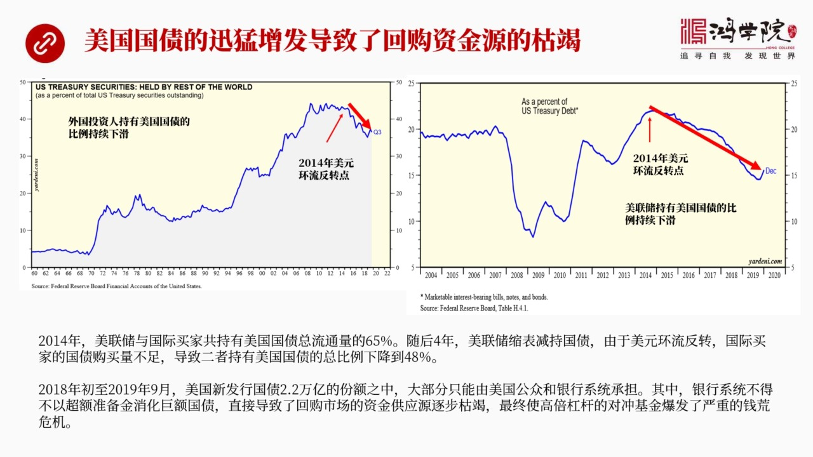

我們看到美國的金融機構會大量的增加國債呢實際上他們是不得以而增加的這張圖我們可以把美國國債的發行和持有的這種持有哪些機構持有多少的比例可以得出一個非常明顯的一個結論來就是實際上美國國債從2018年之後...

<strong>All subtitles</strong>

> 我們看到美國的金融機構會大量的增加國債呢實際上他們是不得以而增加的這張圖我們可以把美國國債的發行和持有的這種持有哪些機構持有多少的比例可以得
> 出一個非常明顯的一個結論來就是實際上美國國債從2018年之後的訓蒙了暴增是導致金融機構被迫預計了很多國債的重要原因也正是這個原因導致了回構市
> 場可流動的那些資金變得越來越少最後使得高倍槓槓的這些對重基金陷入了前延荒的危機它是這樣的一個邏輯結構那麼左邊這張圖講的是外國人所持有的美國國
> 債的比例我們可以看到在2014年7月以後外國人所持有的國債比例是在下降的主要外國投資人就是各國央行還有主權基金等等這些人凡是美國以外的投資人
> 所持有的美國國債它的比例是在2014年7月之後不斷下降這個原因我們在第一堂核心課面就專門講過這是美元環流發生逆轉了所以美元由一種大幅度的一種
> 寬鬆2寬鬆123那個時代進入到了一個反轉的一個時期在這個時期之內我們看到各個國家它都越來越沒有能力去購買美國國債因為大家的美元都會變得緊缺於
> 此同時左邊這個右邊這張圖講的是美聯儲美聯儲也是一個國債的大買家2寬鬆嘛主要是印鈔票買國債所以美聯儲也是在2014年美元環流反轉點之後它所持有
> 的美國國債比例也在不斷的下降一直到前荒那麼兩者加在一起就是中央銀行再加上國外的美國國債投資者這兩者加在一起在2014年美元環流反轉之前他們總
> 共持有美國流通的國債總量的65%也就是他們是超級大買家但是隨後幾年我們看到美聯儲開始縮表了然後美元環流在反轉反轉使得國際投資人不容易再得到美
> 元了所以每個國家不管是中國日本還是沙特還是任何一個以前美元吃有了大國現在都在它的胃口都不行了主要原因就是美元環流反轉水中頭領商了你再獲得美元
> 來可能性或者這種難度增加了所以每個國家它都會縮減對於美國國債需求這是導致了到2019年前方爆發之前外國投資人加上美聯儲美聯儲還在縮表在賣出國
> 債實際上它持有實在下降了最大的買家第一大買家第二大買家現在都不行了所以導致了中央銀行和外國投資人美聯儲和外國投資人所以持有美國國債的比例從6
> 5%下降到了48%這個比例下降是非常大的因為你不僅要考慮比例百分比這個百分點的數量還得考慮美國國債的增發的量這個量非常的驚人而且一年比年大你
> 這個比例下降了這麼多同時每年增發了這麼多國債那就意味著有更多的資金更多的這種國債不得不憂美國國內的這些人來承擔你比如說從2018年為什麼20
> 18年是個非常重要的實驗管點2018年初就是因為我們看到了剛才我們說的好幾個現象都跟這個實驗年有關包括美國的回購市場資金員斯大銀行的這種它的
> 國債比例上升還包括這個移籍交易商的庫存上升都是源於2018年年初一個重要原因就是2018年年初一直到2019年9月這個前荒爆發這段時間美國新
> 增的國債數量驚人達到了2.2萬億美元也就是一年0.9月的時間出現了新增國債2.2萬億什麼原因特朗普發錢特朗普發紅包他不是要搞減稅嗎減稅並沒有
> 自己經濟就是稅收並沒有大幅增加但是你這個國債就上去了2.2萬億出來之後如果美聯儲你退出了你從買家變成了賣家外國投資人也沒有這麼大胃口了那麼所
> 有新增國債的一個相當大的比例就壓給了美國國內的公眾還有銀行體系那麼銀行體系不得不以超準沒經來消化這些巨額國債的增發這是直接導致回構是它的資金
> 源枯竭的重要原因也正是這個原因導致了一定時間之後回構是必然會崩盤也就是高倍槓耳10倍以上的一些對通基金一定是會出大問題的我們再看下一頁這就要說到美聯儲

---

### Slide 11

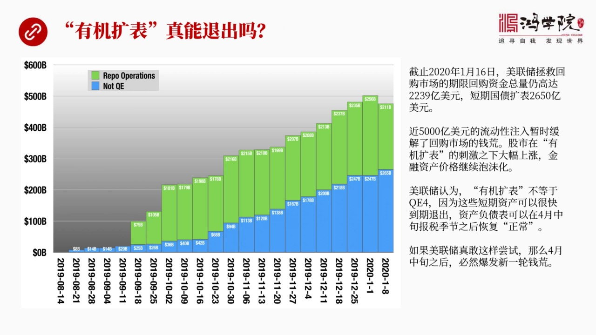

現在有機扣表是不是真能退出來是不是他真的所說的是有機還是沒有辦法一定會變成永久性的扣表我們從這張圖上可以看到美聯儲在前方之後綠色的代表是回構這個回構的量越來越大現在這個回構的量到2020年1月16號這...

<strong>All subtitles</strong>

> 現在有機扣表是不是真能退出來是不是他真的所說的是有機還是沒有辦法一定會變成永久性的扣表我們從這張圖上可以看到美聯儲在前方之後綠色的代表是回構
> 這個回構的量越來越大現在這個回構的量到2020年1月16號這個回構期限回構期限回構就是除了一天這種短期這個回構之外我給他兩星期或者四個星期或
> 者六個星期這樣一個有時間比較長的這種回構還他的漁額是多少2239億這還不算我們剛剛所說的單天的這種回構量那麼藍色這部分是什麼就是美聯儲的這個
> 買個短期的國債那麼這兩者相加這兩者相加的總規模大概是5000億接近5000億這說明一個問題說明回構市場上存在一個巨大的資金的黑洞這個黑洞如果
> 美聯儲不拿5000億資金去填的話其實除了5000億還有其他的資金那麼美聯儲如果不從資產負在表上了這種5000億的這個流動性注入的話整個這個體
> 系就會爆發嚴重的前方這個利率就非常天老那麼大量金融機構就會破產所以正式由於美聯儲注入了這5000億我們才看到了回構市場被這個他的金孔情緒被展
> 示還解了那麼由於金融市場上很多人認為美聯儲這搞的就是QE所以股市開始大漲金融市場的這些資產價格這種泡沫可以持續那麼美聯儲認為有機扩表不等於Q
> E一個重要的原因就是這些短期持有的不管是回構還是短期國債12月之內到期的都會陸續的在短時間之內到期到期我只要不續不滾鬥這不就沒了嗎從資產負在
> 表上就消失了那麼與此同時這個當然像對應的這些資金也就沒了那麼這樣一來呢在他們看來資產負在表是完全可以恢復正常的那麼市場中現在預測美聯儲這個扩
> 表行為大概到4月中旬4月中旬是每年大家交稅的那個月份4月15號報稅會需要大量資金所以美聯儲這個操作會持續到4月中4月中之後有人美聯儲自己也認
> 為4月中因之後這個市場不用我們扶持了我一放手那麼這些短期債到期之後他就作廢了資產負在表自動會回復到以前的狀態這是一個他們一個主要的一種判斷當
> 然在我看如果美聯儲真的要讓他這個讓這5000億4月中旬之後逐漸到期退役的話那麼他要珍感這麼做那麼4月中旬以後就必然會發生下一輪非常嚴重的前方這是無可避免的事什麼原因我們需要看一下下一頁從下頁這張表

---

### Slide 12

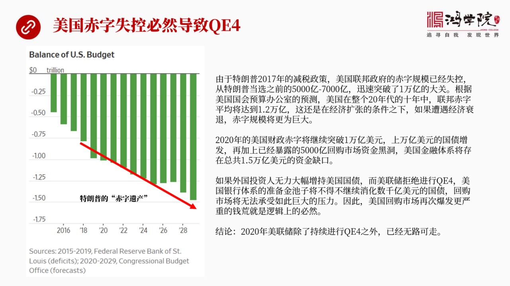

我們可以看到其實真正導致回購市場資金越來越這個資金員越來越哭結的根本原因是國債的超發美國老說我們這個印發國債沒有成本這種成本會體驗在回購上會體驗在回購對於其他金融市場的影響上因為回購是整個流動性的心臟...

<strong>All subtitles</strong>

> 我們可以看到其實真正導致回購市場資金越來越這個資金員越來越哭結的根本原因是國債的超發美國老說我們這個印發國債沒有成本這種成本會體驗在回購上會
> 體驗在回購對於其他金融市場的影響上因為回購是整個流動性的心臟他要出問題全美國的金融市場都會完蛋那麼你要管理其實美聯儲現在中心的目標就叫管理回
> 購市場管理回購市場如果壓不住這個短期利率的話那其他市場都崩了你想管住這個市場怎麼管必須要給他足夠了流動性而我們剛剛所說的你如果這個源頭這邊資
> 金員這邊如果這個水量在逐漸的哭結你就沒有辦法就是中央銀行的干預是撤不出來的你注入短期流動性是退不出來的為什麼退不出來我們看看美國未來10年整
> 個20年代10年的它的國債的發信量你就會知道它為什麼退不出來由於克朗普上台之後2017年開始搞減稅搞減稅之後實際上美國聯邦政府的赤字已經失它
> 這個赤字規模已經失去控制了已經失控了在特朗普當選之前這個奧巴馬時代每年美國的國債赤字就是5000多億上下現在好家貨動不動就上萬億如果我們看發
> 展趨勢從2018年以後這個美國赤字的這種預算就是國會預算辦公室做了這個測算做了這個預測你會看到2018年以後這個美國國債美國財政赤字的規模一
> 年比年大到了2018年以後將會達到1.5萬億美元所以這未來整個十年它的國債發信量平均至少是1.2萬億這麼大的赤字這些赤字都得靠國債所以你這國
> 債的這個發信量規模會比我們看到2018年19年的那個時代還要厲害那麼這就存在一個問題了如果說你現在這個我們看到2020年赤字的規模還將突破1
> 萬億這就是1萬億的需要現金的地方另外還有什麼呢還有現在已經暴露出來的回購上還有5千億美元中央銀行短期注入這些救援資金你如果把它撤出來就是4月
> 之後把它撤出來那又出現了5千億的資金缺口加在一起美國的金融體系在2020年就會出現1.5萬億的巨額資金缺口我們涉嫌一下美聯儲要真要這麼幹的話
> 這個資金缺口怎麼賭啊如果外國投資人在我看來外國投資人現在都沒有胃口再去大幅增持美國國債中國日本這些國家都沒細包括中東的沙特這些外匯資產都在都
> 在搖搖欲對所以他們沒有能力在大幅增持美國國債那麼美聯儲如果不搞量寬鬆也就是他拒絕去作為國債的買主印鈔票去買國債的話在這種情況之下會出現什麼問
> 題那麼在這種情況之下就會出現美國的銀行體系不得不再次大規模消化數千億美元的國債新增國債再加上你以前還有5千億流動性資金的缺口匯國市場還有5千
> 億的黑洞那麼銀行機構拿什麼錢來填這麼大的苦龍所以如果說4月份美聯儲停止就是讓他資產費的表重因回落的話那就必然會爆發更加嚴重的前方這是邏輯上的
> 一種必然所以在我來看不管美聯儲現在怎麼生成他要讓他搞有機擴表然後要退出在我看來他是根本不可能退出非但不可能退出還必須要擴大規模也就是2020
> 年美聯儲除了持續進行兩岸寬鬆四之外沒有其他路可走這是一種必然如果不是這樣如果你這個不搞兩岸寬鬆四那麼我們必然看到嚴重的進行危機爆發只有這兩可
> 能所以在我看起來美聯儲只能選擇在2020年進行大規模兩岸寬鬆四好我們再看下野這就涉及到會對問題了

---

### Slide 13

我們在2019年12月我們的年重勝點上我專門講到了2020年是美元貶值的一個它是美元貶值的一個週期貶值是主學率原因合在原因其實就是你把美國的回構上看明白了你就把美聯儲的可選擇的政策的可選項看明白了也就...

<strong>All subtitles</strong>

> 我們在2019年12月我們的年重勝點上我專門講到了2020年是美元貶值的一個它是美元貶值的一個週期貶值是主學率原因合在原因其實就是你把美國的
> 回構上看明白了你就把美聯儲的可選擇的政策的可選項看明白了也就是你為了拯救回構市場你必然會缺這麼多資金你缺這麼多資金又沒有地方去找你就只能印超
> 票增加增加你的自然負來表給銀行提供資金否則這個市場就崩了既然如此那麼美國搞兩岸寬鬆搞兩岸寬鬆四就是一種必然的選擇它沒有其他的辦法如果你搞兩岸
> 寬鬆四我們就會看到美國的這個貨幣就是美元它的匯率必然會下跌這是我們去年年底在我們的年中生涯中給同學們介紹過的當然我們現在看到從那之後一直到現
> 在美元對人民幣之間的匯率我們已經非常清楚地看到人民幣大概從7.1幾然後升值到現在的6.8說明什麼說明只要我們把金融市場中最核心的部分給分析套
> 把這個資金的缺口量給孤算對你大概就知道美聯儲它只能採取什麼措施而它的貨幣政策一旦採取兩岸寬鬆那就必然會導致美元匯率下跌所以各個國家新市場國家
> 這些貨幣都會在2020年有一次喘息的機會就是有一個小楊春這也會給中國提供一個非常大的貨幣寬鬆的餘地因為2020年中國要保留這是一定要保的現在
> 再加上這個武漢肺炎這個病所以這個保溜的壓力會非常的大人民幣的匯率其實要為保溜要保價互航其實匯率應該對中耳眼應該是下跌更有利但是由於美元今年是
> 下跌的主要的一種趨勢這就迫使人民幣向人民美元它的形式就會變強再加上中美的貿易談判也會影響因為匯率問題就是中美談判的一個核心領域之一所以如果是
> 中美第二輪談判第一輪已經加上了第二輪談判如果談得順那麼我們基本上可以判斷人民幣對美元將會保持比較強勢的狀態當然如果不順為什麼不順就是我們說到
> 過我們直播課裡面曾經講過這個問題不順的原因就是中美談判第一輪達成了協議但是重裁機制這是個複雜而且沒有經驗的東西因為它會睡到司法主權知識產權保
> 護轉移等的多方面的細節這個問題在執行過程中有可能會出現個錢所以雙方談判說不定到一定程度還會再次談判談判也就是臨時性的再次再次出現貿易上的對抗
> 這種可能性都存在如果是這樣的話那我相信中國為了保這個保留它一定會要刺激出口那刺激出口就需要一個較弱勢的人民幣所以從大的這種自然趨勢如果不發生
> 重大的政治上的這種意外事件中美貿易戰不是又打起來了在這樣的情況之下那麼美元將會走弱而人民幣相對於美元會稍微強一些穩中就是穩中略強當然貿易戰如
> 果又開打這就令人別亂了那中國可能會用一種讓人民幣貶值來加速出口來保留的這樣一種方式來應對貿易戰的持續或者叫深入或者叫升級所以總的來說美元的匯
> 率應該是一個貶值的這就是我們判斷量往寬鬆政策和匯率之間的關係的一個邏輯結構那麼我們再看下一個下一頁這堂課設計到了

---

### Slide 14

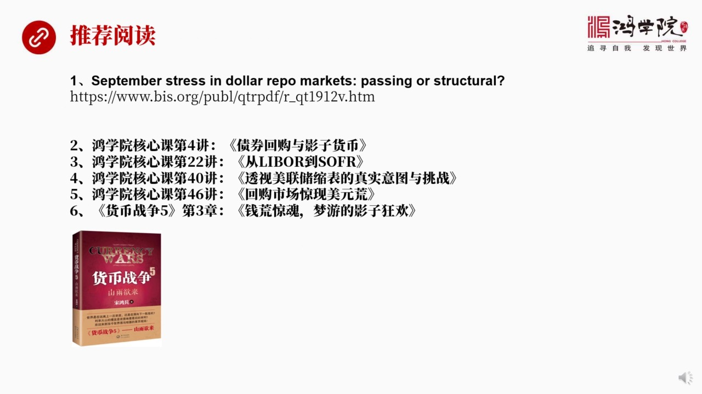

一些基本的我們以前的核心課還設計到了國際侵害銀行的這篇文章如果大家有興趣的話可以仔細讀一下這篇文章這篇文章不長但是細細量超大那除了這個之外就是我們的貨幣戰爭舞貨幣戰爭舞中間我有一張第三張專門講回構是前...

<strong>All subtitles</strong>

> 一些基本的我們以前的核心課還設計到了國際侵害銀行的這篇文章如果大家有興趣的話可以仔細讀一下這篇文章這篇文章不長但是細細量超大那除了這個之外就
> 是我們的貨幣戰爭舞貨幣戰爭舞中間我有一張第三張專門講回構是前荒還有影子銀行 影子貨幣這一套理論體系除此之外還有我們一些核心課講回構市場 講影
> 子貨幣 講利率 講每年出縮表回構出現了美元荒等等這些課程如果大家把它系統性地看起來之後一定會加深對本南課的那個理解好 最後就是我們看下一頁

---

### Slide 15

下一頁就是對於大家來說我覺得最重要的什麼呢就是在學習金融分析金融市場的時候最重要的就是要學會怎麼去抓那種關鍵信息因為信息上太大每個人都容易信息超載如果你抓不住主要信息關鍵信息的話那麼其實就信息再多非但...

<strong>All subtitles</strong>

> 下一頁就是對於大家來說我覺得最重要的什麼呢就是在學習金融分析金融市場的時候最重要的就是要學會怎麼去抓那種關鍵信息因為信息上太大每個人都容易信
> 息超載如果你抓不住主要信息關鍵信息的話那麼其實就信息再多非但不是正價值反而是個負面價值這就是為什麼我們需要建立有組織的知識有組織的知識永遠比
> 零散的那些知識要有價值如何它能做到這一點需要我們現在就學會構建自己的知識體系最後希望大家能夠在紅穴裡面打贏人生的貨幣戰爭好 今天課就上到這裡我們下課堂再見謝謝

---
